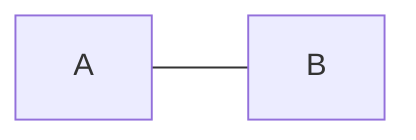

# 改变文本的样式
*强调文本*   |   _强调文本_

**加粗文本**   |   __加粗文本__

==标记文本==

~~删除文本~~

# 引用文本

H~2~O --->有下标的书写方法

2^10^ --->有上标的书写方法

空格：&ensp;    -----> 空格：你&ensp;好

首行缩进：&ensp;&ensp;    ----->&ensp;&ensp; 我自横刀向天笑

多行换行：   ---->你好吗？ 

# 改变字体的颜色
书写格式： $\color{设置颜色} {文本内容} $

设置颜色：有三种表现形式
1.直接用对应颜色的英文表示，如Blue（纯蓝）、Red（纯红）、Pink（粉红）等（首字母大小写都行）。
2.rgb三原色(红绿蓝)：rgb(0,0,0)（黑色） 每一项0-255变化，全0为黑，全255为白。
3.十六进制表示法：如#000000(黑色)、#ffffff(白色)、#008000（绿色）

一句话单个颜色
$\color{red} {Red} $
效果：

一句话多个颜色，则用\隔开，其中，颜色代码可以随意更换
$\color{ Pink} {我} \color{rgb(0,248,0)} {就}\color{#008000} {喜}\color{Purple} {欢}\color{Indigo} {每}\color{DarkSlateBlue} {个}\color{Blue} {颜}\color{DarkBlue} {色}\color{SlateGray} {都}\color{ CadetBlue} {不}\color{PaleTurquoise} {同}$

# 流程图

# 表格

<table>
<capital>RISC</capital>
<tr>
<th>普通表头</th>
<th align="right"><i>斜体表头而且居右</th>
<th colspan=2>表头横向合并单元格</th>
<td width="80px">限制列宽为80px超出会自动换行</td>
</tr>
<tr>
<th>左边也可以有表头</th>
<td bgcolor=#ffffcc>涂个颜色</td>
<td><mark>高亮文本</mark>但不全高亮</td>
<td><b>有时候加粗</b><i>有时候斜体</i></td>
<td width="20px">20px小于80px服从80px列宽命令无效</td>
</tr>
<tr>
<td>表头不一定是一整行或者一整列的</td>
<td rowspan=2>纵向合并单元格要注意 下一行少一个单元格 字太多必要时我会换行</td>
<td rowspan=2 colspan=2>单元格也可以从两个方向合并</td>
<td rowspan=2 width="10%">百分比和像素是可以混用的具体服从哪个取决于哪个大</td>
</tr>
<td align="left"> 简单做个居左 </td>
</tr>
</table>
<table>

