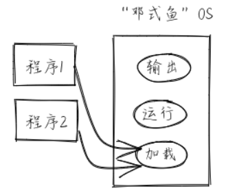

# 应用程序与基本执行环境
## 应用程序执行环境与基本操作平台
### 执行应用程序
我们先在Linux上开发并运行一个简单的 “Hello, world” 应用程序，看看一个简单应用程序从开发到执行的全过程。
```shell
cargo new os --bin
```
我们加上了 --bin 选项来告诉 Cargo 我们创建一个可执行程序项目而不是函数库项目。此时，项目的文件结构如下：
```shell
tree os
os
├── Cargo.toml
└── src
    └── main.rs
1 directory, 2 files
```


其中 Cargo.toml 中保存着项目的配置，包括作者的信息、联系方式以及库依赖等等。显而易见源代码保存在 src 目录下，目前为止只有 main.rs 一个文件，让我们看一下里面的内容：

最简单的 Rust 应用
```rs
fn main() {
    println!("Hello, world!");
}

```

进入 os 项目根目录下，利用 Cargo 工具即可一条命令实现构建并运行项目：
```shell
cargo run
   Compiling os v0.1.0 (/home/shinbokuow/workspace/v3/rCore-Tutorial-v3/os)
    Finished dev [unoptimized + debuginfo] target(s) in 1.15s
     Running `target/debug/os`
Hello, world!

```

如我们预想的一样，我们在屏幕上看到了一行 Hello, world! 。
### 应用程序执行环境
如下图所示，现在通用操作系统（如 Linux 等）上的应用程序运行需要下面多层次的执行环境栈的支持，图中的白色块自上而下（越往下则越靠近底层，下层作为上层的执行环境支持上层代码的运行）表示各级执行环境，黑色块则表示相邻两层执行环境之间的接口。


我们的应用位于最上层，它可以通过调用编程语言提供的标准库或者其他三方库对外提供的函数接口，使得仅需少量的源代码就能完成复杂的功能。但是这些库的功能不仅限于此，事实上它们属于应用程序执行环境(Execution Environment) 的一部分。在我们通常不会注意到的地方，这些软件库还会在执行应用之前完成一些初始化工作，并在应用程序执行的时候对它进行监控。我们在打印Hello, world!时使用的println!
宏正是由Rust标准库std提供的。

从操作系统内核的角度看来，它上面的一切都属于用户态软件，而它自身属于内核态软件。无论用户态应用如何编写，是手写汇编代码，还是基于某种高级编程语言调用其标准库或三方库，某些功能总要直接或间接的通过操作系统内核提供的系统调用(SystemCall)来实现。因此系统调用充当了用户和内核之间的边界。内核作为用户态软件的执行环境，它不仅要提供系统调用接口，还需要对用户态软件的执行进行监控和管理。
###  目标平台与目标三元组
对于一份用某种编程语言实现的应用程序源代码而言，编译器在将其通过编译、链接得到可执行文件的时候需要知道程序要在哪个平台(Platform)上运行。这里平台主要是指CPU类型、操作系统类型和标准运行时库的组合。从上面给出的应用程序执行环境栈可以看出：
• 如果用户态基于的内核不同，会导致系统调用接口不同或者语义不一致；
• 如果底层硬件不同，对于硬件资源的访问方式会有差异。特别是如果ISA不同，则向软件提供的指令集和寄存器都不同。

它们都会导致最终生成的可执行文件有很大不同。需要指出的是，某些编译器支持同一份源代码无需修改就可编译到多个不同的目标平台并在上面运行。这种情况下，源代码是跨平台的。而另一些编译器则已经预设好了一个固定的目标平台。
##  移除标准库依赖
###  移除 println! 宏
println! 宏所在的Rust标准库std需要通过系统调用获得操作系统的服务，而如果要构建运行在裸机上的操作系统，就不能再依赖标准库了。所以我们第一步要尝试移除println!宏及其所在的标准库。

由于后续实验需要rustc编译器缺省生成RISC-V64的目标代码，所以我们首先要给rustc添加一个target: riscv64gc-unknown-none-elf 。这可通过如下命令来完成：
```shell
rustup target add riscv64gc-unknown-none-elf
```
然后在os目录下新建.cargo目录，并在这个目录下创建config文件，并在里面输入如下内容：
```toml
# os/.cargo/config
 [build]
 target = "riscv64gc-unknown-none-elf"
```

这会对于Cargo工具在os目录下的行为进行调整：现在默认会使用riscv64gc作为目标平台而不是原先的默认x86_64-unknown-linux-gnu。
###  提供 panic_handler 功能应对致命错误
我们重新编译简单的os程序，之前的println宏缺失的错误消失了，但又出现了如下新的编译错误：
```shell
 $ cargo build
 Compiling os v0.1.0 (/home/shinbokuow/workspace/v3/rCore-Tutorial-v3/os)
 error: `#[panic_handler]` function required, but not found
```

在使用Rust编写应用程序的时候，我们常常在遇到了一些无法恢复的致命错误（panic），导致程序无法继续向下运行。这时手动或自动调用panic!宏来打印出错的位置，让软件能够意识到它的存在，并进行一些后续处理。
在标准库std中提供了关于panic!宏的具体实现，其大致功能是打印出错位置和原因并杀死当前应用。但本章要实现的操作系统不能使用还需依赖操作系统的标准库std，而更底层的核心库core中只有一个panic!宏的空壳，并没有提供panic!宏的精简实现。因此我们需要自己先实现一个简陋的panic处理函数.
**注解:** #[panic_handler]
#[panic_handler] 是一种编译指导属性，用于标记核心库core中的panic!宏要对接的函数（该函数实现对致命错误的具体处理）。该编译指导属性所标记的函数需要具有fn(&PanicInfo)-> !函数签名，函数可通过PanicInfo数据结构获取致命错误的相关信息。这样Rust编译器就可以把核心库core中的panic!宏定义与#[panic_handler]指向的panic函数实现合并在一起，使得no_std程序具有类似std库的应对致命错误的功能。

我们创建一个新的子模块lang_items.rs实现panic函数，并通过#[panic_handler]属性通知编译器
用panic 函数来对接panic!宏。为了将该子模块添加到项目中，我们还需要在main.rs的#![no_std]的下方加上mod lang_items;，相关知识可参考Rust模块编程：
```rs
 // os/src/lang_items.rs
 use core::panic::PanicInfo;
 #[panic_handler]
 fn panic(_info: &PanicInfo)-> ! {
 loop {}
 }
```

在把panic_handler配置在单独的文件os/src/lang_items.rs后，需要在os/src/main.rs文件中添加以下内容才能正常编译整个软件：
```rs
// os/src/main.rs
 #![no_std]
 mod lang_items;
 // ... other code

```
### 移除 main 函数
我们再次重新编译简单的os程序，之前的#[panic_handler]函数缺失的错误消失了，但又出现了如下新的编译错误：.. error:
```rs
 .. code-block::
 $ cargo build
 Compiling os v0.1.0 (/home/shinbokuow/workspace/v3/rCore-Tutorial-v3/os)
 error: requires `start` lang_item
```
编译器提醒我们缺少一个名为start的语义项。我们回忆一下，之前提到语言标准库和三方库作为应用程序的执行环境，需要负责在执行应用程序之前进行一些初始化工作，然后才跳转到应用程序的入口点开始执行。事实上start语义项代表了标准库std在执行应用程序之前需要进行的一些初始化工作。由于我们禁用了标准库，编译器也就找不到这项功能的实现了。

最简单的解决方案就是压根不让编译器使用这项功能。我们在main.rs的开头加入设置#![no_main]告诉编译器我们没有一般意义上的main函数，并将原来的main函数删除。在失去了main函数的情况下，编译器也就不需要完成所谓的初始化工作了。


## 编译运行
```shell
# 编译
cargo build --release
# 运行
qemu-system-riscv64     -machine virt     -nographic     -bios ../bootloader/rustsbi-qemu.bin     -device loader,file=target/riscv64gc-unknown-none-elf/release/os,addr=0x80200000
```

## 内核指令
### 程序内存布局与编译流程
在我们将源代码编译为可执行文件之后，它就会变成一个看似充满了杂乱无章的字节的一个文件。但我们知道这些字节至少可以分成代码和数据两部分，在程序运行起来的时候它们的功能并不相同：代码部分由一条条可以被 CPU 解码并执行的指令组成，而数据部分只是被 CPU 视作可读写的内存空间。事实上我们还可以根据其功能进一步把两个部分划分为更小的单位： 段 (Section) 。不同的段会被编译器放置在内存不同的位置上，这构成了程序的 内存布局 (Memory Layout)。一种典型的程序相对内存布局如下所示：


- 已初始化数据段保存程序中那些已初始化的全局数据，分为 .rodata 和 .data 两部分。前者存放只读的全局数据，通常是一些常数或者是 常量字符串等；而后者存放可修改的全局数据。

- 未初始化数据段 .bss 保存程序中那些未初始化的全局数据，通常由程序的加载者代为进行零初始化，即将这块区域逐字节清零；

- 堆 （heap）区域用来存放程序运行时动态分配的数据，如 C/C++ 中的 malloc/new 分配到的数据本体就放在堆区域，它向高地址增长；

- 栈 （stack）区域不仅用作函数调用上下文的保存与恢复，每个函数作用域内的局部变量也被编译器放在它的栈帧内，它向低地址增长。

**编译流程**
从源代码得到可执行文件的编译流程可被细化为多个阶段（虽然输入一条命令便可将它们全部完成）：
1. 编译器(Compiler) 将每个源文件从某门高级编程语言转化为汇编语言，注意此时源文件仍然是一个ASCII 或其他编码的文本文件；
2. 汇编器(Assembler) 将上一步的每个源文件中的文本格式的指令转化为机器码，得到一个二进制的目标文件(Object File)；
3. 链接器(Linker) 将上一步得到的所有目标文件以及一些可能的外部目标文件链接在一起形成一个完整的可执行文件。

汇编器输出的每个目标文件都有一个独立的程序内存布局，它描述了目标文件内各段所在的位置。而链接器所做的事情是将所有输入的目标文件整合成一个整体的内存布局。在此期间链接器主要完成两件事情：
• 第一件事情是将来自不同目标文件的段在目标内存布局中重新排布。如下图所示，在链接过程中，分别来自于目标文件1.o和2.o段被按照段的功能进行分类，相同功能的段被排在一起放在拼装后的目标文件output.o中。注意到，目标文件1.o和2.o的内存布局是存在冲突的，同一个地址在不同的内存布局中存放不同的内容。而在合并后的内存布局中，这些冲突被消除。
• 第二件事情是将符号替换为具体地址。这里的符号指什么呢？我们知道，在我们进行模块化编程的时候，每个模块都会提供一些向其他模块公开的全局变量、函数等供其他模块访问，也会访问其他模块向它公开的内容。要访问一个变量或者调用一个函数，在源代码级别我们只需知道它们的名字即可，
这些名字被我们称为符号。取决于符号来自于模块内部还是其他模块，我们还可以进一步将符号分成内部符号和外部符号。然而，在机器码级别（也即在目标文件或可执行文件中）我们并不是通过符号来找到索引我们想要访问的变量或函数，而是直接通过变量或函数的地址。例如，如果想调用一个函数，那么在指令的机器码中我们可以找到函数入口的绝对地址或者相对于当前PC的相对地址。


## 内核第一条指令
###  编写内核第一条指令
首先，我们需要编写进入内核后的第一条指令，这样更方便我们验证我们的内核镜像是否正确对接到Qemu
上。
```asm
 # os/src/entry.asm
 .section .text.entry
 .globl _start
_start:
 li x1, 100
```
实际的指令位于第5行，也即li x1, 100。li是LoadImmediate的缩写，也即将一个立即数加载到某个寄存器，因此这条指令可以看做将寄存器x1赋值为100。第4行我们声明了一个符号_start，该符号指向紧跟在符号后面的内容——也就是位于第5行的指令，因此符号_start的地址即为第5行的指令所在的
地址。第3行我们告知编译器_start是一个全局符号，因此可以被其他目标文件使用。第2行表明我们希望将第2行后面的内容全部放到一个名为.text.entry的段中。一般情况下，所有的代码都被放到一个名为.text的代码段中，这里我们将其命名为.text.entry从而区别于其他.text的目的在于我们想要确保该段被放置在相比任何其他代码段更低的地址上。这样，作为内核的入口点，这段指令才能被最先执行。
接着，我们在main.rs中嵌入这段汇编代码，这样Rust编译器才能够注意到它，不然编译器会认为它是一个与项目无关的文件：
```rs
//os/src/main.rs
#![no_std]
#![no_main]

mod lang_item;

usecore::arch::global_asm;
global_asm!(include_str!("entry.asm"));
```

第8行，我们通过include_str!宏将同目录下的汇编代码entry.asm转化为字符串并通过global_asm!宏嵌入到代码中。

### 调整内核的内存布局
由于链接器默认的内存布局并不能符合我们的要求，为了实现与Qemu正确对接，我们可以通过链接脚本(LinkerScript)调整链接器的行为，使得最终生成的可执行文件的内存布局符合Qemu的预期，即内核第一条指令的地址应该位于0x80200000。我们修改Cargo的配置文件来使用我们自己的链接脚本os/src/linker.ld而非使用默认的内存布局：
```config
//os/.cargo/config
[build]
target ="riscv64gc-unknown-none-elf"

[target.riscv64gc-unknown-none-elf]
rustflags= [
"-Clink-arg=-Tsrc/linker.ld", "-Cforce-frame-pointers=yes"
]
```

链接脚本os/src/linker.ld如下：
```ld
OUTPUT_ARCH(riscv)
ENTRY(_start)
BASE_ADDRESS =0x80200000;

SECTIONS
{
 . = BASE_ADDRESS;
 skernel = .;

 stext= .;
 .text:{
 *(.text.entry)
 *(.text.text.*)
 }
 
 . = ALIGN(4K);
 etext= .;
 srodata = .;
 .rodata:{
 *(.rodata .rodata.*)
 *(.srodata .srodata.*)
 }
 
 . = ALIGN(4K);
 erodata = .;
 sdata= .;
 .data:{
 *(.data.data.*)
 *(.sdata.sdata.*)
 }
 
 . = ALIGN(4K);
 edata= .;
 .bss:{
 *(.bss.stack)
 sbss=.;
 *(.bss.bss.*)
 *(.sbss.sbss.*)
 }
 
 . = ALIGN(4K);
 ebss= .;
 ekernel = .;
 
 /DISCARD/ :{
 *(.eh_frame)
 }
}
```

第1行我们设置了目标平台为riscv；第2行我们设置了整个程序的入口点为之前定义的全局符号_start；第3行定义了一个常量BASE_ADDRESS为0x80200000，也就是我们之前提到内核的初始化代码被放置的地址；
从第5行开始体现了链接过程中对输入的目标文件的段的合并。其中.表示当前地址，也就是链接器会从它指向的位置开始往下放置从输入的目标文件中收集来的段。我们可以对.进行赋值来调整接下来的段放在哪里，也可以创建一些全局符号赋值为.从而记录这一时刻的位置。我们还能够看到这样的格式：
```s
.rodata: {
 *(.rodata)
 }
```

冒号前面表示最终生成的可执行文件的一个段的名字，花括号内按照放置顺序描述将所有输入目标文件的哪些段放在这个段中，每一行格式为<ObjectFile>(SectionName)，表示目标文件ObjectFile的名为SectionName的段需要被放进去。我们也可以使用通配符来书写<ObjectFile>和<SectionName>分别表示可能的输入目标文件和段名。因此，最终的合并结果是，在最终可执行文件中各个常见的段.text,.rodata.data,.bss从低地址到高地址按顺序放置，每个段里面都包括了所有输入目标文件的同名段，且每个段都有两个全局符号给出了它的开始和结束地址。
第12行我们将包含内核第一条指令的.text.entry段放在最终的.text段的最开头，同时注意到在最终内存布局中代码段.text又是先于任何其他段的。因为所有的段都从BASE_ADDRESS也即0x80200000开始放置，这就能够保证内核的第一条指令正好放在0x80200000从而能够正确对接到Qemu上。

### 手动加载内核可执行文件
上面得到的内核可执行文件完全符合我们对于内存布局的要求，但是我们不能将其直接提交给Qemu，因为它除了实际会被用到的代码和数据段之外还有一些多余的元数据，这些元数据无法被Qemu在加载文件时利用，且会使代码和数据段被加载到错误的位置。如下图所示：

图中，红色的区域表示内核可执行文件中的元数据，深蓝色的区域表示各个段（包括代码段和数据段），而浅蓝色区域则表示内核被执行的第一条指令，它位于深蓝色区域的开头。图示的上半部分中，我们直接将内核可执行文件os提交给Qemu，而Qemu会将整个可执行文件不加处理的加载到Qemu内存的0x80200000处，由于内核可执行文件的开头是一段元数据，这会导致Qemu内存0x80200000处无法找到内核第一条指令，也就意味着RustSBI无法正常将计算机控制权转交给内核。相反，图示的下半部分中，将元数据丢弃得到的内核镜像os.bin被加载到Qemu之后，则可以在0x80200000处正确找到内核第一条指令。
使用如下命令可以丢弃内核可执行文件中的元数据得到内核镜像：
```shell
rust-objcopy--strip-all target/riscv64gc-unknown-none-elf/release/os-O binary
```

## 为内核支持函数调用

### 函数调用与栈

指令集必须给用于函数调用的跳转指令一些额外的能力，而不只是单纯的跳转。在RISC-V架构上，有两条指令即符合这样的特征：
|指令|指令功能|
|-----------|--------------|
|jal rd, imm[20 : 1]| rd ←pc+4  pc ←pc+imm|
| jalr rd, (imm[11 : 0])rs| rd ←pc+4  pc ←rs+imm|


从中可以看出，这两条指令在设置pc寄存器完成跳转功能之前，还将当前跳转指令的下一条指令地址保存在rd寄存器中，即rd←pc+4这条指令的含义。在RISC-V架构中，
通常使用ra寄存器（即x1寄存器）作为其中的rd对应的具体寄存器，因此在函数返回的时候，只需跳转回ra所保存的地址即可。事实上在函数返回的时候我们常常使用一条汇编伪指令(PseudoInstruction)跳转回调用之前的位置：ret。它会被汇编器翻译为jalr x0, 0(x1)，含义为跳转到寄存器ra保存的物理地址，由于x0是一个恒为0的寄存器，在rd中保存这一步被省略。

由于每个CPU只有一套寄存器，我们若想在子函数调用前后保持函数调用上下文不变，就需要物理内存的帮助。确切的说，在调用子函数之前，我们需要在物理内存中的一个区域保存(Save)函数调用上下文中的寄存器；而在函数执行完毕后，我们会从内存中同样的区域读取并恢复(Restore)函数调用上下文中的寄存器。
实际上，这一工作是由子函数的调用者和被调用者（也就是子函数自身）合作完成。函数调用上下文中的寄存器被分为如下两类：
• 被调用者保存(Callee-Saved)寄存器：被调用的函数可能会覆盖这些寄存器，需要被调用的函数来保存的寄存器，即由被调用的函数来保证在调用前后，这些寄存器保持不变；
• 调用者保存(Caller-Saved)寄存器：被调用的函数可能会覆盖这些寄存器，需要发起调用的函数来保存的寄存器，即由发起调用的函数来保证在调用前后，这些寄存器保持不变。

### 调用规范
调用规范(Calling Convention) 约定在某个指令集架构上，某种编程语言的函数调用如何实现。它包括了以下
内容：
1. 函数的输入参数和返回值如何传递；
2. 函数调用上下文中调用者/被调用者保存寄存器的划分；
3. 其他的在函数调用流程中对于寄存器的使用方法。
调用规范是对于一种确定的编程语言来说的，因为一般意义上的函数调用只会在编程语言的内部进行。当一种语言想要调用用另一门编程语言编写的函数接口时，编译器就需要同时清楚两门语言的调用规范，并对寄存器的使用做出调整。
|寄存器组|保存者|功能|
|---------|------------|--------------|
|a0~a7（x10~x17 ）|调用者保存|用来传递输入参数。其中的a0和a1还用来保存返回值。|
|t0~t6( x5~x7,x28~x31 )|调用者保存作为临时寄存器使用，在被调函数中可以随意使用无需保存。|
|s0~s11( x18~x27  ,x8~x9,)|被调用者保存作为临时寄存器使用，被调函数保存后才能在被调函数中使用。|

剩下的5个通用寄存器情况如下：
• zero( x0 ) 之前提到过，它恒为零，函数调用不会对它产生影响；
• ra( x1 ) 是被调用者保存的。被调用者函数可能也会调用函数，在调用之前就需要修改ra使得这次调用能正确返回。因此，每个函数都需要在开头保存ra到自己的栈中，并在结尾使用ret返回之前将其恢复。栈帧是当前执行函数用于存储局部变量和函数返回信息的内存结构。
• sp( x2 ) 是被调用者保存的。这个是之后就会提到的栈指针(StackPointer)寄存器，它指向下一个将要
被存储的栈顶位置。
• fp( s0 )，它既可作为s0临时寄存器，也可作为栈帧指针（FramePointer）寄存器，表示当前栈帧的起
始位置，是一个被调用者保存寄存器。fp指向的栈帧起始位置和sp指向的栈帧的当前栈顶位置形成了
所对应函数栈帧的空间范围。
• gp( x3 ) 和tp( x4 ) 在一个程序运行期间都不会变化，因此不必放在函数调用上下文中。

### 分配并使用启动栈
我们在entry.asm中分配启动栈空间，并在控制权被转交给Rust入口之前将栈指针sp设置为栈顶的位置。
```asm
 # os/src/entry.asm
 .section .text.entry
 .globl _start
_start:
 la sp, boot_stack_top
 call rust_main
 .section .bss.stack
 .globl boot_stack_lower_bound
boot_stack_lower_bound:
 .space 4096 * 16
 .globl boot_stack_top
boot_stack_top:


```

我们在第11行在内核的内存布局中预留了一块大小为4096*16字节也就是64KiB的空间用作接下来要运行的程序的栈空间。在RISC-V架构上，栈是从高地址向低地址增长。因此，最开始的时候栈为空，栈顶和栈底位于相同的位置，我们用更高地址的符号boot_stack_top来标识栈顶的位置。同时，我们用更低地址的符号boot_stack_lower_bound来标识栈能够增长到的下限位置，它们都被设置为全局符号供其他目标文件使用。如下图所示：


回到entry.asm，可以发现在控制权转交给Rust入口之前会执行两条指令，它们分别位于entry.asm的第5、6行。第5行我们将栈指针sp设置为先前分配的启动栈栈顶地址，这样Rust代码在进行函数调用和返回的时候就可以正常在启动栈上分配和回收栈帧了。在我们设计好的内存布局中，这块启动栈所用的内存并不会和内核的其他代码、数据段产生冲突。第6行我们通过伪指令call调用Rust编写的内核入口点rust_main将控制
权转交给Rust代码，该入口点在main.rs中实现：
```rs
// os/src/main.rs
 #[no_mangle]
 pub fn rust_main()-> ! {
 loop {}
 }

```

这里需要注意的是需要通过宏将rust_main标记为#[no_mangle]以避免编译器对它的名字进行混淆，不然在链接的时候，entry.asm将找不到main.rs提供的外部符rust_main从而导致链接失败。在
rust_main 函数的开场白中，我们将第一次在栈上分配栈帧并保存函数调用上下文，它也是内核运行全程中最底层的栈帧。
在内核初始化中，需要先完成对.bss段的清零。这是内核很重要的一部分初始化工作，在使用任何被分配到.bss段的全局变量之前我们需要确保.bss段已被清零。我们就在rust_main的开头完成这一工作，由于控制权已经被转交给Rust，我们终于不用手写汇编代码而是可以用Rust来实现这一功能了：

```rs
//os/src/main.rs
#[no_mangle]
pubfn rust_main()->! {
clear_bss();
loop{}
}

fnbclear_bss(){
extern "C"{
fn sbss();
fn ebss();
}
(sbssas usize..ebss asusize).for_each(|a| {
unsafe{ (aas *mutu8).write_volatile(0)}
});
}
```

在函数clear_bss中，我们会尝试从其他地方找到全局符号sbss和ebss，它们由链接脚本linker.ld给出，并分别指出需要被清零的.bss段的起始和终止地址。接下来我们只需遍历该地址区间并逐字节进行清零即可。
##  基于SBI服务完成输出和关机
### 使用 RustSBI 提供的服务
我们对 RustSBI 的了解仅限于它会在计算机启动时进行它所负责的环境初始化工作，并将计算机控制权移交给内核。但实际上作为内核的执行环境，它还有另一项职责：即在内核运行时响应内核的请求为内核提供服务。当内核发出请求时，计算机会转由 RustSBI 控制来响应内核的请求，待请求处理完毕后，计算机控制权会被交还给内核。从内存布局的角度来思考，每一层执行环境都对应到内存中的一段代码和数据，这里的控制权转移指的是 CPU 从执行一层软件的代码到执行另一层软件的代码的过程。这个过程和函数调用比较像，但是内核无法通过函数调用来请求 RustSBI 提供的服务，这是因为内核并没有和 RustSBI 链接到一起，我们仅仅使用 RustSBI 构建后的可执行文件，因此内核对于 RustSBI 的符号一无所知。事实上，内核需要通过另一种复杂的方式来“调用” 。
```rs
// os/src/main.rs
 mod sbi;
 // os/src/sbi.rs
 use core::arch::asm;
 #[inline(always)]
 fn sbi_call(which: usize, arg0: usize, arg1: usize, arg2: usize)->     usize {
    let mut ret;
    unsafe {
    asm!(
        "ecall",
        inlateout("x10") arg0 => ret,
        in("x11") arg1,
        in("x12") arg2,
        in("x17") which,
    );
 }
 ret
}
```
我们将内核与RustSBI通信的相关功能实现在子模块sbi中，因此我们需要在main.rs中加入mod sbi将该子模块加入我们的项目。在os/src/sbi.rs中，我们首先关注sbi_call的函数签名，which表示请求RustSBI 的服务的类型（RustSBI可以提供多种不同类型的服务），arg0~arg2表示传递给RustSBI的3 个参数，而RustSBI在将请求处理完毕后，会给内核一个返回值，这个返回值也会被sbi_call函数返回。
在sbi.rs中我们定义RustSBI支持的服务类型常量，它们并未被完全用到：
```rs
// os/src/sbi.rs
#![allow(unused)] // 此行请放在该文件最开头
const SBI_SET_TIMER: usize = 0;
const SBI_CONSOLE_PUTCHAR: usize = 1;
const SBI_CONSOLE_GETCHAR:usize= 2;
const SBI_CLEAR_IPI:usize= 3;
const SBI_SEND_IPI:usize= 4;
const SBI_REMOTE_FENCE_I:usize= 5;
const SBI_REMOTE_SFENCE_VMA:usize= 6;
const SBI_REMOTE_SFENCE_VMA_ASID:usize= 7;
const SBI_SHUTDOWN:usize= 8;
```
如字面意思，服务SBI_CONSOLE_PUTCHAR可以用来在屏幕上输出一个字符。我们将这个功能封装成console_putchar函数：
```rs
//os/src/sbi.rs
pub fn console_putchar(c:usize){
    sbi_call(SBI_CONSOLE_PUTCHAR,c,0, 0);
}

```

类似上述方式，我们还可以将关机服务SBI_SHUTDOWN封装成shutdown函数：
```rs
//os/src/sbi.rs
pub fn shutdown()->! {
sbi_call(SBI_SHUTDOWN,0, 0,0);
    panic!("Itshouldshutdown!");
}
```
### 实现格式化输出
onsole_putchar的功能过于受限，如果想打印一行Helloworld!的话需要进行多次调用。能否像本章第一节那样使用println!宏一行就完成输出呢？因此我们尝试自己编写基于console_putchar的println!宏。
```rs
// os/src/main.rs
#[macro_use]
mod console;

// os/src/console.rs
use crate::sbi::console_putchar;
use core::fmt::{self, Write};

struct Stdout;

impl Write for Stdout {
    fn write_str(&mut self, s: &str) -> fmt::Result {
        for c in s.chars() {
            console_putchar(c as usize);
        }
        Ok(())
    }
}

pub fn print(args: fmt::Arguments) {
    Stdout.write_fmt(args).unwrap();
}

#[macro_export]
macro_rules! print {
    ($fmt: literal $(, $($arg: tt)+)?) => {
        $crate::console::print(format_args!($fmt $(, $($arg)+)?));
    }
}

#[macro_export]
macro_rules! println {
    ($fmt: literal $(, $($arg: tt)+)?) => {
        $crate::console::print(format_args!(concat!($fmt, "\n") $(, $($arg)+)?));
    }
}
```
### 处理致命错误
错误处理是编程的重要一环，它能够保证程序的可靠性和可用性，使得程序能够从容应对更多突发状况而不至于过早崩溃。
```rs
// os/src/lang_items.rs
use core::panic::PanicInfo;

#[panic_handler]
fn panic(_info: &PanicInfo) -> ! {
    loop {}
}

```


可以看到，在目前的实现中，当遇到不可恢复错误的时候，被标记为语义项 #[panic_handler] 的 panic 函数将会被调用，然而其中只是一个死循环，会使得计算机卡在这里。借助前面实现的 println! 宏和 shutdown 函数，我们可以在 panic 函数中打印错误信息并关机：
```rs
// os/src/main.rs
#![feature(panic_info_message)]

// os/src/lang_item.rs
use crate::sbi::shutdown;
use core::panic::PanicInfo;

#[panic_handler]
fn panic(info: &PanicInfo) -> ! {
    if let Some(location) = info.location() {
        println!(
            "Panicked at {}:{} {}",
            location.file(),
            location.line(),
            info.message().unwrap()
        );
    } else {
        println!("Panicked: {}", info.message().unwrap());
    }
    shutdown()
}

```

我们尝试打印更加详细的信息，包括 panic 所在的源文件和代码行数。我们尝试从传入的 PanicInfo 中解析这些信息，如果解析成功的话，就和 panic 的报错信息一起打印出来。我们需要在 main.rs 开头加上 #![feature(panic_info_message)] 才能通过 PanicInfo::message 获取报错信息。当打印完毕之后，我们直接调用 shutdown 函数关机。

为了测试我们的实现是否正确，我们将 rust_main 改为：
```rs
// os/src/main.rs
#[no_mangle]
pub fn rust_main() -> ! {
    clear_bss();
    println!("Hello, world!");
    panic!("Shutdown machine!");
}
```


# 批处理系统
批处理系统 (Batch System) ，它可用来管理无需或仅需少量用户交互即可运行的程序，在资源允许的情况下它可以自动安排程序的执行，这被称为“批处理作业”。



## 特权机制
实现特权级机制的根本原因是应用程序运行的安全性不可充分信任。

确保操作系统的安全，对应用程序而言，需要限制的主要有两个方面：
- 应用程序不能访问任意的地址空间
- 应用程序不能执行某些可能破坏计算机系统的指令

为了实现这样的特权级机制，需要进行软硬件协同设计。一个比较简洁的方法就是，处理器设置两个不同安全等级的执行环境：用户态特权级的执行环境和内核态特权级的执行环境。且明确指出可能破坏计算机系统的内核态特权级指令子集，规定内核态特权级指令子集中的指令只能在内核态特权级的执行环境中执行。处理器在执行指令前会进行特权级安全检查，如果在用户态执行环境中执行这些内核态特权级指令，会产生异常。

为了让应用程序获得操作系统的函数服务，采用传统的函数调用方式（即通常的 call 和 ret 指令或指令组合）将会直接绕过硬件的特权级保护检查。所以可以设计新的机器指令：执行环境调用（Execution Environment Call，简称 ecall ）和执行环境返回(Execution Environment Return，简称 eret )）：

- ecall ：具有用户态到内核态的执行环境切换能力的函数调用指令

- eret ：具有内核态到用户态的执行环境切换能力的函数返回指令

### RISC-V 特权级架构
RISC-V 架构中一共定义了 4 种特权级：
**RISC-V 特权级**
|级别|编码|名称|
|-------------|--------------|---------------|
|0|00|用户/应用模式 (U, User/Application)|
|1|01|监督模式 (S, Supervisor)|
|2|10|虚拟监督模式 (H, Hypervisor)|
|3|11|机器模式 (M, Machine)|


白色块表示一层执行环境，黑色块表示相邻两层执行环境之间的接口。这张图片给出了能够支持运行 Unix 这类复杂系统的软件栈。其中操作系统内核代码运行在 S 模式上；应用程序运行在 U 模式上。运行在 M 模式上的软件被称为 监督模式执行环境 (SEE, Supervisor Execution Environment)，如在操作系统运行前负责加载操作系统的 Bootloader – RustSBI。站在运行在 S 模式上的软件视角来看，它的下面也需要一层执行环境支撑，因此被命名为 SEE，它需要在相比 S 模式更高的特权级下运行，一般情况下 SEE 在 M 模式上运行。
 
### RISC-V的特权指令
与特权级无关的一般的指令和通用寄存器 x0 ~ x31 在任何特权级都可以执行。而每个特权级都对应一些特殊指令和 控制状态寄存器 (CSR, Control and Status Register) ，来控制该特权级的某些行为并描述其状态。当然特权指令不仅具有读写 CSR 的指令，还有其他功能的特权指令。
|指令|含义|
|------------------|-----------------|
|sret|从 S 模式返回 U 模式：在 U 模式下执行会产生非法指令异常|
|wfi|处理器在空闲时进入低功耗状态等待中断：在 U 模式下执行会产生非法指令异常|
|sfence.vma|刷新 TLB 缓存：在 U 模式下执行会产生非法指令异常|
|访问 S 模式 CSR 的指令|通过访问 sepc/stvec/scause/sscartch/stval/sstatus/satp等CSR 来改变系统状态：在 U 模式下执行会产生非法指令异常|

## 实现应用程序

应用程序的设计实现要点是：

- 应用程序的内存布局

- 应用程序发出的系统调用
### 应用程序设计
应用程序、用户库（包括入口函数、初始化函数、I/O 函数和系统调用接口等多个 rs 文件组成）放在项目根目录的 user 目录下，它和第一章的裸机应用不同之处主要在项目的目录文件结构和内存布局上：

- user/src/bin/*.rs ：各个应用程序

- user/src/*.rs ：用户库（包括入口函数、初始化函数、I/O 函数和系统调用接口等）

- user/src/linker.ld ：应用程序的内存布局说明。

### 项目结构
我们看到 user/src 目录下面多出了一个 bin 目录。bin 里面有多个文件，目前里面至少有三个程序（一个文件是一个应用程序），分别是：

- hello_world ：在屏幕上打印一行 Hello world from user mode program!

- store_fault ：访问一个非法的物理地址，测试批处理系统是否会被该错误影响

- power ：不断在计算操作和打印字符串操作之间进行特权级切换

批处理系统会按照文件名开头的数字编号从小到大的顺序加载并运行它
每个应用程序的实现都在对应的单个文件中。打开其中一个文件，会看到里面只有一个 main 函数和若干相关的函数所形成的整个应用程序逻辑。


在 lib.rs 中我们定义了用户库的入口点 _start ：
```rs
#[no_mangle]
#[link_section = ".text.entry"]
pub extern "C" fn _start() -> ! {
    clear_bss();
    exit(main());
    panic!("unreachable after sys_exit!");
}
```

第 2 行使用 Rust 的宏将 _start 这段代码编译后的汇编代码中放在一个名为 .text.entry 的代码段中，方便我们在后续链接的时候调整它的位置使得它能够作为用户库的入口。

从第 4 行开始，进入用户库入口之后，手动清空需要零初始化的 .bss 段；然后调用 main 函数得到一个类型为 i32 的返回值，最后调用用户库提供的 exit 接口退出应用程序，并将 main 函数的返回值告知批处理系统。

我们还在 lib.rs 中看到了另一个 main ：
```rs
#[linkage = "weak"]
#[no_mangle]
fn main() -> i32 {
    panic!("Cannot find main!");
}
```
第 1 行，我们使用 Rust 的宏将其函数符号 main 标志为弱链接。这样在最后链接的时候，虽然在 lib.rs 和 bin 目录下的某个应用程序都有 main 符号，但由于 lib.rs 中的 main 符号是弱链接，链接器会使用 bin 目录下的应用主逻辑作为 main 。这里我们主要是进行某种程度上的保护，如果在 bin 目录下找不到任何 main ，那么编译也能够通过，但会在运行时报错。

为了支持上述这些链接操作，我们需要在 lib.rs 的开头加入：
```toml
#![feature(linkage)]
```

### 内存布局
在 user/.cargo/config 中，设置链接时使用链接脚本 user/src/linker.ld 。在其中我们做的重要的事情是：

将程序的起始物理地址调整为 0x80400000 ，三个应用程序都会被加载到这个物理地址上运行；

将 _start 所在的 .text.entry 放在整个程序的开头，也就是说批处理系统只要在加载之后跳转到 0x80400000 就已经进入了 用户库的入口点，并会在初始化之后跳转到应用程序主逻辑；

提供了最终生成可执行文件的 .bss 段的起始和终止地址，方便 clear_bss 函数使用。


### 系统调用
在子模块 syscall 中，应用程序通过 ecall 调用批处理系统提供的接口，由于应用程序运行在用户态（即 U 模式）， ecall 指令会触发 名为 Environment call from U-mode 的异常，并 Trap 进入 S 模式执行批处理系统针对这个异常特别提供的服务代码。由于这个接口处于 S 模式的批处理系统和 U 模式的应用程序之间，这个接口可以被称为 ABI 或者系统调用。现在我们不关心底层的批处理系统如何提供应用程序所需的功能，只是站在应用程序的角度去使用即可。

在本章中，应用程序和批处理系统之间按照 API 的结构，约定如下两个系统调用：

```rs
/// 功能：将内存中缓冲区中的数据写入文件。
/// 参数：`fd` 表示待写入文件的文件描述符；
///      `buf` 表示内存中缓冲区的起始地址；
///      `len` 表示内存中缓冲区的长度。
/// 返回值：返回成功写入的长度。
/// syscall ID：64
fn sys_write(fd: usize, buf: *const u8, len: usize) -> isize;

/// 功能：退出应用程序并将返回值告知批处理系统。
/// 参数：`exit_code` 表示应用程序的返回值。
/// 返回值：该系统调用不应该返回。
/// syscall ID：93
fn sys_exit(exit_code: usize) -> !;
```

我们知道系统调用实际上是汇编指令级的二进制接口，因此这里给出的只是使用 Rust 语言描述的 API 版本。在实际调用的时候，我们需要按照 RISC-V 调用规范（即ABI格式）在合适的寄存器中放置系统调用的参数，然后执行 ecall 指令触发 Trap。在 Trap 回到 U 模式的应用程序代码之后，会从 ecall 的下一条指令继续执行，同时我们能够按照调用规范在合适的寄存器中读取返回值。


在 RISC-V 调用规范中，和函数调用的 ABI 情形类似，约定寄存器 a0~a6 保存系统调用的参数， a0 保存系统调用的返回值。有些许不同的是寄存器 a7 用来传递 syscall ID，这是因为所有的 syscall 都是通过 ecall 指令触发的，除了各输入参数之外我们还额外需要一个寄存器来保存要请求哪个系统调用。由于这超出了 Rust 语言的表达能力，我们需要在代码中使用内嵌汇编来完成参数/返回值绑定和 ecall 指令的插入：
```rs
// user/src/syscall.rs
use core::arch::asm;
fn syscall(id: usize, args: [usize; 3]) -> isize {
    let mut ret: isize;
    unsafe {
        asm!(
            "ecall",
            inlateout("x10") args[0] => ret,
            in("x11") args[1],
            in("x12") args[2],
            in("x17") id
        );
    }
    ret
}
```

第 3 行，我们将所有的系统调用都封装成 syscall 函数，可以看到它支持传入 syscall ID 和 3 个参数。

syscall 中使用从第 5 行开始的 asm! 宏嵌入 ecall 指令来触发系统调用。

从 RISC-V 调用规范来看，就像函数有着输入参数和返回值一样， ecall 指令同样有着输入和输出寄存器： a0~a2 和 a7 作为输入寄存器分别表示系统调用参数和系统调用 ID ，而当系统调用返回后， a0 作为输出寄存器保存系统调用的返回值。在函数上下文中，输入参数数组 args 和变量 id 保存系统调用参数和系统调用 ID ，而变量 ret 保存系统调用返回值，它也是函数 syscall 的输出/返回值。这些输入/输出变量可以和 ecall 指令的输入/输出寄存器一一对应。如果完全由我们自己编写汇编代码，那么如何将变量绑定到寄存器则成了一个难题：比如，在 ecall 指令被执行之前，我们需要将寄存器 a7 的值设置为变量 id 的值，那么我们首先需要知道目前变量 id 的值保存在哪里，它可能在栈上也有可能在某个寄存器中。


有些时候不必将变量绑定到固定的寄存器，此时 asm! 宏可以自动完成寄存器分配。某些汇编代码段还会带来一些编译器无法预知的副作用，这种情况下需要在 asm! 中通过 options 告知编译器这些可能的副作用，这样可以帮助编译器在避免出错更加高效分配寄存器。事实上，
上面这一段汇编代码的含义和内容与 第一章中的 RustSBI 输出到屏幕的 SBI 调用汇编代码 涉及的汇编指令一样，但传递参数的寄存器的含义是不同的。

于是 sys_write 和 sys_exit 只需将 syscall 进行包装：
```rs
// user/src/syscall.rs

const SYSCALL_WRITE: usize = 64;
const SYSCALL_EXIT: usize = 93;

pub fn sys_write(fd: usize, buffer: &[u8]) -> isize {
    syscall(SYSCALL_WRITE, [fd, buffer.as_ptr() as usize, buffer.len()])
}

pub fn sys_exit(xstate: i32) -> isize {
    syscall(SYSCALL_EXIT, [xstate as usize, 0, 0])
}

```

注意 sys_write 使用一个 &[u8] 切片类型来描述缓冲区，这是一个 胖指针 (Fat Pointer)，里面既包含缓冲区的起始地址，还 包含缓冲区的长度。我们可以分别通过 as_ptr 和 len 方法取出它们并独立地作为实际的系统调用参数。

我们将上述两个系统调用在用户库 user_lib 中进一步封装，从而更加接近在 Linux 等平台的实际系统调用接口：
```rs
// user/src/lib.rs
use syscall::*;

pub fn write(fd: usize, buf: &[u8]) -> isize { sys_write(fd, buf) }
pub fn exit(exit_code: i32) -> isize { sys_exit(exit_code) }

```

我们把 console 子模块中 Stdout::write_str 改成基于 write 的实现，且传入的 fd 参数设置为 1，它代表标准输出， 也就是输出到屏幕。目前我们不需要考虑其他的 fd 选取情况。这样，应用程序的 println! 宏借助系统调用变得可用了。 参考下面的代码片段：
```rs
// user/src/console.rs
const STDOUT: usize = 1;

impl Write for Stdout {
    fn write_str(&mut self, s: &str) -> fmt::Result {
        write(STDOUT, s.as_bytes());
        Ok(())
    }
}
```

exit 接口则在用户库中的 _start 内使用，当应用程序主逻辑 main 返回之后，使用它退出应用程序并将返回值告知 底层的批处理系统。

### 编译生成应用程序二进制码
这里简要介绍一下应用程序的自动构建。只需要在 user 目录下 make build 即可：


### 实现操作系统前执行应用程序


假定我们已经完成了编译并生成了 ELF 可执行文件格式的应用程序，我们就可以来试试。首先看看应用程序执行 RV64 的 S 模式特权指令 会出现什么情况，对应的应用程序可以在 user/src/bin 目录下找到。
```rs
// user/src/bin/03priv_inst.rs
use core::arch::asm;
#[no_mangle]
fn main() -> i32 {
    println!("Try to execute privileged instruction in U Mode");
    println!("Kernel should kill this application!");
    unsafe {
        asm!("sret");
    }
    0
}

// user/src/bin/04priv_csr.rs
use riscv::register::sstatus::{self, SPP};
#[no_mangle]
fn main() -> i32 {
    println!("Try to access privileged CSR in U Mode");
    println!("Kernel should kill this application!");
    unsafe {
        sstatus::set_spp(SPP::User);
    }
    0
}
```

在上述代码中，两个应用都会打印提示信息，随后应用 03priv_inst 会尝试在用户态执行内核态的特权指令 sret ，而应用 04priv_csr 则会试图在用户态修改内核态 CSR sstatus 。

接下来，我们尝试在用户态模拟器 qemu-riscv64 执行这两个应用：
```shell
cd user
make build
cd target/riscv64gc-unknown-none-elf/release/
确认待执行的应用为 ELF 格式
file 03priv_inst
03priv_inst: ELF 64-bit LSB executable, UCB RISC-V, version 1 (SYSV), statically linked, not stripped
执行特权指令出错
qemu-riscv64 ./03priv_inst
Try to execute privileged instruction in U Mode
Kernel should kill this application!
Illegal instruction (core dumped)
执行访问特权级 CSR 的指令出错
qemu-riscv64 ./04priv_csr
Try to access privileged CSR in U Mode
Kernel should kill this application!
Illegal instruction (core dumped)

```


看来RV64的特权级机制确实有用。那对于一般的用户态应用程序，在 qemu-riscv64 模拟器下能正确执行吗？

## 实现批处理操作系统
应用放置采用“静态绑定”的方式，而操作系统加载应用则采用“动态加载”的方式：

- 静态绑定：通过一定的编程技巧，把多个应用程序代码和批处理操作系统代码“绑定”在一起。

- 动态加载：基于静态编码留下的“绑定”信息，操作系统可以找到每个应用程序文件二进制代码的起始地址和长度，并能加载到内存中运行。

### 将应用程序链接到内核
我们把应用程序的二进制镜像文件作为内核的数据段链接到内核里面，因此内核需要知道内含的应用程序的数量和它们的位置，这样才能够在运行时对它们进行管理并能够加载到物理内存。

在 os/src/main.rs 中能够找到这样一行：
```rs
global_asm!(include_str!("link_app.S"));
```
这里我们引入了一段汇编代码 link_app.S ，它一开始并不存在，而是在构建操作系统时自动生成的。当我们使用 make run 让系统运行的过程中，这个汇编代码 link_app.S 就生成了。我们可以先来看一看 link_app.S 里面的内容：
```S
# os/src/link_app.S

    .align 3
    .section .data
    .global _num_app
_num_app:
    .quad 5
    .quad app_0_start
    .quad app_1_start
    .quad app_2_start
    .quad app_3_start
    .quad app_4_start
    .quad app_4_end

    .section .data
    .global app_0_start
    .global app_0_end
app_0_start:
    .incbin "../user/target/riscv64gc-unknown-none-elf/release/00hello_world.bin"
app_0_end:

    .section .data
    .global app_1_start
    .global app_1_end
app_1_start:
    .incbin "../user/target/riscv64gc-unknown-none-elf/release/01store_fault.bin"
app_1_end:

    .section .data
    .global app_2_start
    .global app_2_end
app_2_start:
    .incbin "../user/target/riscv64gc-unknown-none-elf/release/02power.bin"
app_2_end:

    .section .data
    .global app_3_start
    .global app_3_end
app_3_start:
    .incbin "../user/target/riscv64gc-unknown-none-elf/release/03priv_inst.bin"
app_3_end:

    .section .data
    .global app_4_start
    .global app_4_end
app_4_start:
    .incbin "../user/target/riscv64gc-unknown-none-elf/release/04priv_csr.bin"
app_4_end:
```

可以看到第 15 行开始的五个数据段分别插入了五个应用程序的二进制镜像，并且各自有一对全局符号 app_*_start, app_*_end 指示它们的开始和结束位置。而第 3 行开始的另一个数据段相当于一个 64 位整数数组。数组中的第一个元素表示应用程序的数量，后面则按照顺序放置每个应用程序的起始地址，最后一个元素放置最后一个应用程序的结束位置。这样每个应用程序的位置都能从该数组中相邻两个元素中得知。这个数组所在的位置同样也由全局符号 _num_app 所指示。

### 找到并加载应用程序二进制码
能够找到并加载应用程序二进制码的应用管理器 AppManager 是“邓式鱼”操作系统的核心组件。我们在 os 的 batch 子模块中实现一个应用管理器，它的主要功能是：

- 保存应用数量和各自的位置信息，以及当前执行到第几个应用了。

- 根据应用程序位置信息，初始化好应用所需内存空间，并加载应用执行。

应用管理器 AppManager 结构体定义如下：
```rs
// os/src/batch.rs

struct AppManager {
    num_app: usize,
    current_app: usize,
    app_start: [usize; MAX_APP_NUM + 1],
}
```
这里我们可以看出，上面提到的应用管理器需要保存和维护的信息都在 AppManager 里面。这样设计的原因在于：我们希望将 AppManager 实例化为一个全局变量，使得任何函数都可以直接访问。但是里面的 current_app 字段表示当前执行的是第几个应用，它是一个可修改的变量，会在系统运行期间发生变化。因此在声明全局变量的时候，采用 static mut 是一种比较简单自然的方法。但是在 Rust 中，任何对于 static mut 变量的访问控制都是 unsafe 的，而我们要在编程中尽量避免使用 unsafe ，这样才能让编译器负责更多的安全性检查。因此，我们需要考虑如何在尽量避免触及 unsafe 的情况下仍能声明并使用可变的全局变量。

如果单独使用 static 而去掉 mut 的话，我们可以声明一个初始化之后就不可变的全局变量，但是我们需要 AppManager 里面的内容在运行时发生变化。这涉及到 Rust 中的 内部可变性 （Interior Mutability），也即在变量自身不可变或仅在不可变借用的情况下仍能修改绑定到变量上的值。我们可以通过用上面提到的 RefCell 来包裹 AppManager ，这样 RefCell 无需被声明为 mut ，同时被包裹的 AppManager 也能被修改。


除了 Sync 的问题之外，看起来 RefCell 已经非常接近我们的需求了，因此我们在 RefCell 的基础上再封装一个 UPSafeCell ，它名字的含义是：允许我们在 单核 上安全使用可变全局变量。
```rs
// os/src/sync/up.rs

use core::cell::{RefCell, RefMut};
pub struct UPSafeCell<T> {
    inner: RefCell<T>,
}

unsafe impl<T> Sync for UPSafeCell<T> {}

impl<T> UPSafeCell<T> {
    pub unsafe fn new(value: T) -> Self {
        Self {
            inner: RefCell::new(value),
        }
    }
    pub fn exclusive_access(&self) -> RefMut<'_, T> {
        self.inner.borrow_mut()
    }
}
```

UPSafeCell 对于 RefCell 简单进行封装，它和 RefCell 一样提供内部可变性和运行时借用检查，只是更加严格：调用 exclusive_access 可以得到它包裹的数据的独占访问权。因此当我们要访问数据时，需要首先调用 exclusive_access 获得数据的可变借用标记，通过它可以完成数据的读写，在操作完成之后我们需要销毁这个标记，此后才能开始对该数据的下一次访问。相比 RefCell 它不再允许多个读操作同时存在。

这段代码里面出现了两个 unsafe ：

- 首先 new 被声明为一个 unsafe 函数，是因为我们希望使用者在创建一个 UPSafeCell 的时候保证在访问 UPSafeCell 内包裹的数据的时候始终不违背上述模式：即访问之前调用 exclusive_access ，访问之后销毁借用标记再进行下一次访问。这只能依靠使用者自己来保证，但我们提供了一个保底措施：当使用者违背了上述模式，比如访问之后忘记销毁就开启下一次访问时，程序会 panic 并退出。

- 另一方面，我们将 UPSafeCell 标记为 Sync 使得它可以作为一个全局变量。这是 unsafe 行为，因为编译器无法确定我们的 UPSafeCell 能否安全的在多线程间共享。而我们能够向编译器做出保证，第一个原因是目前我们内核仅运行在单核上，因此无需在意任何多核引发的数据竞争/同步问题；第二个原因则是它基于 RefCell 提供了运行时借用检查功能，从而满足了 Rust 对于借用的基本约束进而保证了内存安全。

这样，我们就以尽量少的 unsafe code 来初始化 AppManager 的全局实例 APP_MANAGER ：
```rs

// os/src/batch.rs

lazy_static! {
    static ref APP_MANAGER: UPSafeCell<AppManager> = unsafe { UPSafeCell::new({
        extern "C" { fn _num_app(); }
        let num_app_ptr = _num_app as usize as *const usize;
        let num_app = num_app_ptr.read_volatile();
        let mut app_start: [usize; MAX_APP_NUM + 1] = [0; MAX_APP_NUM + 1];
        let app_start_raw: &[usize] =  core::slice::from_raw_parts(
            num_app_ptr.add(1), num_app + 1
        );
        app_start[..=num_app].copy_from_slice(app_start_raw);
        AppManager {
            num_app,
            current_app: 0,
            app_start,
        }
    })};
}
```

初始化的逻辑很简单，就是找到 link_app.S 中提供的符号 _num_app ，并从这里开始解析出应用数量以及各个应用的起始地址。注意其中对于切片类型的使用能够很大程度上简化编程。

这里我们使用了外部库 lazy_static 提供的 lazy_static! 宏。要引入这个外部库，我们需要加入依赖：
```rs
# os/Cargo.toml

[dependencies]
lazy_static = { version = "1.4.0", features = ["spin_no_std"] }
```

lazy_static! 宏提供了全局变量的运行时初始化功能。一般情况下，全局变量必须在编译期设置一个初始值，但是有些全局变量依赖于运行期间才能得到的数据作为初始值。这导致这些全局变量需要在运行时发生变化，即需要重新设置初始值之后才能使用。如果我们手动实现的话有诸多不便之处，比如需要把这种全局变量声明为 static mut 并衍生出很多 unsafe 代码 。这种情况下我们可以使用 lazy_static! 宏来帮助我们解决这个问题。这里我们借助 lazy_static! 声明了一个 AppManager 结构的名为 APP_MANAGER 的全局实例，且只有在它第一次被使用到的时候，才会进行实际的初始化工作。

因此，借助我们设计的 UPSafeCell&lt;T> 和外部库 lazy_static!，我们就能使用尽量少的 unsafe 代码完成可变全局变量的声明和初始化，且一旦初始化完成，在后续的使用过程中便不再触及 unsafe 代码。

AppManager 的方法中， print_app_info/get_current_app/move_to_next_app 都相当简单直接，需要说明的是 load_app：
```rs
unsafe fn load_app(&self, app_id: usize) {
    if app_id >= self.num_app {
        panic!("All applications completed!");
    }
    println!("[kernel] Loading app_{}", app_id);
    // clear app area
    core::slice::from_raw_parts_mut(
        APP_BASE_ADDRESS as *mut u8,
        APP_SIZE_LIMIT
    ).fill(0);
    let app_src = core::slice::from_raw_parts(
        self.app_start[app_id] as *const u8,
        self.app_start[app_id + 1] - self.app_start[app_id]
    );
    let app_dst = core::slice::from_raw_parts_mut(
        APP_BASE_ADDRESS as *mut u8,
        app_src.len()
    );
    app_dst.copy_from_slice(app_src);
    // memory fence about fetching the instruction memory
    asm!("fence.i");
}

```

这个方法负责将参数 app_id 对应的应用程序的二进制镜像加载到物理内存以 0x80400000 起始的位置，这个位置是批处理操作系统和应用程序之间约定的常数地址，我们也调整应用程序的内存布局以同一个地址开头。第 7 行开始，我们首先将一块内存清空，然后找到待加载应用二进制镜像的位置，并将它复制到正确的位置。它本质上是把数据从一块内存复制到另一块内存，从批处理操作系统的角度来看，是将操作系统数据段的一部分数据（实际上是应用程序）复制到了一个可以执行代码的内存区域。

注意在第 21 行我们在加载完应用代码之后插入了一条奇怪的汇编指令 fence.i ，它起到什么作用呢？我们知道缓存是存储层级结构中提高访存速度的很重要一环。而 CPU 对物理内存所做的缓存又分成 数据缓存 (d-cache) 和 指令缓存 (i-cache) 两部分，分别在 CPU 访存和取指的时候使用。在取指的时候，对于一个指令地址， CPU 会先去 i-cache 里面看一下它是否在某个已缓存的缓存行内，如果在的话它就会直接从高速缓存中拿到指令而不是通过总线访问内存。通常情况下， CPU 会认为程序的代码段不会发生变化，因此 i-cache 是一种只读缓存。但在这里，OS 将修改会被 CPU 取指的内存区域，这会使得 i-cache 中含有与内存中不一致的内容。因此， OS 在这里必须使用取指屏障指令 fence.i ，它的功能是保证 在它之后的取指过程必须能够看到在它之前的所有对于取指内存区域的修改 ，这样才能保证 CPU 访问的应用代码是最新的而不是 i-cache 中过时的内容。

## 实现特权级的切换
处理操作系统为了建立好应用程序的执行环境，需要在执行应用程序之前进行一些初始化工作，并监控应用程序的执行，具体体现在：

- 当启动应用程序的时候，需要初始化应用程序的用户态上下文，并能切换到用户态执行应用程序；

- 当应用程序发起系统调用（即发出 Trap）之后，需要到批处理操作系统中进行处理；

- 当应用程序执行出错的时候，需要到批处理操作系统中杀死该应用并加载运行下一个应用；

- 当应用程序执行结束的时候，需要到批处理操作系统中加载运行下一个应用（实际上也是通过系统调用 sys_exit 来实现的）。

这些处理都涉及到特权级切换，因此需要应用程序、操作系统和硬件一起协同，完成特权级切换机制。
### 特权级切换相关的控制状态寄存器
当从一般意义上讨论 RISC-V 架构的 Trap 机制时，通常需要注意两点：

- 在触发 Trap 之前 CPU 运行在哪个特权级；

- CPU 需要切换到哪个特权级来处理该 Trap ，并在处理完成之后返回原特权级。

|CSR 名|该 CSR 与 Trap 相关的功能|
|---------------|---------------------|
|sstatus|SPP 等字段给出 Trap 发生之前 CPU 处在哪个特权级（S/U）等信息|
|sepc|当 Trap 是一个异常的时候，记录 Trap 发生之前执行的最后一条指令的地址|
|scause|描述 Trap 的原因|
|stval|给出 Trap 附加信息|
|stvec|控制 Trap 处理代码的入口地址|
### 特权级切换
当执行一条 Trap 类指令（如 ecall 时），CPU 发现触发了一个异常并需要进行特殊处理，这涉及到 执行环境切换 。具体而言，用户态执行环境中的应用程序通过 ecall 指令向内核态执行环境中的操作系统请求某项服务功能，那么处理器和操作系统会完成到内核态执行环境的切换，并在操作系统完成服务后，再次切换回用户态执行环境，然后应用程序会紧接着 ecall 指令的后一条指令位置处继续执行.

应用程序被切换回来之后需要从发出系统调用请求的执行位置恢复应用程序上下文并继续执行，这需要在切换前后维持应用程序的上下文保持不变。应用程序的上下文包括通用寄存器和栈两个主要部分。由于 CPU 在不同特权级下共享一套通用寄存器，所以在运行操作系统的 Trap 处理过程中，操作系统也会用到这些寄存器，这会改变应用程序的上下文。因此，与函数调用需要保存函数调用上下文/活动记录一样，在执行操作系统的 Trap 处理过程（会修改通用寄存器）之前，我们需要在某个地方（某内存块或内核的栈）保存这些寄存器并在 Trap 处理结束后恢复这些寄存器。

除了通用寄存器之外还有一些可能在处理 Trap 过程中会被修改的 CSR，比如 CPU 所在的特权级。我们要保证它们的变化在我们的预期之内。比如，对于特权级转换而言，应该是 Trap 之前在 U 特权级，处理 Trap 的时候在 S 特权级，返回之后又需要回到 U 特权级。而对于栈问题则相对简单，只要两个应用程序执行过程中用来记录执行历史的栈所对应的内存区域不相交，就不会产生令我们头痛的覆盖问题或数据破坏问题，也就无需进行保存/恢复。


### 特权级切换的硬件控制机制
当 CPU 执行完一条指令（如 ecall ）并准备从用户特权级 陷入（ Trap ）到 S 特权级的时候，硬件会自动完成如下这些事情：

- sstatus 的 SPP 字段会被修改为 CPU 当前的特权级（U/S）。

- sepc 会被修改为 Trap 处理完成后默认会执行的下一条指令的地址。

- scause/stval 分别会被修改成这次 Trap 的原因以及相关的附加信息。

- CPU 会跳转到 stvec 所设置的 Trap 处理入口地址，并将当前特权级设置为 S ，然后从Trap 处理入口地址处开始执行。

而当 CPU 完成 Trap 处理准备返回的时候，需要通过一条 S 特权级的特权指令 sret 来完成，这一条指令具体完成以下功能：

- CPU 会将当前的特权级按照 sstatus 的 SPP 字段设置为 U 或者 S ；

- CPU 会跳转到 sepc 寄存器指向的那条指令，然后继续执行。


### 用户栈与内核栈
在 Trap 触发的一瞬间， CPU 就会切换到 S 特权级并跳转到 stvec 所指示的位置。但是在正式进入 S 特权级的 Trap 处理之前，上面 提到过我们必须保存原控制流的寄存器状态，这一般通过内核栈来保存。注意，我们需要用专门为操作系统准备的内核栈，而不是应用程序运行时用到的用户栈。

使用两个不同的栈主要是为了安全性：如果两个控制流使用同一个栈，在返回之后应用程序就能读到 Trap 控制流的历史信息，比如内核一些函数的地址，这样会带来安全隐患。于是，我们要做的是，在批处理操作系统中添加一段汇编代码，实现从用户栈切换到内核栈，并在内核栈上保存应用程序控制流的寄存器状态。

我们声明两个类型 KernelStack 和 UserStack 分别表示内核栈和用户栈，它们都只是字节数组的简单包装：
```rs
// os/src/batch.rs

const USER_STACK_SIZE: usize = 4096 * 2;
const KERNEL_STACK_SIZE: usize = 4096 * 2;

#[repr(align(4096))]
struct KernelStack {
    data: [u8; KERNEL_STACK_SIZE],
}

#[repr(align(4096))]
struct UserStack {
    data: [u8; USER_STACK_SIZE],
}
static KERNEL_STACK: KernelStack = KernelStack { data: [0; KERNEL_STACK_SIZE] };
static USER_STACK: UserStack = UserStack { data: [0; USER_STACK_SIZE] };
```


常数 USER_STACK_SIZE 和 KERNEL_STACK_SIZE 指出用户栈和内核栈的大小分别为 。两个类型是以全局变量的形式实例化在批处理操作系统的 .bss 段中的。

我们为两个类型实现了 get_sp 方法来获取栈顶地址。由于在 RISC-V 中栈是向下增长的，我们只需返回包裹的数组的结尾地址，以用户栈类型 UserStack 为例：
```rs
impl UserStack {
    fn get_sp(&self) -> usize {
        self.data.as_ptr() as usize + USER_STACK_SIZE
    }
}
```

于是换栈是非常简单的，只需将 sp 寄存器的值修改为 get_sp 的返回值即可。

接下来是Trap上下文（即数据结构 TrapContext ），类似前面提到的函数调用上下文，即在 Trap 发生时需要保存的物理资源内容，并将其一起放在一个名为 TrapContext 的类型中，定义如下：
```rs
// os/src/trap/context.rs

#[repr(C)]
pub struct TrapContext {
    pub x: [usize; 32],
    pub sstatus: Sstatus,
    pub sepc: usize,
}
```

可以看到里面包含所有的通用寄存器 x0~x31 ，还有 sstatus 和 sepc 。那么为什么需要保存它们呢？

- 对于通用寄存器而言，两条控制流运行在不同的特权级，所属的软件也可能由不同的编程语言编写，虽然在 Trap 控制流中只是会执行 Trap 处理相关的代码，但依然可能直接或间接调用很多模块，因此很难甚至不可能找出哪些寄存器无需保存。既然如此我们就只能全部保存了。但这里也有一些例外，如 x0 被硬编码为 0 ，它自然不会有变化；还有 tp(x4) 寄存器，除非我们手动出于一些特殊用途使用它，否则一般也不会被用到。虽然它们无需保存，但我们仍然在 TrapContext 中为它们预留空间，主要是为了后续的实现方便。

- 对于 CSR 而言，我们知道进入 Trap 的时候，硬件会立即覆盖掉 scause/stval/sstatus/sepc 的全部或是其中一部分。scause/stval 的情况是：它总是在 Trap 处理的第一时间就被使用或者是在其他地方保存下来了，因此它没有被修改并造成不良影响的风险。而对于 sstatus/sepc 而言，它们会在 Trap 处理的全程有意义（在 Trap 控制流最后 sret 的时候还用到了它们），而且确实会出现 Trap 嵌套的情况使得它们的值被覆盖掉。所以我们需要将它们也一起保存下来，并在 sret 之前恢复原样。

### Trap 管理
特权级切换的核心是对Trap的管理。这主要涉及到如下一些内容：

- 应用程序通过 ecall 进入到内核状态时，操作系统保存被打断的应用程序的 Trap 上下文；

- 操作系统根据Trap相关的CSR寄存器内容，完成系统调用服务的分发与处理；

- 操作系统完成系统调用服务后，需要恢复被打断的应用程序的Trap 上下文，并通 sret 让应用程序继续执行。


#### Trap 上下文的保存与恢复
首先是具体实现 Trap 上下文保存和恢复的汇编代码。

在批处理操作系统初始化的时候，我们需要修改 stvec 寄存器来指向正确的 Trap 处理入口点。
```rs
// os/src/trap/mod.rs

global_asm!(include_str!("trap.S"));

pub fn init() {
    extern "C" { fn __alltraps(); }
    unsafe {
        stvec::write(__alltraps as usize, TrapMode::Direct);
    }
}
```

这里我们引入了一个外部符号 __alltraps ，并将 stvec 设置为 Direct 模式指向它的地址。我们在 os/src/trap/trap.S 中实现 Trap 上下文保存/恢复的汇编代码，分别用外部符号 __alltraps 和 __restore 标记为函数，并通过 global_asm! 宏将 trap.S 这段汇编代码插入进来。

Trap 处理的总体流程如下：首先通过 __alltraps 将 Trap 上下文保存在内核栈上，然后跳转到使用 Rust 编写的 trap_handler 函数完成 Trap 分发及处理。当 trap_handler 返回之后，使用 __restore 从保存在内核栈上的 Trap 上下文恢复寄存器。最后通过一条 sret 指令回到应用程序执行。

首先是保存 Trap 上下文的 __alltraps 的实现：
```S
# os/src/trap/trap.S

.macro SAVE_GP n
    sd x\n, \n*8(sp)
.endm

.align 2
__alltraps:
    csrrw sp, sscratch, sp
    # now sp->kernel stack, sscratch->user stack
    # allocate a TrapContext on kernel stack
    addi sp, sp, -34*8
    # save general-purpose registers
    sd x1, 1*8(sp)
    # skip sp(x2), we will save it later
    sd x3, 3*8(sp)
    # skip tp(x4), application does not use it
    # save x5~x31
    .set n, 5
    .rept 27
        SAVE_GP %n
        .set n, n+1
    .endr
    # we can use t0/t1/t2 freely, because they were saved on kernel stack
    csrr t0, sstatus
    csrr t1, sepc
    sd t0, 32*8(sp)
    sd t1, 33*8(sp)
    # read user stack from sscratch and save it on the kernel stack
    csrr t2, sscratch
    sd t2, 2*8(sp)
    # set input argument of trap_handler(cx: &mut TrapContext)
    mv a0, sp
    call trap_handler
```

- 第 7 行我们使用 .align 将 __alltraps 的地址 4 字节对齐，这是 RISC-V 特权级规范的要求；

- 第 9 行的 csrrw 原型是可以将 CSR 当前的值读到通用寄存器中，然后将通用寄存器 的值写入该 CSR 。因此这里起到的是交换 sscratch 和 sp 的效果。在这一行之前 sp 指向用户栈，sscratch 指向内核栈，现在 sp 指向内核栈， sscratch 指向用户栈。

- 第 12 行，我们准备在内核栈上保存 Trap 上下文，于是预先分配 字节的栈帧，这里改动的是 sp ，说明确实是在内核栈上。

- 第 13~24 行，保存 Trap 上下文的通用寄存器 x0~x31，跳过 x0 和 tp(x4)，原因之前已经说明。我们在这里也不保存 sp(x2)，因为我们要基于它来找到每个寄存器应该被保存到的正确的位置。实际上，在栈帧分配之后，我们可用于保存 Trap 上下文的地址区间为 ，按照 TrapContext 结构体的内存布局，基于内核栈的位置（sp所指地址）来从低地址到高地址分别按顺序放置 x0~x31这些通用寄存器，最后是 sstatus 和 sepc 。因此通用寄存器 xn 应该被保存在地址区间。为了简化代码，x5~x31 这 27 个通用寄存器我们通过类似循环的 .rept 每次使用 SAVE_GP 宏来保存，其实质是相同的。注意我们需要在 trap.S 开头加上 .altmacro 才能正常使用 .rept 命令。

- 第 25~28 行，我们将 CSR sstatus 和 sepc 的值分别读到寄存器 t0 和 t1 中然后保存到内核栈对应的位置上。指令的功能就是将 CSR 的值读到寄存器中。这里我们不用担心 t0 和 t1 被覆盖，因为它们刚刚已经被保存了。

- 第 30~31 行专门处理 sp 的问题。首先将 sscratch 的值读到寄存器 t2 并保存到内核栈上，注意： sscratch 的值是进入 Trap 之前的 sp 的值，指向用户栈。而现在的 sp 则指向内核栈。

- 第 33 行令，让寄存器 a0 指向内核栈的栈指针也就是我们刚刚保存的 Trap 上下文的地址，这是由于我们接下来要调用 trap_handler 进行 Trap 处理，它的第一个参数 cx 由调用规范要从 a0 中获取。而 Trap 处理函数 trap_handler 需要 Trap 上下文的原因在于：它需要知道其中某些寄存器的值，比如在系统调用的时候应用程序传过来的 syscall ID 和对应参数。我们不能直接使用这些寄存器现在的值，因为它们可能已经被修改了，因此要去内核栈上找已经被保存下来的值。

**注解**

RISC-V 中读写 CSR 的指令是一类能不会被打断地完成多个读写操作的指令。这种不会被打断地完成多个操作的指令被称为 原子指令 (Atomic Instruction)。这里的 原子 的含义是“不可分割的最小个体”，也就是说指令的多个操作要么都不完成，要么全部完成，而不会处于某种中间状态。

另外，RISC-V 架构中常规的数据处理和访存类指令只能操作通用寄存器而不能操作 CSR 。因此，当想要对 CSR 进行操作时，需要先使用读取 CSR 的指令将 CSR 读到一个通用寄存器中，而后操作该通用寄存器，最后再使用写入 CSR 的指令将该通用寄存器的值写入到 CSR 中。

当 trap_handler 返回之后会从调用 trap_handler 的下一条指令开始执行，也就是从栈上的 Trap 上下文恢复的 __restore ：
```rs
# os/src/trap/trap.S

.macro LOAD_GP n
    ld x\n, \n*8(sp)
.endm

__restore:
    # case1: start running app by __restore
    # case2: back to U after handling trap
    mv sp, a0
    # now sp->kernel stack(after allocated), sscratch->user stack
    # restore sstatus/sepc
    ld t0, 32*8(sp)
    ld t1, 33*8(sp)
    ld t2, 2*8(sp)
    csrw sstatus, t0
    csrw sepc, t1
    csrw sscratch, t2
    # restore general-purpuse registers except sp/tp
    ld x1, 1*8(sp)
    ld x3, 3*8(sp)
    .set n, 5
    .rept 27
        LOAD_GP %n
        .set n, n+1
    .endr
    # release TrapContext on kernel stack
    addi sp, sp, 34*8
    # now sp->kernel stack, sscratch->user stack
    csrrw sp, sscratch, sp
    sret
```

- 第 10 行比较奇怪我们暂且不管，假设它从未发生，那么 sp 仍然指向内核栈的栈顶。

- 第 13~26 行负责从内核栈顶的 Trap 上下文恢复通用寄存器和 CSR 。注意我们要先恢复 CSR 再恢复通用寄存器，这样我们使用的三个临时寄存器才能被正确恢复。

- 在第 28 行之前，sp 指向保存了 Trap 上下文之后的内核栈栈顶， sscratch 指向用户栈栈顶。我们在第 28 行在内核栈上回收 Trap 上下文所占用的内存，回归进入 Trap 之前的内核栈栈顶。第 30 行，再次交换 sscratch 和 sp，现在 sp 重新指向用户栈栈顶，sscratch 也依然保存进入 Trap 之前的状态并指向内核栈栈顶。

- 在应用程序控制流状态被还原之后，第 31 行我们使用 sret 指令回到 U 特权级继续运行应用程序控制流。


#### Trap 分发与处理
Trap 在使用 Rust 实现的 trap_handler 函数中完成分发和处理：
```rs

// os/src/trap/mod.rs

#[no_mangle]
pub fn trap_handler(cx: &mut TrapContext) -> &mut TrapContext {
    let scause = scause::read();
    let stval = stval::read();
    match scause.cause() {
        Trap::Exception(Exception::UserEnvCall) => {
            cx.sepc += 4;
            cx.x[10] = syscall(cx.x[17], [cx.x[10], cx.x[11], cx.x[12]]) as usize;
        }
        Trap::Exception(Exception::StoreFault) |
        Trap::Exception(Exception::StorePageFault) => {
            println!("[kernel] PageFault in application, kernel killed it.");
            run_next_app();
        }
        Trap::Exception(Exception::IllegalInstruction) => {
            println!("[kernel] IllegalInstruction in application, kernel killed it.");
            run_next_app();
        }
        _ => {
            panic!("Unsupported trap {:?}, stval = {:#x}!", scause.cause(), stval);
        }
    }
    cx
}
```

- 第 4 行声明返回值为 &mut TrapContext 并在第 25 行实际将传入的Trap 上下文 cx 原样返回，因此在 __restore 的时候 a0 寄存器在调用 trap_handler 前后并没有发生变化，仍然指向分配 Trap 上下文之后的内核栈栈顶，和此时 sp 的值相同，这里的 并不会有问题；

- 第 7 行根据 scause 寄存器所保存的 Trap 的原因进行分发处理。这里我们无需手动操作这些 CSR ，而是使用 Rust 的 riscv 库来更加方便的做这些事情。要引入 riscv 库，我们需要：
```toml
# os/Cargo.toml

[dependencies]
riscv = { git = "https://github.com/rcore-os/riscv", features = ["inline-asm"] }
```

- 第 8~11 行，发现触发 Trap 的原因是来自 U 特权级的 Environment Call，也就是系统调用。这里我们首先修改保存在内核栈上的 Trap 上下文里面 sepc，让其增加 4。这是因为我们知道这是一个由 ecall 指令触发的系统调用，在进入 Trap 的时候，硬件会将 sepc 设置为这条 ecall 指令所在的地址（因为它是进入 Trap 之前最后一条执行的指令）。而在 Trap 返回之后，我们希望应用程序控制流从 ecall 的下一条指令开始执行。因此我们只需修改 Trap 上下文里面的 sepc，让它增加 ecall 指令的码长，也即 4 字节。这样在 __restore 的时候 sepc 在恢复之后就会指向 ecall 的下一条指令，并在 sret 之后从那里开始执行。

用来保存系统调用返回值的 a0 寄存器也会同样发生变化。我们从 Trap 上下文取出作为 syscall ID 的 a7 和系统调用的三个参数 a0~a2 传给 syscall 函数并获取返回值。 syscall 函数是在 syscall 子模块中实现的。 这段代码是处理正常系统调用的控制逻辑。

- 第 12~20 行，分别处理应用程序出现访存错误和非法指令错误的情形。此时需要打印错误信息并调用 run_next_app 直接切换并运行下一个应用程序。

- 第 21 行开始，当遇到目前还不支持的 Trap 类型的时候，“邓式鱼” 批处理操作系统整个 panic 报错退出。

#### 实现系统调用功能
对于系统调用而言， syscall 函数并不会实际处理系统调用，而只是根据 syscall ID 分发到具体的处理函数：
```rs
// os/src/syscall/mod.rs

pub fn syscall(syscall_id: usize, args: [usize; 3]) -> isize {
    match syscall_id {
        SYSCALL_WRITE => sys_write(args[0], args[1] as *const u8, args[2]),
        SYSCALL_EXIT => sys_exit(args[0] as i32),
        _ => panic!("Unsupported syscall_id: {}", syscall_id),
    }
}

```

这里我们会将传进来的参数 args 转化成能够被具体的系统调用处理函数接受的类型。它们的实现都非常简单：
```rs
// os/src/syscall/fs.rs

const FD_STDOUT: usize = 1;

pub fn sys_write(fd: usize, buf: *const u8, len: usize) -> isize {
    match fd {
        FD_STDOUT => {
            let slice = unsafe { core::slice::from_raw_parts(buf, len) };
            let str = core::str::from_utf8(slice).unwrap();
            print!("{}", str);
            len as isize
        },
        _ => {
            panic!("Unsupported fd in sys_write!");
        }
    }
}

// os/src/syscall/process.rs

pub fn sys_exit(xstate: i32) -> ! {
    println!("[kernel] Application exited with code {}", xstate);
    run_next_app()
}
```

- sys_write 我们将传入的位于应用程序内的缓冲区的开始地址和长度转化为一个字符串 &str ，然后使用批处理操作系统已经实现的 print! 宏打印出来。注意这里我们并没有检查传入参数的安全性，即使会在出错严重的时候 panic，还是会存在安全隐患。这里我们出于实现方便暂且不做修补。

- sys_exit 打印退出的应用程序的返回值并同样调用 run_next_app 切换到下一个应用程序。

### 执行应用程序
当批处理操作系统初始化完成，或者是某个应用程序运行结束或出错的时候，我们要调用 run_next_app 函数切换到下一个应用程序。此时 CPU 运行在 S 特权级，而它希望能够切换到 U 特权级。在 RISC-V 架构中，唯一一种能够使得 CPU 特权级下降的方法就是执行 Trap 返回的特权指令，如 sret 、mret 等。事实上，在从操作系统内核返回到运行应用程序之前，要完成如下这些工作：

- 构造应用程序开始执行所需的 Trap 上下文；

- 通过 __restore 函数，从刚构造的 Trap 上下文中，恢复应用程序执行的部分寄存器；

- 设置 sepc CSR的内容为应用程序入口点 0x80400000；

- 切换 scratch 和 sp 寄存器，设置 sp 指向应用程序用户栈；

- 执行 sret 从 S 特权级切换到 U 特权级。

它们可以通过复用 __restore 的代码来更容易的实现上述工作。我们只需要在内核栈上压入一个为启动应用程序而特殊构造的 Trap 上下文，再通过 __restore 函数，就能让这些寄存器到达启动应用程序所需要的上下文状态。
```rs

// os/src/trap/context.rs

impl TrapContext {
    pub fn set_sp(&mut self, sp: usize) { self.x[2] = sp; }
    pub fn app_init_context(entry: usize, sp: usize) -> Self {
        let mut sstatus = sstatus::read();
        sstatus.set_spp(SPP::User);
        let mut cx = Self {
            x: [0; 32],
            sstatus,
            sepc: entry,
        };
        cx.set_sp(sp);
        cx
    }
}
```

为 TrapContext 实现 app_init_context 方法，修改其中的 sepc 寄存器为应用程序入口点 entry， sp 寄存器为我们设定的一个栈指针，并将 sstatus 寄存器的 SPP 字段设置为 User 。

在 run_next_app 函数中我们能够看到：
```rs
// os/src/batch.rs

pub fn run_next_app() -> ! {
    let mut app_manager = APP_MANAGER.exclusive_access();
    let current_app = app_manager.get_current_app();
    unsafe {
        app_manager.load_app(current_app);
    }
    app_manager.move_to_next_app();
    drop(app_manager);
    // before this we have to drop local variables related to resources manually
    // and release the resources
    extern "C" { fn __restore(cx_addr: usize); }
    unsafe {
        __restore(KERNEL_STACK.push_context(
            TrapContext::app_init_context(APP_BASE_ADDRESS, USER_STACK.get_sp())
        ) as *const _ as usize);
    }
    panic!("Unreachable in batch::run_current_app!");
}

```

在高亮行所做的事情是在内核栈上压入一个 Trap 上下文，其 sepc 是应用程序入口地址 0x80400000 ，其 sp 寄存器指向用户栈，其 sstatus 的 SPP 字段被设置为 User 。push_context 的返回值是内核栈压入 Trap 上下文之后的栈顶，它会被作为 __restore 的参数（回看 __restore 代码 ，这时我们可以理解为何 __restore 函数的起始部分会完成 ），这使得在 __restore 函数中 sp 仍然可以指向内核栈的栈顶。这之后，就和执行一次普通的 __restore 函数调用一样了。


# 多道程序与分时多任务
**协作式操作系统**
早期的计算机系统大部分是单处理器计算机系统，由于计算机系统很昂贵，所以是多人共用一台计算机。当处理器进一步发展后，它与 I/O 的速度差距也进一步拉大。这时计算机科学家发现，在 多道程序 运行方式下，一个程序如果不让出处理器，其他程序是无法执行的。如果一个应用由于 I/O 操作让处理器空闲下来或让处理器忙等，那其他需要处理器资源进行计算的应用还是没法使用空闲的处理器资源。于是就想到，让应用在执行 I/O 操作或空闲时，可以主动 释放处理器 ，让其他应用继续执行。当然执行 放弃处理器 的操作算是一种对处理器资源的直接管理，所以应用程序可以发出这样的系统调用，让操作系统来具体完成。这样的操作系统就是支持 多道程序 或 协作式多任务 的协作式操作系统。

**抢占式操作系统**
计算机科学家很快发现，编写应用程序的科学家（简称应用程序员）来自不同的领域，他们不一定有友好互助的意识，也不了解其它程序的执行情况，很难（也没必要）有提高整个系统利用率上的大局观。在他们的脑海里，整个计算机就应该是为他们自己的应用准备的，不用考虑其他程序的运行。这导致应用程序员在编写程序时，无法做到在程序的合适位置放置 放弃处理器的系统调用请求 ，这样系统的整体利用率还是无法提高。

所以，站在系统的层面，还是需要有一种办法能强制打断应用程序的执行，来提高整个系统的效率，让在整个系统中执行的多个程序之间占用计算机资源的情况相对公平一些。根据计算机系统的硬件设计，为提高 I/O 效率，外设可以通过硬件中断机制来与处理机进行 I/O 交互操作。这种硬件中断机制可随时打断应用程序的执行，并让操作系统来完成对外设的 I/O 响应。

而操作系统可进一步利用某种以固定时长为时间间隔的外设中断（比如时钟中断）来强制打断一个程序的执行，这样一个程序只能运行一段时间（可以简称为一个时间片, Time Slice）就一定会让出处理器，且操作系统可以在处理外设的 I/O 响应后，让不同应用程序分时占用处理器执行，并可通过统计程序占用处理器的总执行时间，来评估运行的程序对处理器资源的消耗。我们把这种运行方式称为 **分时共享**（Time Sharing） 或 **抢占式多任务**（Multitasking） ，也可合并在一起称为 **分时多任务** 。

我们可以把一个程序的一次完整执行过程称为一次 任务 (Task)，把一个程序在一个时间片（Time Slice）上占用处理器执行的过程称为一个 任务片 (Task Slice)。操作系统对不同程序的执行过程中的 任务片 进行调度和管理，即通过平衡各个程序在整个时间段上的任务片数量，就能达到一定程度的系统公平和高效的系统效率。在一个包含多个时间片的时间段上，会有属于不同程序的多个任务片在轮流占用处理器执行，这样的操作系统就是支持 分时多任务 或 抢占式多任务 的抢占式操作系统。
**本章代码树**
锯齿螈多道程序操作系统 - Multiprog OS的总体结构如下图所示：


通过上图，大致可以看出Qemu把包含多个app的列表和MultiprogOS的image镜像加载到内存中，RustSBI（bootloader）完成基本的硬件初始化后，跳转到MultiprogOS起始位置，MultiprogOS首先进行正常运行前的初始化工作，即建立栈空间和清零bss段，然后通过改进的 AppManager 内核模块从app列表中把所有app都加载到内存中，并按指定顺序让app在用户态一个接一个地执行。app在执行过程中，会通过系统调用的方式得到MultiprogOS提供的OS服务，如输出字符串等。

始初龙协作式多道程序操作系统 – CoopOS的总体结构如下图所示：

## 多道程序放置与加载
### 多道程序放置
所有应用的 ELF 格式执行文件都经过 objcopy 工具丢掉所有 ELF header 和符号变为二进制镜像文件，随后以同样的格式通过在操作系统内核中嵌入 link_user.S 文件，在编译时直接把应用链接到内核的数据段中。不同的是，我们对相关模块进行了调整：我们将应用的加载这部分功能分离出来在 loader 子模块中实现，应用的执行和切换功能则交给 task 子模块。

由于每个应用被加载到的位置都不同，也就导致它们的链接脚本 linker.ld 中的 BASE_ADDRESS 都是不同的。实际上，我们不是直接用 cargo build 构建应用的链接脚本，而是写了一个脚本定制工具 build.py ，为每个应用定制了各自的链接脚本。
```py
# user/build.py

 import os

 base_address = 0x80400000
 step = 0x20000
 linker = 'src/linker.ld'

 app_id = 0
 apps = os.listdir('src/bin')
 apps.sort()
 for app in apps:
     app = app[:app.find('.')]
     lines = []
     lines_before = []
     with open(linker, 'r') as f:
         for line in f.readlines():
             lines_before.append(line)
             line = line.replace(hex(base_address), hex(base_address+step*app_id))
             lines.append(line)
     with open(linker, 'w+') as f:
         f.writelines(lines)
     os.system('cargo build --bin %s --release' % app)
     print('[build.py] application %s start with address %s' %(app, hex(base_address+step*app_id)))
     with open(linker, 'w+') as f:
         f.writelines(lines_before)
     app_id = app_id + 1
```
它的思路很简单，在遍历 app 的大循环里面只做了这样几件事情：

- 第 16~22 行，找到 src/linker.ld 中的 BASE_ADDRESS = 0x80400000; 这一行，并将后面的地址替换为和当前应用对应的一个地址；

- 第 23 行，使用 cargo build 构建当前的应用，注意我们可以使用 --bin 参数来只构建某一个应用；

- 第 25~26 行，将 src/linker.ld 还原。
### 多道程序加载
所有的应用在内核初始化的时候就一并被加载到内存中。为了避免覆盖，它们自然需要被加载到不同的物理地址。这是通过调用 loader 子模块的 load_apps 函数实现的：
```rs
 // os/src/loader.rs

 pub fn load_apps() {
     extern "C" { fn _num_app(); }
     let num_app_ptr = _num_app as usize as *const usize;
     let num_app = get_num_app();
     let app_start = unsafe {
         core::slice::from_raw_parts(num_app_ptr.add(1), num_app + 1)
     };
     // clear i-cache first
     unsafe { asm!("fence.i" :::: "volatile"); }
     // load apps
     for i in 0..num_app {
         let base_i = get_base_i(i);
         // clear region
         (base_i..base_i + APP_SIZE_LIMIT).for_each(|addr| unsafe {
             (addr as *mut u8).write_volatile(0)
         });
         // load app from data section to memory
         let src = unsafe {
             core::slice::from_raw_parts(
                 app_start[i] as *const u8,
                 app_start[i + 1] - app_start[i]
             )
         };
         let dst = unsafe {
             core::slice::from_raw_parts_mut(base_i as *mut u8, src.len())
         };
         dst.copy_from_slice(src);
     }
 }
```
可以看出，第 i 个应用被加载到以物理地址 base_i 开头的一段物理内存上，而 base_i 的计算方式如下：
```rs
 // os/src/loader.rs

 fn get_base_i(app_id: usize) -> usize {
     APP_BASE_ADDRESS + app_id * APP_SIZE_LIMIT
 }
```
### 执行应用程序
当多道程序的初始化放置工作完成，或者是某个应用程序运行结束或出错的时候，我们要调用 run_next_app 函数切换到下一个应用程序。此时 CPU 运行在 S 特权级的操作系统中，而操作系统希望能够切换到 U 特权级去运行应用程序。
## 任务切换
### 任务的概念形成

我们把应用程序的一次执行过程（也是一段控制流）称为一个 任务 ，把应用执行过程中的一个时间片段上的执行片段或空闲片段称为 “ 计算任务片 ” 或“ 空闲任务片 ” 。当应用程序的所有任务片都完成后，应用程序的一次任务也就完成了。从一个程序的任务切换到另外一个程序的任务称为 任务切换 。为了确保切换后的任务能够正确继续执行，操作系统需要支持让任务的执行“暂停”和“继续”。
不是所有的资源都需要被保存，事实上只有那些对于程序接下来的正确执行仍然有用，且在它被切换出去的时候有被覆盖风险的那些资源才有被保存的价值。这些需要保存与恢复的资源被称为 任务上下文 (Task Context) 。
### 不同类型的上下文与切换
在控制流切换过程中，我们需要结合硬件机制和软件实现来保存和恢复任务上下文。任务的一次切换涉及到被换出和即将被换入的两条控制流（分属两个应用的不同任务），通常它们都需要共同遵循某些约定来合作完成这一过程。在前两章，我们已经看到了两种上下文保存/恢复的实例。让我们再来回顾一下它们：

- 第一章“应用程序与基本执行环境”中，我们介绍了 函数调用与栈 。当时提到过，为了支持嵌套函数调用，不仅需要硬件平台提供特殊的跳转指令，还需要保存和恢复 函数调用上下文 。注意在上述定义中，函数调用包含在普通控制流（与异常控制流相对）之内，且始终用一个固定的栈来保存执行的历史记录，因此函数调用并不涉及控制流的特权级切换。但是我们依然可以将其看成调用者和被调用者两个执行过程的“切换”，二者的协作体现在它们都遵循调用规范，分别保存一部分通用寄存器，这样的好处是编译器能够有足够的信息来尽可能减少需要保存的寄存器的数目。虽然当时用了很大的篇幅来说明，但其实整个过程都是编译器负责完成的，我们只需设置好栈就行了。

- 第二章“批处理系统”中第一次涉及到了某种异常（Trap）控制流，即两条控制流的特权级切换，需要保存和恢复 系统调用（Trap）上下文 。当时，为了让内核能够 完全掌控 应用的执行，且不会被应用破坏整个系统，我们必须利用硬件提供的特权级机制，让应用和内核运行在不同的特权级。应用运行在 U 特权级，它所被允许的操作进一步受限，处处被内核监督管理；而内核运行在 S 特权级，有能力处理应用执行过程中提出的请求或遇到的状况。

应用程序与操作系统打交道的核心在于硬件提供的 Trap 机制，也就是在 U 特权级运行的应用控制流和在 S 特权级运行的 Trap 控制流（操作系统的陷入处理部分）之间的切换。Trap 控制流是在 Trap 触发的一瞬间生成的，它和原应用控制流有着很密切的联系，因为它几乎唯一的目标就是处理 Trap 并恢复到原应用控制流。而且，由于 Trap 机制对于应用来说几乎是透明的，所以基本上都是 Trap 控制流在“负重前行”。Trap 控制流需要把 Trap 上下文（即几乎所有的通用寄存器）保存在自己的内核栈上，因为在 Trap 处理过程中所有的通用寄存器都可能被用到。可以回看 Trap 上下文保存与恢复 小节。
### 任务切换的设计与实现
本节所讲的任务切换是第二章提及的 Trap 控制流切换之外的另一种异常控制流，都是描述两条控制流之间的切换，如果将它和 Trap 切换进行比较，会有如下异同：

- 与 Trap 切换不同，它不涉及特权级切换；

- 与 Trap 切换不同，它的一部分是由编译器帮忙完成的；

- 与 Trap 切换相同，它对应用是透明的。

事实上，任务切换是来自两个不同应用在内核中的 Trap 控制流之间的切换。当一个应用 Trap 到 S 模式的操作系统内核中进行进一步处理（即进入了操作系统的 Trap 控制流）的时候，其 Trap 控制流可以调用一个特殊的 __switch 函数。这个函数表面上就是一个普通的函数调用：在 __switch 返回之后，将继续从调用该函数的位置继续向下执行。但是其间却隐藏着复杂的控制流切换过程。具体来说，调用 __switch 之后直到它返回前的这段时间，原 Trap 控制流 A 会先被暂停并被切换出去， CPU 转而运行另一个应用在内核中的 Trap 控制流 B 。然后在某个合适的时机，原 Trap 控制流 A 才会从某一条 Trap 控制流 C （很有可能不是它之前切换到的 B ）切换回来继续执行并最终返回。不过，从实现的角度讲， __switch 函数和一个普通的函数之间的核心差别仅仅是它会 换栈 。
