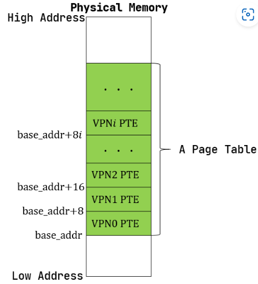

# 应用程序与基本执行环境
## 应用程序执行环境与基本操作平台
### 执行应用程序
我们先在Linux上开发并运行一个简单的 “Hello, world” 应用程序，看看一个简单应用程序从开发到执行的全过程。
```shell
cargo new os --bin
```
我们加上了 --bin 选项来告诉 Cargo 我们创建一个可执行程序项目而不是函数库项目。此时，项目的文件结构如下：
```shell
tree os
os
├── Cargo.toml
└── src
    └── main.rs
1 directory, 2 files
```


其中 Cargo.toml 中保存着项目的配置，包括作者的信息、联系方式以及库依赖等等。显而易见源代码保存在 src 目录下，目前为止只有 main.rs 一个文件，让我们看一下里面的内容：

最简单的 Rust 应用
```rs
fn main() {
    println!("Hello, world!");
}

```

进入 os 项目根目录下，利用 Cargo 工具即可一条命令实现构建并运行项目：
```shell
cargo run
   Compiling os v0.1.0 (/home/shinbokuow/workspace/v3/rCore-Tutorial-v3/os)
    Finished dev [unoptimized + debuginfo] target(s) in 1.15s
     Running `target/debug/os`
Hello, world!

```

如我们预想的一样，我们在屏幕上看到了一行 Hello, world! 。
### 应用程序执行环境
如下图所示，现在通用操作系统（如 Linux 等）上的应用程序运行需要下面多层次的执行环境栈的支持，图中的白色块自上而下（越往下则越靠近底层，下层作为上层的执行环境支持上层代码的运行）表示各级执行环境，黑色块则表示相邻两层执行环境之间的接口。


我们的应用位于最上层，它可以通过调用编程语言提供的标准库或者其他三方库对外提供的函数接口，使得仅需少量的源代码就能完成复杂的功能。但是这些库的功能不仅限于此，事实上它们属于应用程序执行环境(Execution Environment) 的一部分。在我们通常不会注意到的地方，这些软件库还会在执行应用之前完成一些初始化工作，并在应用程序执行的时候对它进行监控。我们在打印Hello, world!时使用的println!宏正是由Rust标准库std提供的。

从操作系统内核的角度看来，它上面的一切都属于用户态软件，而它自身属于内核态软件。无论用户态应用如何编写，是手写汇编代码，还是基于某种高级编程语言调用其标准库或三方库，某些功能总要直接或间接的通过操作系统内核提供的系统调用(SystemCall)来实现。因此系统调用充当了用户和内核之间的边界。内核作为用户态软件的执行环境，它不仅要提供系统调用接口，还需要对用户态软件的执行进行监控和管理。
###  目标平台与目标三元组
对于一份用某种编程语言实现的应用程序源代码而言，编译器在将其通过编译、链接得到可执行文件的时候需要知道程序要在哪个平台(Platform)上运行。这里平台主要是指CPU类型、操作系统类型和标准运行时库的组合。从上面给出的应用程序执行环境栈可以看出：
• 如果用户态基于的内核不同，会导致系统调用接口不同或者语义不一致；
• 如果底层硬件不同，对于硬件资源的访问方式会有差异。特别是如果ISA不同，则向软件提供的指令集和寄存器都不同。

它们都会导致最终生成的可执行文件有很大不同。需要指出的是，某些编译器支持同一份源代码无需修改就可编译到多个不同的目标平台并在上面运行。这种情况下，源代码是跨平台的。而另一些编译器则已经预设好了一个固定的目标平台。
##  移除标准库依赖
###  移除 println! 宏
println! 宏所在的Rust标准库std需要通过系统调用获得操作系统的服务，而如果要构建运行在裸机上的操作系统，就不能再依赖标准库了。所以我们第一步要尝试移除println!宏及其所在的标准库。

由于后续实验需要rustc编译器缺省生成RISC-V64的目标代码，所以我们首先要给rustc添加一个target: riscv64gc-unknown-none-elf 。这可通过如下命令来完成：
```shell
rustup target add riscv64gc-unknown-none-elf
```
然后在os目录下新建.cargo目录，并在这个目录下创建config文件，并在里面输入如下内容：
```toml
# os/.cargo/config
 [build]
 target = "riscv64gc-unknown-none-elf"
```

这会对于Cargo工具在os目录下的行为进行调整：现在默认会使用riscv64gc作为目标平台而不是原先的默认x86_64-unknown-linux-gnu。
###  提供 panic_handler 功能应对致命错误
我们重新编译简单的os程序，之前的println宏缺失的错误消失了，但又出现了如下新的编译错误：
```shell
 $ cargo build
 Compiling os v0.1.0 (/home/shinbokuow/workspace/v3/rCore-Tutorial-v3/os)
 error: `#[panic_handler]` function required, but not found
```

在使用Rust编写应用程序的时候，我们常常在遇到了一些无法恢复的致命错误（panic），导致程序无法继续向下运行。这时手动或自动调用panic!宏来打印出错的位置，让软件能够意识到它的存在，并进行一些后续处理。
在标准库std中提供了关于panic!宏的具体实现，其大致功能是打印出错位置和原因并杀死当前应用。但本章要实现的操作系统不能使用还需依赖操作系统的标准库std，而更底层的核心库core中只有一个panic!宏的空壳，并没有提供panic!宏的精简实现。因此我们需要自己先实现一个简陋的panic处理函数.

**注解:**  #[panic_handler]
 #[panic_handler] 是一种编译指导属性，用于标记核心库core中的panic!宏要对接的函数（该函数实现对致命错误的具体处理）。该编译指导属性所标记的函数需要具有fn(&PanicInfo)-> !函数签名，函数可通过PanicInfo数据结构获取致命错误的相关信息。这样Rust编译器就可以把核心库core中的panic!宏定义与#[panic_handler]指向的panic函数实现合并在一起，使得no_std程序具有类似std库的应对致命错误的功能。

我们创建一个新的子模块lang_items.rs实现panic函数，并通过#[panic_handler]属性通知编译器
用panic 函数来对接panic!宏。为了将该子模块添加到项目中，我们还需要在main.rs的#![no_std]的下方加上mod lang_items;，相关知识可参考Rust模块编程：
```rs
 // os/src/lang_items.rs
 use core::panic::PanicInfo;
 #[panic_handler]
 fn panic(_info: &PanicInfo)-> ! {
 loop {}
 }
```

在把panic_handler配置在单独的文件os/src/lang_items.rs后，需要在os/src/main.rs文件中添加以下内容才能正常编译整个软件：
```rs
// os/src/main.rs
 #![no_std] 
 mod lang_items;
 fn main() {

}

```
### 移除 main 函数
我们再次重新编译简单的os程序，之前的#[panic_handler]函数缺失的错误消失了，但又出现了如下新的编译错误：.. error:
```rs
 .. code-block::
 $ cargo build
 Compiling os v0.1.0 (/home/shinbokuow/workspace/v3/rCore-Tutorial-v3/os)
 error: requires `start` lang_item
```
编译器提醒我们缺少一个名为start的语义项。我们回忆一下，之前提到语言标准库和三方库作为应用程序的执行环境，需要负责在执行应用程序之前进行一些初始化工作，然后才跳转到应用程序的入口点开始执行。事实上start语义项代表了标准库std在执行应用程序之前需要进行的一些初始化工作。由于我们禁用了标准库，编译器也就找不到这项功能的实现了。

最简单的解决方案就是压根不让编译器使用这项功能。我们在main.rs的开头加入设置#![no_main]告诉编译器我们没有一般意义上的main函数，并将原来的main函数删除。在失去了main函数的情况下，编译器也就不需要完成所谓的初始化工作了。


## 编译运行
```shell
# 编译
cargo build --release
# 运行
qemu-system-riscv64     -machine virt     -nographic     -bios ../bootloader/rustsbi-qemu.bin     -device loader,file=target/riscv64gc-unknown-none-elf/release/os,addr=0x80200000
```

## 内核指令
### 程序内存布局与编译流程
在我们将源代码编译为可执行文件之后，它就会变成一个看似充满了杂乱无章的字节的一个文件。但我们知道这些字节至少可以分成代码和数据两部分，在程序运行起来的时候它们的功能并不相同：代码部分由一条条可以被 CPU 解码并执行的指令组成，而数据部分只是被 CPU 视作可读写的内存空间。事实上我们还可以根据其功能进一步把两个部分划分为更小的单位： 段 (Section) 。不同的段会被编译器放置在内存不同的位置上，这构成了程序的 内存布局 (Memory Layout)。一种典型的程序相对内存布局如下所示：


- 已初始化数据段保存程序中那些已初始化的全局数据，分为 .rodata 和 .data 两部分。前者存放只读的全局数据，通常是一些常数或者是 常量字符串等；而后者存放可修改的全局数据。

- 未初始化数据段 .bss 保存程序中那些未初始化的全局数据，通常由程序的加载者代为进行零初始化，即将这块区域逐字节清零；

- 堆 （heap）区域用来存放程序运行时动态分配的数据，如 C/C++ 中的 malloc/new 分配到的数据本体就放在堆区域，它向高地址增长；

- 栈 （stack）区域不仅用作函数调用上下文的保存与恢复，每个函数作用域内的局部变量也被编译器放在它的栈帧内，它向低地址增长。

**编译流程**
从源代码得到可执行文件的编译流程可被细化为多个阶段（虽然输入一条命令便可将它们全部完成）：
1. 编译器(Compiler) 将每个源文件从某门高级编程语言转化为汇编语言，注意此时源文件仍然是一个ASCII 或其他编码的文本文件；
2. 汇编器(Assembler) 将上一步的每个源文件中的文本格式的指令转化为机器码，得到一个二进制的目标文件(Object File)；
3. 链接器(Linker) 将上一步得到的所有目标文件以及一些可能的外部目标文件链接在一起形成一个完整的可执行文件。

汇编器输出的每个目标文件都有一个独立的程序内存布局，它描述了目标文件内各段所在的位置。而链接器所做的事情是将所有输入的目标文件整合成一个整体的内存布局。在此期间链接器主要完成两件事情：
• 第一件事情是将来自不同目标文件的段在目标内存布局中重新排布。如下图所示，在链接过程中，分别来自于目标文件1.o和2.o段被按照段的功能进行分类，相同功能的段被排在一起放在拼装后的目标文件output.o中。注意到，目标文件1.o和2.o的内存布局是存在冲突的，同一个地址在不同的内存布局中存放不同的内容。而在合并后的内存布局中，这些冲突被消除。
• 第二件事情是将符号替换为具体地址。这里的符号指什么呢？我们知道，在我们进行模块化编程的时候，每个模块都会提供一些向其他模块公开的全局变量、函数等供其他模块访问，也会访问其他模块向它公开的内容。要访问一个变量或者调用一个函数，在源代码级别我们只需知道它们的名字即可，
这些名字被我们称为符号。取决于符号来自于模块内部还是其他模块，我们还可以进一步将符号分成内部符号和外部符号。然而，在机器码级别（也即在目标文件或可执行文件中）我们并不是通过符号来找到索引我们想要访问的变量或函数，而是直接通过变量或函数的地址。例如，如果想调用一个函数，那么在指令的机器码中我们可以找到函数入口的绝对地址或者相对于当前PC的相对地址。


## 内核第一条指令
###  编写内核第一条指令
首先，我们需要编写进入内核后的第一条指令，这样更方便我们验证我们的内核镜像是否正确对接到Qemu上。
```asm
 # os/src/entry.asm
 .section .text.entry
 .globl _start
_start:
 li x1, 100
```
实际的指令位于第5行，也即li x1, 100。li是LoadImmediate的缩写，也即将一个立即数加载到某个寄存器，因此这条指令可以看做将寄存器x1赋值为100。第4行我们声明了一个符号_start，该符号指向紧跟在符号后面的内容——也就是位于第5行的指令，因此符号_start的地址即为第5行的指令所在的
地址。第3行我们告知编译器_start是一个全局符号，因此可以被其他目标文件使用。第2行表明我们希望将第2行后面的内容全部放到一个名为.text.entry的段中。一般情况下，所有的代码都被放到一个名为.text的代码段中，这里我们将其命名为.text.entry从而区别于其他.text的目的在于我们想要确保该段被放置在相比任何其他代码段更低的地址上。这样，作为内核的入口点，这段指令才能被最先执行。
接着，我们在main.rs中嵌入这段汇编代码，这样Rust编译器才能够注意到它，不然编译器会认为它是一个与项目无关的文件：
```rs
//os/src/main.rs
#![no_std]
#![no_main]

mod lang_item;

use core::arch::global_asm;
global_asm!(include_str!("entry.asm"));
```

第8行，我们通过include_str!宏将同目录下的汇编代码entry.asm转化为字符串并通过global_asm!宏嵌入到代码中。

### 调整内核的内存布局
由于链接器默认的内存布局并不能符合我们的要求，为了实现与Qemu正确对接，我们可以通过链接脚本(LinkerScript)调整链接器的行为，使得最终生成的可执行文件的内存布局符合Qemu的预期，即内核第一条指令的地址应该位于0x80200000。我们修改Cargo的配置文件来使用我们自己的链接脚本os/src/linker.ld而非使用默认的内存布局：
```config
//os/.cargo/config
[build]
target ="riscv64gc-unknown-none-elf"

[target.riscv64gc-unknown-none-elf]
rustflags= [
"-Clink-arg=-Tsrc/linker.ld", "-Cforce-frame-pointers=yes"
]
```

链接脚本os/src/linker.ld如下：
```ld
OUTPUT_ARCH(riscv)
ENTRY(_start)
BASE_ADDRESS = 0x80200000;

SECTIONS
{
    . = BASE_ADDRESS;
    skernel = .;

    stext = .;
    .text : {
        *(.text.entry)
        *(.text .text.*)
    }

    . = ALIGN(4K);
    etext = .;
    srodata = .;
    .rodata : {
        *(.rodata .rodata.*)
        *(.srodata .srodata.*)
    }

    . = ALIGN(4K);
    erodata = .;
    sdata = .;
    .data : {
        *(.data .data.*)
        *(.sdata .sdata.*)
    }

    . = ALIGN(4K);
    edata = .;
    .bss : {
        *(.bss.stack)
        sbss = .;
        *(.bss .bss.*)
        *(.sbss .sbss.*)
    }

    . = ALIGN(4K);
    ebss = .;
    ekernel = .;

    /DISCARD/ : {
        *(.eh_frame)
    }
}
```

第1行我们设置了目标平台为riscv；第2行我们设置了整个程序的入口点为之前定义的全局符号_start；第3行定义了一个常量BASE_ADDRESS为0x80200000，也就是我们之前提到内核的初始化代码被放置的地址；
从第5行开始体现了链接过程中对输入的目标文件的段的合并。其中.表示当前地址，也就是链接器会从它指向的位置开始往下放置从输入的目标文件中收集来的段。我们可以对.进行赋值来调整接下来的段放在哪里，也可以创建一些全局符号赋值为.从而记录这一时刻的位置。我们还能够看到这样的格式：
```s
.rodata: {
 *(.rodata)
 }
```

冒号前面表示最终生成的可执行文件的一个段的名字，花括号内按照放置顺序描述将所有输入目标文件的哪些段放在这个段中，每一行格式为<ObjectFile>(SectionName)，表示目标文件ObjectFile的名为SectionName的段需要被放进去。我们也可以使用通配符来书写<ObjectFile>和<SectionName>分别表示可能的输入目标文件和段名。因此，最终的合并结果是，在最终可执行文件中各个常见的段.text,.rodata.data,.bss从低地址到高地址按顺序放置，每个段里面都包括了所有输入目标文件的同名段，且每个段都有两个全局符号给出了它的开始和结束地址。
第12行我们将包含内核第一条指令的.text.entry段放在最终的.text段的最开头，同时注意到在最终内存布局中代码段.text又是先于任何其他段的。因为所有的段都从BASE_ADDRESS也即0x80200000开始放置，这就能够保证内核的第一条指令正好放在0x80200000从而能够正确对接到Qemu上。

### 手动加载内核可执行文件
上面得到的内核可执行文件完全符合我们对于内存布局的要求，但是我们不能将其直接提交给Qemu，因为它除了实际会被用到的代码和数据段之外还有一些多余的元数据，这些元数据无法被Qemu在加载文件时利用，且会使代码和数据段被加载到错误的位置。如下图所示：

图中，红色的区域表示内核可执行文件中的元数据，深蓝色的区域表示各个段（包括代码段和数据段），而浅蓝色区域则表示内核被执行的第一条指令，它位于深蓝色区域的开头。图示的上半部分中，我们直接将内核可执行文件os提交给Qemu，而Qemu会将整个可执行文件不加处理的加载到Qemu内存的0x80200000处，由于内核可执行文件的开头是一段元数据，这会导致Qemu内存0x80200000处无法找到内核第一条指令，也就意味着RustSBI无法正常将计算机控制权转交给内核。相反，图示的下半部分中，将元数据丢弃得到的内核镜像os.bin被加载到Qemu之后，则可以在0x80200000处正确找到内核第一条指令。
使用如下命令可以丢弃内核可执行文件中的元数据得到内核镜像：
```shell
rust-objcopy--strip-all target/riscv64gc-unknown-none-elf/release/os-O binary
```

## 为内核支持函数调用

### 函数调用与栈

指令集必须给用于函数调用的跳转指令一些额外的能力，而不只是单纯的跳转。在RISC-V架构上，有两条指令即符合这样的特征：
|指令|指令功能|
|-----------|--------------|
|jal rd, imm[20 : 1]| rd ←pc+4  pc ←pc+imm|
| jalr rd, (imm[11 : 0])rs| rd ←pc+4  pc ←rs+imm|


从中可以看出，这两条指令在设置pc寄存器完成跳转功能之前，还将当前跳转指令的下一条指令地址保存在rd寄存器中，即rd←pc+4这条指令的含义。在RISC-V架构中，通常使用ra寄存器（即x1寄存器）作为其中的rd对应的具体寄存器，因此在函数返回的时候，只需跳转回ra所保存的地址即可。事实上在函数返回的时候我们常常使用一条汇编伪指令(PseudoInstruction)跳转回调用之前的位置：ret。它会被汇编器翻译为jalr x0, 0(x1)，含义为跳转到寄存器ra保存的物理地址，由于x0是一个恒为0的寄存器，在rd中保存这一步被省略。

由于每个CPU只有一套寄存器，我们若想在子函数调用前后保持函数调用上下文不变，就需要物理内存的帮助。确切的说，在调用子函数之前，我们需要在物理内存中的一个区域保存(Save)函数调用上下文中的寄存器；而在函数执行完毕后，我们会从内存中同样的区域读取并恢复(Restore)函数调用上下文中的寄存器。
实际上，这一工作是由子函数的调用者和被调用者（也就是子函数自身）合作完成。函数调用上下文中的寄存器被分为如下两类：
• 被调用者保存(Callee-Saved)寄存器：被调用的函数可能会覆盖这些寄存器，需要被调用的函数来保存的寄存器，即由被调用的函数来保证在调用前后，这些寄存器保持不变；
• 调用者保存(Caller-Saved)寄存器：被调用的函数可能会覆盖这些寄存器，需要发起调用的函数来保存的寄存器，即由发起调用的函数来保证在调用前后，这些寄存器保持不变。

### 调用规范
调用规范(Calling Convention) 约定在某个指令集架构上，某种编程语言的函数调用如何实现。它包括了以下
内容：
1. 函数的输入参数和返回值如何传递；
2. 函数调用上下文中调用者/被调用者保存寄存器的划分；
3. 其他的在函数调用流程中对于寄存器的使用方法。

调用规范是对于一种确定的编程语言来说的，因为一般意义上的函数调用只会在编程语言的内部进行。当一种语言想要调用用另一门编程语言编写的函数接口时，编译器就需要同时清楚两门语言的调用规范，并对寄存器的使用做出调整。

|寄存器组|保存者|功能|
|-----------|-------------|------------|
|a0-a7（x10-x17 ）|调用者保存|用来传递输入参数。其中的a0和a1还用来保存返回值
|t0-t6( x5-x7,x28-x31 )|调用者保存作为临时寄存器使用，在被调函数中可以随意使用无需保存。
|s0-s11( x18-x27  ,x8-x9,)|被调用者保存作为临时寄存器使用，被调函数保存后才能在被调函数中使用。|

剩下的5个通用寄存器情况如下：
• zero( x0 ) 之前提到过，它恒为零，函数调用不会对它产生影响；
• ra( x1 ) 是被调用者保存的。被调用者函数可能也会调用函数，在调用之前就需要修改ra使得这次调用能正确返回。因此，每个函数都需要在开头保存ra到自己的栈中，并在结尾使用ret返回之前将其恢复。栈帧是当前执行函数用于存储局部变量和函数返回信息的内存结构。
• sp( x2 ) 是被调用者保存的。这个是之后就会提到的栈指针(StackPointer)寄存器，它指向下一个将要
被存储的栈顶位置。
• fp( s0 )，它既可作为s0临时寄存器，也可作为栈帧指针（FramePointer）寄存器，表示当前栈帧的起
始位置，是一个被调用者保存寄存器。fp指向的栈帧起始位置和sp指向的栈帧的当前栈顶位置形成了所对应函数栈帧的空间范围。
• gp( x3 ) 和tp( x4 ) 在一个程序运行期间都不会变化，因此不必放在函数调用上下文中。

### 分配并使用启动栈
我们在entry.asm中分配启动栈空间，并在控制权被转交给Rust入口之前将栈指针sp设置为栈顶的位置。
```asm
 # os/src/entry.asm
     .section .text.entry //声明后面的内容全部放在.text.entry的段中
     .globl _start //声明_start是一个全局符号
_start:
    la sp, boot_stack_top
    call rust_main

    .section .bss.stack
    .globl boot_stack_lower_bound
boot_stack_lower_bound:
    .space 4096 * 16
    .globl boot_stack_top
boot_stack_top:


```

我们在第11行在内核的内存布局中预留了一块大小为4096*16字节也就是64KiB的空间用作接下来要运行的程序的栈空间。在RISC-V架构上，栈是从高地址向低地址增长。因此，最开始的时候栈为空，栈顶和栈底位于相同的位置，我们用更高地址的符号boot_stack_top来标识栈顶的位置。同时，我们用更低地址的符号boot_stack_lower_bound来标识栈能够增长到的下限位置，它们都被设置为全局符号供其他目标文件使用。如下图所示：


回到entry.asm，可以发现在控制权转交给Rust入口之前会执行两条指令，它们分别位于entry.asm的第5、6行。第5行我们将栈指针sp设置为先前分配的启动栈栈顶地址，这样Rust代码在进行函数调用和返回的时候就可以正常在启动栈上分配和回收栈帧了。在我们设计好的内存布局中，这块启动栈所用的内存并不会和内核的其他代码、数据段产生冲突。第6行我们通过伪指令call调用Rust编写的内核入口点rust_main将控制
权转交给Rust代码，该入口点在main.rs中实现：
```rs
// os/src/main.rs
 #[no_mangle]
 pub fn rust_main()-> ! {
 loop {}
 }

```

这里需要注意的是需要通过宏将rust_main标记为#[no_mangle]以避免编译器对它的名字进行混淆，不然在链接的时候，entry.asm将找不到main.rs提供的外部符rust_main从而导致链接失败。在rust_main 函数的开场白中，我们将第一次在栈上分配栈帧并保存函数调用上下文，它也是内核运行全程中最底层的栈帧。
在内核初始化中，需要先完成对.bss段的清零。这是内核很重要的一部分初始化工作，在使用任何被分配到.bss段的全局变量之前我们需要确保.bss段已被清零。我们就在rust_main的开头完成这一工作，由于控制权已经被转交给Rust，我们终于不用手写汇编代码而是可以用Rust来实现这一功能了：

```rs
//os/src/main.rs
#[no_mangle]
pub fn rust_main()-> ! {
    clear_bss();
    loop {}
}

fn clear_bss() {
    extern "C" {
        fn sbss();
        fn ebss();
    }
    (sbss as usize..ebss as usize).for_each(|a| {
        unsafe { (a as *mut u8).write_volatile(0) }
    });
}
```

在函数clear_bss中，我们会尝试从其他地方找到全局符号sbss和ebss，它们由链接脚本linker.ld给出，并分别指出需要被清零的.bss段的起始和终止地址。接下来我们只需遍历该地址区间并逐字节进行清零即可。
##  基于SBI服务完成输出和关机
### 使用 RustSBI 提供的服务
我们对 RustSBI 的了解仅限于它会在计算机启动时进行它所负责的环境初始化工作，并将计算机控制权移交给内核。但实际上作为内核的执行环境，它还有另一项职责：即在内核运行时响应内核的请求为内核提供服务。当内核发出请求时，计算机会转由 RustSBI 控制来响应内核的请求，待请求处理完毕后，计算机控制权会被交还给内核。从内存布局的角度来思考，每一层执行环境都对应到内存中的一段代码和数据，这里的控制权转移指的是 CPU 从执行一层软件的代码到执行另一层软件的代码的过程。这个过程和函数调用比较像，但是内核无法通过函数调用来请求 RustSBI 提供的服务，这是因为内核并没有和 RustSBI 链接到一起，我们仅仅使用 RustSBI 构建后的可执行文件，因此内核对于 RustSBI 的符号一无所知。事实上，内核需要通过另一种复杂的方式来“调用” 。
```rs
// os/src/main.rs
 mod sbi;
 // os/src/sbi.rs
 use core::arch::asm;
 #[inline(always)]
 fn sbi_call(which: usize, arg0: usize, arg1: usize, arg2: usize)->     usize {
    let mut ret;
    unsafe {
    asm!(
        "ecall",
        inlateout("x10") arg0 => ret,
        in("x11") arg1,
        in("x12") arg2,
        in("x17") which,
    );
 }
 ret
}
```
我们将内核与RustSBI通信的相关功能实现在子模块sbi中，因此我们需要在main.rs中加入mod sbi将该子模块加入我们的项目。在os/src/sbi.rs中，我们首先关注sbi_call的函数签名，which表示请求RustSBI 的服务的类型（RustSBI可以提供多种不同类型的服务），arg0~arg2表示传递给RustSBI的3 个参数，而RustSBI在将请求处理完毕后，会给内核一个返回值，这个返回值也会被sbi_call函数返回。
在sbi.rs中我们定义RustSBI支持的服务类型常量，它们并未被完全用到：
```rs
// os/src/sbi.rs
#![allow(unused)] // 此行请放在该文件最开头
const SBI_SET_TIMER: usize = 0;
const SBI_CONSOLE_PUTCHAR: usize = 1;
const SBI_CONSOLE_GETCHAR:usize= 2;
const SBI_CLEAR_IPI:usize= 3;
const SBI_SEND_IPI:usize= 4;
const SBI_REMOTE_FENCE_I:usize= 5;
const SBI_REMOTE_SFENCE_VMA:usize= 6;
const SBI_REMOTE_SFENCE_VMA_ASID:usize= 7;
const SBI_SHUTDOWN:usize= 8;
```
如字面意思，服务SBI_CONSOLE_PUTCHAR可以用来在屏幕上输出一个字符。我们将这个功能封装成console_putchar函数：
```rs
//os/src/sbi.rs
pub fn console_putchar(c:usize){
    sbi_call(SBI_CONSOLE_PUTCHAR,c,0, 0);
}

```

类似上述方式，我们还可以将关机服务SBI_SHUTDOWN封装成shutdown函数：
```rs
//os/src/sbi.rs
pub fn shutdown()->! {
sbi_call(SBI_SHUTDOWN,0, 0,0);
    panic!("Itshouldshutdown!");
}
```
### 实现格式化输出
onsole_putchar的功能过于受限，如果想打印一行Helloworld!的话需要进行多次调用。能否像本章第一节那样使用println!宏一行就完成输出呢？因此我们尝试自己编写基于console_putchar的println!宏。
```rs
// os/src/main.rs
#[macro_use]
mod console;

// os/src/console.rs
use crate::sbi::console_putchar;
use core::fmt::{self, Write};

struct Stdout;

impl Write for Stdout {
    fn write_str(&mut self, s: &str) -> fmt::Result {
        for c in s.chars() {
            console_putchar(c as usize);
        }
        Ok(())
    }
}

pub fn print(args: fmt::Arguments) {
    Stdout.write_fmt(args).unwrap();
}

#[macro_export]
macro_rules! print {
    ($fmt: literal $(, $($arg: tt)+)?) => {
        $crate::console::print(format_args!($fmt $(, $($arg)+)?));
    }
}

#[macro_export]
macro_rules! println {
    ($fmt: literal $(, $($arg: tt)+)?) => {
        $crate::console::print(format_args!(concat!($fmt, "\n") $(, $($arg)+)?));
    }
}
```
### 处理致命错误
错误处理是编程的重要一环，它能够保证程序的可靠性和可用性，使得程序能够从容应对更多突发状况而不至于过早崩溃。
```rs
// os/src/lang_items.rs
use core::panic::PanicInfo;

#[panic_handler]
fn panic(_info: &PanicInfo) -> ! {
    loop {}
}

```


可以看到，在目前的实现中，当遇到不可恢复错误的时候，被标记为语义项 #[panic_handler] 的 panic 函数将会被调用，然而其中只是一个死循环，会使得计算机卡在这里。借助前面实现的 println! 宏和 shutdown 函数，我们可以在 panic 函数中打印错误信息并关机：
```rs
// os/src/main.rs
#![feature(panic_info_message)]

// os/src/lang_item.rs
use crate::sbi::shutdown;
use core::panic::PanicInfo;

#[panic_handler]
fn panic(info: &PanicInfo) -> ! {
    if let Some(location) = info.location() {
        println!(
            "Panicked at {}:{} {}",
            location.file(),
            location.line(),
            info.message().unwrap()
        );
    } else {
        println!("Panicked: {}", info.message().unwrap());
    }
    shutdown()
}

```

我们尝试打印更加详细的信息，包括 panic 所在的源文件和代码行数。我们尝试从传入的 PanicInfo 中解析这些信息，如果解析成功的话，就和 panic 的报错信息一起打印出来。我们需要在 main.rs 开头加上 #![feature(panic_info_message)] 才能通过 PanicInfo::message 获取报错信息。当打印完毕之后，我们直接调用 shutdown 函数关机。

为了测试我们的实现是否正确，我们将 rust_main 改为：
```rs
// os/src/main.rs
#[no_mangle]
pub fn rust_main() -> ! {
    clear_bss();
    println!("Hello, world!");
    panic!("Shutdown machine!");
}
```


 # 批处理系统
批处理系统 (Batch System) ，它可用来管理无需或仅需少量用户交互即可运行的程序，在资源允许的情况下它可以自动安排程序的执行，这被称为“批处理作业”。


## 特权机制
实现特权级机制的根本原因是应用程序运行的安全性不可充分信任。

确保操作系统的安全，对应用程序而言，需要限制的主要有两个方面：
- 应用程序不能访问任意的地址空间
- 应用程序不能执行某些可能破坏计算机系统的指令

为了实现这样的特权级机制，需要进行软硬件协同设计。一个比较简洁的方法就是，处理器设置两个不同安全等级的执行环境：用户态特权级的执行环境和内核态特权级的执行环境。且明确指出可能破坏计算机系统的内核态特权级指令子集，规定内核态特权级指令子集中的指令只能在内核态特权级的执行环境中执行。处理器在执行指令前会进行特权级安全检查，如果在用户态执行环境中执行这些内核态特权级指令，会产生异常。

为了让应用程序获得操作系统的函数服务，采用传统的函数调用方式（即通常的 call 和 ret 指令或指令组合）将会直接绕过硬件的特权级保护检查。所以可以设计新的机器指令：执行环境调用（Execution Environment Call，简称 ecall ）和执行环境返回(Execution Environment Return，简称 eret )）：

- ecall ：具有用户态到内核态的执行环境切换能力的函数调用指令

- eret ：具有内核态到用户态的执行环境切换能力的函数返回指令

### RISC-V 特权级架构
RISC-V 架构中一共定义了 4 种特权级：
**RISC-V 特权级**
|级别|编码|名称|
|-------------|--------------|---------------|
|0|00|用户/应用模式 (U, User/Application)|
|1|01|监督模式 (S, Supervisor)|
|2|10|虚拟监督模式 (H, Hypervisor)|
|3|11|机器模式 (M, Machine)|


白色块表示一层执行环境，黑色块表示相邻两层执行环境之间的接口。这张图片给出了能够支持运行 Unix 这类复杂系统的软件栈。其中操作系统内核代码运行在 S 模式上；应用程序运行在 U 模式上。运行在 M 模式上的软件被称为 监督模式执行环境 (SEE, Supervisor Execution Environment)，如在操作系统运行前负责加载操作系统的 Bootloader – RustSBI。站在运行在 S 模式上的软件视角来看，它的下面也需要一层执行环境支撑，因此被命名为 SEE，它需要在相比 S 模式更高的特权级下运行，一般情况下 SEE 在 M 模式上运行。
 
### RISC-V的特权指令
与特权级无关的一般的指令和通用寄存器 x0 ~ x31 在任何特权级都可以执行。而每个特权级都对应一些特殊指令和 控制状态寄存器 (CSR, Control and Status Register) ，来控制该特权级的某些行为并描述其状态。当然特权指令不仅具有读写 CSR 的指令，还有其他功能的特权指令。
|指令|含义|
|------------------|-----------------|
|sret|从 S 模式返回 U 模式：在 U 模式下执行会产生非法指令异常|
|wfi|处理器在空闲时进入低功耗状态等待中断：在 U 模式下执行会产生非法指令异常|
|sfence.vma|刷新 TLB 缓存：在 U 模式下执行会产生非法指令异常|
|访问 S 模式 CSR 的指令|通过访问 sepc/stvec/scause/sscartch/stval/sstatus/satp等CSR 来改变系统状态：在 U 模式下执行会产生非法指令异常|

## 实现应用程序

应用程序的设计实现要点是：

- 应用程序的内存布局

- 应用程序发出的系统调用
### 应用程序设计
应用程序、用户库（包括入口函数、初始化函数、I/O 函数和系统调用接口等多个 rs 文件组成）放在项目根目录的 user 目录下，它和第一章的裸机应用不同之处主要在项目的目录文件结构和内存布局上：

- user/src/bin/*.rs ：各个应用程序

- user/src/*.rs ：用户库（包括入口函数、初始化函数、I/O 函数和系统调用接口等）

- user/src/linker.ld ：应用程序的内存布局说明。

### 项目结构
我们看到 user/src 目录下面多出了一个 bin 目录。bin 里面有多个文件，目前里面至少有三个程序（一个文件是一个应用程序），分别是：

- hello_world ：在屏幕上打印一行 Hello world from user mode program!

- store_fault ：访问一个非法的物理地址，测试批处理系统是否会被该错误影响

- power ：不断在计算操作和打印字符串操作之间进行特权级切换

批处理系统会按照文件名开头的数字编号从小到大的顺序加载并运行它.
每个应用程序的实现都在对应的单个文件中。打开其中一个文件，会看到里面只有一个 main 函数和若干相关的函数所形成的整个应用程序逻辑。


在 lib.rs 中我们定义了用户库的入口点 _start ：
```rs
#[no_mangle]
#[link_section = ".text.entry"]
pub extern "C" fn _start() -> ! {
    clear_bss();
    exit(main());
    panic!("unreachable after sys_exit!");
}
```

第 2 行使用 Rust 的宏将 _start 这段代码编译后的汇编代码中放在一个名为 .text.entry 的代码段中，方便我们在后续链接的时候调整它的位置使得它能够作为用户库的入口。

从第 4 行开始，进入用户库入口之后，手动清空需要零初始化的 .bss 段；然后调用 main 函数得到一个类型为 i32 的返回值，最后调用用户库提供的 exit 接口退出应用程序，并将 main 函数的返回值告知批处理系统。

我们还在 lib.rs 中看到了另一个 main ：
```rs
#[linkage = "weak"]
#[no_mangle]
fn main() -> i32 {
    panic!("Cannot find main!");
}
```
第 1 行，我们使用 Rust 的宏将其函数符号 main 标志为弱链接。这样在最后链接的时候，虽然在 lib.rs 和 bin 目录下的某个应用程序都有 main 符号，但由于 lib.rs 中的 main 符号是弱链接，链接器会使用 bin 目录下的应用主逻辑作为 main 。这里我们主要是进行某种程度上的保护，如果在 bin 目录下找不到任何 main ，那么编译也能够通过，但会在运行时报错。

为了支持上述这些链接操作，我们需要在 lib.rs 的开头加入：
```toml
#![feature(linkage)]
```

### 内存布局
在 user/.cargo/config 中，设置链接时使用链接脚本 user/src/linker.ld 。在其中我们做的重要的事情是：
- 将程序的起始物理地址调整为 0x80400000 ，三个应用程序都会被加载到这个物理地址上运行；
- 将 _start 所在的 .text.entry 放在整个程序的开头，也就是说批处理系统只要在加载之后跳转到 0x80400000 就已经进入了 用户库的入口点，并会在初始化之后跳转到应用程序主逻辑；
- 提供了最终生成可执行文件的 .bss 段的起始和终止地址，方便 clear_bss 函数使用。


### 系统调用
在子模块 syscall 中，应用程序通过 ecall 调用批处理系统提供的接口，由于应用程序运行在用户态（即 U 模式）， ecall 指令会触发 名为 Environment call from U-mode 的异常，并 Trap 进入 S 模式执行批处理系统针对这个异常特别提供的服务代码。由于这个接口处于 S 模式的批处理系统和 U 模式的应用程序之间，这个接口可以被称为 ABI 或者系统调用。现在我们不关心底层的批处理系统如何提供应用程序所需的功能，只是站在应用程序的角度去使用即可。

在本章中，应用程序和批处理系统之间按照 API 的结构，约定如下两个系统调用：

```rs
/// 功能：将内存中缓冲区中的数据写入文件。
/// 参数：`fd` 表示待写入文件的文件描述符；
///      `buf` 表示内存中缓冲区的起始地址；
///      `len` 表示内存中缓冲区的长度。
/// 返回值：返回成功写入的长度。
/// syscall ID：64
fn sys_write(fd: usize, buf: *const u8, len: usize) -> isize;

/// 功能：退出应用程序并将返回值告知批处理系统。
/// 参数：`exit_code` 表示应用程序的返回值。
/// 返回值：该系统调用不应该返回。
/// syscall ID：93
fn sys_exit(exit_code: usize) -> !;
```

我们知道系统调用实际上是汇编指令级的二进制接口，因此这里给出的只是使用 Rust 语言描述的 API 版本。在实际调用的时候，我们需要按照 RISC-V 调用规范（即ABI格式）在合适的寄存器中放置系统调用的参数，然后执行 ecall 指令触发 Trap。在 Trap 回到 U 模式的应用程序代码之后，会从 ecall 的下一条指令继续执行，同时我们能够按照调用规范在合适的寄存器中读取返回值。


在 RISC-V 调用规范中，和函数调用的 ABI 情形类似，约定寄存器 a0~a6 保存系统调用的参数， a0 保存系统调用的返回值。有些许不同的是寄存器 a7 用来传递 syscall ID，这是因为所有的 syscall 都是通过 ecall 指令触发的，除了各输入参数之外我们还额外需要一个寄存器来保存要请求哪个系统调用。由于这超出了 Rust 语言的表达能力，我们需要在代码中使用内嵌汇编来完成参数/返回值绑定和 ecall 指令的插入：
```rs
// user/src/syscall.rs
use core::arch::asm;
fn syscall(id: usize, args: [usize; 3]) -> isize {
    let mut ret: isize;
    unsafe {
        asm!(
            "ecall",
            inlateout("x10") args[0] => ret,
            in("x11") args[1],
            in("x12") args[2],
            in("x17") id
        );
    }
    ret
}
```


第 3 行，我们将所有的系统调用都封装成 syscall 函数，可以看到它支持传入 syscall ID 和 3 个参数。

syscall 中使用从第 5 行开始的 asm! 宏嵌入 ecall 指令来触发系统调用。

从 RISC-V 调用规范来看，就像函数有着输入参数和返回值一样， ecall 指令同样有着输入和输出寄存器： a0~a2 和 a7 作为输入寄存器分别表示系统调用参数和系统调用 ID ，而当系统调用返回后， a0 作为输出寄存器保存系统调用的返回值。在函数上下文中，输入参数数组 args 和变量 id 保存系统调用参数和系统调用 ID ，而变量 ret 保存系统调用返回值，它也是函数 syscall 的输出/返回值。这些输入/输出变量可以和 ecall 指令的输入/输出寄存器一一对应。如果完全由我们自己编写汇编代码，那么如何将变量绑定到寄存器则成了一个难题：比如，在 ecall 指令被执行之前，我们需要将寄存器 a7 的值设置为变量 id 的值，那么我们首先需要知道目前变量 id 的值保存在哪里，它可能在栈上也有可能在某个寄存器中。


有些时候不必将变量绑定到固定的寄存器，此时 asm! 宏可以自动完成寄存器分配。某些汇编代码段还会带来一些编译器无法预知的副作用，这种情况下需要在 asm! 中通过 options 告知编译器这些可能的副作用，这样可以帮助编译器在避免出错更加高效分配寄存器。事实上，


于是 sys_write 和 sys_exit 只需将 syscall 进行包装：
```rs
// user/src/syscall.rs

const SYSCALL_WRITE: usize = 64;
const SYSCALL_EXIT: usize = 93;

pub fn sys_write(fd: usize, buffer: &[u8]) -> isize {
    syscall(SYSCALL_WRITE, [fd, buffer.as_ptr() as usize, buffer.len()])
}

pub fn sys_exit(xstate: i32) -> isize {
    syscall(SYSCALL_EXIT, [xstate as usize, 0, 0])
}

```

注意 sys_write 使用一个 &[u8] 切片类型来描述缓冲区，这是一个 胖指针 (Fat Pointer)，里面既包含缓冲区的起始地址，还 包含缓冲区的长度。我们可以分别通过 as_ptr 和 len 方法取出它们并独立地作为实际的系统调用参数。

我们将上述两个系统调用在用户库 user_lib 中进一步封装，从而更加接近在 Linux 等平台的实际系统调用接口：
```rs
// user/src/lib.rs
use syscall::*;

pub fn write(fd: usize, buf: &[u8]) -> isize { sys_write(fd, buf) }
pub fn exit(exit_code: i32) -> isize { sys_exit(exit_code) }

```

我们把 console 子模块中 Stdout::write_str 改成基于 write 的实现，且传入的 fd 参数设置为 1，它代表标准输出， 也就是输出到屏幕。目前我们不需要考虑其他的 fd 选取情况。这样，应用程序的 println! 宏借助系统调用变得可用了。 参考下面的代码片段：
```rs
// user/src/console.rs
const STDOUT: usize = 1;

impl Write for Stdout {
    fn write_str(&mut self, s: &str) -> fmt::Result {
        write(STDOUT, s.as_bytes());
        Ok(())
    }
}
```

exit 接口则在用户库中的 _start 内使用，当应用程序主逻辑 main 返回之后，使用它退出应用程序并将返回值告知 底层的批处理系统。

### 编译生成应用程序二进制码
这里简要介绍一下应用程序的自动构建。只需要在 user 目录下 make build 即可：


### 实现操作系统前执行应用程序


假定我们已经完成了编译并生成了 ELF 可执行文件格式的应用程序，我们就可以来试试。首先看看应用程序执行 RV64 的 S 模式特权指令 会出现什么情况，对应的应用程序可以在 user/src/bin 目录下找到。
```rs
// user/src/bin/03priv_inst.rs
use core::arch::asm;
#[no_mangle]
fn main() -> i32 {
    println!("Try to execute privileged instruction in U Mode");
    println!("Kernel should kill this application!");
    unsafe {
        asm!("sret");
    }
    0
}

// user/src/bin/04priv_csr.rs
use riscv::register::sstatus::{self, SPP};
#[no_mangle]
fn main() -> i32 {
    println!("Try to access privileged CSR in U Mode");
    println!("Kernel should kill this application!");
    unsafe {
        sstatus::set_spp(SPP::User);
    }
    0
}
```

在上述代码中，两个应用都会打印提示信息，随后应用 03priv_inst 会尝试在用户态执行内核态的特权指令 sret ，而应用 04priv_csr 则会试图在用户态修改内核态 CSR sstatus 。

接下来，我们尝试在用户态模拟器 qemu-riscv64 执行这两个应用：
```shell
cd user
make build
cd target/riscv64gc-unknown-none-elf/release/
确认待执行的应用为 ELF 格式
file 03priv_inst
03priv_inst: ELF 64-bit LSB executable, UCB RISC-V, version 1 (SYSV), statically linked, not stripped
执行特权指令出错
qemu-riscv64 ./03priv_inst
Try to execute privileged instruction in U Mode
Kernel should kill this application!
Illegal instruction (core dumped)
执行访问特权级 CSR 的指令出错
qemu-riscv64 ./04priv_csr
Try to access privileged CSR in U Mode
Kernel should kill this application!
Illegal instruction (core dumped)

```


看来RV64的特权级机制确实有用。那对于一般的用户态应用程序，在 qemu-riscv64 模拟器下能正确执行吗？
### 实现操作系统前执行应用程序
我们还没有实现操作系统，能提前执行或测试应用程序吗？可以！这是因为我们除了一个能模拟一台 RISC-V 64 计算机的全系统模拟器 qemu-system-riscv64 外，还有一个直接支持运行 RISC-V 64 用户程序的半系统模拟器 qemu-riscv64 。不过需要注意的是，如果想让用户态应用程序在 qemu-riscv64 模拟器（实际上是一个 RISC-V 架构下的 Linux 操作系统）上和在我们自己写的 OS 上执行效果一样，需要做到二者的系统调用的接口是一样的（包括系统调用编号，参数约定的具体的寄存器和栈等）。
## 实现批处理操作系统
应用放置采用“静态绑定”的方式，而操作系统加载应用则采用“动态加载”的方式：

- 静态绑定：通过一定的编程技巧，把多个应用程序代码和批处理操作系统代码“绑定”在一起。

- 动态加载：基于静态编码留下的“绑定”信息，操作系统可以找到每个应用程序文件二进制代码的起始地址和长度，并能加载到内存中运行。

### 将应用程序链接到内核
我们把应用程序的二进制镜像文件作为内核的数据段链接到内核里面，因此内核需要知道内含的应用程序的数量和它们的位置，这样才能够在运行时对它们进行管理并能够加载到物理内存。

在 os/src/main.rs 中添加一行：
```rs
global_asm!(include_str!("link_app.S"));
```
这里我们引入了一段汇编代码 link_app.S ，它一开始并不存在，而是在构建操作系统时自动生成的。当我们使用 make run 让系统运行的过程中，这个汇编代码 link_app.S 就生成了。我们可以先来看一看 link_app.S 里面的内容：
```S
# os/src/link_app.S

    .align 3
    .section .data
    .global _num_app
_num_app:
    .quad 5 # 分配并初始化一个64位的存储单元，其值为5。
    .quad app_0_start
    .quad app_1_start
    .quad app_2_start
    .quad app_3_start
    .quad app_4_start
    .quad app_4_end

    .section .data
    .global app_0_start
    .global app_0_end
app_0_start:
    .incbin "../user/target/riscv64gc-unknown-none-elf/release/00hello_world.bin"
app_0_end:

    .section .data
    .global app_1_start
    .global app_1_end
app_1_start:
    .incbin "../user/target/riscv64gc-unknown-none-elf/release/01store_fault.bin"
app_1_end:

    .section .data
    .global app_2_start
    .global app_2_end
app_2_start:
    .incbin "../user/target/riscv64gc-unknown-none-elf/release/02power.bin"
app_2_end:

    .section .data
    .global app_3_start
    .global app_3_end
app_3_start:
    .incbin "../user/target/riscv64gc-unknown-none-elf/release/03priv_inst.bin"
app_3_end:

    .section .data
    .global app_4_start
    .global app_4_end
app_4_start:
    .incbin "../user/target/riscv64gc-unknown-none-elf/release/04priv_csr.bin"
app_4_end:
```

可以看到第 15 行开始的五个数据段分别插入了五个应用程序的二进制镜像，并且各自有一对全局符号 app_*_start, app_*_end 指示它们的开始和结束位置。而第 3 行开始的另一个数据段相当于一个 64 位整数数组。数组中的第一个元素表示应用程序的数量，后面则按照顺序放置每个应用程序的起始地址，最后一个元素放置最后一个应用程序的结束位置。这样每个应用程序的位置都能从该数组中相邻两个元素中得知。这个数组所在的位置同样也由全局符号 _num_app 所指示。

### 找到并加载应用程序二进制码
能够找到并加载应用程序二进制码的应用管理器 AppManager 是“邓式鱼”操作系统的核心组件。我们在 os 的 batch 子模块中实现一个应用管理器，它的主要功能是：

- 保存应用数量和各自的位置信息，以及当前执行到第几个应用了。

- 根据应用程序位置信息，初始化好应用所需内存空间，并加载应用执行。

应用管理器 AppManager 结构体定义如下：
```rs
// os/src/batch.rs

struct AppManager {
    num_app: usize,
    current_app: usize,
    app_start: [usize; MAX_APP_NUM + 1],
}
```
这里我们可以看出，上面提到的应用管理器需要保存和维护的信息都在 AppManager 里面。这样设计的原因在于：我们希望将 AppManager 实例化为一个全局变量，使得任何函数都可以直接访问。但是里面的 current_app 字段表示当前执行的是第几个应用，它是一个可修改的变量，会在系统运行期间发生变化。因此在声明全局变量的时候，采用 static mut 是一种比较简单自然的方法。但是在 Rust 中，任何对于 static mut 变量的访问控制都是 unsafe 的，而我们要在编程中尽量避免使用 unsafe ，这样才能让编译器负责更多的安全性检查。因此，我们需要考虑如何在尽量避免触及 unsafe 的情况下仍能声明并使用可变的全局变量。

如果单独使用 static 而去掉 mut 的话，我们可以声明一个初始化之后就不可变的全局变量，但是我们需要 AppManager 里面的内容在运行时发生变化。这涉及到 Rust 中的 内部可变性 （Interior Mutability），也即在变量自身不可变或仅在不可变借用的情况下仍能修改绑定到变量上的值。我们可以通过用上面提到的 RefCell 来包裹 AppManager ，这样 RefCell 无需被声明为 mut ，同时被包裹的 AppManager 也能被修改。


除了 Sync 的问题之外，看起来 RefCell 已经非常接近我们的需求了，因此我们在 RefCell 的基础上再封装一个 UPSafeCell ，它名字的含义是：允许我们在 单核 上安全使用可变全局变量。
```rs
// os/src/sync/up.rs

use core::cell::{RefCell, RefMut};
pub struct UPSafeCell<T> {
    inner: RefCell<T>,
}

unsafe impl<T> Sync for UPSafeCell<T> {}

impl<T> UPSafeCell<T> {
    pub unsafe fn new(value: T) -> Self {
        Self {
            inner: RefCell::new(value),
        }
    }
    pub fn exclusive_access(&self) -> RefMut<'_, T> {
        self.inner.borrow_mut()
    }
}
```

UPSafeCell 对于 RefCell 简单进行封装，它和 RefCell 一样提供内部可变性和运行时借用检查，只是更加严格：调用 exclusive_access 可以得到它包裹的数据的独占访问权。因此当我们要访问数据时，需要首先调用 exclusive_access 获得数据的可变借用标记，通过它可以完成数据的读写，在操作完成之后我们需要销毁这个标记，此后才能开始对该数据的下一次访问。相比 RefCell 它不再允许多个读操作同时存在。

这段代码里面出现了两个 unsafe ：

- 首先 new 被声明为一个 unsafe 函数，是因为我们希望使用者在创建一个 UPSafeCell 的时候保证在访问 UPSafeCell 内包裹的数据的时候始终不违背上述模式：即访问之前调用 exclusive_access ，访问之后销毁借用标记再进行下一次访问。这只能依靠使用者自己来保证，但我们提供了一个保底措施：当使用者违背了上述模式，比如访问之后忘记销毁就开启下一次访问时，程序会 panic 并退出。

- 另一方面，我们将 UPSafeCell 标记为 Sync 使得它可以作为一个全局变量。这是 unsafe 行为，因为编译器无法确定我们的 UPSafeCell 能否安全的在多线程间共享。而我们能够向编译器做出保证，第一个原因是目前我们内核仅运行在单核上，因此无需在意任何多核引发的数据竞争/同步问题；第二个原因则是它基于 RefCell 提供了运行时借用检查功能，从而满足了 Rust 对于借用的基本约束进而保证了内存安全。

这样，我们就以尽量少的 unsafe code 来初始化 AppManager 的全局实例 APP_MANAGER ：
```rs

// os/src/batch.rs

lazy_static! {
    static ref APP_MANAGER: UPSafeCell<AppManager> = unsafe { UPSafeCell::new({
        extern "C" { fn _num_app(); }
        let num_app_ptr = _num_app as usize as *const usize;
        let num_app = num_app_ptr.read_volatile();
        let mut app_start: [usize; MAX_APP_NUM + 1] = [0; MAX_APP_NUM + 1];
        let app_start_raw: &[usize] =  core::slice::from_raw_parts(
            num_app_ptr.add(1), num_app + 1
        );
        app_start[..=num_app].copy_from_slice(app_start_raw);
        AppManager {
            num_app,
            current_app: 0,
            app_start,
        }
    })};
}
```

初始化的逻辑很简单，就是找到 link_app.S 中提供的符号 _num_app ，并从这里开始解析出应用数量以及各个应用的起始地址。注意其中对于切片类型的使用能够很大程度上简化编程。

这里我们使用了外部库 lazy_static 提供的 lazy_static! 宏。要引入这个外部库，我们需要加入依赖：
```rs
# os/Cargo.toml

[dependencies]
lazy_static = { version = "1.4.0", features = ["spin_no_std"] }
```

lazy_static! 宏提供了全局变量的运行时初始化功能。一般情况下，全局变量必须在编译期设置一个初始值，但是有些全局变量依赖于运行期间才能得到的数据作为初始值。这导致这些全局变量需要在运行时发生变化，即需要重新设置初始值之后才能使用。如果我们手动实现的话有诸多不便之处，比如需要把这种全局变量声明为 static mut 并衍生出很多 unsafe 代码 。这种情况下我们可以使用 lazy_static! 宏来帮助我们解决这个问题。这里我们借助 lazy_static! 声明了一个 AppManager 结构的名为 APP_MANAGER 的全局实例，且只有在它第一次被使用到的时候，才会进行实际的初始化工作。

因此，借助我们设计的 UPSafeCell&lt;T> 和外部库 lazy_static!，我们就能使用尽量少的 unsafe 代码完成可变全局变量的声明和初始化，且一旦初始化完成，在后续的使用过程中便不再触及 unsafe 代码。

AppManager 的方法中， print_app_info/get_current_app/move_to_next_app 都相当简单直接，需要说明的是 load_app：
```rs
unsafe fn load_app(&self, app_id: usize) {
    if app_id >= self.num_app {
        panic!("All applications completed!");
    }
    println!("[kernel] Loading app_{}", app_id);
    // 清空app区域
    core::slice::from_raw_parts_mut(
        APP_BASE_ADDRESS as *mut u8,
        APP_SIZE_LIMIT
    ).fill(0);
    let app_src = core::slice::from_raw_parts(
        self.app_start[app_id] as *const u8,
        self.app_start[app_id + 1] - self.app_start[app_id]
    );
    let app_dst = core::slice::from_raw_parts_mut(
        APP_BASE_ADDRESS as *mut u8,
        app_src.len()
    );
    app_dst.copy_from_slice(app_src);
    // memory fence about fetching the instruction memory
    asm!("fence.i");
}

```

这个方法负责将参数 app_id 对应的应用程序的二进制镜像加载到物理内存以 0x80400000 起始的位置，这个位置是批处理操作系统和应用程序之间约定的常数地址，我们也调整应用程序的内存布局以同一个地址开头。第 7 行开始，我们首先将一块内存清空，然后找到待加载应用二进制镜像的位置，并将它复制到正确的位置。它本质上是把数据从一块内存复制到另一块内存，从批处理操作系统的角度来看，是将操作系统数据段的一部分数据（实际上是应用程序）复制到了一个可以执行代码的内存区域。

注意在第 21 行我们在加载完应用代码之后插入了一条奇怪的汇编指令 fence.i ，它起到什么作用呢？我们知道缓存是存储层级结构中提高访存速度的很重要一环。而 CPU 对物理内存所做的缓存又分成 数据缓存 (d-cache) 和 指令缓存 (i-cache) 两部分，分别在 CPU 访存和取指的时候使用。在取指的时候，对于一个指令地址， CPU 会先去 i-cache 里面看一下它是否在某个已缓存的缓存行内，如果在的话它就会直接从高速缓存中拿到指令而不是通过总线访问内存。通常情况下， CPU 会认为程序的代码段不会发生变化，因此 i-cache 是一种只读缓存。但在这里，OS 将修改会被 CPU 取指的内存区域，这会使得 i-cache 中含有与内存中不一致的内容。因此， OS 在这里必须使用取指屏障指令 fence.i ，它的功能是保证 在它之后的取指过程必须能够看到在它之前的所有对于取指内存区域的修改 ，这样才能保证 CPU 访问的应用代码是最新的而不是 i-cache 中过时的内容。

## 实现特权级的切换
处理操作系统为了建立好应用程序的执行环境，需要在执行应用程序之前进行一些初始化工作，并监控应用程序的执行，具体体现在：

- 当启动应用程序的时候，需要初始化应用程序的用户态上下文，并能切换到用户态执行应用程序；

- 当应用程序发起系统调用（即发出 Trap）之后，需要到批处理操作系统中进行处理；

- 当应用程序执行出错的时候，需要到批处理操作系统中杀死该应用并加载运行下一个应用；

- 当应用程序执行结束的时候，需要到批处理操作系统中加载运行下一个应用（实际上也是通过系统调用 sys_exit 来实现的）。

这些处理都涉及到特权级切换，因此需要应用程序、操作系统和硬件一起协同，完成特权级切换机制。
### 特权级切换相关的控制状态寄存器
当从一般意义上讨论 RISC-V 架构的 Trap 机制时，通常需要注意两点：

- 在触发 Trap 之前 CPU 运行在哪个特权级；

- CPU 需要切换到哪个特权级来处理该 Trap ，并在处理完成之后返回原特权级。

|CSR 名|该 CSR 与 Trap 相关的功能|
|---------------|---------------------|
|sstatus|SPP 等字段给出 Trap 发生之前 CPU 处在哪个特权级（S/U）等信息|
|sepc|当 Trap 是一个异常的时候，记录 Trap 发生之前执行的最后一条指令的地址|
|scause|描述 Trap 的原因|
|stval|给出 Trap 附加信息|
|stvec|控制 Trap 处理代码的入口地址|
### 特权级切换
当执行一条 Trap 类指令（如 ecall 时），CPU 发现触发了一个异常并需要进行特殊处理，这涉及到 执行环境切换 。具体而言，用户态执行环境中的应用程序通过 ecall 指令向内核态执行环境中的操作系统请求某项服务功能，那么处理器和操作系统会完成到内核态执行环境的切换，并在操作系统完成服务后，再次切换回用户态执行环境，然后应用程序会紧接着 ecall 指令的后一条指令位置处继续执行.

应用程序被切换回来之后需要从发出系统调用请求的执行位置恢复应用程序上下文并继续执行，这需要在切换前后维持应用程序的上下文保持不变。应用程序的上下文包括通用寄存器和栈两个主要部分。由于 CPU 在不同特权级下共享一套通用寄存器，所以在运行操作系统的 Trap 处理过程中，操作系统也会用到这些寄存器，这会改变应用程序的上下文。因此，与函数调用需要保存函数调用上下文/活动记录一样，在执行操作系统的 Trap 处理过程（会修改通用寄存器）之前，我们需要在某个地方（某内存块或内核的栈）保存这些寄存器并在 Trap 处理结束后恢复这些寄存器。

除了通用寄存器之外还有一些可能在处理 Trap 过程中会被修改的 CSR，比如 CPU 所在的特权级。我们要保证它们的变化在我们的预期之内。比如，对于特权级转换而言，应该是 Trap 之前在 U 特权级，处理 Trap 的时候在 S 特权级，返回之后又需要回到 U 特权级。而对于栈问题则相对简单，只要两个应用程序执行过程中用来记录执行历史的栈所对应的内存区域不相交，就不会产生令我们头痛的覆盖问题或数据破坏问题，也就无需进行保存/恢复。


### 特权级切换的硬件控制机制
当 CPU 执行完一条指令（如 ecall ）并准备从用户特权级 陷入（ Trap ）到 S 特权级的时候，硬件会自动完成如下这些事情：

- sstatus 的 SPP 字段会被修改为 CPU 当前的特权级（U/S）。

- sepc 会被修改为 Trap 处理完成后默认会执行的下一条指令的地址。

- scause/stval 分别会被修改成这次 Trap 的原因以及相关的附加信息。

- CPU 会跳转到 stvec 所设置的 Trap 处理入口地址，并将当前特权级设置为 S ，然后从Trap 处理入口地址处开始执行。

而当 CPU 完成 Trap 处理准备返回的时候，需要通过一条 S 特权级的特权指令 sret 来完成，这一条指令具体完成以下功能：

- CPU 会将当前的特权级按照 sstatus 的 SPP 字段设置为 U 或者 S ；

- CPU 会跳转到 sepc 寄存器指向的那条指令，然后继续执行。


### 用户栈与内核栈
在 Trap 触发的一瞬间， CPU 就会切换到 S 特权级并跳转到 stvec 所指示的位置。但是在正式进入 S 特权级的 Trap 处理之前，上面 提到过我们必须保存原控制流的寄存器状态，这一般通过内核栈来保存。注意，我们需要用专门为操作系统准备的内核栈，而不是应用程序运行时用到的用户栈。

使用两个不同的栈主要是为了安全性：如果两个控制流使用同一个栈，在返回之后应用程序就能读到 Trap 控制流的历史信息，比如内核一些函数的地址，这样会带来安全隐患。于是，我们要做的是，在批处理操作系统中添加一段汇编代码，实现从用户栈切换到内核栈，并在内核栈上保存应用程序控制流的寄存器状态。

我们声明两个类型 KernelStack 和 UserStack 分别表示内核栈和用户栈，它们都只是字节数组的简单包装：
```rs
// os/src/batch.rs

const USER_STACK_SIZE: usize = 4096 * 2;
const KERNEL_STACK_SIZE: usize = 4096 * 2;

#[repr(align(4096))]
struct KernelStack {
    data: [u8; KERNEL_STACK_SIZE],
}

#[repr(align(4096))]
struct UserStack {
    data: [u8; USER_STACK_SIZE],
}
static KERNEL_STACK: KernelStack = KernelStack { data: [0; KERNEL_STACK_SIZE] };
static USER_STACK: UserStack = UserStack { data: [0; USER_STACK_SIZE] };
```


常数 USER_STACK_SIZE 和 KERNEL_STACK_SIZE 指出用户栈和内核栈的大小分别为 。两个类型是以全局变量的形式实例化在批处理操作系统的 .bss 段中的。

我们为两个类型实现了 get_sp 方法来获取栈顶地址。由于在 RISC-V 中栈是向下增长的，我们只需返回包裹的数组的结尾地址，以用户栈类型 UserStack 为例：
```rs
impl UserStack {
    fn get_sp(&self) -> usize {
        self.data.as_ptr() as usize + USER_STACK_SIZE
    }
}
```

于是换栈是非常简单的，只需将 sp 寄存器的值修改为 get_sp 的返回值即可。

接下来是Trap上下文（即数据结构 TrapContext ），类似前面提到的函数调用上下文，即在 Trap 发生时需要保存的物理资源内容，并将其一起放在一个名为 TrapContext 的类型中，定义如下：
```rs
// os/src/trap/context.rs

#[repr(C)]
pub struct TrapContext {
    pub x: [usize; 32],
    pub sstatus: Sstatus,
    pub sepc: usize,
}
```

可以看到里面包含所有的通用寄存器 x0~x31 ，还有 sstatus 和 sepc 。那么为什么需要保存它们呢？

- 对于通用寄存器而言，两条控制流运行在不同的特权级，所属的软件也可能由不同的编程语言编写，虽然在 Trap 控制流中只是会执行 Trap 处理相关的代码，但依然可能直接或间接调用很多模块，因此很难甚至不可能找出哪些寄存器无需保存。既然如此我们就只能全部保存了。但这里也有一些例外，如 x0 被硬编码为 0 ，它自然不会有变化；还有 tp(x4) 寄存器，除非我们手动出于一些特殊用途使用它，否则一般也不会被用到。虽然它们无需保存，但我们仍然在 TrapContext 中为它们预留空间，主要是为了后续的实现方便。

- 对于 CSR 而言，我们知道进入 Trap 的时候，硬件会立即覆盖掉 scause/stval/sstatus/sepc 的全部或是其中一部分。scause/stval 的情况是：它总是在 Trap 处理的第一时间就被使用或者是在其他地方保存下来了，因此它没有被修改并造成不良影响的风险。而对于 sstatus/sepc 而言，它们会在 Trap 处理的全程有意义（在 Trap 控制流最后 sret 的时候还用到了它们），而且确实会出现 Trap 嵌套的情况使得它们的值被覆盖掉。所以我们需要将它们也一起保存下来，并在 sret 之前恢复原样。

### Trap 管理
特权级切换的核心是对Trap的管理。这主要涉及到如下一些内容：

- 应用程序通过 ecall 进入到内核状态时，操作系统保存被打断的应用程序的 Trap 上下文；

- 操作系统根据Trap相关的CSR寄存器内容，完成系统调用服务的分发与处理；

- 操作系统完成系统调用服务后，需要恢复被打断的应用程序的Trap 上下文，并通 sret 让应用程序继续执行。


#### Trap 上下文的保存与恢复
首先是具体实现 Trap 上下文保存和恢复的汇编代码。

在批处理操作系统初始化的时候，我们需要修改 stvec 寄存器来指向正确的 Trap 处理入口点。
```rs
// os/src/trap/mod.rs

global_asm!(include_str!("trap.S"));

pub fn init() {
    extern "C" { fn __alltraps(); }
    unsafe {
        stvec::write(__alltraps as usize, TrapMode::Direct);
    }
}
```

这里我们引入了一个外部符号 __alltraps ，并将 stvec 设置为 Direct 模式指向它的地址。我们在 os/src/trap/trap.S 中实现 Trap 上下文保存/恢复的汇编代码，分别用外部符号 __alltraps 和 __restore 标记为函数，并通过 global_asm! 宏将 trap.S 这段汇编代码插入进来。

Trap 处理的总体流程如下：首先通过 __alltraps 将 Trap 上下文保存在内核栈上，然后跳转到使用 Rust 编写的 trap_handler 函数完成 Trap 分发及处理。当 trap_handler 返回之后，使用 __restore 从保存在内核栈上的 Trap 上下文恢复寄存器。最后通过一条 sret 指令回到应用程序执行。

首先是保存 Trap 上下文的 __alltraps 的实现：
```S
.macro SAVE_GP n
    sd x\n, \n*8(sp)
.endm

.align 2
__alltraps: 
    csrrw sp, sscratch, sp
    # now sp->kernel stack, sscratch->user stack
    # allocate a TrapContext on kernel stack
    addi sp, sp, -34*8
    # save general-purpose registers
    sd x1, 1*8(sp)
    # skip sp(x2), we will save it later
    sd x3, 3*8(sp)
    # skip tp(x4), application does not use it
    # save x5~x31
    .set n, 5
    .rept 27
        SAVE_GP %n
        .set n, n+1
    .endr
    # we can use t0/t1/t2 freely, because they were saved on kernel stack
    csrr t0, sstatus
    csrr t1, sepc
    sd t0, 32*8(sp)
    sd t1, 33*8(sp)
    # read user stack from sscratch and save it on the kernel stack
    csrr t2, sscratch
    sd t2, 2*8(sp)
    # set input argument of trap_handler(cx: &mut TrapContext)
    mv a0, sp
    call trap_handler
```

- 第 7 行我们使用 .align 将 __alltraps 的地址 4 字节对齐，这是 RISC-V 特权级规范的要求；

- 第 9 行的 csrrw 原型是可以将 CSR 当前的值读到通用寄存器中，然后将通用寄存器 的值写入该 CSR 。因此这里起到的是交换 sscratch 和 sp 的效果。在这一行之前 sp 指向用户栈，sscratch 指向内核栈，现在 sp 指向内核栈， sscratch 指向用户栈。

- 第 12 行，我们准备在内核栈上保存 Trap 上下文，于是预先分配 字节的栈帧，这里改动的是 sp ，说明确实是在内核栈上。

- 第 13~24 行，保存 Trap 上下文的通用寄存器 x0~x31，跳过 x0 和 tp(x4)，原因之前已经说明。我们在这里也不保存 sp(x2)，因为我们要基于它来找到每个寄存器应该被保存到的正确的位置。实际上，在栈帧分配之后，我们可用于保存 Trap 上下文的地址区间为 ，按照 TrapContext 结构体的内存布局，基于内核栈的位置（sp所指地址）来从低地址到高地址分别按顺序放置 x0~x31这些通用寄存器，最后是 sstatus 和 sepc 。因此通用寄存器 xn 应该被保存在地址区间。为了简化代码，x5~x31 这 27 个通用寄存器我们通过类似循环的 .rept 每次使用 SAVE_GP 宏来保存，其实质是相同的。注意我们需要在 trap.S 开头加上 .altmacro 才能正常使用 .rept 命令。

- 第 25~28 行，我们将 CSR sstatus 和 sepc 的值分别读到寄存器 t0 和 t1 中然后保存到内核栈对应的位置上。指令的功能就是将 CSR 的值读到寄存器中。这里我们不用担心 t0 和 t1 被覆盖，因为它们刚刚已经被保存了。

- 第 30~31 行专门处理 sp 的问题。首先将 sscratch 的值读到寄存器 t2 并保存到内核栈上，注意： sscratch 的值是进入 Trap 之前的 sp 的值，指向用户栈。而现在的 sp 则指向内核栈。

- 第 33 行令，让寄存器 a0 指向内核栈的栈指针也就是我们刚刚保存的 Trap 上下文的地址，这是由于我们接下来要调用 trap_handler 进行 Trap 处理，它的第一个参数 cx 由调用规范要从 a0 中获取。而 Trap 处理函数 trap_handler 需要 Trap 上下文的原因在于：它需要知道其中某些寄存器的值，比如在系统调用的时候应用程序传过来的 syscall ID 和对应参数。我们不能直接使用这些寄存器现在的值，因为它们可能已经被修改了，因此要去内核栈上找已经被保存下来的值。

**注解**
RISC-V 中读写 CSR 的指令是一类能不会被打断地完成多个读写操作的指令。这种不会被打断地完成多个操作的指令被称为 原子指令 (Atomic Instruction)。这里的 原子 的含义是“不可分割的最小个体”，也就是说指令的多个操作要么都不完成，要么全部完成，而不会处于某种中间状态。

另外，RISC-V 架构中常规的数据处理和访存类指令只能操作通用寄存器而不能操作 CSR 。因此，当想要对 CSR 进行操作时，需要先使用读取 CSR 的指令将 CSR 读到一个通用寄存器中，而后操作该通用寄存器，最后再使用写入 CSR 的指令将该通用寄存器的值写入到 CSR 中。

当 trap_handler 返回之后会从调用 trap_handler 的下一条指令开始执行，也就是从栈上的 Trap 上下文恢复的 __restore ：
```rs
# os/src/trap/trap.S

.macro LOAD_GP n
    ld x\n, \n*8(sp)
.endm

__restore:
    # case1: start running app by __restore
    # case2: back to U after handling trap
    mv sp, a0
    # now sp->kernel stack(after allocated), sscratch->user stack
    # restore sstatus/sepc
    ld t0, 32*8(sp)
    ld t1, 33*8(sp)
    ld t2, 2*8(sp)
    csrw sstatus, t0
    csrw sepc, t1
    csrw sscratch, t2
    # restore general-purpuse registers except sp/tp
    ld x1, 1*8(sp)
    ld x3, 3*8(sp)
    .set n, 5
    .rept 27
        LOAD_GP %n
        .set n, n+1
    .endr
    # release TrapContext on kernel stack
    addi sp, sp, 34*8
    # now sp->kernel stack, sscratch->user stack
    csrrw sp, sscratch, sp
    sret
```

- 第 10 行比较奇怪我们暂且不管，假设它从未发生，那么 sp 仍然指向内核栈的栈顶。

- 第 13~26 行负责从内核栈顶的 Trap 上下文恢复通用寄存器和 CSR 。注意我们要先恢复 CSR 再恢复通用寄存器，这样我们使用的三个临时寄存器才能被正确恢复。

- 在第 28 行之前，sp 指向保存了 Trap 上下文之后的内核栈栈顶， sscratch 指向用户栈栈顶。我们在第 28 行在内核栈上回收 Trap 上下文所占用的内存，回归进入 Trap 之前的内核栈栈顶。第 30 行，再次交换 sscratch 和 sp，现在 sp 重新指向用户栈栈顶，sscratch 也依然保存进入 Trap 之前的状态并指向内核栈栈顶。

- 在应用程序控制流状态被还原之后，第 31 行我们使用 sret 指令回到 U 特权级继续运行应用程序控制流。


#### Trap 分发与处理
Trap 在使用 Rust 实现的 trap_handler 函数中完成分发和处理：
```rs

// os/src/trap/mod.rs

#[no_mangle]
pub fn trap_handler(cx: &mut TrapContext) -> &mut TrapContext {
    let scause = scause::read();
    let stval = stval::read();
    match scause.cause() {
        Trap::Exception(Exception::UserEnvCall) => {
            cx.sepc += 4;
            cx.x[10] = syscall(cx.x[17], [cx.x[10], cx.x[11], cx.x[12]]) as usize;
        }
        Trap::Exception(Exception::StoreFault) |
        Trap::Exception(Exception::StorePageFault) => {
            println!("[kernel] PageFault in application, kernel killed it.");
            run_next_app();
        }
        Trap::Exception(Exception::IllegalInstruction) => {
            println!("[kernel] IllegalInstruction in application, kernel killed it.");
            run_next_app();
        }
        _ => {
            panic!("Unsupported trap {:?}, stval = {:#x}!", scause.cause(), stval);
        }
    }
    cx
}
```

- 第 4 行声明返回值为 &mut TrapContext 并在第 25 行实际将传入的Trap 上下文 cx 原样返回，因此在 __restore 的时候 a0 寄存器在调用 trap_handler 前后并没有发生变化，仍然指向分配 Trap 上下文之后的内核栈栈顶，和此时 sp 的值相同，这里的 并不会有问题；

- 第 7 行根据 scause 寄存器所保存的 Trap 的原因进行分发处理。这里我们无需手动操作这些 CSR ，而是使用 Rust 的 riscv 库来更加方便的做这些事情。要引入 riscv 库，我们需要：
```toml
# os/Cargo.toml

[dependencies]
riscv = { git = "https://github.com/rcore-os/riscv", features = ["inline-asm"] }
```

- 第 8~11 行，发现触发 Trap 的原因是来自 U 特权级的 Environment Call，也就是系统调用。这里我们首先修改保存在内核栈上的 Trap 上下文里面 sepc，让其增加 4。这是因为我们知道这是一个由 ecall 指令触发的系统调用，在进入 Trap 的时候，硬件会将 sepc 设置为这条 ecall 指令所在的地址（因为它是进入 Trap 之前最后一条执行的指令）。而在 Trap 返回之后，我们希望应用程序控制流从 ecall 的下一条指令开始执行。因此我们只需修改 Trap 上下文里面的 sepc，让它增加 ecall 指令的码长，也即 4 字节。这样在 __restore 的时候 sepc 在恢复之后就会指向 ecall 的下一条指令，并在 sret 之后从那里开始执行。

用来保存系统调用返回值的 a0 寄存器也会同样发生变化。我们从 Trap 上下文取出作为 syscall ID 的 a7 和系统调用的三个参数 a0~a2 传给 syscall 函数并获取返回值。 syscall 函数是在 syscall 子模块中实现的。 这段代码是处理正常系统调用的控制逻辑。

- 第 12~20 行，分别处理应用程序出现访存错误和非法指令错误的情形。此时需要打印错误信息并调用 run_next_app 直接切换并运行下一个应用程序。

- 第 21 行开始，当遇到目前还不支持的 Trap 类型的时候，“邓式鱼” 批处理操作系统整个 panic 报错退出。

#### 实现系统调用功能
对于系统调用而言， syscall 函数并不会实际处理系统调用，而只是根据 syscall ID 分发到具体的处理函数：
```rs
// os/src/syscall/mod.rs

pub fn syscall(syscall_id: usize, args: [usize; 3]) -> isize {
    match syscall_id {
        SYSCALL_WRITE => sys_write(args[0], args[1] as *const u8, args[2]),
        SYSCALL_EXIT => sys_exit(args[0] as i32),
        _ => panic!("Unsupported syscall_id: {}", syscall_id),
    }
}

```

这里我们会将传进来的参数 args 转化成能够被具体的系统调用处理函数接受的类型。它们的实现都非常简单：
```rs
// os/src/syscall/fs.rs

const FD_STDOUT: usize = 1;

pub fn sys_write(fd: usize, buf: *const u8, len: usize) -> isize {
    match fd {
        FD_STDOUT => {
            let slice = unsafe { core::slice::from_raw_parts(buf, len) };
            let str = core::str::from_utf8(slice).unwrap();
            print!("{}", str);
            len as isize
        },
        _ => {
            panic!("Unsupported fd in sys_write!");
        }
    }
}

// os/src/syscall/process.rs

pub fn sys_exit(xstate: i32) -> ! {
    println!("[kernel] Application exited with code {}", xstate);
    run_next_app()
}
```

- sys_write 我们将传入的位于应用程序内的缓冲区的开始地址和长度转化为一个字符串 &str ，然后使用批处理操作系统已经实现的 print! 宏打印出来。注意这里我们并没有检查传入参数的安全性，即使会在出错严重的时候 panic，还是会存在安全隐患。这里我们出于实现方便暂且不做修补。

- sys_exit 打印退出的应用程序的返回值并同样调用 run_next_app 切换到下一个应用程序。

### 执行应用程序
当批处理操作系统初始化完成，或者是某个应用程序运行结束或出错的时候，我们要调用 run_next_app 函数切换到下一个应用程序。此时 CPU 运行在 S 特权级，而它希望能够切换到 U 特权级。在 RISC-V 架构中，唯一一种能够使得 CPU 特权级下降的方法就是执行 Trap 返回的特权指令，如 sret 、mret 等。事实上，在从操作系统内核返回到运行应用程序之前，要完成如下这些工作：

- 构造应用程序开始执行所需的 Trap 上下文；

- 通过 __restore 函数，从刚构造的 Trap 上下文中，恢复应用程序执行的部分寄存器；

- 设置 sepc CSR的内容为应用程序入口点 0x80400000；

- 切换 scratch 和 sp 寄存器，设置 sp 指向应用程序用户栈；

- 执行 sret 从 S 特权级切换到 U 特权级。

它们可以通过复用 __restore 的代码来更容易的实现上述工作。我们只需要在内核栈上压入一个为启动应用程序而特殊构造的 Trap 上下文，再通过 __restore 函数，就能让这些寄存器到达启动应用程序所需要的上下文状态。
```rs

// os/src/trap/context.rs

impl TrapContext {
    pub fn set_sp(&mut self, sp: usize) { self.x[2] = sp; }
    pub fn app_init_context(entry: usize, sp: usize) -> Self {
        let mut sstatus = sstatus::read();
        sstatus.set_spp(SPP::User);
        let mut cx = Self {
            x: [0; 32],
            sstatus,
            sepc: entry,
        };
        cx.set_sp(sp);
        cx
    }
}
```

为 TrapContext 实现 app_init_context 方法，修改其中的 sepc 寄存器为应用程序入口点 entry， sp 寄存器为我们设定的一个栈指针，并将 sstatus 寄存器的 SPP 字段设置为 User 。

在 run_next_app 函数中我们能够看到：
```rs
// os/src/batch.rs

pub fn run_next_app() -> ! {
    let mut app_manager = APP_MANAGER.exclusive_access();
    let current_app = app_manager.get_current_app();
    unsafe {
        app_manager.load_app(current_app);
    }
    app_manager.move_to_next_app();
    drop(app_manager);
    // before this we have to drop local variables related to resources manually
    // and release the resources
    extern "C" { fn __restore(cx_addr: usize); }
    unsafe {
        __restore(KERNEL_STACK.push_context(
            TrapContext::app_init_context(APP_BASE_ADDRESS, USER_STACK.get_sp())
        ) as *const _ as usize);
    }
    panic!("Unreachable in batch::run_current_app!");
}

```

在高亮行所做的事情是在内核栈上压入一个 Trap 上下文，其 sepc 是应用程序入口地址 0x80400000 ，其 sp 寄存器指向用户栈，其 sstatus 的 SPP 字段被设置为 User 。push_context 的返回值是内核栈压入 Trap 上下文之后的栈顶，它会被作为 __restore 的参数（回看 __restore 代码 ，这时我们可以理解为何 __restore 函数的起始部分会完成 ），这使得在 __restore 函数中 sp 仍然可以指向内核栈的栈顶。这之后，就和执行一次普通的 __restore 函数调用一样了。


# 多道程序与分时多任务
**协作式操作系统**
早期的计算机系统大部分是单处理器计算机系统，由于计算机系统很昂贵，所以是多人共用一台计算机。当处理器进一步发展后，它与 I/O 的速度差距也进一步拉大。这时计算机科学家发现，在 多道程序 运行方式下，一个程序如果不让出处理器，其他程序是无法执行的。如果一个应用由于 I/O 操作让处理器空闲下来或让处理器忙等，那其他需要处理器资源进行计算的应用还是没法使用空闲的处理器资源。于是就想到，让应用在执行 I/O 操作或空闲时，可以主动 释放处理器 ，让其他应用继续执行。当然执行 放弃处理器 的操作算是一种对处理器资源的直接管理，所以应用程序可以发出这样的系统调用，让操作系统来具体完成。这样的操作系统就是支持 多道程序 或 协作式多任务 的协作式操作系统。

**抢占式操作系统**
计算机科学家很快发现，编写应用程序的科学家（简称应用程序员）来自不同的领域，他们不一定有友好互助的意识，也不了解其它程序的执行情况，很难（也没必要）有提高整个系统利用率上的大局观。在他们的脑海里，整个计算机就应该是为他们自己的应用准备的，不用考虑其他程序的运行。这导致应用程序员在编写程序时，无法做到在程序的合适位置放置 放弃处理器的系统调用请求 ，这样系统的整体利用率还是无法提高。

所以，站在系统的层面，还是需要有一种办法能强制打断应用程序的执行，来提高整个系统的效率，让在整个系统中执行的多个程序之间占用计算机资源的情况相对公平一些。根据计算机系统的硬件设计，为提高 I/O 效率，外设可以通过硬件中断机制来与处理机进行 I/O 交互操作。这种硬件中断机制可随时打断应用程序的执行，并让操作系统来完成对外设的 I/O 响应。

而操作系统可进一步利用某种以固定时长为时间间隔的外设中断（比如时钟中断）来强制打断一个程序的执行，这样一个程序只能运行一段时间（可以简称为一个时间片, Time Slice）就一定会让出处理器，且操作系统可以在处理外设的 I/O 响应后，让不同应用程序分时占用处理器执行，并可通过统计程序占用处理器的总执行时间，来评估运行的程序对处理器资源的消耗。我们把这种运行方式称为 **分时共享**（Time Sharing） 或 **抢占式多任务**（Multitasking） ，也可合并在一起称为 **分时多任务** 。

我们可以把一个程序的一次完整执行过程称为一次 任务 (Task)，把一个程序在一个时间片（Time Slice）上占用处理器执行的过程称为一个 任务片 (Task Slice)。操作系统对不同程序的执行过程中的 任务片 进行调度和管理，即通过平衡各个程序在整个时间段上的任务片数量，就能达到一定程度的系统公平和高效的系统效率。在一个包含多个时间片的时间段上，会有属于不同程序的多个任务片在轮流占用处理器执行，这样的操作系统就是支持 分时多任务 或 抢占式多任务 的抢占式操作系统。
**本章代码树**
锯齿螈多道程序操作系统 - Multiprog OS的总体结构如下图所示：


通过上图，大致可以看出Qemu把包含多个app的列表和MultiprogOS的image镜像加载到内存中，RustSBI（bootloader）完成基本的硬件初始化后，跳转到MultiprogOS起始位置，MultiprogOS首先进行正常运行前的初始化工作，即建立栈空间和清零bss段，然后通过改进的 AppManager 内核模块从app列表中把所有app都加载到内存中，并按指定顺序让app在用户态一个接一个地执行。app在执行过程中，会通过系统调用的方式得到MultiprogOS提供的OS服务，如输出字符串等。

始初龙协作式多道程序操作系统 – CoopOS的总体结构如下图所示：

## 多道程序放置与加载
### 多道程序放置
所有应用的 ELF 格式执行文件都经过 objcopy 工具丢掉所有 ELF header 和符号变为二进制镜像文件，随后以同样的格式通过在操作系统内核中嵌入 link_user.S 文件，在编译时直接把应用链接到内核的数据段中。不同的是，我们对相关模块进行了调整：我们将应用的加载这部分功能分离出来在 loader 子模块中实现，应用的执行和切换功能则交给 task 子模块。

由于每个应用被加载到的位置都不同，也就导致它们的链接脚本 linker.ld 中的 BASE_ADDRESS 都是不同的。实际上，我们不是直接用 cargo build 构建应用的链接脚本，而是写了一个脚本定制工具 build.py ，为每个应用定制了各自的链接脚本。
```py
# user/build.py

 import os

 base_address = 0x80400000
 step = 0x20000
 linker = 'src/linker.ld'

 app_id = 0
 apps = os.listdir('src/bin')
 apps.sort()
 for app in apps:
     app = app[:app.find('.')]
     lines = []
     lines_before = []
     with open(linker, 'r') as f:
         for line in f.readlines():
             lines_before.append(line)
             line = line.replace(hex(base_address), hex(base_address+step*app_id))
             lines.append(line)
     with open(linker, 'w+') as f:
         f.writelines(lines)
     os.system('cargo build --bin %s --release' % app)
     print('[build.py] application %s start with address %s' %(app, hex(base_address+step*app_id)))
     with open(linker, 'w+') as f:
         f.writelines(lines_before)
     app_id = app_id + 1
```
它的思路很简单，在遍历 app 的大循环里面只做了这样几件事情：

- 第 16~22 行，找到 src/linker.ld 中的 BASE_ADDRESS = 0x80400000; 这一行，并将后面的地址替换为和当前应用对应的一个地址；

- 第 23 行，使用 cargo build 构建当前的应用，注意我们可以使用 --bin 参数来只构建某一个应用；

- 第 25~26 行，将 src/linker.ld 还原。
### 多道程序加载
所有的应用在内核初始化的时候就一并被加载到内存中。为了避免覆盖，它们自然需要被加载到不同的物理地址。这是通过调用 loader 子模块的 load_apps 函数实现的：
```rs
 // os/src/loader.rs

 pub fn load_apps() {
     extern "C" { fn _num_app(); }
     let num_app_ptr = _num_app as usize as *const usize;
     let num_app = get_num_app();
     let app_start = unsafe {
         core::slice::from_raw_parts(num_app_ptr.add(1), num_app + 1)
     };
     // clear i-cache first
     unsafe { asm!("fence.i" :::: "volatile"); }
     // load apps
     for i in 0..num_app {
         let base_i = get_base_i(i);
         // clear region
         (base_i..base_i + APP_SIZE_LIMIT).for_each(|addr| unsafe {
             (addr as *mut u8).write_volatile(0)
         });
         // load app from data section to memory
         let src = unsafe {
             core::slice::from_raw_parts(
                 app_start[i] as *const u8,
                 app_start[i + 1] - app_start[i]
             )
         };
         let dst = unsafe {
             core::slice::from_raw_parts_mut(base_i as *mut u8, src.len())
         };
         dst.copy_from_slice(src);
     }
 }
```
可以看出，第 i 个应用被加载到以物理地址 base_i 开头的一段物理内存上，而 base_i 的计算方式如下：
```rs
 // os/src/loader.rs
 fn get_base_i(app_id: usize) -> usize {
     APP_BASE_ADDRESS + app_id * APP_SIZE_LIMIT
 }
```
### 执行应用程序
当多道程序的初始化放置工作完成，或者是某个应用程序运行结束或出错的时候，我们要调用 run_next_app 函数切换到下一个应用程序。此时 CPU 运行在 S 特权级的操作系统中，而操作系统希望能够切换到 U 特权级去运行应用程序。
## 任务切换
### 任务的概念形成
我们把应用程序的一次执行过程（也是一段控制流）称为一个 任务 ，把应用执行过程中的一个时间片段上的执行片段或空闲片段称为 “ 计算任务片 ” 或“ 空闲任片 ” 。当应用程序的所有任务片都完成后，应用程序的一次任务也就完成了。从一个程序的任务切换到另外一个程序的任务称为 任务切换 。为了确保切换后的任务能够正确继续执行，操作系统需要支持让任务的执行“暂停”和“继续”。

不是所有的资源都需要被保存，事实上只有那些对于程序接下来的正确执行仍然有用，且在它被切换出去的时候有被覆盖风险的那些资源才有被保存的价值。这些需要保存与恢复的资源被称为 **任务上下文 (Task Context)** 。
### 不同类型的上下文与切换
在控制流切换过程中，我们需要结合硬件机制和软件实现来保存和恢复任务上下文。任务的一次切换涉及到被换出和即将被换入的两条控制流（分属两个应用的不同任务），通常它们都需要共同遵循某些约定来合作完成这一过程。在前两章，我们已经看到了两种上下文保存/恢复的实例。让我们再来回顾一下它们：

- 为了支持嵌套函数调用，不仅需要硬件平台提供特殊的跳转指令，还需要保存和恢复 函数调用上下文 。注意在上述定义中，函数调用包含在普通控制流（与异常控制流相对）之内，且始终用一个固定的栈来保存执行的历史记录，因此函数调用并不涉及控制流的特权级切换。但是我们依然可以将其看成调用者和被调用者两个执行过程的“切换”，二者的协作体现在它们都遵循调用规范，分别保存一部分通用寄存器，这样的好处是编译器能够有足够的信息来尽可能减少需要保存的寄存器的数目。

- “批处理系统”中第一次涉及到了某种异常（Trap）控制流，即两条控制流的特权级切换，需要保存和恢复 系统调用（Trap）上下文 。当时，为了让内核能够 完全掌控 应用的执行，且不会被应用破坏整个系统，我们必须利用硬件提供的特权级机制，让应用和内核运行在不同的特权级。应用运行在 U 特权级，它所被允许的操作进一步受限，处处被内核监督管理；而内核运行在 S 特权级，有能力处理应用执行过程中提出的请求或遇到的状况。

### 任务切换的设计与实现
Trap 控制流切换之外的另一种异常控制流，都是描述两条控制流之间的切换，如果将它和 Trap 切换进行比较，会有如下异同：

- 与 Trap 切换不同，它不涉及特权级切换；

- 与 Trap 切换不同，它的一部分是由编译器帮忙完成的；

- 与 Trap 切换相同，它对应用是透明的。

事实上，任务切换是来自两个不同应用在内核中的 Trap 控制流之间的切换。当一个应用 Trap 到 S 模式的操作系统内核中进行进一步处理（即进入了操作系统的 Trap 控制流）的时候，其 Trap 控制流可以调用一个特殊的 __switch 函数。这个函数表面上就是一个普通的函数调用：在 __switch 返回之后，将继续从调用该函数的位置继续向下执行。但是其间却隐藏着复杂的控制流切换过程。具体来说，调用 __switch 之后直到它返回前的这段时间，原 Trap 控制流 A 会先被暂停并被切换出去， CPU 转而运行另一个应用在内核中的 Trap 控制流 B 。然后在某个合适的时机，原 Trap 控制流 A 才会从某一条 Trap 控制流 C （很有可能不是它之前切换到的 B ）切换回来继续执行并最终返回。不过，从实现的角度讲， __switch 函数和一个普通的函数之间的核心差别仅仅是它会 换栈 。


在准备调用 __switch 函数之前，内核栈上从栈底到栈顶分别是保存了应用执行状态的 Trap 上下文以及内核在对 Trap 处理的过程中留下的调用栈信息。由于之后还要恢复回来执行，我们必须保存 CPU 当前的某些寄存器，我们称它们为 任务上下文 (Task Context)。

对于当前正在执行的任务的 Trap 控制流，我们用一个名为 current_task_cx_ptr 的变量来保存放置当前任务上下文的地址；而用 next_task_cx_ptr 的变量来保存放置下一个要执行任务的上下文的地址。
接下来我们同样从栈上内容的角度来看 __switch 的整体流程：


Trap 控制流在调用 __switch 之前就需要明确知道即将切换到哪一条目前正处于暂停状态的 Trap 控制流，因此 __switch 有两个参数，第一个参数代表它自己，第二个参数则代表即将切换到的那条 Trap 控制流。在上图中我们假设某次 __switch 调用要从 Trap 控制流 A 切换到 B，一共可以分为四个阶段，在每个阶段中我们都给出了 A 和 B 内核栈上的内容。

- 阶段 [1]：在 Trap 控制流 A 调用 __switch 之前，A 的内核栈上只有 Trap 上下文和 Trap 处理函数的调用栈信息，而 B 是之前被切换出去的；

- 阶段 [2]：A 在 A 任务上下文空间在里面保存 CPU 当前的寄存器快照；

- 阶段 [3]：这一步极为关键，读取 next_task_cx_ptr 指向的 B 任务上下文，根据 B 任务上下文保存的内容来恢复 ra 寄存器、s0~s11 寄存器以及 sp 寄存器。只有这一步做完后， __switch 才能做到一个函数跨两条控制流执行，即 通过换栈也就实现了控制流的切换 。

- 阶段 [4]：上一步寄存器恢复完成后，可以看到通过恢复 sp 寄存器换到了任务 B 的内核栈上，进而实现了控制流的切换。这就是为什么 __switch 能做到一个函数跨两条控制流执行。此后，当 CPU 执行 ret 汇编伪指令完成 __switch 函数返回后，任务 B 可以从调用 __switch 的位置继续向下执行。

 __switch 的实现：
```rs
# os/src/task/switch.S

.altmacro
.macro SAVE_SN n
    sd s\n, (\n+2)*8(a0)
.endm
.macro LOAD_SN n
    ld s\n, (\n+2)*8(a1)
.endm
    .section .text
    .globl __switch
__switch:
    # 阶段 [1]
    # __switch(
    #     current_task_cx_ptr: *mut TaskContext,
    #     next_task_cx_ptr: *const TaskContext
    # )
    # 阶段 [2]
    # save kernel stack of current task
    sd sp, 8(a0)
    # save ra & s0~s11 of current execution
    sd ra, 0(a0)
    .set n, 0
    .rept 12
        SAVE_SN %n
        .set n, n + 1
    .endr
    # 阶段 [3]
    # restore ra & s0~s11 of next execution
    ld ra, 0(a1)
    .set n, 0
    .rept 12
        LOAD_SN %n
        .set n, n + 1
    .endr
    # restore kernel stack of next task
    ld sp, 8(a1)
    # 阶段 [4]
    ret


```

在阶段 [1] 可以看到它的函数原型中的两个参数分别是当前 A 任务上下文指针 current_task_cx_ptr 和即将被切换到的 B 任务上下文指针 next_task_cx_ptr ，从 RISC-V 调用规范 可以知道它们分别通过寄存器 a0/a1 传入。阶段 [2] 体现在第 19~27 行，即将当前 CPU 状态（包括 ra 寄存器、 s0~s11 寄存器以及 sp 寄存器）保存到 A 任务上下文。相对的，阶段 [3] 体现在第 29~37 行，即根据 B 任务上下文保存的内容来恢复上述 CPU 状态。从中我们也能够看出 TaskContext 里面究竟包含哪些寄存器：
```rs
// os/src/task/context.rs

pub struct TaskContext {
    ra: usize,
    sp: usize,
    s: [usize; 12],
}

```

保存 ra 很重要，它记录了 __switch 函数返回之后应该跳转到哪里继续执行，从而在任务切换完成并 ret 之后能到正确的位置。对于一般的函数而言，Rust/C 编译器会在函数的起始位置自动生成代码来保存 s0~s11 这些被调用者保存的寄存器。但 __switch 是一个用汇编代码写的特殊函数，它不会被 Rust/C 编译器处理，所以我们需要在 __switch 中手动编写保存 s0~s11 的汇编代码。 不用保存其它寄存器是因为：其它寄存器中，属于调用者保存的寄存器是由编译器在高级语言编写的调用函数中自动生成的代码来完成保存的；还有一些寄存器属于临时寄存器，不需要保存和恢复。

我们会将这段汇编代码中的全局符号 __switch 解释为一个 Rust 函数：
```rs
// os/src/task/switch.rs

global_asm!(include_str!("switch.S"));

use super::TaskContext;

extern "C" {
    pub fn __switch(
        current_task_cx_ptr: *mut TaskContext,
        next_task_cx_ptr: *const TaskContext
    );
}
```

我们会调用该函数来完成切换功能而不是直接跳转到符号 __switch 的地址。因此在调用前后 Rust 编译器会自动帮助我们插入保存/恢复调用者保存寄存器的汇编代码。

## 多道程序与协作式调度
### 多道程序背景与 yield 系统调用
一个应用会持续运行下去，直到它主动调用 sys_yield 系统调用来交出 CPU 使用权。
我们给出 sys_yield 的标准接口：

```rs
/// 功能：应用主动交出 CPU 所有权并切换到其他应用。
/// 返回值：总是返回 0。
/// syscall ID：124
fn sys_yield() -> isize;

```

然后是用户库对应的实现和封装：
```rs
// user/src/syscall.rs

pub fn sys_yield() -> isize {
    syscall(SYSCALL_YIELD, [0, 0, 0])
}

// user/src/lib.rs

pub fn yield_() -> isize { sys_yield() }
```

### 任务控制块与任务运行状态
在一段时间内，内核需要管理多个未完成的应用，而且我们不能对应用完成的顺序做任何假定，并不是先加入的应用就一定会先完成。这种情况下，我们必须在内核中对每个应用分别维护它的运行状态，目前有如下几种：
```rs
// os/src/task/task.rs

#[derive(Copy, Clone, PartialEq)]
pub enum TaskStatus {
    UnInit, // 未初始化
    Ready, // 准备运行
    Running, // 正在运行
    Exited, // 已退出
}
```
仅仅有这个是不够的，内核还需要保存一个应用的更多信息，我们将它们都保存在一个名为 任务控制块 (Task Control Block) 的数据结构中：
```rs
// os/src/task/task.rs

#[derive(Copy, Clone)]
pub struct TaskControlBlock {
    pub task_status: TaskStatus,
    pub task_cx: TaskContext,
}
```
### 任务管理器
我们还需要一个全局的任务管理器来管理这些用任务控制块描述的应用：
```rs
// os/src/task/mod.rs

pub struct TaskManager {
    num_app: usize,
    inner: UPSafeCell<TaskManagerInner>,
}

struct TaskManagerInner {
    tasks: [TaskControlBlock; MAX_APP_NUM],
    current_task: usize,
}
```


我们可重用并扩展之前初始化 TaskManager 的全局实例 TASK_MANAGER ：
```rs
// os/src/task/mod.rs

lazy_static! {
    pub static ref TASK_MANAGER: TaskManager = {
        let num_app = get_num_app();
        let mut tasks = [
            TaskControlBlock {
                task_cx: TaskContext::zero_init(),
                task_status: TaskStatus::UnInit
            };
            MAX_APP_NUM
        ];
        for i in 0..num_app {
            tasks[i].task_cx = TaskContext::goto_restore(init_app_cx(i));
            tasks[i].task_status = TaskStatus::Ready;
        }
        TaskManager {
            num_app,
            inner: unsafe { UPSafeCell::new(TaskManagerInner {
                tasks,
                current_task: 0,
            })},
        }
    };
}
```

- 第 5 行：调用 loader 子模块提供的 get_num_app 接口获取链接到内核的应用总数，后面会用到；

- 第 6~12 行：创建一个初始化的 tasks 数组，其中的每个任务控制块的运行状态都是 UnInit ：表示尚未初始化；

- 第 13~16 行：依次对每个任务控制块进行初始化，将其运行状态设置为 Ready ：表示可以运行，并初始化它的 任务上下文；

- 从第 17 行开始：创建 TaskManager 实例并返回。

### 实现 sys_yield 和 sys_exit 系统调用
sys_yield 表示应用自己暂时放弃对CPU的当前使用权，进入 Ready 状态。其实现用到了 task 子模块提供的 suspend_current_and_run_next 接口：
```rs
// os/src/syscall/process.rs

use crate::task::suspend_current_and_run_next;

pub fn sys_yield() -> isize {
    suspend_current_and_run_next();
    0
}
```

sys_exit 表示应用退出执行。它同样也改成基于 task 子模块提供的 exit_current_and_run_next 接口：
```rs
// os/src/syscall/process.rs

use crate::task::exit_current_and_run_next;

pub fn sys_exit(exit_code: i32) -> ! {
    println!("[kernel] Application exited with code {}", exit_code);
    exit_current_and_run_next();
    panic!("Unreachable in sys_exit!");
}
```

它的含义是退出当前的应用并切换到下个应用。在调用它之前我们打印应用的退出信息并输出它的退出码。

那么 suspend_current_and_run_next 和 exit_current_and_run_next 各是如何实现的呢？
```rs
// os/src/task/mod.rs

pub fn suspend_current_and_run_next() {
    mark_current_suspended();
    run_next_task();
}

pub fn exit_current_and_run_next() {
    mark_current_exited();
    run_next_task();
}
```

它们都是先修改当前应用的运行状态，然后尝试切换到下一个应用。修改运行状态比较简单，实现如下：
```rs
// os/src/task/mod.rs

fn mark_current_suspended() {
    TASK_MANAGER.mark_current_suspended();
}

fn mark_current_exited() {
    TASK_MANAGER.mark_current_exited();
}

impl TaskManager {
    fn mark_current_suspended(&self) {
        let mut inner = self.inner.borrow_mut();
        let current = inner.current_task;
        inner.tasks[current].task_status = TaskStatus::Ready;
    }

    fn mark_current_exited(&self) {
        let mut inner = self.inner.borrow_mut();
        let current = inner.current_task;
        inner.tasks[current].task_status = TaskStatus::Exited;
    }
}
```

以 mark_current_suspended 为例。它调用了全局任务管理器 TASK_MANAGER 的 mark_current_suspended 方法。其中，首先获得里层 TaskManagerInner 的可变引用，然后根据其中记录的当前正在执行的应用 ID 对应在任务控制块数组 tasks 中修改状态。

接下来看看 run_next_task 的实现：
```rs
// os/src/task/mod.rs

fn run_next_task() {
    TASK_MANAGER.run_next_task();
}

impl TaskManager {
    fn run_next_task(&self) {
        if let Some(next) = self.find_next_task() {
            let mut inner = self.inner.exclusive_access();
            let current = inner.current_task;
            inner.tasks[next].task_status = TaskStatus::Running;
            inner.current_task = next;
            let current_task_cx_ptr = &mut inner.tasks[current].task_cx as *mut TaskContext;
            let next_task_cx_ptr = &inner.tasks[next].task_cx as *const TaskContext;
            drop(inner);
            // before this, we should drop local variables that must be dropped manually
            unsafe {
                __switch(
                    current_task_cx_ptr,
                    next_task_cx_ptr,
                );
            }
            // go back to user mode
        } else {
            panic!("All applications completed!");
        }
    }
}
```

run_next_task 使用任务管理器的全局实例 TASK_MANAGER 的 run_next_task 方法。它会调用 find_next_task 方法尝试寻找一个运行状态为 Ready 的应用并返回其 ID 。注意到其返回的类型是 Option&lt;usize> ，也就是说不一定能够找到，当所有的应用都退出并将自身状态修改为 Exited 就会出现这种情况，此时 find_next_task 应该返回 None 。如果能够找到下一个可运行的应用的话，我们就可以分别拿到当前应用 current_task_cx_ptr 和即将被切换到的应用 next_task_cx_ptr 的任务上下文指针，然后调用 __switch 接口进行切换。如果找不到的话，说明所有的应用都运行完毕了，我们可以直接 panic 退出内核。


方法 find_next_task 又是如何实现的呢？
```rs
// os/src/task/mod.rs

impl TaskManager {
    fn find_next_task(&self) -> Option<usize> {
        let inner = self.inner.exclusive_access();
        let current = inner.current_task;
        (current + 1..current + self.num_app + 1)
            .map(|id| id % self.num_app)
            .find(|id| {
                inner.tasks[*id].task_status == TaskStatus::Ready
            })
    }
}
```

TaskManagerInner 的 tasks 是一个固定的任务控制块组成的表，长度为num_app ，可以用下标 0~num_app-1 来访问得到每个应用的控制状态。我们的任务就是找到 current_task 后面第一个状态为 Ready 的应用。因此从 current_task + 1 开始循环一圈，需要首先对 num_app 取模得到实际的下标，然后检查它的运行状态。


### 第一次进入用户态
当被任务切换出去的应用即将再次运行的时候，它实际上是通过 __switch 函数又完成一次任务切换，只是这次是被切换进来，取得了 CPU 的使用权。如果该应用是之前被切换出去的，那么它需要有任务上下文和内核栈上的 Trap 上下文，让切换机制可以正常工作。我们是在创建 TaskManager 的全局实例 TASK_MANAGER 的时候来进行这个初始化的。
```rs
// os/src/task/mod.rs

for i in 0..num_app {
    tasks[i].task_cx = TaskContext::goto_restore(init_app_cx(i));
    tasks[i].task_status = TaskStatus::Ready;
}

// os/src/task/context.rs

impl TaskContext {
    pub fn goto_restore(kstack_ptr: usize) -> Self {
        extern "C" { fn __restore(); }
        Self {
            ra: __restore as usize,
            sp: kstack_ptr,
            s: [0; 12],
        }
    }
}

// os/src/loader.rs

pub fn init_app_cx(app_id: usize) -> usize {
    KERNEL_STACK[app_id].push_context(
        TrapContext::app_init_context(get_base_i(app_id), USER_STACK[app_id].get_sp()),
    )
}
```

对于每个任务，我们先调用 init_app_cx 构造该任务的 Trap 上下文（包括应用入口地址和用户栈指针）并将其压入到内核栈顶。接着调用 TaskContext::goto_restore 来构造每个任务保存在任务控制块中的任务上下文。它设置任务上下文中的内核栈指针将任务上下文的 ra 寄存器设置为 __restore 的入口地址。这样，在 __switch 从它上面恢复并返回之后就会直接跳转到 __restore ，此时栈顶是一个我们构造出来第一次进入用户态执行的 Trap 上下文.。

需要注意的是， __restore 的实现需要做出变化：它 不再需要 在开头 mv sp, a0 了。因为在 __switch 之后，sp 就已经正确指向了我们需要的 Trap 上下文地址。

在 rust_main 中我们调用 task::run_first_task 来开始应用的执行：
```rs
// os/src/task/mod.rs

impl TaskManager {
    fn run_first_task(&self) -> ! {
        let mut inner = self.inner.exclusive_access();
        let task0 = &mut inner.tasks[0];
        task0.task_status = TaskStatus::Running;
        let next_task_cx_ptr = &task0.task_cx as *const TaskContext;
        drop(inner);
        let mut _unused = TaskContext::zero_init();
        // before this, we should drop local variables that must be dropped manually
        unsafe {
            __switch(
                &mut _unused as *mut TaskContext,
                next_task_cx_ptr,
            );
        }
        panic!("unreachable in run_first_task!");
    }
}

pub fn run_first_task() {
    TASK_MANAGER.run_first_task();
}

```

这里我们取出即将最先执行的编号为 0 的应用的任务上下文指针 next_task_cx_ptr 并希望能够切换过去。注意 __switch 有两个参数分别表示当前应用和即将切换到的应用的任务上下文指针，其第一个参数存在的意义是记录当前应用的任务上下文被保存在哪里，也就是当前应用内核栈的栈顶，这样之后才能继续执行该应用。但在 run_first_task 的时候，我们并没有执行任何应用， __switch 前半部分的保存仅仅是在启动栈上保存了一些之后不会用到的数据，自然也无需记录启动栈栈顶的位置。

因此，我们显式在启动栈上分配了一个名为 _unused 的任务上下文，并将它的地址作为第一个参数传给 __switch ，这样保存一些寄存器之后的启动栈栈顶的位置将会保存在此变量中。然而无论是此变量还是启动栈我们之后均不会涉及到，一旦应用开始运行，我们就开始在应用的用户栈和内核栈之间开始切换了。这里声明此变量的意义仅仅是为了避免覆盖到其他数据。
## 分时多任务系统与抢占式调度
### RISC-V 架构中的中断
**RISC-V 中断一览表**
|Interrupt|Exception Code|Description|
|-----------------|---------------|-------------|
|1|1|Supervisor software interrupt|
|1|3|Machine software interrupt|
|1|5|Supervisor timer interrupt|
|1|7|Machine timer interrupt|
|1|9|Supervisor external interrupt|
|1|11|Machine external interrupt|

RISC-V 的中断可以分成三类：

- **软件中断** (Software Interrupt)：由软件控制发出的中断

- **时钟中断** (Timer Interrupt)：由时钟电路发出的中断

- **外部中断** (External Interrupt)：由外设发出的中断

在判断中断是否会被屏蔽的时候，有以下规则：

- 如果中断的特权级低于 CPU 当前的特权级，则该中断会被屏蔽，不会被处理；

- 如果中断的特权级高于与 CPU 当前的特权级或相同，则需要通过相应的 CSR 判断该中断是否会被屏蔽。

中断处理的过程中同特权级的中断都会被屏蔽。中断产生后，硬件会完成如下事务：

- 当中断发生时，sstatus.sie 字段会被保存在 sstatus.spie 字段中，同时把 sstatus.sie 字段置零，这样软件在进行后续的中断处理过程中，所有 S 特权级的中断都会被屏蔽；

- 当软件执行中断处理完毕后，会执行 sret 指令返回到被中断打断的地方继续执行，硬件会把 sstatus.sie 字段恢复为 sstatus.spie 字段内的值。

也就是说，如果不去手动设置 sstatus CSR ，在只考虑 S 特权级中断的情况下，是不会出现 嵌套中断 (Nested Interrupt) 的。嵌套中断是指在处理一个中断的过程中再一次触发了中断。由于默认情况下，在软件开始响应中断前， 硬件会自动禁用所有同特权级中断，自然也就不会再次触发中断导致嵌套中断了。

### 时钟中断与计时器
由于软件（特别是操作系统）需要一种计时机制，RISC-V 架构要求处理器要有一个内置时钟，其频率一般低于 CPU 主频。此外，还有一个计数器用来统计处理器自上电以来经过了多少个内置时钟的时钟周期。在 RISC-V 64 架构上，该计数器保存在一个 64 位的 CSR mtime 中，我们无需担心它的溢出问题，在内核运行全程可以认为它是一直递增的。

另外一个 64 位的 CSR mtimecmp 的作用是：一旦计数器 mtime 的值超过了 mtimecmp，就会触发一次时钟中断。这使得我们可以方便的通过设置 mtimecmp 的值来决定下一次时钟中断何时触发。

可惜的是，它们都是 M 特权级的 CSR ，而我们的内核处在 S 特权级，是不被允许直接访问它们的。好在运行在 M 特权级的 SEE （这里是RustSBI）已经预留了相应的接口，我们可以调用它们来间接实现计时器的控制：
```rs
// os/src/timer.rs

use riscv::register::time;

pub fn get_time() -> usize {
    time::read()
}
```

timer 子模块的 get_time 函数可以取得当前 mtime 计数器的值；
```rs
// os/src/sbi.rs

const SBI_SET_TIMER: usize = 0;

pub fn set_timer(timer: usize) {
    sbi_call(SBI_SET_TIMER, timer, 0, 0);
}

// os/src/timer.rs

use crate::config::CLOCK_FREQ;
const TICKS_PER_SEC: usize = 100;

pub fn set_next_trigger() {
    set_timer(get_time() + CLOCK_FREQ / TICKS_PER_SEC);
}

```

代码片段第 5 行， sbi 子模块有一个 set_timer 调用，是一个由 SEE 提供的标准 SBI 接口函数，它可以用来设置 mtimecmp 的值。

代码片段第 14 行， timer 子模块的 set_next_trigger 函数对 set_timer 进行了封装，它首先读取当前 mtime 的值，然后计算出 10ms 之内计数器的增量，再将 mtimecmp 设置为二者的和。这样，10ms 之后一个 S 特权级时钟中断就会被触发。

至于增量的计算方式，常数 CLOCK_FREQ 是一个预先获取到的各平台不同的时钟频率，单位为赫兹，也就是一秒钟之内计数器的增量。它可以在 config 子模块中找到。CLOCK_FREQ 除以常数 TICKS_PER_SEC 即是下一次时钟中断的计数器增量值。

后面可能还有一些计时的操作，比如统计一个应用的运行时长，我们再设计一个函数：
```rs
// os/src/timer.rs

const MICRO_PER_SEC: usize = 1_000_000;

pub fn get_time_us() -> usize {
    time::read() / (CLOCK_FREQ / MICRO_PER_SEC)
}
```


timer 子模块的 get_time_us 以微秒为单位返回当前计数器的值，这让我们终于能对时间有一个具体概念了。实现原理就不再赘述。

新增一个系统调用，方便应用获取当前的时间：
```rs
/// 功能：获取当前的时间，保存在 TimeVal 结构体 ts 中，_tz 在我们的实现中忽略
/// 返回值：返回是否执行成功，成功则返回 0
/// syscall ID：169
fn sys_get_time(ts: *mut TimeVal, _tz: usize) -> isize;

#[repr(C)]
pub struct TimeVal {
    pub sec: usize,
    pub usec: usize,
}
```


### 抢占式调度
有了时钟中断和计时器，抢占式调度就很容易实现了：
```rs
// os/src/trap/mod.rs

match scause.cause() {
    Trap::Interrupt(Interrupt::SupervisorTimer) => {
        set_next_trigger();
        suspend_current_and_run_next();
    }
}
```

我们只需在 trap_handler 函数下新增一个条件分支跳转，当发现触发了一个 S 特权级时钟中断的时候，首先重新设置一个 10ms 的计时器，然后调用上一小节提到的 suspend_current_and_run_next 函数暂停当前应用并切换到下一个。

为了避免 S 特权级时钟中断被屏蔽，我们需要在执行第一个应用之前进行一些初始化设置：
```rs
// os/src/main.rs

#[no_mangle]
pub fn rust_main() -> ! {
    clear_bss();
    println!("[kernel] Hello, world!");
    trap::init();
    loader::load_apps();
    trap::enable_timer_interrupt();
    timer::set_next_trigger();
    task::run_first_task();
    panic!("Unreachable in rust_main!");
}

// os/src/trap/mod.rs

use riscv::register::sie;

pub fn enable_timer_interrupt() {
    unsafe { sie::set_stimer(); }
}
```

第 9 行设置了 sie.stie 使得 S 特权级时钟中断不会被屏蔽；

第 10 行则是设置第一个 10ms 的计时器。

这样，当一个应用运行了 10ms 之后，一个 S 特权级时钟中断就会被触发。由于应用运行在 U 特权级，且 sie 寄存器被正确设置，该中断不会被屏蔽，而是跳转到 S 特权级内的我们的 trap_handler 里面进行处理，并顺利切换到下一个应用。这便是我们所期望的抢占式调度机制。从应用运行的结果也可以看出，三个 power 系列应用并没有进行 yield ，而是由内核负责公平分配它们执行的时间片。

我们并没有将应用初始 Trap 上下文中的 sstatus 中的 SPIE 位置为 1 。这将意味着 CPU 在用户态执行应用的时候 sstatus 的 SIE 为 0 ，根据定义来说，此时的 CPU 会屏蔽 S 态所有中断，自然也包括 S 特权级时钟中断。但是可以观察到我们的应用在用尽一个时间片之后能够正常被打断。这是因为当 CPU 在 U 态接收到一个 S 态时钟中断时会被抢占，这时无论 SIE 位是否被设置都会进入 Trap 处理流程。

目前在等待某些事件的时候仍然需要 yield ，其中一个原因是为了节约 CPU 计算资源，另一个原因是当事件依赖于其他的应用的时候，由于只有一个 CPU ，当前应用的等待可能永远不会结束。这种情况下需要先将它切换出去，使得其他的应用到达它所期待的状态并满足事件的生成条件，再切换回来。

这里我们先通过 yield 来优化 轮询 (Busy Loop) 过程带来的 CPU 资源浪费。在 03sleep 这个应用中：
```rs
// user/src/bin/03sleep.rs

#[no_mangle]
fn main() -> i32 {
    let current_timer = get_time();
    let wait_for = current_timer + 30 00;
    while get_time() < wait_for {
        yield_();
    }
    println!("Test sleep OK!");
    0
}
```

它的功能是等待 3000ms 然后退出。可以看出，我们会在循环里面 yield_ 来主动交出 CPU 而不是无意义的忙等。其实，现在的抢占式调度会在它循环 10ms 之后切换到其他应用，这样能让内核给其他应用分配更多的 CPU 资源并让它们更早运行结束。
# 地址空间
- 通过动态内存分配，提高了应用程序对内存的动态使用效率

- 通过页表的虚实内存映射机制，简化了编译器对应用的地址空间设置

- 通过页表的虚实内存映射机制，加强了应用之间，应用与内核之间的内存隔离，增强了系统安全
## Rust 中的动态内存分配
应用程序的视角中，动态内存分配中的内存，其实就是操作系统管理的“堆 （Heap）”。但现在要实现操作系统，那么就需要操作系统自身能提供动态内存分配的能力。如果要实现动态内存分配的能力，需要操作系统需要有如下功能：

- 初始时能提供一块大内存空间作为初始的“堆”。在没有分页机制情况下，这块空间是物理内存空间，否则就是虚拟内存空间。

- 提供在堆上分配和释放内存的函数接口。这样函数调用方通过分配内存函数接口得到地址连续的空闲内存块进行读写，也能通过释放内存函数接口回收内存，以备后续的内存分配请求。

- 提供空闲空间管理的连续内存分配算法。相关算法能动态地维护一系列空闲和已分配的内存块，从而有效地管理空闲块。

- （可选）提供建立在堆上的数据结构和操作。有了上述基本的内存分配与释放函数接口，就可以实现类似动态数组，动态字典等空间灵活可变的堆数据结构，提高编程的灵活性。
### 静态与动态内存分配
**静态分配**
若在某一时间点观察一个应用的地址空间，可以看到若干个内存块，每一块都对应于一个生命周期尚未结束的变量。这个变量可能是一个局部变量，它来自于正在执行的当前函数调用栈上，即它是被分配在栈上；这个变量也可能是一个全局变量，它一般被分配在数据段中。它们有一个共同点：在编译器编译程序时已经知道这些变量所占的字节大小，于是给它们分配一块固定的内存将它们存储其中，这样变量在栈帧/数据段中的位置就被固定了下来。


**动态分配**
应用另外放置了一个大小可以随着应用的运行动态增减的内存空间 – 堆（Heap）。同时，应用还要能够将这个堆管理起来，即支持在运行的时候从里面分配一块空间来存放变量，而在变量的生命周期结束之后，这块空间需要被回收以待后面的使用。
### Rust 中的堆数据结构
首先是一类 智能指针 (Smart Pointer) 。智能指针和 Rust 中的其他两类指针：裸指针 *const T/*mut T 和引用 &T/&mut T 一样，都指向地址空间中的另一个区域并包含它的位置信息。但它们携带的信息数量不等，需要经过编译器不同等级的安全检查，所以它们在可靠性和灵活程度也有所不同。

- 裸指针 *const T/*mut T 基本等价于 C/C++ 里面的普通指针 T* ，它自身的内容仅仅是一个地址。它最为灵活，但是也最不安全。编译器只能对它进行最基本的可变性检查（只读的数据不能写）， 通过裸指针解引用来访问数据的行为是 unsafe 行为，需要被包裹在 unsafe 块中。

- 引用 &T/&mut T 实质上只是一个地址范围，但是 Rust 编译器会在编译的时候进行比较严格的 借用检查 (Borrow Check) ，来确保在编译期就解决掉很多内存不安全问题。

- 智能指针不仅包含它指向区域的地址范围，还含有一些额外的信息，因此这个类型的大小大于裸指针的大小，属于一种“胖”指针。从用途上看，它不仅可以作为一个媒介来访问它指向的数据，还能在这个过程中起到管理和控制的功能。


在 Rust 中，与动态内存分配相关的智能指针主要有如下这些：

- Box&lt;T> 在创建时会在堆上分配一个类型为 T 的变量，它自身也只保存在堆上的那个变量的位置。而和裸指针或引用不同的是，当 Box&lt;T> 被回收的时候，它指向的那个变量（位于堆上）也会被回收。Box&lt;T> 可以对标 C++ 的 std::unique_ptr 。

- Rc&lt;T> 是一个单线程上使用的引用计数类型，它提供了多所有权支持，即可同时存在多个智能指针指向同一个堆上变量的 Rc&lt;T> ，它们都可以拿到指向变量的不可变引用来访问这同一个变量。而它同时也是一个引用计数，事实上在堆上的另一个位置维护了这个变量目前被引用的次数 N ，即存在 N 个 Rc&lt;T> 智能指针。这个计数会随着 Rc&lt;T> 智能指针的创建或复制而增加，并在 Rc&lt;T> 智能指针生命周期结束时减少。当这个计数变为零之后，这个智能指针变量本身以及被引用的变量都会被回收。 Arc&lt;T> 与 Rc&lt;T> 功能相同，只是 Arc&lt;T> 可以在多线程上使用。 Arc&lt;T> 类似于 C++ 的 std::shared_ptr 。

- RefCell&lt;T> 与 Box&lt;T> 等智能指针不同，其 借用检查 在运行时进行。对于 RefCell&lt;T> ，如果违反借用规则，程序会编译通过，但会在运行时 panic 并退出。使用 RefCell&lt;T> 的好处是，可在其自身是不可变的情况下修改其内部的值。在Rust语言中，在不可变值内部改变值是一种 内部可变性 的设计模式。

- Mutex&lt;T> 是一个互斥锁，在多线程中使用。它可以保护里层的堆上的变量同一时间只有一个线程能对它进行操作，从而避免数据竞争，这是并发安全的问题，会在后面详细说明。同时，它也能够提供 内部可变性 。Mutex&lt;T> 时常和 Arc&lt;T> 配套使用，因为它是用来保护多线程（线程概念在后面会讲，这里可简单理解为运行程序）可同时访问的数据，其前提就是多个线程都拿到指向同一块堆上数据的 Mutex&lt;T> 。于是，要么这个 Mutex&lt;T> 作为全局变量被分配到数据段上，要么将 Mutex&lt;T> 包裹上一层多所有权 Arc ，变成 Arc&lt;Mutex&lt;T>> 这种经典组合结构，让最里层基于泛型 T 数据结构的变量可以在线程间安全传递。

下面是一张 Rust 智能指针/容器及其他类型的内存布局的 经典图示 。


### 在内核中支持动态内存分配
alloc 库需要我们提供给它一个 全局的动态内存分配器 ，它会利用该分配器来管理堆空间，从而使得与堆相关的智能指针或容器数据结构可以正常工作。具体而言，我们的动态内存分配器需要实现它提供的 GlobalAlloc Trait，这个 Trait 有两个必须实现的抽象接口：
```rs
// alloc::alloc::GlobalAlloc

pub unsafe fn alloc(&self, layout: Layout) -> *mut u8;
pub unsafe fn dealloc(&self, ptr: *mut u8, layout: Layout);
```

可以看到，它们类似 C 语言中的 malloc/free ，分别代表堆空间的分配和回收，也同样使用一个裸指针（也就是地址）作为分配的返回值和回收的参数。两个接口中都有一个 alloc::alloc::Layout 类型的参数， 它指出了分配的需求，分为两部分，分别是所需空间的大小 size ，以及返回地址的对齐要求 align 。这个对齐要求必须是一个 2 的幂次，单位为字节数，限制返回的地址必须是 align 的倍数。

然后只需将我们的动态内存分配器类型实例化为一个全局变量，并使用 #[global_allocator] 语义项标记即可。由于该分配器的实现比较复杂，我们这里直接使用一个已有的伙伴分配器实现。首先添加 crate 依赖：
```toml
# os/Cargo.toml

buddy_system_allocator = "0.6"
```

接着，需要引入 alloc 库的依赖，由于它算是 Rust 内置的 crate ，我们并不是在 Cargo.toml 中进行引入，而是在 main.rs 中声明即可：
```rs
// os/src/main.rs

extern crate alloc;
```
然后，根据 alloc 留好的接口提供全局动态内存分配器：
```rs
// os/src/mm/heap_allocator.rs

use buddy_system_allocator::LockedHeap;
use crate::config::KERNEL_HEAP_SIZE;

#[global_allocator]
static HEAP_ALLOCATOR: LockedHeap = LockedHeap::empty();

static mut HEAP_SPACE: [u8; KERNEL_HEAP_SIZE] = [0; KERNEL_HEAP_SIZE];

pub fn init_heap() {
    unsafe {
        HEAP_ALLOCATOR
            .lock()
            .init(HEAP_SPACE.as_ptr() as usize, KERNEL_HEAP_SIZE);
    }
}

```

- 第 7 行，我们直接将 buddy_system_allocator 中提供的 LockedHeap 实例化成一个全局变量，并使用 alloc 要求的 #[global_allocator] 语义项进行标记。注意 LockedHeap 已经实现了 GlobalAlloc 要求的抽象接口了。

- 第 11 行，在使用任何 alloc 中提供的堆数据结构之前，我们需要先调用 init_heap 函数来给我们的全局分配器一块内存用于分配。在第 9 行可以看到，这块内存是一个 static mut 且被零初始化的字节数组，位于内核的 .bss 段中。 LockedHeap 也是一个被互斥锁 Mutex&lt;T> 保护的类型，在对它任何进行任何操作之前都要先获取锁以避免其他线程同时对它进行操作导致数据竞争。然后，调用 init 方法告知它能够用来分配的空间的起始地址和大小即可。
我们还需要处理动态内存分配失败的情形，在这种情况下我们直接 panic ：
```rs
// os/src/main.rs

#![feature(alloc_error_handler)]

// os/src/mm/heap_allocator.rs

#[alloc_error_handler]
pub fn handle_alloc_error(layout: core::alloc::Layout) -> ! {
    panic!("Heap allocation error, layout = {:?}", layout);
}
```
## 地址空间
### 虚拟地址与地址空间
目前为止仍被操作系统内核广泛使用的抽象被称为 **地址空间 (Address Space)** 。某种程度上讲，可以将它看成一块巨大但并不一定真实存在的内存。在每个应用程序的视角里，操作系统分配给应用程序一个地址范围受限，独占的连续地址空间，因此应用程序可以在划分给它的地址空间中随意规划内存布局，它的各个段也就可以分别放置在地址空间中它希望的位置。应用同样可以使用一个地址作为索引来读写自己地址空间的数据，就像用物理地址作为索引来读写物理内存上的数据一样。这种地址被称为 **虚拟地址 (Virtual Address)**。

#### 分段内存管理


内核开始以更细的粒度，也就是应用地址空间中的一个逻辑段作为单位来安排应用的数据在物理内存中的布局。对于每个段来说，从它在某个应用地址空间中的虚拟地址到它被实际存放在内存中的物理地址中间都要经过一个不同的线性映射，于是 MMU 需要用一对不同的base/bound
进行区分。这里由于每个段的大小都是不同的，我们也不再能仅仅使用一个 bound进行简化。当任务切换的时候，这些对寄存器也需要被切换。
#### 分页内存管理

### 增加硬件加速虚实地址转换
当 CPU 取指令或者执行一条访存指令的时候，它都是基于虚拟地址访问属于当前正在运行的应用的地址空间。此时，CPU 中的 内存管理单元 (MMU, Memory Management Unit) 自动将这个虚拟地址进行 地址转换 (Address Translation) 变为一个物理地址，即这个应用的数据/指令的物理内存位置。也就是说，在 MMU 的帮助下，应用对自己虚拟地址空间的读写才能被实际转化为对于物理内存的访问。


### 分段内存管理

曾经的一种做法如上图所示：每个应用的地址空间大小限制为一个固定的常数 bound 。
这种实现极其简单：MMU 只需要 base,bound 两个寄存器，在地址转换进行比较或加法运算即可；而内核只需要在任务切换时完成切换 base寄存器。

一种分段管理的策略开始被使用，如下图所示：

注意到内核开始以更细的粒度，也就是应用地址空间中的一个逻辑段作为单位来安排应用的数据在物理内存中的布局。

### 分页内存管理
段的大小不一是外碎片产生的根本原因。之前我们把应用的整个地址空间连续放置在物理内存中，在每个应用的地址空间大小均相同的情况下，只需利用类似位图的数据结构维护一组插槽的占用状态，从逻辑上分配和回收都是以一个固定的比特为单位，自然也就不会存在外碎片了。但是这样粒度过大，不够灵活，又在地址空间内部产生了内碎片。

若要结合二者的优点的话，就需要内核始终以一个同样大小的单位来在物理内存上放置应用地址空间中的数据，这样内核就可以使用简单的插槽式内存管理，使得内存分配算法比较简单且不会产生外碎片；同时，这个单位的大小要足够小，从而其内部没有被用到的内碎片的大小也足够小，尽可能提高内存利用率。这便是我们将要介绍的分页内存管理。


如上图所示，内核以页为单位进行物理内存管理。每个应用的地址空间可以被分成若干个（虚拟） 页面 (Page) ，而可用的物理内存也同样可以被分成若干个（物理） 页帧 (Frame) ，虚拟页面和物理页帧的大小相同。每个虚拟页面中的数据实际上都存储在某个物理页帧上。相比分段内存管理，分页内存管理的粒度更小且大小固定，应用地址空间中的每个逻辑段都由多个虚拟页面组成。而且每个虚拟页面在地址转换的过程中都使用与运行的应用绑定的不同的线性映射，而不像分段内存管理那样每个逻辑段都使用一个相同的线性映射。

为了方便实现虚拟页面到物理页帧的地址转换，我们给每个虚拟页面和物理页帧一个编号，分别称为 虚拟页号 (VPN, Virtual Page Number) 和 物理页号 (PPN, Physical Page Number) 。每个应用都有一个表示地址映射关系的 页表 (Page Table) ，里面记录了该应用地址空间中的每个虚拟页面映射到物理内存中的哪个物理页帧，即数据实际被内核放在哪里。我们可以用页号来代表二者，因此如果将页表看成一个键值对，其键的类型为虚拟页号，值的类型则为物理页号。当 MMU 进行地址转换的时候，虚拟地址会分为两部分（虚拟页号，页内偏移），MMU首先找到虚拟地址所在虚拟页面的页号，然后查当前应用的页表，根据虚拟页号找到物理页号；最后按照虚拟地址的页内偏移，给物理页号对应的物理页帧的起始地址加上一个偏移量，这就得到了实际访问的物理地址。

在页表中，还针对虚拟页号设置了一组保护位，它限制了应用对转换得到的物理地址对应的内存的使用方式。最典型的如 rwx ， r 表示当前应用可以读该内存； w 表示当前应用可以写该内存； x 则表示当前应用可以从该内存取指令用来执行。一旦违反了这种限制则会触发异常，并被内核捕获到。通过适当的设置，可以检查一些应用在运行时的明显错误：比如应用修改只读的代码段，或者从数据段取指令来执行。


## SV39 多级页表的硬件机制
### 虚拟地址和物理地址
**内存控制相关的CSR寄存器**
默认情况下 MMU 未被使能（启用），此时无论 CPU 位于哪个特权级，访存的地址都会作为一个物理地址交给对应的内存控制单元来直接访问物理内存。我们可以通过修改 S 特权级的一个名为 satp 的 CSR 来启用分页模式，在这之后 S 和 U 特权级的访存地址会被视为一个虚拟地址，它需要经过 MMU 的地址转换变为一个物理地址，再通过它来访问物理内存；而 M 特权级的访存地址，我们可设定是内存的物理地址。


上图是 RISC-V 64 架构下 satp 的字段分布，含义如下：

- MODE 控制 CPU 使用哪种页表实现；

- ASID 表示地址空间标识符，这里还没有涉及到进程的概念，我们不需要管这个地方；

- PPN 存的是根页表所在的物理页号。这样，给定一个虚拟页号，CPU 就可以从三级页表的根页表开始一步步的将其映射到一个物理页号。

当 MODE 设置为 0 的时候，代表所有访存都被视为物理地址；而设置为 8 的时候，SV39 分页机制被启用，所有 S/U 特权级的访存被视为一个 39 位的虚拟地址，它们需要先经过 MMU 的地址转换流程，如果顺利的话，则会变成一个 56 位的物理地址来访问物理内存；否则则会触发异常，这体现了分页机制的内存保护能力。


### 地址格式与组成

我们采用分页管理，单个页面的大小设置为4k，每个虚拟页面和物理页帧都对齐到这个页面大小. 4k需要用 12 位字节地址来表示，因此虚拟地址和物理地址都被分成两部分：它们的低 12 位，即 [11:0]被称为 页内偏移 (Page Offset) ，它描述一个地址指向的字节在它所在页面中的相对位置。而虚拟地址的高 27 位，即 [38:12]它的虚拟页号 VPN，同理物理地址的高 44 位，即 [55:12] 为它的物理页号 PPN，页号可以用来定位一个虚拟/物理地址属于哪一个虚拟页面/物理页帧。

地址转换是以页为单位进行的，在地址转换的前后地址的页内偏移部分不变。可以认为 MMU 只是从虚拟地址中取出 27 位虚拟页号，在页表中查到其对应的物理页号，最后将得到的44位的物理页号与虚拟地址的12位页内偏移依序拼接到一起就变成了56位的物理地址。


### 地址相关的数据结构抽象与类型定义
在分页内存管理中，地址转换的核心任务在于如何维护虚拟页号到物理页号的映射——也就是页表。不过在具体实现它之前，我们先将地址和页号的概念抽象为 Rust 中的类型，借助 Rust 的类型安全特性来确保它们被正确实现。

首先是这些类型的定义：
```rs
// os/src/mm/address.rs

#[derive(Copy, Clone, Ord, PartialOrd, Eq, PartialEq)]
pub struct PhysAddr(pub usize);

#[derive(Copy, Clone, Ord, PartialOrd, Eq, PartialEq)]
pub struct VirtAddr(pub usize);

#[derive(Copy, Clone, Ord, PartialOrd, Eq, PartialEq)]
pub struct PhysPageNum(pub usize);

#[derive(Copy, Clone, Ord, PartialOrd, Eq, PartialEq)]
pub struct VirtPageNum(pub usize);

```

上面分别给出了物理地址、虚拟地址、物理页号、虚拟页号的 Rust 类型声明，它们都是 Rust 的元组式结构体，可以看成 usize 的一种简单包装。我们刻意将它们各自抽象出不同的类型而不是都使用与RISC-V 64硬件直接对应的 usize 基本类型，就是为了在 Rust 编译器的帮助下，通过多种方便且安全的 类型转换 (Type Conversion) 来构建页表。

首先，这些类型本身可以和 usize 之间互相转换，以物理地址 PhysAddr 为例，我们需要：
```rs
// os/src/mm/address.rs

const PA_WIDTH_SV39: usize = 56;
const PPN_WIDTH_SV39: usize = PA_WIDTH_SV39 - PAGE_SIZE_BITS;

impl From<usize> for PhysAddr {
    fn from(v: usize) -> Self { Self(v & ( (1 << PA_WIDTH_SV39) - 1 )) }
}
impl From<usize> for PhysPageNum {
    fn from(v: usize) -> Self { Self(v & ( (1 << PPN_WIDTH_SV39) - 1 )) }
}

impl From<PhysAddr> for usize {
    fn from(v: PhysAddr) -> Self { v.0 }
}
impl From<PhysPageNum> for usize {
    fn from(v: PhysPageNum) -> Self { v.0 }
}
```

前者允许我们从一个 usize 来生成 PhysAddr ，即 PhysAddr::from(_: usize) 将得到一个 PhysAddr 。注意 SV39 支持的物理地址位宽为 56 位，因此在生成 PhysAddr 的时候我们仅使用 usize 较低的 56 位。同理在生成虚拟地址 VirtAddr 的时候仅使用 usize 较低的 39 位。反过来，从 PhysAddr 等类型也很容易得到对应的 usize 。其实由于我们在声明结构体的时候将字段公开了出来，从物理地址变量 pa 得到它的 usize 表示的更简便方法是直接 pa.0 。


其次，地址和页号之间可以相互转换。我们这里仍以物理地址和物理页号之间的转换为例：
```rs
// os/src/mm/address.rs

impl PhysAddr {
    pub fn page_offset(&self) -> usize { self.0 & (PAGE_SIZE - 1) }
}

impl From<PhysAddr> for PhysPageNum {
    fn from(v: PhysAddr) -> Self {
        assert_eq!(v.page_offset(), 0);
        v.floor()
    }
}

impl From<PhysPageNum> for PhysAddr {
    fn from(v: PhysPageNum) -> Self { Self(v.0 << PAGE_SIZE_BITS) }
}
```

其中 PAGE_SIZE 为 4096， PAGE_SIZE_BITS 为 12 ，它们均定义在 config 子模块中，分别表示每个页面的大小和页内偏移的位宽。从物理页号到物理地址的转换只需左移12位即可，但是物理地址需要保证它与页面大小对齐才能通过右移转换为物理页号。

对于不对齐的情况，物理地址不能通过 From/Into 转换为物理页号，而是需要通过它自己的 floor 或 ceil 方法来进行下取整或上取整的转换。
```rs
// os/src/mm/address.rs

impl PhysAddr {
    pub fn floor(&self) -> PhysPageNum { PhysPageNum(self.0 / PAGE_SIZE) }
    pub fn ceil(&self) -> PhysPageNum { PhysPageNum((self.0 + PAGE_SIZE - 1) / PAGE_SIZE) }
}
```

### 页表项的数据结构抽象与类型定义
在页表中以虚拟页号作为索引不仅能够查到物理页号，还能查到一组保护位，它控制了应用对地址空间每个虚拟页面的访问权限。但实际上还有更多的标志位，物理页号和全部的标志位以某种固定的格式保存在一个结构体中，它被称为 **页表项** (PTE, Page Table Entry) ，是利用虚拟页号在页表中查到的结果。


上图为 SV39 分页模式下的页表项，其中[52:10] 这44 位是物理页号，最低的8位[7:0]则是标志位，它们的含义如下：

- V(Valid)：仅当位 V 为 1 时，页表项才是合法的；

- R(Read)/W(Write)/X(eXecute)：分别控制索引到这个页表项的对应虚拟页面是否允许读/写/执行；

- U(User)：控制索引到这个页表项的对应虚拟页面是否在 CPU 处于 U 特权级的情况下是否被允许访问；

- G：暂且不理会；

- A(Accessed)：处理器记录自从页表项上的这一位被清零之后，页表项的对应虚拟页面是否被访问过；

- D(Dirty)：处理器记录自从页表项上的这一位被清零之后，页表项的对应虚拟页面是否被修改过。

除了 G 外的上述位可以被操作系统设置，只有 A 位和 D 位会被处理器动态地直接设置为 1 ，表示对应的页被访问过或修过让我们先来实现页表项中的标志位 PTEFlags ：
```rs
// os/src/main.rs

#[macro_use]
extern crate bitflags;

// os/src/mm/page_table.rs

use bitflags::*;

bitflags! {
    pub struct PTEFlags: u8 {
        const V = 1 << 0;
        const R = 1 << 1;
        const W = 1 << 2;
        const X = 1 << 3;
        const U = 1 << 4;
        const G = 1 << 5;
        const A = 1 << 6;
        const D = 1 << 7;
    }
}

```

bitflags 是一个 Rust 中常用来比特标志位的 crate 。它提供了一个 bitflags! 宏，如上面的代码段所展示的那样，可以将一个 u8 封装成一个标志位的集合类型，支持一些常见的集合运算。它的一些使用细节这里不展开，请同学自行参考它的官方文档。注意，在使用之前我们需要引入该 crate 的依赖：
```toml
# os/Cargo.toml

[dependencies]
bitflags = "1.2.1"
```

接下来我们实现页表项 PageTableEntry ：
```rs
// os/src/mm/page_table.rs

#[derive(Copy, Clone)]
#[repr(C)]
pub struct PageTableEntry {
    pub bits: usize,
}

impl PageTableEntry {
    pub fn new(ppn: PhysPageNum, flags: PTEFlags) -> Self {
        PageTableEntry {
            bits: ppn.0 << 10 | flags.bits as usize,
        }
    }
    pub fn empty() -> Self {
        PageTableEntry {
            bits: 0,
        }
    }
    pub fn ppn(&self) -> PhysPageNum {
        (self.bits >> 10 & ((1usize << 44) - 1)).into()
    }
    pub fn flags(&self) -> PTEFlags {
        PTEFlags::from_bits(self.bits as u8).unwrap()
    }
}
```

- 第 3 行我们让编译器自动为 PageTableEntry 实现 Copy/Clone Trait，来让这个类型以值语义赋值/传参的时候不会发生所有权转移，而是拷贝一份新的副本。从这一点来说 PageTableEntry 就和 usize 一样，因为它也只是后者的一层简单包装，并解释了 usize 各个比特段的含义。

- 第 10 行使得我们可以从一个物理页号 PhysPageNum 和一个页表项标志位 PTEFlags 生成一个页表项 PageTableEntry 实例；而第 20 行和第 23 行则实现了分别可以从一个页表项将它们两个取出的方法。

- 第 15 行中，我们也可以通过 empty 方法生成一个全零的页表项，注意这隐含着该页表项的 V 标志位为 0 ，因此它是不合法的。

后面我们还为 PageTableEntry 实现了一些辅助函数(Helper Function)，可以快速判断一个页表项的 V/R/W/X 标志位是否为 1 以 V 标志位的判断为例：
```rs
// os/src/mm/page_table.rs

impl PageTableEntry {
    pub fn is_valid(&self) -> bool {
        (self.flags() & PTEFlags::V) != PTEFlags::empty()
    }
}
```


### 多级页表
页表的一种最简单的实现是线性表，也就是按照地址从低到高、输入的虚拟页号从0开始递增的顺序依次在内存中放置每个虚拟页号对应的页表项。由于每个页表项的大小是8字节，我们只要知道第一个页表项被放在的物理地址  ，就能直接计算出每个输入的虚拟页号对应的页表项所在的位置。如下图所示：




按需分配 ，也就是说：有多少合法的虚拟页号，我们就维护一个多大的映射，并为此使用多大的内存用来保存映射。


### SV39 地址转换过程


在 SV39 模式中我们采用三级页表，即将 27 位的虚拟页号分为三个等长的部分，第 26-18 位为一级页索引VPN0，第 17-9 位为二级页索引 VPN1，第 8-0 位为三级页索引 VPN2。

我们也将页表分为一级页表（多级页表的根节点），二级页表，三级页表（多级页表的叶节点）。每个页表都用 9 位索引，因此有512个页表项，而每个页表项都是 8 字节，因此每个页表大小都为。正好是一个物理页的大小。我们可以把一个页表放到一个物理页中，并用一个物理页号来描述它。事实上，一级页表的每个页表项中的物理页号可描述一个二级页表；二级页表的每个页表项中的物理页号可描述一个三级页表；三级页表中的页表项内容则和我们刚才提到的页表项一样，其内容包含物理页号，即描述一个要映射到的物理页。


### 快表（TLB）
我们知道，物理内存的访问速度要比 CPU 的运行速度慢很多。如果我们按照页表机制循规蹈矩的一步步走，将一个虚拟地址转化为物理地址需要访问 3 次物理内存，得到物理地址后还需要再访问一次物理内存，才能完成访存。这无疑很大程度上降低了系统执行效率。

实践表明绝大部分应用程序的虚拟地址访问过程具有时间局部性和空间局部性的特点。因此，在 CPU 内部，我们使用MMU中的 快表（TLB, Translation Lookaside Buffer） 来作为虚拟页号到物理页号的映射的页表缓存。这部分知识在计算机组成原理课程中有所体现，当我们要进行一个地址转换时，会有很大可能对应的地址映射在近期已被完成过，所以我们可以先到 TLB 缓存里面去查一下，如果有的话我们就可以直接完成映射，而不用访问那么多次内存了。

## 管理 SV39 多级页表
### 可用物理页的分配与回收
首先，我们需要知道物理内存的哪一部分是可用的。在 os/src/linker.ld 中，我们用符号 ekernel 指明了内核数据的终止物理地址，在它之后的物理内存都是可用的。而在 config 子模块中：
```rs
// os/src/config.rs

pub const MEMORY_END: usize = 0x80800000;
```

我们硬编码整块物理内存的终止物理地址为 0x80800000 。物理内存的起始物理地址为 0x80000000 ，这意味着我们将可用内存大小设置为8M。我们用一个左闭右开的物理页号区间来表示可用的物理内存，则：

- 区间的左端点应该是 ekernel 的物理地址以上取整方式转化成的物理页号；

- 区间的右端点应该是 MEMORY_END 以下取整方式转化成的物理页号。

这个区间将被传给我们后面实现的物理页帧管理器用于初始化。

我们声明一个 FrameAllocator Trait 来描述一个物理页帧管理器需要提供哪些功能：
```rs
// os/src/mm/frame_allocator.rs

trait FrameAllocator {
    fn new() -> Self;
    fn alloc(&mut self) -> Option<PhysPageNum>;
    fn dealloc(&mut self, ppn: PhysPageNum);
}
```

即创建一个物理页帧管理器的实例，以及以物理页号为单位进行物理页帧的分配和回收。

我们实现一种最简单的栈式物理页帧管理策略 StackFrameAllocator ：
```rs
// os/src/mm/frame_allocator.rs

pub struct StackFrameAllocator {
    current: usize,  //空闲内存的起始物理页号
    end: usize,      //空闲内存的结束物理页号
    recycled: Vec<usize>,
}
```

其中各字段的含义是：物理页号区间 [ current , end ) 此前均 从未 被分配出去过，而向量 recycled 以后入先出的方式保存了被回收的物理页号。

初始化非常简单。在通过 FrameAllocator 的 new 方法创建实例的时候，只需将区间两端均设为 
0，然后创建一个新的向量.
```rs
// os/src/mm/frame_allocator.rs

impl FrameAllocator for StackFrameAllocator {
    fn new() -> Self {
        Self {
            current: 0,
            end: 0,
            recycled: Vec::new(),
        }
    }
}

impl StackFrameAllocator {
    pub fn init(&mut self, l: PhysPageNum, r: PhysPageNum) {
        self.current = l.0;
        self.end = r.0;
    }
}
```

接下来我们来看核心的物理页帧分配和回收如何实现：
```rs
// os/src/mm/frame_allocator.rs

impl FrameAllocator for StackFrameAllocator {
    fn alloc(&mut self) -> Option<PhysPageNum> {
        if let Some(ppn) = self.recycled.pop() {
            Some(ppn.into())
        } else {
            if self.current == self.end {
                None
            } else {
                self.current += 1;
                Some((self.current - 1).into())
            }
        }
    }
    fn dealloc(&mut self, ppn: PhysPageNum) {
        let ppn = ppn.0;
        // validity check
        if ppn >= self.current || self.recycled
            .iter()
            .find(|&v| {*v == ppn})
            .is_some() {
            panic!("Frame ppn={:#x} has not been allocated!", ppn);
        }
        // recycle
        self.recycled.push(ppn);
    }
}
```

- 在分配 alloc 的时候，首先会检查栈 recycled 内有没有之前回收的物理页号，如果有的话直接弹出栈顶并返回；否则的话我们只能从之前从未分配过的物理页号区间 [ current , end ) 上进行分配，我们分配它的左端点 current ，同时将管理器内部维护的 current 加 1 代表 current 已被分配了。在即将返回的时候，我们使用 into 方法将 usize 转换成了物理页号 PhysPageNum 。

注意极端情况下可能出现内存耗尽分配失败的情况：即 recycled 为空且 current == end 。为了涵盖这种情况， alloc 的返回值被 Option 包裹，我们返回 None 即可。

- 在回收 dealloc 的时候，我们需要检查回收页面的合法性，然后将其压入 recycled 栈中。回收页面合法有两个条件：

    - 该页面之前一定被分配出去过，因此它的物理页号一定< current ；

    - 该页面没有正处在回收状态，即它的物理页号不能在栈 recycled 中找到。

我们通过 recycled.iter() 获取栈上内容的迭代器，然后通过迭代器的 find 方法试图寻找一个与输入物理页号相同的元素。其返回值是一个 Option ，如果找到了就会是一个 Option::Some ，这种情况说明我们内核其他部分实现有误，直接报错退出。

下面我们来创建 StackFrameAllocator 的全局实例 FRAME_ALLOCATOR ：
```rs
// os/src/mm/frame_allocator.rs

use crate::sync::UPSafeCell;
type FrameAllocatorImpl = StackFrameAllocator;
lazy_static! {
    pub static ref FRAME_ALLOCATOR: UPSafeCell<FrameAllocatorImpl> = unsafe {
        UPSafeCell::new(FrameAllocatorImpl::new())
    };
}
```

这里我们使用 UPSafeCell&lt;T> 来包裹栈式物理页帧分配器。每次对该分配器进行操作之前，我们都需要先通过 FRAME_ALLOCATOR.exclusive_access() 拿到分配器的可变借用。

在正式分配物理页帧之前，我们需要将物理页帧全局管理器 FRAME_ALLOCATOR 初始化：
```rs
// os/src/mm/frame_allocator.rs

pub fn init_frame_allocator() {
    extern "C" {
        fn ekernel();
    }
    FRAME_ALLOCATOR
        .exclusive_access()
        .init(PhysAddr::from(ekernel as usize).ceil(), PhysAddr::from(MEMORY_END).floor());
}
```

这里我们调用物理地址 PhysAddr 的 floor/ceil 方法分别下/上取整获得可用的物理页号区间。

### 分配/回收物理页帧的接口
然后是公开给其他内核模块调用的分配/回收物理页帧的接口：
```rs
// os/src/mm/frame_allocator.rs

pub fn frame_alloc() -> Option<FrameTracker> {
    FRAME_ALLOCATOR
        .exclusive_access()
        .alloc()
        .map(|ppn| FrameTracker::new(ppn))
}

fn frame_dealloc(ppn: PhysPageNum) {
    FRAME_ALLOCATOR
        .exclusive_access()
        .dealloc(ppn);
}
```

可以发现， frame_alloc 的返回值类型并不是 FrameAllocator 要求的物理页号 PhysPageNum ，而是将其进一步包装为一个 FrameTracker 。这里借用了 RAII 的思想，将一个物理页帧的生命周期绑定到一个 FrameTracker 变量上，当一个 FrameTracker 被创建的时候，我们需要从 FRAME_ALLOCATOR 中分配一个物理页帧：
```rs
// os/src/mm/frame_allocator.rs

pub struct FrameTracker {
    pub ppn: PhysPageNum,
}

impl FrameTracker {
    pub fn new(ppn: PhysPageNum) -> Self {
        // page cleaning
        let bytes_array = ppn.get_bytes_array();
        for i in bytes_array {
            *i = 0;
        }
        Self { ppn }
    }
}
```

我们将分配来的物理页帧的物理页号作为参数传给 FrameTracker 的 new 方法来创建一个 FrameTracker 实例。由于这个物理页帧之前可能被分配过并用做其他用途，我们在这里直接将这个物理页帧上的所有字节清零。这一过程并不 那么显然，我们后面再详细介绍。

当一个 FrameTracker 生命周期结束被编译器回收的时候，我们需要将它控制的物理页帧回收到 FRAME_ALLOCATOR 中：
```rs
// os/src/mm/frame_allocator.rs

impl Drop for FrameTracker {
    fn drop(&mut self) {
        frame_dealloc(self.ppn);
    }
}
```

这里我们只需为 FrameTracker 实现 Drop Trait 即可。当一个 FrameTracker 实例被回收的时候，它的 drop 方法会自动被编译器调用，通过之前实现的 frame_dealloc 我们就将它控制的物理页帧回收以供后续使用了。


### 多级页表管理
页表基本数据结构与访问接口
我们知道，SV39 多级页表是以节点为单位进行管理的。每个节点恰好存储在一个物理页帧中，它的位置可以用一个物理页号来表示。
```rs
// os/src/mm/page_table.rs

pub struct PageTable {
    root_ppn: PhysPageNum,
    frames: Vec<FrameTracker>,
}

impl PageTable {
    pub fn new() -> Self {
        let frame = frame_alloc().unwrap();
        PageTable {
            root_ppn: frame.ppn,
            frames: vec![frame],
        }
    }
}
```

每个应用的地址空间都对应一个不同的多级页表，这也就意味这不同页表的起始地址（即页表根节点的地址）是不一样的。因此 PageTable 要保存它根节点的物理页号 root_ppn 作为页表唯一的区分标志。此外，向量 frames 以 FrameTracker 的形式保存了页表所有的节点（包括根节点）所在的物理页帧。这与物理页帧管理模块的测试程序是一个思路，即将这些 FrameTracker 的生命周期进一步绑定到 PageTable 下面。当 PageTable 生命周期结束后，向量 frames 里面的那些 FrameTracker 也会被回收，也就意味着存放多级页表节点的那些物理页帧被回收了。

当我们通过 new 方法新建一个 PageTable 的时候，它只需有一个根节点。为此我们需要分配一个物理页帧 FrameTracker 并挂在向量 frames 下，然后更新根节点的物理页号 root_ppn 。

多级页表并不是被创建出来之后就不再变化的，为了 MMU 能够通过地址转换正确找到应用地址空间中的数据实际被内核放在内存中位置，操作系统需要动态维护一个虚拟页号到页表项的映射，支持插入/删除键值对，其方法签名如下：
```rs
// os/src/mm/page_table.rs

impl PageTable {
    pub fn map(&mut self, vpn: VirtPageNum, ppn: PhysPageNum, flags: PTEFlags);
    pub fn unmap(&mut self, vpn: VirtPageNum);
}
```

通过 map 方法来在多级页表中插入一个键值对，注意这里将物理页号 ppn 和页表项标志位 flags 作为不同的参数传入；

通过 unmap 方法来删除一个键值对，在调用时仅需给出作为索引的虚拟页号即可。

在上述操作的过程中，内核需要能访问或修改多级页表节点的内容。即在操作某个多级页表或管理物理页帧的时候，操作系统要能够读写与一个给定的物理页号对应的物理页帧上的数据。这是因为，在多级页表的架构中，每个节点都被保存在一个物理页帧中，一个节点所在物理页帧的物理页号其实就是指向该节点的“指针”。

在尚未启用分页模式之前，内核和应用的代码都可以通过物理地址直接访问内存。而在打开分页模式之后，运行在 S 特权级的内核与运行在 U 特权级的应用在访存上都会受到影响，它们的访存地址会被视为一个当前地址空间（ satp CSR 给出当前多级页表根节点的物理页号）中的一个虚拟地址，需要 MMU 查相应的多级页表完成地址转换变为物理地址，即地址空间中虚拟地址指向的数据真正被内核放在的物理内存中的位置，然后才能访问相应的数据。此时，如果想要访问一个特定的物理地址 pa 所指向的内存上的数据，就需要 构造 对应的一个虚拟地址 va ，使得当前地址空间的页表存在映射 
 ，且页表项中的保护位允许这种访问方式。于是，在代码中我们只需访问地址 va ，它便会被 MMU 通过地址转换变成 pa ，这样我们就做到了在启用分页模式的情况下也能正常访问内存。

这就需要提前扩充多级页表维护的映射，让每个物理页帧的物理页号 ppn ，均存在一个对应的虚拟页号 vpn ，这需要建立一种映射关系。这里我们采用一种最简单的 恒等映射 (Identical Mapping) ，即对于物理内存上的每个物理页帧，我们都在多级页表中用一个与其物理页号相等的虚拟页号来映射。

注解

其他的映射方式

为了达到这一目的还存在其他不同的映射方式，例如比较著名的 页表自映射 (Recursive Mapping) 等。有兴趣的同学 可以进一步参考 BlogOS 中的相关介绍 。

这里需要说明的是，在下一节中我们可以看到，应用和内核的地址空间是隔离的。而直接访问物理页帧的操作只会在内核中进行，应用无法看到物理页帧管理器和多级页表等内核数据结构。因此，上述的恒等映射只需被附加到内核地址空间即可。

内核中访问物理页帧的方法
于是，我们来看看在内核中应如何访问一个特定的物理页帧：

// os/src/mm/address.rs

impl PhysPageNum {
    pub fn get_pte_array(&self) -> &'static mut [PageTableEntry] {
        let pa: PhysAddr = self.clone().into();
        unsafe {
            core::slice::from_raw_parts_mut(pa.0 as *mut PageTableEntry, 512)
        }
    }
    pub fn get_bytes_array(&self) -> &'static mut [u8] {
        let pa: PhysAddr = self.clone().into();
        unsafe {
            core::slice::from_raw_parts_mut(pa.0 as *mut u8, 4096)
        }
    }
    pub fn get_mut<T>(&self) -> &'static mut T {
        let pa: PhysAddr = self.clone().into();
        unsafe {
            (pa.0 as *mut T).as_mut().unwrap()
        }
    }
}
我们构造可变引用来直接访问一个物理页号 PhysPageNum 对应的物理页帧，不同的引用类型对应于物理页帧上的一种不同的内存布局，如 get_pte_array 返回的是一个页表项定长数组的可变引用，代表多级页表中的一个节点；而 get_bytes_array 返回的是一个字节数组的可变引用，可以以字节为粒度对物理页帧上的数据进行访问，前面进行数据清零就用到了这个方法； get_mut 是个泛型函数，可以获取一个恰好放在一个物理页帧开头的类型为 T 的数据的可变引用。

在实现方面，都是先把物理页号转为物理地址 PhysAddr ，然后再转成 usize 形式的物理地址。接着，我们直接将它转为裸指针用来访问物理地址指向的物理内存。在分页机制开启前，这样做自然成立；而开启之后，虽然裸指针被视为一个虚拟地址，但是上面已经提到，基于恒等映射，虚拟地址会映射到一个相同的物理地址，因此在也是成立的。注意，我们在返回值类型上附加了静态生命周期泛型 'static ，这是为了绕过 Rust 编译器的借用检查，实质上可以将返回的类型也看成一个裸指针，因为它也只是标识数据存放的位置以及类型。但与裸指针不同的是，无需通过 unsafe 的解引用访问它指向的数据，而是可以像一个正常的可变引用一样直接访问。

注解

unsafe 真的就是“不安全”吗？

下面是笔者关于 unsafe 一点较为深入的讨论，不感兴趣的同学可以跳过。

当我们在 Rust 中使用 unsafe 的时候，并不仅仅是为了绕过编译器检查，更是为了告知编译器和其他看到这段代码的程序员：“ 我保证这样做是安全的 ” 。尽管，严格的 Rust 编译器暂时还不能确信这一点。从规范 Rust 代码编写的角度，我们需要尽可能绕过 unsafe ，因为如果 Rust 编译器或者一些已有的接口就可以提供安全性，我们当然倾向于利用它们让我们实现的功能仍然是安全的，可以避免一些无谓的心智负担；反之，就只能使用 unsafe ，同时最好说明如何保证这项功能是安全的。

这里简要从内存安全的角度来分析一下 PhysPageNum 的 get_* 系列方法的实现中 unsafe 的使用。首先需要指出的是，当需要访问一个物理页帧的时候，我们需要从它被绑定到的 FrameTracker 中获得其物理页号 PhysPageNum 随后再调用 get_* 系列方法才能访问物理页帧。因此， PhysPageNum 介于 FrameTracker 和物理页帧之间，也可以看做拥有部分物理页帧的所有权。由于 get_* 返回的是引用，我们可以尝试检查引用引发的常见问题：第一个问题是 use-after-free 的问题，即是否存在 get_* 返回的引用存在期间被引用的物理页帧已被回收的情形；第二个问题则是注意到 get_* 返回的是可变引用，那么就需要考虑对物理页帧的访问读写冲突的问题。

为了解决这些问题，我们在编写代码的时候需要额外当心。对于每一段 unsafe 代码，我们都需要认真考虑它会对其他无论是 unsafe 还是 safe 的代码造成的潜在影响。比如为了避免第一个问题，我们需要保证当完成物理页帧访问之后便立即回收掉 get_* 返回的引用，至少使它不能超出 FrameTracker 的生命周期；考虑第二个问题，目前每个 FrameTracker 仅会出现一次（在它所属的进程中），因此它只会出现在一个上下文中，也就不会产生冲突。但是当内核态打开（允许）中断时，或内核支持在单进程中存在多个线程时，情况也许又会发生变化。

当编译器不能介入的时候，我们很难完美的解决这些问题。因此重新设计数据结构和接口，特别是考虑数据的所有权关系，将建模进行转换，使得 Rust 有能力检查我们的设计会是一种更明智的选择。这也可以说明为什么要尽量避免使用 unsafe 。事实上，我们目前 PhysPageNum::get_* 接口并非一个好的设计，如果同学有兴趣可以试着对设计进行改良，让 Rust 编译器帮助我们解决上述与引用相关的问题。

建立和拆除虚实地址映射关系
接下来介绍建立和拆除虚实地址映射关系的 map 和 unmap 方法是如何实现的。它们都依赖于一个很重要的过程，即在多级页表中找到一个虚拟地址对应的页表项。找到之后，只要修改页表项的内容即可完成键值对的插入和删除。在寻找页表项的时候，可能出现页表的中间级节点还未被创建的情况，这个时候我们需要手动分配一个物理页帧来存放这个节点，并将这个节点接入到当前的多级页表的某级中。

// os/src/mm/address.rs

impl VirtPageNum {
    pub fn indexes(&self) -> [usize; 3] {
        let mut vpn = self.0;
        let mut idx = [0usize; 3];
        for i in (0..3).rev() {
            idx[i] = vpn & 511;
            vpn >>= 9;
        }
        idx
    }
}

// os/src/mm/page_table.rs

impl PageTable {
    fn find_pte_create(&mut self, vpn: VirtPageNum) -> Option<&mut PageTableEntry> {
        let idxs = vpn.indexes();
        let mut ppn = self.root_ppn;
        let mut result: Option<&mut PageTableEntry> = None;
        for i in 0..3 {
            let pte = &mut ppn.get_pte_array()[idxs[i]];
            if i == 2 {
                result = Some(pte);
                break;
            }
            if !pte.is_valid() {
                let frame = frame_alloc().unwrap();
                *pte = PageTableEntry::new(frame.ppn, PTEFlags::V);
                self.frames.push(frame);
            }
            ppn = pte.ppn();
        }
        result
    }
    fn find_pte(&self, vpn: VirtPageNum) -> Option<&mut PageTableEntry> {
        let idxs = vpn.indexes();
        let mut ppn = self.root_ppn;
        let mut result: Option<&mut PageTableEntry> = None;
        for i in 0..3 {
            let pte = &mut ppn.get_pte_array()[idxs[i]];
            if i == 2 {
                result = Some(pte);
                break;
            }
            if !pte.is_valid() {
                return None;
            }
            ppn = pte.ppn();
        }
        result
    }
}
VirtPageNum 的 indexes 可以取出虚拟页号的三级页索引，并按照从高到低的顺序返回。注意它里面包裹的 usize 可能有 
 位，也有可能有 
 位，但这里我们是用来在多级页表上进行遍历，因此只取出低 
 位。

PageTable::find_pte_create 在多级页表找到一个虚拟页号对应的页表项的可变引用。如果在遍历的过程中发现有节点尚未创建则会新建一个节点。

变量 ppn 表示当前节点的物理页号，最开始指向多级页表的根节点。随后每次循环通过 get_pte_array 将取出当前节点的页表项数组，并根据当前级页索引找到对应的页表项。如果当前节点是一个叶节点，那么直接返回这个页表项的可变引用；否则尝试向下走。走不下去的话就新建一个节点，更新作为下级节点指针的页表项，并将新分配的物理页帧移动到向量 frames 中方便后续的自动回收。注意在更新页表项的时候，不仅要更新物理页号，还要将标志位 V 置 1，不然硬件在查多级页表的时候，会认为这个页表项不合法，从而触发 Page Fault 而不能向下走。

PageTable::find_pte 与 find_pte_create 的不同在于当找不到合法叶子节点的时候不会新建叶子节点而是直接返回 None 即查找失败。因此，它不会尝试对页表本身进行修改，但是注意它返回的参数类型是页表项的可变引用，也即它允许我们修改页表项。从 find_pte 的实现还可以看出，即使找到的页表项不合法，还是会将其返回回去而不是返回 None 。这说明在目前的实现中，页表和页表项是相对解耦合的。

于是， map/unmap 就非常容易实现了：

// os/src/mm/page_table.rs

impl PageTable {
    pub fn map(&mut self, vpn: VirtPageNum, ppn: PhysPageNum, flags: PTEFlags) {
        let pte = self.find_pte_create(vpn).unwrap();
        assert!(!pte.is_valid(), "vpn {:?} is mapped before mapping", vpn);
        *pte = PageTableEntry::new(ppn, flags | PTEFlags::V);
    }
    pub fn unmap(&mut self, vpn: VirtPageNum) {
        let pte = self.find_pte(vpn).unwrap();
        assert!(pte.is_valid(), "vpn {:?} is invalid before unmapping", vpn);
        *pte = PageTableEntry::empty();
    }
}
只需根据虚拟页号找到页表项，然后修改或者直接清空其内容即可。

警告

目前的实现方式并不打算对物理页帧耗尽的情形做任何处理而是直接 panic 退出。因此在前面的代码中能够看到很多 unwrap ，这种使用方式并不为 Rust 所推荐，只是由于简单起见暂且这样做。

为了方便后面的实现，我们还需要 PageTable 提供一种类似 MMU 操作的手动查页表的方法：

// os/src/mm/page_table.rs

impl PageTable {
    /// Temporarily used to get arguments from user space.
    pub fn from_token(satp: usize) -> Self {
        Self {
            root_ppn: PhysPageNum::from(satp & ((1usize << 44) - 1)),
            frames: Vec::new(),
        }
    }
    pub fn translate(&self, vpn: VirtPageNum) -> Option<PageTableEntry> {
        self.find_pte(vpn)
            .map(|pte| {pte.clone()})
    }
}
第 5 行的 from_token 可以临时创建一个专用来手动查页表的 PageTable ，它仅有一个从传入的 satp token 中得到的多级页表根节点的物理页号，它的 frames 字段为空，也即不实际控制任何资源；

第 11 行的 translate 调用 find_pte 来实现，如果能够找到页表项，那么它会将页表项拷贝一份并返回，否则就返回一个 None 。

之后，当遇到需要查一个特定页表（非当前正处在的地址空间的页表时），便可先通过 PageTable::from_token 新建一个页表，再调用它的 translate 方法查页表。

## 内核与应用的地址空间
### 逻辑段：一段连续地址的虚拟内存
我们以逻辑段 MapArea 为单位描述一段连续地址的虚拟内存。所谓逻辑段，就是指地址区间中的一段实际可用的地址连续的虚拟地址区间，该区间内包含的所有虚拟页面都以一种相同的方式映射到物理页帧，具有可读/可写/可执行等属性。

// os/src/mm/memory_set.rs

pub struct MapArea {
    vpn_range: VPNRange,
    data_frames: BTreeMap<VirtPageNum, FrameTracker>,
    map_type: MapType,
    map_perm: MapPermission,
}
其中 VPNRange 描述一段虚拟页号的连续区间，表示该逻辑段在地址区间中的位置和长度。它是一个迭代器，可以使用 Rust 的语法糖 for-loop 进行迭代。有兴趣的同学可以参考 os/src/mm/address.rs 中它的实现。

注解

Rust Tips：迭代器 Iterator

Rust编程的迭代器模式允许你对一个序列的项进行某些处理。迭代器（iterator）是负责遍历序列中的每一项和决定序列何时结束的控制逻辑。对于如何使用迭代器处理元素序列和如何实现 Iterator trait 来创建自定义迭代器的内容，可以参考 Rust 程序设计语言-中文版第十三章第二节

MapType 描述该逻辑段内的所有虚拟页面映射到物理页帧的同一种方式，它是一个枚举类型，在内核当前的实现中支持两种方式：

// os/src/mm/memory_set.rs

#[derive(Copy, Clone, PartialEq, Debug)]
pub enum MapType {
    Identical,
    Framed,
}
其中 Identical 表示上一节提到的恒等映射方式；而 Framed 则表示对于每个虚拟页面都有一个新分配的物理页帧与之对应，虚地址与物理地址的映射关系是相对随机的。恒等映射方式主要是用在启用多级页表之后，内核仍能够在虚存地址空间中访问一个特定的物理地址指向的物理内存。

当逻辑段采用 MapType::Framed 方式映射到物理内存的时候， data_frames 是一个保存了该逻辑段内的每个虚拟页面和它被映射到的物理页帧 FrameTracker 的一个键值对容器 BTreeMap 中，这些物理页帧被用来存放实际内存数据而不是作为多级页表中的中间节点。和之前的 PageTable 一样，这也用到了 RAII 的思想，将这些物理页帧的生命周期绑定到它所在的逻辑段 MapArea 下，当逻辑段被回收之后这些之前分配的物理页帧也会自动地同时被回收。

MapPermission 表示控制该逻辑段的访问方式，它是页表项标志位 PTEFlags 的一个子集，仅保留 U/R/W/X 四个标志位，因为其他的标志位仅与硬件的地址转换机制细节相关，这样的设计能避免引入错误的标志位。

// os/src/mm/memory_set.rs

bitflags! {
    pub struct MapPermission: u8 {
        const R = 1 << 1;
        const W = 1 << 2;
        const X = 1 << 3;
        const U = 1 << 4;
    }
}
地址空间：一系列有关联的逻辑段
地址空间 是一系列有关联的不一定连续的逻辑段，这种关联一般是指这些逻辑段组成的虚拟内存空间与一个运行的程序（目前把一个运行的程序称为任务，后续会称为进程）绑定，即这个运行的程序对代码和数据的直接访问范围限制在它关联的虚拟地址空间之内。这样我们就有任务的地址空间，内核的地址空间等说法了。地址空间使用 MemorySet 类型来表示：

// os/src/mm/memory_set.rs

pub struct MemorySet {
    page_table: PageTable,
    areas: Vec<MapArea>,
}
它包含了该地址空间的多级页表 page_table 和一个逻辑段 MapArea 的向量 areas 。注意 PageTable 下挂着所有多级页表的节点所在的物理页帧，而每个 MapArea 下则挂着对应逻辑段中的数据所在的物理页帧，这两部分合在一起构成了一个地址空间所需的所有物理页帧。这同样是一种 RAII 风格，当一个地址空间 MemorySet 生命周期结束后，这些物理页帧都会被回收。

地址空间 MemorySet 的方法如下：

// os/src/mm/memory_set.rs

impl MemorySet {
    pub fn new_bare() -> Self {
        Self {
            page_table: PageTable::new(),
            areas: Vec::new(),
        }
    }
    fn push(&mut self, mut map_area: MapArea, data: Option<&[u8]>) {
        map_area.map(&mut self.page_table);
        if let Some(data) = data {
            map_area.copy_data(&mut self.page_table, data);
        }
        self.areas.push(map_area);
    }
    /// Assume that no conflicts.
    pub fn insert_framed_area(
        &mut self,
        start_va: VirtAddr, end_va: VirtAddr, permission: MapPermission
    ) {
        self.push(MapArea::new(
            start_va,
            end_va,
            MapType::Framed,
            permission,
        ), None);
    }
    pub fn new_kernel() -> Self;
    /// Include sections in elf and trampoline and TrapContext and user stack,
    /// also returns user_sp and entry point.
    pub fn from_elf(elf_data: &[u8]) -> (Self, usize, usize);
}
第 4 行， new_bare 方法可以新建一个空的地址空间；

第 10 行， push 方法可以在当前地址空间插入一个新的逻辑段 map_area ，如果它是以 Framed 方式映射到物理内存，还可以可选地在那些被映射到的物理页帧上写入一些初始化数据 data ；

第 18 行， insert_framed_area 方法调用 push ，可以在当前地址空间插入一个 Framed 方式映射到物理内存的逻辑段。注意该方法的调用者要保证同一地址空间内的任意两个逻辑段不能存在交集，从后面即将分别介绍的内核和应用的地址空间布局可以看出这一要求得到了保证；

第 29 行， new_kernel 可以生成内核的地址空间；具体实现将在后面讨论；

第 32 行， from_elf 分析应用的 ELF 文件格式的内容，解析出各数据段并生成对应的地址空间；具体实现将在后面讨论。

在实现 push 方法在地址空间中插入一个逻辑段 MapArea 的时候，需要同时维护地址空间的多级页表 page_table 记录的虚拟页号到页表项的映射关系，也需要用到这个映射关系来找到向哪些物理页帧上拷贝初始数据。这用到了 MapArea 提供的另外几个方法：

// os/src/mm/memory_set.rs

impl MapArea {
    pub fn new(
        start_va: VirtAddr,
        end_va: VirtAddr,
        map_type: MapType,
        map_perm: MapPermission
    ) -> Self {
        let start_vpn: VirtPageNum = start_va.floor();
        let end_vpn: VirtPageNum = end_va.ceil();
        Self {
            vpn_range: VPNRange::new(start_vpn, end_vpn),
            data_frames: BTreeMap::new(),
            map_type,
            map_perm,
        }
    }
    pub fn map(&mut self, page_table: &mut PageTable) {
        for vpn in self.vpn_range {
            self.map_one(page_table, vpn);
        }
    }
    pub fn unmap(&mut self, page_table: &mut PageTable) {
        for vpn in self.vpn_range {
            self.unmap_one(page_table, vpn);
        }
    }
    /// data: start-aligned but maybe with shorter length
    /// assume that all frames were cleared before
    pub fn copy_data(&mut self, page_table: &mut PageTable, data: &[u8]) {
        assert_eq!(self.map_type, MapType::Framed);
        let mut start: usize = 0;
        let mut current_vpn = self.vpn_range.get_start();
        let len = data.len();
        loop {
            let src = &data[start..len.min(start + PAGE_SIZE)];
            let dst = &mut page_table
                .translate(current_vpn)
                .unwrap()
                .ppn()
                .get_bytes_array()[..src.len()];
            dst.copy_from_slice(src);
            start += PAGE_SIZE;
            if start >= len {
                break;
            }
            current_vpn.step();
        }
    }
}
第 4 行的 new 方法可以新建一个逻辑段结构体，注意传入的起始/终止虚拟地址会分别被下取整/上取整为虚拟页号并传入迭代器 vpn_range 中；

第 19 行的 map 和第 24 行的 unmap 可以将当前逻辑段到物理内存的映射从传入的该逻辑段所属的地址空间的多级页表中加入或删除。可以看到它们的实现是遍历逻辑段中的所有虚拟页面，并以每个虚拟页面为单位依次在多级页表中进行键值对的插入或删除，分别对应 MapArea 的 map_one 和 unmap_one 方法，我们后面将介绍它们的实现；

第 31 行的 copy_data 方法将切片 data 中的数据拷贝到当前逻辑段实际被内核放置在的各物理页帧上，从而在地址空间中通过该逻辑段就能访问这些数据。调用它的时候需要满足：切片 data 中的数据大小不超过当前逻辑段的总大小，且切片中的数据会被对齐到逻辑段的开头，然后逐页拷贝到实际的物理页帧。

从第 36 行开始的循环会遍历每一个需要拷贝数据的虚拟页面，在数据拷贝完成后会在第 48 行通过调用 step 方法，该方法来自于 os/src/mm/address.rs 中为 VirtPageNum 实现的 StepOne Trait，感兴趣的同学可以阅读代码确认其实现。

每个页面的数据拷贝需要确定源 src 和目标 dst 两个切片并直接使用 copy_from_slice 完成复制。当确定目标切片 dst 的时候，第 39 行从传入的当前逻辑段所属的地址空间的多级页表中，手动查找迭代到的虚拟页号被映射到的物理页帧，并通过 get_bytes_array 方法获取该物理页帧的字节数组型可变引用，最后再获取它的切片用于数据拷贝。

接下来介绍对逻辑段中的单个虚拟页面进行映射/解映射的方法 map_one 和 unmap_one 。显然它们的实现取决于当前逻辑段被映射到物理内存的方式：

// os/src/mm/memory_set.rs

impl MapArea {
    pub fn map_one(&mut self, page_table: &mut PageTable, vpn: VirtPageNum) {
        let ppn: PhysPageNum;
        match self.map_type {
            MapType::Identical => {
                ppn = PhysPageNum(vpn.0);
            }
            MapType::Framed => {
                let frame = frame_alloc().unwrap();
                ppn = frame.ppn;
                self.data_frames.insert(vpn, frame);
            }
        }
        let pte_flags = PTEFlags::from_bits(self.map_perm.bits).unwrap();
        page_table.map(vpn, ppn, pte_flags);
    }
    pub fn unmap_one(&mut self, page_table: &mut PageTable, vpn: VirtPageNum) {
        match self.map_type {
            MapType::Framed => {
                self.data_frames.remove(&vpn);
            }
            _ => {}
        }
        page_table.unmap(vpn);
    }
}
对于第 4 行的 map_one 来说，在虚拟页号 vpn 已经确定的情况下，它需要知道要将一个怎么样的页表项插入多级页表。页表项的标志位来源于当前逻辑段的类型为 MapPermission 的统一配置，只需将其转换为 PTEFlags ；而页表项的物理页号则取决于当前逻辑段映射到物理内存的方式：

当以恒等映射 Identical 方式映射的时候，物理页号就等于虚拟页号；

当以 Framed 方式映射时，需要分配一个物理页帧让当前的虚拟页面可以映射过去，此时页表项中的物理页号自然就是 这个被分配的物理页帧的物理页号。此时还需要将这个物理页帧挂在逻辑段的 data_frames 字段下。

当确定了页表项的标志位和物理页号之后，即可调用多级页表 PageTable 的 map 接口来插入键值对。

对于第 19 行的 unmap_one 来说，基本上就是调用 PageTable 的 unmap 接口删除以传入的虚拟页号为键的键值对即可。然而，当以 Framed 映射的时候，不要忘记同时将虚拟页面被映射到的物理页帧 FrameTracker 从 data_frames 中移除，这样这个物理页帧才能立即被回收以备后续分配。

内核地址空间
在本章之前，内核和应用代码的访存地址都被视为一个物理地址，并直接访问物理内存，而在分页模式开启之后，CPU先拿到虚存地址，需要通过 MMU 的地址转换变成物理地址，再交给 CPU 的访存单元去访问物理内存。地址空间抽象的重要意义在于 隔离 (Isolation) ，当内核让应用执行前，内核需要控制 MMU 使用这个应用的多级页表进行地址转换。由于每个应用地址空间在创建的时候也顺带设置好了多级页表，使得只有那些存放了它的代码和数据的物理页帧能够通过该多级页表被映射到，这样它就只能访问自己的代码和数据而无法触及其他应用或内核的内容。

启用分页模式下，内核代码的访存地址也会被视为一个虚拟地址并需要经过 MMU 的地址转换，因此我们也需要为内核对应构造一个地址空间，它除了仍然需要允许内核的各数据段能够被正常访问之后，还需要包含所有应用的内核栈以及一个 跳板 (Trampoline) 。我们会在本章的后续部分再深入介绍 跳板的实现 。

下图是软件看到的 64 位地址空间在 SV39 分页模式下实际可能通过 MMU 检查的最高 
 （之前在 这里 中解释过最高和最低 
 的问题）：

../_images/kernel-as-high.png
可以看到，跳板放在最高的一个虚拟页面中。接下来则是从高到低放置每个应用的内核栈，内核栈的大小由 config 子模块的 KERNEL_STACK_SIZE 给出。它们的映射方式为 MapPermission 中的 rw 两个标志位，意味着这个逻辑段仅允许 CPU 处于内核态访问，且只能读或写。

注意相邻两个内核栈之间会预留一个 保护页面 (Guard Page) ，它是内核地址空间中的空洞，多级页表中并不存在与它相关的映射。它的意义在于当内核栈空间不足（如调用层数过多或死递归）的时候，代码会尝试访问空洞区域内的虚拟地址，然而它无法在多级页表中找到映射，便会触发异常，此时控制权会交给内核 trap handler 函数进行异常处理。由于编译器会对访存顺序和局部变量在栈帧中的位置进行优化，我们难以确定一个已经溢出的栈帧中的哪些位置会先被访问，但总的来说，空洞区域被设置的越大，我们就能越早捕获到这一可能覆盖其他重要数据的错误异常。由于我们的内核非常简单且内核栈的大小设置比较宽裕，在当前的设计中我们仅将空洞区域的大小设置为单个页面。

下面则给出了内核地址空间的低 
 的布局：

../_images/kernel-as-low.png
内核的四个逻辑段 .text/.rodata/.data/.bss 被恒等映射到物理内存，这使得我们在无需调整内核内存布局 os/src/linker.ld 的情况下就仍能象启用页表机制之前那样访问内核的各个段。注意我们借用页表机制对这些逻辑段的访问方式做出了限制，这都是为了在硬件的帮助下能够尽可能发现内核中的 bug ，在这里：

四个逻辑段的 U 标志位均未被设置，使得 CPU 只能在处于 S 特权级（或以上）时访问它们；

代码段 .text 不允许被修改；

只读数据段 .rodata 不允许被修改，也不允许从它上面取指执行；

.data/.bss 均允许被读写，但是不允许从它上面取指执行。

此外， 之前 提到过内核地址空间中需要存在一个恒等映射到内核数据段之外的可用物理页帧的逻辑段，这样才能在启用页表机制之后，内核仍能以纯软件的方式读写这些物理页帧。它们的标志位仅包含 rw ，意味着该逻辑段只能在 S 特权级以上访问，并且只能读写。

下面我们给出创建内核地址空间的方法 new_kernel ：

// os/src/mm/memory_set.rs

extern "C" {
    fn stext();
    fn etext();
    fn srodata();
    fn erodata();
    fn sdata();
    fn edata();
    fn sbss_with_stack();
    fn ebss();
    fn ekernel();
    fn strampoline();
}

impl MemorySet {
    /// Without kernel stacks.
    pub fn new_kernel() -> Self {
        let mut memory_set = Self::new_bare();
        // map trampoline
        memory_set.map_trampoline();
        // map kernel sections
        println!(".text [{:#x}, {:#x})", stext as usize, etext as usize);
        println!(".rodata [{:#x}, {:#x})", srodata as usize, erodata as usize);
        println!(".data [{:#x}, {:#x})", sdata as usize, edata as usize);
        println!(".bss [{:#x}, {:#x})", sbss_with_stack as usize, ebss as usize);
        println!("mapping .text section");
        memory_set.push(MapArea::new(
            (stext as usize).into(),
            (etext as usize).into(),
            MapType::Identical,
            MapPermission::R | MapPermission::X,
        ), None);
        println!("mapping .rodata section");
        memory_set.push(MapArea::new(
            (srodata as usize).into(),
            (erodata as usize).into(),
            MapType::Identical,
            MapPermission::R,
        ), None);
        println!("mapping .data section");
        memory_set.push(MapArea::new(
            (sdata as usize).into(),
            (edata as usize).into(),
            MapType::Identical,
            MapPermission::R | MapPermission::W,
        ), None);
        println!("mapping .bss section");
        memory_set.push(MapArea::new(
            (sbss_with_stack as usize).into(),
            (ebss as usize).into(),
            MapType::Identical,
            MapPermission::R | MapPermission::W,
        ), None);
        println!("mapping physical memory");
        memory_set.push(MapArea::new(
            (ekernel as usize).into(),
            MEMORY_END.into(),
            MapType::Identical,
            MapPermission::R | MapPermission::W,
        ), None);
        memory_set
    }
}
new_kernel 将映射跳板和地址空间中最低 
 中的内核逻辑段。第 3 行开始，我们从 os/src/linker.ld 中引用了很多表示各个段位置的符号，而后在 new_kernel 中，我们从低地址到高地址依次创建 5 个逻辑段并通过 push 方法将它们插入到内核地址空间中，上面我们已经详细介绍过这 5 个逻辑段。跳板是通过 map_trampoline 方法来映射的，我们也将在本章最后一节进行讲解。

应用地址空间
现在我们来介绍如何创建应用的地址空间。在前面的章节中，我们直接将丢弃了所有符号信息的应用二进制镜像链接到内核，在初始化的时候内核仅需将他们加载到正确的初始物理地址就能使它们正确执行。但本章中，我们希望效仿内核地址空间的设计，同样借助页表机制使得应用地址空间的各个逻辑段也可以有不同的访问方式限制，这样可以提早检测出应用的错误并及时将其终止以最小化它对系统带来的恶劣影响。

在第三章中，每个应用链接脚本中的起始地址被要求是不同的，这样它们的代码和数据存放的位置才不会产生冲突。但这是一种对于应用开发者很不方便的设计。现在，借助地址空间的抽象，我们终于可以让所有应用程序都使用同样的起始地址，这也意味着所有应用可以使用同一个链接脚本了：

/* user/src/linker.ld */

OUTPUT_ARCH(riscv)
ENTRY(_start)

BASE_ADDRESS = 0x10000;

SECTIONS
{
    . = BASE_ADDRESS;
    .text : {
        *(.text.entry)
        *(.text .text.*)
    }
    . = ALIGN(4K);
    .rodata : {
        *(.rodata .rodata.*)
    }
    . = ALIGN(4K);
    .data : {
        *(.data .data.*)
    }
    .bss : {
        *(.bss .bss.*)
    }
    /DISCARD/ : {
        *(.eh_frame)
        *(.debug*)
    }
}
我们将起始地址 BASE_ADDRESS 设置为 
 （我们这里并不设置为 
 ，因为它一般代表空指针），显然它只能是一个地址空间中的虚拟地址而非物理地址。事实上由于我们将入口汇编代码段放在最低的地方，这也是整个应用的入口点。我们只需清楚这一事实即可，而无需像之前一样将其硬编码到代码中。此外，在 .text 和 .rodata 中间以及 .rodata 和 .data 中间我们进行了页面对齐，因为前后两个逻辑段的访问方式限制是不同的，由于我们只能以页为单位对这个限制进行设置，因此就只能将下一个逻辑段对齐到下一个页面开始放置。而 .data 和 .bss 两个逻辑段由于访问限制相同（可读写），它们中间则无需进行页面对齐。

下图展示了应用地址空间的布局：

../_images/app-as-full.png
左侧给出了应用地址空间最低 
 的布局：从 
 开始向高地址放置应用内存布局中的各个逻辑段，最后放置带有一个保护页面的用户栈。这些逻辑段都是以 Framed 方式映射到物理内存的，从访问方式上来说都加上了 U 标志位代表 CPU 可以在 U 特权级也就是执行应用代码的时候访问它们。右侧则给出了最高的 
 ，可以看出它只是和内核地址空间一样将跳板放置在最高页，还将 Trap 上下文放置在次高页中。这两个虚拟页面虽然位于应用地址空间，但是它们并不包含 U 标志位，事实上它们在地址空间切换的时候才会发挥作用，请同样参考本章的最后一节。

在 os/src/build.rs 中，我们不再将丢弃了所有符号的应用二进制镜像链接进内核，因为在应用二进制镜像中，内存布局中各个逻辑段的位置和访问限制等信息都被裁剪掉了。我们直接使用保存了逻辑段信息的 ELF 格式的应用可执行文件。这样 loader 子模块的设计实现也变得精简：

// os/src/loader.rs

pub fn get_num_app() -> usize {
    extern "C" { fn _num_app(); }
    unsafe { (_num_app as usize as *const usize).read_volatile() }
}

pub fn get_app_data(app_id: usize) -> &'static [u8] {
    extern "C" { fn _num_app(); }
    let num_app_ptr = _num_app as usize as *const usize;
    let num_app = get_num_app();
    let app_start = unsafe {
        core::slice::from_raw_parts(num_app_ptr.add(1), num_app + 1)
    };
    assert!(app_id < num_app);
    unsafe {
        core::slice::from_raw_parts(
            app_start[app_id] as *const u8,
            app_start[app_id + 1] - app_start[app_id]
        )
    }
}
它仅需要提供两个函数： get_num_app 获取链接到内核内的应用的数目，而 get_app_data 则根据传入的应用编号取出对应应用的 ELF 格式可执行文件数据。它们和之前一样仍是基于 build.rs 生成的 link_app.S 给出的符号来确定其位置，并实际放在内核的数据段中。 loader 模块中原有的内核和用户栈则分别作为逻辑段放在内核和用户地址空间中，我们无需再去专门为其定义一种类型。

在创建应用地址空间的时候，我们需要对 get_app_data 得到的 ELF 格式数据进行解析，找到各个逻辑段所在位置和访问限制并插入进来，最终得到一个完整的应用地址空间：

// os/src/mm/memory_set.rs

impl MemorySet {
    /// Include sections in elf and trampoline and TrapContext and user stack,
    /// also returns user_sp and entry point.
    pub fn from_elf(elf_data: &[u8]) -> (Self, usize, usize) {
        let mut memory_set = Self::new_bare();
        // map trampoline
        memory_set.map_trampoline();
        // map program headers of elf, with U flag
        let elf = xmas_elf::ElfFile::new(elf_data).unwrap();
        let elf_header = elf.header;
        let magic = elf_header.pt1.magic;
        assert_eq!(magic, [0x7f, 0x45, 0x4c, 0x46], "invalid elf!");
        let ph_count = elf_header.pt2.ph_count();
        let mut max_end_vpn = VirtPageNum(0);
        for i in 0..ph_count {
            let ph = elf.program_header(i).unwrap();
            if ph.get_type().unwrap() == xmas_elf::program::Type::Load {
                let start_va: VirtAddr = (ph.virtual_addr() as usize).into();
                let end_va: VirtAddr = ((ph.virtual_addr() + ph.mem_size()) as usize).into();
                let mut map_perm = MapPermission::U;
                let ph_flags = ph.flags();
                if ph_flags.is_read() { map_perm |= MapPermission::R; }
                if ph_flags.is_write() { map_perm |= MapPermission::W; }
                if ph_flags.is_execute() { map_perm |= MapPermission::X; }
                let map_area = MapArea::new(
                    start_va,
                    end_va,
                    MapType::Framed,
                    map_perm,
                );
                max_end_vpn = map_area.vpn_range.get_end();
                memory_set.push(
                    map_area,
                    Some(&elf.input[ph.offset() as usize..(ph.offset() + ph.file_size()) as usize])
                );
            }
        }
        // map user stack with U flags
        let max_end_va: VirtAddr = max_end_vpn.into();
        let mut user_stack_bottom: usize = max_end_va.into();
        // guard page
        user_stack_bottom += PAGE_SIZE;
        let user_stack_top = user_stack_bottom + USER_STACK_SIZE;
        memory_set.push(MapArea::new(
            user_stack_bottom.into(),
            user_stack_top.into(),
            MapType::Framed,
            MapPermission::R | MapPermission::W | MapPermission::U,
        ), None);
        // map TrapContext
        memory_set.push(MapArea::new(
            TRAP_CONTEXT.into(),
            TRAMPOLINE.into(),
            MapType::Framed,
            MapPermission::R | MapPermission::W,
        ), None);
        (memory_set, user_stack_top, elf.header.pt2.entry_point() as usize)
    }
}
第 9 行，我们将跳板插入到应用地址空间；

第 11 行，我们使用外部 crate xmas_elf 来解析传入的应用 ELF 数据并可以轻松取出各个部分。此前 我们简要介绍过 ELF 格式的布局。第 14 行，我们取出 ELF 的魔数来判断它是不是一个合法的 ELF 。

第 15 行，我们可以直接得到 program header 的数目，然后遍历所有的 program header 并将合适的区域加入到应用地址空间中。这一过程的主体在第 17~39 行之间。第 19 行我们确认 program header 的类型是 LOAD ，这表明它有被内核加载的必要，此时不必理会其他类型的 program header 。接着通过 ph.virtual_addr() 和 ph.mem_size() 来计算这一区域在应用地址空间中的位置，通过 ph.flags() 来确认这一区域访问方式的限制并将其转换为 MapPermission 类型（注意它默认包含 U 标志位）。最后我们在第 27 行创建逻辑段 map_area 并在第 34 行 push 到应用地址空间。在 push 的时候我们需要完成数据拷贝，当前 program header 数据被存放的位置可以通过 ph.offset() 和 ph.file_size() 来找到。 注意当存在一部分零初始化的时候， ph.file_size() 将会小于 ph.mem_size() ，因为这些零出于缩减可执行文件大小的原因不应该实际出现在 ELF 数据中。

我们从第 40 行开始处理用户栈。注意在前面加载各个 program header 的时候，我们就已经维护了 max_end_vpn 记录目前涉及到的最大的虚拟页号，只需紧接着在它上面再放置一个保护页面和用户栈即可。

第 53 行则在应用地址空间中映射次高页面来存放 Trap 上下文。

第 59 行返回的时候，我们不仅返回应用地址空间 memory_set ，也同时返回用户栈虚拟地址 user_stack_top 以及从解析 ELF 得到的该应用入口点地址，它们将被我们用来创建应用的任务控制块。