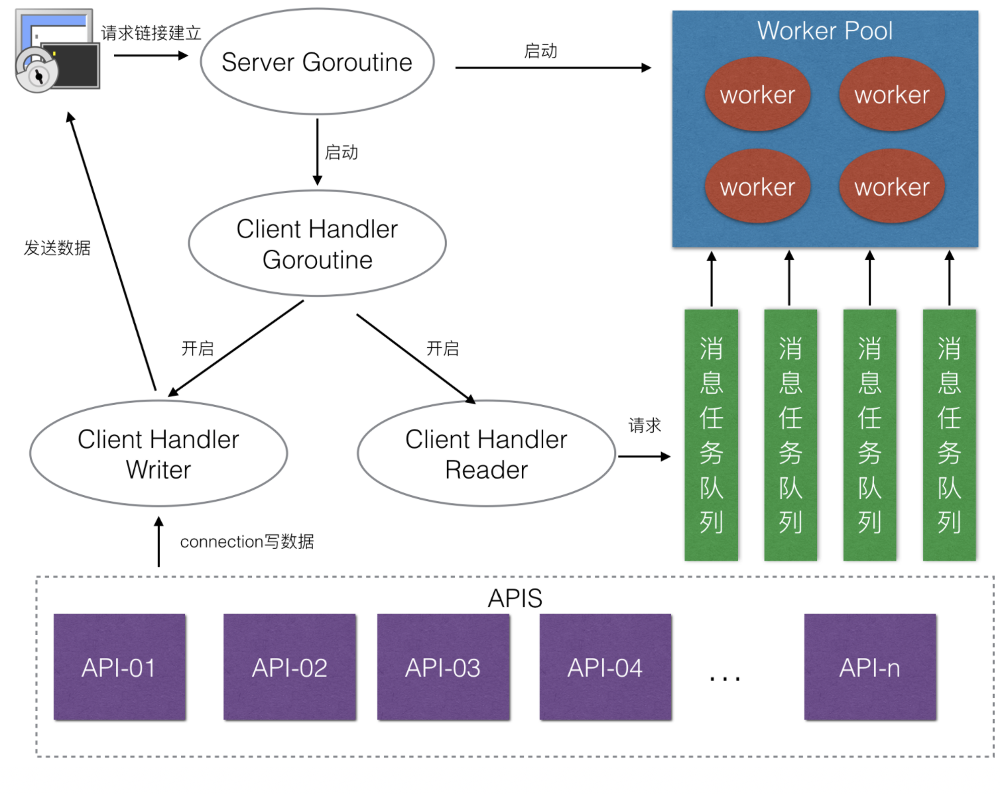
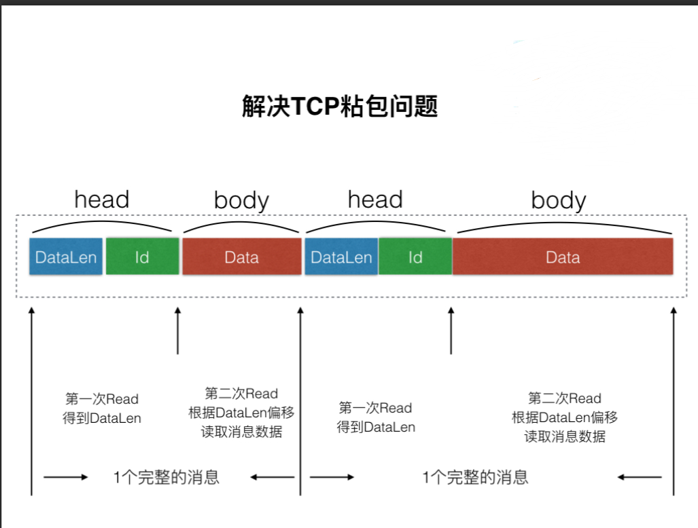
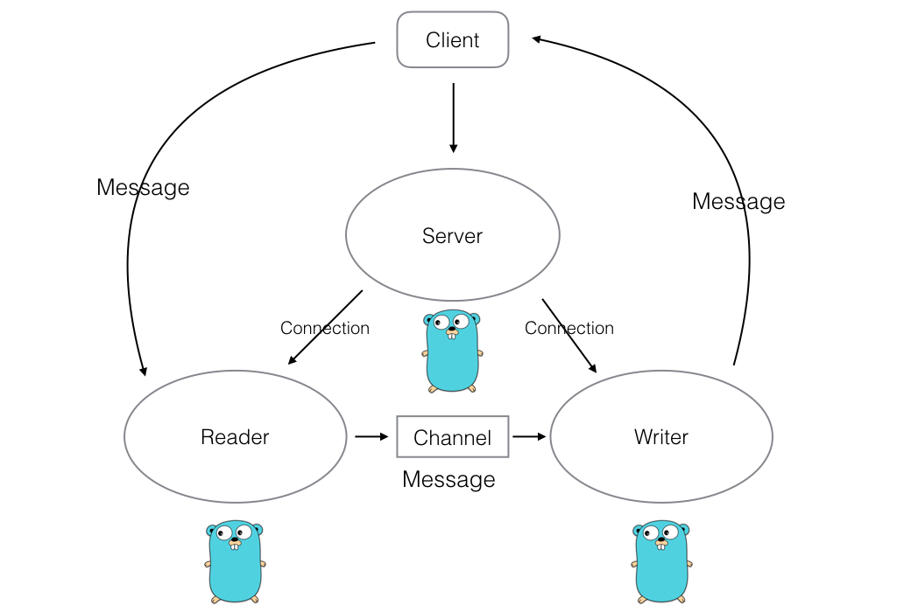
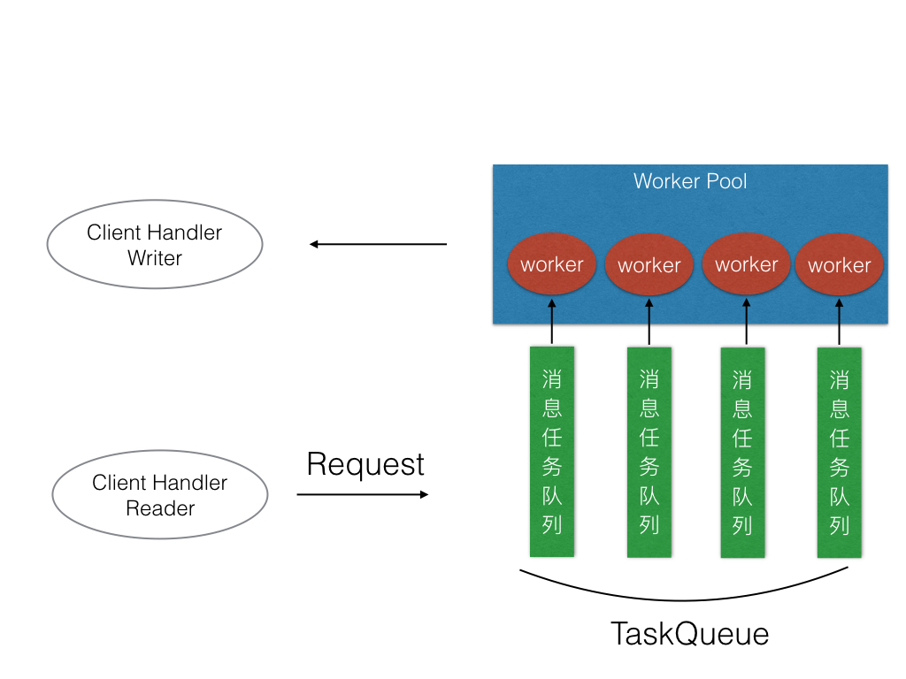

# 架构图

#  初识Ainx框架
为了更好的看到Zinx框架，首先Zinx构建Zinx的最基本的两个模块ziface和znet。

ziface主要是存放一些Zinx框架的全部模块的抽象层接口类，Zinx框架的最基本的是服务类接口iserver，定义在ziface模块中。

znet模块是zinx框架中网络相关功能的实现，所有网络相关模块都会定义在znet模块中。

##  Ainx-V0.1 代码实现

### 创建ainx框架

创建zinx文件夹

### 创建ainterface、anet模块

在zinx/下 创建ziface、znet文件夹, 使当前的文件路径如下：

└── ainx
    ├── ainterface
    │  
    └── anet

### ainterface下创建服务模块抽象层iserver.go

>ainx/ainterface/iserver.go

```go
package ainterface

//定义服务器接口
type IServer interface{
    //启动服务器方法
    Start()
    //停止服务器方法
    Stop()
    //开启业务服务方法
    Serve()
}

```

### 在anet下实现服务模块server.go
```go
package anet

import (
	"ainx/ainterface"
	"fmt"
	"net"
	"time"
)

type Server struct {
	// 设置服务器名称
	Name string
	// 设置网络协议版本
	IPVersion string
	// 设置服务器绑定IP
	IP string
	// 设置端口号
	Port string
}

//============== 实现 ainterface.IServer 里的全部接口方法 ========

// 开启网络服务
func (s *Server) Start() {
	fmt.Printf("[START] Server listenner at IP: %s, Port %s, is starting\n", s.IP, s.Port)

	// 开启一个go去做服务端的Listener业务
	go func() {
		// todo 未来目标是提供更多协议，可以利用if或者switch对IPVersion进行判断而选择采取哪种协议
		//1 获取一个TCP的Addr
		addr, err := net.ResolveTCPAddr(s.IPVersion, s.IP+":"+s.Port)
		if err != nil {
			fmt.Println("resolve tcp addr err: ", err)
			return
		}
		// 2 监听服务器地址
		listener, err := net.ListenTCP(s.IPVersion, addr)
		if err != nil {
			fmt.Println("listen", s.IPVersion, "err", err)
			return
		}
		//	  已经成功监听
		fmt.Println("start Ainx server  ", s.Name, " success, now listenning...")
		//3 启动server网络连接业务
		for {
			//3.1 阻塞等待客户端建立连接请求
			conn, err := listener.AcceptTCP()
			if err != nil {
				fmt.Println("Accept err ", err)
				continue
			}
			//3.2 TODO Server.Start() 设置服务器最大连接控制,如果超过最大连接，那么则关闭此新的连接

			//3.3 TODO Server.Start() 处理该新连接请求的 业务 方法， 此时应该有 handler 和 conn是绑定的

			//我们这里暂时做一个最大512字节的回显服务
			go func() {
				//不断的循环从客户端获取数据
				for {
					buf := make([]byte, 512)
					cnt, err := conn.Read(buf)
					if err != nil {
						fmt.Println("recv buf err ", err)
						continue
					}
					//回显
					if _, err := conn.Write(buf[:cnt]); err != nil {
						fmt.Println("write back buf err ", err)
						continue
					}
				}
			}()
		}
	}()
}
func (s *Server) Stop() {
	fmt.Println("[STOP] Zinx server , name ", s.Name)
	//TODO  Server.Stop() 将其他需要清理的连接信息或者其他信息 也要一并停止或者清理
}
func (s *Server) Serve() {
	s.Start()
	//TODO Server.Serve() 是否在启动服务的时候 还要处理其他的事情呢 可以在这里添加
	//阻塞,否则主Go退出， listenner的go将会退出
	for {
		time.Sleep(10 * time.Second)
	}
}

/*
创建一个服务器句柄
*/
func NewServer(name string) ainterface.IServer {
	s := &Server{
		Name:      name,
		IPVersion: "tcp4",
		IP:        "0.0.0.0",
		Port:      "8080",
	}
	return s
}

```


好了，以上我们已经完成了Ainx-V0.1的基本雏形了，虽然只是一个基本的回写客户端数据，那么接下来我们就应该测试我们当前的Ainx-V0.1是否可以使用了。

##  Ainx框架单元测试样例

理论上我们应该可以现在导入zinx框架，然后写一个服务端程序，再写一个客户端程序进行测试，但是我们可以通过Go的单元Test功能，进行单元测试

创建ainx/znet/server_test.go
```go
package anet

import (
	"fmt"
	"net"
	"testing"
	"time"
)

/*
模拟客户端
*/
func ClientTest() {
	fmt.Println("Client Test ... start")
	// 3秒之后发起调用，让服务端有时间启动
	time.Sleep(3 * time.Second)
	conn, err := net.Dial("tcp", "127.0.0.1:8080")
	if err != nil {
		fmt.Println("client start err,exit")
		return
	}
	for {
		_, err := conn.Write([]byte("hello word"))
		if err != nil {
			fmt.Println("client start err,exit")
			return
		}
		buf := make([]byte, 520)
		cnt, err := conn.Read(buf)
		if err != nil {
			fmt.Println("Read buf error")
			return
		}
		fmt.Printf("Server call back : %s,cnt =%d \n ", buf[:cnt], cnt)
		time.Sleep(1 * time.Second)

	}
}

// Server 模块测试函数
func TestServer(t *testing.T) {
	/*
		服务端测试
	*/
	//
	s := NewServer("first")
	go ClientTest()
	s.Serve()
}

```
之后便可以运行测试程序程序进行测试
**测试结果**
```shell
=== RUN   TestServer
[START] Server listenner at IP: 0.0.0.0, Port 8080, is starting
Client Test ... start
start Ainx server   first  success, now listenning...
Server call back : hello word,cnt =10 
 Server call back : hello word,cnt =10 
 Server call back : hello word,cnt =10 
 Server call back : hello word,cnt =10 
```

## Ainx-V0.2-简单的连接封装与业务绑定 
V0.1版本我们已经实现了了⼀一个基础的Server框架，现在我们需要对客户端链接和不不同的客户端链接所处 理理的不不同业务再做⼀一层接⼝口封装，当然我们先是把架构搭建起来。 					
现在在 ainterface 下创建⼀一个属于链接的接⼝口⽂文件 iconnection.go ，当然他的实现⽂文件我们放在 znet 下的 connection.go 中。 
### ziface创建iconnection.go 
>ainx/ainterface/iconnection.go 

```go
package ainterface

import "net"

type IConnection interface {
	// 启动连接，让当前连接开始工作
	Start()
	// 停止链接，结束当前连接状态
	Stop()
	//从当前连接获取原始的socket TCPConn GetTCPConnection() *net.TCPConn //获取当前连接ID
	GetConnID() uint32 //获取远程客户端地址信息 RemoteAddr() net.Addr
}

// 定义⼀一个统⼀一处理理链接业务的接⼝口
type HandFunc func(*net.TCPConn, []byte, int) error

```
该接⼝的⼀些基础方法，代码注释已经介绍的很清楚，这里先简单说明⼀个HandFunc这个函数类型， 这个是所有conn链接在处理业务的函数接⼝，第⼀参数是socket原⽣链接，第二个参数是客户端请求的数据，第三个参数是客户端请求的数据长度。这样，如果我们想要指定⼀一个conn的处理业务，只要定义一个HandFunc类型的函数，然后和该链接绑定就可以了了。 		

###  znet 创建iconnection.go 
>ainx/anet/connection.go 

```go
package anet

import (
	"ainx/ainterface"
	"fmt"
	"net"
)

type Connection struct {
	//当前链接的socket TCP套接字
	Conn *net.TCPConn
	// 当前链接的ID也可以称作SessionID，ID全局唯一
	ConnID uint32
	// 当前链接的关闭状态
	isClosed bool
	// 处理该链接方法的API
	handleAPI ainterface.HandFunc
	// 告知该链接已经退出/停止的channel
	ExitBuffChan chan bool
}

// 创建链接的方法
func NewConnection(conn *net.TCPConn, connID uint32, callback_api ainterface.HandFunc) *Connection {
	c := &Connection{
		Conn:         conn,
		ConnID:       connID,
		isClosed:     false,
		handleAPI:    callback_api,
		ExitBuffChan: make(chan bool, 1),
	}
	return c
}

// 处理conn读数据的Goroutine
func (c *Connection) StartReader() {
	fmt.Println("Reader Goroutine is running")
	defer fmt.Println(c.RemoteAddr().String(), "conn reader exit!")
	defer c.Stop()
	for {
		buf := make([]byte, 512)
		cnt, err := c.Conn.Read(buf)
		// 读取数据失败，退出连接
		if err != nil {
			fmt.Println("recv buf err ", err)
			c.ExitBuffChan <- true
			continue
		}
		// 调用当前业务链（这里执行的是当前conn的绑定的handle方法）
		if err := c.handleAPI(c.Conn, buf, cnt); err != nil {
			fmt.Println("connID ", c.ConnID, "handle is err")
			c.ExitBuffChan <- true
			return
		}

	}
}

// 启动连接，让当前链接工作
func (c *Connection) Start() {
	// 开启处理该链接读取到客户端数据之后的请求业务
	go c.StartReader()
	for {
		select {
		case <-c.ExitBuffChan:
			// 得到退出消息，不再阻塞
			return
		}
	}
}

// 停止链接，结束当前链接状态M
func (c *Connection) Stop() {
	//1.如果当前链接关闭
	if c.isClosed == true {
		return
	}
	c.isClosed = true
	//TODO Connection Stop() 如果用户注册了该链接的关闭回调业务，那么在此刻应该显示调用

	// 关闭socket链接
	err := c.Conn.Close()
	if err != nil {
		return
	}

	//通知从缓冲队列读数据的业务，该链接已经关闭
	c.ExitBuffChan <- true

	//关闭该链接全部管道
	close(c.ExitBuffChan)
}

// 从当前链接获取原始的socket TCPConn
func (c *Connection) GetTCPConnection() *net.TCPConn {
	return c.Conn
}

// 获取当前链接ID
func (c *Connection) GetConnID() uint32 {
	return c.ConnID
}

// 获取远程客户端地址信息
func (c *Connection) RemoteAddr() net.Addr {
	return c.Conn.RemoteAddr()
}

```

### 重新更更正⼀一下Server.go中 处理理conn的连接业务 
>ainx/anet/server.go 

```go
package anet

import (
	"ainx/ainterface"
	"errors"
	"fmt"
	"net"
	"time"
)

type Server struct {
	// 设置服务器名称
	Name string
	// 设置网络协议版本
	IPVersion string
	// 设置服务器绑定IP
	IP string
	// 设置端口号
	Port string
}

// ============== 定义当前客户端链接的handle api ===========
func CallBackToClient(conn *net.TCPConn, data []byte, cnt int) error {
	//回显业务
	fmt.Println("[Conn Handle] CallBackToClient ...")
	if _, err := conn.Write(data[:cnt]); err != nil {
		fmt.Println("write back buf err", err)
		return errors.New("CallBackToClient error")
	}
	return nil
}

// ============== 实现 ainterface.IServer 里的全部接口方法 ========
// 开启网络服务
func (s *Server) Start() {
	fmt.Printf("[START] Server listenner at IP: %s, Port %s, is starting\n", s.IP, s.Port)

	// 开启一个go去做服务端的Listener业务
	// todo 未来目标是提供更多协议，可以利用if或者switch对IPVersion进行判断而选择采取哪种协议，下面整个方法要重写
	go func() {
		//1 获取一个TCP的Addr
		addr, err := net.ResolveTCPAddr(s.IPVersion, s.IP+":"+s.Port)
		if err != nil {
			fmt.Println("resolve tcp addr err: ", err)
			return
		}
		// 2 监听服务器地址
		listener, err := net.ListenTCP(s.IPVersion, addr)
		if err != nil {
			fmt.Println("listen", s.IPVersion, "err", err)
			return
		}
		//	  已经成功监听
		fmt.Println("start Ainx server  ", s.Name, " success, now listenning...")

		//TODO server.go 应该有一个自动生成ID的方法
		var cid uint32
		cid = 0
		//3 启动server网络连接业务
		for {
			//3.1 阻塞等待客户端建立连接请求
			conn, err := listener.AcceptTCP()
			if err != nil {
				fmt.Println("Accept err ", err)
				continue
			}
			//3.2 TODO Server.Start() 设置服务器最大连接控制,如果超过最大连接，那么则关闭此新的连接

			//3.3 处理该新连接请求的 业务 方法， 此时应该有 handler 和 conn是绑定的
			dealConn := NewConnection(conn, cid, CallBackToClient)
			cid++

			//3.4 启动当前链接的处理业务
			go dealConn.Start()
		}
	}()
}
func (s *Server) Stop() {
	fmt.Println("[STOP] Zinx server , name ", s.Name)
	//TODO  Server.Stop() 将其他需要清理的连接信息或者其他信息 也要一并停止或者清理
}
func (s *Server) Serve() {
	s.Start()
	//TODO Server.Serve() 是否在启动服务的时候 还要处理其他的事情呢 可以在这里添加
	//阻塞,否则主Go退出， listenner的go将会退出
	for {
		time.Sleep(10 * time.Second)
	}
}

/*
创建一个服务器句柄
*/
func NewServer(name string) ainterface.IServer {
	s := &Server{
		Name:      name,
		IPVersion: "tcp4",
		IP:        "0.0.0.0",
		Port:      "8080",
	}
	return s
}
```
CallBackToClient 是我们给当前客户端conn对象绑定的handle⽅方法，当然⽬目前是server端强制绑定 的回显业务，我们之后会丰富框架，让这个⽤用户可以让⽤用户⾃自定义指定handle。 
在 start() ⽅方法中，我们主要做了了如下的修改: 
```go
	//3.3 处理该新连接请求的 业务 方法， 此时应该有 handler 和 conn是绑定的
	dealConn := NewConntion(conn, cid, CallBackToClient)
	cid +
	//3.4 启动当前链接的处理业务
	go dealConn.Start()
```
实际上，⽬目前Zinx框架的对外接⼝口并未改变，所以V0.1的测试依然有效。我们依然可以启动V0.1的测试类经行测试，测试结果如下
```shell
=== RUN   TestServer
[START] Server listenner at IP: 0.0.0.0, Port 8080, is starting
Client Test ... start
start Ainx server   first  success, now listenning...
Reader Goroutine is running
[Conn Handle] CallBackToClient ...
Server call back : hello word,cnt =10 
 [Conn Handle] CallBackToClient ...
Server call back : hello word,cnt =10 
 [Conn Handle] CallBackToClient ...
Server call back : hello word,cnt =10 
 [Conn Handle] CallBackToClient ...
Server call back : hello word,cnt =10 
 [Conn Handle] CallBackToClient ...
Server call back : hello word,cnt =10 
 [Conn Handle] CallBackToClient ...
Server call back : hello word,cnt =10 
```
# Ainx框架基础路由模块
现在我们就给用户提供一个自定义的conn处理业务的接口吧，很显然，我们不能把业务处理的方法绑死在`type HandFunc func(*net.TCPConn, []byte, int) error`这种格式中，我们需要定一些interface{}来让用户填写任意格式的连接处理业务方法。

那么，很显然func是满足不了我们需求的，我们需要再做几个抽象的接口类。

## IRequest 消息请求抽象类
我们现在需要把客户端请求的连接信息 和 请求的数据，放在一个叫Request的请求类里，这样的好处是我们可以从Request里得到全部客户端的请求信息，也为我们之后拓展框架有一定的作用，一旦客户端有额外的含义的数据信息，都可以放在这个Request里。可以理解为每次客户端的全部请求数据，Zinx都会把它们一起放到一个Request结构体里。

### 创建抽象IRequest层
在ainterface下创建新文件irequest.go。
>ainx/ainterface/irequest.go

```go
package ainterface

/*
IRequest 接口
实际是把客户端请求链接信息和请求数据包放在Request里
*/
type IRequest interface {
	GetConnection() IConnection //获取请求链接信息
	GetData() []byte            //获取请求消息的数据
	GetMsgID() uint32           //获取消息ID
}

```
不难看出，当前的抽象层只提供了两个Getter方法，所以有个成员应该是必须的，一个是客户端连接，一个是客户端传递进来的数据，当然随着Zinx框架的功能丰富，这里面还应该继续添加新的成员。

### 实现Request类
在anet下创建IRequest抽象接口的一个实例类文件request.go
>ainx/anet/request.go

```go
package anet

import "ainx/ainterface"

type Request struct {
	conn ainterface.IConnection //已经和客户端建立好的链接
	date []byte                 //客户端请求数据
}

// 获取请求链接信息
func (r *Request) GetConnection() ainterface.IConnection {
	return r.conn
}

// 获取请求消息的数据
func (r *Request) GetData() []byte {
	return r.msg.GetData()
}

// 获取请求的消息的ID
func (r *Request) GetMsgID() uint32 {
	return r.msg.GetMsgId()
}

```

## IRouter 路由配置抽象类
现在我们来给Zinx实现一个非常简单基础的路由功能，目的当然就是为了快速的让Zinx步入到路由的阶段。后续我们会不断的完善路由功能。

### 创建抽象的IRouter层
在ainterface下创建irouter.go文件
>ainx/ainterface/irouter.go

```go
package ainterface

/*
	   路由接口，这里路由是 使用框架框架者给该链接自定的 处理业务方法
		路由里的IRequest 则包含用该链接的链接信息和该链接的请求数据信息
*/
type IRouter interface {
	PreHandle(request IRequest)  //在处理conn业务之前的钩子方法
	Handle(request IRequest)     //处理conn业务的方法
	PostHandle(request IRequest) //处理conn业务之后的钩子方法
}
```
我们知道router实际上的作用就是，服务端应用可以给Zinx框架配置当前链接的处理业务方法，之前的Zinx-V0.2我们的Zinx框架处理链接请求的方法是固定的，现在是可以自定义，并且有3种接口可以重写。

**Handle**：是处理当前链接的主业务函数

**PreHandle**：如果需要在主业务函数之前有前置业务，可以重写这个方法

**PostHandle**:如果需要在主业务函数之后又后置业务，可以重写这个方法

当然每个方法都有一个唯一的形参IRequest对象，也就是客户端请求过来的连接和请求数据，作为我们业务方法的输入数据。
### 实现Router类
在anet下创建router.go文件
```go
package anet

import (
	"ainx/ainterface"
)

// 实现router时，先嵌入这个基类，然后根据需要对这个基类的方法进行重写
type BaseRouter struct{}

// 这里之所以BaseRouter的方法都为空，
// 是因为有的Router不希望有PreHandle或PostHandle
// 所以Router全部继承BaseRouter的好处是，不需要实现PreHandle和PostHandle也可以实例化
func (br *BaseRouter) PreHandle(req ainterface.IRequest)  {}
func (br *BaseRouter) Handle(req ainterface.IRequest)     {}
func (br *BaseRouter) PostHandle(req ainterface.IRequest) {}
```
我们当前的ainx目录结构应该如下：
```shell
├─ainterface
│      iconnection.go
│      irequest.go
│      irouter.go
│      iserver.go
│
└─anet
        connection.go
        request.go
        router.go
        server.go
        server_test.go
```
## Ainx-V0.3-集成简单路由功能
### IServer增添路由添加功能
我们需要给IServer类，增加一个抽象方法AddRouter,目的也是让Ainx框架使用者，可以自定一个Router处理业务方法。
>ainx/ainterface/irouter.go
```go
// 定义服务器接口
type IServer interface {
	//启动服务器方法
	Start()
	//停止服务器方法
	Stop()
	//开启业务服务方法
	Serve()
	//路由功能：给当前服务注册一个路由业务方法，供客户端链接处理使用
	AddRouter(router IRouter)
	// todo 路由分组 未来目标 添加类似hertz Group分组

}

```
###  Server类增添Router成员
有了抽象的方法，自然Server就要实现，并且还要添加一个Router成员.
>ainx/anet/server.go
```go
type Server struct {
	// 设置服务器名称
	Name string
	// 设置网络协议版本
	IPVersion string
	// 设置服务器绑定IP
	IP string
	// 设置端口号
	Port string
	//当前Server由用户绑定的回调router,也就是Server注册的链接对应的处理业务
	Router ainterface.IRouter
	//todo 未来目标提供更多option字段来控制server实例化
}
```
然后NewServer()方法， 初始化Server对象的方法也要加一个初始化成员
```go

/*
创建一个服务器句柄
*/
func NewServer(name string) ainterface.IServer {
	s := &Server{
		Name:      name,
		IPVersion: "tcp4",
		IP:        "0.0.0.0",
		Port:      "8080",
		Router:    nil,
	}
	return s
}
```
### Connection类绑定一个Router成员
>ainx/anet/connection.go
```go
type Connection struct {
	//当前链接的socket TCP套接字
	Conn *net.TCPConn
	// 当前链接的ID也可以称作SessionID，ID全局唯一
	ConnID uint32
	// 当前链接的关闭状态
	isClosed bool

	//该连接的处理方法router
	Router ainterface.IRouter

	// 告知该链接已经退出/停止的channel
	ExitBuffChan chan bool
}
```

### 在Connection调用注册的Router处理业务
>ainx/anet/connection.go
```go
// 处理conn读数据的Goroutine
func (c *Connection) StartReader() {
	fmt.Println("Reader Goroutine is  running")
	defer fmt.Println(c.RemoteAddr().String(), " conn reader exit!")
	defer c.Stop()

	for {
		//读取我们最大的数据到buf中
		buf := make([]byte, 512)
		_, err := c.Conn.Read(buf)
		if err != nil {
			fmt.Println("recv buf err ", err)
			c.ExitBuffChan <- true
			continue
		}
		//得到当前客户端请求的Request数据
		req := Request{
			conn: c,
			data: buf,
		}
		//从路由Routers 中找到注册绑定Conn的对应Handle
		go func(request ainterface.IRequest) {
			//执行注册的路由方法
			c.Router.PreHandle(request)
			c.Router.Handle(request)
			c.Router.PostHandle(request)
		}(&req)
	}
}
```
这里我们在conn读取完客户端数据之后，将数据和conn封装到一个Request中，作为Router的输入数据。

然后我们开启一个goroutine去调用给Zinx框架注册好的路由业务。

## Ainx-V0.3代码实现
>ainx/anet/server.go
```go
package anet

import (
	"ainx/ainterface"
	"errors"
	"fmt"
	"net"
	"time"
)

type Server struct {
	// 设置服务器名称
	Name string
	// 设置网络协议版本
	IPVersion string
	// 设置服务器绑定IP
	IP string
	// 设置端口号
	Port string
	//当前Server由用户绑定的回调router,也就是Server注册的链接对应的处理业务
	Router ainterface.IRouter
	//todo 未来目标提供更多option字段来控制server实例化
}

// ============== 定义当前客户端链接的handle api ===========
func CallBackToClient(conn *net.TCPConn, data []byte, cnt int) error {
	//回显业务
	fmt.Println("[Conn Handle] CallBackToClient ...")
	if _, err := conn.Write(data[:cnt]); err != nil {
		fmt.Println("write back buf err", err)
		return errors.New("CallBackToClient error")
	}
	return nil
}

// ============== 实现 ainterface.IServer 里的全部接口方法 ========
// 开启网络服务
func (s *Server) Start() {
	fmt.Printf("[START] Server listenner at IP: %s, Port %s, is starting\n", s.IP, s.Port)

	// 开启一个go去做服务端的Listener业务
	// todo 未来目标是提供更多协议，可以利用if或者switch对IPVersion进行判断而选择采取哪种协议，下面整个方法要重写
	go func() {
		//1 获取一个TCP的Addr
		addr, err := net.ResolveTCPAddr(s.IPVersion, s.IP+":"+s.Port)
		if err != nil {
			fmt.Println("resolve tcp addr err: ", err)
			return
		}
		// 2 监听服务器地址
		listener, err := net.ListenTCP(s.IPVersion, addr)
		if err != nil {
			fmt.Println("listen", s.IPVersion, "err", err)
			return
		}
		//	  已经成功监听
		fmt.Println("start Ainx server  ", s.Name, " success, now listenning...")

		//TODO server.go 应该有一个自动生成ID的方法
		var cid uint32
		cid = 0
		//3 启动server网络连接业务
		for {
			//3.1 阻塞等待客户端建立连接请求
			conn, err := listener.AcceptTCP()
			if err != nil {
				fmt.Println("Accept err ", err)
				continue
			}
			//3.2 TODO Server.Start() 设置服务器最大连接控制,如果超过最大连接，那么则关闭此新的连接

			//3.3 处理该新连接请求的 业务 方法， 此时应该有 handler 和 conn是绑定的
			dealConn := NewConnection(conn, cid, s.Router)
			cid++

			//3.4 启动当前链接的处理业务
			go dealConn.Start()
		}
	}()
}
func (s *Server) Stop() {
	fmt.Println("[STOP] Zinx server , name ", s.Name)
	//TODO  Server.Stop() 将其他需要清理的连接信息或者其他信息 也要一并停止或者清理
}
func (s *Server) Serve() {
	s.Start()
	//TODO Server.Serve() 是否在启动服务的时候 还要处理其他的事情呢 可以在这里添加
	//阻塞,否则主Go退出， listenner的go将会退出
	for {
		time.Sleep(10 * time.Second)
	}
}
func (s *Server) AddRouter(router ainterface.IRouter) {
	s.Router = router
	fmt.Println("Add Router succ! ")
}

/*
创建一个服务器句柄
*/
func NewServer(name string) ainterface.IServer {
	s := &Server{
		Name:      name,
		IPVersion: "tcp4",
		IP:        "0.0.0.0",
		Port:      "8080",
		Router:    nil,
	}
	return s
}

```

>ainx/anet/conneciont.go
```go
package anet

import (
	"ainx/ainterface"
	"fmt"
	"net"
)

type Connection struct {
	//当前链接的socket TCP套接字
	Conn *net.TCPConn
	// 当前链接的ID也可以称作SessionID，ID全局唯一
	ConnID uint32
	// 当前链接的关闭状态
	isClosed bool

	//该连接的处理方法router
	Router ainterface.IRouter

	// 告知该链接已经退出/停止的channel
	ExitBuffChan chan bool
}

func (c *Connection) GetConnection() net.Conn {

	return c.Conn
}

// 创建链接的方法
func NewConnection(conn *net.TCPConn, connID uint32, router ainterface.IRouter) *Connection {
	c := &Connection{
		Conn:         conn,
		ConnID:       connID,
		isClosed:     false,
		Router:       router,
		ExitBuffChan: make(chan bool, 1),
	}
	return c
}

// 处理conn读数据的Goroutine
func (c *Connection) StartReader() {
	fmt.Println("Reader Goroutine is  running")
	defer fmt.Println(c.RemoteAddr().String(), " conn reader exit!")
	defer c.Stop()

	for {
		//读取我们最大的数据到buf中
		buf := make([]byte, 512)
		_, err := c.Conn.Read(buf)
		if err != nil {
			fmt.Println("recv buf err ", err)
			c.ExitBuffChan <- true
			continue
		}
		//得到当前客户端请求的Request数据
		req := Request{
			conn: c,
			data: buf,
		}
		//从路由Routers 中找到注册绑定Conn的对应Handle
		go func(request ainterface.IRequest) {
			//执行注册的路由方法
			c.Router.PreHandle(request)
			c.Router.Handle(request)
			c.Router.PostHandle(request)
		}(&req)
	}
}

// 启动连接，让当前链接工作
func (c *Connection) Start() {
	// 开启处理该链接读取到客户端数据之后的请求业务
	go c.StartReader()
	for {
		select {
		case <-c.ExitBuffChan:
			// 得到退出消息，不再阻塞
			return
		}
	}
}

// 停止链接，结束当前链接状态M
func (c *Connection) Stop() {
	//1.如果当前链接关闭
	if c.isClosed == true {
		return
	}
	c.isClosed = true
	//TODO Connection Stop() 如果用户注册了该链接的关闭回调业务，那么在此刻应该显示调用

	// 关闭socket链接
	err := c.Conn.Close()
	if err != nil {
		return
	}

	//通知从缓冲队列读数据的业务，该链接已经关闭
	c.ExitBuffChan <- true

	//关闭该链接全部管道
	close(c.ExitBuffChan)
}

// 从当前链接获取原始的socket TCPConn
func (c *Connection) GetTCPConnection() *net.TCPConn {
	return c.Conn
}

// 获取当前链接ID
func (c *Connection) GetConnID() uint32 {
	return c.ConnID
}

// 获取远程客户端地址信息
func (c *Connection) RemoteAddr() net.Addr {
	return c.Conn.RemoteAddr()
}

```

## 使用Ainx-V0.3完成应用程序
接下来我们在基于Ainx写服务器，就可以配置一个简单的路由功能了。
>Server.go

```go
package main

import (
	"fmt"
	"net"
	"time"
)

/*
模拟客户端
*/
func main() {

	fmt.Println("Client Test ... start")
	//3秒之后发起测试请求，给服务端开启服务的机会
	time.Sleep(3 * time.Second)

	conn, err := net.Dial("tcp", "127.0.0.1:8080")
	if err != nil {
		fmt.Println("client start err, exit!")
		return
	}

	for {
		_, err := conn.Write([]byte("Ainx V0.3"))
		if err != nil {
			fmt.Println("write error err ", err)
			return
		}

		buf := make([]byte, 512)
		cnt, err := conn.Read(buf)
		if err != nil {
			fmt.Println("read buf error ")
			return
		}

		fmt.Printf(" server call back : %s, cnt = %d\n", buf, cnt)

		time.Sleep(1 * time.Second)
	}
}

```

>Client.go
```go
package main

import (
	"ainx/ainterface"
	"ainx/anet"
	"fmt"
)

// ping test 自定义路由
type PingRouter struct {
	anet.BaseRouter //一定要先基础BaseRouter
}

// Test PreHandle
func (this *PingRouter) PreHandle(request ainterface.IRequest) {
	fmt.Println("Call Router PreHandle")
	_, err := request.GetConnection().GetConnection().Write([]byte("before ping ....\n"))
	if err != nil {
		fmt.Println("call back ping ping ping error")
	}
}

// Test Handle
func (this *PingRouter) Handle(request ainterface.IRequest) {
	fmt.Println("Call PingRouter Handle")
	_, err := request.GetConnection().GetConnection().Write([]byte("ping...ping...ping\n"))
	if err != nil {
		fmt.Println("call back ping ping ping error")
	}
}

// Test PostHandle
func (this *PingRouter) PostHandle(request ainterface.IRequest) {
	fmt.Println("Call Router PostHandle")
	_, err := request.GetConnection().GetConnection().Write([]byte("After ping .....\n"))
	if err != nil {
		fmt.Println("call back ping ping ping error")
	}
}

func main() {
	//创建一个server句柄
	s := anet.NewServer("[ainx V0.3]")

	s.AddRouter(&PingRouter{})

	//2 开启服务
	s.Serve()
}

```
# Ainx的全局配置
随着架构逐步的变大，参数就会越来越多，为了省去我们后续大频率修改参数的麻烦，接下来Zinx需要做一个加载配置的模块，和一个全局获取Ainx参数的对象。
## Ainx-V0.4增添全局配置代码实现
我们先做一个简单的加载配置模块，要加载的配置文件的文本格式，就选择比较通用的yaml格式，配置信息暂时如下:
>config.yaml
```yaml
Name:          AinxServerApp
Version:       V0.4
TcpPort:       8080
Host:          127.0.0.1
MaxConn:       12000
MaxPacketSize: 4096
```
现在我们需要建立一个全局配置信息的对象
###  创建全局参数文件
创建ainx/utils文件夹，在下面创建globalload.go文件,暂时编写如下。
>ainx/utils/globalload.go
```go
package utils

import (
	"ainx/ainterface"
	"fmt"
	"github.com/spf13/viper"
)

/*
存储一切有关Zinx框架的全局参数，供其他模块使用
一些参数也可以通过 用户根据 zinx.json来配置
*/
type GlobalSet struct {
	TcpServer ainterface.IServer //当前Zinx的全局Server对象
	Host      string             //当前服务器主机IP
	TcpPort   string             //当前服务器主机监听端口号
	Name      string             //当前服务器名称
	Version   string             //当前Zinx版本号

	MaxPacketSize uint32 //都需数据包的最大值
	MaxConn       uint32 //当前服务器主机允许的最大链接个数
}
/*
定义一个全局的对象
*/
var GlobalSetting *GlobalSet

```
###  提供init初始化方法
然后我们提供一个init()方法，目的是初始化GlobalSetting 对象，和加载服务端应用配置文件在根目录下config.yaml,这里为了支持对yaml文件的解析，引入了第三方库viper，具体用法可以看中文文档https://golang.halfiisland.com/community/pkgs/Viper.html
>zinx/utils/globalobj.go
```go
// todo 未来支持多种配置文件格式
// 读取用户的配置文件
func (g *GlobalSet) Reload() {
	vp := viper.New()          //创建viper对象
	vp.SetConfigName("config") //配置文件的名称
	vp.AddConfigPath("./")
	vp.SetConfigType("yaml") //配置文件的拓展名
	err := vp.ReadInConfig() //读取配置文件的内容
	if err != nil {
		panic(err)
	}
	//将json数据解析到struct中

	err = vp.Unmarshal(&GlobalSetting)
	if err != nil {
		fmt.Println(GlobalSetting.Host)
		return
	}
}

/*
提供init方法，默认加载
*/
func init() {
	//初始化GlobalObject变量，设置一些默认值
	GlobalSetting = &GlobalSet{
		Name:          "AinxServerApp",
		Version:       "V0.4",
		TcpPort:       "8080",
		Host:          "0.0.0.0",
		MaxConn:       12000,
		MaxPacketSize: 4096,
	}
}
```
目录结构
```shell
│  config.yaml
│
├─ainterface
│      iconnection.go
│      irequest.go
│      irouter.go
│      iserver.go
│
├─anet
│      connection.go
│      request.go
│      router.go
│      server.go
│      server_test.go
│
├─examples
│  └─v03
│      ├─client
│      │      Client.go
│      │
│      └─server
│              Server.go
│
└─utils
        globalload.go

```
因为我们并未改变对外接口，所以v0.3的服务仍然使用v0.4，可以使用examples下的v0.3的服务端和客户端进行测试。
# Ainx的消息封装
接下来我们再对Ainx做一个简单的升级，现在我们把服务器的全部数据都放在一个Request里，当前的Request结构如下：
```go
type Request struct {
    conn ziface.IConnection //已经和客户端建立好的链接
    data []byte             //客户端请求的数据
}
```
很明显，现在是用一个[]byte来接受全部数据，又没有长度，又没有消息类型，这不科学。怎么办呢？我们现在就要自定义一种消息类型，把全部的消息都放在这种消息类型里。
## 创建消息封装类型
在ainx/ainterface/下创建imessage.go文件

>ainx/ainterface/imessage.go
```go
package ainterface

/*
将请求的一个消息封装到message中，定义抽象层接口
*/
type IMessage interface {
	GetDataLen() uint32 //获取消息数据段长度
	GetMsgId() uint32   //获取消息ID
	GetData() []byte    //获取消息内容

	SetMsgId(uint32)   //设计消息ID
	SetData([]byte)    //设计消息内容
	SetDataLen(uint32) //设置消息数据段长度
}

```
同时创建实例message类，在ainx/anet/下，创建message.go文件
>ainx/anet/message.go

```go
package anet

type Message struct {
	Id      uint32 //消息的ID
	DataLen uint32 //消息的长度
	Data    []byte //消息的内容
}

// 创建一个Message消息包
func NewMsgPackage(id uint32, data []byte) *Message {
	return &Message{
		Id:      id,
		DataLen: uint32(len(data)),
		Data:    data,
	}
}

// 获取消息数据段长度
func (msg *Message) GetDataLen() uint32 {
	return msg.DataLen
}

// 获取消息ID
func (msg *Message) GetMsgId() uint32 {
	return msg.Id
}

// 获取消息内容
func (msg *Message) GetData() []byte {
	return msg.Data
}

// 设置消息数据段长度
func (msg *Message) SetDataLen(len uint32) {
	msg.DataLen = len
}

// 设计消息ID
func (msg *Message) SetMsgId(msgId uint32) {
	msg.Id = msgId
}

// 设计消息内容
func (msg *Message) SetData(data []byte) {
	msg.Data = data
}

```
整理一个基本的message包，会包含消息ID，数据，数据长度三个成员，提供基本的setter和getter方法，目的是为了以后做封装优化的作用。同时也提供了一个创建一个message包的初始化方法NewMegPackage。

## 消息的封包与拆包
我们这里就是采用经典的TLV(Type-Len-Value)封包格式来解决TCP粘包问题吧。

由于Ainx也是TCP流的形式传播数据，难免会出现消息1和消息2一同发送，那么zinx就需要有能力区分两个消息的边界，所以Ainx此时应该提供一个统一的拆包和封包的方法。在发包之前打包成如上图这种格式的有head和body的两部分的包，在收到数据的时候分两次进行读取，先读取固定长度的head部分，得到后续Data的长度，再根据DataLen读取之后的body。这样就能够解决粘包的问题了。

###  创建拆包封包抽象类
在ainx/ainterface下，创建idatapack.go文件
ainterface
>ainx/ainterface/idatapack.go

```go
package ainterface

/*
封包数据和拆包数据
直接面向TCP链接中的数据流，为传输数据添加头部信息，用于处理TCP粘包问题。
*/
type IDataPack interface {
	GetHeadLen() uint32                //获取包头长度方法
	Pack(msg IMessage) ([]byte, error) //封包方法
	Unpack([]byte) (IMessage, error)   //拆包方法
}
```

### 实现拆包封包类
在ainx/anet/下，创建datapack.go文件.
>ainx/anet/datapack.go
```go
package anet

import (
	"ainx/ainterface"
	"ainx/utils"
	"bytes"
	"encoding/binary"
	"errors"
)

// 封包拆包实例，暂时不需要成员
type DataPack struct {
}

// 封包拆包实例初始化方法
func NewDataPack() *DataPack {
	return &DataPack{}
}

// 获取包头长度方法
func (dp *DataPack) GetHeadLen() uint32 {
	//Id uint32(4字节) +  DataLen uint32(4字节)
	return 8
}

// 封包方法(压缩)
func (dp *DataPack) Pack(msg ainterface.IMessage) ([]byte, error) {
	// 创建一个存放bytes字节的缓冲
	dataBuff := bytes.NewBuffer([]byte{})
	////写dataLen
	//字节序 就是多字节数据类型 (int, float 等)在内存中的存储顺序。可分为大端序，低地址端存放高位字节；小端序与之相反，低地址端存放低位字节。
	if err := binary.Write(dataBuff, binary.LittleEndian, msg.GetDataLen()); err != nil {
		return nil, err
	}
	//写msgID
	if err := binary.Write(dataBuff, binary.LittleEndian, msg.GetMsgId()); err != nil {
		return nil, err
	}

	//写data数据
	if err := binary.Write(dataBuff, binary.LittleEndian, msg.GetData()); err != nil {
		return nil, err
	}

	return dataBuff.Bytes(), nil
}

// 拆包方法(解压数据)
func (dp *DataPack) Unpack(binaryData []byte) (ainterface.IMessage, error) {
	//创建一个从输入二进制数据的ioReader
	dataBuff := bytes.NewReader(binaryData)

	//只解压head的信息，得到dataLen和msgID
	msg := &Message{}

	//读dataLen
	if err := binary.Read(dataBuff, binary.LittleEndian, &msg.DataLen); err != nil {
		return nil, err
	}

	//读msgID
	if err := binary.Read(dataBuff, binary.LittleEndian, &msg.Id); err != nil {
		return nil, err
	}

	//判断dataLen的长度是否超出我们允许的最大包长度
	if utils.GlobalSetting.MaxPacketSize > 0 && msg.DataLen > utils.GlobalSetting.MaxPacketSize {
		return nil, errors.New("Too large msg data recieved")
	}

	//这里只需要把head的数据拆包出来就可以了，然后再通过head的长度，再从conn读取一次数据
	return msg, nil
}

```
## Ainx-V0.5代码实现

现在我们需要把封包和拆包的功能集成到Zinx中，并且测试Zinx该功能是否生效。
###  Request字段修改
首先我们要将我们之前的Request中的[]byte类型的data字段改成Message类型.
>ainx/anet/request.go
```go
package anet

import "ainx/ainterface"

type Request struct {
	conn ainterface.IConnection //已经和客户端建立好的链接
	msg  ainterface.IMessage    //客户端请求数据
}

// 获取请求链接信息
func (r *Request) GetConnection() ainterface.IConnection {
	return r.conn
}

// 获取请求消息的数据
func (r *Request) GetData() []byte {
	return r.msg.GetData()
}

// 获取请求的消息的ID
func (r *Request) GetMsgID() uint32 {
	return r.msg.GetMsgId()
}

```
### 集成拆包过程
接下来我们需要在Connection的StartReader()方法中,修改之前的读取客户端的这段代码：
```go
func (c *Connection) StartReader() {
    
	//...
    
	for  {
		//读取我们最大的数据到buf中
		buf := make([]byte, utils.GlobalSetting.MaxPacketSize)
		_, err := c.Conn.Read(buf)
		if err != nil {
			fmt.Println("recv buf err ", err)
			c.ExitBuffChan <- true
			continue
		}
        
        //...
        
    }
}
```
改成如下：

ainx/anet/connection.go

StartReader()方法

```go
// 处理conn读数据的Goroutine
func (c *Connection) StartReader() {
	fmt.Println("Reader Goroutine is  running")
	defer fmt.Println(c.RemoteAddr().String(), " conn reader exit!")
	defer c.Stop()

	for {
		// 创建拆包解包的对象
		dp := NewDataPack()

		//读取客户端的Msg head
		headData := make([]byte, dp.GetHeadLen())
		if _, err := io.ReadFull(c.GetTCPConnection(), headData); err != nil {
			fmt.Println("read msg head error ", err)
			c.ExitBuffChan <- true
			continue
		}

		//拆包，得到msgid 和 datalen 放在msg中
		msg, err := dp.Unpack(headData)
		if err != nil {
			fmt.Println("unpack error ", err)
			c.ExitBuffChan <- true
			continue
		}

		//根据 dataLen 读取 data，放在msg.Data中
		var data []byte
		if msg.GetDataLen() > 0 {
			data = make([]byte, msg.GetDataLen())
			if _, err := io.ReadFull(c.GetTCPConnection(), data); err != nil {
				fmt.Println("read msg data error ", err)
				c.ExitBuffChan <- true
				continue
			}
		}
		msg.SetData(data)

		//得到当前客户端请求的Request数据
		req := Request{
			conn: c,
			msg:  msg, //将之前的buf 改成 msg
		}
		//从路由Routers 中找到注册绑定Conn的对应Handle
		go func(request ainterface.IRequest) {
			//执行注册的路由方法
			c.Router.PreHandle(request)
			c.Router.Handle(request)
			c.Router.PostHandle(request)
		}(&req)
	}
}
```
### 提供封包方法
现在我们已经将拆包的功能集成到Ainx中了，但是使用Ainx的时候，如果我们希望给用户返回一个TLV格式的数据，总不能每次都经过这么繁琐的过程，所以我们应该给Ainx提供一个封包的接口，供Ainx发包使用。
>ainx/ainterface/iconnection.go

新增SendMsg()方法
```go

type IConnection interface {
	// 启动连接，让当前连接开始工作
	Start()
	// 停止链接，结束当前连接状态
	Stop()
	//从当前连接获取原始的socket TCPConn GetTCPConnection() *net.TCPConn //获取当前连接ID
	GetConnID() uint32       //获取远程客户端地址信息 RemoteAddr() net.Addr
	GetConnection() net.Conn //  (从当前连接获取原始的socket TCPConn)
	//直接将Message数据发送数据给远程的TCP客户端
	SendMsg(msgId uint32, data []byte) error
}

// 定义⼀一个统⼀一处理理链接业务的接⼝口
type HandFunc func(*net.TCPConn, []byte, int) error

```

>ainx/anet/connection.go

SendMsg()方法实现:
```go
// 直接将Message数据发送数据给远程的TCP客户端
func (c *Connection) SendMsg(msgId uint32, data []byte) error {
	if c.isClosed == true {
		return errors.New("Connection closed when send msg")
	}
	//将data封包，并且发送
	dp := NewDataPack()
	msg, err := dp.Pack(NewMsgPackage(msgId, data))
	if err != nil {
		fmt.Println("Pack error msg id = ", msgId)
		return errors.New("Pack error msg ")
	}

	//写回客户端
	if _, err := c.Conn.Write(msg); err != nil {
		fmt.Println("Write msg id ", msgId, " error ")
		c.ExitBuffChan <- true
		return errors.New("conn Write error")
	}

	return nil
}

```
## 使用Ainx-V0.5完成应用程序
现在我们可以基于Ainx框架完成发送msg功能的测试用例了。
>Server.go
```go
package main

import (
	"ainx/ainterface"
	"ainx/anet"
	"fmt"
)

// ping test 自定义路由
type PingRouter struct {
	anet.BaseRouter
}

// Test Handle
func (this *PingRouter) Handle(request ainterface.IRequest) {
	fmt.Println("Call PingRouter Handle")
	//先读取客户端的数据，再回写ping...ping...ping
	fmt.Println("recv from client : msgId=", request.GetMsgID, ", data=", string(request.GetData()))

	//回写数据
	err := request.GetConnection().SendMsg(1, []byte("ping...ping...ping"))
	if err != nil {
		fmt.Println(err)
	}
}

func main() {
	//创建一个server句柄
	s := anet.NewServer("Ainx V0.5")

	//配置路由
	s.AddRouter(&PingRouter{})

	//开启服务
	s.Serve()
}

```
>Client.go
```go
package main

import (
	"ainx/anet"
	"fmt"
	"io"
	"net"
	"time"
)

/*
模拟客户端
*/
func main() {

	fmt.Println("Client Test ... start")
	//3秒之后发起测试请求，给服务端开启服务的机会
	time.Sleep(3 * time.Second)

	conn, err := net.Dial("tcp", "127.0.0.1:8080")
	if err != nil {
		fmt.Println("client start err, exit!")
		return
	}

	for {
		//发封包message消息
		dp := anet.NewDataPack()
		msg, _ := dp.Pack(anet.NewMsgPackage(0, []byte("Ainx V0.5 Client Test Message")))
		_, err := conn.Write(msg)
		if err != nil {
			fmt.Println("write error err ", err)
			return
		}

		//先读出流中的head部分
		headData := make([]byte, dp.GetHeadLen())
		_, err = io.ReadFull(conn, headData) //ReadFull 会把msg填充满为止
		if err != nil {
			fmt.Println("read head error")
			break
		}
		//将headData字节流 拆包到msg中
		msgHead, err := dp.Unpack(headData)
		if err != nil {
			fmt.Println("server unpack err:", err)
			return
		}

		if msgHead.GetDataLen() > 0 {
			//msg 是有data数据的，需要再次读取data数据
			msg := msgHead.(*anet.Message)
			msg.Data = make([]byte, msg.GetDataLen())

			//根据dataLen从io中读取字节流
			_, err := io.ReadFull(conn, msg.Data)
			if err != nil {
				fmt.Println("server unpack data err:", err)
				return
			}

			fmt.Println("==> Recv Msg: ID=", msg.Id, ", len=", msg.DataLen, ", data=", string(msg.Data))
		}

		time.Sleep(1 * time.Second)
	}
}

```

# Ainx的多路由模式
我们之前在已经给Zinx配置了路由模式，但是很惨，之前的Zinx好像只能绑定一个路由的处理业务方法。显然这是无法满足基本的服务器需求的，那么现在我们要在之前的基础上，给Zinx添加多路由的方式。
```go
Apis map[uint32] ziface.IRouter
```
这里起名字是Apis，其中key就是msgId， value就是对应的Router，里面应是使用者重写的Handle等方法。

那么这个Apis应该放在哪呢。

我们再定义一个消息管理模块来进行维护这个Apis。
## 创建消息管理模块
### 创建消息管理模块抽象类
在ainx/ainterface下创建imsghandler.go文件
```go
/*
消息管理抽象层
*/
type IMsgHandle interface {
	DoMsgHandler(request IRequest)          //马上以非阻塞方式处理消息
	AddRouter(msgId uint32, router IRouter) //为消息添加具体的处理逻辑
}
```
这里面有两个方法，AddRouter()就是添加一个msgId和一个路由关系到Apis中，那么DoMsgHandler()则是调用Router中具体Handle()等方法的接口。
###  实现消息管理模块
>在ainx/anet下创建msghandler.go文件。
```go
package anet

import (
	"ainx/ainterface"
	"fmt"
	"strconv"
)

type MsgHandle struct {
	Apis map[uint32]ainterface.IRouter //存放每个MsgId 所对应的处理方法的map属性
}

func NewMsgHandle() *MsgHandle {
	return &MsgHandle{
		Apis: make(map[uint32]ainterface.IRouter),
	}
}

// 马上以非阻塞方式处理消息
func (mh *MsgHandle) DoMsgHandler(request ainterface.IRequest) {
	handler, ok := mh.Apis[request.GetMsgID()]
	if !ok {
		fmt.Println("api msgId = ", request.GetMsgID(), " is not FOUND!")
		return
	}

	//执行对应处理方法
	handler.PreHandle(request)
	handler.Handle(request)
	handler.PostHandle(request)
}

// 为消息添加具体的处理逻辑
func (mh *MsgHandle) AddRouter(msgId uint32, router ainterface.IRouter) {
	//1 判断当前msg绑定的API处理方法是否已经存在
	if _, ok := mh.Apis[msgId]; ok {
		panic("repeated api , msgId = " + strconv.Itoa(int(msgId)))
	}
	//2 添加msg与api的绑定关系
	mh.Apis[msgId] = router
	fmt.Println("Add api msgId = ", msgId)
}

```
## Ainx-V0.6代码实现
首先iserver的AddRouter()的接口要稍微改一下，增添MsgId参数
>ainx/ainterface/iserver.go
```go
package ainterface

// 定义服务器接口
type IServer interface {
	//启动服务器方法
	Start()
	//停止服务器方法
	Stop()
	//开启业务服务方法
	Serve()
	//路由功能：给当前服务注册一个路由业务方法，供客户端链接处理使用
	AddRouter(msgId uint32, router IRouter)
	// todo 路由分组 未来目标 添加类似hertz Group分组，为每个链接分组
}

```
其次，Server类中 之前有一个Router成员 ，代表唯一的处理方法，现在应该替换成MsgHandler成员

>ainx/anet/server.go
```go

type Server struct {
	// 设置服务器名称
	Name string
	// 设置网络协议版本
	IPVersion string
	// 设置服务器绑定IP
	IP string
	// 设置端口号
	Port string
	//当前Server的消息管理模块，用来绑定MsgId和对应的处理方法
	msgHandler ainterface.IMsgHandle
	//todo 未来目标提供更多option字段来控制server实例化
}

```
初始化Server自然也要更正，增加msgHandler初始化
```go
/*
创建一个服务器句柄
*/
func NewServer() ainterface.IServer {
	//先初始化全局配置文件
	utils.GlobalSetting.Reload()

	s := &Server{
		Name:       utils.GlobalSetting.Name, //从全局参数获取
		IPVersion:  "tcp4",
		IP:         utils.GlobalSetting.Host,    //从全局参数获取
		Port:       utils.GlobalSetting.TcpPort, //从全局参数获取
		msgHandler: NewMsgHandle(),
	}
	return s
}
```
然后当Server在处理conn请求业务的时候，创建conn的时候也需要把msgHandler作为参数传递给Connection对象
```go
//...
dealConn := NewConntion(conn, cid, s.msgHandler)
//...
```
那么接下来就是Connection对象了。固然在Connection对象中应该有MsgHandler的成员，来查找消息对应的回调路由方法
>ainx/anet/connection.go
```go

type Connection struct {
	//当前链接的socket TCP套接字
	Conn *net.TCPConn
	// 当前链接的ID也可以称作SessionID，ID全局唯一
	ConnID uint32
	// 当前链接的关闭状态
	isClosed bool

	//消息管理MsgId和对应处理方法的消息管理模块
	MsgHandler ainterface.IMsgHandle

	// 告知该链接已经退出/停止的channel
	ExitBuffChan chan bool
}
// 创建链接的方法
func NewConnection(conn *net.TCPConn, connID uint32, msgHandler ainterface.IMsgHandle) *Connection {
	c := &Connection{
		Conn:         conn,
		ConnID:       connID,
		isClosed:     false,
		MsgHandler:   msgHandler,
		ExitBuffChan: make(chan bool, 1),
	}
	return c
}
```
最后，在conn已经拆包之后，需要调用路由业务的时候，我们只需要让conn调用MsgHandler中的DoMsgHander()方法就好了
>ainx/anet/connection.go
```go

// 处理conn读数据的Goroutine
func (c *Connection) StartReader() {
	fmt.Println("Reader Goroutine is  running")
	defer fmt.Println(c.RemoteAddr().String(), " conn reader exit!")
	defer c.Stop()

	for {
		// 创建拆包解包的对象
		dp := NewDataPack()

		//读取客户端的Msg head
		headData := make([]byte, dp.GetHeadLen())
		if _, err := io.ReadFull(c.GetTCPConnection(), headData); err != nil {
			fmt.Println("read msg head error ", err)
			c.ExitBuffChan <- true
			continue
		}

		//拆包，得到msgid 和 datalen 放在msg中
		msg, err := dp.Unpack(headData)
		if err != nil {
			fmt.Println("unpack error ", err)
			c.ExitBuffChan <- true
			continue
		}

		//根据 dataLen 读取 data，放在msg.Data中
		var data []byte
		if msg.GetDataLen() > 0 {
			data = make([]byte, msg.GetDataLen())
			if _, err := io.ReadFull(c.GetTCPConnection(), data); err != nil {
				fmt.Println("read msg data error ", err)
				c.ExitBuffChan <- true
				continue
			}
		}
		msg.SetData(data)

		//得到当前客户端请求的Request数据
		req := Request{
			conn: c,
			msg:  msg, //将之前的buf 改成 msg
		}
		//从路由Routers 中找到注册绑定Conn的对应Handle
		go c.MsgHandler.DoMsgHandler(&req)
	}
}
```
## 使用Ainx-V0.6完成应用程序
>Server.go
```go
package main

import (
	"ainx/ainterface"
	"ainx/anet"
	"fmt"
)

// ping test 自定义路由
type PingRouter struct {
	anet.BaseRouter
}

// Ping Handle
func (this *PingRouter) Handle(request ainterface.IRequest) {
	fmt.Println("Call PingRouter Handle")
	//先读取客户端的数据，再回写ping...ping...ping
	fmt.Println("recv from client : msgId=", request.GetMsgID(), ", data=", string(request.GetData()))

	err := request.GetConnection().SendMsg(0, []byte("ping...ping...ping"))
	if err != nil {
		fmt.Println(err)
	}
}

// HelloZinxRouter Handle
type HelloZinxRouter struct {
	anet.BaseRouter
}

func (this *HelloZinxRouter) Handle(request ainterface.IRequest) {
	fmt.Println("Call HelloZinxRouter Handle")
	//先读取客户端的数据，再回写ping...ping...ping
	fmt.Println("recv from client : msgId=", request.GetMsgID(), ", data=", string(request.GetData()))

	err := request.GetConnection().SendMsg(1, []byte("Hello Ainx Router V0.6"))
	if err != nil {
		fmt.Println(err)
	}
}

func main() {
	//创建一个server句柄
	s := anet.NewServer()

	//配置路由
	s.AddRouter(0, &PingRouter{})
	s.AddRouter(1, &HelloZinxRouter{})

	//开启服务
	s.Serve()
}

```

Server端设置了2个路由，一个是MsgId为0的消息会执行PingRouter{}重写的Handle()方法，一个是MsgId为1的消息会执行HelloZinxRouter{}重写的Handle()方法。

我们现在写两个客户端，分别发送0消息和1消息来进行测试Zinx是否能够处理2个不同的消息业务。

>Client.go
```go
package main

import (
	"ainx/anet"
	"fmt"
	"io"
	"net"
	"time"
)

/*
模拟客户端
*/
func main() {

	fmt.Println("Client Test ... start")
	//3秒之后发起测试请求，给服务端开启服务的机会
	time.Sleep(3 * time.Second)

	conn, err := net.Dial("tcp", "127.0.0.1:8080")
	if err != nil {
		fmt.Println("client start err, exit!")
		return
	}

	for {
		//发封包message消息
		dp := anet.NewDataPack()
		msg, _ := dp.Pack(anet.NewMsgPackage(0, []byte("Ainx V0.6 Client0 Test Message")))
		_, err := conn.Write(msg)
		if err != nil {
			fmt.Println("write error err ", err)
			return
		}

		//先读出流中的head部分
		headData := make([]byte, dp.GetHeadLen())
		_, err = io.ReadFull(conn, headData) //ReadFull 会把msg填充满为止
		if err != nil {
			fmt.Println("read head error")
			break
		}
		//将headData字节流 拆包到msg中
		msgHead, err := dp.Unpack(headData)
		if err != nil {
			fmt.Println("server unpack err:", err)
			return
		}

		if msgHead.GetDataLen() > 0 {
			//msg 是有data数据的，需要再次读取data数据
			msg := msgHead.(*anet.Message)
			msg.Data = make([]byte, msg.GetDataLen())

			//根据dataLen从io中读取字节流
			_, err := io.ReadFull(conn, msg.Data)
			if err != nil {
				fmt.Println("server unpack data err:", err)
				return
			}

			fmt.Println("==> Recv Msg: ID=", msg.Id, ", len=", msg.DataLen, ", data=", string(msg.Data))
		}

		time.Sleep(1 * time.Second)
	}
}
```
# Ainx的读写分离模型
接下来我们就要对Zinx做一个小小的改变，就是与客户端进修数据交互的Gouroutine由一个变成两个，一个专门负责从客户端读取数据，一个专门负责向客户端写数据。这么设计有什么好处，当然是目的就是高内聚，模块的功能单一，对于我们今后扩展功能更加方便。
	我们希望Ainx在升级到V0.7版本的时候，架构是下面这样的：

Server依然是处理客户端的响应，主要关键的几个方法是Listen、Accept等。当建立与客户端的套接字后，那么就会开启两个Goroutine分别处理读数据业务和写数据业务，读写数据之间的消息通过一个Channel传递。	

##  Ainx-V0.7代码实现
**添加读写模块交互数据的管道**
>ainx/anet/connection.go

```go
type Connection struct {
	//当前链接的socket TCP套接字
	Conn *net.TCPConn
	// 当前链接的ID也可以称作SessionID，ID全局唯一
	ConnID uint32
	// 当前链接的关闭状态
	isClosed bool

	//消息管理MsgId和对应处理方法的消息管理模块
	MsgHandler ainterface.IMsgHandle

	// 告知该链接已经退出/停止的channel
	ExitBuffChan chan bool
	//无缓冲管道，用于读、写两个goroutine之间的消息通信
	msgChan chan []byte
}
// 创建链接的方法
func NewConnection(conn *net.TCPConn, connID uint32, msgHandler ainterface.IMsgHandle) *Connection {
	c := &Connection{
		Conn:         conn,
		ConnID:       connID,
		isClosed:     false,
		MsgHandler:   msgHandler,
		ExitBuffChan: make(chan bool),
		msgChan:      make(chan []byte), //msgChan初始化
	}
	return c
}
```
我们给Connection新增一个管道成员msgChan,作用是用于读写两个go的通信。

**创建Writer Goroutine**
>ainx/anet/connection.go
```go
/*
写消息Goroutine,用户将数据发送给客户端
*/
func (c *Connection) StartWriter() {

	fmt.Println("[Writer Goroutine is running]")
	defer fmt.Println(c.RemoteAddr().String(), "[conn Writer exit!]")

	for {
		select {
		case data := <-c.msgChan:
			//有数据要写给客户端
			if _, err := c.Conn.Write(data); err != nil {
				fmt.Println("Send Data error:, ", err, " Conn Writer exit")
				return
			}
		case <-c.ExitBuffChan:
			//conn已经关闭
			return
		}
	}
}
```
**Reader讲发送客户端的数据改为发送至Channel**
修改Reader调用的SendMsg()方法
>ainx/anet/connection.go
```go
// 直接将Message数据发送数据给远程的TCP客户端
func (c *Connection) SendMsg(msgId uint32, data []byte) error {
	if c.isClosed == true {
		return errors.New("Connection closed when send msg")
	}
	//将data封包，并且发送
	dp := NewDataPack()
	msg, err := dp.Pack(NewMsgPackage(msgId, data))
	if err != nil {
		fmt.Println("Pack error msg id = ", msgId)
		return errors.New("Pack error msg ")
	}

	//写回客户端
	c.msgChan <- msg //将之前直接回写给conn.Write的方法 改为 发送给Channel 供Writer读取
	return nil
}
```
**启动Reader和Writer**
>ainx/anet/connection.go
```go
// 启动连接，让当前连接开始工作
func (c *Connection) Start() {

	//1 开启用户从客户端读取数据流程的Goroutine
	go c.StartReader()
	//2 开启用于写回客户端数据流程的Goroutine
	go c.StartWriter()

	for {
		select {
		case <-c.ExitBuffChan:
			//得到退出消息，不再阻塞
			return
		}
	}
}

```
## 使用Ainx-V0.7完成应用程序
测试代码和V0.6的代码一样。

# Ainx的消息队列及多任务机制
接下来我们就需要给Ainx添加消息队列和多任务Worker机制了。我们可以通过worker的数量来限定处理业务的固定goroutine数量，而不是无限制的开辟Goroutine，虽然我们知道go的调度算法已经做的很极致了，但是大数量的Goroutine依然会带来一些不必要的环境切换成本，这些本应该是服务器应该节省掉的成本。我们可以用消息队列来缓冲worker工作的数据,提高系统的负载能力。


## 创建消息队列
首先，处理消息队列的部分，我们应该集成到MsgHandler模块下，因为属于消息模块范畴内的。
>ainx/anet/msghandler.go

```go
type MsgHandle struct {
	Apis           map[uint32]ainterface.IRouter //存放每个MsgId 所对应的处理方法的map属性
	WorkerPoolSize uint32                        //业务工作Worker池的数量
	TaskQueue      []chan ainterface.IRequest    //Worker负责取任务的消息队列
}

func NewMsgHandle() *MsgHandle {
	return &MsgHandle{
		Apis:           make(map[uint32]ainterface.IRouter),
		WorkerPoolSize: utils.GlobalSetting.WorkerPoolSize,
		//一个worker对应一个queue
		TaskQueue: make([]chan ainterface.IRequest, utils.GlobalSetting.WorkerPoolSize),
	}
}
```
这里添加两个成员`WokerPoolSize`:作为工作池的数量，因为TaskQueue中的每个队列应该是和一个Worker对应的，所以我们在创建TaskQueue中队列数量要和Worker的数量一致。Worker同时设置的有缓冲通道，缓冲通道的大小为`WorkerPoolSize`

`TaskQueue`真是一个`Request`请求信息的channel集合。用来缓冲提供worker调用的`Request`请求信息，worker会从对应的队列中获取客户端的请求数据并且处理掉。

当然`WorkerPoolSize`最好也可以从`GlobalSetting`获取，并且config.yaml配置文件可以手动配置。
>ainx/utils/globalload.go

## 创建及启动Worker工作池
现在添加Worker工作池，先定义一些启动工作池的接口
>ainx/ainterface/imsghandler.go
```go
/*
	消息管理抽象层
 */
type IMsgHandle interface{
	DoMsgHandler(request IRequest)			//马上以非阻塞方式处理消息
	AddRouter(msgId uint32, router IRouter)	//为消息添加具体的处理逻辑
	StartWorkerPool()						//启动worker工作池
	SendMsgToTaskQueue(request IRequest)    //将消息交给TaskQueue,由worker进行处理
}
```
实现启动工作池的接口
>ainx/anet/msghandler.go
```go
// 启动一个Woeker工作流程
func (mh *MsgHandle) StartOneWorker(workerID int, taskQueue chan ainterface.IRequest) {
	fmt.Println("Work ID =", workerID, "is started.")
	// 不断的等待队列消息
	for {
		select {
		// 从消息取出队列的Request，比执行绑定的业务方法
		case req := <-taskQueue:
			mh.DoMsgHandler(req)
		}
	}
}

/*
启动workpool
*/
func (mh *MsgHandle) StartWorkerPool() {
	for i := 0; i < int(mh.WorkerPoolSize); i++ {
		////给当前worker对应的任务队列开辟空间
		mh.TaskQueue[i] = make(chan ainterface.IRequest, utils.GlobalSetting.MaxWorkerTaskLen)
		//启动当前Worker，阻塞的等待对应的任务队列是否有消息传递进来
		go mh.StartOneWorker(i, mh.TaskQueue[i])
	}
}

```
StartWorkerPool()方法是启动Worker工作池，这里根据用户配置好的WorkerPoolSize的数量来启动，然后分别给每个Worker分配一个TaskQueue，然后用一个goroutine来承载一个Worker的工作业务。

StartOneWorker()方法就是一个Worker的工作业务，每个worker是不会退出的(目前没有设定worker的停止工作机制)，会永久的从对应的TaskQueue中等待消息，并处理发送给它的消息。

## 发送消息给消息队列
现在，worker工作池已经准备就绪了，那么就需要有一个给到worker工作池消息的入口，我们再定义一个方法，让这个方法决定协程池工作策略。

```go
/*
将消息交给TaskQueue,由worker进行处理
todo 未来提供更多的方法策略，目前只能采用 轮询的平均分配法则
*/
func (mh *MsgHandle) SendMsgToTaskQueue(request ainterface.IRequest) {
	//根据ConnID来分配当前的连接应该由哪个worker负责处理
	//得到需要处理此条连接的workerID
	workerID := request.GetConnection().GetConnID() % mh.WorkerPoolSize
	fmt.Println("Add ConnID=", request.GetConnection().GetConnID(), " request msgID=", request.GetMsgID(), "to workerID=", workerID)
	//将请求消息发送给任务队列
	mh.TaskQueue[workerID] <- request
}
```
SendMsgToTaskQueue()作为工作池的数据入口，这里面采用的是轮询的分配机制，因为不同链接信息都会调用这个入口，那么到底应该由哪个worker处理该链接的请求处理，整理用的是一个简单的求模运算。用余数和workerID的匹配来进行分配,未来有时间可能添加更多的策略方式。

最终将request请求数据发送给对应worker的TaskQueue，那么对应的worker的Goroutine就会处理该链接请求了。
## Ainx-V0.8代码完善
首先要完善启动方法。
>ainx/anet/server.go
```go
//开启网络服务
func (s *Server) Start() {
    
	//...
    
	//开启一个go去做服务端Linster业务
	go func() {
		//0 启动worker工作池机制
		s.msgHandler.StartWorkerPool()

		//1 获取一个TCP的Addr
		addr, err := net.ResolveTCPAddr(s.IPVersion, fmt.Sprintf("%s:%d", s.IP, s.Port))
		if err != nil {
			fmt.Println("resolve tcp addr err: ", err)
			return
		}

		//...
        //...
        
		}
	}()
}
```
其次，当我们已经得到客户端的连接请求过来数据的时候，我们应该将数据发送给Worker工作池进行处理。

所以应该在Connection的StartReader()方法中修改：
>ainx/anet/connection.go
```go
/*
	读消息Goroutine，用于从客户端中读取数据
 */
func (c *Connection) StartReader() {
	fmt.Println("Reader Goroutine is  running")
	defer fmt.Println(c.RemoteAddr().String(), " conn reader exit!")
	defer c.Stop()

	for  {
		// 创建拆包解包的对象...
		
		//读取客户端的Msg head...
		
		//拆包，得到msgid 和 datalen 放在msg中...
		
		//根据 dataLen 读取 data，放在msg.Data中...

		//得到当前客户端请求的Request数据
		req := Request{
			conn:c,
			msg:msg,
		}

		if utils.GlobalObject.WorkerPoolSize > 0 {
			//已经启动工作池机制，将消息交给Worker处理
			c.MsgHandler.SendMsgToTaskQueue(&req)
		} else {
			//从绑定好的消息和对应的处理方法中执行对应的Handle方法
			go c.MsgHandler.DoMsgHandler(&req)
		}
	}
}
```
这里并没有强制使用多任务Worker机制，而是判断用户配置WorkerPoolSize的个数，如果大于0，那么我就启动多任务机制处理链接请求消息，如果=0或者<0那么，我们依然只是之前的开启一个临时的Goroutine处理客户端请求消息。

## 使用Ainx-V0.8完成应用程序
因为程序的外部接口没有改变，所以我们可以沿用上一章的测试。

# Ainx的链接管理
