# Rpc基本概念
 　　RPC（Remote Procedure Call）远程过程调用，是一种通过网络从远程计算机程序上请求服务，而不需要了解底层网络技术的协议，简单的理解是一个节点请求另一个节点提供的服务。RPC只是一套协议，基于这套协议规范来实现的框架都可以称为 RPC 框架，比较典型的有 有阿里巴巴的 Dubbo、Google 的 gRPC、Facebook 的 Thrift 和 Twitter 的 Finagle 等。

## RPC 机制和实现过程
　　　　RPC 是远程过程调用的方式之一，涉及调用方和被调用方两个进程的交互。因为 RPC 提供类似于本地方法调用的形式，所以对于调用方来说，调用 RPC 方法和调用本地方法并没有明显区别。
## RPC的机制的诞生和基础概念

　　1984 年，Birrell 和 Nelson 在 ACM Transactions on Computer Systems 期刊上发表了名为“Implementing remote procedure calls”的论文，该文对 RPC 的机制做了经典的诠释：

　　RPC 远程过程调用是指计算机 A 上的进程，调用另外一台计算机 B 上的进程的方法。其中A 上面的调用进程被挂起，而 B 上面的被调用进程开始执行对应方法，并将结果返回给 A，计算机 A 接收到返回值后，调用进程继续执行。

　　发起 RPC 的进程通过参数等方式将信息传送给被调用方，然后被调用方处理结束后，再通过返回值将信息传递给调用方。这一过程对于开发人员来说是透明的，开发人员一般也无须知道双方底层是如何进行消息通信和信息传递的，这样可以让业务开发人员更专注于业务开发，而非底层细节。

　　RPC 让程序之间的远程过程调用具有与本地调用类似的形式。比如说某个程序需要读取某个文件的数据，开发人员会在代码中执行 read 系统调用来获取数据。

　　　　当 read 实际是本地调用时，read 函数由链接器从依赖库中提取出来，接着链接器会将它链接到该程序中。虽然 read 中执行了特殊的系统调用，但它本身依然是通过将参数压入堆栈的常规方式调用的，调用方并不知道 read 函数的具体实现和行为。

　　　　当 read 实际是一个远程过程时（比如调用远程文件服务器提供的方法），调用方程序中需要引入 read 的接口定义，称为客户端存根（client-stub）。远程过程 read 的客户端存根与本地方法的 read 函数类似，都执行了本地函数调用。不同的是它底层实现上不是进行操作系统调用读取本地文件来提供数据，而是将参数打包成网络消息，并将此网络消息发送到远程服务器，交由远程服务执行对应的方法，在发送完调用请求后，客户端存根随即阻塞，直到收到服务器发回的响应消息为止。


　　　　下图展示了远程方法调用过程中的客户端和服务端各个阶段的操作。
　　　　
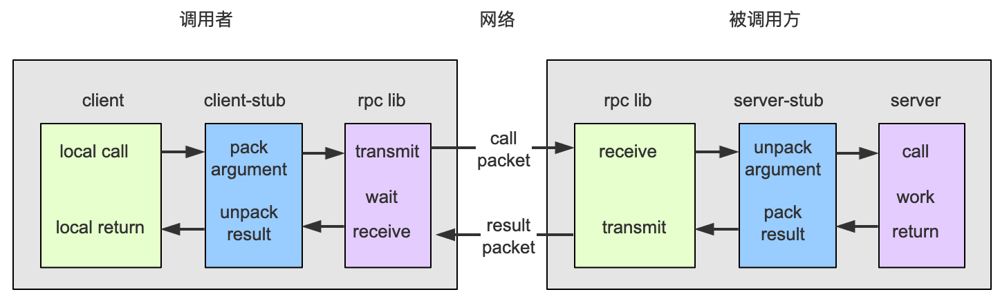


## 总结下RPC执行步骤：

1. 调用客户端句柄，执行传递参数。
2. 调用本地系统内核发送网络消息。
3. 消息传递到远程主机，就是被调用的服务端。
4. 服务端句柄得到消息并解析消息。
5. 服务端执行被调用方法，并将执行完毕的结果返回给服务器句柄。
6. 服务器句柄返回结果，并调用远程系统内核。
7. 消息经过网络传递给客户端。
8. 客户端接受数据。


# 安装gRPC和Protobuf
gRPC由google开发，是一款语言中立、平台中立、开源的远程过程调用系统
gRPC客户端和服务端可以在多种环境中运行和交互，例如用java写一个服务端，可以用go语言写客户端调用
在gRPC中，我们可以一次性的在一个 proto文件中定义服务并使用任意的支持gRPC的语言去实现客户端和服务端，整个过程操作变得简单，就像调用本地函数一样。

通过 proto生成服务端代码，也就是服务端的骨架，提供低层通信抽象
通过 proto生成客户端代码，也就是客户端的存根，隐藏了不同语言的差异，提供抽象的通信方式，就像调用本地函数一样。

## 安装
- go get github.com/golang/protobuf/proto
- go get google.golang.org/grpc（无法使用，用如下命令代替）
	- git clone https://github.com/grpc/grpc-go.git $GOPATH/src/google.golang.org/grpc
	- git clone https://github.com/golang/net.git $GOPATH/src/golang.org/x/net
	- git clone https://github.com/golang/text.git $GOPATH/src/golang.org/x/text
	- go get -u github.com/golang/protobuf/{proto,protoc-gen-go}
	- git clone https://github.com/google/go-genproto.git $GOPATH/src/google.golang.org/genproto
	- cd $GOPATH/src/
	- go install google.golang.org/grpc
	- go get github.com/golang/protobuf/protoc-gen-go
- 上面安装好后，会在GOPATH/bin下生成protoc-gen-go.exe
- 但还需要一个protoc.exe，windows平台编译受限，很难自己手动编译，直接去网站下载一个，地址：https://github.com/protocolbuffers/protobuf/releases/tag/v3.9.0 ，同样放在GOPATH/bin下

### proto 服务定义

gRPC 使用protocol buffer 来定义服务接口，protocol buffer和 XML、JSON一样是一种结构化数据序列化的可扩展存储结构，protocol buffer是一种语言中立，结构简单高效，比XML更小更简单，可以通过特殊的插件自动生成代码来读写操作这个数据结构。
```protobuf
import "myproject/other_protos.proto";		// 导入其他 proto文件
syntax = "proto3"; // 指定proto版本
package hello;     // 指定默认包名

// 指定golang包名
option go_package = "hello";

message SearchRequest 
{
  required string query = 1;				// 必须赋值字段
  optional int32 page_number = 2 [default = 10];		// 可选字段
  repeated int32 result_per_page = 3;	// 可重复字段 
}

message SearchResponse 
{
  message Result 		// 嵌套定义
  {
    required string url = 1;
    optional string title = 2;
    repeated string snippets = 3;
  }
  repeated Result result = 1;
}

message SomeOtherMessage 
{
  optional SearchResponse.Result result = 1;	// 使用其他消息的定义
}

service List{				// 定义gRPC服务接口
	rpc getList(SearchRequest) returns (SearchResponse);
}
```

```go
// 插件自动生成gRPC骨架和存根
protoc --go_out=plugins=grpc: ./ *.proto
```
后面需要实现服务端具体的逻辑就行，然后注册到gRPC服务器
客户端在调用远程方法时会使用阻塞式存根，所以gRPC主要使用同步的方式通信，在建立连接后，可以使用流的方式操作。
客户端编排为protocol buffer的格式，服务端再解排执行，以HTTP2 传输


### gRPC 优势

- 更高效的进程通信：使用基于protocol buffer在Http2 中以二进制协议通信，而不是JSON、XML文本格式
- 简单定义的服务接口、易扩展
- 强类型、跨语言
- 一元RPC、服务端流、客户端流、双工流

# gRPC入门

### 简单使用

`protocol buffer`

```protobuf
syntax = "proto3";
package hello;
// 第一个分割参数，输出路径；第二个设置生成类的包路径

option go_package = "./proto/hello";


// 设置服务名称
service Greeter {
  // 设置方法
  rpc SayHello (HelloRequest) returns (HelloReply) {}
}

// 请求信息用户名.
message HelloRequest {
  string name = 1;
}

// 响应信息
message HelloReply {
  string message = 1;
}
```

`服务端`

~~~go
package main

import (
	"context"
	"flag"
	"fmt"
	"log"
	"net"

	"google.golang.org/grpc"
	pb "mygrpc/proto/hello"
)

var (
	port = flag.Int("port", 50051, "The server port")
)

type server struct {
	pb.UnimplementedGreeterServer
}

func (s *server) SayHello(ctx context.Context, in *pb.HelloRequest) (*pb.HelloReply, error) {
	log.Printf("Received: %v", in.GetName())
	return &pb.HelloReply{Message: "Hello " + in.GetName()}, nil
}

func main() {
	flag.Parse()
	lis, err := net.Listen("tcp", fmt.Sprintf(":%d", *port))
	if err != nil {
		log.Fatalf("failed to listen: %v", err)
	}
	// 开启rpc
	s := grpc.NewServer()
	// 注册服务
	pb.RegisterGreeterServer(s, &server{})
	log.Printf("server listening at %v", lis.Addr())
	if err := s.Serve(lis); err != nil {
		log.Fatalf("failed to serve: %v", err)
	}
}

~~~

`客户端`

~~~go
package main

import (
	"context"
	"flag"
	"log"
	"time"

	"google.golang.org/grpc"
	"google.golang.org/grpc/credentials/insecure"
	pb "mygrpc/proto/hello" // 引入编译生成的包
)

const (
	defaultName = "world"
)

var (
	addr = flag.String("addr", "localhost:50051", "the address to connect to")
	name = flag.String("name", defaultName, "Name to greet")
)

func main() {
	flag.Parse()
	// 与服务建立连接.
	conn, err := grpc.Dial(*addr, grpc.WithTransportCredentials(insecure.NewCredentials()))
	if err != nil {
		log.Fatalf("did not connect: %v", err)
	}
	defer conn.Close()
	// 创建指定服务的客户端
	c := pb.NewGreeterClient(conn)

	// 连接服务器并打印出其响应。
	ctx, cancel := context.WithTimeout(context.Background(), time.Second)
	defer cancel()
	// 调用指定方法
	r, err := c.SayHello(ctx, &pb.HelloRequest{Name: *name})
	if err != nil {
		log.Fatalf("could not greet: %v", err)
	}
	log.Printf("Greeting: %s", r.GetMessage())
}

~~~

客户端连接gRPC服务器以后，就可以像调用本地函数一样操作远程服务器。
# gRPC三种流和消息格式
## 消息格式
### RPC流

服务端实现protocol buffer定义的方法，客户端保留一个存根，提供服务端方法的抽象，客户端只需要调用存根中的方法，就可以远程调用服务端方法。
- 调用存根方法
- 存根创建HTTP POST请求（==gRPC中所有请求都是 POST==），设置`content-type`为`application/grpc`
- 到达服务端，会先检查请求头是不是gRPC请求，否则返回415


### 长度前缀的消息分帧

在写入消息前，先写入长度消息表明每条消息的大小。

每条消息都有额外的4字节来设置大小，也就是说消息的大小不能超过4GB

帧首中还有单字节无符号整数，用来表明数据是否进行了压缩
为1表示使用 `message-encoding`中的编码机制进行了压缩

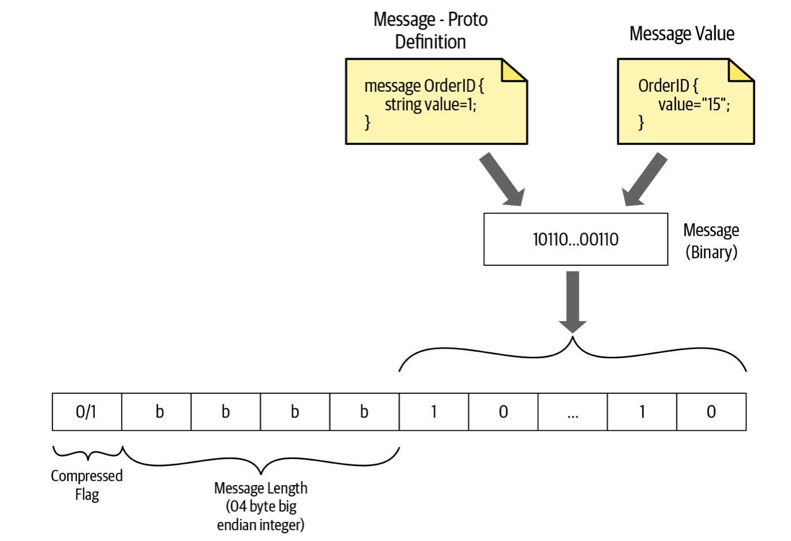

### 请求消息

> 客户端发送，包含3个部分：请求头信息、长度前缀的消息、流结束标记
>
> 1、对于gRPC 都是POST
>
> 2、协议：Http/Https
>
> 3、/服务名/方法名
>
> 4、目标URI的主机名
>
> 5、对不兼容代理的检测，gRPC下这个值必须为 trailers
>
> 6、超时时间
>
> 7、媒体类型
>
> 8、压缩类型


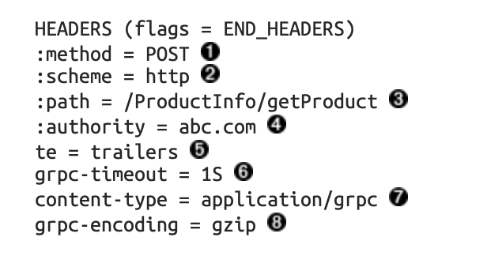

==当因为没有要发送的数据而需要关闭请求流时，必须发送一个带标记的空数据帧==

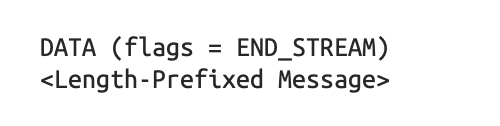

### 响应信息

> 服务端发送，包含3个部分：响应头信息、长度前缀的信息、trailers
>
> END_STREAM 标记不会随数据帧一起发送，而是作为单独的头信息来发送，名为 trailer


## 三种流
### 一元RPC

> 通信时始终只有一个请求和一个响应

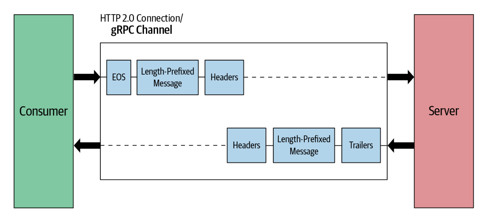


`protocol buffer`

```protobuf
syntax = "proto3";
package hello;
// 第一个分割参数，输出路径；第二个设置生成类的包路径

option go_package = "./proto/hello";


// 设置服务名称
service Greeter {
  // 设置方法
  rpc SayHello (HelloRequest) returns (HelloReply) {}
}

// 请求信息用户名.
message HelloRequest {
  string name = 1;
}

// 响应信息
message HelloReply {
  string message = 1;
}
```

`服务端`

~~~go
package main

import (
	"context"
	"flag"
	"fmt"
	"log"
	"net"

	"google.golang.org/grpc"
	pb "mygrpc/proto/hello"
)

var (
	port = flag.Int("port", 50051, "The server port")
)

type server struct {
	pb.UnimplementedGreeterServer
}

func (s *server) SayHello(ctx context.Context, in *pb.HelloRequest) (*pb.HelloReply, error) {
	log.Printf("Received: %v", in.GetName())
	return &pb.HelloReply{Message: "Hello " + in.GetName()}, nil
}

func main() {
	flag.Parse()
	lis, err := net.Listen("tcp", fmt.Sprintf(":%d", *port))
	if err != nil {
		log.Fatalf("failed to listen: %v", err)
	}
	// 开启rpc
	s := grpc.NewServer()
	// 注册服务
	pb.RegisterGreeterServer(s, &server{})
	log.Printf("server listening at %v", lis.Addr())
	if err := s.Serve(lis); err != nil {
		log.Fatalf("failed to serve: %v", err)
	}
}

~~~

`客户端`

~~~go
package main

import (
	"context"
	"flag"
	"log"
	"time"

	"google.golang.org/grpc"
	"google.golang.org/grpc/credentials/insecure"
	pb "mygrpc/proto/hello" // 引入编译生成的包
)

const (
	defaultName = "world"
)

var (
	addr = flag.String("addr", "localhost:50051", "the address to connect to")
	name = flag.String("name", defaultName, "Name to greet")
)

func main() {
	flag.Parse()
	// 与服务建立连接.
	conn, err := grpc.Dial(*addr, grpc.WithTransportCredentials(insecure.NewCredentials()))
	if err != nil {
		log.Fatalf("did not connect: %v", err)
	}
	defer conn.Close()
	// 创建指定服务的客户端
	c := pb.NewGreeterClient(conn)

	// 连接服务器并打印出其响应。
	ctx, cancel := context.WithTimeout(context.Background(), time.Second)
	defer cancel()
	// 调用指定方法
	r, err := c.SayHello(ctx, &pb.HelloRequest{Name: *name})
	if err != nil {
		log.Fatalf("could not greet: %v", err)
	}
	log.Printf("Greeting: %s", r.GetMessage())
}

~~~

### 服务流RPC

> 通信时可以是一个请求，服务端多次响应，比如查询业务，服务端模糊匹配找到一次就返回客户端一次响应这样的多次响应。
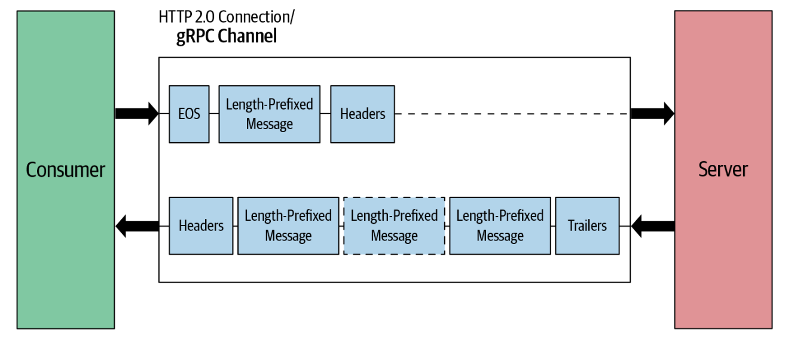

在protobuf中的 service添加以下代码
~~~protobuf
rpc searchOrders(google.protobuf.StringValue) returns (stream Order);
~~~

`服务端代码`
~~~go
package main

import (
	"context"
	"flag"
	"fmt"
	"google.golang.org/grpc"
	"io"
	"log"
	pb "mygrpc/proto/hello"
	"net"
)

var (
	port = flag.Int("port", 50051, "The service port")
)

type server struct {
	pb.UnimplementedGreeterServer
}

func (s *server) SayHello(ctx context.Context, in *pb.HelloRequest) (*pb.HelloReply, error) {
	log.Printf("Received: %v", in.GetName())
	return &pb.HelloReply{Message: "Hello " + in.GetName()}, nil
}
func (s *server) SearchOrders(req *pb.HelloRequest, stream pb.Greeter_SearchOrdersServer) error {
	log.Printf("Recved %v", req.GetName())
	// 具体返回多少个response根据业务逻辑调整
	for i := 0; i < 10; i++ {
		// 通过 send 方法不断推送数据
		err := stream.Send(&pb.HelloReply{})
		if err != nil {
			log.Fatalf("Send error:%v", err)
			return err
		}
	}
	return nil
}
func (s *server) UpdateOrders(stream pb.Greeter_UpdateOrdersServer) error {

	for {
		log.Println("开始接受客户端的流")
		// Recv 对客户端发来的请求接收
		order, err := stream.Recv()
		if err == io.EOF {
			// 流结束，关闭并发送响应给客户端
			return stream.Send(&pb.HelloReply{Message: "接受客户流结束"})
		}
		if err != nil {
			return err
		}
		// 更新数据
		log.Printf("Order ID : %s - %s", order.GetName(), "Updated")
	}
}
func main() {
	flag.Parse()
	lis, err := net.Listen("tcp", fmt.Sprintf(":%d", *port))
	if err != nil {
		log.Fatalf("failed to listen: %v", err)
	}
	// 开启rpc
	s := grpc.NewServer()
	// 注册服务
	pb.RegisterGreeterServer(s, &server{})
	log.Printf("service listening at %v", lis.Addr())
	if err := s.Serve(lis); err != nil {
		log.Fatalf("failed to serve: %v", err)
	}
}


~~~
`客户端代码`
~~~go
package main

import (
	"context"
	"flag"
	"io"
	"log"
	"time"

	"google.golang.org/grpc"
	"google.golang.org/grpc/credentials/insecure"
	pb "mygrpc/proto/hello" // 引入编译生成的包
)

const (
	defaultName = "world"
)

var (
	addr = flag.String("addr", "localhost:50051", "the address to connect to")
	name = flag.String("name", defaultName, "Name to greet")
)

func main() {
	flag.Parse()
	// 与服务建立连接.
	conn, err := grpc.Dial(*addr, grpc.WithTransportCredentials(insecure.NewCredentials()))
	if err != nil {
		log.Fatalf("did not connect: %v", err)
	}
	defer func(conn *grpc.ClientConn) {
		err := conn.Close()
		if err != nil {

		}
	}(conn)
	// 创建指定服务的客户端
	c := pb.NewGreeterClient(conn)

	// 连接服务器并打印出其响应。
	ctx, cancel := context.WithTimeout(context.Background(), time.Second)
	defer cancel()
	// 调用指定方法
	searchStream, _ := c.SearchOrders(ctx, &pb.HelloRequest{Name: "开始服务端rpc流测试"})
	for {
		// 客户端 Recv 方法接收服务端发送的流
		searchOrder, err := searchStream.Recv()
		if err == io.EOF {
			log.Print("EOF")
			break
		}
		if err == nil {
			log.Print("Search Result : ", searchOrder)
		}
	}
	r, err := c.SayHello(ctx, &pb.HelloRequest{Name: *name})
	if err != nil {
		log.Fatalf("could not greet: %v", err)
	}
	log.Printf("Greeting: %s", r.GetMessage())
}

~~~

### 客户流RPC

> 客户端多个请求发给服务端，服务端发送一个响应给客户端，比如更新业务，客户端的读个请求发过来，服务端更新完返回一个成功的结果

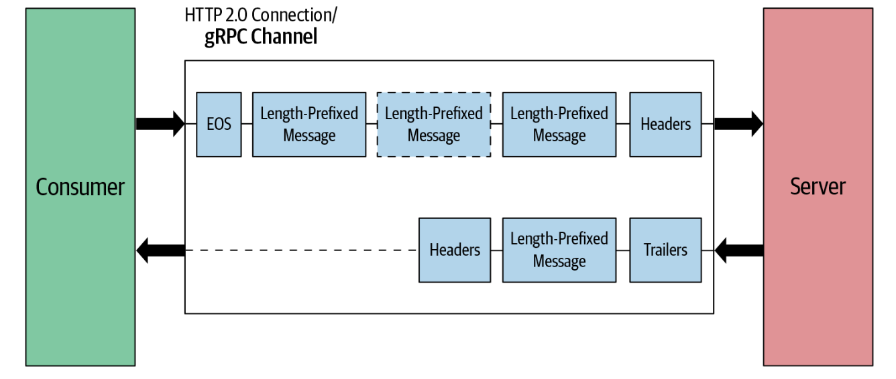

在protobuf中的 service添加以下代码
~~~protobuf
rpc updateOrders(stream HelloRequest) returns (stream HelloReply);
~~~
`服务端代码`
~~~go
func (s *server) UpdateOrders(stream pb.OrderManagement_UpdateOrdersServer) error {
  
	ordersStr := "Updated Order IDs : "
	for {
    // Recv 对客户端发来的请求接收
		order, err := stream.Recv()
		if err == io.EOF {
			// 流结束，关闭并发送响应给客户端
			return stream.SendAndClose(&wrapper.StringValue{Value: "Orders processed " + ordersStr})
		}
		if err != nil {
			return err
		}
		// 更新数据
		orderMap[order.Id] = *order
		log.Printf("Order ID : %s - %s", order.Id, "Updated")
		ordersStr += order.Id + ", "
	}
}
~~~
`客户端代码`
~~~go
package main

import (
	"context"
	"flag"
	"log"
	"time"

	"google.golang.org/grpc"
	"google.golang.org/grpc/credentials/insecure"
	pb "mygrpc/proto/hello" // 引入编译生成的包
)

const (
	defaultName = "world"
)

var (
	addr = flag.String("addr", "localhost:50051", "the address to connect to")
	name = flag.String("name", defaultName, "Name to greet")
)

func main() {
	flag.Parse()
	// 与服务建立连接.
	conn, err := grpc.Dial(*addr, grpc.WithTransportCredentials(insecure.NewCredentials()))
	if err != nil {
		log.Fatalf("did not connect: %v", err)
	}
	defer func(conn *grpc.ClientConn) {
		err := conn.Close()
		if err != nil {

		}
	}(conn)
	// 创建指定服务的客户端
	c := pb.NewGreeterClient(conn)

	// 连接服务器并打印出其响应。
	ctx, cancel := context.WithTimeout(context.Background(), time.Second)
	defer cancel()
	// 调用指定方法
	updateStream, err := c.UpdateOrders(ctx)
	if err != nil {
		log.Fatalf("%v.UpdateOrders(_) = _, %v", c, err)
	}
	// Updating order 1
	if err := updateStream.Send(&pb.HelloRequest{Name: "1"}); err != nil {
		log.Fatalf("%v.Send(%v) = %v", updateStream, &pb.HelloRequest{Name: "1"}, err)
	}
	// Updating order 2
	if err := updateStream.Send(&pb.HelloRequest{Name: "2"}); err != nil {
		log.Fatalf("%v.Send(%v) = %v", updateStream, &pb.HelloRequest{Name: "2"}, err)
	}
	// 发送关闭信号并接收服务端响应
	err = updateStream.CloseSend()
	if err != nil {
		log.Fatalf("%v.CloseAndRecv() got error %v, want %v", updateStream, err, nil)
	}
	log.Printf("客户端流传输结束")
}

~~~

### 双工流RPC

> 对应的业务就比如实时的消息流

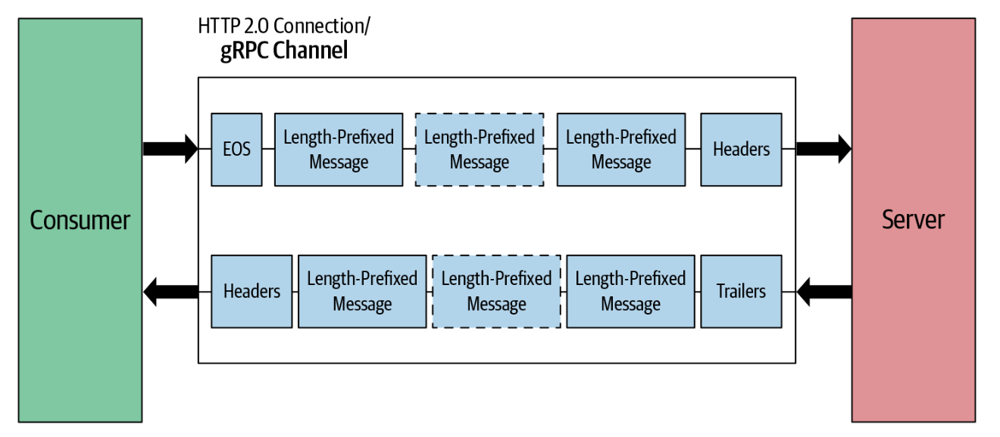

`protobuf`
~~~protobuf
  // 设置双工rpc
  rpc processOrders(stream HelloRequest) returns (stream HelloReply);
~~~
`服务端`
~~~go
package main

import (
	"flag"
	"fmt"
	"google.golang.org/grpc"
	"io"
	"log"
	pb "mygrpc/proto/hello"
	"net"
	"sync"
)

var (
	port = flag.Int("port", 50051, "The service port")
)

type server struct {
	pb.UnimplementedGreeterServer
}

func (s *server) ProcessOrders(stream pb.Greeter_ProcessOrdersServer) error {
	var (
		waitGroup sync.WaitGroup // 一组 goroutine 的结束
		// 设置通道
		msgCh = make(chan *pb.HelloReply)
	)
	// 计数器加1
	waitGroup.Add(1)
	// 消费队列中的内容
	go func() {
		// 计数器减一
		defer waitGroup.Done()
		for {
			v := <-msgCh
			fmt.Println(v)
			err := stream.Send(v)
			if err != nil {
				fmt.Println("Send error:", err)
				break
			}
		}
	}()
	waitGroup.Add(1)
	// 向队列中添加内容
	go func() {
		defer waitGroup.Done()
		for {
			req, err := stream.Recv()
			if err == io.EOF {
				break
			}
			if err != nil {
				log.Fatalf("recv error:%v", err)
			}
			fmt.Printf("Recved :%v \n", req.GetName())
			msgCh <- &pb.HelloReply{Message: "服务端传输数据"}
		}
		close(msgCh)
	}()
	// 等待 计数器问0 推出
	waitGroup.Wait()

	// 返回nil表示已经完成响应
	return nil
}
func main() {
	flag.Parse()
	lis, err := net.Listen("tcp", fmt.Sprintf(":%d", *port))
	if err != nil {
		log.Fatalf("failed to listen: %v", err)
	}
	// 开启rpc
	s := grpc.NewServer()
	// 注册服务
	pb.RegisterGreeterServer(s, &server{})
	log.Printf("service listening at %v", lis.Addr())
	if err := s.Serve(lis); err != nil {
		log.Fatalf("failed to serve: %v", err)
	}
}

~~~
`客户端`
~~~go
package main

import (
	"context"
	"flag"
	"fmt"
	"io"
	"log"
	"sync"
	"time"

	"google.golang.org/grpc"
	"google.golang.org/grpc/credentials/insecure"
	pb "mygrpc/proto/hello" // 引入编译生成的包
)

const (
	defaultName = "world"
)

var (
	addr = flag.String("addr", "localhost:50051", "the address to connect to")
	name = flag.String("name", defaultName, "Name to greet")
)

func main() {
	flag.Parse()
	// 与服务建立连接.
	conn, err := grpc.Dial(*addr, grpc.WithTransportCredentials(insecure.NewCredentials()))
	if err != nil {
		log.Fatalf("did not connect: %v", err)
	}
	defer func(conn *grpc.ClientConn) {
		err := conn.Close()
		if err != nil {
		}
	}(conn)
	// 创建指定服务的客户端
	c := pb.NewGreeterClient(conn)

	// 连接服务器并打印出其响应。
	ctx, cancel := context.WithTimeout(context.Background(), time.Second)
	defer cancel()
	// 设置
	var wg sync.WaitGroup
	// 调用指定方法
	stream, _ := c.ProcessOrders(ctx)
	if err != nil {
		panic(err)
	}
	// 3.开两个goroutine 分别用于Recv()和Send()
	wg.Add(1)
	go func() {
		defer wg.Done()
		for {
			req, err := stream.Recv()
			if err == io.EOF {
				fmt.Println("Server Closed")
				break
			}
			if err != nil {
				continue
			}
			fmt.Printf("Recv Data:%v \n", req.GetMessage())
		}
	}()

	wg.Add(1)
	go func() {
		defer wg.Done()

		for i := 0; i < 2; i++ {
			err := stream.Send(&pb.HelloRequest{Name: "hello world"})
			if err != nil {
				log.Printf("send error:%v\n", err)
			}
		}
		// 4. 发送完毕关闭stream
		err := stream.CloseSend()
		if err != nil {
			log.Printf("Send error:%v\n", err)
			return
		}
	}()
	wg.Wait()
	log.Printf("服务端流传输结束")
}
~~~


# gRPC进阶
## 拦截器
gRPC拦截器（interceptor）是一种函数，它可以在gRPC调用之前和之后执行一些逻辑，例如认证、授权、日志记录、监控和统计等。拦截器函数是gRPC中非常重要的概念，它允许我们在服务端和客户端添加自定义逻辑，以满足业务需求和运维需求。

在gRPC中，拦截器函数通常通过实现grpc.UnaryServerInterceptor和grpc.StreamServerInterceptor接口来定义。UnaryServerInterceptor用于拦截一元RPC请求，而StreamServerInterceptor用于拦截流式RPC请求。在客户端中，我们可以使用grpc.UnaryClientInterceptor和grpc.StreamClientInterceptor来拦截gRPC调用。

在gRPC中，拦截器函数可以被链接起来，形成一个拦截器链。在这个拦截器链中，每个拦截器函数都可以处理请求并将其转发给下一个拦截器函数，或者直接返回响应。因此，我们可以在拦截器函数中编写不同的逻辑，例如实现认证、授权、监控和统计等。
以下是一些常见的gRPC拦截器：
- **认证和授权拦截器**：用于对gRPC调用进行身份验证和权限控制，例如检查token、验证用户名和密码、检查访问控制列表等；
- **日志记录拦截器**：用于记录gRPC调用的日志，例如记录请求的方法、参数、响应状态等；
- **监控和统计拦截器**：用于监控gRPC调用的性能和吞吐量，例如记录调用次数、响应时间、错误率等；
- **缓存拦截器**：用于在服务端或客户端缓存一些数据，例如缓存计算结果、缓存数据库查询结果等。

### 服务端拦截器

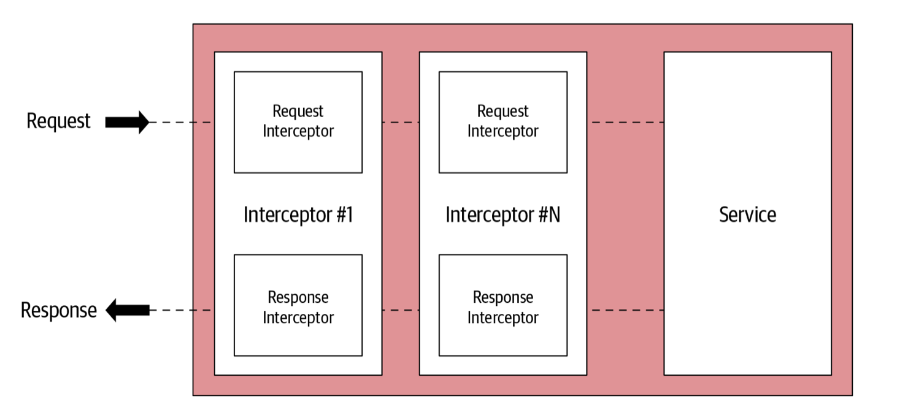

#### 一元拦截器

~~~go
package main

import (
	"context"
	"flag"
	"log"
	"time"

	"google.golang.org/grpc"
	"google.golang.org/grpc/credentials/insecure"
	pb "mygrpc/proto/hello" // 引入编译生成的包
)

const (
	defaultName = "world"
)

var (
	addr = flag.String("addr", "localhost:50051", "the address to connect to")
	name = flag.String("name", defaultName, "Name to greet")
)

func main() {
	flag.Parse()
	// 与服务建立连接.
	conn, err := grpc.Dial(*addr, grpc.WithTransportCredentials(insecure.NewCredentials()))
	if err != nil {
		log.Fatalf("did not connect: %v", err)
	}
	defer conn.Close()
	// 创建指定服务的客户端
	c := pb.NewGreeterClient(conn)

	// 连接服务器并打印出其响应。
	ctx, cancel := context.WithTimeout(context.Background(), time.Second)
	defer cancel()
	// 调用指定方法
	r, err := c.SayHello(ctx, &pb.HelloRequest{Name: *name})
	if err != nil {
		log.Fatalf("could not greet: %v", err)
	}
	log.Printf("Greeting: %s", r.GetMessage())
}
~~~
**结果**
```shell
2023/12/07 14:52:55 ======= [Server Interceptor]  /hello.Greeter/SayHello
2023/12/07 14:52:55  Pre Proc Message : name:"world"
2023/12/07 14:52:55 Received: world
2023/12/07 14:52:55  Post Proc Message : message:"Hello world"

```
#### 流拦截器
流式拦截器需要对grpc.ServerStream进行包装，重新实现RecvMsg和SendMsg方法。
~~~go
func (s *server) SearchOrders(req *pb.HelloRequest, stream pb.Greeter_SearchOrdersServer) error {
	log.Printf("Recved %v", req.GetName())
	// 具体返回多少个response根据业务逻辑调整
	for i := 0; i < 10; i++ {
		// 通过 send 方法不断推送数据
		err := stream.Send(&pb.HelloReply{})
		if err != nil {
			log.Fatalf("Send error:%v", err)
			return err
		}
	}
	return nil
}

type wrappedStream struct {
	// 包装器流
	grpc.ServerStream
}
// 接受信息拦截器
func (w *wrappedStream) RecvMsg(m interface{}) error {
	log.Printf("====== [Server Stream Interceptor Wrapper] Receive a message (Type: %T) at %s", m, time.Now().Format(time.RFC3339))
	return w.ServerStream.RecvMsg(m)
}
// 发送消息拦截器
func (w *wrappedStream) SendMsg(m interface{}) error {
	log.Printf("====== [Server Stream Interceptor Wrapper] Send a message (Type: %T) at %v", m, time.Now().Format(time.RFC3339))
	return w.ServerStream.SendMsg(m)
}

func newWrappedStream(s grpc.ServerStream) grpc.ServerStream {
	return &wrappedStream{s}
}

func orderServerStreamInterceptor(srv interface{}, ss grpc.ServerStream, info *grpc.StreamServerInfo, handler grpc.StreamHandler) error {
	// 前置处理
	log.Println("====== [Server Stream Interceptor] ", info.FullMethod)

	// 包装器流调用 流RPC
	err := handler(srv, newWrappedStream(ss))
	if err != nil {
		log.Printf("RPC failed with error %v", err)
	}
	return err
}
func main() {
	flag.Parse()
	lis, err := net.Listen("tcp", fmt.Sprintf(":%d", *port))
	if err != nil {
		log.Fatalf("failed to listen: %v", err)
	}
	// 开启rpc
	s := grpc.NewServer(grpc.StreamInterceptor(orderServerStreamInterceptor))
	// 注册服务
	pb.RegisterGreeterServer(s, &server{})
	log.Printf("service listening at %v", lis.Addr())
	if err := s.Serve(lis); err != nil {
		log.Fatalf("failed to serve: %v", err)
	}
}

~~~
**结果**
```shell
GOROOT=D:\software\Go #gosetup
GOPATH=D:\software\golibrary #gosetup
D:\software\Go\bin\go.exe build -o C:\Users\29071\AppData\Local\JetBrains\GoLand2023.3\tmp\GoLand\___go_build_mygrpc_service_steamInterceptorservice.exe mygrpc/service/steamInterceptorservice #gosetup
C:\Users\29071\AppData\Local\JetBrains\GoLand2023.3\tmp\GoLand\___go_build_mygrpc_service_steamInterceptorservice.exe
2023/12/07 15:07:48 service listening at [::]:50051
2023/12/07 15:08:07 ====== [Server Stream Interceptor]  /hello.Greeter/searchOrders
2023/12/07 15:08:07 ====== [Server Stream Interceptor Wrapper] Receive a message (Type: *hello.HelloRequest) at 2023-12-07T15:08:07+08:00
2023/12/07 15:08:07 Recved 开始服务端rpc流测试
2023/12/07 15:08:07 ====== [Server Stream Interceptor Wrapper] Send a message (Type: *hello.HelloReply) at 2023-12-07T15:08:07+08:00
2023/12/07 15:08:07 ====== [Server Stream Interceptor Wrapper] Send a message (Type: *hello.HelloReply) at 2023-12-07T15:08:07+08:00
2023/12/07 15:08:07 ====== [Server Stream Interceptor Wrapper] Send a message (Type: *hello.HelloReply) at 2023-12-07T15:08:07+08:00
2023/12/07 15:08:07 ====== [Server Stream Interceptor Wrapper] Send a message (Type: *hello.HelloReply) at 2023-12-07T15:08:07+08:00
2023/12/07 15:08:07 ====== [Server Stream Interceptor Wrapper] Send a message (Type: *hello.HelloReply) at 2023-12-07T15:08:07+08:00
2023/12/07 15:08:07 ====== [Server Stream Interceptor Wrapper] Send a message (Type: *hello.HelloReply) at 2023-12-07T15:08:07+08:00
2023/12/07 15:08:07 ====== [Server Stream Interceptor Wrapper] Send a message (Type: *hello.HelloReply) at 2023-12-07T15:08:07+08:00
2023/12/07 15:08:07 ====== [Server Stream Interceptor Wrapper] Send a message (Type: *hello.HelloReply) at 2023-12-07T15:08:07+08:00
2023/12/07 15:08:07 ====== [Server Stream Interceptor Wrapper] Send a message (Type: *hello.HelloReply) at 2023-12-07T15:08:07+08:00
2023/12/07 15:08:07 ====== [Server Stream Interceptor Wrapper] Send a message (Type: *hello.HelloReply) at 2023-12-07T15:08:07+08:00
Process finished with the exit code -1073741510 (0xC000013A: interrupted by Ctrl+C)


```

### 客户端拦截器

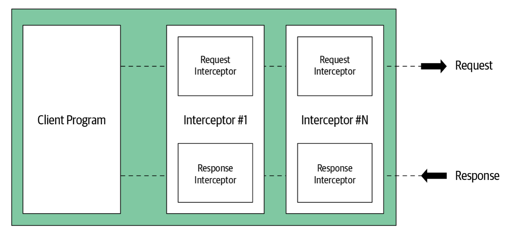

#### 一元拦截器

~~~go
func orderUnaryClientInterceptor(ctx context.Context, method string, req, reply interface{}, cc *grpc.ClientConn, invoker grpc.UnaryInvoker, opts ...grpc.CallOption) error {
	// 前置处理逻辑
	log.Println("Method : " + method)

	// 调用invoker 执行远程方法
	err := invoker(ctx, method, req, reply, cc, opts...)

	// 后置处理逻辑
	log.Println(reply)
	return err
}

func main() {
	flag.Parse()
	// 与服务建立连接.
	conn, err := grpc.Dial(*addr, grpc.WithTransportCredentials(insecure.NewCredentials()),
		grpc.WithUnaryInterceptor(orderUnaryClientInterceptor)) //添加拦截器
	if err != nil {
		log.Fatalf("did not connect: %v", err)
	}
	defer conn.Close()
	// 创建指定服务的客户端
	c := pb.NewGreeterClient(conn)

	// 连接服务器并打印出其响应。
	ctx, cancel := context.WithTimeout(context.Background(), time.Second) // 设置超时时间为一秒
	defer cancel()
	// 调用指定方法
	r, err := c.SayHello(ctx, &pb.HelloRequest{Name: *name})
	if err != nil {
		log.Fatalf("could not greet: %v", err)
	}
	log.Printf("Greeting: %s", r.GetMessage())
}
~~~
**结果**
```shell
2023/12/07 16:37:28 Method : /hello.Greeter/SayHello
2023/12/07 16:37:28 message:"Hello world"
2023/12/07 16:37:28 Greeting: Hello worl
```

#### 流拦截`

~~~go
type wrappedStream struct {
	grpc.ClientStream
}

func (w *wrappedStream) RecvMsg(m interface{}) error {
	log.Printf("====== [Client Stream Interceptor] Receive a message (Type: %T) at %v", m, time.Now().Format(time.RFC3339))
	return w.ClientStream.RecvMsg(m)
}

func (w *wrappedStream) SendMsg(m interface{}) error {
	log.Printf("====== [Client Stream Interceptor] Send a message (Type: %T) at %v", m, time.Now().Format(time.RFC3339))
	return w.ClientStream.SendMsg(m)
}

func newWrappedStream(s grpc.ClientStream) grpc.ClientStream {
	return &wrappedStream{s}
}

func clientStreamInterceptor(ctx context.Context, desc *grpc.StreamDesc, cc *grpc.ClientConn, method string, streamer grpc.Streamer, opts ...grpc.CallOption) (grpc.ClientStream, error) {
	
  // 前置处理逻辑
	log.Println("======= [Client Interceptor] ", method)
  
  // 调用streamer 来获取客户端流
	s, err := streamer(ctx, desc, cc, method, opts...)
	if err != nil {
		return nil, err
	}
	return newWrappedStream(s), nil
}

func main(){
   // 注册拦截器到客户端流
 conn,err:=grpc.Dial(address,grpc.WithInsecure(),grpc.WithStreamInterceptor(clientStreamInterceptor))
	if err != nil {
		log.Fatalf("did not connect: %v", err)
	}
	defer conn.Close()
                     
	c := pb.NewOrderManagementClient(conn)
  ctx, cancel := context.WithTimeout(context.Background(), time.Second*5)
	defer cancel()
  
  // 调用客户端流RPC方法
  searchStream, _ := c.SearchOrders(ctx, &wrapper.StringValue{Value: "Google"})
	for {
		searchOrder, err := searchStream.Recv()
		if err == io.EOF {
			log.Print("EOF")
			break
		}
		if err == nil {
			log.Print("Search Result : ", searchOrder)
		}
	}
}
~~~
**结果**
```shell
2023/12/07 17:10:43 ====== [Client Stream Interceptor] Send a message (Type: *hello.HelloRequest) at 2023-12-07T17:10:43+08:00
2023/12/07 17:10:43 ====== [Client Stream Interceptor] Send a message (Type: *hello.HelloRequest) at 2023-12-07T17:10:43+08:00
2023/12/07 17:10:43 客户端流传输结束
```
### 多个拦截器
在grpc中默认的拦截器不可以传多个，因为在源码中，存在一些问题
```go
func chainUnaryClientInterceptors(cc *ClientConn) {
	interceptors := cc.dopts.chainUnaryInts
	if cc.dopts.unaryInt != nil {
		interceptors = append([]UnaryClientInterceptor{cc.dopts.unaryInt}, interceptors...)
	}
	var chainedInt UnaryClientInterceptor
	if len(interceptors) == 0 {
		chainedInt = nil
	} else if len(interceptors) == 1 {
		chainedInt = interceptors[0]
	} else {
		chainedInt = func(ctx context.Context, method string, req, reply interface{}, cc *ClientConn, invoker UnaryInvoker, opts ...CallOption) error {
			return interceptors[0](ctx, method, req, reply, cc, getChainUnaryInvoker(interceptors, 0, invoker), opts...)
		}
	}
	cc.dopts.unaryInt = chainedInt
}

```
当存在多个拦截器时，取的就是第一个拦截器。因此结论是允许传多个，但并没有用。

如果真的需要多个拦截器，可以使用 go-grpc-middleware 提供的 grpc.UnaryInterceptor 和 grpc.StreamInterceptor 链式方法。核心方法如下
```go
func ChainUnaryClient(interceptors ...grpc.UnaryClientInterceptor) grpc.UnaryClientInterceptor {
	n := len(interceptors)
	if n > 1 {
		lastI := n - 1
		return func(ctx context.Context, method string, req, reply interface{}, cc *grpc.ClientConn, invoker grpc.UnaryInvoker, opts ...grpc.CallOption) error {
			var (
				chainHandler grpc.UnaryInvoker
				curI         int
			)

			chainHandler = func(currentCtx context.Context, currentMethod string, currentReq, currentRepl interface{}, currentConn *grpc.ClientConn, currentOpts ...grpc.CallOption) error {
				if curI == lastI {
					return invoker(currentCtx, currentMethod, currentReq, currentRepl, currentConn, currentOpts...)
				}
				curI++
				err := interceptors[curI](currentCtx, currentMethod, currentReq, currentRepl, currentConn, chainHandler, currentOpts...)
				curI--
				return err
			}

			return interceptors[0](ctx, method, req, reply, cc, chainHandler, opts...)
		}
	}
    ...
}
```
## 截止时间、超时时间

截止时间：从请求开始时间+持续时间的偏移，多个服务调用，整个请求链需要在截止时间前响应，避免持续的等待RPC响应，造成资源消耗服务延迟

超时时间：指定等待RPC完成的时间，超时以错误结束返回

`截止时间`

~~~go
func main(){
  conn, err := grpc.Dial(address, grpc.WithInsecure())
	if err != nil {
		log.Fatalf("did not connect: %v", err)
	}
	defer conn.Close()
	client := pb.NewOrderManagementClient(conn)

  // 设置截止时间+持续时间的偏移
	clientDeadline := time.Now().Add(time.Duration(2 * time.Second))
	ctx, cancel := context.WithDeadline(context.Background(), clientDeadline)
	defer cancel()

	order1 := pb.Order{Id: "101", Items: []string{"iPhone XS", "Mac Book Pro"}, Destination: "San Jose, CA", Price: 2300.00}
	res, addErr := client.AddOrder(ctx, &order1)
}
~~~

~~~go
// 服务端判断客户端是否满足截止时间的状态，然后丢弃这个RPC返回一个错误，可以是select来实现
if ctx.Err() == context.DeadlineExceeded {
		log.Printf("RPC has reached deadline exceeded state : %s", ctx.Err())
		return nil, ctx.Err()
	}
~~~

`超时时间`

~~~go
func main(){
  conn, err := grpc.Dial(address, grpc.WithInsecure())
	if err != nil {
		log.Fatalf("did not connect: %v", err)
	}
	defer conn.Close()
	client := pb.NewOrderManagementClient(conn)

  // 设置超时时间
	ctx, cancel := context.WithTimeout(context.Background(), time.Second*5)
	defer cancel()

	order1 := pb.Order{Id: "101", Items: []string{"iPhone XS", "Mac Book Pro"}, Destination: "San Jose, CA", Price: 2300.00}
	res, addErr := client.AddOrder(ctx, &order1)
}
~~~

### 错误处理

~~~go
// 服务端
// 通过 status包创建所需的错误码和错误状态
errorStatus := status.New(codes.InvalidArgument, "Invalid information received")
// 错误详情
ds, err := errorStatus.WithDetails(
	&epb.BadRequest_FieldViolation{
		Field:"ID",
    Description: fmt.Sprintf("Order ID received is not valid %s:%s",orderReq.Id,orderReq.Description),
	},
)
if err != nil {
	return nil, errorStatus.Err()
}
// 返回错误
return nil, ds.Err()
~~~

~~~go
// 客户端	
res, addOrderError := client.AddOrder(ctx, &order1)

	if addOrderError != nil {
		errorCode := status.Code(addOrderError)
		if errorCode == codes.InvalidArgument {
			log.Printf("Invalid Argument Error : %s", errorCode)
			errorStatus := status.Convert(addOrderError)
			for _, d := range errorStatus.Details() {
				switch info := d.(type) {
				case *epb.BadRequest_FieldViolation:
					log.Printf("Request Field Invalid: %s", info)
				default:
					log.Printf("Unexpected error type: %s", info)
				}
			}
		} else {
			log.Printf("Unhandled error : %s ", errorCode)
		}
	} else {
		log.Print("AddOrder Response -> ", res.Value)
	}
~~~

### 多路复用

同一台服务器上的多个RPC服务的多路复用，比如同时保存一个订单的存根、一个欢迎的存根

因为多个RPC服务运行在一个服务端上，所以客户端的多个存根之间是可以共享gRPC连接的

~~~go
func main() {
	lis, err := net.Listen("tcp", port)
	if err != nil {
		log.Fatalf("failed to listen: %v", err)
	}
	grpcServer := grpc.NewServer() 

	// 注册进订单服务
	ordermgt_pb.RegisterOrderManagementServer(grpcServer, &orderMgtServer{}) 
	// 注册进欢迎服务
	hello_pb.RegisterGreeterServer(grpcServer, &helloServer{}) 
}
~~~

~~~go
func main() {
	conn, err := grpc.Dial(address, grpc.WithInsecure())
	if err != nil {
		log.Fatalf("did not connect: %v", err)
	}
	defer conn.Close()

	// 订单服务建立实例连接
	orderManagementClient := pb.NewOrderManagementClient(conn)
	ctx, cancel := context.WithTimeout(context.Background(), time.Second)
	defer cancel()

	order1 := pb.Order{Id: "101", Items:[]string{"iPhone XS", "Mac Book Pro"}, Destination:"San Jose, CA", Price:2300.00}
	res, addErr := orderManagementClient.AddOrder(ctx, &order1)
  
	// 欢迎服务建立实例连接
	helloClient := hwpb.NewGreeterClient(conn)
	hwcCtx, hwcCancel := context.WithTimeout(context.Background(), time.Second)
	defer hwcCancel()
  
	helloResponse, err := helloClient.SayHello(hwcCtx, &hwpb.HelloRequest{Name: "gRPC Up and Running!"})
	fmt.Println("Greeting: ", helloResponse.Message)
}
~~~

### 元数据

`元数据创建`

~~~go
// 方法1
md := metadata.Pairs(
		"1", "v1",
    "1", "v2",	// 方法1会把相同的键的字段合并，[ ]string{"v1","v2"}
		"2", "v3",
	)
// 方法2
md := metadata.New(map[string]string{"1":"v1","2":"v2"})
~~~

`客户端收发`

在context中设置的元数据会转换成线路层的gRPC头信息和 trailer

客户端发送这些头信息，收件方会以头信息的形式接收他们

~~~go
	// 创建元数据
	md := metadata.Pairs(
		"timestamp", time.Now().Format(time.StampNano),
		"kn", "vn",
	)
	// 创建新元数据的上下文，这种方法会替换掉已有的上下文
	mdCtx := metadata.NewOutgoingContext(context.Background(), md)
	// 这种方法是将元数据附加到已有的上下文
	ctxA := metadata.AppendToOutgoingContext(mdCtx, "k1", "v1", "k1", "v2", "k2", "v3")

	// 定义头信息和 trailer，可以用来接收元数据
	var header, trailer metadata.MD

	order1 := pb.Order{Id: "101", Items: []string{"iPhone XS", "Mac Book Pro"}, Destination: "San Jose, CA", Price: 2300.00}
	res, _ := client.AddOrder(ctxA, &order1, grpc.Header(&header), grpc.Trailer(&trailer))

	log.Print("AddOrder Response -> ", res.Value)
	// 获取头信息
	head, err := res.Header()
	// 获取trailer
	trail, err := res.Trailer()
~~~

`服务端收发`

~~~go
// 从上下文中获取元数据列表
md, metadataAvailable := metadata.FromIncomingContext(ctx)
	if !metadataAvailable {
		return nil, status.Errorf(codes.DataLoss, "UnaryEcho: failed to get metadata")
	}
// 操作元数据逻辑
	if t, ok := md["timestamp"]; ok {
		fmt.Printf("timestamp from metadata:\n")
		for i, e := range t {
			fmt.Printf("====> Metadata %d. %s\n", i, e)
		}
	}

// 创建元数据
header := metadata.New(map[string]string{"location": "San Jose", "timestamp": time.Now().Format(time.StampNano)})
// 发送头信息
grpc.SendHeader(ctx, header)
trailer := metadata.Pairs("status","ok")
// 设置trailer
grpc.SetTrailer(ctx,trailer)
~~~

### 负载均衡

`负载均衡器代理`

也就是说后端的结构对gRPC客户端是不透明的，客户端只需要知道均衡器的断点就可以了

比如NGINX代理、Envoy代理


`客户端负载均衡`

~~~go
func main(){
  roundrobinConn, err := grpc.Dial(
		address,
		grpc.WithBalancerName("round_robin"), 	// 指定负载均衡的算法
    // 默认是"pick_first"，也就是从服务器列表中第一个服务端开始尝试发送请求，成功则后续所有RPC都发往这个服务器
    // "round_robin"轮询调度算法，连接所有地址，每次向后端发送一个RPC
		grpc.WithInsecure(),
	)
	if err != nil {
		log.Fatalf("did not connect: %v", err)
	}
	defer roundrobinConn.Close()
	// 起10个RPC调度任务
	makeRPCs(roundrobinConn, 10)
}

func makeRPCs(cc *grpc.ClientConn, n int) {
	hwc := ecpb.NewEchoClient(cc)
	for i := 0; i < n; i++ {
		callUnary(hwc)
	}
}

func callUnary(c ecpb.EchoClient) {
	ctx, cancel := context.WithTimeout(context.Background(), time.Second)
	defer cancel()
  
}
~~~

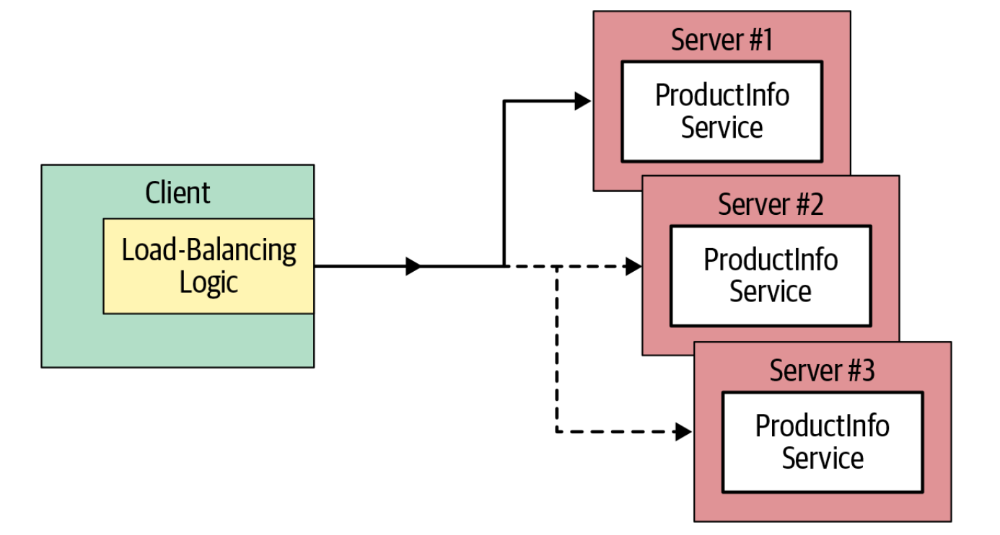

### 压缩数据

> 在服务端会对已注册的压缩器自动解码，响应时自动编码
>
> 始终从客户端获取指定的压缩方法，如果没被注册就会返回Unimplemented

~~~go
func main() {
	conn, err := grpc.Dial(address, grpc.WithInsecure())
	defer conn.Close()
	client := pb.NewOrderManagementClient(conn)
	ctx, cancel := context.WithTimeout(context.Background(), time.Second * 5)
	defer cancel()

	order1 := pb.Order{Id: "101", Items:[]string{"iPhone XS", "Mac Book Pro"}, Destination:"San Jose, CA", Price:2300.00}
  // 通过 grpc.UseCompressor(gzip.Name) 就可以轻松压缩数据
	res, _ := client.AddOrder(ctx, &order1, grpc.UseCompressor(gzip.Name))
}
~~~

# gRPC安全连接

### 单向TLS安全连接

`服务端`

~~~go
var (
  port = ":50051"
  crtFile = "server.crt"
  keyFile = "server.key"
)

func main() {
  // 读取解析公私钥，创建TLS的证书
  cert, err := tls.LoadX509KeyPair(crtFile,keyFile) 
  if err != nil {
     log.Fatalf("failed to load key pair: %s", err)
  }
  
  opts := []grpc.ServerOption{
     grpc.Creds(credentials.NewServerTLSFromCert(&cert)) 
  }
	// 通过TLS证书来创建RPC服务器，
  s := grpc.NewServer(opts...) 
  pb.RegisterProductInfoServer(s, &server{}) 

  lis, err := net.Listen("tcp", port) 
  if err != nil {
     log.Fatalf("failed to listen: %v", err)
  }
  if err := s.Serve(lis); err != nil { 
     log.Fatalf("failed to serve: %v", err)
  }
}
~~~

`客户端`

~~~go
var (
  address = "localhost:50051"
  hostname = "localhost
  crtFile = "server.crt"
)

func main() {
  // 读取解析公开证书，创建TLS的证书
  creds, err := credentials.NewClientTLSFromFile(crtFile, hostname) 
  if err != nil {
     log.Fatalf("failed to load credentials: %v", err)
  }
  
  opts := []grpc.DialOption{
     grpc.WithTransportCredentials(creds), 
  }
	// 建立安全连接
  conn, err := grpc.Dial(address, opts...) 
  if err != nil {
     log.Fatalf("did not connect: %v", err)
  }
  defer conn.Close() 
  c := pb.NewProductInfoClient(conn) 
}
~~~

### basic 认证

这个比较简单了，客户端发送的头信息中 Authorization由字符串“ basic base64(user：passwd) ”组成

~~~go
type basicAuth struct { 
  username string
  password string
}
// 编码逻辑
func (b basicAuth) GetRequestMetadata(ctx context.Context, in ...string)  (map[string]string, error) { 
  auth := b.username + ":" + b.password
  enc := base64.StdEncoding.EncodeToString([]byte(auth))
  return map[string]string{
     "authorization": "Basic " + enc,
  }, nil
}
// 传递凭证时是否启用安全通道
func (b basicAuth) RequireTransportSecurity() bool { 
  return true
}
~~~

`客户端`

~~~go
func main() {
  // 读取解析公开证书，创建TLS的证书
  creds, err := credentials.NewClientTLSFromFile(crtFile, hostname) 
  if err != nil {
     log.Fatalf("failed to load credentials: %v", err)
  }
  
  auth := basicAuth{ 
    username: "admin",
    password: "admin",
  }
  opts := []grpc.DialOption{
     // 添加认证凭证函数
     grpc.WithPerRPCCredentials(auth),
     grpc.WithTransportCredentials(creds), 
  }
	// 建立安全连接
  conn, err := grpc.Dial(address, opts...) 
  if err != nil {
     log.Fatalf("did not connect: %v", err)
  }
  defer conn.Close() 
  c := pb.NewProductInfoClient(conn) 
}
~~~

`服务端`

~~~go
func main() {
  // 读取解析公私钥，创建TLS的证书
  cert, err := tls.LoadX509KeyPair(crtFile,keyFile) 
  if err != nil {
     log.Fatalf("failed to load key pair: %s", err)
  }
  
  opts := []grpc.ServerOption{
     // UnaryInterceptor 添加一个拦截器函数
     grpc.UnaryInterceptor(ensureValidBasicCredentials),
     grpc.Creds(credentials.NewServerTLSFromCert(&cert)) 
  }
	// 通过TLS证书来创建RPC服务器，
  s := grpc.NewServer(opts...) 
  pb.RegisterProductInfoServer(s, &server{}) 

  lis, err := net.Listen("tcp", port) 
  if err := s.Serve(lis); err != nil { 
     log.Fatalf("failed to serve: %v", err)
  }
}
// 拦截器函数
func ensureValidBasicCredentials(ctx context.Context, req interface{}, info *grpc.UnaryServerInfo,
	handler grpc.UnaryHandler) (interface{}, error) {
	md, ok := metadata.FromIncomingContext(ctx)
	if !ok {
		return nil, errMissingMetadata
	}
	// 检查头信息 authorization
	if !valid(md["authorization"]) {
		return nil, errInvalidToken
	}
	// 调用执行RPC
	return handler(ctx, req)
}

func valid(authorization []string) bool {
	if len(authorization) < 1 {
		return false
	}
	token := strings.TrimPrefix(authorization[0], "Basic ")
	return token == base64.StdEncoding.EncodeToString([]byte("admin:admin"))
}
~~~

### OAuth 2.0认证

> 通过令牌凭证访问服务端资源，例子中没有授权服务器，直接使用的硬编码演示

`客户端`

~~~go
func main() {
	creds, err := credentials.NewClientTLSFromFile(crtFile, hostname)
	if err != nil {
		log.Fatalf("failed to load credentials: %v", err)
	}
  // 令牌凭证
  perRPC := oauth.NewOauthAccess(fetchToken())

	opts := []grpc.DialOption{
    // 使用连接凭证
		grpc.WithPerRPCCredentials(perRPC),
		grpc.WithTransportCredentials(creds),
	}

	conn, err := grpc.Dial(address, opts...)
	defer conn.Close()
	c := pb.NewProductInfoClient(conn)
  
	ctx, cancel := context.WithTimeout(context.Background(), time.Second)
	defer cancel()
}
// 授权服务器
func fetchToken() *oauth2.Token {
	return &oauth2.Token{
		AccessToken: "some-secret-token",
	}
}
~~~

`服务端`

~~~go
func main() {
	cert, err := tls.LoadX509KeyPair(crtFile, keyFile)
	opts := []grpc.ServerOption{
		grpc.Creds(credentials.NewServerTLSFromCert(&cert)),
		// 拦截器检验凭证
		grpc.UnaryInterceptor(ensureValidToken),
	}

	s := grpc.NewServer(opts...)
	pb.RegisterProductInfoServer(s, &server{})
	lis, err := net.Listen("tcp", port)
	if err := s.Serve(lis); err != nil {
		log.Fatalf("failed to serve: %v", err)
	}
}
// 拦截器函数
func ensureValidToken(ctx context.Context, req interface{}, info *grpc.UnaryServerInfo, handler grpc.UnaryHandler) (interface{}, error) {
	md, ok := metadata.FromIncomingContext(ctx)
	if !ok {
		return nil, errMissingMetadata
	}
	if !valid(md["authorization"]) {
		return nil, errInvalidToken
	}
	// 调用执行RPC
	return handler(ctx, req)
}

func valid(authorization []string) bool {
	if len(authorization) < 1 {
		return false
	}
	token := strings.TrimPrefix(authorization[0], "Bearer ")
	return token == "some-secret-token"
}
~~~

### JWT认证

~~~go
func main() {
	creds, err := credentials.NewClientTLSFromFile(crtFile, hostname)
	if err != nil {
		log.Fatalf("failed to load credentials: %v", err)
	}
  // JWT 凭证
  jwtCreds, err := oauth.NewJWTAccessFromFile(“token.json”) 

	opts := []grpc.DialOption{
    // 使用连接凭证
		grpc.WithPerRPCCredentials(jwtCreds),
		grpc.WithTransportCredentials(creds),
	}

	conn, err := grpc.Dial(address, opts...)
	defer conn.Close()
	c := pb.NewProductInfoClient(conn)
  
	ctx, cancel := context.WithTimeout(context.Background(), time.Second)
	defer cancel()
}
~~~

# gRPC测试

### 服务端测试

~~~go
func TestServer_AddProduct(t *testing.T) { 
  // gRPC服务器
	grpcServer := initGRPCServerHTTP2() 
	conn, err := grpc.Dial(address, grpc.WithInsecure()) 
	if err != nil {
    grpcServer.Stop()
    t.Fatalf("did not connect: %v", err)
	}
	defer conn.Close()
	c := pb.NewProductInfoClient(conn)
	ctx, cancel := context.WithTimeout(context.Background(), time.Second)
	defer cancel()
  
  name := "Sumsung S10"
	description := "Samsung Galaxy S10 is the latest smart phone, launched in
	February 2019"
	price := float32(700.0)
	r, err := c.AddProduct(ctx, &pb.Product{Name: name,Description: description, Price: price}) 
	log.Printf("Res %s", r.Value)
  
  grpcServer.Stop()
}
~~~

### 客户端测试

~~~go
func TestAddProduct(t *testing.T) {
	ctrl := gomock.NewController(t)
	defer ctrl.Finish()
  // 创建mock对象，对远程方法调用
	mocklProdInfoClient := NewMockProductInfoClient(ctrl) 
  // 对mock对象进行编码
	mocklProdInfoClient. 
  
  req := &pb.Product{Name: name, Description: description, Price: price}
  // 调用 AddProduct方法
	EXPECT().AddProduct(gomock.Any(), &rpcMsg{msg: req},).
  // 返回 Product的mock值
	Return(&wrapper.StringValue{Value: "ABC123" + name}, nil) 
  
	// 调用存根的远程方法
	testAddProduct(t, mocklProdInfoClient) 
}

func testAddProduct(t *testing.T, client pb.ProductInfoClient) {
	ctx, cancel := context.WithTimeout(context.Background(), time.Second)
	defer cancel()
	r, err := client.AddProduct(ctx, &pb.Product{Name: name,Description: description, Price: price})

}
~~~

# gRPC部署

### 部署docker 

`服务端`

~~~go
docker  image  build  -t  productinfo-server  -f  server/Dockerfile
~~~

~~~go
// 构建环境
FROM golang AS build
ENV location /example/go
// 添加目录
WORKDIR ${location}/server
ADD ./server ${location}/server
ADD ./proto ${location}/proto
// 下载依赖和安装所有包
RUN go get -d ./...
RUN go install ./...
// 编译构建到bin目录
RUN CGO_ENABLED=0 go build -o /bin/productinfo-server

FROM scratch
COPY --from=build /bin/productinfo-server /bin/productinfo-server

ENTRYPOINT ["/bin/productinfo-server"]
// 暴露端口
EXPOSE 50051
~~~

`客户端`

~~~go
docker run -it --network=mynet --name=productinfo  --hostname=productinfo-server  -p 50051:50051  grpc-productinfo-server

docker run -it --network=mynet --hostname=productinfo-client
~~~

~~~go
FROM golang AS build
ENV location /example/go

WORKDIR ${location}/client
ADD ./client ${location}/client
ADD ./proto-gen ${location}/proto

RUN go get -d ./...
RUN go install ./...

RUN CGO_ENABLED=0 go build -o /bin/productinfo-client

FROM scratch
COPY --from=build /bin/productinfo-client /bin/productinfo-client

ENTRYPOINT ["/bin/grpc-productinfo-client"]
EXPOSE 50051
~~~

### 部署k8s

> 使用上面的docker容器部署到k8s中，k8s不直接管理容器，而是以pod为单位包含一个或多个的容器。
>
> 同一个pod中运行的多个容器会共享资源和本地网络
>
> kubectl  apply  -f  server/prodinfo-server.yaml
>
> kubectl  apply  -f  client/prodinfo-client.yaml
>

`服务端`

~~~yaml
apiVersion: apps/v1
kind: Deployment
metadata:
  name: productinfo-server
spec:
  replicas: 1		# 同时运行的gRPC服务端pod数量
  selector:
    matchLabels:
      app: productinfo-server
  template:
    metadata:
      labels:
        app: productinfo-server
    spec:
      containers:
      - name: productinfo-server		# gRPC服务端容器的镜像和tag
        image: kasunindrasiri/productinfo-server
        resources:
          limits:
            memory: "128Mi"
            cpu: "500m"
        ports:
        - containerPort: 50051
          name: grpc
---
apiVersion: v1
kind: Service
metadata:
  name: productinfo
spec:
  selector:
    app: productinfo-server
  ports:
  - port: 50051
    targetPort: 50051
    name: grpc
  type: NodePort
~~~

`客户端`

~~~yaml
apiVersion: batch/v1
kind: Job
metadata:
  name: productinfo-client
spec:
  completions: 1		# 在job完成之前，pod需要成功运行的次数
  parallelism: 1		# 并行运行的pod数量
  template:
    spec:
      containers:
      - name: productinfo-client		# gRPC客户端容器的镜像
        image: kasunindrasiri/productinfo-client
      restartPolicy: Never
  backoffLimit: 4
~~~

`负载均衡器`

> 部署的服务端只能暴露给集群中运行的其他pod，k8s提供了ingress为外部应用访问
>
> ingress视为k8s和外部应用的一个负载均衡器，将外部流量转发到service匹配pod转移到内部流量

~~~yaml
apiVersion: extensions/v1beta1
kind: Ingress
metadata:
  annotations:
    kubernetes.io/ingress.class: "nginx"
    nginx.ingress.kubernetes.io/ssl-redirect: "false"
    nginx.ingress.kubernetes.io/backend-protocol: "GRPC"
  name: prodinfo-ingress
spec:
  rules:
  - host: productinfo		# 暴露给外部的主机名
    http:
      paths:
      - backend:
          serviceName: productinfo
          servicePort: grpc		# 服务端口名称
~~~

### 健康检查

> 允许暴露gRPC服务器状态，客户端就可以通过探查状态来判断是否健康

~~~go
syntax = "proto3";

message HealthCheckRequest { 
  string service = 1;
}
message HealthCheckResponse { 
  enum ServingStatus {
    UNKNOWN = 0;
    SERVING = 1;
    NOT_SERVING = 2;
  }
  ServingStatus status = 1;
}

service Health {
  rpc Check(HealthCheckRequest) returns (HealthCheckResponse); 
  rpc Watch(HealthCheckRequest) returns (stream HealthCheckResponse); 
}
~~~

### 健康探针

> 因为前面的需要自己从头去实现比较麻烦，这里就可以使用社区的一个工具 grpc_health_probe

~~~go
grpc_health_probe -addr=localhost:50051

grpc_health_probe -addr=localhost:50052 -connect-timeout 600ms -rpc-timeout 300ms
~~~

`打包到docker中`

~~~go
RUN GRPC_HEALTH_PROBE_VERSION=v0.3.0 && \
    wget -qO/bin/grpc_health_probe \
    https://github.com/grpc-ecosystem/grpc-health-probe/releases/download/${GRPC_HEALTH_PROBE_VERSION}/grpc_health_probe-linux-amd64 && \
    chmod +x /bin/grpc_health_probe”
~~~

