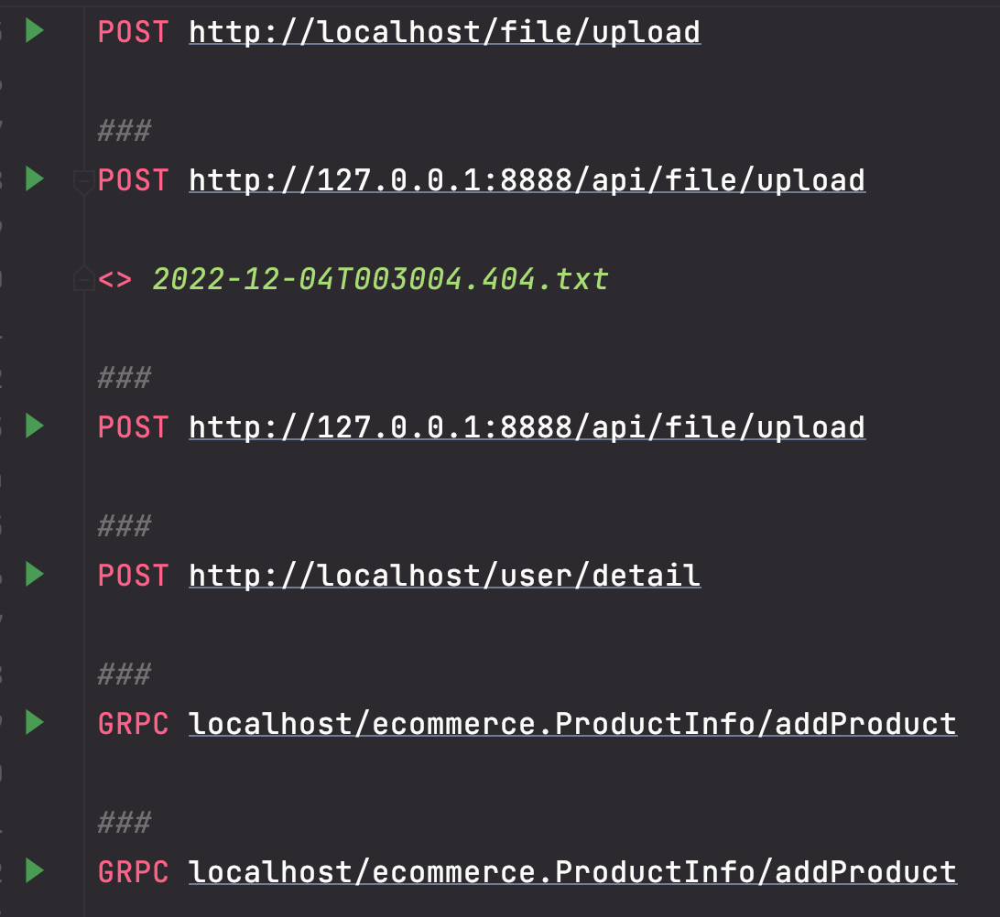

* [微服务入门](#微服务入门)
* [gRPC是什么](#grpc是什么)
      * [proto 服务定义](#proto-服务定义)
      * [gRPC 优势](#grpc-优势)
* [gRPC入门](#grpc入门)
      * [简单使用](#简单使用)
      * [一元RPC](#一元rpc)
      * [服务流RPC](#服务流rpc)
      * [客户流RPC](#客户流rpc)
      * [双工流RPC](#双工流rpc)
* [gRPC底层原理](#grpc底层原理)
      * [RPC流](#rpc流)
      * [长度前缀的消息分帧](#长度前缀的消息分帧)
      * [请求消息](#请求消息)
      * [响应信息](#响应信息)
      * [通信模式下的消息流](#通信模式下的消息流)
* [gRPC进阶](#grpc进阶)
      * [服务端拦截器](#服务端拦截器)
      * [客户端拦截器](#客户端拦截器)
      * [截止时间、超时时间](#截止时间超时时间)
      * [错误处理](#错误处理)
      * [多路复用](#多路复用)
      * [元数据](#元数据)
      * [负载均衡](#负载均衡)
      * [压缩数据](#压缩数据)
* [gRPC安全连接](#grpc安全连接)
      * [单向TLS安全连接](#单向tls安全连接)
      * [basic 认证](#basic-认证)
      * [OAuth 2.0认证](#oauth-20认证)
      * [JWT认证](#jwt认证)
* [gRPC测试](#grpc测试)
      * [服务端测试](#服务端测试)
      * [客户端测试](#客户端测试)
* [gRPC部署](#grpc部署)
      * [部署docker](#部署docker)
      * [部署k8s](#部署k8s)
      * [健康检查](#健康检查)
      * [健康探针](#健康探针)
      

# 微服务入门

> 现在的软件很少是一个孤立的单体应用运行的，相反更多是通过互联网连接在一起的，以相互传递消息的方式进行通信和协调，也就是分布式软件的集合。
>
> 例如：一个商城系统由多个分布式的应用程序组成，像订单应用、商品应用、支付应用、数据库应用等等，这些程序可以分布在不同的网络位置中运行，通过不同的通信协议传递信息。
> 传统的软件被拆分成细粒度、面向业务的实体，这就是微服务。
>
> 最传统的方式就是构造成REST API 服务，也就是一组架构约束条件原则，把应用和服务定义为一组资源，但是这种方式的配置太麻烦，笨重低效。
>
> 为了更好的扩展性、低耦合进程间通信，这也就是gRPC的优势

# gRPC是什么

> 以往我们是通过简单的路由映射来允许客户端获取路由信息和交换路由信息。
>
> 在gRPC中，我们可以一次性的在一个 proto文件中定义服务并使用任意的支持gRPC的语言去实现客户端和服务端，整个过程操作变得简单，就像调用本地函数一样。

> 通过 proto生成服务端代码，也就是服务端的骨架，提供低层通信抽象
>
> 通过 proto生成客户端代码，也就是客户端的存根，隐藏了不同语言的差异，提供抽象的通信方式，就像调用本地函数一样。
>
> ~~~go
> go get google.golang.org/grpc
> go get github.com/golang/protobuf/protoc-gen-go
> ~~~

### proto 服务定义

> gRPC 使用protocol buffer 来定义服务接口，protocol buffer和 XML、JSON一样是一种结构化数据序列化的可扩展存储结构，protocol buffer是一种语言中立，结构简单高效，比XML更小更简单，可以通过特殊的插件自动生成代码来读写操作这个数据结构。

~~~protobuf
import "myproject/other_protos.proto";		// 导入其他 proto文件

message SearchRequest 
{
  required string query = 1;				// 必须赋值字段
  optional int32 page_number = 2 [default = 10];		// 可选字段
  repeated int32 result_per_page = 3;	// 可重复字段 
}

message SearchResponse 
{
  message Result 		// 嵌套定义
  {
    required string url = 1;
    optional string title = 2;
    repeated string snippets = 3;
  }
  repeated Result result = 1;
}

message SomeOtherMessage 
{
  optional SearchResponse.Result result = 1;	// 使用其他消息的定义
}

service List{				// 定义gRPC服务接口
	rpc getList(SearchRequest) returns (SearchResponse);
}
~~~

~~~go
// 插件自动生成gRPC骨架和存根
protoc --go_out=plugins=grpc: ./ *.proto

后面需要实现服务端具体的逻辑就行，然后注册到gRPC服务器
客户端在调用远程方法时会使用阻塞式存根，所以gRPC主要使用同步的方式通信，在建立连接后，可以使用流的方式操作。
客户端编排为protocol buffer的格式，服务端再解排执行，以HTTP2 传输
~~~

### gRPC 优势

- 更高效的进程通信：使用基于protocol buffer在Http2 中以二进制协议通信，而不是JSON、XML文本格式
- 简单定义的服务接口、易扩展
- 强类型、跨语言
- 一元RPC、服务端流、客户端流、双工流

# gRPC入门

### 简单使用

`protocol buffer`

~~~protobuf
syntax = "proto3";
package ecommerce;

service ProductInfo {
    rpc addProduct(Product) returns (ProductID);
    rpc getProduct(ProductID) returns (Product);
}

message Product {
    string id = 1;
    string name = 2;
    string description = 3;
    float price = 4;
}

message ProductID {
    string value = 1;
}
~~~

`服务端`

~~~go
// server is used to implement ecommerce/product_info.
type server struct {
	productMap map[string]*pb.Product
}

// AddProduct implements ecommerce.AddProduct
func (s *server) AddProduct(ctx context.Context,
	in *pb.Product) (*pb.ProductID, error) {
	out, err := uuid.NewV4()
	if err != nil {
		return nil, status.Errorf(codes.Internal, "Error while generating Product ID", err)
	}
	in.Id = out.String()
	if s.productMap == nil {
		s.productMap = make(map[string]*pb.Product)
	}
	s.productMap[in.Id] = in
	log.Printf("Product %v : %v - Added.", in.Id, in.Name)
	return &pb.ProductID{Value: in.Id}, status.New(codes.OK, "").Err()
}

// GetProduct implements ecommerce.GetProduct
func (s *server) GetProduct(ctx context.Context, in *pb.ProductID) (*pb.Product, error) {
	product, exists := s.productMap[in.Value]
	if exists && product != nil {
		log.Printf("Product %v : %v - Retrieved.", product.Id, product.Name)
		return product, status.New(codes.OK, "").Err()
	}
	return nil, status.Errorf(codes.NotFound, "Product does not exist.", in.Value)
}

func main() {
	lis, err := net.Listen("tcp", port)
	if err != nil {
		log.Fatalf("failed to listen: %v", err)
	}
	s := grpc.NewServer()
	pb.RegisterProductInfoServer(s, &server{})
	if err := s.Serve(lis); err != nil {
		log.Fatalf("failed to serve: %v", err)
	}
}
~~~

`客户端`

~~~go
func main() {
	// Set up a connection to the server.
	conn, err := grpc.Dial(address, grpc.WithInsecure())
	if err != nil {
		log.Fatalf("did not connect: %v", err)
	}
	defer conn.Close()
	c := pb.NewProductInfoClient(conn)

	// Contact the server and print out its response.
	name := "Apple iPhone 11"
	description := "Meet Apple iPhone 11. All-new dual-camera system with Ultra Wide and Night mode."
	price := float32(699.00)
	ctx, cancel := context.WithTimeout(context.Background(), time.Second)
	defer cancel()
	r, err := c.AddProduct(ctx, &pb.Product{Name: name, Description: description, Price: price})
	if err != nil {
		log.Fatalf("Could not add product: %v", err)
	}
	log.Printf("Product ID: %s added successfully", r.Value)

	product, err := c.GetProduct(ctx, &pb.ProductID{Value: r.Value})
	if err != nil {
		log.Fatalf("Could not get product: %v", err)
	}
	log.Printf("Product: %v", product.String())
}

~~~

客户端连接gRPC服务器以后，就可以像调用本地函数一样操作远程服务器。

### 一元RPC

> 通信时始终只有一个请求和一个响应

~~~protobuf
service OrderManagement {
    rpc addOrder(Order) returns (google.protobuf.StringValue);
    rpc getOrder(google.protobuf.StringValue) returns (Order);
}

message Order {
    string id = 1;
    repeated string items = 2;
    string description = 3;
    float price = 4;
    string destination = 5;
}

message CombinedShipment {
    string id = 1;
    string status = 2;
    repeated Order ordersList = 3;
}
~~~

`服务端`

~~~go
func (s *server) AddOrder(ctx context.Context, orderReq *pb.Order) (*wrapper.StringValue, error) {
	log.Printf("Order Added. ID : %v", orderReq.Id)
	orderMap[orderReq.Id] = *orderReq
	return &wrapper.StringValue{Value: "Order Added: " + orderReq.Id}, nil
}

func (s *server) GetOrder(ctx context.Context, orderId *wrapper.StringValue) (*pb.Order, error) {
	ord, exists := orderMap[orderId.Value]
	if exists {
		return &ord, status.New(codes.OK, "").Err()
	}
	return nil, status.Errorf(codes.NotFound, "Order does not exist. : ", orderId)
}

func main() {
	lis, err := net.Listen("tcp", port)
	if err != nil {
		log.Fatalf("failed to listen: %v", err)
	}
	s := grpc.NewServer()
	pb.RegisterOrderManagementServer(s, &server{})
	if err := s.Serve(lis); err != nil {
		log.Fatalf("failed to serve: %v", err)
	}
}
~~~

`客户端`

~~~go
func main() {
	// Setting up a connection to the server.
	conn, err := grpc.Dial(address, grpc.WithInsecure())
	if err != nil {
		log.Fatalf("did not connect: %v", err)
	}
	defer conn.Close()
	client := pb.NewOrderManagementClient(conn)
	ctx, cancel := context.WithTimeout(context.Background(), time.Second*5)
	defer cancel()

	// Add Order
	order1 := pb.Order{Id: "101", Items: []string{"iPhone XS", "Mac Book Pro"}, Destination: "San Jose, CA", Price: 2300.00}
	res, _ := client.AddOrder(ctx, &order1)
	if res != nil {
		log.Print("AddOrder Response -> ", res.Value)
	}
  // Get Order
	retrievedOrder , err := client.GetOrder(ctx, &wrapper.StringValue{Value: "106"})
	log.Print("GetOrder Response -> : ", retrievedOrder)
} 
~~~

### 服务流RPC

> 通信时可以是一个请求，服务端多次响应，比如查询业务，服务端模糊匹配找到一次就返回客户端一次响应这样的多次响应

~~~protobuf
rpc searchOrders(google.protobuf.StringValue) returns (stream Order);
~~~

~~~go
func (s *server) SearchOrders(searchQuery *wrappers.StringValue, stream pb.OrderManagement_SearchOrdersServer) error {
	for key, order := range orderMap {
		log.Print(key, order)
		for _, itemStr := range order.Items {
			log.Print(itemStr)
      // 检查字段是否包含查询字符串
			if strings.Contains(itemStr, searchQuery.Value) {
				// 服务端 Send 方法写入流中发送给客户端
				err := stream.Send(&order)
				if err != nil {
					return fmt.Errorf("error sending message to stream : %v", err)
				}
				log.Print("Matching Order Found : " + key)
				break
			}
		}
	}
	return nil
}
~~~

~~~go
searchStream, _ := client.SearchOrders(ctx, &wrapper.StringValue{Value: "Google"})
	for {
    // 客户端 Recv 方法接收服务端发送的流
		searchOrder, err := searchStream.Recv()
		if err == io.EOF {
			log.Print("EOF")
			break
		}
		if err == nil {
			log.Print("Search Result : ", searchOrder)
		}
	}
~~~

### 客户流RPC

> 客户端多个请求发给服务端，服务端发送一个响应给客户端，比如更新业务，客户端的读个请求发过来，服务端更新完返回一个成功的结果

~~~protobuf
rpc updateOrders(stream Order) returns (google.protobuf.StringValue);
~~~

~~~go
func (s *server) UpdateOrders(stream pb.OrderManagement_UpdateOrdersServer) error {
  
	ordersStr := "Updated Order IDs : "
	for {
    // Recv 对客户端发来的请求接收
		order, err := stream.Recv()
		if err == io.EOF {
			// 流结束，关闭并发送响应给客户端
			return stream.SendAndClose(&wrapper.StringValue{Value: "Orders processed " + ordersStr})
		}
		if err != nil {
			return err
		}
		// 更新数据
		orderMap[order.Id] = *order
		log.Printf("Order ID : %s - %s", order.Id, "Updated")
		ordersStr += order.Id + ", "
	}
}
~~~

~~~go
updateStream, err := client.UpdateOrders(ctx)
	if err != nil {
		log.Fatalf("%v.UpdateOrders(_) = _, %v", client, err)
	}
	// Updating order 1
	if err := updateStream.Send(&updOrder1); err != nil {
		log.Fatalf("%v.Send(%v) = %v", updateStream, updOrder1, err)
	}
	// Updating order 2
	if err := updateStream.Send(&updOrder2); err != nil {
		log.Fatalf("%v.Send(%v) = %v", updateStream, updOrder2, err)
	}
	// 发送关闭信号并接收服务端响应
updateRes, err := updateStream.CloseAndRecv()
	if err != nil {
		log.Fatalf("%v.CloseAndRecv() got error %v, want %v", updateStream, err, nil)
	}
	log.Printf("Update Orders Res : %s", updateRes)
~~~

### 双工流RPC

> 对应的业务就比如实时的消息流

~~~protobuf
rpc processOrders(stream google.protobuf.StringValue) returns (stream CombinedShipment);
~~~

~~~go
func (s *server) ProcessOrders(stream pb.OrderManagement_ProcessOrdersServer) error {

	batchMarker := 1
	var combinedShipmentMap = make(map[string]pb.CombinedShipment)
	for {
    // 接收请求
		orderId, err := stream.Recv()
		log.Printf("Reading Proc order : %s", orderId)
		if err == io.EOF {
			// 客户端请求发完，返回对应响应
			log.Printf("EOF : %s", orderId)
			for _, shipment := range combinedShipmentMap {
				if err := stream.Send(&shipment); err != nil {
					return err
				}
			}
			return nil
		}
		if err != nil {
			log.Println(err)
			return err
		}
		// 处理逻辑
		destination := orderMap[orderId.GetValue()].Destination
		shipment, found := combinedShipmentMap[destination]

		if found {
			ord := orderMap[orderId.GetValue()]
			shipment.OrdersList = append(shipment.OrdersList, &ord)
			combinedShipmentMap[destination] = shipment
		} else {
			comShip := pb.CombinedShipment{Id: "cmb - " + (orderMap[orderId.GetValue()].Destination), Status: "Processed!"}
			ord := orderMap[orderId.GetValue()]
			comShip.OrdersList = append(shipment.OrdersList, &ord)
			combinedShipmentMap[destination] = comShip
			log.Print(len(comShip.OrdersList), comShip.GetId())
		}
		// 分批块发送回响应
		if batchMarker == orderBatchSize {
			for _, comb := range combinedShipmentMap {
				log.Printf("Shipping : %v -> %v", comb.Id, len(comb.OrdersList))
				if err := stream.Send(&comb); err != nil {
					return err
				}
			}
			batchMarker = 0
			combinedShipmentMap = make(map[string]pb.CombinedShipment)
		} else {
			batchMarker++
		}
	}
}
~~~

~~~go
func main(){
streamProcOrder, err := client.ProcessOrders(ctx)

	if err := streamProcOrder.Send(&wrapper.StringValue{Value: "102"}); err != nil {
		log.Fatalf("%v.Send(%v) = %v", client, "102", err)
	}

	if err := streamProcOrder.Send(&wrapper.StringValue{Value: "103"}); err != nil {
		log.Fatalf("%v.Send(%v) = %v", client, "103", err)
	}

channel := make(chan struct{})
  // 起个协程接收返回的响应
	go asncClientBidirectionalRPC(streamProcOrder, channel)
  // 模拟消息延迟，发送请求 1
	time.Sleep(time.Millisecond * 1000)
  if err := streamProcOrder.Send(&wrapper.StringValue{Value: "101"}); err != nil {
		log.Fatalf("%v.Send(%v) = %v", client, "101", err)
	}
	// 关闭流
	if err := streamProcOrder.CloseSend(); err != nil {
		log.Fatal(err)
	}
	channel <- struct{}{}
}

func asncClientBidirectionalRPC(streamProcOrder pb.OrderManagement_ProcessOrdersClient, c chan struct{}) {
	for {
		combinedShipment, errProcOrder := streamProcOrder.Recv()
		if errProcOrder == io.EOF {
			break
		}
		log.Printf("Combined shipment : ", combinedShipment.OrdersList)
	}
	<-c
}
~~~

# gRPC底层原理

### RPC流

> 服务端实现protocol buffer定义的方法，客户端保留一个存根，提供服务端方法的抽象，客户端只需要调用存根中的方法，就可以远程调用服务端方法。
>
> - 调用存根方法
> - 存根创建HTTP POST请求（==gRPC中所有请求都是 POST==），设置`content-type`为`application/grpc`
> - 到达服务端，会先检查请求头是不是gRPC请求，否则返回415

### 长度前缀的消息分帧

> 在写入消息前，先写入长度消息表明每条消息的大小。
>
> 每条消息都有额外的4字节来设置大小，也就是说消息的大小不能超过4GB

> 帧首中还有单字节无符号整数，用来表明数据是否进行了压缩
>
> 为1表示使用 `message-encoding`中的编码机制进行了压缩

### 请求消息

> 客户端发送，包含3个部分：请求头信息、长度前缀的消息、流结束标记
>
> 1、对于gRPC 都是POST
>
> 2、协议：Http/Https
>
> 3、/服务名/方法名
>
> 4、目标URI的主机名
>
> 5、对不兼容代理的检测，gRPC下这个值必须为 trailers
>
> 6、超时时间
>
> 7、媒体类型
>
> 8、压缩类型

==当因为没有要发送的数据而需要关闭请求流时，必须发送一个带标记的空数据帧==

### 响应信息

> 服务端发送，包含3个部分：响应头信息、长度前缀的信息、trailers
>
> END_STREAM 标记不会随数据帧一起发送，而是作为单独的头信息来发送，名为 trailer

### 通信模式下的消息流

`一元RPC`

`服务流RPC`

`客户流RPC`

`双工流RPC`

# gRPC进阶

### 服务端拦截器

`一元拦截器`

~~~go
func orderUnaryServerInterceptor(ctx context.Context, req interface{}, info *grpc.UnaryServerInfo, handler grpc.UnaryHandler) (interface{}, error) {
  
	// 前置处理逻辑
	log.Println("======= [Server Interceptor] ", info.FullMethod)
	log.Printf(" Pre Proc Message : %s", req)

  // 调用handle 执行一元RPC
	m, err := handler(ctx, req)

	// 后置处理逻辑
	log.Printf(" Post Proc Message : %s", m)
	return m, err
}

func main(){
  lis, err := net.Listen("tcp", port)
  // 服务端注册拦截器
	s := grpc.NewServer(grpc.UnaryInterceptor(orderUnaryServerInterceptor))
	pb.RegisterOrderManagementServer(s, &server{})
	
	reflection.Register(s)
	if err := s.Serve(lis); err != nil {
		log.Fatalf("failed to serve: %v", err)
	}
}
~~~

`流拦截器`

~~~go
type wrappedStream struct {
  // 包装器流
	grpc.ServerStream
}

func (w *wrappedStream) RecvMsg(m interface{}) error {
	log.Printf("====== [Server Stream Interceptor Wrapper] Receive a message (Type: %T) at %s", m, time.Now().Format(time.RFC3339))
	return w.ServerStream.RecvMsg(m)
}

func (w *wrappedStream) SendMsg(m interface{}) error {
	log.Printf("====== [Server Stream Interceptor Wrapper] Send a message (Type: %T) at %v", m, time.Now().Format(time.RFC3339))
	return w.ServerStream.SendMsg(m)
}

func newWrappedStream(s grpc.ServerStream) grpc.ServerStream {
	return &wrappedStream{s}
}

func orderServerStreamInterceptor(srv interface{}, ss grpc.ServerStream, info *grpc.StreamServerInfo, handler grpc.StreamHandler) error {
	// 前置处理
	log.Println("====== [Server Stream Interceptor] ", info.FullMethod)

	// 包装器流调用 流RPC
	err := handler(srv, newWrappedStream(ss))
	if err != nil {
		log.Printf("RPC failed with error %v", err)
	}
	return err
}

func main(){
  lis, err := net.Listen("tcp", port)
  // 服务端注册拦截器
  s := grpc.NewServer(grpc.StreamInterceptor(orderServerStreamInterceptor))
	pb.RegisterOrderManagementServer(s, &server{})
	
	reflection.Register(s)
	if err := s.Serve(lis); err != nil {
		log.Fatalf("failed to serve: %v", err)
	}
}
~~~

### 客户端拦截器

`一元拦截器`

~~~go
func orderUnaryClientInterceptor(ctx context.Context, method string, req, reply interface{}, cc *grpc.ClientConn, invoker grpc.UnaryInvoker, opts ...grpc.CallOption) error {
	// 前置处理逻辑
	log.Println("Method : " + method)

	// 调用invoker 执行远程方法
	err := invoker(ctx, method, req, reply, cc, opts...)

	// 后置处理逻辑
	log.Println(reply)
	return err
}

func main(){
  // 注册拦截器到客户端流
 conn,err:=grpc.Dial(address,grpc.WithInsecure(),grpc.WithUnaryInterceptor(orderUnaryClientInterceptor)
	if err != nil {
		log.Fatalf("did not connect: %v", err)
	}
	defer conn.Close()
                     
	c := pb.NewOrderManagementClient(conn)
  ctx, cancel := context.WithTimeout(context.Background(), time.Second*5)
	defer cancel()

  // 调用一元RPC方法
	order1 := pb.Order{Id: "101", Items: []string{"iPhone XS", "Mac Book Pro"}, Destination: "San Jose, CA", Price: 2300.00}
	res, _ := c.AddOrder(ctx, &order1)
	log.Print("AddOrder Response -> ", res.Value)
}
~~~

`流拦截器`

~~~go
type wrappedStream struct {
	grpc.ClientStream
}

func (w *wrappedStream) RecvMsg(m interface{}) error {
	log.Printf("====== [Client Stream Interceptor] Receive a message (Type: %T) at %v", m, time.Now().Format(time.RFC3339))
	return w.ClientStream.RecvMsg(m)
}

func (w *wrappedStream) SendMsg(m interface{}) error {
	log.Printf("====== [Client Stream Interceptor] Send a message (Type: %T) at %v", m, time.Now().Format(time.RFC3339))
	return w.ClientStream.SendMsg(m)
}

func newWrappedStream(s grpc.ClientStream) grpc.ClientStream {
	return &wrappedStream{s}
}

func clientStreamInterceptor(ctx context.Context, desc *grpc.StreamDesc, cc *grpc.ClientConn, method string, streamer grpc.Streamer, opts ...grpc.CallOption) (grpc.ClientStream, error) {
	
  // 前置处理逻辑
	log.Println("======= [Client Interceptor] ", method)
  
  // 调用streamer 来获取客户端流
	s, err := streamer(ctx, desc, cc, method, opts...)
	if err != nil {
		return nil, err
	}
	return newWrappedStream(s), nil
}

func main(){
   // 注册拦截器到客户端流
 conn,err:=grpc.Dial(address,grpc.WithInsecure(),grpc.WithStreamInterceptor(clientStreamInterceptor))
	if err != nil {
		log.Fatalf("did not connect: %v", err)
	}
	defer conn.Close()
                     
	c := pb.NewOrderManagementClient(conn)
  ctx, cancel := context.WithTimeout(context.Background(), time.Second*5)
	defer cancel()
  
  // 调用客户端流RPC方法
  searchStream, _ := c.SearchOrders(ctx, &wrapper.StringValue{Value: "Google"})
	for {
		searchOrder, err := searchStream.Recv()
		if err == io.EOF {
			log.Print("EOF")
			break
		}
		if err == nil {
			log.Print("Search Result : ", searchOrder)
		}
	}
}
~~~

### 截止时间、超时时间

> 截止时间：从请求开始时间+持续时间的偏移，多个服务调用，整个请求链需要在截止时间前响应，避免持续的等待RPC响应，造成资源消耗服务延迟
>
> 超时时间：指定等待RPC完成的时间，超时以错误结束返回

`截止时间`

~~~go
func main(){
  conn, err := grpc.Dial(address, grpc.WithInsecure())
	if err != nil {
		log.Fatalf("did not connect: %v", err)
	}
	defer conn.Close()
	client := pb.NewOrderManagementClient(conn)

  // 设置截止时间+持续时间的偏移
	clientDeadline := time.Now().Add(time.Duration(2 * time.Second))
	ctx, cancel := context.WithDeadline(context.Background(), clientDeadline)
	defer cancel()

	order1 := pb.Order{Id: "101", Items: []string{"iPhone XS", "Mac Book Pro"}, Destination: "San Jose, CA", Price: 2300.00}
	res, addErr := client.AddOrder(ctx, &order1)
}
~~~

~~~go
// 服务端判断客户端是否满足截止时间的状态，然后丢弃这个RPC返回一个错误，可以是select来实现
if ctx.Err() == context.DeadlineExceeded {
		log.Printf("RPC has reached deadline exceeded state : %s", ctx.Err())
		return nil, ctx.Err()
	}
~~~

`超时时间`

~~~go
func main(){
  conn, err := grpc.Dial(address, grpc.WithInsecure())
	if err != nil {
		log.Fatalf("did not connect: %v", err)
	}
	defer conn.Close()
	client := pb.NewOrderManagementClient(conn)

  // 设置超时时间
	ctx, cancel := context.WithTimeout(context.Background(), time.Second*5)
	defer cancel()

	order1 := pb.Order{Id: "101", Items: []string{"iPhone XS", "Mac Book Pro"}, Destination: "San Jose, CA", Price: 2300.00}
	res, addErr := client.AddOrder(ctx, &order1)
}
~~~

### 错误处理

~~~go
// 服务端
// 通过 status包创建所需的错误码和错误状态
errorStatus := status.New(codes.InvalidArgument, "Invalid information received")
// 错误详情
ds, err := errorStatus.WithDetails(
	&epb.BadRequest_FieldViolation{
		Field:"ID",
    Description: fmt.Sprintf("Order ID received is not valid %s:%s",orderReq.Id,orderReq.Description),
	},
)
if err != nil {
	return nil, errorStatus.Err()
}
// 返回错误
return nil, ds.Err()
~~~

~~~go
// 客户端	
res, addOrderError := client.AddOrder(ctx, &order1)

	if addOrderError != nil {
		errorCode := status.Code(addOrderError)
		if errorCode == codes.InvalidArgument {
			log.Printf("Invalid Argument Error : %s", errorCode)
			errorStatus := status.Convert(addOrderError)
			for _, d := range errorStatus.Details() {
				switch info := d.(type) {
				case *epb.BadRequest_FieldViolation:
					log.Printf("Request Field Invalid: %s", info)
				default:
					log.Printf("Unexpected error type: %s", info)
				}
			}
		} else {
			log.Printf("Unhandled error : %s ", errorCode)
		}
	} else {
		log.Print("AddOrder Response -> ", res.Value)
	}
~~~

### 多路复用

> 同一台服务器上的多个RPC服务的多路复用，比如同时保存一个订单的存根、一个欢迎的存根
>
> 因为多个RPC服务运行在一个服务端上，所以客户端的多个存根之间是可以共享gRPC连接的

~~~go
func main() {
	lis, err := net.Listen("tcp", port)
	if err != nil {
		log.Fatalf("failed to listen: %v", err)
	}
	grpcServer := grpc.NewServer() 

	// 注册进订单服务
	ordermgt_pb.RegisterOrderManagementServer(grpcServer, &orderMgtServer{}) 
	// 注册进欢迎服务
	hello_pb.RegisterGreeterServer(grpcServer, &helloServer{}) 
}
~~~

~~~go
func main() {
	conn, err := grpc.Dial(address, grpc.WithInsecure())
	if err != nil {
		log.Fatalf("did not connect: %v", err)
	}
	defer conn.Close()

	// 订单服务建立实例连接
	orderManagementClient := pb.NewOrderManagementClient(conn)
	ctx, cancel := context.WithTimeout(context.Background(), time.Second)
	defer cancel()

	order1 := pb.Order{Id: "101", Items:[]string{"iPhone XS", "Mac Book Pro"}, Destination:"San Jose, CA", Price:2300.00}
	res, addErr := orderManagementClient.AddOrder(ctx, &order1)
  
	// 欢迎服务建立实例连接
	helloClient := hwpb.NewGreeterClient(conn)
	hwcCtx, hwcCancel := context.WithTimeout(context.Background(), time.Second)
	defer hwcCancel()
  
	helloResponse, err := helloClient.SayHello(hwcCtx, &hwpb.HelloRequest{Name: "gRPC Up and Running!"})
	fmt.Println("Greeting: ", helloResponse.Message)
}
~~~

### 元数据

`元数据创建`

~~~go
// 方法1
md := metadata.Pairs(
		"1", "v1",
    "1", "v2",	// 方法1会把相同的键的字段合并，[ ]string{"v1","v2"}
		"2", "v3",
	)
// 方法2
md := metadata.New(map[string]string{"1":"v1","2":"v2"})
~~~

`客户端收发`

> 在context中设置的元数据会转换成线路层的gRPC头信息和 trailer
>
> 客户端发送这些头信息，收件方会以头信息的形式接收他们

~~~go
	// 创建元数据
	md := metadata.Pairs(
		"timestamp", time.Now().Format(time.StampNano),
		"kn", "vn",
	)
	// 创建新元数据的上下文，这种方法会替换掉已有的上下文
	mdCtx := metadata.NewOutgoingContext(context.Background(), md)
	// 这种方法是将元数据附加到已有的上下文
	ctxA := metadata.AppendToOutgoingContext(mdCtx, "k1", "v1", "k1", "v2", "k2", "v3")

	// 定义头信息和 trailer，可以用来接收元数据
	var header, trailer metadata.MD

	order1 := pb.Order{Id: "101", Items: []string{"iPhone XS", "Mac Book Pro"}, Destination: "San Jose, CA", Price: 2300.00}
	res, _ := client.AddOrder(ctxA, &order1, grpc.Header(&header), grpc.Trailer(&trailer))

	log.Print("AddOrder Response -> ", res.Value)
	// 获取头信息
	head, err := res.Header()
	// 获取trailer
	trail, err := res.Trailer()
~~~

`服务端收发`

~~~go
// 从上下文中获取元数据列表
md, metadataAvailable := metadata.FromIncomingContext(ctx)
	if !metadataAvailable {
		return nil, status.Errorf(codes.DataLoss, "UnaryEcho: failed to get metadata")
	}
// 操作元数据逻辑
	if t, ok := md["timestamp"]; ok {
		fmt.Printf("timestamp from metadata:\n")
		for i, e := range t {
			fmt.Printf("====> Metadata %d. %s\n", i, e)
		}
	}

// 创建元数据
header := metadata.New(map[string]string{"location": "San Jose", "timestamp": time.Now().Format(time.StampNano)})
// 发送头信息
grpc.SendHeader(ctx, header)
trailer := metadata.Pairs("status","ok")
// 设置trailer
grpc.SetTrailer(ctx,trailer)
~~~

### 负载均衡

`负载均衡器代理`

> 也就是说后端的结构对gRPC客户端是不透明的，客户端只需要知道均衡器的断点就可以了
>
> 比如NGINX代理、Envoy代理

`客户端负载均衡`

~~~go
func main(){
  roundrobinConn, err := grpc.Dial(
		address,
		grpc.WithBalancerName("round_robin"), 	// 指定负载均衡的算法
    // 默认是"pick_first"，也就是从服务器列表中第一个服务端开始尝试发送请求，成功则后续所有RPC都发往这个服务器
    // "round_robin"轮询调度算法，连接所有地址，每次向后端发送一个RPC
		grpc.WithInsecure(),
	)
	if err != nil {
		log.Fatalf("did not connect: %v", err)
	}
	defer roundrobinConn.Close()
	// 起10个RPC调度任务
	makeRPCs(roundrobinConn, 10)
}

func makeRPCs(cc *grpc.ClientConn, n int) {
	hwc := ecpb.NewEchoClient(cc)
	for i := 0; i < n; i++ {
		callUnary(hwc)
	}
}

func callUnary(c ecpb.EchoClient) {
	ctx, cancel := context.WithTimeout(context.Background(), time.Second)
	defer cancel()
  
}
~~~

### 压缩数据

> 在服务端会对已注册的压缩器自动解码，响应时自动编码
>
> 始终从客户端获取指定的压缩方法，如果没被注册就会返回Unimplemented

~~~go
func main() {
	conn, err := grpc.Dial(address, grpc.WithInsecure())
	defer conn.Close()
	client := pb.NewOrderManagementClient(conn)
	ctx, cancel := context.WithTimeout(context.Background(), time.Second * 5)
	defer cancel()

	order1 := pb.Order{Id: "101", Items:[]string{"iPhone XS", "Mac Book Pro"}, Destination:"San Jose, CA", Price:2300.00}
  // 通过 grpc.UseCompressor(gzip.Name) 就可以轻松压缩数据
	res, _ := client.AddOrder(ctx, &order1, grpc.UseCompressor(gzip.Name))
}
~~~

# gRPC安全连接

### 单向TLS安全连接

`服务端`

~~~go
var (
  port = ":50051"
  crtFile = "server.crt"
  keyFile = "server.key"
)

func main() {
  // 读取解析公私钥，创建TLS的证书
  cert, err := tls.LoadX509KeyPair(crtFile,keyFile) 
  if err != nil {
     log.Fatalf("failed to load key pair: %s", err)
  }
  
  opts := []grpc.ServerOption{
     grpc.Creds(credentials.NewServerTLSFromCert(&cert)) 
  }
	// 通过TLS证书来创建RPC服务器，
  s := grpc.NewServer(opts...) 
  pb.RegisterProductInfoServer(s, &server{}) 

  lis, err := net.Listen("tcp", port) 
  if err != nil {
     log.Fatalf("failed to listen: %v", err)
  }
  if err := s.Serve(lis); err != nil { 
     log.Fatalf("failed to serve: %v", err)
  }
}
~~~

`客户端`

~~~go
var (
  address = "localhost:50051"
  hostname = "localhost
  crtFile = "server.crt"
)

func main() {
  // 读取解析公开证书，创建TLS的证书
  creds, err := credentials.NewClientTLSFromFile(crtFile, hostname) 
  if err != nil {
     log.Fatalf("failed to load credentials: %v", err)
  }
  
  opts := []grpc.DialOption{
     grpc.WithTransportCredentials(creds), 
  }
	// 建立安全连接
  conn, err := grpc.Dial(address, opts...) 
  if err != nil {
     log.Fatalf("did not connect: %v", err)
  }
  defer conn.Close() 
  c := pb.NewProductInfoClient(conn) 
}
~~~

### basic 认证

> 这个比较简单了，客户端发送的头信息中 Authorization由字符串“ basic base64(user：passwd) ”组成

~~~go
type basicAuth struct { 
  username string
  password string
}
// 编码逻辑
func (b basicAuth) GetRequestMetadata(ctx context.Context, in ...string)  (map[string]string, error) { 
  auth := b.username + ":" + b.password
  enc := base64.StdEncoding.EncodeToString([]byte(auth))
  return map[string]string{
     "authorization": "Basic " + enc,
  }, nil
}
// 传递凭证时是否启用安全通道
func (b basicAuth) RequireTransportSecurity() bool { 
  return true
}
~~~

`客户端`

~~~go
func main() {
  // 读取解析公开证书，创建TLS的证书
  creds, err := credentials.NewClientTLSFromFile(crtFile, hostname) 
  if err != nil {
     log.Fatalf("failed to load credentials: %v", err)
  }
  
  auth := basicAuth{ 
    username: "admin",
    password: "admin",
  }
  opts := []grpc.DialOption{
     // 添加认证凭证函数
     grpc.WithPerRPCCredentials(auth),
     grpc.WithTransportCredentials(creds), 
  }
	// 建立安全连接
  conn, err := grpc.Dial(address, opts...) 
  if err != nil {
     log.Fatalf("did not connect: %v", err)
  }
  defer conn.Close() 
  c := pb.NewProductInfoClient(conn) 
}
~~~

`服务端`

~~~go
func main() {
  // 读取解析公私钥，创建TLS的证书
  cert, err := tls.LoadX509KeyPair(crtFile,keyFile) 
  if err != nil {
     log.Fatalf("failed to load key pair: %s", err)
  }
  
  opts := []grpc.ServerOption{
     // UnaryInterceptor 添加一个拦截器函数
     grpc.UnaryInterceptor(ensureValidBasicCredentials),
     grpc.Creds(credentials.NewServerTLSFromCert(&cert)) 
  }
	// 通过TLS证书来创建RPC服务器，
  s := grpc.NewServer(opts...) 
  pb.RegisterProductInfoServer(s, &server{}) 

  lis, err := net.Listen("tcp", port) 
  if err := s.Serve(lis); err != nil { 
     log.Fatalf("failed to serve: %v", err)
  }
}
// 拦截器函数
func ensureValidBasicCredentials(ctx context.Context, req interface{}, info *grpc.UnaryServerInfo,
	handler grpc.UnaryHandler) (interface{}, error) {
	md, ok := metadata.FromIncomingContext(ctx)
	if !ok {
		return nil, errMissingMetadata
	}
	// 检查头信息 authorization
	if !valid(md["authorization"]) {
		return nil, errInvalidToken
	}
	// 调用执行RPC
	return handler(ctx, req)
}

func valid(authorization []string) bool {
	if len(authorization) < 1 {
		return false
	}
	token := strings.TrimPrefix(authorization[0], "Basic ")
	return token == base64.StdEncoding.EncodeToString([]byte("admin:admin"))
}
~~~

### OAuth 2.0认证

> 通过令牌凭证访问服务端资源，例子中没有授权服务器，直接使用的硬编码演示

`客户端`

~~~go
func main() {
	creds, err := credentials.NewClientTLSFromFile(crtFile, hostname)
	if err != nil {
		log.Fatalf("failed to load credentials: %v", err)
	}
  // 令牌凭证
  perRPC := oauth.NewOauthAccess(fetchToken())

	opts := []grpc.DialOption{
    // 使用连接凭证
		grpc.WithPerRPCCredentials(perRPC),
		grpc.WithTransportCredentials(creds),
	}

	conn, err := grpc.Dial(address, opts...)
	defer conn.Close()
	c := pb.NewProductInfoClient(conn)
  
	ctx, cancel := context.WithTimeout(context.Background(), time.Second)
	defer cancel()
}
// 授权服务器
func fetchToken() *oauth2.Token {
	return &oauth2.Token{
		AccessToken: "some-secret-token",
	}
}
~~~

`服务端`

~~~go
func main() {
	cert, err := tls.LoadX509KeyPair(crtFile, keyFile)
	opts := []grpc.ServerOption{
		grpc.Creds(credentials.NewServerTLSFromCert(&cert)),
		// 拦截器检验凭证
		grpc.UnaryInterceptor(ensureValidToken),
	}

	s := grpc.NewServer(opts...)
	pb.RegisterProductInfoServer(s, &server{})
	lis, err := net.Listen("tcp", port)
	if err := s.Serve(lis); err != nil {
		log.Fatalf("failed to serve: %v", err)
	}
}
// 拦截器函数
func ensureValidToken(ctx context.Context, req interface{}, info *grpc.UnaryServerInfo, handler grpc.UnaryHandler) (interface{}, error) {
	md, ok := metadata.FromIncomingContext(ctx)
	if !ok {
		return nil, errMissingMetadata
	}
	if !valid(md["authorization"]) {
		return nil, errInvalidToken
	}
	// 调用执行RPC
	return handler(ctx, req)
}

func valid(authorization []string) bool {
	if len(authorization) < 1 {
		return false
	}
	token := strings.TrimPrefix(authorization[0], "Bearer ")
	return token == "some-secret-token"
}
~~~

### JWT认证

~~~go
func main() {
	creds, err := credentials.NewClientTLSFromFile(crtFile, hostname)
	if err != nil {
		log.Fatalf("failed to load credentials: %v", err)
	}
  // JWT 凭证
  jwtCreds, err := oauth.NewJWTAccessFromFile(“token.json”) 

	opts := []grpc.DialOption{
    // 使用连接凭证
		grpc.WithPerRPCCredentials(jwtCreds),
		grpc.WithTransportCredentials(creds),
	}

	conn, err := grpc.Dial(address, opts...)
	defer conn.Close()
	c := pb.NewProductInfoClient(conn)
  
	ctx, cancel := context.WithTimeout(context.Background(), time.Second)
	defer cancel()
}
~~~

# gRPC测试

### 服务端测试

~~~go
func TestServer_AddProduct(t *testing.T) { 
  // gRPC服务器
	grpcServer := initGRPCServerHTTP2() 
	conn, err := grpc.Dial(address, grpc.WithInsecure()) 
	if err != nil {
    grpcServer.Stop()
    t.Fatalf("did not connect: %v", err)
	}
	defer conn.Close()
	c := pb.NewProductInfoClient(conn)
	ctx, cancel := context.WithTimeout(context.Background(), time.Second)
	defer cancel()
  
  name := "Sumsung S10"
	description := "Samsung Galaxy S10 is the latest smart phone, launched in
	February 2019"
	price := float32(700.0)
	r, err := c.AddProduct(ctx, &pb.Product{Name: name,Description: description, Price: price}) 
	log.Printf("Res %s", r.Value)
  
  grpcServer.Stop()
}
~~~

### 客户端测试

~~~go
func TestAddProduct(t *testing.T) {
	ctrl := gomock.NewController(t)
	defer ctrl.Finish()
  // 创建mock对象，对远程方法调用
	mocklProdInfoClient := NewMockProductInfoClient(ctrl) 
  // 对mock对象进行编码
	mocklProdInfoClient. 
  
  req := &pb.Product{Name: name, Description: description, Price: price}
  // 调用 AddProduct方法
	EXPECT().AddProduct(gomock.Any(), &rpcMsg{msg: req},).
  // 返回 Product的mock值
	Return(&wrapper.StringValue{Value: "ABC123" + name}, nil) 
  
	// 调用存根的远程方法
	testAddProduct(t, mocklProdInfoClient) 
}

func testAddProduct(t *testing.T, client pb.ProductInfoClient) {
	ctx, cancel := context.WithTimeout(context.Background(), time.Second)
	defer cancel()
	r, err := client.AddProduct(ctx, &pb.Product{Name: name,Description: description, Price: price})

}
~~~

# gRPC部署

### 部署docker 

`服务端`

~~~go
docker  image  build  -t  productinfo-server  -f  server/Dockerfile
~~~

~~~go
// 构建环境
FROM golang AS build
ENV location /example/go
// 添加目录
WORKDIR ${location}/server
ADD ./server ${location}/server
ADD ./proto ${location}/proto
// 下载依赖和安装所有包
RUN go get -d ./...
RUN go install ./...
// 编译构建到bin目录
RUN CGO_ENABLED=0 go build -o /bin/productinfo-server

FROM scratch
COPY --from=build /bin/productinfo-server /bin/productinfo-server

ENTRYPOINT ["/bin/productinfo-server"]
// 暴露端口
EXPOSE 50051
~~~

`客户端`

~~~go
docker run -it --network=mynet --name=productinfo  --hostname=productinfo-server  -p 50051:50051  grpc-productinfo-server

docker run -it --network=mynet --hostname=productinfo-client
~~~

~~~go
FROM golang AS build
ENV location /example/go

WORKDIR ${location}/client
ADD ./client ${location}/client
ADD ./proto-gen ${location}/proto

RUN go get -d ./...
RUN go install ./...

RUN CGO_ENABLED=0 go build -o /bin/productinfo-client

FROM scratch
COPY --from=build /bin/productinfo-client /bin/productinfo-client

ENTRYPOINT ["/bin/grpc-productinfo-client"]
EXPOSE 50051
~~~

### 部署k8s

> 使用上面的docker容器部署到k8s中，k8s不直接管理容器，而是以pod为单位包含一个或多个的容器。
>
> 同一个pod中运行的多个容器会共享资源和本地网络
>
> kubectl  apply  -f  server/prodinfo-server.yaml
>
> kubectl  apply  -f  client/prodinfo-client.yaml
>

`服务端`

~~~yaml
apiVersion: apps/v1
kind: Deployment
metadata:
  name: productinfo-server
spec:
  replicas: 1		# 同时运行的gRPC服务端pod数量
  selector:
    matchLabels:
      app: productinfo-server
  template:
    metadata:
      labels:
        app: productinfo-server
    spec:
      containers:
      - name: productinfo-server		# gRPC服务端容器的镜像和tag
        image: kasunindrasiri/productinfo-server
        resources:
          limits:
            memory: "128Mi"
            cpu: "500m"
        ports:
        - containerPort: 50051
          name: grpc
---
apiVersion: v1
kind: Service
metadata:
  name: productinfo
spec:
  selector:
    app: productinfo-server
  ports:
  - port: 50051
    targetPort: 50051
    name: grpc
  type: NodePort
~~~

`客户端`

~~~yaml
apiVersion: batch/v1
kind: Job
metadata:
  name: productinfo-client
spec:
  completions: 1		# 在job完成之前，pod需要成功运行的次数
  parallelism: 1		# 并行运行的pod数量
  template:
    spec:
      containers:
      - name: productinfo-client		# gRPC客户端容器的镜像
        image: kasunindrasiri/productinfo-client
      restartPolicy: Never
  backoffLimit: 4
~~~

`负载均衡器`

> 部署的服务端只能暴露给集群中运行的其他pod，k8s提供了ingress为外部应用访问
>
> ingress视为k8s和外部应用的一个负载均衡器，将外部流量转发到service匹配pod转移到内部流量

~~~yaml
apiVersion: extensions/v1beta1
kind: Ingress
metadata:
  annotations:
    kubernetes.io/ingress.class: "nginx"
    nginx.ingress.kubernetes.io/ssl-redirect: "false"
    nginx.ingress.kubernetes.io/backend-protocol: "GRPC"
  name: prodinfo-ingress
spec:
  rules:
  - host: productinfo		# 暴露给外部的主机名
    http:
      paths:
      - backend:
          serviceName: productinfo
          servicePort: grpc		# 服务端口名称
~~~

### 健康检查

> 允许暴露gRPC服务器状态，客户端就可以通过探查状态来判断是否健康

~~~go
syntax = "proto3";

message HealthCheckRequest { 
  string service = 1;
}
message HealthCheckResponse { 
  enum ServingStatus {
    UNKNOWN = 0;
    SERVING = 1;
    NOT_SERVING = 2;
  }
  ServingStatus status = 1;
}

service Health {
  rpc Check(HealthCheckRequest) returns (HealthCheckResponse); 
  rpc Watch(HealthCheckRequest) returns (stream HealthCheckResponse); 
}
~~~

### 健康探针

> 因为前面的需要自己从头去实现比较麻烦，这里就可以使用社区的一个工具 grpc_health_probe

~~~go
grpc_health_probe -addr=localhost:50051

grpc_health_probe -addr=localhost:50052 -connect-timeout 600ms -rpc-timeout 300ms
~~~

`打包到docker中`

~~~go
RUN GRPC_HEALTH_PROBE_VERSION=v0.3.0 && \
    wget -qO/bin/grpc_health_probe \
    https://github.com/grpc-ecosystem/grpc-health-probe/releases/download/${GRPC_HEALTH_PROBE_VERSION}/grpc_health_probe-linux-amd64 && \
    chmod +x /bin/grpc_health_probe”
~~~

