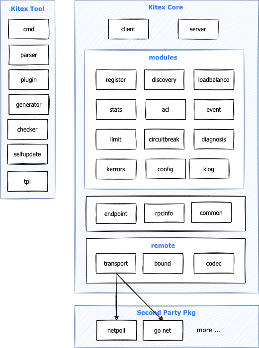

# 概述
Kitex字节跳动内部的 Golang 微服务 RPC 框架，具有高性能、强可扩展的特点，在字节内部已广泛使用。如果对微服务性能有要求，又希望定制扩展融入自己的治理体系，Kitex 会是一个不错的选择。
## 架构设计

## 框架特点
- 高性能
使用自研的高性能网络库 Netpoll，性能相较 go net 具有显著优势。
- 扩展性
提供了较多的扩展接口以及默认扩展实现，使用者也可以根据需要自行定制扩展，具体见下面的框架扩展。
- 多消息协议
RPC 消息协议默认支持 Thrift、Kitex Protobuf、gRPC。Thrift 支持 Buffered 和 Framed 二进制协议；Kitex Protobuf 是 Kitex 自定义的 Protobuf 消息协议，协议格式类似 Thrift；gRPC 是对 gRPC 消息协议的支持，可以与 gRPC 互通。除此之外，使用者也可以扩展自己的消息协议。
- 多传输协议
传输协议封装消息协议进行 RPC 互通，传输协议可以额外透传元信息，用于服务治理，Kitex 支持的传输协议有 TTHeader、HTTP2。TTHeader 可以和 Thrift、Kitex Protobuf 结合使用；HTTP2 目前主要是结合 gRPC 协议使用，后续也会支持 Thrift。
- 多种消息类型
支持 PingPong、Oneway、双向 Streaming。其中 Oneway 目前只对 Thrift 协议支持，双向 Streaming 只对 gRPC 支持，后续会考虑支持 Thrift 的双向 Streaming。
- 服务治理
支持服务注册/发现、负载均衡、熔断、限流、重试、监控、链路跟踪、日志、诊断等服务治理模块，大部分均已提供默认扩展，使用者可选择集成。
- 代码生成
Kitex 内置代码生成工具，可支持生成 Thrift、Protobuf 以及脚手架代码。

# 环境
## 代码生成工具
确保已经安装GoLang环境。

Kitex 中使用到的代码生成工具包括 IDL 编译器, protobuf 编译器,kitex tool。

### IDL 编译器
IDL 编译器能够解析 IDL 并生成对应的序列化和反序列化代码，Kitex 支持 Thrift 和 protobuf 这两种 IDL，这两种 IDL 的解析分别依赖于 thriftgo 与 protoc。

#### 安装IDL编译器
安装 thriftgo，执行以下命令即可：
>go install github.com/cloudwego/thriftgo@latest

安装成功后，执行 thriftgo --version 可以看到具体版本号的输出：

>thriftgo --version

thriftgo 0.3.6

protobuf 执行以下命令即可：
>go install  github.com/golang/protobuf/proto

安装成功后，执行 protoc --version  可以看到具体版本号的输出：
>protoc --version  

libprotoc 23.0

#### kitex tool
kitex 是 Kitex 框架提供的用于生成代码的一个命令行工具。目前，kitex 支持 thrift 和 protobuf 的 IDL，并支持生成一个服务端项目的骨架。kitex 的使用需要依赖于 IDL 编译器确保你已经完成 IDL 编译器的安装。

执行以下命令：

go install github.com/cloudwego/kitex/tool/cmd/kitex@latest
安装成功后，执行 kitex --version 可以看到具体版本号的输出：

>kitex --version

v0.8.0
# 基础教程
首先我们我们创建一个名叫mykitex的文件，然后在命令行运行以下命令初始化模块。
>go mod init mykitex

然后在根目录创建idl文件夹。
然后创建以下文件添加以下内容。

一般不同的服务都会使用不同的 IDL，所以我们这里创建 item.thrift 与 stock.thrift 分别定义商品服务与库存服务的接口，同时创建 base.thrift 定义公共数据结构。

>base.proto
```proto
syntax = "proto3";
// 设置生成类的包路径
package base;

// 输出路径；
option go_package = "example/shop/base";


// 设置基础结构体
message BaseResp{
    string code=1;
    string msg=2;
}
```

item.proto
```proto
syntax = "proto3";
package item;
// 第一个分割参数，输出路径；第二个设置生成类的包路径

option go_package = "example/shop/item";
// 引入公共文件
import "idl/base.proto";
// 所有字段默认必填，

message Item {
int64 id=1;
string title=2;
string description=3;
int64 stock=4;
}

message GetItemReq {
  int64 id=1;
}

message GetItemResp {
 Item item=1;
base.BaseResp baseResp=255;
}

service ItemService{
   rpc GetItem(GetItemReq) returns (GetItemResp);
}


```

stock.proto
```proto
syntax = "proto3";
package item;
// 第一个分割参数，输出路径；第二个设置生成类的包路径
option go_package = "example/shop/stock";
// 引入公共文件
import "idl/base.proto";

// 设置服务名称
message GetItemStockReq {
  int64 item_id = 1;
}

message GetItemStockResp {
  int64 stock = 1;

  base.BaseResp base_resp = 255; // 在 protobuf 中，字段名应遵循小写字母和下划线的命名规范
}

service StockService {
  rpc GetItemStock(GetItemStockReq) returns (GetItemStockResp);
}
```

## 代码生成
有了 IDL 以后我们便可以通过 kitex 工具生成项目代码了，我们在先回到项目的根目录即 example_shop。因为我们有两个 IDL 定义了服务，所以执行两次 kitex 命令：
```shell
kitex -module mykitex idl/item.proto

kitex -module mykitex idl/stock.proto
```
生成的代码分两部分，一部分是结构体的编解码序列化代码，由 IDL 编译器生成；另一部分由 kitex 工具在前者产物上叠加，生成用于创建和发起 RPC 调用的桩代码。它们默认都在 kitex_gen 目录下。

上面生成的代码并不能直接运行，需要自己完成 NewClient 和 NewServer 的构建。kitex 命令行工具提供了 -service 参数能直接生成带有脚手架的代码，接下来让我们为商品服务和库存服务分别生成脚手架。

首先为两个 RPC 服务分别单独创建目录。
>mkdir -p rpc/item rpc/stock

再分别进入各自的目录中，执行如下命令生成代码：
```shell
// item 目录下执行
kitex -module mykitex -service example.shop.item -use mykitex/kitex_gen -I ../../  ../../idl/item.proto  

// stock 目录下执行
kitex -module mykitex -service example.shop.item -use mykitex/kitex_gen -I ../../  ../../idl/stock.proto
```

kitex 默认会将代码生成到执行命令的目录下，kitex 的命令中：
- -module 参数表明生成代码的 go mod 中的 module name，在本例中为 example_shop
- -service 参数表明我们要生成脚手架代码，后面紧跟的 example.shop.item 或 example.shop.stock 为该服务的名字。
- -use 参数表示让 kitex 不生成 kitex_gen 目录，而使用该选项给出的 import path。在本例中因为第一次已经生成 kitex_gen 目录了，后面都可以复用。
- 最后一个参数则为该服务的 IDL 文件


```shell
│  go.mod // go module 文件
│  go.sum
│
├─.idea
│      .gitignore
│      modules.xml
│      mykitex.iml
│      workspace.xml
│
├─idl        // 示例 idl 存放的目录
│      base.proto
│      item.proto
│      stock.proto
│
├─kitex_gen
│  └─example
│      └─shop
│          ├─base  // 根据 IDL 生成的编解码文件，由 IDL 编译器生成
│          │      base.pb.fast.go
│          │      base.pb.go
│          │
│          ├─item
│          │  │  item.pb.fast.go
│          │  │  item.pb.go
│          │  │
│          │  └─itemservice
│          │          client.go
│          │          invoker.go
│          │          itemservice.go
│          │          server.go
│          │
│          └─stock
│              │  stock.pb.fast.go
│              │  stock.pb.go
│              │
│              └─stockservice
│                      client.go
│                      invoker.go
│                      server.go
│                      stockservice.go
│
└─rpc
    ├─item
    │  │  build.sh    // 用来编译的脚本，一般情况下不需要更改
    │  │  handler.go   // 服务端的业务逻辑都放在这里，这也是我们需要更改和编写的文件
    │  │  kitex_info.yaml
    │  │  main.go  // 服务启动函数，一般在这里做一些资源初始化的工作，可以更改
    │  │
    │  └─script
    │          bootstrap.sh
    │
    └─stock
        │  build.sh
        │  handler.go
        │  kitex_info.yaml
        │  main.go
        │
        └─script
                bootstrap.sh

```

## 拉取依赖
完成代码生成后，我们回到项目根目录。 使用 go mod tidy 命令拉取项目依赖
## 编写商品服务逻辑
我们需要编写的服务端逻辑都在 handler.go 这个文件中，目前我们有两个服务，对应了两个 handler.go，他们的结构都是类似的，我们先看看商品服务的服务端逻辑 rpc/item/handler.go

```go
package main

import (
	"context"
	item "example_shop/kitex_gen/example/shop/item"
)

// ItemServiceImpl implements the last service interface defined in the IDL.
type ItemServiceImpl struct{}

// GetItem implements the ItemServiceImpl interface.
func (s *ItemServiceImpl) GetItem(ctx context.Context, req *item.GetItemReq) (resp *item.GetItemResp, err error) {
	// TODO: Your code here...
	return
}
```
这里的 GetItem 函数就对应了我们之前在 item.thrift IDL 中定义的 GetItem 方法。

现在让我们修改一下服务端逻辑，本项目仅仅演示使用方法，重点不在于业务逻辑，故简单处理后返回。
```go
package main

import (
	"context"
	item "mykitex/kitex_gen/example/shop/item"
)

// ItemServiceImpl implements the last service interface defined in the IDL.
type ItemServiceImpl struct{}

// GetItem implements the ItemServiceImpl interface.
func (s *ItemServiceImpl) GetItem(ctx context.Context, req *item.GetItemReq) (resp *item.GetItemResp, err error) {
	resp = &item.GetItemResp{}
	resp.Item = &item.Item{}
	resp.Item.Id = req.GetId()
	resp.Item.Title = "Kitex"
	resp.Item.Description = "Kitex is an excellent framework!"
	return
}

```
除了 handler.go 外，我们还需关心 main.go 文件，我可以看看 main.go 中做了什么事情：
>rpc/item/main.go
```go
package main

import (
	"log"
	item "mykitex/kitex_gen/example/shop/item/itemservice"
)

func main() {
	svr := item.NewServer(new(ItemServiceImpl))

	err := svr.Run()

	if err != nil {
		log.Println(err.Error())
	}
}
```

### 运行商品服务
```shell
2024/03/01 19:36:03.685752 server.go:83: [Info] KITEX: server listen at addr=[::]:8888

```

在上面的日志输出中，addr=[::]:8888 代表我们的服务运行在本地的 8888 端口，此参数可以在创建 server 时传入 option 配置来修改，更多服务端配置见 Server Option。

## 创建 client
在生成的代码中，kitex_gen 目录下，Kitex 已经为我们封装了创建客户端的代码，我们只需要使用即可.
>client/client.go
```go
package main

import (
	"context"
	"github.com/cloudwego/kitex/client"
	"log"
	"mykitex/kitex_gen/example/shop/item"
	"mykitex/kitex_gen/example/shop/item/itemservice"
	"time"
)

func main() {
	client, err := itemservice.NewClient("hello", client.WithHostPorts("0.0.0.0:8888"))
	if err != nil {
		log.Fatal(err)
	}
	for {
		req := &item.GetItemReq{Id: 1}
		resp, err := client.GetItem(context.Background(), req)
		if err != nil {
			log.Fatal(err)
		}
		log.Println(resp)
		time.Sleep(time.Second)
	}
}

```
我们上述代码直接调用我们kitex工具自动生成的代码，

## 暴露 HTTP 接口
你可以使用 net/http 或其他框架来对外提供 HTTP 接口，此处使用 Hertz 做一个简单演示，有关 Hertz 用法参见 Hertz 文档

完整代码如下：
>main.go
```go
package main

import (
	"context"
	"mykitex/kitex_gen/example/shop/item"

	"github.com/cloudwego/hertz/pkg/app"
	"github.com/cloudwego/hertz/pkg/app/server"
	"github.com/cloudwego/kitex/client"
	"github.com/cloudwego/kitex/client/callopt"
	"log"
	"mykitex/kitex_gen/example/shop/item/itemservice"
	"time"
)

var (
	cli itemservice.Client
)

func main() {
	c, err := itemservice.NewClient("example.shop.item", client.WithHostPorts("0.0.0.0:8888"))
	if err != nil {
		log.Fatal(err)
	}
	cli = c

	hz := server.New(server.WithHostPorts("localhost:8889"))

	hz.GET("/api/item", Handler)

	if err := hz.Run(); err != nil {
		log.Fatal(err)
	}
}

func Handler(ctx context.Context, c *app.RequestContext) {
	req := &item.GetItemReq{Id: 1}
	req.Id = 1024
	resp, err := cli.GetItem(context.Background(), req, callopt.WithRPCTimeout(3*time.Second))
	if err != nil {
		log.Fatal(err)
	}

	c.String(200, resp.String())
}

```

接下来另启一个终端，执行 go run . 命令即可启动 API 服务，监听 8889 端口，请求 localhost:8889/api/item 即可发起 RPC 调用商品服务提供的 GetItem 接口，并获取到响应结果。

### 测试接口
打开游览器访问 localhost:8889/api/item，看到如下信息，代表请求成功。
>item:{id:1024 title:"Kitex" description:"Kitex is an excellent framework!"}

# Nacos
Kitex 提供的服务注册与发现 nacos 拓展。
nacos-sdk-go v2 版本
>go get github.com/kitex-contrib/registry-nacos/v2
## 服务注册
### 创建 Registry
提供了两个创建 Registry 的函数

### NewDefaultNacosRegistry
NewDefaultNacosRegistry 使用 nacos 创建一个新的服务注册中心，从环境变量中读取信息用于创建 Nacos Client。可自定义服务注册中心配置，配置详情见 Option。

|环境变量名|	环境变量默认值|	描述|
|-------|-------|-------|
|serverAddr|	127.0.0.1|	nacos 服务器地址|
|serverPort	|8848	|nacos 服务器端口|
|namespace|		|nacos 中的 namespace Id|

函数签名：
>func NewDefaultNacosRegistry(opts ...Option) (registry.Registry, error)

### NewNacosRegistry
NewNacosRegistry 使用 nacos 创建服务注册中心，需要传入自行配置的客户端。可自定义服务注册中心配置，配置详情见 Option。

函数签名：
>func NewNacosRegistry(cli naming_client.INamingClient, opts ...Option) registry.Registry
示例代码：
```go
package main

import (
	"github.com/cloudwego/kitex/pkg/rpcinfo"
	"github.com/cloudwego/kitex/server"
	"github.com/kitex-contrib/registry-nacos/v2/registry"
	"github.com/nacos-group/nacos-sdk-go/v2/clients"
	"github.com/nacos-group/nacos-sdk-go/v2/common/constant"
	"github.com/nacos-group/nacos-sdk-go/v2/vo"
	"mykitex/kitex_gen/example/shop/item/itemservice"

	"log"
)

func main() {
	sc := []constant.ServerConfig{
		// 设置ip地址和端口号
		*constant.NewServerConfig("127.0.0.1", 8848),
	}

	cc := constant.ClientConfig{
		//  设置命名空间id
		NamespaceId: "public",
		// 设置超时时间，单位毫秒
		TimeoutMs: 5000,
		// 启动时不在 CacheDir 中加载持久性 nacos 服务信息
		NotLoadCacheAtStart: true,
		//  设置日志存储文件夹
		LogDir: "/tmp/nacos/log",
		// 设置缓存存储文件夹
		CacheDir: "/tmp/nacos/cache",
		// 设置日志等级
		LogLevel: "info",
		// 设置用户名
		Username: "your-name",
		// 设置密码
		Password: "your-password",
	}

	cli, err := clients.NewNamingClient(
		vo.NacosClientParam{
			ClientConfig:  &cc,
			ServerConfigs: sc,
		},
	)
	if err != nil {
		panic(err)
	}

	svr := itemservice.NewServer(new(ItemServiceImpl),
		server.WithServerBasicInfo(&rpcinfo.EndpointBasicInfo{ServiceName: "echo"}),
		server.WithRegistry(registry.NewNacosRegistry(cli)),
	)
	if err := svr.Run(); err != nil {
		log.Println("server stopped with error:", err)
	} else {
		log.Println("server stopped")
	}
}
```

## 服务发现
### 创建 Resolver
提供了两个创建 Resolver 的函数

### NewDefaultNacosResolver
NewDefaultNacosResolver 使用 nacos 创建一个新的服务发现中心，从环境变量中读取信息用于创建 Nacos Client。可自定义服务注册中心配置，配置详情见 Option。
|环境变量名|	环境变量默认值|	描述|
|-------|--------|--------|
|serverAddr|	127.0.0.1|	nacos 服务器地址|
|serverPort|	8848|	nacos 服务器端口|
|namespace|		|nacos 中的 namespace Id|

函数签名：
>func NewDefaultNacosResolver(opts ...Option) (discovery.Resolver, error)

### NewNacosResolver
NewNacosResolver 使用 nacos 创建服务发现中心，需要传入自行配置的客户端。可自定义服务注册中心配置，配置详情见 Option。

函数签名：
>func NewNacosResolver(cli naming_client.INamingClient, opts ...Option) discovery.Resolver
示例代码：
```go
```
服务端
package main

import (
	"context"
	"log"
	"net"

	"github.com/cloudwego/kitex/pkg/rpcinfo"
	"github.com/cloudwego/kitex/server"
	"github.com/kitex-contrib/registry-nacos/example/hello/kitex_gen/api"
	"github.com/kitex-contrib/registry-nacos/example/hello/kitex_gen/api/hello"
	"github.com/kitex-contrib/registry-nacos/registry"
)

type HelloImpl struct{}

func (h *HelloImpl) Echo(_ context.Context, req *api.Request) (resp *api.Response, err error) {
	resp = &api.Response{
		Message: req.Message,
	}
	return
}

func main() {
	r, err := registry.NewDefaultNacosRegistry()
	if err != nil {
		panic(err)
	}
	svr := hello.NewServer(
		new(HelloImpl),
		server.WithRegistry(r),
		server.WithServerBasicInfo(&rpcinfo.EndpointBasicInfo{ServiceName: "Hello"}),
		server.WithServiceAddr(&net.TCPAddr{IP: net.IPv4(127, 0, 0, 1), Port: 8080}),
	)
	if err := svr.Run(); err != nil {
		log.Println("server stopped with error:", err)
	} else {
		log.Println("server stopped")
	}
}
客户端
package main

import (
	"context"
	"log"
	"time"

	"github.com/cloudwego/kitex/client"
	"github.com/kitex-contrib/registry-nacos/example/hello/kitex_gen/api"
	"github.com/kitex-contrib/registry-nacos/example/hello/kitex_gen/api/hello"
	"github.com/kitex-contrib/registry-nacos/resolver"
)

func main() {
	r, err := resolver.NewDefaultNacosResolver()
	if err != nil {
		panic(err)
	}
	newClient := hello.MustNewClient(
		"Hello",
		client.WithResolver(r),
		client.WithRPCTimeout(time.Second*3),
	)
	for {
		resp, err := newClient.Echo(context.Background(), &api.Request{Message: "Hello"})
		if err != nil {
			log.Fatal(err)
		}
		log.Println(resp)
		time.Sleep(time.Second)
	}
}
注意
nacos/v2 版本中 kitex 目前不支持多次在同分组下创建多端口示例
nacos/v2 的服务注册与发现和先前的版本兼容
nacos-sdk-go v2 版本中 constant.ClientConfig 中 CustomLogger 类型被移除
nacos/v2 只支持 nacos 2.X 版本
配置
可自定义 Nacos 客户端以及服务端的配置，参考 nacos-sdk-go 配置。

# Zookeeper
Kitex 提供的服务注册与发现 zookeeper 拓展。
## 安装
go get github.com/kitex-contrib/registry-zookeeper
## 服务注册
### 创建 Registry
提供了两个创建 Registry 的函数

#### NewZookeeperRegistry
NewZookeeperRegistry 使用 zookeeper 创建一个服务注册中心，需要将服务通过一个字符串切片与会话超时时间共同传入 Connect。

函数签名：
>func NewZookeeperRegistry(servers []string, sessionTimeout time.Duration) (registry.Registry, error)

#### NewZookeeperRegistryWithAuth
NewZookeeperRegistryWithAuth 使用 zookeeper 创建一个服务注册中心，需要将服务通过一个字符串切片与会话超时时间共同传入 Connect。除此之外还需要传入用户与密码来调用 AddAuth，用户与密码不能为空。

示例代码：
```go
package main

import (
	"github.com/cloudwego/kitex/pkg/rpcinfo"
	"github.com/cloudwego/kitex/server"
	zkregistry "github.com/kitex-contrib/registry-zookeeper/registry"
	"log"
	"mykitex/kitex_gen/example/shop/item/itemservice"
	"time"
)

func main() {
	r, err := zkregistry.NewZookeeperRegistry([]string{"125.37.143.160:2181"}, 40*time.Second)
	if err != nil {
		panic(err)
	}

	svr := itemservice.NewServer(new(ItemServiceImpl), server.WithRegistry(r), server.WithServerBasicInfo(&rpcinfo.EndpointBasicInfo{ServiceName: "item"}))
	if err := svr.Run(); err != nil {
		log.Println("server stopped with error:", err)
	} else {
		log.Println("server stopped")
	}
}

```
**效果如下**
```shell
024/03/02 12:49:40 connected to 125.37.143.160:2181
2024/03/02 12:49:40.870620 server.go:83: [Info] KITEX: server listen at addr=[::]:8888
2024/03/02 12:49:40 authenticated: id=72057683656900612, timeout=40000
2024/03/02 12:49:40 re-submitting `0` credentials after reconnect
```
## 服务发现
### 创建 Resolver
#### NewZookeeperResolver
NewZookeeperResolver 使用 zookeeper 创建一个服务发现中心，需要将服务通过一个字符串切片与会话超时时间共同传入 Connect。

函数签名：
>func NewZookeeperResolver(servers []string, sessionTimeout time.Duration) (discovery.Resolver, error)

>NewZookeeperResolverWithAuth
NewZookeeperResolverWithAuth 使用 zookeeper 创建一个服务发现中心，需要将服务通过一个字符串切片与会话超时时间共同传入 Connect。除此之外还需要传入用户与密码来调用 AddAuth，用户与密码不能为空。

函数签名：
>func NewZookeeperResolverWithAuth(servers []string, sessionTimeout time.Duration, user, password string) (discovery.Resolver, error)

**示例代码**：
```shell

```

# etcd
docker
  etcd:
    image: bitnami/etcd:3.5
    container_name: etcd
    ports:
      - 2379:2379
      - 2380:2380
    volumes:
      - ./etcd/data:/bitnami/etcd-data
    environment:
      - TZ=Asia/Shanghai
      - ALLOW_NONE_AUTHENTICATION=yes
      - ETCD_ADVERTISE_CLIENT_URLS=http://etcd:2379