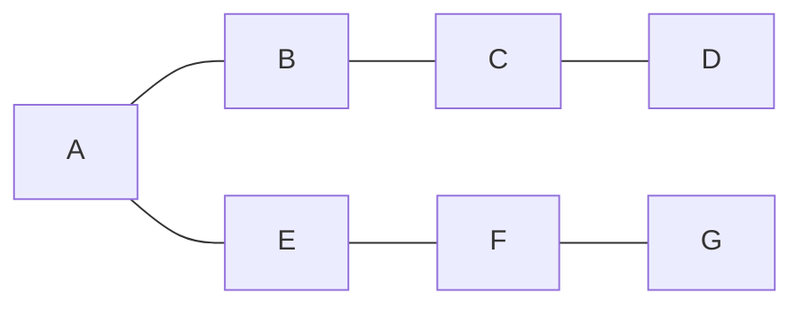

# 基础
## 开发环境
###  安装
#### 下载地址
https://golang.org/dl/(国外的可能不能访问)

https://studygolang.com/dl(国内网址,推荐)

#### 安装
下载完成后点击运行,一直next,就可以,安装成功后打开win+R输入cmd打开命令行输入go env,
输出


证明安装成功
#### 改变$GOPATH
\$GOPATH是go存储第三方包和编译后文件的地方,它会默认在C盘,随着时间它会渐渐变大,但是C盘空间珍贵,我们可以把他移动到D盘


## 函数

# 接口
## 执⾏机制
接⼝对象由接⼝表 (interface table) 指针和数据指针组成。

```go
struct Iface
{
 Itab* tab;
 void* data;
};
struct Itab
{
 InterfaceType* inter;
 Type* type;
 void (*fun[])(void);
};
```
接⼝表存储元数据信息，包括接⼝类型、动态类型，以及实现接⼝的⽅法指针。⽆论是反射还是通过接⼝调⽤⽅法，都会⽤到这些信息。数据指针持有的是目标对象的只读复制品，复制完整对象或指针。

## 接⼝转换
利⽤类型推断，可判断接⼝对象是否某个具体的接⼝或类型。
```go
type User struct {
 id int
 name string
}
func (self *User) String() string {
 return fmt.Sprintf("%d, %s", self.id, self.name)
}
func main() {
 var o interface{} = &User{1, "Tom"}
 if i, ok := o.(fmt.Stringer); ok { // ok-idiom
 fmt.Println(i)
 }
 u := o.(*User)
 // u := o.(User) // panic: interface is *main.User, not main.User
 fmt.Println(u)
}
还可⽤ switch 做批量类型判断，不⽀持 fallthrough。
func main() {
 var o interface{} = &User{1, "Tom"}
 switch v := o.(type) {
 case nil: // o == nil
 fmt.Println("nil")
 case fmt.Stringer: // interface
 fmt.Println(v)
 case func() string: // func
 fmt.Println(v())
 case *User: // *struct
 fmt.Printf("%d, %s\n", v.id, v.name)
 default:
 fmt.Println("unknown")
 }
}
超集接⼝对象可转换为⼦集接⼝，反之出错。
type Stringer interface {
 String() string
}
type Printer interface {
 String() string
 Print()
}

type User struct {
 id int
 name string
}
func (self *User) String() string {
 return fmt.Sprintf("%d, %v", self.id, self.name)
}
func (self *User) Print() {
 fmt.Println(self.String())
}
func main() {
 var o Printer = &User{1, "Tom"}
 var s Stringer = o
 fmt.Println(s.String())
}
```
## 接⼝技巧
让编译器检查，以确保某个类型实现接⼝。
var _ fmt.Stringer = (*Data)(nil)
某些时候，让函数直接 "实现" 接⼝能省不少事。
type Tester interface {
 Do()
}
type FuncDo func()
func (self FuncDo) Do() { self() }
func main() {
 var t Tester = FuncDo(func() { println("Hello, World!") })
 t.Do()
}
## 类型赋值给接
```go
package main 
import "fmt" 
type ISpeaker interface { 
 Speak() 
} 
type SimpleSpeaker struct { 
 Message string
} 
func (speaker *SimpleSpeaker) Speak() { 
 fmt.Println("I am speaking? ", speaker.Message) 
} 
func main() { 
var speaker ISpeaker 
 speaker = &SimpleSpeaker{"Hell"} 
 speaker.Speak() 
}
```
对于学过其他面向对象编程语言（比如C++）的读者而言，已经习惯了由明确的继承关系来确定类型和接口之间的关联，现在看到上述示例中ISpeaker和SimpleSpeaker没有任何的关联约定，就会产生困惑，为什么编译器不报编译错误呢？很显然，Go语言采取了一个与C++等语言
不同的机制。
一个核心的问题就是：从机器的角度如何判断一个SimpleSpeaker类型实现了ISpeaker接口的所有方法？一个简单的逻辑就是需要获取这个类型的所有方法集合（集合A），并获取该接口包含的所有方法集合（集合B），然后判断列表B是否为列表A的子集，是则意味着SimpleSpeaker类型实现了ISpeaker接口
# 异常处理
## error接口
Go语言引入了一个关于错误处理的标准模式，即error接口，该接口的定义如下：
```go
type error interface { 
 Error() string
} 
```

### deferred（递延，延期）
defer语句经常被用于处理成对的操作，如打开、关闭、连接、断开连接、加锁、释放锁。通过defer机制，不论函数逻辑多复杂，都能保证在任何执行路径下，资源被释放。释放资源的defer应该直接跟在请求资源的语句后。
```go
func title(url string) error {
resp, err := http.Get(url)
if err != nil {
return err
}
defer resp.Body.Close()
ct := resp.Header.Get("Content-Type")
if ct != "text/html" && !strings.HasPrefix(ct,"text/html;") {
return fmt.Errorf("%s has type %s, not text/html",url, ct)
}
doc, err := html.Parse(resp.Body)
if err != nil {
return fmt.Errorf("parsing %s as HTML: %v", url,err)
}
// ...print doc's title element…
return nil
}
```

## Panic异常
一般而言，当panic异常发生时，程序会中断运行，并立即执行在该goroutine中被延迟的函数（defer 机制）。随后，程序崩溃并输出日志信息。日志信息包括panic value和函数调用的堆栈跟踪信息。panic value通常是某种错误信息。对于每个goroutine，日志信息中都会有与之相对的，发生panic时的函数调用堆栈跟踪信息。通常，我们不需要再次运行程序去定位问题，日志信息已经提供了足够的诊断依据。因此，在我们填写问题报告时，一般会将panic异常和日志信息一并记录。
不是所有的panic异常都来自运行时，直接调用内置的panic函数也会引发panic异常；panic函数接受任何值作为参数。当某些不应该发生的场景发生时，我们就应该调用panic。比如，当程序到达了某条逻辑上不可能到达的路径：
## Recover捕获异常
通常来说，不应该对panic异常做任何处理，但有时，也许我们可以从异常中恢复，至少我们可以在程序崩溃前，做一些操作。
```go
func Parse(input string) (s *Syntax, err error) {
defer func() {
if p := recover(); p != nil {
err = fmt.Errorf("internal error: %v", p)
}
}()
// ...parser...
}
```
# 垃圾回收和性能 优化
性能优化的层面

性能优化和软件质量


## 自动垃圾回收
- **动态内存**
 - 程序在运行时根据需求动态分配的内存：
- **自动内存管理（垃圾回收）**：由程序语言的运行时系统回收动态内存
 - 避免手动内存管理，专注于实现业务逻辑
 - 保证内存使用的正确性和安全性：double-freeproblem,use-after-freeproblem
- 三个任务
 - 为新对象分配空间
 - 找到存活对象
 - 回收死亡对象的内存空间
### 相关概念
- Mutator:业务线程，分配新对象，修改对象指向关系
- Collector:GC线程，找到存活对象，回收死亡对象的内存空间
- SeriaI GC:只有一个collector
- Parallel GC:支持多个collectors同时回收的GC算法
- Concurrent GC:mutator(s)和collector(s)可以同时执行
 - collector必须感知对象指向关系的变化
 

- **评价GC算法**
  - 安全性(Safety)：不能回收存活的对象基本要求

  - 吞吐率(Throughput)：1-（GC时间/花在GC上的时间）*
程序执行总时间
  - 暂停时间(Pausetime):st0Ptheworld(STW)业务是否感知
  - 内存开销(Spaceoverhead)GC元数据开销
- **追踪垃圾回收(Tracing garbage collection)**
- **引用计数(Referencecounting)**
### 追踪垃圾回收
- 对象被回收的条件：指针指向关系不可达的对象
- 标记根对象
   - 静态变量、全局变虽、常量、线程栈等
- 标记：找到可达对象
   - 求指针指向关系的传递闭包：从根对象出发，找到所有可达对象
- 清理：所有不可达对象
   - 将存活对象复制到另外的内存空间(CopyingGC)
   - 将死亡对象的内存标记“可分配“(Mark-sweepGC)
   - 移动并整理存活对象(Mark-compactGC)
- 根据对象的生命周期，使用不同的标记和清理策略


### 分代GC(Generational GC)
- 分代假说(Generationalhypothesis):mostobjectsdieyoung
- lntuition:很多对象在分配出来后很快就不再使用了
- 每个对象都有年龄：经历过GC的次数
- 目的：对年轻和老年的对象，制定不同的GC策略，降低整体内存管理的开销
- 不同年龄的对象处于heap的不同区域
  - 年轻代(Younggeneration)
    - 常规的对須分配
    - 由于存活对象很少，可以采用copyingcollection
    - GC吞吐率很高
  - 老年代(Oldgeneration)
    - 对象趋向于一直活着，反复复制开销较大
    - 可以采用mark-sweepcollection


### 引用计数
- 每个对象都有一个与之关联的引用数目
- 对象存活的条件：当且仅当引用数大于0
- **优点**
  - 内存管理的操作被平摊到程序执行过程中

  - 内存管理不需要了解runtime的实现细节：C++智能指针(smartpointer)
- **缺点**
  - 维护引用计数的开销较大：通过原子操作保证对引用计数操作的原子性和可见性
  - 无法回收环形数据结构_weakreference
  - 内存开销：每个对象都引入的额外内存空间存储引用数目

  - 回收内存时依然可能引发暂停


## go内存管理
### 内存分配 - 分块
- 目标：为对象在heap上分配内存
- 提前将内存分块
  - 调用系统调用mmap0向OS申清一大块内存，例如4MB
  - 先将内存划分成大块，例如8KB,称作mspan
  - 再将大块继续划分成特定大小的小块，用于对象分配
  - noscan mspan:分配不包含指针的对象一一GC不需要扫描
  - scan mspan:分配包含指针的对一GC需要扫描
- 对象分配：根据对象的大小，选择最合适的块返回


### go缓存
- TCMaIIoc:threadcaching
- 每个p包含一个mcache用于快速分配，用于为绑定于P上的g分配对須
- mcache管里一组。mspan
- 当mcache中mspan．分己丿毕，向mcentral申请带有未分配块的mspan
- 当mspan中没有分配的对象，mspan会被缓存在mcentral中，而不是立刻释放并归还给OS


### GO内存管理优化
·对象分配是非常高频的操作：每秒分配GB级别的内存
·小对象占比较高
·Go内存分配比较耗时
  - 分配路径长：g->m->P->mcache->mspan->memory block一>return pointer
  - pprof:对象分配的函数是最频繁调用的函数之一

### BalancedGC
- 每个g都绑定一大块内存（1KB），称作goroutine allocation buffer(GAB)
- GAB用于noscan类型的小对象分配：<128 B
- 使用三个指针维护GAB:base,end,top
- Bumppointer（指针碰撞）风格对象分配
  - 无须和其他分配请求互斥
  - 分配动作简单高效
**GBA**  
- GAB对于Go内存管理来说是一个对象
- 本质：将多个小对象的分配合井成一次达对象的分配

- 问题：GAB的对象分配方式会导致内存被延迟释放
- 方案：移动GAB中存活的对象
- 当GAB总大小超过一定阈值时，将GAB中存活的对象复制到另外分配的GAB中
- 原先的GAB可以释放，避免内存泄漏
- 本质：用copying GC 的算法管理小对象
-根据对象的生命周期，使用不同的标记和清理策略

# 并发
## 并发基础
1. **串行程序与并发程序**：串行程序特指只能被顺序执行的指令列表，并发程序则是可以被并发执行的两个及以上的串行程序的综合体。
2. **并发程序与并行程序**：并发程序是指可以被同时发起执行的程序，而并行程序则被设计成可以在并行的硬件上执行的并发程序。
### 多进程编程
进程之间的通信被叫做IPC（Inter-Process Communication），从处理机制可划分为三大类：**基于通信的IPC**，**基于信号的IPC**和**基于同步方法的IPC**。基于通信的IPC又分为以数据传送为手段的IPC和共享内存为手段的IPC。前者包括**管道（pipe）**和**消息队列（message queue）**管道可以传送字节流，消息队列可以传送结构化消息对象。以共享内存为手段的IPC的方法主要是基于共享内存区（shared memory）为代表，速度最快。基于信号的IPC是系统的信号（signal）机制，唯一异步的IPC。
#### 进程
1. **进程定义**：我们把一个程序称为一个进程。进程还是操作系统进行资源分配的一个基本单位。
2. **进程的衍生**进程使用fork（一个系统调用函数）可以创建若干个新进程，其中前者称为后者的父进程，后者称为前者的子进程。每个子进程都源于它的一个父进程的一个副本，他会获得父进程的数据段，堆和栈的副本，并与父进程共享代码段。每一份副本都是独立的。创建的子进程可以通过系统调用exec把一个新的程序加载道自己的内存中，替换原来的副本。
3. **进程的标识** 为了管理进程，内核必须对每个进程的属性和行为进行详细的记录，包括进程的优先级，状态，虚拟地址范围以及各种访问权限。进程在描述符是一个复杂的数据结构，在操作系统中有唯一的PID。
4. **进程状态** 
*可运行状态（TASK_RUNNING 简称R）*
*可中断睡眠状态（TASK_INTERRUPTIBLE 简称S）*进程正在等待某个事件到来。
*不可中断睡眠状态（TASK_UNINTERRUPTIBLE 简称D）*这表示此种进程不会对任何信号做出响应，确切的说，发送给此状态的进程的信号直到它从该状态转出才会被传递出去。处于此状态的进程通常是在等待一个特殊事件，
*暂停状态或跟踪状态（TASK_SPTOPPED或TASK_TRACEO 简称T）*。想进程发送SIGSTOP信号，会使该进程转入暂停状态。向处于暂停状态发送SIGCONT信号，会使该进程转入可运行状态，处于该状态的进程会暂停，等待另一个进程（跟踪他的那个进程）对他进行操作。例如：断点失调。
*僵尸状态（TASK_DEAD-EXIT_ZOMBIE 简称Z）* 出于此状态的进程即将结束运行，该进程占用的绝大多数资源也都被回收。
*退出状态（	TASK_DEAD-EXIT_DEAD 简称X）* 在进程退出过程中，有可能连退出码和统计信息都不需要保留。


5. **进程空间** 用户进程总会生存在用户空间，但不能和计算机硬件进行交互。内核可以与计算机硬件交互。内核在内核空间。操作系统划分一段共用内存让他们进行交互。


## Go并发基础
### 原理探究
Goroutine 含义不要用共享内存的方式通信，作为替代，应该以通信作为手段共享内存。
把数据放在共享内存中以供多个线程进行访问，使访问控制变得异常复杂，只有做好各种约束在能实现这一思想。
#### 线程实现模型
主框架：
**M machine** 一个M代表一个内核线程，或称“工作线程”
**P processor** 一个P代表执行一个go代码所必须的资源（或叫上下文环境）
**G goroutine** 一个G代表一个go代码片段


KSE内核调度实体 M和P一对一 P对G一对多

1. **M**
一个M代表了一个内核线程


左边是字段名，右边是字段类型。**go**代表一个特殊goroutine。这个goroutine是Go运行时系统在启动之初创建的用于执行一些运行时任务。
字段**matartfn**表示M的起始函数，函数是编写go语句携带的函数。**curg**存放当前M正在运行的那个G的指针，**p**会指向当前M关联的P。**nextp**暂存与当前M有潜在联系的P。**spinning**表示这个M是否在寻找可运行的G。GO运行时系统可以把一个M和G锁在一起，这个M这能运行这个G，G也只能被这个M运行。

2. **p**
*Pidle* P未与M存在联系
*Prunning*  P正在与某个M联系
*Psyscall* P中运行的G正在进行系统调用调用
*Pgcstop* 表明运行时系统要停止调度。
*Pdead* 此状态表明当前P已经不会再被使用。


3. **G**
一个G就代表一个goroutine（go实例）。也与go函数相对应，
*Gidle* G被重新分配未初始化
*Grunnable* G正在可运行队列中等待
*Grunning*  G在运行
*Gsyscall* G正在进行系统调用调用
*Gwaiting* G正在阻塞
*Gdead* G在闲置
*Gcopystack* 当前G的栈正在被移动


4. **核心元素的容器**


任何G都会存在全局G列表中，其余四个容器只会存放当前作用域内，具有某个状态的G。G在转入Gdead状态，首先会被放入本地P的自由G列表。

#### 调度器
1. **基本结构**


2. **一轮调度**
引导程序会为Go程序运行建立必要的环境。初始化完成main函数才会执行。引导程序会进行第一轮调度，这样才能使main函数的G马上有机会执行，


锁定M和G操作是为CGO准备的，CGO是Go和C程序之间的桥梁，是它们相互调用成为可能。有些C语言库会用本地线程存储技术，把数据存在当前内核线程的私有缓存中。所以为避免丢失数据，要加锁。
在第一轮调度之初发现当前M和某个G锁定，就会立即停止调度并停止当前M（或者说让它暂时阻塞）。一旦与它锁定的G处于可运行状态，他就被唤醒并继续运行那个G。

未锁定，调度器检查是否有运行时串行任务正在等待执行。
3. **全力查找可运行的G**
如果调度器没有找到可运行的G，会进入“全力查找可运行G”的子流程。
（1）*获取执行终结器的G*  一个终结器可以与一个对象关联，通过调用runtime.SetFinalizer函数就可以产生这种关联。当一个对象变为不可达（即：未被任何其他对象引用）时，垃圾回收器在回收该对象之前，就会执行与之关联的终结函数（如果有的话）。所有的终结函数的执行都会有一个专用的G负责。调度器会判定这个专用的G已完成任务之后试图获取它，然后把它置为Grunable状态并放入本地P的可运行G队列。
（2）*从本地P的可运行G队列获取G*
（3）*从调度器的可运行G队列获取G*
（3）*从网络I/O轮询器（netpoller）获取G*如果netpoller已被初始化且已有过网络I\O操作，调度器会尝试从netpoller获取一个G列表。
（5）*从其他p的可运行G队列中获取G*
（6）*获取执行GC标记任务的G* 在搜索第二阶段，调度器会先判断是否在GC的标记阶段，以及本地的P是否可用于GC标记任务。答案都是true，返回。
（7）*从调度器可运行G队列获取G）*再次获取，不成功，解除本地P与当前M的关联，并把改P放入调度器空闲P列表。
（8）*从全局P列表中每个P的可运行G队列获取G*
（9）*获取执行GC标记的任务G* 判断是否处于GC的标记阶段，以及与GC标记任务相关的全局资源是否可用，都是true，调度器从空闲P列表拿出一个P，如果P持有一个GC标记专用的G，就关联改P与当前M，然后再次执行第二阶段（从第6个步骤开始）。
（10）*从网络I/O轮询器（netpoller）获取G*如果netpoller已被初始化且已有过网络I\O操作，调度器会尝试从netpoller获取一个G列表。这里获取是阻塞的，只有当netpoller哪里有可用的G时，阻塞才会解除。

以上过程没找到可运行的G，调度器便会停止当前M。
网络I\O轮询器（即netpoller）是Go为了操作系统提供的异步I/O基础组件之上，实现自己的阻塞式I/O而编写的一个子程序。Go所选的异步I/O基础组件都是高效执行网络I/O的利器。当一个G试图在一个网络连接上进行读写操作时，底层程序（包括基础组件）就会开始准备，此时这个G被迫转入Gwaiting状态。一旦准备就绪，基础组件就会返回相应的事件，这会让netpoller立即通知为此等待的G。

第（5）步要有先决条件第一个条件是：除了本地P还有非空闲的P。空闲的P的可运行G队列必须为空，第二当前M处于自旋状态或者处于自旋状态的M数量小于非空闲的P的数量的二分之一。

4. **启用或停止M**
*stopm（）* 停止M的执行，直到因有新的G变得可运行被唤醒。
*gcstopm（）*为串行运行时任务的执行让路，停止当前M的执行。串行任务执行完毕后唤醒
*stoplockedm（）* 停止已与某个G锁定的当前M的执行，直到这个G变得可运行而被唤醒
*stoplockedm（gp *g）* 唤醒与gp锁定的那个M，并让改M去执行gp。
*starm（_p_ *p,spinning bool）* 唤醒或创建一个M去关联_p_并开始执行


(1)调度器在执行调度流程的时候，会先检查当前M是否已与某个G锁定。如果锁定存在，调度器就会调用stoplockedm函数停止当前M。stoplockedm函数会先解除当前M 与本地P之间的关联，并通过调用一个名为handoffp的函数把这个P转手给其他M,在 这个转手P的过程中会间接调用startm函数。一旦这个P被转手，stoplockedm函数就会 停止当前M的执行，并等待唤醒。
(2)另一方面，如果调度程序为当前M找到了一个可运行的G,却发现该G已与某个M锁定了，那么就会调用startlockedm函数并把这个G作为参数传入。startlockedm 函数会通过参数gp的lockedm字段找到与之锁定的那个M (以下简称“已锁M”)，并把 当前M的本地P转手给它。这里的转手P的过程要比(1)中的简单很多，startlockedm函 数会先解除当前M与本地P之间的关联，然后把这个P赋给已锁M的nextp字段(即预 联它们)。
(3)	startlockedm函数的执行会使与其参数gp锁定的那个M (即"已锁M")被唤醒。 通过gp的lockedm字段可以找到已锁M。一旦已锁M被唤醒，就会与和它预联的P产生 正式的关联，并去执行与之关联的G。
(4)	startlockedm函数在最后会调用stopm函数。stopm函数会先把当前M放入调度器 的空闲M列表，然后停止当前M。这里被停止的M,可能会在之后因有P需要转手，或 有G需要执行而被唤醒。

这里涉及两个M, 一个是因等待执行与之锁定的G而停止的M, 一个是获取到一个已锁定的G却 不能执行的M。大家千万不要把这两个M搞混，前者总是会被后者唤醒。

一旦M要停止就会把它的本地P转手给别的M。一旦M被唤醒, 就会先找到一个P与之关联，即找到它的新的本地P。并且，这个P一定是在该M被唤 醒之前由别的M预联给它的。因此，P总是会被高效利用。如果handoffp函数无法把作 为其参数的P转给一个M,那么就会把这个P放入调度器的空闲P列表。

(5)调度器在执行调度流程的时候，也会检查是否有串行运行时任务正在等待执行。 如果有调度器就会调用gcstopm函数停止当前M。gcstopm函数会先通过当前M的spinning 字段检查它的自旋状态，如果其值为true,就把false赋给它，然后把调度器中用于记录 自旋M数量的nmspinning字段的值减1。如此一来就完全重置了当前M的自旋状态标识, 一个将要停止的M理应脱离自旋状态。在这之后，gcstopm函数会释放本地P,并将其状 态设置为Pgcstop0然后再去自减并检查调度器的stopwait字段，并在发现stopwait字段 的值为0时，通过调度器的stopnote字段唤醒等待执行的串行运行时任务。这实际上又 是一个联动的调度操作，在讲调度器的基本结构时对此进行过描述。

(6) gcstopm函数在最后会调用stopm函数。同样的，当前M会被放入调度器的空闲 M列表并停止。

(7)调度总有不成功的时候。如果经过完整的一轮调度之后，仍找不到一个可运行的 G给当前M执行，那么调度程序就会通过调用stopm函数停止当前的M。一旦停掉的M被唤醒, stopm函数就会负责关联它和已与它预联的P,这也是在为M的执行做最后的准备。还有一种情况，如果stopm函数发现当前M是因有可并发执行的GC任务而被唤醒的， 那么就在执行完该任务之后再次停止当前M。

(8)所有经由调用stopm函数停止的M,都可以通过调用startm函数唤醒。与步骤(7) 对应，一个M被唤醒的原因总是有新工作要做。


在高并发的Go程序中，启停M的流程在调度器中会经常被执行到。因为并发量越大，调度器对M、P和G的调度就越频繁。各个G总是会通过这样或那样的途径用到系统调用，也经常会使用到Go本身提供的各种组件(如channel、Timer等)。这些都直接 或间接的涉及启停M的流程，理解此流程可以帮助你从另一个角度观测Go调度器的运 作机理，加深对其全景图的了解。

5. **系统监测任务**
在讲解调度器字段的时候提到过系统监测任务，它由sysmon函数实现。


监测任务会被一次又一次地执行下去, 直到Go程序结束。监测任务在每次执行之初，会根据既定条件睡眠并可能暂停一小段时间，然后才真正开始。这里所说的“既定条件”，其实指的是一些局部变量。这些局部变 量会在每次监测任务执行过程中改变，以调整监测任务的执行间隔。变量idle和delay 的值决定了每次监测任务执行之初的睡眠时间，这也是执行间隔的主要体现。idle代表 最近已连续有多少次监测任务执行但未能成功夺取P, 一旦某次执行过程中成功夺取了 P,其值就会被清零。delay代表了睡眠的具体时间，单位是微秒（ps）,最大值是10000 （即10 ms ）此外，在睡醒过后，监测任务还会因GC的执行或所有P的空闲暂停一段时间，这段时间的长短取决于局部变量forcegcperiod和scavengelimit。
抢夺P和G的途径有两个，首先是通过网络I/O轮询器获取可运行的G,其次是从 调度器那里抢夺符合条件的P和G。这里有一个获取的前提条件即：自上次通过该途径获取G是否已超过10 ms。如果已超过，则记录下当前时间以供下次判断，然后再次获取，否则就跳过此步骤。至于第二个 途径，涉及子流程“抢夺符合条件的P和G”。这个子流程由runtime包中的retake函数 实现。

如果该P的状态为Psyscall,程序就会检查它的系统调用计数是否同步。一个P所经历的系统调用的次数被记录在它的syscalltick字段中。系统监测程序也会持有一个备份，它存在用于描述该P的结构体对象（以下简称“描述对象”）的syscalltick字段中。因此，这里的同步与否指的是这两个数是否相同：如果不同，程序就更新这个备份，然 后忽略对该P的进一步检查；如果相同，就再判断后续的那3个条件。做这些条件判断 的目的是确定是否真的有必要抢夺该P。例如，如果该P的可运行G队列已空，那么抢 夺过来也没有用。若经过一系列 检查后确认该P满足抢夺的条件，程序就会在递增相关计数后，把该P抢夺过来并转给其他M。顺便说一句，判断距上次同步该P的系统调用时间是否不足10 ms用到了该P 的描述对象的syscallwhen字段,该字段的值会在系统调用计数不同步时被更新为now（ now 代表当次监测任务真正开始执行的时间）.


如果该P的状态为Prunning,程序就会检查它的调度计数是否同步。P的调度计数由 它的schedtick字段存储，只要它的可运行G队列中的某个G被取出运行了，该字段的 值就会递增。同样的，系统监测程序也会持有一个调度计数的备份，由该P的描述对象 的schedtick字段值代表。如果这个备份与该P的schedtick字段值不同，程序就更新这 个备份，同时把该P的描述对象的schedwhen字段值更新为now,然后忽略对该P的进一 步检查。如果相同，就判断距上次同步该P的调度时间是否不足10 ms,这个调度时间 正是由那个schedwhen字段值代表的。如果这里的判断为false,就说明该P的G已经运 行了太长时间，需要停止并把运行机会让给其他G,这也是为了保证公平。不过，即使 有一个G运行了过长时间，系统监测程序也因此告知它需要停止，它也不一定会停止。 且不说这个告知不一定能够被正确地传递给这个G,就算这个G及时地接收到了告知， 也可能会将其忽略掉。因此，系统监测程序仅会也仅能履行告知义务，而既不保证告知 的正确达到，也不保证那个G会作出响应。
说完“抢夺符合条件的P和G”子流程，再简单介绍下强制GC和清扫堆。专用于 强制GC的G,其实在调度器初始化时就已经开始运行了，只不过它一般会处于暂停状 态，只有系统监测程序可以恢复它。一旦判定GC当前未执行，且距上一次执行已超过 GC最大间隔时间，系统监测程序就会恢复这个专用G,把它放入调度器的可运行G队 列。GC最大间隔时间由forcegcperiod变量代表，其初始值为2 min。清扫堆的工作仅在 距上一次执行已超过清扫堆间隔时间时才会执行，而清扫堆的任务是把一段时间内未用 的堆内存还给操作系统。清扫堆间隔时间与scavengelimit变量有关，为它所代表时间的 一半。scavengelimit 的初始值为 5 min0
最后，是否打印调度器跟踪信息，是受当前操作系统的环境变量GODEBUG控制的。如 果我们在G。程序运行之前，设置该环境变量的值并使其包含schedtrace=X,那么系统监 测程序就会适时地向标准输出打印调度器跟踪信息。这里的X需要替换，其含义是多少 毫秒打印一次信息，系统监测程序也会依据此值控制打印频率。
顺便说一句，设置环境变量GODEBUG还可以缩短强制GC和清扫堆的间隔时间。只要 其值包含scavenge=l,就可使scavengelimit的值变为20 ms,且forcegcperiod的值变为 10 mso不过这相当于开启了 GC的调试模式，仅应在调试时使用，千万不可用于G。程 序的正式运行。另外，如果需要在GODEBUG的值中放置多个形如“Y=X”的名称-值对，就 需要在两个名称-值对之间插入英文半角逗号以示分隔。
至此，我已经全面讲解了系统监测任务中的主要流程和重要细节，此任务是调度器 的有力补充。最后提一句，系统监测程序是在Go程序启动之初由一个专用的M运行的， 并且它运行在系统栈之上。
6. **变更P的最大数量**
在G。的线程实现模型中，P起到了承上启下的重要作用，P最大数量的变更就意味 着要改变G运行的上下文环境，这种变更也直接影响着G。程序的并发性能。下面就此 流程作一下说明。
在默认情况下，P的最大数量等于正在运行当前G。程序的逻辑CPU （或称“CPU 核心”）的数量。一台计算机的逻辑CPU的数量，说明了它能够在同一时刻执行多少个 程序指令。我们可以通过调用runtime.GOMAXPROCS函数改变这个最大数量，但是这样做 有时有较大损耗。
当我们在Go程序中调用runtime.GOMAXPROCS函数的时候,它会先进行下面两项检查， 以确保变更合法和有效。
（1）如果传入的参数值（以下简称“新值”）比运行时系统为此设定的硬性上限值（即 256）大，那么前者会被后者替代。也就是说，无论传入的新值有多大，最终的值也不会 超过256。这也是运行时系统对自身的保护。
（2）如果新值不是正整数，或者与存储在运行时系统中的P最大数量值（以下简称“旧 值”）相同，那么该函数会忽略此变更而直接返回旧值。
一旦通过了这两项检查，该函数会先通过调度器停止一切调度工作，也就说前文所 说的"Stop the world\然后，它会暂存新值、重启调度工作（或称"Start the world"）, 最后将旧值作为结果返回。在调度工作真正被重启之前，调度器如果发现有新值暂存， 那么就会进入P最大数量的变更流程。P最大数量的变更流程由runtime包中的procresize 函数实现。
在此变更流程中，旧值也会先被获取。如果发现旧值或新值不合法，程序就会发起 一个运行时恐慌，流程和程序也都会随即终止。不过由于runtime.GOMAXPROCS函数已做 过检查，此流程中的这个分支在这里永远不会被执行。在通过对旧值和新值的检查之后， 程序会对全局P列表中的前/个P进行检查和必要的初始化。这里的/代表新值。如果全 局P列表中的P数量不够，程序还会新建相应数量的P,并把它们追加到全局P列表中。 新P的状态为Pgcstop,以表示它还不能使用。顺带说一下，全局P列表中所有P的可运 行G队列的固定长度都会是256。如果这个队列满了，程序就会把其中半数的可运行G 转移到调度器的可运行G队列中。
在完成对前/个P的重新设置之后，程序会对全局P列表中的第/+ 1个至第J个P （如果有的话）进行清理。这里的J代表旧值。其中，最重要的工作就是把这些P的可运 行G队列中的G及其runnext字段中的G （如果有的话）全部取出，并依次放入调度器 的可运行G队列中。程序也会试图获取这些P持有的GC标记专用G,若取到，就放入 调度器的可运行G队列。此外，程序还会把这些P的自由G列表中的所有G,都转移到 调度器的自由G列表中。最后，这些P都会被设置为Pdead状态，以便之后进行销毁。 之所以不能直接销毁它们，是因为它们可能会被正在进行系统调用的M引用。如果某个 P被这样的M引用但却被销毁了，就会在该M完成系统调用的时候造成错误。
至此，全局P列表中的所有P都已经被重新设置，这也包括了与执行procresize函 数的当前M关联的那个P。当前M不能没有P,所以程序会试图把该M之前的P还给它， 若发现那个P已经被清理，就把全局P列表中的第一个P给它。
最后，程序会再检查一遍前N个P。如果它的可运行G队列为空，就把它放入调度 器的空闲P列表，否则就试图拿一个M与之绑定，然后把它放入本地的可运行P列表。 这样就筛选出
了一个拥有可运行G的P的列表，procresize函数会把这个列表作为结果 值返回。负责重启调度工作的程序会检查这个列表中的P,以保证它们一定能与一个M 产生关联。随后，程序会让与这些P关联的M都运作起来。
以上就是变更P的最大数量时发生的事情，图4-10展示了其核心流程。


再次强调，虽然可以通过调用runtime.GOMAXPROCS函数改变运行时系统中P的最大 数量，但是它会引起调度工作的暂停。对于对响应时间敏感的G。程序来说，这种暂停会 给程序的性能带来一定影响。所以，请牢记使用此函数的正确方式（参见4.1.1节）。
#### 更多细节
度器是Go运行时系统中最重要的模块。不过，你还应该了解一些其他细节。
1. **g0 和 m0**
运行时系统中的每个M都会拥有一个特殊的G, 一般称为M的go。M的go管辖的 内存称为M的调度栈。可以说，M的go对应于操作系统为相应线程创建的栈。因此，M 的调度栈也可以称为OS线程栈或系统栈（可参看runtime.systemstack函数）。
M的go不是由G。程序中的代码（更确切地说是go语句）间接生成的，而是由Go 运行时系统在初始化M时创建并分配给该M的。M的go 一般用于执行调度、垃圾回收、 栈管理等方面的任务。顺便提一下，M还会拥有一个专用于处理信号的G,称为gsignaL 它的栈可称为信号栈。系统栈和信号栈不会自动增长，但一定会有足够的空间执行代码。
除了 go之外，其他由M运行的G都可以视作用户级别的G,简称用户G,而它们 的go和gsignal都可以称为系统G。G。运行时系统会进行切换，以使每个M都可以交替 运行用户G和它的go。这就是我在前文中说“每个M都会运行调度程序”的原因。与用 户G不同，go不会被阻塞，也不会包含在任何G队列或列表中。此外，它的栈也不会在 垃圾回收期间被扫描。
除了每个M都有属于它自己的go之外，还存在一^f'runtime.gO。runtime.gO用于执 行引导程序，它运行在G。程序拥有的第一个内核线程中，这个内核线程也称为 runtime.mOo runtime.mO和runtime.gO都是静态分配的，因此引导程序也无需为它们分 配内存。runtime.mO 的 gO 即 runtime.g0o
2	.调度器锁和原子操作
其实，前面介绍的很多流程中都用到了调度器锁。但是为了描述的简洁性，我把对 调度器锁的加锁和解锁操作都从流程中隐去了。
每个M都有可能执行调度任务，这些任务的执行在时间上可能会重叠，即并发的调 度。因此，调度器会在读写一些全局变量以及它的字段的时候动用调度器锁进行保护。 例如,在对核心元素容器（如runtime.allp和runtime.sche核runqhead等）中的元素进行 存取，以及修改相应的计数器（如sched.stopwait和sched.nmidle等）时，都会锁定调度 器锁。其中，sched.nmidle用于对空闲的M进行计数。
止匕外，Go运行时系统在一些需要保证并发安全的变量的存取上使用了原子操作。众 所周知，原子操作要比锁操作轻很多，相比后者可以有效节约系统资源和提升系统性能。 例如，在对sched.nmspinning、sched.ngsys等变量读写时会用到原子操作。又例如，在转 换某个G的状态时也会用到原子操作。其中，sched.nmspinning用于对正在自旋的M进行 计数，sched.ngsys用于对系统G进行计数。
调度器在自身的并发执行上做了很多有效的约束和控制，兼顾正确性与可伸缩性。 这也是我在前文讲多线程编程时所提倡的。
3	.调整GC
自G。1.4起，Go语言团队就致力于对GC相关算法的改进。随着每次版本的升级， Go语言在GC方面都会有非常大的效能提升，尤其在减少因GC产生的响应延迟方面。 目前，Go的GC是基于CMS （ Concurrent Mark-Sweep,并发的标记-清扫）算法的，不 过未来也有改用更高效GC算法的可能。同时，G。的GC也是非分代的和非压缩的。
如前文所述，调度器会适时地调度GC相关任务的执行；系统监测任务在必要时也 会进行强制GC。不过，虽然都是GC,执行模式却有所不同。当前的GC有3种执行模 式，如下。
□	gcBackgroundMode0并发地执行垃圾收集（也可称标记）和清扫。
□	gcForceMode0串行地执行垃圾收集（即执行时停止调度），但并发地执行清扫。
□	gcForceBlockMode0串行地执行垃圾收集和清扫。
调度器驱使的自动GC和系统监测任务中的强制GC,都会以gcBackgroundMode模式 执行。但是，前者会检查Go程序当前的内存使用量，仅当使用增量过大时才真正执行 GC。然而，后者会无视这个前提条件。
我们可以通过环境变量GODEBUG控制自动GC的并发性。只要使其值包含gcstoptheworld=l 或 gcstoptheworld=2,就可以让 GC 的执行模式由 gcBackgroundMode 变为 gcForceMode 或 gcForceBlockMode0这相当于让并发的GC进入（易于）调试模式。
简单地讲，GC会在为G。程序分配的内存翻倍增长时被触发。G。运行时系统会在 分配新内存时检查Go程序的内存使用增量。我们可以通过调用runtime/debug. SetGCPercent函数改变这个增量的阈值。SetGCPercent函数接受一个int类型的参数，这个 参数的含义是：在新分配的内存是上次记录的已分配内存的百分之几时触发GC。显然， 这个参数的值不应该是负数，否则会导致自动GC的关闭；G。运行时系统对此的预设值 是100。SetGCPercent函数在被调用之后会返回旧的增量阈值。设置环境变量GOGC也可以 达到相同的效果，其值的含义和设置规则也与SetGCPercent函数相同。另外，把GOGC的 值设置为off也会关闭自动GCo不过要注意，与GODE BUG 一样，对GOGC的设置需要在Go 程序启动之前进行，否则不会生效。
关闭自动GC就意味着我们要在程序中手动GC 了，否则程序占用的内存即使不再使 用也不会被回收。调用runtime.GC函数可以手动触发一次GC,不过这个GC函数会阻塞 调用方直到GC完成。注意，这种情况下的GC会以gcForceBlockMode模式执行。此外， 调用runtime/debug包的FreeOSMemory函数也可以手动触发一次完全串行的GC,并且在 GC完成后还会做一次清扫堆的操作。还要注意，这两者在执行时都不会检查Go程序的 内存使用增量。
这里不再展开它的GC算法详情,感兴趣的读者可以自行查看runtime包中的gcStart 等函数，也可以从sysnion函数中的强制GC和清扫堆相关代码看起。

### Goroutines
其支持“顺序通信进程”(communicating sequential processes)或被简称为CSP。CSP是一种现代的并发编程模型，在这种编程模型中值会在不同的运行实例(goroutine)中传递，尽管大多数情况下仍然是被限制在单一实例中。
go函数并发执行不管谁先谁后。
```go
package main
import(
	"time"
	"fmt"
)
func main() {
	go spinner(100 * time.Millisecond)
	const n = 45
	fibN := fib(n) // slow
	fmt.Printf("\rFibonacci(%d) = %d\n", n, fibN)
	}
	func spinner(delay time.Duration) {
	for {
	for _, r := range `-\|/` {
	fmt.Printf("\r%c", r)
	time.Sleep(delay)
	}
	}
	}
	func fib(x int) int {
	if x < 2 {
	return x
	}
	return fib(x-1) + fib(x-2)
	}
```
#### 主goroutine的运作
封装main函数的goroutine称为主goroutine。由runtime.m0负责运行。
主函数返回时，所有的goroutine都会被直接打断，程序退出。
主goroutine首先要初始化每一个goroutine的栈空间的最大尺寸，32位250mb，64位1G。之后当前M的g0会执行系统监测任务。为调度器查漏补缺。
之后还会进行一些列初始化工作
- 检查主程序M是否是runtime.m0不是立即抛出异常
- 创建一个特殊的defer语句，用于主goroutine退出的善后处理
- 启用专用于后台清扫内存垃圾的goroutine，并设置GC标志
- 执行main包中init函数
####  runtime包与goroutine
1. **runtime.GOMAXPROCS**
用户程序运行中P的最大数量
2. **runtime.Goexit**
执行该函数，立即使当前goroutine的运行终止，其他goroutime并不会受影响。被终止的G处于Gdead状态，将放入本地P的自由列表G。然后触发调度器的一轮调度流程。
3. **runtime.Gosched**
暂停G的运行。使G处于Grunnable状态。
4. ***runtime.NumGoroutine**
返回当前GO运行时处于非Gdead状态用户G的数量。
5. **runtime.LockOSThread和runtime.UnlockOSThread**
将前者调用的G和当前M锁定在一起
6. **runtime/debug.SetMaxStack**
约束单个G所能申请栈空间的最大尺寸
7. **runtime/debug.SetMaxThread**
GO运行时系统所使用内核线程的数量
### Channels
一个channel是一个通信机制，它可以让一个goroutine通过它给另一个goroutine发送值信息。
```go
//创建
ch := make(chan int) // ch has type 'chan int'
ch = make(chan int) // unbuffered channel
ch = make(chan int, 0) // unbuffered channel
ch = make(chan int, 3) // buffered channel with capacity 3
var ch1 chan int // ch1是一个正常的channel，不是单向的
var ch2 chan<- float64// ch2是单向channel，只用于写float64数据
var ch3 <-chan int // ch3是单向channel，只用于读取int数据
//发送，接受
ch <- x // a send statement
x = <-ch // a receive expression in an assignment statement
<-ch // a receive statement; result is discarded
//关闭
close(ch)
```
**happens before**
- 发送操作会复制被发送的元素。若缓存已满，阻塞进行发送的G。复制的目的地址有两种。当通道已空且有接收方在等待元素值时。它会是最早的等待的那个接收方持有的内存地址，否则会是通道持有的缓冲中的地址的内存空间。
- 接受操作会使通道给出已发给它的元素值的副本。
- 对于同一个元素来说，把他发送给某个通道的操作，一定会从该通道接受它的操作完成之前完成。（在一个通道完成复制一个元素之前，任何G都不可能从他那里接受道这个元素的副本）


#### 单方向的Channel
为了表明这种意图并防止被滥用，Go语言的类型系统提供了单方向的channel类型，分别用于只发送或只接收的channel。类型 chan<- int 表示一个只发送int的channel，只能发送不能接收。相反，类型 <-chan int 表示一个只接收int的channel，只能接收不能发送。（箭头 <- 和关键字chan的相对位置表明了channel的方向。）这种限制将在编译期检测。
因为关闭操作只用于断言不再向channel发送新的数据，所以只有在发送者所在的goroutine才会调用close函数，因此对一个只接收的channel调用close将是一个编译错误。
#### 带缓存的Channels
向缓存Channel的发送操作就是向内部缓存队列的尾部插入元素，接收操作则是从队列的头部删除元素。如果内部缓存队列是满的，那么发送操作将阻塞直到因另一个goroutine执行接收操作而释放了新的队列空间。相反，如果channel是空的，接收操作将阻塞直到有另一个goroutine执行发送操作而向队列插入元素。
#### select语句
select语句是一种只能用于通道发送和接受操作的专用语句。一条select语句执行时，会选择其中某一个分支执行。

## 同步
### 锁的使用
sync包提供了两种锁类型：sync.Mutex和sync.RWMutex
#### 互斥锁 M
只有两个公开指针方法lock和unlock。
互斥锁控制共享资源的唯一性
同时也比较暴力，当一个goroutine获得了Mutex后，其他goroutine就只能乖乖等到这个goroutine释放该Mutex。RWMutex相对友好些，是经典的单写多读模型。在读锁占用的情况下，会阻止写，但不阻止读，也就是多个goroutine可同时获取读锁（调用RLock()方法；而写
锁（调用Lock()方法）会阻止任何其他goroutine（无论读和写）进来，整个锁相当于由该goroutine
独占。从RWMutex的实现看，RWMutex类型其实组合了Mutex：
type RWMutex struct { 
 w Mutex 
 writerSem uint32
 readerSem uint32
 readerCount int32
 readerWait int32
} 
对于这两种锁类型，任何一个Lock()或RLock()均需要保证对应有Unlock()或RUnlock()
调用与之对应，否则可能导致等待该锁的所有goroutine处于饥饿状态，甚至可能导致死锁。锁的
典型使用模式如下：
var l sync.Mutex 
func foo() { 
 l.Lock() 
 defer l.Unlock() 
 //... 
} 
#### 条件变量

## 并发的退出
# 网络编程
## http服务器
```go
package main
import (
"fmt"
"net/http"
"strings"
"log"
)
func sayhelloName(w http.ResponseWriter, r *http.Request) {
	r.ParseForm() //解析参数，默认是不会解析的
	fmt.Println(r.Form) //这些信息是输出到服务器端的打印信息
	fmt.Println("path", r.URL.Path)
	fmt.Println("scheme", r.URL.Scheme)
	fmt.Println(r.Form["url_long"])
	for k, v := range r.Form {
		fmt.Println("key:", k)
		fmt.Println("val:", strings.Join(v, ""))
	}
	fmt.Fprintf(w, "Hello astaxie!") //这个写入到w的是输出到客户端的
}
func main() {
	http.HandleFunc("/", sayhelloName) //设置访问的路由
	err := http.ListenAndServe(":9090", nil) //设置监听的端口
	if err != nil {
		log.Fatal("ListenAndServe: ", err)
	}
}
```
## Socket 编程
在Go语言中编写网络程序时，我们将看不到传统的编码形式。以前我们使用Socket编程时，
会按照如下步骤展开。
(1) 建立Socket：使用socket()函数。
(2) 绑定Socket：使用bind()函数。
(3) 监听：使用listen()函数。或者连接：使用connect()函数。
(4) 接受连接：使用accept()函数。
(5) 接收：使用receive()函数。或者发送：使用send()函数。
Go语言标准库对此过程进行了抽象和封装。无论我们期望使用什么协议建立什么形式的连接，都只需要调用net.Dial()即可
### Dial()函数
Dial()函数的原型如下：
`func Dial(net, addr string) (Conn, error) `
其中net参数是网络协议的名字，addr参数是IP地址或域名，而端口号以“:”的形式跟随在地址
我们来看一下几种常见协议的调用方式。
TCP链接：
`conn, err := net.Dial("tcp", "192.168.0.10:2100") `
UDP链接：
`conn, err := net.Dial("udp", "192.168.0.12:975") `
ICMP链接（使用协议名称）：
`conn, err := net.Dial("ip4:icmp", "www.baidu.com") `
ICMP链接（使用协议编号）：
`conn, err := net.Dial("ip4:1", "10.0.0.3") `
目前，Dial()函数支持如下几种网络协议："tcp"、"tcp4"（仅限IPv4）、"tcp6"（仅限IPv6）、"udp"、"udp4"（仅限IPv4）、"udp6"（仅限IPv6）、"ip"、"ip4"（仅限IPv4）和"ip6" （仅限IPv6）。
在成功建立连接后，我们就可以进行数据的发送和接收。发送数据时，使用conn的Write()成员方法，接收数据时使用Read()方法。


# 工 程 管 理 
##  Go 命令行工具
Gotool可以帮你完成以下这几类工作：
 代码格式化
 代码质量分析和修复
 单元测试与性能测试
 工程构建
 代码文档的提取和展示
 依赖包管理
 执行其他的包含指令，比如6g等
##  代码风格
### 强制性编码规范
1. **命名**
命名规则涉及变量、常量、全局函数、结构、接口、方法等的命名。Go语言从语法层面进行了以下限定：任何需要对外暴露的名字必须以大写字母开头，不需要对外暴露的则应该以小写字母开头。
2. **排列**
左花括号不能单独出现。else甚至都必须紧跟在之前的右花括号}
### 非强制性编码风格建议
Gotool中包含了一个代码格式化的功能，这也是一般语言都无法想象的事情。下面让我们来看看格式化工具的用法
```go
$ go help fmt 
usage: go fmt [packages] 
Fmt runs the command 'gofmt -l -w' on the packages named 
by the import paths. It prints the names of the files that are modified. 
For more about gofmt, see 'godoc gofmt'. 
For more about specifying packages, see 'go help packages'. 
To run gofmt with specific options, run gofmt itself. 
See also: go doc, go fix, go vet.

// 例子
$ go fmt hello.go 
hello.go 
```
## 远程 import 支持
## 工程组织
### GOPATH
GOPATH这个环境变量是在讨论工程组织之前必须提到的内容。Gotool的大部分功能其实已经不再针对当前目录，而是针对包名，于是如何才能定位到对应的源代码就落到了GOPATH身上。
### 目录结构
```s
<calcproj> 
├─README 
├─AUTHORS 
├─<bin> 
 ├─calc 
├─<pkg> 
 └─<linux_amd64> 
 └─simplemath.a 
├─<src> 
 ├─<calc> 
 └─calc.go 
 ├─<simplemath> 
 ├─add.go 
 ├─add_test.go 
 ├─sqrt.go 
 ├─sqrt_test.go 
```
 README：简单介绍本项目目标和关键的注意事项，通常第一次使用时应该先阅读本文档。
 LICENSE：本工程采用的分发协议，所有开源项目通常都有这个文件。

一个标准的Go语言工程包含以下几个目录：src、pkg和bin。目录src用于包含所有的源代码，是Gotool一个强制的规则，而pkg和bin则无需手动创建，如果必要Gotool在构建过程中会自动创建这些目录。


构建过程中Gotool对包结构的理解完全依赖于src下面的目录结构，比如对于上面的例子，Gotool会认为src下包含了两个包：calc和simplemath，而且这两个包的路径都是一级的，即simplemath下的*.go文件将会被构建为一个名为simplemath.a的包。假如你希望这个包的路
径带有一个命名空间，比如在使用时希望以这样的方式导入：
import "myns/simplemath" 
那么我们就需要将目录结构调整为如下格式：
```s
<calcproj> 
├─README 
├─... 
└─<src> 
└─<myns> 
 └─<simplemath> 
 ├─add.go 
 ├─add_test.go 
 ├─sqrt.go 
 ├─sqrt_test.go 
 ```
就是在src下多了一级simplemath的父目录myns。这样Gotool就能知道该怎么管理编译后的包了，工程构建后对应的simplemath包的位置将会是pkg/linux_amd64/myns/simplemath.a。
### 文档管理
go doc "包名"
若要将注释提取为文档，要遵守如下的基本规则。
 注释需要紧贴在对应的包声明和函数之前，不能有空行。
 注释如果要新起一个段落，应该用一个空白注释行隔开，因为直接换行书写会被认为是正常的段内折行。
 开发者可以直接在代码内用// BUG(author): 的方式记录该代码片段中的遗留问题，这些遗留问题也会被抽取到文档中。

### 工程构建
因为我们的工程路径已经被加入到了全局变量GOPATH中，所以你可以在任意位置执行gobuild命令，而不必关心是否能找到源代码，但需要注意的是，在你构建可执行程序工程时，会在你所在的目录中生成可执行程序。如果你不希望calc到处都是，就选择一个你期望的目录，
比如calcproj目录下的bin目录。
```s
$ go build calc 
下一步是将构建成功的包安装到恰当的位置，具体指令如下：
$ go install calc 
如果之前没有执行过go build命令，则go install会先执行构建，之后将构建出来的calc
可执行文件放到bin目录下。如果目标工程是一个包，则会放置到pkg目录中对应的位置
pkg/linux_amd64/simplemath.a：
$ go install simplemath
```
### 单元测试
Go本身提供了一套轻量级的测试框架。符合规则的测试代码会在运行测试时被自动识别并执行。单元测试源文件的命名规则如下：在需要测试的包下面创建以“_test”结尾的go文件，
Go的单元测试函数分为两类：功能测试函数和性能测试函数，分别为以Test和Benchmark为函数名前缀并以*testing.T为单一参数的函数。下面是测试函数声明的例子：
func TestAdd1(t *testing.T) 
func BenchmarkAdd1(t *testing.T) 
测试工具会根据函数中的实际执行动作得到不同的测试结果。功能测试函数会根据测试代码执行过程中是否发生错误来返回不同的结果，而性能测试函数仅仅打印整个测试过程的花费时间。
# 进 阶 话 题
## 反射
### 基本概念
首先我们要理解两个基本概念——Type和Value，它们也是Go语言包中reflect空间里最重要的两个类型。
Type主要表达的是被反射的这个变量本身的类型信息，而Value则为该变量实例本身的信息
### 基本用法
1. *获取类型信息**
```go
package main 
import ( 
 "fmt" 
 "reflect" 
) 
func main() { 
 var x float64 = 3.4 
 fmt.Println("type:", reflect.TypeOf(x)) 
} 
```
以上代码将输出如下的结果：
type: float64 
2. **获取值类型**
类型Type中有一个成员函数CanSet()，其返回值为bool类型。
我们在第2章中提到过Go语言中所有的类型都是值类型，即这些变量在传递给函数的时候将
发生一次复制。基于这个原则，我们再次看一下下面的语句：
var x float64 = 3.4 
v := reflect.ValueOf(x) 
v.Set(4.1) 
最后一条语句试图修改v的内容。是否可以成功地将x的值改为4.1呢？先要理清v和x的关系。在调用ValueOf()的地方，需要注意到x将会产生一个副本，因此ValueOf()内部对x的操作其实都是对着x的一个副本。假如v允许调用Set()，那么我们也可以想象出，被修改的将是这个x的
副本，而不是x本身。如果允许这样的行为，那么执行结果将会非常困惑。调用明明成功了，为什么x的值还是原来的呢？为了解决这个问题Go语言，引入了可设属性这个概念（Settability）。如果CanSet()返回false，表示你不应该调用Set()和SetXxx()方法，否则会收到这样的
错误：
panic: reflect.Value.SetFloat using unaddressable value 
下面的示例小幅修改了之前的例子，成功地用反射的方式修改了变量x的值：
```go
var x float64 = 3.4 
p := reflect.ValueOf(&x) // 注意：得到X的地址
fmt.Println("type of p:", p.Type()) 
fmt.Println("settability of p:" , p.CanSet()) 
v := p.Elem() 
fmt.Println("settability of v:" , v.CanSet()) 
v.SetFloat(7.1) 
fmt.Println(v.Interface()) 
fmt.Println(x) 
```

### 对结构的反射操作
下面的示例演示了如何获取一个结构中所有成员的值：
```go
type T struct { 
 A int
 B string
} 
t := T{203, "mh203"} 
s := reflect.ValueOf(&t).Elem() 
typeOfT := s.Type() 
for i := 0; i < s.NumField(); i++ { 
 f := s.Field(i) 
 fmt.Printf("%d: %s %s = %v\n", i, 
 typeOfT.Field(i).Name, f.Type(), f.Interface()) 
} 
```
以上例子的输出为：
0: A int = 203 
1: B string = mh203 
可以看出，对于结构的反射操作并没有根本上的不同，只是用了Field()方法来按索引获取对应的成员。当然，在试图修改成员的值时，也需要注意可赋值属性。
## 语言交互性
### 类型映射
在跨语言交互中，比较复杂的问题有两个：类型映射以及跨越调用边界传递指针所带来的对象生命周期和内存管理的问题。比如Go语言中的string类型需要跟C语言中的字符数组进行对应，并且要保证映射到C语言的对象的生命周期足够长，以避免在C语言执行过程中该对象就已经被垃圾回收。
## goroutine 机理
### 协程
协程，也有人称之为轻量级线程，具备以下几个特点。
 能够在单一的系统线程中模拟多个任务的并发执行。
 在一个特定的时间，只有一个任务在运行，即并非真正地并行。
 被动的任务调度方式，即任务没有主动抢占时间片的说法。当一个任务正在执行时，外部没有办法中止它。要进行任务切换，只能通过由该任务自身调用yield()来主动出让CPU使用权
 每个协程都有自己的堆栈和局部变量
每个协程都包含3种运行状态：挂起、运行和停止。停止通常表示该协程已经执行完成（包括遇到问题后明确退出执行的情况），挂起则表示该协程尚未执行完成，但出让了时间片，以后有机会时会由调度器继续执行。
###  协程库概述
libtask库实现了以下几个关键模块：
 任务及任务管理
 任务调度器
 异步IO 
 channel 
这个静态库直接提供了一个main()入口函数作为协程的驱动，因此库的使用者只需按该库约定的规则实现任务函数taskmain()，启动后这些任务自然会被以协程的方式创建和调度执行。taskmain()函数的声明如下：
void taskmain(int argc, char *argv[]); 
```go
package main 
import ( 
 "flag" 
 "fmt" 
 "os" 
 "strconv" 
) 
var goal int
func primetask(c chan int) { 
 p := <-c 
 if p > goal { 
 os.Exit(0) 
 } 
 fmt.Println(p) 
 nc := make(chan int) 
 go primetask(nc) 
 for { 
 i := <-c 
 if i%p != 0 { 
 nc <- i 
 } 
 } 
} 
func main() { 
 flag.Parse() 
 args := flag.Args() 
 if args != nil&&len(args) > 0 { 
 var err error 
 goal, err = strconv.Atoi(args[0]) 
 if err != nil { 
 goal = 100 
 } 
 } else { 
 goal = 100 
 } 
 fmt.Println("goal=", goal) 
 c := make(chan int) 
 go primetask(c) 
 for i := 2;; i++ { 
 c <- i 
 } 
}
```
### 任务
struct Task 
{ 
 char name[256]; 
char state[256]; 
 Task *next; 
 Task *prev; 
 Task *allnext; 
 Task *allprev; 
 Context context; 
 uvlong alarmtime; 
 uint id; 
 uchar *stk; 
 uint stksize; 
 int exiting; 
 int alltaskslot; 
 int system; 
 int ready; 
 void (*startfn)(void*); 
 void *startarg; 
 void *udata; 
}; 
可以看到，每一个任务需要保存以下这几个关键数据：
 任务上下文，用于在切换任务时保持当前任务的运行环境
 栈
 状态
 该任务所对应的业务函数（9.4.3节中的primetask()函数）
 任务的调用参数
 之前和之后的任务
```go
staticint taskidgen; 
static Task* 
taskalloc(void (*fn)(void*), void *arg, uint stack) 
{ 
 Task *t; 
 sigset_t zero; 
 uint x, y; 
 ulong z; 
 
 /* 一起分配任务和栈需要的内存*/ 
 t = malloc(sizeof *t+stack); 
 if(t == nil){ 
 fprint(2, "taskalloc malloc: %r\n"); 
 abort(); 
} 
 memset(t, 0, sizeof *t); 
 t->stk = (uchar*)(t+1); 
 t->stksize = stack; 
 t->id = ++taskidgen; 
 t->startfn = fn; 
 t->startarg = arg; 
 
 /* 初始化 */ 
 memset(&t->context.uc, 0, sizeof t->context.uc); 
 sigemptyset(&zero); 
 sigprocmask(SIG_BLOCK, &zero, &t->context.uc.uc_sigmask); 
 
 /* 必须使用当前的上下文初始化*/ 
 if(getcontext(&t->context.uc) < 0){ 
 fprint(2, "getcontext: %r\n"); 
 abort(); 
 } 
 
 /* 调用makecontext来完成真正的工作 */ 
 /* 头尾都留点空间。*/ 
 t->context.uc.uc_stack.ss_sp = t->stk+8; 
 t->context.uc.uc_stack.ss_size = t->stksize-64; 
 #if defined(__sun__) && !defined(__MAKECONTEXT_V2_SOURCE)/* sigh */ 
 #warning "doing sun thing" t->context.uc.uc_stack.ss_sp = 
 (char*)t->context.uc.uc_stack.ss_sp 
 +t->context.uc.uc_stack.ss_size; 
 #endif
 //print("make %p\n", t); 
 z = (ulong)t; 
 y = z; 
 z >>= 16; 
 x = z>>16; 
 makecontext(&t->context.uc, (void(*)())taskstart, 2, y, x); 
 
 return t; 
} 
int 
taskcreate(void (*fn)(void*), void *arg, uint stack) 
{ 
 int id; 
 Task *t; 
 
 t = taskalloc(fn, arg, stack); 
 taskcount++; 
 id = t->id; 
 if(nalltask%64 == 0){ 
 alltask = realloc(alltask, (nalltask+64)*sizeof(alltask[0])); 
 if(alltask == nil){ 
 fprint(2, "out of memory\n"); 
 abort(); 
 } 
 } 
 t->alltaskslot = nalltask; 
 alltask[nalltask++] = t; 
 taskready(t); 
 return id; 
} 
```
### 上下文切换

# VSC
## 控制台出错
1. **go.mod file not found in current directory or any parent directory**

“go 命令现在默认在模块感知模式下构建包，即使没有 go.mod 存在也是如此。“您可以将 GO111MODULE 设置为 auto，仅当当前目录或任何父目录中存在 go.mod 文件时，才能启用模块感知模式。
在命令提示符下
go env -w GO111MODULE=auto
Go 1.16 中的新模块更改

#  Context
## 为什么需要Context
Go语言需要Context主要是为了在并发环境中有效地管理请求的上下文信息。Context提供了在函数之间传递取消信号、超时、截止时间等元数据的一种标准方式。

**原因**
- 取消操作： 在并发环境中，当一个请求被取消或者超时时，需要有效地通知相关的协程停止正在进行的工作。使用Context可以通过传递取消信号来实现这一点。
- 超时控制： 在一些场景下，限制操作执行的时间是很重要的。Context提供了一个统一的方式来处理超时，确保在规定的时间内完成操作，防止程序无限期地等待。
- 传递上下文信息： Context可以用于传递请求的元数据，例如请求的ID、用户信息等。这在跨多个函数调用的情况下非常有用，避免了在函数参数中传递大量的上下文信息。
- 协程之间的通信： Go语言中的协程（goroutine）是轻量级的线程，它们之间需要有效地通信。Context提供了一个标准的方式来传递信号和元数据，以便协程之间协同工作。
- 资源管理： 在一些场景下，需要确保在函数执行完毕后释放相关的资源，不管函数是正常执行还是因为取消或超时而提前退出。Context可以帮助在正确的时机释放资源。
- 综上所述，Context是Go语言中处理并发、超时和取消等问题的一种优雅而一致的方式，使得代码更加健壮、可维护，并且更容易在不同的并发场景中工作。

## 多任务超时例子
我们都知道在go语言并发编程中，我们可以采用select来监听协程的的通道控制协程，但是如下面的这种情况仅仅凭借select就显得有些无能为力：
1. 支持多级嵌套，父任务停止后，子任务自动停止
2. 控制停止顺序，先停EFG 再停BCD 最后停A

目标1还好说，目标2好像就没那么灵活了，正式讨论context如何解决这些问题前，我们先看下常规context的使用
## Context结构
context 包是 Go 语言中用于处理请求的上下文的标准库之一。它提供了一种在函数之间传递取消信号、超时和截止时间的机制。
```go
type Context interface {
	Deadline() (deadline time.Time, ok bool)
	Done() <-chan struct{}
	Err() error
	Value(key interface{}) interface{}
}
```

- `Deadline()`返回一个完成工作的截止时间，表示上下文应该被取消的时间。如果 ok==false 表示没有设置截止时间。

- `Done()`返回一个 Channel，这个 Channel 会在当前工作完成时被关闭，表示上下文应该被取消。如果无法取消此上下文，则 Done 可能返回 nil。多次调用 Done 方法会返回同一个 Channel。

- `Err()`返回 Context 结束的原因，它只会在 Done 方法对应的 Channel 关闭时返回非空值。如果 Context 被取消，会返回context.Canceled 错误；如果 Context 超时，会返回context.DeadlineExceeded错误。

- `Value()`从 Context 中获取键对应的值。如果未设置 key 对应的值则返回 nil。以相同 key 多次调用会返回相同的结果。

另外，context 包中提供了两个创建默认上下文的函数：
```go
// TODO 返回一个非 nil 但空的上下文。
// 当不清楚要使用哪种上下文或无可用上下文尚应使用 context.TODO。
func TODO() Context

// Background 返回一个非 nil 但空的上下文。
// 它不会被 cancel，没有值，也没有截止时间。它通常由 main 函数、初始化和测试使用，并作为处理请求的顶级上下文。
func Background() Context
```
还有四个基于父级创建不同类型上下文的函数：
```go
// WithCancel 基于父级创建一个具有 Done channel 的 context
func WithCancel(parent Context) (Context, CancelFunc)

// WithDeadline 基于父级创建一个不晚于 d 结束的 context
func WithDeadline(parent Context, d time.Time) (Context, CancelFunc)

// WithTimeout 等同于 WithDeadline(parent, time.Now().Add(timeout))
func WithTimeout(parent Context, timeout time.Duration) (Context, CancelFunc)

// WithValue 基于父级创建一个包含指定 key 和 value 的 context
func WithValue(parent Context, key, val interface{}) Context
```
在后面会详细介绍这些不同类型 context 的用法。

# Context各种使用方法
## 创建context
context包主要提供了两种方式创建context:
- context.Backgroud()
- context.TODO()

这两个函数其实只是互为别名，没有差别，官方给的定义是：
- context.Background 是上下文的默认值，所有其他的上下文都应该从它衍生（Derived）出来。
- context.TODO 应该只在不确定应该使用哪种上下文时使用；
所以在大多数情况下，我们都使用context.Background作为起始的上下文向下传递。

上面的两种方式是创建根context，不具备任何功能，具体实践还是要依靠context包提供的With系列函数来进行派生：
```go
func WithCancel(parent Context) (ctx Context, cancel CancelFunc)
func WithDeadline(parent Context, deadline time.Time) (Context, CancelFunc)
func WithTimeout(parent Context, timeout time.Duration) (Context, CancelFunc)
func WithValue(parent Context, key, val interface{}) Context
```

## valueCtx
### valueCtx结构体
```go
type valueCtx struct {
    Context
    key, val interface{}
}

func (c *valueCtx) Value(key interface{}) interface{} {
    if c.key == key {
        return c.val
    }
    return c.Context.Value(key)
}
```
valueCtx利用一个Context类型的变量来表示父节点context，所以当前context继承了父context的所有信息；valueCtx类型还携带一组键值对，也就是说这种context可以携带额外的信息。valueCtx实现了Value方法，用以在context链路上获取key对应的值，如果当前context上不存在需要的key,会沿着context链向上寻找key对应的值，直到根节点。

### WithValue
我们日常在业务开发中都希望能有一个trace_id能串联所有的日志，这就需要我们打印日志时能够获取到这个trace_id，在python中我们可以用gevent.local来传递，在java中我们可以用ThreadLocal来传递，在Go语言中我们就可以使用Context来传递，通过使用WithValue来创建一个携带trace_id的context，然后不断透传下去，打印日志时输出即可，来看使用例子：
```go
package main

import (
	"context"
	"fmt" // 我们需要使用fmt包中的Println()函数
	"strings"
	"time"

	"github.com/google/uuid"
)

const (
	KEY = "trace_id"
)

// 生成随机ID
func NewRequestID() string {
	return strings.Replace(uuid.New().String(), "-", "", -1)
}
// 生成携带值的context
func NewContextWithTraceID() context.Context {
	ctx := context.WithValue(context.Background(), KEY, NewRequestID())
	return ctx
}
//打印数据
func PrintLog(ctx context.Context, message string) {
	fmt.Printf("%s|info|trace_id=%s|%s", time.Now().Format("2006-01-02 15:04:05"), GetContextValue(ctx, KEY), message)
}
// 获取context中的值
func GetContextValue(ctx context.Context, k string) string {
	v, ok := ctx.Value(k).(string)
	if !ok {
		return ""
	}
	return v
}

func ProcessEnter(ctx context.Context) {
	PrintLog(ctx, "Golang梦工厂")
}

func main() {
	ProcessEnter(NewContextWithTraceID())
}
```

**结果**
```shell
2024-01-10 18:55:03|info|trace_id=c4eeb76d427449fda52a4775ccbc0509|Golang梦工厂

```

## cancelCtx
### cancelCtx结构体
```go
type cancelCtx struct {
    Context

    mu       sync.Mutex            // 同步锁，保护下面的所有字段
    done     chan struct{}         //惰性创建，由第一次取消调用关闭
    children map[canceler]struct{} // 在第一次取消调用时，设置为 nil
    err      error                 // 在第一次取消调用时设置为 non-nil 
}

type canceler interface {
    cancel(removeFromParent bool, err error)
    Done() <-chan struct{}
}
```
跟valueCtx类似，cancelCtx中也有一个context变量作为父节点；变量done表示一个channel，用来表示传递关闭信号；children表示一个map，存储了当前context节点下的子节点；err用于存储错误信息表示任务结束的原因。

### withCancel
日常业务开发中我们往往为了完成一个复杂的需求会开多个gouroutine去做一些事情，这就导致我们会在一次请求中开了多个goroutine确无法控制他们，这时我们就可以使用withCancel来衍生一个context传递到不同的goroutine中，当我想让这些goroutine停止运行，就可以调用cancel来进行取消。
```go
package main

import (
	"context"
	"fmt"
	"time"
)

func main() {
	ctx, cancel := context.WithCancel(context.Background())
	go Speak(ctx)
	time.Sleep(10 * time.Second)
	cancel()
	time.Sleep(1 * time.Second)
}

func Speak(ctx context.Context) {
	for range time.Tick(time.Second) {
		select {
		case <-ctx.Done():
			fmt.Println("我要闭嘴了")
			return
		default:
			fmt.Println("balabalabalabala")
		}
	}
}

```

## timerCtx
timerCtx是一种基于cancelCtx的context类型，从字面上就能看出，这是一种可以定时取消的context。
```go
type timerCtx struct {
    cancelCtx
    timer *time.Timer // Under cancelCtx.mu.

    deadline time.Time
}

func (c *timerCtx) Deadline() (deadline time.Time, ok bool) {
    return c.deadline, true
}

func (c *timerCtx) cancel(removeFromParent bool, err error) {
    //将内部的cancelCtx取消
    c.cancelCtx.cancel(false, err)
    if removeFromParent {
        // Remove this timerCtx from its parent cancelCtx's children.
        removeChild(c.cancelCtx.Context, c)
    }
    c.mu.Lock()
    if c.timer != nil {
        取消计时器
        c.timer.Stop()
        c.timer = nil
    }
    c.mu.Unlock()
}
```
timerCtx内部使用cancelCtx实现取消，另外使用定时器timer和过期时间deadline实现定时取消的功能。timerCtx在调用cancel方法，会先将内部的cancelCtx取消，如果需要则将自己从cancelCtx祖先节点上移除，最后取消计时器。
### WithDeadline
WithDeadline 用于设置一个绝对时间，表示在某个具体的时间点超时，例如 context.WithDeadline(parentContext, time.Now().Add(10 * time.Second)) 表示在当前时间的 10 秒后超时。
```go
package main

import (
	"context"
	"fmt"
	"time"
)

func main() {
	HttpHandler()
}

func NewContextWithTimeout() (context.Context, context.CancelFunc) {
	return context.WithDeadline(context.Background(), time.Now().Add(10*time.Second))
}

func HttpHandler() {
	ctx, cancel := NewContextWithTimeout()
	defer cancel()
	deal(ctx)
}

func deal(ctx context.Context) {
	for i := 0; i < 10; i++ {
		time.Sleep(1 * time.Second)
		select {
		case <-ctx.Done():
			fmt.Println(ctx.Err())
			return
		default:
			fmt.Printf("deal time is %d\n", i)
		}
	}
}

```
### WithTimeout
WithTimeout 用于设置一个相对时间，表示在多长时间后超时，例如 context.WithTimeout(parentContext, 5 * time.Second) 表示在 5 秒后超时。
```go
package main

import (
	"context"
	"fmt"
	"time"
)

func main() {
	HttpHandler()
}

func NewContextWithTimeout() (context.Context, context.CancelFunc) {
	return context.WithTimeout(context.Background(), 3*time.Second)
}

func HttpHandler() {
	ctx, cancel := NewContextWithTimeout()
	defer cancel()
	deal(ctx)
}

func deal(ctx context.Context) {
	for i := 0; i < 10; i++ {
		time.Sleep(1 * time.Second)
		select {
		case <-ctx.Done():
			fmt.Println(ctx.Err())
			return
		default:
			fmt.Printf("deal time is %d\n", i)
		}
	}
}

```
# 常用命令
## go doc

### 在浏览器上查看
使用命令godoc -http=:6060
然后在打开浏览器的，在url输入localhost:6060/pkg或者127.0.0.1:6060/pkg就可以查看到你本地的所有包的信息了

如果你想要找到你特定的包名的话localhost:6060/pkg/<path>/<packageName>或者127.0.0.1:6060/pkg/<path>/<packageName>

<path>是你/src下包所在的路径

<packageName>是包名

导出godoc文档为HTML
使用命令godoc -url "http://localhost:6060/pkg/<pkg>/<packageName>/" > <packageName>.html

<pkg>是你包所在的文件夹

<packageName>是你的包名

导出来的是纯html文件，没有样式表，不过也有可能可以导出，但是我目前没有找到，如果有找到的朋友也可以交流一下

不过我也有把对应的样式文件给导出来了

下载地址https://github.com/BaiYu96/golandLearn/tree/master/learn_doc/stylefile

然后把html文件里面的css跟js指定的路径修改好就可以


# 总结
context主要用于父子任务之间的同步取消信号，本质上是一种协程调度的方式。另外在使用context时有两点值得注意：上游任务仅仅使用context通知下游任务不再需要，但不会直接干涉和中断下游任务的执行，由下游任务自行决定后续的处理操作，也就是说context的取消操作是无侵入的；context是线程安全的，因为context本身是不可变的（immutable），因此可以放心地在多个协程中传递使用。