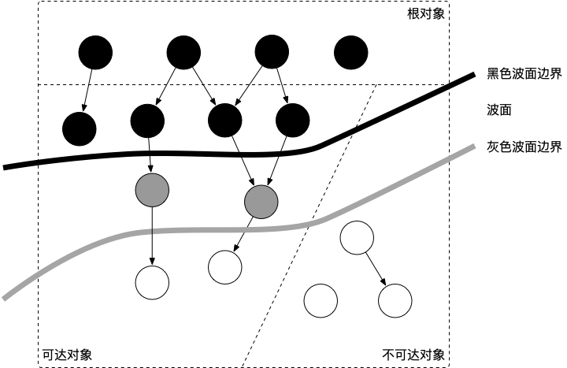
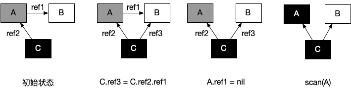

# 数组和切片
## 异同
slice 的底层数据是数组，slice 是对数组的封装，它描述一个数组的片段。两者都可以通过下标来访问单个元素。

slice 的数据结构如下：


**注意**，底层数组是可以被多个 slice 同时指向的，因此对一个 slice 的元素进行操作是有可能影响到其他 slice 的。

**注意**[3]int 和 [4]int 是同一个类型吗？

不是。因为数组的长度是类型的一部分，这是与 slice 不同的一点。

## 切片容量增长
一般都是在向 slice 追加了元素之后，才会引起扩容。追加元素调用的是 append 函数。
先来看看 append 函数的原型：
>func append(slice []Type, elems ...Type) []Type

append 函数的参数长度可变，因此可以追加多个值到 slice 中，还可以用 ... 传入 slice，直接追加一个切片。
```go
slice = append(slice, elem1, elem2)
slice = append(slice, anotherSlice...)
```
使用 append 可以向 slice 追加元素，如果底层数组容量不足就会转移到新的数组。
新 slice 预留的 buffer 大小是有一定规律的。在golang1.18版本更新之前网上大多数的文章都是这样描述slice的扩容策略的：

当原 slice 容量小于 1024 的时候，新 slice 容量变成原来的 2 倍；原 slice 容量超过 1024，新 slice 容量变成原来的1.25倍。

在1.18版本更新之后，slice的扩容策略变为了：

当原slice容量(oldcap)小于256的时候，新slice(newcap)容量为原来的2倍；原slice容量超过256，新slice容量newcap = oldcap+(oldcap+3*256)/4


**注意**向一个nil的slice添加元素会发生什么？为什么？

其实 nil slice 或者 empty slice 都是可以通过调用 append 函数来获得底层数组的扩容。最终都是调用 mallocgc 来向 Go 的内存管理器申请到一块内存，然后再赋给原来的nil slice 或 empty slice，然后摇身一变，成为“真正”的 slice 了。

## 切片作为参数

# 哈希表
## map实现原理
### map 的底层如何实现
go 语言采用的是哈希查找表，并且使用链表解决哈希冲突。
```go
// A header for a Go map.
type hmap struct {
    // 元素个数，调用 len(map) 时，直接返回此值
	count     int
	flags     uint8
	// buckets 的对数 log_2
	B         uint8
	// overflow 的 bucket 近似数
	noverflow uint16
	// 计算 key 的哈希的时候会传入哈希函数
	hash0     uint32
    // 指向 buckets 数组，大小为 2^B
    // 如果元素个数为0，就为 nil
	buckets    unsafe.Pointer
	// 等量扩容的时候，buckets 长度和 oldbuckets 相等
	// 双倍扩容的时候，buckets 长度会是 oldbuckets 的两倍
	oldbuckets unsafe.Pointer
	// 指示扩容进度，小于此地址的 buckets 迁移完成
	nevacuate  uintptr
	extra *mapextra // optional fields
}
```
说明一下，B 是 buckets 数组的长度的对数，也就是说 buckets 数组的长度就是 2^B。bucket 里面存储了 key 和 value，后面会再讲。
buckets 是一个指针，最终它指向的是一个结构体：
```go
type bmap struct {
	tophash [bucketCnt]uint8
}
```
但这只是表面(src/runtime/hashmap.go)的结构，编译期间会给它加料，动态地创建一个新的结构：
```go
type bmap struct {
    topbits  [8]uint8
    keys     [8]keytype
    values   [8]valuetype
    pad      uintptr
    overflow uintptr
}
```
bmap 就是我们常说的“桶”，桶里面会最多装 8 个 key，这些 key 之所以会落入同一个桶，是因为它们经过哈希计算后，哈希结果是“一类”的。在桶内，又会根据 key 计算出来的 hash 值的高 8 位来决定 key 到底落入桶内的哪个位置（一个桶内最多有8个位置）。
来一个整体的图：

### 创建 map 
通过汇编语言可以看到，实际上底层调用的是 makemap 函数，主要做的工作就是初始化 hmap 结构体的各种字段，例如计算 B 的大小，设置哈希种子 hash0 等等。
```go
func makemap(t *maptype, hint int64, h *hmap, bucket unsafe.Pointer) *hmap {
	// 省略各种条件检查...

	// 找到一个 B，使得 map 的装载因子在正常范围内
	B := uint8(0)
	for ; overLoadFactor(hint, B); B++ {
	}

	// 初始化 hash table
	// 如果 B 等于 0，那么 buckets 就会在赋值的时候再分配
	// 如果长度比较大，分配内存会花费长一点
	buckets := bucket
	var extra *mapextra
	if B != 0 {
		var nextOverflow *bmap
		buckets, nextOverflow = makeBucketArray(t, B)
		if nextOverflow != nil {
			extra = new(mapextra)
			extra.nextOverflow = nextOverflow
		}
	}

	// 初始化 hamp
	if h == nil {
		h = (*hmap)(newobject(t.hmap))
	}
	h.count = 0
	h.B = B
	h.extra = extra
	h.flags = 0
	h.hash0 = fastrand()
	h.buckets = buckets
	h.oldbuckets = nil
	h.nevacuate = 0
	h.noverflow = 0

	return h
}
```
### slice 和 map 分别作为函数参数时有什么区别
注意，这个函数返回的结果：*hmap，它是一个指针，而我们之前讲过的 makeslice 函数返回的是 Slice 结构体：
```go
// runtime/slice.go
type slice struct {
    array unsafe.Pointer // 元素指针
    len   int // 长度 
    cap   int // 容量
}
```
### 哈希函数
map 的一个关键点在于，哈希函数的选择。在程序启动时，会检测 cpu 是否支持 aes，如果支持，则使用 aes hash，否则使用 memhash。这是在函数 alginit() 中完成，位于路径：src/runtime/alg.go 下。

### key 定位过程
key 经过哈希计算后得到哈希值，共 64 个 bit 位，计算它到底要落在哪个桶时，只会用到最后 B 个 bit 位。如果 B = 5，那么桶的数量，也就是 buckets 数组的长度是 2^5 = 32。

例如，现在有一个 key 经过哈希函数计算后，得到的哈希结果是：

用最后的 5 个 bit 位，也就是 01010，值为 10，也就是 10 号桶。这个操作实际上就是取余操作，但是取余开销太大，所以代码实现上用的位操作代替。

再用哈希值的高 8 位，找到此 key 在 bucket 中的位置，这是在寻找已有的 key。最开始桶内还没有 key，新加入的 key 会找到第一个空位，放入。

buckets 编号就是桶编号，当两个不同的 key 落在同一个桶中，也就是发生了哈希冲突。冲突的解决手段是用链表法：在 bucket 中，从前往后找到第一个空位。这样，在查找某个 key 时，先找到对应的桶，再去遍历 bucket 中的 key。


如果在 bucket 中没找到，并且 overflow 不为空，还要继续去 overflow bucket 中寻找，直到找到或是所有的 key 槽位都找遍了，包括所有的 overflow bucket。

我们来看下源码吧，哈哈！通过汇编语言可以看到，查找某个 key 的底层函数是 mapacess 系列函数，函数的作用类似，区别在下一节会讲到。这里我们直接看 mapacess1 函数：
```go
func mapaccess1(t *maptype, h *hmap, key unsafe.Pointer) unsafe.Pointer {
	// ……
	
	// 如果 h 什么都没有，返回零值
	if h == nil || h.count == 0 {
		return unsafe.Pointer(&zeroVal[0])
	}
	
	// 写和读冲突
	if h.flags&hashWriting != 0 {
		throw("concurrent map read and map write")
	}
	
	// 不同类型 key 使用的 hash 算法在编译期确定
	alg := t.key.alg
	
	// 计算哈希值，并且加入 hash0 引入随机性
	hash := alg.hash(key, uintptr(h.hash0))
	
	// 比如 B=5，那 m 就是31，二进制是全 1
	// 求 bucket num 时，将 hash 与 m 相与，
	// 达到 bucket num 由 hash 的低 8 位决定的效果
	m := uintptr(1)<<h.B - 1
	
	// b 就是 bucket 的地址
	b := (*bmap)(add(h.buckets, (hash&m)*uintptr(t.bucketsize)))
	
	// oldbuckets 不为 nil，说明发生了扩容
	if c := h.oldbuckets; c != nil {
	    // 如果不是同 size 扩容（看后面扩容的内容）
	    // 对应条件 1 的解决方案
		if !h.sameSizeGrow() {
			// 新 bucket 数量是老的 2 倍
			m >>= 1
		}
		
		// 求出 key 在老的 map 中的 bucket 位置
		oldb := (*bmap)(add(c, (hash&m)*uintptr(t.bucketsize)))
		
		// 如果 oldb 没有搬迁到新的 bucket
		// 那就在老的 bucket 中寻找
		if !evacuated(oldb) {
			b = oldb
		}
	}
	
	// 计算出高 8 位的 hash
	// 相当于右移 56 位，只取高8位
	top := uint8(hash >> (sys.PtrSize*8 - 8))
	
	// 增加一个 minTopHash
	if top < minTopHash {
		top += minTopHash
	}
	for {
	    // 遍历 bucket 的 8 个位置
		for i := uintptr(0); i < bucketCnt; i++ {
		    // tophash 不匹配，继续
			if b.tophash[i] != top {
				continue
			}
			// tophash 匹配，定位到 key 的位置
			k := add(unsafe.Pointer(b), dataOffset+i*uintptr(t.keysize))
			// key 是指针
			if t.indirectkey {
			    // 解引用
				k = *((*unsafe.Pointer)(k))
			}
			// 如果 key 相等
			if alg.equal(key, k) {
			    // 定位到 value 的位置
				v := add(unsafe.Pointer(b), dataOffset+bucketCnt*uintptr(t.keysize)+i*uintptr(t.valuesize))
				// value 解引用
				if t.indirectvalue {
					v = *((*unsafe.Pointer)(v))
				}
				return v
			}
		}
		
		// bucket 找完（还没找到），继续到 overflow bucket 里找
		b = b.overflow(t)
		// overflow bucket 也找完了，说明没有目标 key
		// 返回零值
		if b == nil {
			return unsafe.Pointer(&zeroVal[0])
		}
	}
}
```

## 实现两种get操作
Go 语言中读取 map 有两种语法：带 comma 和 不带 comma。当要查询的 key 不在 map 里，带 comma 的用法会返回一个 bool 型变量提示 key 是否在 map 中；而不带 comma 的语句则会返回一个 key 对应 value 类型的零值。如果 value 是 int 型就会返回 0，如果 value 是 string 类型，就会返回空字符串。
```go
package main

import "fmt"

func main() {
	ageMap := make(map[string]int)
	ageMap["qcrao"] = 18

    // 不带 comma 用法
	age1 := ageMap["stefno"]
	fmt.Println(age1)

    // 带 comma 用法
	age2, ok := ageMap["stefno"]
	fmt.Println(age2, ok)
}
```
运行结果
```shell
0
0 false

```
# 编译

# 调度器
## goroutine和线程区别
**内存占用**
创建一个 goroutine 的栈内存消耗为 2 KB，实际运行过程中，如果栈空间不够用，会自动进行扩容。创建一个 thread 则需要消耗 1 MB 栈内存，而且还需要一个被称为 “a guard page” 的区域用于和其他 thread 的栈空间进行隔离。


**创建和销毀**
Thread 创建和销毀都会有巨大的消耗，因为要和操作系统打交道，是内核级的，通常解决的办法就是线程池。而 goroutine 因为是由 Go runtime 负责管理的，创建和销毁的消耗非常小，是用户级。

**切换**
当 threads 切换时，需要保存各种寄存器，以便将来恢复

而 goroutines 切换只需保存三个寄存器：Program Counter, Stack Pointer and BP。

## scheduler


### 为什么要 scheduler
Runtime 维护所有的 goroutines，并通过 scheduler 来进行调度。Goroutines 和 threads 是独立的，但是 goroutines 要依赖 threads 才能执行。

Go 程序执行的高效和 scheduler 的调度是分不开的。

### scheduler 底层原理
实际上在操作系统看来，所有的程序都是在执行多线程。将 goroutines 调度到线程上执行，仅仅是 runtime 层面的一个概念，在操作系统之上的层面。

有三个基础的结构体来实现 goroutines 的调度。g，m，p。

- g 代表一个 goroutine，它包含：表示 goroutine 栈的一些字段，指示当前 goroutine 的状态，指示当前运行到的指令地址，也就是 PC 值。

- m 表示内核线程，包含正在运行的 goroutine 等字段。

- p 代表一个虚拟的 Processor，它维护一个处于 Runnable 状态的 g 队列，m 需要获得 p 才能运行 g。

当然还有一个核心的结构体：sched，它总览全局。

**Runtime** 起始时会启动一些 G：垃圾回收的 G，执行调度的 G，运行用户代码的 G；并且会创建一个 M 用来开始 G 的运行。随着时间的推移，更多的 G 会被创建出来，更多的 M 也会被创建出来。


Go scheduler 的核心思想是：
- reuse threads；
- 限制同时运行（不包含阻塞）的线程数为 N，N 等于 CPU 的核心数目；
- 线程私有的 runqueues，并且可以从其他线程 stealing goroutine 来运行，线程阻塞后，可以将 runqueues 传递给其他线程。


## 调度时机
在四种情形下，goroutine 可能会发生调度，但也并不一定会发生，只是说 Go scheduler 有机会进行调度。

|情形|	说明|
|---------|----------|
|使用关键字 go|	go 创建一个新的 goroutine，Go scheduler 会考虑调度|
|G|C	由于进行 GC 的 goroutine 也需要在 M 上运行，因此肯定会发生调度。当然，Go scheduler 还会做很多其他的调度，例如调度不涉及堆访问的 goroutine 来运行。GC 不管栈上的内存，只会回收堆上的内存|
|系统调用|	当 goroutine 进行系统调用时，会阻塞 M，所以它会被调度走，同时一个新的 goroutine 会被调度上来
|内存同步访问|	atomic，mutex，channel 操作等会使 goroutine 阻塞，因此会被调度走。等条件满足后（例如其他 goroutine 解锁了）还会被调度上来继续运行|

## M:N 模型
我们都知道，Go runtime 会负责 goroutine 的生老病死，从创建到销毁，都一手包办。Runtime 会在程序启动的时候，创建 M 个线程（CPU 执行调度的单位），之后创建的 N 个 goroutine 都会依附在这 M 个线程上执行。这就是 M:N 模型：


在同一时刻，一个线程上只能跑一个 goroutine。当 goroutine 发生阻塞（例如上篇文章提到的向一个 channel 发送数据，被阻塞）时，runtime 会把当前 goroutine 调度走，让其他 goroutine 来执行。目的就是不让一个线程闲着，榨干 CPU 的每一滴油水。

## 工作窃取
Go scheduler 的职责就是将所有处于 runnable 的 goroutines 均匀分布到在 P 上运行的 M。

当一个 P 发现自己的 LRQ 已经没有 G 时，会从其他 P “偷” 一些 G 来运行。看看这是什么精神！自己的工作做完了，为了全局的利益，主动为别人分担。这被称为 Work-stealing，Go 从 1.1 开始实现。

Go scheduler 使用 M:N 模型，在任一时刻，M 个 goroutines（G） 要分配到 N 个内核线程（M），这些 M 跑在个数最多为 GOMAXPROCS 的逻辑处理器（P）上。每个 M 必须依附于一个 P，每个 P 在同一时刻只能运行一个 M。如果 P 上的 M 阻塞了，那它就需要其他的 M 来运行 P 的 LRQ 里的 goroutines。


个人感觉，上面这张图比常见的那些用三角形表示 M，圆形表示 G，矩形表示 P 的那些图更生动形象。

实际上，Go scheduler 每一轮调度要做的工作就是找到处于 runnable 的 goroutines，并执行它。找的顺序如下：
```go
runtime.schedule() {
    // only 1/61 of the time, check the global runnable queue for a G.
    // if not found, check the local queue.
    // if not found,
    //     try to steal from other Ps.
    //     if not, check the global runnable queue.
    //     if not found, poll network.
}
```
找到一个可执行的 goroutine 后，就会一直执行下去，直到被阻塞。

当 P2 上的一个 G 执行结束，它就会去 LRQ 获取下一个 G 来执行。如果 LRQ 已经空了，就是说本地可运行队列已经没有 G 需要执行，并且这时 GRQ 也没有 G 了。这时，P2 会随机选择一个 P（称为 P1），P2 会从 P1 的 LRQ “偷”过来一半的 G。


## GPM
G，取 goroutine 的首字母，主要保存 goroutine 的一些状态信息以及 CPU 的一些寄存器的值，例如 IP 寄存器，以便在轮到本 goroutine 执行时，CPU 知道要从哪一条指令处开始执行。

当 goroutine 被调离 CPU 时，调度器负责把 CPU 寄存器的值保存在 g 对象的成员变量之中。

当 goroutine 被调度起来运行时，调度器又负责把 g 对象的成员变量所保存的寄存器值恢复到 CPU 的寄存器。


 M，取 machine 的首字母，它代表一个工作线程，或者说系统线程。G 需要调度到 M 上才能运行，M 是真正工作的人。结构体 m 就是我们常说的 M，它保存了 M 自身使用的栈信息、当前正在 M 上执行的 G 信息、与之绑定的 P 信息……

当 M 没有工作可做的时候，在它休眠前，会“自旋”地来找工作：检查全局队列，查看 network poller，试图执行 gc 任务，或者“偷”工作。

P，取 processor 的首字母，为 M 的执行提供“上下文”，保存 M 执行 G 时的一些资源，例如本地可运行 G 队列，memeory cache 等。

一个 M 只有绑定 P 才能执行 goroutine，当 M 被阻塞时，整个 P 会被传递给其他 M ，或者说整个 P 被接管。

# 垃圾回收
## 垃圾回收器认知
### 什么是 GC
GC，全称 Garbage Collection，即垃圾回收，是一种自动内存管理的机制。

当程序向操作系统申请的内存不再需要时，垃圾回收主动将其回收并供其他代码进行内存申请时候复用，或者将其归还给操作系统，这种针对内存级别资源的自动回收过程，即为垃圾回收。而负责垃圾回收的程序组件，即为垃圾回收器。

垃圾回收器的执行过程被划分为两个半独立的组件：
- 赋值器（Mutator）：这一名称本质上是在指代用户态的代码。因为对垃圾回收器而言，用户态的代码仅仅只是在修改对象之间的引用关系，也就是在对象图（对象之间引用关系的一个有向图）上进行操作。
- 回收器（Collector）：负责执行垃圾回收的代码。


### 根对象到底是什么
根对象在垃圾回收的术语中又叫做根集合，它是垃圾回收器在标记过程时最先检查的对象，包括：
- 全局变量：程序在编译期就能确定的那些存在于程序整个生命周期的变量。
- 执行栈：每个 goroutine 都包含自己的执行栈，这些执行栈上包含栈上的变量及指向分配的堆内存区块的指针。
- 寄存器：寄存器的值可能表示一个指针，参与计算的这些指针可能指向某些赋值器分配的堆内存区块。

### 常见的 GC 实现方式有哪些？Go 语言的 GC 使用的是什么？

所有的 GC 算法其存在形式可以归结为追踪（Tracing）和引用计数（Reference Counting）这两种形式的混合运用。
- **追踪式 GC**

从根对象出发，根据对象之间的引用信息，一步步推进直到扫描完毕整个堆并确定需要保留的对象，从而回收所有可回收的对象。

- **引用计数式 GC**

每个对象自身包含一个被引用的计数器，当计数器归零时自动得到回收。因为此方法缺陷较多，在追求高性能时通常不被应用。

目前比较常见的 GC 实现方式包括：

- 追踪式，分为多种不同类型，例如：
    - 标记清扫：从根对象出发，将确定存活的对象进行标记，并清扫可以回收的对象。
    - 标记整理：为了解决内存碎片问题而提出，在标记过程中，将对象尽可能整理到一块连续的内存上。
    - 增量式：将标记与清扫的过程分批执行，每次执行很小的部分，从而增量的推进垃圾回收，达到近似实时、几乎无停顿的目的。
    - 增量整理：在增量式的基础上，增加对对象的整理过程。
    - 分代式：将对象根据存活时间的长短进行分类，存活时间小于某个值的为年轻代，存活时间大于某个值的为老年代，永远不会参与回收的对象为永久代。并根据分代假设（如果一个对象存活时间不长则倾向于被回收，如果一个对象已经存活很长时间则倾向于存活更长时间）对对象进行回收。
- 引用计数：根据对象自身的引用计数来回收，当引用计数归零时立即回收。

对于 Go 而言，Go 的 GC 目前使用的是无分代（对象没有代际之分）、不整理（回收过程中不对对象进行移动与整理）、并发（与用户代码并发执行）的三色标记清扫算法。

1. 对象整理的优势是解决内存碎片问题以及“允许”使用顺序内存分配器。但 Go 运行时的分配算法基于 tcmalloc，基本上没有碎片问题。 并且顺序内存分配器在多线程的场景下并不适用。Go 使用的是基于 tcmalloc 的现代内存分配算法，对对象进行整理不会带来实质性的性能提升。
2. 分代 GC 依赖分代假设，即 GC 将主要的回收目标放在新创建的对象上（存活时间短，更倾向于被回收），而非频繁检查所有对象。但 Go 的编译器会通过逃逸分析将大部分新生对象存储在栈上（栈直接被回收），只有那些需要长期存在的对象才会被分配到需要进行垃圾回收的堆中。也就是说，分代 GC 回收的那些存活时间短的对象在 Go 中是直接被分配到栈上，当 goroutine 死亡后栈也会被直接回收，不需要 GC 的参与，进而分代假设并没有带来直接优势。并且 Go 的垃圾回收器与用户代码并发执行，使得 STW 的时间与对象的代际、对象的 size 没有关系。Go 团队更关注于如何更好地让 GC 与用户代码并发执行（使用适当的 CPU 来执行垃圾回收），而非减少停顿时间这一单一目标上。

### 三色标记法是什么
从垃圾回收器的视角来看，三色抽象规定了三种不同类型的对象，并用不同的颜色相称：
- 白色对象（可能死亡）：未被回收器访问到的对象。在回收开始阶段，所有对象均为白色，当回收结束后，白色对象均不可达。
- 灰色对象（波面）：已被回收器访问到的对象，但回收器需要对其中的一个或多个指针进行扫描，因为他们可能还指向白色对象。
- 黑色对象（确定存活）：已被回收器访问到的对象，其中所有字段都已被扫描，黑色对象中任何一个指针都不可能直接指向白色对象。


这样三种不变性所定义的回收过程其实是一个波面不断前进的过程，这个波面同时也是黑色对象和白色对象的边界，灰色对象就是这个波面。

回收到最后只会剩下白色和黑色对象。 


### STW 是什么意思
STW 可以是 Stop the World 的缩写，也可以是 Start the World 的缩写。通常意义上指指代从 Stop the World 这一动作发生时到 Start the World 这一动作发生时这一段时间间隔，即万物静止。STW 在垃圾回收过程中为了保证实现的正确性、防止无止境的内存增长等问题而不可避免的需要停止赋值器进一步操作对象图的一段过程。

### 如何观察 Go GC
我们以下面的程序为例，先使用四种不同的方式来介绍如何观察 GC，并在后面的问题中通过几个详细的例子再来讨论如何优化 GC。
```go
package main

func allocate() {
	_ = make([]byte, 1<<20)
}

func main() {
	for n := 1; n < 100000; n++ {
		allocate()
	}
}
```
#### GODEBUG=gctrace=1


#### go tool trace
go tool trace 的主要功能是将统计而来的信息以一种可视化的方式展示给用户。要使用此工具，可以通过调用 trace API：
```go
package main

import (
	"os"
	"runtime/trace"
)

func allocate() {
	_ = make([]byte, 1<<20)
}
func main() {
	f, _ := os.Create("trace.out")
	defer f.Close()
	trace.Start(f)
	defer trace.Stop()
	for n := 1; n < 100000; n++ {
		allocate()
	}
}

```
编译后我们用以下命令来启动可视化界面：
>go tool trace trace.out


### 有了 GC，为什么还会发生内存泄露
预期的能很快被释放的内存由于附着在了长期存活的内存上、或生命期意外地被延长，导致预计能够立即回收的内存而长时间得不到回收。

在 Go 中，由于 goroutine 的存在，所谓的内存泄漏除了附着在长期对象上之外，还存在多种不同的形式。

#### 预期能被快速释放的内存因被根对象引用而没有得到迅速释放
当有一个全局对象时，可能不经意间将某个变量附着在其上，且忽略的将其进行释放，则该内存永远不会得到释放。例如：
```go
var cache = map[interface{}]interface{}{}

func keepalloc() {
	for i := 0; i < 10000; i++ {
		m := make([]byte, 1<<10)
		cache[i] = m
	}
}
```

#### goroutine 泄漏 
Goroutine 作为一种逻辑上理解的轻量级线程，需要维护执行用户代码的上下文信息。在运行过程中也需要消耗一定的内存来保存这类信息，而这些内存在目前版本的 Go 中是不会被释放的。因此，如果一个程序持续不断地产生新的 goroutine、且不结束已经创建的 goroutine 并复用这部分内存，就会造成内存泄漏的现象，例如：
```go
func keepalloc2() {
	for i := 0; i < 100000; i++ {
		go func() {
			select {}
		}()
	}
}
```

### 并发标记清除法的难点是什么
在没有用户态代码并发修改三色抽象的情况下，回收可以正常结束。但是并发回收的根本问题在于，用户态代码在回收过程中会并发地更新对象图，从而造成赋值器和回收器可能对对象图的结构产生不同的认知。这时以一个固定的三色波面作为回收过程前进的边界则不再合理。

|时序|	回收器|	赋值器|	说明|
|--------|-------|-------|--------|
|1|	shade(A, gray)||		回收器：根对象的子节点着色为灰色对象|
|2|	shade(C, black)|		|回收器：当所有子节点着色为灰色后，将节点着为黑色|
|3||		C.ref3 = C.ref2.ref1|	赋值器：并发的修改了 C 的子节点|
|4||		A.ref1 = nil|	赋值器：并发的修改了 A 的子节点|
|5|	shade(A.ref1, gray)||		回收器：进一步灰色对象的子节点并着色为灰色对象，这时由于 A.ref1 为 nil，什么事情也没有发生|
|6|	shade(A, black)||		回收器：由于所有子节点均已标记，回收器也不会重新扫描已经被标记为黑色的对象，此时 A 被着色为黑色，scan(A) 什么也不会发生，进而 B 在此次回收过程中永远不会被标记为黑色，进而错误地被回收。|

- 初始状态：假设某个黑色对象 C 指向某个灰色对象 A ，而 A 指向白色对象 B；
- C.ref3 = C.ref2.ref1：赋值器并发地将黑色对象 C 指向（ref3）了白色对象 B；
- A.ref1 = nil：移除灰色对象 A 对白色对象 B 的引用（ref2）；
- 最终状态：在继续扫描的过程中，白色对象 B 永远不会被标记为黑色对象了（回收器不会重新扫描黑色对象），进而对象 B 被错误地回收。


### 什么是写屏障、混合写屏障，如何实现?
要讲清楚写屏障，就需要理解三色标记清除算法中的强弱不变性以及赋值器的颜色。写屏障是一个在并发垃圾回收器中才会出现的概念，垃圾回收器的正确性体现在：不应出现对象的丢失，也不应错误的回收还不需要回收的对象。

可以证明，当以下两个条件同时满足时会破坏垃圾回收器的正确性：

**条件 1**: 赋值器修改对象图，导致某一黑色对象引用白色对象；
**条件 2**: 从灰色对象出发，到达白色对象的、未经访问过的路径被赋值器破坏。
只要能够避免其中任何一个条件，则不会出现对象丢失的情况，因为：
- 如果条件 1 被避免，则所有白色对象均被灰色对象引用，没有白色对象会被遗漏；
- 如果条件 2 被避免，即便白色对象的指针被写入到黑色对象中，但从灰色对象出发，总存在一条没有访问过的路径，从而找到到达白色对象的路径，白色对象最终不会被遗漏。

## 垃圾回收机制实现
### Go 语言中 GC 的流程是什么
|阶段|	说明|	赋值器状态|
|--------|--------|--------|
|SweepTermination|	清扫终止阶段，为下一个阶段的并发标记做准备工作，启动写屏障	|STW|
|Mark|	扫描标记阶段，与赋值器并发执行，写屏障开启|	并发|
|MarkTermination|	标记终止阶段，保证一个周期内标记任务完成，停止写屏障	|STW|
|GCoff|	内存清扫阶段，将需要回收的内存归还到堆中，写屏障关闭	|并发|
|GCoff|	内存归还阶段，将过多的内存归还给操作系统，写屏障关闭|	并发|

具体而言，各个阶段的触发函数分别为：


## GC优化
### GC 关注的指标有哪些
Go 的 GC 被设计为成比例触发、大部分工作与赋值器并发、不分代、无内存移动且会主动向操作系统归还申请的内存。因此最主要关注的、能够影响赋值器的性能指标有：

- CPU 利用率：回收算法会在多大程度上拖慢程序？有时候，这个是通过回收占用的 CPU 时间与其它 CPU 时间的百分比来描述的。
- GC 停顿时间：回收器会造成多长时间的停顿？目前的 GC 中需要考虑 STW 和 Mark Assist 两个部分可能造成的停顿。
- GC 停顿频率：回收器造成的停顿频率是怎样的？目前的 GC 中需要考虑 STW 和 Mark Assist 两个部分可能造成的停顿。
- GC 可扩展性：当堆内存变大时，垃圾回收器的性能如何？但大部分的程序可能并不一定关心这个问题。