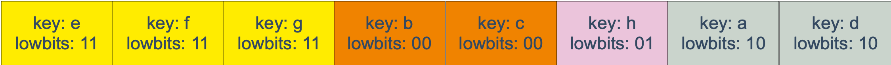
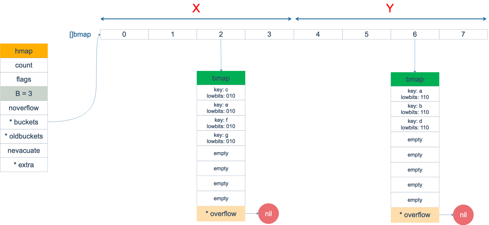

# 数组和切片
## 异同
slice 的底层数据是数组，slice 是对数组的封装，它描述一个数组的片段。两者都可以通过下标来访问单个元素。

slice 的数据结构如下：


**注意**，底层数组是可以被多个 slice 同时指向的，因此对一个 slice 的元素进行操作是有可能影响到其他 slice 的。

**注意**[3]int 和 [4]int 是同一个类型吗？

不是。因为数组的长度是类型的一部分，这是与 slice 不同的一点。

## 切片容量增长
一般都是在向 slice 追加了元素之后，才会引起扩容。追加元素调用的是 append 函数。
先来看看 append 函数的原型：
>func append(slice []Type, elems ...Type) []Type

append 函数的参数长度可变，因此可以追加多个值到 slice 中，还可以用 ... 传入 slice，直接追加一个切片。
```go
slice = append(slice, elem1, elem2)
slice = append(slice, anotherSlice...)
```
使用 append 可以向 slice 追加元素，如果底层数组容量不足就会转移到新的数组。
新 slice 预留的 buffer 大小是有一定规律的。在golang1.18版本更新之前网上大多数的文章都是这样描述slice的扩容策略的：

当原 slice 容量小于 1024 的时候，新 slice 容量变成原来的 2 倍；原 slice 容量超过 1024，新 slice 容量变成原来的1.25倍。

在1.18版本更新之后，slice的扩容策略变为了：

当原slice容量(oldcap)小于256的时候，新slice(newcap)容量为原来的2倍；原slice容量超过256，新slice容量newcap = oldcap+(oldcap+3*256)/4


**注意**向一个nil的slice添加元素会发生什么？为什么？

其实 nil slice 或者 empty slice 都是可以通过调用 append 函数来获得底层数组的扩容。最终都是调用 mallocgc 来向 Go 的内存管理器申请到一块内存，然后再赋给原来的nil slice 或 empty slice，然后摇身一变，成为“真正”的 slice 了。

## 切片作为参数

# 哈希表
## map实现原理
### map 的底层如何实现
go 语言采用的是哈希查找表，并且使用链表解决哈希冲突。
```go
// A header for a Go map.
type hmap struct {
    // 元素个数，调用 len(map) 时，直接返回此值
	count     int
	flags     uint8
	// buckets 的对数 log_2
	B         uint8
	// overflow 的 bucket 近似数
	noverflow uint16
	// 计算 key 的哈希的时候会传入哈希函数
	hash0     uint32
    // 指向 buckets 数组，大小为 2^B
    // 如果元素个数为0，就为 nil
	buckets    unsafe.Pointer
	// 等量扩容的时候，buckets 长度和 oldbuckets 相等
	// 双倍扩容的时候，buckets 长度会是 oldbuckets 的两倍
	oldbuckets unsafe.Pointer
	// 指示扩容进度，小于此地址的 buckets 迁移完成
	nevacuate  uintptr
	extra *mapextra // optional fields
}
```
说明一下，B 是 buckets 数组的长度的对数，也就是说 buckets 数组的长度就是 2^B。bucket 里面存储了 key 和 value，后面会再讲。
buckets 是一个指针，最终它指向的是一个结构体：
```go
type bmap struct {
	tophash [bucketCnt]uint8
}
```
但这只是表面(src/runtime/hashmap.go)的结构，编译期间会给它加料，动态地创建一个新的结构：
```go
type bmap struct {
    topbits  [8]uint8
    keys     [8]keytype
    values   [8]valuetype
    pad      uintptr
    overflow uintptr
}
```
bmap 就是我们常说的“桶”，桶里面会最多装 8 个 key，这些 key 之所以会落入同一个桶，是因为它们经过哈希计算后，哈希结果是“一类”的。在桶内，又会根据 key 计算出来的 hash 值的高 8 位来决定 key 到底落入桶内的哪个位置（一个桶内最多有8个位置）。
来一个整体的图：


当 map 的 key 和 value 都不是指针，并且 size 都小于 128 字节的情况下，会把 bmap 标记为不含指针，这样可以避免 gc 时扫描整个 hmap。但是，我们看 bmap 其实有一个 overflow 的字段，是指针类型的，破坏了 bmap 不含指针的设想，这时会把 overflow 移动到 extra 字段来。
```go
type mapextra struct {
	// overflow[0] contains overflow buckets for hmap.buckets.
	// overflow[1] contains overflow buckets for hmap.oldbuckets.
	overflow [2]*[]*bmap

	// nextOverflow 包含空闲的 overflow bucket，这是预分配的 bucket
	nextOverflow *bmap
}
```

bmap 是存放 k-v 的地方，我们把视角拉近，仔细看 bmap 的内部组成

### 创建 map 
通过汇编语言可以看到，实际上底层调用的是 makemap 函数，主要做的工作就是初始化 hmap 结构体的各种字段，例如计算 B 的大小，设置哈希种子 hash0 等等。
```go
func makemap(t *maptype, hint int64, h *hmap, bucket unsafe.Pointer) *hmap {
	// 省略各种条件检查...

	// 找到一个 B，使得 map 的装载因子在正常范围内
	B := uint8(0)
	for ; overLoadFactor(hint, B); B++ {
	}

	// 初始化 hash table
	// 如果 B 等于 0，那么 buckets 就会在赋值的时候再分配
	// 如果长度比较大，分配内存会花费长一点
	buckets := bucket
	var extra *mapextra
	if B != 0 {
		var nextOverflow *bmap
		buckets, nextOverflow = makeBucketArray(t, B)
		if nextOverflow != nil {
			extra = new(mapextra)
			extra.nextOverflow = nextOverflow
		}
	}

	// 初始化 hamp
	if h == nil {
		h = (*hmap)(newobject(t.hmap))
	}
	h.count = 0
	h.B = B
	h.extra = extra
	h.flags = 0
	h.hash0 = fastrand()
	h.buckets = buckets
	h.oldbuckets = nil
	h.nevacuate = 0
	h.noverflow = 0

	return h
}
```
### slice 和 map 分别作为函数参数时有什么区别
注意，这个函数返回的结果：*hmap，它是一个指针，而我们之前讲过的 makeslice 函数返回的是 Slice 结构体：
```go
// runtime/slice.go
type slice struct {
    array unsafe.Pointer // 元素指针
    len   int // 长度 
    cap   int // 容量
}
```
### 哈希函数
map 的一个关键点在于，哈希函数的选择。在程序启动时，会检测 cpu 是否支持 aes，如果支持，则使用 aes hash，否则使用 memhash。这是在函数 alginit() 中完成，位于路径：src/runtime/alg.go 下。

### key 定位过程
key 经过哈希计算后得到哈希值，共 64 个 bit 位，计算它到底要落在哪个桶时，只会用到最后 B 个 bit 位。如果 B = 5，那么桶的数量，也就是 buckets 数组的长度是 2^5 = 32。

例如，现在有一个 key 经过哈希函数计算后，得到的哈希结果是：

用最后的 5 个 bit 位，也就是 01010，值为 10，也就是 10 号桶。这个操作实际上就是取余操作，但是取余开销太大，所以代码实现上用的位操作代替。

再用哈希值的高 8 位，找到此 key 在 bucket 中的位置，这是在寻找已有的 key。最开始桶内还没有 key，新加入的 key 会找到第一个空位，放入。

buckets 编号就是桶编号，当两个不同的 key 落在同一个桶中，也就是发生了哈希冲突。冲突的解决手段是用链表法：在 bucket 中，从前往后找到第一个空位。这样，在查找某个 key 时，先找到对应的桶，再去遍历 bucket 中的 key。


如果在 bucket 中没找到，并且 overflow 不为空，还要继续去 overflow bucket 中寻找，直到找到或是所有的 key 槽位都找遍了，包括所有的 overflow bucket。

我们来看下源码吧，哈哈！通过汇编语言可以看到，查找某个 key 的底层函数是 mapacess 系列函数，函数的作用类似，区别在下一节会讲到。这里我们直接看 mapacess1 函数：
```go
func mapaccess1(t *maptype, h *hmap, key unsafe.Pointer) unsafe.Pointer {
	// ……
	
	// 如果 h 什么都没有，返回零值
	if h == nil || h.count == 0 {
		return unsafe.Pointer(&zeroVal[0])
	}
	
	// 写和读冲突
	if h.flags&hashWriting != 0 {
		throw("concurrent map read and map write")
	}
	
	// 不同类型 key 使用的 hash 算法在编译期确定
	alg := t.key.alg
	
	// 计算哈希值，并且加入 hash0 引入随机性
	hash := alg.hash(key, uintptr(h.hash0))
	
	// 比如 B=5，那 m 就是31，二进制是全 1
	// 求 bucket num 时，将 hash 与 m 相与，
	// 达到 bucket num 由 hash 的低 8 位决定的效果
	m := uintptr(1)<<h.B - 1
	
	// b 就是 bucket 的地址
	b := (*bmap)(add(h.buckets, (hash&m)*uintptr(t.bucketsize)))
	
	// oldbuckets 不为 nil，说明发生了扩容
	if c := h.oldbuckets; c != nil {
	    // 如果不是同 size 扩容（看后面扩容的内容）
	    // 对应条件 1 的解决方案
		if !h.sameSizeGrow() {
			// 新 bucket 数量是老的 2 倍
			m >>= 1
		}
		
		// 求出 key 在老的 map 中的 bucket 位置
		oldb := (*bmap)(add(c, (hash&m)*uintptr(t.bucketsize)))
		
		// 如果 oldb 没有搬迁到新的 bucket
		// 那就在老的 bucket 中寻找
		if !evacuated(oldb) {
			b = oldb
		}
	}
	
	// 计算出高 8 位的 hash
	// 相当于右移 56 位，只取高8位
	top := uint8(hash >> (sys.PtrSize*8 - 8))
	
	// 增加一个 minTopHash
	if top < minTopHash {
		top += minTopHash
	}
	for {
	    // 遍历 bucket 的 8 个位置
		for i := uintptr(0); i < bucketCnt; i++ {
		    // tophash 不匹配，继续
			if b.tophash[i] != top {
				continue
			}
			// tophash 匹配，定位到 key 的位置
			k := add(unsafe.Pointer(b), dataOffset+i*uintptr(t.keysize))
			// key 是指针
			if t.indirectkey {
			    // 解引用
				k = *((*unsafe.Pointer)(k))
			}
			// 如果 key 相等
			if alg.equal(key, k) {
			    // 定位到 value 的位置
				v := add(unsafe.Pointer(b), dataOffset+bucketCnt*uintptr(t.keysize)+i*uintptr(t.valuesize))
				// value 解引用
				if t.indirectvalue {
					v = *((*unsafe.Pointer)(v))
				}
				return v
			}
		}
		
		// bucket 找完（还没找到），继续到 overflow bucket 里找
		b = b.overflow(t)
		// overflow bucket 也找完了，说明没有目标 key
		// 返回零值
		if b == nil {
			return unsafe.Pointer(&zeroVal[0])
		}
	}
}
```

## 实现两种get操作
Go 语言中读取 map 有两种语法：带 comma 和 不带 comma。当要查询的 key 不在 map 里，带 comma 的用法会返回一个 bool 型变量提示 key 是否在 map 中；而不带 comma 的语句则会返回一个 key 对应 value 类型的零值。如果 value 是 int 型就会返回 0，如果 value 是 string 类型，就会返回空字符串。
```go
package main

import "fmt"

func main() {
	ageMap := make(map[string]int)
	ageMap["qcrao"] = 18

    // 不带 comma 用法
	age1 := ageMap["stefno"]
	fmt.Println(age1)

    // 带 comma 用法
	age2, ok := ageMap["stefno"]
	fmt.Println(age2, ok)
}
```
运行结果
```shell
0
0 false

```

## 遍历过程
本来 map 的遍历过程比较简单：遍历所有的 bucket 以及它后面挂的 overflow bucket，然后挨个遍历 bucket 中的所有 cell。每个 bucket 中包含 8 个 cell，从有 key 的 cell 中取出 key 和 value，这个过程就完成了。

但是，现实并没有这么简单。还记得前面讲过的扩容过程吗？扩容过程不是一个原子的操作，它每次最多只搬运 2 个 bucket，所以如果触发了扩容操作，那么在很长时间里，map 的状态都是处于一个中间态：有些 bucket 已经搬迁到新家，而有些 bucket 还待在老地方。

因此，遍历如果发生在扩容的过程中，就会涉及到遍历新老 bucket 的过程，这是难点所在。

```go
package main

import "fmt"

func main() {
	ageMp := make(map[string]int)
	ageMp["qcrao"] = 18

	for name, age := range ageMp {
		fmt.Println(name, age)
	}
}
```

执行命令：
>go tool compile -S main.go
得到汇编命令。这里就不逐行讲解了，可以去看之前的几篇文章，说得很详细。

关键的几行汇编代码如下：
```shell
// ......
0x0124 00292 (test16.go:9)      CALL    runtime.mapiterinit(SB)

// ......
0x01fb 00507 (test16.go:9)      CALL    runtime.mapiternext(SB)
0x0200 00512 (test16.go:9)      MOVQ    ""..autotmp_4+160(SP), AX
0x0208 00520 (test16.go:9)      TESTQ   AX, AX
0x020b 00523 (test16.go:9)      JNE     302

// ......
```

这样，关于 map 迭代，底层的函数调用关系一目了然。先是调用 mapiterinit 函数初始化迭代器，然后循环调用 mapiternext 函数进行 map 迭代。


迭代器的结构体定义：
```go
type hiter struct {
	// key 指针
	key         unsafe.Pointer
	// value 指针
	value       unsafe.Pointer
	// map 类型，包含如 key size 大小等
	t           *maptype
	// map header
	h           *hmap
	// 初始化时指向的 bucket
	buckets     unsafe.Pointer
	// 当前遍历到的 bmap
	bptr        *bmap
	overflow    [2]*[]*bmap
	// 起始遍历的 bucket 编号
	startBucket uintptr
	// 遍历开始时 cell 的编号（每个 bucket 中有 8 个 cell）
	offset      uint8
	// 是否从头遍历了
	wrapped     bool
	// B 的大小
	B           uint8
	// 指示当前 cell 序号
	i           uint8
	// 指向当前的 bucket
	bucket      uintptr
	// 因为扩容，需要检查的 bucket
	checkBucket uintptr
}
```
前面已经提到过，即使是对一个写死的 map 进行遍历，每次出来的结果也是无序的。下面我们就可以近距离地观察他们的实现了
```go
// 生成随机数 r
r := uintptr(fastrand())
if h.B > 31-bucketCntBits {
	r += uintptr(fastrand()) << 31
}

// 从哪个 bucket 开始遍历
it.startBucket = r & (uintptr(1)<<h.B - 1)
// 从 bucket 的哪个 cell 开始遍历
it.offset = uint8(r >> h.B & (bucketCnt - 1))
```

例如，B = 2，那 `uintptr(1)<<h.B - 1` 结果就是 3，低 8 位为 0000 0011，将 r 与之相与，就可以得到一个 0~3 的 bucket 序号；bucketCnt - 1 等于 7，低 8 位为 0000 0111，将 r 右移 2 位后，与 7 相与，就可以得到一个 0~7 号的 cell。

于是，在 mapiternext 函数中就会从 it.startBucket 的 it.offset 号的 cell 开始遍历，取出其中的 key 和 value，直到又回到起点 bucket，完成遍历过程。

假设我们有下图所示的一个 map，起始时 B = 1，有两个 bucket，后来触发了扩容，B 变成 2。并且， 1 号 bucket 中的内容搬迁到了新的 bucket，1 号裂变成 1 号和 3 号；0 号 bucket 暂未搬迁。老的 bucket 挂在在 *oldbuckets 指针上面，新的 bucket 则挂在 *buckets 指针上面。


这时，我们对此 map 进行遍历。假设经过初始化后，startBucket = 3，offset = 2。于是，遍历的起点将是 3 号 bucket 的 2 号 cell，下面这张图就是开始遍历时的状态：


标红的表示起始位置，bucket 遍历顺序为：3 -> 0 -> 1 -> 2。

因为 3 号 bucket 对应老的 1 号 bucket，因此先检查老 1 号 bucket 是否已经被搬迁过。判断方法就是：
```go
func evacuated(b *bmap) bool {
	h := b.tophash[0]
	return h > empty && h < minTopHash
}
```
如果 b.tophash[0] 的值在标志值范围内，即在 (0,4) 区间里，说明已经被搬迁过了。
```go
empty = 0
evacuatedEmpty = 1
evacuatedX = 2
evacuatedY = 3
minTopHash = 4
```
在本例中，老 1 号 bucket 已经被搬迁过了。所以它的 tophash[0] 值在 (0,4) 范围内，因此只用遍历新的 3 号 bucket。

依次遍历 3 号 bucket 的 cell，这时候会找到第一个非空的 key：元素 e。到这里，mapiternext 函数返回，这时我们的遍历结果仅有一个元素：

由于返回的 key 不为空，所以会继续调用 mapiternext 函数。

继续从上次遍历到的地方往后遍历，从新 3 号 overflow bucket 中找到了元素 f 和 元素 g。

遍历结果集也因此壮大：

并没有这么简单，回忆一下，老 0 号 bucket 在搬迁后将裂变成 2 个 bucket：新 0 号、新 2 号。而我们此时正在遍历的只是新 0 号 bucket。所以，我们只会取出老 0 号 bucket 中那些在裂变之后，分配到新 0 号 bucket 中的那些 key。
因此，lowbits == 00 的将进入遍历结果集：

和之前的流程一样，继续遍历新 1 号 bucket，发现老 1 号 bucket 已经搬迁，只用遍历新 1 号 bucket 中现有的元素就可以了。结果集变成：

继续遍历新 2 号 bucket，它来自老 0 号 bucket，因此需要在老 0 号 bucket 中那些会裂变到新 2 号 bucket 中的 key，也就是 lowbit == 10 的那些 key。

这样，遍历结果集变成：

map 遍历的核心在于理解 2 倍扩容时，老 bucket 会分裂到 2 个新 bucket 中去。而遍历操作，会按照新 bucket 的序号顺序进行，碰到老 bucket 未搬迁的情况时，要在老 bucket 中找到将来要搬迁到新 bucket 来的 key。


## 赋值

实际上插入或修改 key 的语法是一样的，只不过前者操作的 key 在 map 中不存在，而后者操作的 key 存在 map 中。
mapassign 有一个系列的函数，根据 key 类型的不同，编译器会将其优化为相应的“快速函数”。
|key类型|	插入|
|-------------|--------|-
|uint32|	mapassign_fast32(t *maptype, h *hmap, key uint32) unsafe.Pointer|
|uint64|	mapassign_fast64(t *maptype, h *hmap, key uint64) unsafe.Pointer|
|string|	mapassign_faststr(t *maptype, h *hmap, ky string) unsafe.Pointer|

我们只用研究最一般的赋值函数 mapassign。
整体来看，流程非常得简单：对 key 计算 hash 值，根据 hash 值按照之前的流程，找到要赋值的位置，对相应位置进行赋值。

源码大体和之前讲的类似，核心还是一个双层循环，外层遍历 bucket 和它的 overflow bucket，内层遍历整个 bucket 的各个 cell。

我这里会针对这个过程提几点重要的。

函数首先会检查 map 的标志位 flags。如果 flags 的写标志位此时被置 1 了，说明有其他协程在执行“写”操作，进而导致程序 panic。这也说明了 map 对**协程是不安全**的。

通过前文我们知道扩容是渐进式的，如果 map 处在扩容的过程中，那么当 key 定位到了某个 bucket 后，需要确保这个 bucket 对应的老 bucket 完成了迁移过程。即老 bucket 里的 key 都要迁移到新的 bucket 中来，才能在新的 bucket 中进行插入或者更新的操作。

上面说的操作是在函数靠前的位置进行的，只有进行完了这个搬迁操作后，我们才能放心地在新 bucket 里定位 key 要安置的地址，再进行之后的操作。

现在到了定位 key 应该放置的位置了，所谓找准自己的位置很重要。准备两个指针，一个（inserti）指向 key 的 hash 值在 tophash 数组所处的位置，另一个(insertk)指向 cell 的位置（也就是 key 最终放置的地址），当然，对应 value 的位置就很容易定位出来了。这三者实际上都是关联的，在 tophash 数组中的索引位置决定了 key 在整个 bucket 中的位置（共 8 个 key），而 value 的位置需要“跨过” 8 个 key 的长度。

在循环的过程中，inserti 和 insertk 分别指向第一个找到的空闲的 cell。如果之后在 map 没有找到 key 的存在，也就是说原来 map 中没有此 key，这意味着插入新 key。那最终 key 的安置地址就是第一次发现的“空位”（tophash 是 empty）。

如果这个 bucket 的 8 个 key 都已经放置满了，那在跳出循环后，发现 inserti 和 insertk 都是空，这时候需要在 bucket 后面挂上 overflow bucket。当然，也有可能是在 overflow bucket 后面再挂上一个 overflow bucket。这就说明，太多 key hash 到了此 bucket。

在正式安置 key 之前，还要检查 map 的状态，看它是否需要进行扩容。如果满足扩容的条件，就主动触发一次扩容操作。

这之后，整个之前的查找定位 key 的过程，还得再重新走一次。因为扩容之后，key 的分布都发生了变化。

>func mapassign(t *maptype, h *hmap, key unsafe.Pointer) unsafe.Pointer


## 删除
写操作底层的执行函数是 mapdelete：
>func mapdelete(t *maptype, h *hmap, key unsafe.Pointer) 
根据 key 类型的不同，删除操作会被优化成更具体的函数：
|key 类型|	删除|
|------|-------|
|uint32|	mapdelete_fast32(t *maptype, h *hmap, key uint32)|
|uint64	|mapdelete_fast64(t *maptype, h *hmap, key uint64)|
|string|	mapdelete_faststr(t *maptype, h *hmap, ky string)|

当然，我们只关心 mapdelete 函数。它首先会检查 h.flags 标志，如果发现写标位是 1，直接 panic，因为这表明有其他协程同时在进行写操作。

计算 key 的哈希，找到落入的 bucket。检查此 map 如果正在扩容的过程中，直接触发一次搬迁操作。

删除操作同样是两层循环，核心还是找到 key 的具体位置。寻找过程都是类似的，在 bucket 中挨个 cell 寻找。

找到对应位置后，对 key 或者 value 进行“清零”操作：
```go
// 对 key 清零
if t.indirectkey {
	*(*unsafe.Pointer)(k) = nil
} else {
	typedmemclr(t.key, k)
}

// 对 value 清零
if t.indirectvalue {
	*(*unsafe.Pointer)(v) = nil
} else {
	typedmemclr(t.elem, v)
}
```
最后，将 count 值减 1，将对应位置的 tophash 值置成 Empty。

## 扩容

使用哈希表的目的就是要快速查找到目标 key，然而，随着向 map 中添加的 key 越来越多，key 发生碰撞的概率也越来越大。bucket 中的 8 个 cell 会被逐渐塞满，查找、插入、删除 key 的效率也会越来越低。最理想的情况是一个 bucket 只装一个 key，这样，就能达到 O(1) 的效率，但这样空间消耗太大，用空间换时间的代价太高。

Go 语言采用一个 bucket 里装载 8 个 key，定位到某个 bucket 后，还需要再定位到具体的 key，这实际上又用了时间换空间。

当然，这样做，要有一个度，不然所有的 key 都落在了同一个 bucket 里，直接退化成了链表，各种操作的效率直接降为 O(n)，是不行的。

因此，需要有一个指标来衡量前面描述的情况，这就是装载因子。Go 源码里这样定义 装载因子：
>loadFactor := count / (2^B)

count 就是 map 的元素个数，2^B 表示 bucket 数量。

再来说触发 map 扩容的时机：在向 map 插入新 key 的时候，会进行条件检测，符合下面这 2 个条件，就会触发扩容：
- 装载因子超过阈值，源码里定义的阈值是 6.5。
- overflow 的 bucket 数量过多：当 B 小于 15，也就是 bucket 总数 2^B 小于 2^15 时，如果 overflow 的 bucket 数量超过 2^B；当 B >= 15，也就是 bucket 总数 2^B 大于等于 2^15，如果 overflow 的 bucket 数量超过 2^15。

通过汇编语言可以找到赋值操作对应源码中的函数是 mapassign，对应扩容条件的源码如下：
```go
// src/runtime/hashmap.go/mapassign

// 触发扩容时机
if !h.growing() && (overLoadFactor(int64(h.count), h.B) || tooManyOverflowBuckets(h.noverflow, h.B)) {
		hashGrow(t, h)
	}

// 装载因子超过 6.5
func overLoadFactor(count int64, B uint8) bool {
	return count >= bucketCnt && float32(count) >= loadFactor*float32((uint64(1)<<B))
}

// overflow buckets 太多
func tooManyOverflowBuckets(noverflow uint16, B uint8) bool {
	if B < 16 {
		return noverflow >= uint16(1)<<B
	}
	return noverflow >= 1<<15
}
```
- 第 1 点：我们知道，每个 bucket 有 8 个空位，在没有溢出，且所有的桶都装满了的情况下，装载因子算出来的结果是 8。因此当装载因子超过 6.5 时，表明很多 bucket 都快要装满了，查找效率和插入效率都变低了。在这个时候进行扩容是有必要的。
- 第 2 点：是对第 1 点的补充。就是说在装载因子比较小的情况下，这时候 map 的查找和插入效率也很低，而第 1 点识别不出来这种情况。表面现象就是计算装载因子的分子比较小，即 map 里元素总数少，但是 bucket 数量多（真实分配的 bucket 数量多，包括大量的 overflow bucket）。

不难想像造成这种情况的原因：不停地插入、删除元素。先插入很多元素，导致创建了很多 bucket，但是装载因子达不到第 1 点的临界值，未触发扩容来缓解这种情况。之后，删除元素降低元素总数量，再插入很多元素，导致创建很多的 overflow bucket，但就是不会触犯第 1 点的规定，你能拿我怎么办？overflow bucket 数量太多，导致 key 会很分散，查找插入效率低得吓人，因此出台第 2 点规定。这就像是一座空城，房子很多，但是住户很少，都分散了，找起人来很困难。

对于命中条件 1，2 的限制，都会发生扩容。但是扩容的策略并不相同，毕竟两种条件应对的场景不同。

对于条件 1，元素太多，而 bucket 数量太少，很简单：将 B 加 1，bucket 最大数量（2^B）直接变成原来 bucket 数量的 2 倍。于是，就有新老 bucket 了。注意，这时候元素都在老 bucket 里，还没迁移到新的 bucket 来。而且，新 bucket 只是最大数量变为原来最大数量（2^B）的 2 倍（2^B * 2）。

对于条件 2，其实元素没那么多，但是 overflow bucket 数特别多，说明很多 bucket 都没装满。解决办法就是开辟一个新 bucket 空间，将老 bucket 中的元素移动到新 bucket，使得同一个 bucket 中的 key 排列地更紧密。这样，原来，在 overflow bucket 中的 key 可以移动到 bucket 中来。结果是节省空间，提高 bucket 利用率，map 的查找和插入效率自然就会提升。

对于条件 2 的解决方案，曹大的博客里还提出了一个极端的情况：如果插入 map 的 key 哈希都一样，就会落到同一个 bucket 里，超过 8 个就会产生 overflow bucket，结果也会造成 overflow bucket 数过多。移动元素其实解决不了问题，因为这时整个哈希表已经退化成了一个链表，操作效率变成了 O(n)。

再来看一下扩容具体是怎么做的。由于 map 扩容需要将原有的 key/value 重新搬迁到新的内存地址，如果有大量的 key/value 需要搬迁，会非常影响性能。因此 Go map 的扩容采取了一种称为“渐进式”地方式，原有的 key 并不会一次性搬迁完毕，每次最多只会搬迁 2 个 bucket。

上面说的 hashGrow() 函数实际上并没有真正地“搬迁”，它只是分配好了新的 buckets，并将老的 buckets 挂到了 oldbuckets 字段上。真正搬迁 buckets 的动作在 growWork() 函数中，而调用 growWork() 函数的动作是在 mapassign 和 mapdelete 函数中。也就是插入或修改、删除 key 的时候，都会尝试进行搬迁 buckets 的工作。先检查 oldbuckets 是否搬迁完毕，具体来说就是检查 oldbuckets 是否为 nil。

我们先看 hashGrow() 函数所做的工作，再来看具体的搬迁 buckets 是如何进行的。
```go
func hashGrow(t *maptype, h *hmap) {
	// B+1 相当于是原来 2 倍的空间
	bigger := uint8(1)

	// 对应条件 2
	if !overLoadFactor(int64(h.count), h.B) {
		// 进行等量的内存扩容，所以 B 不变
		bigger = 0
		h.flags |= sameSizeGrow
	}
	// 将老 buckets 挂到 buckets 上
	oldbuckets := h.buckets
	// 申请新的 buckets 空间
	newbuckets, nextOverflow := makeBucketArray(t, h.B+bigger)

	flags := h.flags &^ (iterator | oldIterator)
	if h.flags&iterator != 0 {
		flags |= oldIterator
	}
	// 提交 grow 的动作
	h.B += bigger
	h.flags = flags
	h.oldbuckets = oldbuckets
	h.buckets = newbuckets
	// 搬迁进度为 0
	h.nevacuate = 0
	// overflow buckets 数为 0
	h.noverflow = 0

	// ……
}
```
主要是申请到了新的 buckets 空间，把相关的标志位都进行了处理：例如标志 nevacuate 被置为 0， 表示当前搬迁进度为 0。

值得一说的是对 h.flags 的处理：
```go

flags := h.flags &^ (iterator | oldIterator)
if h.flags&iterator != 0 {
	flags |= oldIterator
}
```
这里得先说下运算符：&^。这叫按位置 0运算符。例如：
```shell
x = 01010011
y = 01010100
z = x &^ y = 00000011
```
如果 y bit 位为 1，那么结果 z 对应 bit 位就为 0，否则 z 对应 bit 位就和 x 对应 bit 位的值相同。

所以上面那段对 flags 一顿操作的代码的意思是：先把 h.flags 中 iterator 和 oldIterator 对应位清 0，然后如果发现 iterator 位为 1，那就把它转接到 oldIterator 位，使得 oldIterator 标志位变成 1。潜台词就是：buckets 现在挂到了 oldBuckets 名下了，对应的标志位也转接过去吧。

几个标志位如下：
```go
// 可能有迭代器使用 buckets
iterator     = 1
// 可能有迭代器使用 oldbuckets
oldIterator  = 2
// 有协程正在向 map 中写入 key
hashWriting  = 4
// 等量扩容（对应条件 2）
sameSizeGrow = 8
```
再来看看真正执行搬迁工作的 growWork() 函数。
```go

func growWork(t *maptype, h *hmap, bucket uintptr) {
	// 确认搬迁老的 bucket 对应正在使用的 bucket
	evacuate(t, h, bucket&h.oldbucketmask())

	// 再搬迁一个 bucket，以加快搬迁进程
	if h.growing() {
		evacuate(t, h, h.nevacuate)
	}
}
h.growing() 函数非常简单：


func (h *hmap) growing() bool {
	return h.oldbuckets != nil
}
```
如果 oldbuckets 不为空，说明还没有搬迁完毕，还得继续搬。

bucket&h.oldbucketmask() 这行代码，如源码注释里说的，是为了确认搬迁的 bucket 是我们正在使用的 bucket。oldbucketmask() 函数返回扩容前的 map 的 bucketmask。

所谓的 bucketmask，作用就是将 key 计算出来的哈希值与 bucketmask 相与，得到的结果就是 key 应该落入的桶。比如 B = 5，那么 bucketmask 的低 5 位是 11111，其余位是 0，hash 值与其相与的意思是，只有 hash 值的低 5 位决策 key 到底落入哪个 bucket。

接下来，我们集中所有的精力在搬迁的关键函数 evacuate。源码贴在下面，不要紧张，我会加上大面积的注释，通过注释绝对是能看懂的。之后，我会再对搬迁过程作详细说明。

源码如下：
```go
func evacuate(t *maptype, h *hmap, oldbucket uintptr) {
	// 定位老的 bucket 地址
	b := (*bmap)(add(h.oldbuckets, oldbucket*uintptr(t.bucketsize)))
	// 结果是 2^B，如 B = 5，结果为32
	newbit := h.noldbuckets()
	// key 的哈希函数
	alg := t.key.alg
	// 如果 b 没有被搬迁过
	if !evacuated(b) {
		var (
			// 表示bucket 移动的目标地址
			x, y   *bmap
			// 指向 x,y 中的 key/val
			xi, yi int
			// 指向 x，y 中的 key
			xk, yk unsafe.Pointer
			// 指向 x，y 中的 value
			xv, yv unsafe.Pointer
		)
		// 默认是等 size 扩容，前后 bucket 序号不变
		// 使用 x 来进行搬迁
		x = (*bmap)(add(h.buckets, oldbucket*uintptr(t.bucketsize)))
		xi = 0
		xk = add(unsafe.Pointer(x), dataOffset)
		xv = add(xk, bucketCnt*uintptr(t.keysize))、

		// 如果不是等 size 扩容，前后 bucket 序号有变
		// 使用 y 来进行搬迁
		if !h.sameSizeGrow() {
			// y 代表的 bucket 序号增加了 2^B
			y = (*bmap)(add(h.buckets, (oldbucket+newbit)*uintptr(t.bucketsize)))
			yi = 0
			yk = add(unsafe.Pointer(y), dataOffset)
			yv = add(yk, bucketCnt*uintptr(t.keysize))
		}

		// 遍历所有的 bucket，包括 overflow buckets
		// b 是老的 bucket 地址
		for ; b != nil; b = b.overflow(t) {
			k := add(unsafe.Pointer(b), dataOffset)
			v := add(k, bucketCnt*uintptr(t.keysize))

			// 遍历 bucket 中的所有 cell
			for i := 0; i < bucketCnt; i, k, v = i+1, add(k, uintptr(t.keysize)), add(v, uintptr(t.valuesize)) {
				// 当前 cell 的 top hash 值
				top := b.tophash[i]
				// 如果 cell 为空，即没有 key
				if top == empty {
					// 那就标志它被"搬迁"过
					b.tophash[i] = evacuatedEmpty
					// 继续下个 cell
					continue
				}
				// 正常不会出现这种情况
				// 未被搬迁的 cell 只可能是 empty 或是
				// 正常的 top hash（大于 minTopHash）
				if top < minTopHash {
					throw("bad map state")
				}

				k2 := k
				// 如果 key 是指针，则解引用
				if t.indirectkey {
					k2 = *((*unsafe.Pointer)(k2))
				}

				// 默认使用 X，等量扩容
				useX := true
				// 如果不是等量扩容
				if !h.sameSizeGrow() {
					// 计算 hash 值，和 key 第一次写入时一样
					hash := alg.hash(k2, uintptr(h.hash0))

					// 如果有协程正在遍历 map
					if h.flags&iterator != 0 {
						// 如果出现 相同的 key 值，算出来的 hash 值不同
						if !t.reflexivekey && !alg.equal(k2, k2) {
							// 只有在 float 变量的 NaN() 情况下会出现
							if top&1 != 0 {
								// 第 B 位置 1
								hash |= newbit
							} else {
								// 第 B 位置 0
								hash &^= newbit
							}
							// 取高 8 位作为 top hash 值
							top = uint8(hash >> (sys.PtrSize*8 - 8))
							if top < minTopHash {
								top += minTopHash
							}
						}
					}

					// 取决于新哈希值的 oldB+1 位是 0 还是 1
					// 详细看后面的文章
					useX = hash&newbit == 0
				}

				// 如果 key 搬到 X 部分
				if useX {
					// 标志老的 cell 的 top hash 值，表示搬移到 X 部分
					b.tophash[i] = evacuatedX
					// 如果 xi 等于 8，说明要溢出了
					if xi == bucketCnt {
						// 新建一个 bucket
						newx := h.newoverflow(t, x)
						x = newx
						// xi 从 0 开始计数
						xi = 0
						// xk 表示 key 要移动到的位置
						xk = add(unsafe.Pointer(x), dataOffset)
						// xv 表示 value 要移动到的位置
						xv = add(xk, bucketCnt*uintptr(t.keysize))
					}
					// 设置 top hash 值
					x.tophash[xi] = top
					// key 是指针
					if t.indirectkey {
						// 将原 key（是指针）复制到新位置
						*(*unsafe.Pointer)(xk) = k2 // copy pointer
					} else {
						// 将原 key（是值）复制到新位置
						typedmemmove(t.key, xk, k) // copy value
					}
					// value 是指针，操作同 key
					if t.indirectvalue {
						*(*unsafe.Pointer)(xv) = *(*unsafe.Pointer)(v)
					} else {
						typedmemmove(t.elem, xv, v)
					}

					// 定位到下一个 cell
					xi++
					xk = add(xk, uintptr(t.keysize))
					xv = add(xv, uintptr(t.valuesize))
				} else { // key 搬到 Y 部分，操作同 X 部分
					// ……
					// 省略了这部分，操作和 X 部分相同
				}
			}
		}
		// 如果没有协程在使用老的 buckets，就把老 buckets 清除掉，帮助gc
		if h.flags&oldIterator == 0 {
			b = (*bmap)(add(h.oldbuckets, oldbucket*uintptr(t.bucketsize)))
			// 只清除bucket 的 key,value 部分，保留 top hash 部分，指示搬迁状态
			if t.bucket.kind&kindNoPointers == 0 {
				memclrHasPointers(add(unsafe.Pointer(b), dataOffset), uintptr(t.bucketsize)-dataOffset)
			} else {
				memclrNoHeapPointers(add(unsafe.Pointer(b), dataOffset), uintptr(t.bucketsize)-dataOffset)
			}
		}
	}

	// 更新搬迁进度
	// 如果此次搬迁的 bucket 等于当前进度
	if oldbucket == h.nevacuate {
		// 进度加 1
		h.nevacuate = oldbucket + 1
		// Experiments suggest that 1024 is overkill by at least an order of magnitude.
		// Put it in there as a safeguard anyway, to ensure O(1) behavior.
		// 尝试往后看 1024 个 bucket
		stop := h.nevacuate + 1024
		if stop > newbit {
			stop = newbit
		}
		// 寻找没有搬迁的 bucket
		for h.nevacuate != stop && bucketEvacuated(t, h, h.nevacuate) {
			h.nevacuate++
		}
		
		// 现在 h.nevacuate 之前的 bucket 都被搬迁完毕
		
		// 所有的 buckets 搬迁完毕
		if h.nevacuate == newbit {
			// 清除老的 buckets
			h.oldbuckets = nil
			// 清除老的 overflow bucket
			// 回忆一下：[0] 表示当前 overflow bucket
			// [1] 表示 old overflow bucket
			if h.extra != nil {
				h.extra.overflow[1] = nil
			}
			// 清除正在扩容的标志位
			h.flags &^= sameSizeGrow
		}
	}
}
```

搬迁的目的就是将老的 buckets 搬迁到新的 buckets。而通过前面的说明我们知道，应对条件 1，新的 buckets 数量是之前的一倍，应对条件 2，新的 buckets 数量和之前相等。

对于条件 2，从老的 buckets 搬迁到新的 buckets，由于 bucktes 数量不变，因此可以按序号来搬，比如原来在 0 号 bucktes，到新的地方后，仍然放在 0 号 buckets。

对于条件 1，就没这么简单了。要重新计算 key 的哈希，才能决定它到底落在哪个 bucket。例如，原来 B = 5，计算出 key 的哈希后，只用看它的低 5 位，就能决定它落在哪个 bucket。扩容后，B 变成了 6，因此需要多看一位，它的低 6 位决定 key 落在哪个 bucket。这称为 rehash。


因此，某个 key 在搬迁前后 bucket 序号可能和原来相等，也可能是相比原来加上 2^B（原来的 B 值），取决于 hash 值 第 6 bit 位是 0 还是 1。

再明确一个问题：如果扩容后，B 增加了 1，意味着 buckets 总数是原来的 2 倍，原来 1 号的桶“裂变”到两个桶。

例如，原始 B = 2，1号 bucket 中有 2 个 key 的哈希值低 3 位分别为：010，110。由于原来 B = 2，所以低 2 位 10 决定它们落在 2 号桶，现在 B 变成 3，所以 010、110 分别落入 2、6 号桶。


再来讲搬迁函数中的几个关键点：

evacuate 函数每次只完成一个 bucket 的搬迁工作，因此要遍历完此 bucket 的所有的 cell，将有值的 cell copy 到新的地方。bucket 还会链接 overflow bucket，它们同样需要搬迁。因此会有 2 层循环，外层遍历 bucket 和 overflow bucket，内层遍历 bucket 的所有 cell。


有一个特殊情况是：有一种 key，每次对它计算 hash，得到的结果都不一样。这个 key 就是 math.NaN() 的结果，它的含义是 not a number，类型是 float64。当它作为 map 的 key，在搬迁的时候，会遇到一个问题：再次计算它的哈希值和它当初插入 map 时的计算出来的哈希值不一样！

你可能想到了，这样带来的一个后果是，这个 key 是永远不会被 Get 操作获取的！当我使用 m[math.NaN()] 语句的时候，是查不出来结果的。这个 key 只有在遍历整个 map 的时候，才有机会现身。所以，可以向一个 map 插入任意数量的 math.NaN() 作为 key。

当搬迁碰到 math.NaN() 的 key 时，只通过 tophash 的最低位决定分配到 X part 还是 Y part（如果扩容后是原来 buckets 数量的 2 倍）。如果 tophash 的最低位是 0 ，分配到 X part；如果是 1 ，则分配到 Y part。

这是通过 tophash 值与新算出来的哈希值进行运算得到的：
```go
if top&1 != 0 {
    // top hash 最低位为 1
    // 新算出来的 hash 值的 B 位置 1
	hash |= newbit
} else {
    // 新算出来的 hash 值的 B 位置 0
	hash &^= newbit
}

// hash 值的 B 位为 0，则搬迁到 x part
// 当 B = 5时，newbit = 32，二进制低 6 位为 10 0000
useX = hash&newbit == 0
```
其实这样的 key 我随便搬迁到哪个 bucket 都行，当然，还是要搬迁到上面裂变那张图中的两个 bucket 中去。但这样做是有好处的，在后面讲 map 迭代的时候会再详细解释，暂时知道是这样分配的就行。

确定了要搬迁到的目标 bucket 后，搬迁操作就比较好进行了。将源 key/value 值 copy 到目的地相应的位置。

设置 key 在原始 buckets 的 tophash 为 evacuatedX 或是 evacuatedY，表示已经搬迁到了新 map 的 x part 或是 y part。新 map 的 tophash 则正常取 key 哈希值的高 8 位。

下面通过图来宏观地看一下扩容前后的变化。

扩容前，B = 2，共有 4 个 buckets，lowbits 表示 hash 值的低位。假设我们不关注其他 buckets 情况，专注在 2 号 bucket。并且假设 overflow 太多，触发了等量扩容（对应于前面的条件 2）。


扩容完成后，overflow bucket 消失了，key 都集中到了一个 bucket，更为紧凑了，提高了查找的效率。


假设触发了 2 倍的扩容，那么扩容完成后，老 buckets 中的 key 分裂到了 2 个 新的 bucket。一个在 x part，一个在 y 的 part。依据是 hash 的 lowbits。新 map 中 0-3 称为 x part，4-7 称为 y part。



注意，上面的两张图忽略了其他 buckets 的搬迁情况，表示所有的 bucket 都搬迁完毕后的情形。实际上，我们知道，搬迁是一个“渐进”的过程，并不会一下子就全部搬迁完毕。所以在搬迁过程中，oldbuckets 指针还会指向原来老的 []bmap，并且已经搬迁完毕的 key 的 tophash 值会是一个状态值，表示 key 的搬迁去向。

## float可以作为map的key
float 型可以作为 key，但是由于精度的问题，会导致一些诡异的问题，慎用之。
## 可以遍历边删除
map 并不是一个线程安全的数据结构。同时读写一个 map 是未定义的行为，如果被检测到，会直接 panic。
## 可以对map的key和value进行取值吗
无法对 map 的 key 或 value 进行取址。
## 如何比较两个map相同
map 深度相等的条件：
1、都为 nil
2、非空、长度相等，指向同一个 map 实体对象

# 接口
## 值接收者和指针接收者的区别
||	值接收者|	指针接收者|
|--------|-------|-------|
|值类型调用者|	方法会使用调用者的一个副本，类似于“传值”|	使用值的引用来调用方法，上例中，qcrao.growUp() 实际上是 (&qcrao).growUp()|
指针类型调用者|	指针被解引用为值，上例中，stefno.howOld() 实际上是 (*stefno).howOld()|	实际上也是“传值”，方法里的操作会影响到调用者，类似于指针传参，拷贝了一份指针|

### 值接收者和指针接收者
先说结论：实现了接收者是值类型的方法，相当于自动实现了接收者是指针类型的方法；而实现了接收者是指针类型的方法，不会自动生成对应接收者是值类型的方法。
```go
package main

import "fmt"

type coder interface {
	code()
	debug()
}

type Gopher struct {
	language string
}

func (p Gopher) code() {
	fmt.Printf("I am coding %s language\n", p.language)
}

func (p *Gopher) debug() {
	fmt.Printf("I am debuging %s language\n", p.language)
}

func main() {
	var c coder = &Gopher{"Go"}
	c.code()
	c.debug()
}
```
上述代码里定义了一个接口 coder，接口定义了两个函数：
```go
code()
debug()
```
但是如果我们把 main 函数的第一条语句换一下：
```go
func main() {
	var c coder = Gopher{"Go"}
	c.code()
	c.debug()
}
```
报错
>如果实现了接收者是值类型的方法，会隐含地也实现了接收者是指针类型的方法。

### 两者分别在何时使用
如果方法的接收者是值类型，无论调用者是对象还是对象指针，修改的都是对象的副本，不影响调用者；如果方法的接收者是指针类型，则调用者修改的是指针指向的对象本身。

使用指针作为方法的接收者的理由：
- 方法能够修改接收者指向的值。
- 避免在每次调用方法时复制该值，在值的类型为大型结构体时，这样做会更加高效。

是使用值接收者还是指针接收者，不是由该方法是否修改了调用者（也就是接收者）来决定，而是应该基于该类型的本质。

## iface和eface的区别
iface 和 eface 都是 Go 中描述接口的底层结构体，区别在于 iface 描述的接口包含方法，而 eface 则是不包含任何方法的空接口：interface{}。
```go
type iface struct {
	tab  *itab
	data unsafe.Pointer
}

type itab struct {
	inter  *interfacetype
	_type  *_type
	link   *itab
	hash   uint32 // copy of _type.hash. Used for type switches.
	bad    bool   // type does not implement interface
	inhash bool   // has this itab been added to hash?
	unused [2]byte
	fun    [1]uintptr // variable sized
}
```
iface 内部维护两个指针，tab 指向一个 itab 实体， 它表示接口的类型以及赋给这个接口的实体类型。data 则指向接口具体的值，一般而言是一个指向堆内存的指针。

再来仔细看一下 itab 结构体：_type 字段描述了实体的类型，包括内存对齐方式，大小等；inter 字段则描述了接口的类型。fun 字段放置和接口方法对应的具体数据类型的方法地址，实现接口调用方法的动态分派，一般在每次给接口赋值发生转换时会更新此表，或者直接拿缓存的 itab。


另外，你可能会觉得奇怪，为什么 fun 数组的大小为 1，要是接口定义了多个方法可怎么办？实际上，这里存储的是第一个方法的函数指针，如果有更多的方法，在它之后的内存空间里继续存储。从汇编角度来看，通过增加地址就能获取到这些函数指针，没什么影响。顺便提一句，这些方法是按照函数名称的字典序进行排列的。

再看一下 interfacetype 类型，它描述的是接口的类型：
```go
type interfacetype struct {
	typ     _type
	pkgpath name
	mhdr    []imethod
}
```
可以看到，它包装了 _type 类型，_type 实际上是描述 Go 语言中各种数据类型的结构体。我们注意到，这里还包含一个 mhdr 字段，表示接口所定义的函数列表， pkgpath 记录定义了接口的包名。

```go
type eface struct {
    _type *_type
    data  unsafe.Pointer
}
```
相比 iface，eface 就比较简单了。只维护了一个 _type 字段，表示空接口所承载的具体的实体类型。data 描述了具体的值。

上面两个函数的参数和 iface 及 eface 结构体的字段是可以联系起来的：两个函数都是将参数组装一下，形成最终的接口。

作为补充，我们最后再来看下 _type 结构体：
```go
type _type struct {
    // 类型大小
	size       uintptr
    ptrdata    uintptr
    // 类型的 hash 值
    hash       uint32
    // 类型的 flag，和反射相关
    tflag      tflag
    // 内存对齐相关
    align      uint8
    fieldalign uint8
    // 类型的编号，有bool, slice, struct 等等等等
	kind       uint8
	alg        *typeAlg
	// gc 相关
	gcdata    *byte
	str       nameOff
	ptrToThis typeOff
}
```
Go 语言各种数据类型都是在 _type 字段的基础上，增加一些额外的字段来进行管理的：
```go
type arraytype struct {
	typ   _type
	elem  *_type
	slice *_type
	len   uintptr
}

type chantype struct {
	typ  _type
	elem *_type
	dir  uintptr
}

type slicetype struct {
	typ  _type
	elem *_type
}

type structtype struct {
	typ     _type
	pkgPath name
	fields  []structfield
}
```
### 接口动态内容和动态值
### 如何打印出接口的动态类型和值
```go
package main

import (
	"unsafe"
	"fmt"
)

type iface struct {
	itab, data uintptr
}

func main() {
	var a interface{} = nil

	var b interface{} = (*int)(nil)

	x := 5
	var c interface{} = (*int)(&x)
	
	ia := *(*iface)(unsafe.Pointer(&a))
	ib := *(*iface)(unsafe.Pointer(&b))
	ic := *(*iface)(unsafe.Pointer(&c))

	fmt.Println(ia, ib, ic)

	fmt.Println(*(*int)(unsafe.Pointer(ic.data)))
}
```
## 编译器检查是否实现接口
>var _ io.Writer = (*myWriter)(nil)

这时候会有点懵，不知道作者想要干什么，实际上这就是此问题的答案。编译器会由此检查 *myWriter 类型是否实现了 io.Writer 接口。

## 接口构造过程
## 类型转换和断言
### 类型转换
><结果类型> := <目标类型> ( <表达式> )

```go
package main

import "fmt"

func main() {
	var i int = 9

	var f float64
	f = float64(i)
	fmt.Printf("%T, %v\n", f, f)

	f = 10.8
	a := int(f)
	fmt.Printf("%T, %v\n", a, a)

	// s := []int(i)
}
```
### 断言 
前面说过，因为空接口 interface{} 没有定义任何函数，因此 Go 中所有类型都实现了空接口。当一个函数的形参是 interface{}，那么在函数中，需要对形参进行断言，从而得到它的真实类型。
断言的语法为：
```go
<目标类型的值>，<布尔参数> := <表达式>.( 目标类型 ) // 安全类型断言 <目标类型的值> := <表达式>.( 目标类型 )　　//非安全类型断言
```
```go
func main() {
	var i interface{} = new(Student)
	s, ok := i.(Student)
	if ok {
		fmt.Println(s)
	}
}
```
## 接口转换原理
通过前面提到的 iface 的源码可以看到，实际上它包含接口的类型 interfacetype 和 实体类型的类型 _type，这两者都是 iface 的字段 itab 的成员。也就是说生成一个 itab 同时需要接口的类型和实体的类型。
><interface 类型， 实体类型> ->itable


当判定一种类型是否满足某个接口时，Go 使用类型的方法集和接口所需要的方法集进行匹配，如果类型的方法集完全包含接口的方法集，则可认为该类型实现了该接口。

Go 会对方法集的函数按照函数名的字典序进行排序，所以实际的时间复杂度为 O(m+n)。

这里我们来探索将一个接口转换给另外一个接口背后的原理，当然，能转换的原因必然是类型兼容。
```go
package main

import "fmt"

type coder interface {
	code()
	run()
}

type runner interface {
	run()
}

type Gopher struct {
	language string
}

func (g Gopher) code() {
	return
}

func (g Gopher) run() {
	return
}

func main() {
	var c coder = Gopher{}

	var r runner
	r = c
	fmt.Println(c, r)
}
```


## interface实现的多态
多态是一种运行期的行为，它有以下几个特点：
1. 一种类型具有多种类型的能力
2. 允许不同的对象对同一消息做出灵活的反应
3. 以一种通用的方式对待个使用的对象
4. 非动态语言必须通过继承和接口的方式来实现


# 通道
## CSP
在Go语言中，CSP代表Communicating Sequential Processes（通信顺序进程），这是一种并发编程模型，由Tony Hoare提出。在Go语言中，CSP的概念被深入集成到了语言设计之中，主要体现在goroutine（轻量级线程）和channel（通道）这两个特性上。

Go语言通过goroutine实现并发执行，goroutine之间的通信和同步则是通过channel来完成。goroutine可以在不同的处理器核心上并行执行任务，而channel则作为goroutine之间传递数据的管道，使得多个goroutine能够有效地协同工作，实现了CSP模型中的并发控制。
## channel数据结构
### 数据结构
```go
type hchan struct {
	// chan 里元素数量
	qcount   uint
	// chan 底层循环数组的长度
	dataqsiz uint
	// 指向底层循环数组的指针
	// 只针对有缓冲的 channel
	buf      unsafe.Pointer
	// chan 中元素大小
	elemsize uint16
	// chan 是否被关闭的标志
	closed   uint32
	// chan 中元素类型
	elemtype *_type // element type
	// 已发送元素在循环数组中的索引
	sendx    uint   // send index
	// 已接收元素在循环数组中的索引
	recvx    uint   // receive index
	// 等待接收的 goroutine 队列
	recvq    waitq  // list of recv waiters
	// 等待发送的 goroutine 队列
	sendq    waitq  // list of send waiters

	// 保护 hchan 中所有字段
	lock mutex
}
```

waitq 是 sudog 的一个双向链表，而 sudog 实际上是对 goroutine 的一个封装：
```go
type waitq struct {
	first *sudog
	last  *sudog
}
```
lock 用来保证每个读 channel 或写 channel 的操作都是原子的。

例如，创建一个容量为 6 的，元素为 int 型的 channel 数据结构如下 ：


### 创建
```go
// 无缓冲通道
ch1 := make(chan int)
// 有缓冲通道
ch2 := make(chan int, 10)
```
从函数原型来看，创建的 chan 是一个指针。所以我们能在函数间直接传递 channel，而不用传递 channel 的指针。

具体来看下代码：
```go
const hchanSize = unsafe.Sizeof(hchan{}) + uintptr(-int(unsafe.Sizeof(hchan{}))&(maxAlign-1))

func makechan(t *chantype, size int64) *hchan {
	elem := t.elem

	// 省略了检查 channel size，align 的代码
	// ……

	var c *hchan
	// 如果元素类型不含指针 或者 size 大小为 0（无缓冲类型）
	// 只进行一次内存分配
	if elem.kind&kindNoPointers != 0 || size == 0 {
		// 如果 hchan 结构体中不含指针，GC 就不会扫描 chan 中的元素
		// 只分配 "hchan 结构体大小 + 元素大小*个数" 的内存
		c = (*hchan)(mallocgc(hchanSize+uintptr(size)*elem.size, nil, true))
		// 如果是缓冲型 channel 且元素大小不等于 0（大小等于 0的元素类型：struct{}）
		if size > 0 && elem.size != 0 {
			c.buf = add(unsafe.Pointer(c), hchanSize)
		} else {
			// race detector uses this location for synchronization
			// Also prevents us from pointing beyond the allocation (see issue 9401).
			// 1. 非缓冲型的，buf 没用，直接指向 chan 起始地址处
			// 2. 缓冲型的，能进入到这里，说明元素无指针且元素类型为 struct{}，也无影响
			// 因为只会用到接收和发送游标，不会真正拷贝东西到 c.buf 处（这会覆盖 chan的内容）
			c.buf = unsafe.Pointer(c)
		}
	} else {
		// 进行两次内存分配操作
		c = new(hchan)
		c.buf = newarray(elem, int(size))
	}
	c.elemsize = uint16(elem.size)
	c.elemtype = elem
	// 循环数组长度
	c.dataqsiz = uint(size)

	// 返回 hchan 指针
	return c
}
```
新建一个 chan 后，内存在堆上分配，大概长这样：


## 发送数据过程 ?
### 源码分析
```go
// 位于 src/runtime/chan.go

func chansend(c *hchan, ep unsafe.Pointer, block bool, callerpc uintptr) bool {
	// 如果 channel 是 nil
	if c == nil {
		// 不能阻塞，直接返回 false，表示未发送成功
		if !block {
			return false
		}
		// 当前 goroutine 被挂起
		gopark(nil, nil, "chan send (nil chan)", traceEvGoStop, 2)
		throw("unreachable")
	}

	// 省略 debug 相关……

	// 对于不阻塞的 send，快速检测失败场景
	//
	// 如果 channel 未关闭且 channel 没有多余的缓冲空间。这可能是：
	// 1. channel 是非缓冲型的，且等待接收队列里没有 goroutine
	// 2. channel 是缓冲型的，但循环数组已经装满了元素
	if !block && c.closed == 0 && ((c.dataqsiz == 0 && c.recvq.first == nil) ||
		(c.dataqsiz > 0 && c.qcount == c.dataqsiz)) {
		return false
	}

	var t0 int64
	if blockprofilerate > 0 {
		t0 = cputicks()
	}

	// 锁住 channel，并发安全
	lock(&c.lock)

	// 如果 channel 关闭了
	if c.closed != 0 {
		// 解锁
		unlock(&c.lock)
		// 直接 panic
		panic(plainError("send on closed channel"))
	}

	// 如果接收队列里有 goroutine，直接将要发送的数据拷贝到接收 goroutine
	if sg := c.recvq.dequeue(); sg != nil {
		send(c, sg, ep, func() { unlock(&c.lock) }, 3)
		return true
	}

	// 对于缓冲型的 channel，如果还有缓冲空间
	if c.qcount < c.dataqsiz {
		// qp 指向 buf 的 sendx 位置
		qp := chanbuf(c, c.sendx)

		// ……

		// 将数据从 ep 处拷贝到 qp
		typedmemmove(c.elemtype, qp, ep)
		// 发送游标值加 1
		c.sendx++
		// 如果发送游标值等于容量值，游标值归 0
		if c.sendx == c.dataqsiz {
			c.sendx = 0
		}
		// 缓冲区的元素数量加一
		c.qcount++

		// 解锁
		unlock(&c.lock)
		return true
	}

	// 如果不需要阻塞，则直接返回错误
	if !block {
		unlock(&c.lock)
		return false
	}

	// channel 满了，发送方会被阻塞。接下来会构造一个 sudog

	// 获取当前 goroutine 的指针
	gp := getg()
	mysg := acquireSudog()
	mysg.releasetime = 0
	if t0 != 0 {
		mysg.releasetime = -1
	}

	mysg.elem = ep
	mysg.waitlink = nil
	mysg.g = gp
	mysg.selectdone = nil
	mysg.c = c
	gp.waiting = mysg
	gp.param = nil

	// 当前 goroutine 进入发送等待队列
	c.sendq.enqueue(mysg)

	// 当前 goroutine 被挂起
	goparkunlock(&c.lock, "chan send", traceEvGoBlockSend, 3)

	// 从这里开始被唤醒了（channel 有机会可以发送了）
	if mysg != gp.waiting {
		throw("G waiting list is corrupted")
	}
	gp.waiting = nil
	if gp.param == nil {
		if c.closed == 0 {
			throw("chansend: spurious wakeup")
		}
		// 被唤醒后，channel 关闭了。坑爹啊，panic
		panic(plainError("send on closed channel"))
	}
	gp.param = nil
	if mysg.releasetime > 0 {
		blockevent(mysg.releasetime-t0, 2)
	}
	// 去掉 mysg 上绑定的 channel
	mysg.c = nil
	releaseSudog(mysg)
	return true
}

```
- 如果检测到 channel 是空的，当前 goroutine 会被挂起。

- 对于不阻塞的发送操作，如果 channel 未关闭并且没有多余的缓冲空间（说明：a. channel 是非缓冲型的，且等待接收队列里没有 goroutine；b. channel 是缓冲型的，但循环数组已经装满了元素）
## channel发送和接受与元素的本质
就是说 channel 的发送和接收操作本质上都是 “值的拷贝”，无论是从 sender goroutine 的栈到 chan buf，还是从 chan buf 到 receiver goroutine，或者是直接从 sender goroutine 到 receiver goroutine。

## goroutine 泄漏
泄漏的原因是 goroutine 操作 channel 后，处于发送或接收阻塞状态，而 channel 处于满或空的状态，一直得不到改变。同时，垃圾回收器也不会回收此类资源，进而导致 gouroutine 会一直处于等待队列中，不见天日。


## channel 应用

### 停止信号 

channel 用于停止信号的场景还是挺多的，经常是关闭某个 channel 或者向 channel 发送一个元素，使得接收 channel 的那一方获知道此信息，进而做一些其他的操作。

### 任务定时
与 timer 结合，一般有两种玩法：实现超时控制，实现定期执行某个任务。

有时候，需要执行某项操作，但又不想它耗费太长时间，上一个定时器就可以搞定：
```go
select {
	case <-time.After(100 * time.Millisecond):
	case <-s.stopc:
		return false
}
```
等待 100 ms 后，如果 s.stopc 还没有读出数据或者被关闭，就直接结束。这是来自 etcd 源码里的一个例子，这样的写法随处可见。

定时执行某个任务，也比较简单：
```go

func worker() {
	ticker := time.Tick(1 * time.Second)
	for {
		select {
		case <- ticker:
			// 执行定时任务
			fmt.Println("执行 1s 定时任务")
		}
	}
}
```
每隔 1 秒种，执行一次定时任务。

### 解耦生产方和消费方 
服务启动时，启动 n 个 worker，作为工作协程池，这些协程工作在一个 for {} 无限循环里，从某个 channel 消费工作任务并执行：
```go
func main() {
	taskCh := make(chan int, 100)
	go worker(taskCh)

    // 塞任务
	for i := 0; i < 10; i++ {
		taskCh <- i
	}

    // 等待 1 小时 
	select {
	case <-time.After(time.Hour):
	}
}

func worker(taskCh <-chan int) {
	const N = 5
	// 启动 5 个工作协程
	for i := 0; i < N; i++ {
		go func(id int) {
			for {
				task := <- taskCh
				fmt.Printf("finish task: %d by worker %d\n", task, id)
				time.Sleep(time.Second)
			}
		}(i)
	}
}
```
5 个工作协程在不断地从工作队列里取任务，生产方只管往 channel 发送任务即可，解耦生产方和消费方。

程序输出：
```shell
finish task: 1 by worker 4
finish task: 2 by worker 2
finish task: 4 by worker 3
finish task: 3 by worker 1
finish task: 0 by worker 0
finish task: 6 by worker 0
finish task: 8 by worker 3
finish task: 9 by worker 1
finish task: 7 by worker 4
finish task: 5 by worker 2
```
### 控制并发数 
有时需要定时执行几百个任务，例如每天定时按城市来执行一些离线计算的任务。但是并发数又不能太高，因为任务执行过程依赖第三方的一些资源，对请求的速率有限制。这时就可以通过 channel 来控制并发数。

下面的例子来自《Go 语言高级编程》：

```go
var limit = make(chan int, 3)

func main() {
    // …………
    for _, w := range work {
        go func() {
            limit <- 1
            w()
            <-limit
        }()
    }
    // …………
}
```
构建一个缓冲型的 channel，容量为 3。接着遍历任务列表，每个任务启动一个 goroutine 去完成。真正执行任务，访问第三方的动作在 w() 中完成，在执行 w() 之前，先要从 limit 中拿“许可证”，拿到许可证之后，才能执行 w()，并且在执行完任务，要将“许可证”归还。这样就可以控制同时运行的 goroutine 数。


# 标准库
## context
context 主要用来在 goroutine 之间传递上下文信息，包括：取消信号、超时时间、截止时间、k-v 等。
### context作用
在 Go 的 server 里，通常每来一个请求都会启动若干个 goroutine 同时工作：有些去数据库拿数据，有些调用下游接口获取相关数据……


这些 goroutine 需要共享这个请求的基本数据。这时，所有正在为这个请求工作的 goroutine 需要快速退出，因为它们的“工作成果”不再被需要了。在相关联的 goroutine 都退出后，系统就可以回收相关的资源。

Go 语言中的 server 实际上是一个“协程模型”，也就是说一个协程处理一个请求。例如在业务的高峰期，某个下游服务的响应变慢，而当前系统的请求又没有超时控制，或者超时时间设置地过大，那么等待下游服务返回数据的协程就会越来越多。而我们知道，协程是要消耗系统资源的，后果就是协程数激增，内存占用飙涨，甚至导致服务不可用。更严重的会导致雪崩效应，整个服务对外表现为不可用，这肯定是 P0 级别的事故。这时，肯定有人要背锅了。


context 包就是为了解决上面所说的这些问题而开发的：在 一组 goroutine 之间传递共享的值、取消信号、deadline……


用简练一些的话来说，在Go 里，我们不能直接杀死协程，协程的关闭一般会用 channel+select 方式来控制。但是在某些场景下，例如处理一个请求衍生了很多协程，这些协程之间是相互关联的：需要共享一些全局变量、有共同的 deadline 等，而且可以同时被关闭。再用 channel+select 就会比较麻烦，这时就可以通过 context 来实现。
>context 用来解决 goroutine 之间退出通知、元数据传递的功能。

在官方博客里，对于使用 context 提出了几点建议：
1. 不要将 Context 塞到结构体里。直接将 Context 类型作为函数的第一参数，而且一般都命名为 ctx。
2. 不要向函数传入一个 nil 的 context，如果你实在不知道传什么，标准库给你准备好了一个 context：todo。
3. 不要把本应该作为函数参数的类型塞到 context 中，context 存储的应该是一些共同的数据。例如：登陆的 session、cookie 等。
4. 同一个 context 可能会被传递到多个 goroutine，别担心，context 是并发安全的。
#### 传递共享的数据
对于 Web 服务端开发，往往希望将一个请求处理的整个过程串起来，这就非常依赖于 Thread Local（对于 Go 可理解为单个协程所独有） 的变量，而在 Go 语言中并没有这个概念，因此需要在函数调用的时候传递 context。
#### 取消 goroutine
我们先来设想一个场景：打开外卖的订单页，地图上显示外卖小哥的位置，而且是每秒更新 1 次。app 端向后台发起 websocket 连接（现实中可能是轮询）请求后，后台启动一个协程，每隔 1 秒计算 1 次小哥的位置，并发送给端。如果用户退出此页面，则后台需要“取消”此过程，退出 goroutine，系统回收资源。
```go
func Perform() {
    for {
        calculatePos()
        sendResult()
        time.Sleep(time.Second)
    }
}
```
#### 防止 goroutine 泄漏 ?
### context.Value的查找过程
```go
type valueCtx struct {
	Context
	key, val interface{}
}
```
```go
func (c *valueCtx) String() string {
	return fmt.Sprintf("%v.WithValue(%#v, %#v)", c.Context, c.key, c.val)
}

func (c *valueCtx) Value(key interface{}) interface{} {
	if c.key == key {
		return c.val
	}
	return c.Context.Value(key)
}
```
由于它直接将 Context 作为匿名字段，因此仅管它只实现了 2 个方法，其他方法继承自父 context。但它仍然是一个 Context，这是 Go 语言的一个特点。
创建 valueCtx 的函数：
```go
func WithValue(parent Context, key, val interface{}) Context {
	if key == nil {
		panic("nil key")
	}
	if !reflect.TypeOf(key).Comparable() {
		panic("key is not comparable")
	}
	return &valueCtx{parent, key, val}
}
```
对 key 的要求是可比较，因为之后需要通过 key 取出 context 中的值，可比较是必须的。

通过层层传递 context，最终形成这样一棵树：

和链表有点像，只是它的方向相反：Context 指向它的父节点，链表则指向下一个节点。通过 WithValue 函数，可以创建层层的 valueCtx，存储 goroutine 间可以共享的变量。

它会顺着链路一直往上找，比较当前节点的 key 是否是要找的 key，如果是，则直接返回 value。否则，一直顺着 context 往前，最终找到根节点，直接返回一个 nil。所以用 Value 方法的时候要判断结果是否为 nil。

## reflect
### 什么是反射
Go 语言提供了一种机制在运行时更新变量和检查它们的值、调用它们的方法，但是在编译时并不知道这些变量的具体类型，这称为反射机制。
### 什么时候需要反射

使用反射的常见场景有以下两种：
- 不能明确接口调用哪个函数，需要根据传入的参数在运行时决定。
- 不能明确传入函数的参数类型，需要在运行时处理任意对象。

**不推荐使用反射的理由有哪些**
1. 与反射相关的代码，经常是难以阅读的。在软件工程中，代码可读性也是一个非常重要的指标。
2. Go 语言作为一门静态语言，编码过程中，编译器能提前发现一些类型错误，但是对于反射代码是无能为力的。所以包含反射相关的代码，很可能会运行很久，才会出错，这时候经常是直接 panic，可能会造成严重的后果。
3. 反射对性能影响还是比较大的，比正常代码运行速度慢一到两个数量级。所以，对于一个项目中处于运行效率关键位置的代码，尽量避免使用反射特性。

### 如何实现反射 ?
#### types 和 interface
反射主要与 interface{} 类型相关。关于 interface 的底层结构。
```go
type iface struct {
	tab  *itab
	data unsafe.Pointer
}

type itab struct {
	inter  *interfacetype
	_type  *_type
	link   *itab
	hash   uint32
	bad    bool
	inhash bool
	unused [2]byte
	fun    [1]uintptr
}
```
其中 itab 由具体类型 _type 以及 interfacetype 组成。_type 表示具体类型，而 interfacetype 则表示具体类型实现的接口类型。


实际上，iface 描述的是非空接口，它包含方法；与之相对的是 eface，描述的是空接口，不包含任何方法，Go 语言里有的类型都 “实现了” 空接口

```go
type eface struct {
    _type *_type
    data  unsafe.Pointer
}
```
相比 iface，eface 就比较简单了。只维护了一个 _type 字段，表示空接口所承载的具体的实体类型。data 描述了具体的值。


接下来，就是接口之间的各种转换和赋值了：
```go
var r io.Reader
tty, err := os.OpenFile("/Users/qcrao/Desktop/test", os.O_RDWR, 0)
if err != nil {
    return nil, err
}
r = tty
```

首先声明 r 的类型是 io.Reader，注意，这是 r 的静态类型，此时它的动态类型为 nil，并且它的动态值也是 nil。

之后，r = tty 这一语句，将 r 的动态类型变成 *os.File，动态值则变成非空，表示打开的文件对象。这时，r 可以用<value, type>对来表示为： <tty, *os.File>。


#### 反射的基本函数
reflect 包里定义了一个接口和一个结构体，即 reflect.Type 和 reflect.Value，它们提供很多函数来获取存储在接口里的类型信息。

reflect.Type 主要提供关于类型相关的信息，所以它和 _type 关联比较紧密；reflect.Value 则结合 _type 和 data 两者，因此程序员可以获取甚至改变类型的值。

reflect 包中提供了两个基础的关于反射的函数来获取上述的接口和结构体：
```go
func TypeOf(i interface{}) Type 
func ValueOf(i interface{}) Value
```
TypeOf 函数用来提取一个接口中值的类型信息。由于它的输入参数是一个空的 interface{}，调用此函数时，实参会先被转化为 interface{}类型。这样，实参的类型信息、方法集、值信息都存储到 interface{} 变量里了。
```go
func TypeOf(i interface{}) Type {
	eface := *(*emptyInterface)(unsafe.Pointer(&i))
	return toType(eface.typ)
}
```
### 如何比较两个对象完全相同
Go 语言中提供了一个函数可以完成此项功能
>func DeepEqual(x, y interface{}) bool


DeepEqual 函数的参数是两个 interface，实际上也就是可以输入任意类型，输出 true 或者 flase 表示输入的两个变量是否是“深度”相等。

先明白一点，如果是不同的类型，即使是底层类型相同，相应的值也相同，那么两者也不是“深度”相等。


```go
type MyInt int
type YourInt int

func main() {
	m := MyInt(1)
	y := YourInt(1)

	fmt.Println(reflect.DeepEqual(m, y)) // false
}
```
上面的代码中，m, y 底层都是 int，而且值都是 1，但是两者静态类型不同，前者是 MyInt，后者是 YourInt，因此两者不是“深度”相等。


|类型|	深度相等情形|
|--------|---------|
|Array|	相同索引处的元素“深度”相等|
|Struct|	相应字段，包含导出和不导出，“深度”相等|
|Func|	只有两者都是 nil 时|
|Interface|	两者存储的具体值“深度”相等|
|Map|	1、都为 nil；2、非空、长度相等，指向同一个 map 实体对象，或者相应的 key 指向的 value “深度”相等|
|Pointer|	1、使用 == 比较的结果相等；2、指向的实体“深度”相等|
|Slice|	1、都为 nil；2、非空、长度相等，首元素指向同一个底层数组的相同元素，即 &x[0] == &y[0] 或者 相同索引处的元素“深度”相等|
|numbers, bools, strings, and channels|	使用 == 比较的结果为真|


对于“有环”的类型，比如循环链表，比较两者是否“深度”相等的过程中，需要对已比较的内容作一个标记，一旦发现两个指针之前比较过，立即停止比较，并判定二者是深度相等的。这样做的原因是，及时停止比较，避免陷入无限循环。


## unsafe
### go指针和unsafe.Pointer区别

#### Go 的指针不能进行数学运算
```go
a := 5
p := &a

p++
p = &a + 3
```
上面的代码将不能通过编译，会报编译错误：invalid operation，也就是说不能对指针做数学运算。
#### 不同类型的指针不能相互转换
```go
func main() {
	a := int(100)
	var f *float64
	
	f = &a
}
```
#### 不同类型的指针不能使用 == 或 != 比较
只有在两个指针类型相同或者可以相互转换的情况下，才可以对两者进行比较。另外，指针可以通过 == 和 != 直接和 nil 作比较。


#### 不同类型的指针变量不能相互赋值


#### unsafe 
unsafe 包提供了 2 点重要的能力：
- 任何类型的指针和 unsafe.Pointer 可以相互转换。
- uintptr 类型和 unsafe.Pointer 可以相互转换。


pointer 不能直接进行数学运算，但可以把它转换成 uintptr，对 uintptr 类型进行数学运算，再转换成 pointer 类型。


### unsave获取slice获取slice&map长度
#### 获取slice长度
通过前面关于 slice 的文章，我们知道了 slice header 的结构体定义：
```go
// runtime/slice.go
type slice struct {
    array unsafe.Pointer // 元素指针
    len   int // 长度 
    cap   int // 容量
}
```

调用 make 函数新建一个 slice，底层调用的是 makeslice 函数，返回的是 slice 结构体：
>func makeslice(et *_type, len, cap int) slice

因此我们可以通过 unsafe.Pointer 和 uintptr 进行转换，得到 slice 的字段值。
```go
func main() {
	s := make([]int, 9, 20)
	var Len = *(*int)(unsafe.Pointer(uintptr(unsafe.Pointer(&s)) + uintptr(8)))
	fmt.Println(Len, len(s)) // 9 9

	var Cap = *(*int)(unsafe.Pointer(uintptr(unsafe.Pointer(&s)) + uintptr(16)))
	fmt.Println(Cap, cap(s)) // 20 20
}
```
Len，cap 的转换流程如下：
```shell
Len: &s => pointer => uintptr => pointer => *int => int
Cap: &s => pointer => uintptr => pointer => *int => int
```

#### 获取 map 长度
```go
type hmap struct {
	count     int
	flags     uint8
	B         uint8
	noverflow uint16
	hash0     uint32

	buckets    unsafe.Pointer
	oldbuckets unsafe.Pointer
	nevacuate  uintptr

	extra *mapextra
}
```
和 slice 不同的是，makemap 函数返回的是 hmap 的指针，注意是指针

```go
func main() {
	mp := make(map[string]int)
	mp["qcrao"] = 100
	mp["stefno"] = 18

	count := **(**int)(unsafe.Pointer(&mp))
	fmt.Println(count, len(mp)) // 2 2
}
```
count 的转换过程：
>&mp => pointer => **int => int


### unsafe修改私有成员
对于一个结构体，通过 offset 函数可以获取结构体成员的偏移量，进而获取成员的地址，读写该地址的内存，就可以达到改变成员值的目的。

这里有一个内存分配相关的事实：结构体会被分配一块连续的内存，结构体的地址也代表了第一个成员的地址。
```go

package main

import (
	"fmt"
	"unsafe"
)

type Programmer struct {
	name string
	language string
}

func main() {
	p := Programmer{"stefno", "go"}
	fmt.Println(p)
	
	name := (*string)(unsafe.Pointer(&p))
	*name = "qcrao"

	lang := (*string)(unsafe.Pointer(uintptr(unsafe.Pointer(&p)) + unsafe.Offsetof(p.language)))
	*lang = "Golang"

	fmt.Println(p)
}
```
运行代码，输出：
```shell
{stefno go}
{qcrao Golang}
```
name 是结构体的第一个成员，因此可以直接将 &p 解析成 *string。这一点，在前面获取 map 的 count 成员时，用的是同样的原理。

对于结构体的私有成员，现在有办法可以通过 unsafe.Pointer 改变它的值了。

我把 Programmer 结构体升级，多加一个字段：
```go
type Programmer struct {
	name string
	age int
	language string
}
```
并且放在其他包，这样在 main 函数中，它的三个字段都是私有成员变量，不能直接修改。但我通过 unsafe.Sizeof() 函数可以获取成员大小，进而计算出成员的地址，直接修改内存。
```go
func main() {
	p := Programmer{"stefno", 18, "go"}
	fmt.Println(p)

	lang := (*string)(unsafe.Pointer(uintptr(unsafe.Pointer(&p)) + unsafe.Sizeof(int(0)) + unsafe.Sizeof(string(""))))
	*lang = "Golang"

	fmt.Println(p)
}
```
### 实现字符串和byte切片零拷贝
这是一个非常精典的例子。实现字符串和 bytes 切片之间的转换，要求是 zero-copy。想一下，一般的做法，都需要遍历字符串或 bytes 切片，再挨个赋值。
```go
type StringHeader struct {
	Data uintptr
	Len  int
}

type SliceHeader struct {
	Data uintptr
	Len  int
	Cap  int
}
```
上面是反射包下的结构体，路径：src/reflect/value.go。只需要共享底层 Data 和 Len 就可以实现 zero-copy。
```go
func string2bytes(s string) []byte {
	return *(*[]byte)(unsafe.Pointer(&s))
}
func bytes2string(b []byte) string{
	return *(*string)(unsafe.Pointer(&b))
}
```
# 编译
### 接口类型和 nil 作比较
接口值的零值是指动态类型和动态值都为 nil。当仅且当这两部分的值都为 nil 的情况下，这个接口值就才会被认为 接口值 == nil。
# 调度器
## goroutine和线程区别
**内存占用**
创建一个 goroutine 的栈内存消耗为 2 KB，实际运行过程中，如果栈空间不够用，会自动进行扩容。创建一个 thread 则需要消耗 1 MB 栈内存，而且还需要一个被称为 “a guard page” 的区域用于和其他 thread 的栈空间进行隔离。


**创建和销毀**
Thread 创建和销毀都会有巨大的消耗，因为要和操作系统打交道，是内核级的，通常解决的办法就是线程池。而 goroutine 因为是由 Go runtime 负责管理的，创建和销毁的消耗非常小，是用户级。

**切换**
当 threads 切换时，需要保存各种寄存器，以便将来恢复

而 goroutines 切换只需保存三个寄存器：Program Counter, Stack Pointer and BP。

## scheduler


### 为什么要 scheduler
Runtime 维护所有的 goroutines，并通过 scheduler 来进行调度。Goroutines 和 threads 是独立的，但是 goroutines 要依赖 threads 才能执行。

Go 程序执行的高效和 scheduler 的调度是分不开的。

### scheduler 底层原理
实际上在操作系统看来，所有的程序都是在执行多线程。将 goroutines 调度到线程上执行，仅仅是 runtime 层面的一个概念，在操作系统之上的层面。

有三个基础的结构体来实现 goroutines 的调度。g，m，p。

- g 代表一个 goroutine，它包含：表示 goroutine 栈的一些字段，指示当前 goroutine 的状态，指示当前运行到的指令地址，也就是 PC 值。

- m 表示内核线程，包含正在运行的 goroutine 等字段。

- p 代表一个虚拟的 Processor，它维护一个处于 Runnable 状态的 g 队列，m 需要获得 p 才能运行 g。

当然还有一个核心的结构体：sched，它总览全局。

**Runtime** 起始时会启动一些 G：垃圾回收的 G，执行调度的 G，运行用户代码的 G；并且会创建一个 M 用来开始 G 的运行。随着时间的推移，更多的 G 会被创建出来，更多的 M 也会被创建出来。


Go scheduler 的核心思想是：
- reuse threads；
- 限制同时运行（不包含阻塞）的线程数为 N，N 等于 CPU 的核心数目；
- 线程私有的 runqueues，并且可以从其他线程 stealing goroutine 来运行，线程阻塞后，可以将 runqueues 传递给其他线程。


## 调度时机
在四种情形下，goroutine 可能会发生调度，但也并不一定会发生，只是说 Go scheduler 有机会进行调度。

|情形|	说明|
|---------|----------|
|使用关键字 go|	go 创建一个新的 goroutine，Go scheduler 会考虑调度|
|G|C	由于进行 GC 的 goroutine 也需要在 M 上运行，因此肯定会发生调度。当然，Go scheduler 还会做很多其他的调度，例如调度不涉及堆访问的 goroutine 来运行。GC 不管栈上的内存，只会回收堆上的内存|
|系统调用|	当 goroutine 进行系统调用时，会阻塞 M，所以它会被调度走，同时一个新的 goroutine 会被调度上来
|内存同步访问|	atomic，mutex，channel 操作等会使 goroutine 阻塞，因此会被调度走。等条件满足后（例如其他 goroutine 解锁了）还会被调度上来继续运行|

## M:N 模型
我们都知道，Go runtime 会负责 goroutine 的生老病死，从创建到销毁，都一手包办。Runtime 会在程序启动的时候，创建 M 个线程（CPU 执行调度的单位），之后创建的 N 个 goroutine 都会依附在这 M 个线程上执行。这就是 M:N 模型：


在同一时刻，一个线程上只能跑一个 goroutine。当 goroutine 发生阻塞（例如上篇文章提到的向一个 channel 发送数据，被阻塞）时，runtime 会把当前 goroutine 调度走，让其他 goroutine 来执行。目的就是不让一个线程闲着，榨干 CPU 的每一滴油水。

## 工作窃取
Go scheduler 的职责就是将所有处于 runnable 的 goroutines 均匀分布到在 P 上运行的 M。

当一个 P 发现自己的 LRQ 已经没有 G 时，会从其他 P “偷” 一些 G 来运行。看看这是什么精神！自己的工作做完了，为了全局的利益，主动为别人分担。这被称为 Work-stealing，Go 从 1.1 开始实现。

Go scheduler 使用 M:N 模型，在任一时刻，M 个 goroutines（G） 要分配到 N 个内核线程（M），这些 M 跑在个数最多为 GOMAXPROCS 的逻辑处理器（P）上。每个 M 必须依附于一个 P，每个 P 在同一时刻只能运行一个 M。如果 P 上的 M 阻塞了，那它就需要其他的 M 来运行 P 的 LRQ 里的 goroutines。


个人感觉，上面这张图比常见的那些用三角形表示 M，圆形表示 G，矩形表示 P 的那些图更生动形象。

实际上，Go scheduler 每一轮调度要做的工作就是找到处于 runnable 的 goroutines，并执行它。找的顺序如下：
```go
runtime.schedule() {
    // only 1/61 of the time, check the global runnable queue for a G.
    // if not found, check the local queue.
    // if not found,
    //     try to steal from other Ps.
    //     if not, check the global runnable queue.
    //     if not found, poll network.
}
```
找到一个可执行的 goroutine 后，就会一直执行下去，直到被阻塞。

当 P2 上的一个 G 执行结束，它就会去 LRQ 获取下一个 G 来执行。如果 LRQ 已经空了，就是说本地可运行队列已经没有 G 需要执行，并且这时 GRQ 也没有 G 了。这时，P2 会随机选择一个 P（称为 P1），P2 会从 P1 的 LRQ “偷”过来一半的 G。


## GPM
G，取 goroutine 的首字母，主要保存 goroutine 的一些状态信息以及 CPU 的一些寄存器的值，例如 IP 寄存器，以便在轮到本 goroutine 执行时，CPU 知道要从哪一条指令处开始执行。

当 goroutine 被调离 CPU 时，调度器负责把 CPU 寄存器的值保存在 g 对象的成员变量之中。

当 goroutine 被调度起来运行时，调度器又负责把 g 对象的成员变量所保存的寄存器值恢复到 CPU 的寄存器。


 M，取 machine 的首字母，它代表一个工作线程，或者说系统线程。G 需要调度到 M 上才能运行，M 是真正工作的人。结构体 m 就是我们常说的 M，它保存了 M 自身使用的栈信息、当前正在 M 上执行的 G 信息、与之绑定的 P 信息……

当 M 没有工作可做的时候，在它休眠前，会“自旋”地来找工作：检查全局队列，查看 network poller，试图执行 gc 任务，或者“偷”工作。

P，取 processor 的首字母，为 M 的执行提供“上下文”，保存 M 执行 G 时的一些资源，例如本地可运行 G 队列，memeory cache 等。

一个 M 只有绑定 P 才能执行 goroutine，当 M 被阻塞时，整个 P 会被传递给其他 M ，或者说整个 P 被接管。

# 垃圾回收
## 垃圾回收器认知
### 什么是 GC
GC，全称 Garbage Collection，即垃圾回收，是一种自动内存管理的机制。

当程序向操作系统申请的内存不再需要时，垃圾回收主动将其回收并供其他代码进行内存申请时候复用，或者将其归还给操作系统，这种针对内存级别资源的自动回收过程，即为垃圾回收。而负责垃圾回收的程序组件，即为垃圾回收器。

垃圾回收器的执行过程被划分为两个半独立的组件：
- 赋值器（Mutator）：这一名称本质上是在指代用户态的代码。因为对垃圾回收器而言，用户态的代码仅仅只是在修改对象之间的引用关系，也就是在对象图（对象之间引用关系的一个有向图）上进行操作。
- 回收器（Collector）：负责执行垃圾回收的代码。


### 根对象到底是什么
根对象在垃圾回收的术语中又叫做根集合，它是垃圾回收器在标记过程时最先检查的对象，包括：
- 全局变量：程序在编译期就能确定的那些存在于程序整个生命周期的变量。
- 执行栈：每个 goroutine 都包含自己的执行栈，这些执行栈上包含栈上的变量及指向分配的堆内存区块的指针。
- 寄存器：寄存器的值可能表示一个指针，参与计算的这些指针可能指向某些赋值器分配的堆内存区块。

### 常见的 GC 实现方式有哪些？Go 语言的 GC 使用的是什么？

所有的 GC 算法其存在形式可以归结为追踪（Tracing）和引用计数（Reference Counting）这两种形式的混合运用。
- **追踪式 GC**

从根对象出发，根据对象之间的引用信息，一步步推进直到扫描完毕整个堆并确定需要保留的对象，从而回收所有可回收的对象。

- **引用计数式 GC**

每个对象自身包含一个被引用的计数器，当计数器归零时自动得到回收。因为此方法缺陷较多，在追求高性能时通常不被应用。

目前比较常见的 GC 实现方式包括：

- 追踪式，分为多种不同类型，例如：
    - 标记清扫：从根对象出发，将确定存活的对象进行标记，并清扫可以回收的对象。
    - 标记整理：为了解决内存碎片问题而提出，在标记过程中，将对象尽可能整理到一块连续的内存上。
    - 增量式：将标记与清扫的过程分批执行，每次执行很小的部分，从而增量的推进垃圾回收，达到近似实时、几乎无停顿的目的。
    - 增量整理：在增量式的基础上，增加对对象的整理过程。
    - 分代式：将对象根据存活时间的长短进行分类，存活时间小于某个值的为年轻代，存活时间大于某个值的为老年代，永远不会参与回收的对象为永久代。并根据分代假设（如果一个对象存活时间不长则倾向于被回收，如果一个对象已经存活很长时间则倾向于存活更长时间）对对象进行回收。
- 引用计数：根据对象自身的引用计数来回收，当引用计数归零时立即回收。

对于 Go 而言，Go 的 GC 目前使用的是无分代（对象没有代际之分）、不整理（回收过程中不对对象进行移动与整理）、并发（与用户代码并发执行）的三色标记清扫算法。

1. 对象整理的优势是解决内存碎片问题以及“允许”使用顺序内存分配器。但 Go 运行时的分配算法基于 tcmalloc，基本上没有碎片问题。 并且顺序内存分配器在多线程的场景下并不适用。Go 使用的是基于 tcmalloc 的现代内存分配算法，对对象进行整理不会带来实质性的性能提升。
2. 分代 GC 依赖分代假设，即 GC 将主要的回收目标放在新创建的对象上（存活时间短，更倾向于被回收），而非频繁检查所有对象。但 Go 的编译器会通过逃逸分析将大部分新生对象存储在栈上（栈直接被回收），只有那些需要长期存在的对象才会被分配到需要进行垃圾回收的堆中。也就是说，分代 GC 回收的那些存活时间短的对象在 Go 中是直接被分配到栈上，当 goroutine 死亡后栈也会被直接回收，不需要 GC 的参与，进而分代假设并没有带来直接优势。并且 Go 的垃圾回收器与用户代码并发执行，使得 STW 的时间与对象的代际、对象的 size 没有关系。Go 团队更关注于如何更好地让 GC 与用户代码并发执行（使用适当的 CPU 来执行垃圾回收），而非减少停顿时间这一单一目标上。

### 三色标记法是什么
从垃圾回收器的视角来看，三色抽象规定了三种不同类型的对象，并用不同的颜色相称：
- 白色对象（可能死亡）：未被回收器访问到的对象。在回收开始阶段，所有对象均为白色，当回收结束后，白色对象均不可达。
- 灰色对象（波面）：已被回收器访问到的对象，但回收器需要对其中的一个或多个指针进行扫描，因为他们可能还指向白色对象。
- 黑色对象（确定存活）：已被回收器访问到的对象，其中所有字段都已被扫描，黑色对象中任何一个指针都不可能直接指向白色对象。


这样三种不变性所定义的回收过程其实是一个波面不断前进的过程，这个波面同时也是黑色对象和白色对象的边界，灰色对象就是这个波面。

回收到最后只会剩下白色和黑色对象。 


### STW 是什么意思
STW 可以是 Stop the World 的缩写，也可以是 Start the World 的缩写。通常意义上指指代从 Stop the World 这一动作发生时到 Start the World 这一动作发生时这一段时间间隔，即万物静止。STW 在垃圾回收过程中为了保证实现的正确性、防止无止境的内存增长等问题而不可避免的需要停止赋值器进一步操作对象图的一段过程。

### 如何观察 Go GC
我们以下面的程序为例，先使用四种不同的方式来介绍如何观察 GC，并在后面的问题中通过几个详细的例子再来讨论如何优化 GC。
```go
package main

func allocate() {
	_ = make([]byte, 1<<20)
}

func main() {
	for n := 1; n < 100000; n++ {
		allocate()
	}
}
```
#### GODEBUG=gctrace=1


#### go tool trace
go tool trace 的主要功能是将统计而来的信息以一种可视化的方式展示给用户。要使用此工具，可以通过调用 trace API：
```go
package main

import (
	"os"
	"runtime/trace"
)

func allocate() {
	_ = make([]byte, 1<<20)
}
func main() {
	f, _ := os.Create("trace.out")
	defer f.Close()
	trace.Start(f)
	defer trace.Stop()
	for n := 1; n < 100000; n++ {
		allocate()
	}
}

```
编译后我们用以下命令来启动可视化界面：
>go tool trace trace.out


### 有了 GC，为什么还会发生内存泄露
预期的能很快被释放的内存由于附着在了长期存活的内存上、或生命期意外地被延长，导致预计能够立即回收的内存而长时间得不到回收。

在 Go 中，由于 goroutine 的存在，所谓的内存泄漏除了附着在长期对象上之外，还存在多种不同的形式。

#### 预期能被快速释放的内存因被根对象引用而没有得到迅速释放
当有一个全局对象时，可能不经意间将某个变量附着在其上，且忽略的将其进行释放，则该内存永远不会得到释放。例如：
```go
var cache = map[interface{}]interface{}{}

func keepalloc() {
	for i := 0; i < 10000; i++ {
		m := make([]byte, 1<<10)
		cache[i] = m
	}
}
```

#### goroutine 泄漏 
Goroutine 作为一种逻辑上理解的轻量级线程，需要维护执行用户代码的上下文信息。在运行过程中也需要消耗一定的内存来保存这类信息，而这些内存在目前版本的 Go 中是不会被释放的。因此，如果一个程序持续不断地产生新的 goroutine、且不结束已经创建的 goroutine 并复用这部分内存，就会造成内存泄漏的现象，例如：
```go
func keepalloc2() {
	for i := 0; i < 100000; i++ {
		go func() {
			select {}
		}()
	}
}
```

### 并发标记清除法的难点是什么
在没有用户态代码并发修改三色抽象的情况下，回收可以正常结束。但是并发回收的根本问题在于，用户态代码在回收过程中会并发地更新对象图，从而造成赋值器和回收器可能对对象图的结构产生不同的认知。这时以一个固定的三色波面作为回收过程前进的边界则不再合理。

|时序|	回收器|	赋值器|	说明|
|--------|-------|-------|--------|
|1|	shade(A, gray)||		回收器：根对象的子节点着色为灰色对象|
|2|	shade(C, black)|		|回收器：当所有子节点着色为灰色后，将节点着为黑色|
|3||		C.ref3 = C.ref2.ref1|	赋值器：并发的修改了 C 的子节点|
|4||		A.ref1 = nil|	赋值器：并发的修改了 A 的子节点|
|5|	shade(A.ref1, gray)||		回收器：进一步灰色对象的子节点并着色为灰色对象，这时由于 A.ref1 为 nil，什么事情也没有发生|
|6|	shade(A, black)||		回收器：由于所有子节点均已标记，回收器也不会重新扫描已经被标记为黑色的对象，此时 A 被着色为黑色，scan(A) 什么也不会发生，进而 B 在此次回收过程中永远不会被标记为黑色，进而错误地被回收。|

- 初始状态：假设某个黑色对象 C 指向某个灰色对象 A ，而 A 指向白色对象 B；
- C.ref3 = C.ref2.ref1：赋值器并发地将黑色对象 C 指向（ref3）了白色对象 B；
- A.ref1 = nil：移除灰色对象 A 对白色对象 B 的引用（ref2）；
- 最终状态：在继续扫描的过程中，白色对象 B 永远不会被标记为黑色对象了（回收器不会重新扫描黑色对象），进而对象 B 被错误地回收。


### 什么是写屏障、混合写屏障，如何实现?
要讲清楚写屏障，就需要理解三色标记清除算法中的强弱不变性以及赋值器的颜色。写屏障是一个在并发垃圾回收器中才会出现的概念，垃圾回收器的正确性体现在：不应出现对象的丢失，也不应错误的回收还不需要回收的对象。

可以证明，当以下两个条件同时满足时会破坏垃圾回收器的正确性：

**条件 1**: 赋值器修改对象图，导致某一黑色对象引用白色对象；
**条件 2**: 从灰色对象出发，到达白色对象的、未经访问过的路径被赋值器破坏。
只要能够避免其中任何一个条件，则不会出现对象丢失的情况，因为：
- 如果条件 1 被避免，则所有白色对象均被灰色对象引用，没有白色对象会被遗漏；
- 如果条件 2 被避免，即便白色对象的指针被写入到黑色对象中，但从灰色对象出发，总存在一条没有访问过的路径，从而找到到达白色对象的路径，白色对象最终不会被遗漏。

## 垃圾回收机制实现
### Go 语言中 GC 的流程是什么
|阶段|	说明|	赋值器状态|
|--------|--------|--------|
|SweepTermination|	清扫终止阶段，为下一个阶段的并发标记做准备工作，启动写屏障	|STW|
|Mark|	扫描标记阶段，与赋值器并发执行，写屏障开启|	并发|
|MarkTermination|	标记终止阶段，保证一个周期内标记任务完成，停止写屏障	|STW|
|GCoff|	内存清扫阶段，将需要回收的内存归还到堆中，写屏障关闭	|并发|
|GCoff|	内存归还阶段，将过多的内存归还给操作系统，写屏障关闭|	并发|

具体而言，各个阶段的触发函数分别为：


## GC优化
### GC 关注的指标有哪些
Go 的 GC 被设计为成比例触发、大部分工作与赋值器并发、不分代、无内存移动且会主动向操作系统归还申请的内存。因此最主要关注的、能够影响赋值器的性能指标有：

- CPU 利用率：回收算法会在多大程度上拖慢程序？有时候，这个是通过回收占用的 CPU 时间与其它 CPU 时间的百分比来描述的。
- GC 停顿时间：回收器会造成多长时间的停顿？目前的 GC 中需要考虑 STW 和 Mark Assist 两个部分可能造成的停顿。
- GC 停顿频率：回收器造成的停顿频率是怎样的？目前的 GC 中需要考虑 STW 和 Mark Assist 两个部分可能造成的停顿。
- GC 可扩展性：当堆内存变大时，垃圾回收器的性能如何？但大部分的程序可能并不一定关心这个问题。