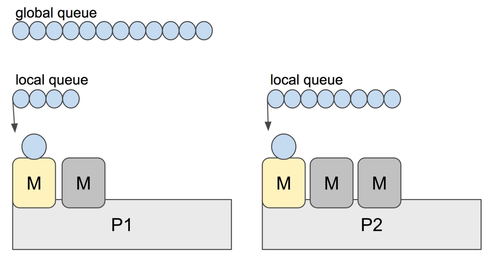

# 数组和切片
## 异同
slice 的底层数据是数组，slice 是对数组的封装，它描述一个数组的片段。两者都可以通过下标来访问单个元素。

slice 的数据结构如下：


**注意**，底层数组是可以被多个 slice 同时指向的，因此对一个 slice 的元素进行操作是有可能影响到其他 slice 的。

**注意**[3]int 和 [4]int 是同一个类型吗？

不是。因为数组的长度是类型的一部分，这是与 slice 不同的一点。

## 切片容量增长
一般都是在向 slice 追加了元素之后，才会引起扩容。追加元素调用的是 append 函数。
先来看看 append 函数的原型：
>func append(slice []Type, elems ...Type) []Type

append 函数的参数长度可变，因此可以追加多个值到 slice 中，还可以用 ... 传入 slice，直接追加一个切片。
```go
slice = append(slice, elem1, elem2)
slice = append(slice, anotherSlice...)
```
使用 append 可以向 slice 追加元素，如果底层数组容量不足就会转移到新的数组。
新 slice 预留的 buffer 大小是有一定规律的。在golang1.18版本更新之前网上大多数的文章都是这样描述slice的扩容策略的：

当原 slice 容量小于 1024 的时候，新 slice 容量变成原来的 2 倍；原 slice 容量超过 1024，新 slice 容量变成原来的1.25倍。

在1.18版本更新之后，slice的扩容策略变为了：

当原slice容量(oldcap)小于256的时候，新slice(newcap)容量为原来的2倍；原slice容量超过256，新slice容量newcap = oldcap+(oldcap+3*256)/4


**注意**向一个nil的slice添加元素会发生什么？为什么？

其实 nil slice 或者 empty slice 都是可以通过调用 append 函数来获得底层数组的扩容。最终都是调用 mallocgc 来向 Go 的内存管理器申请到一块内存，然后再赋给原来的nil slice 或 empty slice，然后摇身一变，成为“真正”的 slice 了。

## 切片作为参数

# 哈希表
## map实现原理
### map 的底层如何实现
go 语言采用的是哈希查找表，并且使用链表解决哈希冲突。
```go
// A header for a Go map.
type hmap struct {
    // 元素个数，调用 len(map) 时，直接返回此值
	count     int
	flags     uint8
	// buckets 的对数 log_2
	B         uint8
	// overflow 的 bucket 近似数
	noverflow uint16
	// 计算 key 的哈希的时候会传入哈希函数
	hash0     uint32
    // 指向 buckets 数组，大小为 2^B
    // 如果元素个数为0，就为 nil
	buckets    unsafe.Pointer
	// 等量扩容的时候，buckets 长度和 oldbuckets 相等
	// 双倍扩容的时候，buckets 长度会是 oldbuckets 的两倍
	oldbuckets unsafe.Pointer
	// 指示扩容进度，小于此地址的 buckets 迁移完成
	nevacuate  uintptr
	extra *mapextra // optional fields
}
```
说明一下，B 是 buckets 数组的长度的对数，也就是说 buckets 数组的长度就是 2^B。bucket 里面存储了 key 和 value，后面会再讲。
buckets 是一个指针，最终它指向的是一个结构体：
```go
type bmap struct {
	tophash [bucketCnt]uint8
}
```
但这只是表面(src/runtime/hashmap.go)的结构，编译期间会给它加料，动态地创建一个新的结构：
```go
type bmap struct {
    topbits  [8]uint8
    keys     [8]keytype
    values   [8]valuetype
    pad      uintptr
    overflow uintptr
}
```
bmap 就是我们常说的“桶”，桶里面会最多装 8 个 key，这些 key 之所以会落入同一个桶，是因为它们经过哈希计算后，哈希结果是“一类”的。在桶内，又会根据 key 计算出来的 hash 值的高 8 位来决定 key 到底落入桶内的哪个位置（一个桶内最多有8个位置）。
来一个整体的图：


当 map 的 key 和 value 都不是指针，并且 size 都小于 128 字节的情况下，会把 bmap 标记为不含指针，这样可以避免 gc 时扫描整个 hmap。但是，我们看 bmap 其实有一个 overflow 的字段，是指针类型的，破坏了 bmap 不含指针的设想，这时会把 overflow 移动到 extra 字段来。
```go
type mapextra struct {
	// overflow[0] contains overflow buckets for hmap.buckets.
	// overflow[1] contains overflow buckets for hmap.oldbuckets.
	overflow [2]*[]*bmap

	// nextOverflow 包含空闲的 overflow bucket，这是预分配的 bucket
	nextOverflow *bmap
}
```

bmap 是存放 k-v 的地方，我们把视角拉近，仔细看 bmap 的内部组成

### 创建 map 
通过汇编语言可以看到，实际上底层调用的是 makemap 函数，主要做的工作就是初始化 hmap 结构体的各种字段，例如计算 B 的大小，设置哈希种子 hash0 等等。
```go
func makemap(t *maptype, hint int64, h *hmap, bucket unsafe.Pointer) *hmap {
	// 省略各种条件检查...

	// 找到一个 B，使得 map 的装载因子在正常范围内
	B := uint8(0)
	for ; overLoadFactor(hint, B); B++ {
	}

	// 初始化 hash table
	// 如果 B 等于 0，那么 buckets 就会在赋值的时候再分配
	// 如果长度比较大，分配内存会花费长一点
	buckets := bucket
	var extra *mapextra
	if B != 0 {
		var nextOverflow *bmap
		buckets, nextOverflow = makeBucketArray(t, B)
		if nextOverflow != nil {
			extra = new(mapextra)
			extra.nextOverflow = nextOverflow
		}
	}

	// 初始化 hamp
	if h == nil {
		h = (*hmap)(newobject(t.hmap))
	}
	h.count = 0
	h.B = B
	h.extra = extra
	h.flags = 0
	h.hash0 = fastrand()
	h.buckets = buckets
	h.oldbuckets = nil
	h.nevacuate = 0
	h.noverflow = 0

	return h
}
```
### slice 和 map 分别作为函数参数时有什么区别
注意，这个函数返回的结果：*hmap，它是一个指针，而我们之前讲过的 makeslice 函数返回的是 Slice 结构体：
```go
// runtime/slice.go
type slice struct {
    array unsafe.Pointer // 元素指针
    len   int // 长度 
    cap   int // 容量
}
```
### 哈希函数
map 的一个关键点在于，哈希函数的选择。在程序启动时，会检测 cpu 是否支持 aes，如果支持，则使用 aes hash，否则使用 memhash。这是在函数 alginit() 中完成，位于路径：src/runtime/alg.go 下。

### key 定位过程
key 经过哈希计算后得到哈希值，共 64 个 bit 位，计算它到底要落在哪个桶时，只会用到最后 B 个 bit 位。如果 B = 5，那么桶的数量，也就是 buckets 数组的长度是 2^5 = 32。

例如，现在有一个 key 经过哈希函数计算后，得到的哈希结果是：

用最后的 5 个 bit 位，也就是 01010，值为 10，也就是 10 号桶。这个操作实际上就是取余操作，但是取余开销太大，所以代码实现上用的位操作代替。

再用哈希值的高 8 位，找到此 key 在 bucket 中的位置，这是在寻找已有的 key。最开始桶内还没有 key，新加入的 key 会找到第一个空位，放入。

buckets 编号就是桶编号，当两个不同的 key 落在同一个桶中，也就是发生了哈希冲突。冲突的解决手段是用链表法：在 bucket 中，从前往后找到第一个空位。这样，在查找某个 key 时，先找到对应的桶，再去遍历 bucket 中的 key。


如果在 bucket 中没找到，并且 overflow 不为空，还要继续去 overflow bucket 中寻找，直到找到或是所有的 key 槽位都找遍了，包括所有的 overflow bucket。

我们来看下源码吧，哈哈！通过汇编语言可以看到，查找某个 key 的底层函数是 mapacess 系列函数，函数的作用类似，区别在下一节会讲到。这里我们直接看 mapacess1 函数：
```go
func mapaccess1(t *maptype, h *hmap, key unsafe.Pointer) unsafe.Pointer {
	// ……
	
	// 如果 h 什么都没有，返回零值
	if h == nil || h.count == 0 {
		return unsafe.Pointer(&zeroVal[0])
	}
	
	// 写和读冲突
	if h.flags&hashWriting != 0 {
		throw("concurrent map read and map write")
	}
	
	// 不同类型 key 使用的 hash 算法在编译期确定
	alg := t.key.alg
	
	// 计算哈希值，并且加入 hash0 引入随机性
	hash := alg.hash(key, uintptr(h.hash0))
	
	// 比如 B=5，那 m 就是31，二进制是全 1
	// 求 bucket num 时，将 hash 与 m 相与，
	// 达到 bucket num 由 hash 的低 8 位决定的效果
	m := uintptr(1)<<h.B - 1
	
	// b 就是 bucket 的地址
	b := (*bmap)(add(h.buckets, (hash&m)*uintptr(t.bucketsize)))
	
	// oldbuckets 不为 nil，说明发生了扩容
	if c := h.oldbuckets; c != nil {
	    // 如果不是同 size 扩容（看后面扩容的内容）
	    // 对应条件 1 的解决方案
		if !h.sameSizeGrow() {
			// 新 bucket 数量是老的 2 倍
			m >>= 1
		}
		
		// 求出 key 在老的 map 中的 bucket 位置
		oldb := (*bmap)(add(c, (hash&m)*uintptr(t.bucketsize)))
		
		// 如果 oldb 没有搬迁到新的 bucket
		// 那就在老的 bucket 中寻找
		if !evacuated(oldb) {
			b = oldb
		}
	}
	
	// 计算出高 8 位的 hash
	// 相当于右移 56 位，只取高8位
	top := uint8(hash >> (sys.PtrSize*8 - 8))
	
	// 增加一个 minTopHash
	if top < minTopHash {
		top += minTopHash
	}
	for {
	    // 遍历 bucket 的 8 个位置
		for i := uintptr(0); i < bucketCnt; i++ {
		    // tophash 不匹配，继续
			if b.tophash[i] != top {
				continue
			}
			// tophash 匹配，定位到 key 的位置
			k := add(unsafe.Pointer(b), dataOffset+i*uintptr(t.keysize))
			// key 是指针
			if t.indirectkey {
			    // 解引用
				k = *((*unsafe.Pointer)(k))
			}
			// 如果 key 相等
			if alg.equal(key, k) {
			    // 定位到 value 的位置
				v := add(unsafe.Pointer(b), dataOffset+bucketCnt*uintptr(t.keysize)+i*uintptr(t.valuesize))
				// value 解引用
				if t.indirectvalue {
					v = *((*unsafe.Pointer)(v))
				}
				return v
			}
		}
		
		// bucket 找完（还没找到），继续到 overflow bucket 里找
		b = b.overflow(t)
		// overflow bucket 也找完了，说明没有目标 key
		// 返回零值
		if b == nil {
			return unsafe.Pointer(&zeroVal[0])
		}
	}
}
```

## 实现两种get操作
Go 语言中读取 map 有两种语法：带 comma 和 不带 comma。当要查询的 key 不在 map 里，带 comma 的用法会返回一个 bool 型变量提示 key 是否在 map 中；而不带 comma 的语句则会返回一个 key 对应 value 类型的零值。如果 value 是 int 型就会返回 0，如果 value 是 string 类型，就会返回空字符串。
```go
package main

import "fmt"

func main() {
	ageMap := make(map[string]int)
	ageMap["qcrao"] = 18

    // 不带 comma 用法
	age1 := ageMap["stefno"]
	fmt.Println(age1)

    // 带 comma 用法
	age2, ok := ageMap["stefno"]
	fmt.Println(age2, ok)
}
```
运行结果
```shell
0
0 false

```

## 遍历过程
本来 map 的遍历过程比较简单：遍历所有的 bucket 以及它后面挂的 overflow bucket，然后挨个遍历 bucket 中的所有 cell。每个 bucket 中包含 8 个 cell，从有 key 的 cell 中取出 key 和 value，这个过程就完成了。

但是，现实并没有这么简单。还记得前面讲过的扩容过程吗？扩容过程不是一个原子的操作，它每次最多只搬运 2 个 bucket，所以如果触发了扩容操作，那么在很长时间里，map 的状态都是处于一个中间态：有些 bucket 已经搬迁到新家，而有些 bucket 还待在老地方。

因此，遍历如果发生在扩容的过程中，就会涉及到遍历新老 bucket 的过程，这是难点所在。

```go
package main

import "fmt"

func main() {
	ageMp := make(map[string]int)
	ageMp["qcrao"] = 18

	for name, age := range ageMp {
		fmt.Println(name, age)
	}
}
```

执行命令：
>go tool compile -S main.go
得到汇编命令。这里就不逐行讲解了，可以去看之前的几篇文章，说得很详细。

关键的几行汇编代码如下：
```shell
// ......
0x0124 00292 (test16.go:9)      CALL    runtime.mapiterinit(SB)

// ......
0x01fb 00507 (test16.go:9)      CALL    runtime.mapiternext(SB)
0x0200 00512 (test16.go:9)      MOVQ    ""..autotmp_4+160(SP), AX
0x0208 00520 (test16.go:9)      TESTQ   AX, AX
0x020b 00523 (test16.go:9)      JNE     302

// ......
```

这样，关于 map 迭代，底层的函数调用关系一目了然。先是调用 mapiterinit 函数初始化迭代器，然后循环调用 mapiternext 函数进行 map 迭代。


迭代器的结构体定义：
```go
type hiter struct {
	// key 指针
	key         unsafe.Pointer
	// value 指针
	value       unsafe.Pointer
	// map 类型，包含如 key size 大小等
	t           *maptype
	// map header
	h           *hmap
	// 初始化时指向的 bucket
	buckets     unsafe.Pointer
	// 当前遍历到的 bmap
	bptr        *bmap
	overflow    [2]*[]*bmap
	// 起始遍历的 bucket 编号
	startBucket uintptr
	// 遍历开始时 cell 的编号（每个 bucket 中有 8 个 cell）
	offset      uint8
	// 是否从头遍历了
	wrapped     bool
	// B 的大小
	B           uint8
	// 指示当前 cell 序号
	i           uint8
	// 指向当前的 bucket
	bucket      uintptr
	// 因为扩容，需要检查的 bucket
	checkBucket uintptr
}
```
前面已经提到过，即使是对一个写死的 map 进行遍历，每次出来的结果也是无序的。下面我们就可以近距离地观察他们的实现了
```go
// 生成随机数 r
r := uintptr(fastrand())
if h.B > 31-bucketCntBits {
	r += uintptr(fastrand()) << 31
}

// 从哪个 bucket 开始遍历
it.startBucket = r & (uintptr(1)<<h.B - 1)
// 从 bucket 的哪个 cell 开始遍历
it.offset = uint8(r >> h.B & (bucketCnt - 1))
```

例如，B = 2，那 `uintptr(1)<<h.B - 1` 结果就是 3，低 8 位为 0000 0011，将 r 与之相与，就可以得到一个 0~3 的 bucket 序号；bucketCnt - 1 等于 7，低 8 位为 0000 0111，将 r 右移 2 位后，与 7 相与，就可以得到一个 0~7 号的 cell。

于是，在 mapiternext 函数中就会从 it.startBucket 的 it.offset 号的 cell 开始遍历，取出其中的 key 和 value，直到又回到起点 bucket，完成遍历过程。

假设我们有下图所示的一个 map，起始时 B = 1，有两个 bucket，后来触发了扩容，B 变成 2。并且， 1 号 bucket 中的内容搬迁到了新的 bucket，1 号裂变成 1 号和 3 号；0 号 bucket 暂未搬迁。老的 bucket 挂在在 *oldbuckets 指针上面，新的 bucket 则挂在 *buckets 指针上面。


这时，我们对此 map 进行遍历。假设经过初始化后，startBucket = 3，offset = 2。于是，遍历的起点将是 3 号 bucket 的 2 号 cell，下面这张图就是开始遍历时的状态：


标红的表示起始位置，bucket 遍历顺序为：3 -> 0 -> 1 -> 2。

因为 3 号 bucket 对应老的 1 号 bucket，因此先检查老 1 号 bucket 是否已经被搬迁过。判断方法就是：
```go
func evacuated(b *bmap) bool {
	h := b.tophash[0]
	return h > empty && h < minTopHash
}
```
如果 b.tophash[0] 的值在标志值范围内，即在 (0,4) 区间里，说明已经被搬迁过了。
```go
empty = 0
evacuatedEmpty = 1
evacuatedX = 2
evacuatedY = 3
minTopHash = 4
```
在本例中，老 1 号 bucket 已经被搬迁过了。所以它的 tophash[0] 值在 (0,4) 范围内，因此只用遍历新的 3 号 bucket。

依次遍历 3 号 bucket 的 cell，这时候会找到第一个非空的 key：元素 e。到这里，mapiternext 函数返回，这时我们的遍历结果仅有一个元素：

由于返回的 key 不为空，所以会继续调用 mapiternext 函数。

继续从上次遍历到的地方往后遍历，从新 3 号 overflow bucket 中找到了元素 f 和 元素 g。

遍历结果集也因此壮大：

并没有这么简单，回忆一下，老 0 号 bucket 在搬迁后将裂变成 2 个 bucket：新 0 号、新 2 号。而我们此时正在遍历的只是新 0 号 bucket。所以，我们只会取出老 0 号 bucket 中那些在裂变之后，分配到新 0 号 bucket 中的那些 key。
因此，lowbits == 00 的将进入遍历结果集：

和之前的流程一样，继续遍历新 1 号 bucket，发现老 1 号 bucket 已经搬迁，只用遍历新 1 号 bucket 中现有的元素就可以了。结果集变成：

继续遍历新 2 号 bucket，它来自老 0 号 bucket，因此需要在老 0 号 bucket 中那些会裂变到新 2 号 bucket 中的 key，也就是 lowbit == 10 的那些 key。

这样，遍历结果集变成：

map 遍历的核心在于理解 2 倍扩容时，老 bucket 会分裂到 2 个新 bucket 中去。而遍历操作，会按照新 bucket 的序号顺序进行，碰到老 bucket 未搬迁的情况时，要在老 bucket 中找到将来要搬迁到新 bucket 来的 key。


## 赋值

实际上插入或修改 key 的语法是一样的，只不过前者操作的 key 在 map 中不存在，而后者操作的 key 存在 map 中。
mapassign 有一个系列的函数，根据 key 类型的不同，编译器会将其优化为相应的“快速函数”。
|key类型|	插入|
|-------------|--------|-
|uint32|	mapassign_fast32(t *maptype, h *hmap, key uint32) unsafe.Pointer|
|uint64|	mapassign_fast64(t *maptype, h *hmap, key uint64) unsafe.Pointer|
|string|	mapassign_faststr(t *maptype, h *hmap, ky string) unsafe.Pointer|

我们只用研究最一般的赋值函数 mapassign。
整体来看，流程非常得简单：对 key 计算 hash 值，根据 hash 值按照之前的流程，找到要赋值的位置，对相应位置进行赋值。

源码大体和之前讲的类似，核心还是一个双层循环，外层遍历 bucket 和它的 overflow bucket，内层遍历整个 bucket 的各个 cell。

我这里会针对这个过程提几点重要的。

函数首先会检查 map 的标志位 flags。如果 flags 的写标志位此时被置 1 了，说明有其他协程在执行“写”操作，进而导致程序 panic。这也说明了 map 对**协程是不安全**的。

通过前文我们知道扩容是渐进式的，如果 map 处在扩容的过程中，那么当 key 定位到了某个 bucket 后，需要确保这个 bucket 对应的老 bucket 完成了迁移过程。即老 bucket 里的 key 都要迁移到新的 bucket 中来，才能在新的 bucket 中进行插入或者更新的操作。

上面说的操作是在函数靠前的位置进行的，只有进行完了这个搬迁操作后，我们才能放心地在新 bucket 里定位 key 要安置的地址，再进行之后的操作。

现在到了定位 key 应该放置的位置了，所谓找准自己的位置很重要。准备两个指针，一个（inserti）指向 key 的 hash 值在 tophash 数组所处的位置，另一个(insertk)指向 cell 的位置（也就是 key 最终放置的地址），当然，对应 value 的位置就很容易定位出来了。这三者实际上都是关联的，在 tophash 数组中的索引位置决定了 key 在整个 bucket 中的位置（共 8 个 key），而 value 的位置需要“跨过” 8 个 key 的长度。

在循环的过程中，inserti 和 insertk 分别指向第一个找到的空闲的 cell。如果之后在 map 没有找到 key 的存在，也就是说原来 map 中没有此 key，这意味着插入新 key。那最终 key 的安置地址就是第一次发现的“空位”（tophash 是 empty）。

如果这个 bucket 的 8 个 key 都已经放置满了，那在跳出循环后，发现 inserti 和 insertk 都是空，这时候需要在 bucket 后面挂上 overflow bucket。当然，也有可能是在 overflow bucket 后面再挂上一个 overflow bucket。这就说明，太多 key hash 到了此 bucket。

在正式安置 key 之前，还要检查 map 的状态，看它是否需要进行扩容。如果满足扩容的条件，就主动触发一次扩容操作。

这之后，整个之前的查找定位 key 的过程，还得再重新走一次。因为扩容之后，key 的分布都发生了变化。

>func mapassign(t *maptype, h *hmap, key unsafe.Pointer) unsafe.Pointer


## 删除
写操作底层的执行函数是 mapdelete：
>func mapdelete(t *maptype, h *hmap, key unsafe.Pointer) 
根据 key 类型的不同，删除操作会被优化成更具体的函数：
|key 类型|	删除|
|------|-------|
|uint32|	mapdelete_fast32(t *maptype, h *hmap, key uint32)|
|uint64	|mapdelete_fast64(t *maptype, h *hmap, key uint64)|
|string|	mapdelete_faststr(t *maptype, h *hmap, ky string)|

当然，我们只关心 mapdelete 函数。它首先会检查 h.flags 标志，如果发现写标位是 1，直接 panic，因为这表明有其他协程同时在进行写操作。

计算 key 的哈希，找到落入的 bucket。检查此 map 如果正在扩容的过程中，直接触发一次搬迁操作。

删除操作同样是两层循环，核心还是找到 key 的具体位置。寻找过程都是类似的，在 bucket 中挨个 cell 寻找。

找到对应位置后，对 key 或者 value 进行“清零”操作：
```go
// 对 key 清零
if t.indirectkey {
	*(*unsafe.Pointer)(k) = nil
} else {
	typedmemclr(t.key, k)
}

// 对 value 清零
if t.indirectvalue {
	*(*unsafe.Pointer)(v) = nil
} else {
	typedmemclr(t.elem, v)
}
```
最后，将 count 值减 1，将对应位置的 tophash 值置成 Empty。

## 扩容

使用哈希表的目的就是要快速查找到目标 key，然而，随着向 map 中添加的 key 越来越多，key 发生碰撞的概率也越来越大。bucket 中的 8 个 cell 会被逐渐塞满，查找、插入、删除 key 的效率也会越来越低。最理想的情况是一个 bucket 只装一个 key，这样，就能达到 O(1) 的效率，但这样空间消耗太大，用空间换时间的代价太高。

Go 语言采用一个 bucket 里装载 8 个 key，定位到某个 bucket 后，还需要再定位到具体的 key，这实际上又用了时间换空间。

当然，这样做，要有一个度，不然所有的 key 都落在了同一个 bucket 里，直接退化成了链表，各种操作的效率直接降为 O(n)，是不行的。

因此，需要有一个指标来衡量前面描述的情况，这就是装载因子。Go 源码里这样定义 装载因子：
>loadFactor := count / (2^B)

count 就是 map 的元素个数，2^B 表示 bucket 数量。

再来说触发 map 扩容的时机：在向 map 插入新 key 的时候，会进行条件检测，符合下面这 2 个条件，就会触发扩容：
- 装载因子超过阈值，源码里定义的阈值是 6.5。
- overflow 的 bucket 数量过多：当 B 小于 15，也就是 bucket 总数 2^B 小于 2^15 时，如果 overflow 的 bucket 数量超过 2^B；当 B >= 15，也就是 bucket 总数 2^B 大于等于 2^15，如果 overflow 的 bucket 数量超过 2^15。

通过汇编语言可以找到赋值操作对应源码中的函数是 mapassign，对应扩容条件的源码如下：
```go
// src/runtime/hashmap.go/mapassign

// 触发扩容时机
if !h.growing() && (overLoadFactor(int64(h.count), h.B) || tooManyOverflowBuckets(h.noverflow, h.B)) {
		hashGrow(t, h)
	}

// 装载因子超过 6.5
func overLoadFactor(count int64, B uint8) bool {
	return count >= bucketCnt && float32(count) >= loadFactor*float32((uint64(1)<<B))
}

// overflow buckets 太多
func tooManyOverflowBuckets(noverflow uint16, B uint8) bool {
	if B < 16 {
		return noverflow >= uint16(1)<<B
	}
	return noverflow >= 1<<15
}
```
- 第 1 点：我们知道，每个 bucket 有 8 个空位，在没有溢出，且所有的桶都装满了的情况下，装载因子算出来的结果是 8。因此当装载因子超过 6.5 时，表明很多 bucket 都快要装满了，查找效率和插入效率都变低了。在这个时候进行扩容是有必要的。
- 第 2 点：是对第 1 点的补充。就是说在装载因子比较小的情况下，这时候 map 的查找和插入效率也很低，而第 1 点识别不出来这种情况。表面现象就是计算装载因子的分子比较小，即 map 里元素总数少，但是 bucket 数量多（真实分配的 bucket 数量多，包括大量的 overflow bucket）。

不难想像造成这种情况的原因：不停地插入、删除元素。先插入很多元素，导致创建了很多 bucket，但是装载因子达不到第 1 点的临界值，未触发扩容来缓解这种情况。之后，删除元素降低元素总数量，再插入很多元素，导致创建很多的 overflow bucket，但就是不会触犯第 1 点的规定，你能拿我怎么办？overflow bucket 数量太多，导致 key 会很分散，查找插入效率低得吓人，因此出台第 2 点规定。这就像是一座空城，房子很多，但是住户很少，都分散了，找起人来很困难。

对于命中条件 1，2 的限制，都会发生扩容。但是扩容的策略并不相同，毕竟两种条件应对的场景不同。

对于条件 1，元素太多，而 bucket 数量太少，很简单：将 B 加 1，bucket 最大数量（2^B）直接变成原来 bucket 数量的 2 倍。于是，就有新老 bucket 了。注意，这时候元素都在老 bucket 里，还没迁移到新的 bucket 来。而且，新 bucket 只是最大数量变为原来最大数量（2^B）的 2 倍（2^B * 2）。

对于条件 2，其实元素没那么多，但是 overflow bucket 数特别多，说明很多 bucket 都没装满。解决办法就是开辟一个新 bucket 空间，将老 bucket 中的元素移动到新 bucket，使得同一个 bucket 中的 key 排列地更紧密。这样，原来，在 overflow bucket 中的 key 可以移动到 bucket 中来。结果是节省空间，提高 bucket 利用率，map 的查找和插入效率自然就会提升。

对于条件 2 的解决方案，曹大的博客里还提出了一个极端的情况：如果插入 map 的 key 哈希都一样，就会落到同一个 bucket 里，超过 8 个就会产生 overflow bucket，结果也会造成 overflow bucket 数过多。移动元素其实解决不了问题，因为这时整个哈希表已经退化成了一个链表，操作效率变成了 O(n)。

再来看一下扩容具体是怎么做的。由于 map 扩容需要将原有的 key/value 重新搬迁到新的内存地址，如果有大量的 key/value 需要搬迁，会非常影响性能。因此 Go map 的扩容采取了一种称为“渐进式”地方式，原有的 key 并不会一次性搬迁完毕，每次最多只会搬迁 2 个 bucket。

上面说的 hashGrow() 函数实际上并没有真正地“搬迁”，它只是分配好了新的 buckets，并将老的 buckets 挂到了 oldbuckets 字段上。真正搬迁 buckets 的动作在 growWork() 函数中，而调用 growWork() 函数的动作是在 mapassign 和 mapdelete 函数中。也就是插入或修改、删除 key 的时候，都会尝试进行搬迁 buckets 的工作。先检查 oldbuckets 是否搬迁完毕，具体来说就是检查 oldbuckets 是否为 nil。

我们先看 hashGrow() 函数所做的工作，再来看具体的搬迁 buckets 是如何进行的。
```go
func hashGrow(t *maptype, h *hmap) {
	// B+1 相当于是原来 2 倍的空间
	bigger := uint8(1)

	// 对应条件 2
	if !overLoadFactor(int64(h.count), h.B) {
		// 进行等量的内存扩容，所以 B 不变
		bigger = 0
		h.flags |= sameSizeGrow
	}
	// 将老 buckets 挂到 buckets 上
	oldbuckets := h.buckets
	// 申请新的 buckets 空间
	newbuckets, nextOverflow := makeBucketArray(t, h.B+bigger)

	flags := h.flags &^ (iterator | oldIterator)
	if h.flags&iterator != 0 {
		flags |= oldIterator
	}
	// 提交 grow 的动作
	h.B += bigger
	h.flags = flags
	h.oldbuckets = oldbuckets
	h.buckets = newbuckets
	// 搬迁进度为 0
	h.nevacuate = 0
	// overflow buckets 数为 0
	h.noverflow = 0

	// ……
}
```
主要是申请到了新的 buckets 空间，把相关的标志位都进行了处理：例如标志 nevacuate 被置为 0， 表示当前搬迁进度为 0。

值得一说的是对 h.flags 的处理：
```go

flags := h.flags &^ (iterator | oldIterator)
if h.flags&iterator != 0 {
	flags |= oldIterator
}
```
这里得先说下运算符：&^。这叫按位置 0运算符。例如：
```shell
x = 01010011
y = 01010100
z = x &^ y = 00000011
```
如果 y bit 位为 1，那么结果 z 对应 bit 位就为 0，否则 z 对应 bit 位就和 x 对应 bit 位的值相同。

所以上面那段对 flags 一顿操作的代码的意思是：先把 h.flags 中 iterator 和 oldIterator 对应位清 0，然后如果发现 iterator 位为 1，那就把它转接到 oldIterator 位，使得 oldIterator 标志位变成 1。潜台词就是：buckets 现在挂到了 oldBuckets 名下了，对应的标志位也转接过去吧。

几个标志位如下：
```go
// 可能有迭代器使用 buckets
iterator     = 1
// 可能有迭代器使用 oldbuckets
oldIterator  = 2
// 有协程正在向 map 中写入 key
hashWriting  = 4
// 等量扩容（对应条件 2）
sameSizeGrow = 8
```
再来看看真正执行搬迁工作的 growWork() 函数。
```go

func growWork(t *maptype, h *hmap, bucket uintptr) {
	// 确认搬迁老的 bucket 对应正在使用的 bucket
	evacuate(t, h, bucket&h.oldbucketmask())

	// 再搬迁一个 bucket，以加快搬迁进程
	if h.growing() {
		evacuate(t, h, h.nevacuate)
	}
}
h.growing() 函数非常简单：


func (h *hmap) growing() bool {
	return h.oldbuckets != nil
}
```
如果 oldbuckets 不为空，说明还没有搬迁完毕，还得继续搬。

bucket&h.oldbucketmask() 这行代码，如源码注释里说的，是为了确认搬迁的 bucket 是我们正在使用的 bucket。oldbucketmask() 函数返回扩容前的 map 的 bucketmask。

所谓的 bucketmask，作用就是将 key 计算出来的哈希值与 bucketmask 相与，得到的结果就是 key 应该落入的桶。比如 B = 5，那么 bucketmask 的低 5 位是 11111，其余位是 0，hash 值与其相与的意思是，只有 hash 值的低 5 位决策 key 到底落入哪个 bucket。

接下来，我们集中所有的精力在搬迁的关键函数 evacuate。源码贴在下面，不要紧张，我会加上大面积的注释，通过注释绝对是能看懂的。之后，我会再对搬迁过程作详细说明。

源码如下：
```go
func evacuate(t *maptype, h *hmap, oldbucket uintptr) {
	// 定位老的 bucket 地址
	b := (*bmap)(add(h.oldbuckets, oldbucket*uintptr(t.bucketsize)))
	// 结果是 2^B，如 B = 5，结果为32
	newbit := h.noldbuckets()
	// key 的哈希函数
	alg := t.key.alg
	// 如果 b 没有被搬迁过
	if !evacuated(b) {
		var (
			// 表示bucket 移动的目标地址
			x, y   *bmap
			// 指向 x,y 中的 key/val
			xi, yi int
			// 指向 x，y 中的 key
			xk, yk unsafe.Pointer
			// 指向 x，y 中的 value
			xv, yv unsafe.Pointer
		)
		// 默认是等 size 扩容，前后 bucket 序号不变
		// 使用 x 来进行搬迁
		x = (*bmap)(add(h.buckets, oldbucket*uintptr(t.bucketsize)))
		xi = 0
		xk = add(unsafe.Pointer(x), dataOffset)
		xv = add(xk, bucketCnt*uintptr(t.keysize))、

		// 如果不是等 size 扩容，前后 bucket 序号有变
		// 使用 y 来进行搬迁
		if !h.sameSizeGrow() {
			// y 代表的 bucket 序号增加了 2^B
			y = (*bmap)(add(h.buckets, (oldbucket+newbit)*uintptr(t.bucketsize)))
			yi = 0
			yk = add(unsafe.Pointer(y), dataOffset)
			yv = add(yk, bucketCnt*uintptr(t.keysize))
		}

		// 遍历所有的 bucket，包括 overflow buckets
		// b 是老的 bucket 地址
		for ; b != nil; b = b.overflow(t) {
			k := add(unsafe.Pointer(b), dataOffset)
			v := add(k, bucketCnt*uintptr(t.keysize))

			// 遍历 bucket 中的所有 cell
			for i := 0; i < bucketCnt; i, k, v = i+1, add(k, uintptr(t.keysize)), add(v, uintptr(t.valuesize)) {
				// 当前 cell 的 top hash 值
				top := b.tophash[i]
				// 如果 cell 为空，即没有 key
				if top == empty {
					// 那就标志它被"搬迁"过
					b.tophash[i] = evacuatedEmpty
					// 继续下个 cell
					continue
				}
				// 正常不会出现这种情况
				// 未被搬迁的 cell 只可能是 empty 或是
				// 正常的 top hash（大于 minTopHash）
				if top < minTopHash {
					throw("bad map state")
				}

				k2 := k
				// 如果 key 是指针，则解引用
				if t.indirectkey {
					k2 = *((*unsafe.Pointer)(k2))
				}

				// 默认使用 X，等量扩容
				useX := true
				// 如果不是等量扩容
				if !h.sameSizeGrow() {
					// 计算 hash 值，和 key 第一次写入时一样
					hash := alg.hash(k2, uintptr(h.hash0))

					// 如果有协程正在遍历 map
					if h.flags&iterator != 0 {
						// 如果出现 相同的 key 值，算出来的 hash 值不同
						if !t.reflexivekey && !alg.equal(k2, k2) {
							// 只有在 float 变量的 NaN() 情况下会出现
							if top&1 != 0 {
								// 第 B 位置 1
								hash |= newbit
							} else {
								// 第 B 位置 0
								hash &^= newbit
							}
							// 取高 8 位作为 top hash 值
							top = uint8(hash >> (sys.PtrSize*8 - 8))
							if top < minTopHash {
								top += minTopHash
							}
						}
					}

					// 取决于新哈希值的 oldB+1 位是 0 还是 1
					// 详细看后面的文章
					useX = hash&newbit == 0
				}

				// 如果 key 搬到 X 部分
				if useX {
					// 标志老的 cell 的 top hash 值，表示搬移到 X 部分
					b.tophash[i] = evacuatedX
					// 如果 xi 等于 8，说明要溢出了
					if xi == bucketCnt {
						// 新建一个 bucket
						newx := h.newoverflow(t, x)
						x = newx
						// xi 从 0 开始计数
						xi = 0
						// xk 表示 key 要移动到的位置
						xk = add(unsafe.Pointer(x), dataOffset)
						// xv 表示 value 要移动到的位置
						xv = add(xk, bucketCnt*uintptr(t.keysize))
					}
					// 设置 top hash 值
					x.tophash[xi] = top
					// key 是指针
					if t.indirectkey {
						// 将原 key（是指针）复制到新位置
						*(*unsafe.Pointer)(xk) = k2 // copy pointer
					} else {
						// 将原 key（是值）复制到新位置
						typedmemmove(t.key, xk, k) // copy value
					}
					// value 是指针，操作同 key
					if t.indirectvalue {
						*(*unsafe.Pointer)(xv) = *(*unsafe.Pointer)(v)
					} else {
						typedmemmove(t.elem, xv, v)
					}

					// 定位到下一个 cell
					xi++
					xk = add(xk, uintptr(t.keysize))
					xv = add(xv, uintptr(t.valuesize))
				} else { // key 搬到 Y 部分，操作同 X 部分
					// ……
					// 省略了这部分，操作和 X 部分相同
				}
			}
		}
		// 如果没有协程在使用老的 buckets，就把老 buckets 清除掉，帮助gc
		if h.flags&oldIterator == 0 {
			b = (*bmap)(add(h.oldbuckets, oldbucket*uintptr(t.bucketsize)))
			// 只清除bucket 的 key,value 部分，保留 top hash 部分，指示搬迁状态
			if t.bucket.kind&kindNoPointers == 0 {
				memclrHasPointers(add(unsafe.Pointer(b), dataOffset), uintptr(t.bucketsize)-dataOffset)
			} else {
				memclrNoHeapPointers(add(unsafe.Pointer(b), dataOffset), uintptr(t.bucketsize)-dataOffset)
			}
		}
	}

	// 更新搬迁进度
	// 如果此次搬迁的 bucket 等于当前进度
	if oldbucket == h.nevacuate {
		// 进度加 1
		h.nevacuate = oldbucket + 1
		// Experiments suggest that 1024 is overkill by at least an order of magnitude.
		// Put it in there as a safeguard anyway, to ensure O(1) behavior.
		// 尝试往后看 1024 个 bucket
		stop := h.nevacuate + 1024
		if stop > newbit {
			stop = newbit
		}
		// 寻找没有搬迁的 bucket
		for h.nevacuate != stop && bucketEvacuated(t, h, h.nevacuate) {
			h.nevacuate++
		}
		
		// 现在 h.nevacuate 之前的 bucket 都被搬迁完毕
		
		// 所有的 buckets 搬迁完毕
		if h.nevacuate == newbit {
			// 清除老的 buckets
			h.oldbuckets = nil
			// 清除老的 overflow bucket
			// 回忆一下：[0] 表示当前 overflow bucket
			// [1] 表示 old overflow bucket
			if h.extra != nil {
				h.extra.overflow[1] = nil
			}
			// 清除正在扩容的标志位
			h.flags &^= sameSizeGrow
		}
	}
}
```

搬迁的目的就是将老的 buckets 搬迁到新的 buckets。而通过前面的说明我们知道，应对条件 1，新的 buckets 数量是之前的一倍，应对条件 2，新的 buckets 数量和之前相等。

对于条件 2，从老的 buckets 搬迁到新的 buckets，由于 bucktes 数量不变，因此可以按序号来搬，比如原来在 0 号 bucktes，到新的地方后，仍然放在 0 号 buckets。

对于条件 1，就没这么简单了。要重新计算 key 的哈希，才能决定它到底落在哪个 bucket。例如，原来 B = 5，计算出 key 的哈希后，只用看它的低 5 位，就能决定它落在哪个 bucket。扩容后，B 变成了 6，因此需要多看一位，它的低 6 位决定 key 落在哪个 bucket。这称为 rehash。


因此，某个 key 在搬迁前后 bucket 序号可能和原来相等，也可能是相比原来加上 2^B（原来的 B 值），取决于 hash 值 第 6 bit 位是 0 还是 1。

再明确一个问题：如果扩容后，B 增加了 1，意味着 buckets 总数是原来的 2 倍，原来 1 号的桶“裂变”到两个桶。

例如，原始 B = 2，1号 bucket 中有 2 个 key 的哈希值低 3 位分别为：010，110。由于原来 B = 2，所以低 2 位 10 决定它们落在 2 号桶，现在 B 变成 3，所以 010、110 分别落入 2、6 号桶。


再来讲搬迁函数中的几个关键点：

evacuate 函数每次只完成一个 bucket 的搬迁工作，因此要遍历完此 bucket 的所有的 cell，将有值的 cell copy 到新的地方。bucket 还会链接 overflow bucket，它们同样需要搬迁。因此会有 2 层循环，外层遍历 bucket 和 overflow bucket，内层遍历 bucket 的所有 cell。


有一个特殊情况是：有一种 key，每次对它计算 hash，得到的结果都不一样。这个 key 就是 math.NaN() 的结果，它的含义是 not a number，类型是 float64。当它作为 map 的 key，在搬迁的时候，会遇到一个问题：再次计算它的哈希值和它当初插入 map 时的计算出来的哈希值不一样！

你可能想到了，这样带来的一个后果是，这个 key 是永远不会被 Get 操作获取的！当我使用 m[math.NaN()] 语句的时候，是查不出来结果的。这个 key 只有在遍历整个 map 的时候，才有机会现身。所以，可以向一个 map 插入任意数量的 math.NaN() 作为 key。

当搬迁碰到 math.NaN() 的 key 时，只通过 tophash 的最低位决定分配到 X part 还是 Y part（如果扩容后是原来 buckets 数量的 2 倍）。如果 tophash 的最低位是 0 ，分配到 X part；如果是 1 ，则分配到 Y part。

这是通过 tophash 值与新算出来的哈希值进行运算得到的：
```go
if top&1 != 0 {
    // top hash 最低位为 1
    // 新算出来的 hash 值的 B 位置 1
	hash |= newbit
} else {
    // 新算出来的 hash 值的 B 位置 0
	hash &^= newbit
}

// hash 值的 B 位为 0，则搬迁到 x part
// 当 B = 5时，newbit = 32，二进制低 6 位为 10 0000
useX = hash&newbit == 0
```
其实这样的 key 我随便搬迁到哪个 bucket 都行，当然，还是要搬迁到上面裂变那张图中的两个 bucket 中去。但这样做是有好处的，在后面讲 map 迭代的时候会再详细解释，暂时知道是这样分配的就行。

确定了要搬迁到的目标 bucket 后，搬迁操作就比较好进行了。将源 key/value 值 copy 到目的地相应的位置。

设置 key 在原始 buckets 的 tophash 为 evacuatedX 或是 evacuatedY，表示已经搬迁到了新 map 的 x part 或是 y part。新 map 的 tophash 则正常取 key 哈希值的高 8 位。

下面通过图来宏观地看一下扩容前后的变化。

扩容前，B = 2，共有 4 个 buckets，lowbits 表示 hash 值的低位。假设我们不关注其他 buckets 情况，专注在 2 号 bucket。并且假设 overflow 太多，触发了等量扩容（对应于前面的条件 2）。


扩容完成后，overflow bucket 消失了，key 都集中到了一个 bucket，更为紧凑了，提高了查找的效率。


假设触发了 2 倍的扩容，那么扩容完成后，老 buckets 中的 key 分裂到了 2 个 新的 bucket。一个在 x part，一个在 y 的 part。依据是 hash 的 lowbits。新 map 中 0-3 称为 x part，4-7 称为 y part。


注意，上面的两张图忽略了其他 buckets 的搬迁情况，表示所有的 bucket 都搬迁完毕后的情形。实际上，我们知道，搬迁是一个“渐进”的过程，并不会一下子就全部搬迁完毕。所以在搬迁过程中，oldbuckets 指针还会指向原来老的 []bmap，并且已经搬迁完毕的 key 的 tophash 值会是一个状态值，表示 key 的搬迁去向。

## float可以作为map的key
float 型可以作为 key，但是由于精度的问题，会导致一些诡异的问题，慎用之。
## 可以遍历边删除
map 并不是一个线程安全的数据结构。同时读写一个 map 是未定义的行为，如果被检测到，会直接 panic。
## 可以对map的key和value进行取值吗
无法对 map 的 key 或 value 进行取址。
## 如何比较两个map相同
map 深度相等的条件：
1、都为 nil
2、非空、长度相等，指向同一个 map 实体对象

# 接口
## 值接收者和指针接收者的区别
||	值接收者|	指针接收者|
|--------|-------|-------|
|值类型调用者|	方法会使用调用者的一个副本，类似于“传值”|	使用值的引用来调用方法，上例中，qcrao.growUp() 实际上是 (&qcrao).growUp()|
指针类型调用者|	指针被解引用为值，上例中，stefno.howOld() 实际上是 (*stefno).howOld()|	实际上也是“传值”，方法里的操作会影响到调用者，类似于指针传参，拷贝了一份指针|

### 值接收者和指针接收者
先说结论：实现了接收者是值类型的方法，相当于自动实现了接收者是指针类型的方法；而实现了接收者是指针类型的方法，不会自动生成对应接收者是值类型的方法。
```go
package main

import "fmt"

type coder interface {
	code()
	debug()
}

type Gopher struct {
	language string
}

func (p Gopher) code() {
	fmt.Printf("I am coding %s language\n", p.language)
}

func (p *Gopher) debug() {
	fmt.Printf("I am debuging %s language\n", p.language)
}

func main() {
	var c coder = &Gopher{"Go"}
	c.code()
	c.debug()
}
```
上述代码里定义了一个接口 coder，接口定义了两个函数：
```go
code()
debug()
```
但是如果我们把 main 函数的第一条语句换一下：
```go
func main() {
	var c coder = Gopher{"Go"}
	c.code()
	c.debug()
}
```
报错
>如果实现了接收者是值类型的方法，会隐含地也实现了接收者是指针类型的方法。

### 两者分别在何时使用
如果方法的接收者是值类型，无论调用者是对象还是对象指针，修改的都是对象的副本，不影响调用者；如果方法的接收者是指针类型，则调用者修改的是指针指向的对象本身。

使用指针作为方法的接收者的理由：
- 方法能够修改接收者指向的值。
- 避免在每次调用方法时复制该值，在值的类型为大型结构体时，这样做会更加高效。

是使用值接收者还是指针接收者，不是由该方法是否修改了调用者（也就是接收者）来决定，而是应该基于该类型的本质。

## iface和eface的区别
iface 和 eface 都是 Go 中描述接口的底层结构体，区别在于 iface 描述的接口包含方法，而 eface 则是不包含任何方法的空接口：interface{}。
```go
type iface struct {
	tab  *itab
	data unsafe.Pointer
}

type itab struct {
	inter  *interfacetype
	_type  *_type
	link   *itab
	hash   uint32 // copy of _type.hash. Used for type switches.
	bad    bool   // type does not implement interface
	inhash bool   // has this itab been added to hash?
	unused [2]byte
	fun    [1]uintptr // variable sized
}
```
iface 内部维护两个指针，tab 指向一个 itab 实体， 它表示接口的类型以及赋给这个接口的实体类型。data 则指向接口具体的值，一般而言是一个指向堆内存的指针。

再来仔细看一下 itab 结构体：_type 字段描述了实体的类型，包括内存对齐方式，大小等；inter 字段则描述了接口的类型。fun 字段放置和接口方法对应的具体数据类型的方法地址，实现接口调用方法的动态分派，一般在每次给接口赋值发生转换时会更新此表，或者直接拿缓存的 itab。


另外，你可能会觉得奇怪，为什么 fun 数组的大小为 1，要是接口定义了多个方法可怎么办？实际上，这里存储的是第一个方法的函数指针，如果有更多的方法，在它之后的内存空间里继续存储。从汇编角度来看，通过增加地址就能获取到这些函数指针，没什么影响。顺便提一句，这些方法是按照函数名称的字典序进行排列的。

再看一下 interfacetype 类型，它描述的是接口的类型：
```go
type interfacetype struct {
	typ     _type
	pkgpath name
	mhdr    []imethod
}
```
可以看到，它包装了 _type 类型，_type 实际上是描述 Go 语言中各种数据类型的结构体。我们注意到，这里还包含一个 mhdr 字段，表示接口所定义的函数列表， pkgpath 记录定义了接口的包名。

```go
type eface struct {
    _type *_type
    data  unsafe.Pointer
}
```
相比 iface，eface 就比较简单了。只维护了一个 _type 字段，表示空接口所承载的具体的实体类型。data 描述了具体的值。

上面两个函数的参数和 iface 及 eface 结构体的字段是可以联系起来的：两个函数都是将参数组装一下，形成最终的接口。

作为补充，我们最后再来看下 _type 结构体：
```go
type _type struct {
    // 类型大小
	size       uintptr
    ptrdata    uintptr
    // 类型的 hash 值
    hash       uint32
    // 类型的 flag，和反射相关
    tflag      tflag
    // 内存对齐相关
    align      uint8
    fieldalign uint8
    // 类型的编号，有bool, slice, struct 等等等等
	kind       uint8
	alg        *typeAlg
	// gc 相关
	gcdata    *byte
	str       nameOff
	ptrToThis typeOff
}
```
Go 语言各种数据类型都是在 _type 字段的基础上，增加一些额外的字段来进行管理的：
```go
type arraytype struct {
	typ   _type
	elem  *_type
	slice *_type
	len   uintptr
}

type chantype struct {
	typ  _type
	elem *_type
	dir  uintptr
}

type slicetype struct {
	typ  _type
	elem *_type
}

type structtype struct {
	typ     _type
	pkgPath name
	fields  []structfield
}
```
### 接口动态内容和动态值
### 如何打印出接口的动态类型和值
```go
package main

import (
	"unsafe"
	"fmt"
)

type iface struct {
	itab, data uintptr
}

func main() {
	var a interface{} = nil

	var b interface{} = (*int)(nil)

	x := 5
	var c interface{} = (*int)(&x)
	
	ia := *(*iface)(unsafe.Pointer(&a))
	ib := *(*iface)(unsafe.Pointer(&b))
	ic := *(*iface)(unsafe.Pointer(&c))

	fmt.Println(ia, ib, ic)

	fmt.Println(*(*int)(unsafe.Pointer(ic.data)))
}
```
## 编译器检查是否实现接口
>var _ io.Writer = (*myWriter)(nil)

这时候会有点懵，不知道作者想要干什么，实际上这就是此问题的答案。编译器会由此检查 *myWriter 类型是否实现了 io.Writer 接口。

## 接口构造过程
## 类型转换和断言
### 类型转换
><结果类型> := <目标类型> ( <表达式> )

```go
package main

import "fmt"

func main() {
	var i int = 9

	var f float64
	f = float64(i)
	fmt.Printf("%T, %v\n", f, f)

	f = 10.8
	a := int(f)
	fmt.Printf("%T, %v\n", a, a)

	// s := []int(i)
}
```
### 断言 
前面说过，因为空接口 interface{} 没有定义任何函数，因此 Go 中所有类型都实现了空接口。当一个函数的形参是 interface{}，那么在函数中，需要对形参进行断言，从而得到它的真实类型。
断言的语法为：
```go
<目标类型的值>，<布尔参数> := <表达式>.( 目标类型 ) // 安全类型断言 <目标类型的值> := <表达式>.( 目标类型 )　　//非安全类型断言
```
```go
func main() {
	var i interface{} = new(Student)
	s, ok := i.(Student)
	if ok {
		fmt.Println(s)
	}
}
```
## 接口转换原理
通过前面提到的 iface 的源码可以看到，实际上它包含接口的类型 interfacetype 和 实体类型的类型 _type，这两者都是 iface 的字段 itab 的成员。也就是说生成一个 itab 同时需要接口的类型和实体的类型。
><interface 类型， 实体类型> ->itable


当判定一种类型是否满足某个接口时，Go 使用类型的方法集和接口所需要的方法集进行匹配，如果类型的方法集完全包含接口的方法集，则可认为该类型实现了该接口。

Go 会对方法集的函数按照函数名的字典序进行排序，所以实际的时间复杂度为 O(m+n)。

这里我们来探索将一个接口转换给另外一个接口背后的原理，当然，能转换的原因必然是类型兼容。
```go
package main

import "fmt"

type coder interface {
	code()
	run()
}

type runner interface {
	run()
}

type Gopher struct {
	language string
}

func (g Gopher) code() {
	return
}

func (g Gopher) run() {
	return
}

func main() {
	var c coder = Gopher{}

	var r runner
	r = c
	fmt.Println(c, r)
}
```


## interface实现的多态
多态是一种运行期的行为，它有以下几个特点：
1. 一种类型具有多种类型的能力
2. 允许不同的对象对同一消息做出灵活的反应
3. 以一种通用的方式对待个使用的对象
4. 非动态语言必须通过继承和接口的方式来实现


# 通道
## CSP
在Go语言中，CSP代表Communicating Sequential Processes（通信顺序进程），这是一种并发编程模型，由Tony Hoare提出。在Go语言中，CSP的概念被深入集成到了语言设计之中，主要体现在goroutine（轻量级线程）和channel（通道）这两个特性上。

Go语言通过goroutine实现并发执行，goroutine之间的通信和同步则是通过channel来完成。goroutine可以在不同的处理器核心上并行执行任务，而channel则作为goroutine之间传递数据的管道，使得多个goroutine能够有效地协同工作，实现了CSP模型中的并发控制。
## channel数据结构
### 数据结构
```go
type hchan struct {
	// chan 里元素数量
	qcount   uint
	// chan 底层循环数组的长度
	dataqsiz uint
	// 指向底层循环数组的指针
	// 只针对有缓冲的 channel
	buf      unsafe.Pointer
	// chan 中元素大小
	elemsize uint16
	// chan 是否被关闭的标志
	closed   uint32
	// chan 中元素类型
	elemtype *_type // element type
	// 已发送元素在循环数组中的索引
	sendx    uint   // send index
	// 已接收元素在循环数组中的索引
	recvx    uint   // receive index
	// 等待接收的 goroutine 队列
	recvq    waitq  // list of recv waiters
	// 等待发送的 goroutine 队列
	sendq    waitq  // list of send waiters

	// 保护 hchan 中所有字段
	lock mutex
}
```

waitq 是 sudog 的一个双向链表，而 sudog 实际上是对 goroutine 的一个封装：
```go
type waitq struct {
	first *sudog
	last  *sudog
}
```
lock 用来保证每个读 channel 或写 channel 的操作都是原子的。

例如，创建一个容量为 6 的，元素为 int 型的 channel 数据结构如下 ：


### 创建
```go
// 无缓冲通道
ch1 := make(chan int)
// 有缓冲通道
ch2 := make(chan int, 10)
```
从函数原型来看，创建的 chan 是一个指针。所以我们能在函数间直接传递 channel，而不用传递 channel 的指针。

具体来看下代码：
```go
const hchanSize = unsafe.Sizeof(hchan{}) + uintptr(-int(unsafe.Sizeof(hchan{}))&(maxAlign-1))

func makechan(t *chantype, size int64) *hchan {
	elem := t.elem

	// 省略了检查 channel size，align 的代码
	// ……

	var c *hchan
	// 如果元素类型不含指针 或者 size 大小为 0（无缓冲类型）
	// 只进行一次内存分配
	if elem.kind&kindNoPointers != 0 || size == 0 {
		// 如果 hchan 结构体中不含指针，GC 就不会扫描 chan 中的元素
		// 只分配 "hchan 结构体大小 + 元素大小*个数" 的内存
		c = (*hchan)(mallocgc(hchanSize+uintptr(size)*elem.size, nil, true))
		// 如果是缓冲型 channel 且元素大小不等于 0（大小等于 0的元素类型：struct{}）
		if size > 0 && elem.size != 0 {
			c.buf = add(unsafe.Pointer(c), hchanSize)
		} else {
			// race detector uses this location for synchronization
			// Also prevents us from pointing beyond the allocation (see issue 9401).
			// 1. 非缓冲型的，buf 没用，直接指向 chan 起始地址处
			// 2. 缓冲型的，能进入到这里，说明元素无指针且元素类型为 struct{}，也无影响
			// 因为只会用到接收和发送游标，不会真正拷贝东西到 c.buf 处（这会覆盖 chan的内容）
			c.buf = unsafe.Pointer(c)
		}
	} else {
		// 进行两次内存分配操作
		c = new(hchan)
		c.buf = newarray(elem, int(size))
	}
	c.elemsize = uint16(elem.size)
	c.elemtype = elem
	// 循环数组长度
	c.dataqsiz = uint(size)

	// 返回 hchan 指针
	return c
}
```
新建一个 chan 后，内存在堆上分配，大概长这样：


## 发送数据过程 ?
### 源码分析
```go
// 位于 src/runtime/chan.go

func chansend(c *hchan, ep unsafe.Pointer, block bool, callerpc uintptr) bool {
	// 如果 channel 是 nil
	if c == nil {
		// 不能阻塞，直接返回 false，表示未发送成功
		if !block {
			return false
		}
		// 当前 goroutine 被挂起
		gopark(nil, nil, "chan send (nil chan)", traceEvGoStop, 2)
		throw("unreachable")
	}

	// 省略 debug 相关……

	// 对于不阻塞的 send，快速检测失败场景
	//
	// 如果 channel 未关闭且 channel 没有多余的缓冲空间。这可能是：
	// 1. channel 是非缓冲型的，且等待接收队列里没有 goroutine
	// 2. channel 是缓冲型的，但循环数组已经装满了元素
	if !block && c.closed == 0 && ((c.dataqsiz == 0 && c.recvq.first == nil) ||
		(c.dataqsiz > 0 && c.qcount == c.dataqsiz)) {
		return false
	}

	var t0 int64
	if blockprofilerate > 0 {
		t0 = cputicks()
	}

	// 锁住 channel，并发安全
	lock(&c.lock)

	// 如果 channel 关闭了
	if c.closed != 0 {
		// 解锁
		unlock(&c.lock)
		// 直接 panic
		panic(plainError("send on closed channel"))
	}

	// 如果接收队列里有 goroutine，直接将要发送的数据拷贝到接收 goroutine
	if sg := c.recvq.dequeue(); sg != nil {
		send(c, sg, ep, func() { unlock(&c.lock) }, 3)
		return true
	}

	// 对于缓冲型的 channel，如果还有缓冲空间
	if c.qcount < c.dataqsiz {
		// qp 指向 buf 的 sendx 位置
		qp := chanbuf(c, c.sendx)

		// ……

		// 将数据从 ep 处拷贝到 qp
		typedmemmove(c.elemtype, qp, ep)
		// 发送游标值加 1
		c.sendx++
		// 如果发送游标值等于容量值，游标值归 0
		if c.sendx == c.dataqsiz {
			c.sendx = 0
		}
		// 缓冲区的元素数量加一
		c.qcount++

		// 解锁
		unlock(&c.lock)
		return true
	}

	// 如果不需要阻塞，则直接返回错误
	if !block {
		unlock(&c.lock)
		return false
	}

	// channel 满了，发送方会被阻塞。接下来会构造一个 sudog

	// 获取当前 goroutine 的指针
	gp := getg()
	mysg := acquireSudog()
	mysg.releasetime = 0
	if t0 != 0 {
		mysg.releasetime = -1
	}

	mysg.elem = ep
	mysg.waitlink = nil
	mysg.g = gp
	mysg.selectdone = nil
	mysg.c = c
	gp.waiting = mysg
	gp.param = nil

	// 当前 goroutine 进入发送等待队列
	c.sendq.enqueue(mysg)

	// 当前 goroutine 被挂起
	goparkunlock(&c.lock, "chan send", traceEvGoBlockSend, 3)

	// 从这里开始被唤醒了（channel 有机会可以发送了）
	if mysg != gp.waiting {
		throw("G waiting list is corrupted")
	}
	gp.waiting = nil
	if gp.param == nil {
		if c.closed == 0 {
			throw("chansend: spurious wakeup")
		}
		// 被唤醒后，channel 关闭了。坑爹啊，panic
		panic(plainError("send on closed channel"))
	}
	gp.param = nil
	if mysg.releasetime > 0 {
		blockevent(mysg.releasetime-t0, 2)
	}
	// 去掉 mysg 上绑定的 channel
	mysg.c = nil
	releaseSudog(mysg)
	return true
}

```
- 如果检测到 channel 是空的，当前 goroutine 会被挂起。

- 对于不阻塞的发送操作，如果 channel 未关闭并且没有多余的缓冲空间（说明：a. channel 是非缓冲型的，且等待接收队列里没有 goroutine；b. channel 是缓冲型的，但循环数组已经装满了元素）
## channel发送和接受与元素的本质
就是说 channel 的发送和接收操作本质上都是 “值的拷贝”，无论是从 sender goroutine 的栈到 chan buf，还是从 chan buf 到 receiver goroutine，或者是直接从 sender goroutine 到 receiver goroutine。

## goroutine 泄漏
泄漏的原因是 goroutine 操作 channel 后，处于发送或接收阻塞状态，而 channel 处于满或空的状态，一直得不到改变。同时，垃圾回收器也不会回收此类资源，进而导致 gouroutine 会一直处于等待队列中，不见天日。


## channel 应用

### 停止信号 

channel 用于停止信号的场景还是挺多的，经常是关闭某个 channel 或者向 channel 发送一个元素，使得接收 channel 的那一方获知道此信息，进而做一些其他的操作。

### 任务定时
与 timer 结合，一般有两种玩法：实现超时控制，实现定期执行某个任务。

有时候，需要执行某项操作，但又不想它耗费太长时间，上一个定时器就可以搞定：
```go
select {
	case <-time.After(100 * time.Millisecond):
	case <-s.stopc:
		return false
}
```
等待 100 ms 后，如果 s.stopc 还没有读出数据或者被关闭，就直接结束。这是来自 etcd 源码里的一个例子，这样的写法随处可见。

定时执行某个任务，也比较简单：
```go

func worker() {
	ticker := time.Tick(1 * time.Second)
	for {
		select {
		case <- ticker:
			// 执行定时任务
			fmt.Println("执行 1s 定时任务")
		}
	}
}
```
每隔 1 秒种，执行一次定时任务。

### 解耦生产方和消费方 
服务启动时，启动 n 个 worker，作为工作协程池，这些协程工作在一个 for {} 无限循环里，从某个 channel 消费工作任务并执行：
```go
func main() {
	taskCh := make(chan int, 100)
	go worker(taskCh)

    // 塞任务
	for i := 0; i < 10; i++ {
		taskCh <- i
	}

    // 等待 1 小时 
	select {
	case <-time.After(time.Hour):
	}
}

func worker(taskCh <-chan int) {
	const N = 5
	// 启动 5 个工作协程
	for i := 0; i < N; i++ {
		go func(id int) {
			for {
				task := <- taskCh
				fmt.Printf("finish task: %d by worker %d\n", task, id)
				time.Sleep(time.Second)
			}
		}(i)
	}
}
```
5 个工作协程在不断地从工作队列里取任务，生产方只管往 channel 发送任务即可，解耦生产方和消费方。

程序输出：
```shell
finish task: 1 by worker 4
finish task: 2 by worker 2
finish task: 4 by worker 3
finish task: 3 by worker 1
finish task: 0 by worker 0
finish task: 6 by worker 0
finish task: 8 by worker 3
finish task: 9 by worker 1
finish task: 7 by worker 4
finish task: 5 by worker 2
```
### 控制并发数 
有时需要定时执行几百个任务，例如每天定时按城市来执行一些离线计算的任务。但是并发数又不能太高，因为任务执行过程依赖第三方的一些资源，对请求的速率有限制。这时就可以通过 channel 来控制并发数。

下面的例子来自《Go 语言高级编程》：

```go
var limit = make(chan int, 3)

func main() {
    // …………
    for _, w := range work {
        go func() {
            limit <- 1
            w()
            <-limit
        }()
    }
    // …………
}
```
构建一个缓冲型的 channel，容量为 3。接着遍历任务列表，每个任务启动一个 goroutine 去完成。真正执行任务，访问第三方的动作在 w() 中完成，在执行 w() 之前，先要从 limit 中拿“许可证”，拿到许可证之后，才能执行 w()，并且在执行完任务，要将“许可证”归还。这样就可以控制同时运行的 goroutine 数。


# 标准库
## context
context 主要用来在 goroutine 之间传递上下文信息，包括：取消信号、超时时间、截止时间、k-v 等。
### context作用
在 Go 的 server 里，通常每来一个请求都会启动若干个 goroutine 同时工作：有些去数据库拿数据，有些调用下游接口获取相关数据……


这些 goroutine 需要共享这个请求的基本数据。这时，所有正在为这个请求工作的 goroutine 需要快速退出，因为它们的“工作成果”不再被需要了。在相关联的 goroutine 都退出后，系统就可以回收相关的资源。

Go 语言中的 server 实际上是一个“协程模型”，也就是说一个协程处理一个请求。例如在业务的高峰期，某个下游服务的响应变慢，而当前系统的请求又没有超时控制，或者超时时间设置地过大，那么等待下游服务返回数据的协程就会越来越多。而我们知道，协程是要消耗系统资源的，后果就是协程数激增，内存占用飙涨，甚至导致服务不可用。更严重的会导致雪崩效应，整个服务对外表现为不可用，这肯定是 P0 级别的事故。这时，肯定有人要背锅了。


context 包就是为了解决上面所说的这些问题而开发的：在 一组 goroutine 之间传递共享的值、取消信号、deadline……


用简练一些的话来说，在Go 里，我们不能直接杀死协程，协程的关闭一般会用 channel+select 方式来控制。但是在某些场景下，例如处理一个请求衍生了很多协程，这些协程之间是相互关联的：需要共享一些全局变量、有共同的 deadline 等，而且可以同时被关闭。再用 channel+select 就会比较麻烦，这时就可以通过 context 来实现。
>context 用来解决 goroutine 之间退出通知、元数据传递的功能。

在官方博客里，对于使用 context 提出了几点建议：
1. 不要将 Context 塞到结构体里。直接将 Context 类型作为函数的第一参数，而且一般都命名为 ctx。
2. 不要向函数传入一个 nil 的 context，如果你实在不知道传什么，标准库给你准备好了一个 context：todo。
3. 不要把本应该作为函数参数的类型塞到 context 中，context 存储的应该是一些共同的数据。例如：登陆的 session、cookie 等。
4. 同一个 context 可能会被传递到多个 goroutine，别担心，context 是并发安全的。
#### 传递共享的数据
对于 Web 服务端开发，往往希望将一个请求处理的整个过程串起来，这就非常依赖于 Thread Local（对于 Go 可理解为单个协程所独有） 的变量，而在 Go 语言中并没有这个概念，因此需要在函数调用的时候传递 context。
#### 取消 goroutine
我们先来设想一个场景：打开外卖的订单页，地图上显示外卖小哥的位置，而且是每秒更新 1 次。app 端向后台发起 websocket 连接（现实中可能是轮询）请求后，后台启动一个协程，每隔 1 秒计算 1 次小哥的位置，并发送给端。如果用户退出此页面，则后台需要“取消”此过程，退出 goroutine，系统回收资源。
```go
func Perform() {
    for {
        calculatePos()
        sendResult()
        time.Sleep(time.Second)
    }
}
```
#### 防止 goroutine 泄漏 ?
### context.Value的查找过程
```go
type valueCtx struct {
	Context
	key, val interface{}
}
```
```go
func (c *valueCtx) String() string {
	return fmt.Sprintf("%v.WithValue(%#v, %#v)", c.Context, c.key, c.val)
}

func (c *valueCtx) Value(key interface{}) interface{} {
	if c.key == key {
		return c.val
	}
	return c.Context.Value(key)
}
```
由于它直接将 Context 作为匿名字段，因此仅管它只实现了 2 个方法，其他方法继承自父 context。但它仍然是一个 Context，这是 Go 语言的一个特点。
创建 valueCtx 的函数：
```go
func WithValue(parent Context, key, val interface{}) Context {
	if key == nil {
		panic("nil key")
	}
	if !reflect.TypeOf(key).Comparable() {
		panic("key is not comparable")
	}
	return &valueCtx{parent, key, val}
}
```
对 key 的要求是可比较，因为之后需要通过 key 取出 context 中的值，可比较是必须的。

通过层层传递 context，最终形成这样一棵树：

和链表有点像，只是它的方向相反：Context 指向它的父节点，链表则指向下一个节点。通过 WithValue 函数，可以创建层层的 valueCtx，存储 goroutine 间可以共享的变量。

它会顺着链路一直往上找，比较当前节点的 key 是否是要找的 key，如果是，则直接返回 value。否则，一直顺着 context 往前，最终找到根节点，直接返回一个 nil。所以用 Value 方法的时候要判断结果是否为 nil。

## reflect
### 什么是反射
Go 语言提供了一种机制在运行时更新变量和检查它们的值、调用它们的方法，但是在编译时并不知道这些变量的具体类型，这称为反射机制。
### 什么时候需要反射

使用反射的常见场景有以下两种：
- 不能明确接口调用哪个函数，需要根据传入的参数在运行时决定。
- 不能明确传入函数的参数类型，需要在运行时处理任意对象。

**不推荐使用反射的理由有哪些**
1. 与反射相关的代码，经常是难以阅读的。在软件工程中，代码可读性也是一个非常重要的指标。
2. Go 语言作为一门静态语言，编码过程中，编译器能提前发现一些类型错误，但是对于反射代码是无能为力的。所以包含反射相关的代码，很可能会运行很久，才会出错，这时候经常是直接 panic，可能会造成严重的后果。
3. 反射对性能影响还是比较大的，比正常代码运行速度慢一到两个数量级。所以，对于一个项目中处于运行效率关键位置的代码，尽量避免使用反射特性。

### 如何实现反射 
#### types 和 interface
反射主要与 interface{} 类型相关。关于 interface 的底层结构。
```go
type iface struct {
	tab  *itab
	data unsafe.Pointer
}

type itab struct {
	inter  *interfacetype
	_type  *_type
	link   *itab
	hash   uint32
	bad    bool
	inhash bool
	unused [2]byte
	fun    [1]uintptr
}
```
其中 itab 由具体类型 _type 以及 interfacetype 组成。_type 表示具体类型，而 interfacetype 则表示具体类型实现的接口类型。


实际上，iface 描述的是非空接口，它包含方法；与之相对的是 eface，描述的是空接口，不包含任何方法，Go 语言里有的类型都 “实现了” 空接口

```go
type eface struct {
    _type *_type
    data  unsafe.Pointer
}
```
相比 iface，eface 就比较简单了。只维护了一个 _type 字段，表示空接口所承载的具体的实体类型。data 描述了具体的值。


接下来，就是接口之间的各种转换和赋值了：
```go
var r io.Reader
tty, err := os.OpenFile("/Users/qcrao/Desktop/test", os.O_RDWR, 0)
if err != nil {
    return nil, err
}
r = tty
```

首先声明 r 的类型是 io.Reader，注意，这是 r 的静态类型，此时它的动态类型为 nil，并且它的动态值也是 nil。

之后，r = tty 这一语句，将 r 的动态类型变成 *os.File，动态值则变成非空，表示打开的文件对象。这时，r 可以用<value, type>对来表示为： <tty, *os.File>。


#### 反射的基本函数
reflect 包里定义了一个接口和一个结构体，即 reflect.Type 和 reflect.Value，它们提供很多函数来获取存储在接口里的类型信息。

reflect.Type 主要提供关于类型相关的信息，所以它和 _type 关联比较紧密；reflect.Value 则结合 _type 和 data 两者，因此程序员可以获取甚至改变类型的值。

reflect 包中提供了两个基础的关于反射的函数来获取上述的接口和结构体：
```go
func TypeOf(i interface{}) Type 
func ValueOf(i interface{}) Value
```
TypeOf 函数用来提取一个接口中值的类型信息。由于它的输入参数是一个空的 interface{}，调用此函数时，实参会先被转化为 interface{}类型。这样，实参的类型信息、方法集、值信息都存储到 interface{} 变量里了。
```go
func TypeOf(i interface{}) Type {
	eface := *(*emptyInterface)(unsafe.Pointer(&i))
	return toType(eface.typ)
}
```
注意，返回值 Type 实际上是一个接口，定义了很多方法，用来获取类型相关的各种信息，而 *rtype 实现了 Type 接口
```go
type Type interface {
    // 所有的类型都可以调用下面这些函数

	// 此类型的变量对齐后所占用的字节数
	Align() int
	
	// 如果是 struct 的字段，对齐后占用的字节数
	FieldAlign() int

	// 返回类型方法集里的第 `i` (传入的参数)个方法
	Method(int) Method

	// 通过名称获取方法
	MethodByName(string) (Method, bool)

	// 获取类型方法集里导出的方法个数
	NumMethod() int

	// 类型名称
	Name() string

	// 返回类型所在的路径，如：encoding/base64
	PkgPath() string

	// 返回类型的大小，和 unsafe.Sizeof 功能类似
	Size() uintptr

	// 返回类型的字符串表示形式
	String() string

	// 返回类型的类型值
	Kind() Kind

	// 类型是否实现了接口 u
	Implements(u Type) bool

	// 是否可以赋值给 u
	AssignableTo(u Type) bool

	// 是否可以类型转换成 u
	ConvertibleTo(u Type) bool

	// 类型是否可以比较
	Comparable() bool

	// 下面这些函数只有特定类型可以调用
	// 如：Key, Elem 两个方法就只能是 Map 类型才能调用
	
	// 类型所占据的位数
	Bits() int

	// 返回通道的方向，只能是 chan 类型调用
	ChanDir() ChanDir

	// 返回类型是否是可变参数，只能是 func 类型调用
	// 比如 t 是类型 func(x int, y ... float64)
	// 那么 t.IsVariadic() == true
	IsVariadic() bool

	// 返回内部子元素类型，只能由类型 Array, Chan, Map, Ptr, or Slice 调用
	Elem() Type

	// 返回结构体类型的第 i 个字段，只能是结构体类型调用
	// 如果 i 超过了总字段数，就会 panic
	Field(i int) StructField

	// 返回嵌套的结构体的字段
	FieldByIndex(index []int) StructField

	// 通过字段名称获取字段
	FieldByName(name string) (StructField, bool)

	// FieldByNameFunc returns the struct field with a name
	// 返回名称符合 func 函数的字段
	FieldByNameFunc(match func(string) bool) (StructField, bool)

	// 获取函数类型的第 i 个参数的类型
	In(i int) Type

	// 返回 map 的 key 类型，只能由类型 map 调用
	Key() Type

	// 返回 Array 的长度，只能由类型 Array 调用
	Len() int

	// 返回类型字段的数量，只能由类型 Struct 调用
	NumField() int

	// 返回函数类型的输入参数个数
	NumIn() int

	// 返回函数类型的返回值个数
	NumOut() int

	// 返回函数类型的第 i 个值的类型
	Out(i int) Type

    // 返回类型结构体的相同部分
	common() *rtype
	
	// 返回类型结构体的不同部分
	uncommon() *uncommonType
}
```
### 如何比较两个对象完全相同
Go 语言中提供了一个函数可以完成此项功能
>func DeepEqual(x, y interface{}) bool


DeepEqual 函数的参数是两个 interface，实际上也就是可以输入任意类型，输出 true 或者 flase 表示输入的两个变量是否是“深度”相等。

先明白一点，如果是不同的类型，即使是底层类型相同，相应的值也相同，那么两者也不是“深度”相等。


```go
type MyInt int
type YourInt int

func main() {
	m := MyInt(1)
	y := YourInt(1)

	fmt.Println(reflect.DeepEqual(m, y)) // false
}
```
上面的代码中，m, y 底层都是 int，而且值都是 1，但是两者静态类型不同，前者是 MyInt，后者是 YourInt，因此两者不是“深度”相等。


|类型|	深度相等情形|
|--------|---------|
|Array|	相同索引处的元素“深度”相等|
|Struct|	相应字段，包含导出和不导出，“深度”相等|
|Func|	只有两者都是 nil 时|
|Interface|	两者存储的具体值“深度”相等|
|Map|	1、都为 nil；2、非空、长度相等，指向同一个 map 实体对象，或者相应的 key 指向的 value “深度”相等|
|Pointer|	1、使用 == 比较的结果相等；2、指向的实体“深度”相等|
|Slice|	1、都为 nil；2、非空、长度相等，首元素指向同一个底层数组的相同元素，即 &x[0] == &y[0] 或者 相同索引处的元素“深度”相等|
|numbers, bools, strings, and channels|	使用 == 比较的结果为真|


对于“有环”的类型，比如循环链表，比较两者是否“深度”相等的过程中，需要对已比较的内容作一个标记，一旦发现两个指针之前比较过，立即停止比较，并判定二者是深度相等的。这样做的原因是，及时停止比较，避免陷入无限循环。


## unsafe
### go指针和unsafe.Pointer区别

#### Go 的指针不能进行数学运算
```go
a := 5
p := &a

p++
p = &a + 3
```
上面的代码将不能通过编译，会报编译错误：invalid operation，也就是说不能对指针做数学运算。
#### 不同类型的指针不能相互转换
```go
func main() {
	a := int(100)
	var f *float64
	
	f = &a
}
```
#### 不同类型的指针不能使用 == 或 != 比较
只有在两个指针类型相同或者可以相互转换的情况下，才可以对两者进行比较。另外，指针可以通过 == 和 != 直接和 nil 作比较。


#### 不同类型的指针变量不能相互赋值


#### unsafe 
unsafe 包提供了 2 点重要的能力：
- 任何类型的指针和 unsafe.Pointer 可以相互转换。
- uintptr 类型和 unsafe.Pointer 可以相互转换。


pointer 不能直接进行数学运算，但可以把它转换成 uintptr，对 uintptr 类型进行数学运算，再转换成 pointer 类型。


### unsave获取slice获取slice&map长度
#### 获取slice长度
通过前面关于 slice 的文章，我们知道了 slice header 的结构体定义：
```go
// runtime/slice.go
type slice struct {
    array unsafe.Pointer // 元素指针
    len   int // 长度 
    cap   int // 容量
}
```

调用 make 函数新建一个 slice，底层调用的是 makeslice 函数，返回的是 slice 结构体：
>func makeslice(et *_type, len, cap int) slice

因此我们可以通过 unsafe.Pointer 和 uintptr 进行转换，得到 slice 的字段值。
```go
func main() {
	s := make([]int, 9, 20)
	var Len = *(*int)(unsafe.Pointer(uintptr(unsafe.Pointer(&s)) + uintptr(8)))
	fmt.Println(Len, len(s)) // 9 9

	var Cap = *(*int)(unsafe.Pointer(uintptr(unsafe.Pointer(&s)) + uintptr(16)))
	fmt.Println(Cap, cap(s)) // 20 20
}
```
Len，cap 的转换流程如下：
```shell
Len: &s => pointer => uintptr => pointer => *int => int
Cap: &s => pointer => uintptr => pointer => *int => int
```

#### 获取 map 长度
```go
type hmap struct {
	count     int
	flags     uint8
	B         uint8
	noverflow uint16
	hash0     uint32

	buckets    unsafe.Pointer
	oldbuckets unsafe.Pointer
	nevacuate  uintptr

	extra *mapextra
}
```
和 slice 不同的是，makemap 函数返回的是 hmap 的指针，注意是指针

```go
func main() {
	mp := make(map[string]int)
	mp["qcrao"] = 100
	mp["stefno"] = 18

	count := **(**int)(unsafe.Pointer(&mp))
	fmt.Println(count, len(mp)) // 2 2
}
```
count 的转换过程：
>&mp => pointer => **int => int


### unsafe修改私有成员
对于一个结构体，通过 offset 函数可以获取结构体成员的偏移量，进而获取成员的地址，读写该地址的内存，就可以达到改变成员值的目的。

这里有一个内存分配相关的事实：结构体会被分配一块连续的内存，结构体的地址也代表了第一个成员的地址。
```go

package main

import (
	"fmt"
	"unsafe"
)

type Programmer struct {
	name string
	language string
}

func main() {
	p := Programmer{"stefno", "go"}
	fmt.Println(p)
	
	name := (*string)(unsafe.Pointer(&p))
	*name = "qcrao"

	lang := (*string)(unsafe.Pointer(uintptr(unsafe.Pointer(&p)) + unsafe.Offsetof(p.language)))
	*lang = "Golang"

	fmt.Println(p)
}
```
运行代码，输出：
```shell
{stefno go}
{qcrao Golang}
```
name 是结构体的第一个成员，因此可以直接将 &p 解析成 *string。这一点，在前面获取 map 的 count 成员时，用的是同样的原理。

对于结构体的私有成员，现在有办法可以通过 unsafe.Pointer 改变它的值了。

我把 Programmer 结构体升级，多加一个字段：
```go
type Programmer struct {
	name string
	age int
	language string
}
```
并且放在其他包，这样在 main 函数中，它的三个字段都是私有成员变量，不能直接修改。但我通过 unsafe.Sizeof() 函数可以获取成员大小，进而计算出成员的地址，直接修改内存。
```go
func main() {
	p := Programmer{"stefno", 18, "go"}
	fmt.Println(p)

	lang := (*string)(unsafe.Pointer(uintptr(unsafe.Pointer(&p)) + unsafe.Sizeof(int(0)) + unsafe.Sizeof(string(""))))
	*lang = "Golang"

	fmt.Println(p)
}
```
### 实现字符串和byte切片零拷贝
这是一个非常精典的例子。实现字符串和 bytes 切片之间的转换，要求是 zero-copy。想一下，一般的做法，都需要遍历字符串或 bytes 切片，再挨个赋值。
```go
type StringHeader struct {
	Data uintptr
	Len  int
}

type SliceHeader struct {
	Data uintptr
	Len  int
	Cap  int
}
```
上面是反射包下的结构体，路径：src/reflect/value.go。只需要共享底层 Data 和 Len 就可以实现 zero-copy。
```go
func string2bytes(s string) []byte {
	return *(*[]byte)(unsafe.Pointer(&s))
}
func bytes2string(b []byte) string{
	return *(*string)(unsafe.Pointer(&b))
}
```
# 编译
### 接口类型和 nil 作比较
接口值的零值是指动态类型和动态值都为 nil。当仅且当这两部分的值都为 nil 的情况下，这个接口值就才会被认为 接口值 == nil。
# 调度器
## goroutine和线程区别
**内存占用**
创建一个 goroutine 的栈内存消耗为 2 KB，实际运行过程中，如果栈空间不够用，会自动进行扩容。创建一个 thread 则需要消耗 1 MB 栈内存，而且还需要一个被称为 “a guard page” 的区域用于和其他 thread 的栈空间进行隔离。


**创建和销毀**
Thread 创建和销毀都会有巨大的消耗，因为要和操作系统打交道，是内核级的，通常解决的办法就是线程池。而 goroutine 因为是由 Go runtime 负责管理的，创建和销毁的消耗非常小，是用户级。

**切换**
当 threads 切换时，需要保存各种寄存器，以便将来恢复

而 goroutines 切换只需保存三个寄存器：Program Counter, Stack Pointer and BP。

## scheduler


### 为什么要 scheduler
Runtime 维护所有的 goroutines，并通过 scheduler 来进行调度。Goroutines 和 threads 是独立的，但是 goroutines 要依赖 threads 才能执行。

Go 程序执行的高效和 scheduler 的调度是分不开的。

### scheduler 底层原理
实际上在操作系统看来，所有的程序都是在执行多线程。将 goroutines 调度到线程上执行，仅仅是 runtime 层面的一个概念，在操作系统之上的层面。

有三个基础的结构体来实现 goroutines 的调度。g，m，p。

- g 代表一个 goroutine，它包含：表示 goroutine 栈的一些字段，指示当前 goroutine 的状态，指示当前运行到的指令地址，也就是 PC 值。

- m 表示内核线程，包含正在运行的 goroutine 等字段。

- p 代表一个虚拟的 Processor，它维护一个处于 Runnable 状态的 g 队列，m 需要获得 p 才能运行 g。

当然还有一个核心的结构体：sched，它总览全局。

**Runtime** 起始时会启动一些 G：垃圾回收的 G，执行调度的 G，运行用户代码的 G；并且会创建一个 M 用来开始 G 的运行。随着时间的推移，更多的 G 会被创建出来，更多的 M 也会被创建出来。


Go scheduler 的核心思想是：
- reuse threads；
- 限制同时运行（不包含阻塞）的线程数为 N，N 等于 CPU 的核心数目；
- 线程私有的 runqueues，并且可以从其他线程 stealing goroutine 来运行，线程阻塞后，可以将 runqueues 传递给其他线程。


## 调度时机
在四种情形下，goroutine 可能会发生调度，但也并不一定会发生，只是说 Go scheduler 有机会进行调度。

|情形|	说明|
|---------|----------|
|使用关键字 go|	go 创建一个新的 goroutine，Go scheduler 会考虑调度|
|GC|	由于进行 GC 的 goroutine 也需要在 M 上运行，因此肯定会发生调度。当然，Go scheduler 还会做很多其他的调度，例如调度不涉及堆访问的 goroutine 来运行。GC 不管栈上的内存，只会回收堆上的内存|
|系统调用|	当 goroutine 进行系统调用时，会阻塞 M，所以它会被调度走，同时一个新的 goroutine 会被调度上来
|内存同步访问|	atomic，mutex，channel 操作等会使 goroutine 阻塞，因此会被调度走。等条件满足后（例如其他 goroutine 解锁了）还会被调度上来继续运行|

## M:N 模型
我们都知道，Go runtime 会负责 goroutine 的生老病死，从创建到销毁，都一手包办。Runtime 会在程序启动的时候，创建 M 个线程（CPU 执行调度的单位），之后创建的 N 个 goroutine 都会依附在这 M 个线程上执行。这就是 M:N 模型：


在同一时刻，一个线程上只能跑一个 goroutine。当 goroutine 发生阻塞（例如上篇文章提到的向一个 channel 发送数据，被阻塞）时，runtime 会把当前 goroutine 调度走，让其他 goroutine 来执行。目的就是不让一个线程闲着，榨干 CPU 的每一滴油水。

## 工作窃取
Go scheduler 的职责就是将所有处于 runnable 的 goroutines 均匀分布到在 P 上运行的 M。

当一个 P 发现自己的 LRQ 已经没有 G 时，会从其他 P “偷” 一些 G 来运行。看看这是什么精神！自己的工作做完了，为了全局的利益，主动为别人分担。这被称为 Work-stealing，Go 从 1.1 开始实现。

Go scheduler 使用 M:N 模型，在任一时刻，M 个 goroutines（G） 要分配到 N 个内核线程（M），这些 M 跑在个数最多为 GOMAXPROCS 的逻辑处理器（P）上。每个 M 必须依附于一个 P，每个 P 在同一时刻只能运行一个 M。如果 P 上的 M 阻塞了，那它就需要其他的 M 来运行 P 的 LRQ 里的 goroutines。



个人感觉，上面这张图比常见的那些用三角形表示 M，圆形表示 G，矩形表示 P 的那些图更生动形象。

实际上，Go scheduler 每一轮调度要做的工作就是找到处于 runnable 的 goroutines，并执行它。找的顺序如下：
```go
runtime.schedule() {
    // only 1/61 of the time, check the global runnable queue for a G.
    // if not found, check the local queue.
    // if not found,
    //     try to steal from other Ps.
    //     if not, check the global runnable queue.
    //     if not found, poll network.
}
```
找到一个可执行的 goroutine 后，就会一直执行下去，直到被阻塞。

当 P2 上的一个 G 执行结束，它就会去 LRQ 获取下一个 G 来执行。如果 LRQ 已经空了，就是说本地可运行队列已经没有 G 需要执行，并且这时 GRQ 也没有 G 了。这时，P2 会随机选择一个 P（称为 P1），P2 会从 P1 的 LRQ “偷”过来一半的 G。


## GPM
G，取 goroutine 的首字母，主要保存 goroutine 的一些状态信息以及 CPU 的一些寄存器的值，例如 IP 寄存器，以便在轮到本 goroutine 执行时，CPU 知道要从哪一条指令处开始执行。

当 goroutine 被调离 CPU 时，调度器负责把 CPU 寄存器的值保存在 g 对象的成员变量之中。

当 goroutine 被调度起来运行时，调度器又负责把 g 对象的成员变量所保存的寄存器值恢复到 CPU 的寄存器。


 M，取 machine 的首字母，它代表一个工作线程，或者说系统线程。G 需要调度到 M 上才能运行，M 是真正工作的人。结构体 m 就是我们常说的 M，它保存了 M 自身使用的栈信息、当前正在 M 上执行的 G 信息、与之绑定的 P 信息……

当 M 没有工作可做的时候，在它休眠前，会“自旋”地来找工作：检查全局队列，查看 network poller，试图执行 gc 任务，或者“偷”工作。

P，取 processor 的首字母，为 M 的执行提供“上下文”，保存 M 执行 G 时的一些资源，例如本地可运行 G 队列，memeory cache 等。

一个 M 只有绑定 P 才能执行 goroutine，当 M 被阻塞时，整个 P 会被传递给其他 M ，或者说整个 P 被接管。

# 垃圾回收
## 垃圾回收器认知
### 什么是 GC
GC，全称 Garbage Collection，即垃圾回收，是一种自动内存管理的机制。

当程序向操作系统申请的内存不再需要时，垃圾回收主动将其回收并供其他代码进行内存申请时候复用，或者将其归还给操作系统，这种针对内存级别资源的自动回收过程，即为垃圾回收。而负责垃圾回收的程序组件，即为垃圾回收器。

垃圾回收器的执行过程被划分为两个半独立的组件：
- 赋值器（Mutator）：这一名称本质上是在指代用户态的代码。因为对垃圾回收器而言，用户态的代码仅仅只是在修改对象之间的引用关系，也就是在对象图（对象之间引用关系的一个有向图）上进行操作。
- 回收器（Collector）：负责执行垃圾回收的代码。


### 根对象到底是什么
根对象在垃圾回收的术语中又叫做根集合，它是垃圾回收器在标记过程时最先检查的对象，包括：
- 全局变量：程序在编译期就能确定的那些存在于程序整个生命周期的变量。
- 执行栈：每个 goroutine 都包含自己的执行栈，这些执行栈上包含栈上的变量及指向分配的堆内存区块的指针。
- 寄存器：寄存器的值可能表示一个指针，参与计算的这些指针可能指向某些赋值器分配的堆内存区块。

### 常见的 GC 实现方式有哪些？Go 语言的 GC 使用的是什么？

所有的 GC 算法其存在形式可以归结为追踪（Tracing）和引用计数（Reference Counting）这两种形式的混合运用。
- **追踪式 GC**

从根对象出发，根据对象之间的引用信息，一步步推进直到扫描完毕整个堆并确定需要保留的对象，从而回收所有可回收的对象。

- **引用计数式 GC**

每个对象自身包含一个被引用的计数器，当计数器归零时自动得到回收。因为此方法缺陷较多，在追求高性能时通常不被应用。

目前比较常见的 GC 实现方式包括：

- 追踪式，分为多种不同类型，例如：
    - 标记清扫：从根对象出发，将确定存活的对象进行标记，并清扫可以回收的对象。
    - 标记整理：为了解决内存碎片问题而提出，在标记过程中，将对象尽可能整理到一块连续的内存上。
    - 增量式：将标记与清扫的过程分批执行，每次执行很小的部分，从而增量的推进垃圾回收，达到近似实时、几乎无停顿的目的。
    - 增量整理：在增量式的基础上，增加对对象的整理过程。
    - 分代式：将对象根据存活时间的长短进行分类，存活时间小于某个值的为年轻代，存活时间大于某个值的为老年代，永远不会参与回收的对象为永久代。并根据分代假设（如果一个对象存活时间不长则倾向于被回收，如果一个对象已经存活很长时间则倾向于存活更长时间）对对象进行回收。
- 引用计数：根据对象自身的引用计数来回收，当引用计数归零时立即回收。

对于 Go 而言，Go 的 GC 目前使用的是无分代（对象没有代际之分）、不整理（回收过程中不对对象进行移动与整理）、并发（与用户代码并发执行）的三色标记清扫算法。

1. 对象整理的优势是解决内存碎片问题以及“允许”使用顺序内存分配器。但 Go 运行时的分配算法基于 tcmalloc，基本上没有碎片问题。 并且顺序内存分配器在多线程的场景下并不适用。Go 使用的是基于 tcmalloc 的现代内存分配算法，对对象进行整理不会带来实质性的性能提升。
2. 分代 GC 依赖分代假设，即 GC 将主要的回收目标放在新创建的对象上（存活时间短，更倾向于被回收），而非频繁检查所有对象。但 Go 的编译器会通过逃逸分析将大部分新生对象存储在栈上（栈直接被回收），只有那些需要长期存在的对象才会被分配到需要进行垃圾回收的堆中。也就是说，分代 GC 回收的那些存活时间短的对象在 Go 中是直接被分配到栈上，当 goroutine 死亡后栈也会被直接回收，不需要 GC 的参与，进而分代假设并没有带来直接优势。并且 Go 的垃圾回收器与用户代码并发执行，使得 STW 的时间与对象的代际、对象的 size 没有关系。Go 团队更关注于如何更好地让 GC 与用户代码并发执行（使用适当的 CPU 来执行垃圾回收），而非减少停顿时间这一单一目标上。

### 三色标记法是什么
从垃圾回收器的视角来看，三色抽象规定了三种不同类型的对象，并用不同的颜色相称：
- 白色对象（可能死亡）：未被回收器访问到的对象。在回收开始阶段，所有对象均为白色，当回收结束后，白色对象均不可达。
- 灰色对象（波面）：已被回收器访问到的对象，但回收器需要对其中的一个或多个指针进行扫描，因为他们可能还指向白色对象。
- 黑色对象（确定存活）：已被回收器访问到的对象，其中所有字段都已被扫描，黑色对象中任何一个指针都不可能直接指向白色对象。


这样三种不变性所定义的回收过程其实是一个波面不断前进的过程，这个波面同时也是黑色对象和白色对象的边界，灰色对象就是这个波面。

回收到最后只会剩下白色和黑色对象。 


### STW 是什么意思
STW 可以是 Stop the World 的缩写，也可以是 Start the World 的缩写。通常意义上指指代从 Stop the World 这一动作发生时到 Start the World 这一动作发生时这一段时间间隔，即万物静止。STW 在垃圾回收过程中为了保证实现的正确性、防止无止境的内存增长等问题而不可避免的需要停止赋值器进一步操作对象图的一段过程。

### 如何观察 Go GC
我们以下面的程序为例，先使用四种不同的方式来介绍如何观察 GC，并在后面的问题中通过几个详细的例子再来讨论如何优化 GC。
```go
package main

func allocate() {
	_ = make([]byte, 1<<20)
}

func main() {
	for n := 1; n < 100000; n++ {
		allocate()
	}
}
```
#### GODEBUG=gctrace=1


#### go tool trace
go tool trace 的主要功能是将统计而来的信息以一种可视化的方式展示给用户。要使用此工具，可以通过调用 trace API：
```go
package main

import (
	"os"
	"runtime/trace"
)

func allocate() {
	_ = make([]byte, 1<<20)
}
func main() {
	f, _ := os.Create("trace.out")
	defer f.Close()
	trace.Start(f)
	defer trace.Stop()
	for n := 1; n < 100000; n++ {
		allocate()
	}
}

```
编译后我们用以下命令来启动可视化界面：
>go tool trace trace.out


### 有了 GC，为什么还会发生内存泄露
预期的能很快被释放的内存由于附着在了长期存活的内存上、或生命期意外地被延长，导致预计能够立即回收的内存而长时间得不到回收。

在 Go 中，由于 goroutine 的存在，所谓的内存泄漏除了附着在长期对象上之外，还存在多种不同的形式。

#### 预期能被快速释放的内存因被根对象引用而没有得到迅速释放
当有一个全局对象时，可能不经意间将某个变量附着在其上，且忽略的将其进行释放，则该内存永远不会得到释放。例如：
```go
var cache = map[interface{}]interface{}{}

func keepalloc() {
	for i := 0; i < 10000; i++ {
		m := make([]byte, 1<<10)
		cache[i] = m
	}
}
```

#### goroutine 泄漏 
Goroutine 作为一种逻辑上理解的轻量级线程，需要维护执行用户代码的上下文信息。在运行过程中也需要消耗一定的内存来保存这类信息，而这些内存在目前版本的 Go 中是不会被释放的。因此，如果一个程序持续不断地产生新的 goroutine、且不结束已经创建的 goroutine 并复用这部分内存，就会造成内存泄漏的现象，例如：
```go
func keepalloc2() {
	for i := 0; i < 100000; i++ {
		go func() {
			select {}
		}()
	}
}
```

### 并发标记清除法的难点是什么
在没有用户态代码并发修改三色抽象的情况下，回收可以正常结束。但是并发回收的根本问题在于，用户态代码在回收过程中会并发地更新对象图，从而造成赋值器和回收器可能对对象图的结构产生不同的认知。这时以一个固定的三色波面作为回收过程前进的边界则不再合理。

|时序|	回收器|	赋值器|	说明|
|--------|-------|-------|--------|
|1|	shade(A, gray)||		回收器：根对象的子节点着色为灰色对象|
|2|	shade(C, black)|		|回收器：当所有子节点着色为灰色后，将节点着为黑色|
|3||		C.ref3 = C.ref2.ref1|	赋值器：并发的修改了 C 的子节点|
|4||		A.ref1 = nil|	赋值器：并发的修改了 A 的子节点|
|5|	shade(A.ref1, gray)||		回收器：进一步灰色对象的子节点并着色为灰色对象，这时由于 A.ref1 为 nil，什么事情也没有发生|
|6|	shade(A, black)||		回收器：由于所有子节点均已标记，回收器也不会重新扫描已经被标记为黑色的对象，此时 A 被着色为黑色，scan(A) 什么也不会发生，进而 B 在此次回收过程中永远不会被标记为黑色，进而错误地被回收。|

- 初始状态：假设某个黑色对象 C 指向某个灰色对象 A ，而 A 指向白色对象 B；
- C.ref3 = C.ref2.ref1：赋值器并发地将黑色对象 C 指向（ref3）了白色对象 B；
- A.ref1 = nil：移除灰色对象 A 对白色对象 B 的引用（ref2）；
- 最终状态：在继续扫描的过程中，白色对象 B 永远不会被标记为黑色对象了（回收器不会重新扫描黑色对象），进而对象 B 被错误地回收。


### 什么是写屏障、混合写屏障，如何实现?
要讲清楚写屏障，就需要理解三色标记清除算法中的强弱不变性以及赋值器的颜色。写屏障是一个在并发垃圾回收器中才会出现的概念，垃圾回收器的正确性体现在：不应出现对象的丢失，也不应错误的回收还不需要回收的对象。

可以证明，当以下两个条件同时满足时会破坏垃圾回收器的正确性：

**条件 1**: 赋值器修改对象图，导致某一黑色对象引用白色对象；
**条件 2**: 从灰色对象出发，到达白色对象的、未经访问过的路径被赋值器破坏。
只要能够避免其中任何一个条件，则不会出现对象丢失的情况，因为：
- 如果条件 1 被避免，则所有白色对象均被灰色对象引用，没有白色对象会被遗漏；
- 如果条件 2 被避免，即便白色对象的指针被写入到黑色对象中，但从灰色对象出发，总存在一条没有访问过的路径，从而找到到达白色对象的路径，白色对象最终不会被遗漏。

## 垃圾回收机制实现
### Go 语言中 GC 的流程是什么
|阶段|	说明|	赋值器状态|
|--------|--------|--------|
|SweepTermination|	清扫终止阶段，为下一个阶段的并发标记做准备工作，启动写屏障	|STW|
|Mark|	扫描标记阶段，与赋值器并发执行，写屏障开启|	并发|
|MarkTermination|	标记终止阶段，保证一个周期内标记任务完成，停止写屏障	|STW|
|GCoff|	内存清扫阶段，将需要回收的内存归还到堆中，写屏障关闭	|并发|
|GCoff|	内存归还阶段，将过多的内存归还给操作系统，写屏障关闭|	并发|

具体而言，各个阶段的触发函数分别为：


## GC优化
### GC 关注的指标有哪些
Go 的 GC 被设计为成比例触发、大部分工作与赋值器并发、不分代、无内存移动且会主动向操作系统归还申请的内存。因此最主要关注的、能够影响赋值器的性能指标有：

- CPU 利用率：回收算法会在多大程度上拖慢程序？有时候，这个是通过回收占用的 CPU 时间与其它 CPU 时间的百分比来描述的。
- GC 停顿时间：回收器会造成多长时间的停顿？目前的 GC 中需要考虑 STW 和 Mark Assist 两个部分可能造成的停顿。
- GC 停顿频率：回收器造成的停顿频率是怎样的？目前的 GC 中需要考虑 STW 和 Mark Assist 两个部分可能造成的停顿。
- GC 可扩展性：当堆内存变大时，垃圾回收器的性能如何？但大部分的程序可能并不一定关心这个问题。


# 协程
## 交替打印数字和字⺟
**问题描述**
使⽤两个  goroutine 交替打印序列，⼀个  goroutine 打印数字， 另外⼀
个  goroutine 打印字⺟， 最终效果如下：
解题思路
问题很简单，使⽤ channel 来控制打印的进度。使⽤两个 channel ，来分别控制数字和
字⺟的打印序列， 数字打印完成后通过 channel 通知字⺟打印, 字⺟打印完成后通知数
字打印，然后周⽽复始的⼯作。
源码参考
1 12AB34CD56EF78GH910IJ1112KL1314MN1516OP1718QR1920ST2122UV2324WX2526YZ2728
1 letter,number := make(chan bool),make(chan bool)
2 wait := sync.WaitGroup{}
34 go func() {
5 i := 1 
6 for {
7 select {
8 case <-number:
9 fmt.Print(i)
10 i++
11 fmt.Print(i)
12 i++
13 letter <- true
14 break
15 default:
16 break
17 }
18 }
19 }()
20 wait.Add(1)
21 go func(wait *sync.WaitGroup) {
22 str := "ABCDEFGHIJKLMNOPQRSTUVWXYZ"
234 i := 0
25 for{
源码解析
这⾥⽤到了两个 channel 负责通知，letter负责通知打印字⺟的goroutine来打印字⺟，
number⽤来通知打印数字的goroutine打印数字。
wait⽤来等待字⺟打印完成后退出循环。
判断字符串中字符是否全都不同
问题描述
请实现⼀个算法，确定⼀个字符串的所有字符【是否全都不同】。这⾥我们要求【不允
许使⽤额外的存储结构】。 给定⼀个string，请返回⼀个bool值,true代表所有字符全都
不同，false代表存在相同的字符。 保证字符串中的字符为【ASCII字符】。字符串的⻓
度⼩于等于【3000】。
解题思路
这⾥有⼏个重点，第⼀个是 ASCII字符 ， ASCII字符 字符⼀共有256个，其中128个是常
⽤字符，可以在键盘上输⼊。128之后的是键盘上⽆法找到的。
然后是全部不同，也就是字符串中的字符没有重复的，再次，不准使⽤额外的储存结
构，且字符串⼩于等于3000。
如果允许其他额外储存结构，这个题⽬很好做。如果不允许的话，可以使⽤golang内置
的⽅式实现。
源码参考
通过 strings.Count 函数判断：
26 select {
27 case <-letter:
28 if i >= strings.Count(str,"")-1 {
29 wait.Done()
30 return
31 }
323 fmt.Print(str[i:i+1])
34 i++
35 if i >= strings.Count(str,"") {
36 i = 0
37 }
38 fmt.Print(str[i:i+1])
39 i++
40 number <- true
41 break
42 default:
43 break
44 }
456 }
47 }(&wait)
48 number<-true
49 wait.Wait()
1 func isUniqueString(s string) bool {
2 if strings.Count(s,"") > 3000{
3 return false
通过 strings.Index 和 strings.LastIndex 函数判断：
源码解析
以上两种⽅法都可以实现这个算法。
第⼀个⽅法使⽤的是golang内置⽅法 strings.Count ,可以⽤来判断在⼀个字符串中包含
的另外⼀个字符串的数量。
第⼆个⽅法使⽤的是golang内置⽅法 strings.Index 和 strings.LastIndex ，⽤来判断指
定字符串在另外⼀个字符串的索引未知，分别是第⼀次发现位置和最后发现位置。
翻转字符串
问题描述
请实现⼀个算法，在不使⽤【额外数据结构和储存空间】的情况下，翻转⼀个给定的字
符串(可以使⽤单个过程变量)。
给定⼀个string，请返回⼀个string，为翻转后的字符串。保证字符串的⻓度⼩于等于
5000。
解题思路
翻转字符串其实是将⼀个字符串以中间字符为轴，前后翻转，即将str[len]赋值给str[0],
将str[0] 赋值 str[len]。
源码参考
4 }
5 for _,v := range s {
6 if v > 127 {
7 return false
8 }
9 if strings.Count(s,string(v)) > 1 {
10 return false
11 }
12 }
13 return true
14 }
1 func isUniqueString2(s string) bool {
2 if strings.Count(s,"") > 3000{
3 return false
4 }
5 for k,v := range s {
6 if v > 127 {
7 return false
8 }
9 if strings.Index(s,string(v)) != k {
10 return false
11 }
12 }
13 return true
14 }
1 func reverString(s string) (string, bool) {
2 str := []rune(s)
源码解析
以字符串⻓度的1/2为轴，前后赋值
判断两个给定的字符串排序后是否⼀致
问题描述
给定两个字符串，请编写程序，确定其中⼀个字符串的字符重新排列后，能否变成另⼀
个字符串。 这⾥规定【⼤⼩写为不同字符】，且考虑字符串重点空格。给定⼀个string
s1和⼀个string s2，请返回⼀个bool，代表两串是否重新排列后可相同。 保证两串的
⻓度都⼩于等于5000。
解题思路
⾸先要保证字符串⻓度⼩于5000。之后只需要⼀次循环遍历s1中的字符在s2是否都存
在即可。
源码参考
源码解析
这⾥还是使⽤golang内置⽅法  strings.Count 来判断字符是否⼀致。
字符串替换问题
问题描述
请编写⼀个⽅法，将字符串中的空格全部替换为“%20”。 假定该字符串有⾜够的空间存
放新增的字符，并且知道字符串的真实⻓度(⼩于等于1000)，同时保证字符串由【⼤⼩
写的英⽂字⺟组成】。 给定⼀个string为原始的串，返回替换后的string。
解题思路
两个问题，第⼀个是只能是英⽂字⺟，第⼆个是替换空格。
3 l := len(str)
4 if len > 5000 {
5 return s, false
6 }
7 for i := 0; i < len/2; i++ {
8 str[i], str[l-1-i] = str[l-1-i], str[i]
9 }
10 return string(str), true
11 }
1 func isRegroup(s1,s2 string) bool {
2 sl1 := len([]rune(s1))
3 sl2 := len([]rune(s2))
45 if sl1 > 5000 || sl2 > 5000 || sl1 != sl2{
6 return false
7 }
89 for _,v := range s1 {
10 if strings.Count(s1,string(v)) != strings.Count(s2,string(v)) {
11 return false
12 }
13 }
14 return true
15 }
源码参考
源码解析
这⾥使⽤了golang内置⽅法 unicode.IsLetter 判断字符是否是字⺟，之后使⽤
strings.Replace 来替换空格。
机器⼈坐标问题
问题描述
有⼀个机器⼈，给⼀串指令，L左转 R右转，F前进⼀步，B后退⼀步，问最后机器⼈的
坐标，最开始，机器⼈位于 0 0，⽅向为正Y。 可以输⼊重复指令n ： ⽐如 R2(LF) 这
个等于指令 RLFLF。 问最后机器⼈的坐标是多少？
解题思路
这⾥的⼀个难点是解析重复指令。主要指令解析成功，计算坐标就简单了。
源码参考
1 func replaceBlank(s string) (string, bool) {
2 if len([]rune(s)) > 1000 {
3 return s, false
4 }
5 for _, v := range s {
6 if string(v) != " " && unicode.IsLetter(v) == false {
7 return s, false
8 }
9 }
10 return strings.Replace(s, " ", "%20", -1), true
11 }
1 package main
23 import (
4 "unicode"
5 )
67 const (
8 Left = iota
9 Top
10 Right
11 Bottom
12 )
134 func main() {
15 println(move("R2(LF)", 0, 0, Top))
16 }
178 func move(cmd string, x0 int, y0 int, z0 int) (x, y, z int) {
19 x, y, z = x0, y0, z0
20 repeat := 0
21 repeatCmd := ""
22 for _, s := range cmd {
23 switch {
24 case unicode.IsNumber(s):
25 repeat = repeat*10 + (int(s) - '0')
26 case s == ')':
源码解析
这⾥使⽤三个值表示机器⼈当前的状况，分别是：x表示x坐标，y表示y坐标，z表示当
前⽅向。 L、R 命令会改变值z，F、B命令会改变值x、y。 值x、y的改变还受当前的z值
影响。
如果是重复指令，那么将重复次数和重复的指令存起来递归调⽤即可。
常⻅语法题⽬ ⼀
1、下⾯代码能运⾏吗？为什么。
27 for i := 0; i < repeat; i++ {
28 x, y, z = move(repeatCmd, x, y, z)
29 }
30 repeat = 0
31 repeatCmd = ""
32 case repeat > 0 && s != '(' && s != ')':
33 repeatCmd = repeatCmd + string(s)
34 case s == 'L':
35 z = (z + 1) % 4
36 case s == 'R':
37 z = (z - 1 + 4) % 4
38 case s == 'F':
39 switch {
40 case z == Left || z == Right:
41 x = x - z + 1
42 case z == Top || z == Bottom:
43 y = y - z + 2
44 }
45 case s == 'B':
46 switch {
47 case z == Left || z == Right:
48 x = x + z - 1
49 case z == Top || z == Bottom:
50 y = y + z - 2
51 }
52 }
53 }
54 return
55 }
56
1 type Param map[string]interface{}
23 type Show struct {
4 Param
5 }
67 func main1() {
8 s := new(Show)
9 s.Param["RMB"] = 10000
解析
共发现两个问题：
1. main 函数不能加数字。
2. new 关键字⽆法初始化  Show 结构体中的  Param 属性，所以直接
对  s.Param 操作会出错。
2、请说出下⾯代码存在什么问题。
解析：
golang中有规定， switch type 的 case T1 ，类型列表只有⼀个，那么 v := m.(type)
中的 v 的类型就是T1类型。
如果是 case T1, T2 ，类型列表中有多个，那 v 的类型还是多对应接⼝的类型，也就
是 m 的类型。
所以这⾥ msg 的类型还是 interface{} ，所以他没有 Name 这个字段，编译阶段就会
报错。具体解释⻅： https://golang.org/ref /spec#Type_switches
3、写出打印的结果。
10 }
1 type student struct {
2 Name string
3 }
45 func zhoujielun(v interface{}) {
6 switch msg := v.(type) {
7 case *student, student:
8 msg.Name
9 }
10 }
1 type People struct {
2 name string `json:"name"`
3 }
45 func main() {
6 js := `{
7 "name":"11"
8 }`
9 var p People
10 err := json.Unmarshal([]byte(js), &p)
11 if err != nil {
12 fmt.Println("err: ", err)
13 return
14 }
15 fmt.Println("people: ", p)
16 }
解析：
按照 golang 的语法，⼩写开头的⽅法、属性或  struct 是私有的，同样，在 json 解
码或转码的时候也⽆法上线私有属性的转换。
题⽬中是⽆法正常得到 People 的 name 值的。⽽且，私有属性 name 也不应该加
json 的标签。
4、下⾯的代码是有问题的，请说明原因。
解析：
在golang中 String() string ⽅法实际上是实现了 String 的接⼝的，该接⼝定义在
fmt/print.go 中：
在使⽤  fmt 包中的打印⽅法时，如果类型实现了这个接⼝，会直接调⽤。⽽题⽬中打
印  p 的时候会直接调⽤  p 实现的  String() ⽅法，然后就产⽣了循环调⽤。
5、请找出下⾯代码的问题所在。
1 type People struct {
2 Name string
3 }
45 func (p *People) String() string {
6 return fmt.Sprintf("print: %v", p)
7 }
89 func main() {
10 p := &People{}
11 p.String()
12 }
1 type Stringer interface {
2 String() string
3 }
1 func main() {
2 ch := make(chan int, 1000)
3 go func() {
4 for i := 0; i < 10; i++ {
5 ch <- i
6 }
7 }()
8 go func() {
9 for {
10 a, ok := <-ch
11 if !ok {
12 fmt.Println("close")
13 return
14 }
解析：
在 golang 中  goroutine 的调度时间是不确定的，在题⽬中，第⼀个
写  channel 的  goroutine 可能还未调⽤，或已调⽤但没有写完时直接  close 管道，
可能导致写失败，既然出现  panic 错误。
6、请说明下⾯代码书写是否正确。
解析：
atomic.CompareAndSwapInt32 函数不需要循环调⽤。
7、下⾯的程序运⾏后为什么会爆异常。
15 fmt.Println("a: ", a)
16 }
17 }()
18 close(ch)
19 fmt.Println("ok")
20 time.Sleep(time.Second * 100)
21 }
1 var value int32
23 func SetValue(delta int32) {
4 for {
5 v := value
6 if atomic.CompareAndSwapInt32(&value, v, (v+delta)) {
7 break
8 }
9 }
10 }
1 type Project struct{}
23 func (p *Project) deferError() {
4 if err := recover(); err != nil {
5 fmt.Println("recover: ", err)
6 }
7 }
89 func (p *Project) exec(msgchan chan interface{}) {
10 for msg := range msgchan {
11 m := msg.(int)
12 fmt.Println("msg: ", m)
13 }
14 }
156 func (p *Project) run(msgchan chan interface{}) {
17 for {
18 defer p.deferError()
19 go p.exec(msgchan)
解析：
有⼀下⼏个问题：
1. time.Sleep 的参数数值太⼤，超过了  1<<63 - 1 的限制。
2. defer p.deferError() 需要在协程开始出调⽤，否则⽆法捕获  panic 。
8、请说出下⾯代码哪⾥写错了
解析：
协程可能还未启动，管道就关闭了。
9、请说出下⾯代码，执⾏时为什么会报错
20 time.Sleep(time.Second * 2)
21 }
22 }
234 func (p *Project) Main() {
25 a := make(chan interface{}, 100)
26 go p.run(a)
27 go func() {
28 for {
29 a <- "1"
30 time.Sleep(time.Second)
31 }
32 }()
33 time.Sleep(time.Second * 100000000000000)
34 }
356 func main() {
37 p := new(Project)
38 p.Main()
39 }
1 func main() {
2 abc := make(chan int, 1000)
3 for i := 0; i < 10; i++ {
4 abc <- i
5 }
6 go func() {
7 for a := range abc {
8 fmt.Println("a: ", a)
9 }
10 }()
11 close(abc)
12 fmt.Println("close")
13 time.Sleep(time.Second * 100)
14 }
解析：
map的value本身是不可寻址的，因为map中的值会在内存中移动，并且旧的指针地址在
map改变时会变得⽆效。故如果需要修改map值，可以将 map 中的⾮指针类型
value ，修改为指针类型，⽐如使⽤ map[string]*Student .
10、请说出下⾯的代码存在什么问题？
解析：
依据4个goroutine的启动后执⾏效率，很可能打印111func4，但其他的111func*也
可能先执⾏，exec只会返回⼀条信息。
11、下⾯这段代码为什么会卡死？
1 type Student struct {
2 name string
3 }
45 func main() {
6 m := map[string]Student{"people": {"zhoujielun"}}
7 m["people"].name = "wuyanzu"
8 }
1 type query func(string) string
23 func exec(name string, vs ...query) string {
4 ch := make(chan string)
5 fn := func(i int) {
6 ch <- vs[i](name)
7 }
8 for i, _ := range vs {
9 go fn(i)
10 }
11 return <-ch
12 }
134 func main() {
15 ret := exec("111", func(n string) string {
16 return n + "func1"
17 }, func(n string) string {
18 return n + "func2"
19 }, func(n string) string {
20 return n + "func3"
21 }, func(n string) string {
22 return n + "func4"
23 })
24 fmt.Println(ret)
25 }
1 package main
解析：
Golang 中，byte 其实被 alias 到 uint8 上了。所以上⾯的 for 循环会始终成⽴，因为
i++ 到 i=255 的时候会溢出，i <= 255 ⼀定成⽴。
也即是， for 循环永远⽆法退出，所以上⾯的代码其实可以等价于这样：
正在被执⾏的 goroutine 发⽣以下情况时让出当前 goroutine 的执⾏权，并调度后⾯的
goroutine 执⾏：
 IO 操作
 Channel 阻塞
 system call
 运⾏较⻓时间
如果⼀个 goroutine 执⾏时间太⻓，scheduler 会在其 G 对象上打上⼀个标志（
preempt），当这个 goroutine 内部发⽣函数调⽤的时候，会先主动检查这个标志，如
果为 true 则会让出执⾏权。
main 函数⾥启动的 goroutine 其实是⼀个没有 IO 阻塞、没有 Channel 阻塞、没有
system call、没有函数调⽤的死循环。
也就是，它⽆法主动让出⾃⼰的执⾏权，即使已经执⾏很⻓时间，scheduler 已经标志
了 preempt。
⽽ golang 的 GC 动作是需要所有正在运⾏  goroutine 都停⽌后进⾏的。因此，程序
会卡在  runtime.GC() 等待所有协程退出。
常⻅语法题⽬ ⼆
1、写出下⾯代码输出内容。
23 import (
4 "fmt"
5 "runtime"
6 )
78 func main() {
9 var i byte
10 go func() {
11 for i = 0; i <= 255; i++ {
12 }
13 }()
14 fmt.Println("Dropping mic")
15 // Yield execution to force executing other goroutines
16 runtime.Gosched()
17 runtime.GC()
18 fmt.Println("Done")
19 }
1 go func() {
2 for {}
3 }
解析：
defer 关键字的实现跟go关键字很类似，不同的是它调⽤的是 runtime.deferproc ⽽不
是 runtime.newproc 。
在 defer 出现的地⽅，插⼊了指令 call runtime.deferproc ，然后在函数返回之前的地
⽅，插⼊指令 call runtime.deferreturn 。
goroutine的控制结构中，有⼀张表记录 defer ，调⽤ runtime.deferproc 时会将需要
defer的表达式记录在表中，⽽在调⽤ runtime.deferreturn 的时候，则会依次从defer表
中出栈并执⾏。
因此，题⽬最后输出顺序应该是 defer 定义顺序的倒序。 panic 错误并不能终
⽌  defer 的执⾏。
2、 以下代码有什么问题，说明原因
解析：
golang 的  for ... range 语法中， stu 变量会被复⽤，每次循环会将集合中的值复制
给这个变量，因此，会导致最后 m 中的 map 中储存的都是 stus 最后⼀个 student
1 package main
23 import (
4 "fmt"
5 )
67 func main() {
8 defer_call()
9 }
101 func defer_call() {
12 defer func() { fmt.Println("打印前") }()
13 defer func() { fmt.Println("打印中") }()
14 defer func() { fmt.Println("打印后") }()
156 panic("触发异常")
17 }
1 type student struct {
2 Name string
3 Age int
4 }
56 func pase_student() {
7 m := make(map[string]*student)
8 stus := []student{
9 {Name: "zhou", Age: 24},
10 {Name: "li", Age: 23},
11 {Name: "wang", Age: 22},
12 }
13 for _, stu := range stus {
14 m[stu.Name] = &stu
15 }
16 }
的值。
3、下⾯的代码会输出什么，并说明原因
解析：
这个输出结果决定来⾃于调度器优先调度哪个G。从runtime的源码可以看到，当创建⼀
个G时，会优先放⼊到下⼀个调度的 runnext 字段上作为下⼀次优先调度的G。因此，
最先输出的是最后创建的G，也就是9.
1 func main() {
2 runtime.GOMAXPROCS(1)
3 wg := sync.WaitGroup{}
4 wg.Add(20)
5 for i := 0; i < 10; i++ {
6 go func() {
7 fmt.Println("i: ", i)
8 wg.Done()
9 }()
10 }
11 for i := 0; i < 10; i++ {
12 go func(i int) {
13 fmt.Println("i: ", i)
14 wg.Done()
15 }(i)
16 }
17 wg.Wait()
18 }
1 func newproc(siz int32, fn *funcval) {
2 argp := add(unsafe.Pointer(&fn), sys.PtrSize)
3 gp := getg()
4 pc := getcallerpc()
5 systemstack(func() {
6 newg := newproc1(fn, argp, siz, gp, pc)
78 _p_ := getg().m.p.ptr()
9 //新创建的G会调用这个方法来决定如何调度
10 runqput(_p_, newg, true)
112 if mainStarted {
13 wakep()
14 }
15 })
16 }
17 ...
189 if next {
20 retryNext:
21 oldnext := _p_.runnext
22 //当next是true时总会将新进来的G放入下一次调度字段中
23 if !_p_.runnext.cas(oldnext, guintptr(unsafe.Pointer(gp))) {
4、下⾯代码会输出什么？
解析：
输出结果为 showA 、 showB 。golang 语⾔中没有继承概念，只有组合，也没有虚⽅
法，更没有重载。因此， *Teacher 的  ShowB 不会覆写被组合的  People 的⽅法。
5、下⾯代码会触发异常吗？请详细说明
24 goto retryNext
25 }
26 if oldnext == 0 {
27 return
28 }
29 // Kick the old runnext out to the regular run queue.
30 gp = oldnext.ptr()
31 }
1 type People struct{}
23 func (p *People) ShowA() {
4 fmt.Println("showA")
5 p.ShowB()
6 }
7 func (p *People) ShowB() {
8 fmt.Println("showB")
9 }
101 type Teacher struct {
12 People
13 }
145 func (t *Teacher) ShowB() {
16 fmt.Println("teacher showB")
17 }
189 func main() {
20 t := Teacher{}
21 t.ShowA()
22 }
1 func main() {
2 runtime.GOMAXPROCS(1)
3 int_chan := make(chan int, 1)
4 string_chan := make(chan string, 1)
5 int_chan <- 1
6 string_chan <- "hello"
7 select {
8 case value := <-int_chan:
9 fmt.Println(value)
10 case value := <-string_chan:
解析：
结果是随机执⾏。golang 在多个 case 可读的时候会公平的选中⼀个执⾏。
6、下⾯代码输出什么？
解析：
输出结果为：
defer 在定义的时候会计算好调⽤函数的参数，所以会优先输出 10 、 20 两个参
数。然后根据定义的顺序倒序执⾏。
7、请写出以下输⼊内容
解析：
输出为  0 0 0 0 0 1 2 3 。
make 在初始化切⽚时指定了⻓度，所以追加数据时会从 len(s) 位置开始填充数据。
11 panic(value)
12 }
13 }
1 func calc(index string, a, b int) int {
2 ret := a + b
3 fmt.Println(index, a, b, ret)
4 return ret
5 }
67 func main() {
8 a := 1
9 b := 2
10 defer calc("1", a, calc("10", a, b))
11 a = 0
12 defer calc("2", a, calc("20", a, b))
13 b = 1
14 }
1 10 1 2 3
2 20 0 2 2
3 2 0 2 2
4 1 1 3 4
1 func main() {
2 s := make([]int, 5)
3 s = append(s, 1, 2, 3)
4 fmt.Println(s)
5 }
8、下⾯的代码有什么问题?
解析：
在执⾏ Get⽅法时可能被panic。
虽然有使⽤sync.Mutex做写锁，但是map是并发读写不安全的。map属于引⽤类型，并
发读写时多个协程⻅是通过指针访问同⼀个地址，即访问共享变量，此时同时读写资源
存在竞争关系。会报错误信息:“fatal error: concurrent map read and map write”。
因此，在  Get 中也需要加锁，因为这⾥只是读，建议使⽤读写锁  sync.RWMutex 。
9、下⾯的迭代会有什么问题？
解析：
默认情况下  make 初始化的  channel 是⽆缓冲的，也就是在迭代写时会阻塞。
10、以下代码能编译过去吗？为什么？
1 type UserAges struct {
2 ages map[string]int
3 sync.Mutex
4 }
56 func (ua *UserAges) Add(name string, age int) {
7 ua.Lock()
8 defer ua.Unlock()
9 ua.ages[name] = age
10 }
112 func (ua *UserAges) Get(name string) int {
13 if age, ok := ua.ages[name]; ok {
14 return age
15 }
16 return -1
17 }
1 func (set *threadSafeSet) Iter() <-chan interface{} {
2 ch := make(chan interface{})
3 go func() {
4 set.RLock()
56 for elem := range set.s {
7 ch <- elem
8 }
190 close(ch)
11 set.RUnlock()
123 }()
14 return ch
15 }
解析：
编译失败，值类型  Student{} 未实现接⼝ People 的⽅法，不能定义为  People 类
型。
在 golang 语⾔中， Student 和  *Student 是两种类型，第⼀个是表示  Student 本
身，第⼆个是指向  Student 的指针。
11、以下代码打印出来什么内容，说出为什么。。。
1 package main
23 import (
4 "fmt"
5 )
67 type People interface {
8 Speak(string) string
9 }
101 type Student struct{}
123 func (stu *Student) Speak(think string) (talk string) {
14 if think == "bitch" {
15 talk = "You are a good boy"
16 } else {
17 talk = "hi"
18 }
19 return
20 }
212 func main() {
23 var peo People = Student{}
24 think := "bitch"
25 fmt.Println(peo.Speak(think))
26 }
1 package main
23 import (
4 "fmt"
5 )
67 type People interface {
8 Show()
9 }
101 type Student struct{}
123 func (stu *Student) Show() {
145 }
167 func live() People {
18 var stu *Student
19 return stu
20 }
212 func main() {
23 if live() == nil {
24 fmt.Println("AAAAAAA")
解析：
跟上⼀题⼀样，不同的是 *Student 的定义后本身没有初始化值，所
以  *Student 是  nil 的，但是 *Student 实现了  People 接⼝，接⼝不为  nil 。
在 golang 协程和channel配合使⽤
写代码实现两个 goroutine，其中⼀个产⽣随机数并写⼊到 go channel 中，另外⼀
个从 channel 中读取数字并打印到标准输出。最终输出五个随机数。
解析
这是⼀道很简单的golang基础题⽬，实现⽅法也有很多种，⼀般想答让⾯试官满意的答
案还是有⼏点注意的地⽅。
1. goroutine 在golang中式⾮阻塞的
2. channel ⽆缓冲情况下，读写都是阻塞的，且可以⽤ for 循环来读取数据，当管道
关闭后， for 退出。
3. golang 中有专⽤的 select case 语法从管道读取数据。
示例代码如下：
实现阻塞读且并发安全的map
GO⾥⾯MAP如何实现key不存在 get操作等待 直到key存在或者超时，保证并发安全，
且需要实现以下接⼝：
25 } else {
26 fmt.Println("BBBBBBB")
27 }
28 }
1 func main() {
2 out := make(chan int)
3 wg := sync.WaitGroup{}
4 wg.Add(2)
5 go func() {
6 defer wg.Done()
7 for i := 0; i < 5; i++ {
8 out <- rand.Intn(5)
9 }
10 close(out)
11 }()
12 go func() {
13 defer wg.Done()
14 for i := range out {
15 fmt.Println(i)
16 }
17 }()
18 wg.Wait()
19 }
1 type sp interface {
解析：
看到阻塞协程第⼀个想到的就是 channel ，题⽬中要求并发安全，那么必须⽤锁，还要
实现多个 goroutine 读的时候如果值不存在则阻塞，直到写⼊值，那么每个键值需要有
⼀个阻塞 goroutine 的  channel 。
实现如下：
⾼并发下的锁与map的读写
场景：在⼀个⾼并发的web服务器中，要限制IP的频繁访问。现模拟100个IP同时并发访问服
务器，每个IP要重复访问1000次。
每个IP三分钟之内只能访问⼀次。修改以下代码完成该过程，要求能成功输出 success:100
Out(key string, val interface{}) //存入key /val，如果该key读取的
goroutine挂起，则唤醒。此方法不会阻塞，时刻都可以立即执行并返回
2
Rd(key string, timeout time.Duration) interface{} //读取一个key，如果
key不存在阻塞，等待key存在或者超时
3
4 }
1 type Map struct {
2 c map[string]*entry
3 rmx *sync.RWMutex
4 }
5 type entry struct {
6 ch chan struct{}
7 value interface{}
8 isExist bool
9 }
101 func (m *Map) Out(key string, val interface{}) {
12 m.rmx.Lock()
13 defer m.rmx.Unlock()
14 item, ok := m.c[key]
15 if !ok {
16 m.c[key] = &entry{
17 value: val,
18 isExist: true,
19 }
20 return
21 }
22 item.value = val
23 if !item.isExist {
24 if item.ch != nil {
25 close(item.ch)
26 item.ch = nil
27 }
28 }
29 return
30 }
1 package main
2
解析
该问题主要考察了并发情况下map的读写问题，⽽给出的初始代码，⼜存在 for 循环中启动
goroutine 时变量使⽤问题以及 goroutine 执⾏滞后问题。
因此，⾸先要保证启动的 goroutine 得到的参数是正确的，然后保证 map 的并发读写，最
后保证三分钟只能访问⼀次。
多CPU核⼼下修改 int 的值极端情况下会存在不同步情况，因此需要原⼦性的修改int值。
下⾯给出的实例代码，是启动了⼀个协程每分钟检查⼀下 map 中的过期 ip ， for 启动协
程时传参。
3 import (
4 "fmt"
5 "time"
6 )
7
8 type Ban struct {
9 visitIPs map[string]time.Time
10 }
11
12 func NewBan() *Ban {
13 return &Ban{visitIPs: make(map[string]time.Time)}
14 }
15 func (o *Ban) visit(ip string) bool {
16 if _, ok := o.visitIPs[ip]; ok {
17 return true
18 }
19 o.visitIPs[ip] = time.Now()
20 return false
21 }
22 func main() {
23 success := 0
24 ban := NewBan()
25 for i := 0; i < 1000; i++ {
26 for j := 0; j < 100; j++ {
27 go func() {
28 ip := fmt.Sprintf("192.168.1.%d", j)
29 if !ban.visit(ip) {
30 success++
31 }
32 }()
33 }
34
35 }
36 fmt.Println("success:", success)
37 }
1 package main
23 import (
4 "context"
5 "fmt"
6 "sync"
7 "sync/atomic"
8 "time"
9 )
101 type Ban struct {
12 visitIPs map[string]time.Time
13 lock sync.Mutex
14 }
156 func NewBan(ctx context.Context) *Ban {
17 o := &Ban{visitIPs: make(map[string]time.Time)}
18 go func() {
19 timer := time.NewTimer(time.Minute * 1)
20 for {
21 select {
22 case <-timer.C:
23 o.lock.Lock()
24 for k, v := range o.visitIPs {
25 if time.Now().Sub(v) >= time.Minute*1 {
26 delete(o.visitIPs, k)
27 }
28 }
29 o.lock.Unlock()
30 timer.Reset(time.Minute * 1)
31 case <-ctx.Done():
32 return
33 }
34 }
35 }()
36 return o
37 }
38 func (o *Ban) visit(ip string) bool {
39 o.lock.Lock()
40 defer o.lock.Unlock()
41 if _, ok := o.visitIPs[ip]; ok {
42 return true
43 }
44 o.visitIPs[ip] = time.Now()
45 return false
46 }
47 func main() {
48 success := int64(0)
49 ctx, cancel := context.WithCancel(context.Background())
50 defer cancel()
512 ban := NewBan(ctx)
534 wait := &sync.WaitGroup{}
556 wait.Add(1000 * 100)
57 for i := 0; i < 1000; i++ {
58 for j := 0; j < 100; j++ {
59 go func(j int) {
60 defer wait.Done()
写出以下逻辑，要求每秒钟调⽤⼀次proc并保证程序不退出?
解析
题⽬主要考察了两个知识点：
1. 定时执⾏执⾏任务
2. 捕获 panic 错误
题⽬中要求每秒钟执⾏⼀次，⾸先想到的就是 time.Ticker 对象，该函数可每秒钟往 chan
中放⼀个 Time ,正好符合我们的要求。
在 golang 中捕获 panic ⼀般会⽤到 recover() 函数。
61 ip := fmt.Sprintf("192.168.1.%d", j)
62 if !ban.visit(ip) {
63 atomic.AddInt64(&success, 1)
64 }
65 }(j)
66 }
678 }
69 wait.Wait()
701 fmt.Println("success:", success)
72 }
1 package main
23 func main() {
4 go func() {
5 // 1 在这里需要你写算法
6 // 2 要求每秒钟调用一次proc函数
7 // 3 要求程序不能退出
8 }()
190 select {}
11 }
123 func proc() {
14 panic("ok")
15 }
1 package main
23 import (
4 "fmt"
5 "time"
6 )
78 func main() {
9 go func() {
10 // 1 在这里需要你写算法
11 // 2 要求每秒钟调用一次proc函数
12 // 3 要求程序不能退出
134 t := time.NewTicker(time.Second * 1)
15 for {
16 select {
17 case <-t.C:
18 go func() {
为 sync.WaitGroup 中Wait函数⽀持 WaitTimeout 功能.
解析
19 defer func() {
20 if err := recover(); err != nil {
21 fmt.Println(err)
22 }
23 }()
24 proc()
25 }()
26 }
27 }
28 }()
2390 select {}
31 }
323 func proc() {
34 panic("ok")
35 }
1 package main
23 import (
4 "fmt"
5 "sync"
6 "time"
7 )
89 func main() {
10 wg := sync.WaitGroup{}
11 c := make(chan struct{})
12 for i := 0; i < 10; i++ {
13 wg.Add(1)
14 go func(num int, close <-chan struct{}) {
15 defer wg.Done()
16 <-close
17 fmt.Println(num)
18 }(i, c)
19 }
201 if WaitTimeout(&wg, time.Second*5) {
22 close(c)
23 fmt.Println("timeout exit")
24 }
25 time.Sleep(time.Second * 10)
26 }
278 func WaitTimeout(wg *sync.WaitGroup, timeout time.Duration) bool {
29 // 要求手写代码
30 // 要求sync.WaitGroup支持timeout功能
31 // 如果timeout到了超时时间返回true
32 // 如果WaitGroup自然结束返回false
33 }
⾸先 sync.WaitGroup 对象的 Wait 函数本身是阻塞的，同时，超时⽤到的
time.Timer 对象也需要阻塞的读。
同时阻塞的两个对象肯定要每个启动⼀个协程,每个协程去处理⼀个阻塞，难点在于怎么知道
哪个阻塞先完成。
⽬前我⽤的⽅式是声明⼀个没有缓冲的 chan ，谁先完成谁优先向管道中写⼊数据。
语法找错题
1 package main
23 import (
4 "fmt"
5 "sync"
6 "time"
7 )
89 func main() {
10 wg := sync.WaitGroup{}
11 c := make(chan struct{})
12 for i := 0; i < 10; i++ {
13 wg.Add(1)
14 go func(num int, close <-chan struct{}) {
15 defer wg.Done()
16 <-close
17 fmt.Println(num)
18 }(i, c)
19 }
201 if WaitTimeout(&wg, time.Second*5) {
22 close(c)
23 fmt.Println("timeout exit")
24 }
25 time.Sleep(time.Second * 10)
26 }
278 func WaitTimeout(wg *sync.WaitGroup, timeout time.Duration) bool {
29 // 要求手写代码
30 // 要求sync.WaitGroup支持timeout功能
31 // 如果timeout到了超时时间返回true
32 // 如果WaitGroup自然结束返回false
33 ch := make(chan bool, 1)
345 go time.AfterFunc(timeout, func() {
36 ch <- true
37 })
389 go func() {
40 wg.Wait()
41 ch <- false
42 }()
43
44 return <- ch
45 }
写出以下代码出现的问题
golang 中字符串是不能赋值  nil 的，也不能跟  nil ⽐较。
写出以下打印内容
找出下⾯代码的问题
1 package main
2 import (
3 "fmt"
4 )
5 func main() {
6 var x string = nil
7 if x == nil {
8 x = "default"
9 }
10 fmt.Println(x)
11 }
1 package main
2 import "fmt"
3 const (
4 a = iota
5 b = iota
6 )
7 const (
8 name = "menglu"
9 c = iota
10 d = iota
11 )
12 func main() {
13 fmt.Println(a)
14 fmt.Println(b)
15 fmt.Println(c)
16 fmt.Println(d)
17 }
1 package main
2 import "fmt"
3 type query func(string) string
45 func exec(name string, vs ...query) string {
6 ch := make(chan string)
上⾯的代码有严重的内存泄漏问题，出错的位置是  go fn(i) ，实际上代码执⾏后会启动
4 个协程，但是因为  ch 是⾮缓冲的，只可能有⼀个协程写⼊成功。⽽其他三个协程
会⼀直在后台等待写⼊。
写出以下打印结果，并解释下为什么这么打印的。
golang 中的切⽚底层其实使⽤的是数组。当使⽤ str1[1:] 使， str2 和  str1 底层共
享⼀个数组，这回导致  str2[1] = "new" 语句影响  str1 。
⽽  append 会导致底层数组扩容，⽣成新的数组，因此追加数据后的  str2 不会影
响  str1 。
但是为什么对  str2 复制后影响的确实  str1 的第三个元素呢？这是因为切
⽚  str2 是从数组的第⼆个元素开始， str2 索引为 1 的元素对应的是  str1 索引为
2 的元素。
7 fn := func(i int) {
8 ch <- vs[i](name)
9 }
10 for i, _ := range vs {
11 go fn(i)
12 }
13 return <-ch
14 }
156 func main() {
17 ret := exec("111", func(n string) string {
18 return n + "func1"
19 }, func(n string) string {
20 return n + "func2"
21 }, func(n string) string {
22 return n + "func3"
23 }, func(n string) string {
24 return n + "func4"
25 })
26 fmt.Println(ret)
27 }
1 package main
2 import (
3 "fmt"
4 )
5 func main() {
6 str1 := []string{"a", "b", "c"}
7 str2 := str1[1:]
8 str2[1] = "new"
9 fmt.Println(str1)
10 str2 = append(str2, "z", "x", "y")
11 fmt.Println(str1)
12 }
写出以下打印结果
个⼈理解：指针类型⽐较的是指针地址，⾮指针类型⽐较的是每个属性的值。
写出以下代码的问题
数组只能与相同纬度⻓度以及类型的其他数组⽐较，切⽚之间不能直接⽐较。。
下⾯代码写法有什么问题？
1 package main
23 import (
4 "fmt"
5 )
67 type Student struct {
8 Name string
9 }
101 func main() {
12 fmt.Println(&Student{Name: "menglu"} == &Student{Name: "menglu"})
13 fmt.Println(Student{Name: "menglu"} == Student{Name: "menglu"})
14 }
1 package main
23 import (
4 "fmt"
5 )
67 func main() {
8 fmt.Println([...]string{"1"} == [...]string{"1"})
9 fmt.Println([]string{"1"} == []string{"1"})
10 }
1 package main
2 import (
3 "fmt"
4 )
5 type Student struct {
6 Age int
7 }
8 func main() {
9 kv := map[string]Student{"menglu": {Age: 21}}
10 kv["menglu"].Age = 22
11 s := []Student{{Age: 21}}
12 s[0].Age = 22
13 fmt.Println(kv, s)
golang中的 map 通过 key 获取到的实际上是两个值，第⼀个是获取到的值，第⼆个
是是否存在该 key 。因此不能直接通过 key 来赋值对象。
golang 并发题⽬测试
题⽬来源： Go并发编程⼩测验： 你能答对⼏道题？
1 Mutex
 A: 不能编译
 B: 输出 main --> A --> B --> C
 C: 输出 main
 D: panic
2 RWMutex
14 }
1 package main
2 import (
3 "fmt"
4 "sync"
5 )
6 var mu sync.Mutex
7 var chain string
8 func main() {
9 chain = "main"
10 A()
11 fmt.Println(chain)
12 }
13 func A() {
14 mu.Lock()
15 defer mu.Unlock()
16 chain = chain + " --> A"
17 B()
18 }
19 func B() {
20 chain = chain + " --> B"
21 C()
22 }
23 func C() {
24 mu.Lock()
25 defer mu.Unlock()
26 chain = chain + " --> C"
27 }
1 package main
 A: 不能编译
 B: 输出 1
 C: 程序hang住
 D: panic
3 Waitgroup
2 import (
3 "fmt"
4 "sync"
5 "time"
6 )
7 var mu sync.RWMutex
8 var count int
9 func main() {
10 go A()
11 time.Sleep(2 * time.Second)
12 mu.Lock()
13 defer mu.Unlock()
14 count++
15 fmt.Println(count)
16 }
17 func A() {
18 mu.RLock()
19 defer mu.RUnlock()
20 B()
21 }
22 func B() {
23 time.Sleep(5 * time.Second)
24 C()
25 }
26 func C() {
27 mu.RLock()
28 defer mu.RUnlock()
29 }
1 package main
2 import (
3 "sync"
4 "time"
5 )
6 func main() {
7 var wg sync.WaitGroup
8 wg.Add(1)
9 go func() {
10 time.Sleep(time.Millisecond)
11 wg.Done()
 A: 不能编译
 B: ⽆输出，正常退出
 C: 程序hang住
 D: panic
4 双检查实现单例
 A: 不能编译
 B: 可以编译，正确实现了单例
 C: 可以编译，有并发问题，f函数可能会被执⾏多次
 D: 可以编译，但是程序运⾏会panic
5 Mutex
12 wg.Add(1)
13 }()
14 wg.Wait()
15 }
1 package doublecheck
2 import (
3 "sync"
4 )
5 type Once struct {
6 m sync.Mutex
7 done uint32
8 }
9 func (o *Once) Do(f func()) {
10 if o.done == 1 {
11 return
12 }
13 o.m.Lock()
14 defer o.m.Unlock()
15 if o.done == 0 {
16 o.done = 1
17 f()
18 }
19 }
1 package main
2 import (
3 "fmt"
4 "sync"
5 )
6 type MyMutex struct {
7 count int
 A: 不能编译
 B: 输出 1, 1
 C: 输出 1, 2
 D: panic
6 Pool
8 sync.Mutex
9 }
10 func main() {
11 var mu MyMutex
12 mu.Lock()
13 var mu2 = mu
14 mu.count++
15 mu.Unlock()
16 mu2.Lock()
17 mu2.count++
18 mu2.Unlock()
19 fmt.Println(mu.count, mu2.count)
20 }
1 package main
2 import (
3 "bytes"
4 "fmt"
5 "runtime"
6 "sync"
7 "time"
8 )
9 var pool = sync.Pool{New: func() interface{} { return new(bytes.Buffer) }}
10 func main() {
11 go func() {
12 for {
13 processRequest(1 << 28) // 256MiB
14 }
15 }()
16 for i := 0; i < 1000; i++ {
17 go func() {
18 for {
19 processRequest(1 << 10) // 1KiB
20 }
21 }()
22 }
23 var stats runtime.MemStats
24 for i := 0; ; i++ {
25 runtime.ReadMemStats(&stats)
26 fmt.Printf("Cycle %d: %dB\n", i, stats.Alloc)
 A: 不能编译
 B: 可以编译，运⾏时正常，内存稳定
 C: 可以编译，运⾏时内存可能暴涨
 D: 可以编译，运⾏时内存先暴涨，但是过⼀会会回收掉
7 channel
 A: 不能编译
 B: ⼀段时间后总是输出  #goroutines: 1
 C: ⼀段时间后总是输出  #goroutines: 2
 D: panic
27 time.Sleep(time.Second)
28 runtime.GC()
29 }
30 }
31 func processRequest(size int) {
32 b := pool.Get().(*bytes.Buffer)
33 time.Sleep(500 * time.Millisecond)
34 b.Grow(size)
35 pool.Put(b)
36 time.Sleep(1 * time.Millisecond)
37 }
1 package main
2 import (
3 "fmt"
4 "runtime"
5 "time"
6 )
7 func main() {
8 var ch chan int
9 go func() {
10 ch = make(chan int, 1)
11 ch <- 1
12 }()
13 go func(ch chan int) {
14 time.Sleep(time.Second)
15 <-ch
16 }(ch)
17 c := time.Tick(1 * time.Second)
18 for range c {
19 fmt.Printf("#goroutines: %d\n", runtime.NumGoroutine())
20 }
21 }
8 channel
 A: 不能编译
 B: 输出 1
 C: 输出 0
 D: panic
9 Map
 A: 不能编译
 B: 输出 1
 C: 输出 0
 D: panic
10 happens before
1 package main
2 import "fmt"
3 func main() {
4 var ch chan int
5 var count int
6 go func() {
7 ch <- 1
8 }()
9 go func() {
10 count++
11 close(ch)
12 }()
13 <-ch
14 fmt.Println(count)
15 }
1 package main
2 import (
3 "fmt"
4 "sync"
5 )
6 func main() {
7 var m sync.Map
8 m.LoadOrStore("a", 1)
9 m.Delete("a")
10 fmt.Println(m.Len())
11 }
1 package main
 A: 不能编译
 B: 输出 1
 C: 输出 0
 D: panic
答案
1. D
会产⽣死锁 panic ，因为 Mutex 是互斥锁。
2. D
会产⽣死锁 panic ，根据 sync/rwmutex.go 中注释可以知道，读写锁当有⼀个协程在
等待写锁时，其他协程是不能获得读锁的，⽽在 A 和 C 中同⼀个调⽤链中间需要让出
读锁，让写锁优先获取，⽽ A 的读锁⼜要求 C 调⽤完成，因此死锁。
3. D
WaitGroup 在调⽤  Wait 之后是不能再调⽤  Add ⽅法的。
4. C
在多核CPU中，因为CPU缓存会导致多个核⼼中变量值不同步。
5. D
加锁后复制变量，会将锁的状态也复制，所以 mu1 其实是已经加锁状态，再加锁会死
锁。
2 var c = make(chan int)
3 var a int
4 func f() {
5 a = 1
6 <-c
7 }
8 func main() {
9 go f()
10 c <- 0
11 print(a)
12 }
6. C
个⼈理解，在单核CPU中，内存可能会稳定在 256MB ，如果是多核可能会暴涨。
7. C
因为  ch 未初始化，写和读都会阻塞，之后被第⼀个协程重新赋值，导致写的 ch 都
阻塞。
8. D
ch 未有被初始化，关闭时会报错。
9. A
sync.Map 没有  Len ⽅法。
10. B
c <- 0 会阻塞依赖于  f() 的执⾏。
记⼀道字节跳动的算法⾯试题
题⽬
这其实是⼀道变形的链表反转题，⼤致描述如下 给定⼀个单链表的头节点 head,实现⼀
个调整单链表的函数，使得每K个节点之间为⼀组进⾏逆序，并且从链表的尾部开始组
起，头部剩余节点数量不够⼀组的不需要逆序。（不能使⽤队列或者栈作为辅助）
例如：
链表: 1->2->3->4->5->6->7->8->null, K = 3 。那么  6->7->8 ， 3->4->5 ， 1->2 各
位⼀组。调整后： 1->2->5->4->3->8->7->6->null 。其中 1，2不调整，因为不够⼀
组。
解析
原⽂： https://juejin.im/post/5d4f76325188253b49244dd0
多协程查询切⽚问题
题⽬
假设有⼀个超⻓的切⽚，切⽚的元素类型为int，切⽚中的元素为乱序排序。限时5秒，
使⽤多个goroutine查找切⽚中是否存在给定的值，在查找到⽬标值或者超时后⽴刻结
束所有goroutine的执⾏。
⽐如，切⽚  [23,32,78,43,76,65,345,762,......915,86] ，查找⽬标值为 345 ，如果切⽚中
存在，则⽬标值输出 "Found it!" 并⽴即取消仍在执⾏查询任务的 goroutine 。
如果在超时时间未查到⽬标值程序，则输出 "Timeout！Not Found" ，同时⽴即取消仍在
执⾏的查找任务的 goroutine 。
答案: https://mp.weixin.qq.com/s/GhC2WDw3VHP91DrrFVCnag
对已经关闭的的chan进⾏读写，会怎么样？为什么？
题⽬
对已经关闭的的 chan 进⾏读写，会怎么样？为什么？
回答
 读已经关闭的 chan 能⼀直读到东⻄，但是读到的内容根据通道内关闭前是否有元素
⽽不同。
 如果 chan 关闭前，buffer 内有元素还未读 , 会正确读到 chan 内的值，且返回的第⼆
个 bool 值（是否读成功）为 true。
 如果 chan 关闭前，buffer 内有元素已经被读完，chan 内⽆值，接下来所有接收的值
都会⾮阻塞直接成功，返回 channel 元素的零值，但是第⼆个 bool 值⼀直为 false。
 写已经关闭的 chan 会 panic
示例
1. 写已经关闭的 chan
1 func main(){
2 c := make(chan int,3)
3 close(c)
4 c <- 1
5 }
6 //输出结果
7 panic: send on closed channel
89 goroutine 1 [running]
10 main.main()
11 ...
 注意这个 send on closed channel，待会会提到。
2. 读已经关闭的 chan
输出结果
1 package main
2 import "fmt"
34 func main() {
5 fmt.Println("以下是数值的chan")
6 ci:=make(chan int,3)
7 ci<-1
8 close(ci)
9 num,ok := <- ci
10 fmt.Printf("读chan的协程结束，num=%v， ok=%v\n",num,ok)
11 num1,ok1 := <-ci
12 fmt.Printf("再读chan的协程结束，num=%v， ok=%v\n",num1,ok1)
13 num2,ok2 := <-ci
14 fmt.Printf("再再读chan的协程结束，num=%v， ok=%v\n",num2,ok2)
15
16 fmt.Println("以下是字符串chan")
17 cs := make(chan string,3)
18 cs <- "aaa"
19 close(cs)
20 str,ok := <- cs
21 fmt.Printf("读chan的协程结束，str=%v， ok=%v\n",str,ok)
22 str1,ok1 := <-cs
23 fmt.Printf("再读chan的协程结束，str=%v， ok=%v\n",str1,ok1)
24 str2,ok2 := <-cs
25 fmt.Printf("再再读chan的协程结束，str=%v， ok=%v\n",str2,ok2)
267 fmt.Println("以下是结构体chan")
28 type MyStruct struct{
29 Name string
30 }
31 cstruct := make(chan MyStruct,3)
32 cstruct <- MyStruct{Name: "haha"}
33 close(cstruct)
34 stru,ok := <- cstruct
35 fmt.Printf("读chan的协程结束，stru=%v， ok=%v\n",stru,ok)
36 stru1,ok1 := <-cs
37 fmt.Printf("再读chan的协程结束，stru=%v， ok=%v\n",stru1,ok1)
38 stru2,ok2 := <-cs
39 fmt.Printf("再再读chan的协程结束，stru=%v， ok=%v\n",stru2,ok2)
40 }
1 以下是数值的chan
2 读chan的协程结束，num=1， ok=true
3 再读chan的协程结束，num=0， ok=false
多问⼀句
1. 为什么写已经关闭的 chan 就会 panic 呢？
 当  c.closed != 0 则为通道关闭，此时执⾏写，源码提示直接  panic ，输出的内容
就是上⾯提到的  "send on closed channel" 。
2. 为什么读已关闭的 chan 会⼀直能读到值？
4 再再读chan的协程结束，num=0， ok=false
5 以下是字符串chan
6 读chan的协程结束，str=aaa， ok=true
7 再读chan的协程结束，str=， ok=false
8 再再读chan的协程结束，str=， ok=false
9 以下是结构体chan
10 读chan的协程结束，stru={haha}， ok=true
11 再读chan的协程结束，stru=， ok=false
12 再再读chan的协程结束，stru=， ok=false
1 //在 src/runtime/chan.go
func chansend(c *hchan,ep unsafe.Pointer,block bool,callerpc uintptr) bool
{
2
3 //省略其他
4 if c.closed != 0 {
5 unlock(&c.lock)
6 panic(plainError("send on closed channel"))
7 }
8 //省略其他
9 }
func chanrecv(c *hchan,ep unsafe.Pointer,block bool) (selected,received
bool) {
1
2 //省略部分逻辑
3 lock(&c.lock)
4 //当chan被关闭了，而且缓存为空时
5 //ep 是指 val,ok := <-c 里的val地址
6 if c.closed != 0 && c.qcount == 0 {
7 if receenabled {
8 raceacquire(c.raceaddr())
9 }
10 unlock(&c.lock)
11 //如果接受之的地址不空，那接收值将获得一个该值类型的零值
12 //typedmemclr 会根据类型清理响应的内存
13 //这就解释了上面代码为什么关闭的chan 会返回对应类型的零值
 c.closed != 0 && c.qcount == 0 指通道已经关闭，且缓存为空的情况下（已经读完
了之前写到通道⾥的值）
 如果接收值的地址  ep 不为空
 那接收值将获得是⼀个该类型的零值
 typedmemclr 会根据类型清理相应地址的内存
 这就解释了上⾯代码为什么关闭的 chan 会返回对应类型的零值
简单聊聊内存逃逸？
问题
知道golang的内存逃逸吗？什么情况下会发⽣内存逃逸？
回答
golang程序变量会携带有⼀组校验数据，⽤来证明它的整个⽣命周期是否在运⾏时完全
可知。如果变量通过了这些校验，它就可以在栈上分配。否则就说它 逃逸 了，必须在
堆上分配。
能引起变量逃逸到堆上的典型情况：
 在⽅法内把局部变量指针返回 局部变量原本应该在栈中分配，在栈中回收。但是由
于返回时被外部引⽤，因此其⽣命周期⼤于栈，则溢出。
 发送指针或带有指针的值到 channel 中。 在编译时，是没有办法知道哪
个  goroutine 会在  channel 上接收数据。所以编译器没法知道变量什么时候才会
被释放。
 在⼀个切⽚上存储指针或带指针的值。 ⼀个典型的例⼦就是  []*string 。这会导致
切⽚的内容逃逸。尽管其后⾯的数组可能是在栈上分配的，但其引⽤的值⼀定是在
堆上。
 slice 的背后数组被重新分配了，因为 append 时可能会超出其容量( cap )。 slice
初始化的地⽅在编译时是可以知道的，它最开始会在栈上分配。如果切⽚背后的存
储要基于运⾏时的数据进⾏扩充，就会在堆上分配。
 在 interface 类型上调⽤⽅法。 在 interface 类型上调⽤⽅法都是动态调度的 ——
⽅法的真正实现只能在运⾏时知道。想像⼀个 io.Reader 类型的变量 r , 调⽤
r.Read(b) 会使得 r 的值和切⽚b 的背后存储都逃逸掉，所以会在堆上分配。
14 if ep != null {
15 typedmemclr(c.elemtype,ep)
16 }
17 //返回两个参数 selected,received
18 // 第二个采纳数就是 val,ok := <- c 里的 ok
19 //也就解释了为什么读关闭的chan会一直返回false
20 return true,false
21 }
22 }
举例
通过⼀个例⼦加深理解，接下来尝试下怎么通过  go build -gcflags=-m 查看逃逸的情
况。
执⾏go build -gcflags=-m main.go
 ./main.go:8:10: new(A) escapes to heap 说明  new(A) 逃逸了,符合上述提到的常⻅
情况中的第⼀种。
 ./main.go:14:11: main a.s + " world" does not escape 说明 b 变量没有逃逸，因为它
只在⽅法内存在，会在⽅法结束时被回收。
 ./main.go:15:9: b + "!" escapes to heap 说明 c 变量逃逸，通过 fmt.Println(a
...interface{}) 打印的变量，都会发⽣逃逸，感兴趣的朋友可以去查查为什么。
1 package main
2 import "fmt"
3 type A struct {
4 s string
5 }
6 // 这是上面提到的 "在方法内把局部变量指针返回" 的情况
7 func foo(s string) *A {
8 a := new(A)
9 a.s = s
10 return a //返回局部变量a,在C语言中妥妥野指针，但在go则ok，但a会逃逸到堆
11 }
12 func main() {
13 a := foo("hello")
14 b := a.s + " world"
15 c := b + "!"
16 fmt.Println(c)
17 }
1 go build -gcflags=-m main.go
2 # command-line-arguments
3 ./main.go:7:6: can inline foo
4 ./main.go:13:10: inlining call to foo
5 ./main.go:16:13: inlining call to fmt.Println
/var/folders/45/qx9lfw2s2zzgvhzg3mtzkwzc0000gn/T/gobuild409982591/b001/_gomod_.go:6:6: can inline init.0
6
7 ./main.go:7:10: leaking param: s
8 ./main.go:8:10: new(A) escapes to heap
9 ./main.go:16:13: io.Writer(os.Stdout) escapes to heap
10 ./main.go:16:13: c escapes to heap
11 ./main.go:15:9: b + "!" escapes to heap
12 ./main.go:13:10: main new(A) does not escape
13 ./main.go:14:11: main a.s + " world" does not escape
14 ./main.go:16:13: main []interface {} literal does not escape
15 <autogenerated>:1: os.(*File).close .this does not escape
以上操作其实就叫逃逸分析。下篇⽂章，跟⼤家聊聊怎么⽤⼀个⽐较trick的⽅法使变量
不逃逸。⽅便⼤家在⾯试官⾯前秀⼀波。
原⽂ https://mp.weixin.qq.com/s/4YYR1eYFIFsNOaTxL4Q-eQ
字符串转成byte数组，会发⽣内存拷⻉吗？
问题
字符串转成byte数组，会发⽣内存拷⻉吗？
回答
字符串转成切⽚，会产⽣拷⻉。严格来说，只要是发⽣类型强转都会发⽣内存拷⻉。那
么问题来了。
频繁的内存拷⻉操作听起来对性能不⼤友好。有没有什么办法可以在字符串转成切⽚的
时候不⽤发⽣拷⻉呢？
解释
StringHeader 是字符串在go的底层结构。
SliceHeader 是切⽚在go的底层结构。
1 package main
23 import (
4 "fmt"
5 "reflect"
6 "unsafe"
7 )
89 func main() {
10 a :="aaa"
11 ssh := *(*reflect.StringHeader)(unsafe.Pointer(&a))
12 b := *(*[]byte)(unsafe.Pointer(&ssh))
13 fmt.Printf("%v",b)
14 }
1 type StringHeader struct {
2 Data uintptr
3 Len int
4 }
1 type SliceHeader struct {
2 Data uintptr
3 Len int
4 Cap int
那么如果想要在底层转换⼆者，只需要把 StringHeader 的地址强转成 SliceHeader 就
⾏。那么go有个很强的包叫 unsafe 。
1. unsafe.Pointer(&a) ⽅法可以得到变量a的地址。
2. (*reflect.StringHeader)(unsafe.Pointer(&a)) 可以把字符串a转成底层结构的形式。
3. (*[]byte)(unsafe.Pointer(&ssh)) 可以把ssh底层结构体转成byte的切⽚的指针。
4. 再通过  * 转为指针指向的实际内容。
Golang 理论
Goroutine调度策略
原⽂： 第三章 Goroutine调度策略（16）
在调度器概述⼀节我们提到过，所谓的goroutine调度，是指程序代码按照⼀定的算法
在适当的时候挑选出合适的goroutine并放到CPU上去运⾏的过程。这句话揭示了调度
系统需要解决的三⼤核⼼问题：
 调度时机：什么时候会发⽣调度？
 调度策略：使⽤什么策略来挑选下⼀个进⼊运⾏的goroutine？
 切换机制：如何把挑选出来的goroutine放到CPU上运⾏？
对这三⼤问题的解决构成了调度器的所有⼯作，因⽽我们对调度器的分析也必将围绕着
它们所展开。
第⼆章我们已经详细的分析了调度器的初始化以及goroutine的切换机制，本章将重点
讨论调度器如何挑选下⼀个goroutine出来运⾏的策略问题，⽽剩下的与调度时机相关
的内容我们将在第4～6章进⾏全⾯的分析。
再探schedule函数
在讨论main goroutine的调度时我们已经⻅过schedule函数，因为当时我们的主要关注
点在于main goroutine是如何被调度到CPU上运⾏的，所以并未对schedule函数如何挑
选下⼀个goroutine出来运⾏做深⼊的分析，现在是重新回到schedule函数详细分析其
调度策略的时候了。
runtime/proc.go : 2467
5 }
1 // One round of scheduler: find a runnable goroutine and execute it.
2 // Never returns.
3 func schedule() {
4 _g_ := getg() //_g_ = m.g0
56 ......
78 var gp *g
190 ......
11
12 if gp == nil {
13 // Check the global runnable queue once in a while to ensure fairness.
14 // Otherwise two goroutines can completely occupy the local runqueue
15 // by constantly respawning each other.
schedule函数分三步分别从各运⾏队列中寻找可运⾏的goroutine：
 第⼀步，从全局运⾏队列中寻找goroutine。为了保证调度的公平性，每个⼯作线程
每经过61次调度就需要优先尝试从全局运⾏队列中找出⼀个goroutine来运⾏，这样
才能保证位于全局运⾏队列中的goroutine得到调度的机会。全局运⾏队列是所有⼯
作线程都可以访问的，所以在访问它之前需要加锁。
 第⼆步，从⼯作线程本地运⾏队列中寻找goroutine。如果不需要或不能从全局运⾏
队列中获取到goroutine则从本地运⾏队列中获取。
 第三步，从其它⼯作线程的运⾏队列中偷取goroutine。如果上⼀步也没有找到需要
运⾏的goroutine，则调⽤findrunnable从其他⼯作线程的运⾏队列中偷取
goroutine，findrunnable函数在偷取之前会再次尝试从全局运⾏队列和当前线程的
本地运⾏队列中查找需要运⾏的goroutine。
下⾯我们先来看如何从全局运⾏队列中获取goroutine。
从全局运⾏队列中获取goroutine
//为了保证调度的公平性，每个工作线程每进行61次调度就需要优先从全局运行队列中
获取goroutine出来运行，
16
//因为如果只调度本地运行队列中的goroutine，则全局运行队列中的goroutine有可
能得不到运行
17
18 if _g_.m.p.ptr().schedtick%61 == 0 && sched.runqsize > 0 {
19 lock(&sched.lock) //所有工作线程都能访问全局运行队列，所以需要加锁
gp = globrunqget(_g_.m.p.ptr(), 1) //从全局运行队列中获取1个
goroutine
20
21 unlock(&sched.lock)
22 }
23 }
24 if gp == nil {
25 //从与m关联的p的本地运行队列中获取goroutine
26 gp, inheritTime = runqget(_g_.m.p.ptr())
27 if gp != nil && _g_.m.spinning {
28 throw("schedule: spinning with local work")
29 }
30 }
31 if gp == nil {
32 //如果从本地运行队列和全局运行队列都没有找到需要运行的goroutine，
//则调用findrunnable函数从其它工作线程的运行队列中偷取，如果偷取不到，则
当前工作线程进入睡眠，
33
34 //直到获取到需要运行的goroutine之后findrunnable函数才会返回。
35 gp, inheritTime = findrunnable() // blocks until work is available
36 }
378 ......
3490 //当前运行的是runtime的代码，函数调用栈使用的是g0的栈空间
41 //调用execte切换到gp的代码和栈空间去运行
42 execute(gp, inheritTime)
43 }
从全局运⾏队列中获取可运⾏的goroutine是通过globrunqget函数来完成的，该函数的
第⼀个参数是与当前⼯作线程绑定的p，第⼆个参数max表示最多可以从全局队列中拿多
少个g到当前⼯作线程的本地运⾏队列中来。
runtime/proc.go : 4663
globrunqget函数⾸先会根据全局运⾏队列中goroutine的数量，函数参数max以及_p_
的本地队列的容量计算出到底应该拿多少个goroutine，然后把第⼀个g结构体对象通过
返回值的⽅式返回给调⽤函数，其它的则通过runqput函数放⼊当前⼯作线程的本地运
⾏队列。这段代码值得⼀提的是，计算应该从全局运⾏队列中拿⾛多少个goroutine时
根据p的数量（gomaxprocs）做了负载均衡。
如果没有从全局运⾏队列中获取到goroutine，那么接下来就在⼯作线程的本地运⾏队
列中寻找需要运⾏的goroutine。
从⼯作线程本地运⾏队列中获取goroutine
从代码上来看，⼯作线程的本地运⾏队列其实分为两个部分，⼀部分是由p的runq、
runqhead和runqtail这三个成员组成的⼀个⽆锁循环队列，该队列最多可包含256个
1 // Try get a batch of G's from the global runnable queue.
2 // Sched must be locked.
3 func globrunqget(_p_ *p, max int32) *g {
4 if sched.runqsize == 0 { //全局运行队列为空
5 return nil
6 }
78 //根据p的数量平分全局运行队列中的goroutines
9 n := sched.runqsize / gomaxprocs + 1
if n > sched.runqsize { //上面计算n的方法可能导致n大于全局运行队列中的
goroutine数量
10
11 n = sched.runqsize
12 }
13 if max > 0 && n > max {
14 n = max //最多取max个goroutine
15 }
16 if n > int32(len(_p_.runq)) / 2 {
17 n = int32(len(_p_.runq)) / 2 //最多只能取本地队列容量的一半
18 }
1290 sched.runqsize -= n
212 //直接通过函数返回gp，其它的goroutines通过runqput放入本地运行队列
23 gp := sched.runq.pop() //pop从全局运行队列的队列头取
24 n--
25 for ; n > 0; n-- {
26 gp1 := sched.runq.pop() //从全局运行队列中取出一个goroutine
27 runqput(_p_, gp1, false) //放入本地运行队列
28 }
29 return gp
30 }
goroutine；另⼀部分是p的runnext成员，它是⼀个指向g结构体对象的指针，它最多只
包含⼀个goroutine。
从本地运⾏队列中寻找goroutine是通过 runqget 函数完成的，寻找时，代码⾸先查看
runnext 成员是否为空，如果不为空则返回runnext所指的goroutine，并把runnext成
员清零，如果runnext为空，则继续从循环队列中查找goroutine。
runtime/proc.go : 4825
这⾥⾸先需要注意的是不管是从runnext还是从循环队列中拿取goroutine都使⽤了cas
操作，这⾥的cas操作是必需的，因为可能有其他⼯作线程此时此刻也正在访问这两个
成员，从这⾥偷取可运⾏的goroutine。
其次，代码中对runqhead的操作使⽤了 atomic.LoadAcq 和 atomic.CasRel ，它们分别
提供了 load-acquire 和 cas-release 语义。
对于atomic.LoadAcq来说，其语义主要包含如下⼏条：
 原⼦读取，也就是说不管代码运⾏在哪种平台，保证在读取过程中不会有其它线程
对该变量进⾏写⼊；
1 // Get g from local runnable queue.
2 // If inheritTime is true, gp should inherit the remaining time in the
3 // current time slice. Otherwise, it should start a new time slice.
4 // Executed only by the owner P.
5 func runqget(_p_ *p) (gp *g, inheritTime bool) {
6 // If there's a runnext, it's the next G to run.
7 //从runnext成员中获取goroutine
8 for {
9 //查看runnext成员是否为空，不为空则返回该goroutine
10 next := _p_.runnext
11 if next == 0 {
12 break
13 }
14 if _p_.runnext.cas(next, 0) {
15 return next.ptr(), true
16 }
17 }
189 //从循环队列中获取goroutine
20 for {
h := atomic.LoadAcq(&_p_.runqhead) // load-acquire, synchronize
with other consumers
21
22 t := _p_.runqtail
23 if t == h {
24 return nil, false
25 }
26 gp := _p_.runq[h%uint32(len(_p_.runq))].ptr()
if atomic.CasRel(&_p_.runqhead, h, h+1) { // cas-release, commits
consume
27
28 return gp, false
29 }
30 }
31 }
 位于 atomic.LoadAcq 之后的代码，对内存的读取和写⼊必须在 atomic.LoadAcq 读
取完成后才能执⾏，编译器和CPU都不能打乱这个顺序；
 当前线程执⾏ atomic.LoadAcq 时可以读取到其它线程最近⼀次通过 atomic.CasRel
对同⼀个变量写⼊的值，与此同时，位于 atomic.LoadAcq 之后的代码，不管读取哪
个内存地址中的值，都可以读取到其它线程中位于atomic.CasRel（对同⼀个变量操
作）之前的代码最近⼀次对内存的写⼊。
对于atomic.CasRel来说，其语义主要包含如下⼏条：
 原⼦的执⾏⽐较并交换的操作；
 位于 atomic.CasRel 之前的代码，对内存的读取和写⼊必须在 atomic.CasRel 对内存
的写⼊之前完成，编译器和CPU都不能打乱这个顺序；
 线程执⾏ atomic.CasRel 完成后其它线程通过 atomic.LoadAcq 读取同⼀个变量可以
读到最新的值，与此同时，位于 atomic.CasRel 之前的代码对内存写⼊的值，可以
被其它线程中位于 atomic.LoadAcq （对同⼀个变量操作）之后的代码读取到。
因为可能有多个线程会并发的修改和读取 runqhead ，以及需要依靠runqhead的值来读
取runq数组的元素，所以需要使⽤atomic.LoadAcq和atomic.CasRel来保证上述语义。
我们可能会问，为什么读取p的runqtail成员不需要使⽤atomic.LoadAcq或
atomic.load？因为runqtail不会被其它线程修改，只会被当前⼯作线程修改，此时没有
⼈修改它，所以也就不需要使⽤原⼦相关的操作。
最后，由 p 的 runq 、 runqhead 和 runqtail 这三个成员组成的这个⽆锁循环队列⾮
常精妙，我们会在后⾯的章节对这个循环队列进⾏分析。
CAS操作与ABA问题
我们知道使⽤cas操作需要特别注意ABA的问题，那么runqget函数这两个使⽤cas的地
⽅会不会有问题呢？答案是这两个地⽅都不会有ABA的问题。原因分析如下：
⾸先来看对runnext的cas操作。只有跟_p_绑定的当前⼯作线程才会去修改runnext为⼀
个⾮0值，其它线程只会把runnext的值从⼀个⾮0值修改为0值，然⽽跟_p_绑定的当前
⼯作线程正在此处执⾏代码，所以在当前⼯作线程读取到值A之后，不可能有线程修改
其值为B(0)之后再修改回A。
再来看对runq的cas操作。当前⼯作线程操作的是_p_的本地队列，只有跟_p_绑定在⼀
起的当前⼯作线程才会因为往该队列⾥⾯添加goroutine⽽去修改runqtail，⽽其它⼯作
线程不会往该队列⾥⾯添加goroutine，也就不会去修改runqtail，它们只会修改
runqhead，所以，当我们这个⼯作线程从runqhead读取到值A之后，其它⼯作线程也就
不可能修改runqhead的值为B之后再第⼆次把它修改为值A（因为runqtail在这段时间之
内不可能被修改，runqhead的值也就⽆法越过runqtail再回绕到A值），也就是说，代码
从逻辑上已经杜绝了引发ABA的条件。
到此，我们已经分析完⼯作线程从全局运⾏队列和本地运⾏队列获取goroutine的代
码，由于篇幅的限制，我们下⼀节再来分析从其它⼯作线程的运⾏队列偷取goroutine
的流程。
goroutine简介
goroutine是Go语⾔实现的⽤户态线程，主要⽤来解决操作系统线程太“重”的问题，所
谓的太重，主要表现在以下两个⽅⾯：
 创建和切换太重：操作系统线程的创建和切换都需要进⼊内核，⽽进⼊内核所消耗
的性能代价⽐较⾼，开销较⼤；
 内存使⽤太重：⼀⽅⾯，为了尽量避免极端情况下操作系统线程栈的溢出，内核在
创建操作系统线程时默认会为其分配⼀个较⼤的栈内存（虚拟地址空间，内核并不
会⼀开始就分配这么多的物理内存），然⽽在绝⼤多数情况下，系统线程远远⽤不
了这么多内存，这导致了浪费；另⼀⽅⾯，栈内存空间⼀旦创建和初始化完成之后
其⼤⼩就不能再有变化，这决定了在某些特殊场景下系统线程栈还是有溢出的⻛
险。
⽽相对的，⽤户态的goroutine则轻量得多：
 goroutine是⽤户态线程，其创建和切换都在⽤户代码中完成⽽⽆需进⼊操作系统内
核，所以其开销要远远⼩于系统线程的创建和切换；
 goroutine启动时默认栈⼤⼩只有2k，这在多数情况下已经够⽤了，即使不够⽤，
goroutine的栈也会⾃动扩⼤，同时，如果栈太⼤了过于浪费它还能⾃动收缩，这样
既没有栈溢出的⻛险，也不会造成栈内存空间的⼤量浪费。
正是因为Go语⾔中实现了如此轻量级的线程，才使得我们在Go程序中，可以轻易的创
建成千上万甚⾄上百万的goroutine出来并发的执⾏任务⽽不⽤太担⼼性能和内存等问
题。
注意： 为了避免混淆，从现在开始，后⾯出现的所有的线程⼀词均是指操作系统线程，
⽽goroutine我们不再称之为什么什么线程⽽是直接使⽤goroutine这个词。
线程模型与调度器
第⼀章讨论操作系统线程调度的时候我们曾经提到过，goroutine建⽴在操作系统线程
基础之上，它与操作系统线程之间实现了⼀个多对多(M:N)的两级线程模型。
这⾥的 M:N 是指M个goroutine运⾏在N个操作系统线程之上，内核负责对这N个操作系
统线程进⾏调度，⽽这N个系统线程⼜负责对这M个goroutine进⾏调度和运⾏。
所谓的对goroutine的调度，是指程序代码按照⼀定的算法在适当的时候挑选出合适的
goroutine并放到CPU上去运⾏的过程，这些负责对goroutine进⾏调度的程序代码我们
称之为goroutine调度器。⽤极度简化了的伪代码来描述goroutine调度器的⼯作流程⼤
概是下⾯这个样⼦：
1 // 程序启动时的初始化代码
2 ......
3 for i := 0; i < N; i++ { // 创建N个操作系统线程执行schedule函数
4 create_os_thread(schedule) // 创建一个操作系统线程执行schedule函数
5 }
67 //schedule函数实现调度逻辑
8 func schedule() {
9 for { //调度循环
10 // 根据某种算法从M个goroutine中找出一个需要运行的goroutine
11 g := find_a_runnable_goroutine_from_M_goroutines()
12 run_g(g) // CPU运行该goroutine，直到需要调度其它goroutine才返回
13 save_status_of_g(g) // 保存goroutine的状态，主要是寄存器的值
14 }
15 }
这段伪代码表达的意思是，程序运⾏起来之后创建了N个由内核调度的操作系统线程
（为了⽅便描述，我们称这些系统线程为⼯作线程）去执⾏shedule函数，⽽schedule
函数在⼀个调度循环中反复从M个goroutine中挑选出⼀个需要运⾏的goroutine并跳转
到该goroutine去运⾏，直到需要调度其它goroutine时才返回到schedule函数中通过
save_status_of _g保存刚刚正在运⾏的goroutine的状态然后再次去寻找下⼀个
goroutine。
需要强调的是，这段伪代码对goroutine的调度代码做了⾼度的抽象、修改和简化处
理，放在这⾥只是为了帮助我们从宏观上了解goroutine的两级调度模型，具体的实现
原理和细节将从本章开始进⾏全⾯介绍。
重要的结构体
下⾯介绍的这些结构体中的字段⾮常多，牵涉到的细节也很庞杂，光是看这些结构体的
定义我们没有必要也⽆法真正理解它们的⽤途，所以在这⾥我们只需要⼤概了解⼀下就
⾏了，看不懂记不住都没有关系，随着后⾯对代码逐步深⼊的分析，我们也必将会对这
些结构体有越来越清晰的认识。为了节省篇幅，下⾯各结构体的定义略去了跟调度器⽆
关的成员。另外，这些结构体的定义全部位于Go语⾔的源代码路径下的runtime/runtim
e2.go⽂件之中。
stack结构体
stack结构体主要⽤来记录goroutine所使⽤的栈的信息，包括栈顶和栈底位置：
gobuf结构体
gobuf结构体⽤于保存goroutine的调度信息，主要包括CPU的⼏个寄存器的值：
1 // Stack describes a Go execution stack.
2 // The bounds of the stack are exactly [lo, hi),
3 // with no implicit data structures on either side.
4 //用于记录goroutine使用的栈的起始和结束位置
5 type stack struct {
6 lo uintptr // 栈顶，指向内存低地址
7 hi uintptr // 栈底，指向内存高地址
8 }
1 type gobuf struct {
2 // The offsets of sp, pc, and g are known to (hard-coded in) libmach.
3 //
4 // ctxt is unusual with respect to GC: it may be a
5 // heap-allocated funcval, so GC needs to track it, but it
6 // needs to be set and cleared from assembly, where it's
7 // difficult to have write barriers. However, ctxt is really a
8 // saved, live register, and we only ever exchange it between
9 // the real register and the gobuf. Hence, we treat it as a
10 // root during stack scanning, which means assembly that saves
g结构体
g结构体⽤于代表⼀个goroutine，该结构体保存了goroutine的所有信息，包括栈，
gobuf结构体和其它的⼀些状态信息：
11 // and restores it doesn't need write barriers. It's still
12 // typed as a pointer so that any other writes from Go get
13 // write barriers.
14 sp uintptr // 保存CPU的rsp寄存器的值
15 pc uintptr // 保存CPU的rip寄存器的值
16 g guintptr // 记录当前这个gobuf对象属于哪个goroutine
17 ctxt unsafe.Pointer
18
19 // 保存系统调用的返回值，因为从系统调用返回之后如果p被其它工作线程抢占，
// 则这个goroutine会被放入全局运行队列被其它工作线程调度，其它线程需要知道系统
调用的返回值。
20
21 ret sys.Uintreg
22 lr uintptr
23
24 // 保存CPU的rip寄存器的值
25 bp uintptr // for GOEXPERIMENT=framepointer
26 }
1 // 前文所说的g结构体，它代表了一个goroutine
2 type g struct {
3 // Stack parameters.
4 // stack describes the actual stack memory: [stack.lo, stack.hi).
// stackguard0 is the stack pointer compared in the Go stack growth
prologue.
5
// It is stack.lo+StackGuard normally, but can be StackPreempt to
trigger a preemption.
6
// stackguard1 is the stack pointer compared in the C stack growth
prologue.
7
8 // It is stack.lo+StackGuard on g0 and gsignal stacks.
// It is ~0 on other goroutine stacks, to trigger a call to morestackc
(and crash).
9
10
11 // 记录该goroutine使用的栈
12 stack stack // offset known to runtime/cgo
13 // 下面两个成员用于栈溢出检查，实现栈的自动伸缩，抢占调度也会用到stackguard0
14 stackguard0 uintptr // offset known to liblink
15 stackguard1 uintptr // offset known to liblink
167 ......
18
19 // 此goroutine正在被哪个工作线程执行
20 m *m // current m; offset known to arm liblink
21 // 保存调度信息，主要是几个寄存器的值
22 sched gobuf
m结构体
m结构体⽤来代表⼯作线程，它保存了m⾃身使⽤的栈信息，当前正在运⾏的goroutine
以及与m绑定的p等信息，详⻅下⾯定义中的注释：
23
24 ......
25 // schedlink字段指向全局运行队列中的下一个g，
26 //所有位于全局运行队列中的g形成一个链表
27 schedlink guintptr
289 ......
30 // 抢占调度标志，如果需要抢占调度，设置preempt为true
preempt bool // preemption signal, duplicates stackguard0
= stackpreempt
31
323 ......
34 }
1 type m struct {
2 // g0主要用来记录工作线程使用的栈信息，在执行调度代码时需要使用这个栈
3 // 执行用户goroutine代码时，使用用户goroutine自己的栈，调度时会发生栈的切换
4 g0 *g // goroutine with scheduling stack
56 // 通过TLS实现m结构体对象与工作线程之间的绑定
tls [6]uintptr // thread-local storage (for x86 extern
register)
7
8 mstartfn func()
9 // 指向工作线程正在运行的goroutine的g结构体对象
10 curg *g // current running goroutine
11
12 // 记录与当前工作线程绑定的p结构体对象
p puintptr // attached p for executing go code (nil if not
executing go code)
13
14 nextp puintptr
oldp puintptr // the p that was attached before executing a
syscall
15
16
// spinning状态：表示当前工作线程正在试图从其它工作线程的本地运行队列偷取
goroutine
17
spinning bool // m is out of work and is actively looking for
work
18
19 blocked bool // m is blocked on a note
20
21 // 没有goroutine需要运行时，工作线程睡眠在这个park成员上，
22 // 其它线程通过这个park唤醒该工作线程
23 park note
24 // 记录所有工作线程的一个链表
25 alllink *m // on allm
26 schedlink muintptr
278 // Linux平台thread的值就是操作系统线程ID
p结构体
p结构体⽤于保存⼯作线程执⾏go代码时所必需的资源，⽐如goroutine的运⾏队列，内
存分配⽤到的缓存等等。
schedt结构体
schedt结构体⽤来保存调度器的状态信息和goroutine的全局运⾏队列：
29 thread uintptr // thread handle
30 freelink *m // on sched.freem
312 ......
33 }
1 type p struct {
2 lock mutex
34 status uint32 // one of pidle/prunning/...
5 link puintptr
6 schedtick uint32 // incremented on every scheduler call
7 syscalltick uint32 // incremented on every system call
8 sysmontick sysmontick // last tick observed by sysmon
9 m muintptr // back-link to associated m (nil if idle)
101 ......
123 // Queue of runnable goroutines. Accessed without lock.
14 //本地goroutine运行队列
15 runqhead uint32 // 队列头
16 runqtail uint32 // 队列尾
17 runq [256]guintptr //使用数组实现的循环队列
18 // runnext, if non-nil, is a runnable G that was ready'd by
19 // the current G and should be run next instead of what's in
20 // runq if there's time remaining in the running G's time
21 // slice. It will inherit the time left in the current time
22 // slice. If a set of goroutines is locked in a
23 // communicate-and-wait pattern, this schedules that set as a
24 // unit and eliminates the (potentially large) scheduling
25 // latency that otherwise arises from adding the ready'd
26 // goroutines to the end of the run queue.
27 runnext guintptr
289 // Available G's (status == Gdead)
30 gFree struct {
31 gList
32 n int32
33 }
345 ......
36 }
1 type schedt struct {
重要的全局变量
// accessed atomically. keep at top to ensure alignment on 32-bit
systems.
2
3 goidgen uint64
4 lastpoll uint64
56 lock mutex
78 // When increasing nmidle, nmidlelocked, nmsys, or nmfreed, be
9 // sure to call checkdead().
101 // 由空闲的工作线程组成链表
12 midle muintptr // idle m's waiting for work
13 // 空闲的工作线程的数量
14 nmidle int32 // number of idle m's waiting for work
15 nmidlelocked int32 // number of locked m's waiting for work
mnext int64 // number of m's that have been created and next
M ID
16
17 // 最多只能创建maxmcount个工作线程
18 maxmcount int32 // maximum number of m's allowed (or die)
19 nmsys int32 // number of system m's not counted for deadlock
20 nmfreed int64 // cumulative number of freed m's
212 ngsys uint32 // number of system goroutines; updated atomically
234 // 由空闲的p结构体对象组成的链表
25 pidle puintptr // idle p's
26 // 空闲的p结构体对象的数量
27 npidle uint32
nmspinning uint32 // See "Worker thread parking/unparking" comment in
proc.go.
28
2390 // Global runnable queue.
31 // goroutine全局运行队列
32 runq gQueue
33 runqsize int32
345 ......
367 // Global cache of dead G's.
38 // gFree是所有已经退出的goroutine对应的g结构体对象组成的链表
39 // 用于缓存g结构体对象，避免每次创建goroutine时都重新分配内存
40 gFree struct {
41 lock mutex
42 stack gList // Gs with stacks
43 noStack gList // Gs without stacks
44 n int32
45 }
46
47 ......
48 }
1 allgs []*g // 保存所有的g
2 allm *m // 所有的m构成的一个链表，包括下面的m0
在程序初始化时，这些全变量都会被初始化为0值，指针会被初始化为nil指针，切⽚初
始化为nil切⽚，int被初始化为数字0，结构体的所有成员变量按其本类型初始化为其类
型的0值。所以程序刚启动时allgs，allm和allp都不包含任何g,m和p。
Redis基础
Redis中的数据结构
原⽂地址 Redis中的数据结构
1. 底层数据结构, 与Redis Value Type之间的关系
对于Redis的使⽤者来说, Redis作为Key-Value型的内存数据库, 其Value有多种类型.
 String
 Hash
 List
 Set
 ZSet
这些Value的类型, 只是"Redis的⽤户认为的, Value存储数据的⽅式". ⽽在具体实现上,
各个Type的Value到底如何存储, 这对于Redis的使⽤者来说是不公开的.
举个粟⼦: 使⽤下⾯的命令创建⼀个Key-Value
对于Redis的使⽤者来说, Hello 这个Key, 对应的Value是String类型, 其值为五个ASCII
字符组成的⼆进制数据. 但具体在底层实现上, 这五个字节是如何存储的, 是不对⽤户公
开的. 即, Value的Type, 只是表象, 具体数据在内存中以何种数据结构存放, 这对于⽤户
来说是不必要了解的.
Redis对使⽤者暴露了五种 Value Type , 其底层实现的数据结构有8种, 分别是:
 SDS - simple synamic string - ⽀持⾃动动态扩容的字节数组
 list - 平平⽆奇的链表
 dict - 使⽤双哈希表实现的, ⽀持平滑扩容的字典
 zskiplist - 附加了后向指针的跳跃表
 intset - ⽤于存储整数数值集合的⾃有结构
 ziplist - ⼀种实现上类似于TLV, 但⽐TLV复杂的, ⽤于存储任意数据的有序序列的
数据结构
 quicklist - ⼀种以ziplist作为结点的双链表结构, 实现的⾮常苟
3 allp []*p // 保存所有的p，len(allp) == gomaxprocs
45 ncpu int32 // 系统中cpu核的数量，程序启动时由runtime代码初始化
6 gomaxprocs int32 // p的最大值，默认等于ncpu，但可以通过GOMAXPROCS修改
78 sched schedt // 调度器结构体对象，记录了调度器的工作状态
190 m0 m // 代表进程的主线程
11 g0 g // m0的g0，也就是m0.g0 = &g0
1 SET "Hello" "World"
 zipmap - ⼀种⽤于在⼩规模场合使⽤的轻量级字典结构
⽽衔接"底层数据结构"与"Value Type"的桥梁的, 则是Redis实现的另外⼀种数据结
构: redisObject . Redis中的Key与Value在表层都是⼀个 redisObject 实例, 故该结构有
所谓的"类型", 即是 ValueType . 对于每⼀种 Value Type 类型的 redisObject , 其底层⾄
少⽀持两种不同的底层数据结构来实现. 以应对在不同的应⽤场景中, Redis的运⾏效率,
或内存占⽤.
2. 底层数据结构
2.1 SDS - simple dynamic string
这是⼀种⽤于存储⼆进制数据的⼀种结构, 具有动态扩容的特点. 其实现位于src/sds.h
与src/sds.c中, 其关键定义如下:
1 typedef char *sds;
23 /* Note: sdshdr5 is never used, we just access the flags byte directly.
4 * However is here to document the layout of type 5 SDS strings. */
5 struct __attribute__ ((__packed__)) sdshdr5 {
6 unsigned char flags; /* 3 lsb of type, and 5 msb of string length */
7 char buf[];
8 };
9 struct __attribute__ ((__packed__)) sdshdr8 {
10 uint8_t len; /* used */
11 uint8_t alloc; /* excluding the header and null terminator */
12 unsigned char flags; /* 3 lsb of type, 5 unused bits */
13 char buf[];
14 };
15 struct __attribute__ ((__packed__)) sdshdr16 {
16 uint16_t len; /* used */
17 uint16_t alloc; /* excluding the header and null terminator */
18 unsigned char flags; /* 3 lsb of type, 5 unused bits */
19 char buf[];
20 };
21 struct __attribute__ ((__packed__)) sdshdr32 {
22 uint32_t len; /* used */
23 uint32_t alloc; /* excluding the header and null terminator */
24 unsigned char flags; /* 3 lsb of type, 5 unused bits */
25 char buf[];
26 };
27 struct __attribute__ ((__packed__)) sdshdr64 {
28 uint64_t len; /* used */
29 uint64_t alloc; /* excluding the header and null terminator */
30 unsigned char flags; /* 3 lsb of type, 5 unused bits */
31 char buf[];
32 };
SDS的总体概览如下图:
其中sdshdr是头部, buf是真实存储⽤户数据的地⽅. 另外注意, 从命名上能看出来, 这个
数据结构除了能存储⼆进制数据, 显然是⽤于设计作为字符串使⽤的, 所以在buf中, ⽤户
数据后总跟着⼀个\0. 即图中 "数据" + "\0" 是为所谓的buf
SDS有五种不同的头部. 其中sdshdr5实际并未使⽤到. 所以实际上有四种不同的头部,
分别如下:
 len分别以uint8, uint16, uint32, uint64表示⽤户数据的⻓度(不包括末尾的\0)
 alloc分别以uint8, uint16, uint32, uint64表示整个SDS, 除过头部与末尾的\0, 剩余
的字节数.
 flag始终为⼀字节, 以低三位标示着头部的类型, ⾼5位未使⽤.
当在程序中持有⼀个SDS实例时, 直接持有的是数据区的头指针, 这样做的⽤意是: 通过
这个指针, 向前偏⼀个字节, 就能取到flag, 通过判断flag低三位的值, 能迅速判断: 头部的
类型, 已⽤字节数, 总字节数, 剩余字节数. 这也是为什么sds类型即是char *指针类型别
名的原因.
创建⼀个SDS实例有三个接⼝, 分别是:
 所有创建sds实例的接⼝, 都不会额外分配预留内存空间
1 // 创建一个不含数据的sds:
2 // 头部 3字节 sdshdr8
3 // 数据区 0字节
4 // 末尾 \0 占一字节
5 sds sdsempty(void);
6 // 带数据创建一个sds:
7 // 头部 按initlen的值, 选择最小的头部类型
8 // 数据区 从入参指针init处开始, 拷贝initlen个字节
9 // 末尾 \0 占一字节
10 sds sdsnewlen(const void *init, size_t initlen);
11 // 带数据创建一个sds:
12 // 头部 按strlen(init)的值, 选择最小的头部类型
13 // 数据区 入参指向的字符串中的所有字符, 不包括末尾 \0
14 // 末尾 \0 占一字节
15 sds sdsnew(const char *init);
 sdsnewlen ⽤于带⼆进制数据创建sds实例, sdsnew⽤于带字符串创建sds实例. 接
⼝返回的sds可以直接传⼊libc中的字符串输出函数中进⾏操作, 由于⽆论其中存储的
是⽤户的⼆进制数据, 还是字符串, 其末尾都带⼀个\0, 所以⾄少调⽤libc中的字符串
输出函数是安全的.
在对SDS中的数据进⾏修改时, 若剩余空间不⾜, 会调⽤sdsMakeRoomFor函数⽤于扩
容空间, 这是⼀个很低级的API, 通常情况下不应当由SDS的使⽤者直接调⽤. 其实现中核
⼼的⼏⾏如下:
可以看到, 在扩充空间时
 先保证⾄少有addlen可⽤
 然后再进⼀步扩充, 在总体占⽤空间不超过阈值 SDS_MAC_PREALLOC 时, 申请空间再
翻⼀倍. 若总体空间已经超过了阈值, 则步进增⻓ SDS_MAC_PREALLOC . 这个阈值的
默认值为  1024 * 1024
SDS也提供了接⼝⽤于移除所有未使⽤的内存空间. sdsRemoveFreeSpace , 该接⼝没有
间接的被任何SDS其它接⼝调⽤, 即默认情况下, SDS不会⾃动回收预留空间. 在SDS的
使⽤者需要节省内存时, 由使⽤者⾃⾏调⽤:
总结:
 SDS除了是某些Value Type的底层实现, 也被⼤量使⽤在Redis内部, ⽤于替代CStyle字符串. 所以默认的创建SDS实例接⼝, 不分配额外的预留空间. 因为多数字符
串在程序运⾏期间是不变的. ⽽对于变更数据区的API, 其内部则是调⽤了
sdsMakeRoomFor, 每⼀次扩充空间, 都会预留⼤量的空间. 这样做的考量是: 如果⼀
个SDS实例中的数据被变更了, 那么很有可能会在后续发⽣多次变更.
 SDS的API内部不负责清除未使⽤的闲置内存空间, 因为内部API⽆法判断这样做的合
适时机. 即便是在操作数据区的时候导致数据区占⽤内存减少时, 内部API也不会清除
闲置内在空间. 清除闲置内存空间责任应当由SDS的使⽤者⾃⾏担当.
 ⽤SDS替代C-Style字符串时, 由于其头部额外存储了数据区的⻓度信息, 所以字符
串的求⻓操作时间复杂度为O(1)
2.2 list
1 sds sdsMakeRoomFor(sds s, size_t addlen) {
2 ...
3 /* Return ASAP if there is enough space left. */
4 if (avail >= addlen) return s;
56 len = sdslen(s);
7 sh = (char*)s-sdsHdrSize(oldtype);
8 newlen = (len+addlen);
9 if (newlen < SDS_MAX_PREALLOC)
10 newlen *= 2;
11 else
12 newlen += SDS_MAX_PREALLOC;
13 ...
14 }
1 sds sdsRemoveFreeSpace(sds s);
这是普通的链表实现, 链表结点不直接持有数据, ⽽是通过void *指针来间接的指向数据.
其实现位于 src/adlist.h与src/adlist.c中, 关键定义如下:
其内存布局如下图所示:
这是⼀个平平⽆奇的链表的实现. list在Redis除了作为⼀些Value Type的底层实现外, 还
⼴泛⽤于Redis的其它功能实现中, 作为⼀种数据结构⼯具使⽤. 在list的实现中, 除了基
本的链表定义外, 还额外增加了:
 迭代器 listIter 的定义, 与相关接⼝的实现.
 由于list中的链表结点本身并不直接持有数据, ⽽是通过value字段, 以void *指针的形
式间接持有, 所以数据的⽣命周期并不完全与链表及其结点⼀致. 这给了list的使⽤者
相当⼤的灵活性. ⽐如可以多个结点持有同⼀份数据的地址. 但与此同时, 在对链表进
⾏销毁, 结点复制以及查找匹配时, 就需要list的使⽤者将相关的函数指针赋值于
list.dup, list.free, list.match字段.
2.3 dict
dict是Redis底层数据结构中实现最为复杂的⼀个数据结构, 其功能类似于C++标准库中
的std::unordered_map, 其实现位于 src/dict.h 与 src/dict.c中, 其关键定义如下:
1 typedef struct listNode {
2 struct listNode *prev;
3 struct listNode *next;
4 void *value;
5 } listNode;
67 typedef struct listIter {
8 listNode *next;
9 int direction;
10 } listIter;
112 typedef struct list {
13 listNode *head;
14 listNode *tail;
15 void *(*dup)(void *ptr);
16 void (*free)(void *ptr);
17 int (*match)(void *ptr, void *key);
18 unsigned long len;
19 } list;
1 typedef struct dictEntry {
2 void *key;
3 union {
4 void *val;
其内存布局如下所示:
5 uint64_t u64;
6 int64_t s64;
7 double d;
8 } v;
9 struct dictEntry *next;
10 } dictEntry;
112 typedef struct dictType {
13 uint64_t (*hashFunction)(const void *key);
14 void *(*keyDup)(void *privdata, const void *key);
15 void *(*valDup)(void *privdata, const void *obj);
16 int (*keyCompare)(void *privdata, const void *key1, const void *key2);
17 void (*keyDestructor)(void *privdata, void *key);
18 void (*valDestructor)(void *privdata, void *obj);
19 } dictType;
20 /* This is our hash table structure. Every dictionary has two of this as
we
21
22 * implement incremental rehashing, for the old to the new table. */
23 typedef struct dictht {
24 dictEntry **table;
25 unsigned long size;
26 unsigned long sizemask;
27 unsigned long used;
28 } dictht;
2390 typedef struct dict {
31 dictType *type;
32 void *privdata;
33 dictht ht[2];
34 long rehashidx; /* rehashing not in progress if rehashidx == -1 */
35 unsigned long iterators; /* number of iterators currently running */
36 } dict;
378 /* If safe is set to 1 this is a safe iterator, that means, you can call
* dictAdd, dictFind, and other functions against the dictionary even
while
39
40 * iterating. Otherwise it is a non safe iterator, and only dictNext()
41 * should be called while iterating. */
42 typedef struct dictIterator {
43 dict *d;
44 long index;
45 int table, safe;
46 dictEntry *entry, *nextEntry;
47 /* unsafe iterator fingerprint for misuse detection. */
48 long long fingerprint;
49 } dictIterator;
 dict中存储的键值对, 是通过dictEntry这个结构间接持有的, k通过指针间接持有键, v
通过指针间接持有值. 注意, 若值是整数值的话, 是直接存储在v字段中的, ⽽不是间接
持有. 同时next指针⽤于指向, 在bucket索引值冲突时, 以链式⽅式解决冲突, 指向同
索引的下⼀个dictEntry结构.
 传统的哈希表实现, 是⼀块连续空间的顺序表, 表中元素即是结点. 在dictht.table中,
结点本身是散布在内存中的, 顺序表中存储的是dictEntry的指针
 哈希表即是dictht结构, 其通过table字段间接的持有顺序表形式的bucket, bucket的
容量存储在size字段中, 为了加速将散列值转化为bucket中的数组索引, 引⼊了
sizemask字段, 计算指定键在哈希表中的索引时, 执⾏的操作类似于dict->type-
>hashFunction(键) & dict->ht[x].sizemask. 从这⾥也可以看出来, bucket的容量
适宜于为2的幂次, 这样计算出的索引值能覆盖到所有bucket索引位.
 dict即为字典. 其中type字段中存储的是本字典使⽤到的各种函数指针, 包括散列函
数, 键与值的复制函数, 释放函数, 以及键的⽐较函数. privdata是⽤于存储⽤户⾃定
义数据. 这样, 字典的使⽤者可以最⼤化的⾃定义字典的实现, 通过⾃定义各种函数实
现, 以及可以附带私有数据, 保证了字典有很⼤的调优空间.
 字典为了⽀持平滑扩容, 定义了ht[2]这个数组字段. 其⽤意是这样的:
 ⼀般情况下, 字典dict仅持有⼀个哈希表dictht的实例, 即整个字典由⼀个bucket实现.
 随着插⼊操作, bucket中出现冲突的概率会越来越⼤, 当字典中存储的结点数⽬, 与
bucket数组⻓度的⽐值达到⼀个阈值(1:1)时, 字典为了缓解性能下降, 就需要扩容
 扩容的操作是平滑的, 即在扩容时, 字典会持有两个dictht的实例, ht[0]指向旧哈希表,
ht[1]指向扩容后的新哈希表. 平滑扩容的重点在于两个策略:
 后续每⼀次的插⼊, 替换, 查找操作, 都插⼊到ht[1]指向的哈希表中
 每⼀次插⼊, 替换, 查找操作执⾏时, 会将旧表ht[0]中的⼀个bucket索引位持有的结点
链表, 迁移到ht[1]中去. 迁移的进度保存在rehashidx这个字段中.在旧表中由于冲突⽽被
链接在同⼀索引位上的结点, 迁移到新表后, 可能会散布在多个新表索引中去.
 当迁移完成后, ht[0]指向的旧表会被释放, 之后会将新表的持有权转交给ht[0], 再重置
ht[1]指向NULL
 这种平滑扩容的优点有两个:
 平滑扩容过程中, 所有结点的实际数据, 即dict->ht[0]->table[rehashindex]->k与
dict->ht[0]->table[rehashindex]->v分别指向的实际数据, 内存地址都不会变化. 没有
发⽣键数据与值数据的拷⻉或移动, 扩容整个过程仅是各种指针的操作. 速度⾮常快
 扩容操作是步进式的, 这保证任何⼀次插⼊操作都是顺畅的, dict的使⽤者是⽆感知的.
若扩容是⼀次性的, 当新旧bucket容量特别⼤时, 迁移所有结点必然会导致耗时陡增.
除了字典本身的实现外, 其中还顺带实现了⼀个迭代器, 这个迭代器中有字段safe以标示
该迭代器是"安全迭代器"还是"⾮安全迭代器", 所谓的安全与否, 指是的这种场景: 设想在
运⾏迭代器的过程中, 字典正处于平滑扩容的过程中. 在平滑扩容的过程中时, 旧表⼀个
索引位上的, 由冲突⽽链起来的多个结点, 迁移到新表后, 可能会散布到新表的多个索引
位上. 且新的索引位的值可能⽐旧的索引位要低.
遍历操作的重点是, 保证在迭代器遍历操作开始时, 字典中持有的所有结点, 都会被遍历
到. ⽽若在遍历过程中, ⼀个未遍历的结点, 从旧表迁移到新表后, 索引值减⼩了, 那么就
可能会导致这个结点在遍历过程中被遗漏.
所以, 所谓的"安全"迭代器, 其在内部实现时: 在迭代过程中, 若字典正处于平滑扩容过程,
则暂停结点迁移, 直⾄迭代器运⾏结束. 这样虽然不能保证在迭代过程中插⼊的结点会被
遍历到, 但⾄少保证在迭代起始时, 字典中持有的所有结点都会被遍历到.
这也是为什么dict结构中有⼀个iterators字段的原因: 该字段记录了运⾏于该字典上的
安全迭代器的数⽬. 若该数⽬不为0, 字典是不会继续进⾏结点迁移平滑扩容的.
下⾯是字典的扩容操作中的核⼼代码, 我们以插⼊操作引起的扩容为例:
先是插⼊操作的外部逻辑:
1. 如果插⼊时, 字典正处于平滑扩容过程中, 那么⽆论本次插⼊是否成功, 先迁移⼀个
bucket索引中的结点⾄新表
2. 在计算新插⼊结点键的bucket索引值时, 内部会探测哈希表是否需要扩容(若当前不
在平滑扩容过程中)
1 int dictAdd(dict *d, void *key, void *val)
2 {
3 dictEntry *entry = dictAddRaw(d,key,NULL); // 调用dictAddRaw
45 if (!entry) return DICT_ERR;
6 dictSetVal(d, entry, val);
7 return DICT_OK;
8 }
190 dictEntry *dictAddRaw(dict *d, void *key, dictEntry **existing)
11 {
12 long index;
13 dictEntry *entry;
14 dictht *ht;
15 if (dictIsRehashing(d)) _dictRehashStep(d); // 若在平滑扩容过程中, 先步进
迁移一个bucket索引
16
178 /* Get the index of the new element, or -1 if
19 * the element already exists. */
201 // 在计算键在bucket中的索引值时, 内部会检查是否需要扩容
if ((index = _dictKeyIndex(d, key, dictHashKey(d,key), existing)) ==
-1)
22
23 return NULL;
245 /* Allocate the memory and store the new entry.
26 * Insert the element in top, with the assumption that in a database
27 * system it is more likely that recently added entries are accessed
下⾯是计算bucket索引值的函数, 内部会探测该哈希表是否需要扩容, 如果需要扩容(结
点数⽬与bucket数组⻓度⽐例达到1:1), 就使字典进⼊平滑扩容过程:
28 * more frequently. */
29 ht = dictIsRehashing(d) ? &d->ht[1] : &d->ht[0];
30 entry = zmalloc(sizeof(*entry));
31 entry->next = ht->table[index];
32 ht->table[index] = entry;
33 ht->used++;
345 /* Set the hash entry fields. */
36 dictSetKey(d, entry, key);
37 return entry;
38 }
39
static long _dictKeyIndex(dict *d, const void *key, uint64_t hash,
dictEntry **existing)
1
2 {
3 unsigned long idx, table;
4 dictEntry *he;
5 if (existing) *existing = NULL;
67 /* Expand the hash table if needed */
if (_dictExpandIfNeeded(d) == DICT_ERR) // 探测是否需要扩容, 如果需要, 则
开始扩容
8
9 return -1;
10 for (table = 0; table <= 1; table++) {
11 idx = hash & d->ht[table].sizemask;
12 /* Search if this slot does not already contain the given key */
13 he = d->ht[table].table[idx];
14 while(he) {
15 if (key==he->key || dictCompareKeys(d, key, he->key)) {
16 if (existing) *existing = he;
17 return -1;
18 }
19 he = he->next;
20 }
21 if (!dictIsRehashing(d)) break;
22 }
23 return idx;
24 }
256 /* Expand the hash table if needed */
27 static int _dictExpandIfNeeded(dict *d)
28 {
29 /* Incremental rehashing already in progress. Return. */
if (dictIsRehashing(d)) return DICT_OK; // 如果正在扩容过程中, 则什么也不
做
30
312 /* If the hash table is empty expand it to the initial size. */
33 // 若字典中本无元素, 则初始化字典, 初始化时的bucket数组长度为4
34 if (d->ht[0].size == 0) return dictExpand(d, DICT_HT_INITIAL_SIZE);
356 /* If we reached the 1:1 ratio, and we are allowed to resize the hash
37 * table (global setting) or we should avoid it but the ratio between
下⾯是平滑扩容的实现:
38 * elements/buckets is over the "safe" threshold, we resize doubling
39 * the number of buckets. */
// 若字典中元素的个数与bucket数组长度比值大于1:1时, 则调用dictExpand进入平滑
扩容状态
40
41 if (d->ht[0].used >= d->ht[0].size &&
42 (dict_can_resize ||
43 d->ht[0].used/d->ht[0].size > dict_force_resize_ratio))
44 {
45 return dictExpand(d, d->ht[0].used*2);
46 }
47 return DICT_OK;
48 }
4590 int dictExpand(dict *d, unsigned long size)
51 {
52 dictht n; /* the new hash table */ // 新建一个dictht结构
53 unsigned long realsize = _dictNextPower(size);
545 /* the size is invalid if it is smaller than the number of
56 * elements already inside the hash table */
57 if (dictIsRehashing(d) || d->ht[0].used > size)
58 return DICT_ERR;
5690 /* Rehashing to the same table size is not useful. */
61 if (realsize == d->ht[0].size) return DICT_ERR;
623 /* Allocate the new hash table and initialize all pointers to NULL */
64 n.size = realsize;
65 n.sizemask = realsize-1;
n.table = zcalloc(realsize*sizeof(dictEntry*));// 初始化dictht下的
table, 即bucket数组
66
67 n.used = 0;
689 /* Is this the first initialization? If so it's not really a rehashing
70 * we just set the first hash table so that it can accept keys. */
71 // 若是新字典初始化, 直接把dictht结构挂在ht[0]中
72 if (d->ht[0].table == NULL) {
73 d->ht[0] = n;
74 return DICT_OK;
75 }
76 // 否则, 把新dictht结构挂在ht[1]中, 并开启平滑扩容(置rehashidx为0, 字典处于
非扩容状态时, 该字段值为-1)
77
78 /* Prepare a second hash table for incremental rehashing */
79 d->ht[1] = n;
80 d->rehashidx = 0;
81 return DICT_OK;
82 }
1 static void _dictRehashStep(dict *d) {
2 // 若字典上还运行着安全迭代器, 则不迁移结点
3 // 否则每次迁移一个旧bucket索引上的所有结点
4 if (d->iterators == 0) dictRehash(d,1);
5 }
总结:
67 int dictRehash(dict *d, int n) {
8 int empty_visits = n*10; /* Max number of empty buckets to visit. */
9 if (!dictIsRehashing(d)) return 0;
101 while(n-- && d->ht[0].used != 0) {
12 dictEntry *de, *nextde;
13 /* Note that rehashidx can't overflow as we are sure there are
more
14
15 * elements because ht[0].used != 0 */
16 assert(d->ht[0].size > (unsigned long)d->rehashidx);
17 // 在旧bucket中, 找到下一个非空的索引位
18 while(d->ht[0].table[d->rehashidx] == NULL) {
19 d->rehashidx++;
20 if (--empty_visits == 0) return 1;
21 }
22 // 取出该索引位上的结点链表
23 de = d->ht[0].table[d->rehashidx];
/* Move all the keys in this bucket from the old to the new hash
HT */
24
25 // 把所有结点迁移到新bucket中去
26 while(de) {
27 uint64_t h;
289 nextde = de->next;
30 /* Get the index in the new hash table */
31 h = dictHashKey(d, de->key) & d->ht[1].sizemask;
32 de->next = d->ht[1].table[h];
33 d->ht[1].table[h] = de;
34 d->ht[0].used--;
35 d->ht[1].used++;
36 de = nextde;
37 }
38 d->ht[0].table[d->rehashidx] = NULL;
39 d->rehashidx++;
40 }
412 /* Check if we already rehashed the whole table... */
43 // 检查是否旧表中的所有结点都被迁移到了新表
44 // 如果是, 则置先释放原旧bucket数组, 再置ht[1]为ht[0]
45 // 最后再置rehashidx=-1, 以示字典不处于平滑扩容状态
46 if (d->ht[0].used == 0) {
47 zfree(d->ht[0].table);
48 d->ht[0] = d->ht[1];
49 _dictReset(&d->ht[1]);
50 d->rehashidx = -1;
51 return 0;
52 }
534 /* More to rehash... */
55 return 1;
56 }
字典的实现很复杂, 主要是实现了平滑扩容逻辑 ⽤户数据均是以指针形式间接由
dictEntry结构持有, 故在平滑扩容过程中, 不涉及⽤户数据的拷⻉ 有安全迭代器可⽤, 安
全迭代器保证, 在迭代起始时, 字典中的所有结点, 都会被迭代到, 即使在迭代过程中对字
典有插⼊操作 字典内部使⽤的默认散列函数其实也⾮常有讲究, 不过限于篇幅, 这⾥不展
开讲. 并且字典的实现给了使⽤者⾮常⼤的灵活性(dictType结构与dict.privdata字段),
对于⼀些特定场合使⽤的键数据, ⽤户可以⾃⾏选择更⾼效更特定化的散列函数
2.4 zskiplist
zskiplist是Redis实现的⼀种特殊的跳跃表. 跳跃表是⼀种基于线性表实现简单的搜索结
构, 其最⼤的特点就是: 实现简单, 性能能逼近各种搜索树结构. ⾎统纯正的跳跃表的介绍
在维基百科中即可查阅. 在Redis中, 在原版跳跃表的基础上, 进⾏了⼀些⼩改动, 即是现
在要介绍的zskiplist结构.
其定义在src/server.h中, 如下:
其内存布局如下图:
1 /* ZSETs use a specialized version of Skiplists */
2 typedef struct zskiplistNode {
3 sds ele;
4 double score;
5 struct zskiplistNode *backward;
6 struct zskiplistLevel {
7 struct zskiplistNode *forward;
8 unsigned int span;
9 } level[];
10 } zskiplistNode;
112 typedef struct zskiplist {
13 struct zskiplistNode *header, *tail;
14 unsigned long length;
15 int level;
16 } zskiplist;
zskiplist的核⼼设计要点为:
1. 头结点不持有任何数据, 且其level[]的⻓度为32
2. 每个结点, 除了持有数据的ele字段, 还有⼀个字段score, 其标示着结点的得分, 结点
之间凭借得分来判断先后顺序, 跳跃表中的结点按结点的得分升序排列.
3. 每个结点持有⼀个backward指针, 这是原版跳跃表中所没有的. 该指针指向结点的前
⼀个紧邻结点.
4. 每个结点中最多持有32个zskiplistLevel结构. 实际数量在结点创建时, 按幂次定律随
机⽣成(不超过32). 每个zskiplistLevel中有两个字段.
5. forward字段指向⽐⾃⼰得分⾼的某个结点(不⼀定是紧邻的), 并且, 若当前
zskiplistLevel实例在level[]中的索引为X, 则其forward字段指向的结点, 其level[]字
段的容量⾄少是X+1. 这也是上图中, 为什么forward指针总是画的⽔平的原因.
6. span字段代表forward字段指向的结点, 距离当前结点的距离. 紧邻的两个结点之间
的距离定义为1.
7. zskiplist中持有字段level, ⽤以记录所有结点(除过头结点外), level[]数组最⻓的⻓度.
跳跃表主要⽤于, 在给定⼀个分值的情况下, 查找与该分值最接近的结点. 搜索时, 伪代码
如下:
1 int level = zskiplist->level - 1;
2 zskiplistNode p = zskiplist->head;
34 while(1 && p)
5 {
6 zskiplistNode q = (p->level)[level]->forward:
7 if(q->score > 分值)
8 {
9 if(level > 0)
10 {
11 level--;
12 }
跳跃表的实现⽐较简单, 最复杂的操作即是插⼊与删除结点, 需要仔细处理邻近结点的所
有level[]中的所有zskiplistLevel结点中的forward与span的值的变更.
另外, 关于新创建的结点, 其 level[] 数组⻓度的随机算法, 在接⼝zslInsert的实现中, 核
⼼代码⽚断如下:
13 else
14 {
15 return :
16 q为整个跳跃表中, 分值大于指定分值的第一个结点
17 q->backward为整个跳跃表中, 分值小于或等于指定分值的最后一个结点
18 }
19 }
20 else
21 {
22 p = q;
23 }
24 }
1 zskiplistNode *zslInsert(zskiplist *zsl, double score, sds ele) {
2 //...
34 level = zslRandomLevel(); // 随机生成新结点的, level[]数组的长度
5 if (level > zsl->level) {
6 // 若生成的新结点的level[]数组的长度比当前表中所有结点的level[]的长度都大
7 // 那么头结点中需要新增几个指向该结点的指针
8 // 并刷新ziplist中的level字段
9 for (i = zsl->level; i < level; i++) {
10 rank[i] = 0;
11 update[i] = zsl->header;
12 update[i]->level[i].span = zsl->length;
13 }
14 zsl->level = level;
15 }
16 x = zslCreateNode(level,score,ele); // 创建新结点
17 //... 执行插入操作
18 }
1290 // 按幂次定律生成小于32的随机数的函数
21 // 宏 ZSKIPLIST_MAXLEVEL 的定义为32, 宏 ZSKIPLIST_P 被设定为 0.25
22 // 即
23 // level == 1的概率为 75%
24 // level == 2的概率为 75% * 25%
25 // level == 3的概率为 75% * 25% * 25%
26 // ...
27 // level == 31的概率为 0.75 * 0.25^30
28 // 而
29 // level == 32的概率为 0.75 * sum(i = 31 ~ +INF){ 0.25^i }
30 int zslRandomLevel(void) {
31 int level = 1;
32 while ((random()&0xFFFF) < (ZSKIPLIST_P * 0xFFFF))
33 level += 1;
2.5 intset
这是⼀个⽤于存储在序的整数的数据结构, 也底层数据结构中最简单的⼀个, 其定义与实
现在src/intest.h与src/intset.c中, 关键定义如下:
inset结构中的encoding的取值有三个, 分别是宏INTSET_ENC_INT16,
INTSET_ENC_INT32, INTSET_ENC_INT64. length代表其中存储的整数的个数,
contents指向实际存储数值的连续内存区域. 其内存布局如下图所示:
 intset中各
字段, 包括contents中存储的数值, 都是以主机序(⼩端字节序)存储的. 这意味着
Redis若运⾏在PPC这样的⼤端字节序的机器上时, 存取数据都会有额外的字节序转
换开销
 当encoding == INTSET_ENC_INT16时, contents中以int16_t的形式存储着数值.
类似的, 当encoding == INTSET_ENC_INT32时, contents中以int32_t的形式存储
着数值.
 但凡有⼀个数值元素的值超过了int32_t的取值范围, 整个intset都要进⾏升级, 即所
有的数值都需要以int64_t的形式存储. 显然升级的开销是很⼤的.
 intset中的数值是以升序排列存储的, 插⼊与删除的复杂度均为O(n). 查找使⽤⼆分
法, 复杂度为O(log_2(n))
 intset的代码实现中, 不预留空间, 即每⼀次插⼊操作都会调⽤zrealloc接⼝重新分配
内存. 每⼀次删除也会调⽤zrealloc接⼝缩减占⽤的内存. 省是省了, 但内存操作的时
间开销上升了.
 intset的编码⽅式⼀经升级, 不会再降级.
总之, intset适合于如下数据的存储:
 所有数据都位于⼀个稳定的取值范围中. ⽐如均位于int16_t或int32_t的取值范围中
 数据稳定, 插⼊删除操作不频繁. 能接受O(lgn)级别的查找开销
2.6 ziplist
34 return (level<ZSKIPLIST_MAXLEVEL) ? level : ZSKIPLIST_MAXLEVEL;
35 }
1 typedef struct intset {
2 uint32_t encoding;
3 uint32_t length;
4 int8_t contents[];
5 } intset;
67 #define INTSET_ENC_INT16 (sizeof(int16_t))
8 #define INTSET_ENC_INT32 (sizeof(int32_t))
9 #define INTSET_ENC_INT64 (sizeof(int64_t))
ziplist是Redis底层数据结构中, 最苟的⼀个结构. 它的设计宗旨就是: 省内存, 从⽛缝⾥
省内存. 设计思路和TLV⼀致, 但为了从⽛缝⾥节省内存, 做了很多额外⼯作.
ziplist的内存布局与intset⼀样: 就是⼀块连续的内存空间. 但区域划分⽐较复杂, 概览如
下图:
 和intset⼀样, ziplist中的所有值都是以⼩端序存储的
 zlbytes字段的类型是uint32_t, 这个字段中存储的是整个ziplist所占⽤的内存的字节
数
 zltail字段的类型是uint32_t, 它指的是ziplist中最后⼀个entry的偏移量. ⽤于快速定
位最后⼀个entry, 以快速完成pop等操作
 zllen字段的类型是uint16_t, 它指的是整个ziplit中entry的数量. 这个值只占16位, 所
以蛋疼的地⽅就来了: 如果ziplist中entry的数⽬⼩于65535, 那么该字段中存储的就
是实际entry的值. 若等于或超过65535, 那么该字段的值固定为65535, 但实际数量
需要⼀个个entry的去遍历所有entry才能得到.
 zlend是⼀个终⽌字节, 其值为全F, 即0xff. ziplist保证任何情况下, ⼀个entry的⾸字
节都不会是255
在画图展示entry的内存布局之前, 先讲⼀下entry中都存储了哪些信息:
 每个entry中存储了它前⼀个entry所占⽤的字节数. 这样⽀持ziplist反向遍历.
 每个entry⽤单独的⼀块区域, 存储着当前结点的类型: 所谓的类型, 包括当前结点存
储的数据是什么(⼆进制, 还是数值), 如何编码(如果是数值, 数值如何存储, 如果是⼆
进制数据, ⼆进制数据的⻓度)
 最后就是真实的数据了
entry的内存布局如下所示:
prevlen 即是"前⼀个entry所占⽤的字节数", 它本身是⼀个变⻓字段, 规约如下:
 若前⼀个entry占⽤的字节数⼩于 254, 则prevlen字段占⼀字节
 若前⼀个entry占⽤的字节数等于或⼤于 254, 则prevlen字段占五字节: 第⼀个字节
值为 254, 即0xfe, 另外四个字节, 以uint32_t存储着值.
encoding 字段的规约就复杂了许多
 若数据是⼆进制数据, 且⼆进制数据⻓度⼩于64字节(不包括64), 那么encoding占⼀
字节. 在这⼀字节中, ⾼两位值固定为0, 低六位值以⽆符号整数的形式存储着⼆进制
数据的⻓度. 即 00xxxxxx, 其中低六位bitxxxxxx是⽤⼆进制保存的数据⻓度.
 若数据是⼆进制数据, 且⼆进制数据⻓度⼤于或等于64字节, 但⼩于16384(不包括
16384)字节, 那么encoding占⽤两个字节. 在这两个字节16位中, 第⼀个字节的⾼两
位固定为01, 剩余的14个位, 以⼩端序⽆符号整数的形式存储着⼆进制数据的⻓度,
即 01xxxxxx, yyyyyyyy, 其中yyyyyyyy是⾼⼋位, xxxxxx是低六位.
 若数据是⼆进制数据, 且⼆进制数据的⻓度⼤于或等于16384字节, 但⼩于2^32-1字
节, 则encoding占⽤五个字节. 第⼀个字节是固定值10000000, 剩余四个字节, 按⼩
端序uint32_t的形式存储着⼆进制数据的⻓度. 这也是ziplist能存储的⼆进制数据的
最⼤⻓度, 超过2^32-1字节的⼆进制数据, ziplist⽆法存储.
 若数据是整数值, 则encoding和data的规约如下:
 ⾸先, 所有存储数值的entry, 其encoding都仅占⽤⼀个字节. 并且最⾼两位均是11
 若数值取值范围位于[0, 12]中, 则encoding和data挤在同⼀个字节中. 即为1111
0001~1111 1101, ⾼四位是固定值, 低四位的值从0001⾄1101, 分别代表 0 ~ 12这⼗
五个数值
 若数值取值范围位于[-128, -1] [13, 127]中, 则encoding == 0b 1111 1110. 数值存
储在紧邻的下⼀个字节, 以int8_t形式编码
 若数值取值范围位于[-32768, -129] [128, 32767]中, 则encoding == 0b 1100
0000. 数值存储在紧邻的后两个字节中, 以⼩端序int16_t形式编码
 若数值取值范围位于[-8388608, -32769] [32768, 8388607]中, 则encoding == 0b
1111 0000. 数值存储在紧邻的后三个字节中, 以⼩端序存储, 占⽤三个字节.
 若数值取值范围位于[-2^31, -8388609] [8388608, 2^31 - 1]中, 则encoding == 0b
1101 0000. 数值存储在紧邻的后四个字节中, 以⼩端序int32_t形式编码
 若数值取值均不在上述范围, 但位于int64_t所能表达的范围内, 则encoding == 0b
1110 0000, 数值存储在紧邻的后⼋个字节中, 以⼩端序int64_t形式编码
在⼤规模数值存储中, ziplist⼏乎不浪费内存空间, 其苟的程序到达了字节级别, 甚⾄对于
[0, 12]区间的数值, 连data⾥的那⼀个字节也要省下来. 显然, ziplist是⼀种特别节省内
存的数据结构, 但它的缺点也⼗分明显:
 和intset⼀样, ziplist也不预留内存空间, 并且在移除结点后, 也是⽴即缩容, 这代表每
次写操作都会进⾏内存分配操作.
 ziplist最蛋疼的⼀个问题是: 结点如果扩容, 导致结点占⽤的内存增⻓, 并且超过254
字节的话, 可能会导致链式反应: 其后⼀个结点的entry.prevlen需要从⼀字节扩容⾄
五字节. 最坏情况下, 第⼀个结点的扩容, 会导致整个ziplist表中的后续所有结点的
entry.prevlen字段扩容. 虽然这个内存重分配的操作依然只会发⽣⼀次, 但代码中的
时间复杂度是o(N)级别, 因为链式扩容只能⼀步⼀步的计算. 但这种情况的概率⼗分
的⼩, ⼀般情况下链式扩容能连锁反映五六次就很不幸了. 之所以说这是⼀个蛋疼问
题, 是因为, 这样的坏场景下, 其实时间复杂度并不⾼: 依次计算每个entry新的空间占
⽤, 也就是o(N), 总体占⽤计算出来后, 只执⾏⼀次内存重分配, 与对应的memmove操
作, 就可以了. 蛋疼说的是: 代码特别难写, 难读. 下⾯放⼀段处理插⼊结点时处理链式
反应的代码⽚断, ⼤家⾃⾏感受⼀下:
unsigned char *__ziplistInsert(unsigned char *zl, unsigned char *p,
unsigned char *s, unsigned int slen) {
1
2 size_t curlen = intrev32ifbe(ZIPLIST_BYTES(zl)), reqlen;
3 unsigned int prevlensize, prevlen = 0;
4 size_t offset;
5 int nextdiff = 0;
6 unsigned char encoding = 0;
long long value = 123456789; /* initialized to avoid warning. Using a
value
7
8 that is easy to see if for some reason
9 we use it uninitialized. */
10 zlentry tail;
112 /* Find out prevlen for the entry that is inserted. */
13 if (p[0] != ZIP_END) {
14 ZIP_DECODE_PREVLEN(p, prevlensize, prevlen);
15 } else {
16 unsigned char *ptail = ZIPLIST_ENTRY_TAIL(zl);
17 if (ptail[0] != ZIP_END) {
18 prevlen = zipRawEntryLength(ptail);
19 }
20 }
212 /* See if the entry can be encoded */
23 if (zipTryEncoding(s,slen,&value,&encoding)) {
24 /* 'encoding' is set to the appropriate integer encoding */
25 reqlen = zipIntSize(encoding);
26 } else {
/* 'encoding' is untouched, however zipStoreEntryEncoding will use
the
27
28 * string length to figure out how to encode it. */
29 reqlen = slen;
30 }
31 /* We need space for both the length of the previous entry and
32 * the length of the payload. */
33 reqlen += zipStorePrevEntryLength(NULL,prevlen);
34 reqlen += zipStoreEntryEncoding(NULL,encoding,slen);
356 /* When the insert position is not equal to the tail, we need to
37 * make sure that the next entry can hold this entry's length in
38 * its prevlen field. */
39 int forcelarge = 0;
40 nextdiff = (p[0] != ZIP_END) ? zipPrevLenByteDiff(p,reqlen) : 0;
41 if (nextdiff == -4 && reqlen < 4) {
42 nextdiff = 0;
43 forcelarge = 1;
44 }
456 /* Store offset because a realloc may change the address of zl. */
47 offset = p-zl;
48 zl = ziplistResize(zl,curlen+reqlen+nextdiff);
49 p = zl+offset;
501 /* Apply memory move when necessary and update tail offset. */
52 if (p[0] != ZIP_END) {
53 /* Subtract one because of the ZIP_END bytes */
54 memmove(p+reqlen,p-nextdiff,curlen-offset-1+nextdiff);
556 /* Encode this entry's raw length in the next entry. */
57 if (forcelarge)
58 zipStorePrevEntryLengthLarge(p+reqlen,reqlen);
59 else
60 zipStorePrevEntryLength(p+reqlen,reqlen);
612 /* Update offset for tail */
63 ZIPLIST_TAIL_OFFSET(zl) =
64 intrev32ifbe(intrev32ifbe(ZIPLIST_TAIL_OFFSET(zl))+reqlen);
656 /* When the tail contains more than one entry, we need to take
67 * "nextdiff" in account as well. Otherwise, a change in the
68 * size of prevlen doesn't have an effect on the *tail* offset. */
69 zipEntry(p+reqlen, &tail);
70 if (p[reqlen+tail.headersize+tail.len] != ZIP_END) {
71 ZIPLIST_TAIL_OFFSET(zl) =
intrev32ifbe(intrev32ifbe(ZIPLIST_TAIL_OFFSET(zl))+nextdiff);
72
73 }
74 } else {
75 /* This element will be the new tail. */
76 ZIPLIST_TAIL_OFFSET(zl) = intrev32ifbe(p-zl);
77 }
78 /* When nextdiff != 0, the raw length of the next entry has changed,
so
79
80 * we need to cascade the update throughout the ziplist */
81 if (nextdiff != 0) {
82 offset = p-zl;
83 zl = __ziplistCascadeUpdate(zl,p+reqlen);
84 p = zl+offset;
85 }
867 /* Write the entry */
88 p += zipStorePrevEntryLength(p,prevlen);
89 p += zipStoreEntryEncoding(p,encoding,slen);
90 if (ZIP_IS_STR(encoding)) {
91 memcpy(p,s,slen);
92 } else {
93 zipSaveInteger(p,value,encoding);
94 }
95 ZIPLIST_INCR_LENGTH(zl,1);
96 return zl;
97 }
98 unsigned char *__ziplistCascadeUpdate(unsigned char *zl, unsigned char *p)
{
99
100 size_t curlen = intrev32ifbe(ZIPLIST_BYTES(zl)), rawlen, rawlensize;
101 size_t offset, noffset, extra;
102 unsigned char *np;
103 zlentry cur, next;
1045 while (p[0] != ZIP_END) {
106 zipEntry(p, &cur);
107 rawlen = cur.headersize + cur.len;
108 rawlensize = zipStorePrevEntryLength(NULL,rawlen);
10190 /* Abort if there is no next entry. */
111 if (p[rawlen] == ZIP_END) break;
112 zipEntry(p+rawlen, &next);
1134 /* Abort when "prevlen" has not changed. */
115 if (next.prevrawlen == rawlen) break;
1167 if (next.prevrawlensize < rawlensize) {
118 /* The "prevlen" field of "next" needs more bytes to hold
这种代码的特点就是: 最好由作者去维护, 最好⼀次性写对. 因为读起来真的费劲, 改起来
也很费劲.
2.7 quicklist
如果说ziplist是整个Redis中为了节省内存, ⽽写的最苟的数据结构, 那么称quicklist就是
在最苟的基础上, 再苟了⼀层. 这个结构是Redis在3.2版本后新加的, 在3.2版本之前, 我
们可以讲, dict是最复杂的底层数据结构, ziplist是最苟的底层数据结构. 在3.2版本之后,
这两个记录被双双刷新了.
119 * the raw length of "cur". */
120 offset = p-zl;
121 extra = rawlensize-next.prevrawlensize;
122 zl = ziplistResize(zl,curlen+extra);
123 p = zl+offset;
1245 /* Current pointer and offset for next element. */
126 np = p+rawlen;
127 noffset = np-zl;
128 /* Update tail offset when next element is not the tail
element. */
129
130 if ((zl+intrev32ifbe(ZIPLIST_TAIL_OFFSET(zl))) != np) {
131 ZIPLIST_TAIL_OFFSET(zl) =
intrev32ifbe(intrev32ifbe(ZIPLIST_TAIL_OFFSET(zl))+extra);
132
133 }
1345 /* Move the tail to the back. */
136 memmove(np+rawlensize,
137 np+next.prevrawlensize,
138 curlen-noffset-next.prevrawlensize-1);
139 zipStorePrevEntryLength(np,rawlen);
1401 /* Advance the cursor */
142 p += rawlen;
143 curlen += extra;
144 } else {
145 if (next.prevrawlensize > rawlensize) {
146 /* This would result in shrinking, which we want to avoid.
147 * So, set "rawlen" in the available bytes. */
148 zipStorePrevEntryLengthLarge(p+rawlen,rawlen);
149 } else {
150 zipStorePrevEntryLength(p+rawlen,rawlen);
151 }
1523 /* Stop here, as the raw length of "next" has not changed. */
154 break;
155 }
156 }
157 return zl;
158 }
这是⼀种, 以ziplist为结点的, 双端链表结构. 宏观上, quicklist是⼀个链表, 微观上, 链表
中的每个结点都是⼀个ziplist.
它的定义与实现分别在src/quicklist.h与src/quicklist.c中, 其中关键定义如下:
/* Node, quicklist, and Iterator are the only data structures used
currently. */
1
23 /* quicklistNode is a 32 byte struct describing a ziplist for a quicklist.
4 * We use bit fields keep the quicklistNode at 32 bytes.
* count: 16 bits, max 65536 (max zl bytes is 65k, so max count actually <
32k).
5
6 * encoding: 2 bits, RAW=1, LZF=2.
7 * container: 2 bits, NONE=1, ZIPLIST=2.
* recompress: 1 bit, bool, true if node is temporarry decompressed for
usage.
8
9 * attempted_compress: 1 bit, boolean, used for verifying during testing.
* extra: 12 bits, free for future use; pads out the remainder of 32 bits
*/
10
11 typedef struct quicklistNode {
12 struct quicklistNode *prev;
13 struct quicklistNode *next;
14 unsigned char *zl;
15 unsigned int sz; /* ziplist size in bytes */
16 unsigned int count : 16; /* count of items in ziplist */
17 unsigned int encoding : 2; /* RAW==1 or LZF==2 */
18 unsigned int container : 2; /* NONE==1 or ZIPLIST==2 */
19 unsigned int recompress : 1; /* was this node previous compressed? */
unsigned int attempted_compress : 1; /* node can't compress; too small
*/
20
21 unsigned int extra : 10; /* more bits to steal for future usage */
22 } quicklistNode;
23 /* quicklistLZF is a 4+N byte struct holding 'sz' followed by
'compressed'.
24
25 * 'sz' is byte length of 'compressed' field.
26 * 'compressed' is LZF data with total (compressed) length 'sz'
27 * NOTE: uncompressed length is stored in quicklistNode->sz.
* When quicklistNode->zl is compressed, node->zl points to a quicklistLZF
*/
28
29 typedef struct quicklistLZF {
30 unsigned int sz; /* LZF size in bytes*/
31 char compressed[];
32 } quicklistLZF;
33 /* quicklist is a 40 byte struct (on 64-bit systems) describing a
quicklist.
34
35 * 'count' is the number of total entries.
36 * 'len' is the number of quicklist nodes.
37 * 'compress' is: -1 if compression disabled, otherwise it's the number
* of quicklistNodes to leave uncompressed at ends of
quicklist.
38
39 * 'fill' is the user-requested (or default) fill factor. */
这⾥定义了五个结构体:
 quicklistNode, 宏观上, quicklist是⼀个链表, 这个结构描述的就是链表中的结点. 它
通过zl字段持有底层的ziplist. 简单来讲, 它描述了⼀个ziplist实例
 quicklistLZF, ziplist是⼀段连续的内存, ⽤LZ4算法压缩后, 就可以包装成⼀个
quicklistLZF结构. 是否压缩quicklist中的每个ziplist实例是⼀个可配置项. 若这个配
置项是开启的, 那么quicklistNode.zl字段指向的就不是⼀个ziplist实例, ⽽是⼀个压
缩后的quicklistLZF实例
 quicklist. 这就是⼀个双链表的定义. head, tail分别指向头尾指针. len代表链表中的
结点. count指的是整个quicklist中的所有ziplist中的entry的数⽬. fill字段影响着每
个链表结点中ziplist的最⼤占⽤空间, compress影响着是否要对每个ziplist以LZ4算
法进⾏进⼀步压缩以更节省内存空间.
 quicklistIter是⼀个迭代器
 quicklistEntry是对ziplist中的entry概念的封装. quicklist作为⼀个封装良好的数据
结构, 不希望使⽤者感知到其内部的实现, 所以需要把ziplist.entry的概念重新包装⼀
下.
quicklist的内存布局图如下所示:
40 typedef struct quicklist {
41 quicklistNode *head;
42 quicklistNode *tail;
unsigned long count; /* total count of all entries in all
ziplists */
43
44 unsigned long len; /* number of quicklistNodes */
45 int fill : 16; /* fill factor for individual nodes */
unsigned int compress : 16; /* depth of end nodes not to
compress;0=off */
46
47 } quicklist;
489 typedef struct quicklistIter {
50 const quicklist *quicklist;
51 quicklistNode *current;
52 unsigned char *zi;
53 long offset; /* offset in current ziplist */
54 int direction;
55 } quicklistIter;
567 typedef struct quicklistEntry {
58 const quicklist *quicklist;
59 quicklistNode *node;
60 unsigned char *zi;
61 unsigned char *value;
62 long long longval;
63 unsigned int sz;
64 int offset;
65 } quicklistEntry;
下⾯是有关quicklist的更多额外信息:
quicklist.fill的值影响着每个链表结点中, ziplist的⻓度.
1. 当数值为负数时, 代表以字节数限制单个ziplist的最⼤⻓度. 具体为:
a. -1 不超过4kb
b. -2 不超过 8kb
c. -3 不超过 16kb
d. -4 不超过 32kb
e. -5 不超过 64kb
f. 当数值为正数时, 代表以entry数⽬限制单个ziplist的⻓度. 值即为数⽬. 由于该字段仅占
16位, 所以以entry数⽬限制ziplist的容量时, 最⼤值为2^15个
2. quicklist.compress的值影响着quicklistNode.zl字段指向的是原⽣的ziplist, 还是经
过压缩包装后的quicklistLZF
a. 0 表示不压缩, zl字段直接指向ziplist
b. 1 表示quicklist的链表头尾结点不压缩, 其余结点的zl字段指向的是经过压缩后的
quicklistLZF
c. 2 表示quicklist的链表头两个, 与末两个结点不压缩, 其余结点的zl字段指向的是经过压
缩后的quicklistLZF
d. 以此类推, 最⼤值为2^16
3. quicklistNode.encoding字段, 以指示本链表结点所持有的ziplist是否经过了压缩. 1
代表未压缩, 持有的是原⽣的ziplist, 2代表压缩过
4. quicklistNode.container字段指示的是每个链表结点所持有的数据类型是什么. 默认
的实现是ziplist, 对应的该字段的值是2, ⽬前Redis没有提供其它实现. 所以实际上,
该字段的值恒为2
5. quicklistNode.recompress字段指示的是当前结点所持有的ziplist是否经过了解压.
如果该字段为1即代表之前被解压过, 且需要在下⼀次操作时重新压缩.
quicklist 的具体实现代码篇幅很⻓, 这⾥就不贴代码⽚断了, 从内存布局上也能看出来,
由于每个结点持有的ziplist是有上限⻓度的, 所以在与操作时要考虑的分⽀情况⽐较多.
想想都蛋疼.
quicklist有⾃⼰的优点, 也有缺点, 对于使⽤者来说, 其使⽤体验类似于线性数据结构,
list作为最传统的双链表, 结点通过指针持有数据, 指针字段会耗费⼤量内存. ziplist解决
了耗费内存这个问题. 但引⼊了新的问题: 每次写操作整个ziplist的内存都需要重分配.
quicklist在两者之间做了⼀个平衡. 并且使⽤者可以通过⾃定义quicklist.fill, 根据实际业
务情况, 经验主义调参.
2.8 zipmap
dict作为字典结构, 优点很多, 扩展性强悍, ⽀持平滑扩容等等, 但对于字典中的键值均为
⼆进制数据, 且⻓度都很⼩时, dict的中的⼀坨指针会浪费不少内存, 因此Redis⼜实现了
⼀个轻量级的字典, 即为zipmap.
zipmap适合使⽤的场合是:
 键值对量不⼤, 单个键, 单个值⻓度⼩
 键值均是⼆进制数据, ⽽不是复合结构或复杂结构. dict⽀持各种嵌套, 字典本身并不
持有数据, ⽽仅持有数据的指针. 但zipmap是直接持有数据的.
zipmap的定义与实现在src/zipmap.h与src/zipmap.c两个⽂件中, 其定义与实现均未定
义任何struct结构体, 因为zipmap的内存布局就是⼀块连续的内存空间. 其内存布局如下
所示:
 zipmap起始的第⼀个字节存储的是zipmap中键值对的个数. 如果键值对的个数⼤于
254的话, 那么这个字节的值就是固定值254, 真实的键值对个数需要遍历才能获得.
 zipmap的最后⼀个字节是固定值0xFF
 zipmap中的每⼀个键值对, 称为⼀个entry, 其内存占⽤如上图, 分别六部分:
 len_of_key, ⼀字节或五字节. 存储的是键的⼆进制⻓度. 如果⻓度⼩于254, 则⽤1字节
存储, 否则⽤五个字节存储, 第⼀个字节的值固定为0xFE, 后四个字节以⼩端序uint32_t
类型存储着键的⼆进制⻓度.
 key_data为键的数据
 len_of_val, ⼀字节或五字节, 存储的是值的⼆进制⻓度. 编码⽅式同len_of_key
 len_of_free, 固定值1字节, 存储的是entry中未使⽤的空间的字节数. 未使⽤的空间即为
图中的free, 它⼀般是由于键值对中的值被替换发⽣的. ⽐如, 键值对hello <-> word被
修改为hello <-> w后, 就空了四个字节的闲置空间
 val_data, 为值的数据
 free, 为闲置空间. 由于len_of_free的值最⼤只能是254, 所以如果值的变更导致闲置空
间⼤于254的话, zipmap就会回收内存空间.
Redis中内存淘汰算法实现
Redis的 maxmemory ⽀持的内存淘汰机制使得其成为⼀种有效的缓存⽅案，成为
memcached的有效替代⽅案。
当内存达到 maxmemory 后，Redis会按照 maxmemory-policy 启动淘汰策略。
Redis 3.0中已有淘汰机制：
 noeviction
 allkeys-lru
 volatile-lru
 allkeys-random
 volatile-random
 volatile-ttl
其中LRU(less recently used)经典淘汰算法在Redis实现中有⼀定优化设计，来保证内
存占⽤与实际效果的平衡，这也体现了⼯程应⽤是空间与时间的平衡性。
PS：值得注意的，在主从复制模式Replication下，从节点达到maxmemory时不会有
任何异常⽇志信息，但现象为增量数据⽆法同步⾄从节点。
Redis 3.0中近似LRU算法
Redis中LRU是近似LRU实现，并不能取出理想LRU理论中最佳淘汰Key，⽽是通过从⼩
部分采样后的样本中淘汰局部LRU键。
Redis 3.0中近似LRU算法通过增加待淘汰元素池的⽅式进⼀步优化，最终实现与精确
LRU⾮常接近的表现。
精确LRU会占⽤较⼤内存记录历史状态，⽽近似LRU则⽤较⼩内存⽀出实现近似效
果。
以下是理论LRU和近似LRU的效果对⽐：
maxmemorypolicy
含义 特性
noeviction 不淘汰 内存超限后写命令会返回错误(如OOM, del命令
除外)
allkeys-lru 所有key的LRU
机制 在
所有key中按照最近最少使⽤LRU原则剔除key，
释放空间
volatile-lru 易失key的LRU 仅以设置过期时间key范围内的LRU(如均为设置
过期时间，则不会淘汰)
allkeys-random 所有key随机淘
汰
⼀视同仁，随机
volatile-random 易失Key的随机 仅设置过期时间key范围内的随机
volatile-ttl 易失key的TTL
淘汰
按最⼩TTL的key优先淘汰
 按时间顺序接⼊不同键，此时最早写⼊也就是最佳淘汰键
 浅灰⾊区域：被淘汰的键
 灰⾊区域：未被淘汰的键
 绿⾊区域：新增写⼊的键
总结图中展示规律，
 图1Theoretical LRU符合预期：最早写⼊键逐步被淘汰
 图2Approx LRU Redis 3.0 10 samples：Redis 3.0中近似LRU算法(采样值为10)
 图3Approx LRU Redis 2.8 5 samples：Redis 2.8中近似LRU算法(采样值为5)
 图4Approx LRU Redis 3.0 5 samples：Redis 3.0中近似LRU算法(采样值为5)
结论：
 通过图4和图3对⽐：得出相同采样值下，3.0⽐2.8的LRU淘汰机制更接近理论LRU
 通过图4和图2对⽐：得出增加采样值，在3.0中将进⼀步改善LRU淘汰效果逼近理论
LRU
 对⽐图2和图1：在3.0中采样值为10时，效果⾮常接近理论LRU
采样值设置通过maxmemory-samples指定，可通过CONFIG SET maxmemorysamples 动态设置，也可启动配置中指定maxmemory-samples
源码解析
1 int freeMemoryIfNeeded(void){
2 while (mem_freed < mem_tofree) {
3 if (server.maxmemory_policy == REDIS_MAXMEMORY_NO_EVICTION)
return REDIS_ERR; /* We need to free memory, but policy forbids.
*/
4
56 if (server.maxmemory_policy == REDIS_MAXMEMORY_ALLKEYS_LRU ||
7 server.maxmemory_policy == REDIS_MAXMEMORY_ALLKEYS_RANDOM)
8 {......}
9 /* volatile-random and allkeys-random policy */
10 if (server.maxmemory_policy == REDIS_MAXMEMORY_ALLKEYS_RANDOM ||
server.maxmemory_policy ==
REDIS_MAXMEMORY_VOLATILE_RANDOM)
11
12 {......}
13 /* volatile-lru and allkeys-lru policy */
14 else if (server.maxmemory_policy == REDIS_MAXMEMORY_ALLKEYS_LRU ||
15 server.maxmemory_policy == REDIS_MAXMEMORY_VOLATILE_LRU)
16 {
17 // 淘汰池函数
18 evictionPoolPopulate(dict, db->dict, db->eviction_pool);
19 while(bestkey == NULL) {
20 evictionPoolPopulate(dict, db->dict, db->eviction_pool);
21 // 从后向前逐一淘汰
22 for (k = REDIS_EVICTION_POOL_SIZE-1; k >= 0; k--) {
23 if (pool[k].key == NULL) continue;
24 de = dictFind(dict,pool[k].key); // 定位目标
256 /* Remove the entry from the pool. */
27 sdsfree(pool[k].key);
28 /* Shift all elements on its right to left. */
29 memmove(pool+k,pool+k+1,
30 sizeof(pool[0])*(REDIS_EVICTION_POOL_SIZE-k-1));
31 /* Clear the element on the right which is empty
32 * since we shifted one position to the left. */
33 pool[REDIS_EVICTION_POOL_SIZE-1].key = NULL;
34 pool[REDIS_EVICTION_POOL_SIZE-1].idle = 0;
356 /* If the key exists, is our pick. Otherwise it is
37 * a ghost and we need to try the next element. */
38 if (de) {
39 bestkey = dictGetKey(de); // 确定删除键
40 break;
41 } else {
42 /* Ghost... */
43 continue;
44 }
45 }
46 }
47 }
48 /* volatile-ttl */
else if (server.maxmemory_policy == EDIS_MAXMEMORY_VOLATILE_TTL)
{......}
49
501 // 最终选定待删除键bestkey
52 if (bestkey) {
53 long long delta;
robj *keyobj = createStringObject(bestkey,sdslenbestkey)); //
目标对象
54
55 propagateExpire(db,keyobj);
56 latencyStartMonitor(eviction_latency); // 延迟监控开始
57 dbDelete(db,keyobj); // 从db删除对象
58 latencyEndMonitor(eviction_latency);// 延迟监控结束
latencyAddSampleIfNeeded("eviction-del",iction_latency); // 延
迟采样
59
60 latencyRemoveNestedEvent(latency,eviction_latency);
61 delta -= (long long) zmalloc_used_memory();
62 mem_freed += delta; // 释放内存计数
63 server.stat_evictedkeys++; // 淘汰key计数，info中可见
Redis 4.0中新的LFU算法
从Redis4.0开始，新增LFU淘汰机制，提供更好缓存命中率。LFU(Least Frequently
Used)通过记录键使⽤频率来定位最可能淘汰的键。
对⽐LRU与LFU的差别：
 在LRU中，某个键很少被访问，但在刚刚被访问后其被淘汰概率很低，从⽽出现这类
异常持续存在的缓存；相对的，其他可能被访问的键会被淘汰
 ⽽LFU中，按访问频次淘汰最少被访问的键
Redis 4.0中新增两种LFU淘汰机制：
 volatile-lfu：设置过期时间的键按LFU淘汰
 allkeys-lfu：所有键按LFU淘汰
LFU使⽤Morris counters计数器占⽤少量位数来评估每个对象的访问频率，并随时间更
新计数器。此机制实现与近似LRU中采样类似。但与LRU不同，LFU提供明确参数来指
定计数更新频率。
 lfu-log-factor：0-255之间，饱和因⼦，值越⼩代表饱和速度越快
 lfu-decay-time：衰减周期，单位分钟，计数器衰减的分钟数
这两个因⼦形成⼀种平衡，通过少量访问 VS 多次访问 的评价标准最终形成对键重要性
的评判。
原⽂： http://fivezh.github.io/2019/01/10/Redis-LRU-algorithm/
Redis中内存淘汰算法实现
Redis的 maxmemory ⽀持的内存淘汰机制使得其成为⼀种有效的缓存⽅案，成为
memcached的有效替代⽅案。
当内存达到 maxmemory 后，Redis会按照 maxmemory-policy 启动淘汰策略。
Redis 3.0中已有淘汰机制：
 noeviction
 allkeys-lru
 volatile-lru
 allkeys-random
 volatile-random
 volatile-ttl
notifyKeyspaceEvent(REDIS_NOTIFY_EVICTED, "evicted", keyobj,
db->id); // 事件通知
64
65 decrRefCount(keyobj); // 引用计数更新
66 keys_freed++;
67 // 避免删除较多键导致的主从延迟，在循环内同步
68 if (slaves) flushSlavesOutputBuffers();
69 }
70 }
71 }
其中LRU(less recently used)经典淘汰算法在Redis实现中有⼀定优化设计，来保证内
存占⽤与实际效果的平衡，这也体现了⼯程应⽤是空间与时间的平衡性。
PS：值得注意的，在主从复制模式Replication下，从节点达到maxmemory时不会有
任何异常⽇志信息，但现象为增量数据⽆法同步⾄从节点。
MySQL相关
1.MySQL 索引使⽤有哪些注意事项呢？
可以从三个维度回答这个问题：索引哪些情况会失效，索引不适合哪些场景，索引规则
索引哪些情况会失效
 查询条件包含or，可能导致索引失效
 如何字段类型是字符串，where时⼀定⽤引号括起来，否则索引失效
 like通配符可能导致索引失效。
 联合索引，查询时的条件列不是联合索引中的第⼀个列，索引失效。
 在索引列上使⽤mysql的内置函数，索引失效。
 对索引列运算（如，+、-、*、/），索引失效。
 索引字段上使⽤（！= 或者 < >，not in）时，可能会导致索引失效。
 索引字段上使⽤is null， is not null，可能导致索引失效。
 左连接查询或者右连接查询查询关联的字段编码格式不⼀样，可能导致索引失效。
 mysql估计使⽤全表扫描要⽐使⽤索引快,则不使⽤索引。
索引不适合哪些场景
 数据量少的不适合加索引
maxmemorypolicy
含义 特性
noeviction 不淘汰 内存超限后写命令会返回错误(如OOM, del命令
除外)
allkeys-lru 所有key的LRU
机制 在
所有key中按照最近最少使⽤LRU原则剔除key，
释放空间
volatile-lru 易失key的LRU 仅以设置过期时间key范围内的LRU(如均为设置
过期时间，则不会淘汰)
allkeys-random 所有key随机淘
汰
⼀视同仁，随机
volatile-random 易失Key的随机 仅设置过期时间key范围内的随机
volatile-ttl 易失key的TTL
淘汰
按最⼩TTL的key优先淘汰
 更新⽐较频繁的也不适合加索引
 区分度低的字段不适合加索引（如性别）
索引的⼀些潜规则
 覆盖索引
 回表
 索引数据结构（B+树）
 最左前缀原则
 索引下推
2. MySQL 遇到过死锁问题吗，你是如何解决的？
我排查死锁的⼀般步骤是酱紫的：
 查看死锁⽇志show engine innodb status;
 找出死锁Sql
 分析sql加锁情况
 模拟死锁案发
 分析死锁⽇志
 分析死锁结果
3. ⽇常⼯作中你是怎么优化SQL的？
可以从这⼏个维度回答这个问题：
 加索引
 避免返回不必要的数据
 适当分批量进⾏
 优化sql结构
 分库分表
 读写分离
4. 说说分库与分表的设计
分库分表⽅案，分库分表中间件，分库分表可能遇到的问题
分库分表⽅案:
 ⽔平分库：以字段为依据，按照⼀定策略（hash、range等），将⼀个库中的数据
拆分到多个库中。
 ⽔平分表：以字段为依据，按照⼀定策略（hash、range等），将⼀个表中的数据
拆分到多个表中。
 垂直分库：以表为依据，按照业务归属不同，将不同的表拆分到不同的库中。
 垂直分表：以字段为依据，按照字段的活跃性，将表中字段拆到不同的表（主表和
扩展表）中。
常⽤的分库分表中间件：
 sharding-jdbc（当当）
 Mycat
 TDDL（淘宝）
 Oceanus(58同城数据库中间件)
 vitess（⾕歌开发的数据库中间件）
 Atlas(Qihoo 360)
分库分表可能遇到的问题
 事务问题：需要⽤分布式事务啦
 跨节点Join的问题：解决这⼀问题可以分两次查询实现
 跨节点的count,order by,group by以及聚合函数问题：分别在各个节点上得到结果
后在应⽤程序端进⾏合并。
 数据迁移，容量规划，扩容等问题
 ID问题：数据库被切分后，不能再依赖数据库⾃身的主键⽣成机制啦，最简单可以考
虑UUID
 跨分⽚的排序分⻚问题（后台加⼤pagesize处理？）
5. InnoDB与MyISAM的区别
 InnoDB⽀持事务，MyISAM不⽀持事务
 InnoDB⽀持外键，MyISAM不⽀持外键
 InnoDB ⽀持 MVCC(多版本并发控制)，MyISAM 不⽀持
 select count(*) from table 时，MyISAM更快，因为它有⼀个变量保存了整个表的总
⾏数，可以直接读取，InnoDB就需要全表扫描。
 Innodb不⽀持全⽂索引，⽽MyISAM⽀持全⽂索引（5.7以后的InnoDB也⽀持全⽂索
引）
 InnoDB⽀持表、⾏级锁，⽽MyISAM⽀持表级锁。
 InnoDB表必须有主键，⽽MyISAM可以没有主键
 Innodb表需要更多的内存和存储，⽽MyISAM可被压缩，存储空间较⼩，。
 Innodb按主键⼤⼩有序插⼊，MyISAM记录插⼊顺序是，按记录插⼊顺序保存。
 InnoDB 存储引擎提供了具有提交、回滚、崩溃恢复能⼒的事务安全，与 MyISAM
⽐ InnoDB 写的效率差⼀些，并且会占⽤更多的磁盘空间以保留数据和索引
 InnoDB 属于索引组织表，使⽤共享表空间和多表空间储存数据。MyISAM
⽤ .frm 、 .MYD 、 .MTI 来储存表定义，数据和索引。
6. 数据库索引的原理，为什么要⽤ B+树，为什么不⽤⼆叉树？
可以从⼏个维度去看这个问题，查询是否够快，效率是否稳定，存储数据多少，以及查
找磁盘次数，为什么不是⼆叉树，为什么不是平衡⼆叉树，为什么不是B树，⽽偏偏是
B+树呢？
为什么不是⼀般⼆叉树？
如果⼆叉树特殊化为⼀个链表，相当于全表扫描。平衡⼆叉树相⽐于⼆叉查找树来说，
查找效率更稳定，总体的查找速度也更快。
为什么不是平衡⼆叉树呢？
我们知道，在内存⽐在磁盘的数据，查询效率快得多。如果树这种数据结构作为索引，
那我们每查找⼀次数据就需要从磁盘中读取⼀个节点，也就是我们说的⼀个磁盘块，但
是平衡⼆叉树可是每个节点只存储⼀个键值和数据的，如果是B树，可以存储更多的节
点数据，树的⾼度也会降低，因此读取磁盘的次数就降下来啦，查询效率就快啦。
那为什么不是B树⽽是B+树呢？
 1）B+树⾮叶⼦节点上是不存储数据的，仅存储键值，⽽B树节点中不仅存储键值，
也会存储数据。innodb中⻚的默认⼤⼩是16KB，如果不存储数据，那么就会存储更
多的键值，相应的树的阶数（节点的⼦节点树）就会更⼤，树就会更矮更胖，如此
⼀来我们查找数据进⾏磁盘的IO次数有会再次减少，数据查询的效率也会更快。
 2）B+树索引的所有数据均存储在叶⼦节点，⽽且数据是按照顺序排列的，链表连
着的。那么B+树使得范围查找，排序查找，分组查找以及去重查找变得异常简单。
7. 聚集索引与⾮聚集索引的区别
 ⼀个表中只能拥有⼀个聚集索引，⽽⾮聚集索引⼀个表可以存在多个。
 聚集索引，索引中键值的逻辑顺序决定了表中相应⾏的物理顺序；⾮聚集索引，索
引中索引的逻辑顺序与磁盘上⾏的物理存储顺序不同。
 索引是通过⼆叉树的数据结构来描述的，我们可以这么理解聚簇索引：索引的叶节
点就是数据节点。⽽⾮聚簇索引的叶节点仍然是索引节点，只不过有⼀个指针指向
对应的数据块。
 聚集索引：物理存储按照索引排序；⾮聚集索引：物理存储不按照索引排序；
何时使⽤聚集索引或⾮聚集索引？
8. limit 1000000 加载很慢的话，你是怎么解决的呢？
⽅案⼀：如果id是连续的，可以这样，返回上次查询的最⼤记录(偏移量)，再往下limit
⽅案⼆：在业务允许的情况下限制⻚数：
建议跟业务讨论，有没有必要查这么后的分⻚啦。因为绝⼤多数⽤户都不会往后翻太多
⻚。
⽅案三：order by + 索引（id为索引）
⽅案四：利⽤延迟关联或者⼦查询优化超多分⻚场景。（先快速定位需要获取的id段，
然后再关联）
9. 如何选择合适的分布式主键⽅案呢？
 数据库⾃增⻓序列或字段。
 UUID。
 Redis⽣成ID
 Twitter的snowflake算法
 利⽤zookeeper⽣成唯⼀ID
 MongoDB的ObjectId
10. 事务的隔离级别有哪些？MySQL的默认隔离级别是什么？
 读未提交（Read Uncommitted）
1 select id，name from employee where id>1000000 limit 10.
1 select id，name from employee order by id limit 1000000，10
SELECT a.* FROM employee a, (select id from employee where 条件 LIMIT
1000000,10 ) b where a.id=b.id
2
 读已提交（Read Committed）
 可重复读（Repeatable Read）
 串⾏化（Serializable）
Mysql默认的事务隔离级别是可重复读(Repeatable Read)
11. 什么是幻读，脏读，不可重复读呢？
 事务A、B交替执⾏，事务A被事务B⼲扰到了，因为事务A读取到事务B未提交的数
据,这就是脏读
 在⼀个事务范围内，两个相同的查询，读取同⼀条记录，却返回了不同的数据，这
就是不可重复读。
 事务A查询⼀个范围的结果集，另⼀个并发事务B往这个范围中插⼊/删除了数据，并
静悄悄地提交，然后事务A再次查询相同的范围，两次读取得到的结果集不⼀样了，
这就是幻读。
12. 在⾼并发情况下，如何做到安全的修改同⼀⾏数据？
要安全的修改同⼀⾏数据，就要保证⼀个线程在修改时其它线程⽆法更新这⾏记录。⼀
般有悲观锁和乐观锁两种⽅案~
使⽤悲观锁
悲观锁思想就是，当前线程要进来修改数据时，别的线程都得拒之⻔外~ ⽐如，可以使
⽤select…for update ~
以上这条sql语句会锁定了User表中所有符合检索条件（name=‘jay’）的记录。本次事
务提交之前，别的线程都⽆法修改这些记录。
使⽤乐观锁
乐观锁思想就是，有线程过来，先放过去修改，如果看到别的线程没修改过，就可以修
改成功，如果别的线程修改过，就修改失败或者重试。实现⽅式：乐观锁⼀般会使⽤版
本号机制或CAS算法实现。
13. 数据库的乐观锁和悲观锁。
悲观锁：
1 select * from User where name=‘jay’ for update
悲观锁她专⼀且缺乏安全感了，她的⼼只属于当前事务，每时每刻都担⼼着它⼼爱的数
据可能被别的事务修改，所以⼀个事务拥有（获得）悲观锁后，其他任何事务都不能对
数据进⾏修改啦，只能等待锁被释放才可以执⾏。
乐观锁：
乐观锁的“乐观情绪”体现在，它认为数据的变动不会太频繁。因此，它允许多个事务同
时对数据进⾏变动。实现⽅式：乐观锁⼀般会使⽤版本号机制或CAS算法实现。
14. SQL优化的⼀般步骤是什么，怎么看执⾏计划（explain），如何理解
其中各个字段的含义。
 show status 命令了解各种 sql 的执⾏频率
 通过慢查询⽇志定位那些执⾏效率较低的 sql 语句
 explain 分析低效 sql 的执⾏计划（这点⾮常重要，⽇常开发中⽤它分析Sql，会⼤
⼤降低Sql导致的线上事故）
15. select for update有什么含义，会锁表还是锁⾏还是其他。
select for update 含义
select查询语句是不会加锁的，但是select for update除了有查询的作⽤外，还会加锁
呢，⽽且它是悲观锁哦。⾄于加了是⾏锁还是表锁，这就要看是不是⽤了索引/主键啦。
没⽤索引/主键的话就是表锁，否则就是是⾏锁。
16. MySQL事务得四⼤特性以及实现原理
 原⼦性： 事务作为⼀个整体被执⾏，包含在其中的对数据库的操作要么全部被执
⾏，要么都不执⾏。
 ⼀致性： 指在事务开始之前和事务结束以后，数据不会被破坏，假如A账户给B账户
转10块钱，不管成功与否，A和B的总⾦额是不变的。
 隔离性： 多个事务并发访问时，事务之间是相互隔离的，即⼀个事务不影响其它事
务运⾏效果。简⾔之，就是事务之间是进⽔不犯河⽔的。
 持久性： 表示事务完成以后，该事务对数据库所作的操作更改，将持久地保存在数
据库之中。
事务ACID特性的实现思想
 原⼦性：是使⽤ undo log来实现的，如果事务执⾏过程中出错或者⽤户执⾏了
rollback，系统通过undo log⽇志返回事务开始的状态。
 持久性：使⽤ redo log来实现，只要redo log⽇志持久化了，当系统崩溃，即可通
过redo log把数据恢复。
 隔离性：通过锁以及MVCC,使事务相互隔离开。
 ⼀致性：通过回滚、恢复，以及并发情况下的隔离性，从⽽实现⼀致性。
17. 如果某个表有近千万数据，CRUD⽐较慢，如何优化。
分库分表
某个表有近千万数据，可以考虑优化表结构，分表（⽔平分表，垂直分表），当然，你
这样回答，需要准备好⾯试官问你的分库分表相关问题呀，如
 分表⽅案（⽔平分表，垂直分表，切分规则hash等）
 分库分表中间件（Mycat，sharding-jdbc等）
 分库分表⼀些问题（事务问题？跨节点Join的问题）
 解决⽅案（分布式事务等）
索引优化
除了分库分表，优化表结构，当然还有所以索引优化等⽅案~
18. 如何写sql能够有效的使⽤到复合索引。
复合索引，也叫组合索引，⽤户可以在多个列上建⽴索引,这种索引叫做复合索引。
当我们创建⼀个组合索引的时候，如(k1,k2,k3)，相当于创建了（k1）、(k1,k2)和
(k1,k2,k3)三个索引，这就是最左匹配原则。
有关于复合索引，我们需要关注查询Sql条件的顺序，确保最左匹配原则有效，同时可以
删除不必要的冗余索引。
1 select * from table where k1=A AND k2=B AND k3=D
19. mysql中in 和exists的区别。
这个，跟⼀下demo来看更刺激吧，啊哈哈
假设表A表示某企业的员⼯表，表B表示部⻔表，查询所有部⻔的所有员⼯，很容易有以
下SQL:
这样写等价于：
先查询部⻔表B select deptId from B 再由部⻔deptId，查询A的员⼯ select * from
A where A.deptId = B.deptId
可以抽象成这样的⼀个循环：
显然，除了使⽤in，我们也可以⽤exists实现⼀样的查询功能，如下：
因为exists查询的理解就是，先执⾏主查询，获得数据后，再放到⼦查询中做条件验
证，根据验证结果（true或者false），来决定主查询的数据结果是否得意保留。
那么，这样写就等价于：
select * from A,先从A表做循环 select * from B where A.deptId = B.deptId,再从B
表做循环.
同理，可以抽象成这样⼀个循环：
数据库最费劲的就是跟程序链接释放。假设链接了两次，每次做上百万次的数据集查
询，查完就⾛，这样就只做了两次；相反建⽴了上百万次链接，申请链接释放反复重
复，这样系统就受不了了。即mysql优化原则，就是⼩表驱动⼤表，⼩的数据集驱动⼤
的数据集，从⽽让性能更优。 因此，我们要选择最外层循环⼩的，也就是，如果B的数
1 select * from A where deptId in (select deptId from B);
1 List<> resultSet ;
2 for(int i=0;i<B.length;i++) {
3 for(int j=0;j<A.length;j++) {
4 if(A[i].id==B[j].id) {
5 resultSet.add(A[i]);
6 break;
7 }
8 }
9 }
1 select * from A where exists (select 1 from B where A.deptId = B.deptId);
1 List<> resultSet ;
2 for(int i=0;i<A.length;i++) {
3 for(int j=0;j<B.length;j++) {
4 if(A[i].deptId==B[j].deptId) {
5 resultSet.add(A[i]);
6 break;
7 }
8 }
9 }
据量⼩于A，适合使⽤in，如果B的数据量⼤于A，即适合选择exists，这就是in和exists
的区别。
20. 数据库⾃增主键可能遇到什么问题。
使⽤⾃增主键对数据库做分库分表，可能出现诸如主键重复等的问题。解决⽅案的话，
简单点的话可以考虑使⽤UUID哈 ⾃增主键会产⽣表锁，从⽽引发问题 ⾃增主键可能⽤
完问题。
21. MVCC熟悉吗，它的底层原理？
MVCC,多版本并发控制,它是通过读取历史版本的数据，来降低并发事务冲突，从⽽提⾼
并发性能的⼀种机制。
MVCC需要关注这⼏个知识点：
 事务版本号
 表的隐藏列
 undo log
 read view
22. 数据库中间件了解过吗，sharding jdbc，mycat？
sharding-jdbc⽬前是基于jdbc驱动，⽆需额外的proxy，因此也⽆需关注proxy本身的
⾼可⽤。 Mycat 是基于 Proxy，它复写了 MySQL 协议，将 Mycat Server 伪装成⼀个
MySQL 数据库，⽽ Sharding-JDBC 是基于 JDBC 接⼝的扩展，是以 jar 包的形式提
供轻量级服务的。
23. MYSQL的主从延迟，你怎么解决？
嘻嘻，先复习⼀下主从复制原理吧，如图：
主从复制分了五个步骤进⾏：
 步骤⼀：主库的更新事件(update、insert、delete)被写到binlog
 步骤⼆：从库发起连接，连接到主库。
 步骤三：此时主库创建⼀个binlog dump thread，把binlog的内容发送到从库。
 步骤四：从库启动之后，创建⼀个I/O线程，读取主库传过来的binlog内容并写⼊到
relay log
 步骤五：还会创建⼀个SQL线程，从relay log⾥⾯读取内容，从
Exec_Master_Log_Pos位置开始执⾏读取到的更新事件，将更新内容写⼊到slave
的db
主从同步延迟的原因
⼀个服务器开放Ｎ个链接给客户端来连接的，这样有会有⼤并发的更新操作, 但是从服
务器的⾥⾯读取binlog的线程仅有⼀个，当某个SQL在从服务器上执⾏的时间稍⻓ 或者
由于某个SQL要进⾏锁表就会导致，主服务器的SQL⼤量积压，未被同步到从服务器
⾥。这就导致了主从不⼀致， 也就是主从延迟。
主从同步延迟的解决办法
 主服务器要负责更新操作，对安全性的要求⽐从服务器要⾼，所以有些设置参数可
以修改，⽐如sync_binlog=1，innodb_flush_log_at_trx_commit = 1 之类的设置
等。
 选择更好的硬件设备作为slave。
 把⼀台从服务器当度作为备份使⽤， ⽽不提供查询， 那边他的负载下来了， 执⾏
relay log ⾥⾯的SQL效率⾃然就⾼了。
 增加从服务器喽，这个⽬的还是分散读的压⼒，从⽽降低服务器负载。
24. 说⼀下⼤表查询的优化⽅案
 优化shema、sql语句+索引；
 可以考虑加缓存，memcached, redis，或者JVM本地缓存；
 主从复制，读写分离；
 分库分表；
25. 什么是数据库连接池?为什么需要数据库连接池呢?
连接池基本原理：
数据库连接池原理：在内部对象池中，维护⼀定数量的数据库连接，并对外暴露数据库
连接的获取和返回⽅法。
应⽤程序和数据库建⽴连接的过程：
 通过TCP协议的三次握⼿和数据库服务器建⽴连接
 发送数据库⽤户账号密码，等待数据库验证⽤户身份
 完成身份验证后，系统可以提交SQL语句到数据库执⾏
 把连接关闭，TCP四次挥⼿告别。
数据库连接池好处：
 资源重⽤ (连接复⽤)
 更快的系统响应速度
 新的资源分配⼿段 统⼀的连接管理，避免数据库连接泄漏
26. ⼀条SQL语句在MySQL中如何执⾏的？
先看⼀下Mysql的逻辑架构图吧~
查询语句：
 先检查该语句是否有权限
 如果没有权限，直接返回错误信息
 如果有权限，在 MySQL8.0 版本以前，会先查询缓存。
 如果没有缓存，分析器进⾏词法分析，提取 sql 语句select等的关键元素。然后判断
sql 语句是否有语法错误，⽐如关键词是否正确等等。
 优化器进⾏确定执⾏⽅案
 进⾏权限校验，如果没有权限就直接返回错误信息，如果有权限就会调⽤数据库引
擎接⼝，返回执⾏结果。
27. InnoDB引擎中的索引策略，了解过吗？
 覆盖索引
 最左前缀原则
 索引下推
 索引下推优化是 MySQL 5.6 引⼊的， 可以在索引遍历过程中，对索引中包含的字
段先做判断，直接过滤掉不满⾜条件的记录，减少回表次数。
28. 数据库存储⽇期格式时，如何考虑时区转换问题？
 datetime类型适合⽤来记录数据的原始的创建时间，修改记录中其他字段的值，
datetime字段的值不会改变，除⾮⼿动修改它。
 timestamp类型适合⽤来记录数据的最后修改时间，只要修改了记录中其他字段的
值，timestamp字段的值都会被⾃动更新。
29. ⼀条sql执⾏过⻓的时间，你如何优化，从哪些⽅⾯⼊⼿？
 查看是否涉及多表和⼦查询，优化Sql结构，如去除冗余字段，是否可拆表等
 优化索引结构，看是否可以适当添加索引
 数量⼤的表，可以考虑进⾏分离/分表（如交易流⽔表）
 数据库主从分离，读写分离
 explain分析sql语句，查看执⾏计划，优化sql
 查看mysql执⾏⽇志，分析是否有其他⽅⾯的问题
30. MYSQL数据库服务器性能分析的⽅法命令有哪些?
 Show status, ⼀些值得监控的变量值：
Bytes_received和Bytes_sent 和服务器之间来往的流量。 Com_*服务器正在执⾏
的命令。 Created_*在查询执⾏期限间创建的临时表和⽂件。 Handler_*存储引擎操
作。 Select_*不同类型的联接执⾏计划。 Sort_*⼏种排序信息。
 Show profiles 是MySql⽤来分析当前会话SQL语句执⾏的资源消耗情况
31. Blob和text有什么区别？
 Blob⽤于存储⼆进制数据，⽽Text⽤于存储⼤字符串。
 Blob值被视为⼆进制字符串（字节字符串）,它们没有字符集，并且排序和⽐较基于
列值中的字节的数值。
 text值被视为⾮⼆进制字符串（字符字符串）。它们有⼀个字符集，并根据字符集
的排序规则对值进⾏排序和⽐较。
32. mysql⾥记录货币⽤什么字段类型⽐较好？
 货币在数据库中MySQL常⽤Decimal和Numric类型表示，这两种类型被MySQL实现
为同样的类型。他们被⽤于保存与⾦钱有关的数据。
 salary DECIMAL(9,2)，9(precision)代表将被⽤于存储值的总的⼩数位数，⽽
2(scale)代表将被⽤于存储⼩数点后的位数。存储在salary列中的值的范围是
从-9999999.99到9999999.99。
 DECIMAL和NUMERIC值作为字符串存储，⽽不是作为⼆进制浮点数，以便保存那些
值的⼩数精度。
33. Mysql中有哪⼏种锁，列举⼀下？
如果按锁粒度划分，有以下3种：
 表锁： 开销⼩，加锁快；锁定⼒度⼤，发⽣锁冲突概率⾼，并发度最低;不会出现死
锁。
 ⾏锁： 开销⼤，加锁慢；会出现死锁；锁定粒度⼩，发⽣锁冲突的概率低，并发度
⾼。
 ⻚锁： 开销和加锁速度介于表锁和⾏锁之间；会出现死锁；锁定粒度介于表锁和⾏
锁之间，并发度⼀般
34. Hash索引和B+树区别是什么？你在设计索引是怎么抉择的？
 B+树可以进⾏范围查询，Hash索引不能。
 B+树⽀持联合索引的最左侧原则，Hash索引不⽀持。
 B+树⽀持order by排序，Hash索引不⽀持。
 Hash索引在等值查询上⽐B+树效率更⾼。
 B+树使⽤like 进⾏模糊查询的时候，like后⾯（⽐如%开头）的话可以起到优化的作
⽤，Hash索引根本⽆法进⾏模糊查询。
35. mysql 的内连接、左连接、右连接有什么区别？
 Inner join 内连接，在两张表进⾏连接查询时，只保留两张表中完全匹配的结果集
 left join 在两张表进⾏连接查询时，会返回左表所有的⾏，即使在右表中没有匹配
的记录。
 right join 在两张表进⾏连接查询时，会返回右表所有的⾏，即使在左表中没有匹配
的记录。
36. 说说MySQL 的基础架构图
Mysql逻辑架构图主要分三层：
 第⼀层负责连接处理，授权认证，安全等等
 第⼆层负责编译并优化SQL
 第三层是存储引擎。
37. 什么是内连接、外连接、交叉连接、笛卡尔积呢？
 内连接（inner join）：取得两张表中满⾜存在连接匹配关系的记录。
 外连接（outer join）：取得两张表中满⾜存在连接匹配关系的记录，以及某张表
（或两张表）中不满⾜匹配关系的记录。
 交叉连接（cross join）：显示两张表所有记录⼀⼀对应，没有匹配关系进⾏筛选，
也被称为：笛卡尔积。
38. 说⼀下数据库的三⼤范式
 第⼀范式：数据表中的每⼀列（每个字段）都不可以再拆分。
 第⼆范式：在第⼀范式的基础上，分主键列完全依赖于主键，⽽不能是依赖于主键
的⼀部分。
 第三范式：在满⾜第⼆范式的基础上，表中的⾮主键只依赖于主键，⽽不依赖于其
他⾮主键。
39. mysql有关权限的表有哪⼏个呢？
MySQL服务器通过权限表来控制⽤户对数据库的访问，权限表存放在mysql数据库⾥，
由mysql_install_db脚本初始化。这些权限表分别user，db，table_priv，columns_priv
和host。
 user权限表：记录允许连接到服务器的⽤户帐号信息，⾥⾯的权限是全局级的。
 db权限表：记录各个帐号在各个数据库上的操作权限。
 table_priv权限表：记录数据表级的操作权限。
 columns_priv权限表：记录数据列级的操作权限。
 host权限表：配合db权限表对给定主机上数据库级操作权限作更细致的控制。这个
权限表不受GRANT和REVOKE语句的影响。
40. Mysql的binlog有⼏种录⼊格式？分别有什么区别？
有三种格式哈，statement，row和mixed。
 statement，每⼀条会修改数据的sql都会记录在binlog中。不需要记录每⼀⾏的变
化，减少了binlog⽇志量，节约了IO，提⾼性能。由于sql的执⾏是有上下⽂的，因
此在保存的时候需要保存相关的信息，同时还有⼀些使⽤了函数之类的语句⽆法被
记录复制。
 row，不记录sql语句上下⽂相关信息，仅保存哪条记录被修改。记录单元为每⼀⾏
的改动，基本是可以全部记下来但是由于很多操作，会导致⼤量⾏的改动(⽐如alter
table)，因此这种模式的⽂件保存的信息太多，⽇志量太⼤。
 mixed，⼀种折中的⽅案，普通操作使⽤statement记录，当⽆法使⽤statement的
时候使⽤row。
41. InnoDB引擎的4⼤特性，了解过吗
 插⼊缓冲（insert buffer)
 ⼆次写(double write)
 ⾃适应哈希索引(ahi)
 预读(read ahead)
42. 索引有哪些优缺点？
优点：
 唯⼀索引可以保证数据库表中每⼀⾏的数据的唯⼀性
 索引可以加快数据查询速度，减少查询时间
缺点：
 创建索引和维护索引要耗费时间
 索引需要占物理空间，除了数据表占⽤数据空间之外，每⼀个索引还要占⽤⼀定的
物理空间
 以表中的数据进⾏增、删、改的时候，索引也要动态的维护。
43. 索引有哪⼏种类型？
 主键索引: 数据列不允许重复，不允许为NULL，⼀个表只能有⼀个主键。
 唯⼀索引: 数据列不允许重复，允许为NULL值，⼀个表允许多个列创建唯⼀索引。
 普通索引: 基本的索引类型，没有唯⼀性的限制，允许为NULL值。
 全⽂索引：是⽬前搜索引擎使⽤的⼀种关键技术，对⽂本的内容进⾏分词、搜索。
 覆盖索引：查询列要被所建的索引覆盖，不必读取数据⾏
 组合索引：多列值组成⼀个索引，⽤于组合搜索，效率⼤于索引合并
44. 创建索引有什么原则呢？
 最左前缀匹配原则
 频繁作为查询条件的字段才去创建索引
 频繁更新的字段不适合创建索引
 索引列不能参与计算，不能有函数操作
 优先考虑扩展索引，⽽不是新建索引，避免不必要的索引
 在order by或者group by⼦句中，创建索引需要注意顺序
 区分度低的数据列不适合做索引列(如性别）
 定义有外键的数据列⼀定要建⽴索引。
 对于定义为text、image数据类型的列不要建⽴索引。
 删除不再使⽤或者很少使⽤的索引
45. 创建索引的三种⽅式
在执⾏CREATE TABLE时创建索引
使⽤ALTER TABLE命令添加索引
使⽤CREATE INDEX命令创建
1 CREATE TABLE `employee` (
2 `id` int(11) NOT NULL,
3 `name` varchar(255) DEFAULT NULL,
4 `age` int(11) DEFAULT NULL,
5 `date` datetime DEFAULT NULL,
6 `sex` int(1) DEFAULT NULL,
7 PRIMARY KEY (`id`),
8 KEY `idx_name` (`name`) USING BTREE
9 ) ENGINE=InnoDB DEFAULT CHARSET=utf8;
1 ALTER TABLE table_name ADD INDEX index_name (column);
1 CREATE INDEX index_name ON table_name (column);
46. 百万级别或以上的数据，你是如何删除的？
 我们想要删除百万数据的时候可以先删除索引
 然后批量删除其中⽆⽤数据
 删除完成后重新创建索引。
47. 什么是最左前缀原则？什么是最左匹配原则？
 最左前缀原则，就是最左优先，在创建多列索引时，要根据业务需求，where⼦句中
使⽤最频繁的⼀列放在最左边。
 当我们创建⼀个组合索引的时候，如(k1,k2,k3)，相当于创建了（k1）、(k1,k2)和
(k1,k2,k3)三个索引，这就是最左匹配原则。。
48. B树和B+树的区别，数据库为什么使⽤B+树⽽不是B树？
 在B树中，键和值即存放在内部节点⼜存放在叶⼦节点；在B+树中，内部节点只存
键，叶⼦节点则同时存放键和值。
 B+树的叶⼦节点有⼀条链相连，⽽B树的叶⼦节点各⾃独⽴的。
 B+树索引的所有数据均存储在叶⼦节点，⽽且数据是按照顺序排列的，链表连着
的。那么B+树使得范围查找，排序查找，分组查找以及去重查找变得异常简单。.
 B+树⾮叶⼦节点上是不存储数据的，仅存储键值，⽽B树节点中不仅存储键值，也
会存储数据。innodb中⻚的默认⼤⼩是16KB，如果不存储数据，那么就会存储更多
的键值，相应的树的阶数（节点的⼦节点树）就会更⼤，树就会更矮更胖，如此⼀
来我们查找数据进⾏磁盘的IO次数有会再次减少，数据查询的效率也会更快.
49. 覆盖索引、回表等这些，了解过吗？
 覆盖索引： 查询列要被所建的索引覆盖，不必从数据表中读取，换句话说查询列要
被所使⽤的索引覆盖。
 回表：⼆级索引⽆法直接查询所有列的数据，所以通过⼆级索引查询到聚簇索引
后，再查询到想要的数据，这种通过⼆级索引查询出来的过程，就叫做回表。
50. B+树在满⾜聚簇索引和覆盖索引的时候不需要回表查询数据？
 在B+树的索引中，叶⼦节点可能存储了当前的key值，也可能存储了当前的key值以
及整⾏的数据，这就是聚簇索引和⾮聚簇索引。 在InnoDB中，只有主键索引是聚簇
索引，如果没有主键，则挑选⼀个唯⼀键建⽴聚簇索引。如果没有唯⼀键，则隐式
的⽣成⼀个键来建⽴聚簇索引。
 当查询使⽤聚簇索引时，在对应的叶⼦节点，可以获取到整⾏数据，因此不⽤再次
进⾏回表查询。
51. 何时使⽤聚簇索引与⾮聚簇索引
52. ⾮聚簇索引⼀定会回表查询吗？
不⼀定，如果查询语句的字段全部命中了索引，那么就不必再进⾏回表查询（哈哈，覆
盖索引就是这么回事）。
举个简单的例⼦，假设我们在学⽣表的上建⽴了索引，那么当进⾏ select age from
student where age < 20 的查询时，在索引的叶⼦节点上，已经包含了age信息，不会再
次进⾏回表查询。
53. 组合索引是什么？为什么需要注意组合索引中的顺序？
组合索引，⽤户可以在多个列上建⽴索引,这种索引叫做组合索引。 因为InnoDB引擎中
的索引策略的最左原则，所以需要注意组合索引中的顺序。
54. 什么是数据库事务？
数据库事务（简称：事务），是数据库管理系统执⾏过程中的⼀个逻辑单位，由⼀个有
限的数据库操作序列构成，这些操作要么全部执⾏,要么全部不执⾏，是⼀个不可分割的
⼯作单位。
动作描述 使⽤聚集索引 使⽤⾮聚集索引
列经常被分组排序 应 应
返回某范围内的数据 应 不应
⼀个或极少不同值 不应 不应
⼩数⽬的不同值 应 不应
⼤数⽬的不同值 不应 应
频繁更新的列 不应 应
外键列 应 应
主键列 应 应
频繁修改索引列 不应 应
55. 隔离级别与锁的关系
回答这个问题，可以先阐述四种隔离级别，再阐述它们的实现原理。隔离级别就是依赖
锁和MVCC实现的。
56. 按照锁的粒度分，数据库锁有哪些呢？锁机制与InnoDB锁算法
 按锁粒度分有：表锁，⻚锁，⾏锁
 按锁机制分有：乐观锁，悲观锁
57. 从锁的类别⻆度讲，MySQL都有哪些锁呢？
从锁的类别上来讲，有共享锁和排他锁。
 共享锁: ⼜叫做读锁。当⽤户要进⾏数据的读取时，对数据加上共享锁。共享锁可以
同时加上多个。
 排他锁: ⼜叫做写锁。当⽤户要进⾏数据的写⼊时，对数据加上排他锁。排他锁只可
以加⼀个，他和其他的排他锁，共享锁都相斥。
锁兼容性如下：
58. MySQL中InnoDB引擎的⾏锁是怎么实现的？
基于索引来完成⾏锁的。
for update 可以根据条件来完成⾏锁锁定，并且 id 是有索引键的列，如果 id 不是索引
键那么InnoDB将实⾏表锁。
59. 什么是死锁？怎么解决？
死锁是指两个或多个事务在同⼀资源上相互占⽤，并请求锁定对⽅的资源，从⽽导致恶
性循环的现象。看图形象⼀点，如下：
死锁有四个必要条件：互斥条件，请求和保持条件，环路等待条件，不剥夺条件。 解决
死锁思路，⼀般就是切断环路，尽量避免并发形成环路。
 如果不同程序会并发存取多个表，尽量约定以相同的顺序访问表，可以⼤⼤降低死
锁机会。
 在同⼀个事务中，尽可能做到⼀次锁定所需要的所有资源，减少死锁产⽣概率；
 对于⾮常容易产⽣死锁的业务部分，可以尝试使⽤升级锁定颗粒度，通过表级锁定
来减少死锁产⽣的概率；
 如果业务处理不好可以⽤分布式事务锁或者使⽤乐观锁
 死锁与索引密不可分，解决索引问题，需要合理优化你的索引，
1 select * from t where id = 666 for update;
60. 为什么要使⽤视图？什么是视图？
为什么要使⽤视图？
为了提⾼复杂SQL语句的复⽤性和表操作的安全性，MySQL数据库管理系统提供了视图
特性。
什么是视图？
视图是⼀个虚拟的表，是⼀个表中的数据经过某种筛选后的显示⽅式，视图由⼀个预定
义的查询select语句组成。
61. 视图有哪些特点？哪些使⽤场景？
视图特点：
 视图的列可以来⾃不同的表，是表的抽象和在逻辑意义上建⽴的新关系。
 视图是由基本表(实表)产⽣的表(虚表)。
 视图的建⽴和删除不影响基本表。
 对视图内容的更新(添加，删除和修改)直接影响基本表。
 当视图来⾃多个基本表时，不允许添加和删除数据。
视图⽤途： 简化sql查询，提⾼开发效率，兼容⽼的表结构。
视图的常⻅使⽤场景：
 重⽤SQL语句；
 简化复杂的SQL操作。
 使⽤表的组成部分⽽不是整个表；
 保护数据
 更改数据格式和表示。视图可返回与底层表的表示和格式不同的数据。
62. 视图的优点，缺点，讲⼀下？
 查询简单化。视图能简化⽤户的操作
 数据安全性。视图使⽤户能以多种⻆度看待同⼀数据，能够对机密数据提供安全保
护
 逻辑数据独⽴性。视图对重构数据库提供了⼀定程度的逻辑独⽴性
63. count(1)、count(*) 与 count(列名) 的区别？
 count(*)包括了所有的列，相当于⾏数，在统计结果的时候，不会忽略列值为NULL
 count(1)包括了忽略所有列，⽤1代表代码⾏，在统计结果的时候，不会忽略列值为
NULL
 count(列名)只包括列名那⼀列，在统计结果的时候，会忽略列值为空（这⾥的空不
是只空字符串或者0，⽽是表示null）的计数，即某个字段值为NULL时，不统计。
64. 什么是游标？
游标提供了⼀种对从表中检索出的数据进⾏操作的灵活⼿段，就本质⽽⾔，游标实际上
是⼀种能从包括多条数据记录的结果集中每次提取⼀条记录的机制。
65. 什么是存储过程？有哪些优缺点？
存储过程，就是⼀些编译好了的SQL语句，这些SQL语句代码像⼀个⽅法⼀样实现⼀些
功能（对单表或多表的增删改查），然后给这些代码块取⼀个名字，在⽤到这个功能的
时候调⽤即可。
优点：
 存储过程是⼀个预编译的代码块，执⾏效率⽐较⾼
 存储过程在服务器端运⾏，减少客户端的压⼒
 允许模块化程序设计，只需要创建⼀次过程，以后在程序中就可以调⽤该过程任意
次，类似⽅法的复⽤ -⼀个存储过程替代⼤量T_SQL语句 ，可以降低⽹络通信量，
提⾼通信速率
 可以⼀定程度上确保数据安全
缺点：
 调试麻烦
 可移植性不灵活
 重新编译问题
66. 什么是触发器？触发器的使⽤场景有哪些？
触发器，指⼀段代码，当触发某个事件时，⾃动执⾏这些代码。
使⽤场景：
 可以通过数据库中的相关表实现级联更改。
 实时监控某张表中的某个字段的更改⽽需要做出相应的处理。
 例如可以⽣成某些业务的编号。
 注意不要滥⽤，否则会造成数据库及应⽤程序的维护困难。
67. MySQL中都有哪些触发器？
MySQL 数据库中有六种触发器：
 Before Insert
 After Insert
 Before Update
 After Update
 Before Delete
 After Delete
68. 超键、候选键、主键、外键分别是什么？
 超键：在关系模式中，能唯⼀知标识元组的属性集称为超键。
 候选键：是最⼩超键，即没有冗余元素的超键。
 主键：数据库表中对储存数据对象予以唯⼀和完整标识的数据列或属性的组合。⼀
个数据列只能有⼀个主键，且主键的取值不能缺失，即不能为空值（Null）。
 外键：在⼀个表中存在的另⼀个表的主键称此表的外键。。
69. SQL 约束有哪⼏种呢？
 NOT NULL: 约束字段的内容⼀定不能为NULL。
 UNIQUE: 约束字段唯⼀性，⼀个表允许有多个 Unique 约束。
 PRIMARY KEY: 约束字段唯⼀，不可重复，⼀个表只允许存在⼀个。
 FOREIGN KEY: ⽤于预防破坏表之间连接的动作，也能防⽌⾮法数据插⼊外键。
 CHECK: ⽤于控制字段的值范围。
70. 谈谈六种关联查询，使⽤场景。
 交叉连接
 内连接
 外连接
 联合查询
 全连接
 交叉连接
71. varchar(50)中50的涵义
字段最多存放 50 个字符 如 varchar(50) 和 varchar(200) 存储 "jay" 字符串所占空间
是⼀样的，后者在排序时会消耗更多内存
72. mysql中int(20)和char(20)以及varchar(20)的区别
 int(20) 表示字段是int类型，显示⻓度是 20
 char(20)表示字段是固定⻓度字符串，⻓度为 20
 varchar(20) 表示字段是可变⻓度字符串，⻓度为 20
73. drop、delete与truncate的区别
74. UNION与UNION ALL的区别？
 Union：对两个结果集进⾏并集操作，不包括重复⾏，同时进⾏默认规则的排序；
 Union All：对两个结果集进⾏并集操作，包括重复⾏，不进⾏排序；
 UNION的效率⾼于 UNION ALL
75. SQL的⽣命周期？
 服务器与数据库建⽴连接
 数据库进程拿到请求sql
 解析并⽣成执⾏计划，执⾏
 读取数据到内存，并进⾏逻辑处理
 通过步骤⼀的连接，发送结果到客户端
 关掉连接，释放资源
76. ⼀条Sql的执⾏顺序？
delete truncate drop
类型 DML DDL DDL
回滚 可回滚 不可回滚 不可回滚
删除
内容
表结构还在，删除表的
全部或者⼀部分数据⾏
表结构还在，删除
表中的所有数据
从数据库中删除表，所有的数
据⾏，索引和权限也会被删除
删除
速度
删除速度慢，逐⾏删除 删除速度快 删除速度最快
77. 列值为NULL时，查询是否会⽤到索引？
列值为NULL也是可以⾛索引的 计划对列进⾏索引，应尽量避免把它设置为可空，因为
这会让 MySQL 难以优化引⽤了可空列的查询，同时增加了引擎的复杂度
78. 关⼼过业务系统⾥⾯的sql耗时吗？统计过慢查询吗？对慢查询都怎么
优化过？
 我们平时写Sql时，都要养成⽤explain分析的习惯。
 慢查询的统计，运维会定期统计给我们
优化慢查询：
 分析语句，是否加载了不必要的字段/数据。
 分析SQl执⾏句话，是否命中索引等。
 如果SQL很复杂，优化SQL结构
 如果表数据量太⼤，考虑分表
79. 主键使⽤⾃增ID还是UUID，为什么？
如果是单机的话，选择⾃增ID；如果是分布式系统，优先考虑UUID吧，但还是最好⾃⼰
公司有⼀套分布式唯⼀ID⽣产⽅案吧。
 ⾃增ID：数据存储空间⼩，查询效率⾼。但是如果数据量过⼤,会超出⾃增⻓的值范
围，多库合并，也有可能有问题。
 uuid：适合⼤量数据的插⼊和更新操作，但是它⽆序的，插⼊数据效率慢，占⽤空
间⼤。
80. mysql⾃增主键⽤完了怎么办？
⾃增主键⼀般⽤int类型，⼀般达不到最⼤值，可以考虑提前分库分表的。
⾃增ID⽤完后 ⼀直都是最⼤值 如果标识了主键 则主键冲突
81. 字段为什么要求定义为not null？
null值会占⽤更多的字节，并且null有很多坑的。
82. 如果要存储⽤户的密码散列，应该使⽤什么字段进⾏存储？
密码散列，盐，⽤户身份证号等固定⻓度的字符串，应该使⽤char⽽不是varchar来存
储，这样可以节省空间且提⾼检索效率。
83. Mysql驱动程序是什么？
这个jar包： mysql-connector-java-5.1.18.jar Mysql驱动程序主要帮助编程语⾔与
MySQL服务端进⾏通信，如连接、传输数据、关闭等。
84. 如何优化⻓难的查询语句？有实战过吗？
 将⼀个⼤的查询分为多个⼩的相同的查询
 减少冗余记录的查询。
 ⼀个复杂查询可以考虑拆成多个简单查询
 分解关联查询，让缓存的效率更⾼。
85. 优化特定类型的查询语句
平时积累吧：
 ⽐如使⽤select 具体字段代替 select *
 使⽤count(*) ⽽不是count(列名)
 在不影响业务的情况，使⽤缓存
 explain 分析你的SQL
86. MySQL数据库cpu飙升的话，要怎么处理呢？
排查过程：
 使⽤top 命令观察，确定是mysqld导致还是其他原因。
 如果是mysqld导致的，show processlist，查看session情况，确定是不是有消耗
资源的sql在运⾏。
 找出消耗⾼的 sql，看看执⾏计划是否准确， 索引是否缺失，数据量是否太⼤。
处理：
 kill 掉这些线程(同时观察 cpu 使⽤率是否下降)，
 进⾏相应的调整(⽐如说加索引、改 sql、改内存参数)
 重新跑这些 SQL。
其他情况：
也有可能是每个 sql 消耗资源并不多，但是突然之间，有⼤量的 session 连进来导致
cpu 飙升，这种情况就需要跟应⽤⼀起来分析为何连接数会激增，再做出相应的调整，
⽐如说限制连接数等
87. 读写分离常⻅⽅案？
 应⽤程序根据业务逻辑来判断，增删改等写操作命令发给主库，查询命令发给备
库。
 利⽤中间件来做代理，负责对数据库的请求识别出读还是写，并分发到不同的数据
库中。（如：amoeba，mysql-proxy）
88. MySQL的复制原理以及流程
主从复制原理，简⾔之，就三步曲，如下：
 主数据库有个bin-log⼆进制⽂件，纪录了所有增删改Sql语句。（binlog线程）
 从数据库把主数据库的bin-log⽂件的sql语句复制过来。（io线程）
 从数据库的relay-log重做⽇志⽂件中再执⾏⼀次这些sql语句。（Sql执⾏线程）
如下图所示：
上图主从复制分了五个步骤进⾏：
 步骤⼀：主库的更新事件(update、insert、delete)被写到binlog
 步骤⼆：从库发起连接，连接到主库。
 步骤三：此时主库创建⼀个binlog dump thread，把binlog的内容发送到从库。
 步骤四：从库启动之后，创建⼀个I/O线程，读取主库传过来的binlog内容并写⼊到
relay log
 步骤五：还会创建⼀个SQL线程，从relay log⾥⾯读取内容，从
Exec_Master_Log_Pos位置开始执⾏读取到的更新事件，将更新内容写⼊到slave
的db
89. MySQL中DATETIME和TIMESTAMP的区别
存储精度都为秒
区别：
 DATETIME 的⽇期范围是 1001——9999 年；TIMESTAMP 的时间范围是 1970
——2038 年
 DATETIME 存储时间与时区⽆关；TIMESTAMP 存储时间与时区有关，显示的值也
依赖于时区
 DATETIME 的存储空间为 8 字节；TIMESTAMP 的存储空间为 4 字节
 DATETIME 的默认值为 null；TIMESTAMP 的字段默认不为空(not null)，默认值为
当前时间(CURRENT_TIMESTAMP)
90. Innodb的事务实现原理？
 原⼦性：是使⽤ undo log来实现的，如果事务执⾏过程中出错或者⽤户执⾏了
rollback，系统通过undo log⽇志返回事务开始的状态。
 持久性：使⽤ redo log来实现，只要redo log⽇志持久化了，当系统崩溃，即可通
过redo log把数据恢复。
 隔离性：通过锁以及MVCC,使事务相互隔离开。
 ⼀致性：通过回滚、恢复，以及并发情况下的隔离性，从⽽实现⼀致性。
91. 谈谈MySQL的Explain
Explain 执⾏计划包含字段信息如下：分别是 id、select_type、table、partitions、
type、possible_keys、key、key_len、ref、rows、filtered、Extra 等12个字段。 我
们重点关注的是type，它的属性排序如下：
92. Innodb的事务与⽇志的实现⽅式
有多少种⽇志
 innodb两种⽇志redo和undo。
⽇志的存放形式
 redo：在⻚修改的时候，先写到 redo log buffer ⾥⾯， 然后写到 redo log 的⽂件
系统缓存⾥⾯(fwrite)，然后再同步到磁盘⽂件（ f sync）。
 Undo：在 MySQL5.5 之前， undo 只能存放在 ibdata⽂件⾥⾯， 5.6 之后，可以
通过设置 innodb_undo_tablespaces 参数把 undo log 存放在 ibdata之外。
事务是如何通过⽇志来实现的
 因为事务在修改⻚时，要先记 undo，在记 undo 之前要记 undo 的 redo， 然后修
改数据⻚，再记数据⻚修改的 redo。 Redo（⾥⾯包括 undo 的修改） ⼀定要⽐数
据⻚先持久化到磁盘。
 当事务需要回滚时，因为有 undo，可以把数据⻚回滚到前镜像的 状态，崩溃恢复
时，如果 redo log 中事务没有对应的 commit 记录，那么需要⽤ undo把该事务的
修改回滚到事务开始之前。
 如果有 commit 记录，就⽤ redo 前滚到该事务完成时并提交掉。
93. MySQL中TEXT数据类型的最⼤⻓度
 TINYTEXT：256 bytes
 TEXT：65,535 bytes(64kb)
 MEDIUMTEXT：16,777,215 bytes(16MB)
1 system > const > eq_ref > ref > ref_or_null >
2 index_merge > unique_subquery > index_subquery >
3 range > index > ALL
 LONGTEXT：4,294,967,295 bytes(4GB)
94. 500台db，在最快时间之内重启。
 可以使⽤批量 ssh ⼯具 pssh 来对需要重启的机器执⾏重启命令。
 也可以使⽤ salt（前提是客户端有安装 salt）或者 ansible（ ansible 只需要 ssh 免
登通了就⾏）等多线程⼯具同时操作多台服务
95. 你是如何监控你们的数据库的？你们的慢⽇志都是怎么查询的？
监控的⼯具有很多，例如zabbix，lepus，我这⾥⽤的是lepus
96. 你是否做过主从⼀致性校验，如果有，怎么做的，如果没有，你打算
怎么做？
主从⼀致性校验有多种⼯具 例如checksum、mysqldiff、pt-table-checksum等
97. 你们数据库是否⽀持emoji表情存储，如果不⽀持，如何操作？
更换字符集utf8-->utf8mb4
98. MySQL如何获取当前⽇期？
SELECT CURRENT_DATE();
99. ⼀个6亿的表a，⼀个3亿的表b，通过外间tid关联，你如何最快的查询
出满⾜条件的第50000到第50200中的这200条数据记录。
1、如果A表TID是⾃增⻓,并且是连续的,B表的ID为索引
2、如果A表的TID不是连续的,那么就需要使⽤覆盖索引.TID要么是主键,要么是辅助索
引,B表ID也需要有索引。
1 select * from a,b where a.tid = b.id and a.tid>500000 limit 200;
select * from b , (select tid from a limit 50000,200) a where b.id = a
.tid;
1
100. Mysql⼀条SQL加锁分析
⼀条SQL加锁，可以分9种情况进⾏：
 组合⼀：id列是主键，RC隔离级别
 组合⼆：id列是⼆级唯⼀索引，RC隔离级别
 组合三：id列是⼆级⾮唯⼀索引，RC隔离级别
 组合四：id列上没有索引，RC隔离级别
 组合五：id列是主键，RR隔离级别
 组合六：id列是⼆级唯⼀索引，RR隔离级别
 组合七：id列是⼆级⾮唯⼀索引，RR隔离级别
 组合⼋：id列上没有索引，RR隔离级别
 组合九：Serializable隔离级别
作者：Jay_huaxiao 链接：
https://juejin.im/post/5ec15ab9f265da7bc60e1910
⾯试必备算法
实现 Sunday 匹配
01、实现 strStr()
题⽬：实现 strStr()
实现 strStr() 函数。给定⼀个 haystack 字符串和⼀个 needle 字符串，在 haystack 字
符串中找出 needle 字符串出现的第⼀个位置 (从0开始)。如果不存在，则返回 -1。
示例 1:
输⼊: haystack = "hello", needle = "ll" 输出: 2
示例 2:
输⼊: haystack = "aaaaa", needle = "bba" 输出: -1
说明:
当 needle 是空字符串时，我们应当返回什么值呢？这是⼀个在⾯试中很好的问题。
对于本题⽽⾔，当 needle 是空字符串时我们应当返回 0 。这与C语⾔的 strstr() 以及
Java的 indexOf() 定义相符。
02、Sunday 匹配
Sunday 算法是 Daniel M.Sunday 于1990年提出的字符串模式匹配。其核⼼思想是：
在匹配过程中，模式串发现不匹配时，算法能跳过尽可能多的字符以进⾏下⼀步的匹
配，从⽽提⾼了匹配效率。
因为该问是字符串匹配篇第⼀讲，所以先普及⼏个概念：
 串：串是字符串的简称
 空串：⻓度为零的串称为空串
 主串：包含⼦串的串相应地称为主串
 ⼦串：串中任意个连续字符组成的⼦序列称为该串的⼦串
 模式串：⼦串的定位运算⼜称为串的模式匹配，是⼀种求⼦串第⼀个字符在主串中
序号的运算。被匹配的主串称为⽬标串，⼦串称为模式串。
了解这些基本概念，回到这个算法。Sunday匹配不是说这⼈在周末发现了这个算法，⽽
是这⼈名字叫星期天（可能⽗⺟总加班，所以起了这么个名）。听起来⽜叉的不得了，
其实是个啥意思：
假若我们的⽬标串为：Here is a little Hao
模式串为：little
⼀般来讲，字符串匹配算法第⼀步，都是把⽬标串和模式串对⻬。不管是KMP，BM，
SUNDAY都是这样。
⽽对于SUNDAY算法，我们从头部开始⽐较，⼀旦发现不匹配，直接找到主串中位于模
式串后⾯的第⼀个字符，即下⾯绿⾊的 “s”。（这⾥说明⼀下，为什么是找模式串后⾯
的第⼀个字符。在把模式串和⽬标串对⻬后，如果发现不匹配，那肯定需要移动模式
串。问题是需要移动多少步。各字符串匹配算法之间的差别也来⾃于这个地⽅，对于
KMP，是建⽴部分匹配表来计算。BM，是反向⽐较计算移动量。对于SUNDAY，就是
找到模式串后的第⼀个字符。因为，⽆论模式串移动多少步，模式串后的第⼀个字符都
要参与下⼀次⽐较，也就是这⾥的 “s”）
找到了模式串后的第⼀个字符 “s”，接下来该怎么做？我们需要查看模式串中是否包含
这个元素，如果不包含那就可以跳过⼀⼤⽚，从该字符的下⼀个字符开始⽐较。
因为仍然不匹配（空格和l），我们继续重复上⾯的过程。找到模式串的下⼀个元素：t
现在有意思了，我们发现 t 被包含于模式串中，并且 t 出现在模式串倒数第3个。所以
我们把模式串向前移动3个单位：
有内味了，我们发现竟然匹配成功了，是不是很神奇？证明的过程今天暂且不谈（后⾯
我会出⼀个算法证明篇，来证明之前讲过的⼀些算法。我需要你做的是，掌握上⾯这
些！）
捞⼲货，这个过程⾥我们做了⼀些什么：
 对⻬⽬标串和模式串，从前向后匹配
 关注主串中位于模式串后⾯的第⼀个元素（核⼼）
 如果关注的字符没有在⼦串中出现则直接跳过
 否则开始移动模式串，移动位数 = ⼦串⻓度 - 该字符最右出现的位置(以0开始)
03、算法应⽤
⾃然是把这个算法应⽤到我们的题⽬中咯...
根据分析，得出代码：（给⼀个保证你能看的懂的Golang版本的）
1 func strStrSunday(haystack, needle string) int {
2 //先判断两个字符串的合法性
3 if len(haystack) < len(needle) {
4 return -1
5 }
6 if haystack == needle {
7 return 0
8 }
9 //定义最终位置的索引
10 index := -1
11 i := 0
12 //定义目标匹配索引
13 needleIndex := 0
14 for i < len(haystack) {
15 //逐字节判断是否相等
16 if haystack[i] == needle[needleIndex] {
17 //只有当index为-1时，说明是首次匹配到字符
18 if index == -1 {
反转字符串(301)
01、题⽬分析
第344题：反转字符串
编写⼀个函数，其作⽤是将输⼊的字符串反转过来。输⼊字符串以字符数组 char[] 的形
式给出。 不要给另外的数组分配额外的空间，你必须原地修改输⼊数组、使⽤ O(1) 的
额外空间解决这⼀问题。
19 index = i
20 }
21 //主串索引和模式串索引都自增
22 i++
23 needleIndex++
24 //判断是否完成匹配
25 if needleIndex >= len(needle) {
26 break
27 }
28 continue
29 }
30 //走到这里说明没有匹配成功，将匹配目标索引置为默认
31 index = -1
32 //计算主串需要移动的位置
33 i = i + len(needle) - needleIndex
34 //如果主串索引大于了主串实际长度则返回
35 if i >= len(haystack) {
36 return index
37 }
38 //计算下一个字符在模式串最右的位置
39 offset := 1
40 for j := len(needle) - 1; j > 0; j-- {
41 if haystack[i] == needle[j] {
42 offset = j
43 break
44 }
45 }
46 //将主串的索引左移指定长度，使当前的字符和模式串中最右匹配到的字符串对齐
47 i = i - offset
48 //将模式串的索引重置
49 needleIndex = 0
50 }
51 return index
52 }
示例 1：
输⼊：["h","e","l","l","o"] 输出：["o","l","l","e","h"]
示例 2：
输⼊：["H","a","n","n","a","h"] 输出：["h","a","n","n","a","H"]
02、题⽬图解
这是⼀道相当简单的经典题⽬，直接上题解：使⽤双指针进⾏反转字符串。
假设输⼊字符串为 ["h","e","l","l","0"]
 定义left和right分别指向⾸元素和尾元素
 当 left < right ，进⾏交换。
 交换完毕， left++，right--
 直⾄ left == right
具体过程如下图所示：
03、Go语⾔示例
根据以上分析，我们可以得到下⾯的题解：
1 func Reverse(s []byte) {
2 right := len(s) - 1
原⽂
反转字符串(301)
字符串中的第⼀个唯⼀字符
01、题⽬分析
第387题：字符串中的第⼀个唯⼀字符
给定⼀个字符串，找到它的第⼀个不重复的字符，并返回它的索引。如果不存在，则返
回 -1 。 案例:
s = "leetcode" 返回 0.
s = "loveleetcode", 返回 2.
注意事项： 您可以假定该字符串只包含⼩写字⺟。
常考题⽬，建议⾃⾏思考 1-2 分钟先～
02、题⽬图解
题⽬不难，直接进⾏分析。由于字⺟共有 26 个，所以我们可以声明⼀个 26 个⻓度的
数组（该种⽅法在本类题型很常⽤）因为字符串中字⺟可能是重复的，所以我们可以先
进⾏第⼀次遍历，在数组中记录每个字⺟的最后⼀次出现的所在索引。然后再通过⼀次
循环，⽐较各个字⺟第⼀次出现的索引是否为最后⼀次的索引。如果是，我们就找到了
我们的⽬标，如果不是我们将其设为 -1（标示该元素⾮⽬标元素）如果第⼆次遍历最
终没有找到⽬标，直接返回 -1即可。
图解如下：
3 left := 0
45 for left < right {
6 s[left], s[right] = s[right], s[left]
7 left++
8 right--
9 }
10 }
03、GO语⾔示例
根据以上分析，可以得到代码如下：
验证回⽂串
01、题⽬示例
⻅微知著，发现⼀组数据很有趣，分享给⼤家。leetcode 第⼀题通过次数为
993,335，第⼆题通过次数为 396,160，第三题通过次数为 69,508。我想说什么，
请⾃⼰悟。
1 func firstUniqueChar(s string) int {
2 var arr [26]int
3 //第一次遍历计算所有字符出现的最后位置
4 for i, k := range s {
5 //因为26个字母从a开始，减去a则索引会从0开始
6 arr[k-'a'] = i
7 }
8 for i, k := range s {
9 if arr[k-'a'] == i {
10 return i
11 }
12 }
13 return -1
14 }
第125题：验证回⽂串
给定⼀个字符串，验证它是否是回⽂串，只考虑字⺟和数字字符，可以忽略字⺟的⼤⼩
写。
说明： 本题中，我们将空字符串定义为有效的回⽂串。
示例 1: 输⼊: "A man, a plan, a canal: Panama" 输出: true
示例 2: 输⼊: "race a car" 输出: false
02、图解教程
经典题⽬，你需要像掌握反转字符串⼀样掌握本题。
⾸先，我想确保你知道什么是回⽂串。“回⽂串”是⼀个正读和反读都⼀样的字符串，⽐
如“level”或者“noon”等等就是回⽂串。
对于字符串中可能存在的其他字符，可以通过正则替换，但是正则替换会增加程序运⾏
复杂度，下⾯给出的是在判断过程中忽略其他字符：
1 func isPalindrome(s string) bool {
2 if s == "" {
3 return false
4 }
5 s = strings.ToLower(s)
6 if len(s) == 2 {
7 return s[0] == s[1]
8 }
9 left := 0
10 right := len(s) - 1
11 for left < right {
12 //忽略除字母和数字之外的字符
if !((s[left] >= 'a' && s[left] <= 'z') || (s[left] >= '0' &&
s[left] <= '9')) {
13
14 left++
15 continue
16 }
if !((s[right] >= 'a' && s[right] <= 'z') || (s[right] >= '0' &&
s[right] <= '9')){
17
18 right--
19 continue
20 }
21 if s[left] != s[right] {
22 return false
23 }
24 left++
25 right--
26 }
滑动窗⼝最⼤值
01、题⽬分析
第239题：滑动窗⼝最⼤值
给定⼀个数组 nums，有⼀个⼤⼩为 k 的滑动窗⼝从数组的最左侧移动到数组的最右侧。你只
可以看到在滑动窗⼝内的 k 个数字。滑动窗⼝每次只向右移动⼀位。返回滑动窗⼝中的最⼤
值。
返回滑动窗⼝中的最⼤值所构成的数组。
示例:
输⼊: nums = [1,3,-1,-3,5,3,6,7], 和 k = 3 输出: [3,3,5,5,6,7] 解释:
滑动窗⼝的位置 最⼤值
[1 3 -1] -3 5 3 6 7 3
1 [3 -1 -3] 5 3 6 7 3
1 3 [-1 -3 5] 3 6 7 5
1 3 -1 [-3 5 3] 6 7 5
1 3 -1 -3 [5 3 6] 7 6
1 3 -1 -3 5 [3 6 7] 7
02、题⽬分析
本题对于题⽬没有太多需要额外说明的，应该都能理解，直接进⾏分析。我们很容易想到，可
以通过遍历所有的滑动窗⼝，找到每⼀个窗⼝的最⼤值，来进⾏暴⼒求解。那⼀共有多少个滑
动窗⼝呢，⼩学题⽬，可以得到共有 L-k+1 个窗⼝。
假设 nums = [1,3,-1,-3,5,3,6,7] ，和 k = 3 ，窗⼝数为 6 :
27 return true
28 }
根据分析，直接完成代码：
1 func maxSlidingWindow(nums []int, k int) []int {
2 l1 := len(nums)
3 index := 0
4 ret := make([]int, 0)
5 for index < l1 {
6 m := nums[index]
7 if index > l1 - k {
8 break
9 }
10 for j := index + 1; j < index + k; j++ {
11 if m < nums[j] {
12 m = nums[j]
13 }
14 }
15 ret = append(ret,m)
16 index++
17 }
18 return ret
19 }
03、线性题解
这⾥不卖关⼦，其实这道题⽐较经典，我们可以采⽤队列，DP，堆等⽅式进⾏求解，所有思
路的主要源头应该都是在窗⼝滑动的过程中，如何更快的完成查找最⼤值的过程。但是最典型
的解法还是使⽤双端队列。具体怎么来求解，⼀起看⼀下。
⾸先，我们了解⼀下，什么是双端队列：是⼀种具有队列和栈的性质的数据结构。双端队列中
的元素可以从两端弹出或者插⼊。
我们可以利⽤双端队列来实现⼀个窗⼝，⽬的是让该窗⼝可以做到张弛有度（汉语博⼤精深，
也就是⻓度动态变化。其实⽤游标或者其他解法的⽬的都是⼀样的，就是去维护⼀个可变⻓的
窗⼝）
然后我们再做⼀件事，只要遍历该数组，同时**在双端队列的头去维护当前窗⼝的最⼤值（在
遍历过程中，发现当前元素⽐队列中的元素⼤，就将原来队列中的元素祭天），在整个遍历的
过程中我们再记录下每⼀个窗⼝的最⼤值到结果数组中。**最终结果数组就是我们想要的，整
体图解如下。
假设 nums = [1,3,-1,-3,5,3,6,7] ，和 k = 3 :
根据分析，得出代码：
排序算法
冒泡排序
冒泡排序（Bubble Sort）也是⼀种简单直观的排序算法。它重复地⾛访过要排序的数
列，⼀次⽐较两个元素，如果他们的顺序错误就把他们交换过来。⾛访数列的⼯作是重
复地进⾏直到没有再需要交换，也就是说该数列已经排序完成。这个算法的名字由来是
因为越⼩的元素会经由交换慢慢“浮”到数列的顶端。
作为最简单的排序算法之⼀，冒泡排序给我的感觉就像 Abandon 在单词书⾥出现的感
觉⼀样，每次都在第⼀⻚第⼀位，所以最熟悉。冒泡排序还有⼀种优化算法，就是⽴⼀
1 func maxSlidingWindow2(nums []int, k int) []int {
2 ret := make([]int,0)
3 if len(nums) == 0 {
4 return ret
5 }
6 var queue []int
7 for i := range nums {
8 for i > 0 && (len(queue) > 0) && nums[i] > queue[len(queue)-1] {
9 //将比当前元素小的元素祭天
10 queue = queue[:len(queue)-1]
11 }
12 //将当前元素放入queue中
13 queue = append(queue, nums[i])
14 if i >= k && nums[i-k] == queue[0] {
15 //维护队列，保证其头元素为当前窗口最大值
16 queue = queue[1:]
17 }
18 if i >= k-1 {
19 //放入结果数组
20 ret = append(ret, queue[0])
21 }
22 }
23 return ret
24 }
个 flag，当在⼀趟序列遍历中元素没有发⽣交换，则证明该序列已经有序。但这种改进
对于提升性能来说并没有什么太⼤作⽤。
1. 算法步骤
⽐较相邻的元素。如果第⼀个⽐第⼆个⼤，就交换他们两个。
对每⼀对相邻元素作同样的⼯作，从开始第⼀对到结尾的最后⼀对。这步做完后，最后
的元素会是最⼤的数。
针对所有的元素重复以上的步骤，除了最后⼀个。
持续每次对越来越少的元素重复上⾯的步骤，直到没有任何⼀对数字需要⽐较。
2. 动图演示
3. 最慢和最快
正序时最快，反序时最慢
Golang实现
1 func bubbleSort(arr []int) []int {
2 if len(arr) == 0 {
3 return arr
选择排序
选择排序是⼀种简单直观的排序算法，⽆论什么数据进去都是 O(n²) 的时间复杂度。所
以⽤到它的时候，数据规模越⼩越好。唯⼀的好处可能就是不占⽤额外的内存空间了
吧。
1. 算法步骤
 ⾸先在未排序序列中找到最⼩（⼤）元素，存放到排序序列的起始位置
 再从剩余未排序元素中继续寻找最⼩（⼤）元素，然后放到已排序序列的末尾。
 重复第⼆步，直到所有元素均排序完毕。
2. 动图演示
3. Go 代码实现
4 }
5 for i := 0; i < len(arr); i++ {
6 for j := 0; j < len(arr); j++ {
7 if arr[i] > arr[j] {
8 arr[j], arr[i] = arr[i], arr[j]
9 }
10 }
11 }
12 return arr
13 }
1 func selectionSort(arr []int) []int {
2 l := len(arr)
3 if l == 0 {
4 return arr
5 }
6 for i := 0; i < l; i++ {
7 min := i
8 for j := i + 1; j < l; j++ {
9 if arr[j] < arr[min] {
10 min = j
11 }
12 }
13 arr[i],arr[min] = arr[min],arr[i]
14 }
15 return arr
16 }