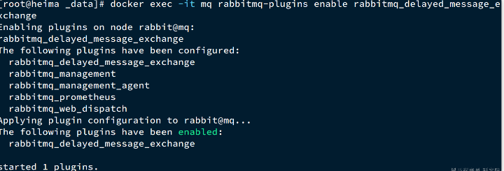

# MinIO 
## 安装MinIo
```c
# 先创建minio 文件存放的位置
mkdir -p /opt/docker/minio/data

# 启动并指定端口
docker run \
  -p 9000:9000 \
  -p 5001:5001 \
  --name minio \
  -v /opt/docker/minio/data:/data \
  -e "MINIO_ROOT_USER=minioadmin" \
  -e "MINIO_ROOT_PASSWORD=minioadmin" \
  -d minio/minio server /data --console-address ":5001"
 
# 设置为和 docker 绑定启动,docker 启动则 minio 就启动
docker update --restart=always

```
## 导入依赖
```xml
<!-- https://mvnrepository.com/artifact/io.minio/minio -->
<dependency>
    <groupId>io.minio</groupId>
    <artifactId>minio</artifactId>
    <version>8.4.0</version>
</dependency>

```
## application.yml 配置信息
```yaml
minio:
  endpoint: http://192.168.218.131/:9000 #Minio服务所在地址
  bucketName: tulaoda #存储桶名称
  accessKey: minioadmin #访问的key
  secretKey: minioadmin #访问的秘钥
```
## MinioConfig.class配置类
```java
@Data
@Configuration
@ConfigurationProperties(prefix = "minio")
public class MinioConfig {

    private String endpoint;
    private String accessKey;
    private String secretKey;
    private String bucketName;

    @Bean
    public MinioClient minioClient() {
        return MinioClient.builder()
                .endpoint(endpoint)
                .credentials(accessKey, secretKey)
                .build();
    }
}
```
## minio工具类
```java
@Component
@Slf4j
public class MinioUtil {
    @Autowired
    private MinioConfig prop;

    @Resource
    private MinioClient minioClient;
    @Autowired
    private CodeService codeService;

    /**
     * 查看存储bucket是否存在
     * @return boolean
     */
    public Boolean bucketExists(String bucketName) {
        Boolean found;
        try {
            found = minioClient.bucketExists(BucketExistsArgs.builder().bucket(bucketName).build());
        } catch (Exception e) {
            e.printStackTrace();
            return false;
        }
        return found;
    }

    /**
     * 创建存储bucket
     * @return Boolean
     */
    public Boolean makeBucket(String bucketName) {
        try {
            minioClient.makeBucket(MakeBucketArgs.builder()
                    .bucket(bucketName)
                    .build());
        } catch (Exception e) {
            e.printStackTrace();
            return false;
        }
        return true;
    }
    /**
     * 删除存储bucket
     * @return Boolean
     */
    public Boolean removeBucket(String bucketName) {
        try {
            minioClient.removeBucket(RemoveBucketArgs.builder()
                    .bucket(bucketName)
                    .build());
        } catch (Exception e) {
            e.printStackTrace();
            return false;
        }
        return true;
    }
    /**
     * 获取全部bucket
     */
    public List<Bucket> getAllBuckets() {
        try {
            List<Bucket> buckets = minioClient.listBuckets();
            return buckets;
        } catch (Exception e) {
            e.printStackTrace();
        }
        return null;
    }


    /**
     * 文件上传
     *
     * @param file 文件
     * @return Boolean
     */
    public String upload(MultipartFile file) {
        String originalFilename = file.getOriginalFilename();
        if (StringUtils.isBlank(originalFilename)){
            throw new RuntimeException();
        }
        String fileName = UuidUtils.generateUuid() + originalFilename.substring(originalFilename.lastIndexOf("."));
        String objectName = CommUtils.getNowDateLongStr("yyyy-MM/dd") + "/" + fileName;
        try {
            PutObjectArgs objectArgs = PutObjectArgs.builder().bucket(prop.getBucketName()).object(objectName)
                    .stream(file.getInputStream(), file.getSize(), -1).contentType(file.getContentType()).build();
            //文件名称相同会覆盖
            minioClient.putObject(objectArgs);
        } catch (Exception e) {
            e.printStackTrace();
            return null;
        }
        return objectName;
    }

    /**
     * 预览图片
     * @param fileName
     * @return
     */
    public String preview(String fileName){
        // 查看文件地址
        GetPresignedObjectUrlArgs build = new GetPresignedObjectUrlArgs().builder().bucket(prop.getBucketName()).object(fileName).method(Method.GET).build();
        try {
            String url = minioClient.getPresignedObjectUrl(build);
            return url;
        } catch (Exception e) {
            e.printStackTrace();
        }
        return null;
    }

    /**
     * 文件下载
     * @param fileName 文件名称
     * @param res response
     * @return Boolean
     */
    public void download(String fileName, HttpServletResponse res) {
        GetObjectArgs objectArgs = GetObjectArgs.builder().bucket(prop.getBucketName())
                .object(fileName).build();
        try (GetObjectResponse response = minioClient.getObject(objectArgs)){
            byte[] buf = new byte[1024];
            int len;
            try (FastByteArrayOutputStream os = new FastByteArrayOutputStream()){
                while ((len=response.read(buf))!=-1){
                    os.write(buf,0,len);
                }
                os.flush();
                byte[] bytes = os.toByteArray();
                res.setCharacterEncoding("utf-8");
                // 设置强制下载不打开
                // res.setContentType("application/force-download");
                res.addHeader("Content-Disposition", "attachment;fileName=" + fileName);
                try (ServletOutputStream stream = res.getOutputStream()){
                    stream.write(bytes);
                    stream.flush();
                }
            }
        } catch (Exception e) {
            e.printStackTrace();
        }
    }

    /**
     * 查看文件对象
     * @return 存储bucket内文件对象信息
     */
    public List<Item> listObjects() {
        Iterable<Result<Item>> results = minioClient.listObjects(
                ListObjectsArgs.builder().bucket(prop.getBucketName()).build());
        List<Item> items = new ArrayList<>();
        try {
            for (Result<Item> result : results) {
                items.add(result.get());
            }
        } catch (Exception e) {
            e.printStackTrace();
            return null;
        }
        return items;
    }

    /**
     * 删除
     * @param fileName
     * @return
     * @throws Exception
     */
    public boolean remove(String fileName){
        try {
            minioClient.removeObject( RemoveObjectArgs.builder().bucket(prop.getBucketName()).object(fileName).build());
        }catch (Exception e){
            return false;
        }
        return true;
    }

}

```

## 文件处理接口
```java


@Api(tags = "文件相关接口")
@Slf4j
@RestController
@RequestMapping(value = "/product/file")
public class FileController {


    @Autowired
    private MinioUtil minioUtil;
    @Autowired
    private MinioConfig prop;

    @ApiOperation(value = "查看存储bucket是否存在")
    @GetMapping("/bucketExists")
    public R bucketExists(@RequestParam("bucketName") String bucketName) {
        return R.ok().put("bucketName",minioUtil.bucketExists(bucketName));
    }

    @ApiOperation(value = "创建存储bucket")
    @GetMapping("/makeBucket")
    public R makeBucket(String bucketName) {
        return R.ok().put("bucketName",minioUtil.makeBucket(bucketName));
    }

    @ApiOperation(value = "删除存储bucket")
    @GetMapping("/removeBucket")
    public R removeBucket(String bucketName) {
        return R.ok().put("bucketName",minioUtil.removeBucket(bucketName));
    }

    @ApiOperation(value = "获取全部bucket")
    @GetMapping("/getAllBuckets")
    public R getAllBuckets() {
        List<Bucket> allBuckets = minioUtil.getAllBuckets();
        return R.ok().put("allBuckets",allBuckets);
    }

    @ApiOperation(value = "文件上传返回url")
    @PostMapping("/upload")
    public R upload(@RequestParam("file") MultipartFile file) {
        String objectName = minioUtil.upload(file);
        if (null != objectName) {
            return R.ok().put("url",(prop.getEndpoint() + "/" + prop.getBucketName() + "/" + objectName));
        }
        return R.error();
    }

    @ApiOperation(value = "图片/视频预览")
    @GetMapping("/preview")
    public R preview(@RequestParam("fileName") String fileName) {
        return R.ok().put("filleName",minioUtil.preview(fileName));
    }

    @ApiOperation(value = "文件下载")
    @GetMapping("/download")
    public R download(@RequestParam("fileName") String fileName, HttpServletResponse res) {
        minioUtil.download(fileName,res);
        return R.ok();
    }

    @ApiOperation(value = "删除文件", notes = "根据url地址删除文件")
    @PostMapping("/delete")
    public R remove(String url) {
        String objName = url.substring(url.lastIndexOf(prop.getBucketName()+"/") + prop.getBucketName().length()+1);
        minioUtil.remove(objName);
        return R.ok().put("objName",objName);
    }

}

```
# jwt
## 环境准备
JWT依赖
```xml
<!--        jwt 依赖-->
<dependency>
    <groupId>io.jsonwebtoken</groupId>
    <artifactId>jjwt</artifactId>
    <version>0.9.1</version>
</dependency>

<!--另一种token插件 性能更高-->
<dependency>
    <groupId>com.auth0</groupId>
    <artifactId>java-jwt</artifactId>
    <version>3.10.3</version>
</dependency>
```


##  生成token工具类
```java
import io.jsonwebtoken.*;
import org.springframework.util.StringUtils;

import java.util.Date;

public class JwtHelper {

    // token 失效时间  当前设置过期时间 24小时
    private static long tokenExpiration = 24*60*60*1000;

    //生成token 的私有盐 这个按道理来说只有自己知道 加密的时候加入盐 token就不会轻易的被破解
    private static String tokenSignKey = "123456";

    /**
     * 生成jwt令牌【token】 也可以根据别的用户信息生成token 这里选择了 userId userName
     * @param userId  用户id
     * @param userName  用户名
     * @return
     */
    public static String createToken(Long userId,String userName){
          String token =  Jwts.builder()

                  //公共部分
                  .setSubject("YYGH-USER")
                  //设置token 的过期时间
                  .setExpiration(new Date(System.currentTimeMillis()+tokenExpiration))

                  //私有部分 
                  .claim("userId",userId)
                  .claim("userName",userName)

                  //签名部分 设置加密算法 + 自己的盐
                  .signWith(SignatureAlgorithm.HS512,tokenSignKey)

                  //对token的压缩方法 载荷过长可以进行压缩
                  .compressWith(CompressionCodecs.GZIP)
                  .compact();

          return token;
    }

    /**
     * 根据token 得到用户ID
     * @param token
     * @return
     */
    public static Long getUserIdByToken(String token){

        //判断token是否 null
        if(StringUtils.isEmpty(token)) return null;

        /**
         * 根据自定义的盐值解析token 获取token里面私有部分的信息
         *
         * tokenSignKey 自己设置的盐
         * token  传过来的token
         */
        Jws<Claims> claimsJwts =  Jwts.parser().setSigningKey(tokenSignKey).parseClaimsJws(token);

        //私有部分的数据体
        Claims jwtsBody = claimsJwts.getBody();
        Long userId = (Long) jwtsBody.get("userId");
        return userId;
    }

    /**
     * 根据token 获取用户名称
     * @param token
     * @return
     */
    public static String getUserNameByToken(String token){
        if(StringUtils.isEmpty(token)) return "";
        Jws<Claims> claimsJws
                = Jwts.parser().setSigningKey(tokenSignKey).parseClaimsJws(token);
        Claims claims = claimsJws.getBody();
        return (String)claims.get("userName");
    }

```
# RabbitMq
由于`RabbitMQ`采用了AMQP协议，因此它具备跨语言的特性。任何语言只要遵循AMQP协议收发消息，都可以与`RabbitMQ`交互。并且`RabbitMQ`官方也提供了各种不同语言的客户端。
但是，RabbitMQ官方提供的Java客户端编码相对复杂，一般生产环境下我们更多会结合Spring来使用。而Spring的官方刚好基于RabbitMQ提供了这样一套消息收发的模板工具：SpringAMQP。并且还基于SpringBoot对其实现了自动装配，使用起来非常方便。

SpringAMQP提供了三个功能：

- 自动声明队列、交换机及其绑定关系
- 基于注解的监听器模式，异步接收消息
- 封装了RabbitTemplate工具，用于发送消息
## 概念

- `**publisher**`：生产者，也就是发送消息的一方
- `**consumer**`：消费者，也就是消费消息的一方
- `**queue**`：队列，存储消息。生产者投递的消息会暂存在消息队列中，等待消费者处理
- `**exchange**`：交换机，负责消息路由。生产者发送的消息由交换机决定投递到哪个队列。
- `**virtual host**`：虚拟主机，起到数据隔离的作用。每个虚拟主机相互独立，有各自的exchange、queue
### 交换机
我们打开Exchanges选项卡，可以看到已经存在很多交换机：

我们点击任意交换机，即可进入交换机详情页面。仍然会利用控制台中的publish message 发送一条消息：


这里是由控制台模拟了生产者发送的消息。由于没有消费者存在，最终消息丢失了，这样说明交换机没有存储消息的能力。

### 队列
我们打开`Queues`选项卡，新建一个队列：

命名为`hello.queue1`：

再以相同的方式，创建一个队列，密码为`hello.queue2`，最终队列列表如下：

此时，我们再次向`amq.fanout`交换机发送一条消息。会发现消息依然没有到达队列！！
怎么回事呢？
发送到交换机的消息，只会路由到与其绑定的队列，因此仅仅创建队列是不够的，我们还需要将其与交换机绑定。

### 绑定关系
点击`Exchanges`选项卡，点击`amq.fanout`交换机，进入交换机详情页，然后点击`Bindings`菜单，在表单中填写要绑定的队列名称：

相同的方式，将hello.queue2也绑定到改交换机。
最终，绑定结果如下：


### 发送消息
再次回到exchange页面，找到刚刚绑定的`amq.fanout`，点击进入详情页，再次发送一条消息：

回到`Queues`页面，可以发现`hello.queue`中已经有一条消息了：

点击队列名称，进入详情页，查看队列详情，这次我们点击get message：

可以看到消息到达队列了：

这个时候如果有消费者监听了MQ的`hello.queue1`或`hello.queue2`队列，自然就能接收到消息了。

### 用户管理
点击`Admin`选项卡，首先会看到RabbitMQ控制台的用户管理界面：

这里的用户都是RabbitMQ的管理或运维人员。目前只有安装RabbitMQ时添加的`itheima`这个用户。仔细观察用户表格中的字段，如下：

- `Name`：`admin`，也就是用户名
- `Tags`：`administrator`，说明`itheima`用户是超级管理员，拥有所有权限
- `Can access virtual host`： `/`，可以访问的`virtual host`，这里的`/`是默认的`virtual host`

对于小型企业而言，出于成本考虑，我们通常只会搭建一套MQ集群，公司内的多个不同项目同时使用。这个时候为了避免互相干扰， 我们会利用`virtual host`的隔离特性，将不同项目隔离。一般会做两件事情：

- 给每个项目创建独立的运维账号，将管理权限分离。
- 给每个项目创建不同的`virtual host`，将每个项目的数据隔离。

## 交换机
。而一旦引入交换机，消息发送的模式会有很大变化：

可以看到，在订阅模型中，多了一个exchange角色，而且过程略有变化：

- Publisher：生产者，不再发送消息到队列中，而是发给交换机
- Exchange：交换机，一方面，接收生产者发送的消息。另一方面，知道如何处理消息，例如递交给某个特别队列、递交给所有队列、或是将消息丢弃。到底如何操作，取决于Exchange的类型。
- Queue：消息队列也与以前一样，接收消息、缓存消息。不过队列一定要与交换机绑定。
- Consumer：消费者，与以前一样，订阅队列，没有变化
- Exchange（交换机）只负责转发消息，不具备存储消息的能力，因此如果没有任何队列与Exchange绑定，或者没有符合路由规则的队列，那么消息会丢失！

交换机的类型有四种：

- Fanout：广播，将消息交给所有绑定到交换机的队列。我们最早在控制台使用的正是Fanout交换机
- Direct：订阅，基于RoutingKey（路由key）发送给订阅了消息的队列
- Topic：通配符订阅，与Direct类似，只不过RoutingKey可以使用通配符
- Headers：头匹配，基于MQ的消息头匹配，用的较少。

### Fanout交换机
Fanout，英文翻译是扇出，我觉得在MQ中叫广播更合适。
在广播模式下，消息发送流程是这样的：


- 1）  可以有多个队列
- 2）  每个队列都要绑定到Exchange（交换机）
- 3）  生产者发送的消息，只能发送到交换机
- 4）  交换机把消息发送给绑定过的所有队列
- 5）  订阅队列的消费者都能拿到消息

我们的计划是这样的：

- 创建一个名为` hmall.fanout`的交换机，类型是`Fanout`
- 创建两个队列`fanout.queue1`和`fanout.queue2`，绑定到交换机`hmall.fanout`

#### 消息发送
在publisher服务的SpringAmqpTest类中添加测试方法：
```java
@Test
public void testFanoutExchange() {
    // 交换机名称
    String exchangeName = "hmall.fanout";
    // 消息
    String message = "hello, everyone!";
    rabbitTemplate.convertAndSend(exchangeName, "", message);
}
```

#### 消息接收
在consumer服务的SpringRabbitListener中添加两个方法，作为消费者：
```java
@RabbitListener(queues = "fanout.queue1")
public void listenFanoutQueue1(String msg) {
    System.out.println("消费者1接收到Fanout消息：【" + msg + "】");
}

@RabbitListener(queues = "fanout.queue2")
public void listenFanoutQueue2(String msg) {
    System.out.println("消费者2接收到Fanout消息：【" + msg + "】");
}
```


### Direct交换机
在Fanout模式中，一条消息，会被所有订阅的队列都消费。但是，在某些场景下，我们希望不同的消息被不同的队列消费。这时就要用到Direct类型的Exchange。

在Direct模型下：

- 队列与交换机的绑定，不能是任意绑定了，而是要指定一个`RoutingKey`（路由key）
- 消息的发送方在 向 Exchange发送消息时，也必须指定消息的 `RoutingKey`。
- Exchange不再把消息交给每一个绑定的队列，而是根据消息的`Routing Key`进行判断，只有队列的`Routingkey`与消息的 `Routing key`完全一致，才会接收到消息

**案例需求如图**：


1.  声明一个名为`hmall.direct`的交换机
2. 声明队列`direct.queue1`，绑定`hmall.direct`，`bindingKey`为`blud`和`red`
3. 声明队列`direct.queue2`，绑定`hmall.direct`，`bindingKey`为`yellow`和`red`
4.  在`consumer`服务中，编写两个消费者方法，分别监听direct.queue1和direct.queue2 
5.  在publisher中编写测试方法，向`hmall.direct`发送消息 


#### 声明队列和交换机
首先在控制台声明两个队列`direct.queue1`和`direct.queue2`，然后声明一个direct类型的交换机，命名为`hmall.direct`:

然后使用`red`和`blue`作为key，绑定`direct.queue1`到`hmall.direct`同理，使用`red`和`yellow`作为key，绑定`direct.queue2`到`hmall.direct`，步骤略，最终结果：

#### 消息接收
在consumer服务的SpringRabbitListener中添加方法：
```java
@RabbitListener(queues = "direct.queue1")
public void listenDirectQueue1(String msg) {
    System.out.println("消费者1接收到direct.queue1的消息：【" + msg + "】");
}

@RabbitListener(queues = "direct.queue2")
public void listenDirectQueue2(String msg) {
    System.out.println("消费者2接收到direct.queue2的消息：【" + msg + "】");
}
```


#### 消息发送
在publisher服务的SpringAmqpTest类中添加测试方法：
```java
@Test
public void testSendDirectExchange() {
    // 交换机名称
    String exchangeName = "hmall.direct";
    // 消息
    String message = "红色警报！日本乱排核废水，导致海洋生物变异，惊现哥斯拉！";
    // 发送消息
    rabbitTemplate.convertAndSend(exchangeName, "red", message);
}
```
由于使用的red这个key，所以两个消费者都收到了消息：

我们再切换为blue这个key：
```java
@Test
public void testSendDirectExchange() {
    // 交换机名称
    String exchangeName = "hmall.direct";
    // 消息
    String message = "最新报道，哥斯拉是居民自治巨型气球，虚惊一场！";
    // 发送消息
    rabbitTemplate.convertAndSend(exchangeName, "blue", message);
}
```
你会发现，只有消费者1收到了消息：


#### 总结
描述下Direct交换机与Fanout交换机的差异？

- Fanout交换机将消息路由给每一个与之绑定的队列
- Direct交换机根据RoutingKey判断路由给哪个队列
- 如果多个队列具有相同的RoutingKey，则与Fanout功能类似


### 交换机
#### 说明
`Topic`类型的`Exchange`与`Direct`相比，都是可以根据`RoutingKey`把消息路由到不同的队列。
只不过`Topic`类型`Exchange`可以让队列在绑定`BindingKey` 的时候使用通配符！

`BindingKey` 一般都是有一个或多个单词组成，多个单词之间以`.`分割，例如： `item.insert`

通配符规则：

- `#`：匹配一个或多个词
- `*`：匹配不多不少恰好1个词

举例：

- `item.#`：能够匹配`item.spu.insert` 或者 `item.spu`
- `item.*`：只能匹配`item.spu`

图示：

假如此时publisher发送的消息使用的`RoutingKey`共有四种：

- `china.news `代表有中国的新闻消息；
- `china.weather` 代表中国的天气消息；
- `japan.news` 则代表日本新闻
- `japan.weather` 代表日本的天气消息；

解释：

- `topic.queue1`：绑定的是`china.#` ，凡是以 `china.`开头的`routing key` 都会被匹配到，包括：
   - `china.news`
   - `china.weather`
- `topic.queue2`：绑定的是`#.news` ，凡是以 `.news`结尾的 `routing key` 都会被匹配。包括:
   - `china.news`
   - `japan.news`

接下来，我们就按照上图所示，来演示一下Topic交换机的用法。
首先，在控制台按照图示例子创建队列、交换机，并利用通配符绑定队列和交换机。此处步骤略。最终结果如下：


#### 消息发送
在publisher服务的SpringAmqpTest类中添加测试方法：
```java
/**
 * topicExchange
 */
@Test
public void testSendTopicExchange() {
    // 交换机名称
    String exchangeName = "hmall.topic";
    // 消息
    String message = "喜报！孙悟空大战哥斯拉，胜!";
    // 发送消息
    rabbitTemplate.convertAndSend(exchangeName, "china.news", message);
}
```

#### 消息接收
在consumer服务的SpringRabbitListener中添加方法：
```java
@RabbitListener(queues = "topic.queue1")
public void listenTopicQueue1(String msg){
    System.out.println("消费者1接收到topic.queue1的消息：【" + msg + "】");
}

@RabbitListener(queues = "topic.queue2")
public void listenTopicQueue2(String msg){
    System.out.println("消费者2接收到topic.queue2的消息：【" + msg + "】");
}
```


### 声明队列和交换机
在之前我们都是基于RabbitMQ控制台来创建队列、交换机。但是在实际开发时，队列和交换机是程序员定义的，将来项目上线，又要交给运维去创建。那么程序员就需要把程序中运行的所有队列和交换机都写下来，交给运维。在这个过程中是很容易出现错误的。
因此推荐的做法是由程序启动时检查队列和交换机是否存在，如果不存在自动创建。

#### fanout示例
在consumer中创建一个类，声明队列和交换机：
```java
package com.itheima.consumer.config;

import org.springframework.amqp.core.Binding;
import org.springframework.amqp.core.BindingBuilder;
import org.springframework.amqp.core.FanoutExchange;
import org.springframework.amqp.core.Queue;
import org.springframework.context.annotation.Bean;
import org.springframework.context.annotation.Configuration;

@Configuration
public class FanoutConfig {
    /**
     * 声明交换机
     * @return Fanout类型交换机
     */
    @Bean
    public FanoutExchange fanoutExchange(){
        return new FanoutExchange("hmall.fanout");
    }

    /**
     * 第1个队列
     */
    @Bean
    public Queue fanoutQueue1(){
        return new Queue("fanout.queue1");
    }

    /**
     * 绑定队列和交换机
     */
    @Bean
    public Binding bindingQueue1(Queue fanoutQueue1, FanoutExchange fanoutExchange){
        return BindingBuilder.bind(fanoutQueue1).to(fanoutExchange);
    }

    /**
     * 第2个队列
     */
    @Bean
    public Queue fanoutQueue2(){
        return new Queue("fanout.queue2");
    }

    /**
     * 绑定队列和交换机
     */
    @Bean
    public Binding bindingQueue2(Queue fanoutQueue2, FanoutExchange fanoutExchange){
        return BindingBuilder.bind(fanoutQueue2).to(fanoutExchange);
    }
}
```

#### direct示例
direct模式由于要绑定多个KEY，会非常麻烦，每一个Key都要编写一个binding：
```java
package com.itheima.consumer.config;

import org.springframework.amqp.core.*;
import org.springframework.context.annotation.Bean;
import org.springframework.context.annotation.Configuration;

@Configuration
public class DirectConfig {

    /**
     * 声明交换机
     * @return Direct类型交换机
     */
    @Bean
    public DirectExchange directExchange(){
        return ExchangeBuilder.directExchange("hmall.direct").build();
    }

    /**
     * 第1个队列
     */
    @Bean
    public Queue directQueue1(){
        return new Queue("direct.queue1");
    }

    /**
     * 绑定队列和交换机
     */
    @Bean
    public Binding bindingQueue1WithRed(Queue directQueue1, DirectExchange directExchange){
        return BindingBuilder.bind(directQueue1).to(directExchange).with("red");
    }
    /**
     * 绑定队列和交换机
     */
    @Bean
    public Binding bindingQueue1WithBlue(Queue directQueue1, DirectExchange directExchange){
        return BindingBuilder.bind(directQueue1).to(directExchange).with("blue");
    }

    /**
     * 第2个队列
     */
    @Bean
    public Queue directQueue2(){
        return new Queue("direct.queue2");
    }

    /**
     * 绑定队列和交换机
     */
    @Bean
    public Binding bindingQueue2WithRed(Queue directQueue2, DirectExchange directExchange){
        return BindingBuilder.bind(directQueue2).to(directExchange).with("red");
    }
    /**
     * 绑定队列和交换机
     */
    @Bean
    public Binding bindingQueue2WithYellow(Queue directQueue2, DirectExchange directExchange){
        return BindingBuilder.bind(directQueue2).to(directExchange).with("yellow");
    }
}

```

#### 基于注解声明
基于@Bean的方式声明队列和交换机比较麻烦，Spring还提供了基于注解方式来声明。

例如，我们同样声明Direct模式的交换机和队列：
```java
@RabbitListener(bindings = @QueueBinding(
    value = @Queue(name = "direct.queue1"),
    exchange = @Exchange(name = "hmall.direct", type = ExchangeTypes.DIRECT),
    key = {"red", "blue"}
))
public void listenDirectQueue1(String msg){
    System.out.println("消费者1接收到direct.queue1的消息：【" + msg + "】");
}

@RabbitListener(bindings = @QueueBinding(
    value = @Queue(name = "direct.queue2"),
    exchange = @Exchange(name = "hmall.direct", type = ExchangeTypes.DIRECT),
    key = {"red", "yellow"}
))
public void listenDirectQueue2(String msg){
    System.out.println("消费者2接收到direct.queue2的消息：【" + msg + "】");
}
```

是不是简单多了。
再试试Topic模式：
```java
@RabbitListener(bindings = @QueueBinding(
    value = @Queue(name = "topic.queue1"),
    exchange = @Exchange(name = "hmall.topic", type = ExchangeTypes.TOPIC),
    key = "china.#"
))
public void listenTopicQueue1(String msg){
    System.out.println("消费者1接收到topic.queue1的消息：【" + msg + "】");
}

@RabbitListener(bindings = @QueueBinding(
    value = @Queue(name = "topic.queue2"),
    exchange = @Exchange(name = "hmall.topic", type = ExchangeTypes.TOPIC),
    key = "#.news"
))
public void listenTopicQueue2(String msg){
    System.out.println("消费者2接收到topic.queue2的消息：【" + msg + "】");
}
```


### 消息转换器
Spring的消息发送代码接收的消息体是一个Object：

而在数据传输时，它会把你发送的消息序列化为字节发送给MQ，接收消息的时候，还会把字节反序列化为Java对象。
只不过，默认情况下Spring采用的序列化方式是JDK序列化。众所周知，JDK序列化存在下列问题：

- 数据体积过大
- 有安全漏洞
- 可读性差


#### 配置JSON转换器
显然，JDK序列化方式并不合适。我们希望消息体的体积更小、可读性更高，因此可以使用JSON方式来做序列化和反序列化。

在`publisher`和`consumer`两个服务中都引入依赖：
```xml
<dependency>
    <groupId>com.fasterxml.jackson.dataformat</groupId>
    <artifactId>jackson-dataformat-xml</artifactId>
    <version>2.9.10</version>
</dependency>
```
注意，如果项目中引入了`spring-boot-starter-web`依赖，则无需再次引入`Jackson`依赖。


配置消息转换器，在`publisher`和`consumer`两个服务的启动类中添加一个Bean即可：
```java
@Bean
public MessageConverter messageConverter(){
    // 1.定义消息转换器
    Jackson2JsonMessageConverter jackson2JsonMessageConverter = new Jackson2JsonMessageConverter();
    // 2.配置自动创建消息id，用于识别不同消息，也可以在业务中基于ID判断是否是重复消息
    jackson2JsonMessageConverter.setCreateMessageIds(true);
    return jackson2JsonMessageConverter;
}
```
消息转换器中添加的messageId可以便于我们将来做幂等性判断。

## 消息可靠性
### 生产者重试机制
首先第一种情况，就是生产者发送消息时，出现了网络故障，导致与MQ的连接中断。

为了解决这个问题，SpringAMQP提供的消息发送时的重试机制。即：当`RabbitTemplate`与MQ连接超时后，多次重试。

修改`publisher`模块的`application.yaml`文件，添加下面的内容：
```yaml
spring:
  rabbitmq:
    connection-timeout: 1s # 设置MQ的连接超时时间
    template:
      retry:
        enabled: true # 开启超时重试机制
        initial-interval: 1000ms # 失败后的初始等待时间
        multiplier: 1 # 失败后下次的等待时长倍数，下次等待时长 = initial-interval * multiplier
        max-attempts: 3 # 最大重试次数
```


**注意**：当网络不稳定的时候，利用重试机制可以有效提高消息发送的成功率。不过SpringAMQP提供的重试机制是**阻塞式**的重试，也就是说多次重试等待的过程中，当前线程是被阻塞的。
如果对于业务性能有要求，建议禁用重试机制。如果一定要使用，请合理配置等待时长和重试次数，当然也可以考虑使用异步线程来执行发送消息的代码。
:::

### 生产者确认机制
一般情况下，只要生产者与MQ之间的网路连接顺畅，基本不会出现发送消息丢失的情况，因此大多数情况下我们无需考虑这种问题。
不过，在少数情况下，也会出现消息发送到MQ之后丢失的现象，比如：

- MQ内部处理消息的进程发生了异常
- 生产者发送消息到达MQ后未找到`Exchange`
- 生产者发送消息到达MQ的`Exchange`后，未找到合适的`Queue`，因此无法路由

针对上述情况，RabbitMQ提供了生产者消息确认机制，包括`Publisher Confirm`和`Publisher Return`两种。在开启确认机制的情况下，当生产者发送消息给MQ后，MQ会根据消息处理的情况返回不同的**回执**。

- 当消息投递到MQ，但是路由失败时，通过**Publisher Return**返回异常信息，同时返回ack的确认信息，代表投递成功
- 临时消息投递到了MQ，并且入队成功，返回ACK，告知投递成功
- 持久消息投递到了MQ，并且入队完成持久化，返回ACK ，告知投递成功
- 其它情况都会返回NACK，告知投递失败


其中`ack`和`nack`属于**Publisher Confirm**机制，`ack`是投递成功；`nack`是投递失败。而`return`则属于**Publisher Return**机制。
默认两种机制都是关闭状态，需要通过配置文件来开启。


在publisher模块的`application.yaml`中添加配置：
```yaml
spring:
  rabbitmq:
    publisher-confirm-type: correlated # 开启publisher confirm机制，并设置confirm类型
    publisher-returns: true # 开启publisher return机制
```
这里`publisher-confirm-type`有三种模式可选：

- `none`：关闭confirm机制
- `simple`：同步阻塞等待MQ的回执
- `correlated`：MQ异步回调返回回执

一般我们推荐使用`correlated`，回调机制。

#### 定义ReturnCallback
每个`RabbitTemplate`只能配置一个`ReturnCallback`，因此我们可以在配置类中统一设置。我们在publisher模块定义一个配置类：

内容如下：
```java
package com.itheima.publisher.config;

import lombok.AllArgsConstructor;
import lombok.extern.slf4j.Slf4j;
import org.springframework.amqp.core.ReturnedMessage;
import org.springframework.amqp.rabbit.core.RabbitTemplate;
import org.springframework.context.annotation.Configuration;

import javax.annotation.PostConstruct;

@Slf4j
@AllArgsConstructor
@Configuration
public class MqConfig {
    private final RabbitTemplate rabbitTemplate;

    @PostConstruct
    public void init(){
        rabbitTemplate.setReturnsCallback(new RabbitTemplate.ReturnsCallback() {
            @Override
            public void returnedMessage(ReturnedMessage returned) {
                log.error("触发return callback,");
                log.debug("exchange: {}", returned.getExchange());
                log.debug("routingKey: {}", returned.getRoutingKey());
                log.debug("message: {}", returned.getMessage());
                log.debug("replyCode: {}", returned.getReplyCode());
                log.debug("replyText: {}", returned.getReplyText());
            }
        });
    }
}
```

#### 定义ConfirmCallback
由于每个消息发送时的处理逻辑不一定相同，因此ConfirmCallback需要在每次发消息时定义。具体来说，是在调用RabbitTemplate中的convertAndSend方法时，多传递一个参数：

这里的CorrelationData中包含两个核心的东西：

- `id`：消息的唯一标示，MQ对不同的消息的回执以此做判断，避免混淆
- `SettableListenableFuture`：回执结果的Future对象

将来MQ的回执就会通过这个`Future`来返回，我们可以提前给`CorrelationData`中的`Future`添加回调函数来处理消息回执：

我们新建一个测试，向系统自带的交换机发送消息，并且添加`ConfirmCallback`：
```java
@Test
void testPublisherConfirm() {
    // 1.创建CorrelationData
    CorrelationData cd = new CorrelationData();
    // 2.给Future添加ConfirmCallback
    cd.getFuture().addCallback(new ListenableFutureCallback<CorrelationData.Confirm>() {
        @Override
        public void onFailure(Throwable ex) {
            // 2.1.Future发生异常时的处理逻辑，基本不会触发
            log.error("send message fail", ex);
        }
        @Override
        public void onSuccess(CorrelationData.Confirm result) {
            // 2.2.Future接收到回执的处理逻辑，参数中的result就是回执内容
            if(result.isAck()){ // result.isAck()，boolean类型，true代表ack回执，false 代表 nack回执
                log.debug("发送消息成功，收到 ack!");
            }else{ // result.getReason()，String类型，返回nack时的异常描述
                log.error("发送消息失败，收到 nack, reason : {}", result.getReason());
            }
        }
    });
    // 3.发送消息
    rabbitTemplate.convertAndSend("hmall.direct", "q", "hello", cd);
}
```
执行结果如下：

可以看到，由于传递的`RoutingKey`是错误的，路由失败后，触发了`return callback`，同时也收到了ack。
当我们修改为正确的`RoutingKey`以后，就不会触发`return callback`了，只收到ack。
而如果连交换机都是错误的，则只会收到nack。


**注意**：
开启生产者确认比较消耗MQ性能，一般不建议开启。而且大家思考一下触发确认的几种情况：

- 路由失败：一般是因为RoutingKey错误导致，往往是编程导致
- 交换机名称错误：同样是编程错误导致
- MQ内部故障：这种需要处理，但概率往往较低。因此只有对消息可靠性要求非常高的业务才需要开启，而且仅仅需要开启ConfirmCallback处理nack就可以了。

### 数据持久化
为了提升性能，默认情况下MQ的数据都是在内存存储的临时数据，重启后就会消失。为了保证数据的可靠性，必须配置数据持久化，包括：

- 交换机持久化
- 队列持久化
- 消息持久化

我们以控制台界面为例来说明。
#### 交换机持久化
在控制台的`Exchanges`页面，添加交换机时可以配置交换机的`Durability`参数：

设置为`Durable`就是持久化模式，`Transient`就是临时模式。

#### 队列持久化
在控制台的Queues页面，添加队列时，同样可以配置队列的`Durability`参数：

除了持久化以外。

#### 消息持久化
在控制台发送消息的时候，可以添加很多参数，而消息的持久化是要配置一个`properties`：


**说明**：在开启持久化机制以后，如果同时还开启了生产者确认，那么MQ会在消息持久化以后才发送ACK回执，进一步确保消息的可靠性。
不过出于性能考虑，为了减少IO次数，发送到MQ的消息并不是逐条持久化到数据库的，而是每隔一段时间批量持久化。一般间隔在100毫秒左右，这就会导致ACK有一定的延迟，因此建议生产者确认全部采用异步方式。


#### LazyQueue
在默认情况下，RabbitMQ会将接收到的信息保存在内存中以降低消息收发的延迟。但在某些特殊情况下，这会导致消息积压，比如：

- 消费者宕机或出现网络故障
- 消息发送量激增，超过了消费者处理速度
- 消费者处理业务发生阻塞

一旦出现消息堆积问题，RabbitMQ的内存占用就会越来越高，直到触发内存预警上限。此时RabbitMQ会将内存消息刷到磁盘上，这个行为成为`PageOut`. `PageOut`会耗费一段时间，并且会阻塞队列进程。因此在这个过程中RabbitMQ不会再处理新的消息，生产者的所有请求都会被阻塞。

为了解决这个问题，从RabbitMQ的3.6.0版本开始，就增加了Lazy Queues的模式，也就是惰性队列。惰性队列的特征如下：

- 接收到消息后直接存入磁盘而非内存
- 消费者要消费消息时才会从磁盘中读取并加载到内存（也就是懒加载）
- 支持数百万条的消息存储

而在3.12版本之后，LazyQueue已经成为所有队列的默认格式。因此官方推荐升级MQ为3.12版本或者所有队列都设置为LazyQueue模式。

##### 控制台配置Lazy模式
在添加队列的时候，添加`x-queue-mod=lazy`参数即可设置队列为Lazy模式：


##### 代码配置Lazy模式
在利用SpringAMQP声明队列的时候，添加`x-queue-mod=lazy`参数也可设置队列为Lazy模式：
```java
@Bean
public Queue lazyQueue(){
    return QueueBuilder
            .durable("lazy.queue")
            .lazy() // 开启Lazy模式
            .build();
}
```
这里是通过`QueueBuilder`的`lazy()`函数配置Lazy模式。
当然，我们也可以基于注解来声明队列并设置为Lazy模式：
```java
@RabbitListener(queuesToDeclare = @Queue(
        name = "lazy.queue",
        durable = "true",
        arguments = @Argument(name = "x-queue-mode", value = "lazy")
))
public void listenLazyQueue(String msg){
    log.info("接收到 lazy.queue的消息：{}", msg);
}
```

##### 更新已有队列为lazy模式
对于已经存在的队列，也可以配置为lazy模式，但是要通过设置policy实现。
可以基于命令行设置policy：
```shell
rabbitmqctl set_policy Lazy "^lazy-queue$" '{"queue-mode":"lazy"}' --apply-to queues  
```
命令解读：

- `rabbitmqctl` ：RabbitMQ的命令行工具
- `set_policy` ：添加一个策略
- `Lazy` ：策略名称，可以自定义
- `"^lazy-queue$"` ：用正则表达式匹配队列的名字
- `'{"queue-mode":"lazy"}'` ：设置队列模式为lazy模式
- `--apply-to queues`：策略的作用对象，是所有的队列

当然，也可以在控制台配置policy，进入在控制台的`Admin`页面，点击`Policies`，即可添加配置：


###  消费者的可靠性
当RabbitMQ向消费者投递消息以后，需要知道消费者的处理状态如何。因为消息投递给消费者并不代表就一定被正确消费了，可能出现的故障有很多，比如：

- 消息投递的过程中出现了网络故障
- 消费者接收到消息后突然宕机
- 消费者接收到消息后，因处理不当导致异常


一旦发生上述情况，消息也会丢失。因此，RabbitMQ必须知道消费者的处理状态，一旦消息处理失败才能重新投递消息。
但问题来了：RabbitMQ如何得知消费者的处理状态呢？

本章我们就一起研究一下消费者处理消息时的可靠性解决方案。
### 消费者确认机制
为了确认消费者是否成功处理消息，RabbitMQ提供了消费者确认机制（**Consumer Acknowledgement**）。即：当消费者处理消息结束后，应该向RabbitMQ发送一个回执，告知RabbitMQ自己消息处理状态。回执有三种可选值：

- ack：成功处理消息，RabbitMQ从队列中删除该消息
- nack：消息处理失败，RabbitMQ需要再次投递消息
- reject：消息处理失败并拒绝该消息，RabbitMQ从队列中删除该消息

一般reject方式用的较少，除非是消息格式有问题，那就是开发问题了。因此大多数情况下我们需要将消息处理的代码通过`try catch`机制捕获，消息处理成功时返回ack，处理失败时返回nack.

由于消息回执的处理代码比较统一，因此SpringAMQP帮我们实现了消息确认。并允许我们通过配置文件设置ACK处理方式，有三种模式：

- `**none**`：不处理。即消息投递给消费者后立刻ack，消息会立刻从MQ删除。非常不安全，不建议使用
- `**manual**`：手动模式。需要自己在业务代码中调用api，发送`ack`或`reject`，存在业务入侵，但更灵活
- `**auto**`：自动模式。SpringAMQP利用AOP对我们的消息处理逻辑做了环绕增强，当业务正常执行时则自动返回`ack`.  当业务出现异常时，根据异常判断返回不同结果：
   - 如果是**业务异常**，会自动返回`nack`；
   - 如果是**消息处理或校验异常**，自动返回`reject`;


通过下面的配置可以修改SpringAMQP的ACK处理方式：
```yaml
spring:
  rabbitmq:
    listener:
      simple:
        acknowledge-mode: none # 不做处理
```

修改consumer服务的SpringRabbitListener类中的方法，模拟一个消息处理的异常：
```java
@RabbitListener(queues = "simple.queue")
public void listenSimpleQueueMessage(String msg) throws InterruptedException {
    log.info("spring 消费者接收到消息：【" + msg + "】");
    if (true) {
        throw new MessageConversionException("故意的");
    }
    log.info("消息处理完成");
}
```

测试可以发现：当消息处理发生异常时，消息依然被RabbitMQ删除了。


我们再次把确认机制修改为auto：
```yaml
spring:
  rabbitmq:
    listener:
      simple:
        acknowledge-mode: auto # 自动ack
```

在异常位置打断点，再次发送消息，程序卡在断点时，可以发现此时消息状态为`unacked`（未确定状态）：

放行以后，由于抛出的是**消息转换异常**，因此Spring会自动返回`reject`，所以消息依然会被删除


我们将异常改为RuntimeException类型：
```java
@RabbitListener(queues = "simple.queue")
public void listenSimpleQueueMessage(String msg) throws InterruptedException {
    log.info("spring 消费者接收到消息：【" + msg + "】");
    if (true) {
        throw new RuntimeException("故意的");
    }
    log.info("消息处理完成");
}
```
在异常位置打断点，然后再次发送消息测试，程序卡在断点时，可以发现此时消息状态为`unacked`（未确定状态）以后，由于抛出的是业务异常，所以Spring返回`ack`，最终消息恢复至`Ready`状态，并且没有被RabbitMQ删除
当我们把配置改为`auto`时，消息处理失败后，会回到RabbitMQ，并重新投递到消费者。

#### 失败重试机制
当消费者出现异常后，消息会不断requeue（重入队）到队列，再重新发送给消费者。如果消费者再次执行依然出错，消息会再次requeue到队列，再次投递，直到消息处理成功为止。
极端情况就是消费者一直无法执行成功，那么消息requeue就会无限循环，导致mq的消息处理飙升，带来不必要的压力：


当然，上述极端情况发生的概率还是非常低的，不过不怕一万就怕万一。为了应对上述情况Spring又提供了消费者失败重试机制：在消费者出现异常时利用本地重试，而不是无限制的requeue到mq队列。

修改consumer服务的application.yml文件，添加内容：
```yaml
spring:
  rabbitmq:
    listener:
      simple:
        retry:
          enabled: true # 开启消费者失败重试
          initial-interval: 1000ms # 初识的失败等待时长为1秒
          multiplier: 1 # 失败的等待时长倍数，下次等待时长 = multiplier * last-interval
          max-attempts: 3 # 最大重试次数
          stateless: true # true无状态；false有状态。如果业务中包含事务，这里改为false
```

重启consumer服务，重复之前的测试。可以发现：

- 消费者在失败后消息没有重新回到MQ无限重新投递，而是在本地重试了3次
- 本地重试3次以后，抛出了`AmqpRejectAndDontRequeueException`异常。查看RabbitMQ控制台，发现消息被删除了，说明最后SpringAMQP返回的是`reject`

结论：

- 开启本地重试时，消息处理过程中抛出异常，不会requeue到队列，而是在消费者本地重试
- 重试达到最大次数后，Spring会返回reject，消息会被丢弃

#### 失败处理策略
在之前的测试中，本地测试达到最大重试次数后，消息会被丢弃。这在某些对于消息可靠性要求较高的业务场景下，显然不太合适了。
因此Spring允许我们自定义重试次数耗尽后的消息处理策略，这个策略是由`MessageRecovery`接口来定义的，它有3个不同实现：

-  `RejectAndDontRequeueRecoverer`：重试耗尽后，直接`reject`，丢弃消息。默认就是这种方式 
-  `ImmediateRequeueMessageRecoverer`：重试耗尽后，返回`nack`，消息重新入队 
-  `RepublishMessageRecoverer`：重试耗尽后，将失败消息投递到指定的交换机 

比较优雅的一种处理方案是`RepublishMessageRecoverer`，失败后将消息投递到一个指定的，专门存放异常消息的队列，后续由人工集中处理。


1）在consumer服务中定义处理失败消息的交换机和队列
```java
@Bean
public DirectExchange errorMessageExchange(){
    return new DirectExchange("error.direct");
}
@Bean
public Queue errorQueue(){
    return new Queue("error.queue", true);
}
@Bean
public Binding errorBinding(Queue errorQueue, DirectExchange errorMessageExchange){
    return BindingBuilder.bind(errorQueue).to(errorMessageExchange).with("error");
}
```

2）定义一个RepublishMessageRecoverer，关联队列和交换机
```java
@Bean
public MessageRecoverer republishMessageRecoverer(RabbitTemplate rabbitTemplate){
    return new RepublishMessageRecoverer(rabbitTemplate, "error.direct", "error");
}
```

完整代码如下：
```java
package com.itheima.consumer.config;

import org.springframework.amqp.core.Binding;
import org.springframework.amqp.core.BindingBuilder;
import org.springframework.amqp.core.DirectExchange;
import org.springframework.amqp.core.Queue;
import org.springframework.amqp.rabbit.core.RabbitTemplate;
import org.springframework.amqp.rabbit.retry.MessageRecoverer;
import org.springframework.amqp.rabbit.retry.RepublishMessageRecoverer;
import org.springframework.context.annotation.Bean;

@Configuration
@ConditionalOnProperty(name = "spring.rabbitmq.listener.simple.retry.enabled", havingValue = "true")
public class ErrorMessageConfig {
    @Bean
    public DirectExchange errorMessageExchange(){
        return new DirectExchange("error.direct");
    }
    @Bean
    public Queue errorQueue(){
        return new Queue("error.queue", true);
    }
    @Bean
    public Binding errorBinding(Queue errorQueue, DirectExchange errorMessageExchange){
        return BindingBuilder.bind(errorQueue).to(errorMessageExchange).with("error");
    }

    @Bean
    public MessageRecoverer republishMessageRecoverer(RabbitTemplate rabbitTemplate){
        return new RepublishMessageRecoverer(rabbitTemplate, "error.direct", "error");
    }
}
```

## 业务幂等性
**幂等**是一个数学概念，用函数表达式来描述是这样的：`f(x) = f(f(x))`，例如求绝对值函数。
在程序开发中，则是指同一个业务，执行一次或多次对业务状态的影响是一致的。例如：

- 根据id删除数据
- 查询数据
- 新增数据

但数据的更新往往不是幂等的，如果重复执行可能造成不一样的后果。比如：

- 取消订单，恢复库存的业务。如果多次恢复就会出现库存重复增加的情况
- 退款业务。重复退款对商家而言会有经济损失。

所以，我们要尽可能避免业务被重复执行。
然而在实际业务场景中，由于意外经常会出现业务被重复执行的情况，例如：

- 页面卡顿时频繁刷新导致表单重复提交
- 服务间调用的重试
- MQ消息的重复投递

我们在用户支付成功后会发送MQ消息到交易服务，修改订单状态为已支付，就可能出现消息重复投递的情况。如果消费者不做判断，很有可能导致消息被消费多次，出现业务故障。
举例：

1. 假如用户刚刚支付完成，并且投递消息到交易服务，交易服务更改订单为**已支付**状态。
2. 由于某种原因，例如网络故障导致生产者没有得到确认，隔了一段时间后**重新投递**给交易服务。
3. 但是，在新投递的消息被消费之前，用户选择了退款，将订单状态改为了**已退款**状态。
4. 退款完成后，新投递的消息才被消费，那么订单状态会被再次改为**已支付**。业务异常。

因此，我们必须想办法保证消息处理的幂等性。这里给出两种方案：

- 唯一消息ID
- 业务状态判断

### 唯一消息ID
这个思路非常简单：

1. 每一条消息都生成一个唯一的id，与消息一起投递给消费者。
2. 消费者接收到消息后处理自己的业务，业务处理成功后将消息ID保存到数据库
3. 如果下次又收到相同消息，去数据库查询判断是否存在，存在则为重复消息放弃处理。

我们该如何给消息添加唯一ID呢？
其实很简单，SpringAMQP的MessageConverter自带了MessageID的功能，我们只要开启这个功能即可。
以Jackson的消息转换器为例：
```java
@Bean
public MessageConverter messageConverter(){
    // 1.定义消息转换器
    Jackson2JsonMessageConverter jjmc = new Jackson2JsonMessageConverter();
    // 2.配置自动创建消息id，用于识别不同消息，也可以在业务中基于ID判断是否是重复消息
    jjmc.setCreateMessageIds(true);
    return jjmc;
}
```

### 业务判断
业务判断就是基于业务本身的逻辑或状态来判断是否是重复的请求或消息，不同的业务场景判断的思路也不一样。
处理消息的业务逻辑是把订单状态从未支付修改为已支付。因此我们就可以在执行业务时判断订单状态是否是未支付，如果不是则证明订单已经被处理过，无需重复处理。

相比较而言，消息ID的方案需要改造原有的数据库，所以我更推荐使用业务判断的方案。

以支付修改订单的业务为例，我们需要修改`OrderServiceImpl`中的`markOrderPaySuccess`方法：
```java
    @Override
    public void markOrderPaySuccess(Long orderId) {
        // 1.查询订单
        Order old = getById(orderId);
        // 2.判断订单状态
        if (old == null || old.getStatus() != 1) {
            // 订单不存在或者订单状态不是1，放弃处理
            return;
        }
        // 3.尝试更新订单
        Order order = new Order();
        order.setId(orderId);
        order.setStatus(2);
        order.setPayTime(LocalDateTime.now());
        updateById(order);
    }
```

上述代码逻辑上符合了幂等判断的需求，但是由于判断和更新是两步动作，因此在极小概率下可能存在线程安全问题。

我们可以合并上述操作为这样：
```java
@Override
public void markOrderPaySuccess(Long orderId) {
    // UPDATE `order` SET status = ? , pay_time = ? WHERE id = ? AND status = 1
    lambdaUpdate()
            .set(Order::getStatus, 2)
            .set(Order::getPayTime, LocalDateTime.now())
            .eq(Order::getId, orderId)
            .eq(Order::getStatus, 1)
            .update();
}
```
注意看，上述代码等同于这样的SQL语句：
```sql
UPDATE `order` SET status = ? , pay_time = ? WHERE id = ? AND status = 1
```
我们在where条件中除了判断id以外，还加上了status必须为1的条件。如果条件不符（说明订单已支付），则SQL匹配不到数据，根本不会执行。

## 兜底方案


其实思想很简单：既然MQ通知不一定发送到交易服务，那么交易服务就必须自己**主动去查询**支付状态。这样即便支付服务的MQ通知失败，我们依然能通过主动查询来保证订单状态的一致。
流程如下：


图中黄色线圈起来的部分就是MQ通知失败后的兜底处理方案，由交易服务自己主动去查询支付状态。

不过需要注意的是，交易服务并不知道用户会在什么时候支付，如果查询的时机不正确（比如查询的时候用户正在支付中），可能查询到的支付状态也不正确。
那么问题来了，我们到底该在什么时间主动查询支付状态呢？

这个时间是无法确定的，因此，通常我们采取的措施就是利用**定时任务**定期查询.


- 首先，支付服务会正在用户支付成功以后利用MQ消息通知交易服务，完成订单状态同步。
- 其次，为了保证MQ消息的可靠性，我们采用了生产者确认机制、消费者确认、消费者失败重试等策略，确保消息投递的可靠性
- 最后，我们还在交易服务设置了定时任务，定期查询订单支付状态。这样即便MQ通知失败，还可以利用定时任务作为兜底方案，确保订单支付状态的最终一致性。

## 延迟消息
在电商的支付业务中，对于一些库存有限的商品，为了更好的用户体验，通常都会在用户下单时立刻扣减商品库存。例如电影院购票、高铁购票，下单后就会锁定座位资源，其他人无法重复购买。

但是这样就存在一个问题，假如用户下单后一直不付款，就会一直占有库存资源，导致其他客户无法正常交易，最终导致商户利益受损！

因此，电商中通常的做法就是：**对于超过一定时间未支付的订单，应该立刻取消订单并释放占用的库存**。

例如，订单支付超时时间为30分钟，则我们应该在用户下单后的第30分钟检查订单支付状态，如果发现未支付，应该立刻取消订单，释放库存。

但问题来了：如何才能准确的实现在下单后第30分钟去检查支付状态呢？

像这种在一段时间以后才执行的任务，我们称之为**延迟任务**，而要实现延迟任务，最简单的方案就是利用MQ的延迟消息了。

在RabbitMQ中实现延迟消息也有两种方案：

- 死信交换机+TTL
- 延迟消息插件

这一章我们就一起研究下这两种方案的实现方式，以及优缺点。

## 死信交换机和延迟消息

### 死信交换机
当一个队列中的消息满足下列情况之一时，可以成为死信（dead letter）：

- 消费者使用`basic.reject`或 `basic.nack`声明消费失败，并且消息的`requeue`参数设置为false
- 消息是一个过期消息，超时无人消费
- 要投递的队列消息满了，无法投递

如果一个队列中的消息已经成为死信，并且这个队列通过`**dead-letter-exchange**`属性指定了一个交换机，那么队列中的死信就会投递到这个交换机中，而这个交换机就称为**死信交换机**（Dead Letter Exchange）。而此时加入有队列与死信交换机绑定，则最终死信就会被投递到这个队列中。

死信交换机有什么作用呢？

1. 收集那些因处理失败而被拒绝的消息
2. 收集那些因队列满了而被拒绝的消息
3. 收集因TTL（有效期）到期的消息

### 延迟消息
前面两种作用场景可以看做是把死信交换机当做一种消息处理的最终兜底方案，与消费者重试时讲的`RepublishMessageRecoverer`作用类似。

而最后一种场景，大家设想一下这样的场景：
如图，有一组绑定的交换机（`ttl.fanout`）和队列（`ttl.queue`）。但是`ttl.queue`没有消费者监听，而是设定了死信交换机`hmall.direct`，而队列`direct.queue1`则与死信交换机绑定，RoutingKey是blue：


假如我们现在发送一条消息到`ttl.fanout`，RoutingKey为blue，并设置消息的**有效期**为5000毫秒：


**注意**：尽管这里的`ttl.fanout`不需要RoutingKey，但是当消息变为死信并投递到死信交换机时，会沿用之前的RoutingKey，这样`hmall.direct`才能正确路由消息。

消息肯定会被投递到`ttl.queue`之后，由于没有消费者，因此消息无人消费。5秒之后，消息的有效期到期，成为死信：

死信被再次投递到死信交换机`hmall.direct`，并沿用之前的RoutingKey，也就是`blue`：

由于`direct.queue1`与`hmall.direct`绑定的key是blue，因此最终消息被成功路由到`direct.queue1`，如果此时有消费者与`direct.queue1`绑定， 也就能成功消费消息了。但此时已经是5秒钟以后了：

也就是说，publisher发送了一条消息，但最终consumer在5秒后才收到消息。我们成功实现了**延迟消息**。

### 总结

**注意：**
RabbitMQ的消息过期是基于追溯方式来实现的，也就是说当一个消息的TTL到期以后不一定会被移除或投递到死信交换机，而是在消息恰好处于队首时才会被处理。
当队列中消息堆积很多的时候，过期消息可能不会被按时处理，因此你设置的TTL时间不一定准确。
:::

### DelayExchange插件
基于死信队列虽然可以实现延迟消息，但是太麻烦了。因此RabbitMQ社区提供了一个延迟消息插件来实现相同的效果。
官方文档说明：
[Scheduling Messages with RabbitMQ | RabbitMQ - Blog](https://blog.rabbitmq.com/posts/2015/04/scheduling-messages-with-rabbitmq)

#### 下载
插件下载地址：
[GitHub - rabbitmq/rabbitmq-delayed-message-exchange: Delayed Messaging for RabbitMQ](https://github.com/rabbitmq/rabbitmq-delayed-message-exchange)


#### 安装
因为我们是基于Docker安装，所以需要先查看RabbitMQ的插件目录对应的数据卷。
```shell
docker volume inspect mq-plugins
```
结果如下：
```shell
[
    {
        "CreatedAt": "2024-06-19T09:22:59+08:00",
        "Driver": "local",
        "Labels": null,
        "Mountpoint": "/var/lib/docker/volumes/mq-plugins/_data",
        "Name": "mq-plugins",
        "Options": null,
        "Scope": "local"
    }
]

```
插件目录被挂载到了`/var/lib/docker/volumes/mq-plugins/_data`这个目录，我们上传插件到该目录下。

接下来执行命令，安装插件：
```shell
docker exec -it mq rabbitmq-plugins enable rabbitmq_delayed_message_exchange
```
运行结果如下：

#### 声明延迟交换机
基于注解方式：
```java
@RabbitListener(bindings = @QueueBinding(
        value = @Queue(name = "delay.queue", durable = "true"),
        exchange = @Exchange(name = "delay.direct", delayed = "true"),
        key = "delay"
))
public void listenDelayMessage(String msg){
    log.info("接收到delay.queue的延迟消息：{}", msg);
}
```
基于`@Bean`的方式：
```java
package com.itheima.consumer.config;

import lombok.extern.slf4j.Slf4j;
import org.springframework.amqp.core.*;
import org.springframework.context.annotation.Bean;
import org.springframework.context.annotation.Configuration;

@Slf4j
@Configuration
public class DelayExchangeConfig {

    @Bean
    public DirectExchange delayExchange(){
        return ExchangeBuilder
                .directExchange("delay.direct") // 指定交换机类型和名称
                .delayed() // 设置delay的属性为true
                .durable(true) // 持久化
                .build();
    }

    @Bean
    public Queue delayedQueue(){
        return new Queue("delay.queue");
    }
    
    @Bean
    public Binding delayQueueBinding(){
        return BindingBuilder.bind(delayedQueue()).to(delayExchange()).with("delay");
    }
}

```

#### 发送延迟消息
发送消息时，必须通过x-delay属性设定延迟时间：
```java
@Test
void testPublisherDelayMessage() {
    // 1.创建消息
    String message = "hello, delayed message";
    // 2.发送消息，利用消息后置处理器添加消息头
    rabbitTemplate.convertAndSend("delay.direct", "delay", message, new MessagePostProcessor() {
        @Override
        public Message postProcessMessage(Message message) throws AmqpException {
            // 添加延迟消息属性
            message.getMessageProperties().setDelay(5000);
            return message;
        }
    });
}
```


:::warning
**注意：**
延迟消息插件内部会维护一个本地数据库表，同时使用Elang Timers功能实现计时。如果消息的延迟时间设置较长，可能会导致堆积的延迟消息非常多，会带来较大的CPU开销，同时延迟消息的时间会存在误差。
因此，**不建议设置延迟时间过长的延迟消息**。


# Spring Cache

Spring Cache 是一个框架，实现了基于注解的缓存功能，只需要简单地加一个注解，就能实现缓存功能。

Spring Cache 提供了一层抽象，底层可以切换不同的缓存实现，例如：

EHCache
Caffeine
Redis(常用)
**起步依赖：**
```xml
<dependency>
	<groupId>org.springframework.boot</groupId>
	<artifactId>spring-boot-starter-cache</artifactId>  		            		       	 <version>2.7.3</version> 
</dependency>
```
## 常用注解
在SpringCache中提供了很多缓存操作的注解，常见的是以下的几个：

|注解|	说明|
|------------|-----------------|
|@EnableCaching	|开启缓存注解功能，通常加在启动类上|
|@Cacheable|	在方法执行前先查询缓存中是否有数据，如果有数据，则直接返回缓存数据；如果没有缓存数据，调用方法并将方法返回值放到缓存中|
|@CachePut|	将方法的返回值放到缓存中|
|@CacheEvict|	将一条或多条数据从缓存中删除|

在spring boot项目中，使用缓存技术只需在项目中导入相关缓存技术的依赖包，并在启动类上使用@EnableCaching开启缓存支持即可。


#  MongoDB
## MongoDB介绍
### 应用场景
传统的关系型数据库（如MySQL），在数据操作的“三高”需求以及应对Web2.0的网站需求面前，显得力不从心。
解释：“三高”需求：
• High performance - 对数据库高并发读写的需求。
• Huge Storage - 对海量数据的高效率存储和访问的需求。
• High Scalability && High Availability- 对数据库的高可扩展性和高可用性的需求。
而MongoDB可应对“三高”需求。
具体的应用场景如：
1）社交场景，使用 MongoDB 存储存储用户信息，以及用户发表的朋友圈信息，通过地理位置索引实现附近的人、地点等功能。
2）游戏场景，使用 MongoDB 存储游戏用户信息，用户的装备、积分等直接以内嵌文档的形式存储，方便查询、高效率存储和访问。
3）物流场景，使用 MongoDB 存储订单信息，订单状态在运送过程中会不断更新，以 MongoDB 内嵌数组的形式来存储，一次查询就能将

订单所有的变更读取出来。
4）物联网场景，使用 MongoDB 存储所有接入的智能设备信息，以及设备汇报的日志信息，并对这些信息进行多维度的分析。
5）视频直播，使用 MongoDB 存储用户信息、点赞互动信息等。
这些应用场景中，数据操作方面的共同特点是：
（1）数据量大
（2）写入操作频繁（读写都很频繁）
（3）价值较低的数据，对事务性要求不高
对于这样的数据，我们更适合使用MongoDB来实现数据的存储。


###  MongoDB简介
MongoDB是一个开源、高性能、无模式的文档型数据库，当初的设计就是用于简化开发和方便扩展，是NoSQL数据库产品中的一种。是最像关系型数据库（MySQL）的非关系型数据库。
它支持的数据结构非常松散，是一种类似于 JSON 的 格式叫BSON，所以它既可以存储比较复杂的数据类型，又相当的灵活。

MongoDB中的记录是一个文档，它是一个由字段和值对（field:value）组成的数据结构。MongoDB文档类似于JSON对象，即一个文档认为就是一个对象。字段的数据类型是字符型，它的值除了使用基本的一些类型外，还可以包括其他文档、普通数组和文档数组。
### 体系结构 
MySQL和MongoDB对比

|SQL术语/概念|MongoDB术语/概念|解释/说明|
|-------------------------|-------------------------|---------------|
|database|database|数据库|
|table |collection|数据库表/集合|
|row|document|数据记录行/文档|
| column|field| MongoDB通过嵌入式文档来替代多表连接|
|index|index|索引
|table joins|  |索引
|  |嵌入文档|MongoDB通过嵌入式文档来替代多表连接|
|primary key|primary key|主键,MongoDB自动将_id字段设置为主键|
### 数据模型
MongoDB的最小存储单位就是文档(document)对象。文档(document)对象对应于关系型数据库的行。数据在MongoDB中以BSON（Binary-JSON）文档的格式存储在磁盘上。
BSON（Binary Serialized Document Format）是一种类json的一种二进制形式的存储格式，简称Binary JSON。BSON和JSON一样，支持内嵌的文档对象和数组对象，但是BSON有JSON没有的一些数据类型，如Date和BinData类型。
BSON数据类型参考列表：
|数据类型|描述|举例|
|------------------|--------------------------|---------------------------|
|字符串|UTF-8字符串都可表示为字符串类型的数据|{"x" : "foobar"}|
|对象id|对象id是文档的12字节的唯一| ID {"X" :ObjectId() }|
|布尔值|真或者假：true或者false {"x":true}|
|数组|值的集合或者列表可以表示成数组|{"x" ： ["a", "b", "c"]}|
|32位整数|类型不可用。JavaScript仅支持64位浮点数，所以32位整数会被自动转换。|
|64位整数|不支持这个类型。shell会使用一个特殊的内嵌文档来显示64位整数|shell是不支持该类型的，shell中默认会转换成64位浮点数|
|64位浮点数|shell中的数字就是这一种类型|{"x"：3.14159，"y"：3}|
|null|表示空值或者未定义的对象|{"x":null}|
|undefined|文档中也可以使用未定义类型|{"x":undefined}|
|符号|shell不支持，shell会将数据库中的符号类型的数据自动转换成字符串|| 
|正则表达式|文档中可以包含正则表达式，采用JavaScript的正则表达式语法|{"x" ： /foobar/i}|
|代码|文档中还可以包含JavaScript代码|{"x" ： function() { /* …… */ }}|
|二进制数据|二进制数据可以由任意字节的串组成，不过shell中无法使用|| 
|最大值/最小值|BSON包括一个特殊类型，表示可能的最大值。shell中没有这个类型。||

###  MongoDB的特点
MongoDB主要有如下特点：
（1）**高性能**：
MongoDB提供高性能的数据持久性。特别是,对嵌入式数据模型的支持减少了数据库系统上的I/O活动。
索引支持更快的查询，并且可以包含来自嵌入式文档和数组的键。（文本索引解决搜索的需求、TTL索引解决历史数据自动过期的需求、地理位置索引可用于构建各种 O2O 应用）mmapv1、wiredtiger、mongorocks（rocksdb）、in-memory 等多引擎支持满足各种场景需求。
Gridfs解决文件存储的需求。
（2）**高可用性**：
MongoDB的复制工具称为副本集（replica set），它可提供自动故障转移和数据冗余。
（3）**高扩展性**：
MongoDB提供了水平可扩展性作为其核心功能的一部分。
分片将数据分布在一组集群的机器上。（海量数据存储，服务能力水平扩展）
从3.4开始，MongoDB支持基于片键创建数据区域。在一个平衡的集群中，MongoDB将一个区域所覆盖的读写只定向到该区域内的那些
片。
（4）**丰富的查询支持**：
MongoDB支持丰富的查询语言，支持读和写操作(CRUD)，比如数据聚合、文本搜索和地理空间查询等。
（5）其他特点：如无模式（动态模式）、灵活的文档模型
## 部署
### Windows系统中的安装启动 
第一步：下载安装包
MongoDB 提供了可用于 32 位和 64 位系统的预编译二进制包，你可以从MongoDB官网下载安装，MongoDB 预编译二进制包下载地址：
https://www.mongodb.com/download-center#community
根据上图所示下载

第二步：解压安装启动
将压缩包解压到一个目录中。在解压目录中，手动建立一个目录用于存放数据文件，如
方式1：命令行参数方式启动服务
在bin目录中打开命令行提示符，输入如下命令：
```rs
mongod --dbpath=..\data\db
```

我们在启动信息中可以看到，mongoDB的默认端口是27017，如果我们想改变默认的启动端口，可以通过--port来指定端口。为了方便我们每次启动，可以将安装目录的bin目录设置到环境变量的path中.
方式2：配置文件方式启动服务
在解压目录中新建config文件夹，该文件夹中新建配置文件mongod.conf目录下是一些常用命令，比如mongod，内如参考如下：
启动服务用的，
```conf
systemLog:
 destination: file
 #The path of the log file to which mongod or mongos should send all diagnostic logging information
 path: "D:/02_Server/DBServer/mongodb-win32-x86_64-2008plus-ssl-4.0.1/log/mongod.log"
 logAppend: true
 storage:
 journal:
 enabled: true
 #The directory where the mongod instance stores its data.Default Value is "/data/db".
 dbPath: "D:/02_Server/DBServer/mongodb-win32-x86_64-2008plus-ssl-4.0.1/data"
 net:
 #bindIp: 127.0.0.1
 port: 27017
 setParameter:
 enableLocalhostAuthBypass: false
```

详细配置项内容可以参考官方文档：
https://docs.mongodb.com/manual/reference/configuration-options/

**启动方式：**
>mongod -f ../config/mongod.conf

或

>mongod --config ../config/mongod.conf

**连接(mongo命令)**
在命令提示符输入以下shell命令即可完成登陆
mongo 或 mongo --host=127.0.0.1 --port=27017
查看已经有的数据库
>show databases

退出

>mongodb exit

更多参数可以通过帮助查看：
>mongo --help
### docker安装
**拉取mongo镜像**

>docker pull mongo:4.4

创建mongo数据持久化目录
>mkdir -p /docker_volume/mongodb/data

运行容器
>docker run -itd --name mongo -v /docker_volume/mongodb/data:/data/db -p 27017:27017 mongo:4.4 --auth

-v: 将宿主机的/docker_volume/mongodb/data映射到容器的/data/db目录，将数据持久化到宿主机，以防止删除容器后，容器内的数据丢失–auth：需要密码才能访问容器服务
**创建用户**
登录mongo容器，并进入到【admin】数据库
> docker exec -it mongo mongo admin

创建一个用户，mongo 默认没有用户
>db.createUser({ user:'root',pwd:'123456',roles:[ { role:'userAdminAnyDatabase', db: 'admin'},'readWriteAnyDatabase']});

【user:‘root’ 】：设置用户名为root
【pwd:‘123456’】：设置密码为123456
【role:‘userAdminAnyDatabase’】：只在admin数据库中可用，赋予用户所有数据库的userAdmin权限
【db: ‘admin’】：可操作的数据库
【‘readWriteAnyDatabase’】：赋予用户读写权限

dbAdmin：允许用户在指定数据库中执行管理函数，如索引创建、删除，查看统计或访问system.profile

## 基本常用命令
### 案案例需求
存放文章评论的数据存放到MongoDB中，数据结构参考如下：
数据库：articledb

|专栏文章评论|comment|||
|-----------------------|--------------------|------------------|-------------|
|字段名称|字段含义|字段类型|备注|
|_id|ID|ObjectId或String|Mongo的主键字段|
|articleid|文章ID|String ||
|content|评论内容|String|| 
|userid|评论人ID|String ||
|nickname|评论人昵称|String|| 
|createdatetime|评论的日期时间|Date ||
|likenum|点赞数|Int32 |||
|replynum|回复数|Int32 ||
|state|状态|String| 0：不可见；1：可见||
|parentid|上级ID| String|如果为0表示文章的顶级评论|

###  数据库操作
#### 选择和创建数据库 
**选择和创建数据库的语法格式，如果数据库不存在则自动创建：**
> use 数据库名称


**查看有权限查看的所有的数据库命令**
>show dbs
或
show databases


**查看当前正在使用的数据库命令**
>db


另外：中默认的数据库为 test，如果你没有选择数据库，集合将存放在 test 数据库中。

有一些数据库名是保留的，可以直接访问这些有特殊作用的数据库。
- admin： 从权限的角度来看，这是"root"数据库。要是将一个用户添加到这个数据库，这个用户自动继承所有数据库的权限。一些特定的服务器端命令也只能从这个数据库运行，比如列出所有的数据库或者关闭服务器。
- local:这个数据永远不会被复制，可以用来存储限于本地单台服务器的任意集合
- config: 当Mongo用于分片设置时，config数据库在内部使用，用于保存分片的相关信息。
#### 数据库的删除
MongoDB 删除数据库的语法格式如下：
>db.dropDatabase()

### 集合操作 
集合，类似关系型数据库中的表。可以显示的创建，也可以隐式的创建。
#### 集合的显式创建
基本语法格式：
>db.createCollection(name)

参数说明：
- name: 要创建的集合名称

#### 集合的隐式创建 
当向一个集合中插入一个文档的时候，如果集合不存在，则会自动创建集合。

#### 集合的删除 
集合删除语法格式如下：
>db.collection.drop()
或
db.集合.drop()

**返回值**如果成功删除选定集合，则 drop() 方法返回 true，否则返回 false。

### 文档基本CRUD
文档（document）的数据结构和 JSON 基本一样。所有存储在集合中的数据都是 BSON 格式。

#### 文档的插入
（1）单个文档插入
使用insert() 或 save() 方法向集合中插入文档，语法如下：
```shell
db.collection.insert(
 <document or array of documents>,
 {
 writeConcern: <document>,
 ordered: <boolean>
 }
 )
```
|Parameter| Type| Description|
|--------------|------------|---------------|
|document| document or array|要插入到集合中的文档或文档数组。（json格式）|
|writeConcern| document||
|ordered| boolean| 可选。如果为真，则按顺序插入数组中的文档，如果其中一个文档出现错误，MongoDB将返回而不处理数组中的其余文档。如果为假，则执行无序插入，如果其中一个文档出现错误，则继续处理数组中的主文档。在版本2.6+中默认为true|

```shell
db.comment.insertMany([
 {"_id":"1","articleid":"100001","content":"我们不应该把清晨浪费在手机上，健康很重要，一杯温水幸福你我
他。","userid":"1002","nickname":"相忘于江湖","createdatetime":new Date("2019-08
05T22:08:15.522Z"),"likenum":NumberInt(1000),"state":"1"},
 {"_id":"2","articleid":"100001","content":"我夏天空腹喝凉开水，冬天喝温开水","userid":"1005","nickname":"伊人憔
悴","createdatetime":new Date("2019-08-05T23:58:51.485Z"),"likenum":NumberInt(888),"state":"1"},
 {"_id":"3","articleid":"100001","content":"我一直喝凉开水，冬天夏天都喝。","userid":"1004","nickname":"杰克船
长","createdatetime":new Date("2019-08-06T01:05:06.321Z"),"likenum":NumberInt(666),"state":"1"},
 {"_id":"4","articleid":"100001","content":"专家说不能空腹吃饭，影响健康。","userid":"1003","nickname":"凯
撒","createdatetime":new Date("2019-08-06T08:18:35.288Z"),"likenum":NumberInt(2000),"state":"1"},
 {"_id":"5","articleid":"100001","content":"研究表明，刚烧开的水千万不能喝，因为烫
嘴。","userid":"1003","nickname":"凯撒","createdatetime":new Date("2019-08
06T11:01:02.521Z"),"likenum":NumberInt(3000),"state":"1"}
 ]);
```
#### 文档的基本查询
查询数据的语法格式如下：

>db.collection.find(<query>, [projection])

参数：
|Parameter| Type| Description|
|--------------|--------------|------------------|
| query| document|可选。使用查询运算符指定选择筛选器。若要返回集合中的所有文档，请省略此参数或传递空文档({})。|
|projection|document|可选。指定要在与查询筛选器匹配的文档中返回的字段（投影）。|
 

 

【示例】
（1）**查询所有**
如果我们要查询spit集合的所有文档，我们输入以下命令
>db.comment.find()
或
db.comment.find({})

每条文档会有一个叫_id的字段，这个相当于我们原来关系数据库中表的主键，当你在插入文档记录时没有指定该字段，MongoDB会自动创建，其类型是ObjectID类型。

如果我们在插入文档记录时指定该字段也可以，其类型可以是ObjectID类型，也可以是MongoDB支持的任意类型。

如果我想按一定条件来查询，比如我想查询userid为1003的记录，怎么办？很简单！只 要在find()中添加参数即可，参数也是json格式，如下：
>db.comment.find({userid:'1003'})

如果你只需要返回符合条件的第一条数据，我们可以使用findOne命令来实现.
（2）**投影查询（Projection Query）**：
如果要查询结果返回部分字段，则需要使用投影查询（不显示所有字段，只显示指定的字段）。
如：查询结果只显示_id、userid、nickname:
 >db.comment.find({userid:"1003"},{userid:1,nickname:1})
 { "_id" : "4", "userid" : "1003", "nickname" : "凯撒" }
 { "_id" : "5", "userid" : "1003", "nickname" : "凯撒" }

#### 文档的更新
更新文档的语法：

>db.collection.update(query, update, options)
 //或
db.collection.update(
 <query>,
 <update>,
 {
 upsert: <boolean>,
 multi: <boolean>,
 writeConcern: <document>,
 collation: <document>,
 arrayFilters: [ <filterdocument1>, ... ],
 hint:  <document|string>        
}
 )
 // Available starting in MongoDB 4.2


|Parameter| Type| Description|
|----------------|--------------------|-----------------|
|query| document|更新的选择条件。可以使用与find（）方法中相同的查询选择器，类似sql update查询内where后面的。。在3.0版中进行了更改：当使用upsert:true执行update（）时，如果查询使用点表示法在_id字段上指定条件，则MongoDB将拒绝插入新文档。|
|update| document or pipeline|要应用的修改。该值可以是：包含更新运算符表达式的文档，或仅包含：对的替换文档|
|upsert| boolean|可选。如果设置为true，则在没有与查询条件匹配的文档时创建新文档。默认值为false，如果找不到匹配项，则不会插入新文档。|
|multi| boolean可选。如果设置为true，则更新符合查询条件的多个文档。如果设置为false，则更新一个文档。默认值为false。|
|writeConcern| document|可选。表示写问题的文档。抛出异常的级别。|
|collation| document|可选。指定要用于操作的校对规则。 校对规则允许用户为字符串比较指定特定于语言的规则，例如字母大小写和重音标记的规则。 校对规则选项具有以下语法：校对规则：{区域设置：， caseLevel:，caseFirst:，强度：，numericordering:，替代：，最大变量：，向后：} 指定校对规则时，区域设置字段是必需的；所有其他校对规则字段都是可选的|
|arrayFilters| array|可选。一个筛选文档数组，用于确定要为数组字段上的更新操作修改哪些数组元素。在更新文档中|
|hint| Document or string|可选。指定用于支持查询谓词的索引的文档或字符串。该选项可以采用索引规范文档或索引名称字符串。如果指定的索引不存在，则说明操作错误。|

（1）**覆盖的修改**
如果我们想修改_id为1的记录，点赞量为1001，输入以下语句：
>db.comment.update({_id:"1"},{likenum:NumberInt(1001)})

执行后，我们会发现，这条文档除了likenum字段其它字段都不见了，
（2）**局部修改**
为了解决这个问题，我们需要使用修改器$set来实现，命令如下：
> db.comment.update({_id:"2"},{$set:{likenum:NumberInt(889)}})

（3）**批量的修改**
更新所有用户为1003的用户的昵称为凯撒大帝。
> //修改所有符合条件的数据
db.comment.update({userid:"1003"},{$set:{nickname:"凯撒大帝"}},{multi:true})
 
（3）**列值增长的修改**
如果我们想实现对某列值在原有值的基础上进行增加或减少，可以使用$inc运算符来实现。
需求：对3号数据的点赞数，每次递增1
>db.comment.update({_id:"3"},{$inc:{likenum:NumberInt(1)}})

#### 删除文档 


删除文档的语法结构：
>db.集合名称.remove(条件)

以下语句可以将数据全部删除，请慎用
>db.comment.remove({})

如果删除_id=1的记录，输入以下语句
>db.comment.remove({_id:"1"})

### 文档的分页查询 
#### 统计查询 
统计查询使用count()方法，语法如下：
>db.collection.count(query, options)

|Parameter| Type| Description
| query| document|查询选择条件。|
|options|document| 用于修改计数的额外选项|

（1）**统计所有记录数**：
统计comment集合的所有的记录数：
>db.comment.count()


2）**按条件统计记录数**：
>db.comment.count({userid:"1003"})

#### 分页列表查询
可以使用limit()方法来读取指定数量的数据，使用skip()方法来跳过指定数量的数据。
基本语法如下所示：
>db.COLLECTION_NAME.find().limit(NUMBER).skip(NUMBER)

#### 排序查询 
sort() 方法对数据进行排序，sort() 方法可以通过参数指定排序的字段，并使用 1 和 -1 来指定排序的方式，其中 1 为升序排列，而 -1 是用于降序排列。
语法如下所示：
>db.COLLECTION_NAME.find().sort({KEY:1})
或
db.集合名称.find().sort(排序方式)

###  文档的更多查询
####  正则的复杂条件查询
>db.collection.find({field:/正则表达式/})
或
db.集合.find({字段:/正则表达式/})

#### 比较查询 
<, <=, >, >= 这个操作符也是很常用的，格式如下:
```shell
db.集合名称.find({ "field" : { $gt: value }}) // 大于: field > value
db.集合名称.find({ "field" : { $lt: value }}) // 小于: field < value
db.集合名称.find({ "field" : { $gte: value }}) // 大于等于: field >= value
db.集合名称.find({ "field" : { $lte: value }}) // 小于等于: field <= value
db.集合名称.find({ "field" : { $ne: value }}) // 不等于: field != value
```
#### 包含查询
包含使用$in操作符。 示例：查询评论的集合中userid字段包含1003或1004的文档
>db.comment.find({userid:{$in:["1003","1004"]}})

不包含使用$nin操作符。 示例：查询评论集合中userid字段不包含1003和1004的文档
>db.comment.find({userid:{$nin:["1003","1004"]}})

#### 条件连接查询 
我们如果需要查询同时满足两个以上条件，需要使用$and操作符将条件进行关联。（相 当于SQL的and） 格式为：
>$and:[ {  },{  },{ } ]

示例：查询评论集合中
likenum大于等于700 并且小于2000的文档：
```shell
db.comment.find({$and:[{likenum:{$gte:NumberInt(700)}},{likenum:{$lt:NumberInt(2000)}}]})
```


### 常用命令小结 
```
选择切换数据库：use articledb
插入数据：db.comment.insert({bson数据})
查询所有数据：db.comment.find();
条件查询数据：db.comment.find({条件})
查询符合条件的第一条记录：db.comment.findOne({条件})
查询符合条件的前几条记录：db.comment.find({条件}).limit(条数)
查询符合条件的跳过的记录：db.comment.find({条件}).skip(条数)
修改数据：db.comment.update({条件},{修改后的数据}) 或db.comment.update({条件},{$set:{要修改部分的字段:数据})
修改数据并自增某字段值：db.comment.update({条件},{$inc:{自增的字段:步进值}})
删除数据：db.comment.remove({条件})
统计查询：db.comment.count({条件})
模糊查询：db.comment.find({字段名:/正则表达式/})
条件比较运算：db.comment.find({字段名:{$gt:值}})
包含查询：db.comment.find({字段名:{$in:[值1，值2]}})或db.comment.find({字段名:{$nin:[值1，值2]}})
条件连接查询：db.comment.find({$and:[{条件1},{条件2}]})或db.comment.find({$or:[{条件1},{条件2}]})
```
## 索引-Index
###  索引的类型
####  单字段索引
MongoDB支持在文档的单个字段上创建用户定义的升序/降序索引，称为单字段索引（Single Field Index）。
对于单个字段索引和排序操作，索引键的排序顺序（即升序或降序）并不重要，因为MongoDB可以在任何方向上遍历索引。


#### 复合索引

MongoDB还支持多个字段的用户定义索引，即复合索引（Compound Index）。

复合索引中列出的字段顺序具有重要意义。例如，如果复合索引由{ userid: 1, score: -1 }组成，则索引首先按userid正序排序，然后在每个userid的值内，再在按score倒序排序。


####  其他索引
地理空间索引（Geospatial Index）、文本索引（Text Indexes）、哈希索引（Hashed Indexes）。
**地理空间索引（Geospatial Index）**
为了支持对地理空间坐标数据的有效查询，MongoDB提供了两种特殊的索引：返回结果时使用平面几何的二维索引和返回结果时使用球面几何的二维球面索引。
**文本索引（Text Indexes）**
MongoDB提供了一种文本索引类型，支持在集合中搜索字符串内容。这些文本索引不存储特定于语言的停止词（例如“the”、“a”、“or”），而将集合中的词作为词干，只存储根词。
**哈希索引（Hashed Indexes）**
为了支持基于散列的分片，MongoDB提供了散列索引类型，它对字段值的散列进行索引。这些索引在其范围内的值分布更加随机，但只支持相等匹配，不支持基于范围的查询

### 索引的管理操作

#### 索引的查看 
说明：返回一个集合中的所有索引的数组。
语法：
>db.collection.getIndexes()


【示例】
查看comment集合中所有的索引情况
> db.comment.getIndexes()
 [
 {
 "v" : 2,
 "key" : {
 "_id" : 1
 },
 "name" : "_id_",
 "ns" : "articledb.comment"
 }
 ]
#### 索引的创建 
说明：在集合上创建索引。
语法：
>db.collection.createIndex(keys, options)

|Parameter |Type| Description|
|-------------|-------------------|----------------|
| keys| document|包含字段和值对的文档，其中字段是索引键，值描述该字段的索引类型。对于字段上的升序索引，请指定值1；对于降序索引，请指定值-1。比如：{字段:1或-1}，其中1 为指定按升序创建索引，如果你想按降序来创建索引指定为 -1 即可。|
|options |document|可选。包含一组控制索引创建的选项的文档。有关详细信息，请参见选项详情列表。|
|Parameter| Type| Description|
|----------------|-----------------|------------------|
| background| Boolean|建索引过程会阻塞其它数据库操作，background可指定以后台方式创建索引，即增加"background" 可选参数。 "background" 默认值为false。|
|unique |Boolean|建立的索引是否唯一。指定为true创建唯一索引。默认值为false.|
|name| string|索引的名称。如果未指定，MongoDB的通过连接索引的字段名和排序顺序生成一个索引名称。|
|sparse| Boolean|对文档中不存在的字段数据不启用索引；这个参数需要特别注意，如果设置为true的话，在索引字段中不会查询出不包含对应字段的文档.。默认值为 false.|
|expireAfterSeconds| integer|指定一个以秒为单位的数值，完成 TTL设定，设定集合的生存时间。|
|v| index version|索引的版本号。默认的索引版本取决于mongod创建索引时运行的版本。|
|weights| document|索引权重值，数值在 1 到 99,999 之间，表示该索引相对于其他索引字段的得分权重。|
|default_language| string|对于文本索引，该参数决定了停用词及词干和词器的规则的列表。 默认为英语|
|language_override| string|对于文本索引，该参数指定了包含在文档中的字段名，语言覆盖默认的language，默认值为language.|

（1）单字段索引示例：对userid字段建立索引：
参数1：按升序创建索引
可以查看一下：
> db.comment.createIndex({userid:1})
 {
        "createdCollectionAutomatically" : false,
        "numIndexesBefore" : 1,
        "numIndexesAfter" : 2,
        "ok" : 1
 }
 > db.comment.getIndexes()
 [
        {
                "v" : 2,
                "key" : {
                        "_id" : 1
                },
                "name" : "_id_",
                "ns" : "articledb.comment"
        },
        {
                "v" : 2,
                "key" : {
                        "userid" : 1
                },
                "name" : "userid_1",
                "ns" : "articledb.comment"
        }
 ]


（2）复合索引：对userid和nickname同时建立复合（Compound）索引：
查看一下索引：
compass中：
 > db.comment.createIndex({userid:1,nickname:-1})
 {
        "createdCollectionAutomatically" : false,
        "numIndexesBefore" : 2,
        "numIndexesAfter" : 3,
        "ok" : 1
 }

####  索引的移除 
说明：可以移除指定的索引，或移除所有索引
一、指定索引的移除 语法：
>db.collection.dropIndex(index)
参数：
|Parameter| Type| Description|
|index| string or document|指定要删除的索引。可以通过索引名称或索引规范文档指定索引。若要删除文本索引，请指定索引名称。|

###  索引的使用
####  执行计划 
分析查询性能（Analyze Query Performance）通常使用执行计划（解释计划、Explain Plan）来查看查询的情况，如查询耗费的时间、是否基于索引查询等。
那么，通常，我们想知道，建立的索引是否有效，效果如何，都需要通过执行计划查看。
语法：
>db.collection.find(query,options).explain(options)

## 实战
### 项目搭建
```xml
<?xml version="1.0" encoding="UTF-8"?>
 <project xmlns="http://maven.apache.org/POM/4.0.0"
         xmlns:xsi="http://www.w3.org/2001/XMLSchema-instance"
         xsi:schemaLocation="http://maven.apache.org/POM/4.0.0 http://maven.apache.org/xsd/maven-4.0.0.xsd">
    <modelVersion>4.0.0</modelVersion>
 
    <parent>
        <groupId>org.springframework.boot</groupId>
        <artifactId>spring-boot-starter-parent</artifactId>
        <version>2.1.6.RELEASE</version>
        <relativePath/> <!-- lookup parent from repository -->
    </parent>
    <groupId>itcast</groupId>
    <artifactId>article</artifactId>
    <version>1.0-SNAPSHOT</version>
 
    <dependencies>
        <dependency>
            <groupId>org.springframework.boot</groupId>
            <artifactId>spring-boot-starter-test</artifactId>
            <scope>test</scope>
        </dependency>
        <dependency>
            <groupId>org.springframework.boot</groupId>
            <artifactId>spring-boot-starter-data-mongodb</artifactId>
        </dependency>
 
    </dependencies>
 </project>
```
（2）创建application.yml
```yml
spring:
  #数据源配置
  data:
    mongodb:
      # 主机地址
      host: 192.168.218.131
      # 数据库
      database: articledb
      # 默认端口是27017
      port: 27017
      username: root
      password: "123456"
      authentication-database: admin #必须设置设置权限认证的数据库
```
（3）创建启动类
onenewcode.article.ArticleApplication
```java
package onenewcode.article;
 
import org.springframework.boot.SpringApplication;
import org.springframework.boot.autoconfigure.SpringBootApplication;
 
@SpringBootApplication
 public class ArticleApplication {
 
    public static void main(String[] args) {
        SpringApplication.run(ArticleApplication.class, args);
    }
 }
```
 
（4）启动项目，看是否能正常启动，控制台没有错误。
 
### 文章评论实体类的编写 
创建实体类 创建包onenewcode.article，包下建包po用于存放实体类，创建实体类
onenewcode.article.po.Comment
```java
package onenewcode.article.service;

import onenewcode.article.dao.CommentRepository;
import onenewcode.article.po.Comment;
import org.springframework.beans.factory.annotation.Autowired;
import org.springframework.data.domain.Page;
import org.springframework.data.domain.PageRequest;
import org.springframework.data.mongodb.core.MongoTemplate;
import org.springframework.data.mongodb.core.query.Criteria;
import org.springframework.data.mongodb.core.query.Query;
import org.springframework.data.mongodb.core.query.Update;
import org.springframework.stereotype.Service;

import java.util.List;

@Service
public class CommentService {

    @Autowired
    private CommentRepository commentRepository;
    @Autowired
    private MongoTemplate mongoTemplate;


    /**
     * 保存一个评论
     * @param comment
     */
    public void saveComment(Comment comment){
        //如果需要自定义主键，可以在这里指定主键；如果不指定主键，MongoDB会自动生成主键
        //设置一些默认初始值。。。
        //调用dao
        commentRepository.save(comment);
    }

    /**
     * 更新评论
     * @param comment
     */
    public void updateComment(Comment comment){
        //调用dao
        commentRepository.save(comment);
    }

    /**
     * 根据id删除评论
     * @param id
     */
    public void deleteCommentById(String id){
        //调用dao
        commentRepository.deleteById(id);
    }

    /**
     * 查询所有评论
     * @return
     */
    public List<Comment> findCommentList(){
        //调用dao
        return commentRepository.findAll();
    }

    /**
     * 根据id查询评论
     * @param id
     * @return
     */
    public Comment findCommentById(String id){
        //调用dao
        return commentRepository.findById(id).get();
    }


    public Page<Comment> findCommentListByParentid(String parentid,int page,int size) {
        return commentRepository.findByParentid(parentid,PageRequest.of(page-1,size));
    }

    public void updateCommentLikenum(String id){

        //  查询条件
        Query query = Query.query(Criteria.where("_id").is(id));
        //  更新条件
        Update update = new Update();
        update.inc("likenum");
        mongoTemplate.updateFirst(query,update,Comment.class);
    }
}

```
**说明：**索引可以大大提升查询效率，一般在查询字段上添加索引，索引的添加可以通过Mongo的命令来添加，也可以在Java的实体类中通过注解添加。

 
1）单字段索引注解@Indexed
 org.springframework.data.mongodb.core.index.Indexed.class
声明该字段需要索引，建索引可以大大的提高查询效率。
Mongo命令参考：
>db.comment.createIndex({"userid":1})

2）复合索引注解@CompoundIndex
org.springframework.data.mongodb.core.index.CompoundIndex.class
复合索引的声明，建复合索引可以有效地提高多字段的查询效率。
>db.comment.createIndex({"userid":1,"nickname":-1})


### 文章评论的基本增删改查 
1) 创建数据访问接口 onenewcode.article包下创建dao包，包下创建接口
onenewcode.article.dao.CommentRepository
```java
package onenewcode.article.dao;
 
import onenewcode.article.po.Comment;
import org.springframework.data.domain.Page;
import org.springframework.data.domain.Pageable;
import org.springframework.data.mongodb.repository.MongoRepository;
 //评论的持久层接口
public interface CommentRepository extends MongoRepository<Comment,String> {
  
}
```
2) 创建业务逻辑类 onenewcode.article包下创建service包，包下创建类
```java
import onenewcode.article.po.Comment;
import org.springframework.beans.factory.annotation.Autowired;
import org.springframework.stereotype.Service;
 
import java.util.List;
 
//评论的业务层
@Service
 public class CommentService {
 
    //注入dao
    @Autowired
    private CommentRepository commentRepository;
    
    /**
     * 保存一个评论
     * @param comment
     */
    public void saveComment(Comment comment){
        //如果需要自定义主键，可以在这里指定主键；如果不指定主键，MongoDB会自动生成主键
        //设置一些默认初始值。。。
        //调用dao
        commentRepository.save(comment);
    }
 
    /**
     * 更新评论
     * @param comment
     */
    public void updateComment(Comment comment){
        //调用dao
        commentRepository.save(comment);
    }
 
    /**
     * 根据id删除评论
     * @param id
     */
    public void deleteCommentById(String id){
        //调用dao
        commentRepository.deleteById(id);
    }
 
    /**
     * 查询所有评论
     * @return
     */
    public List<Comment> findCommentList(){
        //调用dao
        return commentRepository.findAll();
    }
 
    /**
     * 根据id查询评论
     * @param id
     * @return
     */
    public Comment findCommentById(String id){
        //调用dao
        return commentRepository.findById(id).get();
    }
 }
```

3) 新建Junit测试类，测试保存和查询所有：
```java
package onenewcode.article.service;
 
import onenewcode.article.ArticleApplication;
import onenewcode.article.po.Comment;
import org.junit.Test;
import org.junit.runner.RunWith;
import org.springframework.beans.factory.annotation.Autowired;
import org.springframework.boot.test.context.SpringBootTest;
import org.springframework.data.domain.Page;
import org.springframework.test.context.junit4.SpringRunner;
import java.time.LocalDateTime;
import java.util.List;
//测试评论的业务层
//SpringBoot的Junit集成测试
 //SpringBoot的测试环境初始化，参数：启动类
@SpringBootTest
public class CommentServiceTest {
 
    //注入Service
    @Autowired
    private CommentService commentService;
 
    /**
     * 保存一个评论
     */
    @Test
    public void testSaveComment(){
        Comment comment=new Comment();
        comment.setArticleid("100000");
        comment.setContent("测试添加的数据");
        comment.setCreatedatetime(LocalDateTime.now());
        comment.setUserid("1003");
        comment.setNickname("凯撒大帝");
        comment.setState("1");
        comment.setLikenum(0);
        comment.setReplynum(0);
        
        commentService.saveComment(comment);
 
    }
 
    /**
     * 查询所有数据
     */
    @Test
    public void testFindAll(){
        List<Comment> list = commentService.findCommentList();
        System.out.println(list);
    }
    
     /**
     * 测试根据id查询
     */
    @Test
    public void testFindCommentById(){
        Comment comment = commentService.findCommentById("5d6a27b81b8d374798cf0b41");
        System.out.println(comment);
    }
}
```
添加结果：


### 根据上级ID查询文章评论的分页列表
1) CommentRepository新增方法定义
>//根据父id，查询子评论的分页列表
Page<Comment> findByParentid(String parentid, Pageable pageable);


2) CommentService新增方法
```java
 /**
     * 根据父id查询分页列表
     * @param parentid
     * @param page
     * @param size
     * @return
     */
    public Page<Comment> findCommentListPageByParentid(String parentid,int page ,int size){
        return commentRepository.findByParentid(parentid, PageRequest.of(page-1,size));
    }
```
3) junit测试用例
```java
 /**
     * 测试根据父id查询子评论的分页列表
     */
    @Test
    public void testFindCommentListPageByParentid(){
        Page<Comment> pageResponse = commentService.findCommentListPageByParentid("3", 1, 2);
        System.out.println("----总记录数："+pageResponse.getTotalElements());
        System.out.println("----当前页数据："+pageResponse.getContent());
    }
```
###  MongoTemplate实现评论点赞
以下点赞的临时示例代码： CommentService 新增updateThumbup方法
```java
   /**
     * 点赞-效率低
     * @param id
     */
    public void updateCommentThumbupToIncrementingOld(String id){
        Comment comment = CommentRepository.findById(id).get();
        comment.setLikenum(comment.getLikenum()+1);
        CommentRepository.save(comment);
    }
```
以上方法虽然实现起来比较简单，但是执行效率并不高，因为我只需要将点赞数加1就可以了，没必要查询出所有字段修改后再更新所有字
段。(蝴蝶效应)
我们可以使用MongoTemplate类来实现对某列的操作。 （1）修改CommentService
```java
//注入MongoTemplate
    @Autowired
    private MongoTemplate mongoTemplate;
 
/**
 * 点赞数+1
 * @param id
 */
 public void updateCommentLikenum(String id){
 //查询对象
Query query=Query.query(Criteria.where("_id").is(id));
 //更新对象
Update update=new Update();
 //局部更新，相当于$set
 //        
update.set(key,value)
 //递增$inc
 //        
update.inc("likenum",1);
 update.inc("likenum");
 }
 //参数1：查询对象
//参数2：更新对象
//参数3：集合的名字或实体类的类型Comment.class
 mongoTemplate.updateFirst(query,update,"comment");
}
```
2) 测试用例：
```java
 /**
 * 点赞数+1
 */
 @Test
 public void testUpdateCommentLikenum(){
 //对3号文档的点赞数+1
 commentService.updateCommentLikenum("3");
 }
```

# mp
