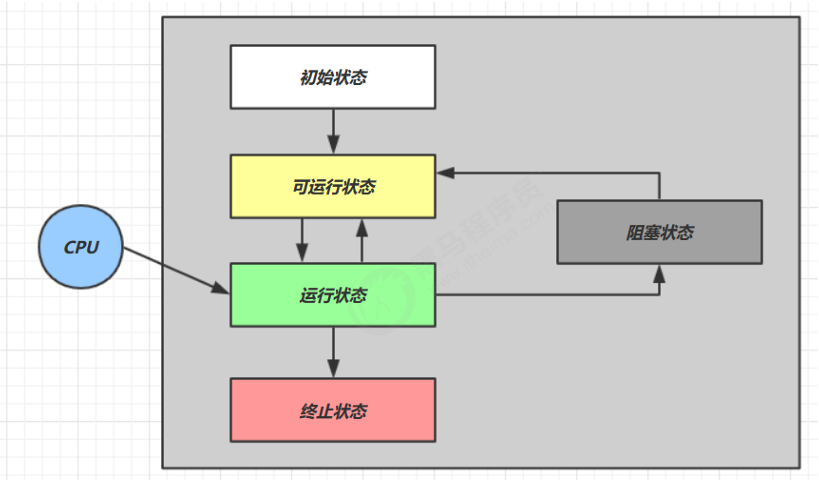
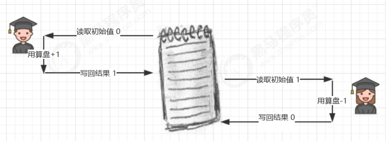

#  进程与线程
## 进程与线程 
### 进程 
- 程序由指令和数据组成，但这些指令要运行，数据要读写，就必须将指令加载至 CPU，数据加载至内存。在指令运行过程中还需要用到磁盘、网络等设备。进程就是用来加载指令、管理内存、管理 IO 的
- 当一个程序被运行，从磁盘加载这个程序的代码至内存，这时就开启了一个进程。
- 进程就可以视为程序的一个实例。大部分程序可以同时运行多个实例进程（例如记事本、画图、浏览器等），也有的程序只能启动一个实例进程（例如网易云音乐、360 安全卫士等）
### 线程 
- 一个进程之内可以分为一到多个线程。
- 一个线程就是一个指令流，将指令流中的一条条指令以一定的顺序交给 CPU 执行
- Java 中，线程作为最小调度单位，进程作为资源分配的最小单位。 在 windows 中进程是不活动的，只是作为线程的容器
 
 
 
 
 
 
### 二者对比 
- 进程基本上相互独立的，而线程存在于进程内，是进程的一个子集
- 进程拥有共享的资源，如内存空间等，供其内部的线程共享
- 进程间通信较为复杂
    - 同一台计算机的进程通信称为 IPC（Inter-process communication）
    - 不同计算机之间的进程通信，需要通过网络，并遵守共同的协议，例如 HTTP
- 线程通信相对简单，因为它们共享进程内的内存，一个例子是多个线程可以访问同一个共享变量
- 线程更轻量，线程上下文切换成本一般上要比进程上下文切换低
## 并行与并发
单核 cpu 下，线程实际还是 串行执行 的。操作系统中有一个组件叫做任务调度器，将 cpu 的时间片（windows下时间片最小约为 15 毫秒）分给不同的程序使用，只是由于 cpu 在线程间（时间片很短）的切换非常快，人类感觉是 同时运行的 。总结为一句话就是：微观串行，宏观并行，
一般会将这种 线程轮流使用 CPU 的做法称为并发， concurrent
|CPU|时间片 1|时间片 2|时间片 3|时间片 4|
|----------|-----------|-----------|-----------|-------|
|core|线程 1|线程 2|线程 3|线程 4|


多核 cpu下，每个 核（core） 都可以调度运行线程，这时候线程可以是并行的。


引用 Rob Pike 的一段描述：
**例子**
- 并发（concurrent）是同一时间应对（dealing with）多件事情的能力
- 并行（parallel）是同一时间动手做（doing）多件事情的能力

**例子**
- 家庭主妇做饭、打扫卫生、给孩子喂奶，她一个人轮流交替做这多件事，这时就是并发
- 家庭主妇雇了个保姆，她们一起这些事，这时既有并发，也有并行（这时会产生竞争，例如锅只有一口，一个人用锅时，另一个人就得等待）
- 雇了3个保姆，一个专做饭、一个专打扫卫生、一个专喂奶，互不干扰，这时是并行

# Java 线程
## 创建和运行线程 
### 方法一，直接使用 Thread
```java
// 创建线程对象
Thread t = new Thread() {
 public void run() {
 // 要执行的任务
    }
 };
 // 启动线程
t.start();
```
**例如：**
```java
// 构造方法的参数是给线程指定名字，推荐
Thread t1 = new Thread("t1") {
 @Override
 // run 方法内实现了要执行的任务
public void run() {
 log.debug("hello");
    }
 };
 t1.start();
```
### 方法二，使用 Runnable 配合 Thread 
把【线程】和【任务】（要执行的代码）分开
- Thread 代表线程
- Runnable 可运行的任务（线程要执行的代码）
```java
Runnable runnable = new Runnable() {
 public void run(){
 // 要执行的任务
    }
 };
 // 创建线程对象
Thread t = new Thread( runnable );
 // 启动线程
t.start(); 

```

例如：
```java
// 创建任务对象
Runnable task2 = new Runnable() {
 @Override
 public void run() {
 log.debug("hello");
    }
 };
 // 参数1 是任务对象; 参数2 是线程名字，推荐
Thread t2 = new Thread(task2, "t2");
 t2.start();
```

### 方法三，FutureTask 配合 Thread
FutureTask 能够接收 Callable 类型的参数，用来处理有返回结果的情况
```java
// 创建任务对象
FutureTask<Integer> task3 = new FutureTask<>(() -> {
 log.debug("hello");
 return 100;
 });
 // 参数1 是任务对象; 参数2 是线程名字，推荐
new Thread(task3, "t3").start();
 // 主线程阻塞，同步等待 task 执行完毕的结果
Integer result = task3.get();
 log.debug("结果是:{}", result);
```
## 观察多个线程同时运行
**windows** 
任务管理器可以查看进程和线程数，也可以用来杀死进程
- tasklist 查看进程
- taskkill 杀死进程

**linux**
- ps -fe 查看所有进程
- ps -fT -p (PID) 查看某个进程（PID）的所有线程
- kill  杀死进程
- top 按大写 H 切换是否显示线程
- top -H -p (PID) 查看某个进程（PID）的所有线程

**Java**
- jps 命令查看所有 Java 进程
- jstack (PID) 查看某个 Java 进程（PID）的所有线程状态 
- jconsole 来查看某个 Java 进程中线程的运行情况（图形界面）

**jconsole 远程监控配置**
需要以如下方式运行你的 java 类
```shell
java -Djava.rmi.server.hostname=`ip地址` -Dcom.sun.management.jmxremote 
Dcom.sun.management.jmxremote.port=`连接端口` -Dcom.sun.management.jmxremote.ssl 是否安全连接 
Dcom.sun.management.jmxremote.authenticate=是否认证 java类
```
- 修改 /etc/hosts 文件将 127.0.0.1 映射至主机名

如果要认证访问，还需要做如下步骤
- 复制 jmxremote.password 文件
- 修改 jmxremote.password 和 jmxremote.access 文件的权限为 600 即文件所有者可读写
- 连接时填入 controlRole（用户名），R&D（密码

## 原理之线程运行
Java Virtual Machine Stacks （Java 虚拟机栈）
我们都知道 JVM 中由堆、栈、方法区所组成，其中栈内存是给谁用的呢？其实就是线程，每个线程启动后，虚拟机就会为其分配一块栈内存。
- 每个栈由多个栈帧（Frame）组成，对应着每次方法调用时所占用的内存
- 每个线程只能有一个活动栈帧，对应着当前正在执行的那个方法
**线程上下文切换（Thread Context Switch）** 
因为以下一些原因导致 cpu 不再执行当前的线程，转而执行另一个线程的代码
- 线程的 cpu 时间片用完
- 垃圾回收
- 有更高优先级的线程需要运行
- 线程自己调用了 sleep、yield、wait、join、park、synchronized、lock 等方法

当 Context Switch 发生时，需要由操作系统保存当前线程的状态，并恢复另一个线程的状态，Java 中对应的概念就是程序计数器（Program Counter Register），它的作用是记住下一条 jvm 指令的执行地址，是线程私有的
- 状态包括程序计数器、虚拟机栈中每个栈帧的信息，如局部变量、操作数栈、返回地址等
- Context Switch 频繁发生会影响性能
## 常见方法
|方法名|static|功能说明|注意|
|--------|--------|---------|---------|
|start()| |启动一个新线程，在新的线程运行 run 方法中的代码|start 方法只是让线程进入就绪，里面代码不一定立刻运行（CPU 的时间片还没分给它）。每个线程对象的start方法只能调用一次，如果调用了多次会出现 IllegalThreadStateException|
|run()|| 新线程启动后会调用的方法|如果在构造 Thread 对象时传递了 Runnable 参数，则线程启动后会调用 Runnable 中的 run 方法，否则默认不执行任何操作。但可以创建 Thread 的子类对象，来覆盖默认行为|
|join()|| 等待线程运行结束|| 
|join(long n)|| 等待线程运行结束,最多等待 n毫秒||
|getId() ||获取线程长整型的 id||
|getName()|| 获取线程名 ||
|setName(String)|| 修改线程名 ||
|getPriority() ||获取线程优先级||
|setPriority(int) ||修改线程优先级 |java中规定线程优先级是1~10 的整数，较大的优先级能提高该线程被 CPU 调度的机率|
|getState() ||获取线程状态|Java 中线程状态是用 6 个 enum 表示，分别为：NEW, RUNNABLE, BLOCKED, WAITING, TIMED_WAITING, TERMINATED|
|interrupted() ||打断线程|如果被打断线程正在 sleep，wait，join 会导致被打断的线程抛出 InterruptedException，并清除**打断标记** ；如果打断的正在运行的线程，则会设置 **打断标记**  ；park 的线程被打断，也会设置**打断标记** |
|interrupted()| static|判断当前线程是否被打断|会清除**打断标记**|
| isInterrupted()||判断是否被打断|不会清除**打断标记**|
|isAlive() ||线程是否存活（还没有运行完毕）||
|currentThread()| static|获取当前正在执行的线程||
|sleep(long n)| static|让当前执行的线程休眠n毫秒，休眠时让出 cpu的时间片给其它线程||
|yield()| static|提示线程调度器让出当前线程对CPU的使用|主要是为了测试和调试|

## start 与 run
**调用 run**
```JAVA
public static void main(String[] args) {
 Thread t1 = new Thread("t1") {
 @Override
 public void run() {
 log.debug(Thread.currentThread().getName());
 FileReader.read(Constants.MP4_FULL_PATH);
        }
    };
 }
 t1.run();
 log.debug("do other things ...")
```
输出
```shell
19:39:14 [main] c.TestStart - main
 19:39:14 [main] c.FileReader - read [1.mp4] start ...
 19:39:18 [main] c.FileReader - read [1.mp4] end ... cost: 4227 ms
 19:39:18 [main] c.TestStart - do other things ...
```
程序仍在 main 线程运行，FileReader.read() 方法调用还是同步的

***调用 start***
将上述代码的 
t1.run() 改为
t1.start();
输出
```java
19:41:30 [main] c.TestStart - do other things ...
 19:41:30 [t1] c.TestStart - t1
 19:41:30 [t1] c.FileReader - read [1.mp4] start ...
 19:41:35 [t1] c.FileReader - read [1.mp4] end ... cost: 4542 ms
```

程序在 t1 线程运行，FileReader.read() 方法调用是异步的
## sleep 与 yield
**sleep**
1. 调用 sleep 会让当前线程从 Running  进入 Timed Waiting 状态（阻塞）
2. 其它线程可以使用  interrupt 方法打断正在睡眠的线程，这时 sleep 方法会抛出 
3. 睡眠结束后的线程未必会立刻得到执行
4. 建议用 TimeUnit 的 sleep 代替 Thread 的 sleep 来获得更好的可读性

**yield**
InterruptedException 
1. 调用 yield 会让当前线程从 Running 进入 Runnable  就绪状态，然后调度执行其它线程
2. 具体的实现依赖于操作系统的任务调度器

**线程优先级**
- 线程优先级会提示（hint）调度器优先调度该线程，但它仅仅是一个提示，调度器可以忽略它
- 如果 cpu 比较忙，那么优先级高的线程会获得更多的时间片，但 cpu 闲时，优先级几乎没作用

```java
Runnable task1 = () -> {
 int count = 0;
 for (;;) {
 System.out.println("---->1 " + count++);
    }
 };
 Runnable task2 = () -> {
 int count = 0;
 for (;;) {
 // Thread.yield();
 System.out.println("              ---->2 " + count++);
    }
 };
 Thread t1 = new Thread(task1, "t1");
 Thread t2 = new Thread(task2, "t2");
 // t1.setPriority(Thread.MIN_PRIORITY);
 // t2.setPriority(Thread.MAX_PRIORITY);
 t1.start();
 t2.start();
```

##  join 方法详解
为什么需要 join 
下面的代码执行，打印 r 是什么？
```java
static int r = 0;
 public static void main(String[] args) throws InterruptedException {
 test1();
 }
 private static void test1() throws InterruptedException {
 log.debug("开始");
 Thread t1 = new Thread(() -> {
 log.debug("开始");
 sleep(1);
 log.debug("结束");
 r = 10;
    });
 t1.start();
 log.debug("结果为:{}", r);
 log.debug("结束");
 }
```

**分析**
- 因为主线程和线程 t1 是并行执行的，t1 线程需要 1 秒之后才能算出 
- 而主线程一开始就要打印 r 的结果，所以只能打印出 

**解决方法**
- 用 sleep 行不行？为什么？
- 用 join，加在 t1.start() 之后即可

##  interrupt 方法详解 
**打断 sleep，wait，join 的线程**
这几个方法都会让线程进入阻塞状态
打断 sleep 的线程, 会清空打断状态，以 sleep 为例
```java
private static void test1() throws InterruptedException {
 Thread t1 = new Thread(()->{
 sleep(1);
    }, 
"t1");
 t1.start();
 }
 sleep(0.5);
 t1.interrupt();
 log.debug(" 打断状态: {}", t1.isInterrupted())
```

**输出**
```shell
java.lang.InterruptedException: sleep interrupted
 at java.lang.Thread.sleep(Native Method)
 at java.lang.Thread.sleep(Thread.java:340)
 at java.util.concurrent.TimeUnit.sleep(TimeUnit.java:386)
 at cn.itcast.n2.util.Sleeper.sleep(Sleeper.java:8)
 at cn.itcast.n4.TestInterrupt.lambda$test1$3(TestInterrupt.java:59)
 at java.lang.Thread.run(Thread.java:745)
 21:18:10.374 [main] c.TestInterrupt -  打断状态: false
```

**打断正常运行的线程**
打断正常运行的线程, 不会清空打断状态
```java
private static void test2() throws InterruptedException {
 Thread t2 = new Thread(()->{
 while(true) {
 Thread current = Thread.currentThread();
 boolean interrupted = current.isInterrupted();
 if(interrupted) {
 log.debug(" 打断状态: {}", interrupted);
 break;
            }
        }
    }, 
"t2");
 t2.start();
 sleep(0.5);
 t2.interrupt();
 }
```
输出
```shell
20:57:37.964 [t2] c.TestInterrupt -  打断状态: true 

```
**打断 park 线程**
打断 park 线程, 不会清空打断状态
```java
private static void test3() throws InterruptedException {
 Thread t1 = new Thread(() -> {
 log.debug("park...");
 LockSupport.park();
 log.debug("unpark...");
 log.debug("打断状态：{}", Thread.currentThread().isInterrupted());
    }, 
"t1");
 t1.start();
 sleep(0.5);
 t1.interrupt();
 }
```

输出
```shell
21:11:52.795 [t1] c.TestInterrupt - park... 
21:11:53.295 [t1] c.TestInterrupt - unpark... 
21:11:53.295 [t1] c.TestInterrupt - 打断状态：true
```
如果打断标记已经是 true, 则 park 会失效

## 主线程与守护线程
默认情况下，Java 进程需要等待所有线程都运行结束，才会结束。有一种特殊的线程叫做守护线程，只要其它非守护线程运行结束了，即使守护线程的代码没有执行完，也会强制结束.
```java
log.debug("开始运行...");
 Thread t1 = new Thread(() -> {
 log.debug("开始运行...");
 sleep(2);
 log.debug("运行结束...");
 }, "daemon");
 // 设置该线程为守护线程
t1.setDaemon(true);
 t1.start();
 sleep(1);
 log.debug("运行结束...");
```
输出
```shell
08:26:38.123 [main] c.TestDaemon - 开始运行... 
08:26:38.213 [daemon] c.TestDaemon - 开始运行... 
08:26:39.215 [main] c.TestDaemon - 运行结束...
```
##  五种状态
是从 操作系统 层面来描述的


- 【初始状态】仅是在语言层面创建了线程对象，还未与操作系统线程关联
- 【可运行状态】（就绪状态）指该线程已经被创建（与操作系统线程关联），可以由 CPU 调度执行
【运行状态】指获取了 CPU 时间片运行中的状态
    - 当 CPU 时间片用完，会从【运行状态】转换至【可运行状态】，会导致线程的上下文切换
- 【阻塞状态】
    - 如果调用了阻塞 API，如 BIO 读写文件，这时该线程实际不会用到 CPU，会导致线程上下文切换，进入【阻塞状态】
    - 等 BIO 操作完毕，会由操作系统唤醒阻塞的线程，转换至【可运行状态】
    - 与【可运行状态】的区别是，对【阻塞状态】的线程来说只要它们一直不唤醒，调度器就一直不会考虑调度它们
- 【终止状态】表示线程已经执行完毕，生命周期已经结束，不会再转换为其它状态

## 六种状态
这是从 Java API 层面来描述的,根据 Thread.State 枚举，分为六种状态


- NEW  线程刚被创建，但是还没有调用 start() 方法
- RUNNABLE 当调用了 start() 方法之后，注意，Java API 层面的 RUNNABLE 状态涵盖了 操作系统 层面的【可运行状态】、【运行状态】和【阻塞状态】（由于 BIO 导致的线程阻塞，在 Java 里无法区分，仍然认为是可运行）
- BLOCKED ，WAITING ，TIMED_WAITING 都是 Java API 层面对【阻塞状态】的细分
- TERMINATED 当线程代码运行结束

# 共享模型之管程
##  共享带来的问题
**小故事**

- 老王（操作系统）有一个功能强大的算盘（CPU），现在想把它租出去，赚一点外快

- 小南、小女（线程）来使用这个算盘来进行一些计算，并按照时间给老王支付费用
- 但小南不能一天24小时使用算盘，他经常要小憩一会（sleep），又或是去吃饭上厕所（阻塞 io 操作），有时还需要一根烟，没烟时思路全无（wait）这些情况统称为（阻塞）

- 在这些时候，算盘没利用起来（不能收钱了），老王觉得有点不划算
- 另外，小女也想用用算盘，如果总是小南占着算盘，让小女觉得不公平
- 于是，老王灵机一动，想了个办法 [ 让他们每人用一会，轮流使用算盘 ]
- 这样，当小南阻塞的时候，算盘可以分给小女使用，不会浪费，反之亦然
- 最近执行的计算比较复杂，需要存储一些中间结果，而学生们的脑容量（工作内存）不够，所以老王申请了一个笔记本（主存），把一些中间结果先记在本上
- 计算流程是这样的

- 但是由于分时系统，有一天还是发生了事故
- 小南刚读取了初始值 0 做了个 +1 运算，还没来得及写回结果
- 老王说 [ 小南，你的时间到了，该别人了，记住结果走吧 ]，于是小南念叨着 [ 结果是1，结果是1...] 不甘心地到一边待着去了（上下文切换）
- 老王说 [ 小女，该你了 ]，小女看到了笔记本上还写着 0 做了一个 -1 运算，将结果 -1 写入笔记本
- 这时小女的时间也用完了，老王又叫醒了小南：[小南，把你上次的题目算完吧]，小南将他脑海中的结果 1 写入了笔记本

- 小南和小女都觉得自己没做错，但笔记本里的结果是 1 而不是 0

**Java 的体现**
两个线程对初始值为 0 的静态变量一个做自增，一个做自减，各做 5000 次，结果是 0 吗?
```JAVA
static int counter = 0;
 public static void main(String[] args) throws InterruptedException {
 Thread t1 = new Thread(() -> {
 for (int i = 0; i < 5000; i++) {
 counter++;
        }
    }, 
"t1");
 Thread t2 = new Thread(() -> {
 for (int i = 0; i < 5000; i++) {
 counter--;
        }
    }, 
"t2");

 t1.start();
 t2.start();
 t1.join();
 t2.join();
 log.debug("{}",counter);
  }
```
**问题分析**
以上的结果可能是正数、负数、零。为什么呢？因为 Java 中对静态变量的自增，自减并不是原子操作，要彻底理解，必须从字节码来进行分析例如对于 i++ 而言（i 为静态变量），实际会产生如下的 JVM 字节码指令：
```JAVA
getstatic     i // 获取静态变量i的值
iconst_1         // 准备常量1
iadd              // 自增
putstatic     i // 将修改后的值存入静态变量i
```
而对应 
i-- 也是类似：
```JAVA
getstatic     i  // 获取静态变量i的值
iconst_1         // 准备常量1
isub              // 自减
putstatic     i  // 将修改后的值存入静态变量i
```
而 Java 的内存模型如下，完成静态变量的自增，自减需要在主存和工作内存中进行数据交换：


下面我举一个出现正数的例子：


**临界区 Critical Section**
- 一个程序运行多个线程本身是没有问题的
- 问题出在多个线程访问共享资源
    - 多个线程读共享资源其实也没有问题
    - 在多个线程对共享资源读写操作时发生指令交错，就会出现问题
- 一段代码块内如果存在对共享资源的多线程读写操作，称这段代码块为临界区

```java
static int counter = 0;
 static void increment() 
// 临界区
{    
counter++;
 }
 static void decrement() 
// 临界区
{    
counter--;
 }
```

## synchronized 解决方案
为了避免临界区的竞态条件发生，有多种手段可以达到目的。
- 阻塞式的解决方案：synchronized，Lock
- 非阻塞式的解决方案：原子变量

synchronized，即俗称的【对象锁】，它采用互斥的方式让同一时刻至多只有一个线程能持有【对象锁】，其它线程再想获取这个【对象锁】时就会阻塞住。这样就能保证拥有锁的线程可以安全的执行临界区内的代码，不用担心线程上下文切换.

**synchronized**
**语法**
```java
synchronized(对象) // 线程1， 线程2(blocked)
 {
临界区
}
```
**解决**
```java
static int counter = 0;
 static final Object room = new Object();
 public static void main(String[] args) throws InterruptedException {
 Thread t1 = new Thread(() -> {
 for (int i = 0; i < 5000; i++) {
    // 给指定对象加锁
 synchronized (room) {
 counter++;
            }
        }
    }, 
"t1");
 Thread t2 = new Thread(() -> {
 for (int i = 0; i < 5000; i++) {
    // 给指定对象加锁
 synchronized (room) {
 counter--;
            }
        }
    }, 
"t2");
 t1.start();
 t2.start();
 t1.join();
 t2.join();
 log.debug("{}",counter)
  }
```
你可以做这样的类比：
- synchronized(对象) 中的对象，可以想象为一个房间（room），有唯一入口（门）房间只能一次进入一人进行计算，线程 t1，t2 想象成两个人
- 当线程 t1 执行到synchronized(room) 时就好比 t1 进入了这个房间，并锁住了门拿走了钥匙，在门内执行 count++ 代码
- 这时候如果 t2 也运行到了synchronized(room) 时，它发现门被锁住了，只能在门外等待，发生了上下文切换，阻塞住了
- 这中间即使 t1 的 cpu 时间片不幸用完，被踢出了门外（不要错误理解为锁住了对象就能一直执行下去哦），
这时门还是锁住的，t1 仍拿着钥匙，t2 线程还在阻塞状态进不来，只有下次轮到 t1 自己再次获得时间片时才能开门进入
- 当 t1 执行完 synchronized{} 块内的代码，这时候才会从 obj 房间出来并解开门上的锁，唤醒 t2 线程把钥匙给他。t2 线程这时才可以进入 obj 房间，锁住了门拿上钥匙，执行它的 
用图来表示count-- 代码

##  方法上的 synchronized
```java
class Test{
 public synchronized void test() {
 }
 }
等价于
class Test{
 public void test() {
 synchronized(this) {
 }
 }
 }
```

```java

 class Test{
 public synchronized static void test() {
 }
 }
等价于
class Test{
 public static void test() {
 synchronized(Test.class) {
 }
 }
}
```