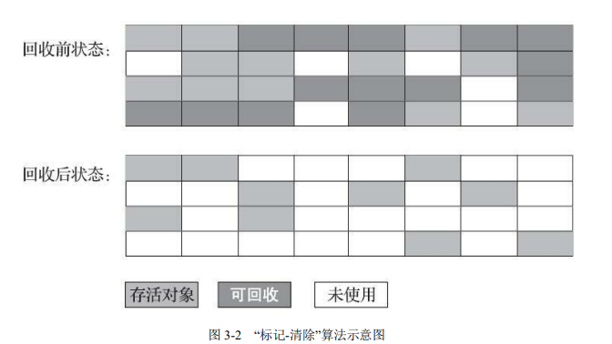
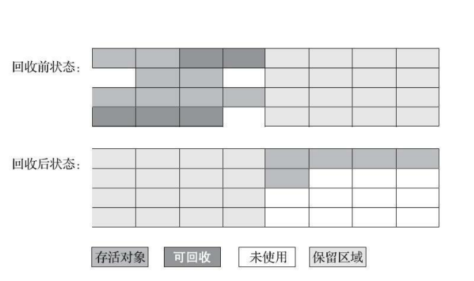
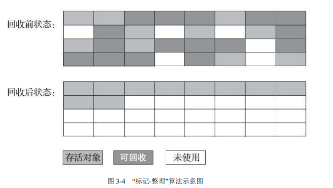
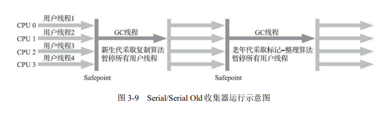
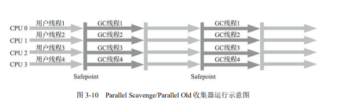
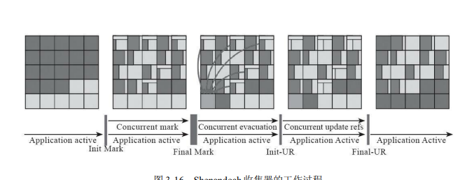
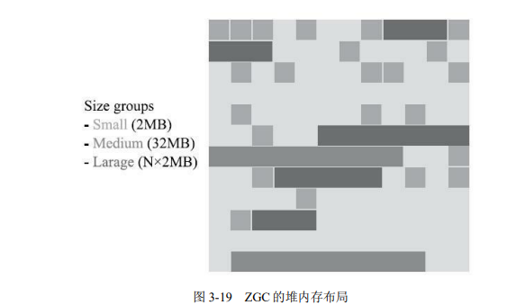

# Java 内存区域与内存溢出异常

### 运行时数据区域

Java 虚拟机在执行 Java 程序的过程中会把它所管理的内存划分为若干个不同的数据区域。


### 程序计数器

程序计数器（Program Counter Register）是一块较小的内存空间，它可以看作是当前线程所执行的字节码的行号指示器。在 Java 虚拟机的概念模型里，字节码解释器工作时就是通过改变这个计数器的值来选取下一条需要执行的字节码指令，它是程序控制流的指示器，分支、循环、跳转、异常处理、线程恢复等基础功能都需要依赖这个计数器来完成。

由于 Java 虚拟机的多线程是通过线程轮流切换、分配处理器执行时间的方式来实现的，在任何一个确定的时刻，一个处理器（对于多核处理器来说是一个内核）都只会执行一条线程中的指令。因此，为了线程切换后能恢复到正确的执行位置，每条线程都需要有一个独立的程序计数器，各条线程之间计数器互不影响，独立存储，我们称这类内存区域为“线程私有”的内存。


### Java 虚拟机栈

Java 虚拟机栈（Java Virtual Machine Stack）也是线程私有的，虚拟机栈描述的是 Java 方法执行的线程内存模型：每个方法被执行的时候，Java 虚拟机都会同步创建一个栈帧（Stack Frame）用于存储局部变量表、操作数栈、动态连接、方法出口等信息。每一个方法被调用直至执行完毕的过程，就对应着一个栈帧在虚拟机栈中从入栈到出栈的过程。

对虚拟机栈内存区域规定了两类异常状况：如果线程请求的栈深度大于虚拟机所允许的深度，将抛出 StackOverflowError 异常；如果 Java 虚拟机栈容量可以动态扩展，当栈扩展时无法申请到足够的内存会抛出 OutOfMemoryError 异常。

### 本地方法栈

本地方法栈（Native Method Stacks）与虚拟机栈所发挥的作用是非常相似的，其区别只是虚拟机栈为虚拟机执行 Java 方法（也就是字节码）服务，而本地方法栈则是为虚拟机使用到的本地（Native）方法服务。
本地方法栈也会在栈深度溢出或者栈扩展失败时分别抛出 StackOverflowError 和OutOfMemoryError 异常。
### Java 堆

对于 Java 应用程序来说，Java 堆（Java Heap）是虚拟机所管理的内存中最大的一块。Java 堆是被所有线程**共享**的一块内存区域，在虚拟机启动时创建。此内存区域的唯一目的就是存放对象实例.

Java 堆是垃圾收集器管理的内存区域。从回收内存的角度看，由于现代垃圾收集器大部分都是基于分代收集理论设计的，所以 Java 堆中经常会出现“新生代”“老年代”“永久代”“Eden 空间”“From Survivor 空间”“To Survivor 空间”等名词。如果从分配内存的角度看，所有线程共享的 Java 堆中可以划分出多个线程私有的分配缓冲区（Thread Local Allocation Buffer，TLAB），以提升对象分配时的效率。

### 方法区

方法区（Method Area）与 Java 堆一样，是各个线程共享的内存区域，它用于存储已被虚拟机加载的类型信息、常量、静态变量、即时编译器编译后的代码缓存等数据。


### 运行时常量池

运行时常量池（Runtime Constant Pool）是方法区的一部分。Class 文件中除了有类的版本、字段、方法、接口等描述信息外，还有一项信息是常量池表（Constant Pool Table），用于存放编译期生成的各种字面量与符号引用，这部分内容将在类加载后存放到方法区的运行时常量池中。

运行时常量池相对于 Class 文件常量池的另外一个重要特征是具备动态性，Java 语
言并不要求常量一定只有编译期才能产生，也就是说，并非预置入 Class 文件中常量池
的内容才能进入方法区运行时常量池，运行期间也可以将新的常量放入池中，这种特性
被开发人员利用得比较多的便是 String 类的 intern()方法。

### 直接内存

直接内存（Direct Memory）并不是虚拟机运行时数据区的一部分。但是这部分内存也被频繁地使用，而且也可能导致 OutOfMemoryError 异常出现。


## HotSpot 虚拟机

### 对象的创建
Java 是一门面向对象的编程语言，Java 程序运行过程中无时无刻都有对象被创建出来。当 Java 虚拟机遇到一条字节码 new 指令时，首先将去检查这个指令的参数是否能在常量池中定位到一个类的符号引用，并且检查这个符号引用代表的类是否已被加载、解析和初始化过。
在类加载检查通过后，接下来虚拟机将为新生对象分配内存。如果 Java 堆中的内存并不是规整的，已被使用的内存和空闲的内存相互交错在一起，那就没有办法简单地进行指针碰撞了，虚拟机就必须维护一个列表，记录上哪些内存块是可用的，在分配的时候从列表中找到一块足够大的空间划分给对象实例，并更新列表上的记录，这种分配方式称为“空闲列表”（Free List）。选择哪种分配方式由 Java 堆是否规整决定，而 Java 堆是否规整又由所采用的垃圾收集器是否带有空间压缩整理（Compact）的能力决定。因此，当使用 Serial、ParNew 等带压缩整理过程的收集器时，系统采用的分配算法是指针碰撞，既简单又高效；而当使用 CMS 这种基于清除（Sweep）算法的收集器时，理论上就只能采用较为复杂的空闲列表来分配内存。

对象创建在虚拟机中是非常频繁的行为，即使仅仅修改一个指针所指向的位置，在并发情况下也并不是线程安全的，可能出现正在给对象 A 分配内存，指针还没来得及修改，对象 B 又同时使用了原来的指针来分配内存的情况。解决这个问题有两种可选方案：一种是对分配内存空间的动作进行同步处理——实际上虚拟机是采用 CAS 配上失败重试的方式保证更新操作的原子性；另外一种是把内存分配的动作按照线程划分在不同的空间之中进行，即每个线程在 Java 堆中预先分配一小块内存，称为本地线程分配缓冲（Thread Local AllocationBuffer，TLAB），哪个线程要分配内存，就在哪个线程的本地缓冲区中分配，只有本地缓冲区用完了，分配新的缓存区时才需要同步锁定。内存分配完成之后，虚拟机必须将分配到的内存空间（但不包括对象头）都初始化为零值，如果使用了 TLAB 的话，这一项工作也可以提前至 TLAB 分配时顺便进行。

Java 虚拟机还要对内存分配后的对象进行必要的设置，例如这个对象是哪个类的实例、如何才能找到类的元数据信息、对象的哈希码（实际上对象的哈希码会延后到真正调用Object::hashCode()方法时才计算）、对象的 GC 分代年龄等信息。这些信息存放在象的对象头（Object Header）之中。根据虚拟机当前运行状态的不同，如是否启用偏向锁等，对象头会有不同的设置方式。在上面工作都完成之后，从虚拟机的视角来看，一个新的对象已经产生了。但是从Java 程序的视角看来，对象创建才刚刚开始——构造函数，即 Class 文件中的 \<init\>()方法还没有执行，所有的字段都为默认的零值，对象需要的其他资源和状态信息也还没有按照预定的意图构造好。接下来执行init（）函数经行初始化，java中的对象才算创建完成。

**HotSpot 解释器代码片段**

```java
// 确保常量池中存放的是已解释的类
if (!constants -> tag_at(index).is_unresolved_klass()) { // 断言确保是 klassOop 和instanceKlassOop
 oop entry = (klassOop) *constants->obj_at_addr(index);
 assert(entry->is_klass(), "Should be resolved klass");
 klassOop k_entry = (klassOop) entry;
 assert (k_entry -> klass_part()->oop_is_instance(), "Should be instanceKlass");
 instanceKlass * ik = (instanceKlass *) k_entry -> klass_part();
 // 确保对象所属类型已经经过初始化阶段
 if (ik -> is_initialized() && ik -> can_be_fastpath_allocated()) {
 // 取对象长度
 size_t obj_size = ik -> size_helper();
 oop result = NULL;
 // 记录是否需要将对象所有字段置零值
 bool need_zero = !ZeroTLAB; // 是否在 TLAB 中分配对象
 if (UseTLAB) {
 result = (oop) THREAD -> tlab().allocate(obj_size);
 }
 if (result == NULL) {
 need_zero = true; // 直接在 eden 中分配对象 retry:
 HeapWord * compare_to = *Universe::heap () -> top_addr();
 HeapWord * new_top = compare_to + obj_size;
 // cmpxchg 是 x86 中的 CAS 指令，这里是一个 C++方法，通过 CAS 方式分配空间，并发失败的话，转到 retry 中重试直至成功分配为止
 if (new_top <= *Universe::heap () -> end_addr()){
 if (Atomic::cmpxchg_ptr (new_top, Universe::heap() -> top_addr(),
compare_to) !=compare_to)
 goto retry;
 }
 result = (oop) compare_to;
 }
 }
 if (result != NULL) {
 // 如果需要，为对象初始化零值
 if (need_zero) {
 HeapWord * to_zero = (HeapWord *) result + sizeof(oopDesc) / oopSize;
 obj_size -= sizeof(oopDesc) / oopSize;
 if (obj_size > 0) {
 memset(to_zero, 0, obj_size * HeapWordSize);
 }
 }
 // 根据是否启用偏向锁，设置对象头信息
 if (UseBiasedLocking) {
 result -> set_mark(ik -> prototype_header());
 } else {
 result -> set_mark(markOopDesc::prototype ());
 }
 result -> set_klass_gap(0);
 result -> set_klass(k_entry);
 // 将对象引用入栈，继续执行下一条指令
 SET_STACK_OBJECT(result, 0);
 UPDATE_PC_AND_TOS_AND_CONTINUE(3, 1);
 }
}
```
### 对象的内存布局
在 HotSpot 虚拟机里，对象在堆内存中的存储布局可以划分为三个部分：对象头（Header）、实例数据（Instance Data）和对齐填充（Padding）。
**对象头**部分包括两类信息。第一类是用于存储对象自身的运行时数据，如哈希码（HashCode）、GC 分代年龄、锁状态标志、线程持有的锁、偏向线程 ID、偏向时间戳等，这部分数据的长度在 32 位和 64 位的虚拟机中分别为 32 个比特和 64 个比特，官方称它为“Mark Word”。Mark Word 被设计成一个有着动态定义的数据结构，以便在极小的空间内存储尽量多的数，根据对象的状态复用自己的存储空间。


对象头的另外一部分是类型指针，即对象指向它的类型元数据的指针，Java 虚拟机通过这个指针来确定该对象是哪个类的实例。

**实例数据**部分是对象真正存储的有效信息，即我们在程序代码里面所定义的各种类型的字段内容，无论是从父类继承下来的，还是在子类中定义的字段都必须记录起来。

**对齐填充**，这并不是必然存在的，也没有特别的含义，它仅仅起着占位符的作用。
### 对象的访问定位
主流的访问方式主要有使用句柄和直接指针两种：
1. **句柄访问**，Java 堆中将可能会划分出一块内存来作为句柄池，reference 中存储的就是对象的句柄地址，而句柄中包含了对象实例数据与类型数据各自具体的地址信息。

2. **直接指针**，Java 堆中对象的内存布局就必须考虑如何放置访问类型数据的相关信息，reference 中存储的直接就是对象地址，如果只是访问对象本身的话，就不需要多一次间接访问的开销。

这两种对象访问方式各有优势，使用句柄来访问的最大好处就是 reference 中存储的是稳定句柄地址，在对象被移动（垃圾收集时移动对象是非常普遍的行为）时只会改变句柄中的实例数据指针，而 reference 本身不需要被修改。使用直接指针来访问最大的好处就是速度更快，它节省了一次指针定位的时间开销.


# 垃圾收集器与内存分配策略
## 概述
Java 堆和方法区这两个区域则有着很显著的不确定性：一个接口的多个实现类需要的内存可能会不一样，一个方法所执行的不同条件分支所需要的内存也可能不一样，只有处于运行期间，我们才能知道程序究竟会创建哪些对象，创建多少个对象，这部分内存的分配和回收是动态的。垃圾收集器所关注的正是这部分内存该如何管理。
## 对象回收
在堆里面存放着 Java 世界中几乎所有的对象实例，垃圾收集器在对堆进行回收前，第一件事情就是要确定这些对象之中哪些还“存活”着，哪些已经“死去”（“死去”即不可能再被任何途径使用的对象）了。
### 引用计数算法
在对象中添加一个引用计数器，每当有一个地方引用它时，计数器值就加一；当引用失效时，计数器值就减一；任何时刻计数器为零的对象就是不可能再被使用的。然而引用计数法，却有很多缺陷.
下面这种互相引用的情况，如果仅仅使用引用计数法，便不能回收，objA 和objB所占的内存空间。
```jAVA
public class ReferenceCountingGC {
 public Object instance = null;
 private static final int _1MB = 1024 * 1024;
 /**
 * 这个成员属性的唯一意义就是占点内存，以便能在 GC 日志中看清楚是否有回收过
 */
 private byte[] bigSize = new byte[2 * _1MB];
 public static void testGC() {
 ReferenceCountingGC objA = new ReferenceCountingGC();
 ReferenceCountingGC objB = new ReferenceCountingGC();
 objA.instance = objB;
 objB.instance = objA;
 objA = null;
 objB = null;
 // 假设在这行发生 GC，objA 和 objB 是否能被回收？
 System.gc();
 }
}
```

### 可达性分析算法
这个算法的基本思路就是通过一系列称为“GC Roots”的根对象作为起始节点集，从这些节点开始，根据引用关系向下搜索，搜索过程所走过的路径称为“引用链”（Reference Chain），如果某个对象到 GC Roots 间没有任何引用链相连，或者用图论的话来说就是从 GC Roots 到这个对象不可达时，则证明此对象是不可能再被使用的。

如图下图，对象 object 5、object 6、object 7 虽然互有关联，但是它们到 GC Roots 是不可达的，因此它们将会被判定为可回收的对象。


在 Java 技术体系里面，固定可作为 GC Roots 的对象包括以下几种：
·在虚拟机栈（栈帧中的本地变量表）中引用的对象，譬如各个线程被调用的方法堆栈中使用到的参数、局部变量、临时变量等。
- 在方法区中类静态属性引用的对象，譬如 Java 类的引用类型静态变量。
- 在方法区中常量引用的对象，譬如字符串常量池（String Table）里的引用。
- 在本地方法栈中 JNI（即通常所说的 Native 方法）引用的对象。
- Java 虚拟机内部的引用，如基本数据类型对应的 Class 对象，一些常驻的异常对象（比如 NullPointExcepiton、OutOfMemoryError）等，还有系统类加载器。
- 所有被同步锁（synchronized 关键字）持有的对象。
- 反映 Java 虚拟机内部情况的 JMXBean、JVMTI 中注册的回调、本地代码缓存等。
###  四种引用
Java 将引用分为强引用（Strongly Re-ference）、软引用（Soft Reference）、弱引用（Weak Reference）和虚引用（Phantom Reference）4 种，这 4 种引用强度依次逐渐减弱。

- 强引用是最传统的“引用”的定义，是指在程序代码之中普遍存在的引用赋值
- 软引用是用来描述一些还有用，但非必须的对象。只被软引用关联着的对象，在系统将要发生内存溢出异常前，会把这些对象列进回收范围之中进行第二次回收，
- 弱引用也是用来描述那些非必须对象，但是它的强度比软引用更弱一些
- 虚引用 为一个对象设置虚引用关联的唯一目的只是为了能在这个对象被收集器回收时收到一个系统通知。
### 生存还是死亡
要真正宣告一个对象死亡，至少要经历两次标记过程：如果对象在进行可达性分析后发现没有与 GC Roots 相连接的引用链，那它将会被第一次标记，随后进行一次筛选，筛选的条件是此对象是否有必要执行 finalize()方法。
假如对象没有覆盖 finalize()方法，或者 finalize()方法已经被虚拟机调用过，那么虚拟机将这两种情况都视为“没有必要执行”。如果这个对象被判定为确有必要执行 finalize()方法，那么该对象将会被放置在一个名为 F-Queue 的队列之中，并在稍后由一条由虚拟机自动建立的、低调度优先级的Finalizer 线程去执行它们的 finalize() 方法。
### 回收方法区
方法区的垃圾收集主要回收两部分内容：废弃的常量和不再使用的类型。回收废弃常量与回收 Java 堆中的对象非常类似。

判定一个类型是否属于“不再被使用的类”的条件就比较苛刻了。需要同时满足下面三个条件
- 该类所有的实例都已经被回收，也就是 Java 堆中不存在该类及其任何派生子类的实例。
- 加载该类的类加载器已经被回收，这个条件除非是经过精心设计的可替换类加载器的场景，如 OSGi、JSP 的重加载等，否则通常是很难达成的。
- 该类对应的 java.lang.Class 对象没有在任何地方被引用，无法在任何地方通过反射访问该类的方法。

## 垃圾收集算法
用计数式垃圾收集（Reference Counting GC）和“追踪式垃圾收集”（Tracing GC）两大类，这两类也常被称作“直接垃圾收集”和“间接垃圾收集”。
### 分代收集理论
分代收集名为理论，实质是一套符合大多数程序运行实际情况的经验法则，它建立在三个分代假说之上：
**弱分代假说（Weak Generational Hypothesis）**：绝大多数对象都是朝生夕灭的。
**强分代假说（Strong Generational Hypothesis）**：熬过越多次垃圾收集过程的对象就越难以消亡。

这两个分代假说共同奠定了多款常用的垃圾收集器的一致的设计原则：收集器应该将 Java 堆划分出不同的区域，然后将回收对象依据其年龄（年龄即对象熬过垃圾收集过程的次数）分配到不同的区域之中存储。显而易见，如果一个区域中大多数对象都是朝生夕灭，难以熬过垃圾收集过程的话，那么把它们集中放在一起，每次回收时只关注如何保留少量存活而不是去标记那些大量将要被回收的对象，就能以较低代价回收到大量的空间；如果剩下的都是难以消亡的对象，那把它们集中放在一块，虚拟机便可以使用较低的频率来回收这个区域，这就同时兼顾了垃圾收集的时间开销和内存的空间有效利用。


设计者一般至少会把 Java 堆划分为新生代（Young Generation）和老年代（Old Generation）两个区域。

假如要现在进行一次只局限于新生代区域内的收集（Minor GC），但新生代中的对象是完全有可能被老年代所引用的，为了找出该区域中的存活对象，不得不在固定的GC Roots 之外，再额外遍历整个老年代中所有对象来确保可达性分析结果的正确性，反过来也是一样。遍历整个老年代所有对象的方案虽然理论上可行，但无疑会为内存回收带来很大的性能负担。为了解决这个问题，就需要对分代收集理论添加第三条经验法则：
3）**跨代引用假说**（Intergenerational Reference Hypothesis）：跨代引用相对于同代引用来说仅占极少数。

存在互相引用关系的两个对象，是应该倾向于同时生存或者同时消亡的。举个例子，如果某个新生代对象存在跨代引用，由于老年代对象难以消亡，该引用会使得新生代对象在收集时同样得以存活，进而在年龄增长之后晋升到老年代中，这时跨代引用也随即被消除了。依据这条假说，我们就不应再为了少量的跨代引用去扫描整个老年代，也不必浪费空间专门记录每一个对象是否存在及存在哪些跨代引用，只需在新生代上建立一个全局
的数据结构（该结构被称为“记忆集”，Remembered Set），这个结构把老年代划分成若干小块，标识出老年代的哪一块内存会存在跨代引用。此后当发生 Minor GC 时，只有包含了跨代引用的小块内存里的对象才会被加入到 GCRoots 进行扫描。
### 标记-清除算法
该算法算法分为“标记”和“清除”两个阶段：首先标记出所有需要回收的对象，在标记完成后，统一回收掉所有被标记的对象，也可以反过来，标记存活的对象，统一回收所有未被标记的对象。
**缺点**
1. 执行效率不稳定，如果 Java 堆中包含大量对象，而且其中大部分是需要被回收的，这时必须进行大量标记和清除的动作，导致标记和清除两个过程的执行效率都随对象数量增长而降低
2. 内存空间的碎片化问题，标记、清除之后会产生大量不连续的内存碎片，空间碎片太多可能会导致当以后在程序运行过程中需要分配较大对象时无法找到足够的连续存而不得不提前触发另一次垃圾收集动作


### 标记-复制算法
将可用内存按容量划分为大小相等的两块，每次只使用其中的一块。当这一块的内存用完了，就将还存活着的对象复制到另外一块上面，然后再把已使用过的内存空间一次清理掉。如果内存中多数对象都是存活的，这种算法将会
产生大量的内存间复制的开销，但对于多数对象都是可回收的情况，算法需要复制的就是占少数的存活对象，而且每次都是针对整个半区进行内存回收，分配内存时也就不用考虑有空间碎片的复杂情况，只要移动堆顶指针，按顺序分配即可。


新生代中的对象有98%熬不过第一轮收集。因此并不需要按照 1∶1 的比例来划分新生代的内存空间。

HotSpot 虚拟机默认 Eden 和 Survivor 的大小比例是 8∶1，也即每次新生代中可用内存空间为整个新生代容量的 90%（Eden 的 80%加上一个 Survivor 的 10%），只有一个 Survivor 空间，即 10%的新生代是会被“浪费”的。当然，98%的对象可被回收仅仅是“普通场景”下测得的数据，任何人都没有办法百分百保证每次回收都只有不多于 10%的对象存活，因此 Appel 式回收还有一个充当罕见情况的“逃生门”的安全设计，当Survivor 空间不足以容纳一次 Minor GC 之后存活的对象时，就需要依赖其他内存区域（实际上大多就是老年代）进行分配担保（Handle Promotion）。内存的分配担保好比我们去银行借款，如果我们信誉很好，在 98%的情况下都能按
时偿还，于是银行可能会默认我们下一次也能按时按量地偿还贷款，只需要有一个担保人能保证如果我不能还款时，可以从他的账户扣钱，那银行就认为没有什么风险了。内存的分配担保也一样，如果另外一块 Survivor 空间没有足够空间存放上一次新生代收集下来的存活对象，这些对象便将通过分配担保机制直接进入老年代，这对虚拟机来说就是安全的。
### 标记-整理算法
标记-复制算法在对象存活率较高时就要进行较多的复制操作，效率将会降低。

针对老年代对象的存亡特征，“标记-整理”（Mark-Compact）算法，其中的标记过程仍然与“标记-清除”算法一样，但后续步骤不是直接对可回收对象进行清理，而是让所有存活的对象都向内存空间一端移动，然后直接清理掉边界以外的内存。


标记-清除算法与标记-整理算法的本质差异在于前者是一种非移动式的回收算法，而后者是移动式的。是否移动回收后的存活对象是一项优缺点并存的风险决策：
1. 如果移动存活对象，尤其是在老年代这种每次回收都有大量对象存活区域，移动存活对象并更新所有引用这些对象的地方将会是一种极为负重的操作，而且这种对象移动操作必须全程暂停用户应用程序才能进行
2. 如果跟标记-清除算法那样完全不考虑移动和整理存活对象的话，弥散于堆中的存活对象导致的空间碎片化问题就只能依赖更为复杂的内存分配器和内存访问器来解决。内存的访问是用户程序最频繁的操作，甚至都没有之一，假如在这个环节上增加了额外的负担，势必会直接影响应用程序的吞吐量。
HotSpot 虚拟机里面关注吞吐量的 Parallel Scavenge收集器是基于标记-整理算法的，而关注延迟的 CMS 收集器则是基于标记-清除算法的，

## HotSpot 的算法细节实现
### 根节点枚举
所有收集器在根节点枚举这一步骤时都是必须暂停用户线程的。

由于目前主流 Java 虚拟机使用的都是准确式垃圾收集，虚拟机应当是有办法直接得到哪些地方存放着对象引用的。在 HotSpot 的解决方案里，是使用一组称为 OopMa数据结构来达到这个目的。一旦类加载动作完成的时候， HotSpot 就会把对象内什么偏移量上是什么类型的数据计算出来，在即时编译过程中，也会在特定的位置记录下栈和寄存器里哪些位置是引用。这样收集器在扫描时就可以直接得知这些信息了，并不需要真正一个不漏地从方法区等 GC Roots 开始查找。


### 安全点
实际上 HotSpot 也的确没有为每条指令都生成 OopMap，只是在“特定的位置”记录了这些信息，这些位置被称为安全点（Safepoint）。安全点位置的选取基本上是以“是否具有让程序长时间执行的特征”为标准进行选定的，因
为每条指令执行的时间都非常短暂，程序不太可能因为指令流长度太长这样的原因而长时间执行，“长时间执行”的最明显特征就是指令序列的复用，例如方法调用、循环跳转、异常跳转等都属于指令序列复用，所以只有具有这些功能的指令才会产生安全点。

**抢先式中断（Preemptive Suspension）**和**主动式中断（Voluntary Suspension）**抢先式中断不需要线程的执行代码主动去配合，在垃圾收集发生时，系统首先把所有用户线程全部中断，如果发现有用户线程中断的地方不在安全点上，就恢复这条线程执行，让它一会再重新中断，直到跑到安全点上。主动式中断的思想是当垃圾收集需要中断线程的时候，不直接对线程操作，仅仅简单地设置一个标志位，各个线程执行过程时会不停地主动去轮询这个标志，一旦发现中断标志为真时就自己在最近的安全点上主动中断挂起。轮询标志的地方和安全点是重合的，另外还要加上所有创建对象和其他需要在 Java 堆上分配内存的地方，这是为了检查是否即将要发生垃圾集，避免没有足够内存分配新对象。

### 安全区域

程序“不执行”的时候呢？所谓的程序不执行就是没有分配处理器时间，典型的场景便是用户线程处于 Sleep 状态或者Blocked 状态，这时候线程无法响应虚拟机的中断请求，不能再走到安全的地方去中断挂起自己，虚拟机也显然不可能持续等待线程重新被激活分配处理器时间。对于这种情况，就必须引入安全区域（Safe Region）来解决。
安全区域是指能够确保在某一段代码片段之中，引用关系不会发生变化，因此，在这个区域中任意地方开始垃圾收集都是安全的。我们也可以把安全区域看作被扩展拉伸了的安全点。

### 记忆集与卡表
为解决对象跨代引用所带来的问题，垃圾收集器在新生代中建立了名为记忆集（Remembered Set）的数据结构，用以避免把整个老年代加进 GC Roots 扫描范围。所有涉及部分区域收集（Partial GC）行为的垃圾收集器，，都会面临相同的问题，
记忆集是一种用于记录从非收集区域指向收集区域的指针集合的抽象数据结构。
- 字长精度：每个记录精确到一个机器字长（就是处理器的寻址位数，如常见的 32位或 64 位，这个精度决定了机器访问物理内存地址的指针长度），该字包含跨代指针。
- 对象精度：每个记录精确到一个对象，该对象里有字段含有跨代指针。
- 卡精度：每个记录精确到一块内存区域，该区域内有对象含有跨代指针。


其中，第三种“卡精度”所指的是用一种称为“卡表”（Card Table）的方式去实现记忆集，这也是目前最常用的一种记忆集实现形式.卡表就是记忆集的一种具体实现，它定义了记忆集的记录精度、与堆内存的映射关系等。
卡表最简单的形式可以只是一个字节数组，而 HotSpot 虚拟机确实也是这样做的。以下这行代码是 HotSpot 默认的卡表标记逻辑：
```java
CARD_TABLE [this address >> 9] = 0;
```

字节数组 CARD_TABLE 的每一个元素都对应着其标识的内存区域中一块特定大小的内存块，这个内存块被称作“卡页”（Card Page）。一般来说，卡页大小都是以 2 的 N次幂的字节数，通过上面代码可以看出 HotSpot 中使用的卡页是 2 的 9 次幂，即 512 字节（地址右移 9 位，相当于用地址除以 512）。
一个卡页的内存中通常包含不止一个对象，只要卡页内有一个（或更多）对象的字段存在着跨代指针，那就将对应卡表的数组元素的值标识为 1，称为这个元素变脏（Dirty），没有则标识为 0。在垃圾收集发生时，只要筛选出卡表中变脏的元素，就能轻易得出哪些卡页内存块中包含跨代指针，把它们加入 GC Roots 中一并扫描。

### 写屏障
在 HotSpot 虚拟机里是通过写屏障（Write Barrier）技术维护卡表状态的。写屏障以看作在虚拟机层面对“引用类型字段赋值”这个动作的 AOP 切面，在引用对象赋值时会产生一个环形（Around）通知，供程序执行额外的动作，也就是说赋值的前后都在写障覆盖范畴内。在赋值前的部分的写屏障叫作写前屏障（Pre-Write Barrier），在赋值后的则叫作写后屏障（Post-Write Barrier）。HotSpot 虚拟机的许多收集器中都有使用到写屏障。

应用写屏障后，虚拟机就会为所有赋值操作生成相应的指令，一旦收集器在写屏障中增加了更新卡表操作，无论更新的是不是老年代对新生代对象的引用。除了写屏障的开销外，卡表在高并发场景下还面临着“伪共享”（False Sharing）问题。伪共享是处理并发底层细节时一种经常需要考虑的问题，现代中央处理器的缓存系统中是以缓存行（Cache Line）为单位存储的，当多线程修改互相独立的变量时，如果这些变量恰好共享同一个缓存行，就会彼此影响（写回、无效化或者同步）而导致性能降低，这就是伪共享问题。
假设处理器的缓存行大小为 64 字节，由于一个卡表元素占 1 个字节，64 个卡表元素将共享同一个缓存行。这 64 个卡表元素对应的卡页总的内存为 32KB（64×512 节），也就是说如果不同线程更新的对象正好处于这 32KB 的内存区域内，就会导致更新卡表时正好写入同一个缓存行而影响性能。为了避免伪共享问题，一种简单的解决方案是不采用无条件的写屏障，而是先检查卡表标记，只有当该卡表元素未被标记过时才将其标记为变脏.

### 并发的可达性分析
- 白色：表示对象尚未被垃圾收集器访问过。显然在可达性分析刚刚开始的阶段，所有的对象都是白色的，若在分析结束的阶段，仍然是白色的对象，即代表不可达。
- 黑色：表示对象已经被垃圾收集器访问过，且这个对象的所有引用都已经扫描过。黑色的对象代表已经扫描过，它是安全存活的，如果有其他对象引用指向了黑色对象，无须重新扫描一遍。黑色对象不可能直接（不经过灰色对象）指向某个白色对象。
- 灰色：表示对象已经被垃圾收集器访问过，但这个对象上至少存在一个引用还没有被扫描过。


当且仅当以下两个条件同时满足时，会产生“对象消失”，即原本应该是黑色的对象被误标为白色：
- 赋值器插入了一条或多条从黑色对象到白色对象的新引用；
- 赋值器删除了全部从灰色对象到该白色对象的直接或间接引用。
因此，我们要解决并发扫描时的对象消失问题，只需破坏这两个条件的任意一个即可。由此分别产生了两种解决方案：增量更新（Incremental Update）和原始快照（Snapshot At The Beginning， SATB）。增量更新要破坏的是一个条件，当黑色对象插入新的指向白色对象的引用关系时，就将这个新插入的引用记录下来，等并发扫描结束之后，再将这些记录过的引用关系中的黑色对象为根，重新扫描一次。这可以简化理解为，黑色对象一旦新插入了指向
白色对象的引用之后，它就变回灰色对象了。原始快照要破坏的是第二个条件，当灰色对象要删除指向白色对象的引用关系时，就将这个要删除的引用记录下来，在并发扫描结束之后，再将这些记录过的引用关系中的灰色对象为根，重新扫描一次。这也可以简化理解为，无论引用关系删除与否，都会按照刚刚开始扫描那一刻的对象图快照来进行搜索。

## 经典垃圾收集器

### Serial 收集器
这个收集器是一个单线程工作的收集器，但它的“单线程”的意义并不仅仅是说明它只会使用一个处理器或一条收集线程去完成垃圾收集工作，必须暂停其他所有工作线程，直到它收集结束。


### ParNew 收集器
ParNew 收集器实质上是 Serial 收集器的多线程并行版本，除了同时使用多条线程进行垃圾收集之外，其余的行为包括 Serial 收集器可用的所有控制参数（例如：-XX：SurvivorRatio、-XX： PretenureSizeThreshold、-XX：HandlePromotionFailure 等）


### Parallel Scavenge 收集器
Parallel Scavenge 收集器也是一款新生代收集器，它是基于标记-复制算法实现的收集器，Parallel Scavenge 收集器的目标则是达到一个可控制的吞吐量（Throughput）。


Parallel Scavenge 收集器提供了两个参数用于精确控制吞吐量，分别是控制最大垃圾收集停顿时间的-XX：MaxGCPauseMillis 参数以及直接设置吞吐量大小的-XX：
GCTimeRatio 参数。
**XX：MaxGCPauseMillis** 参数允许的值是一个大于 0 的毫秒数，收集器将尽力保证内存回收花费的时间不超过用户设定值。垃圾收集停顿时间缩短是以牺牲吞吐量和新生代空间为代价换取的：系统把新生代调得小一些，收集 300MB 新生代肯定比收集 500MB 快，但这也直接导致垃圾收集发生得更频繁，原来 10 秒收集一次、每次停顿 100 毫秒，现在变成 5 秒收集一次、每次停顿 70 毫秒。停顿时间的确在下降，但吞吐量也降下来了。 

**-XX：GCTimeRatio** 参数的值则应当是一个大于 0 小于 100 的整数，也就是垃圾收集时间占总时间的比率，相当于吞吐量的倒数。譬如把此参数设置为 19，那允许的最大垃圾收集时间就占总时间的 5%（即 1/(1+19)），默认值为 99，即允许最大 1%（即1/(1+99)）的垃圾收集时间。

Parallel Scavenge 收集器还有一个参数-XX：+UseAdaptiveSizePolicy 值得我们关注。这是一个开关参数，当这个参数被激活之后，就不需要人工指定新生代的大小（-Xmn）、Eden 与Survivor 区的比例（-XX：SurvivorRatio）、晋升老年代对象大小（-XX：PretenureSizeThreshold）

###  Serial Old 收集器
Serial Old 是 Serial 收集器的老年代版本，它同样是一个单线程收集器，使用标记整理算法。这个收集器的主要意义也是供客户端模式下的 HotSpot 虚拟机使用。如果在服务端模式下，它也可能有两种用途：一种是在 JDK 5 以及之前的版本中与 Parallel Scavenge 收集器搭配使用，另外一种就是作为 CMS 收集器发生失败时的后备预案，在并发收集发生 Concurrent Mode Failure 时使用。



### Parallel Old 收集器
Parallel Old 是 Parallel Scavenge 收集器的老年代版本，支持多线程并发收集，基于标记-整理算法实现。都可以优先考虑 Parallel Scavenge 加 Parallel Old 收集器这个组合。



### CMS 收集器
CMS（Concurrent Mark Sweep）收集器是一种以获取最短回收停顿时间为目标的收集器。
- 初始标记（CMS initial mark）
- 并发标记（CMS concurrent mark）
- 重新标记（CMS remark）
- 并发清除（CMS concurrent sweep）

**初始标记**、**重新标记**这两个步骤仍然需要“Stop The World”。初始标记仅仅只是标记一下 GC Roots 能直接关联到的对象，速度很快；**并发标记**阶段就是从 GC Roots 的直接关联对象开始遍历整个对象图的过程，这个过程耗时较长但是不需要停顿用户线程，可以与垃圾收集线程一起并发运行；而**重新标记**阶段则是为了修正并发标记期间，因用户程序继续运作而导致标记产生变动的那一部分对象的标记记录，最后是**并发清除**阶段，清理删除掉标记阶段判断的已经死亡的对象，由于不需要移动存活对象，所以这个阶段也是可以与用户线程同时并发的。由于在整个过程中耗时最长的**并发标记**和**并发清除**阶段中，垃圾收集器线程都可以与用户线程一起工作，所以从总体上来说，CMS 收集器的内存回收过程是与用户线程一起并发执行的。


**cms收集器缺点**
1. 面向并发设计的程序都对处理器资源比较敏感。在并发阶段，它虽然不会导致用户线程停顿，但却会因为占用了一部分线程而导致应用程序变慢，降低总吞吐量。CMS 默认启动的回收线程数是（处理器核心数量+3）/4，也就是说，如果处理器核心数在四个或以上，并发回收时垃圾收集线程只占用不超过 25%的处理器运算资源，并且会随着处理器核心数量的增加而下降。但是当处理器核心数量不足四个时， CMS 对用户程序的影响就可能变得很大。


2. 由于 CMS 收集器无法处理“浮动垃圾”（Floating Garbage），有可能出现“Con-current Mode Failure”失败进而导致另一次完全“Stop The World”的 Full GC 的产生。在 CMS 的并发标记和并发清理阶段，用户线程是还在继续运行的，程序在运行自然就还会伴随有新的垃圾对象不断产生，但这一部分垃圾对象是出现在标记过程结束以后，CMS 无法在当次收集中处理掉它们，只好留待下一次垃圾收集时再清理掉。这一分垃圾就称为“浮动垃圾”。同样也是由于在垃圾收集阶段用户线程还需要持续运行，那就还需要预留足够内存空间提供给用户线程使用，因此 CMS 收集器不能像其他收集器那样等待到老年代几乎完全被填满了再进行收集，必须预留一部分空间供并发收集时的程序运作使用。

3. CMS 是一款基于“标记-清除”算法实现的收集器，到这意味着收集结束时会有大量空间碎片产生。空间碎片过多时，将会给大对象分配带来很大麻烦，往往会出现老年代还有很多剩余空间，但就是无法找到足够大的连续空间来分配当前对象，而不得不提前触发一次 Full GC 的情况。

### Garbage First 收集器

Garbage First（简称 G1）收集器是垃圾收集器技术发展历史上的里程碑式的成果，它开创了收集器面向局部收集的设计思路和基于 Region 的内存布局形式


G1 开创的基于 Region 的堆内存布局是它能够实现这个目标的关键。虽然 G1 也仍是遵循分代收集理论设计的，但其堆内存的布局与其他收集器有非常明显的差异：G1不再坚持固定大小以及固定数量的分代区域划分，而是把连续的 Java 堆划分为多个大小相等的独立区域（Region），每一个 Region 都可以根据需要，扮演新生代的 Eden 空间、Survivor 空间，或者老年代空间。收集器能够对扮演不同角色的 Region 采用不同的策略去处理，这样无论是新创建的对象还是已经存活了一段时间、熬过多次收集的旧对象都能获取很好的收集效果。

Region 中还有一类特殊的 Humongous 区域，专门用来存储大对象。G1 认为只要大小超过了一个 Region 容量一半的对象即可判定为大对象。每个 Region 的大小可以通过参数-XX：G1HeapRegionSize 设定，取值范围为1MB～32MB。而对于那些超过了整个 Region 容量的超级大对象，将会被存放在 N 个连续的 Humongous Region 之中，G1 的大多数行为都把Humongous Region 作为老年代的一部分来进行看待.虽然 G1 仍然保留新生代和老年代的概念，但新生代和老年代不再是固定的了，它们都是一系列区域（不需要连续）的动态集合。G1 收集器之所以能建立可预测的停顿时间模型，是因为它将 Region 作为单次回收的最小单元，即每次收集到的内存空间都是 Region 大小的整数倍，这样可以有计划地避免在整个 Java 堆中进行全区域的垃圾收集。更具体的处理思路是让 G1 收集器去跟踪各个 Region 里面的垃圾堆积的“价值”大小，价值即回收所获得的空间大小以及回收所需时间的经验值，然后在后台维护一个优先级列表，每次根据用户设定允许的收集停顿时间（使用参数-XX：MaxGCPauseMillis指定，默认值是 200 毫秒），优先处理回收价值收益最大的那些 Region，这也就是“Garbage First”名字的由来。这种使用 Region 划分内存空间，以及具有优先级的区域回收方式，保证了 G1 收集器在有限的时间内获取尽可能高的收集效率。


我们不去计算用户线程运行过程中的动作（如使用写屏障维护记忆集的操作），G1 收集器的运作过程大致可划分为以下四个步骤：
- **初始标记（Initial Marking）**：仅仅只是标记一下 GC Roots 能直接关联到的对象，并且修改 TAMS 指针的值，让下一阶段用户线程并发运行时，能正确地在可用的Region 中分配新对象。这个阶段需要停顿线程，但耗时很短，而且是借用进行 Minor GC 的时候同步完成的，所以 G1 收集器在这个阶段实际并没有额外的停顿。

- **并发标记（Concurrent Marking）**：从 GC Root 开始对堆中对象进行可达性分析，递归扫描整个堆里的对象图，找出要回收的对象，这阶段耗时较长，但可与用户程序并行。当对象图扫描完成以后，还要重新处理 SATB 记录下的在并发时有引用变动的对象。

- **最终标记（Final Marking）**：对用户线程做另一个短暂的暂停，用于处理并发阶段结束后仍遗留下来的最后那少量的 SATB 记录。

- **筛选回收（Live Data Counting and Evacuation）**：负责更新 Region 的统计数据，对各个 Region 的回收价值和成本进行排序，根据用户所期望的停顿时间来制定回划，可以自由选择任意多个 Region 构成回收集，然后把决定回收的那一部分 Region 的活对象复制到空的Region中，再清理掉整个旧 Region 的全部空间。这里的操作涉及对象的移动，是必须暂停用户线程，由多条收集器线程并行完成的。


## 低延迟垃圾收集器 
### Shenandoah 收集器


- **初始标记（Initial Marking）**：与 G1 一样，首先标记与 GC Roots 直接关联的对象，这个阶段仍是“Stop The World”的，但停顿时间与堆大小无关，只与 GC Roots 的数量相关。

- **并发标记（Concurrent Marking）**：与 G1 一样，遍历对象图，标记出全部可达的对
象，这个阶段是与用户线程一起并发的，时间长短取决于堆中存活对象的数量以及对象图的结构复杂程度。
- **最终标记（Final Marking）**：与 G1 一样，处理剩余的 SATB 扫描，并在这个阶段统
计出回收价值最高的 Region，将这些 Region 构成一组回收集（Collection Set）。最终标记阶段也会有一小段短暂的停顿。
- **并发清理（Concurrent Cleanup）**：这个阶段用于清理那些整个区域内连一个存活对
象都没有找到的 Region（这类 Region 被称为 Immediate Garbage Region）。
- **并发回收（Concurrent Evacuation）**：在这个阶段，Shenandoah 要把回收集里面的存活对象先复制一份到其他未被使用的 Region 之中。复制对象这件事情如果将用户线程冻结起来再做那是相当简单的，但如果两者必须要同时并发进行的话，就变得复杂起来了。其困难点是在移动对象的同时，用户线程仍然可能不停对被移动的对象进行读写访问，移动对象是一次性的行为，但移动之后整个内存中所有指向该对象的引用都还是旧对象的地址，这是很难一瞬间全部改变过来的。对于并发回收阶段遇到的这些困难，Shenandoah 将会通过读屏障和被称为“Brooks Pointers”的转发指针来解决。并发回收阶段运行的时间长短取决于回收集的大小。
- **初始引用更新（Initial Update Reference）**：并发回收阶段复制对象结束后，还需要把堆中所有指向旧对象的引用修正到复制后的新地址，这个操作称为引用更新。引用更新的初始化阶段实际上并未做什么具体的处理，设立这个阶段只是为了建立一个线程集合点，确保所有并发回收阶段中进行的收集器线程都已完成分配给它们的对象移动任务而已。初始引用更新时间很短，会产生一个非常短暂的停顿。
- **并发引用更新（Concurrent Update Reference）**：真正开始进行引用更新操作，这个阶段是与用户线程一起并发的，时间长短取决于内存中涉及的引用数量的多少。并发引用更新与并发标记不同，它不再需要沿着对象图来搜索，只需要按照内存物理地址的顺序，线性地搜索出引用类型，把旧值改为新值即可。
- **最终引用更新（Final Update Reference）**：解决了堆中的引用更新后，还要修正存在于 GC Roots 中的引用。这个阶段是 Shenandoah 的最后一次停顿，停顿时间只与GC Roots 的数量相关。
- **并发清理（Concurrent Cleanup）**：经过并发回收和引用更新之后，整个回收集中所有的 Region 已再无存活对象，这些 Region 都变成 Immediate Garbage Regions 了，最后再调用一次并发清理过程来回收这些 Region 的内存空间，供以后新对象分配使用。



### ZGC 收集器

首先从 ZGC 的内存布局说起。与 Shenandoah 和 G1 一样，ZGC 也采用基于 Region的堆内存布局，但与它们不同的是，ZGC 的 Region（在一些官方资料中将它称为 Page或者 ZPage，本章为行文一致继续称为 Region）具有动态性——动态创建和销毁，以及动态的区域容量大小。在 x64 硬件平台下，ZGC 的 Region 所示的大、中、小三类容量：
- **小型 Region（Small Region）**：容量固定为 2MB，用于放置小于 256KB 的小对象。
- **中型 Region（Medium Region）**：容量固定为 32MB，用于放置大于等于 256KB 但小于 4MB 的对象。
- **大型 Region（Large Region）**：容量不固定，可以动态变化，但必须为 2MB 的整数倍，用于放置 4MB 或以上的大对象


ZGC 的染色指针技术，继续盯上了这剩下的 46 位指针宽度，将其高 4 位提取出来存储四个标志信息。通过这些标志位，虚拟机可以直接从指针中看到其引用对象的三色标记状态、是否进入了重分配集（即被移动过）、是否只能通过 finalize()方法才能被访问到，当然，由于这些标志位进一步压缩了原本就只有 46 位的地址空间，也直接导致 ZGC 能够管理的内存不可以超过 4TB（2 的 42 次幂）


- 染色指针可以使得一旦某个 Region 的存活对象被移走之后，这个 Region 立即就能够被释放和重用掉，而不必等待整个堆中所有指向该 Region 的引用都被修正后才能清理。这点相比起 Shenandoah 是一个颇大的优势，使得理论上只要还有一个空闲Region，ZGC 就能完成收集，而 Shenandoah 需要等到引用更新阶段结束以后才能释放回收集中的Region，这意味着堆中几乎所有对象都存活的极端情况，需要 1∶1 复制对象到新 Region 的话，就必须要有一半的空闲 Region 来完成收集。

- 染色指针可以大幅减少在垃圾收集过程中内存屏障的使用数量，设置内存屏障，尤其是写屏障的目的通常是为了记录对象引用的变动情况，如果将这些信息直接维护在指针中，显然就可以省去一些专门的记录操作。实际上，到目前为止 ZGC 都并未使用任何写屏障，只使用了读屏障（一部分是染色指针的功劳，一部分是 ZGC 现在还不支持分代收集，天然就没有跨代引用的问题）
- 染色指针可以作为一种可扩展的存储结构用来记录更多与对象标记、重定位过程相关的数据，以便日后进一步提高性能。

Linux/x86-64 平台上的 ZGC 使用了多重映射（Multi-Mapping）将多个不同的虚拟内存地址映射到同一个物理内存地址上，这是一种多对一映射，意味着 ZGC 在虚拟内存中看到的地址空间要比实际的堆内存容量来得更大。把染色指针中的标志位看作是地址的分段符，那只要将这些不同的地址段都映射到同一个物理内存空间，经过多重映射转后，就可以使用染色指针正常进行寻址了，效果如图 3-21 所示。


- 并发标记（Concurrent Mark）：与 G1、Shenandoah 不同的是，ZGC 的标记是在指针上而不是在对象上进行的，标记阶段会更新染色指针中的 Marked 0、Marked 1 标志位。
- 并发预备重分配（Concurrent Prepare for Relocate）：这个阶段需要根据特定的查询条件统计得出本次收集过程要清理哪些 Region，将这些 Region 组成重分配集（Relocation Set）。重分配集与 G1 收集器的回收集（Collection Set）还是有区别的，ZGC 划分 Region 的目的并非为了像 G1 那样做收益优先的增量回收。相反，ZGC 每次回收都会扫描所有的 Region，用范围更大的扫描成本换取省去 G1 中记忆集的维护成本。因此，ZGC 的重分配集只是决定了里面的存活对象会被重新复制到其他的 Region中，里面的 Region 会被释放，而并不能说回收行为就只是针对这个集合里面的 Region进行，因为标记过程是针对全堆的。此外，在 JDK 12 的 ZGC 中开始支持的类卸载以及弱引用的处理，也是在这个阶段中完成的。

- 并发重分配（Concurrent Relocate）：重分配是 ZGC 执行过程中的核心阶段，这个过程要把重分配集中的存活对象复制到新的 Region 上，并为重分配集中的每个 Region
维护一个转发表（Forward Table），记录从旧对象到新对象的转向关系。得益于染色指针的支持，ZGC 收集器能仅从引用上就明确得知一个对象是否处于重分配集之中，如果用户线程此时并发访问了位于重分配集中的对象，这次访问将会被预置的内存屏障所截获，然后立即根据 Region 上的转发表记录将访问转发到新复制的对象上，并同时修正更新该引用的值，使其直接指向新对象，ZGC 将这种行为称为指针的“自愈”（SelfHealing）能力。这样做的好处是只有第一次访问旧对象会陷入转发，也就是只慢一次，对比 Shenandoah 的 Brooks 转发指针，那是每次对象访问都必须付出的固定开销，因此 ZGC 对用户程序的运行时负载要比 Shenandoah 来得更低一些。还有另外一个直接的好处是由于染色指针的存在，一旦重分配集中某个 Region 的存活对象都复制完毕后，这个 Region 就可以立即释放用于新对象的分配（但是转发表还得留着不能释放掉），哪怕堆中还有很多指向这个对象的未更新指针也没有关系，这些旧指针一旦被使用，它们都是可以自愈的。

- 并发重映射（Concurrent Remap）：重映射所做的就是修正整个堆中指向重分配集中旧对象的所有引用，这一点从目标角度看是与 Shenandoah 并发引用更新阶段一样的，但是 ZGC 的并发重映射并不是一个必须要“迫切”去完成的任务，因为前面说过，即使是旧引用，它也是可以自愈的，最多只是第一次使用时多一次转发和修正操作。重映射清理这些旧引用的主要目的是为了不变慢（还有清理结束后可以释放转发表这样的附带收益），所以说这并不是很“迫切”。因此，ZGC 很巧妙地把并发重映射阶段要做的工作，合并到了下一次垃圾收集循环中的并发标记阶段里去完成，反正它们都是要遍历所有对象的，这样合并就节省了一次遍历对象图的开销。一旦所有指针都被修正之后，原来记录新旧对象关系的转发表就可以释放掉了。

ZGC 的这种选择也限制了它能承受的对象分配速率不会太高，可以想象以下场景来理解 ZGC 的这个劣势：ZGC 准备要对一个很大的堆做一次完整的并发收集，假设其全过程要持续十分钟以上，在这段时间里面，由于应用的对象分配速率很高，将创造大量的新对象，这些新对象很难进入当次收集的标记范围，通常就只能全部当作存活对象来看待——尽管其中绝大部分对象都是朝生夕灭的，这就产生了大量的浮动垃圾。如果这种高速分配持续维持的话，每一次完整的并发收集周期都会很长，回收到的内存空间持续小于期间并发产生的浮动垃圾所占的空间，堆中剩余可腾挪的空间就越来越小了。目前唯一的办法就是尽可能地增加堆容量大小，获得更多喘息的时间。但是若要从根本上提升 ZGC 能够应对的对象分配速率，还是需要引入分代收集，让新生对象都在一个专门的区域中创建，然后专门针对这个区域进行更频繁、更快的收集。

ZGC 还有一个常在技术资料上被提及的优点是支持“NUMA-Aware”的内存分配。NUMA（Non-Uniform Memory Access，非统一内存访问架构）是一种为多处理器或者多核处理器的计算机所设计的内存架构。由于摩尔定律逐渐失效，现代处理器因频率发展受限转而向多核方向发展，以前原本在北桥芯片中的内存控制器也被集成到了处理器内核中，这样每个处理器核心所在的裸晶（DIE）都有属于自己内存管理器所管理的内存，如果要访问被其他处理器核心管理的内存，就必须通过 Inter-Connect 通道来完成，这要比访问处理器的本地内存慢得多。在 NUMA 架构下，ZGC 收集器会优先尝试在请求线程当前所处的处理器的本地内存上分配对象，以保证高效内存访问。在 ZGC之前的收集器就只有针对吞吐量设计的 Parallel Scavenge 支持 NUMA 内存分配，如今ZGC 也成为另外一个选择。
## 选择合适的垃圾收集器
### Epsilon 收集
Epsilon 也是有着类似的目标，如果读者的应用只要运行数分钟甚至数秒，只要 Java 虚拟机能正确分配内存，在堆耗尽之前就会退出，那显然运行负载极小、没有任何回收行为的 Epsilon 便是很恰当的选择

### 收集器的权衡

- 如果你虽然没有足够预算去使用商业解决方案，但能够掌控软硬件型号，使用较
新的版本，同时又特别注重延迟，那 ZGC 很值得尝试。
- 如果你对还处于实验状态的收集器的稳定性有所顾虑，或者应用必须运行在 Windows 操作系统下，那 ZGC 就无缘了，试试 Shenandoah 吧。
- 如果你接手的是遗留系统，软硬件基础设施和 JDK 版本都比较落后，那就根据内存规模衡量一下，对于大概 4GB 到 6GB 以下的堆内存，CMS 一般能处理得比较好，而对于更大的堆内存，可重点考察一下 G1。

### 虚拟机及垃圾收集器日志
直到 JDK 9，这种混乱不堪的局面才终于消失，
HotSpot 所有功能的日志都收归到了“-Xlog”参数上，这个参数的能力也相应被极大拓展
了：Xlog[:[selector][:[output][:[decorators][:output-options命令行中最关键的参数是选择器（Selector），它由标签（Tag）和日志级别
（Level）共同组成。标签可理解为虚拟机中某个功能模块的名字，它告诉日志框架用户希望得到虚拟机哪些功能的日志输出。垃圾收集器的标签名称为“gc”，由此可见，垃圾收集器日志只是 HotSpot 众多功能日志的其中一项，全部支持的功能模块标签名

## 垃圾收集器参数总结

对象的内存分配，从概念上讲，应该都是在堆上分配（而实际上也有可能经过即时编译后被拆散为标量类型并间接地在栈上分配）。在经典分代的设计下，新生对象通常会分配在新生代中，少数情况下（例如对象大小超过一定阈值）也可能会直接分配在老年代。
### 对象优先在 Eden 分配
对象在新生代 Eden 区中分配。当 Eden 区没有足够空间进行分配时，虚拟机将发起一次 Minor GC。HotSpot 虚拟机提供了-XX：**+PrintGCDetails** 这个收集器日志参数，告诉虚拟机在发生垃圾收集行为时打印内存回收日志，并且在进程退出的时候输出当前的内存各区域分配情况。
testAllocation()方法中，尝试分配三个 2MB 大小和一个 4MB 大小的对象，在运行时通过-Xms20M、-Xmx20M、-Xmn10M这三个参数限制了 Java 堆大小为 20MB，不可扩展，其中 10MB 分配给新生代，剩下的 10MB 分配给老年代。-XX：**Survivor-Ratio**=8 决定了新生代中 Eden 区与一个 Survivor 区的空间比例是 8∶1，
### 大对象直接进入老年代
大对象对虚拟机的内存分配来说就是一个不折不扣的坏消息，比遇到一个大对象更加坏的消息就是遇到一群“朝生夕灭”的“短命大对象”，我们写程序的时候应注意避免。在 Java 虚拟机中要避免大对象的原因是，在分配空间时，它容易导致内存明明还有不少空间时就提前触发垃圾收集，以获取足够的连续空间才能安置好它们，而当复制对象时，大对象就意味着高额的内存复制开销。HotSpot 虚拟机提供了-XX:PretenureSizeThreshold 参数，指定大于该设置值的对象直接在老年代分配，这样做的目的就是避免在 Eden 区及两个 Survivor 区之间来回复制，产生大量的内存复制操作。
### 长期存活的对象将进入老年代
对象在Survivor 区中每熬过一次 Minor GC，年龄就增加 1 岁，当它的年龄增加到一定程度（默认为 15），就会被晋升到老年代中。对象晋升老年代的年龄阈值，可以通过参数-XX： MaxTenuringThreshold 设置。
为什么要设置两个Survivor区设置两个Survivor区最大的好处就是解决了碎片化。

为什么一个Survivor区不行？第一部分中，我们知道了必须设置Survivor区。假设现在只有一个survivor区，我们来模拟一下流程：刚刚新建的对象在Eden中，一旦Eden满了，触发一次Minor GC，Eden中的存活对象就会被移动到Survivor区。这样继续循环下去，下一次Eden满了的时候，问题来了，此时进行Minor GC，Eden和Survivor各有一些存活对象，如果此时把Eden区的存活对象硬放到Survivor区，很明显这两部分对象所占有的内存是不连续的，也就导致了内存碎片化。


### 动态对象年龄判定
并将设置XX：MaxTenuring-Threshold=15，发现运行结果中 Survivor 占用仍然为0%，而老年代比预期增加了 6%，也就是说 allocation1、allocation2 对象都直接进入了老年代，并没有等到 15 岁的临界年龄。因为这两个对象加起来已经到达了 12KB，并且它们是同年龄的，满足同年对象达到Survivor 空间一半的规则。
### 空间分配担保
在发生 Minor GC 之前，虚拟机必须先检查老年代最大可用的连续空间是否大于新生代所有对象总空间，如果这个条件成立，那这一次 Minor GC 可以确保是安全的。如果不成立，则虚拟机会先查看-XX：HandlePromotionFailure 参数的设置值是否允许担保失败（Handle Promotion Failure）；如果允许，那会继续检查老年代最大可用的连续空间是否大于历次晋升到老年代对象的平均大小，如果大于，将尝试进行一次Minor GC，尽管这次 Minor GC 是有风险的；如果小于，或者-XX HandlePromotionFailure 设置不允许冒险，那这时就要改为进行一次 Full GC。新生代使用复制收集算法，但为了内存利用率，只使用其中一个 Survivor 空间来作为轮换备份，因此当出现大量对象在 Minor GC 后仍然存活的情况 ——最极端的情况就是内存回收后新生代中所有对象都活，需要老年代进行分配担保，把 Survivor无法容纳的对象直接送入老年代。老年代要进行这样的担保，前提是老年代本身还有容纳这些对象的剩余空间，但一共有多少对象会在这次回收中活下来在实际完成内存回收之前是无法明确知道的，所以只能取之前每一次回收晋升到老年代对象容量的平均大小作为经验值，与老年代的剩余空间进行比较，决定是否进行 Full GC 来让老年代腾出更多空间。取历史平均值来比较其实仍然是一种赌概率的解决办法，也就是说假如某次 Minor GC 存活后的对象突增，远远高于历史平均值的话，依然会导致担保失败。如果出现了担保失败，那就只好老老实实地重新发起一次Full GC，这样停顿时间就很长了。虽然担保失败时绕的圈子是最大的，但通常情况下都还是会将-XX：HandlePromotionFailure 开关打开，避免  Full GC 过于频繁。

# 虚拟机性能监控、故障处理工具

## 基础故障处理工具
**商业授权工具**：主要是 JMC（Java Mission Control）及它要使用到的JFR（Java Flight Recorder），JMC 这个原本来自于 JRockit 的运维监控套件
**正式支持工具**：这一类工具属于被长期支持的工具，不同平台、不同版本的 JDK 之间，这类工具可能会略有差异，但是不会出现某一个工具突然消失的情况。
**实验性工具**：这一类工具在它们的使用说明中被声明为“没有技术支持，并且是实验性质的”（Unsupported and Experimental）产品，日后可能会转正，也可能会在某个 JDK 版本中无声无息地消失。但事实上它们通常都非常稳定而且功能强大，也能在处理应用程序性能问题、定位故障时
发挥很大的作用。

###  jps：虚拟机进程状况工具
jps（JVM Process Status Tool）它的功是可以列出正在运行的虚拟机进程，并显示虚拟机执行主类（Main Class，main()函数所在的类）名称以及这些进程的本地虚拟机唯一 ID（LVMID，Local Virtual Machine Identifier）。虽然功能比较单一，但它绝对是使用频率最高的 JDK 命令行工具，因为其他的JDK工具大多需要输入它查询到的 LVMID 来确定要监控的是哪一个虚拟机进程。对于本地虚拟机进程来说，LVMID 与操作系统的进程 ID（PID，Process Identifier）是一致的，使用 Windows 的任务管理器或者 UNIX 的ps 命令也可以查询到虚拟机进程的 LVMID，但如果同时启动了多个虚拟机进程，无法根据进程名称定时，那就必须依赖 jps 命令显示主类的功能才能区分了。
jps 命令格式： 
```s
jps [ options ] [ hostid ]
```


### jstat：虚拟机统计信息监视工具
jstat（JVM Statistics Monitoring Tool）是用于监视虚拟机各种运行状态信息的命令行工具。它可以显示本地或者远程虚拟机进程中的类加载、内存、垃圾收集、即时编译等运行时数据，在没有GUI图形界面、只提供了纯文本控制台环境的服务器上，它将是运行期定位虚拟机性能问题的常用工具。 

jstat 命令格式为： 
```s
jstat [ option vmid [interval[s|ms] [count]] ] 
```

### jinfo：Java 配置信息工具 
jinfo（Configuration Info for Java）的作用是实时查看和调整虚拟机各项参数。使用 jps 命令的-v 参数可以查看虚拟机启动时显式指定的参数列表，但如果想知道未被显式指定的参数的系统默认值，除了去找资料外，就只能使用 jinfo 的-flag 选项进行查询了（如果只限于 JDK 6 或以上版本的话，使用 javaXX：+PrintFlagsFinal 查看参数默认值也是一个很好的选择）。jinfo 还可以使用-sysprops 选项把虚拟机进程的 System.getProperties()的内容打印出来。
###  jmap：Java 内存映像工具
jmap（Memory Map for Java）命令用于生成堆转储快照（一般称为
heapdump 或 dump 文件）。


### jhat：虚拟机堆转储快照分析工具
JDK 提供 jhat（JVM Heap Analysis Tool）命令与 jmap 搭配使用，来
分析 jmap 生成的堆转储快照。
### jstack：Java 堆栈跟踪工具
jstack（Stack Trace for Java）命令用于生成虚拟机当前时刻的线程快
照（一般称为 threaddump 或者 javacore 文件）。线程快照就是当前虚拟机
内每一条线程正在执行的方法堆栈的集合，生成线程快照的目的通常是定
位线程出现长时间停顿的原因，如线程间死锁、死循环、请求外部资源导
致的长时间挂起等，都是导致线程长时间停顿的常见原因。线程出现停顿
时通过 jstack 来查看各个线程的调用堆栈，就可以获知没有响应的线程到
底在后台做些什么事情，或者等待着什么资源。


### 基础工具总结
·基础工具：用于支持基本的程序创建和运行


·安全：用于程序签名、设置安全测试等


·国际化：用于创建本地语言文件


·远程方法调用：用于跨 Web 或网络的服务交互


·部署工具：用于程序打包、发布和部署


·性能监控和故障处理：用于监控分析 Java 虚拟机运行信息，排查问
题


## 可视化故障处理工具
### 可视化故障处理工具
JDK 中提供了 JCMD 和 JHSDB 两个集成式的多功能工具箱.JHSDB 是一款基于服务性代理（Serviceability Agent，SA）实现的进程外调试工具。服务性代理是 HotSpot 虚拟机中一组用于映射 Java 虚拟机运行信息的、主要基于 Java 语言（含少量 JNI 代码）实现的 API 集合。服务性代理以 HotSpot 内部的数据结构为参照物进行设计，把这些 C++的数据抽象出 Java 模型对象，相当于 HotSpot 的 C++代码的一个镜像。通过服务性代理的 API，可以在一个独立的 Java 虚拟机的进程里分析其他HotSpot 虚拟机的内部数据，或者从 HotSpot 虚拟机进程内存中 dump 出来的转储快照里还原出它的运行状态细节。服务性代理的工作原理跟 Linux上的 GDB 或者 Windows 上的 Windbg 是相似的。
### JHSDB：基于服务性代理的调试工具
JHSDB 是一款基于服务性代理（Serviceability Agent，SA）实现的进程外调试工具。
jps 
jhsdb hsdb --pid pid

### JConsole：Java 监视与管理控制台
JConsole（Java Monitoring and Management Console）是一款基于 JMX（Java Manage-ment Extensions）的可视化监视、管理工具。它的主要功能是通过 JMX 的 MBean（Managed Bean）对系统进行信息收集和参数动态调整。
#### 启动 JConsole
jconsole
#### 内存监控
“内存”页签的作用相当于可视化的 jstat 命令，用于监视被收集器管理的虚拟机内存（被收集器直接管理的 Java 堆和被间接管理的方法区）的变化趋势。
#### 线程监控
如果说 JConsole 的“内存”页签相当于可视化的 jstat 命令的话，那“线程”页签的功能就相当于可视化的 jstack 命令了，遇到线程停顿的时候可以使用这个页签的功能进行分析。
###  VisualVM：多合-故障处理工具
VisualVM（All-in-One Java Troubleshooting Tool）是功能最强大的运行监视和故障处理程序之一，曾经在很长一段时间内是 Oracle 官方主力发展的虚拟机故障处理工具。
#### 1.VisualVM 兼容范围与插件安装
- 显示虚拟机进程以及进程的配置、环境信息（jps、jinfo）。
- 监视应用程序的处理器、垃圾收集、堆、方法区以及线程的信息（jstat、jstack）。
- dump 以及分析堆转储快照（jmap、jhat）。
- 方法级的程序运行性能分析，找出被调用最多、运行时间最长的方法。
- 离线程序快照：收集程序的运行时配置、线程 dump、内存 dump 等信息建立一个快照，可以将快照发送开发者处进行 Bug 反馈。
- 其他插件带来的无限可能性。
#### 2.生成、浏览堆转储快照
- 在“应用程序”窗口中右键单击应用程序节点，然后选择“堆 Dump”。
- 在“应用程序”窗口中双击应用程序节点以打开应用程序标签，然后在“监视”标签中单击“堆 Dump”。
#### 3.分析程序性能
在 Profiler 页签中，VisualVM 提供了程序运行期间方法级的处理器执行时间分析以及内存分析。
####  4.BTrace 动态日志跟踪
BTrace是一个很神奇的 VisualVM 插件，它本身也是一个可运行的独立程序。
#### Java Mission Control：可持续在线的监控工具

## HotSpot 虚拟机插件及工具

# 调优案例分析与实战
## 案例分析
### 大内存硬件上的程序部署策略
目前单体应用在较大内存的硬件上主要的部署方式有两种：

- 通过一个单独的 Java 虚拟机实例来管理大量的 Java 堆内存。
- 同时使用若干个 Java 虚拟机，建立逻辑集群来利用硬件资源。

此案例中的管理员采用了第一种部署方式。对于用户交互性强、对停顿时间敏感、内存又较大的统，并不是一定要使用 Shenandoah、ZGC这些明确以控制延迟为目标的垃圾收集器才能解决问题，使用 Parallel Scavenge/Old收集器，并且给 Java 虚拟机分配较大的堆内存也是有很多运行得很成功的案例的，但前提是必须把应用的 Full GC 频率控制得足够低

控制 Full GC 频率的关键是老年代的相对稳定，这主要取决于应用中绝大多数对象能否符合“朝生夕灭”的原则，即大多数对象的生存时间不应当太长，尤其是不能有成批量的、长生存时间的大对象产生，这样才能保障老年代空间的稳定。

·回收大块堆内存而导致的长时间停顿，自从 G1 收集器的出现，增量回收得到比较好的应用[1]，这个问题有所缓解，但要到 ZGC 和Shenandoah 收集器成熟之后才得到相对彻底地解决。
·大内存必须有 64 位 Java 虚拟机的支持，但由于压缩指针、处理器缓存行容量（Cache Line）等因素，64 位虚拟机的性能测试结果普遍略低于相同版本的 32 位虚拟机。

·必须保证应用程序足够稳定，因为这种大型单体应用要是发生了堆内存溢出，几乎无法产生堆转储快照（要产生十几 GB 乃至更大的快照文件），哪怕成功生成了快照也难以进行分析；如果确实出了问题要进行诊断，可能就必须应用 JMC 这种能够在生产环境中进行的运维工具。

·相同的程序在 64 位虚拟机中消耗的内存一般比 32 位虚拟机要大，这是由于指针膨胀，以及数据类型对齐补白等因素导致的，可以开启（默认即开启）压缩指针功能来缓解。

### 集群间同步导致的内存溢出

### 堆外内存导致的溢出错误

这台服务器使用的 32 位 Windows 平台的限制是 2GB，其中划了1.6GB 给 Java 堆，而 Direct Memory 耗用的内存并不算入这 1.6GB 的堆之内，因此它最大也只能在剩余的 0.4GB 空间中再分出一部分而已。在此应用中导致溢出的关键是垃圾收集进行时，虚拟机虽然会对直接内存进行回收，但是直接内存却不能像新生代、老年代那样，发现空间不足了就主动通知收集器进行垃圾回收，它只能等待老年代满后 Full GC 出现后，“顺便”帮它清理掉内存的废弃对象。否则就不得不一直等到抛出内存溢出异常时，先捕获到异常，再在 Catch 块里面通过 System.gc()命令来触发垃圾收集。但如果 Java 虚拟机再打开了-XX：+DisableExplicitGC 开关，禁止了人工触发垃圾收集的话，那就只能眼睁睁看着堆中还有许多空闲内存，自己却不得不抛出内存溢出异常了。而本案例中使用的 CometD 1.1.1 框
架，正好有大量的 NIO 操作需要使用到直接内存。

·直接内存：可通过-XX：MaxDirectMemorySize 调整大小，内存不足时抛出 OutOf-MemoryError 或者 OutOfMemoryError：Direct buffer memory。
·线程堆栈：可通过-Xss 调整大小，内存不足时抛出StackOverflowError（如果线程请求的栈深度大于虚拟机所允许的深度）或者 OutOfMemoryError（如果 Java 虚拟机栈容量可以动态扩展，当栈扩展
时无法申请到足够的内存）。
·Socket 缓存区：每个 Socket 连接都 Receive 和 Send 两个缓存区，分别占大约 37KB 和 25KB 内存，连接多的话这块内存占用也比较可观。如果无法分配，可能会抛出 IOException：Too many open files 异常。
·JNI 代码：如果代码中使用了 JNI 调用本地库，那本地库使用的内存也不在堆中，而是占用 Java 虚拟机的本地方法栈和本地内存的。
·虚拟机和垃圾收集器：虚拟机、垃圾收集器的工作也是要消耗一定数量的内存的

### 外部命令导致系统缓慢
众所周知，“fork”系统调用是 Linux 用来产生新进程的，在Java 虚拟机中，用户编写的 Java 代码通常最多只会创建新的线程，不应当有进程的产生，这又是个相当不正常的现象。通过联系该系统的开发人员，最终找到了答案：每个用户请求的处理都需要执行一个外部 Shell 脚本来获得系统的一些信息。执行这个 Shell 脚本是通过 Java 的 Runtime.getRuntime().exec()方法来调用的。这种调用方式可以达到执行 Shell 脚本的目的，但是它在 Java 虚拟机中是非常消耗资源的操作，即使外部命令本身能很快执行完毕，频繁调用时创建进程的开销也会非常可观。Java 虚拟机执行这个命令的过程是首先复制一个和当前虚拟机拥有一样环境变量的进程，再用这个新的进程去执行外部命令，最后再退出这个进程。如果频繁执行这个操作，系统的消耗必然会很大，而且不仅是处理器消耗，内存负担也很重。
### 服务器虚拟机进程崩溃
并将异步调用改为生产者/消费者模式的消息队列实现后，系统恢复正常。
### 不恰当数据结构导致内存占用过大
我们知道 ParNew 收集器使用的是复制算法，这个算法的高效是建立在大部分对象都“朝生夕灭”的特性上的，如果存活对象过多，把这些对象复制到 Survivor 并维持这些对象引用的正确性就成为一个沉重的负担，因此导致垃圾收集的暂停时间明显变长。
我们具体分析一下 HashMap 空间效率，在 HashMap<Long，Long>结构中，只有 Key 和 Value 所存放的两个长整型数据是有效数据，共 16 字节（2×8 字节）。这两个长整型数据包装成 java.lang.Long 对象之后，就分别具有 8 字节的 Mark Word、8 字节的 Klass 指针，再加 8 字节存储数据的long 值。然后这 2 个 Long 对象组成 Map.Entry 之后，又多了 16 字节的对象头，然后一个 8 字节的 next 字段和 4 字节的 int 型的 hash 字段，为了对齐，还必须添加 4 字节的空白填充，最后还有 HashMap 中对这个 Entry 的8 字节的引用，这样增加两个长整型数字，实际耗费的内存为(Long(24byte)×2)+Entry(32byte)+HashMapRef(8byte)=88byte，空间效率为有效数据除以全部内存空间，即 16 字节/88 字节=18%，这确实太低了。

### 由 Windows 虚拟内存导致的长时间停顿
因为是桌面程序，所需的内存并不大（-Xmx256m），所以开始并没有想到是垃圾收集导致的程序停顿，但是加入参数-XX：+PrintGCApplicationStoppedTime-XX：+PrintGCDate-Stamps-Xloggc：
gclog.log 后，从收集器日志文件中确认了停顿确实是由垃圾收集导致的，大部分收集时间都控制在 100 毫秒以内，但偶尔就出现一次接近 1 分钟的长时间收集过程。
可以加入参数“-Dsun.awt.keepWorkingSetOnMinimize=true
### 可以加入参数-Dsun.awt.keepWorkingSetOnMinimize=true
使用 G1 收集器。每天都有大量的 MapReduce 或 Spark 离线分析任务对其进行访问，同时有很多其他在线集群 Replication 过来的数据写入，因为集群读写压力较大，而离线分析任务对延迟又不会特别敏感，所以将XX： MaxGCPauseMillis 参数设置到了 500 毫秒。不过运行一段时间后发现垃圾收集的停顿经常达到 3 秒以上，而且实际垃圾收集器进行回收的动作就只占其中的几百毫秒，现象如以下日志所示。

·user：进程执行用户态代码所耗费的处理器时间。
·sys：进程执行核心态代码所耗费的处理器时间。
·real：执行动作从开始到结束耗费的时钟时间。

在垃圾收集调优时，我们主要依据 real 时间为目标来优化程序，因为最终用户只关心发出请求到得到响应所花费的时间，也就是响应速度，而不太关心程序到底使用了多少个线程或者处理器来完成任务。

所以先加入参数-XX： +PrintSafepointStatistics 和-XX：PrintSafepointStatisticsCount=1 去查看安全点日志

解决问题的第一步是把这两个特别慢的线程给找出来，这个倒不困难，添加-XX： +SafepointTimeout 和-XX：SafepointTimeoutDelay=2000 两个参数，让虚拟机在等到线程进入安全点的时间超过 2000 毫秒时就认定为超时，这样就会输出导致问题的线程名称，得到的日志如下所示：

所以使用 int 类型或范围更小的数据类型作为索引值的循环默认是不会被放置安全点的。这种循环被称为可数循环（CountedLoop），相对应地，使用 long 或者范围更大的数据类型作为索引值的循环就被称为不可数循环（Uncounted Loop），将会被放置安全点。通常情况下这个优化措施是可行的，但循环执行的时间不单单是由其次数决定，如果循环体单次执行就特别慢，那即使是可数循环也可能会耗费很多的时间。
# 类文件结构
## Class 类文件的结构
每个 Class 文件的头 4 个字节被称为魔数（Magic Number），它的唯一作用是确定这个文件是否为一个能被虚拟机接受的 Class 文件
### 常量池
常量池可以比喻为 Class文件里的资源仓库
字面量（Literal）和符号引用（Symbolic References）。字面量比较接近于 Java 语言层面的常量概念，如文本字符串、被声明为 final 的常量值等。而符号引用则属于编译原理方面的概念，主要包括下面几类常量：
·被模块导出或者开放的包（Package）
·类和接口的全限定名（Fully Qualified Name）
·字段的名称和描述符（Descriptor）
·方法的名称和描述符
·方法句柄和方法类型（Method Handle、Method Type、Invoke 
Dynamic）
·动态调用点和动态常量（Dynamically-Computed Call Site、
Dynamically-Computed Constant）


### 类索引、父类索引与接口索引集合
类索引（this_class）和父类索引（super_class）都是一个 u2 类型的数据，而接口索引集合（interfaces）是一组 u2 类型的数据的集合，Class 文件中由这三项数据来确定该类型的继承关系。类索引用于确定这个类的全限定名，父类索引用于确定这个类的父类的全限定名。
### 字段表集合
字段表（field_info）用于描述接口或者类中声明的变量。
###  方法表集合
方法表的结构如同字段表一样，依次包括访问标志（access_flags）、名称索引（name_index）、描述符索引（descriptor_index）、属性表集合（attributes）几项，方法里的 Java 代码，经过 Javac 编译器编译成字节码指令之后，存放在方法属性表集合中一个名为“Code”的属性里面，
### 属性表集合
Class 文件、字段表、方法表都可以携带自己的属性表集合，以描述某些场景专有的信息。

    与 Class 文件中其他的数据项目要求严格的顺序、长度和内容不同，属性表集合的限制稍微宽松一些，不再要求各个属性表具有严格顺序，并且《Java 虚拟机规范》允许只要不与已有属性名重复，任何人实现的编译器都可以向属性表中写入自己定义的属性信息，Java 虚拟机运行时会忽略掉它不认识的属性。
#### Code 属性
Java 程序方法体里面的代码经过 Javac 编译器处理之后，最终变为字节码指令存储在 Code 属性内。Code 属性出现在方法表的属性集合之中，但并非所有的方法表都必须存在这个属性，譬如接口或者抽象类中的方法就不存在 Code 属性，
## 字节码指令简介
Java 虚拟机的指令由一个字节长度的、代表着某种特定操作含义的数字（称为操作码，Opcode）以及跟随其后的零至多个代表此操作所需的参数（称为操作数，Operand）构成。


字节码指令,限制了 Java 虚拟机操作码的长度为一个字节（即 0～255），意味着指令集的操作码总数不能够超过 256 条；又由于 Class 文件格式放弃了编译后代码的操作数长度对齐，这就意味着虚拟机在处理那些超过一个字节的数据时，不得不在运行时从字节中重建出具体数据的结构，譬如要将一个 16 位长度的无符号整数使用两个无符号字节存储起来（假设将它们命名为 byte1 和 byte2），那它们的值应该是这样的：byte1 << 8) | byte
这种操作在某种程度上会导致解释执行字节码时将损失一些性能，但这样做的优势也同样明显：放弃了操作数长度对齐[1]，就意味着可以省略掉大量的填充和间隔符号；用一个字节来代表操作码，也是为了尽可能获得短小精干的编译代码。
```java
do {
 自动计算 PC 寄存器的值加 1; 根据 PC 寄存器指示的位置，从字节码流中取出操作码; 
 if (字节码存在操作数) 从字节码流中取出操作数; 执行操作码所定义的操作;
} while (字节码流长度 > 0);
```
### 字节码与数据类型
在 Java 虚拟机的指令集中，大多数指令都包含其操作所对应的数据类型信息。举个例子，iload 指令用于从局部变量表中加载 int 型的数据到操作数栈中，而 fload 指令加载的则是 float 类型的数据。这两条指令的操作在虚拟机内部可能会是由同一段代码来实现的，但在 Class 文件中它们必须拥有各自独立的操作码。
### 加载和存储指令
加载和存储指令用于将数据在栈帧中的局部变量表和操作数栈之间来回传输，这类指令包括：
### 运算指令
算术指令用于对两个操作数栈上的值进行某种特定运算，并把结果重新存入到操作栈顶。
### 类型转换指令
尽管数据类型窄化转换可能会发生上限溢出、下限溢出和精度丢失等情况，但是《Java 虚拟机规范》中明确规定数值类型的窄化转换指令永远不可能导致虚拟机抛出运行时异常。
### 对象创建与访问指令

### 操作数栈管理指令

### 控制转移指令
控制转移指令可以让 Java 虚拟机有条件或无条件地从指定位置指令（而不是控制转移指令）的下一条指令继续执行程序，从概念模型上理解，可以认为控制指令就是在有条件或无条件地修改 PC 寄存器的值。
### 方法调用和返回指令
### 异常处理指令
### 同步指令
## 公有设计，私有实现
## Class 文件结构的发展
# 虚拟机类加载机制
## 类加载的时机
一个类型从被加载到虚拟机内存中开始，到卸载出内存为止，它的整个生命周期将会经历加载（Loading）、验证（Verification）、准备（Preparation）、解析（Resolution）、初始化（Initialization）、使用（Using）和卸载（Unloading）七个阶段，其中验证、准备、解析三个部分统称为连接（Linking）


# 前端编译优化
·前端编译器：JDK 的 Javac、Eclipse JDT 中的增量式编译器（ECJ）。
·即时编译器：HotSpot 虚拟机的 C1、C2 编译器，Graal 编译器。
·提前编译器：JDK 的 Jaotc、GNU Compiler for the Java（GCJ）、Excelsior 
JET。

# 高效并发
## Java内存模型与线程
### java内存模型
