# 简介
MyBatis-Plus（简称 MP）是一个 MyBatis 的增强工具，在 MyBatis 的基础上只做增强不做改变，为简化开发、提高效率而生。
**特性**
- **无侵入**：只做增强不做改变，引入它不会对现有工程产生影响，如丝般顺滑
- **损耗小**：启动即会自动注入基本 CURD，性能基本无损耗，直接面向对象操作
- **强大的 CRUD 操作**：内置通用 Mapper、通用 Service，仅仅通过少量配置即可实现单表大部分 CRUD 操作，更有强大的条件构造器，满足各类使用需求
- **支持 Lambda 形式调用**：通过 Lambda 表达式，方便的编写各类查询条件，无需再担心字段写错
- **支持主键自动生成**：支持多达 4 种主键策略（内含分布式唯一 ID 生成器 - Sequence），可自由配置，完美解决主键问题
- **支持 ActiveRecord 模式**：支持 ActiveRecord 形式调用，实体类只需继承 Model 类即可进行强大的 CRUD 操作
- **支持自定义全局通用操作**：支持全局通用方法注入（ Write once, use anywhere ）
- **内置代码生成器**：采用代码或者 Maven 插件可快速生成 Mapper 、 Model 、 Service 、 Controller 层代码，支持模板引擎，更有超多自定义配置等您来使用
- 内置分页插件：基于 MyBatis 物理分页，开发者无需关心具体操作，配置好插件之后，写分页等同于普通 List 查询
- 分页插件支持多种数据库：支持 MySQL、MariaDB、Oracle、DB2、H2、HSQL、SQLite、Postgre、SQLServer 等多种数据库
- 内置性能分析插件：可输出 Sql 语句以及其执行时间，建议开发测试时启用该功能，能快速揪出慢查询
- 内置全局拦截插件：提供全表 delete 、 update 操作智能分析阻断，也可自定义拦截规则，预防误操作

# 快速上手
## 数据库建立
下载提供的数据库资料向数据库到如sql文件
## 创建实体类
创建一个Spring boot项目，在创建po文件夹，在文件夹下新建Uer实体类，
```java
package com.onenewcode.mp.domain.po;

import lombok.Data;

import java.time.LocalDateTime;

@Data
public class User {

    /**
     * 用户id
     */
    private Long id;

    /**
     * 用户名
     */
    private String username;

    /**
     * 密码
     */
    private String password;

    /**
     * 注册手机号
     */
    private String phone;

    /**
     * 详细信息
     */
    private String info;

    /**
     * 使用状态（1正常 2冻结）
     */
    private Integer status;

    /**
     * 账户余额
     */
    private Integer balance;

    /**
     * 创建时间
     */
    private LocalDateTime createTime;

    /**
     * 更新时间
     */
    private LocalDateTime updateTime;
}
```
## 修改参数
application.yaml中修改jdbc参数为你自己的数据库参数
```yaml
spring:
  datasource:
    url: jdbc:mysql://192.168.218.131:3306/mp?characterEncoding=UTF-8&useUnicode=true&useSSL=true&serverTimezone=UTC
    driver-class-name: com.mysql.cj.jdbc.Driver
    username: root
    password: root
logging:
  level:
    com.itheima: debug
  pattern:
    dateformat: HH:mm:ss
mybatis:
  mapper-locations: classpath*:mapper/*.xml
```
## 引入依赖
MybatisPlus提供了starter，实现了自动Mybatis以及MybatisPlus的自动装配功能，坐标如下：
```xml
  <dependencies>
        <dependency>
            <groupId>com.baomidou</groupId>
            <artifactId>mybatis-plus-boot-starter</artifactId>
            <version>3.5.3.1</version>
        </dependency>
        <dependency>
            <groupId>com.mysql</groupId>
            <artifactId>mysql-connector-j</artifactId>
            <scope>runtime</scope>
        </dependency>
        <dependency>
            <groupId>org.projectlombok</groupId>
            <artifactId>lombok</artifactId>
            <optional>true</optional>
            <version>1.18.30</version>
        </dependency>
        <dependency>
            <groupId>org.springframework.boot</groupId>
            <artifactId>spring-boot-starter-test</artifactId>
            <scope>test</scope>
        </dependency>

        <dependency>
            <groupId>com.alibaba</groupId>
            <artifactId>druid-spring-boot-starter</artifactId>
            <version>1.2.6</version>
        </dependency>
           <dependency>
            <groupId>commons-beanutils</groupId>
            <artifactId>commons-beanutils</artifactId>
            <version>1.9.4</version>
        </dependency>
    </dependencies>
```
##  测试
为了简化单表CRUD，MybatisPlus提供了一个基础的BaseMapper接口，其中已经实现了单表的CRUD：
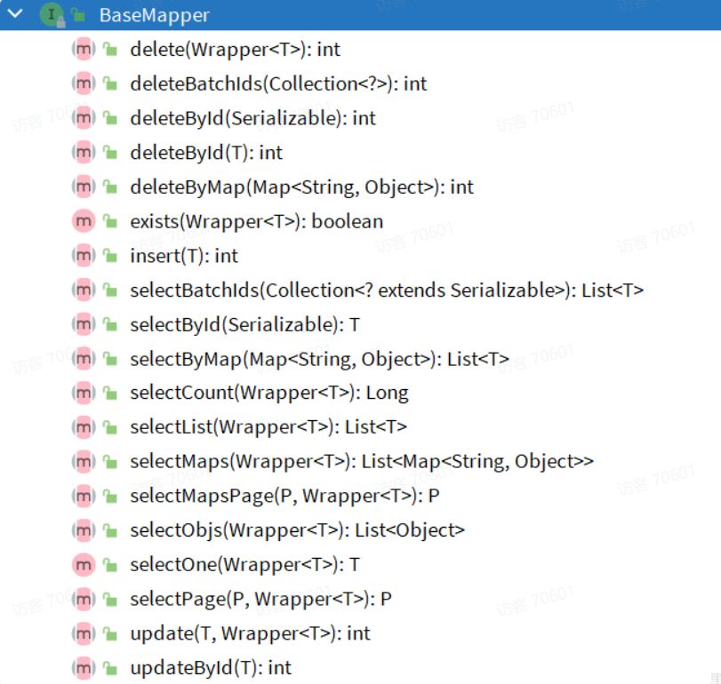
因此我们自定义的Mapper只要实现了这个BaseMapper，就无需自己实现单表CRUD了。修改mp-demo中的com.onenewcode.mpdemo.mapper包下的UserMapper接口，让其继承BaseMapper：
代码如下：
```java

package com.onenewcode.mpdemo.mapper;

import com.baomidou.mybatisplus.core.mapper.BaseMapper;
import com.onenewcode.mpdemo.domain.po.User;

public interface UserMapper extends BaseMapper<User> {
}
```

**测试类**
```java
package com.onenewcode.mp.mapper;

import com.onenewcode.mp.domain.po.User;
import org.junit.jupiter.api.Test;
import org.springframework.beans.factory.annotation.Autowired;
import org.springframework.boot.test.context.SpringBootTest;

import java.time.LocalDateTime;
import java.util.List;

@SpringBootTest
class UserMapperTest {

    @Autowired
    private UserMapper userMapper;

    @Test
    void testInsert() {
        User user = new User();
        user.setId(5L);
        user.setUsername("Lucy");
        user.setPassword("123");
        user.setPhone("18688990011");
        user.setBalance(200);
        user.setInfo("{\"age\": 24, \"intro\": \"英文老师\", \"gender\": \"female\"}");
        user.setCreateTime(LocalDateTime.now());
        user.setUpdateTime(LocalDateTime.now());
        userMapper.saveUser(user);
    }

    @Test
    void testSelectById() {
        User user = userMapper.queryUserById(5L);
        System.out.println("user = " + user);
    }


    @Test
    void testQueryByIds() {
        List<User> users = userMapper.queryUserByIds(List.of(1L, 2L, 3L, 4L));
        users.forEach(System.out::println);
    }

    @Test
    void testUpdateById() {
        User user = new User();
        user.setId(5L);
        user.setBalance(20000);
        userMapper.updateUser(user);
    }

    @Test
    void testDeleteUser() {
        userMapper.deleteUser(5L);
    }
}
```
如果有输出则证明运行成功

## 常见注解介绍

### @TableName
说明：
- 描述：表名注解，标识实体类对应的表
- 使用位置：实体类
示例：
```java
@TableName("user")
public class User {
    private Long id;
    private String name;
}
```

TableName注解除了指定表名以外，还可以指定很多其它属性：
| 属性 | 类型 | 必须指定 | 默认值 | 描述 |
| --- | --- | --- | --- | --- |
| value | String | 否 | "" | 表名 |
| schema | String | 否 | "" | schema |
| keepGlobalPrefix | boolean | 否 | false | 是否保持使用全局的 tablePrefix 的值（当全局 tablePrefix 生效时） |
| resultMap | String | 否 | "" | xml 中 resultMap 的 id（用于满足特定类型的实体类对象绑定） |
| autoResultMap | boolean | 否 | false | 是否自动构建 resultMap 并使用（如果设置 resultMap 则不会进行 resultMap 的自动构建与注入） |
| excludeProperty | String[] | 否 | {} | 需要排除的属性名 @since 3.3.1 |


### @TableId
说明：
- 描述：主键注解，标识实体类中的主键字段
- 使用位置：实体类的主键字段
示例：
```java
@TableName("user")
public class User {
    @TableId
    private Long id;
    private String name;
}
```


TableId注解支持两个属性：
| 属性 | 类型 | 必须指定 | 默认值 | 描述 |
| --- | --- | --- | --- | --- |
| value | String | 否 | "" | 表名 |
| type | Enum | 否 | IdType.NONE | 指定主键类型 |


IdType支持的类型有：
| 值 | 描述 |
| --- | --- |
| AUTO | 数据库 ID 自增 |
| NONE | 无状态，该类型为未设置主键类型（注解里等于跟随全局，全局里约等于 INPUT） |
| INPUT | insert 前自行 set 主键值 |
| ASSIGN_ID | 分配 ID(主键类型为 Number(Long 和 Integer)或 String)(since 3.3.0),使用接口IdentifierGenerator的方法nextId(默认实现类为DefaultIdentifierGenerator雪花算法) |
| ASSIGN_UUID | 分配 UUID,主键类型为 String(since 3.3.0),使用接口IdentifierGenerator的方法nextUUID(默认 default 方法) |
| ID_WORKER | 分布式全局唯一 ID 长整型类型(please use ASSIGN_ID) |
| UUID | 32 位 UUID 字符串(please use ASSIGN_UUID) |
| ID_WORKER_STR | 分布式全局唯一 ID 字符串类型(please use ASSIGN_ID) |

这里比较常见的有三种：
- AUTO：利用数据库的id自增长
- INPUT：手动生成id
- ASSIGN_ID：雪花算法生成Long类型的全局唯一id，这是默认的ID策略

### @TableField
说明：
描述：普通字段注解
示例：
```java

@TableName("user")
public class User {
    @TableId
    private Long id;
    private String name;
    private Integer age;
    @TableField("isMarried")
    private Boolean isMarried;
    @TableField("concat")
    private String concat;
}
```

一般情况下我们并不需要给字段添加@TableField注解，一些特殊情况除外：
- 成员变量名与数据库字段名不一致
- 成员变量是以isXXX命名，按照JavaBean的规范，MybatisPlus识别字段时会把is去除，这就导致与数据库不符。
- 成员变量名与数据库一致，但是与数据库的关键字冲突。使用@TableField注解给字段名添加````转义
支持的其它属性如下：

| 属性 | 类型 | 必填 | 默认值 | 描述 |
| --- | --- | --- | --- | --- |
| value | String | 否 | "" | 数据库字段名 |
| exist | boolean | 否 | true | 是否为数据库表字段 |
| condition | String | 否 | "" | 字段 where 实体查询比较条件，有值设置则按设置的值为准，没有则为默认全局的 %s=#{%s}，参考(opens new window) |
| update | String | 否 | "" | 字段 update set 部分注入，例如：当在version字段上注解update="%s+1" 表示更新时会 set version=version+1 （该属性优先级高于 el 属性） |
| insertStrategy | Enum | 否 | FieldStrategy.DEFAULT | 举例：NOT_NULL insert into table_a(<if test="columnProperty != null">column</if>) values (<if test="columnProperty != null">#{columnProperty}</if>) |
| updateStrategy | Enum | 否 | FieldStrategy.DEFAULT | 举例：IGNORED update table_a set column=#{columnProperty} |
| whereStrategy | Enum | 否 | FieldStrategy.DEFAULT | 举例：NOT_EMPTY where <if test="columnProperty != null and columnProperty!=''">column=#{columnProperty}</if> |
| fill | Enum | 否 | FieldFill.DEFAULT | 字段自动填充策略 |
| select | boolean | 否 | true | 是否进行 select 查询 |
| keepGlobalFormat | boolean | 否 | false | 是否保持使用全局的 format 进行处理 |
| jdbcType | JdbcType | 否 | JdbcType.UNDEFINED | JDBC 类型 (该默认值不代表会按照该值生效) |
| typeHandler |  TypeHander | 否 |  | 类型处理器 (该默认值不代表会按照该值生效) |
| numericScale | String | 否 | "" | 指定小数点后保留的位数 |

## 常见配置
MybatisPlus也支持基于yaml文件的自定义配置，详见官方文档：
https://www.baomidou.com/pages/56bac0/#%E5%9F%BA%E6%9C%AC%E9%85%8D%E7%BD%AE

# 核心功能

## 条件构造器
除了新增以外，修改、删除、查询的SQL语句都需要指定where条件。因此BaseMapper中提供的相关方法除了以id作为where条件以外，还支持更加复杂的where条件。
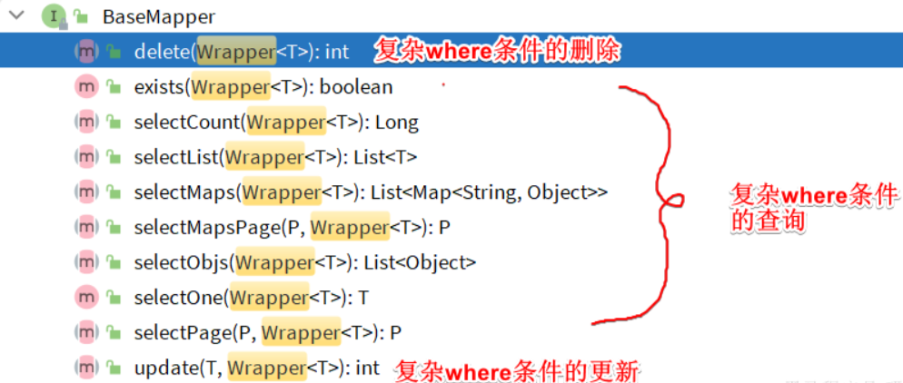

参数中的Wrapper就是条件构造的抽象类，其下有很多默认实现，继承关系如图：
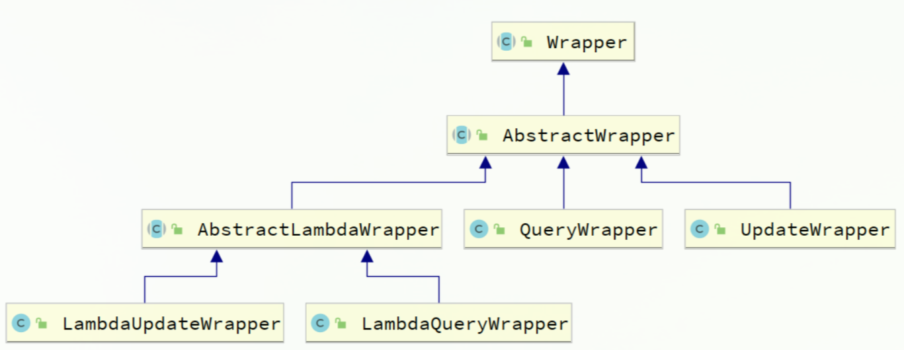
Wrapper的子类AbstractWrapper提供了where中包含的所有条件构造方法：
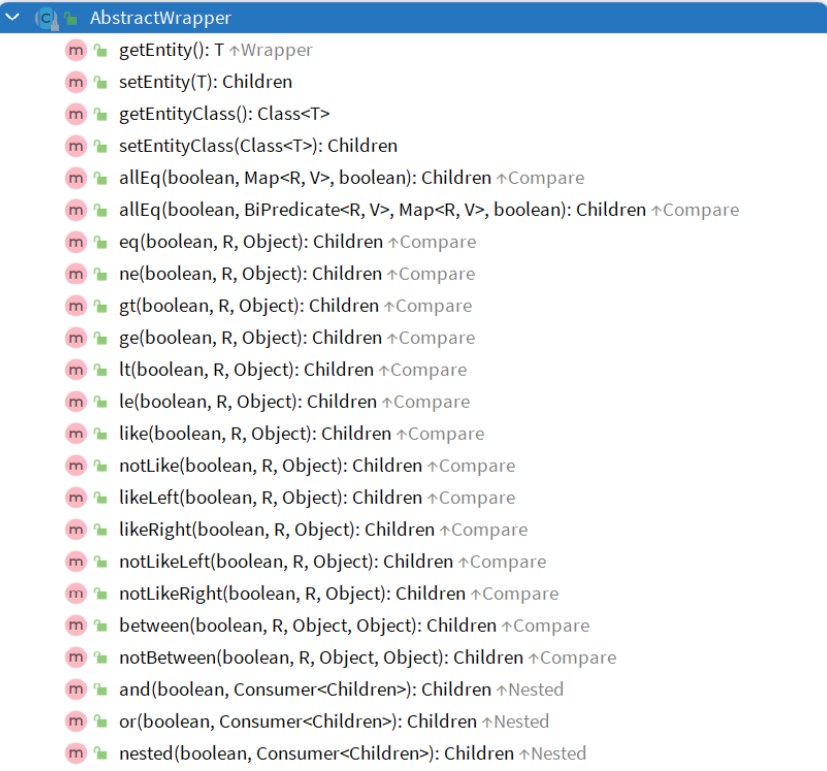

而QueryWrapper在AbstractWrapper的基础上拓展了一个select方法，允许指定查询字段.


而UpdateWrapper在AbstractWrapper的基础上拓展了一个set方法，允许指定SQL中的SET部分.
### QueryWrapper
无论是修改、删除、查询，都可以使用QueryWrapper来构建查询条件。接下来看一些例子：
查询：查询出名字中带o的，存款大于等于1000元的人。代码如下：
```java
@Test
void testQueryWrapper() {
    // 1.构建查询条件 where name like "%o%" AND balance >= 1000
    QueryWrapper<User> wrapper = new QueryWrapper<User>()
            .select("id", "username", "info", "balance")
            .like("username", "o")
            .ge("balance", 1000);
    // 2.查询数据
    List<User> users = userMapper.selectList(wrapper);
    users.forEach(System.out::println);
}

```

更新：更新用户名为jack的用户的余额为2000，代码如下：
```java
@Test
void testUpdateByQueryWrapper() {
    // 1.构建查询条件 where name = "Jack"
    QueryWrapper<User> wrapper = new QueryWrapper<User>().eq("username", "Jack");
    // 2.更新数据，user中非null字段都会作为set语句
    User user = new User();
    user.setBalance(2000);
    userMapper.update(user, wrapper);
}


```

### UpdateWrapper
基于BaseMapper中的update方法更新时只能直接赋值，对于一些复杂的需求就难以实现。
例如：更新id为1,2,4的用户的余额，扣200，对应的SQL应该是：
UPDATE user SET balance = balance - 200 WHERE id in (1, 2, 4)
SET的赋值结果是基于字段现有值的，这个时候就要利用UpdateWrapper中的setSql功能了：
```java

@Test
void testUpdateWrapper() {
    List<Long> ids = List.of(1L, 2L, 4L);
    // 1.生成SQL
    UpdateWrapper<User> wrapper = new UpdateWrapper<User>()
            .setSql("balance = balance - 200") // SET balance = balance - 200
            .in("id", ids); // WHERE id in (1, 2, 4)
        // 2.更新，注意第一个参数可以给null，也就是不填更新字段和数据，
    // 而是基于UpdateWrapper中的setSQL来更新
    userMapper.update(null, wrapper);
}
```


### LambdaQueryWrapper

一种办法是基于变量的gettter方法结合反射技术。因此我们只要将条件对应的字段的getter方法传递给MybatisPlus，它就能计算出对应的变量名了。而传递方法可以使用JDK8中的方法引用和Lambda表达式。
因此MybatisPlus又提供了一套基于Lambda的Wrapper，包含两个：
- LambdaQueryWrapper
- LambdaUpdateWrapper
分别对应QueryWrapper和UpdateWrapper

其使用方式如下：
```java
@Test
void testLambdaQueryWrapper() {
    // 1.构建条件 WHERE username LIKE "%o%" AND balance >= 1000
    QueryWrapper<User> wrapper = new QueryWrapper<>();
    wrapper.lambda()
            .select(User::getId, User::getUsername, User::getInfo, User::getBalance)
            .like(User::getUsername, "o")
            .ge(User::getBalance, 1000);
    // 2.查询
    List<User> users = userMapper.selectList(wrapper);
    users.forEach(System.out::println);
}
```


## 自定义SQL


### 基本用法
以当前案例来说，我们可以这样写：
```java
@Test
void testCustomWrapper() {
    // 1.准备自定义查询条件
    List<Long> ids = List.of(1L, 2L, 4L);
    QueryWrapper<User> wrapper = new QueryWrapper<User>().in("id", ids);

    // 2.调用mapper的自定义方法，直接传递Wrapper
    userMapper.deductBalanceByIds(200, wrapper);
}
```

然后在UserMapper中自定义SQL：
```java
package com.onenewcode.mpdemo.mapper;

import com.baomidou.mybatisplus.core.mapper.BaseMapper;
import com.onenewcode.mpdemo.domain.po.User;
import org.apache.ibatis.annotations.Param;
import org.apache.ibatis.annotations.Update;

public interface UserMapper extends BaseMapper<User> {
    @Select("UPDATE user SET balance = balance - #{money} ${ew.customSqlSegment}")
    void deductBalanceByIds(@Param("money") int money, @Param("ew") QueryWrapper<User> wrapper);
}
```


### 多表关联
理论上来讲MyBatisPlus是不支持多表查询的，不过我们可以利用Wrapper中自定义条件结合自定义SQL来实现多表查询的效果。
例如，我们要查询出所有收货地址在北京的并且用户id在1、2、4之中的用户要是自己基于mybatis实现SQL，大概是这样的：
```xml
<select id="queryUserByIdAndAddr" resultType="com.onenewcode.mpdemo.domain.po.User">
      SELECT *
      FROM user u
      INNER JOIN address a ON u.id = a.user_id
      WHERE u.id
      <foreach collection="ids" separator="," item="id" open="IN (" close=")">
          #{id}
      </foreach>
      AND a.city = #{city}
  </select>
```


查询条件这样来构建：
```java

@Test
void testCustomJoinWrapper() {
    // 1.准备自定义查询条件
    QueryWrapper<User> wrapper = new QueryWrapper<User>()
            .in("u.id", List.of(1L, 2L, 4L))
            .eq("a.city", "北京");

    // 2.调用mapper的自定义方法
    List<User> users = userMapper.queryUserByWrapper(wrapper);

    users.forEach(System.out::println);
}
```

然后在UserMapper中自定义方法：
```java
@Select("SELECT u.* FROM user u INNER JOIN address a ON u.id = a.user_id ${ew.customSqlSegment}")
List<User> queryUserByWrapper(@Param("ew")QueryWrapper<User> wrapper);
```


当然，也可以在UserMapper.xml中写SQL：
<select id="queryUserByIdAndAddr" resultType="com.onenewcode.mpdemo.domain.po.User">
    SELECT * FROM user u INNER JOIN address a ON u.id = a.user_id ${ew.customSqlSegment}
</select>

## Service接口
MybatisPlus不仅提供了BaseMapper，还提供了通用的Service接口及默认实现，封装了一些常用的service模板方法。
通用接口为IService，默认实现为ServiceImpl，其中封装的方法可以分为以下几类：
- save：新增
- remove：删除
- update：更新
- get：查询单个结果
- list：查询集合结果
- count：计数
- page：分页查询

### CRUD
我们先俩看下基本的CRUD接口。
**新增：**
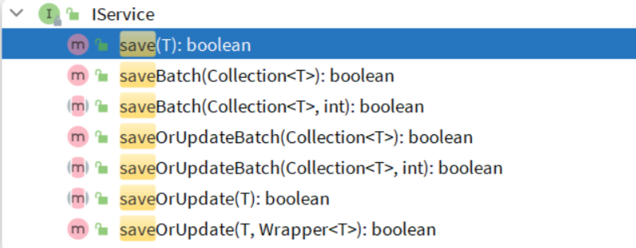
- save是新增单个元素
- saveBatch是批量新增
- saveOrUpdate是根据id判断，如果数据存在就更新，不存在则新增
- saveOrUpdateBatch是批量的新增或修改

**删除：**
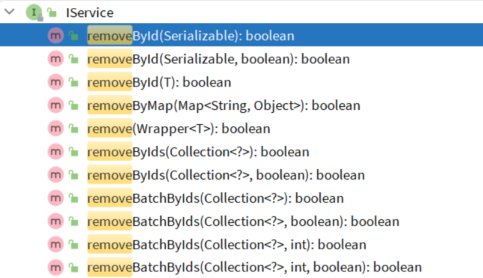
- removeById：根据id删除
- removeByIds：根据id批量删除
- removeByMap：根据Map中的键值对为条件删除
- remove(Wrapper<T>)：根据Wrapper条件删除
- ~~removeBatchByIds~~：暂不支持

**修改：**
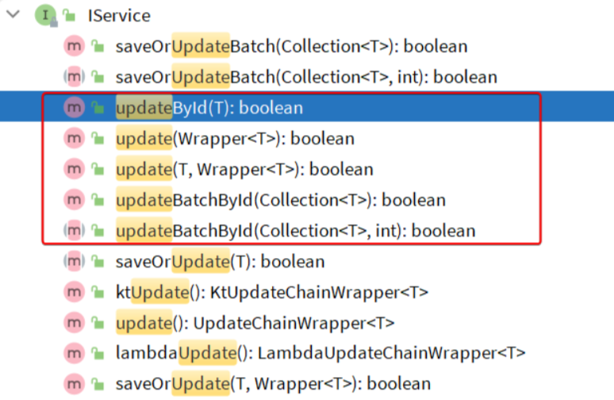
- updateById：根据id修改
- update(Wrapper<T>)：根据UpdateWrapper修改，Wrapper中包含set和where部分
- update(T，Wrapper<T>)：按照T内的数据修改与Wrapper匹配到的数据
- updateBatchById：根据id批量修改

**Get：**
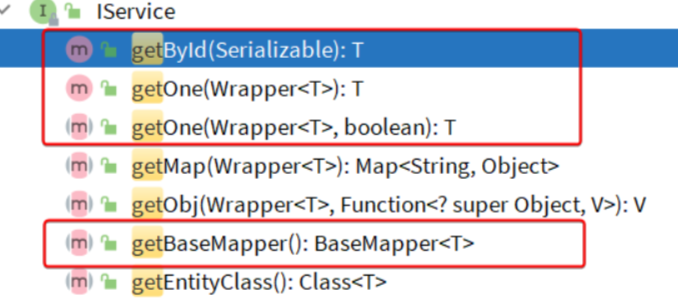
- getById：根据id查询1条数据
- getOne(Wrapper<T>)：根据Wrapper查询1条数据
- getBaseMapper：获取Service内的BaseMapper实现，某些时候需要直接调用Mapper内的自定义SQL时可以用这个方法获取到Mapper

**List：**
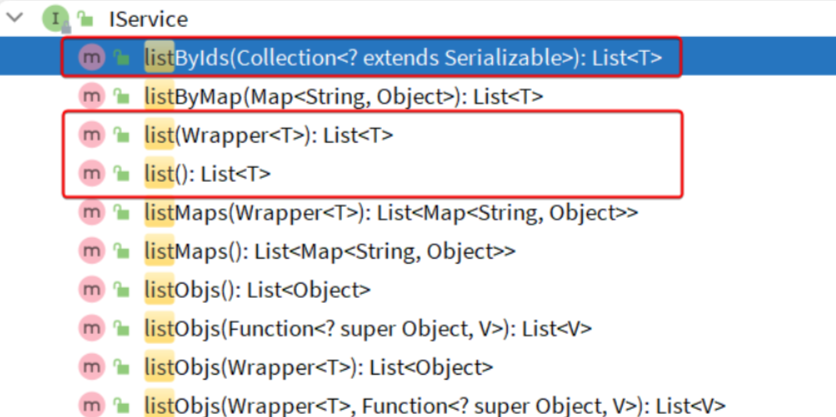
- listByIds：根据id批量查询
- list(Wrapper<T>)：根据Wrapper条件查询多条数据
- list()：查询所有

**Count：**
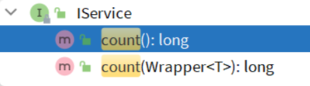
- count()：统计所有数量
- count(Wrapper<T>)：统计符合Wrapper条件的数据数量

**getBaseMapper：**
当我们在service中要调用Mapper中自定义SQL时，就必须获取service对应的Mapper.

### 基本用法
由于Service中经常需要定义与业务有关的自定义方法，因此我们不能直接使用IService，而是自定义Service接口，然后继承IService以拓展方法。同时，让自定义的Service实现类继承ServiceImpl，这样就不用自己实现IService中的接口了。
首先，定义IUserService，继承IService：
```java
package com.onenewcode.mpdemo.service;

import com.baomidou.mybatisplus.extension.service.IService;
import com.onenewcode.mpdemo.domain.po.User;

public interface UserService extends IService<User> {
    // 拓展自定义方法
}

```

然后，编写UserServiceImpl类，继承ServiceImpl，实现
UserService：
```java
package com.onenewcode.mpdemo.service.impl;

import com.baomidou.mybatisplus.extension.service.impl.ServiceImpl;
import com.onenewcode.mpdemo.domain.po.User;
import com.onenewcode.mpdemo.domain.po.service.UserService;
import com.onenewcode.mpdemo.mapper.UserMapper;
import org.springframework.stereotype.Service;

@Service
public class UserServiceImpl extends ServiceImpl<UserMapper, User>
                                                                                                        implements UserService {
}

```


接下来，我们快速实现下面4个接口：
| 编号 | 接口 | 请求方式 | 请求路径 | 请求参数 | 返回值 |
| --- | --- | --- | --- | --- | --- |
| 1 | 新增用户 | POST | /users | 用户表单实体 | 无 |
| 2 | 删除用户 | DELETE | /users/{id} | 用户id | 无 |
| 3 | 根据id查询用户 | GET | /users/{id} | 用户id | 用户VO |
| 4 | 根据id批量查询 | GET | /users | 用户id集合 | 用户VO集合 |


首先，我们在项目中引入几个依赖：
```xml
<!--swagger-->
<dependency>
    <groupId>com.github.xiaoymin</groupId>
    <artifactId>knife4j-openapi2-spring-boot-starter</artifactId>
    <version>4.1.0</version>
</dependency>
<!--web-->
<dependency>
    <groupId>org.springframework.boot</groupId>
    <artifactId>spring-boot-starter-web</artifactId>
</dependency>
```

然后需要配置swagger信息：
```yml
knife4j:
  enable: true
  openapi:
    title: 用户管理接口文档
    description: "用户管理接口文档"
    email: lspneverstudy@gmail.com
    concat: onenewcode
    url: https://www.onenewcode.cn
    version: v1.0.0
    group:
      default:
        group-name: default
        api-rule: package
        api-rule-resources:
          - com.onenewcode.mpdemo.controller
```


然后，接口需要两个实体：
- UserFormDTO：代表新增时的用户表单
- UserVO：代表查询的返回结果
首先是UserFormDTO：
```java
package com.onenewcode.mpdemo.domain.dto;

import com.baomidou.mybatisplus.annotation.TableField;
import com.baomidou.mybatisplus.extension.handlers.JacksonTypeHandler;
import io.swagger.annotations.ApiModel;
import io.swagger.annotations.ApiModelProperty;
import lombok.Data;

@Data
@ApiModel(description = "用户表单实体")
public class UserFormDTO {

    @ApiModelProperty("id")
    private Long id;

    @ApiModelProperty("用户名")
    private String username;

    @ApiModelProperty("密码")
    private String password;

    @ApiModelProperty("注册手机号")
    private String phone;

    @ApiModelProperty("详细信息，JSON风格")
    private String info;

    @ApiModelProperty("账户余额")
    private Integer balance;
}

```

然后是UserVO：
```java
package com.onenewcode.mpdemo.domain.vo;

import io.swagger.annotations.ApiModel;
import io.swagger.annotations.ApiModelProperty;
import lombok.Data;

@Data
@ApiModel(description = "用户VO实体")
public class UserVO {
    
    @ApiModelProperty("用户id")
    private Long id;
    
    @ApiModelProperty("用户名")
    private String username;
    
    @ApiModelProperty("详细信息")
    private String info;

    @ApiModelProperty("使用状态（1正常 2冻结）")
    private Integer status;
    
    @ApiModelProperty("账户余额")
    private Integer balance;
}
```

最后，按照Restful风格编写Controller接口方法：
```java
package com.onenewcode.mpdemo.controller;

import cn.hutool.core.bean.BeanUtil;
import com.onenewcode.mpdemo.domain.dto.UserFormDTO;
import com.onenewcode.mpdemo.domain.po.User;
import com.onenewcode.mpdemo.domain.vo.UserVO;
import com.onenewcode.mpdemo.service.IUserService;
import io.swagger.annotations.Api;
import io.swagger.annotations.ApiOperation;
import lombok.RequiredArgsConstructor;
import org.springframework.web.bind.annotation.*;

import java.util.List;

@Api(tags = "用户管理接口")
@RequiredArgsConstructor
@RestController
@RequestMapping("users")
public class UserController {

    private final IUserService userService;

    @PostMapping
    @ApiOperation("新增用户")
    public void saveUser(@RequestBody UserFormDTO userFormDTO){
        // 1.转换DTO为PO
        User user = BeanUtil.copyProperties(userFormDTO, User.class);
        // 2.新增
        userService.save(user);
    }

    @DeleteMapping("/{id}")
    @ApiOperation("删除用户")
    public void removeUserById(@PathVariable("id") Long userId){
        userService.removeById(userId);
    }

    @GetMapping("/{id}")
    @ApiOperation("根据id查询用户")
    public UserVO queryUserById(@PathVariable("id") Long userId){
        // 1.查询用户
        User user = userService.getById(userId);
        // 2.处理vo
        return BeanUtil.copyProperties(user, UserVO.class);
    }

    @GetMapping
    @ApiOperation("根据id集合查询用户")
    public List<UserVO> queryUserByIds(@RequestParam("ids") List<Long> ids){
        // 1.查询用户
        List<User> users = userService.listByIds(ids);
        // 2.处理vo
        return BeanUtil.copyToList(users, UserVO.class);
    }
}
```

可以看到上述接口都直接在controller即可实现，无需编写任何service代码，非常方便。

不过，一些带有业务逻辑的接口则需要在service中自定义实现了。例如下面的需求：
- 根据id扣减用户余额

这看起来是个简单修改功能，只要修改用户余额即可。但这个业务包含一些业务逻辑处理：
- 判断用户状态是否正常
- 判断用户余额是否充足

这些业务逻辑都要在service层来做，另外更新余额需要自定义SQL，要在mapper中来实现。因此，我们除了要编写controller以外，具体的业务还要在service和mapper中编写。

首先在UserController中定义一个方法：
```java

@PutMapping("{id}/deduction/{money}")
@ApiOperation("扣减用户余额")
public void deductBalance(@PathVariable("id") Long id, @PathVariable("money")Integer money){
    userService.deductBalance(id, money);
}
```

然后是UserService接口：
```java
package com.onenewcode.mpdemo.service;

import com.baomidou.mybatisplus.extension.service.IService;
import com.onenewcode.mpdemo.domain.po.User;

public interface UserService extends IService<User> {
    void deductBalance(Long id, Integer money);
}
```

最后是UserServiceImpl实现类：
```java

package com.onenewcode.mpdemo.service.impl;

import com.baomidou.mybatisplus.extension.service.impl.ServiceImpl;
import com.onenewcode.mpdemo.domain.po.User;
import com.onenewcode.mpdemo.mapper.UserMapper;
import com.onenewcode.mpdemo.service.IUserService;
import org.springframework.stereotype.Service;

@Service
public class UserServiceImpl extends ServiceImpl<UserMapper, User> implements IUserService {
    @Override
    public void deductBalance(Long id, Integer money) {
        // 1.查询用户
        User user = getById(id);
        // 2.判断用户状态
        if (user == null || user.getStatus() == 2) {
            throw new RuntimeException("用户状态异常");
        }
        // 3.判断用户余额
        if (user.getBalance() < money) {
            throw new RuntimeException("用户余额不足");
        }
        // 4.扣减余额
        baseMapper.deductMoneyById(id, money);
    }
}
```
最后是mapper：
```java
@Update("UPDATE user SET balance = balance - #{money} WHERE id = #{id}")
void deductMoneyById(@Param("id") Long id, @Param("money") Integer money);

```


### Lambda
IService中还提供了Lambda功能来简化我们的复杂查询及更新功能。我们通过两个案例来学习一下。

案例一：实现一个根据复杂条件查询用户的接口，查询条件如下：
- name：用户名关键字，可以为空
- status：用户状态，可以为空
- minBalance：最小余额，可以为空
- maxBalance：最大余额，可以为空
可以理解成一个用户的后台管理界面，管理员可以自己选择条件来筛选用户，因此上述条件不一定存在，需要做判断。

我们首先需要定义一个查询条件实体，UserQuery实体：
```java
package com.onenewcode.mpdemo.domain.query;

import io.swagger.annotations.ApiModel;
import io.swagger.annotations.ApiModelProperty;
import lombok.Data;

@Data
@ApiModel(description = "用户查询条件实体")
public class UserQuery {
    @ApiModelProperty("用户名关键字")
    private String name;
    @ApiModelProperty("用户状态：1-正常，2-冻结")
    private Integer status;
    @ApiModelProperty("余额最小值")
    private Integer minBalance;
    @ApiModelProperty("余额最大值")
    private Integer maxBalance;
}


```

接下来我们在UserController中定义一个controller方法：
我们无需自己通过new的方式来创建Wrapper，而是直接调用lambdaQuery和lambdaUpdate方法：

基于Lambda查询：
```java
@GetMapping("/list")
@ApiOperation("根据id集合查询用户")
public List<UserVO> queryUsers(UserQuery query){
    // 1.组织条件
    String username = query.getName();
    Integer status = query.getStatus();
    Integer minBalance = query.getMinBalance();
    Integer maxBalance = query.getMaxBalance();
    // 2.查询用户
    List<User> users = userService.lambdaQuery()
            .like(username != null, User::getUsername, username)
            .eq(status != null, User::getStatus, status)
            .ge(minBalance != null, User::getBalance, minBalance)
            .le(maxBalance != null, User::getBalance, maxBalance)
            .list();
    // 3.处理vo
    return BeanUtil.copyToList(users, UserVO.class);
}
```

可以发现lambdaQuery方法中除了可以构建条件，还需要在链式编程的最后添加一个list()，这是在告诉MP我们的调用结果需要是一个list集合。这里不仅可以用list()，可选的方法有：
- .one()：最多1个结果
- .list()：返回集合结果
- .count()：返回计数结果
MybatisPlus会根据链式编程的最后一个方法来判断最终的返回结果。

与lambdaQuery方法类似，IService中的lambdaUpdate方法可以非常方便的实现复杂更新业务。
例如下面的需求：
需求：改造根据id修改用户余额的接口，要求如下
- 如果扣减后余额为0，则将用户status修改为冻结状态（2）

也就是说我们在扣减用户余额时，需要对用户剩余余额做出判断，如果发现剩余余额为0，则应该将status修改为2，这就是说update语句的set部分是动态的。

实现如下：
```java
@Override
@Transactional
public void deductBalance(Long id, Integer money) {
    // 1.查询用户
    User user = getById(id);
    // 2.校验用户状态
    if (user == null || user.getStatus() == 2) {
        throw new RuntimeException("用户状态异常！");
    }
    // 3.校验余额是否充足
    if (user.getBalance() < money) {
        throw new RuntimeException("用户余额不足！");
    }
    // 4.扣减余额 update tb_user set balance = balance - ?
    int remainBalance = user.getBalance() - money;
    lambdaUpdate()
            .set(User::getBalance, remainBalance) // 更新余额
            .set(remainBalance == 0, User::getStatus, 2) // 动态判断，是否更新status
            .eq(User::getId, id)
            .eq(User::getBalance, user.getBalance()) // 乐观锁
            .update();
}


```

### 批量新增
IService中的批量新增功能使用起来非常方便，但有一点注意事项，我们先来测试一下。
首先我们测试逐条插入数据：
```java

@Test
void testSaveOneByOne() {
    long b = System.currentTimeMillis();
    for (int i = 1; i <= 100000; i++) {
        userService.save(buildUser(i));
    }
    long e = System.currentTimeMillis();
    System.out.println("耗时：" + (e - b));
}

private User buildUser(int i) {
    User user = new User();
    user.setUsername("user_" + i);
    user.setPassword("123");
    user.setPhone("" + (18688190000L + i));
    user.setBalance(2000);
    user.setInfo("{\"age\": 24, \"intro\": \"英文老师\", \"gender\": \"female\"}");
    user.setCreateTime(LocalDateTime.now());
    user.setUpdateTime(user.getCreateTime());
    return user;
}

```

执行结果如下：
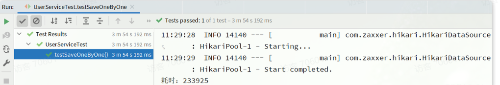

可以看到速度非常慢。
然后再试试MybatisPlus的批处理：
```java

@Test
void testSaveBatch() {
    // 准备10万条数据
    List<User> list = new ArrayList<>(1000);
    long b = System.currentTimeMillis();
    for (int i = 1; i <= 100000; i++) {
        list.add(buildUser(i));
        // 每1000条批量插入一次
        if (i % 1000 == 0) {
            userService.saveBatch(list);
            list.clear();
        }
    }
    long e = System.currentTimeMillis();
    System.out.println("耗时：" + (e - b));
}
```

执行最终耗时如下：
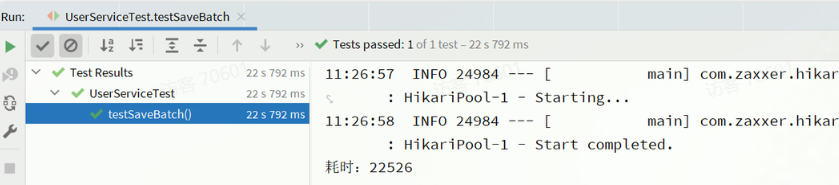

可以看到使用了批处理以后，比逐条新增效率提高了10倍左右，性能还是不错的。
不过，我们简单查看一下MybatisPlus源码：
@Transactional(rollbackFor = Exception.class)
@Override
public boolean saveBatch(Collection<T> entityList, int batchSize) {
    String sqlStatement = getSqlStatement(SqlMethod.INSERT_ONE);
    return executeBatch(entityList, batchSize, (sqlSession, entity) -> sqlSession.insert(sqlStatement, entity));
}
// ...SqlHelper
public static <E> boolean executeBatch(Class<?> entityClass, Log log, Collection<E> list, int batchSize, BiConsumer<SqlSession, E> consumer) {
    Assert.isFalse(batchSize < 1, "batchSize must not be less than one");
    return !CollectionUtils.isEmpty(list) && executeBatch(entityClass, log, sqlSession -> {
        int size = list.size();
        int idxLimit = Math.min(batchSize, size);
        int i = 1;
        for (E element : list) {
            consumer.accept(sqlSession, element);
            if (i == idxLimit) {
                sqlSession.flushStatements();
                idxLimit = Math.min(idxLimit + batchSize, size);
            }
            i++;
        }
    });
}

可以发现其实MybatisPlus的批处理是基于PrepareStatement的预编译模式，然后批量提交，最终在数据库执行时还是会有多条insert语句，逐条插入数据。SQL类似这样：
Preparing: INSERT INTO user ( username, password, phone, info, balance, create_time, update_time ) VALUES ( ?, ?, ?, ?, ?, ?, ? )
Parameters: user_1, 123, 18688190001, "", 2000, 2023-07-01, 2023-07-01
Parameters: user_2, 123, 18688190002, "", 2000, 2023-07-01, 2023-07-01
Parameters: user_3, 123, 18688190003, "", 2000, 2023-07-01, 2023-07-01

而如果想要得到最佳性能，最好是将多条SQL合并为一条，像这样：
INSERT INTO user ( username, password, phone, info, balance, create_time, update_time )
VALUES 
(user_1, 123, 18688190001, "", 2000, 2023-07-01, 2023-07-01),
(user_2, 123, 18688190002, "", 2000, 2023-07-01, 2023-07-01),
(user_3, 123, 18688190003, "", 2000, 2023-07-01, 2023-07-01),
(user_4, 123, 18688190004, "", 2000, 2023-07-01, 2023-07-01);

该怎么做呢？


MySQL的客户端连接参数中有这样的一个参数：rewriteBatchedStatements。顾名思义，就是重写批处理的statement语句。参考文档：
https://dev.mysql.com/doc/connector-j/8.0/en/connector-j-connp-props-performance-extensions.html#cj-conn-prop_rewriteBatchedStatements

这个参数的默认值是false，我们需要修改连接参数，将其配置为true

修改项目中的application.yml文件，在jdbc的url后面添加参数&rewriteBatchedStatements=true:
spring:
  datasource:
    url: jdbc:mysql://127.0.0.1:3306/mp?useUnicode=true&characterEncoding=UTF-8&autoReconnect=true&serverTimezone=Asia/Shanghai&rewriteBatchedStatements=true
    driver-class-name: com.mysql.cj.jdbc.Driver
    username: root
    password: MySQL123


在ClientPreparedStatement的executeBatchInternal中，有判断rewriteBatchedStatements值是否为true并重写SQL的功能：

最终，SQL被重写了：


# 扩展功能
## 代码生成
在使用MybatisPlus以后，基础的Mapper、Service、PO代码相对固定，重复编写也比较麻烦。因此MybatisPlus官方提供了代码生成器根据数据库表结构生成PO、Mapper、Service等相关代码。只不过代码生成器同样要编码使用，也很麻烦。
这里推荐大家使用一款MybatisPlus的插件，它可以基于图形化界面完成MybatisPlus的代码生成，非常简单。
### 安装插件
在Idea的plugins市场中搜索并安装MyBatisPlus插件：
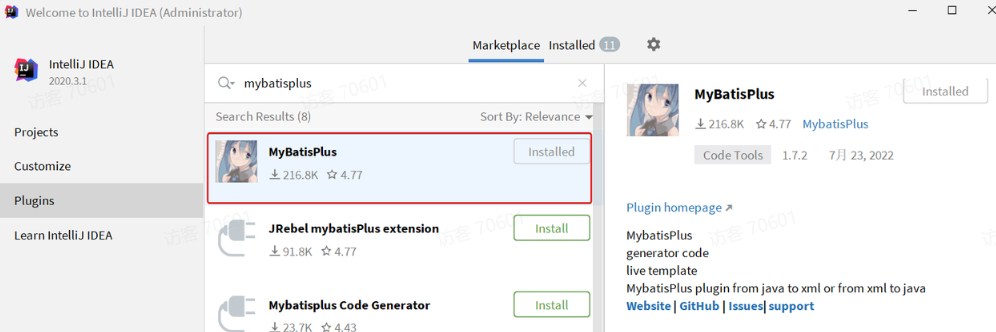

然后重启你的Idea即可使用。
### 使用
刚好数据库中还有一张address表尚未生成对应的实体和mapper等基础代码。我们利用插件生成一下。
首先需要配置数据库地址，在Idea顶部菜单中，找到other，选择Config Database：
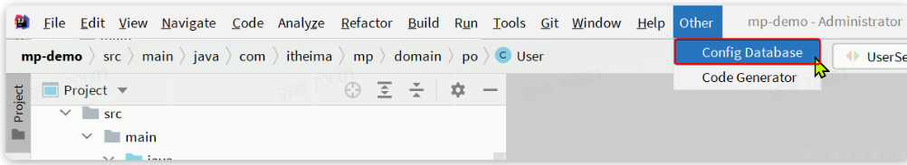
在弹出的窗口中填写数据库连接的基本信息：
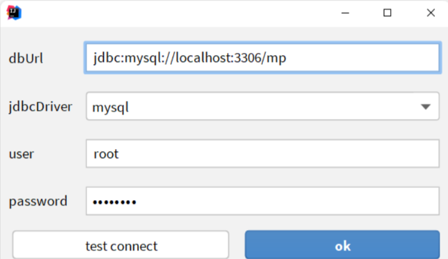

点击OK保存。
然后再次点击Idea顶部菜单中的other，然后选择Code Generator:
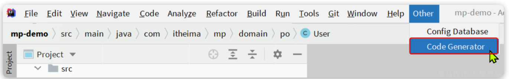
在弹出的表单中填写信息：
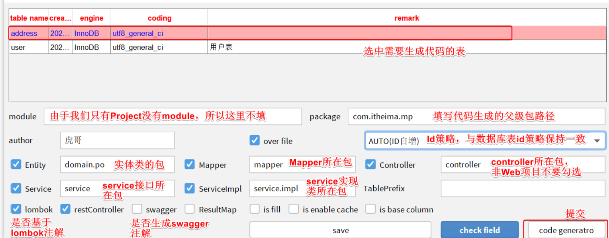

最终，代码自动生成到指定的位置了：
## 静态工具
有的时候Service之间也会相互调用，为了避免出现循环依赖问题，MybatisPlus提供一个静态工具类：Db，其中的一些静态方法与IService中方法签名基本一致，也可以帮助我们实现CRUD功能：

示例：
```java

@Test
void testDbGet() {
    User user = Db.getById(1L, User.class);
    System.out.println(user);
}

@Test
void testDbList() {
    // 利用Db实现复杂条件查询
    List<User> list = Db.lambdaQuery(User.class)
            .like(User::getUsername, "o")
            .ge(User::getBalance, 1000)
            .list();
    list.forEach(System.out::println);
}

@Test
void testDbUpdate() {
    Db.lambdaUpdate(User.class)
            .set(User::getBalance, 2000)
            .eq(User::getUsername, "Rose");
}

```


需求：改造根据id用户查询的接口，查询用户的同时返回用户收货地址列表
首先，我们要添加一个收货地址的VO对象：
```java
package com.onenewcode.mpdemo.domain.vo;

import io.swagger.annotations.ApiModel;
import io.swagger.annotations.ApiModelProperty;
import lombok.Data;

@Data
@ApiModel(description = "收货地址VO")
public class AddressVO{

    @ApiModelProperty("id")
    private Long id;

    @ApiModelProperty("用户ID")
    private Long userId;

    @ApiModelProperty("省")
    private String province;

    @ApiModelProperty("市")
    private String city;

    @ApiModelProperty("县/区")
    private String town;

    @ApiModelProperty("手机")
    private String mobile;

    @ApiModelProperty("详细地址")
    private String street;

    @ApiModelProperty("联系人")
    private String contact;

    @ApiModelProperty("是否是默认 1默认 0否")
    private Boolean isDefault;

    @ApiModelProperty("备注")
    private String notes;
}

```


然后，改造原来的UserVO，添加一个地址属性：


接下来，修改UserController中根据id查询用户的业务接口：
```java
@GetMapping("/{id}")
@ApiOperation("根据id查询用户")
public UserVO queryUserById(@PathVariable("id") Long userId){
    // 基于自定义service方法查询
    return userService.queryUserAndAddressById(userId);
}

```


由于查询业务复杂，所以要在service层来实现。首先在IUserService中定义方法：
```java
package com.onenewcode.mpdemo.service;

import com.baomidou.mybatisplus.extension.service.IService;
import com.onenewcode.mpdemo.domain.po.User;
import com.onenewcode.mpdemo.domain.vo.UserVO;

public interface UserService extends IService<User> {
    void deduct(Long id, Integer money);

    UserVO queryUserAndAddressById(Long userId);
}


```

然后，在UserServiceImpl中实现该方法：
```java
@Override
public UserVO queryUserAndAddressById(Long userId) {
    // 1.查询用户
    User user = getById(userId);
    if (user == null) {
        return null;
    }
    // 2.查询收货地址
    List<Address> addresses = Db.lambdaQuery(Address.class)
            .eq(Address::getUserId, userId)
            .list();
    // 3.处理vo
    UserVO userVO = BeanUtil.copyProperties(user, UserVO.class);
    userVO.setAddresses(BeanUtil.copyToList(addresses, AddressVO.class));
    return userVO;
}

```

在查询地址时，我们采用了Db的静态方法，因此避免了注入AddressService，减少了循环依赖的风险。


## 逻辑删除
对于一些比较重要的数据，我们往往会采用逻辑删除的方案，即：
- 在表中添加一个字段标记数据是否被删除
- 当删除数据时把标记置为true
- 查询时过滤掉标记为true的数据
一旦采用了逻辑删除，所有的查询和删除逻辑都要跟着变化，非常麻烦。

为了解决这个问题，MybatisPlus就添加了对逻辑删除的支持。
注意，只有MybatisPlus生成的SQL语句才支持自动的逻辑删除，自定义SQL需要自己手动处理逻辑删除。

例如，我们给address表添加一个逻辑删除字段：
```sql
alter table address add deleted bit default b'0' null comment '逻辑删除';
```

然后给Address实体添加deleted字段：
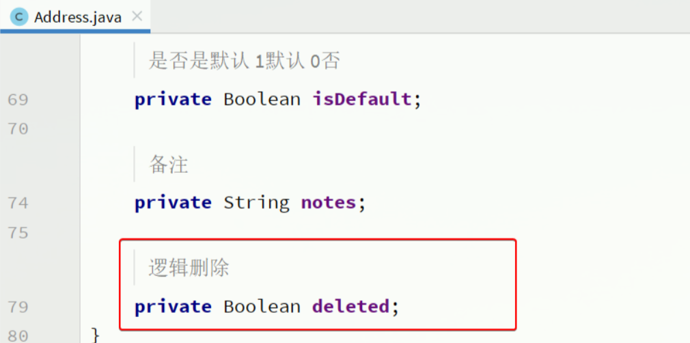
接下来，我们要在application.yml中配置逻辑删除字段：
```yaml
mybatis-plus:
  global-config:
    db-config:
      logic-delete-field: deleted # 全局逻辑删除的实体字段名(since 3.3.0,配置后可以忽略不配置步骤2)
      logic-delete-value: 1 # 逻辑已删除值(默认为 1)
      logic-not-delete-value: 0 # 逻辑未删除值(默认为 0)

```

测试：
首先，我们执行一个删除操作：
```java
@Test
void testDeleteByLogic() {
    // 删除方法与以前没有区别
    addressService.removeById(59L);
}
```

方法与普通删除一模一样，但是底层的SQL逻辑变了：
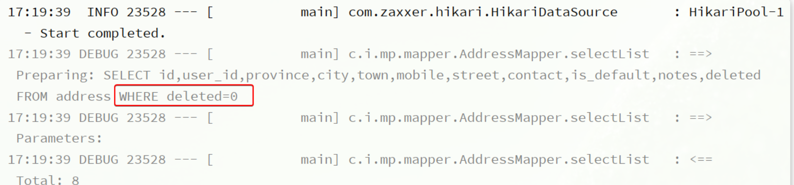
查询一下试试：
```java
@Test
void testQuery() {
    List<Address> list = addressService.list();
    list.forEach(System.out::println);
}
```

会发现id为59的确实没有查询出来，而且SQL中也对逻辑删除字段做了判断：

综上， 开启了逻辑删除功能以后，我们就可以像普通删除一样做CRUD，基本不用考虑代码逻辑问题。还是非常方便的。
注意：
逻辑删除本身也有自己的问题，比如：
- 会导致数据库表垃圾数据越来越多，从而影响查询效率
- SQL中全都需要对逻辑删除字段做判断，影响查询效率
因此，我不太推荐采用逻辑删除功能，如果数据不能删除，可以采用把数据迁移到其它表的办法。

## 通用枚举
User类中有一个用户状态字段：
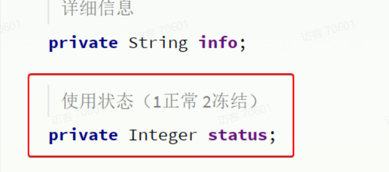
像这种字段我们一般会定义一个枚举，做业务判断的时候就可以直接基于枚举做比较。但是我们数据库采用的是int类型，对应的PO也是Integer。因此业务操作时必须手动把枚举与Integer转换，非常麻烦。
因此，MybatisPlus提供了一个处理枚举的类型转换器，可以帮我们把枚举类型与数据库类型自动转换。
### 定义枚举
我们定义一个用户状态的枚举：
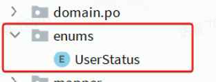
代码如下：
```java
package com.onenewcode.mpdemo.enums;

import com.baomidou.mybatisplus.annotation.EnumValue;
import lombok.Getter;

@Getter
public enum UserStatus {
    NORMAL(1, "正常"),
    FREEZE(2, "冻结")
    ;
    private final int value;
    private final String desc;

    UserStatus(int value, String desc) {
        this.value = value;
        this.desc = desc;
    }
}
```


然后把User类中的status字段改为UserStatus 类型：
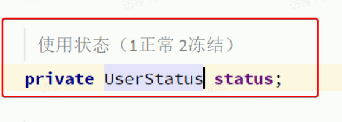
要让MybatisPlus处理枚举与数据库类型自动转换，我们必须告诉MybatisPlus，枚举中的哪个字段的值作为数据库值。
MybatisPlus提供了@EnumValue注解来标记枚举属性：
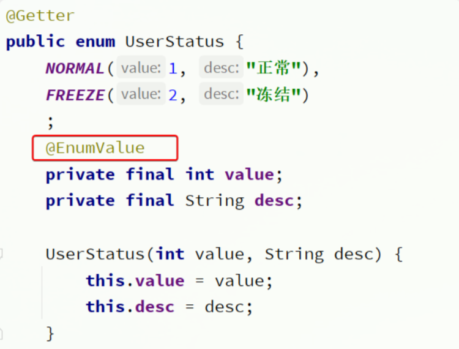
### 配置枚举处理器
在application.yaml文件中添加配置：
```yaml
mybatis-plus:
  configuration:
    default-enum-type-handler: com.baomidou.mybatisplus.core.handlers.MybatisEnumTypeHandler
```

### 测试
```java
@Test
void testService() {
    List<User> list = userService.list();
    list.forEach(System.out::println);
}
```

最终，查询出的User类的status字段会是枚举类型


## JSON类型处理器
数据库的user表中有一个info字段，是JSON类型
格式像这样：
{"age": 20, "intro": "佛系青年", "gender": "male"}
而目前User实体类中却是String类型：
这样一来，我们要读取info中的属性时就非常不方便。如果要方便获取，info的类型最好是一个Map或者实体类。

而一旦我们把info改为对象类型，就需要在写入数据库时手动转为String，再读取数据库时，手动转换为对象，这会非常麻烦。

因此MybatisPlus提供了很多特殊类型字段的类型处理器，解决特殊字段类型与数据库类型转换的问题。例如处理JSON就可以使用JacksonTypeHandler处理器。


### 定义实体
首先，我们定义一个单独实体类来与info字段的属性匹配：
代码如下：
```java
package com.onenewcode.mpdemo.domain.po;

import lombok.Data;

@Data
public class UserInfo {
    private Integer age;
    private String intro;
    private String gender;
}
```


### 使用类型处理器
接下来，将User类的info字段修改为UserInfo类型，并声明类型处理器：
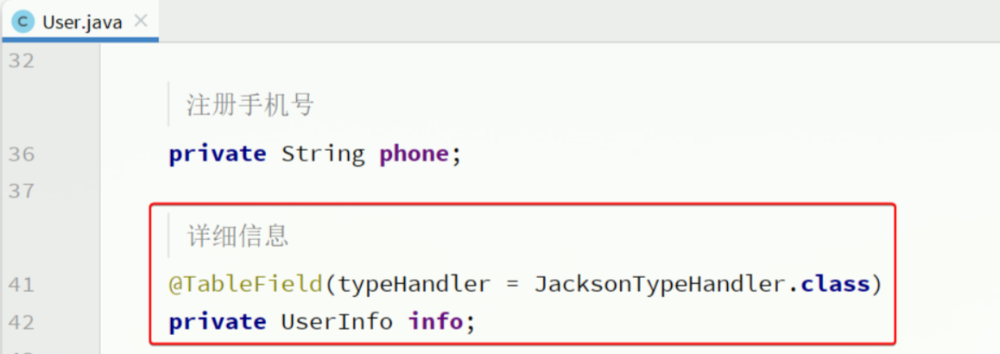


同时，为了让页面返回的结果也以对象格式返回，我们要修改UserVO中的info字段：
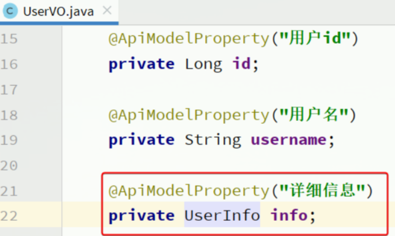

# 插件功能
MybatisPlus提供了很多的插件功能，进一步拓展其功能。目前已有的插件有：
- PaginationInnerInterceptor：自动分页
- TenantLineInnerInterceptor：多租户
- DynamicTableNameInnerInterceptor：动态表名
- OptimisticLockerInnerInterceptor：乐观锁
- IllegalSQLInnerInterceptor：sql 性能规范
- BlockAttackInnerInterceptor：防止全表更新与删除

## 分页插件
在未引入分页插件的情况下，MybatisPlus是不支持分页功能的，IService和BaseMapper中的分页方法都无法正常起效。
所以，我们必须配置分页插件。
### 配置分页插件
在项目中新建一个配置类：


其代码如下：
```java
package com.onenewcode.mpdemo.config;

import com.baomidou.mybatisplus.annotation.DbType;
import com.baomidou.mybatisplus.extension.plugins.MybatisPlusInterceptor;
import com.baomidou.mybatisplus.extension.plugins.inner.PaginationInnerInterceptor;
import org.springframework.context.annotation.Bean;
import org.springframework.context.annotation.Configuration;

@Configuration
public class MybatisConfig {

    @Bean
    public MybatisPlusInterceptor mybatisPlusInterceptor() {
        // 初始化核心插件
        MybatisPlusInterceptor interceptor = new MybatisPlusInterceptor();
        // 添加分页插件
        interceptor.addInnerInterceptor(new PaginationInnerInterceptor(DbType.MYSQL));
        return interceptor;
    }
}

```

### 分页API
编写一个分页查询的测试：
```java
@Test
void testPageQuery() {
    // 1.分页查询，new Page()的两个参数分别是：页码、每页大小
    Page<User> p = userService.page(new Page<>(2, 2));
    // 2.总条数
    System.out.println("total = " + p.getTotal());
    // 3.总页数
    System.out.println("pages = " + p.getPages());
    // 4.数据
    List<User> records = p.getRecords();
    records.forEach(System.out::println);
}
```

运行的SQL如下：
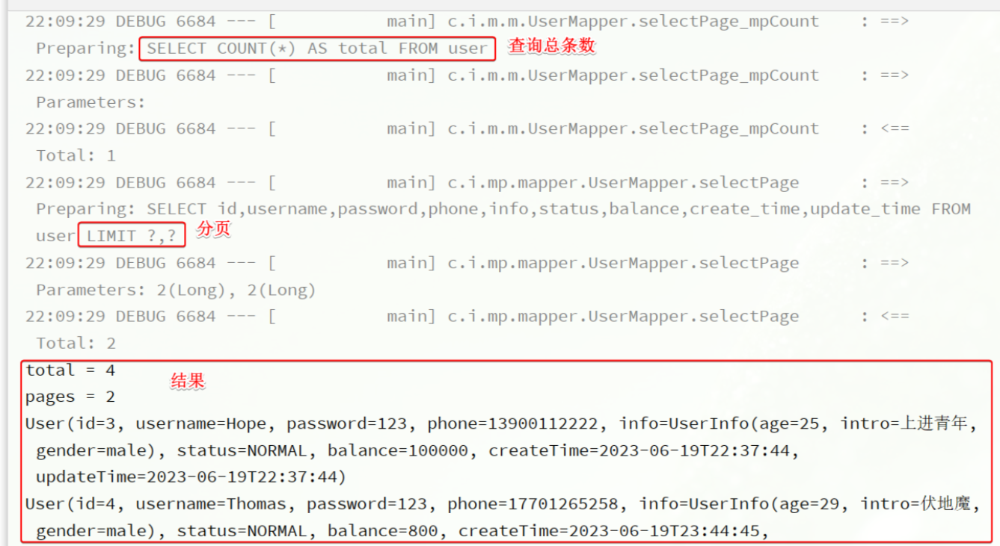
这里用到了分页参数，Page，即可以支持分页参数，也可以支持排序参数。常见的API如下：
```java

int pageNo = 1, pageSize = 5;
// 分页参数
Page<User> page = Page.of(pageNo, pageSize);
// 排序参数, 通过OrderItem来指定
page.addOrder(new OrderItem("balance", false));

userService.page(page);
```


## 通用分页实体
现在要实现一个用户分页查询的接口，接口规范如下：
| 参数 | 说明 |
| --- | --- |
| 请求方式 | GET |
| 请求路径 | /users/page |
| 请求参数 | {     "pageNo": 1,     "pageSize": 5,     "sortBy": "balance",     "isAsc": false,     "name": "o",     "status": 1 } |
| 返回值 | {     "total": 100006,     "pages": 50003,     "list": [         {             "id": 1685100878975279298,             "username": "user_9****",             "info": {                 "age": 24,                 "intro": "英文老师",                 "gender": "female"             },             "status": "正常",             "balance": 2000         }     ] } |
| 特殊说明 | - 如果排序字段为空，默认按照更新时间排序 - 排序字段不为空，则按照排序字段排序 |


这里需要定义3个实体：
- UserQuery：分页查询条件的实体，包含分页、排序参数、过滤条件
- PageDTO：分页结果实体，包含总条数、总页数、当前页数据
- UserVO：用户页面视图实体

### 实体
由于UserQuery之前已经定义过了，并且其中已经包含了过滤条件，具体代码如下：
```java
package com.onenewcode.mpdemo.domain.query;

import io.swagger.annotations.ApiModel;
import io.swagger.annotations.ApiModelProperty;
import lombok.Data;

@Data
@ApiModel(description = "用户查询条件实体")
public class UserQuery {
    @ApiModelProperty("用户名关键字")
    private String name;
    @ApiModelProperty("用户状态：1-正常，2-冻结")
    private Integer status;
    @ApiModelProperty("余额最小值")
    private Integer minBalance;
    @ApiModelProperty("余额最大值")
    private Integer maxBalance;
}

```


其中缺少的仅仅是分页条件，而分页条件不仅仅用户分页查询需要，以后其它业务也都有分页查询的需求。因此建议将分页查询条件单独定义为一个**PageQuery**实体.
PageQuery是前端提交的查询参数，一般包含四个属性：
- pageNo：页码
- pageSize：每页数据条数
- sortBy：排序字段
- isAsc：是否升序
```java
@Data
@ApiModel(description = "分页查询实体")
public class PageQuery {
    @ApiModelProperty("页码")
    private Integer pageNo;
    @ApiModelProperty("页码")
    private Integer pageSize;
    @ApiModelProperty("排序字段")
    private String sortBy;
    @ApiModelProperty("是否升序")
    private Boolean isAsc;
}

```

然后，让我们的UserQuery继承这个实体：
```java
package com.onenewcode.mpdemo.domain.query;

import io.swagger.annotations.ApiModel;
import io.swagger.annotations.ApiModelProperty;
import lombok.Data;
import lombok.EqualsAndHashCode;

@EqualsAndHashCode(callSuper = true)
@Data
@ApiModel(description = "用户查询条件实体")
public class UserQuery extends PageQuery {
    @ApiModelProperty("用户名关键字")
    private String name;
    @ApiModelProperty("用户状态：1-正常，2-冻结")
    private Integer status;
    @ApiModelProperty("余额最小值")
    private Integer minBalance;
    @ApiModelProperty("余额最大值")
    private Integer maxBalance;
}


```

返回值的用户实体沿用之前定一个UserVO实体：

最后，则是分页实体PageDTO:

代码如下：
```java

package com.onenewcode.mpdemo.domain.dto;

import io.swagger.annotations.ApiModel;
import io.swagger.annotations.ApiModelProperty;
import lombok.Data;

import java.util.List;

@Data
@ApiModel(description = "分页结果")
public class PageDTO<T> {
    @ApiModelProperty("总条数")
    private Long total;
    @ApiModelProperty("总页数")
    private Long pages;
    @ApiModelProperty("集合")
    private List<T> list;
}
```


### 开发接口
我们在UserController中定义分页查询用户的接口：
```java
package com.onenewcode.mpdemo.controller;

import com.onenewcode.mpdemo.domain.dto.PageDTO;
import com.onenewcode.mpdemo.domain.query.PageQuery;
import com.onenewcode.mpdemo.domain.vo.UserVO;
import com.onenewcode.mpdemo.service.UserService;
import lombok.RequiredArgsConstructor;
import org.springframework.web.bind.annotation.GetMapping;
import org.springframework.web.bind.annotation.RequestMapping;
import org.springframework.web.bind.annotation.RestController;

@RestController
@RequestMapping("users")
@RequiredArgsConstructor
public class UserController {

    private final UserService userService;

    @GetMapping("/page")
    public PageDTO<UserVO> queryUsersPage(UserQuery query){
        return userService.queryUsersPage(query);
    }

    // 。。。 略
}


```

然后在IUserService中创建queryUsersPage方法：
```java
PageDTO<UserVO> queryUsersPage(PageQuery query);
```


接下来，在UserServiceImpl中实现该方法：
```java

@Override
public PageDTO<UserVO> queryUsersPage(PageQuery query) {
    // 1.构建条件
    // 1.1.分页条件
    Page<User> page = Page.of(query.getPageNo(), query.getPageSize());
    // 1.2.排序条件
    if (query.getSortBy() != null) {
        page.addOrder(new OrderItem(query.getSortBy(), query.getIsAsc()));
    }else{
        // 默认按照更新时间排序
        page.addOrder(new OrderItem("update_time", false));
    }
    // 2.查询
    page(page);
    // 3.数据非空校验
    List<User> records = page.getRecords();
    if (records == null || records.size() <= 0) {
        // 无数据，返回空结果
        return new PageDTO<>(page.getTotal(), page.getPages(), Collections.emptyList());
    }
    // 4.有数据，转换
    List<UserVO> list = BeanUtil.copyToList(records, UserVO.class);
    // 5.封装返回
    return new PageDTO<UserVO>(page.getTotal(), page.getPages(), list);
}

```


### 改造PageQuery实体
在刚才的代码中，从PageQuery到MybatisPlus的Page之间转换的过程还是比较麻烦的。

我们完全可以在PageQuery这个实体中定义一个工具方法，简化开发。
像这样：
```java
package com.onenewcode.mpdemo.domain.query;

import com.baomidou.mybatisplus.core.metadata.OrderItem;
import com.baomidou.mybatisplus.extension.plugins.pagination.Page;
import lombok.Data;

@Data
public class PageQuery {
    private Integer pageNo;
    private Integer pageSize;
    private String sortBy;
    private Boolean isAsc;

    public <T>  Page<T> toMpPage(OrderItem ... orders){
        // 1.分页条件
        Page<T> p = Page.of(pageNo, pageSize);
        // 2.排序条件
        // 2.1.先看前端有没有传排序字段
        if (sortBy != null) {
            p.addOrder(new OrderItem(sortBy, isAsc));
            return p;
        }
        // 2.2.再看有没有手动指定排序字段
        if(orders != null){
            p.addOrder(orders);
        }
        return p;
    }

    public <T> Page<T> toMpPage(String defaultSortBy, boolean isAsc){
        return this.toMpPage(new OrderItem(defaultSortBy, isAsc));
    }

    public <T> Page<T> toMpPageDefaultSortByCreateTimeDesc() {
        return toMpPage("create_time", false);
    }

    public <T> Page<T> toMpPageDefaultSortByUpdateTimeDesc() {
        return toMpPage("update_time", false);
    }
}
```

这样我们在开发也时就可以省去对从PageQuery到Page的的转换：
// 1.构建条件
```java
Page<User> page = query.toMpPageDefaultSortByCreateTimeDesc();

```


### 改造PageDTO实体
在查询出分页结果后，数据的非空校验，数据的vo转换都是模板代码，编写起来很麻烦。
我们完全可以将其封装到PageDTO的工具方法中，简化整个过程：
```java
package com.onenewcode.mpdemo.domain.dto;

import cn.hutool.core.bean.BeanUtil;
import com.baomidou.mybatisplus.extension.plugins.pagination.Page;
import lombok.AllArgsConstructor;
import lombok.Data;
import lombok.NoArgsConstructor;

import java.util.Collections;
import java.util.List;
import java.util.function.Function;
import java.util.stream.Collectors;

@Data
@NoArgsConstructor
@AllArgsConstructor
public class PageDTO<V> {
    private Long total;
    private Long pages;
    private List<V> list;

    /**
     * 返回空分页结果
     * @param p MybatisPlus的分页结果
     * @param <V> 目标VO类型
     * @param <P> 原始PO类型
     * @return VO的分页对象
     */
    public static <V, P> PageDTO<V> empty(Page<P> p){
        return new PageDTO<>(p.getTotal(), p.getPages(), Collections.emptyList());
    }

    /**
     * 将MybatisPlus分页结果转为 VO分页结果
     * @param p MybatisPlus的分页结果
     * @param voClass 目标VO类型的字节码
     * @param <V> 目标VO类型
     * @param <P> 原始PO类型
     * @return VO的分页对象
     */
    public static <V, P> PageDTO<V> of(Page<P> p, Class<V> voClass) {
        // 1.非空校验
        List<P> records = p.getRecords();
        if (records == null || records.size() <= 0) {
            // 无数据，返回空结果
            return empty(p);
        }
        // 2.数据转换
        List<V> vos = BeanUtil.copyToList(records, voClass);
        // 3.封装返回
        return new PageDTO<>(p.getTotal(), p.getPages(), vos);
    }

    /**
     * 将MybatisPlus分页结果转为 VO分页结果，允许用户自定义PO到VO的转换方式
     * @param p MybatisPlus的分页结果
     * @param convertor PO到VO的转换函数
     * @param <V> 目标VO类型
     * @param <P> 原始PO类型
     * @return VO的分页对象
     */
    public static <V, P> PageDTO<V> of(Page<P> p, Function<P, V> convertor) {
        // 1.非空校验
        List<P> records = p.getRecords();
        if (records == null || records.size() <= 0) {
            // 无数据，返回空结果
            return empty(p);
        }
        // 2.数据转换
        List<V> vos = records.stream().map(convertor).collect(Collectors.toList());
        // 3.封装返回
        return new PageDTO<>(p.getTotal(), p.getPages(), vos);
    }
}


```

最终，业务层的代码可以简化为：
```java
@Override
public PageDTO<UserVO> queryUserByPage(PageQuery query) {
    // 1.构建条件
    Page<User> page = query.toMpPageDefaultSortByCreateTimeDesc();
    // 2.查询
    page(page);
    // 3.封装返回
    return PageDTO.of(page, UserVO.class);
}

```

如果是希望自定义PO到VO的转换过程，可以这样做：
```java
@Override
public PageDTO<UserVO> queryUserByPage(PageQuery query) {
    // 1.构建条件
    Page<User> page = query.toMpPageDefaultSortByCreateTimeDesc();
    // 2.查询
    page(page);
    // 3.封装返回
    return PageDTO.of(page, user -> {
        // 拷贝属性到VO
        UserVO vo = BeanUtil.copyProperties(user, UserVO.class);
        // 用户名脱敏
        String username = vo.getUsername();
        vo.setUsername(username.substring(0, username.length() - 2) + "**");
        return vo;
    });
}

```


