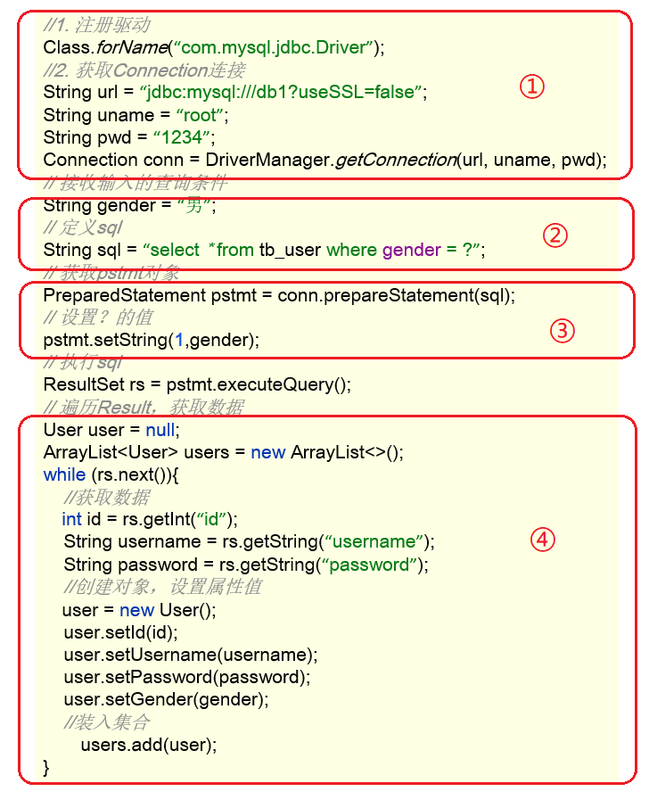
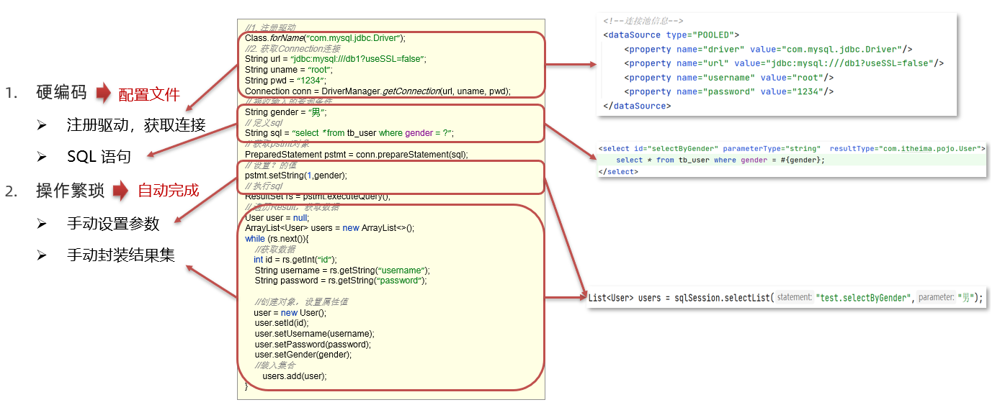
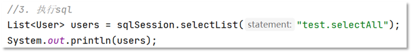
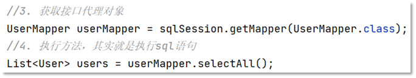

# Mybatis

###   Mybatis概述

####   Mybatis概念

（1）Mybatis是一个半ORM（对象关系映射）框架，它内部封装了JDBC，开发时只需要关注SQL语句本身，不需要花费精力去处理加载驱动、创建连接、创建statement等繁杂的过程。程序员直接编写原生态sql，可以严格控制sql执行性能，灵活度高。

（2）MyBatis 可以使用 XML 或注解来配置和映射原生信息，将 POJO映射成数据库中的记录，避免了几乎所有的 JDBC 代码和手动设置参数以及获取结果集。

（3）通过xml 文件或注解的方式将要执行的各种 statement 配置起来，并通过java对象和 statement中sql的动态参数进行映射生成最终执行的sql语句，最后由mybatis框架执行sql并将结果映射为java对象并返回。（从执行sql到返回result的过程）。

个人总结：MyBatis是一个可以自定义SQL、存储过程和高级映射的持久层框架

官方说明：MyBatis是一个一流的持久性框架，支持自定义SQL、存储过程和高级映射。MyBatis消除了所有的JDBC代码和手动设置参数和检索结果。MyBatis可以使用简单的XML或注释进行配置，并将原语、映射接口和Java pojo(普通的旧Java对象)映射到数据库记录

####   JDBC 缺点

下面是 JDBC 代码，我们通过该代码分析都存在什么缺点：



* 硬编码

  * 注册驱动、获取连接

    上图标1的代码有很多字符串，而这些是连接数据库的四个基本信息，以后如果要将Mysql数据库换成其他的关系型数据库的话，这四个地方都需要修改，如果放在此处就意味着要修改我们的源代码。

  * SQL语句

    上图标2的代码。如果表结构发生变化，SQL语句就要进行更改。这也不方便后期的维护。

* 操作繁琐

  * 手动设置参数

  * 手动封装结果集

    上图标4的代码是对查询到的数据进行封装，而这部分代码是没有什么技术含量，而且特别耗费时间的。

####  Mybatis 优化

* 硬编码可以配置到==配置文件==
* 操作繁琐的地方mybatis都==自动完成==

如图所示




### Mybatis快速入门

**需求：查询user表中所有的数据**

* 创建user表，添加数据

  ```sql
  create database mybatis;
  use mybatis;
  
  drop table if exists tb_user;
  
  create table tb_user(
  	id int primary key auto_increment,
  	username varchar(20),
  	password varchar(20),
  	gender char(1),
  	addr varchar(30)
  );
  
  INSERT INTO tb_user VALUES (1, 'zhangsan', '123', '男', '北京');
  INSERT INTO tb_user VALUES (2, '李四', '234', '女', '天津');
  INSERT INTO tb_user VALUES (3, '王五', '11', '男', '西安');
  ```

* 创建模块，导入坐标

  在创建好的模块中的 pom.xml 配置文件中添加依赖的坐标

  ```xml
  <dependencies>
      <!--mybatis 依赖-->
      <dependency>
          <groupId>org.mybatis</groupId>
          <artifactId>mybatis</artifactId>
          <version>3.5.5</version>
      </dependency>
  
      <!--mysql 驱动-->
      <dependency>
          <groupId>mysql</groupId>
          <artifactId>mysql-connector-java</artifactId>
          <version>5.1.46</version>
      </dependency>
  
      <!--junit 单元测试-->
      <dependency>
          <groupId>junit</groupId>
          <artifactId>junit</artifactId>
          <version>4.13</version>
          <scope>test</scope>
      </dependency>
  
      <!-- 添加slf4j日志api -->
      <dependency>
          <groupId>org.slf4j</groupId>
          <artifactId>slf4j-api</artifactId>
          <version>1.7.20</version>
      </dependency>
      <!-- 添加logback-classic依赖 -->
      <dependency>
          <groupId>ch.qos.logback</groupId>
          <artifactId>logback-classic</artifactId>
          <version>1.2.3</version>
      </dependency>
      <!-- 添加logback-core依赖 -->
      <dependency>
          <groupId>ch.qos.logback</groupId>
          <artifactId>logback-core</artifactId>
          <version>1.2.3</version>
      </dependency>
  </dependencies>
  ```

  注意：需要在项目的 resources 目录下创建logback的配置文件

* 编写 MyBatis 核心配置文件 -- > 替换连接信息 解决硬编码问题

  在模块下的 resources 目录下创建mybatis的配置文件 `mybatis-config.xml`，内容如下：

  ```xml
  <?xml version="1.0" encoding="UTF-8" ?>
  <!DOCTYPE configuration
          PUBLIC "-//mybatis.org//DTD Config 3.0//EN"
          "http://mybatis.org/dtd/mybatis-3-config.dtd">
  <configuration>
  
      <typeAliases>
          <package name="com.onenewcode.pojo"/>
      </typeAliases>
      
      <!--
      environments：配置数据库连接环境信息。可以配置多个environment，通过default属性切换不同的environment
      -->
      <environments default="development">
          <environment id="development">
              <transactionManager type="JDBC"/>
              <dataSource type="POOLED">
                  <!--数据库连接信息-->
                  <property name="driver" value="com.mysql.jdbc.Driver"/>
                  <property name="url" value="jdbc:mysql:///mybatis?useSSL=false"/>
                  <property name="username" value="root"/>
                  <property name="password" value="1234"/>
              </dataSource>
          </environment>
  
          <environment id="test">
              <transactionManager type="JDBC"/>
              <dataSource type="POOLED">
                  <!--数据库连接信息-->
                  <property name="driver" value="com.mysql.jdbc.Driver"/>
                  <property name="url" value="jdbc:mysql:///mybatis?useSSL=false"/>
                  <property name="username" value="root"/>
                  <property name="password" value="1234"/>
              </dataSource>
          </environment>
      </environments>
      <mappers>
         <!--加载sql映射文件-->
         <mapper resource="UserMapper.xml"/>
      </mappers>
  </configuration>
  ```

* 编写 SQL 映射文件 --> 统一管理sql语句，解决硬编码问题

  在模块的 `resources` 目录下创建映射配置文件 `UserMapper.xml`，内容如下：

  ```xml
  <?xml version="1.0" encoding="UTF-8" ?>
  <!DOCTYPE mapper PUBLIC "-//mybatis.org//DTD Mapper 3.0//EN" "http://mybatis.org/dtd/mybatis-3-mapper.dtd">
  <mapper namespace="test">
      <select id="selectAll" resultType="com.onenewcode.pojo.User">
          select * from tb_user;
      </select>
  </mapper>
  ```

* 编码

  * 在 `com.onenewcode.pojo` 包下创建 User类

    ```java
    public class User {
        private int id;
        private String username;
        private String password;
        private String gender;
        private String addr;
        
        //省略了 setter 和 getter
    }
    ```

  * 在 `com.onenewcode` 包下编写 MybatisDemo 测试类

    ```java
    public class MyBatisDemo {
    
        public static void main(String[] args) throws IOException {
            //1. 加载mybatis的核心配置文件，获取 SqlSessionFactory
            String resource = "mybatis-config.xml";
            InputStream inputStream = Resources.getResourceAsStream(resource);
            SqlSessionFactory sqlSessionFactory = new SqlSessionFactoryBuilder().build(inputStream);
    
            //2. 获取SqlSession对象，用它来执行sql
            SqlSession sqlSession = sqlSessionFactory.openSession();
            //3. 执行sql
            List<User> users = sqlSession.selectList("test.selectAll"); //参数是一个字符串，该字符串必须是映射配置文件的namespace.id
            System.out.println(users);
            //4. 释放资源
            sqlSession.close();
        }
    }
    ```


###   Mapper代理开发

####   Mapper代理开发概述

之前我们写的代码是基本使用方式，它也存在硬编码的问题，如下：



这里调用 `selectList()` 方法传递的参数是映射配置文件中的 namespace.id值。这样写也不便于后期的维护。如果使用 Mapper 代理方式（如下图）则不存在硬编码问题。



通过上面的描述可以看出 Mapper 代理方式的目的：

* 解决原生方式中的硬编码
* 简化后期执行SQL

Mybatis 官网也是推荐使用 Mapper 代理的方式。


####   使用Mapper代理要求

使用Mapper代理方式，必须满足以下要求：

* 定义与SQL映射文件同名的Mapper接口，并且将Mapper接口和SQL映射文件放置在同一目录下。如下图：

  

* 设置SQL映射文件的namespace属性为Mapper接口全限定名

  

* 在 Mapper 接口中定义方法，方法名就是SQL映射文件中sql语句的id，并保持参数类型和返回值类型一致

  

#### 2.3.3  案例代码实现

* 在 `com.onenewcode.mapper` 包下创建 UserMapper接口，代码如下：

  ```java
  public interface UserMapper {
      List<User> selectAll();
      User selectById(int id);
  }
  ```

* 在 `resources` 下创建 `com/onenewcode/mapper` 目录，并在该目录下创建 UserMapper.xml 映射配置文件

  ```xml
  <!--
      namespace:名称空间。必须是对应接口的全限定名
  -->
  <mapper namespace="com.onenewcode.mapper.UserMapper">
      <select id="selectAll" resultType="com.onenewcode.pojo.User">
          select *
          from tb_user;
      </select>
  </mapper>
  ```

* 在 `com.onenewcode` 包下创建 MybatisDemo2 测试类，代码如下：

  ```java
  /**
   * Mybatis 代理开发
   */
  public class MyBatisDemo2 {
  
      public static void main(String[] args) throws IOException {
  
          //1. 加载mybatis的核心配置文件，获取 SqlSessionFactory
          String resource = "mybatis-config.xml";
          InputStream inputStream = Resources.getResourceAsStream(resource);
          SqlSessionFactory sqlSessionFactory = new SqlSessionFactoryBuilder().build(inputStream);
  
          //2. 获取SqlSession对象，用它来执行sql
          SqlSession sqlSession = sqlSessionFactory.openSession();
          //3. 执行sql
          //3.1 获取UserMapper接口的代理对象
          UserMapper userMapper = sqlSession.getMapper(UserMapper.class);
          List<User> users = userMapper.selectAll();
  
          System.out.println(users);
          //4. 释放资源
          sqlSession.close();
      }
  }
  ```

==注意：==

如果Mapper接口名称和SQL映射文件名称相同，并在同一目录下，则可以使用包扫描的方式简化SQL映射文件的加载。也就是将核心配置文件的加载映射配置文件的配置修改为

```xml
<mappers>
    <!--加载sql映射文件-->
    <!-- <mapper resource="com/onenewcode/mapper/UserMapper.xml"/>-->
    <!--Mapper代理方式-->
    <package name="com.onenewcode.mapper"/>
</mappers>
```


### 2.4  核心配置文件

核心配置文件中现有的配置之前已经给大家进行了解释，而核心配置文件中还可以配置很多内容。我们可以通过查询官网看可以配置的内容


接下来我们先对里面的一些配置进行讲解。

#### 2.4.1  多环境配置

在核心配置文件的 `environments` 标签中其实是可以配置多个 `environment` ，使用 `id` 给每段环境起名，在 `environments` 中使用 `default='环境id'` 来指定使用哪儿段配置。我们一般就配置一个 `environment` 即可。

```xml
<environments default="development">
    <environment id="development">
        <transactionManager type="JDBC"/>
        <dataSource type="POOLED">
            <!--数据库连接信息-->
            <property name="driver" value="com.mysql.jdbc.Driver"/>
            <property name="url" value="jdbc:mysql:///mybatis?useSSL=false"/>
            <property name="username" value="root"/>
            <property name="password" value="1234"/>
        </dataSource>
    </environment>

    <environment id="test">
        <transactionManager type="JDBC"/>
        <dataSource type="POOLED">
            <!--数据库连接信息-->
            <property name="driver" value="com.mysql.jdbc.Driver"/>
            <property name="url" value="jdbc:mysql:///mybatis?useSSL=false"/>
            <property name="username" value="root"/>
            <property name="password" value="1234"/>
        </dataSource>
    </environment>
</environments>=
```

#### 2.4.2  类型别名

在映射配置文件中的 `resultType` 属性需要配置数据封装的类型（类的全限定名）。而每次这样写是特别麻烦的，Mybatis 提供了 `类型别名`(typeAliases) 可以简化这部分的书写。

首先需要现在核心配置文件中配置类型别名，也就意味着给pojo包下所有的类起了别名（别名就是类名），不区分大小写。内容如下：

```xml
<typeAliases>
    <!--name属性的值是实体类所在包-->
    <package name="com.onenewcode.pojo"/> 
</typeAliases>
```

通过上述的配置，我们就可以简化映射配置文件中 `resultType` 属性值的编写

```xml
<mapper namespace="com.onenewcode.mapper.UserMapper">
    <select id="selectAll" resultType="user">
        select * from tb_user;
    </select>
</mapper>
```

