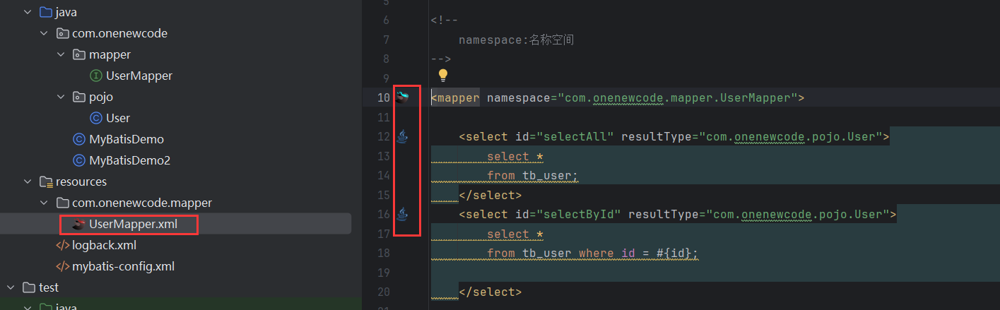
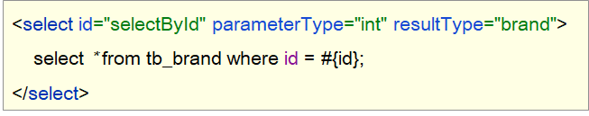

# Mybatis

###   Mybatis概述

####   Mybatis概念

（1）Mybatis是一个半ORM（对象关系映射）框架，它内部封装了JDBC，开发时只需要关注SQL语句本身，不需要花费精力去处理加载驱动、创建连接、创建statement等繁杂的过程。程序员直接编写原生态sql，可以严格控制sql执行性能，灵活度高。

（2）MyBatis 可以使用 XML 或注解来配置和映射原生信息，将 POJO映射成数据库中的记录，避免了几乎所有的 JDBC 代码和手动设置参数以及获取结果集。

（3）通过xml 文件或注解的方式将要执行的各种 statement 配置起来，并通过java对象和 statement中sql的动态参数进行映射生成最终执行的sql语句，最后由mybatis框架执行sql并将结果映射为java对象并返回。（从执行sql到返回result的过程）。

个人总结：MyBatis是一个可以自定义SQL、存储过程和高级映射的持久层框架

官方说明：MyBatis是一个一流的持久性框架，支持自定义SQL、存储过程和高级映射。MyBatis消除了所有的JDBC代码和手动设置参数和检索结果。MyBatis可以使用简单的XML或注释进行配置，并将原语、映射接口和Java pojo(普通的旧Java对象)映射到数据库记录

####   JDBC 缺点

下面是 JDBC 代码，我们通过该代码分析都存在什么缺点：


* 硬编码

  * 注册驱动、获取连接

    上图标1的代码有很多字符串，而这些是连接数据库的四个基本信息，以后如果要将Mysql数据库换成其他的关系型数据库的话，这四个地方都需要修改，如果放在此处就意味着要修改我们的源代码。

  * SQL语句

    上图标2的代码。如果表结构发生变化，SQL语句就要进行更改。这也不方便后期的维护。

* 操作繁琐

  * 手动设置参数

  * 手动封装结果集

    上图标4的代码是对查询到的数据进行封装，而这部分代码是没有什么技术含量，而且特别耗费时间的。

####  Mybatis 优化

* 硬编码可以配置到==配置文件==
* 操作繁琐的地方mybatis都==自动完成==

如图所示


### Mybatis快速入门

**需求：查询user表中所有的数据**

* 创建user表，添加数据

  ```sql
  create database mybatis;
  use mybatis;
  
  drop table if exists tb_user;
  
  create table tb_user(
  	id int primary key auto_increment,
  	username varchar(20),
  	password varchar(20),
  	gender char(1),
  	addr varchar(30)
  );
  
  INSERT INTO tb_user VALUES (1, 'zhangsan', '123', '男', '北京');
  INSERT INTO tb_user VALUES (2, '李四', '234', '女', '天津');
  INSERT INTO tb_user VALUES (3, '王五', '11', '男', '西安');
  ```

* 创建模块，导入坐标

  在创建好的模块中的 pom.xml 配置文件中添加依赖的坐标

  ```xml
  <dependencies>
      <!--mybatis 依赖-->
      <dependency>
          <groupId>org.mybatis</groupId>
          <artifactId>mybatis</artifactId>
          <version>3.5.5</version>
      </dependency>
  
      <!--mysql 驱动-->
      <dependency>
          <groupId>mysql</groupId>
          <artifactId>mysql-connector-java</artifactId>
          <version>5.1.46</version>
      </dependency>
  
      <!--junit 单元测试-->
      <dependency>
          <groupId>junit</groupId>
          <artifactId>junit</artifactId>
          <version>4.13</version>
          <scope>test</scope>
      </dependency>
  
      <!-- 添加slf4j日志api -->
      <dependency>
          <groupId>org.slf4j</groupId>
          <artifactId>slf4j-api</artifactId>
          <version>1.7.20</version>
      </dependency>
      <!-- 添加logback-classic依赖 -->
      <dependency>
          <groupId>ch.qos.logback</groupId>
          <artifactId>logback-classic</artifactId>
          <version>1.2.3</version>
      </dependency>
      <!-- 添加logback-core依赖 -->
      <dependency>
          <groupId>ch.qos.logback</groupId>
          <artifactId>logback-core</artifactId>
          <version>1.2.3</version>
      </dependency>
  </dependencies>
  ```

  注意：需要在项目的 resources 目录下创建logback的配置文件

* 编写 MyBatis 核心配置文件 -- > 替换连接信息 解决硬编码问题

  在模块下的 resources 目录下创建mybatis的配置文件 `mybatis-config.xml`，内容如下：

  ```xml
  <?xml version="1.0" encoding="UTF-8" ?>
  <!DOCTYPE configuration
          PUBLIC "-//mybatis.org//DTD Config 3.0//EN"
          "http://mybatis.org/dtd/mybatis-3-config.dtd">
  <configuration>
  
      <typeAliases>
          <package name="com.onenewcode.pojo"/>
      </typeAliases>
      
      <!--
      environments：配置数据库连接环境信息。可以配置多个environment，通过default属性切换不同的environment
      -->
      <environments default="development">
          <environment id="development">
              <transactionManager type="JDBC"/>
              <dataSource type="POOLED">
                  <!--数据库连接信息-->
                  <property name="driver" value="com.mysql.jdbc.Driver"/>
                  <property name="url" value="jdbc:mysql:///mybatis?useSSL=false"/>
                  <property name="username" value="root"/>
                  <property name="password" value="1234"/>
              </dataSource>
          </environment>
  
          <environment id="test">
              <transactionManager type="JDBC"/>
              <dataSource type="POOLED">
                  <!--数据库连接信息-->
                  <property name="driver" value="com.mysql.jdbc.Driver"/>
                  <property name="url" value="jdbc:mysql:///mybatis?useSSL=false"/>
                  <property name="username" value="root"/>
                  <property name="password" value="1234"/>
              </dataSource>
          </environment>
      </environments>
      <mappers>
         <!--加载sql映射文件-->
         <mapper resource="UserMapper.xml"/>
      </mappers>
  </configuration>
  ```

* 编写 SQL 映射文件 --> 统一管理sql语句，解决硬编码问题

  在模块的 `resources` 目录下创建映射配置文件 `UserMapper.xml`，内容如下：

  ```xml
  <?xml version="1.0" encoding="UTF-8" ?>
  <!DOCTYPE mapper PUBLIC "-//mybatis.org//DTD Mapper 3.0//EN" "http://mybatis.org/dtd/mybatis-3-mapper.dtd">
  <mapper namespace="test">
      <select id="selectAll" resultType="com.onenewcode.pojo.User">
          select * from tb_user;
      </select>
  </mapper>
  ```

* 编码

  * 在 `com.onenewcode.pojo` 包下创建 User类

    ```java
    public class User {
        private int id;
        private String username;
        private String password;
        private String gender;
        private String addr;
        
        //省略了 setter 和 getter
    }
    ```

  * 在 `com.onenewcode` 包下编写 MybatisDemo 测试类

    ```java
    public class MyBatisDemo {
    
        public static void main(String[] args) throws IOException {
            //1. 加载mybatis的核心配置文件，获取 SqlSessionFactory
            String resource = "mybatis-config.xml";
            InputStream inputStream = Resources.getResourceAsStream(resource);
            SqlSessionFactory sqlSessionFactory = new SqlSessionFactoryBuilder().build(inputStream);
    
            //2. 获取SqlSession对象，用它来执行sql
            SqlSession sqlSession = sqlSessionFactory.openSession();
            //3. 执行sql
            List<User> users = sqlSession.selectList("test.selectAll"); //参数是一个字符串，该字符串必须是映射配置文件的namespace.id
            System.out.println(users);
            //4. 释放资源
            sqlSession.close();
        }
    }
    ```


###   Mapper代理开发

####   Mapper代理开发概述

之前我们写的代码是基本使用方式，它也存在硬编码的问题，如下：


这里调用 `selectList()` 方法传递的参数是映射配置文件中的 namespace.id值。这样写也不便于后期的维护。如果使用 Mapper 代理方式（如下图）则不存在硬编码问题。


通过上面的描述可以看出 Mapper 代理方式的目的：

* 解决原生方式中的硬编码
* 简化后期执行SQL

Mybatis 官网也是推荐使用 Mapper 代理的方式。


####   使用Mapper代理要求

使用Mapper代理方式，必须满足以下要求：

* 定义与SQL映射文件同名的Mapper接口，并且将Mapper接口和SQL映射文件放置在同一目录下。如下图：


* 设置SQL映射文件的namespace属性为Mapper接口全限定名


* 在 Mapper 接口中定义方法，方法名就是SQL映射文件中sql语句的id，并保持参数类型和返回值类型一致


####   案例代码实现

* 在 `com.onenewcode.mapper` 包下创建 UserMapper接口，代码如下：

  ```java
  public interface UserMapper {
      List<User> selectAll();
      User selectById(int id);
  }
  ```

* 在 `resources` 下创建 `com/onenewcode/mapper` 目录，并在该目录下创建 UserMapper.xml 映射配置文件

  ```xml
  <!--
      namespace:名称空间。必须是对应接口的全限定名
  -->
  <mapper namespace="com.onenewcode.mapper.UserMapper">
      <select id="selectAll" resultType="com.onenewcode.pojo.User">
          select *
          from tb_user;
      </select>
  </mapper>
  ```

* 在 `com.onenewcode` 包下创建 MybatisDemo2 测试类，代码如下：

  ```java
  /**
   * Mybatis 代理开发
   */
  public class MyBatisDemo2 {
  
      public static void main(String[] args) throws IOException {
  
          //1. 加载mybatis的核心配置文件，获取 SqlSessionFactory
          String resource = "mybatis-config.xml";
          InputStream inputStream = Resources.getResourceAsStream(resource);
          SqlSessionFactory sqlSessionFactory = new SqlSessionFactoryBuilder().build(inputStream);
  
          //2. 获取SqlSession对象，用它来执行sql
          SqlSession sqlSession = sqlSessionFactory.openSession();
          //3. 执行sql
          //3.1 获取UserMapper接口的代理对象
          UserMapper userMapper = sqlSession.getMapper(UserMapper.class);
          List<User> users = userMapper.selectAll();
  
          System.out.println(users);
          //4. 释放资源
          sqlSession.close();
      }
  }
  ```

==注意：==

如果Mapper接口名称和SQL映射文件名称相同，并在同一目录下，则可以使用包扫描的方式简化SQL映射文件的加载。也就是将核心配置文件的加载映射配置文件的配置修改为

```xml
<mappers>
    <!--加载sql映射文件-->
    <!-- <mapper resource="com/onenewcode/mapper/UserMapper.xml"/>-->
    <!--Mapper代理方式-->
    <package name="com.onenewcode.mapper"/>
</mappers>
```


###   核心配置文件

核心配置文件中现有的配置之前已经给大家进行了解释，而核心配置文件中还可以配置很多内容。我们可以通过查询官网看可以配置的内容

####   多环境配置

在核心配置文件的 `environments` 标签中其实是可以配置多个 `environment` ，使用 `id` 给每段环境起名，在 `environments` 中使用 `default='环境id'` 来指定使用哪儿段配置。我们一般就配置一个 `environment` 即可。

```xml
<environments default="development">
    <environment id="development">
        <transactionManager type="JDBC"/>
        <dataSource type="POOLED">
            <!--数据库连接信息-->
            <property name="driver" value="com.mysql.jdbc.Driver"/>
            <property name="url" value="jdbc:mysql:///mybatis?useSSL=false"/>
            <property name="username" value="root"/>
            <property name="password" value="1234"/>
        </dataSource>
    </environment>

    <environment id="test">
        <transactionManager type="JDBC"/>
        <dataSource type="POOLED">
            <!--数据库连接信息-->
            <property name="driver" value="com.mysql.jdbc.Driver"/>
            <property name="url" value="jdbc:mysql:///mybatis?useSSL=false"/>
            <property name="username" value="root"/>
            <property name="password" value="1234"/>
        </dataSource>
    </environment>
</environments>=
```

####   类型别名

在映射配置文件中的 `resultType` 属性需要配置数据封装的类型（类的全限定名）。而每次这样写是特别麻烦的，Mybatis 提供了 `类型别名`(typeAliases) 可以简化这部分的书写。

首先需要现在核心配置文件中配置类型别名，也就意味着给pojo包下所有的类起了别名（别名就是类名），不区分大小写。内容如下：

```xml
<typeAliases>
    <!--name属性的值是实体类所在包-->
    <package name="com.onenewcode.pojo"/> 
</typeAliases>
```

通过上述的配置，我们就可以简化映射配置文件中 `resultType` 属性值的编写

```xml
<mapper namespace="com.onenewcode.mapper.UserMapper">
    <select id="selectAll" resultType="user">
        select * from tb_user;
    </select>
</mapper>
```


# Mybatis练习


## 配置文件实现CRUD

> * 查询
>   * 查询所有数据
>   * 查询详情
>   * 条件查询
> * 添加
> * 修改
>   * 修改全部字段
>   * 修改动态字段
> * 删除
>   * 删除一个
>   * 批量删除

###  环境准备

* 数据库表（tb_brand）及数据准备

  ```sql
  -- 删除tb_brand表
  drop table if exists tb_brand;
  -- 创建tb_brand表
  create table tb_brand
  (
      -- id 主键
      id           int primary key auto_increment,
      -- 品牌名称
      brand_name   varchar(20),
      -- 企业名称
      company_name varchar(20),
      -- 排序字段
      ordered      int,
      -- 描述信息
      description  varchar(100),
      -- 状态：0：禁用  1：启用
      status       int
  );
  -- 添加数据
  insert into tb_brand (brand_name, company_name, ordered, description, status)
  values ('三只松鼠', '三只松鼠股份有限公司', 5, '好吃不上火', 0),
         ('华为', '华为技术有限公司', 100, '华为致力于把数字世界带入每个人、每个家庭、每个组织，构建万物互联的智能世界', 1),
         ('小米', '小米科技有限公司', 50, 'are you ok', 1);
  ```

* 实体类 Brand

  在 `com.onenewcode.pojo` 包下创建 Brand 实体类。

  ```java
  public class Brand {
      // id 主键
      private Integer id;
      // 品牌名称
      private String brandName;
      // 企业名称
      private String companyName;
      // 排序字段
      private Integer ordered;
      // 描述信息
      private String description;
      // 状态：0：禁用  1：启用
      private Integer status;
      
      //省略 setter and getter。自己写时要补全这部分代码
  }
  ```

* 编写测试用例

  测试代码需要在 `test/java` 目录下创建包及测试用例。项目结构如下：


* 安装 MyBatisX 插件

  * MybatisX 是一款基于 IDEA 的快速开发插件，为效率而生。

  * 主要功能

    * XML映射配置文件 和 接口方法 间相互跳转
    * 根据接口方法生成 statement 

  * 安装方式

    点击 `file` ，选择 `settings` ，就能看到如下图所示界面

  

    > 注意：安装完毕后需要重启IDEA

  * 插件效果

   


###  查询所有数据

<而这些数据需要从数据库进行查询。接下来我们就来讲查询所有数据功能，而实现该功能我们分以下步骤进行实现：

* 编写接口方法：Mapper接口

  * 参数：无

    查询所有数据功能是不需要根据任何条件进行查询的，所以此方法不需要参数。

    

  * 结果：List<Brand>

    我们会将查询出来的每一条数据封装成一个 `Brand` 对象，而多条数据封装多个 `Brand` 对象，需要将这些对象封装到List集合中返回。

    

  * 执行方法、测试

####   编写接口方法

在 `com.onenewcode.mapper` 包写创建名为 `BrandMapper` 的接口。并在该接口中定义 `List<Brand> selectAll()` 方法。

```java
public interface BrandMapper {

    /**
     * 查询所有
     */
    List<Brand> selectAll();
}
```

####  编写SQL语句

在 `reources` 下创建 `com/onenewcode/mapper` 目录结构，并在该目录下创建名为 `BrandMapper.xml` 的映射配置文件

```xml
<?xml version="1.0" encoding="UTF-8" ?>
<!DOCTYPE mapper
        PUBLIC "-//mybatis.org//DTD Mapper 3.0//EN"
        "http://mybatis.org/dtd/mybatis-3-mapper.dtd">

<mapper namespace="com.onenewcode.mapper.BrandMapper">
    <select id="selectAll" resultType="brand">
        select *
        from tb_brand;
    </select>
</mapper>
```

#### 1.2.3  编写测试方法

在 `MybatisTest` 类中编写测试查询所有的方法

```java
@Test
public void testSelectAll() throws IOException {
    //1. 获取SqlSessionFactory
    String resource = "mybatis-config.xml";
    InputStream inputStream = Resources.getResourceAsStream(resource);
    SqlSessionFactory sqlSessionFactory = new SqlSessionFactoryBuilder().build(inputStream);

    //2. 获取SqlSession对象
    SqlSession sqlSession = sqlSessionFactory.openSession();

    //3. 获取Mapper接口的代理对象
    BrandMapper brandMapper = sqlSession.getMapper(BrandMapper.class);

    //4. 执行方法
    List<Brand> brands = brandMapper.selectAll();
    System.out.println(brands);

    //5. 释放资源
    sqlSession.close();

}
```

> 注意：现在我们感觉测试这部分代码写起来特别麻烦，我们可以先忍忍。以后我们只会写上面的第3步的代码，其他的都不需要我们来完成。

执行测试方法结果如下：


从上面结果我们看到了问题，有些数据封装成功了，而有些数据并没有封装成功。为什么这样呢？

这个问题可以通过两种方式进行解决：

* 给字段起别名
* 使用resultMap定义字段和属性的映射关系

####  起别名解决上述问题

从上面结果可以看到 `brandName` 和 `companyName` 这两个属性的数据没有封装成功，查询 实体类 和 表中的字段 发现，在实体类中属性名是 `brandName` 和 `companyName` ，而表中的字段名为 `brand_name` 和 `company_name`，如下图所示 。那么我们只需要保持这两部分的名称一致这个问题就迎刃而解。


我们可以在写sql语句时给这两个字段起别名，将别名定义成和属性名一致即可。

```xml
<select id="selectAll" resultType="brand">
    select
    id, brand_name as brandName, company_name as companyName, ordered, description, status
    from tb_brand;
</select>
```

而上面的SQL语句中的字段列表书写麻烦，如果表中还有更多的字段，同时其他的功能也需要查询这些字段时就显得我们的代码不够精炼。Mybatis提供了`sql` 片段可以提高sql的复用性。

**SQL片段：**

* 将需要复用的SQL片段抽取到 `sql` 标签中

  ```xml
  <sql id="brand_column">
  	id, brand_name as brandName, company_name as companyName, ordered, description, status
  </sql>
  ```

  id属性值是唯一标识，引用时也是通过该值进行引用。

* 在原sql语句中进行引用

  使用 `include` 标签引用上述的 SQL 片段，而 `refid` 指定上述 SQL 片段的id值。

  ```xml
  <select id="selectAll" resultType="brand">
      select
      <include refid="brand_column" />
      from tb_brand;
  </select>
  ```

####  使用resultMap解决上述问题

起别名 + sql片段的方式可以解决上述问题，但是它也存在问题。如果还有功能只需要查询部分字段，而不是查询所有字段，那么我们就需要再定义一个 SQL 片段，这就显得不是那么灵活。

那么我们也可以使用resultMap来定义字段和属性的映射关系的方式解决上述问题。

* 在映射配置文件中使用resultMap定义 字段 和 属性 的映射关系

  ```xml
  <resultMap id="brandResultMap" type="brand">
      <!--
              id：完成主键字段的映射
                  column：表的列名
                  property：实体类的属性名
              result：完成一般字段的映射
                  column：表的列名
                  property：实体类的属性名
          -->
      <result column="brand_name" property="brandName"/>
      <result column="company_name" property="companyName"/>
  </resultMap>
  ```

  > 注意：在上面只需要定义 字段名 和 属性名 不一样的映射，而一样的则不需要专门定义出来。

* SQL语句正常编写

  ```xml
  <select id="selectAll" resultMap="brandResultMap">
      select *
      from tb_brand;
  </select>
  ```

####  小结

实体类属性名 和 数据库表列名 不一致，不能自动封装数据

* ==起别名：==在SQL语句中，对不一样的列名起别名，别名和实体类属性名一样
  * 可以定义 <sql>片段，提升复用性 
* ==resultMap：==定义<resultMap> 完成不一致的属性名和列名的映射

而我们最终选择使用 resultMap的方式。查询映射配置文件中查询所有的 statement 书写如下：

```xml
 <resultMap id="brandResultMap" type="brand">
     <!--
            id：完成主键字段的映射
                column：表的列名
                property：实体类的属性名
            result：完成一般字段的映射
                column：表的列名
                property：实体类的属性名
        -->
     <result column="brand_name" property="brandName"/>
     <result column="company_name" property="companyName"/>
</resultMap>


<select id="selectAll" resultMap="brandResultMap">
    select *
    from tb_brand;
</select>
```


###  查询详情


有些数据的属性比较多，在页面表格中无法全部实现，而只会显示部分，而其他属性数据的查询可以通过 `查看详情` 来进行查询，如上图所示。

查看详情功能实现步骤：

* 编写接口方法：Mapper接口



  * 参数：id

    查看详情就是查询某一行数据，所以需要根据id进行查询。而id以后是由页面传递过来。

  * 结果：Brand

    根据id查询出来的数据只要一条，而将一条数据封装成一个Brand对象即可

* 编写SQL语句：SQL映射文件

  

* 执行方法、进行测试

####  编写接口方法

在 `BrandMapper` 接口中定义根据id查询数据的方法 

```java
/**
  * 查看详情：根据Id查询
  */
Brand selectById(int id);
```

####   编写SQL语句

在 `BrandMapper.xml` 映射配置文件中编写 `statement`，使用 `resultMap` 而不是使用 `resultType`

```xml
<select id="selectById"  resultMap="brandResultMap">
    select *
    from tb_brand where id = #{id};
</select>
```

> 注意：上述SQL中的 #{id}先这样写，一会我们再详细讲解

####  编写测试方法

在 `test/java` 下的 `com.onenewcode.mapper`  包下的 `MybatisTest类中` 定义测试方法

```java
 @Test
public void testSelectById() throws IOException {
    //接收参数，该id以后需要传递过来
    int id = 1;

    //1. 获取SqlSessionFactory
    String resource = "mybatis-config.xml";
    InputStream inputStream = Resources.getResourceAsStream(resource);
    SqlSessionFactory sqlSessionFactory = new SqlSessionFactoryBuilder().build(inputStream);

    //2. 获取SqlSession对象
    SqlSession sqlSession = sqlSessionFactory.openSession();

    //3. 获取Mapper接口的代理对象
    BrandMapper brandMapper = sqlSession.getMapper(BrandMapper.class);

    //4. 执行方法
    Brand brand = brandMapper.selectById(id);
    System.out.println(brand);

    //5. 释放资源
    sqlSession.close();
}
```

执行测试方法结果如下：


####   参数占位符

查询到的结果很好理解就是id为1的这行数据。而这里我们需要看控制台显示的SQL语句，能看到使用？进行占位。说明我们在映射配置文件中的写的 `#{id}` 最终会被？进行占位。接下来我们就聊聊映射配置文件中的参数占位符。

mybatis提供了两种参数占位符：

* #{} ：执行SQL时，会将 #{} 占位符替换为？，将来自动设置参数值。从上述例子可以看出使用#{} 底层使用的是 `PreparedStatement`

* ${} ：拼接SQL。底层使用的是 `Statement`，会存在SQL注入问题。如下图将 映射配置文件中的 #{} 替换成 ${} 来看效果

  ```xml
  <select id="selectById"  resultMap="brandResultMap">
      select *
      from tb_brand where id = ${id};
  </select>
  ```

  重新运行查看结果如下：


> ==注意：==从上面两个例子可以看出，以后开发我们使用 #{} 参数占位符。

####  parameterType使用

对于有参数的mapper接口方法，我们在映射配置文件中应该配置 `ParameterType` 来指定参数类型。只不过该属性都可以省略。如下图：

```xml
<select id="selectById" parameterType="int" resultMap="brandResultMap">
    select *
    from tb_brand where id = ${id};
</select>
```

####  SQL语句中特殊字段处理

以后肯定会在SQL语句中写一下特殊字符，比如某一个字段大于某个值，如下图


可以看出报错了，因为映射配置文件是xml类型的问题，而 > < 等这些字符在xml中有特殊含义，所以此时我们需要将这些符号进行转义，可以使用以下两种方式进行转义

* 转义字符

  下图的 `&lt;` 就是 `<` 的转义字符。


* <![CDATA[内容]]>


###  多条件查询

多条件查询，将多条件查询的结果展示在下方的数据列表中。而我们做这个功能需要分析最终的SQL语句应该是什么样，思考两个问题

* 条件表达式
* 如何连接


* 编写接口方法
  * 参数：所有查询条件
  * 结果：List<Brand>
* 在映射配置文件中编写SQL语句

* 编写测试方法并执行

####   编写接口方法

在 `BrandMapper` 接口中定义多条件查询的方法。

而该功能有三个参数，我们就需要考虑定义接口时，参数应该如何定义。Mybatis针对多参数有多种实现

* 使用 `@Param("参数名称")` 标记每一个参数，在映射配置文件中就需要使用 `#{参数名称}` 进行占位

  ```java
  List<Brand> selectByCondition(@Param("status") int status, @Param("companyName") String companyName,@Param("brandName") String brandName);
  ```

* 将多个参数封装成一个 实体对象 ，将该实体对象作为接口的方法参数。该方式要求在映射配置文件的SQL中使用 `#{内容}` 时，里面的内容必须和实体类属性名保持一致。

  ```java
  List<Brand> selectByCondition(Brand brand);
  ```

* 将多个参数封装到map集合中，将map集合作为接口的方法参数。该方式要求在映射配置文件的SQL中使用 `#{内容}` 时，里面的内容必须和map集合中键的名称一致。

  ```
  List<Brand> selectByCondition(Map map);
  ```

####  编写SQL语句

在 `BrandMapper.xml` 映射配置文件中编写 `statement`，使用 `resultMap` 而不是使用 `resultType`

```xml
<select id="selectByCondition" resultMap="brandResultMap">
    select *
    from tb_brand
    where status = #{status}
    and company_name like #{companyName}
    and brand_name like #{brandName}
</select>
```

####   编写测试方法

在 `test/java` 下的 `com.onenewcode.mapper`  包下的 `MybatisTest类中` 定义测试方法

```java
@Test
public void testSelectByCondition() throws IOException {
    //接收参数
    int status = 1;
    String companyName = "华为";
    String brandName = "华为";

    // 处理参数
    companyName = "%" + companyName + "%";
    brandName = "%" + brandName + "%";

    //1. 获取SqlSessionFactory
    String resource = "mybatis-config.xml";
    InputStream inputStream = Resources.getResourceAsStream(resource);
    SqlSessionFactory sqlSessionFactory = new SqlSessionFactoryBuilder().build(inputStream);
    //2. 获取SqlSession对象
    SqlSession sqlSession = sqlSessionFactory.openSession();
    //3. 获取Mapper接口的代理对象
    BrandMapper brandMapper = sqlSession.getMapper(BrandMapper.class);

    //4. 执行方法
	//方式一 ：接口方法参数使用 @Param 方式调用的方法
    //List<Brand> brands = brandMapper.selectByCondition(status, companyName, brandName);
    //方式二 ：接口方法参数是 实体类对象 方式调用的方法
     //封装对象
    /* Brand brand = new Brand();
        brand.setStatus(status);
        brand.setCompanyName(companyName);
        brand.setBrandName(brandName);*/
    
    //List<Brand> brands = brandMapper.selectByCondition(brand);
    
    //方式三 ：接口方法参数是 map集合对象 方式调用的方法
    Map map = new HashMap();
    map.put("status" , status);
    map.put("companyName", companyName);
    map.put("brandName" , brandName);
    List<Brand> brands = brandMapper.selectByCondition(map);
    System.out.println(brands);

    //5. 释放资源
    sqlSession.close();
}
```

####  动态SQL

上述功能实现存在很大的问题。用户在输入条件时，肯定不会所有的条件都填写，这个时候我们的SQL语句就不能那样写的

例如用户只输入 当前状态 时，SQL语句就是

```sql
select * from tb_brand where status = #{status}
```

而用户如果只输入企业名称时，SQL语句就是

```sql
select * from tb_brand where company_name like #{companName}
```

而用户如果输入了 `当前状态` 和 `企业名称 ` 时，SQL语句又不一样

```sql
select * from tb_brand where status = #{status} and company_name like #{companName}
```

针对上述的需要，Mybatis对动态SQL有很强大的支撑：

> * if
>
> * choose (when, otherwise)
>
> * trim (where, set)
>
> * foreach

我们先学习 if 标签和 where 标签：

* if 标签：条件判断

  * test 属性：逻辑表达式

  ```xml
  <select id="selectByCondition" resultMap="brandResultMap">
      select *
      from tb_brand
      where
          <if test="status != null">
              and status = #{status}
          </if>
          <if test="companyName != null and companyName != '' ">
              and company_name like #{companyName}
          </if>
          <if test="brandName != null and brandName != '' ">
              and brand_name like #{brandName}
          </if>
  </select>
  ```

  如上的这种SQL语句就会根据传递的参数值进行动态的拼接。如果此时status和companyName有值那么就会值拼接这两个条件。

  执行结果如下：


  但是它也存在问题，如果此时给的参数值是

  ```java
  Map map = new HashMap();
  // map.put("status" , status);
  map.put("companyName", companyName);
  map.put("brandName" , brandName);
  ```

  拼接的SQL语句就变成了

  ```sql
  select * from tb_brand where and company_name like ? and brand_name like ?
  ```

  而上面的语句中 where 关键后直接跟 and 关键字，这就是一条错误的SQL语句。这个就可以使用 where 标签解决

* where 标签

  * 作用：
    * 替换where关键字
    * 会动态的去掉第一个条件前的 and 
    * 如果所有的参数没有值则不加where关键字

  ```xml
  <select id="selectByCondition" resultMap="brandResultMap">
      select *
      from tb_brand
      <where>
          <if test="status != null">
              and status = #{status}
          </if>
          <if test="companyName != null and companyName != '' ">
              and company_name like #{companyName}
          </if>
          <if test="brandName != null and brandName != '' ">
              and brand_name like #{brandName}
          </if>
      </where>
  </select>
  ```

  > 注意：需要给每个条件前都加上 and 关键字。

###  单个条件（动态SQL）

在查询时只能选择 `品牌名称`、`当前状态`、`企业名称` 这三个条件中的一个，但是用户到底选择哪儿一个，我们并不能确定。这种就属于单个条件的动态SQL语句。 

这种需求需要使用到  `choose（when，otherwise）标签`  实现，  而 `choose` 标签类似于Java 中的switch语句。


####   编写接口方法

在 `BrandMapper` 接口中定义单条件查询的方法。

```java
/**
  * 单条件动态查询
  * @param brand
  * @return
  */
List<Brand> selectByConditionSingle(Brand brand);
```

#### 编写SQL语句

在 `BrandMapper.xml` 映射配置文件中编写 `statement`，使用 `resultMap` 而不是使用 `resultType`

```xml
<select id="selectByConditionSingle" resultMap="brandResultMap">
    select *
    from tb_brand
    <where>
        <choose><!--相当于switch-->
            <when test="status != null"><!--相当于case-->
                status = #{status}
            </when>
            <when test="companyName != null and companyName != '' "><!--相当于case-->
                company_name like #{companyName}
            </when>
            <when test="brandName != null and brandName != ''"><!--相当于case-->
                brand_name like #{brandName}
            </when>
        </choose>
    </where>
</select>
```

####  编写测试方法

在 `test/java` 下的 `com.onenewcode.mapper`  包下的 `MybatisTest类中` 定义测试方法

```java
@Test
public void testSelectByConditionSingle() throws IOException {
    //接收参数
    int status = 1;
    String companyName = "华为";
    String brandName = "华为";

    // 处理参数
    companyName = "%" + companyName + "%";
    brandName = "%" + brandName + "%";

    //封装对象
    Brand brand = new Brand();
    //brand.setStatus(status);
    brand.setCompanyName(companyName);
    //brand.setBrandName(brandName);

    //1. 获取SqlSessionFactory
    String resource = "mybatis-config.xml";
    InputStream inputStream = Resources.getResourceAsStream(resource);
    SqlSessionFactory sqlSessionFactory = new SqlSessionFactoryBuilder().build(inputStream);
    //2. 获取SqlSession对象
    SqlSession sqlSession = sqlSessionFactory.openSession();
    //3. 获取Mapper接口的代理对象
    BrandMapper brandMapper = sqlSession.getMapper(BrandMapper.class);
    //4. 执行方法
    List<Brand> brands = brandMapper.selectByConditionSingle(brand);
    System.out.println(brands);

    //5. 释放资源
    sqlSession.close();
}
```

执行测试方法结果如下：


###   添加数据


* 编写接口方法


  参数：除了id之外的所有的数据。id对应的是表中主键值，而主键我们是 ==自动增长== 生成的。

* 编写SQL语句


* 编写测试方法并执行

明确了该功能实现的步骤后，接下来我们进行具体的操作。

####   编写接口方法

在 `BrandMapper` 接口中定义添加方法。

```java
 /**
   * 添加
   */
void add(Brand brand);
```

####   编写SQL语句

在 `BrandMapper.xml` 映射配置文件中编写添加数据的 `statement`

```xml
<insert id="add">
    insert into tb_brand (brand_name, company_name, ordered, description, status)
    values (#{brandName}, #{companyName}, #{ordered}, #{description}, #{status});
</insert>
```

####   编写测试方法

在 `test/java` 下的 `com.onenewcode.mapper`  包下的 `MybatisTest类中` 定义测试方法

```java
@Test
public void testAdd() throws IOException {
    //接收参数
    int status = 1;
    String companyName = "波导手机";
    String brandName = "波导";
    String description = "手机中的战斗机";
    int ordered = 100;

    //封装对象
    Brand brand = new Brand();
    brand.setStatus(status);
    brand.setCompanyName(companyName);
    brand.setBrandName(brandName);
    brand.setDescription(description);
    brand.setOrdered(ordered);

    //1. 获取SqlSessionFactory
    String resource = "mybatis-config.xml";
    InputStream inputStream = Resources.getResourceAsStream(resource);
    SqlSessionFactory sqlSessionFactory = new SqlSessionFactoryBuilder().build(inputStream);
    //2. 获取SqlSession对象
    SqlSession sqlSession = sqlSessionFactory.openSession();
    //SqlSession sqlSession = sqlSessionFactory.openSession(true); //设置自动提交事务，这种情况不需要手动提交事务了
    //3. 获取Mapper接口的代理对象
    BrandMapper brandMapper = sqlSession.getMapper(BrandMapper.class);
    //4. 执行方法
    brandMapper.add(brand);
    //提交事务
    sqlSession.commit();
    //5. 释放资源
    sqlSession.close();
}
```

执行结果如下：


####   添加-主键返回

在数据添加成功后，有时候需要获取插入数据库数据的主键（主键是自增长）。


订单数据存储在订单表中，订单项存储在订单项表中。

* 添加订单数据


* 添加订单项数据，订单项中需要设置所属订单的id


明白了什么时候 `主键返回` 。接下来我们简单模拟一下，在添加完数据后打印id属性值，能打印出来说明已经获取到了。

我们将上面添加品牌数据的案例中映射配置文件里 `statement` 进行修改，如下

```xml
<insert id="add" useGeneratedKeys="true" keyProperty="id">
    insert into tb_brand (brand_name, company_name, ordered, description, status)
    values (#{brandName}, #{companyName}, #{ordered}, #{description}, #{status});
</insert>
```

> 在 insert 标签上添加如下属性：
>
> * useGeneratedKeys：是够获取自动增长的主键值。true表示获取
> * keyProperty  ：指定将获取到的主键值封装到哪儿个属性里

###   修改


####   编写接口方法

在 `BrandMapper` 接口中定义修改方法。

```java
 /**
   * 修改
   */
void update(Brand brand);
```

> 上述方法参数 Brand 就是封装了需要修改的数据，而id肯定是有数据的，这也是和添加方法的区别。

#### 1 编写SQL语句

在 `BrandMapper.xml` 映射配置文件中编写修改数据的 `statement`。

```xml
<update id="update">
    update tb_brand
    <set>
        <if test="brandName != null and brandName != ''">
            brand_name = #{brandName},
        </if>
        <if test="companyName != null and companyName != ''">
            company_name = #{companyName},
        </if>
        <if test="ordered != null">
            ordered = #{ordered},
        </if>
        <if test="description != null and description != ''">
            description = #{description},
        </if>
        <if test="status != null">
            status = #{status}
        </if>
    </set>
    where id = #{id};
</update>
```

> *set* 标签可以用于动态包含需要更新的列，忽略其它不更新的列。

####   编写测试方法

在 `test/java` 下的 `com.onenewcode.mapper`  包下的 `MybatisTest类中` 定义测试方法

```java
@Test
public void testUpdate() throws IOException {
    //接收参数
    int status = 0;
    String companyName = "波导手机";
    String brandName = "波导";
    String description = "波导手机,手机中的战斗机";
    int ordered = 200;
    int id = 6;

    //封装对象
    Brand brand = new Brand();
    brand.setStatus(status);
    //        brand.setCompanyName(companyName);
    //        brand.setBrandName(brandName);
    //        brand.setDescription(description);
    //        brand.setOrdered(ordered);
    brand.setId(id);

    //1. 获取SqlSessionFactory
    String resource = "mybatis-config.xml";
    InputStream inputStream = Resources.getResourceAsStream(resource);
    SqlSessionFactory sqlSessionFactory = new SqlSessionFactoryBuilder().build(inputStream);
    //2. 获取SqlSession对象
    SqlSession sqlSession = sqlSessionFactory.openSession();
    //SqlSession sqlSession = sqlSessionFactory.openSession(true);
    //3. 获取Mapper接口的代理对象
    BrandMapper brandMapper = sqlSession.getMapper(BrandMapper.class);
    //4. 执行方法
    int count = brandMapper.update(brand);
    System.out.println(count);
    //提交事务
    sqlSession.commit();
    //5. 释放资源
    sqlSession.close();
}
```

执行测试方法结果如下：


从结果中SQL语句可以看出，只修改了 `status`  字段值，因为我们给的数据中只给Brand实体对象的 `status` 属性设置值了。这就是 `set` 标签的作用。

###  删除一行数据


####  编写接口方法

在 `BrandMapper` 接口中定义根据id删除方法。

```java
/**
  * 根据id删除
  */
void deleteById(int id);
```

####   编写SQL语句

在 `BrandMapper.xml` 映射配置文件中编写删除一行数据的 `statement`

```xml
<delete id="deleteById">
    delete from tb_brand where id = #{id};
</delete>
```

####   编写测试方法

在 `test/java` 下的 `com.onenewcode.mapper`  包下的 `MybatisTest类中` 定义测试方法

```java
 @Test
public void testDeleteById() throws IOException {
    //接收参数
    int id = 6;

    //1. 获取SqlSessionFactory
    String resource = "mybatis-config.xml";
    InputStream inputStream = Resources.getResourceAsStream(resource);
    SqlSessionFactory sqlSessionFactory = new SqlSessionFactoryBuilder().build(inputStream);
    //2. 获取SqlSession对象
    SqlSession sqlSession = sqlSessionFactory.openSession();
    //SqlSession sqlSession = sqlSessionFactory.openSession(true);
    //3. 获取Mapper接口的代理对象
    BrandMapper brandMapper = sqlSession.getMapper(BrandMapper.class);
    //4. 执行方法
    brandMapper.deleteById(id);
    //提交事务
    sqlSession.commit();
    //5. 释放资源
    sqlSession.close();
}
```

运行过程只要没报错，直接到数据库查询数据是否还存在。

###  批量删除


####   编写接口方法

在 `BrandMapper` 接口中定义删除多行数据的方法。

```java
/**
  * 批量删除
  */
void deleteByIds(int[] ids);
```

> 参数是一个数组，数组中存储的是多条数据的id

####  编写SQL语句

在 `BrandMapper.xml` 映射配置文件中编写删除多条数据的 `statement`。

编写SQL时需要遍历数组来拼接SQL语句。Mybatis 提供了 `foreach` 标签供我们使用

**foreach 标签**

用来迭代任何可迭代的对象（如数组，集合）。

* collection 属性：
  * mybatis会将数组参数，封装为一个Map集合。
       * 默认：array = 数组
    * 使用@Param注解改变map集合的默认key的名称
* item 属性：本次迭代获取到的元素。
* separator 属性：集合项迭代之间的分隔符。`foreach` 标签不会错误地添加多余的分隔符。也就是最后一次迭代不会加分隔符。
* open 属性：该属性值是在拼接SQL语句之前拼接的语句，只会拼接一次
* close 属性：该属性值是在拼接SQL语句拼接后拼接的语句，只会拼接一次

```xml
<delete id="deleteByIds">
    delete from tb_brand where id
    in
    <foreach collection="array" item="id" separator="," open="(" close=")">
        #{id}
    </foreach>
    ;
</delete>
```

> 假如数组中的id数据是{1,2,3}，那么拼接后的sql语句就是：
>
> ```sql
> delete from tb_brand where id in (1,2,3);
> ```

####   编写测试方法

在 `test/java` 下的 `com.onenewcode.mapper`  包下的 `MybatisTest类中` 定义测试方法

```java
@Test
public void testDeleteByIds() throws IOException {
    //接收参数
    int[] ids = {5,7,8};

    //1. 获取SqlSessionFactory
    String resource = "mybatis-config.xml";
    InputStream inputStream = Resources.getResourceAsStream(resource);
    SqlSessionFactory sqlSessionFactory = new SqlSessionFactoryBuilder().build(inputStream);
    //2. 获取SqlSession对象
    SqlSession sqlSession = sqlSessionFactory.openSession();
    //SqlSession sqlSession = sqlSessionFactory.openSession(true);
    //3. 获取Mapper接口的代理对象
    BrandMapper brandMapper = sqlSession.getMapper(BrandMapper.class);
    //4. 执行方法
    brandMapper.deleteByIds(ids);
    //提交事务
    sqlSession.commit();
    //5. 释放资源
    sqlSession.close();
}
```

###   Mybatis参数传递

Mybatis 接口方法中可以接收各种各样的参数，如下：

* 多个参数
* 单个参数：单个参数又可以是如下类型
  * POJO 类型
  * Map 集合类型
  * Collection 集合类型
  * List 集合类型
  * Array 类型
  * 其他类型

####   多个参数

如下面的代码，就是接收两个参数，而接收多个参数需要使用 `@Param` 注解，那么为什么要加该注解呢？这个问题要弄明白就必须来研究Mybatis 底层对于这些参数是如何处理的。

```java
User select(@Param("username") String username,@Param("password") String password);
```

```xml
<select id="select" resultType="user">
	select *
    from tb_user
    where 
    	username=#{username}
    	and password=#{password}
</select>
```

我们在接口方法中定义多个参数，Mybatis 会将这些参数封装成 Map 集合对象，值就是参数值，而键在没有使用 `@Param` 注解时有以下命名规则：

* 以 arg 开头  ：第一个参数就叫 arg0，第二个参数就叫 arg1，以此类推。如：

  > map.put("arg0"，参数值1);
  >
  > map.put("arg1"，参数值2);

* 以 param 开头 ： 第一个参数就叫 param1，第二个参数就叫 param2，依次类推。如：

  > map.put("param1"，参数值1);
  >
  > map.put("param2"，参数值2);

**代码验证：**

* 在 `UserMapper` 接口中定义如下方法

  ```java
  User select(String username,String password);
  ```

* 在 `UserMapper.xml` 映射配置文件中定义SQL

  ```xml
  <select id="select" resultType="user">
  	select *
      from tb_user
      where 
      	username=#{arg0}
      	and password=#{arg1}
  </select>
  ```

  或者

  ```xml
  <select id="select" resultType="user">
  	select *
      from tb_user
      where 
      	username=#{param1}
      	and password=#{param2}
  </select>
  ```

* 运行代码结果如下


  在映射配合文件的SQL语句中使用用 `arg` 开头的和 `param` 书写，代码的可读性会变的特别差，此时可以使用 `@Param` 注解。

在接口方法参数上使用 `@Param` 注解，Mybatis 会将 `arg` 开头的键名替换为对应注解的属性值。

**代码验证：**

* 在 `UserMapper` 接口中定义如下方法，在 `username` 参数前加上 `@Param` 注解

  ```java
  User select(@Param("username") String username, String password);
  ```

  Mybatis 在封装 Map 集合时，键名就会变成如下：

  > map.put("username"，参数值1);
  >
  > map.put("arg1"，参数值2);
  >
  > map.put("param1"，参数值1);
  >
  > map.put("param2"，参数值2);

* 在 `UserMapper.xml` 映射配置文件中定义SQL

  ```xml
  <select id="select" resultType="user">
  	select *
      from tb_user
      where 
      	username=#{username}
      	and password=#{param2}
  </select>
  ```

* 运行程序结果没有报错。而如果将 `#{}` 中的 `username` 还是写成  `arg0` 

  ```xml
  <select id="select" resultType="user">
  	select *
      from tb_user
      where 
      	username=#{arg0}
      	and password=#{param2}
  </select>
  ```

* 运行程序则可以看到错误


==结论：以后接口参数是多个时，在每个参数上都使用 `@Param` 注解。这样代码的可读性更高。==

####   单个参数

* POJO 类型

  直接使用。要求 `属性名` 和 `参数占位符名称` 一致

* Map 集合类型

  直接使用。要求 `map集合的键名` 和 `参数占位符名称` 一致

* Collection 集合类型

  Mybatis 会将集合封装到 map 集合中，如下：

  > map.put("arg0"，collection集合);
  >
  > map.put("collection"，collection)集合;

  ==可以使用 `@Param` 注解替换map集合中默认的 arg 键名。==

* List 集合类型

  Mybatis 会将集合封装到 map 集合中，如下：

  > map.put("arg0"，list集合);
  >
  > map.put("collection"，list集合);
  >
  > map.put("list"，list集合);

  ==可以使用 `@Param` 注解替换map集合中默认的 arg 键名。==

* Array 类型

  Mybatis 会将集合封装到 map 集合中，如下：

  > map.put("arg0"，数组);
  >
  > map.put("array"，数组);

  ==可以使用 `@Param` 注解替换map集合中默认的 arg 键名。==

* 其他类型

  比如int类型，`参数占位符名称` 叫什么都可以。尽量做到见名知意

## 注解实现CRUD

使用注解开发会比配置文件开发更加方便。如下就是使用注解进行开发

```java
@Select(value = "select * from tb_user where id = #{id}")
public User select(int id);
```

> ==注意：==
>
> * 注解是用来替换映射配置文件方式配置的，所以使用了注解，就不需要再映射配置文件中书写对应的 `statement`

Mybatis 针对 CURD 操作都提供了对应的注解，已经做到见名知意。如下：

* 查询 ：@Select
* 添加 ：@Insert
* 修改 ：@Update
* 删除 ：@Delete

接下来我们做一个案例来使用 Mybatis 的注解开发

**代码实现：**

* 将之前案例中 `UserMapper.xml` 中的 根据id查询数据 的 `statement` 注释掉


* 在 `UserMapper` 接口的 `selectById` 方法上添加注解


* 运行测试程序也能正常查询到数据

我们课程上只演示这一个查询的注解开发，其他的同学们下来可以自己实现，都是比较简单。

==注意：==在官方文档中 `入门` 中有这样的一段话：


所以，==注解完成简单功能，配置文件完成复杂功能。==


# Spring与Web环境集成
## ApplicationContext应用上下文获取方式
应用上下文对象是通过new ClasspathXmlApplicationContext(spring配置文件) 方式获取的，但是每次从容器中获得Bean时都要编写new ClasspathXmlApplicationContext(spring配置文件) ，这样的弊端是配置文件加载多次，应用上下文对象创建多次。

在Web项目中，可以使用ServletContextListener监听Web应用的启动，我们可以在Web应用启动时，就加载Spring的配置文件，创建应用上下文对象ApplicationContext，在将其存储到最大的域servletContext域中，这样就可以在任意位置从域中获得应用上下文ApplicationContext对象了

Spring提供了一个监听器ContextLoaderListener就是对上述功能的封装，该监听器内部加载Spring配置文件，创建应用上下文对象，并存储到ServletContext域中，提供了一个客户端工具WebApplicationContextUtils供使用者获得应用上下文对象。
所以我们需要做的只有两件事：

① 在web.xml中配置ContextLoaderListener监听器（导入spring-web坐标）
② 使用WebApplicationContextUtils获得应用上下文对象ApplicationContext
##  导入Spring集成web的坐标
```xml
  <!--Spring MVC的相关依赖-->
    <dependency>
      <groupId>org.springframework</groupId>
      <artifactId>spring-web</artifactId>
      <version>5.2.8.RELEASE</version>
    </dependency>
```
## 置ContextLoaderListener监听器
```xml
<!--全局参数-->
 <context-param>
 <param-name>contextConfigLocation</param-name>
 <param-value>classpath:applicationContext.xml</param-value>
 </context-param>
 <!--Spring的监听器-->
 <listener>
 <listener-class>
 org.springframework.web.context.ContextLoaderListener
 </listener-class>
 </listener>
```
##  通过工具获得应用上下文对象
```java
ApplicationContext applicationContext = WebApplicationContextUtils.getWebApplicationContext(servletContext);
 Object obj = applicationContext.getBean("id");
```
## SpringMVC概述
SpringMVC 是一种基于Java 的实现MVC 设计模型的请求驱动类型的轻量级Web 框架，属于
SpringFrameWork 的后续产品，已经融合在Spring Web Flow 中。
SpringMVC 已经成为目前最主流的MVC框架之一，并且随着Spring3.0 的发布，全面超越Struts2，成为最优秀的MVC 框架。它通过一套注解，让一个简单的Java 类成为处理请求的控制器，而无须实现任何接口。同时它还支持RESTful编程风格的请求。

## SpringMVC快速入门
需求：客户端发起请求，服务器端接收请求，执行逻辑并进行视图跳转。
开发步骤：
① 导入SpringMVC相关坐标
② 配置SpringMVC核心控制器DispathcerServlet
③ 创建Controller类和视图页面
④ 使用注解配置Controller类中业务方法的映射地址
⑤ 配置SpringMVC核心文件spring-mvc.xml
⑥ 客户端发起请求测试

**SpringMVC流程图示**

- **导入Spring和SpringMVC的坐标**
```yaml
<!--Spring坐标-->
 <dependency>
 <groupId>org.springframework</groupId>
 <artifactId>spring-context</artifactId>
 <version>5.2.8.RELEASE</version>
 </dependency>
 <!--SpringMVC坐标-->
 <dependency>
 <groupId>org.springframework</groupId>
 <artifactId>spring-webmvc</artifactId>
 <version>5.2.8.RELEASE</version>
 </dependency>
```
- **导入Servlet和Jsp的坐标**
```xml
  <!--ServletAPI：引入servlet的功能-->
    <dependency>
      <groupId>javax.servlet</groupId>
      <artifactId>javax.servlet-api</artifactId>
      <version>3.1.0</version>
      <scope>provided</scope>
    </dependency>
 <!--Jsp坐标-->
 <dependency>
    <!--ServletAPI: jsp页面的功能包 -->
    <dependency>
      <groupId>javax.servlet.jsp</groupId>
      <artifactId>jsp-api</artifactId>
      <version>2.2</version>
      <scope>provided</scope>
    </dependency>
```
- **在web.xml配置SpringMVC的核心控制器**
```xml
<servlet>
 <servlet-name>DispatcherServlet</servlet-name>
 <servlet-class>org.springframework.web.servlet.DispatcherServlet</servlet-class>
 <init-param>
 <param-name>contextConfigLocation</param-name>
 <param-value>classpath:spring-mvc.xml</param-value>
 </init-param>
 <load-on-startup>1</load-on-startup>
 </servlet>
 <servlet-mapping>
 <servlet-name>DispatcherServlet</servlet-name>
 <url-pattern>/</url-pattern>
 </servlet-mapping>
```
-  **创建Controller和业务方法**
```java
public class QuickController {
 public String quickMethod(){
 System.out.println("quickMethod running.....");
 return "index";
 }
 }
```
- **创建视图页面index.jsp**
```html
<html>
 <body>
 <h2>Hello SpringMVC!</h2>
 </body>
 </html>
```
- **配置注解**
```java
@Controller
 public class QuickController {
 @RequestMapping("/quick")
 public String quickMethod(){
 System.out.println("quickMethod running.....");
 return "index";
 }
 }
```
- **创建spring-mvc.xml**
```java
 <beans xmlns="http://www.springframework.org/schema/beans"
 xmlns:mvc="http://www.springframework.org/schema/mvc"
 xmlns:context="http://www.springframework.org/schema/context"
 xmlns:xsi="http://www.w3.org/2001/XMLSchema-instance"
 xsi:schemaLocation="http://www.springframework.org/schema/beans
 http://www.springframework.org/schema/beans/spring-beans.xsd
 http://www.springframework.org/schema/mvc
 http://www.springframework.org/schema/mvc/spring-mvc.xsd
 http://www.springframework.org/schema/context
 http://www.springframework.org/schema/context/spring-context.xsd">
 <!--配置注解扫描-->
 <context:component-scan base-package="com.itheima"/>
 </beans>
```
- **访问测试地址**
```url
http://localhost:8080/itheima_springmvc1/quick 
```

**页面显示**


# SpringMVC 组件解析
## SpringMVC的执行流程


##  SpringMVC的执行流程
① 用户发送请求至前端控制器DispatcherServlet。
② DispatcherServlet收到请求调用HandlerMapping处理器映射器。
③ 处理器映射器找到具体的处理器(可以根据xml配置、注解进行查找)，生成处理器对象及处理器拦截器(如果有则生成)一并返回给DispatcherServlet。
④ DispatcherServlet调用HandlerAdapter处理器适配器。
⑤ HandlerAdapter经过适配调用具体的处理器(Controller，也叫后端控制器)。
⑥ Controller执行完成返回ModelAndView。
⑦ HandlerAdapter将controller执行结果ModelAndView返回给DispatcherServlet。
⑧ DispatcherServlet将ModelAndView传给ViewReslover视图解析器。
⑨ ViewReslover解析后返回具体View。
⑩ DispatcherServlet根据View进行渲染视图（即将模型数据填充至视图中）。DispatcherServlet响应用户。

## SpringMVC组件解析
1. **前端控制器：DispatcherServlet**
用户请求到达前端控制器，它就相当于MVC 模式中的C，DispatcherServlet是整个流程控制的中心，由
它调用其它组件处理用户的请求，DispatcherServlet的存在降低了组件之间的耦合性。
2. **处理器映射器：HandlerMapping**
 HandlerMapping负责根据用户请求找到Handler 即处理器，SpringMVC提供了不同的映射器实现不同的映射方式，例如：配置文件方式，实现接口方式，注解方式等。
3. **处理器适配器：HandlerAdapter**
通过HandlerAdapter对处理器进行执行，这是适配器模式的应用，通过扩展适配器可以对更多类型的处理器进行执行。
4. **处理器：Handler**
它就是我们开发中要编写的具体业务控制器。由DispatcherServlet把用户请求转发到Handler。由
Handler 对具体的用户请求进行处理。
5. **视图解析器：View Resolver**
 View Resolver 负责将处理结果生成View 视图，View Resolver 首先根据逻辑视图名解析成物理视图名，即具体的页面地址，再生成View 视图对象，最后对View 进行渲染将处理结果通过页面展示给用户。
6. **视图：View**
 SpringMVC 框架提供了很多的View 视图类型的支持，包括：jstlView、freemarkerView、pdfView等。最常用的视图就是jsp。一般情况下需要通过页面标签或页面模版技术将模型数据通过页面展示给用户，需要由程序员根据业务需求开发具体的页面
## SpringMVC注解解析
**@RequestMapping**
作用：用于建立请求URL 和处理请求方法之间的对应关系
位置：
 类上，请求URL 的第一级访问目录。此处不写的话，就相当于应用的根目录
 方法上，请求URL 的第二级访问目录，与类上的使用@ReqquestMapping标注的一级目录一起组成访问虚拟路径
属性：
 value：用于指定请求的URL。它和path属性的作用是一样的
 method：用于指定请求的方式
 params：用于指定限制请求参数的条件。它支持简单的表达式。要求请求参数的key和value必须和配置的一模一样
例如：
 params= {"accountName"}，表示请求参数必须有accountName
 params= {"moeny!100"}，表示请求参数中money不能是100

**mvc命名空间引入**
命名空间：xmlns:context="http://www.springframework.org/schema/context"
  xmlns:mvc="http://www.springframework.org/schema/mvc"
约束地址：http://www.springframework.org/schema/context
 http://www.springframework.org/schema/context/spring-context.xsd
 http://www.springframework.org/schema/mvc 
http://www.springframework.org/schema/mvc/spring-mvc.xs

**组件扫描**
SpringMVC基于Spring容器，所以在进行SpringMVC操作时，需要将Controller存储到Spring容器中，如果使用@Controller注解标注的话，就需要使用&lt;context:component-scan base
package=“com.itheima.controller"/>进行组件扫描。

**视图解析器**
SpringMVC有默认组件配置，默认组件都是DispatcherServlet.properties配置文件中配置的，该配置文件地址org/springframework/web/servlet/DispatcherServlet.properties，该文件中配置了默认的视图解析器，如下：
```xml
org.springframework.web.servlet.ViewResolver=org.springframework.web.servlet.view.InternalResourceViewResolver
```
翻看该解析器源码，可以看到该解析器的默认设置，如下：
```shell
REDIRECT_URL_PREFIX = "redirect:"  --重定向前缀
FORWARD_URL_PREFIX = "forward:"    
prefix = "";     
suffix = "";     --视图名称前缀--转发前缀（默认值）--视图名称后缀
```

 **视图解析器**
我们可以通过属性注入的方式修改视图的的前后缀
```xml
<!--配置内部资源视图解析器-->
 <bean class="org.springframework.web.servlet.view.InternalResourceViewResolver">
 <property name="prefix" value="/WEB-INF/views/"></property>
 <property name="suffix" value=".jsp"></property>
 </bean>
```


# SpringMVC的数据响应
## SpringMVC的数据响应方式
- 页面跳转
  - 直接返回字符串
  - 通过ModelAndView对象返回
- 回写数据
  - 直接返回字符串
  - 返回对象或集合

**返回字符串形式**
直接返回字符串：此种方式会将返回的字符串与视图解析器的前后缀拼接后跳转。


返回带有前缀的字符串：
转发：forward:/WEB-INF/views/index.jsp
重定向：redirect:/index.jsp


**返回ModelAndView对象**
```java
@RequestMapping("/quick2")
 public ModelAndView quickMethod2(){
 ModelAndView modelAndView = new ModelAndView();
 modelAndView.setViewName("redirect:index.jsp");
 return modelAndView;
 }
 @RequestMapping("/quick3")
 public ModelAndView quickMethod3(){
 ModelAndView modelAndView = new ModelAndView();
 modelAndView.setViewName("forward:/WEB-INF/views/index.jsp");
 return modelAndView;
 }
```

**向request域存储数据**
在进行转发时，往往要向request域中存储数据，在jsp页面中显示，那么Controller中怎样向request域中存储数据呢？

① 通过SpringMVC框架注入的request对象setAttribute()方法设置
```java
@RequestMapping("/quick")
 public String quickMethod(HttpServletRequest request){
 request.setAttribute("name","zhangsan");
 return "index";
 }
```
② 通过ModelAndView的addObject()方法设置
```java
@RequestMapping("/quick3")
 public ModelAndView quickMethod3(){
 ModelAndView modelAndView = new ModelAndView();
 modelAndView.setViewName("forward:/WEB-INF/views/index.jsp");
 modelAndView.addObject("name","lisi");
 return modelAndView;
 }
```
## 回写数据
1. **直接返回字符串**
Web基础阶段，客户端访问服务器端，如果想直接回写字符串作为响应体返回的话，只需要使用
response.getWriter().print(“hello world”) 即可，那么在Controller中想直接回写字符串该怎样呢？

① 通过SpringMVC框架注入的response对象，使用response.getWriter().print(“hello world”) 回写数
据，此时不需要视图跳转，业务方法返回值为void。
```java
@RequestMapping("/quick4")
 public void quickMethod4(HttpServletResponse response) throws 
IOException {
  response.getWriter().print("hello world");
 }
```

② 将需要回写的字符串直接返回，但此时需要通过@ResponseBody注解告知SpringMVC框架，方法
返回的字符串不是跳转是直接在http响应体中返回。
```java
@RequestMapping("/quick5")
 @ResponseBody
 public String quickMethod5() throws IOException {
 return "hello springMVC!!!";
 }
```
在异步项目中，客户端与服务器端往往要进行json格式字符串交互，此时我们可以手动拼接json字符串返回。
```java
@RequestMapping("/quick6")
 @ResponseBody
 public String quickMethod6() throws IOException {
  return "{\"name\":\"zhangsan\",\"age\":18}";
 }
```
上述方式手动拼接json格式字符串的方式很麻烦，开发中往往要将复杂的java对象转换成json格式的字符串，我们可以使用web阶段学习过的json转换工具jackson进行转换，导入jackson坐标。
```xml
 <dependency>
      <groupId>com.fasterxml.jackson.core</groupId>
      <artifactId>jackson-core</artifactId>
      <version>2.13.5</version>
    </dependency>
    <dependency>
 <groupId>com.fasterxml.jackson.core</groupId>
 <artifactId>jackson-databind</artifactId>
 <version>2.13.5</version>
 </dependency>
 <dependency>
 <groupId>com.fasterxml.jackson.core</groupId>
 <artifactId>jackson-annotations</artifactId>
 <version>2.13.5</version>
 </dependency>
```
通过jackson转换json格式字符串，回写字符串。

```java
@RequestMapping("/quick7")
 @ResponseBody
 public String quickMethod7() throws IOException {
 User user = new User();
 user.setUsername("zhangsan");
 user.setAge(18);
 ObjectMapper objectMapper = new ObjectMapper();
 String s = objectMapper.writeValueAsString(user);
 return s;
 }
```
2. **返回对象或集合**
通过SpringMVC帮助我们对对象或集合进行json字符串的转换并回写，为处理器适配器配置消息转换参数，指定使用jackson进行对象或集合的转换，因此需要在spring-mvc.xml中进行如下配置.
```xml
<bean class="org.springframework.web.servlet.mvc.method.annotation
 .RequestMappingHandlerAdapter">
 <property name="messageConverters">
 <list>
 <bean class="org.springframework.http.converter.json
 .MappingJackson2HttpMessageConverter">
 </bean>
 </list>
 </property>
 </bean>
```

```java
@RequestMapping("/quick8")
 @ResponseBody
 public User quickMethod8() throws IOException {
 User user = new User();
 user.setUsername("zhangsan");
 user.setAge(18);
 return user;
 }
```

在方法上添加@ResponseBody就可以返回json格式的字符串，但是这样配置比较麻烦，配置的代码比较多，因此，我们可以使用mvc的注解驱动代替上述配置。
在SpringMVC的各个组件中，处理器映射器、处理器适配器、视图解析器称为SpringMVC的三大组件。
使用&lt;mvc:annotation-driven>自动加载 RequestMappingHandlerMapping（处理映射器）和
RequestMappingHandlerAdapter（处 理 适 配 器 ），可用在Spring-xml.xml配置文件中使用
&lt;mvc:annotation-driven>替代注解处理器和适配器的配置。
同时使用&lt;mvc:annotation-driven>默认底层就会集成jackson进行对象或集合的json格式字符串的转换。
#  SpringMVC 获得请求数据
##  获得请求参数

客户端请求参数的格式是：name=value&name=value… …
服务器端要获得请求的参数，有时还需要进行数据的封装，SpringMVC可以接收如下类型的参数：
 基本类型参数
 POJO类型参数
 数组类型参数
 集合类型参数
## 获得基本类型参数
Controller中的业务方法的参数名称要与请求参数的name一致，参数值会自动映射匹配。
```url
http://localhost:8080/itheima_springmvc1/quick9?username=zhangsan&age=12
```
```java
 @RequestMapping("/quick9")
 @ResponseBody
 public void quickMethod9(String username,int age) throws IOException {
 System.out.println(username);
 System.out.println(age);
 }
```
##  获得POJO类型参数
Controller中的业务方法的POJO参数的属性名与请求参数的name一致，参数值会自动映射匹配。
```url
http://localhost:8080/itheima_springmvc1/quick9?username=zhangsan&age=1
```
```java
 public class User {
 private String username;
 private int age;
 getter/setter…
 }
 @RequestMapping("/quick10")
 @ResponseBody
 public void quickMethod10(User user) throws IOException {
 System.out.println(user);
 }
```
## 获得数组类型参数
Controller中的业务方法数组名称与请求参数的name一致，参数值会自动映射匹配。
```url
http://localhost:8080/itheima_springmvc1/quick11?strs=111&strs=222&strs=333
```
```java
 @RequestMapping("/quick11")
 @ResponseBody
 public void quickMethod11(String[] strs) throws IOException {
  System.out.println(Arrays.asList(strs));
 }

```
##  获得集合类型参数
获得集合参数时，要将集合参数包装到一个POJO中才可以。
```xml
<form action="${pageContext.request.contextPath}/quick12" method="post">
 <input type="text" name="userList[0].username"><br>
 <input type="text" name="userList[0].age"><br>
 <input type="text" name="userList[1].username"><br>
 <input type="text" name="userList[1].age"><br>
 <input type="submit" value="提交"><br>
 </form>
```
```java
 @RequestMapping("/quick12")
 @ResponseBody
 public void quickMethod12(Vo vo) throws IOException {
 System.out.println(vo.getUserList());
 }
```

当使用ajax提交时，可以指定contentType为json形式，那么在方法参数位置使用@RequestBody可以直接接收集合数据而无需使用POJO进行包装。
```html
<script>
 //模拟数据
var userList = new Array();
 userList.push({username: "zhangsan",age: "20"});
 userList.push({username: "lisi",age: "20"});
 $.ajax({
 type: "POST",
 url: "/itheima_springmvc1/quick13",
 data: JSON.stringify(userList),
 contentType : 'application/json;charset=utf-8'
 });
 </script>
```
当使用ajax提交时，可以指定contentType为json形式，那么在方法参数位置使用@RequestBody可以直接接收集合数据而无需使用POJO进行包装。
```java
@RequestMapping("/quick13")
 @ResponseBody
 public void quickMethod13(@RequestBody List<User> userList) throws 
IOException {
 System.out.println(userList);
 }
```

注意：通过谷歌开发者工具抓包发现，没有加载到jquery文件，原因是SpringMVC的前端控制器
DispatcherServlet的url-pattern配置的是/,代表对所有的资源都进行过滤操作，我们可以通过以下两种
方式指定放行静态资源：
• 在spring-mvc.xml配置文件中指定放行的资源
&lt;mvc:resources mapping="/js/**" location="/js/"/> 
• 使用&lt;mvc:default-servlet-handler/>标签
##  请求数据乱码问题
当post请求时，数据会出现乱码，我们可以设置一个过滤器来进行编码的过滤。
```xml
<filter>
 <filter-name>CharacterEncodingFilter</filter-name>
 <filter-class>org.springframework.web.filter.CharacterEncodingFilter</filter-class>
 <init-param>
 <param-name>encoding</param-name>
 <param-value>UTF-8</param-value>
 </init-param>
 </filter>
 <filter-mapping>
 <filter-name>CharacterEncodingFilter</filter-name>
 <url-pattern>/*</url-pattern>
 </filter-mapping>
```
## 参数绑定注解@requestParam
当请求的参数名称与Controller的业务方法参数名称不一致时，就需要通过@RequestParam注解显示的绑定.
```xml
<form action="${pageContext.request.contextPath}/quick14" method="post">
 <input type="text" name="name"><br>
 <input type="submit" value="提交"><br>
 </form>
```
```java
 @RequestMapping("/quick14")
 @ResponseBody
 public void quickMethod14(@RequestParam("name") String username) throws 
IOException {
 System.out.println(username);
 }

```
注解@RequestParam还有如下参数可以使用：
 value：与请求参数名称
 required：此在指定的请求参数是否必须包括，默认是true，提交时如果没有此参数则报错
 defaultValue：当没有指定请求参数时，则使用指定的默认值赋值
## 获得Restful风格的参数
Restful是一种软件架构风格、设计风格，而不是标准，只是提供了一组设计原则和约束条件。主要用于客户端和服务器交互类的软件，基于这个风格设计的软件可以更简洁，更有层次，更易于实现缓存机制等。

Restful风格的请求是使用“url+请求方式”表示一次请求目的的，HTTP 协议里面四个表示操作方式的动词如下：
 GET：用于获取资源
 POST：用于新建资源
 PUT：用于更新资源
 DELETE：用于删除资源

例如：
 /user/1    GET ： 得到id = 1 的 user
 /user/1    DELETE： 删除 id = 1 的user
 /user/1    PUT： 更新id = 1 的user
 /user       POST： 新增user

## 获得Restful风格的参数
上述url地址/user/1中的1就是要获得的请求参数，在SpringMVC中可以使用占位符进行参数绑定。地址/user/1可以写成/user/{id}，占位符{id}对应的就是1的值。在业务方法中我们可以使用@PathVariable注解进行占位符的匹配获取工作。
```url
http://localhost:8080/itheima_springmvc1/quick19/zhangsan
```
```java
 @RequestMapping("/quick19/{name}")
 @ResponseBody
 public void quickMethod19(@PathVariable(value = "name",required = true) String name){
 System.out.println(name);
 }
```

##  自定义类型转换器
• SpringMVC默认已经提供了一些常用的类型转换器，例如客户端提交的字符串转换成int型进行参数设置。
• 但是不是所有的数据类型都提供了转换器，没有提供的就需要自定义转换器，例如：日期类型的数据就需要自定义转换器。

自定义类型转换器的开发步骤：
① 定义转换器类实现Converter接口
② 在配置文件中声明转换器
③ 在&lt;annotation-driven>中引用转换器


①**定义转换器类实现Converter接口**
```java
public class DateConverter implements Converter<String,Date>{
 @Override
 public Date convert(String source) {
 SimpleDateFormat format = new SimpleDateFormat("yyyy-MM-dd");
 try {
 Date date = format.parse(source);
 return date;
 } catch (ParseException e) {
 e.printStackTrace();
 }
 return null;
 }
 }
```

②**在配置文件中声明转换器**
```xml
<bean id="converterService"  
class="org.springframework.context.support.ConversionServiceFactoryBean">
 <property name="converters">
 <list>
 <bean class="com.itheima.converter.DateConverter"/>
 </list>
 </property>
 </bean>
```
 ③在<annotation-driven>中引用转换器
 ```xml
 <mvc:annotation-driven conversion-service="converterService"/>
 ```


## 获得Servlet相关API
  SpringMVC支持使用原始ServletAPI对象作为控制器方法的参数进行注入，常用的对象如下：
 HttpServletRequest
  HttpServletResponse
  HttpSession

 ```java
 
  @RequestMapping("/quick16")
 @ResponseBody
 public void quickMethod16(HttpServletRequest request,HttpServletResponse 
response,
 HttpSession session){
 System.out.println(request);
 System.out.println(response);
 System.out.println(session);
 }
 ```

 ## 获得请求头
### @RequestHeader
使用@RequestHeader可以获得请求头信息，相当于web阶段学习的request.getHeader(name)
 @RequestHeader注解的属性如下：
 value：请求头的名称
 required：是否必须携带此请求头

```java
@RequestMapping("/quick17")
 @ResponseBody
 public void quickMethod17(@RequestHeader(value = "User-Agent",required = false) String headerValue){
  System.out.println(headerValue);
 }
```

### @CookieValue
使用@CookieValue可以获得指定Cookie的值
@CookieValue注解的属性如下：
 value：指定cookie的名称
 required：是否必须携带此cookie
```java
 @RequestMapping("/quick18")
 @ResponseBody
 public void quickMethod18( @CookieValue(value = "JSESSIONID",required = false) String jsessionid){

 System.out.println(jsessionid);
 }
```
## 文件上传
### 文件上传客户端三要素
 表单项type=“file”
  表单的提交方式是post
  表单的enctype属性是多部分表单形式，及enctype=“multipart/form-data”
```html
 <form action="${pageContext.request.contextPath}/quick20" method="post" 
enctype="multipart/form-data">
名称：<input type="text" name="name"><br>
文件：<input type="file" name="file"><br>
<input type="submit" value="提交"><br>
 </form>
```
### 文件上传原理
 当form表单修改为多部分表单时，request.getParameter()将失效。
 enctype=“application/x-www-form-urlencoded”时，form表单的正文内容格式是：key=value&key=value&key=value
  当form表单的enctype取值为Mutilpart/form-data时，请求正文内容就变成多部分形式：
 
##  单文件上传步骤
① 导入fileupload和io坐标
② 配置文件上传解析器
③ 编写文件上传代码


**①导入fileupload和io坐标**
```xml
    <dependency>
      <groupId>commons-fileupload</groupId>
      <artifactId>commons-fileupload</artifactId>
      <version>1.3.3</version>
    </dependency>
    <dependency>
      <groupId>commons-io</groupId>
      <artifactId>commons-io</artifactId>
      <version>2.11.0</version>
    </dependency>
```
**②配置文件上传解析器**
```xml
<bean id="multipartResolver" 
class="org.springframework.web.multipart.commons.CommonsMultipartResolver">
 <!--上传文件总大小-->
 <property name="maxUploadSize" value="5242800"/>
 <!--上传单个文件的大小-->
 <property name="maxUploadSizePerFile" value="5242800"/>
 <!--上传文件的编码类型-->
 <property name="defaultEncoding" value="UTF-8"/>
 </bean>
```
**③编写文件上传代码**
```java
@RequestMapping("/quick20")
 @ResponseBody
 public void quickMethod20(String name,MultipartFile uploadFile) throws 
IOException {
 //获得文件名称
String originalFilename = uploadFile.getOriginalFilename();
 //保存文件
uploadFile.transferTo(new File("C:\\upload\\"+originalFilename));
 }
```

多文件上传，只需要将页面修改为多个文件上传项，将方法参数MultipartFile类型修改为MultipartFile[]即可
```xml
<h1>多文件上传测试</h1>
 <form action="${pageContext.request.contextPath}/quick21" method="post" 
enctype="multipart/form-data">
名称：<input type="text" name="name"><br>
文件1：<input type="file" name="uploadFiles"><br>
文件2：<input type="file" name="uploadFiles"><br>
文件3：<input type="file" name="uploadFiles"><br>
 <input type="submit" value="提交"><br>
 </form>
```

```java
@RequestMapping("/quick21")
 @ResponseBody
 public void quickMethod21(String name,MultipartFile[] uploadFiles) throws 
IOException {
 for (MultipartFile uploadFile : uploadFiles){
 String originalFilename = uploadFile.getOriginalFilename();
 uploadFile.transferTo(new File("C:\\upload\\"+originalFilename));
 }
 }
```
# Spring JdbcTemplate
## JdbcTemplate概述
它是spring框架中提供的一个对象，是对原始繁琐的JdbcAPI对象的简单封装。spring框架为我们提供了很多的操作模板类。例如：操作关系型数据的JdbcTemplate和HibernateTemplate，操作nosql数据库的RedisTemplate，操作消息队列的JmsTemplate等等。
## JdbcTemplate开发步骤
① 导入spring-jdbc和spring-tx坐标
② 创建数据库表和实体
③ 创建JdbcTemplate对象
④ 执行数据库操作


① **导入spring-jdbc和spring-tx坐标**
```java
 <dependency>
 <groupId>org.springframework</groupId>
 <artifactId>spring-jdbc</artifactId>
 <version>5.2.8.RELEASE</version>
 </dependency>
 <!--导入spring的tx坐标-->
 <dependency>
 <groupId>org.springframework</groupId>
 <artifactId>spring-tx</artifactId>
 <version>5.2.8.RELEASE</version>
 </dependency>
```
②**创建accout表和Accout实体**

```java
public class Account {
 private String name;
 private double money;
 //省略get和set方法
}
```

③**创建JdbcTemplate对象**
④**执行数据库操作**
```java
//1、创建数据源对象
ComboPooledDataSource dataSource= new ComboPooledDataSource();
 dataSource.setDriverClass("com.mysql.jdbc.Driver");
 dataSource.setJdbcUrl("jdbc:mysql://localhost:3306/test");
 dataSource.setUser("root");
 dataSource.setPassword("root");
 //2、创建JdbcTemplate对象
JdbcTemplate jdbcTemplate = new JdbcTemplate();
 //3、设置数据源给JdbcTemplate
 jdbcTemplate.setDataSource(dataSource);
 //4、执行操作
jdbcTemplate.update("insert into account values(?,?)","tom",5000);
```

##  Spring产生JdbcTemplate对象
我们可以将JdbcTemplate的创建权交给Spring，将数据源DataSource的创建权也交给Spring，在Spring容器内部将数据源DataSource注入到JdbcTemplate模版对象中，配置如下：
```java
<!--数据源DataSource-->
 <bean id="dataSource" class="com.mchange.v2.c3p0.ComboPooledDataSource">
 <property name="driverClass" value="com.mysql.jdbc.Driver"></property>
 <property name="jdbcUrl" value="jdbc:mysql:///test"></property>
 <property name="user" value="root"></property>
 <property name="password" value="root"></property>
 </bean>
 <!--JdbcTemplate-->
 <bean id="jdbcTemplate" class="org.springframework.jdbc.core.JdbcTemplate">
 <property name="dataSource" ref="dataSource"></property>
 </bean>
```
**从容器中获得JdbcTemplate进行添加操作**
```java
@Test
 public void testSpringJdbcTemplate() throws PropertyVetoException{
 ApplicationContext applicationContext= new 
ClassPathXmlApplicationContext("applicationContext.xml");
 JdbcTemplate jdbcTemplate= applicationContext.getBean(JdbcTemplate.class);
 jdbcTemplate.update("insert into account values(?,?)","lucy",5000);
 }
```
**修改操作**
```java
@RunWith(SpringJUnit4ClassRunner.class)
 @ContextConfiguration("classpath:applicationContext.xml")
 public class JdbcTemplateCRUDTest {
 @Autowired
 private JdbcTemplate jdbcTemplate;
 @Test
 //测试修改操作
public void testUpdate(){
 jdbcTemplate.update("update account set money=? where 
name=?",1000,"tom");
 }
 }
```
**删除和查询全部操作**
```java
@Test
 public void testDelete(){
 jdbcTemplate.update("delete from account where name=?","tom");
 }
 @Test
 public void testQueryAll(){
 List<Account> accounts = jdbcTemplate.query("select * from account", new 
BeanPropertyRowMapper<Account>(Account.class));
 for (Account account : accounts) {
 System.out.println(account.getName());
 }
 }
```
**查询单个数据操作操作**
```java
@Test
 //测试查询单个对象操作
public void testQueryOne(){
 Account account = jdbcTemplate.queryForObject("select * from account where 
name=?", new BeanPropertyRowMapper<Account>(Account.class), "tom");
 System.out.println(account.getName());
 }
 @Test
 //测试查询单个简单数据操作(聚合查询)
 public void testQueryCount(){
 Long aLong = jdbcTemplate.queryForObject("select count(*) from account", 
Long.class);
 System.out.println(aLong);
 }

```

# SpringMVC拦截器
##  拦截器（interceptor）的作用
Spring MVC 的拦截器类似于 Servlet  开发中的过滤器 Filter，用于对处理器进行预处理和后处理。
将拦截器按一定的顺序联结成一条链，这条链称为拦截器链（Interceptor Chain）。在访问被拦截的方法或字段时，拦截器链中的拦截器就会按其之前定义的顺序被调用。拦截器也是AOP思想的具体实现。
## 拦截器和过滤器区别

|区别|过滤器（Filter）|拦截器（Interceptor）|
|--------|-------|------|
|使用范围|是servlet 规范中的一部分，任何Java Web 工程都可以使用|是SpringMVC 框架自己的，只有使用了SpringMVC 框架的工程才能用|
|拦截范围|在url-pattern 中配置了/*之后，可以对所有要访问的资源拦截|在&lt;mvc:mappingpath=“”/>中配置了/**之后，也可以多所有资源进行拦截，但是可以通过&lt;mvc:exclude-mapping path=“”/>标签排除不需要拦截的资源|
## 拦截器是快速入门
自定义拦截器很简单，只有如下三步：
① 创建拦截器类实现HandlerInterceptor接口
② 配置拦截器
③ 测试拦截器的拦截效果

**① 创建拦截器类实现HandlerInterceptor接口**
```java
public class MyHandlerInterceptor1 implements HandlerInterceptor {
 public boolean preHandle(HttpServletRequest request, HttpServletResponse 
response, Object handler) {
 System.out.println("preHandle running...");
 return true;
 }
 public void postHandle(HttpServletRequest request, HttpServletResponse 
response, Object handler, ModelAndView modelAndView) {
 System.out.println("postHandle running...");
 }
 public void afterCompletion(HttpServletRequest request, HttpServletResponse 
response, Object handler, Exception ex) {
 System.out.println("afterCompletion running...");
 }
 }
```
**② 配置拦截器**
```xml
<!--配置拦截器-->
 <mvc:interceptors>
 <mvc:interceptor>
 <mvc:mapping path="/**"/>
 </mvc:interceptor>
 <bean class="com.itheima.interceptor.MyHandlerInterceptor1"/>
 </mvc:interceptors>
```
**③测试拦截器的拦截效果（编写目标方法）**
```java
@RequestMapping("/quick23")
 @ResponseBody
 public ModelAndView quickMethod23() throws IOException, ParseException {
 System.out.println("目标方法执行....");
 ModelAndView modelAndView= new ModelAndView();
 modelAndView.addObject("name","itcast");
 modelAndView.setViewName("index");
 return modelAndView;
 }
```
**③ 测试拦截器的拦截效果（访问网址）**
```url
http://localhost:8080/itheima_springmvc1/quick23
```
**控制台打印结果**


## 拦截器方法说明
|方法|名说明|
|---------|--------|
|preHandle()|方法将在请求处理之前进行调用，该方法的返回值是布尔值Boolean类型的，
当它返回为false 时，表示请求结束，后续的Interceptor 和Controller 都不会再执行；当返回值为true 时就会继续调用下一个Interceptor 的preHandle方法|
|postHandle()|该方法是在当前请求进行处理之后被调用，前提是preHandle方法的返回值为true 时才能被调用，且它会在DispatcherServlet进行视图返回渲染之前被调用，所以我们可以在这个方法中对Controller 处理之后的ModelAndView对象进行操作|
|afterCompletion()|该方法将在整个请求结束之后，也就是在DispatcherServlet渲染了对应的视图之后执行，前提是preHandle方法的返回值为true 时才能被调用|

# SpringMVC异常处理
## 异常处理的思路
系统中异常包括两类：预期异常和运行时异常RuntimeException，前者通过捕获异常从而获取异常信息，后者主要通过规范代码开发、测试等手段减少运行时异常的发生。
系统的Dao、Service、Controller出现都通过throws Exception向上抛出，最后由SpringMVC前端控制器交由异常处理器进行异常处理，如下图：


## 异常处理两种方式
 使用Spring MVC提供的简单异常处理器SimpleMappingExceptionResolver
 实现Spring的异常处理接口HandlerExceptionResolver自定义自己的异常处理器

## 简单异常处理器SimpleMappingExceptionResolver
SpringMVC已经定义好了该类型转换器，在使用时可以根据项目情况进行相应异常与视图的映射配置
```xml
<!--配置简单映射异常处理器-->
 <bean 
class=“org.springframework.web.servlet.handler.SimpleMappingExceptionResolver”>
 <property name=“defaultErrorView” value=“error”/>   默认错误视图
<property name=“exceptionMappings”>
 <map>异常类型错误视图
<entry key="com.itheima.exception.MyException" value="error"/>
 <entry key="java.lang.ClassCastException" value="error"/>
 </map>
 </property>
 </bean>
```
##  自定义异常处理步骤
① 创建异常处理器类实现HandlerExceptionResolver
② 配置异常处理器
③ 编写异常页面
④ 测试异常跳转

**①创建异常处理器类实现HandlerExceptionResolver**
```java
 public class MyExceptionResolver implements HandlerExceptionResolver {
 @Override
 public ModelAndView resolveException(HttpServletRequest request, 
HttpServletResponse response, Object handler, Exception ex) {
 //处理异常的代码实现
//创建ModelAndView对象
ModelAndView modelAndView = new ModelAndView();
 modelAndView.setViewName("exceptionPage");
 return modelAndView;
 }
 }
```
**②配置异常处理器**
```xml
<bean id="exceptionResolver" 
class="com.itheima.exception.MyExceptionResolver"/>
```
 **③编写异常页面**
 ```xml
 <%@ page contentType="text/html;charset=UTF-8" language="java" %>
 <html>
 <head>
 <title>Title</title>
 </head>
 <body>
这是一个最终异常的显示页面
</body>
 </html>
 ```
 **④ 测试异常跳转**
 ```java
 @RequestMapping("/quick22")
 @ResponseBody
 public void quickMethod22() throws IOException, ParseException {
   SimpleDateFormat simpleDateFormat = new SimpleDateFormat("yyyy-MM-dd");
 simpleDateFormat.parse("abcde");
 }
 ```

# Spring 的 AOP 简介
## 什么是AOP
AOP 为Aspect Oriented Programming 的缩写，意思为面向切面编程，是通过预编译方式和运行期动态代理实现程序功能的统一维护的一种技术。

AOP 是OOP 的延续，是软件开发中的一个热点，也是Spring框架中的一个重要内容，是函数式编程的一种衍生范型。利用AOP可以对业务逻辑的各个部分进行隔离，从而使得业务逻辑各部分之间的耦合度降低，提高程序的可重用性，同时提高了开发的效率。

**AOP 的作用及其优势**
 作用：在程序运行期间，在不修改源码的情况下对方法进行功能增强
 优势：减少重复代码，提高开发效率，并且便于维护

**AOP 的底层实现**
实际上，AOP 的底层是通过Spring 提供的的动态代理技术实现的。在运行期间，Spring通过动态代理技术动态的生成代理对象，代理对象方法执行时进行增强功能的介入，在去调用目标对象的方法，从而完成功能的增强。

##  AOP 的动态代理技术
常用的动态代理技术
 JDK 代理: 基于接口的动态代理技术
 cglib 代理：基于父类的动态代理技术


## JDK 的动态代理
**①目标类接口**
```java
public interface TargetInterface {
 public void method();
 }
```

 **②目标类**
 ```java
 public class Target implements TargetInterface {
 @Override
 public void method() {
 System.out.println("Target running....");
 }
 }
 
 ```

**③ 动态代理代码**
```java
Target target = new Target(); //创建目标对象
//创建代理对象
TargetInterface proxy = (TargetInterface) Proxy.newProxyInstance(target.getClass()
 .getClassLoader(),target.getClass().getInterfaces(),new InvocationHandler() {
 @Override
 public Object invoke(Object proxy, Method method, Object[] args) 
throws Throwable {
 System.out.println("前置增强代码...");
 Object invoke = method.invoke(target, args);
 System.out.println("后置增强代码...");
 return invoke;
 }
 }
 );

```

 **④ 调用代理对象的方法测试**
 ```java
 // 测试,当调用接口的任何方法时，代理对象的代码都无序修改
proxy.method();
 ```


## cglib 的动态代理
**① 目标类**
```java
public class Target {
 public void method() {
 System.out.println("Target running....");
 }
 }
```

**②动态代理代码**
```java
Target target = new Target(); //创建目标对象
Enhancer enhancer = new Enhancer(); //创建增强器
enhancer.setSuperclass(Target.class); //设置父类
enhancer.setCallback(new MethodInterceptor() { //设置回调
@Override
 public Object intercept(Object o, Method method, Object[] objects, 
MethodProxy methodProxy) throws Throwable {
 System.out.println("前置代码增强....");
 Object invoke = method.invoke(target, objects);
 System.out.println("后置代码增强....");
 return invoke;
 }
 });
 Target proxy = (Target) enhancer.create(); //创建代理对象
```

**③ 调用代理对象的方法测试**
```java
//测试,当调用接口的任何方法时，代理对象的代码都无序修改
proxy.method();

```

## AOP 相关概念
Spring 的 AOP 实现底层就是对上面的动态代理的代码进行了封装，封装后我们只需要对需要关注的部分进行代码编写，并通过配置的方式完成指定目标的方法增强。在正式讲解AOP 的操作之前，我们必须理解AOP 的相关术语，常用的术语如下：
 Target（目标对象）：代理的目标对象
 Proxy （代理）：一个类被AOP 织入增强后，就产生一个结果代理类
 Joinpoint（连接点）：所谓连接点是指那些被拦截到的点。在spring中,这些点指的是方法，因为spring只支持方法类型的连接点
 Pointcut（切入点）：所谓切入点是指我们要对哪些Joinpoint进行拦截的定义
 Advice（通知/ 增强）：所谓通知是指拦截到Joinpoint之后所要做的事情就是通知
 Aspect（切面）：是切入点和通知（引介）的结合
 Weaving（织入）：是指把增强应用到目标对象来创建新的代理对象的过程。spring采用动态代理织入，而AspectJ采用编译期织入和类装载期织


AOP 开发明确的事项
1. 需要编写的内容
 编写核心业务代码（目标类的目标方法）
 编写切面类，切面类中有通知(增强功能方法)
 在配置文件中，配置织入关系，即将哪些通知与哪些连接点进行结合
2. AOP 技术实现的内容
Spring 框架监控切入点方法的执行。一旦监控到切入点方法被运行，使用代理机制，动态创建目标对象的代理对象，根据通知类别，在代理对象的对应位置，将通知对应的功能织入，完成完整的代码逻辑运行。
3. AOP 底层使用哪种代理方式在spring 中，框架会根据目标类是否实现了接口来决定采用哪种动态代理的方式

# 基于XML 的AOP 开发
① 导入AOP 相关坐标
② 创建目标接口和目标类（内部有切点）
③ 创建切面类（内部有增强方法）
④ 将目标类和切面类的对象创建权交给spring
⑤ 在applicationContext.xml 中配置织入关系
⑥ 测试代码


**①导入AOP 相关坐标**
```xml
<!--导入spring的context坐标，context依赖aop-->
 <dependency>
 <groupId>org.springframework</groupId>
 <artifactId>spring-context</artifactId>
 <version>5.2.8.RELEASE</version>
 </dependency>
 <!--aspectj的织入-->
 <dependency>
 <groupId>org.aspectj</groupId>
 <artifactId>aspectjweaver</artifactId>
 <version>1.8.13</version>
 </dependency>
```
**②创建目标接口和目标类（内部有切点）**
```java
public interface TargetInterface {
 public void method();
 }
```
```java
 public class Target implements TargetInterface {
 @Override
 public void method() {
 System.out.println("Target running....");
 }
 }
```
```java
public class MyAspect {
 //前置增强方法
public void before(){
 System.out.println("前置代码增强.....");
 }
 }
```
**④ 将目标类和切面类的对象创建权交给spring**
```xml
 <!--配置目标类-->
 <bean id="target" class="com.itheima.aop.Target"></bean>
 <!--配置切面类-->
 <bean id="myAspect" class="com.itheima.aop.MyAspect"></bean>
```

**⑤在applicationContext.xml 中配置织入关系**
导入aop命名空间
```java
<beans xmlns="http://www.springframework.org/schema/beans"
 xmlns:xsi="http://www.w3.org/2001/XMLSchema-instance"
 xmlns:context="http://www.springframework.org/schema/context"
 xmlns:aop="http://www.springframework.org/schema/aop"
 xsi:schemaLocation="
 http://www.springframework.org/schema/context
 http://www.springframework.org/schema/context/spring-context.xsd
 http://www.springframework.org/schema/aop
 http://www.springframework.org/schema/aop/spring-aop.xsd
 http://www.springframework.org/schema/beans
 http://www.springframework.org/schema/beans/spring-beans.xsd">
```
**⑤在applicationContext.xml 中配置织入关系**
配置切点表达式和前置增强的织入关系
```xml
<aop:config>
 <!--引用myAspect的Bean为切面对象-->
 <aop:aspect ref="myAspect">
 <!--配置Target的method方法执行时要进行myAspect的before方法前置增强-->
 <aop:before method="before" pointcut="execution(public void 
com.itheima.aop.Target.method())"></aop:before>
 </aop:aspect>
 </aop:config>
```
**⑥测试代码**
```java
@RunWith(SpringJUnit4ClassRunner.class)
 @ContextConfiguration("classpath:applicationContext.xml")
 public class AopTest{
 @Autowired
 private TargetInterfacetarget;
 @Test
 public void test1(){
 target.method();
 }
 }
```
## XML 配置 AOP 详解
### 切点表达式的写法
表达式语法：
```shell
execution([修饰符] 返回值类型包名.类名.方法名(参数))
```

 访问修饰符可以省略
 返回值类型、包名、类名、方法名可以使用星号* 代表任意
 包名与类名之间一个点. 代表当前包下的类，两个点.. 表示当前包及其子包下的类
 参数列表可以使用两个点.. 表示任意个数，任意类型的参数列表
例如：
```shell
execution(public void com.itheima.aop.Target.method())
 execution(void com.itheima.aop.Target.*(..))
 execution(* com.itheima.aop.*.*(..))
 execution(* com.itheima.aop..*.*(..))
 execution(* *..*.*(..))

```
### 通知的类型
通知的配置语法：
```xml
<aop:通知类型method=“切面类中方法名” pointcut="切点表达式"></aop:通知类型>
```

|名称|标签|说明|
|-------|-------|------|
|前置通知|&lt;aop:before>|用于配置前置通知。指定增强的方法在切入点方法之前执行|
|后置通知|&lt;aop:after-returning>|用于配置后置通知。指定增强的方法在切入点方法之后执行|
|环绕通知|&lt;aop:around>|用于配置环绕通知。指定增强的方法在切入点方法之前和之后都执行|
|异常抛出通知|&lt;aop:throwing>|用于配置异常抛出通知。指定增强的方法在出现异常时执行
|最终通知|&lt;aop:after>|用于配置最终通知。无论增强方式执行是否有异常都会执行

### 切点表达式的抽取
当多个增强的切点表达式相同时，可以将切点表达式进行抽取，在增强中使用pointcut-ref 属性代替pointcut 属性来引用抽取后的切点表达式。
```xml
<aop:config>
 <!--引用myAspect的Bean为切面对象-->
 <aop:aspect ref="myAspect">
 <aop:pointcut id="myPointcut" expression="execution(* com.itheima.aop.*.*(..))"/>
 <aop:before method="before" pointcut-ref="myPointcut"></aop:before>
 </aop:aspect>
 </aop:config>
```

# 基于注解的AOP 开发
## 快速入门
基于注解的aop开发步骤：
① 创建目标接口和目标类（内部有切点）
② 创建切面类（内部有增强方法）
③ 将目标类和切面类的对象创建权交给spring
 ④ 在切面类中使用注解配置织入关系
⑤ 在配置文件中开启组件扫描和AOP 的自动代理
⑥ 测试

**①创建目标接口和目标类（内部有切点）**
```java
public interface TargetInterface {
 public void method();
 }
 public class Target implements TargetInterface {
 @Override
 public void method() {
 System.out.println("Target running....");
 }
 }
```

**② 创建切面类（内部有增强方法）**
```java
public class MyAspect {
 //前置增强方法
public void before(){
 System.out.println("前置代码增强.....");
 }
 }

```


**③将目标类和切面类的对象创建权交给spring**
```java
 @Component("target")
 public class Target implements TargetInterface {
 @Override
 public void method() {
 System.out.println("Target running....");
 }
 }
 @Component("myAspect")
 public class MyAspect {
 public void before(){
 System.out.println("前置代码增强.....");
 }
 }
```
**④ 在切面类中使用注解配置织入关系**
```java
@Component("myAspect")
 @Aspect
 public class MyAspect {
 @Before("execution(* com.itheima.aop.*.*(..))")
 public void before(){
   System.out.println("前置代码增强.....");
 }
 }
```
**⑤ 在配置文件中开启组件扫描和AOP 的自动代理**
<!--组件扫描-->
 <context:component-scan base-package="com.itheima.aop"/>
 <!--aop的自动代理-->
 <aop:aspectj-autoproxy></aop:aspectj-autoproxy>


**⑥测试代码**
```java
@RunWith(SpringJUnit4ClassRunner.class)
 @ContextConfiguration("classpath:applicationContext.xml")
 public class AopTest{
 @Autowired
 private TargetInterface target;
 @Test
 public void test1(){
 target.method();
 }
 }

```
## 注解配置AOP 详解
### 注解通知的类型
通知的配置语法：@通知注解(“切点表达式")

|名称|注解|说明|
|------|-------|----------|
|前置通知|@Before|用于配置前置通知。指定增强的方法在切入点方法之前执行|
|后置通知|@AfterReturning|用于配置后置通知。指定增强的方法在切入点方法之后执行|
|环绕通知|@Around|用于配置环绕通知。指定增强的方法在切入点方法之前和之后都执行|
|异常抛出通知|@AfterThrowing|用于配置异常抛出通知。指定增强的方法在出现异常时执行|
|最终通知|@After|用于配置最终通知。无论增强方式执行是否有异常都会执行|