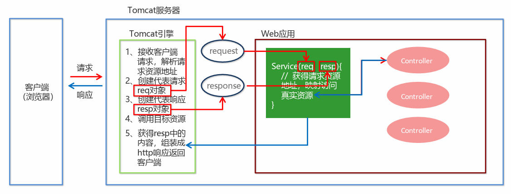
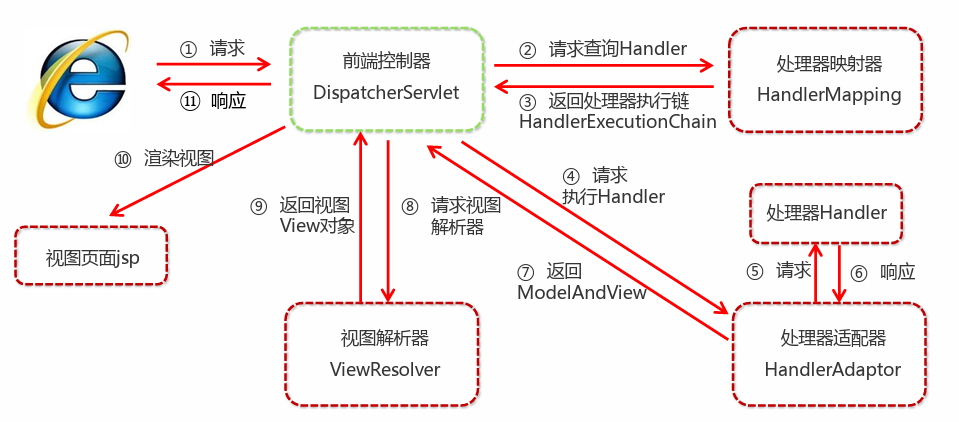
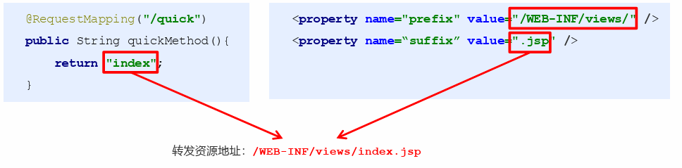
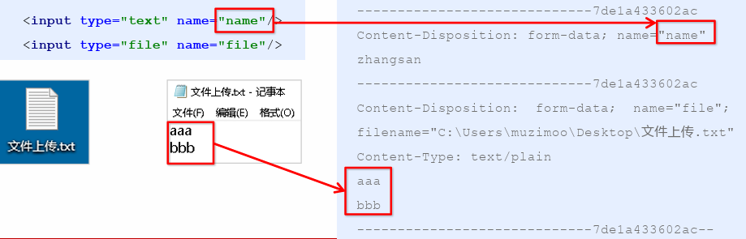
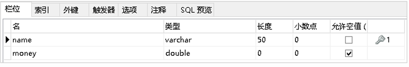
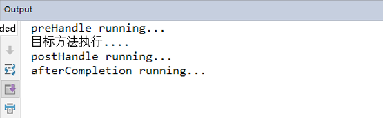
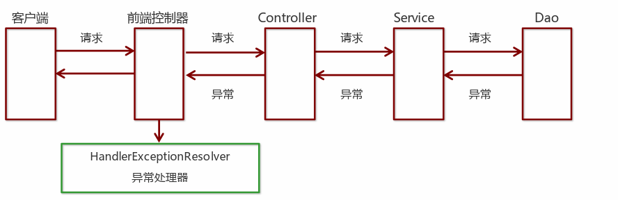
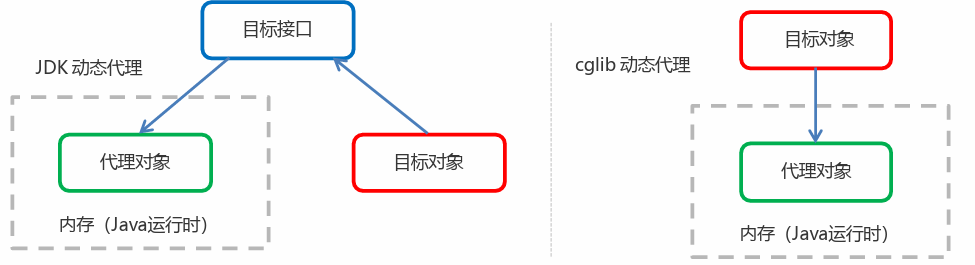

# Spring简介
Spring是分层的 Java SE/EE应用full-stack 轻量级开源框架，以 IoC（Inverse Of Control：反转控制）和AOP（Aspect Oriented Programming：面向切面编程）为内核。

提供了展现层SpringMVC 和持久层 Spring JDBCTemplate以及业务层事务管理等众多的企业级应用技术，还能整合开源世界众多著名的第三方框架和类库，逐渐成为使用最多的Java EE 企业应用开源框架。

## Spring的优势
1. **方便解耦，简化开发**
通过Spring 提供的IoC容器，可以将对象间的依赖关系交由Spring 进行控制，避免硬编码所造成的过度耦合。用户也不必再为单例模式类、属性文件解析等这些很底层的需求编写代码，可以更专注于上层的应用。

2. **AOP 编程的支持**
通过Spring的AOP 功能，方便进行面向切面编程，许多不容易用传统OOP 实现的功能可以通过AOP 轻松实现。
3. **声明式事务的支持**
可以将我们从单调烦闷的事务管理代码中解脱出来，通过声明式方式灵活的进行事务管理，提高开发效率和质量。
4. **方便程序的测试**
可以用非容器依赖的编程方式进行几乎所有的测试工作，测试不再是昂贵的操作，而是随手可做的事情。
5. **方便集成各种优秀框架**
Spring对各种优秀框架（Struts、Hibernate、Hessian、Quartz等）的支持。
6. **降低JavaEEAPI 的使用难度**
Spring对 JavaEE API（如JDBC、JavaMail、远程调用等）进行了薄薄的封装层，使这些API 的使用难度大为降低。
7. **Java 源码是经典学习范例**
Spring的源代码设计精妙、结构清晰、匠心独用，处处体现着大师对Java 设计模式灵活运用以及对Java技术的高深造诣。它的源代码无意是Java 技术的最佳实践的范例。

## Spring的体系结构


# Spring快速入门
## Spring程序开发步骤
1. 导入Spring开发的基本包坐标
2. 编写Dao接口和实现类
3. 创建Spring核心配置文件
4. 在Spring配置文件中配置UserDaoImpl
5. 使用Spring的API获得Bean实例

##  导入Spring开发的基本包坐标
```xml
<properties>
 <spring.version>5.2.8.RELEASE</spring.version>
 </properties>
 <dependencies>
 <!--导入spring的context坐标，context依赖core、beans、expression-->
 <dependency>
 <groupId>org.springframework</groupId>
 <artifactId>spring-context</artifactId>
 <version>${spring.version}</version>
 </dependency>
 </dependencies>
```
## 编写Dao接口和实现
```java
public interface UserDao {
 public void save();
 }
 public class UserDaoImpl implements UserDao {
 @Override
 public void save() {
 System.out.println("UserDao save method running....");
 }
 }
```
## 创建Spring核心配置文件
```xml
<?xml version="1.0" encoding="UTF-8" ?>
 <beans xmlns="http://www.springframework.org/schema/beans"
 xmlns:xsi="http://www.w3.org/2001/XMLSchema-instance"
  xsi:schemaLocation="
    http://www.springframework.org/schema/beans 
    http://www.springframework.org/schema/beans/spring-beans.xsd">
     </beans>
```
## 在Spring配置文件中配置UserDaoImpl
```xml
 <?xml version="1.0" encoding="UTF-8" ?>
 <beans xmlns="http://www.springframework.org/schema/beans"
 xmlns:xsi="http://www.w3.org/2001/XMLSchema-instance"
 xsi:schemaLocation="
 http://www.springframework.org/schema/beans
 http://www.springframework.org/schema/beans/spring-beans.xsd">
 <bean id="userDao" class="com.onenewcode.dao.impl.UserDaoImpl"></bean>
 </beans>
```
## 使用Spring的API获得Bean实例
```java
@Test
 public void test1(){
 ApplicationContext applicationContext = new   ClassPathXmlApplicationContext("applicationContext.xml");
 UserDao userDao = (UserDao) applicationContext.getBean("userDao");

userDao.save();
 }
```

# Spring配置文件
## Bean标签基本配置
用于配置对象交由Spring 来创建。
默认情况下它调用的是类中的无参构造函数，如果没有无参构造函数则不能创建成功。
**基本属性**：
 id：Bean实例在Spring容器中的唯一标识
 class：Bean的全限定名称
## Bean标签范围配置
scope：指对象的作用范围，取值如下：
|取值范围|说明|
|-------|-------|
|singleton| 默认值，单例的|
|prototype |多例的|
|request| WEB 项目中，Spring 创建一个Bean 的对象，将对象存入到request 域中|
|session |WEB 项目中，Spring 创建一个Bean 的对象，将对象存入到session 域中|
|global session|WEB 项目中，应用在Portlet环境，如果没有Portlet环境那么globalSession相当于session|
1. **当scope的取值为singleton时**
- Bean的实例化个数：1个
- Bean的实例化时机：当Spring核心文件被加载时，实例化配置的Bean实例
- Bean的生命周期：
    -  对象创建：当应用加载，创建容器时，对象就被创建了
    - 对象运行：只要容器在，对象一直活着
    - 对象销毁：当应用卸载，销毁容器时，对象就被销毁了
2. **当scope的取值为prototype时**
- Bean的实例化个数：多个
- Bean的实例化时机：当调用getBean()方法时实例化Bean
    - 对象创建：当使用对象时，创建新的对象实例
    - 对象运行：只要对象在使用中，就一直活着
    - 对象销毁：当对象长时间不用时，被Java 的垃圾回收器回收了
## Bean生命周期配
- init-method：指定类中的初始化方法名称
- destroy-method：指定类中销毁方法名称
##  Bean实例化三种方式
 无参构造方法实例化
 工厂静态方法实例化
 工厂实例方法实例化
### 使用无参构造方法实例化
它会根据默认无参构造方法来创建类对象，如果bean中没有默认无参构造函数，将会创建失败
```xml
<bean id="userDao" class="com.onenewcode.dao.impl.UserDaoImpl"/>
```

### 工厂静态方法实例化
工厂的静态方法返回Bean实例
```java
public class StaticFactoryBean {
 public static UserDao createUserDao(){
 return new UserDaoImpl();
 }
 }
```
```xml
 <bean id="userDao" class="com.onenewcode.factory.StaticFactoryBean" 
factory-method="createUserDao" />
```

### 工厂实例方法实例化
工厂的非静态方法返回Bean实例
```java
 public class DynamicFactoryBean {
 public UserDao createUserDao(){
 return new UserDaoImpl();
 }
 }
```
```xml
<bean id="factoryBean" class="com.onenewcode.factory.DynamicFactoryBean"/>
 <bean id="userDao" factory-bean="factoryBean" factory-method="createUserDao"/>
```
## Bean的依赖注入
①创建UserService，UserService 内部在调用UserDao的save() 方法
```java
public class UserServiceImpl implements UserService {
 @Override
 public void save() {
 ApplicationContext applicationContext = new 
ClassPathXmlApplicationContext("applicationContext.xml");
 UserDao userDao = (UserDao) applicationContext.getBean("userDao");
 userDao.save();
 }
 }

```
② 将UserServiceImpl 的创建权交给Spring
```xml
 <bean id="userService" class="com.onenewcode.service.impl.UserServiceImpl"/>
```
 ③ 从Spring 容器中获得UserService 进行操作
 ```java
 ApplicationContext applicationContext = new 
ClassPathXmlApplicationContext("applicationContext.xml");
 UserService userService = (UserService) applicationContext.getBean("userService");
 userService.save();
 ```

 ##  Bean的依赖注入分析
目前UserService实例和UserDao实例都存在与Spring容器中，当前的做法是在容器外部获得UserService实例和UserDao实例，然后在程序中进行结合。


依赖注入（Dependency Injection）：它是 Spring 框架核心 IOC 的具体实现。

在编写程序时，通过控制反转，把对象的创建交给了Spring，但是代码中不可能出现没有依赖的情况。

IOC 解耦只是降低他们的依赖关系，但不会消除。例如：业务层仍会调用持久层的方法。
那这种业务层和持久层的依赖关系，在使用Spring 之后，就让Spring 来维护了。
简单的说，就是坐等框架把持久层对象传入业务层，而不用我们自己去获取。


**怎么将UserDao怎样注入到UserService内部呢？**
 构造方法
 set方法

1）**set方法注入**
在UserServiceImpl中添加setUserDao方法
```java
public class UserServiceImpl implements UserService {
 private UserDao userDao;
 public void setUserDao(UserDao userDao) {
 this.userDao= userDao;
 }
 @Override
 public void save() {
 userDao.save();
 }
 }

```
配置Spring容器调用set方法进行注入
```xml
<bean id="userDao" class="com.onenewcode.dao.impl.UserDaoImpl"/>
 <bean id="userService" class="com.onenewcode.service.impl.UserServiceImpl">
 <property name="userDao" ref="userDao"/>
 </bean>
```


P命名空间注入本质也是set方法注入，但比起上述的set方法注入更加方便，主要体现在配置文件中，如下：
首先，需要引入P命名空间：
```xml
xmlns:p="http://www.springframework.org/schema/p"
```

其次，需要修改注入方式
```xml
<bean id="userService" class="com.onenewcode.service.impl.UserServiceImpl" p:userDao
ref="userDao"/>
```
2）**构造方法注入**
配置Spring容器调用有参构造时进行注入
```xml
<bean id="userDao" class="com.onenewcode.dao.impl.UserDaoImpl"/>
 <bean id="userService" class="com.onenewcode.service.impl.UserServiceImpl">
 <constructor-arg name="userDao" ref="userDao"></constructor-arg>
 </bean>

```
## Bean的依赖注入的数据类型

上面的操作，都是注入的引用Bean，处了对象的引用可以注入，普通数据类型，集合等都可以在容器中进行注入。
注入数据的三种数据类型
<span style="color:red">
 普通数据类型
 引用数据类型
 集合数据类型
</span>

其中引用数据类型，此处就不再赘述了，之前的操作都是对UserDao对象的引用进行注入的，下面将以set方法注入为例，演示普通数据类型和集合数据类型的注入

1）**普通数据类型的注入**
```java
public class UserDaoImpl implements UserDao {
 private String company;
 private int age;
 public void setCompany(String company) {
 this.company = company;
 }
 public void setAge(int age) {
 this.age = age;
 }
 public void save() {
 System.out.println(company+"==="+age);
 System.out.println("UserDao save method running....");
 }
 }
```

xml
```xml
<bean id="userDao" class="com.onenewcode.dao.impl.UserDaoImpl">
 <property name="company" value="传智播客"></property>
 <property name="age" value="15"></property>
 </bean>

```
2）**集合数据类型（List&lt;String>）的注入**
```java
public class UserDaoImpl implements UserDao {
 private List<String> strList;
 public void setStrList(List<String> strList) {
 this.strList = strList;
 }
 public void save() {
 System.out.println(strList);
 System.out.println("UserDao save method running....");
 }
 }
```
xml
```xml
<bean id="userDao" class="com.onenewcode.dao.impl.UserDaoImpl">
 <property name="strList">
 <list>
 <value>aaa</value>
 <value>bbb</value>
 <value>ccc</value>
 </list>
 </property>
 </bean>
```
3）**集合数据类型（List&lt;User>）的注入**
```java
public class UserDaoImpl implements UserDao {
 private List<User> userList;
 public void setUserList(List<User> userList) {
 this.userList = userList;
 }
 public void save() {
 System.out.println(userList);
 System.out.println("UserDao save method running....");
 }
 }
```
xml
```xml
<bean id="u1" class="com.onenewcode.domain.User"/>
 <bean id="u2" class="com.onenewcode.domain.User"/>
 <bean id="userDao" class="com.onenewcode.dao.impl.UserDaoImpl">
 <property name="userList">
 <list>
 <bean class="com.onenewcode.domain.User"/>
 <bean class="com.onenewcode.domain.User"/>
 <ref bean="u1"/>
 <ref bean="u2"/>
 </list>
 </property>
 </bean>
```

4）**集合数据类型（Map&lt;String,User>）的注入**
```java
public class UserDaoImpl implements UserDao {
 private Map<String,User> userMap;
 public void setUserMap(Map<String, User> userMap) {
 this.userMap = userMap;
 }
 public void save() {
 System.out.println(userMap);
 System.out.println("UserDao save method running....");
 }
 }
```
xml
```xml
<bean id="u1" class="com.onenewcode.domain.User"/>
 <bean id="u2" class="com.onenewcode.domain.User"/>
 <bean id="userDao" class="com.onenewcode.dao.impl.UserDaoImpl">
 <property name="userMap">
 <map>
 <entry key="user1" value-ref="u1"/>
 <entry key="user2" value-ref="u2"/>
 </map>
 </property>
 </bean>
```
5）**集合数据类型（Properties）的注入**
```java
public class UserDaoImpl implements UserDao {
 private Properties properties;
 public void setProperties(Properties properties) {
 this.properties = properties;
 }
 public void save() {
 System.out.println(properties);
 System.out.println("UserDao save method running....");
 }
 }
```
xml
```xml
<bean id="userDao" class="com.onenewcode.dao.impl.UserDaoImpl">
 <property name="properties">
 <props>
 <prop key="p1">aaa</prop>
 <prop key="p2">bbb</prop>
 <prop key="p3">ccc</prop>
 </props>
 </property>
 </bean>
```

##  引入其他配置文件
实际开发中，Spring的配置内容非常多，这就导致Spring配置很繁杂且体积很大，所以，可以将部分配置拆解到其他配置文件中，而在Spring主配置文件通过import标签进行加载
```xml
<bean>标签
id属性:在容器中Bean实例的唯一标识，不允许重复
class属性:要实例化的Bean的全限定名
scope属性:Bean的作用范围，常用是Singleton(默认)和prototype
 <property>标签：属性注入
name属性：属性名称
value属性：注入的普通属性值
ref属性：注入的对象引用值
<list>标签
<map>标签
<properties>标签
<constructor-arg>标签
<import>标签:导入其他的Spring的分文件

```
#  Spring相关API
## ApplicationContext的继承体系
<span style="color:red">applicationContext：</span>接口类型，代表应用上下文，可以通过其实例获得 Spring 容器中的Bean 对象


## ApplicationContext的实现类
1）**ClassPathXmlApplicationContext**
它是从类的根路径下加载配置文件推荐使用这种
2）**FileSystemXmlApplicationContext**
它是从磁盘路径上加载配置文件，配置文件可以在磁盘的任意位置。
3）**AnnotationConfigApplicationContext**
当使用注解配置容器对象时，需要使用此类来创建spring 容器。它用来读取注解。
## getBean()方法使用
```java
public Object getBean(String name) throws BeansException {
 assertBeanFactoryActive();
 return getBeanFactory().getBean(name);
 }
 public <T> T getBean(Class<T> requiredType) throws BeansException {
 assertBeanFactoryActive();
 return getBeanFactory().getBean(requiredType);
 }
```
其中，当参数的数据类型是字符串时，表示根据Bean的id从容器中获得Bean实例，返回是Object，需要强转。
当参数的数据类型是Class类型时，表示根据类型从容器中匹配Bean实例，当容器中相同类型的Bean有多个时，则此方法会报错。

```java
ApplicationContext applicationContext = new 
ClassPathXmlApplicationContext("applicationContext.xml");
 UserService userService1 = (UserService) 
applicationContext.getBean("userService");
 UserService userService2 = applicationContext.getBean(UserService.class);
```

# Spring配置数据源
##  数据源（连接池）的作用
• 数据源(连接池)是提高程序性能如出现的
• 事先实例化数据源，初始化部分连接资源
• 使用连接资源时从数据源中获取
• 使用完毕后将连接资源归还给数据源

常见的数据源(连接池)：DBCP、C3P0、BoneCP、Druid

**数据源的开发步骤**
① 导入数据源的坐标和数据库驱动坐标
② 创建数据源对象
③ 设置数据源的基本连接数据
④ 使用数据源获取连接资源和归还连接资源

##  数据源的手动创建
①导入druid的坐标
```xml
<!--数据源-->
    <dependency>
      <groupId>com.alibaba</groupId>
      <artifactId>druid</artifactId>
      <version>1.2.16</version>
    </dependency>

```
① 导入mysql数据库驱动坐标
```xml
  <!-- 数据库驱动相关依赖-->
    <dependency>
      <groupId>mysql</groupId>
      <artifactId>mysql-connector-java</artifactId>
      <version>8.0.33</version>
    </dependency>
```
② 创建Druid连接池
```java
@Test
 public void testDruid() throws Exception {
 //创建数据源
DruidDataSource dataSource = new DruidDataSource();
 //设置数据库连接参数
dataSource.setDriverClassName("com.mysql.jdbc.Driver");
 dataSource.setUrl("jdbc:mysql://localhost:3306/test");
 dataSource.setUsername("root");
 dataSource.setPassword("root");
 //获得连接对象
Connection connection = dataSource.getConnection();
 System.out.println(connection);
 }
```
③ 提取jdbc.properties配置文件
```properties
jdbc.driver=com.mysql.jdbc.Driver
jdbc.url=jdbc:mysql://localhost:3306/test
jdbc.username=root
jdbc.password=root
```
 ④读取jdbc.properties配置文件创建连接池
```java
@Test
 public void testC3P0ByProperties() throws Exception {
 //加载类路径下的jdbc.properties
 ResourceBundle rb = ResourceBundle.getBundle("jdbc");
 ComboPooledDataSource dataSource = new ComboPooledDataSource();
 dataSource.setDriverClass(rb.getString("jdbc.driver"));
 dataSource.setJdbcUrl(rb.getString("jdbc.url"));
 dataSource.setUser(rb.getString("jdbc.username"));
 dataSource.setPassword(rb.getString("jdbc.password"));
 Connection connection = dataSource.getConnection();
 System.out.println(connection);
 }
```

可以将DataSource的创建权交由Spring容器去完成
 DataSource有无参构造方法，而Spring默认就是通过无参构造方法实例化对象的
 DataSource要想使用需要通过set方法设置数据库连接信息，而Spring可以通过set方法进行字符串注入
```xml
<bean id="dataSource" class="com.mchange.v2.c3p0.ComboPooledDataSource">
 <property name="driverClass" value="com.mysql.jdbc.Driver"/>
 <property name="jdbcUrl" value="jdbc:mysql://localhost:3306/test"/>
 <property name="user" value="root"/>
  <property name="password" value="root"/>

 </bean>
```

**测试从容器当中获取数据源**
```java
ApplicationContext applicationContext = new 
ClassPathXmlApplicationContext("applicationContext.xml");
 DataSource dataSource = (DataSource) 
applicationContext.getBean("dataSource");
 Connection connection = dataSource.getConnection();
 System.out.println(connection);
```
## 抽取jdbc配置文件
applicationContext.xml加载jdbc.properties配置文件获得连接信息。
首先，需要引入context命名空间和约束路径：
 命名空间：xmlns:context="http://www.springframework.org/schema/context"
 约束路径：http://www.springframework.org/schema/context
 http://www.springframework.org/schema/context/spring-context.xsd
 ```xml
  <context:property-placeholder location="classpath:jdbc.properties"/>
 <bean id="dataSource" class="com.mchange.v2.c3p0.ComboPooledDataSource">
 <property name="driverClass" value="${jdbc.driver}"/>
 <property name="jdbcUrl" value="${jdbc.url}"/>
 <property name="user" value="${jdbc.username}"/>
 <property name="password" value="${jdbc.password}"/>
 </bean>
 ```

## Spring注解
Spring是轻代码而重配置的框架，配置比较繁重，影响开发效率，所以注解开发是一种趋势，注解代替xml配置文件可以简化配置，提高开发效率

- 使用@Compont或@Repository标识UserDaoImpl需要Spring进行实例化
```java
//@Component("userDao")
 @Repository("userDao")
 public class UserDaoImpl implements UserDao {
 @Override
 public void save() {
 System.out.println("save running... ...");
 }
 }
```

- 使用@Compont或@Service标识UserServiceImpl需要Spring进行实例化
- 使用@Autowired或者@Autowired+@Qulifier或者@Resource进行userDao的注入

```java
//@Component("userService")
 @Service("userService")
 public class UserServiceImpl implements UserService {
 /*@Autowired
 @Qualifier("userDao")*/
 @Resource(name="userDao")
 private UserDao userDao;
 @Override
 public void save() {
 userDao.save();
 }
 }
```
- 使用@Value进行字符串的注入
```java
@Repository("userDao")
 public class UserDaoImpl implements UserDao {
 @Value("注入普通数据")
 private String str;
 @Value("${jdbc.driver}")
 private String driver;
 @Override
 public void save() {
 System.out.println(str);
 System.out.println(driver);
 System.out.println("save running... ...");
 }
 }
```
- 使用@Scope标注Bean的范围
```java
//@Scope("prototype")
 @Scope("singleton")
 public class UserDaoImpl implements UserDao {
 //此处省略代码
}
```

- 使用@PostConstruct标注初始化方法，使用@PreDestroy标注销毁方法
```java
@PostConstruct
 public void init(){
 System.out.println("初始化方法....");
 }
 @PreDestroy
 public void destroy(){
 System.out.println("销毁方法.....");
 }
```
##  Spring注解
使用上面的注解还不能全部替代xml配置文件，还需要使用注解替代的配置如下：
 非自定义的Bean的配置：&lt;bean>
 加载properties文件的配置：&lt;context:property-placeholder>
 组件扫描的配置：&lt;context:component-scan>
 引入其他文件：&lt;import>
|注解|说明|
|---------|-------|
|@Configuration|用于指定当前类是一个Spring 配置类，当创建容器时会从该类上加载注解|
|@ComponentScan|用于指定Spring 在初始化容器时要扫描的包。作用和在Spring 的xml 配置文件中的 &lt;context:component-scan base-package="com.onenewcode"/>一样|
|@Bean|使用在方法上，标注将该方法的返回值存储到Spring 容器中|
|@PropertySource|用于加载.properties 文件中的配置|
|@Import|用于导入其他配置类|

- @Configuration
- @ComponentScan
- @Import
```java
 @Configuration
 @ComponentScan("com.onenewcode")
 @Import({DataSourceConfiguration.class})
 public class SpringConfiguration {
 }

```


- @PropertySource
- @value
```java
@PropertySource("classpath:jdbc.properties")
 public class DataSourceConfiguration {
 @Value("${jdbc.driver}")
 private String driver;
 @Value("${jdbc.url}")
 private String url;
 @Value("${jdbc.username}")
 private String username;
 @Value("${jdbc.password}")
 private String password;
 }
```

- @Bean
```java
@Bean(name="dataSource")
 public DataSource getDataSource() throws PropertyVetoException {
 ComboPooledDataSource dataSource = new ComboPooledDataSource();
 dataSource.setDriverClass(driver);
 dataSource.setJdbcUrl(url);
 dataSource.setUser(username);
 dataSource.setPassword(password);
 return dataSource;
 }
```

**测试加载核心配置类创建Spring容器**

```java

@Test
 public void testAnnoConfiguration() throws Exception {
 ApplicationContext applicationContext = new 
AnnotationConfigApplicationContext(SpringConfiguration.class);
 UserService userService = (UserService) 
applicationContext.getBean("userService");
 userService.save();
 DataSource dataSource = (DataSource) 
applicationContext.getBean("dataSource");
 Connection connection = dataSource.getConnection();
 System.out.println(connection);
 }
```

# Spring整合Junit
## 原始Junit测试Spring的问题
在测试类中，每个测试方法都有以下两行代码：
```java
ApplicationContext ac = new ClassPathXmlApplicationContext("bean.xml");
 IAccountService as = ac.getBean("accountService",IAccountService.class);
```
这两行代码的作用是获取容器，如果不写的话，直接会提示空指针异常。所以又不能轻易删掉。

**上述问题解决思路**
• 让SpringJunit负责创建Spring容器，但是需要将配置文件的名称告诉它
• 将需要进行测试Bean直接在测试类中进行注
## Spring集成Junit步骤
① 导入spring集成Junit的坐标
② 使用@Runwith注解替换原来的运行期
③ 使用@ContextConfiguration指定配置文件或配置类
④ 使用@Autowired注入需要测试的对象
⑤ 创建测试方法进行测试
```xml
<dependency>
      <groupId>junit</groupId>
      <artifactId>junit</artifactId>
      <version>4.13.2</version>
      <scope>test</scope>
    </dependency>
    <dependency>
      <groupId>org.springframework</groupId>
      <artifactId>spring-test</artifactId>
      <version>5.2.8.RELEASE</version>
    </dependency>
```
② 使用@Runwith注解替换原来的运行期
```java
@RunWith(SpringJUnit4ClassRunner.class)
 public class SpringJunitTest {
 }

```
③ 使用@ContextConfiguration指定配置文件或配置类
```java
@RunWith(SpringJUnit4ClassRunner.class)
 //加载spring核心配置文件
//@ContextConfiguration(value = {"classpath:applicationContext.xml"})
 //加载spring核心配置类
@ContextConfiguration(classes = {SpringConfiguration.class})
 public class SpringJunitTest {
 }
```
④ 使用@Autowired注入需要测试的对象
```java
@RunWith(SpringJUnit4ClassRunner.class)
 @ContextConfiguration(classes = {SpringConfiguration.class})
 public class SpringJunitTest {
 @Autowired
 private UserService userService;
 }
```
⑤创建测试方法进行测试
 ```java
 @RunWith(SpringJUnit4ClassRunner.class)
 @ContextConfiguration(classes = {SpringConfiguration.class})
 public class SpringJunitTest {
 @Autowired
 private UserService userService;
 @Test
 public void testUserService(){
 userService.save();
 }
 }
 ```
 # Spring与Web环境集成
## ApplicationContext应用上下文获取方式
应用上下文对象是通过new ClasspathXmlApplicationContext(spring配置文件) 方式获取的，但是每次从容器中获得Bean时都要编写new ClasspathXmlApplicationContext(spring配置文件) ，这样的弊端是配置文件加载多次，应用上下文对象创建多次。

在Web项目中，可以使用ServletContextListener监听Web应用的启动，我们可以在Web应用启动时，就加载Spring的配置文件，创建应用上下文对象ApplicationContext，在将其存储到最大的域servletContext域中，这样就可以在任意位置从域中获得应用上下文ApplicationContext对象了

Spring提供了一个监听器ContextLoaderListener就是对上述功能的封装，该监听器内部加载Spring配置文件，创建应用上下文对象，并存储到ServletContext域中，提供了一个客户端工具WebApplicationContextUtils供使用者获得应用上下文对象。
所以我们需要做的只有两件事：

① 在web.xml中配置ContextLoaderListener监听器（导入spring-web坐标）
② 使用WebApplicationContextUtils获得应用上下文对象ApplicationContext
##  导入Spring集成web的坐标
```xml
  <!--Spring MVC的相关依赖-->
    <dependency>
      <groupId>org.springframework</groupId>
      <artifactId>spring-web</artifactId>
      <version>5.2.8.RELEASE</version>
    </dependency>
```
## 置ContextLoaderListener监听器
```xml
<!--全局参数-->
 <context-param>
 <param-name>contextConfigLocation</param-name>
 <param-value>classpath:applicationContext.xml</param-value>
 </context-param>
 <!--Spring的监听器-->
 <listener>
 <listener-class>
 org.springframework.web.context.ContextLoaderListener
 </listener-class>
 </listener>
```
##  通过工具获得应用上下文对象
```java
ApplicationContext applicationContext = WebApplicationContextUtils.getWebApplicationContext(servletContext);
 Object obj = applicationContext.getBean("id");
```
## SpringMVC概述
SpringMVC 是一种基于Java 的实现MVC 设计模型的请求驱动类型的轻量级Web 框架，属于
SpringFrameWork 的后续产品，已经融合在Spring Web Flow 中。
SpringMVC 已经成为目前最主流的MVC框架之一，并且随着Spring3.0 的发布，全面超越Struts2，成为最优秀的MVC 框架。它通过一套注解，让一个简单的Java 类成为处理请求的控制器，而无须实现任何接口。同时它还支持RESTful编程风格的请求。

## SpringMVC快速入门
需求：客户端发起请求，服务器端接收请求，执行逻辑并进行视图跳转。
开发步骤：
① 导入SpringMVC相关坐标
② 配置SpringMVC核心控制器DispathcerServlet
③ 创建Controller类和视图页面
④ 使用注解配置Controller类中业务方法的映射地址
⑤ 配置SpringMVC核心文件spring-mvc.xml
⑥ 客户端发起请求测试

**SpringMVC流程图示**

- **导入Spring和SpringMVC的坐标**
```yaml
<!--Spring坐标-->
 <dependency>
 <groupId>org.springframework</groupId>
 <artifactId>spring-context</artifactId>
 <version>5.2.8.RELEASE</version>
 </dependency>
 <!--SpringMVC坐标-->
 <dependency>
 <groupId>org.springframework</groupId>
 <artifactId>spring-webmvc</artifactId>
 <version>5.2.8.RELEASE</version>
 </dependency>
```
- **导入Servlet和Jsp的坐标**
```xml
  <!--ServletAPI：引入servlet的功能-->
    <dependency>
      <groupId>javax.servlet</groupId>
      <artifactId>javax.servlet-api</artifactId>
      <version>3.1.0</version>
      <scope>provided</scope>
    </dependency>
 <!--Jsp坐标-->
 <dependency>
    <!--ServletAPI: jsp页面的功能包 -->
    <dependency>
      <groupId>javax.servlet.jsp</groupId>
      <artifactId>jsp-api</artifactId>
      <version>2.2</version>
      <scope>provided</scope>
    </dependency>
```
- **在web.xml配置SpringMVC的核心控制器**
```xml
<servlet>
 <servlet-name>DispatcherServlet</servlet-name>
 <servlet-class>org.springframework.web.servlet.DispatcherServlet</servlet-class>
 <init-param>
 <param-name>contextConfigLocation</param-name>
 <param-value>classpath:spring-mvc.xml</param-value>
 </init-param>
 <load-on-startup>1</load-on-startup>
 </servlet>
 <servlet-mapping>
 <servlet-name>DispatcherServlet</servlet-name>
 <url-pattern>/</url-pattern>
 </servlet-mapping>
```
-  **创建Controller和业务方法**
```java
public class QuickController {
 public String quickMethod(){
 System.out.println("quickMethod running.....");
 return "index";
 }
 }
```
- **创建视图页面index.jsp**
```html
<html>
 <body>
 <h2>Hello SpringMVC!</h2>
 </body>
 </html>
```
- **配置注解**
```java
@Controller
 public class QuickController {
 @RequestMapping("/quick")
 public String quickMethod(){
 System.out.println("quickMethod running.....");
 return "index";
 }
 }
```
- **创建spring-mvc.xml**
```java
 <beans xmlns="http://www.springframework.org/schema/beans"
 xmlns:mvc="http://www.springframework.org/schema/mvc"
 xmlns:context="http://www.springframework.org/schema/context"
 xmlns:xsi="http://www.w3.org/2001/XMLSchema-instance"
 xsi:schemaLocation="http://www.springframework.org/schema/beans
 http://www.springframework.org/schema/beans/spring-beans.xsd
 http://www.springframework.org/schema/mvc
 http://www.springframework.org/schema/mvc/spring-mvc.xsd
 http://www.springframework.org/schema/context
 http://www.springframework.org/schema/context/spring-context.xsd">
 <!--配置注解扫描-->
 <context:component-scan base-package="com.onenewcode"/>
 </beans>
```
- **访问测试地址**
```url
http://localhost:8080/onenewcode_springmvc1/quick 
```

**页面显示**


# SpringMVC 组件解析
## SpringMVC的执行流程


##  SpringMVC的执行流程
① 用户发送请求至前端控制器DispatcherServlet。
② DispatcherServlet收到请求调用HandlerMapping处理器映射器。
③ 处理器映射器找到具体的处理器(可以根据xml配置、注解进行查找)，生成处理器对象及处理器拦截器(如果有则生成)一并返回给DispatcherServlet。
④ DispatcherServlet调用HandlerAdapter处理器适配器。
⑤ HandlerAdapter经过适配调用具体的处理器(Controller，也叫后端控制器)。
⑥ Controller执行完成返回ModelAndView。
⑦ HandlerAdapter将controller执行结果ModelAndView返回给DispatcherServlet。
⑧ DispatcherServlet将ModelAndView传给ViewReslover视图解析器。
⑨ ViewReslover解析后返回具体View。
⑩ DispatcherServlet根据View进行渲染视图（即将模型数据填充至视图中）。DispatcherServlet响应用户。

## SpringMVC组件解析
1. **前端控制器：DispatcherServlet**
用户请求到达前端控制器，它就相当于MVC 模式中的C，DispatcherServlet是整个流程控制的中心，由
它调用其它组件处理用户的请求，DispatcherServlet的存在降低了组件之间的耦合性。
2. **处理器映射器：HandlerMapping**
 HandlerMapping负责根据用户请求找到Handler 即处理器，SpringMVC提供了不同的映射器实现不同的映射方式，例如：配置文件方式，实现接口方式，注解方式等。
3. **处理器适配器：HandlerAdapter**
通过HandlerAdapter对处理器进行执行，这是适配器模式的应用，通过扩展适配器可以对更多类型的处理器进行执行。
4. **处理器：Handler**
它就是我们开发中要编写的具体业务控制器。由DispatcherServlet把用户请求转发到Handler。由
Handler 对具体的用户请求进行处理。
5. **视图解析器：View Resolver**
 View Resolver 负责将处理结果生成View 视图，View Resolver 首先根据逻辑视图名解析成物理视图名，即具体的页面地址，再生成View 视图对象，最后对View 进行渲染将处理结果通过页面展示给用户。
6. **视图：View**
 SpringMVC 框架提供了很多的View 视图类型的支持，包括：jstlView、freemarkerView、pdfView等。最常用的视图就是jsp。一般情况下需要通过页面标签或页面模版技术将模型数据通过页面展示给用户，需要由程序员根据业务需求开发具体的页面
## SpringMVC注解解析
**@RequestMapping**
作用：用于建立请求URL 和处理请求方法之间的对应关系
位置：
 类上，请求URL 的第一级访问目录。此处不写的话，就相当于应用的根目录
 方法上，请求URL 的第二级访问目录，与类上的使用@ReqquestMapping标注的一级目录一起组成访问虚拟路径
属性：
 value：用于指定请求的URL。它和path属性的作用是一样的
 method：用于指定请求的方式
 params：用于指定限制请求参数的条件。它支持简单的表达式。要求请求参数的key和value必须和配置的一模一样
例如：
 params= {"accountName"}，表示请求参数必须有accountName
 params= {"moeny!100"}，表示请求参数中money不能是100

**mvc命名空间引入**
命名空间：xmlns:context="http://www.springframework.org/schema/context"
  xmlns:mvc="http://www.springframework.org/schema/mvc"
约束地址：http://www.springframework.org/schema/context
 http://www.springframework.org/schema/context/spring-context.xsd
 http://www.springframework.org/schema/mvc 
http://www.springframework.org/schema/mvc/spring-mvc.xs

**组件扫描**
SpringMVC基于Spring容器，所以在进行SpringMVC操作时，需要将Controller存储到Spring容器中，如果使用@Controller注解标注的话，就需要使用&lt;context:component-scan base
package=“com.onenewcode.controller"/>进行组件扫描。

**视图解析器**
SpringMVC有默认组件配置，默认组件都是DispatcherServlet.properties配置文件中配置的，该配置文件地址org/springframework/web/servlet/DispatcherServlet.properties，该文件中配置了默认的视图解析器，如下：
```xml
org.springframework.web.servlet.ViewResolver=org.springframework.web.servlet.view.InternalResourceViewResolver
```
翻看该解析器源码，可以看到该解析器的默认设置，如下：
```shell
REDIRECT_URL_PREFIX = "redirect:"  --重定向前缀
FORWARD_URL_PREFIX = "forward:"    
prefix = "";     
suffix = "";     --视图名称前缀--转发前缀（默认值）--视图名称后缀
```

 **视图解析器**
我们可以通过属性注入的方式修改视图的的前后缀
```xml
<!--配置内部资源视图解析器-->
 <bean class="org.springframework.web.servlet.view.InternalResourceViewResolver">
 <property name="prefix" value="/WEB-INF/views/"></property>
 <property name="suffix" value=".jsp"></property>
 </bean>
```


# SpringMVC的数据响应
## SpringMVC的数据响应方式
- 页面跳转
  - 直接返回字符串
  - 通过ModelAndView对象返回
- 回写数据
  - 直接返回字符串
  - 返回对象或集合

**返回字符串形式**
直接返回字符串：此种方式会将返回的字符串与视图解析器的前后缀拼接后跳转。


返回带有前缀的字符串：
转发：forward:/WEB-INF/views/index.jsp
重定向：redirect:/index.jsp


**返回ModelAndView对象**
```java
@RequestMapping("/quick2")
 public ModelAndView quickMethod2(){
 ModelAndView modelAndView = new ModelAndView();
 modelAndView.setViewName("redirect:index.jsp");
 return modelAndView;
 }
 @RequestMapping("/quick3")
 public ModelAndView quickMethod3(){
 ModelAndView modelAndView = new ModelAndView();
 modelAndView.setViewName("forward:/WEB-INF/views/index.jsp");
 return modelAndView;
 }
```

**向request域存储数据**
在进行转发时，往往要向request域中存储数据，在jsp页面中显示，那么Controller中怎样向request域中存储数据呢？

① 通过SpringMVC框架注入的request对象setAttribute()方法设置
```java
@RequestMapping("/quick")
 public String quickMethod(HttpServletRequest request){
 request.setAttribute("name","zhangsan");
 return "index";
 }
```
② 通过ModelAndView的addObject()方法设置
```java
@RequestMapping("/quick3")
 public ModelAndView quickMethod3(){
 ModelAndView modelAndView = new ModelAndView();
 modelAndView.setViewName("forward:/WEB-INF/views/index.jsp");
 modelAndView.addObject("name","lisi");
 return modelAndView;
 }
```
## 回写数据
1. **直接返回字符串**
Web基础阶段，客户端访问服务器端，如果想直接回写字符串作为响应体返回的话，只需要使用
response.getWriter().print(“hello world”) 即可，那么在Controller中想直接回写字符串该怎样呢？

① 通过SpringMVC框架注入的response对象，使用response.getWriter().print(“hello world”) 回写数
据，此时不需要视图跳转，业务方法返回值为void。
```java
@RequestMapping("/quick4")
 public void quickMethod4(HttpServletResponse response) throws 
IOException {
  response.getWriter().print("hello world");
 }
```

② 将需要回写的字符串直接返回，但此时需要通过@ResponseBody注解告知SpringMVC框架，方法
返回的字符串不是跳转是直接在http响应体中返回。
```java
@RequestMapping("/quick5")
 @ResponseBody
 public String quickMethod5() throws IOException {
 return "hello springMVC!!!";
 }
```
在异步项目中，客户端与服务器端往往要进行json格式字符串交互，此时我们可以手动拼接json字符串返回。
```java
@RequestMapping("/quick6")
 @ResponseBody
 public String quickMethod6() throws IOException {
  return "{\"name\":\"zhangsan\",\"age\":18}";
 }
```
上述方式手动拼接json格式字符串的方式很麻烦，开发中往往要将复杂的java对象转换成json格式的字符串，我们可以使用web阶段学习过的json转换工具jackson进行转换，导入jackson坐标。
```xml
 <dependency>
      <groupId>com.fasterxml.jackson.core</groupId>
      <artifactId>jackson-core</artifactId>
      <version>2.13.5</version>
    </dependency>
    <dependency>
 <groupId>com.fasterxml.jackson.core</groupId>
 <artifactId>jackson-databind</artifactId>
 <version>2.13.5</version>
 </dependency>
 <dependency>
 <groupId>com.fasterxml.jackson.core</groupId>
 <artifactId>jackson-annotations</artifactId>
 <version>2.13.5</version>
 </dependency>
```
通过jackson转换json格式字符串，回写字符串。

```java
@RequestMapping("/quick7")
 @ResponseBody
 public String quickMethod7() throws IOException {
 User user = new User();
 user.setUsername("zhangsan");
 user.setAge(18);
 ObjectMapper objectMapper = new ObjectMapper();
 String s = objectMapper.writeValueAsString(user);
 return s;
 }
```
2. **返回对象或集合**
通过SpringMVC帮助我们对对象或集合进行json字符串的转换并回写，为处理器适配器配置消息转换参数，指定使用jackson进行对象或集合的转换，因此需要在spring-mvc.xml中进行如下配置.
```xml
<bean class="org.springframework.web.servlet.mvc.method.annotation
 .RequestMappingHandlerAdapter">
 <property name="messageConverters">
 <list>
 <bean class="org.springframework.http.converter.json
 .MappingJackson2HttpMessageConverter">
 </bean>
 </list>
 </property>
 </bean>
```

```java
@RequestMapping("/quick8")
 @ResponseBody
 public User quickMethod8() throws IOException {
 User user = new User();
 user.setUsername("zhangsan");
 user.setAge(18);
 return user;
 }
```

在方法上添加@ResponseBody就可以返回json格式的字符串，但是这样配置比较麻烦，配置的代码比较多，因此，我们可以使用mvc的注解驱动代替上述配置。
在SpringMVC的各个组件中，处理器映射器、处理器适配器、视图解析器称为SpringMVC的三大组件。
使用&lt;mvc:annotation-driven>自动加载 RequestMappingHandlerMapping（处理映射器）和
RequestMappingHandlerAdapter（处 理 适 配 器 ），可用在Spring-xml.xml配置文件中使用
&lt;mvc:annotation-driven>替代注解处理器和适配器的配置。
同时使用&lt;mvc:annotation-driven>默认底层就会集成jackson进行对象或集合的json格式字符串的转换。
#  SpringMVC 获得请求数据
##  获得请求参数

客户端请求参数的格式是：name=value&name=value… …
服务器端要获得请求的参数，有时还需要进行数据的封装，SpringMVC可以接收如下类型的参数：
 基本类型参数
 POJO类型参数
 数组类型参数
 集合类型参数
## 获得基本类型参数
Controller中的业务方法的参数名称要与请求参数的name一致，参数值会自动映射匹配。
```url
http://localhost:8080/onenewcode_springmvc1/quick9?username=zhangsan&age=12
```
```java
 @RequestMapping("/quick9")
 @ResponseBody
 public void quickMethod9(String username,int age) throws IOException {
 System.out.println(username);
 System.out.println(age);
 }
```
##  获得POJO类型参数
Controller中的业务方法的POJO参数的属性名与请求参数的name一致，参数值会自动映射匹配。
```url
http://localhost:8080/onenewcode_springmvc1/quick9?username=zhangsan&age=1
```
```java
 public class User {
 private String username;
 private int age;
 getter/setter…
 }
 @RequestMapping("/quick10")
 @ResponseBody
 public void quickMethod10(User user) throws IOException {
 System.out.println(user);
 }
```
## 获得数组类型参数
Controller中的业务方法数组名称与请求参数的name一致，参数值会自动映射匹配。
```url
http://localhost:8080/onenewcode_springmvc1/quick11?strs=111&strs=222&strs=333
```
```java
 @RequestMapping("/quick11")
 @ResponseBody
 public void quickMethod11(String[] strs) throws IOException {
  System.out.println(Arrays.asList(strs));
 }

```
##  获得集合类型参数
获得集合参数时，要将集合参数包装到一个POJO中才可以。
```xml
<form action="${pageContext.request.contextPath}/quick12" method="post">
 <input type="text" name="userList[0].username"><br>
 <input type="text" name="userList[0].age"><br>
 <input type="text" name="userList[1].username"><br>
 <input type="text" name="userList[1].age"><br>
 <input type="submit" value="提交"><br>
 </form>
```
```java
 @RequestMapping("/quick12")
 @ResponseBody
 public void quickMethod12(Vo vo) throws IOException {
 System.out.println(vo.getUserList());
 }
```

当使用ajax提交时，可以指定contentType为json形式，那么在方法参数位置使用@RequestBody可以直接接收集合数据而无需使用POJO进行包装。
```html
<script>
 //模拟数据
var userList = new Array();
 userList.push({username: "zhangsan",age: "20"});
 userList.push({username: "lisi",age: "20"});
 $.ajax({
 type: "POST",
 url: "/onenewcode_springmvc1/quick13",
 data: JSON.stringify(userList),
 contentType : 'application/json;charset=utf-8'
 });
 </script>
```
当使用ajax提交时，可以指定contentType为json形式，那么在方法参数位置使用@RequestBody可以直接接收集合数据而无需使用POJO进行包装。
```java
@RequestMapping("/quick13")
 @ResponseBody
 public void quickMethod13(@RequestBody List<User> userList) throws 
IOException {
 System.out.println(userList);
 }
```

注意：通过谷歌开发者工具抓包发现，没有加载到jquery文件，原因是SpringMVC的前端控制器DispatcherServlet的url-pattern配置的是/,代表对所有的资源都进行过滤操作，我们可以通过以下两种
方式指定放行静态资源：
• 在spring-mvc.xml配置文件中指定放行的资源
&lt;mvc:resources mapping="/js/**" location="/js/"/> 
• 使用&lt;mvc:default-servlet-handler/>标签
##  请求数据乱码问题
当post请求时，数据会出现乱码，我们可以设置一个过滤器来进行编码的过滤。
```xml
<filter>
 <filter-name>CharacterEncodingFilter</filter-name>
 <filter-class>org.springframework.web.filter.CharacterEncodingFilter</filter-class>
 <init-param>
 <param-name>encoding</param-name>
 <param-value>UTF-8</param-value>
 </init-param>
 </filter>
 <filter-mapping>
 <filter-name>CharacterEncodingFilter</filter-name>
 <url-pattern>/*</url-pattern>
 </filter-mapping>
```
## 参数绑定注解@requestParam
当请求的参数名称与Controller的业务方法参数名称不一致时，就需要通过@RequestParam注解显示的绑定.
```xml
<form action="${pageContext.request.contextPath}/quick14" method="post">
 <input type="text" name="name"><br>
 <input type="submit" value="提交"><br>
 </form>
```
```java
 @RequestMapping("/quick14")
 @ResponseBody
 public void quickMethod14(@RequestParam("name") String username) throws 
IOException {
 System.out.println(username);
 }

```
注解@RequestParam还有如下参数可以使用：
 value：与请求参数名称
 required：此在指定的请求参数是否必须包括，默认是true，提交时如果没有此参数则报错
 defaultValue：当没有指定请求参数时，则使用指定的默认值赋值
## 获得Restful风格的参数
Restful是一种软件架构风格、设计风格，而不是标准，只是提供了一组设计原则和约束条件。主要用于客户端和服务器交互类的软件，基于这个风格设计的软件可以更简洁，更有层次，更易于实现缓存机制等。

Restful风格的请求是使用“url+请求方式”表示一次请求目的的，HTTP 协议里面四个表示操作方式的动词如下：
 GET：用于获取资源
 POST：用于新建资源
 PUT：用于更新资源
 DELETE：用于删除资源

例如：
 /user/1    GET ： 得到id = 1 的 user
 /user/1    DELETE： 删除 id = 1 的user
 /user/1    PUT： 更新id = 1 的user
 /user       POST： 新增user

## 获得Restful风格的参数
上述url地址/user/1中的1就是要获得的请求参数，在SpringMVC中可以使用占位符进行参数绑定。地址/user/1可以写成/user/{id}，占位符{id}对应的就是1的值。在业务方法中我们可以使用@PathVariable注解进行占位符的匹配获取工作。
```url
http://localhost:8080/onenewcode_springmvc1/quick19/zhangsan
```
```java
 @RequestMapping("/quick19/{name}")
 @ResponseBody
 public void quickMethod19(@PathVariable(value = "name",required = true) String name){
 System.out.println(name);
 }
```

##  自定义类型转换器
• SpringMVC默认已经提供了一些常用的类型转换器，例如客户端提交的字符串转换成int型进行参数设置。
• 但是不是所有的数据类型都提供了转换器，没有提供的就需要自定义转换器，例如：日期类型的数据就需要自定义转换器。

自定义类型转换器的开发步骤：
① 定义转换器类实现Converter接口
② 在配置文件中声明转换器
③ 在&lt;annotation-driven>中引用转换器


①**定义转换器类实现Converter接口**
```java
public class DateConverter implements Converter<String,Date>{
 @Override
 public Date convert(String source) {
 SimpleDateFormat format = new SimpleDateFormat("yyyy-MM-dd");
 try {
 Date date = format.parse(source);
 return date;
 } catch (ParseException e) {
 e.printStackTrace();
 }
 return null;
 }
 }
```

②**在配置文件中声明转换器**
```xml
<bean id="converterService"  
class="org.springframework.context.support.ConversionServiceFactoryBean">
 <property name="converters">
 <list>
 <bean class="com.onenewcode.converter.DateConverter"/>
 </list>
 </property>
 </bean>
```
 ③**在&lt;annotation-driven>中引用转换器**
 ```xml
 <mvc:annotation-driven conversion-service="converterService"/>
 ```


## 获得Servlet相关API
SpringMVC支持使用原始ServletAPI对象作为控制器方法的参数进行注入，常用的对象如下：
 HttpServletRequest
 HttpServletResponse
 HttpSession

 ```java
 
  @RequestMapping("/quick16")
 @ResponseBody
 public void quickMethod16(HttpServletRequest request,HttpServletResponse 
response,
 HttpSession session){
 System.out.println(request);
 System.out.println(response);
 System.out.println(session);
 }
 ```

## 获得请求头
### @RequestHeader
使用@RequestHeader可以获得请求头信息，相当于web阶段学习的request.getHeader(name)
@RequestHeader注解的属性如下：
 value：请求头的名称
 required：是否必须携带此请求头

```java
@RequestMapping("/quick17")
 @ResponseBody
 public void quickMethod17(@RequestHeader(value = "User-Agent",required = false) String headerValue){
  System.out.println(headerValue);
 }
```

### @CookieValue
使用@CookieValue可以获得指定Cookie的值
@CookieValue注解的属性如下：
 value：指定cookie的名称
 required：是否必须携带此cookie
```java
 @RequestMapping("/quick18")
 @ResponseBody
 public void quickMethod18( @CookieValue(value = "JSESSIONID",required = false) String jsessionid){

 System.out.println(jsessionid);
 }
```
## 文件上传
### 文件上传客户端三要素
 表单项type=“file”
  表单的提交方式是post
  表单的enctype属性是多部分表单形式，及enctype=“multipart/form-data”
```html
 <form action="${pageContext.request.contextPath}/quick20" method="post" 
enctype="multipart/form-data">
名称：<input type="text" name="name"><br>
文件：<input type="file" name="file"><br>
<input type="submit" value="提交"><br>
 </form>
```
### 文件上传原理
 当form表单修改为多部分表单时，request.getParameter()将失效。
 enctype=“application/x-www-form-urlencoded”时，form表单的正文内容格式是：key=value&key=value&key=value
 当form表单的enctype取值为Mutilpart/form-data时，请求正文内容就变成多部分形式：
 
##  单文件上传步骤
① 导入fileupload和io坐标
② 配置文件上传解析器
③ 编写文件上传代码


**①导入fileupload和io坐标**
```xml
    <dependency>
      <groupId>commons-fileupload</groupId>
      <artifactId>commons-fileupload</artifactId>
      <version>1.3.3</version>
    </dependency>
    <dependency>
      <groupId>commons-io</groupId>
      <artifactId>commons-io</artifactId>
      <version>2.11.0</version>
    </dependency>
```
**②配置文件上传解析器**
```xml
<bean id="multipartResolver" 
class="org.springframework.web.multipart.commons.CommonsMultipartResolver">
 <!--上传文件总大小-->
 <property name="maxUploadSize" value="5242800"/>
 <!--上传单个文件的大小-->
 <property name="maxUploadSizePerFile" value="5242800"/>
 <!--上传文件的编码类型-->
 <property name="defaultEncoding" value="UTF-8"/>
 </bean>
```
**③编写文件上传代码**
```java
@RequestMapping("/quick20")
 @ResponseBody
 public void quickMethod20(String name,MultipartFile uploadFile) throws 
IOException {
 //获得文件名称
String originalFilename = uploadFile.getOriginalFilename();
 //保存文件
uploadFile.transferTo(new File("C:\\upload\\"+originalFilename));
 }
```

多文件上传，只需要将页面修改为多个文件上传项，将方法参数MultipartFile类型修改为MultipartFile[]即可
```xml
<h1>多文件上传测试</h1>
 <form action="${pageContext.request.contextPath}/quick21" method="post" 
enctype="multipart/form-data">
名称：<input type="text" name="name"><br>
文件1：<input type="file" name="uploadFiles"><br>
文件2：<input type="file" name="uploadFiles"><br>
文件3：<input type="file" name="uploadFiles"><br>
 <input type="submit" value="提交"><br>
 </form>
```

```java
@RequestMapping("/quick21")
 @ResponseBody
 public void quickMethod21(String name,MultipartFile[] uploadFiles) throws 
IOException {
 for (MultipartFile uploadFile : uploadFiles){
 String originalFilename = uploadFile.getOriginalFilename();
 uploadFile.transferTo(new File("C:\\upload\\"+originalFilename));
 }
 }
```
# Spring JdbcTemplate
## JdbcTemplate概述
它是spring框架中提供的一个对象，是对原始繁琐的JdbcAPI对象的简单封装。spring框架为我们提供了很多的操作模板类。例如：操作关系型数据的JdbcTemplate和HibernateTemplate，操作nosql数据库的RedisTemplate，操作消息队列的JmsTemplate等等。
## JdbcTemplate开发步骤
① 导入spring-jdbc和spring-tx坐标
② 创建数据库表和实体
③ 创建JdbcTemplate对象
④ 执行数据库操作


① **导入spring-jdbc和spring-tx坐标**
```java
 <dependency>
 <groupId>org.springframework</groupId>
 <artifactId>spring-jdbc</artifactId>
 <version>5.2.8.RELEASE</version>
 </dependency>
 <!--导入spring的tx坐标-->
 <dependency>
 <groupId>org.springframework</groupId>
 <artifactId>spring-tx</artifactId>
 <version>5.2.8.RELEASE</version>
 </dependency>
```
②**创建accout表和Accout实体**

```java
public class Account {
 private String name;
 private double money;
 //省略get和set方法
}
```

③**创建JdbcTemplate对象**
④**执行数据库操作**
```java
//1、创建数据源对象
ComboPooledDataSource dataSource= new ComboPooledDataSource();
 dataSource.setDriverClass("com.mysql.jdbc.Driver");
 dataSource.setJdbcUrl("jdbc:mysql://localhost:3306/test");
 dataSource.setUser("root");
 dataSource.setPassword("root");
 //2、创建JdbcTemplate对象
JdbcTemplate jdbcTemplate = new JdbcTemplate();
 //3、设置数据源给JdbcTemplate
 jdbcTemplate.setDataSource(dataSource);
 //4、执行操作
jdbcTemplate.update("insert into account values(?,?)","tom",5000);
```

##  Spring产生JdbcTemplate对象
我们可以将JdbcTemplate的创建权交给Spring，将数据源DataSource的创建权也交给Spring，在Spring容器内部将数据源DataSource注入到JdbcTemplate模版对象中，配置如下：
```java
<!--数据源DataSource-->
 <bean id="dataSource" class="com.mchange.v2.c3p0.ComboPooledDataSource">
 <property name="driverClass" value="com.mysql.jdbc.Driver"></property>
 <property name="jdbcUrl" value="jdbc:mysql:///test"></property>
 <property name="user" value="root"></property>
 <property name="password" value="root"></property>
 </bean>
 <!--JdbcTemplate-->
 <bean id="jdbcTemplate" class="org.springframework.jdbc.core.JdbcTemplate">
 <property name="dataSource" ref="dataSource"></property>
 </bean>
```
**从容器中获得JdbcTemplate进行添加操作**
```java
@Test
 public void testSpringJdbcTemplate() throws PropertyVetoException{
 ApplicationContext applicationContext= new 
ClassPathXmlApplicationContext("applicationContext.xml");
 JdbcTemplate jdbcTemplate= applicationContext.getBean(JdbcTemplate.class);
 jdbcTemplate.update("insert into account values(?,?)","lucy",5000);
 }
```
**修改操作**
```java
@RunWith(SpringJUnit4ClassRunner.class)
 @ContextConfiguration("classpath:applicationContext.xml")
 public class JdbcTemplateCRUDTest {
 @Autowired
 private JdbcTemplate jdbcTemplate;
 @Test
 //测试修改操作
public void testUpdate(){
 jdbcTemplate.update("update account set money=? where 
name=?",1000,"tom");
 }
 }
```
**删除和查询全部操作**
```java
@Test
 public void testDelete(){
 jdbcTemplate.update("delete from account where name=?","tom");
 }
 @Test
 public void testQueryAll(){
 List<Account> accounts = jdbcTemplate.query("select * from account", new 
BeanPropertyRowMapper<Account>(Account.class));
 for (Account account : accounts) {
 System.out.println(account.getName());
 }
 }
```
**查询单个数据操作操作**
```java
@Test
 //测试查询单个对象操作
public void testQueryOne(){
 Account account = jdbcTemplate.queryForObject("select * from account where 
name=?", new BeanPropertyRowMapper<Account>(Account.class), "tom");
 System.out.println(account.getName());
 }
 @Test
 //测试查询单个简单数据操作(聚合查询)
 public void testQueryCount(){
 Long aLong = jdbcTemplate.queryForObject("select count(*) from account", 
Long.class);
 System.out.println(aLong);
 }

```

# SpringMVC拦截器
##  拦截器（interceptor）的作用
Spring MVC 的拦截器类似于 Servlet  开发中的过滤器 Filter，用于对处理器进行预处理和后处理。
将拦截器按一定的顺序联结成一条链，这条链称为拦截器链（Interceptor Chain）。在访问被拦截的方法或字段时，拦截器链中的拦截器就会按其之前定义的顺序被调用。拦截器也是AOP思想的具体实现。
## 拦截器和过滤器区别

|区别|过滤器（Filter）|拦截器（Interceptor）|
|--------|-------|------|
|使用范围|是servlet 规范中的一部分，任何Java Web 工程都可以使用|是SpringMVC 框架自己的，只有使用了SpringMVC 框架的工程才能用|
|拦截范围|在url-pattern 中配置了/*之后，可以对所有要访问的资源拦截|在&lt;mvc:mappingpath=“”/>中配置了/**之后，也可以多所有资源进行拦截，但是可以通过&lt;mvc:exclude-mapping path=“”/>标签排除不需要拦截的资源|
## 拦截器是快速入门
自定义拦截器很简单，只有如下三步：
① 创建拦截器类实现HandlerInterceptor接口
② 配置拦截器
③ 测试拦截器的拦截效果

**① 创建拦截器类实现HandlerInterceptor接口**
```java
public class MyHandlerInterceptor1 implements HandlerInterceptor {
 public boolean preHandle(HttpServletRequest request, HttpServletResponse 
response, Object handler) {
 System.out.println("preHandle running...");
 return true;
 }
 public void postHandle(HttpServletRequest request, HttpServletResponse 
response, Object handler, ModelAndView modelAndView) {
 System.out.println("postHandle running...");
 }
 public void afterCompletion(HttpServletRequest request, HttpServletResponse 
response, Object handler, Exception ex) {
 System.out.println("afterCompletion running...");
 }
 }
```
**② 配置拦截器**
```xml
<!--配置拦截器-->
 <mvc:interceptors>
 <mvc:interceptor>
 <mvc:mapping path="/**"/>
 </mvc:interceptor>
 <bean class="com.onenewcode.interceptor.MyHandlerInterceptor1"/>
 </mvc:interceptors>
```
**③测试拦截器的拦截效果（编写目标方法）**
```java
@RequestMapping("/quick23")
 @ResponseBody
 public ModelAndView quickMethod23() throws IOException, ParseException {
 System.out.println("目标方法执行....");
 ModelAndView modelAndView= new ModelAndView();
 modelAndView.addObject("name","onenewcode");
 modelAndView.setViewName("index");
 return modelAndView;
 }
```
**③ 测试拦截器的拦截效果（访问网址）**
```url
http://localhost:8080/onenewcode_springmvc1/quick23
```
**控制台打印结果**


## 拦截器方法说明
|方法|名说明|
|---------|--------|
|preHandle()|方法将在请求处理之前进行调用，该方法的返回值是布尔值Boolean类型的，
当它返回为false 时，表示请求结束，后续的Interceptor 和Controller 都不会再执行；当返回值为true 时就会继续调用下一个Interceptor 的preHandle方法|
|postHandle()|该方法是在当前请求进行处理之后被调用，前提是preHandle方法的返回值为true 时才能被调用，且它会在DispatcherServlet进行视图返回渲染之前被调用，所以我们可以在这个方法中对Controller 处理之后的ModelAndView对象进行操作|
|afterCompletion()|该方法将在整个请求结束之后，也就是在DispatcherServlet渲染了对应的视图之后执行，前提是preHandle方法的返回值为true 时才能被调用|

# SpringMVC异常处理
## 异常处理的思路
系统中异常包括两类：预期异常和运行时异常RuntimeException，前者通过捕获异常从而获取异常信息，后者主要通过规范代码开发、测试等手段减少运行时异常的发生。
系统的Dao、Service、Controller出现都通过throws Exception向上抛出，最后由SpringMVC前端控制器交由异常处理器进行异常处理，如下图：


## 异常处理两种方式
 使用Spring MVC提供的简单异常处理器SimpleMappingExceptionResolver
 实现Spring的异常处理接口HandlerExceptionResolver自定义自己的异常处理器

## 简单异常处理器SimpleMappingExceptionResolver
SpringMVC已经定义好了该类型转换器，在使用时可以根据项目情况进行相应异常与视图的映射配置
```xml
<!--配置简单映射异常处理器-->
 <bean class="org.springframework.web.servlet.handler.SimpleMappingExceptionResolver">
 <property name="defaultErrorView" value="error"/>   默认错误视图
<property name="exceptionMappings">
 <map>异常类型错误视图
<entry key="com.onenewcode.exception.MyException" value="error"/>
 <entry key="java.lang.ClassCastException" value="error"/>
 </map>
 </property>
 </bean>
```
##  自定义异常处理步骤
① 创建异常处理器类实现HandlerExceptionResolver
② 配置异常处理器
③ 编写异常页面
④ 测试异常跳转

**①创建异常处理器类实现HandlerExceptionResolver**
```java
 public class MyExceptionResolver implements HandlerExceptionResolver {
 @Override
 public ModelAndView resolveException(HttpServletRequest request, 
HttpServletResponse response, Object handler, Exception ex) {
 //处理异常的代码实现
//创建ModelAndView对象
ModelAndView modelAndView = new ModelAndView();
 modelAndView.setViewName("exceptionPage");
 return modelAndView;
 }
 }
```
**②配置异常处理器**
```xml
<bean id="exceptionResolver" class="com.onenewcode.exception.MyExceptionResolver"/>
```
 **③编写异常页面**
 ```xml
 <%@ page contentType="text/html;charset=UTF-8" language="java" %>
 <html>
 <head>
 <title>Title</title>
 </head>
 <body>
这是一个最终异常的显示页面
</body>
 </html>
 ```
 **④ 测试异常跳转**
 ```java
 @RequestMapping("/quick22")
 @ResponseBody
 public void quickMethod22() throws IOException, ParseException {
   SimpleDateFormat simpleDateFormat = new SimpleDateFormat("yyyy-MM-dd");
 simpleDateFormat.parse("abcde");
 }
 ```

# Spring 的 AOP 简介
## 什么是AOP
AOP 为Aspect Oriented Programming 的缩写，意思为面向切面编程，是通过预编译方式和运行期动态代理实现程序功能的统一维护的一种技术。
AOP 是OOP 的延续，是软件开发中的一个热点，也是Spring框架中的一个重要内容，是函数式编程的一种衍生范型。利用AOP可以对业务逻辑的各个部分进行隔离，从而使得业务逻辑各部分之间的耦合度降低，提高程序的可重用性，同时提高了开发的效率。

**AOP 的作用及其优势**
 作用：在程序运行期间，在不修改源码的情况下对方法进行功能增强
 优势：减少重复代码，提高开发效率，并且便于维护

**AOP 的底层实现**
实际上，AOP 的底层是通过Spring 提供的的动态代理技术实现的。在运行期间，Spring通过动态代理技术动态的生成代理对象，代理对象方法执行时进行增强功能的介入，在去调用目标对象的方法，从而完成功能的增强。

##  AOP 的动态代理技术
常用的动态代理技术
 JDK 代理: 基于接口的动态代理技术
 cglib 代理：基于父类的动态代理技术


## JDK 的动态代理
**①目标类接口**
```java
public interface TargetInterface {
 public void method();
 }
```

 **②目标类**
```java
 public class Target implements TargetInterface {
 @Override
 public void method() {
 System.out.println("Target running....");
 }
 }
 
```

**③ 动态代理代码**
```java
Target target = new Target(); //创建目标对象
//创建代理对象
TargetInterface proxy = (TargetInterface) Proxy.newProxyInstance(target.getClass()
 .getClassLoader(),target.getClass().getInterfaces(),new InvocationHandler() {
 @Override
 public Object invoke(Object proxy, Method method, Object[] args) 
throws Throwable {
 System.out.println("前置增强代码...");
 Object invoke = method.invoke(target, args);
 System.out.println("后置增强代码...");
 return invoke;
 }
 }
 );

```

 **④ 调用代理对象的方法测试**
 ```java
 // 测试,当调用接口的任何方法时，代理对象的代码都无序修改
proxy.method();
 ```


## cglib 的动态代理
**① 目标类**
```java
public class Target {
 public void method() {
 System.out.println("Target running....");
 }
 }
```

**②动态代理代码**
```java
Target target = new Target(); //创建目标对象
Enhancer enhancer = new Enhancer(); //创建增强器
enhancer.setSuperclass(Target.class); //设置父类
enhancer.setCallback(new MethodInterceptor() { //设置回调
@Override
 public Object intercept(Object o, Method method, Object[] objects, 
MethodProxy methodProxy) throws Throwable {
 System.out.println("前置代码增强....");
 Object invoke = method.invoke(target, objects);
 System.out.println("后置代码增强....");
 return invoke;
 }
 });
 Target proxy = (Target) enhancer.create(); //创建代理对象
```

**③ 调用代理对象的方法测试**
```java
//测试,当调用接口的任何方法时，代理对象的代码都无序修改
proxy.method();

```

## AOP 相关概念
Spring 的 AOP 实现底层就是对上面的动态代理的代码进行了封装，封装后我们只需要对需要关注的部分进行代码编写，并通过配置的方式完成指定目标的方法增强。在正式讲解AOP 的操作之前，我们必须理解AOP 的相关术语，常用的术语如下：
 Target（目标对象）：代理的目标对象
 Proxy （代理）：一个类被AOP 织入增强后，就产生一个结果代理类
 Joinpoint（连接点）：所谓连接点是指那些被拦截到的点。在spring中,这些点指的是方法，因为spring只支持方法类型的连接点
 Pointcut（切入点）：所谓切入点是指我们要对哪些Joinpoint进行拦截的定义
 Advice（通知/ 增强）：所谓通知是指拦截到Joinpoint之后所要做的事情就是通知
 Aspect（切面）：是切入点和通知（引介）的结合
 Weaving（织入）：是指把增强应用到目标对象来创建新的代理对象的过程。spring采用动态代理织入，而AspectJ采用编译期织入和类装载期织


**AOP 开发明确的事项**
1. 需要编写的内容
 编写核心业务代码（目标类的目标方法）
 编写切面类，切面类中有通知(增强功能方法)
 在配置文件中，配置织入关系，即将哪些通知与哪些连接点进行结合
2. AOP 技术实现的内容
Spring 框架监控切入点方法的执行。一旦监控到切入点方法被运行，使用代理机制，动态创建目标对象的代理对象，根据通知类别，在代理对象的对应位置，将通知对应的功能织入，完成完整的代码逻辑运行。
3. AOP 底层使用哪种代理方式在spring 中，框架会根据目标类是否实现了接口来决定采用哪种动态代理的方式

# 基于XML 的AOP 开发
① 导入AOP 相关坐标
② 创建目标接口和目标类（内部有切点）
③ 创建切面类（内部有增强方法）
④ 将目标类和切面类的对象创建权交给spring
⑤ 在applicationContext.xml 中配置织入关系
⑥ 测试代码


**①导入AOP 相关坐标**
```xml
<!--导入spring的context坐标，context依赖aop-->
 <dependency>
 <groupId>org.springframework</groupId>
 <artifactId>spring-context</artifactId>
 <version>5.2.8.RELEASE</version>
 </dependency>
 <!--aspectj的织入-->
 <dependency>
 <groupId>org.aspectj</groupId>
 <artifactId>aspectjweaver</artifactId>
 <version>1.8.13</version>
 </dependency>
```
**②创建目标接口和目标类（内部有切点）**
```java
public interface TargetInterface {
 public void method();
 }
```
```java
 public class Target implements TargetInterface {
 @Override
 public void method() {
 System.out.println("Target running....");
 }
 }
```
```java
public class MyAspect {
 //前置增强方法
public void before(){
 System.out.println("前置代码增强.....");
 }
 }
```
**④ 将目标类和切面类的对象创建权交给spring**
```xml
 <!--配置目标类-->
 <bean id="target" class="com.onenewcode.aop.Target"></bean>
 <!--配置切面类-->
 <bean id="myAspect" class="com.onenewcode.aop.MyAspect"></bean>
```

**⑤在applicationContext.xml 中配置织入关系**
导入aop命名空间
```java
<beans xmlns="http://www.springframework.org/schema/beans"
 xmlns:xsi="http://www.w3.org/2001/XMLSchema-instance"
 xmlns:context="http://www.springframework.org/schema/context"
 xmlns:aop="http://www.springframework.org/schema/aop"
 xsi:schemaLocation="
 http://www.springframework.org/schema/context
 http://www.springframework.org/schema/context/spring-context.xsd
 http://www.springframework.org/schema/aop
 http://www.springframework.org/schema/aop/spring-aop.xsd
 http://www.springframework.org/schema/beans
 http://www.springframework.org/schema/beans/spring-beans.xsd">
```
**⑤在applicationContext.xml 中配置织入关系**
配置切点表达式和前置增强的织入关系
```xml
<aop:config>
 <!--引用myAspect的Bean为切面对象-->
 <aop:aspect ref="myAspect">
 <!--配置Target的method方法执行时要进行myAspect的before方法前置增强-->
 <aop:before method="before" pointcut="execution(public void 
com.onenewcode.aop.Target.method())"></aop:before>
 </aop:aspect>
 </aop:config>
```
**⑥测试代码**
```java
@RunWith(SpringJUnit4ClassRunner.class)
 @ContextConfiguration("classpath:applicationContext.xml")
 public class AopTest{
 @Autowired
 private TargetInterfacetarget;
 @Test
 public void test1(){
 target.method();
 }
 }
```
## XML 配置 AOP 详解
### 切点表达式的写法
表达式语法：
```shell
execution([修饰符] 返回值类型包名.类名.方法名(参数))
```

 访问修饰符可以省略
 返回值类型、包名、类名、方法名可以使用星号* 代表任意
 包名与类名之间一个点. 代表当前包下的类，两个点.. 表示当前包及其子包下的类
 参数列表可以使用两个点.. 表示任意个数，任意类型的参数列表
例如：
```shell
execution(public void com.onenewcode.aop.Target.method())
 execution(void com.onenewcode.aop.Target.*(..))
 execution(* com.onenewcode.aop.*.*(..))
 execution(* com.onenewcode.aop..*.*(..))
 execution(* *..*.*(..))

```
### 通知的类型
通知的配置语法：
```xml
<aop:通知类型method=“切面类中方法名” pointcut="切点表达式"></aop:通知类型>
```

|名称|标签|说明|
|-------|-------|------|
|前置通知|&lt;aop:before>|用于配置前置通知。指定增强的方法在切入点方法之前执行|
|后置通知|&lt;aop:after-returning>|用于配置后置通知。指定增强的方法在切入点方法之后执行|
|环绕通知|&lt;aop:around>|用于配置环绕通知。指定增强的方法在切入点方法之前和之后都执行|
|异常抛出通知|&lt;aop:throwing>|用于配置异常抛出通知。指定增强的方法在出现异常时执行
|最终通知|&lt;aop:after>|用于配置最终通知。无论增强方式执行是否有异常都会执行

### 切点表达式的抽取
当多个增强的切点表达式相同时，可以将切点表达式进行抽取，在增强中使用pointcut-ref 属性代替pointcut 属性来引用抽取后的切点表达式。
```xml
<aop:config>
 <!--引用myAspect的Bean为切面对象-->
 <aop:aspect ref="myAspect">
 <aop:pointcut id="myPointcut" expression="execution(* com.onenewcode.aop.*.*(..))"/>
 <aop:before method="before" pointcut-ref="myPointcut"></aop:before>
 </aop:aspect>
 </aop:config>
```

# 基于注解的AOP 开发
## 快速入门
基于注解的aop开发步骤：
① 创建目标接口和目标类（内部有切点）
② 创建切面类（内部有增强方法）
③ 将目标类和切面类的对象创建权交给spring
④ 在切面类中使用注解配置织入关系
⑤ 在配置文件中开启组件扫描和AOP 的自动代理
⑥ 测试

**①创建目标接口和目标类（内部有切点）**
```java
public interface TargetInterface {
 public void method();
 }
 public class Target implements TargetInterface {
 @Override
 public void method() {
 System.out.println("Target running....");
 }
 }
```

**② 创建切面类（内部有增强方法）**
```java
public class MyAspect {
 //前置增强方法
public void before(){
 System.out.println("前置代码增强.....");
 }
 }

```


**③将目标类和切面类的对象创建权交给spring**
```java
 @Component("target")
 public class Target implements TargetInterface {
 @Override
 public void method() {
 System.out.println("Target running....");
 }
 }
 @Component("myAspect")
 public class MyAspect {
 public void before(){
 System.out.println("前置代码增强.....");
 }
 }
```
**④ 在切面类中使用注解配置织入关系**
```java
@Component("myAspect")
 @Aspect
 public class MyAspect {
 @Before("execution(* com.onenewcode.aop.*.*(..))")
 public void before(){
   System.out.println("前置代码增强.....");
 }
 }
```
**⑤ 在配置文件中开启组件扫描和AOP 的自动代理**
```xml
<!--组件扫描-->
 <context:component-scan base-package="com.onenewcode.aop"/>
 <!--aop的自动代理-->
 <aop:aspectj-autoproxy></aop:aspectj-autoproxy>
```


**⑥测试代码**
```java
@RunWith(SpringJUnit4ClassRunner.class)
 @ContextConfiguration("classpath:applicationContext.xml")
 public class AopTest{
 @Autowired
 private TargetInterface target;
 @Test
 public void test1(){
 target.method();
 }
 }

```
## 注解配置AOP 详解
### 注解通知的类型
通知的配置语法：@通知注解(“切点表达式")

|名称|注解|说明|
|------|-------|----------|
|前置通知|@Before|用于配置前置通知。指定增强的方法在切入点方法之前执行|
|后置通知|@AfterReturning|用于配置后置通知。指定增强的方法在切入点方法之后执行|
|环绕通知|@Around|用于配置环绕通知。指定增强的方法在切入点方法之前和之后都执行|
|异常抛出通知|@AfterThrowing|用于配置异常抛出通知。指定增强的方法在出现异常时执行|
|最终通知|@After|用于配置最终通知。无论增强方式执行是否有异常都会执行|

# 声明式事务控制

##  编程式事务控制相关对象
###  PlatformTransactionManager 
PlatformTransactionManager 接口是spring 的事务管理器，它里面提供了我们常用的操作事务的方法。

|方法|说明|
|------|------|
|TransactionStatus getTransaction(TransactionDefination defination)|获取事务的状态信息|
|void commit(TransactionStatus status)|提交事务|
void rollback(TransactionStatus status)|回滚事务|

## TransactionDefinition
 TransactionDefinition 是事务的定义信息对象，里面有如下方法：
| 方法|说明|
|----------|---------------|
|int getIsolationLevel()|获得事务的隔离级别|
| int getPropogationBehavior()|获得事务的传播行为|
|int getTimeout()|获得超时时间|
|boolean isReadOnly()|是否只读|

### 事务隔离级别
设置隔离级别，可以解决事务并发产生的问题，如脏读、不可重复读和虚读。
 ISOLATION_DEFAULT
  ISOLATION_READ_UNCOMMITTED
  ISOLATION_READ_COMMITTED
  ISOLATION_REPEATABLE_READ
  ISOLATION_SERIALIZABLE

### 事务传播行为
 REQUIRED：如果当前没有事务，就新建一个事务，如果已经存在一个事务中，加入到这个事务中。一般的选择（默认值）
 SUPPORTS：支持当前事务，如果当前没有事务，就以非事务方式执行（没有事务）
 MANDATORY：使用当前的事务，如果当前没有事务，就抛出异常
 REQUERS_NEW：新建事务，如果当前在事务中，把当前事务挂起。
 NOT_SUPPORTED：以非事务方式执行操作，如果当前存在事务，就把当前事务挂起
 NEVER：以非事务方式运行，如果当前存在事务，抛出异常
 NESTED：如果当前存在事务，则在嵌套事务内执行。如果当前没有事务，则执行REQUIRED 类似的操作
 超时时间：默认值是-1，没有超时限制。如果有，以秒为单位进行设置
 是否只读：建议查询时设置为只读

## TransactionStatus
 TransactionStatus 接口提供的是事务具体的运行状态，方法介绍如下。
|方法|说明|
|-------|-------|
|boolean hasSavepoint()|是否存储回滚点|
 |boolean isCompleted()|事务是否完成|
 |boolean isNewTransaction()|是否是新事务|
|boolean isRollbackOnly()|事务是否回滚|

## 基于XML 的声明式事务控制
### 什么是声明式事务控制
Spring 的声明式事务顾名思义就是采用声明的方式来处理事务。这里所说的声明，就是指在配置文件中声明，用在Spring 配置文件中声明式的处理事务来代替代码式的处理事务。

声明式事务处理的作用
 事务管理不侵入开发的组件。具体来说，业务逻辑对象就不会意识到正在事务管理之中，事实上也应该如此，因为事务管理是属于系统层面的服务，而不是业务逻辑的一部分，如果想要改变事务管理策划的话，也只需要在定义文件中重新配置即可
 在不需要事务管理的时候，只要在设定文件上修改一下，即可移去事务管理服务，无需改变代码重新编译，这样维护起来极其方便
## 声明式事务控制的实现
声明式事务控制明确事项：
 谁是切点？
 谁是通知？
 配置切面？

**① 引入tx命名空间**
```xml
<beans xmlns="http://www.springframework.org/schema/beans"
 xmlns:xsi="http://www.w3.org/2001/XMLSchema-instance"
 xmlns:context="http://www.springframework.org/schema/context"
 xmlns:aop="http://www.springframework.org/schema/aop"
 xmlns:tx="http://www.springframework.org/schema/tx"
 xsi:schemaLocation="
 http://www.springframework.org/schema/context
 http://www.springframework.org/schema/context/spring-context.xsd
 http://www.springframework.org/schema/aop
 http://www.springframework.org/schema/aop/spring-aop.xsd
 http://www.springframework.org/schema/tx 
http://www.springframework.org/schema/tx/spring-tx.xsd
 http://www.springframework.org/schema/beans
 http://www.springframework.org/schema/beans/spring-beans.xsd">
 
```
**②配置事务增强**
```xml
<!--平台事务管理器-->
 <bean id="transactionManager" 
class="org.springframework.jdbc.datasource.DataSourceTransactionManager">
 <property name="dataSource" ref="dataSource"></property>
 </bean>
 <!--事务增强配置-->
 <tx:advice id="txAdvice" transaction-manager="transactionManager">
 <tx:attributes>
 <tx:method name="*"/>
 </tx:attributes>
 </tx:advice>
```
**③ 配置事务AOP 织入**
```xml
<!--事务的aop增强-->
 <aop:config>
 <aop:pointcut id="myPointcut" expression="execution(* 
com.onenewcode.service.impl.*.*(..))"/>
 </aop:config>
```

**④ 测试事务控制转账业务代码**
```java
@Override
 public void transfer(String outMan, String inMan, double money) {
 accountDao.out(outMan,money);
 int i = 1/0;
 accountDao.in(inMan,money);
 }
```
## 切点方法的事务参数的配置
```xml
<!--事务增强配置-->
 <tx:advice id="txAdvice" transaction-manager="transactionManager">
 <tx:attributes>
 <tx:method name="*"/>
 </tx:attributes>
 </tx:advice>
```
其中，&lt;tx:method> 代表切点方法的事务参数的配置，例如：
&lt;tx:method name="transfer" isolation="REPEATABLE_READ" propagation="REQUIRED" timeout="-1" read-only="false"/>

  name：切点方法名称
 isolation:事务的隔离级别
 propogation：事务的传播行为
 timeout：超时时间
 read-only：是否只读

#  基于注解的声明式事务控制
## 使用注解配置声明式事务控制
1. **编写AccoutDao**
```java
 @Repository("accountDao")
 public class AccountDaoImpl implements AccountDao {
 @Autowired
 private JdbcTemplate jdbcTemplate;
 public void out(String outMan, double money) {
 jdbcTemplate.update("update account set money=money-? where 
name=?",money,outMan);
 }
 public void in(String inMan, double money) {
 jdbcTemplate.update("update account set money=money+? where 
name=?",money,inMan);
 }
 }
```

2. **编写AccoutService**
```java
 @Service("accountService")
 @Transactional
 public class AccountServiceImpl implements AccountService {
 @Autowired
 private AccountDao accountDao;
 @Transactional(isolation = Isolation.READ_COMMITTED,propagation = 
Propagation.REQUIRED)
 public void transfer(String outMan, String inMan, double money) {
 accountDao.out(outMan,money);
 int i = 1/0;
 accountDao.in(inMan,money);
 }
 }
```

3. **编写applicationContext.xml 配置文件**
```xml
<!--之前省略datsSource、jdbcTemplate、平台事务管理器的配置-->
 <!--组件扫描-->
 <context:component-scan base-package="com.onenewcode"/>
 <!--事务的注解驱动-->
 <tx:annotation-driven/>
```

# SSM框架整合
