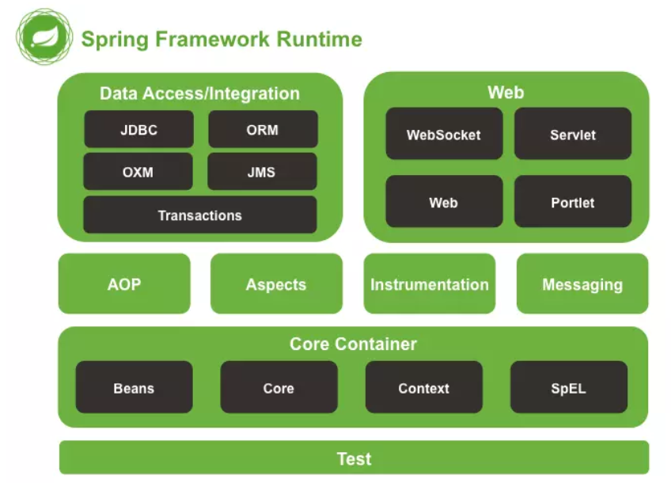
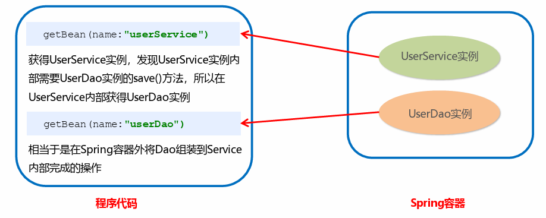
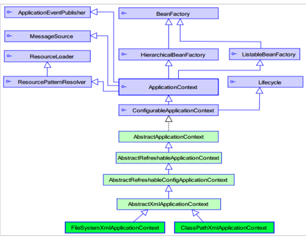

# Spring简介
Spring是分层的 Java SE/EE应用full-stack 轻量级开源框架，以 IoC（Inverse Of Control：反转控制）和AOP（Aspect Oriented Programming：面向切面编程）为内核。

提供了展现层SpringMVC 和持久层 Spring JDBCTemplate以及业务层事务管理等众多的企业级应用技术，还能整合开源世界众多著名的第三方框架和类库，逐渐成为使用最多的Java EE 企业应用开源框架。

## Spring的优势
1. **方便解耦，简化开发**
通过Spring 提供的IoC容器，可以将对象间的依赖关系交由Spring 进行控制，避免硬编码所造成的过度耦合。用户也不必再为单例模式类、属性文件解析等这些很底层的需求编写代码，可以更专注于上层的应用。

2. **AOP 编程的支持**
通过Spring的AOP 功能，方便进行面向切面编程，许多不容易用传统OOP 实现的功能可以通过AOP 轻松实现。
3. **声明式事务的支持**
可以将我们从单调烦闷的事务管理代码中解脱出来，通过声明式方式灵活的进行事务管理，提高开发效率和质量。
4. **方便程序的测试**
可以用非容器依赖的编程方式进行几乎所有的测试工作，测试不再是昂贵的操作，而是随手可做的事情。
5. **方便集成各种优秀框架**
Spring对各种优秀框架（Struts、Hibernate、Hessian、Quartz等）的支持。
6. **降低JavaEEAPI 的使用难度**
Spring对 JavaEE API（如JDBC、JavaMail、远程调用等）进行了薄薄的封装层，使这些API 的使用难度大为降低。
7. **Java 源码是经典学习范例**
Spring的源代码设计精妙、结构清晰、匠心独用，处处体现着大师对Java 设计模式灵活运用以及对Java技术的高深造诣。它的源代码无意是Java 技术的最佳实践的范例。

## Spring的体系结构



# Spring快速入门
## Spring程序开发步骤
1. 导入Spring开发的基本包坐标
2. 编写Dao接口和实现类
3. 创建Spring核心配置文件
4. 在Spring配置文件中配置UserDaoImpl
5. 使用Spring的API获得Bean实例

##  导入Spring开发的基本包坐标
```xml
<properties>
 <spring.version>5.2.8.RELEASE</spring.version>
 </properties>
 <dependencies>
 <!--导入spring的context坐标，context依赖core、beans、expression-->
 <dependency>
 <groupId>org.springframework</groupId>
 <artifactId>spring-context</artifactId>
 <version>${spring.version}</version>
 </dependency>
 </dependencies>
```
## 编写Dao接口和实现
```java
public interface UserDao {
 public void save();
 }
 public class UserDaoImpl implements UserDao {
 @Override
 public void save() {
 System.out.println("UserDao save method running....");
 }
 }
```
## 创建Spring核心配置文件
```xml
<?xml version="1.0" encoding="UTF-8" ?>
 <beans xmlns="http://www.springframework.org/schema/beans"
 xmlns:xsi="http://www.w3.org/2001/XMLSchema-instance"
  xsi:schemaLocation="
    http://www.springframework.org/schema/beans 
    http://www.springframework.org/schema/beans/spring-beans.xsd">
     </beans>
```
## 在Spring配置文件中配置UserDaoImpl
```xml
 <?xml version="1.0" encoding="UTF-8" ?>
 <beans xmlns="http://www.springframework.org/schema/beans"
 xmlns:xsi="http://www.w3.org/2001/XMLSchema-instance"
 xsi:schemaLocation="
 http://www.springframework.org/schema/beans
 http://www.springframework.org/schema/beans/spring-beans.xsd">
 <bean id="userDao" class="com.onenewcode.dao.impl.UserDaoImpl"></bean>
 </beans>
```
## 使用Spring的API获得Bean实例
```java
@Test
 public void test1(){
 ApplicationContext applicationContext = new   ClassPathXmlApplicationContext("applicationContext.xml");
 UserDao userDao = (UserDao) applicationContext.getBean("userDao");

userDao.save();
 }
```

# Spring配置文件
## Bean标签基本配置
用于配置对象交由Spring 来创建。
默认情况下它调用的是类中的无参构造函数，如果没有无参构造函数则不能创建成功。
**基本属性**：
 id：Bean实例在Spring容器中的唯一标识
 class：Bean的全限定名称
## Bean标签范围配置
scope：指对象的作用范围，取值如下：
|取值范围|说明|
|-------|-------|
|singleton| 默认值，单例的|
|prototype |多例的|
|request| WEB 项目中，Spring 创建一个Bean 的对象，将对象存入到request 域中|
|session |WEB 项目中，Spring 创建一个Bean 的对象，将对象存入到session 域中|
|global session|WEB 项目中，应用在Portlet环境，如果没有Portlet环境那么globalSession相当于session|
1. **当scope的取值为singleton时**
- Bean的实例化个数：1个
- Bean的实例化时机：当Spring核心文件被加载时，实例化配置的Bean实例
- Bean的生命周期：
    -  对象创建：当应用加载，创建容器时，对象就被创建了
    - 对象运行：只要容器在，对象一直活着
    - 对象销毁：当应用卸载，销毁容器时，对象就被销毁了
2. **当scope的取值为prototype时**
- Bean的实例化个数：多个
- Bean的实例化时机：当调用getBean()方法时实例化Bean
    - 对象创建：当使用对象时，创建新的对象实例
    - 对象运行：只要对象在使用中，就一直活着
    - 对象销毁：当对象长时间不用时，被Java 的垃圾回收器回收了
## Bean生命周期配
- init-method：指定类中的初始化方法名称
- destroy-method：指定类中销毁方法名称
##  Bean实例化三种方式
 无参构造方法实例化
 工厂静态方法实例化
 工厂实例方法实例化
### 使用无参构造方法实例化
它会根据默认无参构造方法来创建类对象，如果bean中没有默认无参构造函数，将会创建失败
```xml
<bean id="userDao" class="com.onenewcode.dao.impl.UserDaoImpl"/>
```

### 工厂静态方法实例化
工厂的静态方法返回Bean实例
```java
public class StaticFactoryBean {
 public static UserDao createUserDao(){
 return new UserDaoImpl();
 }
 }
```
```xml
 <bean id="userDao" class="com.onenewcode.factory.StaticFactoryBean" 
factory-method="createUserDao" />
```

### 工厂实例方法实例化
工厂的非静态方法返回Bean实例
```java
 public class DynamicFactoryBean {
 public UserDao createUserDao(){
 return new UserDaoImpl();
 }
 }
```
```xml
<bean id="factoryBean" class="com.onenewcode.factory.DynamicFactoryBean"/>
 <bean id="userDao" factory-bean="factoryBean" factory-method="createUserDao"/>
```
## Bean的依赖注入
①创建UserService，UserService 内部在调用UserDao的save() 方法
```java
public class UserServiceImpl implements UserService {
 @Override
 public void save() {
 ApplicationContext applicationContext = new 
ClassPathXmlApplicationContext("applicationContext.xml");
 UserDao userDao = (UserDao) applicationContext.getBean("userDao");
 userDao.save();
 }
 }

```
② 将UserServiceImpl 的创建权交给Spring
```xml
 <bean id="userService" class="com.onenewcode.service.impl.UserServiceImpl"/>
```
 ③ 从Spring 容器中获得UserService 进行操作
 ```java
 ApplicationContext applicationContext = new 
ClassPathXmlApplicationContext("applicationContext.xml");
 UserService userService = (UserService) applicationContext.getBean("userService");
 userService.save();
 ```

 ##  Bean的依赖注入分析
目前UserService实例和UserDao实例都存在与Spring容器中，当前的做法是在容器外部获得UserService实例和UserDao实例，然后在程序中进行结合。


依赖注入（Dependency Injection）：它是 Spring 框架核心 IOC 的具体实现。

在编写程序时，通过控制反转，把对象的创建交给了Spring，但是代码中不可能出现没有依赖的情况。

IOC 解耦只是降低他们的依赖关系，但不会消除。例如：业务层仍会调用持久层的方法。
那这种业务层和持久层的依赖关系，在使用Spring 之后，就让Spring 来维护了。
简单的说，就是坐等框架把持久层对象传入业务层，而不用我们自己去获取。


**怎么将UserDao怎样注入到UserService内部呢？**
 构造方法
 set方法

1）**set方法注入**
在UserServiceImpl中添加setUserDao方法
```java
public class UserServiceImpl implements UserService {
 private UserDao userDao;
 public void setUserDao(UserDao userDao) {
 this.userDao= userDao;
 }
 @Override
 public void save() {
 userDao.save();
 }
 }

```
配置Spring容器调用set方法进行注入
```xml
<bean id="userDao" class="com.onenewcode.dao.impl.UserDaoImpl"/>
 <bean id="userService" class="com.onenewcode.service.impl.UserServiceImpl">
 <property name="userDao" ref="userDao"/>
 </bean>
```


P命名空间注入本质也是set方法注入，但比起上述的set方法注入更加方便，主要体现在配置文件中，如下：
首先，需要引入P命名空间：
```xml
xmlns:p="http://www.springframework.org/schema/p"
```

其次，需要修改注入方式
```xml
<bean id="userService" class="com.onenewcode.service.impl.UserServiceImpl" p:userDao
ref="userDao"/>
```
2）**构造方法注入**
配置Spring容器调用有参构造时进行注入
```xml
<bean id="userDao" class="com.onenewcode.dao.impl.UserDaoImpl"/>
 <bean id="userService" class="com.onenewcode.service.impl.UserServiceImpl">
 <constructor-arg name="userDao" ref="userDao"></constructor-arg>
 </bean>

```
## Bean的依赖注入的数据类型

上面的操作，都是注入的引用Bean，处了对象的引用可以注入，普通数据类型，集合等都可以在容器中进行注入。
注入数据的三种数据类型
<span style="color:red">
 普通数据类型
 引用数据类型
 集合数据类型
</span>

其中引用数据类型，此处就不再赘述了，之前的操作都是对UserDao对象的引用进行注入的，下面将以set方法注入为例，演示普通数据类型和集合数据类型的注入

1）**普通数据类型的注入**
```java
public class UserDaoImpl implements UserDao {
 private String company;
 private int age;
 public void setCompany(String company) {
 this.company = company;
 }
 public void setAge(int age) {
 this.age = age;
 }
 public void save() {
 System.out.println(company+"==="+age);
 System.out.println("UserDao save method running....");
 }
 }
```

xml
```xml
<bean id="userDao" class="com.onenewcode.dao.impl.UserDaoImpl">
 <property name="company" value="传智播客"></property>
 <property name="age" value="15"></property>
 </bean>

```
2）**集合数据类型（List&lt;String>）的注入**
```java
public class UserDaoImpl implements UserDao {
 private List<String> strList;
 public void setStrList(List<String> strList) {
 this.strList = strList;
 }
 public void save() {
 System.out.println(strList);
 System.out.println("UserDao save method running....");
 }
 }
```
xml
```xml
<bean id="userDao" class="com.onenewcode.dao.impl.UserDaoImpl">
 <property name="strList">
 <list>
 <value>aaa</value>
 <value>bbb</value>
 <value>ccc</value>
 </list>
 </property>
 </bean>
```
3）**集合数据类型（List&lt;User>）的注入**
```java
public class UserDaoImpl implements UserDao {
 private List<User> userList;
 public void setUserList(List<User> userList) {
 this.userList = userList;
 }
 public void save() {
 System.out.println(userList);
 System.out.println("UserDao save method running....");
 }
 }
```
xml
```xml
<bean id="u1" class="com.onenewcode.domain.User"/>
 <bean id="u2" class="com.onenewcode.domain.User"/>
 <bean id="userDao" class="com.onenewcode.dao.impl.UserDaoImpl">
 <property name="userList">
 <list>
 <bean class="com.onenewcode.domain.User"/>
 <bean class="com.onenewcode.domain.User"/>
 <ref bean="u1"/>
 <ref bean="u2"/>
 </list>
 </property>
 </bean>
```

4）**集合数据类型（Map&lt;String,User>）的注入**
```java
public class UserDaoImpl implements UserDao {
 private Map<String,User> userMap;
 public void setUserMap(Map<String, User> userMap) {
 this.userMap = userMap;
 }
 public void save() {
 System.out.println(userMap);
 System.out.println("UserDao save method running....");
 }
 }
```
xml
```xml
<bean id="u1" class="com.onenewcode.domain.User"/>
 <bean id="u2" class="com.onenewcode.domain.User"/>
 <bean id="userDao" class="com.onenewcode.dao.impl.UserDaoImpl">
 <property name="userMap">
 <map>
 <entry key="user1" value-ref="u1"/>
 <entry key="user2" value-ref="u2"/>
 </map>
 </property>
 </bean>
```
5）**集合数据类型（Properties）的注入**
```java
public class UserDaoImpl implements UserDao {
 private Properties properties;
 public void setProperties(Properties properties) {
 this.properties = properties;
 }
 public void save() {
 System.out.println(properties);
 System.out.println("UserDao save method running....");
 }
 }
```
xml
```xml
<bean id="userDao" class="com.onenewcode.dao.impl.UserDaoImpl">
 <property name="properties">
 <props>
 <prop key="p1">aaa</prop>
 <prop key="p2">bbb</prop>
 <prop key="p3">ccc</prop>
 </props>
 </property>
 </bean>
```

##  引入其他配置文件
实际开发中，Spring的配置内容非常多，这就导致Spring配置很繁杂且体积很大，所以，可以将部分配置拆解到其他配置文件中，而在Spring主配置文件通过import标签进行加载
```xml
<bean>标签
id属性:在容器中Bean实例的唯一标识，不允许重复
class属性:要实例化的Bean的全限定名
scope属性:Bean的作用范围，常用是Singleton(默认)和prototype
 <property>标签：属性注入
name属性：属性名称
value属性：注入的普通属性值
ref属性：注入的对象引用值
<list>标签
<map>标签
<properties>标签
<constructor-arg>标签
<import>标签:导入其他的Spring的分文件

```
#  Spring相关API
## ApplicationContext的继承体系
<span style="color:red">applicationContext：</span>接口类型，代表应用上下文，可以通过其实例获得 Spring 容器中的Bean 对象


## ApplicationContext的实现类
1）**ClassPathXmlApplicationContext**
它是从类的根路径下加载配置文件推荐使用这种
2）**FileSystemXmlApplicationContext**
它是从磁盘路径上加载配置文件，配置文件可以在磁盘的任意位置。
3）**AnnotationConfigApplicationContext**
当使用注解配置容器对象时，需要使用此类来创建spring 容器。它用来读取注解。
## getBean()方法使用
```java
public Object getBean(String name) throws BeansException {
 assertBeanFactoryActive();
 return getBeanFactory().getBean(name);
 }
 public <T> T getBean(Class<T> requiredType) throws BeansException {
 assertBeanFactoryActive();
 return getBeanFactory().getBean(requiredType);
 }
```
其中，当参数的数据类型是字符串时，表示根据Bean的id从容器中获得Bean实例，返回是Object，需要强转。
当参数的数据类型是Class类型时，表示根据类型从容器中匹配Bean实例，当容器中相同类型的Bean有多个时，则此方法会报错。

```java
ApplicationContext applicationContext = new 
ClassPathXmlApplicationContext("applicationContext.xml");
 UserService userService1 = (UserService) 
applicationContext.getBean("userService");
 UserService userService2 = applicationContext.getBean(UserService.class);
```

# Spring配置数据源
##  数据源（连接池）的作用
• 数据源(连接池)是提高程序性能如出现的
• 事先实例化数据源，初始化部分连接资源
• 使用连接资源时从数据源中获取
• 使用完毕后将连接资源归还给数据源

常见的数据源(连接池)：DBCP、C3P0、BoneCP、Druid

**数据源的开发步骤**
① 导入数据源的坐标和数据库驱动坐标
② 创建数据源对象
③ 设置数据源的基本连接数据
④ 使用数据源获取连接资源和归还连接资源

##  数据源的手动创建
①导入druid的坐标
```xml
<!--数据源-->
    <dependency>
      <groupId>com.alibaba</groupId>
      <artifactId>druid</artifactId>
      <version>1.2.16</version>
    </dependency>

```
① 导入mysql数据库驱动坐标
```xml
  <!-- 数据库驱动相关依赖-->
    <dependency>
      <groupId>mysql</groupId>
      <artifactId>mysql-connector-java</artifactId>
      <version>8.0.33</version>
    </dependency>
```
② 创建Druid连接池
```java
@Test
 public void testDruid() throws Exception {
 //创建数据源
DruidDataSource dataSource = new DruidDataSource();
 //设置数据库连接参数
dataSource.setDriverClassName("com.mysql.jdbc.Driver");
 dataSource.setUrl("jdbc:mysql://localhost:3306/test");
 dataSource.setUsername("root");
 dataSource.setPassword("root");
 //获得连接对象
Connection connection = dataSource.getConnection();
 System.out.println(connection);
 }
```
③ 提取jdbc.properties配置文件
```properties
jdbc.driver=com.mysql.jdbc.Driver
jdbc.url=jdbc:mysql://localhost:3306/test
jdbc.username=root
jdbc.password=root
```
 ④读取jdbc.properties配置文件创建连接池
```java
@Test
 public void testC3P0ByProperties() throws Exception {
 //加载类路径下的jdbc.properties
 ResourceBundle rb = ResourceBundle.getBundle("jdbc");
 ComboPooledDataSource dataSource = new ComboPooledDataSource();
 dataSource.setDriverClass(rb.getString("jdbc.driver"));
 dataSource.setJdbcUrl(rb.getString("jdbc.url"));
 dataSource.setUser(rb.getString("jdbc.username"));
 dataSource.setPassword(rb.getString("jdbc.password"));
 Connection connection = dataSource.getConnection();
 System.out.println(connection);
 }
```

可以将DataSource的创建权交由Spring容器去完成
 DataSource有无参构造方法，而Spring默认就是通过无参构造方法实例化对象的
 DataSource要想使用需要通过set方法设置数据库连接信息，而Spring可以通过set方法进行字符串注入
```xml
<bean id="dataSource" class="com.mchange.v2.c3p0.ComboPooledDataSource">
 <property name="driverClass" value="com.mysql.jdbc.Driver"/>
 <property name="jdbcUrl" value="jdbc:mysql://localhost:3306/test"/>
 <property name="user" value="root"/>
  <property name="password" value="root"/>

 </bean>
```

**测试从容器当中获取数据源**
```java
ApplicationContext applicationContext = new 
ClassPathXmlApplicationContext("applicationContext.xml");
 DataSource dataSource = (DataSource) 
applicationContext.getBean("dataSource");
 Connection connection = dataSource.getConnection();
 System.out.println(connection);
```
## 抽取jdbc配置文件
applicationContext.xml加载jdbc.properties配置文件获得连接信息。
首先，需要引入context命名空间和约束路径：
 命名空间：xmlns:context="http://www.springframework.org/schema/context"
 约束路径：http://www.springframework.org/schema/context
 http://www.springframework.org/schema/context/spring-context.xsd
 ```xml
  <context:property-placeholder location="classpath:jdbc.properties"/>
 <bean id="dataSource" class="com.mchange.v2.c3p0.ComboPooledDataSource">
 <property name="driverClass" value="${jdbc.driver}"/>
 <property name="jdbcUrl" value="${jdbc.url}"/>
 <property name="user" value="${jdbc.username}"/>
 <property name="password" value="${jdbc.password}"/>
 </bean>
 ```

## Spring注解
Spring是轻代码而重配置的框架，配置比较繁重，影响开发效率，所以注解开发是一种趋势，注解代替xml配置文件可以简化配置，提高开发效率

- 使用@Compont或@Repository标识UserDaoImpl需要Spring进行实例化
```java
//@Component("userDao")
 @Repository("userDao")
 public class UserDaoImpl implements UserDao {
 @Override
 public void save() {
 System.out.println("save running... ...");
 }
 }
```

- 使用@Compont或@Service标识UserServiceImpl需要Spring进行实例化
- 使用@Autowired或者@Autowired+@Qulifier或者@Resource进行userDao的注入

```java
//@Component("userService")
 @Service("userService")
 public class UserServiceImpl implements UserService {
 /*@Autowired
 @Qualifier("userDao")*/
 @Resource(name="userDao")
 private UserDao userDao;
 @Override
 public void save() {
 userDao.save();
 }
 }
```
- 使用@Value进行字符串的注入
```java
@Repository("userDao")
 public class UserDaoImpl implements UserDao {
 @Value("注入普通数据")
 private String str;
 @Value("${jdbc.driver}")
 private String driver;
 @Override
 public void save() {
 System.out.println(str);
 System.out.println(driver);
 System.out.println("save running... ...");
 }
 }
```
- 使用@Scope标注Bean的范围
```java
//@Scope("prototype")
 @Scope("singleton")
 public class UserDaoImpl implements UserDao {
 //此处省略代码
}
```

- 使用@PostConstruct标注初始化方法，使用@PreDestroy标注销毁方法
```java
@PostConstruct
 public void init(){
 System.out.println("初始化方法....");
 }
 @PreDestroy
 public void destroy(){
 System.out.println("销毁方法.....");
 }
```
##  Spring注解
使用上面的注解还不能全部替代xml配置文件，还需要使用注解替代的配置如下：
 非自定义的Bean的配置：&lt;bean>
 加载properties文件的配置：&lt;context:property-placeholder>
 组件扫描的配置：&lt;context:component-scan>
 引入其他文件：&lt;import>
|注解|说明|
|---------|-------|
|@Configuration|用于指定当前类是一个Spring 配置类，当创建容器时会从该类上加载注解|
|@ComponentScan|用于指定Spring 在初始化容器时要扫描的包。作用和在Spring 的xml 配置文件中的 &lt;context:component-scan base-package="com.onenewcode"/>一样|
|@Bean|使用在方法上，标注将该方法的返回值存储到Spring 容器中|
|@PropertySource|用于加载.properties 文件中的配置|
|@Import|用于导入其他配置类|

- @Configuration
- @ComponentScan
- @Import
```java
 @Configuration
 @ComponentScan("com.onenewcode")
 @Import({DataSourceConfiguration.class})
 public class SpringConfiguration {
 }

```


- @PropertySource
- @value
```java
@PropertySource("classpath:jdbc.properties")
 public class DataSourceConfiguration {
 @Value("${jdbc.driver}")
 private String driver;
 @Value("${jdbc.url}")
 private String url;
 @Value("${jdbc.username}")
 private String username;
 @Value("${jdbc.password}")
 private String password;
 }
```

- @Bean
```java
@Bean(name="dataSource")
 public DataSource getDataSource() throws PropertyVetoException {
 ComboPooledDataSource dataSource = new ComboPooledDataSource();
 dataSource.setDriverClass(driver);
 dataSource.setJdbcUrl(url);
 dataSource.setUser(username);
 dataSource.setPassword(password);
 return dataSource;
 }
```

**测试加载核心配置类创建Spring容器**

```java

@Test
 public void testAnnoConfiguration() throws Exception {
 ApplicationContext applicationContext = new 
AnnotationConfigApplicationContext(SpringConfiguration.class);
 UserService userService = (UserService) 
applicationContext.getBean("userService");
 userService.save();
 DataSource dataSource = (DataSource) 
applicationContext.getBean("dataSource");
 Connection connection = dataSource.getConnection();
 System.out.println(connection);
 }
```

# Spring整合Junit
## 原始Junit测试Spring的问题
在测试类中，每个测试方法都有以下两行代码：
```java
ApplicationContext ac = new ClassPathXmlApplicationContext("bean.xml");
 IAccountService as = ac.getBean("accountService",IAccountService.class);
```
这两行代码的作用是获取容器，如果不写的话，直接会提示空指针异常。所以又不能轻易删掉。

**上述问题解决思路**
• 让SpringJunit负责创建Spring容器，但是需要将配置文件的名称告诉它
• 将需要进行测试Bean直接在测试类中进行注
## Spring集成Junit步骤
① 导入spring集成Junit的坐标
② 使用@Runwith注解替换原来的运行期
③ 使用@ContextConfiguration指定配置文件或配置类
④ 使用@Autowired注入需要测试的对象
⑤ 创建测试方法进行测试
```xml
<dependency>
      <groupId>junit</groupId>
      <artifactId>junit</artifactId>
      <version>4.13.2</version>
      <scope>test</scope>
    </dependency>
    <dependency>
      <groupId>org.springframework</groupId>
      <artifactId>spring-test</artifactId>
      <version>5.2.8.RELEASE</version>
    </dependency>
```
② 使用@Runwith注解替换原来的运行期
```java
@RunWith(SpringJUnit4ClassRunner.class)
 public class SpringJunitTest {
 }

```
③ 使用@ContextConfiguration指定配置文件或配置类
```java
@RunWith(SpringJUnit4ClassRunner.class)
 //加载spring核心配置文件
//@ContextConfiguration(value = {"classpath:applicationContext.xml"})
 //加载spring核心配置类
@ContextConfiguration(classes = {SpringConfiguration.class})
 public class SpringJunitTest {
 }
```
④ 使用@Autowired注入需要测试的对象
```java
@RunWith(SpringJUnit4ClassRunner.class)
 @ContextConfiguration(classes = {SpringConfiguration.class})
 public class SpringJunitTest {
 @Autowired
 private UserService userService;
 }
```
⑤创建测试方法进行测试
 ```java
 @RunWith(SpringJUnit4ClassRunner.class)
 @ContextConfiguration(classes = {SpringConfiguration.class})
 public class SpringJunitTest {
 @Autowired
 private UserService userService;
 @Test
 public void testUserService(){
 userService.save();
 }
 }
 ```