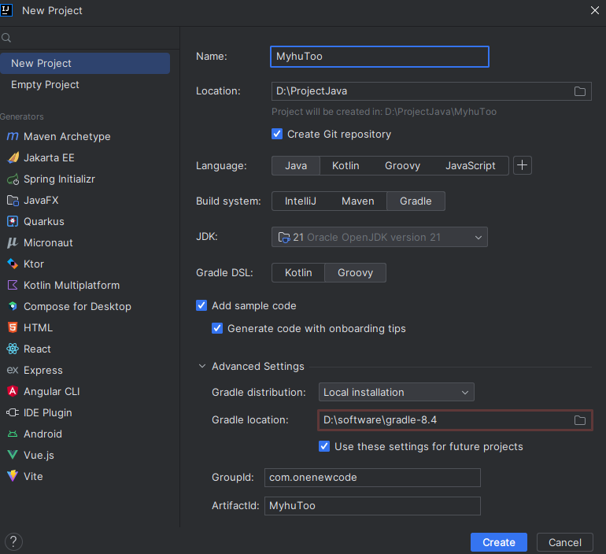
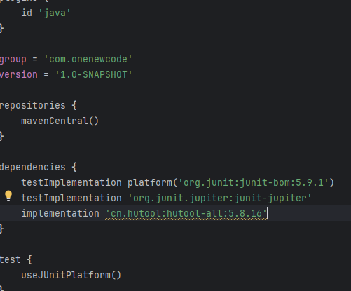
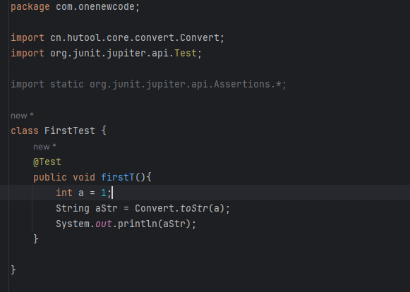

# hutool
## 📚简介
**Hutool**是一个小而全的Java工具类库，通过静态方法封装，降低相关API的学习成本，提高工作效率，使Java拥有函数式语言般的优雅,而且在web开发中所用的很多的小功能都实现了，可以简化代码的开发。

**Hutool**中的工具方法来自每个用户的精雕细琢，它涵盖了Java开发底层代码中的方方面面，它既是大型项目开发中解决小问题的利器，也是小型项目中的效率担当；

**Hutool**是项目中“util”包友好的替代，它节省了开发人员对项目中公用类和公用工具方法的封装时间，使开发专注于业务，同时可以最大限度的避免封装不完善带来的bug。

### 🍺Hutool如何改变我们的coding方式
Hutool的目标是使用一个工具方法代替一段复杂代码，从而最大限度的避免“复制粘贴”代码的问题，彻底改变我们写代码的方式。

以计算MD5为例：
👴【以前】打开搜索引擎 -> 搜“Java MD5加密” -> 打开某篇博客-> 复制粘贴 -> 改改好用
👦【现在】引入Hutool -> SecureUtil.md5()
Hutool的存在就是为了减少代码搜索成本，避免网络上参差不齐的代码出现导致的bug。

### 🛠️包含组件
一个Java基础工具类，对文件、流、加密解密、转码、正则、线程、XML等JDK方法进行封装，组成各种Util工具类，同时提供以下组件：

|模块  |	介绍|
|------------|--------------------------|
|hutool-aop|	JDK动态代理封装，提供非IOC下的切面支持|
|hutool-bloomFilter	|布隆过滤，提供一些Hash算法的布隆过滤|
|hutool-cache	|简单缓存实现|
|hutool-core|	核心，包括Bean操作、日期、各种Util等|
|hutool-cron	|定时任务模块，提供类Crontab表达式的定时任务|
|hutool-crypto|	加密解密模块，提供对称、非对称和摘要算法封装|
|hutool-db	|JDBC封装后的数据操作，基于ActiveRecord思想|
|hutool-dfa|	基于DFA模型的多关键字查找|
|hutool-extra|	扩展模块，对第三方封装（模板引擎、邮件、Servlet、二维码、Emoji、FTP、分词等）|
|hutool-http|	基于HttpUrlConnection的Http客户端封装|
|hutool-log	|自动识别日志实现的日志门面|
|hutool-script|	脚本执行封装，例如Javascript|
|hutool-setting	|功能更强大的Setting配置文件和Properties封装|
|hutool-system|	系统参数调用封装（JVM信息等）|
|hutool-json	|JSON实现|
|hutool-captcha|	图片验证码实现|
|hutool-poi|	针对POI中Excel和Word的封装|
|hutool-socket|	基于Java的NIO和AIO的Socket封装|
|hutool-jwt	|JSON Web Token (JWT)封装实现|

可以根据需求对每个模块单独引入，也可以通过引入hutool-all方式引入所有模块。
## 📦安装
### 🍊Maven
在项目的pom.xml的dependencies中加入以下内容:
```xml
<dependency>
    <groupId>cn.hutool</groupId>
    <artifactId>hutool-all</artifactId>
    <version>5.8.16</version>
</dependency>
```

### 🍐Gradle
`implementation 'cn.hutool:hutool-all:5.8.16'`

## 快速开始
**在idea创建项目**


**在`build.gradel`文件中引入依赖`implementation 'cn.hutool:hutool-all:5.8.16'`**


**编写测试类**


**查看测试结果**
```shell
> Task :compileJava UP-TO-DATE
> Task :processResources NO-SOURCE
> Task :classes UP-TO-DATE
> Task :compileTestJava
> Task :processTestResources NO-SOURCE
> Task :testClasses
1
> Task :test
```
这样一个基础的项目就搭建好了，更多其它的用法可以看本系列的其他内容。
## github仓库
`https://github.com/onenewcode/MyHutool.git`


# 类型转换工具
## 类型转换工具Convert

### Convert类
Convert类可以说是一个工具方法类，里面封装了针对Java常见类型的转换，用于简化类型转换。Convert类中大部分方法为toXXX，参数为Object，可以实现将任意可能的类型转换为指定类型。同时支持第二个参数defaultValue用于在转换失败时返回一个默认值。


1. 转换为字符串：
```java


转换为指定类型数组：
String[] b = { "1", "2", "3", "4" };
//结果为Integer数组
Integer[] intArray = Convert.toIntArray(b);

long[] c = {1,2,3,4,5};
//结果为Integer数组
Integer[] intArray2 = Convert.toIntArray(c);

转换为日期对象：
String a = "2017-05-06";
Date value = Convert.toDate(a);
转换为集合g
Object[] a = {"a", "你", "好", "", 1};
List<?> list = Convert.convert(List.class, a);
//从4.1.11开始可以这么用
List<?> list = Convert.toList(a);
```

#### 其它类型转换
##### 标准类型
通过Convert.convert(Class&lt;T>, Object)方法可以将任意类型转换为指定类型，Hutool中预定义了许多类型转换，例如转换为URI、URL、Calendar等等，这些类型的转换都依托于ConverterRegistry类。通过这个类和Converter接口.

#####  泛型类型
通过convert(TypeReference&lt;T> reference, Object value)方法，自行new一个TypeReference对象可以对嵌套泛型进行类型转换。例如，我们想转换一个对象为List&lt;String>类型，此时传入的标准Class就无法满足要求，此时我们可以这样：
```java
Object[] a = { "a", "你", "好", "", 1 };
List<String> list = Convert.convert(new TypeReference<List<String>>() {}, a);
```

通过TypeReference实例化后制定泛型类型，即可转换对象为我们想要的目标类型。

#### 字符串转换
##### 各种类型转为字符串
```java
//        各种类型转字符串
        int a = 1;
    //aStr为"1"
        String aStr = Convert.toStr(a);
        System.out.println(aStr);

        long[] b = {1,2,3,4,5};
    //bStr为："[1, 2, 3, 4, 5]"
        String bStr = Convert.toStr(b);
        System.out.println(bStr);
        Map<String,Integer> map=new HashMap<>();
        map.put("SDfsd",4);
        map.put("dfgd",676);
        map.put("Sdfssd",4);
        System.out.println(Convert.toStr(map));
```
##### 半角和全角转换
在很多文本的统一化中这两个方法非常有用，主要对标点符号的全角半角转换。


```java
  // 半角和全角转换
        // 半角转全角
        String a1= "123456789";

//结果为："１２３４５６７８９"
        String sbc = Convert.toSBC(a1);

        System.out.println(sbc);
        // 全角转半角
        //结果为"123456789"
        String dbc=Convert.toDBC(sbc);
        System.out.println(dbc);
```

#### 进制转化
在很多加密解密，以及中文字符串传输（比如表单提交）的时候，会用到16进制转换，就是Hex转换，为此Hutool中专门封装了HexUtil工具类，考虑到16进制转换也是转换的一部分，因此将其方法也放在Convert类中，便于理解和查找，使用同样非常简单：
```java

        String a = "我是一个小小可爱的字符串";
    //    字符串转化为十六进制字符串
        String hex = Convert.toHex(a, CharsetUtil.CHARSET_UTF_8);
        //结果："e68891e698afe4b880e4b8aae5b08fe5b08fe79a84e58fafe788b1e79a84e5ad97e7aca6e4b8b2"
        System.out.println(hex);
        // 十六进制字符串转化为正常字符串
        String raw = Convert.hexToStr(hex, CharsetUtil.CHARSET_UTF_8);
//        输出
        System.out.println(raw);
```

因为字符串牵涉到编码问题，因此必须传入编码对象，此处使用UTF-8编码。 toHex方法同样支持传入byte[]，同样也可以使用hexToBytes方法将16进制转为byte[]

#### 不同编码字符串转换
与16进制类似，Convert类同样可以在字符串和Unicode之间轻松转换：

```
        String a = "我是一个小小的可爱的字符串";
        //   字符串转化为unf-8
        //结果为："\\u6211\\u662f\\u4e00\\u4e2a\\u5c0f\\u5c0f\\u7684\\u53ef\\u7231\\u7684\\u5b57\\u7b26\\u4e32"
        String unicode = Convert.strToUnicode(a);
        System.out.println(unicode);
        String raw = Convert.unicodeToStr(unicode);
    //结果为："我是一个小小的可爱的字符串"
        System.out.println(raw);

        //utf-8转换为ios-8859-i字符集
        String result = Convert.convertCharset(a, CharsetUtil.UTF_8, CharsetUtil.ISO_8859_1);
        //转换后result为乱码
        System.out.println(result);
        // 把编码转化出来
        String s=Convert.convertCharset(result,CharsetUtil.ISO_8859_1,CharsetUtil.UTF_8);
        System.out.println(s);
```


#### 时间单位转换
Convert.convertTime方法主要用于转换时长单位，比如一个很大的毫秒，我想获得这个毫秒数对应多少分：
```java
        long a = 4535345;

        //结果为：75
        long minutes = Convert.convertTime(a, TimeUnit.MILLISECONDS, TimeUnit.MINUTES);
        System.out.println(minutes);
```
#### 金额大小写转换
面对财务类需求，Convert.digitToChinese将金钱数转换为大写形式：
```java
        double a = 67556.32;

//结果为："陆万柒仟伍佰伍拾陆元叁角贰分"
        String digitUppercase = Convert.digitToChinese(a);

        System.out.println(digitUppercase);
```
注意 转换为大写只能精确到分（小数点儿后两位），之后的数字会被忽略。

#### 数字转换
数字转换提供多种数字转化为不同字符串的格式
```java
//        数字转为英文表达 ONE HUNDRED AND CENTS TWENTY THREE ONLY
        String format = Convert.numberToWord(100.23);
        System.out.println(format);
//        数字简化  1.2k
        String format1 = Convert.numberToSimple(1200);
        System.out.println(format1);
//        数字转中文 数字转中文方法中，只保留两位小数  一万零八百八十九点七二
        String f1 = Convert.numberToChinese(10889.72356, false);
        System.out.println(f1);

// 使用金额大写  壹万贰仟陆佰伍拾叁
        String f2 = Convert.numberToChinese(12653, true);
        System.out.println(f2);
//        数字中文表示转换为数字 1012
        Integer i= Convert.chineseToNumber("一千零一十二");
        System.out.println(i);
```
#### 原始类和包装类转换
有的时候，我们需要将包装类和原始类相互转换（比如Integer.class 和 int.class），这时候我们可以：
```java
//去包装
Class<?> wrapClass = Integer.class;

//结果为：int.class
Class<?> unWraped = Convert.unWrap(wrapClass);

//包装
Class<?> primitiveClass = long.class;

//结果为：Long.class
Class<?> wraped = Convert.wrap(primitiveClass);
```


## 自定义转换
Hutool的默认转换有时候并不能满足我们自定义对象的一些需求，这时我们可以使用ConverterRegistry.getInstance().putCustom()方法自定义类型转换。

### 自定义转换器
```java
public static class CustomConverter implements Converter<String>{
    @Override
    public String convert(Object value, String defaultValue) throws IllegalArgumentException {
        return "Custom: " + value.toString();
    }
}
```

### 注册转换器
```java
ConverterRegistry converterRegistry = ConverterRegistry.getInstance();
//此处做为示例自定义String转换，因为Hutool中已经提供String转换，请尽量不要替换
//替换可能引发关联转换异常（例如覆盖String转换会影响全局）
converterRegistry.putCustom(String.class, CustomConverter.class);
//执行转换
int a = 454553;
String result = converterRegistry.convert(String.class, a);
Assert.assertEquals("Custom: 454553", result);
```
# 日期时间工具
## 介绍
日期时间包是Hutool的核心包之一，提供针对JDK中Date和Calendar对象的封装，封装对象。

### 日期时间工具
- **DateUtil** 针对日期时间操作提供一系列静态方法
- **DateTime** 提供类似于Joda-Time中日期时间对象的封装，继承自Date类，并提供更加丰富的对象方法。
- **FastDateFormat** 提供线程安全的针对Date对象的格式化和日期字符串解析支持。此对象在实际使用中并不需要感知，相关操作已经封装在DateUtil和DateTime的相关方法中。
- **DateBetween** 计算两个时间间隔的类，除了通过构造新对象使用外，相关操作也已封装在DateUtil和DateTime的相关方法中。
- **TimeInterval** 一个简单的计时器类，常用于计算某段代码的执行时间，提供包括毫秒、秒、分、时、天、周等各种单位的花费时长计算，对象的静态构造已封装在DateUtil中。
- **DatePattern** 提供常用的日期格式化模式，包括String类型和FastDateFormat两种类型。

## 日期时间工具-DateUtil
考虑到Java本身对日期时间的支持有限，并且Date和Calendar对象的并存导致各种方法使用混乱和复杂，故使用此工具类做了封装。这其中的封装主要是日期和字符串之间的转换，以及提供对日期的定位。

对于Date对象，为了便捷，使用了一个DateTime类来代替之，继承自Date对象，主要的便利在于，覆盖了toString()方法，返回yyyy-MM-dd HH:mm:ss形式的字符串，方便在输出时的调用（例如日志记录等），提供了众多便捷的方法对日期对象操作。

### 与java原有日期类型之间的转换
Date、long、Calendar之间的相互转换
```java
        //当前时间
        Date date = DateUtil.date();
        System.out.println(date);
//当前时间
        Date date2 = DateUtil.date(Calendar.getInstance());
        System.out.println(date2);
//当前时间
        Date date3 = DateUtil.date(System.currentTimeMillis());
        System.out.println(date3);
//当前时间字符串，格式：yyyy-MM-dd HH:mm:ss
        String now = DateUtil.now();
        System.out.println(now);
//当前日期字符串，格式：yyyy-MM-dd
        String today= DateUtil.today();
        System.out.println(today);

```

### 字符串转日期和格式化输出
DateUtil.parse方法会自动识别一些常用格式，包括：
- yyyy-MM-dd HH:mm:ss
- yyyy/MM/dd HH:mm:ss
- yyyy.MM.dd HH:mm:ss
- yyyy年MM月dd日 HH时mm分ss秒
- yyyy-MM-dd
- yyyy/MM/dd
- yyyy.MM.dd
- HH:mm:ss
- HH时mm分ss秒
- yyyy-MM-dd HH:mm
- yyyy-MM-dd HH:mm:ss.SSS
- yyyyMMddHHmmss
- yyyyMMddHHmmssSSS
- yyyyMMdd
- EEE, dd MMM yyyy HH:mm:ss z
- EEE MMM dd HH:mm:ss zzz yyyy
- yyyy-MM-dd'T'HH:mm:ss'Z'
- yyyy-MM-dd'T'HH:mm:ss.SSS'Z'
- yyyy-MM-dd'T'HH:mm:ssZ
- yyyy-MM-dd'T'HH:mm:ss.SSSZ
- String dateStr = "2017-03-01";
- Date date = DateUtil.parse(dateStr);
我们也可以使用自定义日期格式转化，
DateUtil.format可以设置0日期格式化，支持以上的格式，
```java
        String s1="2001-08-22 12:21:21";
        DateTime s2 = DateUtil.parse(s1);
        // 输出2001-08-22 12:21:21
        System.out.println(s2);
        String dateStr = "2017-03-01";
        Date date = DateUtil.parse(dateStr);
        //设置自定义解析字符串格式化转换
        String format = DateUtil.format(date, "yyyy/MM/dd");
        //结果 2017/03/01
        System.out.println(format);


        //设置自定义解析字符串格式化转换
        String formatDateTime = DateUtil.formatDateTime(date);
        //结果：2017-03-01 00:00:00
        System.out.println(formatDateTime);
        String formatTime = DateUtil.formatTime(date);
        //结果：00:00:00
        System.out.println(formatTime);
```

### 其他功能
DateUtil还有其他几个不常用的功能，包括**获取部分日期**，**日期枚举**，**日期偏移**,**计算时差**，**星座和属相**
```java
    // 获取部分日期

        // 获取当前日期
        Date date=DateUtil.date();

        //获得年的部分
        System.out.println(DateUtil.year(date));
        //获得月份，从0开始计数
        System.out.println(DateUtil.month(date));
        //获得月份枚举,用英文表示
        System.out.println(DateUtil.monthEnum(date));


        //日期偏移
        //获取今天开始
        System.out.println(DateUtil.beginOfDay(date));
        //获取今天结束
        System.out.println(DateUtil.endOfDay(date));
        // 向后偏移七天
        System.out.println(DateUtil.offset(date, DateField.DAY_OF_WEEK,7));
        //由于上面的api还是过于繁琐，DateUtil还提供了一些更简化方法
        //昨天
        System.out.println(DateUtil.yesterday());
        //明天
        System.out.println(DateUtil.tomorrow());
        //偏移三天
        System.out.println(DateUtil.offsetDay(date,3));

        // 计算时间差
        String dateStr2 = "2017-04-01 23:33:23";
        Date date2 = DateUtil.parse(dateStr2);
        // 计算时间差，并指定以天为单位
        System.out.println(DateUtil.between(date,date2, DateUnit.DAY));
        //格式化输出时间差
        System.out.println(DateUtil.formatBetween(date,date2, BetweenFormatter.Level.DAY));

        //星座和属相
        // "摩羯座"
        String zodiac = DateUtil.getZodiac(Month.JANUARY.getValue(), 19);
        // "狗"
        String chineseZodiac = DateUtil.getChineseZodiac(1994);
        //计算年龄
        DateUtil.ageOfNow("1990-01-30");
        //判断是否为闰年
        DateUtil.isLeapYear(2017);

```

### DateTime
hutool中的DateTime类继承于java.util.Date类，为Date类扩展了众多简便方法，这些方法多是DateUtil静态方法的对象表现形式，使用DateTime对象可以完全替代开发中Date对象的使用。
### 新建对象
DateTime提供了多种参数构造
- Date
- Calendar
- String(日期字符串，第二个参数是日期格式)
- long 毫秒数

构建对象有两种方式：DateTime.of()和new DateTime()：
```java
Date date = new Date();
        
//new方式创建
DateTime time = new DateTime(date);
Console.log(time);

//of方式创建
DateTime now = DateTime.now();
DateTime dt = DateTime.of(date);

```
### 使用对象
DateTime的成员方法与DateUtil中的静态方法所对应，因为是成员方法，因此可以使用更少的参数操作日期时间。因为在上文已经进行较为完备的介绍，以根据上文的介绍自行使用。

##  TimeInterval
Hutool通过封装TimeInterval实现计时器功能，即可以计算方法或过程执行的时间。TimeInterval支持分组计时，方便对比时间。

```java
TimeInterval timer = DateUtil.timer();

//---------------------------------
//-------这是执行过程
//---------------------------------

timer.interval();//花费毫秒数
timer.intervalRestart();//返回花费时间，并重置开始时间
timer.intervalMinute();//花费分钟数

// 也可以实现分组计时

final TimeInterval timer = new TimeInterval();

// 分组1
timer.start("1");
ThreadUtil.sleep(800);

// 分组2
timer.start("2");
ThreadUtil.sleep(900);

Console.log("Timer 1 took {} ms", timer.intervalMs("1"));
Console.log("Timer 2 took {} ms", timer.intervalMs("2"));
```
