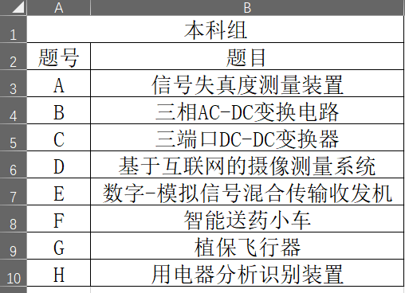
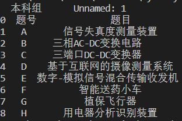
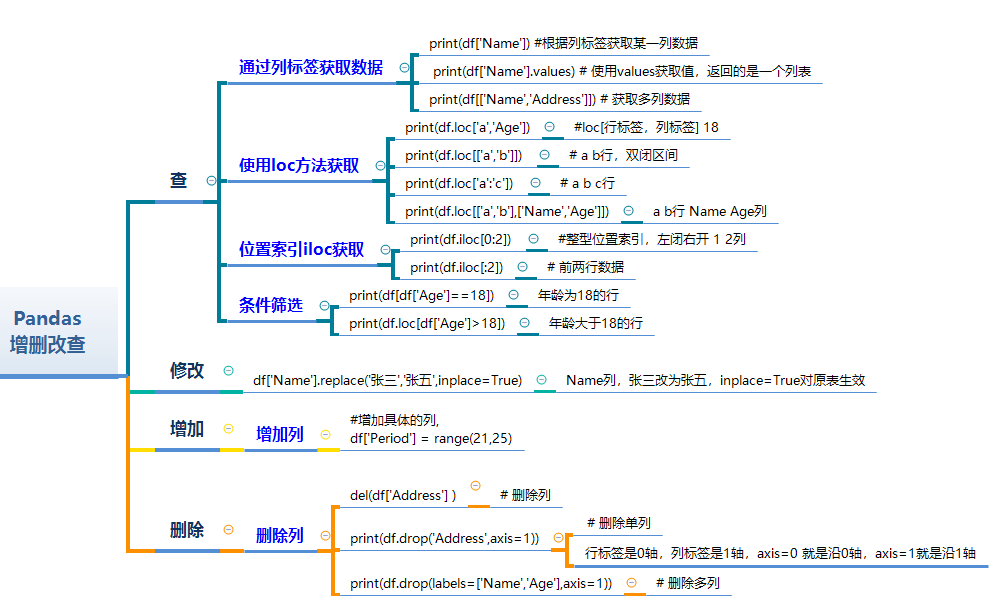

# panads简介
pandas是基于Numpy创建的Python包，内置了大量标准函数，能够高效地解决数据分析数据处理和分析任务，pandas支持多种文件的操作，比如Excel，csv，json，txt 文件等，读取文件之后，就可以对数据进行各种清洗、分析操作了。


## padas和excel中数据结构的对应关系
|pandas|excel|
|------------|---------------|
|DataFrame|工作表（Worksheet）|
|Series|列（Column）|
|index|行号（row index）|
|Row|行（Row）|
|NaN|空单元格（empty cell）|

### DataFrame
Pandas 中的 DataFrame 类似于 Excel 工作表，虽然 Excel 工作簿可以包含多个工作表，但 Pandas DataFrame 独立存在的。

### Series
序列是表示 DataFrame 的一列的数据结构,类似于引用电子表格的列。

### Index
每个 DataFrame 和 Series 都有一个索引，它们是数据行上的标签。在 Pandas 中，如果未指定索引，则默认使用 RangeIndex（第一行 = 0，第二行 = 1，依此类推），类似于电子表格中的每行开始的数字。 在 Pandas 中，索引可以设置为一个（或多个）唯一值，这就像在工作表中有一列用作行标识符一样，这些索引值可用于引用行。索引值是持久的，所以对 DataFrame 中的行重新排序，特定行的标签不会改变。

# pandas读取excel
pandas读取文件之后，将内容存储为DataFrame，然后就可以调用内置的各种函数进行分析处理。

pandas对xlrd等模块进行了封装，可以很方便的处理excel文件，支持xls和xlsx等格式，需要提前安装模块pip install openpyxl 
## read_excel
```py
pandas.read_excel(filename, sep, header,encoding)
```

参数解释

- **filename：**文件路径，可以设置为绝对路径或相对路径
- **sep：**分隔符，常用的有逗号 , 分隔、\t 分隔，默认逗号分隔，read_table默认是'\t'(也就是tab)切割数据集的
- **header：**指定表头，即列名，默认第一行，header = None, 没有表头，全部为数据内容
- **encoding：**文件编码方式，不设置此选项， Pandas 默认使用 UTF-8 来解码。
- **index_col** ，指定索引对应的列为数据框的行标签，默认 Pandas 会从 0、1、2、3 做自然排序分配给各条记录。
- 通过names=['a','b','c']可以自己设置列标题

##  read_table()
可以读取Excel中的数据表，并指定分隔符（如制表符或逗号）。
```py
pd.read_table('data.xlsx', sheet_name='Sheet1', delimiter='\t', header=0)
```

- 'data.xlsx'是Excel文件的路径。
- sheet_name='Sheet1'表示要读取的工作表名为’Sheet1’。
- delimiter='\t'指定数据表中的分隔符为制表符（‘\t’）。
- header=0表示将文件中的第0行作为列名。

##  例子

```py
import pandas as pd
result = pd.read_excel(r"E:\2021竞赛题目列表（本科）.xlsx")
print(result)
```
# 创建Excel
```py
import pandas as pd

# 创建数据框
data = {'Name': ['Tom', 'Jerry', 'Mickey', 'Donald'],
        'Age': [20, 25, 22, 28],
        'Gender': ['M', 'M', 'M', 'M']}
df = pd.DataFrame(data)


# 保存数据框到 Excel 文件
df.to_excel('example.xlsx', index=False)
```


**效果**

# 常用操作合集
