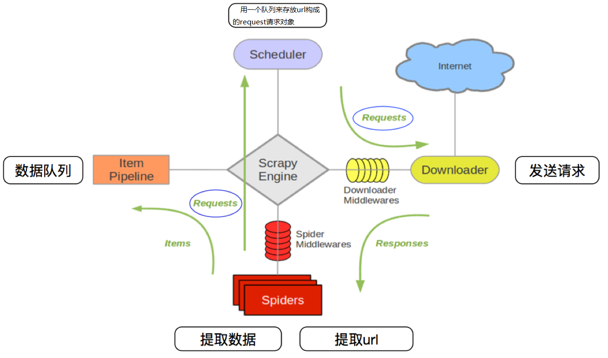

#必到模块
1 requests（发起请求）
2 bs4（依赖lxml模块）快速提取标签内容  BeautifulSoup
3 tqdm（进度条模块）
##request
### response.text 和response.content的区别
 - response.text
   - 类型：str
   - 解码类型： requests模块自动根据HTTP 头部对响应的编码作出有根据的推测，推测的文本编码
 - response.content
   - 类型：bytes
   - 解码类型： 没有指定
### response响应对象的其它常用属性或方法

> `response = requests.get(url)`中response是发送请求获取的响应对象；response响应对象中除了text、content获取响应内容以外还有其它常用的属性或方法：

- `response.url`响应的url；有时候响应的url和请求的url并不一致
- `response.status_code` 响应状态码
- `response.request.headers` 响应对应的请求头
- `response.headers` 响应头
- `response.request._cookies` 响应对应请求的cookie；返回cookieJar类型
- `response.cookies` 响应的cookie（经过了set-cookie动作；返回cookieJar类型
- `response.json()`自动将json字符串类型的响应内容转换为python对象（dict or list）
### 发送带参数的请求

> 我们在使用百度搜索的时候经常发现url地址中会有一个 `?`，那么该问号后边的就是请求参数，又叫做查询字符串

####  在url携带参数

直接对含有参数的url发起请求

```python
import requests

headers = {"User-Agent": "Mozilla/5.0 (Windows NT 10.0; Win64; x64) AppleWebKit/537.36 (KHTML, like Gecko) Chrome/54.0.2840.99 Safari/537.36"}

url = 'https://www.baidu.com/s?wd=python'

response = requests.get(url, headers=headers)

```

### 通过params携带参数字典

​	1.构建请求参数字典

​	2.向接口发送请求的时候带上参数字典，参数字典设置给params

```python
import requests

headers = {"User-Agent": "Mozilla/5.0 (Windows NT 10.0; Win64; x64) AppleWebKit/537.36 (KHTML, like Gecko) Chrome/54.0.2840.99 Safari/537.36"}

# 这是目标url
# url = 'https://www.baidu.com/s?wd=python'

# 最后有没有问号结果都一样
url = 'https://www.baidu.com/s?'

# 请求参数是一个字典 即wd=python
kw = {'wd': 'python'}

# 带上请求参数发起请求，获取响应
response = requests.get(url, headers=headers, params=kw)

print(response.content)
```

------
###  cookieJar对象转换为cookies字典的方法

> 使用requests获取的resposne对象，具有cookies属性。该属性值是一个cookieJar类型，包含了对方服务器设置在本地的cookie。我们如何将其转换为cookies字典呢？

1. 转换方法

   `cookies_dict = requests.utils.dict_from_cookiejar(response.cookies)`

2. 其中response.cookies返回的就是cookieJar类型的对象
3. `requests.utils.dict_from_cookiejar`函数返回cookies字典

----
### 超时参数timeout的使用果。
>
>在爬虫中，一个请求很久没有结果，就会让整个项目的效率变得非常低，这个时候我们就需要对请求进行强制要求，让他必须在特定的时间内返回结果，否则就报错。

1. 超时参数timeout的使用方法

   `response = requests.get(url, timeout=3)`

2. timeout=3表示：发送请求后，3秒钟内返回响应，否则就抛出异常

```python
import requests


url = 'https://twitter.com'
response = requests.get(url, timeout=3)     # 设置超时时间

```

----
## 了解代理以及proxy代理参数的使用

> proxy代理参数通过指定代理ip，让代理ip对应的正向代理服务器转发我们发送的请求，那么我们首先来了解一下代理ip以及代理服务器

#### 理解使用代理的过程

1. 代理ip是一个ip，指向的是一个代理服务器
2. 代理服务器能够帮我们向目标服务器转发请求

####  正向代理和反向代理的区别

> 前边提到proxy参数指定的代理ip指向的是正向的代理服务器，那么相应的就有反向服务器；现在来了解一下正向代理服务器和反向代理服务器的区别

1. 从发送请求的一方的角度，来区分正向或反向代理
2. 为浏览器或客户端（发送请求的一方）转发请求的，叫做正向代理
   - 浏览器知道最终处理请求的服务器的真实ip地址，例如VPN
3. 不为浏览器或客户端（发送请求的一方）转发请求、而是为最终处理请求的服务器转发请求的，叫做反向代理
   - 浏览器不知道服务器的真实地址，例如nginx

####  代理ip（代理服务器）的分类

1. 根据代理ip的匿名程度，代理IP可以分为下面三类：

   - 透明代理(Transparent Proxy)：透明代理虽然可以直接“隐藏”你的IP地址，但是还是可以查到你是谁。目标服务器接收到的请求头如下：

     ```
     REMOTE_ADDR = Proxy IP
     HTTP_VIA = Proxy IP
     HTTP_X_FORWARDED_FOR = Your IP
     ```

   - 匿名代理(Anonymous Proxy)：使用匿名代理，别人只能知道你用了代理，无法知道你是谁。目标服务器接收到的请求头如下：

     ```
     REMOTE_ADDR = proxy IP
     HTTP_VIA = proxy IP
     HTTP_X_FORWARDED_FOR = proxy IP
     ```

   - 高匿代理(Elite proxy或High Anonymity Proxy)：高匿代理让别人根本无法发现你是在用代理，所以是最好的选择。**毫无疑问使用高匿代理效果最好**。目标服务器接收到的请求头如下：

     ```
     REMOTE_ADDR = Proxy IP
     HTTP_VIA = not determined
     HTTP_X_FORWARDED_FOR = not determined
     ```

2. 根据网站所使用的协议不同，需要使用相应协议的代理服务。从代理服务请求使用的协议可以分为：
   - http代理：目标url为http协议
   - https代理：目标url为https协议
   - socks隧道代理（例如socks5代理）等：
     1. socks 代理只是简单地传递数据包，不关心是何种应用协议（FTP、HTTP和HTTPS等）。
     2. socks 代理比http、https代理耗时少。
     3. socks 代理可以转发http和https的请求

####  proxies代理参数的使用

> 为了让服务器以为不是同一个客户端在请求；为了防止频繁向一个域名发送请求被封ip，所以我们需要使用代理ip；那么我们接下来要学习requests模块是如何使用代理ip的

- 用法：

  ```python
  response = requests.get(url, proxies=proxies)
  ```

- proxies的形式：字典

- 例如：

  ```python
  proxies = { 
      "http": "http://12.34.56.79:9527", 
      "https": "https://12.34.56.79:9527", 
  }
  ```

- 注意：如果proxies字典中包含有多个键值对，发送请求时将按照url地址的协议来选择使用相应的代理ip

----

##### 知识点：掌握 代理ip参数proxies的使用

----


## 使用verify参数忽略CA证书

> 在使用浏览器上网的时候，有时能够看到下面的提示（2018年10月之前的12306网站）：
- 原因：该网站的CA证书没有经过【受信任的根证书颁发机构】的认证
- **[关于CA证书以及受信任的根证书颁发机构点击了解更多](https://blog.csdn.net/yangyuge1987/article/details/79209473/)**，课上我们不做展开

#### 运行代码查看代码中向不安全的链接发起请求的效果

> 运行下面的代码将会抛出包含`ssl.CertificateError ...`字样的异常

```python
import requests
url = "https://sam.huat.edu.cn:8443/selfservice/"
response = requests.get(url)
```

####  解决方案

> 为了在代码中能够正常的请求，我们使用`verify=False`参数，此时requests模块发送请求将不做CA证书的验证：verify参数能够忽略CA证书的认证

```python
import requests
url = "https://sam.huat.edu.cn:8443/selfservice/" 
response = requests.get(url,verify=False)
```
##  requests模块发送post请求
>
> 1. 登录注册（ 在web工程师看来POST 比 GET 更安全，url地址中不会暴露用户的账号密码等信息）
> 2. 需要传输大文本内容的时候（ POST 请求对数据长度没有要求）
>
> 所以同样的，我们的爬虫也需要在这两个地方回去模拟浏览器发送post请求

####  代码实现

> 了解requests模块发送post请求的方法，以及分析过移动端的百度翻译之后，我们来完成代码

```python
import requests
import json


class King(object):

    def __init__(self, word):
        self.url = "http://fy.iciba.com/ajax.php?a=fy"
        self.word = word
        self.headers = {
            "User-Agent": "Mozilla/5.0 (Macintosh; Intel Mac OS X 10_12_6) AppleWebKit/537.36 (KHTML, like Gecko) Chrome/71.0.3578.98 Safari/537.36"
        }
        self.post_data = {
            "f": "auto",
            "t": "auto",
            "w": self.word
        }

    def get_data(self):
        response = requests.post(self.url, headers=self.headers, data=self.post_data)
        # 默认返回bytes类型，除非确定外部调用使用str才进行解码操作
        return response.content

    def parse_data(self, data):

        # 将json数据转换成python字典
        dict_data = json.loads(data)

        # 从字典中抽取翻译结果
        try:
            print(dict_data['content']['out'])
        except:
            print(dict_data['content']['word_mean'][0])

    def run(self):
        # url
        # headers
        # post——data
        # 发送请求
        data = self.get_data()
        # 解析
        self.parse_data(data)

if __name__ == '__main__':
    # king = King("人生苦短，及时行乐")
    king = King("China")
    king.run()
    # python标准库有很多有用的方法，每天看一个标准库的使用
```
# 数据提取-jsonpath模块

##  jsonpath模块的使用场景

> 如果有一个多层嵌套的复杂字典，想要根据key和下标来批量提取value，这是比较困难的。jsonpath模块就能解决这个痛点，接下来我们就来学习jsonpath模块

##  jsonpath模块的使用方法

###  jsonpath模块的安装

> jsonpath是第三方模块，需要额外安装

`pip install jsonpath`

###  jsonpath模块提取数据的方法

```
from jsonpath import jsonpath
ret = jsonpath(a, 'jsonpath语法规则字符串')
```

### 2.3 jsonpath语法规则


####  jsonpath使用示例

```
book_dict = { 
  "store": {
    "book": [ 
      { "category": "reference",
        "author": "Nigel Rees",
        "title": "Sayings of the Century",
        "price": 8.95
      },
      { "category": "fiction",
        "author": "Evelyn Waugh",
        "title": "Sword of Honour",
        "price": 12.99
      },
      { "category": "fiction",
        "author": "Herman Melville",
        "title": "Moby Dick",
        "isbn": "0-553-21311-3",
        "price": 8.99
      },
      { "category": "fiction",
        "author": "J. R. R. Tolkien",
        "title": "The Lord of the Rings",
        "isbn": "0-395-19395-8",
        "price": 22.99
      }
    ],
    "bicycle": {
      "color": "red",
      "price": 19.95
    }
  }
}

from jsonpath import jsonpath

print(jsonpath(book_dict, '$..author')) # 如果取不到将返回False # 返回列表，如果取不到将返回False
```

# 数据提取-lxml模块
## 1. 了解 lxml模块和xpath语法

> 对html或xml形式的文本提取特定的内容，就需要我们掌握lxml模块的使用和xpath语法。

- lxml模块可以利用XPath规则语法，来快速的定位HTML\XML 文档中特定元素以及获取节点信息（文本内容、属性值）
- XPath (XML Path Language) 是一门在 HTML\XML 文档中查找信息的**语言**，可用来在 HTML\XML 文档中对**元素和属性进行遍历**。
  - W3School官方文档：<http://www.w3school.com.cn/xpath/index.asp>
- 提取xml、html中的数据需要lxml模块和xpath语法配合使用

## xpath的节点关系

> 学习xpath语法需要先了解xpath中的节点关系

###  xpath中的节点是什么

> 每个html、xml的标签我们都称之为节点，其中最顶层的节点称为根节点。我们以xml为例，html也是一样的


### 3.2 xpath中节点的关系


**`author`是`title`的第一个兄弟节点**
##  xpath语法-基础节点选择语法

> 1. XPath 使用路径表达式来选取 XML 文档中的节点或者节点集。
> 2. 这些路径表达式和我们在常规的**电脑文件系统中看到的表达式**非常相似。
> 3. **使用chrome插件选择标签时候，选中时，选中的标签会添加属性class="xh-highlight"**

### 4.1 xpath定位节点以及提取属性或文本内容的语法

| 表达式   | 描述                                                       |
| -------- | ---------------------------------------------------------- |
| nodename | 选中该元素。                                               |
| /        | 从根节点选取、或者是元素和元素间的过渡。                   |
| //       | 从匹配选择的当前节点选择文档中的节点，而不考虑它们的位置。 |
| .        | 选取当前节点。                                             |
| ..       | 选取当前节点的父节点。                                     |
| @        | 选取属性。                                                 |
| text()   | 选取文本。                                                 |


### 4.2 语法练习

> 接下来我们通过itcast的页面来练习上述语法：http://www.itcast.cn/

- 选择所有的h2下的文本
  - `//h2/text()`
- 获取所有的a标签的href
  - `//a/@href`
- 获取html下的head下的title的文本
  - `/html/head/title/text()`
- 获取html下的head下的link标签的href
  - `/html/head/link/@href`
##  xpath语法-节点修饰语法

> 可以根据标签的属性值、下标等来获取特定的节点

###  节点修饰语法

| 路径表达式                          | 结果                                                         |
| ----------------------------------- | ------------------------------------------------------------ |
| //title[@lang="eng"]                | 选择lang属性值为eng的所有title元素                           |
| /bookstore/book[1]                  | 选取属于 bookstore 子元素的第一个 book 元素。                |
| /bookstore/book[last()]             | 选取属于 bookstore 子元素的最后一个 book 元素。              |
| /bookstore/book[last()-1]           | 选取属于 bookstore 子元素的倒数第二个 book 元素。            |
| /bookstore/book[position()>1]       | 选择bookstore下面的book元素，从第二个开始选择                |
| //book/title[text()='Harry Potter'] | 选择所有book下的title元素，仅仅选择文本为Harry Potter的title元素 |
| /bookstore/book[price>35.00]/title  | 选取 bookstore 元素中的 book 元素的所有 title 元素，且其中的 price 元素的值须大于 35.00。 |

###  关于xpath的下标

- 在xpath中，第一个元素的位置是1
- 最后一个元素的位置是last()
- 倒数第二个是last()-1

###  语法练习

> 从itcast的页面中，选择所有学科的名称、第一个学科的链接、最后一个学科的链接：http://www.itcast.cn/

- 所有的学科的名称
  - `//div[@class="nav_txt"]//a[@class="a_gd"]`
- 第一个学科的链接
  - `//div[@class="nav_txt"]/ul/li[1]/a/@href`
- 最后一个学科的链接
  - `//div[@class="nav_txt"]/ul/li[last()]/a/@href`
##  xpath语法-其他常用节点选择语法

> 可以通过**通配符**来选取未知的html、xml的元素

###  选取未知节点的语法

| 通配符 | 描述                 |
| ------ | -------------------- |
| *      | 匹配任何元素节点。   |
| node() | 匹配任何类型的节点。 |

### 6.2 语法练习

> 从itcast的页面中 http://www.itcast.cn/ ，选中全部的标签、全部的属性

- 全部的标签
  - `//*`
- 全部的属性
  - `//node()`
## lxml模块的安装与使用示例

> lxml模块是一个第三方模块，安装之后使用

###  lxml模块的安装

```
pip/pip3 install lxml
```
###   爬虫对html提取的内容

- 提取标签中的**文本内容**
- 提取标签中的**属性的值**
  - 比如，提取a标签中href属性的值，获取url，进而继续发起请求

###  lxml模块的使用

1. 导入lxml 的 etree 库

   `from lxml import etree`

2. 利用etree.HTML，将html字符串（bytes类型或str类型）转化为Element对象，Element对象具有xpath的方法，返回结果的列表

   ```python
   html = etree.HTML(text) 
   ret_list = html.xpath("xpath语法规则字符串")
   ```

3. xpath方法返回列表的三种情况
   - 返回空列表：根据xpath语法规则字符串，没有定位到任何元素
   - 返回由字符串构成的列表：xpath字符串规则匹配的一定是文本内容或某属性的值
   - 返回由Element对象构成的列表：xpath规则字符串匹配的是标签，列表中的Element对象可以继续进行xpath

###  lxml模块使用示例

> 运行下面的代码，查看打印的结果

```python
from lxml import etree
text = ''' 
<div> 
  <ul> 
    <li class="item-1">
      <a href="link1.html">first item</a>
    </li> 
    <li class="item-1">
      <a href="link2.html">second item</a>
    </li> 
    <li class="item-inactive">
      <a href="link3.html">third item</a>
    </li> 
    <li class="item-1">
      <a href="link4.html">fourth item</a>
    </li> 
    <li class="item-0">
      a href="link5.html">fifth item</a>
  </ul> 
</div>
'''

html = etree.HTML(text)

#获取href的列表和title的列表
href_list = html.xpath("//li[@class='item-1']/a/@href")
title_list = html.xpath("//li[@class='item-1']/a/text()")

#组装成字典
for href in href_list:
    item = {}
    item["href"] = href
    item["title"] = title_list[href_list.index(href)]
    print(item)
```

------
###  selenium运行效果展示
> Selenium是一个Web的自动化测试工具，最初是为网站自动化测试而开发的，Selenium 可以直接调用浏览器，它支持所有主流的浏览器（包括PhantomJS这些无界面的浏览器），可以接收指令，让浏览器自动加载页面，获取需要的数据，甚至页面截屏等。我们可以使用selenium很容易完成之前编写的爬虫，接下来我们就来看一下selenium的运行效果
####  chrome浏览器的运行效果
> 在下载好chromedriver以及安装好selenium模块后，执行下列代码并观察运行的过程
```python
from selenium import webdriver 

# 如果driver没有添加到了环境变量，则需要将driver的绝对路径赋值给executable_path参数
# driver = webdriver.Chrome(executable_path='/home/worker/Desktop/driver/chromedriver')

# 如果driver添加了环境变量则不需要设置executable_path
driver = webdriver.Chrome()

# 向一个url发起请求
driver.get("http://www.itcast.cn/")

# 把网页保存为图片，69版本以上的谷歌浏览器将无法使用截图功能
# driver.save_screenshot("itcast.png")

print(driver.title) # 打印页面的标题

# 退出模拟浏览器
driver.quit() # 一定要退出！不退出会有残留进程！
```
####  phantomjs无界面浏览器的运行效果

> PhantomJS 是一个基于Webkit的“无界面”(headless)浏览器，它会把网站加载到内存并执行页面上的 JavaScript。下载地址：<http://phantomjs.org/download.html>

```python
from selenium import webdriver 

# 指定driver的绝对路径
driver = webdriver.PhantomJS(executable_path='/home/worker/Desktop/driver/phantomjs') 
# driver = webdriver.Chrome(executable_path='/home/worker/Desktop/driver/chromedriver')

# 向一个url发起请求
driver.get("http://www.itcast.cn/")

# 把网页保存为图片
driver.save_screenshot("itcast.png")

# 退出模拟浏览器
driver.quit() # 一定要退出！不退出会有残留进程！
```

####  观察运行效果

- python代码能够自动的调用谷歌浏览或phantomjs无界面浏览器，控制其自动访问网站
####  无头浏览器与有头浏览器的使用场景

- 通常在开发过程中我们需要查看运行过程中的各种情况所以通常使用有头浏览器
- 在项目完成进行部署的时候，通常平台采用的系统都是服务器版的操作系统，服务器版的操作系统必须使用无头浏览器才能正常运行


###  selenium的作用和工作原理

> 利用浏览器原生的API，封装成一套更加面向对象的Selenium WebDriver API，直接操作浏览器页面里的元素，甚至操作浏览器本身（截屏，窗口大小，启动，关闭，安装插件，配置证书之类的）


- webdriver本质是一个web-server，对外提供webapi，其中封装了浏览器的各种功能
- 不同的浏览器使用各自不同的webdriver
###  selenium的简单使用

> 接下来我们就通过代码来模拟百度搜索

```python
import time
from selenium import webdriver

# 通过指定chromedriver的路径来实例化driver对象，chromedriver放在当前目录。
# driver = webdriver.Chrome(executable_path='./chromedriver')
# chromedriver已经添加环境变量
driver = webdriver.Chrome()

# 控制浏览器访问url地址
driver.get("https://www.baidu.com/")

# 在百度搜索框中搜索'python'
driver.find_element_by_id('kw').send_keys('python')
# 点击'百度搜索'
driver.find_element_by_id('su').click()

time.sleep(6)
# 退出浏览器
driver.quit()
```

- `webdriver.Chrome(executable_path='./chromedriver')`中executable参数指定的是下载好的chromedriver文件的路径
- `driver.find_element_by_id('kw').send_keys('python')`定位id属性值是'kw'的标签，并向其中输入字符串'python'
- `driver.find_element_by_id('su').click()`定位id属性值是su的标签，并点击
  - click函数作用是：触发标签的js的click事件
## selenium提取数据
###  driver对象的常用属性和方法

> 在使用selenium过程中，实例化driver对象后，driver对象有一些常用的属性和方法

1. `driver.page_source` 当前标签页浏览器渲染之后的网页源代码
2. `driver.current_url` 当前标签页的url
3. `driver.close()` 关闭当前标签页，如果只有一个标签页则关闭整个浏览器
4. `driver.quit()` 关闭浏览器
5. `driver.forward()` 页面前进
6. `driver.back()` 页面后退
7. `driver.screen_shot(img_name)` 页面截图
### 2. driver对象定位标签元素获取标签对象的方法

> 在selenium中可以通过多种方式来定位标签，返回标签元素对象

```python
find_element_by_id 						(返回一个元素)
find_element(s)_by_class_name 			(根据类名获取元素列表)
find_element(s)_by_name 				(根据标签的name属性值返回包含标签对象元素的列表)
find_element(s)_by_xpath 				(返回一个包含元素的列表)
find_element(s)_by_link_text 			(根据连接文本获取元素列表)
find_element(s)_by_partial_link_text 	(根据链接包含的文本获取元素列表)
find_element(s)_by_tag_name 			(根据标签名获取元素列表)
find_element(s)_by_css_selector 		(根据css选择器来获取元素列表)
```

- 注意：
  - find_element和find_elements的区别：
    - 多了个s就返回列表，没有s就返回匹配到的第一个标签对象
    - find_element匹配不到就抛出异常，find_elements匹配不到就返回空列表
  - by_link_text和by_partial_link_tex的区别：全部文本和包含某个文本
  - 以上函数的使用方法
    - `driver.find_element_by_id('id_str')`

----
###   标签对象提取文本内容和属性值

> find_element仅仅能够获取元素，不能够直接获取其中的数据，如果需要获取数据需要使用以下方法

- 对元素执行点击操作`element.click()`

  - 对定位到的标签对象进行点击操作

- 向输入框输入数据`element.send_keys(data)`

  - 对定位到的标签对象输入数据

- 获取文本`element.text`

  - 通过定位获取的标签对象的`text`属性，获取文本内容

- 获取属性值`element.get_attribute("属性名")`

  - 通过定位获取的标签对象的`get_attribute`函数，传入属性名，来获取属性的值
- 代码实现，如下：
  ```python
  from selenium import webdriver
  
  driver = webdriver.Chrome()
  
  driver.get('http://www.itcast.cn/')
  
  ret = driver.find_elements_by_tag_name('h2')
  print(ret[0].text) # 
  
  ret = driver.find_elements_by_link_text('黑马程序员')
  print(ret[0].get_attribute('href'))
  
  driver.quit()
  ```

## 常见的反爬手段和解决思路

##### 学习目标
1. 了解 服务器反爬的原因
2. 了解 服务器常反什么样的爬虫
3. 了解 反爬虫领域常见的一些概念
4. 了解 反爬的三个方向
5. 了解 常见基于身份识别进行反爬
6. 了解 常见基于爬虫行为进行反爬
7. 了解 常见基于数据加密进行反爬
-----
###  服务器反爬的原因
- 爬虫占总PV(PV是指页面的访问次数，每打开或刷新一次页面，就算做一个pv)比例较高，这样浪费钱（尤其是三月份爬虫）。

    三月份爬虫是个什么概念呢？每年的三月份我们会迎接一次爬虫高峰期，有大量的硕士在写论文的时候会选择爬取一些往网站，并进行舆情分析。因为五月份交论文，所以嘛，大家都是读过书的，你们懂的，前期各种DotA，LOL，到了三月份了，来不及了，赶紧抓数据，四月份分析一下，五月份交论文，就是这么个节奏。

- 公司可免费查询的资源被批量抓走，丧失竞争力，这样少赚钱。

    数据可以在非登录状态下直接被查询。如果强制登陆，那么可以通过封杀账号的方式让对方付出代价，这也是很多网站的做法。但是不强制对方登录。那么如果没有反爬虫，对方就可以批量复制的信息，公司竞争力就会大大减少。竞争对手可以抓到数据，时间长了用户就会知道，只需要去竞争对手那里就可以了，没必要来我们网站，这对我们是不利的。

- 状告爬虫成功的几率小

    爬虫在国内还是个擦边球，就是有可能可以起诉成功，也可能完全无效。所以还是需要用技术手段来做最后的保障。

### 2 服务器常反什么样的爬虫

- 十分低级的应届毕业生

    应届毕业生的爬虫通常简单粗暴，根本不管服务器压力，加上人数不可预测，很容易把站点弄挂。

- 十分低级的创业小公司

    现在的创业公司越来越多，也不知道是被谁忽悠的然后大家创业了发现不知道干什么好，觉得大数据比较热，就开始做大数据。分析程序全写差不多了，发现自己手头没有数据。怎么办？写爬虫爬啊。于是就有了不计其数的小爬虫，出于公司生死存亡的考虑，不断爬取数据。

- 不小心写错了没人去停止的失控小爬虫

    有些网站已经做了相应的反爬，但是爬虫依然孜孜不倦地爬取。什么意思呢？就是说，他们根本爬不到任何数据，除了httpcode是200以外，一切都是不对的，可是爬虫依然不停止这个很可能就是一些托管在某些服务器上的小爬虫，已经无人认领了，依然在辛勤地工作着。

- 成型的商业对手

    这个是最大的对手，他们有技术，有钱，要什么有什么，如果和你死磕，你就只能硬着头皮和他死磕。

- 抽风的搜索引擎

    大家不要以为搜索引擎都是好人，他们也有抽风的时候，而且一抽风就会导致服务器性能下降，请求量跟网络攻击没什么区别。


### 3 反爬虫领域常见的一些概念
因为反爬虫暂时是个较新的领域，因此有些定义要自己下：

- 爬虫：使用任何技术手段，批量获取网站信息的一种方式。关键在于批量。

- 反爬虫：使用任何技术手段，阻止别人批量获取自己网站信息的一种方式。关键也在于批量。

- 误伤：在反爬虫的过程中，错误的将普通用户识别为爬虫。误伤率高的反爬虫策略，效果再好也不能用。

- 拦截：成功地阻止爬虫访问。这里会有拦截率的概念。通常来说，拦截率越高的反爬虫策略，误伤的可能性就越高。因此需要做个权衡。

- 资源：机器成本与人力成本的总和。

这里要切记，人力成本也是资源，而且比机器更重要。因为，根据摩尔定律，机器越来越便宜。而根据IT行业的发展趋势，程序员工资越来越贵。因此，通常服务器反爬就是让爬虫工程师加班才是王道，机器成本并不是特别值钱。


### 4 反爬的三个方向

- 基于身份识别进行反爬
    
- 基于爬虫行为进行反爬

- 基于数据加密进行反爬


### 5 常见基于身份识别进行反爬


#### 1 通过headers字段来反爬
> headers中有很多字段，这些字段都有可能会被对方服务器拿过来进行判断是否为爬虫

1.1 通过headers中的User-Agent字段来反爬
- 反爬原理：爬虫默认情况下没有User-Agent，而是使用模块默认设置
- 解决方法：请求之前添加User-Agent即可；更好的方式是使用User-Agent池来解决（收集一堆User-Agent的方式，或者是随机生成User-Agent）


1.2 通过referer字段或者是其他字段来反爬
- 反爬原理：爬虫默认情况下不会带上referer字段，服务器端通过判断请求发起的源头，以此判断请求是否合法
- 解决方法：添加referer字段

1.3 通过cookie来反爬
- 反爬原因：通过检查cookies来查看发起请求的用户是否具备相应权限，以此来进行反爬
- 解决方案：进行模拟登陆，成功获取cookies之后在进行数据爬取

#### 2 通过请求参数来反爬
> 请求参数的获取方法有很多，向服务器发送请求，很多时候需要携带请求参数，通常服务器端可以通过检查请求参数是否正确来判断是否为爬虫

2.1 通过从html静态文件中获取请求数据(github登录数据)
- 反爬原因：通过增加获取请求参数的难度进行反爬
- 解决方案：仔细分析抓包得到的每一个包，搞清楚请求之间的联系

2.2 通过发送请求获取请求数据
- 反爬原因：通过增加获取请求参数的难度进行反爬
- 解决方案：仔细分析抓包得到的每一个包，搞清楚请求之间的联系，搞清楚请求参数的来源

2.3 通过js生成请求参数
- 反爬原理：js生成了请求参数
- 解决方法：分析js，观察加密的实现过程，通过js2py获取js的执行结果，或者使用selenium来实现

2.4 通过验证码来反爬
- 反爬原理：对方服务器通过弹出验证码强制验证用户浏览行为
- 解决方法：打码平台或者是机器学习的方法识别验证码，其中打码平台廉价易用，更值得推荐

### 6 常见基于爬虫行为进行反爬


#### 1 基于请求频率或总请求数量
> 爬虫的行为与普通用户有着明显的区别，爬虫的请求频率与请求次数要远高于普通用户

1.1 通过请求ip/账号单位时间内总请求数量进行反爬
- 反爬原理：正常浏览器请求网站，速度不会太快，同一个ip/账号大量请求了对方服务器，有更大的可能性会被识别为爬虫
- 解决方法：对应的通过购买高质量的ip的方式能够解决问题/购买个多账号

1.2 通过同一ip/账号请求之间的间隔进行反爬
- 反爬原理：正常人操作浏览器浏览网站，请求之间的时间间隔是随机的，而爬虫前后两个请求之间时间间隔通常比较固定同时时间间隔较短，因此可以用来做反爬
- 解决方法：请求之间进行随机等待，模拟真实用户操作，在添加时间间隔后，为了能够高速获取数据，尽量使用代理池，如果是账号，则将账号请求之间设置随机休眠

1.3 通过对请求ip/账号每天请求次数设置阈值进行反爬
- 反爬原理：正常的浏览行为，其一天的请求次数是有限的，通常超过某一个值，服务器就会拒绝响应
- 解决方法：对应的通过购买高质量的ip的方法/多账号，同时设置请求间随机休眠

#### 2 根据爬取行为进行反爬，通常在爬取步骤上做分析

2.1 通过js实现跳转来反爬
- 反爬原理：js实现页面跳转，无法在源码中获取下一页url
- 解决方法: 多次抓包获取条状url，分析规律

2.2 通过蜜罐(陷阱)获取爬虫ip(或者代理ip)，进行反爬
- 反爬原理：在爬虫获取链接进行请求的过程中，爬虫会根据正则，xpath，css等方式进行后续链接的提取，此时服务器端可以设置一个陷阱url，会被提取规则获取，但是正常用户无法获取，这样就能有效的区分爬虫和正常用户
- 解决方法: 完成爬虫的编写之后，使用代理批量爬取测试/仔细分析响应内容结构，找出页面中存在的陷阱

2.3 通过假数据反爬
- 反爬原理：向返回的响应中添加假数据污染数据库，通常家属剧不会被正常用户看到
- 解决方法: 长期运行，核对数据库中数据同实际页面中数据对应情况，如果存在问题/仔细分析响应内容

2.4 阻塞任务队列
- 反爬原理：通过生成大量垃圾url，从而阻塞任务队列，降低爬虫的实际工作效率
- 解决方法: 观察运行过程中请求响应状态/仔细分析源码获取垃圾url生成规则，对URL进行过滤

2.5 阻塞网络IO
- 反爬原理：发送请求获取响应的过程实际上就是下载的过程，在任务队列中混入一个大文件的url，当爬虫在进行该请求时将会占用网络io，如果是有多线程则会占用线程
- 解决方法: 观察爬虫运行状态/多线程对请求线程计时/发送请求钱

2.6 运维平台综合审计
- 反爬原理：通过运维平台进行综合管理，通常采用复合型反爬虫策略，多种手段同时使用
- 解决方法: 仔细观察分析，长期运行测试目标网站，检查数据采集速度，多方面处理


### 7 常见基于数据加密进行反爬

##### 1 对响应中含有的数据进行特殊化处理
> 通常的特殊化处理主要指的就是css数据偏移/自定义字体/数据加密/数据图片/特殊编码格式等

1.1 通过自定义字体来反爬
下图来自猫眼电影电脑版


- 反爬思路: 使用自有字体文件
- 解决思路：切换到手机版/解析字体文件进行翻译


1.2 通过css来反爬
 下图来自猫眼去哪儿电脑版

 
- 反爬思路：源码数据不为真正数据，需要通过css位移才能产生真正数据
- 解决思路：计算css的偏移

-----

1.3 通过js动态生成数据进行反爬
- 反爬原理：通过js动态生成
- 解决思路：解析关键js，获得数据生成流程，模拟生成数据


1.4 通过数据图片化反爬
- 58同城短租](https://baise.58.com/duanzu/38018718834984x.shtml)
- 解决思路：通过使用图片解析引擎从图片中解析数据

1.5 通过编码格式进行反爬
- 反爬原理: 不适用默认编码格式，在获取响应之后通常爬虫使用utf-8格式进行解码，此时解码结果将会是乱码或者报错
- 解决思路：根据源码进行多格式解码，或者真正的解码格式

## 验证码处理

##### 学习目标
1. 了解 验证码的相关知识
2. 掌握 图片识别引擎的使用
2. 了解 常见的打码平台
3. 掌握 通过打码平台处理验证码的方法

------

### 1.图片验证码
1.1 什么是图片验证码
- 验证码（CAPTCHA）是“Completely Automated Public Turing test to tell Computers and Humans Apart”（全自动区分计算机和人类的图灵测试）的缩写，是一种区分用户是计算机还是人的公共全自动程序。

1.2 验证码的作用
- 防止恶意破解密码、刷票、论坛灌水、刷页。有效防止某个黑客对某一个特定注册用户用特定程序暴力破解方式进行不断的登录尝试，实际上使用验证码是现在很多网站通行的方式（比如招商银行的网上个人银行，百度社区），我们利用比较简易的方式实现了这个功能。虽然登录麻烦一点，但是对网友的密码安全来说这个功能还是很有必要，也很重要。

1.3 图片验证码在爬虫中的使用场景
- 注册
- 登录
- 频繁发送请求时，服务器弹出验证码进行验证

1.4 图片验证码的处理方案
- 手动输入(input)
    这种方法仅限于登录一次就可持续使用的情况
- 图像识别引擎解析
    使用光学识别引擎处理图片中的数据，目前常用于图片数据提取，较少用于验证码处理
- 打码平台
    爬虫常用的验证码解决方案


### 2.图片识别引擎
> OCR（Optical Character Recognition）是指使用扫描仪或数码相机对文本资料进行扫描成图像文件，然后对图像文件进行分析处理，自动识别获取文字信息及版面信息的软件。

#### 2.1 什么是tesseract
- Tesseract，一款由HP实验室开发由Google维护的开源OCR引擎，特点是开源，免费，支持多语言，多平台。
- 项目地址：https://github.com/tesseract-ocr/tesseract   

#### 2.2 图片识别引擎环境的安装

1 引擎的安装
- mac环境下直接执行命令
```
brew install --with-training-tools tesseract
```

- windows环境下的安装
可以通过exe安装包安装，下载地址可以从GitHub项目中的wiki找到。安装完成后记得将Tesseract 执行文件的目录加入到PATH中，方便后续调用。

- linux环境下的安装
```
sudo apt-get install tesseract-ocr
```
    
2 Python库的安装
```
# PIL用于打开图片文件
pip/pip3 install pillow

# pytesseract模块用于从图片中解析数据
pip/pip3 install pytesseract
```


#### 2.3 图片识别引擎的使用
- 通过pytesseract模块的 image_to_string 方法就能将打开的图片文件中的数据提取成字符串数据，具体方法如下

```
from PIL import Image
import pytesseract

im = Image.open()

result = pytesseract.image_to_string(im)

print(result)
```

#### 2.4 图片识别引擎的使用扩展
    
- [tesseract简单使用与训练](https://www.cnblogs.com/cnlian/p/5765871.html)
- 其他ocr平台
```
    微软Azure 图像识别：https://azure.microsoft.com/zh-cn/services/cognitive-services/computer-vision/
    有道智云文字识别：http://aidemo.youdao.com/ocrdemo
    阿里云图文识别：https://www.aliyun.com/product/cdi/
    腾讯OCR文字识别：https://cloud.tencent.com/product/ocr
```

### 3 打码平台

#### 1.为什么需要了解打码平台的使用
现在很多网站都会使用验证码来进行反爬，所以为了能够更好的获取数据，需要了解如何使用打码平台爬虫中的验证码

#### 2 常见的打码平台
1. 云打码：https://zhuce.jfbym.com/demo/
    
    能够解决通用的验证码识别
    
2. 极验验证码智能识别辅助：http://jiyandoc.c2567.com/

    能够解决复杂验证码的识别
    
###### 3.1 云打码官方接口
下面代码是云打码平台提供，做了个简单修改，实现了两个方法：

1. indetify:传入图片的响应二进制数即可
2. indetify_by_filepath:传入图片的路径即可识别

其中需要自己配置的地方是：

```
username = 'whoarewe' # 用户名

password = '***' # 密码

appid = 4283 # appid

appkey = '02074c64f0d0bb9efb2df455537b01c3' # appkey

codetype = 1004 # 验证码类型
```

云打码官方提供的api如下：

```python
#yundama.py
import requests
import json
import time

class YDMHttp:
    apiurl = 'http://api.yundama.com/api.php'
    username = ''
    password = ''
    appid = ''
    appkey = ''

    def __init__(self, username, password, appid, appkey):
        self.username = username
        self.password = password
        self.appid = str(appid)
        self.appkey = appkey

    def request(self, fields, files=[]):
        response = self.post_url(self.apiurl, fields, files)
        response = json.loads(response)
        return response

    def balance(self):
        data = {'method': 'balance', 'username': self.username, 'password': self.password, 'appid': self.appid,
                'appkey': self.appkey}
        response = self.request(data)
        if (response):
            if (response['ret'] and response['ret'] < 0):
                return response['ret']
            else:
                return response['balance']
        else:
            return -9001

    def login(self):
        data = {'method': 'login', 'username': self.username, 'password': self.password, 'appid': self.appid,
                'appkey': self.appkey}
        response = self.request(data)
        if (response):
            if (response['ret'] and response['ret'] < 0):
                return response['ret']
            else:
                return response['uid']
        else:
            return -9001

    def upload(self, filename, codetype, timeout):
        data = {'method': 'upload', 'username': self.username, 'password': self.password, 'appid': self.appid,
                'appkey': self.appkey, 'codetype': str(codetype), 'timeout': str(timeout)}
        file = {'file': filename}
        response = self.request(data, file)
        if (response):
            if (response['ret'] and response['ret'] < 0):
                return response['ret']
            else:
                return response['cid']
        else:
            return -9001

    def result(self, cid):
        data = {'method': 'result', 'username': self.username, 'password': self.password, 'appid': self.appid,
                'appkey': self.appkey, 'cid': str(cid)}
        response = self.request(data)
        return response and response['text'] or ''

    def decode(self, filename, codetype, timeout):
        cid = self.upload(filename, codetype, timeout)
        if (cid > 0):
            for i in range(0, timeout):
                result = self.result(cid)
                if (result != ''):
                    return cid, result
                else:
                    time.sleep(1)
            return -3003, ''
        else:
            return cid, ''

    def post_url(self, url, fields, files=[]):
        # for key in files:
        #     files[key] = open(files[key], 'rb');
        res = requests.post(url, files=files, data=fields)
        return res.text 
        
username = 'whoarewe' # 用户名

password = '***' # 密码

appid = 4283 # appid

appkey = '02074c64f0d0bb9efb2df455537b01c3' # appkey

filename = 'getimage.jpg' # 文件位置

codetype = 1004 # 验证码类型

# 超时
timeout = 60

def indetify(response_content):
    if (username == 'username'):
        print('请设置好相关参数再测试')
    else:
        # 初始化
        yundama = YDMHttp(username, password, appid, appkey)

        # 登陆云打码
        uid = yundama.login();
        print('uid: %s' % uid)

        # 查询余额
        balance = yundama.balance();
        print('balance: %s' % balance)

        # 开始识别，图片路径，验证码类型ID，超时时间（秒），识别结果
        cid, result = yundama.decode(response_content, codetype, timeout)
        print('cid: %s, result: %s' % (cid, result))
        return result

def indetify_by_filepath(file_path):
    if (username == 'username'):
        print('请设置好相关参数再测试')
    else:
        # 初始化
        yundama = YDMHttp(username, password, appid, appkey)

        # 登陆云打码
        uid = yundama.login();
        print('uid: %s' % uid)

        # 查询余额
        balance = yundama.balance();
        print('balance: %s' % balance)

        # 开始识别，图片路径，验证码类型ID，超时时间（秒），识别结果
        cid, result = yundama.decode(file_path, codetype, timeout)
        print('cid: %s, result: %s' % (cid, result))
        return result

if __name__ == '__main__':
    pass
```
### 4 常见的验证码的种类
##### 4.1 url地址不变，验证码不变
这是验证码里面非常简单的一种类型，对应的只需要获取验证码的地址，然后请求，通过打码平台识别即可

##### 4.2 url地址不变，验证码变化
这种验证码的类型是更加常见的一种类型，对于这种验证码，大家需要思考：
>在登录的过程中，假设我输入的验证码是对的，对方服务器是如何判断当前我输入的验证码是显示在我屏幕上的验证码，而不是其他的验证码呢？

在获取网页的时候，请求验证码，以及提交验证码的时候，对方服务器肯定通过了某种手段验证我之前获取的验证码和最后提交的验证码是同一个验证码，那这个手段是什么手段呢？

很明显，就是通过cookie来实现的，所以对应的，在请求页面，请求验证码，提交验证码的到时候需要保证cookie的一致性，对此可以使用requests.session来解决

-----
## JS的解析

##### 学习目标：
1. 了解 定位js的方法
2. 了解 添加断点观察js的执行过程的方法
3. 应用 js2py获取js的方法

### 1 确定js的位置
> 对于前面人人网的案例，我们知道了url地址中有部分参数，但是参数是如何生成的呢？

毫无疑问，参数肯定是js生成的，那么如何获取这些参数的规律呢？通过下面的学习来了解

##### 1.1 观察按钮的绑定js事件


通过点击按钮，然后点击`Event Listener`，部分网站可以找到绑定的事件，对应的，只需要点击即可跳转到js的位置

##### 1.2 通过search all file 来搜索
部分网站的按钮可能并没有绑定js事件监听，那么这个时候可以通过搜索请求中的关键字来找到js的位置，比如`livecell`


点击美化输出选项


可以继续在其中搜索关键字


### 2 观察js的执行过程
找到js的位置之后，我们可以来通过观察js的位置，找到js具体在如何执行，后续我们可以通过python程序来模拟js的执行，或者是使用类似`js2py`直接把js代码转化为python程序去执行

观察js的执行过程最简单的方式是添加断点


添加断点的方式：在左边行号点击即可添加，对应的右边BreakPoints中会出现现有的所有断点

添加断点之后继续点击登录，每次程序在断点位置都会停止，通过如果该行有变量产生，都会把变量的结果展示在Scoope中

在上图的右上角有1，2，3三个功能，分别表示：
    - 1：继续执行到下一个断点
    - 2：进入调用的函数中
    - 3：从调用的函数中跳出来

### 3 js2py的使用
> 在知道了js如何生成我们想要的数据之后，那么接下来我们就需要使用程序获取js执行之后的结果了

##### 3.1 js2py的介绍
js2py是一个js的翻译工具，也是一个通过纯python实现的js的解释器，[github上源码与示例](https://github.com/PiotrDabkowski/Js2Py)

##### 3.2 js的执行思路
js的执行方式大致分为两种：

1. 在了解了js内容和执行顺序之后，通过python来完成js的执行过程，得到结果
2. 在了解了js内容和执行顺序之后，使用类似js2py的模块来执js代码，得到结果

但是在使用python程序实现js的执行时候，需要观察的js的每一个步骤，非常麻烦，所以更多的时候我们会选择使用类似js2py的模块去执行js，接下来我们来使用js2py实现人人网登录参数的获取

##### 3.3 具体的实现
定位进行登录js代码

```js
formSubmit: function() {
        var e, t = {};
        $(".login").addEventListener("click", function() {
            t.phoneNum = $(".phonenum").value,
            t.password = $(".password").value,
            e = loginValidate(t),
            t.c1 = c1 || 0,
            e.flag ? ajaxFunc("get", "http://activity.renren.com/livecell/rKey", "", function(e) {
                var n = JSON.parse(e).data;
                if (0 == n.code) {
                    t.password = t.password.split("").reverse().join(""),
                    setMaxDigits(130);
                    var o = new RSAKeyPair(n.e,"",n.n)
                      , r = encryptedString(o, t.password);
                    t.password = r,
                    t.rKey = n.rkey
                } else
                    toast("公钥获取失败"),
                    t.rKey = "";
                ajaxFunc("post", "http://activity.renren.com/livecell/ajax/clog", t, function(e) {
                    var e = JSON.parse(e).logInfo;
                    0 == e.code ? location.href = localStorage.getItem("url") || "" : toast(e.msg || "登录出错")
                })
            }) : toast(e.msg)
        })
    }
```

##### 从代码中我们知道:

1. 我们要登录需要对密码进行加密和获取rkey字段的值
2. rkey字段的值我们直接发送请求rkey请求就可以获得
3. 密码是先反转然后使用RSA进行加密, js代码很复杂, 我们希望能通过在python中执行js来实现


##### 实现思路:
1. 使用session发送rKey获取登录需要信息
    - url: http://activity.renren.com/livecell/rKey
    - 方法: get
2. 根据获取信息对密码进行加密
    2.1 准备用户名和密码
    
    2.2 使用js2py生成js的执行环境:context
    
    2.3 拷贝使用到js文件的内容到本项目中
    
    2.4 读取js文件的内容,使用context来执行它们
    
    2.5 向context环境中添加需要数据
    
    2.6 使用context执行加密密码的js字符串
    
    2.7 通过context获取加密后密码信息
    
3. 使用session发送登录请求
    - URL: http://activity.renren.com/livecell/ajax/clog
    - 请求方法: POST
    - 数据: 
      
        ```
        phoneNum: xxxxxxx
        password: (加密后生产的)
        c1: 0
        rKey: rkey请求获取的
        ```

##### 具体代码

需要提前下载几个js文件到本地：

> BigInt.js

> RSA.js

> Barrett.js

```python
import requests
import json
import js2py

# - 实现思路:
#   - 使用session发送rKey获取登录需要信息
#     - url: http://activity.renren.com/livecell/rKey
#     - 方法: get
#  获取session对象
session = requests.session()
headers = {
    "User-Agent": "Mozilla/5.0 (Linux; Android 5.0; SM-G900P Build/LRX21T) AppleWebKit/537.36 (KHTML, like Gecko) Chrome/66.0.3359.139 Mobile Safari/537.36",
    "X-Requested-With": "XMLHttpRequest",
    "Content-Type":"application/x-www-form-urlencoded"
}
# 设置session的请求头信息
session.headers = headers

response = session.get("http://activity.renren.com/livecell/rKey")
# print(response.content.decode())
n = json.loads(response.content)['data']

#   - 根据获取信息对密码进行加密
#     - 准备用户名和密码
phoneNum = "131..."
password = "****"
#     - 使用js2py生成js的执行环境:context
context = js2py.EvalJs()
#     - 拷贝使用到js文件的内容到本项目中
#     - 读取js文件的内容,使用context来执行它们
with open("BigInt.js", 'r', encoding='utf8') as f:
    context.execute(f.read())

with open("RSA.js", 'r', encoding='utf8') as f:
    context.execute(f.read())
with open("Barrett.js", 'r', encoding='utf8') as f:
    context.execute(f.read())


# - 向context环境中添加需要数据
context.t = {'password': password}
context.n = n
#     - 执行加密密码的js字符
js = '''
       t.password = t.password.split("").reverse().join(""),
       setMaxDigits(130);
       var o = new RSAKeyPair(n.e,"",n.n)
        , r = encryptedString(o, t.password);
      '''
context.execute(js)
# - 通过context获取加密后密码信息
# print(context.r)
password = context.r
#   - 使用session发送登录请求
#     - URL: http://activity.renren.com/livecell/ajax/clog
#     - 请求方法: POST
#     - 数据:
#       - phoneNum: 15565280933
#       - password: (加密后生产的)
#       - c1: 0
#       - rKey: rkey请求获取的
data = {
    'phoneNum': '131....',
    'password': password,
    'c1':0,
    'rKey':n['rkey']
}

# print(session.headers)
response = session.post("http://activity.renren.com/livecell/ajax/clog", data=data)
print(response.content.decode())

# 访问登录的资源
response = session.get("http://activity.renren.com/home#profile")
print(response.content.decode())
```

-----

### 小结
1. 通过在chrome中观察元素的绑定事件可以确定js
2. 通过在chrome中search all file 搜索关键字可以确定js的位置
3. 观察js的数据生成过程可以使用添加断点的方式观察
4. js2py的使用
    - 需要准备js的内容
    - 生成js的执行环境
    - 在执行环境中执行js的字符串，传入数据，获取结果
    
## scrapy的概念和流程 
##### 学习目标：
1. 了解 scrapy的概念
2. 了解 scrapy框架的作用
3. 掌握 scrapy框架的运行流程
4. 掌握 scrapy中每个模块的作用

----

### 1. scrapy的概念

**Scrapy是一个Python编写的开源网络爬虫框架。它是一个被设计用于爬取网络数据、提取结构性数据的框架。**

> Scrapy 使用了Twisted['twɪstɪd]异步网络框架，可以加快我们的下载速度。

> Scrapy文档地址：http://scrapy-chs.readthedocs.io/zh_CN/1.0/intro/overview.html

### 2. scrapy框架的作用

> 少量的代码，就能够快速的抓取

### 3. scrapy的工作流程

#### 3.1 回顾之前的爬虫流程
 

#### 3.2 上面的流程可以改写为
 

#### 3.3 scrapy的流程
 

##### 其流程可以描述如下：

1. 爬虫中起始的url构造成request对象-->爬虫中间件-->引擎-->调度器
2. 调度器把request-->引擎-->下载中间件--->下载器
3. 下载器发送请求，获取response响应---->下载中间件---->引擎--->爬虫中间件--->爬虫
4. 爬虫提取url地址，组装成request对象---->爬虫中间件--->引擎--->调度器，重复步骤2
5. 爬虫提取数据--->引擎--->管道处理和保存数据

##### 注意：
- 图中中文是为了方便理解后加上去的
- 图中绿色线条的表示数据的传递
- 注意图中中间件的位置，决定了其作用
- 注意其中引擎的位置，所有的模块之前相互独立，只和引擎进行交互

#### 3.4 scrapy的三个内置对象

- request请求对象：由url method post_data headers等构成
- response响应对象：由url body status headers等构成
- item数据对象：本质是个字典

#### 3.5 scrapy中每个模块的具体作用
 

##### 注意：
- 爬虫中间件和下载中间件只是运行逻辑的位置不同，作用是重复的：如替换UA等

----

## 小结
1. scrapy的概念：Scrapy是一个为了爬取网站数据，提取结构性数据而编写的应用框架
2. scrapy框架的运行流程以及数据传递过程：
	1. 爬虫中起始的url构造成request对象-->爬虫中间件-->引擎-->调度器
	2. 调度器把request-->引擎-->下载中间件--->下载器
	3. 下载器发送请求，获取response响应---->下载中间件---->引擎--->爬虫中间件--->爬虫
	4. 爬虫提取url地址，组装成request对象---->爬虫中间件--->引擎--->调度器，重复步骤2
	5. 爬虫提取数据--->引擎--->管道处理和保存数据
3. scrapy框架的作用：通过少量代码实现快速抓取
4. 掌握scrapy中每个模块的作用：
	引擎(engine)：负责数据和信号在不腰痛模块间的传递
	调度器(scheduler)：实现一个队列，存放引擎发过来的request请求对象
	下载器(downloader)：发送引擎发过来的request请求，获取响应，并将响应交给引擎
	爬虫(spider)：处理引擎发过来的response，提取数据，提取url，并交给引擎
	管道(pipeline)：处理引擎传递过来的数据，比如存储
	下载中间件(downloader middleware)：可以自定义的下载扩展，比如设置代理ip
	爬虫中间件(spider middleware)：可以自定义request请求和进行response过滤，与下载中间件作用重复

----
中括号里的参数为可选参数
callback：表示当前的url的响应交给哪个函数去处理
meta：实现数据在不同的解析函数中传递，meta默认带有部分数据，比如下载延迟，请求深度等
dont_filter:默认为False，会过滤请求的url地址，即请求过的url地址不会继续被请求，对需要重复请求的url地址可以把它设置为Ture，比如贴吧的翻页请求，页面的数据总是在变化;start_urls中的地址会被反复请求，否则程序不会启动
method：指定POST或GET请求
headers：接收一个字典，其中不包括cookies
cookies：接收一个字典，专门放置cookies
body：接收json字符串，为POST的数据，发送payload_post请求时使用（在下一章节中会介绍post请求）
4. meta参数的使用
meta的作用：meta可以实现数据在不同的解析函数中的传递

在爬虫文件的parse方法中，提取详情页增加之前callback指定的parse_detail函数：

def parse(self,response):
    ...
    yield scrapy.Request(detail_url, callback=self.parse_detail,meta={"item":item})
...

def parse_detail(self,response):
    #获取之前传入的item
    item = resposne.meta["item"]
特别注意
meta参数是一个字典
meta字典中有一个固定的键proxy，表示代理ip，关于代理ip的使用我们将在scrapy的下载中间件的学习中进行介绍


