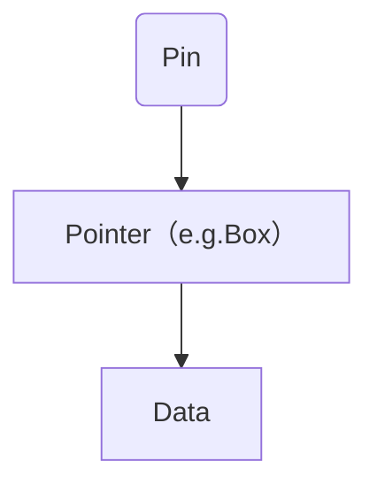

# 坑
## 交叉编译
ming64 必须是seh，版本未13 网址 https://github.com/niXman/mingw-builds-binaries/releases
# 基础
## 变量
### 遮蔽变量 
mut 变量的使用是不同的，第二个 let 生成了完全不同的新变量，两个变量只是恰好拥有同样的名称，涉及一次内存对象的再分配 ，而 mut 声明的变量，可以修改同一个内存地址上的值，并不会发生内存对象的再分配，性能要更好。
```rs
fn main() {
    let x = 5;
    // 在main函数的作用域内对之前的x进行遮蔽
    let x = x + 1;

    {
        // 在当前的花括号作用域内，对之前的x进行遮蔽
        let x = x * 2;
        println!("The value of x in the inner scope is: {}", x);
    }

    println!("The value of x is: {}", x);
}
```
## 基本类型
### 整数类型
在当使用 --release 参数进行 release 模式构建时，Rust 不检测溢出。相反，当检测到整型溢出时，Rust 会按照补码循环溢出（two’s complement wrapping）的规则处理。简而言之，大于该类型最大值的数值会被补码转换成该类型能够支持的对应数字的最小值。比如在 u8 的情况下，256 变成 0，257 变成 1，依此类推。程序不会 panic，但是该变量的值可能不是你期望的值。依赖这种默认行为的代码都应该被认为是错误的代码。

- 使用 wrapping_* 方法在所有模式下都按照补码循环溢出规则处理，例如 wrapping_add
- 如果使用 checked_* 方法时发生溢出，则返回 None 值
- 使用 overflowing_* 方法返回该值和一个指示是否存在溢出的布尔值
- 使用 saturating_* 方法使值达到最小值或最大值
```rs
fn main() {
    let a : u8 = 255;
    let b = a.wrapping_add(20);
    println!("{}", b);  // 19
}
```
### 浮点类型
浮点数往往是你想要数字的近似表达 浮点数类型是基于二进制实现的，但是我们想要计算的数字往往是基于十进制，例如 0.1 在二进制上并不存在精确的表达形式，但是在十进制上就存在。这种不匹配性导致一定的歧义性，更多的，虽然浮点数能代表真实的数值，但是由于底层格式问题，它往往受限于定长的浮点数精度，如果你想要表达完全精准的真实数字，只有使用无限精度的浮点数才行

浮点数在某些特性上是反直觉的 例如大家都会觉得浮点数可以进行比较,是的，它们确实可以使用 >，>= 等进行比较，但是在某些场景下，这种直觉上的比较特性反而会害了你。因为 f32 ， f64 上的比较运算实现的是 std::cmp::PartialEq 特征(类似其他语言的接口)，但是并没有实现 std::cmp::Eq 特征，但是后者在其它数值类型上都有定义
```rs
fn main() {
  // 断言0.1 + 0.2与0.3相等
  assert!(0.1 + 0.2 == 0.3);
}
```
你可能以为，这段代码没啥问题吧，实际上它会 panic(程序崩溃，抛出异常)，因为二进制精度问题，导致了 0.1 + 0.2 并不严格等于 0.3，它们可能在小数点 N 位后存在误差。
### 有理数和复数

Rust 的标准库相比其它语言，准入门槛较高，因此有理数和复数并未包含在标准库中：
    - 有理数和复数
    - 任意大小的整数和任意精度的浮点数
    - 固定精度的十进制小数，常用于货币相关的场景
好在社区已经开发出高质量的 Rust 数值库：num。

### 字符
注意，我们还没开始讲字符串，但是这里提前说一下，和一些语言不同，Rust 的字符只能用 '' 来表示， "" 是留给字符串的。
```rs
fn main() {
    let c = 'z';
    let z = 'ℤ';
    let g = '国';
    let heart_eyed_cat = '😻';
}
```

### 单元类型
 main 函数就返回这个单元类型 ()，你不能说 main 函数无返回值，因为没有返回值的函数在 Rust 中是有单独的定义的：发散函数( diverge function )，顾名思义，无法收敛的函数。

例如常见的 println!() 的返回值也是单元类型 ()。

再比如，你可以用 () 作为 map 的值，表示我们不关注具体的值，只关注 key。 这种用法和 Go 语言的 struct{} 类似，可以作为一个值用来占位，但是完全不占用任何内存。
### 语句

## 所有权和借用
### 所有权原则
- Rust 中每一个值都被一个变量所拥有，该变量被称为值的所有者
- 一个值同时只能被一个变量所拥有，或者说一个值只能拥有一个所有者
- 当所有者(变量)离开作用域范围时，这个值将被丢弃(drop)

### 变量绑定背后的数据交互
```rs
let s1 = String::from("hello");
let s2 = s1;

```
实际上， String 类型是一个复杂类型，由存储在栈中的堆指针、字符串长度、字符串容量共同组成，其中堆指针是最重要的，它指向了真实存储字符串内容的堆内存，至于长度和容量，如果你有 Go 语言的经验，这里就很好理解：容量是堆内存分配空间的大小，长度是目前已经使用的大小。
```rs
let s1 = String::from("hello");
let s2 = s1;

println!("{}, world!", s1);

```
- Rust 中每一个值都被一个变量所拥有，该变量被称为值的所有者
- 一个值同时只能被一个变量所拥有，或者说一个值只能拥有一个所有者
- 当所有者(变量)离开作用域范围时，这个值将被丢弃(drop)
### 函数传值与返回
```rs
fn main() {
    let s = String::from("hello");  // s 进入作用域

    takes_ownership(s);             // s 的值移动到函数里 ...
                                    // ... 所以到这里不再有效

    let x = 5;                      // x 进入作用域

    makes_copy(x);                  // x 应该移动函数里，
                                    // 但 i32 是 Copy 的，所以在后面可继续使用 x

} // 这里, x 先移出了作用域，然后是 s。但因为 s 的值已被移走，
  // 所以不会有特殊操作

fn takes_ownership(some_string: String) { // some_string 进入作用域
    println!("{}", some_string);
} // 这里，some_string 移出作用域并调用 `drop` 方法。占用的内存被释放

fn makes_copy(some_integer: i32) { // some_integer 进入作用域
    println!("{}", some_integer);
} // 这里，some_integer 移出作用域。不会有特殊操作
```
####  引用与借用
不过可变引用并不是随心所欲、想用就用的，它有一个很大的限制： 同一作用域，特定数据只能有一个可变引用：

可变引用与不可变引用不能同时存在
```rs
let mut s = String::from("hello");

let r1 = &s; // 没问题
let r2 = &s; // 没问题
let r3 = &mut s; // 大问题

println!("{}, {}, and {}", r1, r2, r3);

```

**悬垂引用(Dangling References)**
```rs

fn main() {
    let reference_to_nothing = dangle();
}

fn dangle() -> &String {
    let s = String::from("hello");

    &s
}
```

## 复合类型
### 字符串
#### 切片(slice)
切片并不是 Rust 独有的概念，在 Go 语言中就非常流行，它允许你引用集合中部分连续的元素序列，而不是引用整个集合。
```rs
let s = String::from("hello world");

let hello = &s[0..5];
let world = &s[6..11];

```
### 元组
```rs
fn main() {
    let tup: (i32, f64, u8) = (500, 6.4, 1);
}
```
### 结构体
```rs

// 最简
struct User {
    active: bool,
    username: String,
    email: String,
    sign_in_count: u64,
}
fn main() {
    let u1 = User {
        email: String::from("someone@example.com"),
        username: String::from("sunface"),
        active: true,
        sign_in_count: 1,
    };

    let u2 = set_email(u1);
} 

fn set_email(u: User) -> User {
    User {
        email: String::from("contact@im.dev"),
        ..u
    
    }
}

```

```rs
// 我们可以使用 #[derive(Debug)] 让结构体变成可打印的.
#[derive(Debug)]
struct Rectangle {
    width: u32,
    height: u32,
}

fn main() {
    let scale = 2;
    let rect1 = Rectangle {
        width: dbg!(30 * scale), // print debug info to stderr and assign the value of  `30 * scale` to `width`
        height: 50,
    };

    dbg!(&rect1); // print debug info to stderr

    println!("{:?}", rect1); // print debug info to stdout
}
```
### 枚举
<!-- 枚举变体可以通过“as”转换为整数 -->
```rs
enum PokerSuit {
  Clubs,
  Spades,
  Diamonds,
  Hearts,
}
```

```RS
enum Message {
    Quit,
    Move { x: i32, y: i32 },
    Write(String),
    ChangeColor(i32, i32, i32),
}

fn main() {
    let msg = Message::Move { x: 1, y: 1 };  // 创建一个Move变体的Message枚举实例，包含x和y字段的值
// 你使用if let语法来进行模式匹配。如果msg是Message::Move变体，并将其解构为x: a和y: b，那么就进入if条件分支。此
    if let Message::Move { x: a, y: b } = msg {
        // 使用模式匹配解构Message枚举
        // 如果msg是Move变体，并将x和y字段解构为a和b变量
        // 进入if条件分支
        assert_eq!(a, b);
    } else {
        panic!("NEVER LET THIS RUN！");
    }
}
```

处理空值
```RS
fn main() {
    let five = Some(5);
    let six = plus_one(five);
    let none = plus_one(None);

    if let Some(n) = six {
        println!("{}", n);
        return
    } 
    
    panic!("NEVER LET THIS RUN！");
} 

fn plus_one(x: Option<i32>) -> Option<i32> {
    match x {
        None => None,
        Some(i) => Some(i + 1),
    }
}
```
### 数组

## 流程控制
### if else
```rs
fn main() {
    let n = 6;

    if n % 4 == 0 {
        println!("number is divisible by 4");
    } else if n % 3 == 0 {
        println!("number is divisible by 3");
    } else if n % 2 == 0 {
        println!("number is divisible by 2");
    } else {
        println!("number is not divisible by 4, 3, or 2");
    }
}
```
### for
|使用方法|	等价使用方式|	所有权|
|------|-------|-------|
|for item in collection	|for item in IntoIterator::into_iter(collection)	|转移所有权|
|for item in &collection	|for item in collection.iter()|	不可变借用|
|for item in &mut collection	|for item in collection.iter_mut()|	可变借用|

在循环获取元素
```rs
fn main() {
    let a = [4, 3, 2, 1];
    // `.iter()` 方法把 `a` 数组变成一个迭代器
    for (i, v) in a.iter().enumerate() {
        println!("第{}个元素是{}", i + 1, v);
    }
}
```
### loop 循环
```rs
fn main() {
    loop {
        println!("again!");
    }
}
```
## 模式匹配
### match 和 if let
#### match
```rs
enum Coin {
    Penny,
    Nickel,
    Dime,
    Quarter,
}

fn value_in_cents(coin: Coin) -> u8 {
    match coin {
        Coin::Penny =>  {
            println!("Lucky penny!");
            1
        },
        Coin::Nickel => 5,
        Coin::Dime => 10,
        Coin::Quarter => 25,
    }
}

```

绑定匹配

```rs
enum Action {
    Say(String),
    MoveTo(i32, i32),
    ChangeColorRGB(u16, u16, u16),
}

fn main() {
    let actions = [
        Action::Say("Hello Rust".to_string()),
        Action::MoveTo(1,2),
        Action::ChangeColorRGB(255,255,0),
    ];
    for action in actions {
        match action {
            Action::Say(s) => {
                println!("{}", s);
            },
            Action::MoveTo(x, y) => {
                println!("point from (0, 0) move to ({}, {})", x, y);
            },
            Action::ChangeColorRGB(r, g, _) => {
                println!("change color into '(r:{}, g:{}, b:0)', 'b' has been ignored",
                    r, g,
                );
            }
        }
    }
}
```

```rs
v.iter().filter(|x| matches!(x, MyEnum::Foo));
```

#### if let 匹配
```rs
if let Some(3) = v {
    println!("three");
}

```
### 解构 Option
```rs
enum Option<T> {
    Some(T),
    None,
}

```
### 模式适用场景
模式是 Rust 中的特殊语法，它用来匹配类型中的结构和数据，它往往和 match 表达式联用，以实现强大的模式匹配能力。模式一般由以下内容组合而成：
    - 字面值
    - 解构的数组、枚举、结构体或者元组
    - 变量
    - 通配符
    - 占位符
### 全模式列表
####      解构结构体
```rs
struct Point {
    x: i32,
    y: i32,
}

fn main() {
    let p = Point { x: 0, y: 7 };

    let Point { x: a, y: b } = p;
    assert_eq!(0, a);
    assert_eq!(7, b);
}


fn main() {
    let p = Point { x: 0, y: 7 };

    match p {
        Point { x, y: 0 } => println!("On the x axis at {}", x),
        Point { x: 0, y } => println!("On the y axis at {}", y),
        Point { x, y } => println!("On neither axis: ({}, {})", x, y),
    }
}


enum Message {
    Quit,
    Move { x: i32, y: i32 },
    Write(String),
    ChangeColor(i32, i32, i32),
}

fn main() {
    let msg = Message::ChangeColor(0, 160, 255);

    match msg {
        Message::Quit => {
            println!("The Quit variant has no data to destructure.")
        }
        Message::Move { x, y } => {
            println!(
                "Move in the x direction {} and in the y direction {}",
                x,
                y
            );
        }
        Message::Write(text) => println!("Text message: {}", text),
        Message::ChangeColor(r, g, b) => {
            println!(
                "Change the color to red {}, green {}, and blue {}",
                r,
                g,
                b
            )
        }
    }
}


enum Color {
   Rgb(i32, i32, i32),
   Hsv(i32, i32, i32),
}

enum Message {
    Quit,
    Move { x: i32, y: i32 },
    Write(String),
    ChangeColor(Color),
}

fn main() {
    let msg = Message::ChangeColor(Color::Hsv(0, 160, 255));

    match msg {
        Message::ChangeColor(Color::Rgb(r, g, b)) => {
            println!(
                "Change the color to red {}, green {}, and blue {}",
                r,
                g,
                b
            )
        }
        Message::ChangeColor(Color::Hsv(h, s, v)) => {
            println!(
                "Change the color to hue {}, saturation {}, and value {}",
                h,
                s,
                v
            )
        }
        _ => ()
    }
}
```

### @前绑定后解构(Rust 1.56 新增)
```rs
#[derive(Debug)]
struct Point {
    x: i32,
    y: i32,
}

fn main() {
    // 绑定新变量 `p`，同时对 `Point` 进行解构
    let p @ Point {x: px, y: py } = Point {x: 10, y: 23};
    println!("x: {}, y: {}", px, py);
    println!("{:?}", p);


    let point = Point {x: 10, y: 5};
    if let p @ Point {x: 10, y} = point {
        println!("x is 10 and y is {} in {:?}", y, p);
    } else {
        println!("x was not 10 :(");
    }
}
```
## 方法
定义方法
- self 表示 Rectangle 的所有权转移到该方法中，这种形式用的较少
- &self 表示该方法对 Rectangle 的不可变借用
- &mut self 表示可变借用(域内对可变数据进行临时修改的机制)
```rs
struct Circle {
    x: f64,
    y: f64,
    radius: f64,
}

impl Circle {
    // new是Circle的关联函数，因为它的第一个参数不是self，且new并不是关键字
    // 这种方法往往用于初始化当前结构体的实例
    fn new(x: f64, y: f64, radius: f64) -> Circle {
        Circle {
            x: x,
            y: y,
            radius: radius,
        }
    }

    // Circle的方法，&self表示借用当前的Circle结构体
    fn area(&self) -> f64 {
        std::f64::consts::PI * (self.radius * self.radius)
    }
}
```

### 为枚举实现方法
```rs
#![allow(unused)]
enum Message {
    Quit,
    Move { x: i32, y: i32 },
    Write(String),
    ChangeColor(i32, i32, i32),
}

impl Message {
    fn call(&self) {
        // 在这里定义方法体
    }
}

fn main() {
    let m = Message::Write(String::from("hello"));
    m.call();
}

```
##  泛型和特征
### 泛型 Generics泛型

使用泛型参数，有一个先决条件，必需在使用前对其进行声明：
```rs
fn largest<T>(list: &[T]) -> T {
```

该泛型函数的作用是从列表中找出最大的值，其中列表中的元素类型为 T。首先 largest&lt;T> 对泛型参数 T 进行了声明，然后才在函数参数中进行使用该泛型参数 list: &[T] 。


下面是一个错误的泛型函数的实现：
```rs
fn largest<T>(list: &[T]) -> T {
    let mut largest = list[0];

    for &item in list.iter() {
        if item > largest {
            largest = item;
        }
    }

    largest
}

fn main() {
    let number_list = vec![34, 50, 25, 100, 65];

    let result = largest(&number_list);
    println!("The largest number is {}", result);

    let char_list = vec!['y', 'm', 'a', 'q'];

    let result = largest(&char_list);
    println!("The largest char is {}", result);
}
```

运行后报错：
```shell
error[E0369]: binary operation `>` cannot be applied to type `T` // `>`操作符不能用于类型`T`
 --> src/main.rs:5:17
  |
5 |         if item > largest {
  |            ---- ^ ------- T
  |            |
  |            T
  |
help: consider restricting type parameter `T` // 考虑对T进行类型上的限制 :
  |
1 | fn largest<T: std::cmp::PartialOrd>(list: &[T]) -> T {
  |             ++++++++++++++++++++++
```

因为 T 可以是任何类型，但不是所有的类型都能进行比较，因此上面的错误中，编译器建议我们给 T 添加一个类型限制：使用 std::cmp::PartialOrd 特征（Trait）对 T 进行限制，特征在下一节会详细介绍，现在你只要理解，该特征的目的就是让类型实现可比较的功能。


#### 结构体中使用泛型
结构体中的字段类型也可以用泛型来定义，下面代码定义了一个坐标点 Point，它可以存放任何类型的坐标值：
```rs
struct Point<T> {
    x: T,
    y: T,
}

fn main() {
    let integer = Point { x: 5, y: 10 };
    let float = Point { x: 1.0, y: 4.0 };
}
```

这里有两点需要特别的注意：

- 提前声明，跟泛型函数定义类似，首先我们在使用泛型参数之前必需要进行声明 Point&lt;T>，接着就可以在结构体的字段类型中使用 T 来替代具体的类型
- x 和 y 是相同的类型
第二点非常重要，如果使用不同的类型，那么它会导致下面代码的报错：


如果想让 x 和 y 既能类型相同，又能类型不同，就需要使用不同的泛型参数：
```rs
struct Point<T,U> {
    x: T,
    y: U,
}
fn main() {
    let p = Point{x: 1, y :1.1};
}
```

切记，所有的泛型参数都要提前声明.

#### 枚举中使用泛型
提到枚举类型，Option 永远是第一个应该被想起来的，在之前的章节中，它也多次出现：
```rs
enum Option<T> {
    Some(T),
    None,
}
```

Option&lt;T> 是一个拥有泛型 T 的枚举类型，它第一个成员是 Some(T)，存放了一个类型为 T 的值。得益于泛型的引入，我们可以在任何一个需要返回值的函数中，去使用 Option&lt;T> 枚举类型来做为返回值，用于返回一个任意类型的值 Some(T)，或者没有值 None。

```rs
enum Result<T, E> {
    Ok(T),
    Err(E),
}
```


这个枚举和 Option 一样，主要用于函数返回值，与 Option 用于值的存在与否不同，Result 关注的主要是值的正确性。

如果函数正常运行，则最后返回一个 Ok(T)，T 是函数具体的返回值类型，如果函数异常运行，则返回一个 Err(E)，E 是错误类型。例如打开一个文件：如果成功打开文件，则返回 Ok(std::fs::File)，因此 T 对应的是 std::fs::File 类型；而当打开文件时出现问题时，返回 Err(std::io::Error)，E 对应的就是 std::io::Error 类型。

#### 方法中使用泛型
方法上也可以使用泛型：
```rs
struct Point<T> {
    x: T,
    y: T,
}

impl<T> Point<T> {
    fn x(&self) -> &T {
        &self.x
    }
}
fn main() {
    let p = Point { x: 5, y: 10 };

    println!("p.x = {}", p.x());
}
```


使用泛型参数前，依然需要提前声明：impl&lt;T>，只有提前声明了，我们才能在Point&lt;T>中使用它，这样 Rust 就知道 Point 的尖括号中的类型是泛型而不是具体类型。需要注意的是，这里的 Point&lt;T> 不再是泛型声明，而是一个完整的结构体类型，因为我们定义的结构体就是 Point&lt;T> 而不再是 Point。

除了结构体中的泛型参数，我们还能在该结构体的方法中定义额外的泛型参数，就跟泛型函数一样：
```rs
struct Point<T, U> {
    x: T,
    y: U,
}

impl<T, U> Point<T, U> {
    fn mixup<V, W>(self, other: Point<V, W>) -> Point<T, W> {
        Point {
            x: self.x,
            y: other.y,
        }
    }
}

fn main() {
    let p1 = Point { x: 5, y: 10.4 };
    let p2 = Point { x: "Hello", y: 'c'};

    let p3 = p1.mixup(p2);

    println!("p3.x = {}, p3.y = {}", p3.x, p3.y);
}
```

这个例子中，T,U 是定义在结构体 Point 上的泛型参数，V,W 是单独定义在方法 mixup 上的泛型参数，它们并不冲突，说白了，你可以理解为，一个是结构体泛型，一个是函数泛型。

#### 为具体的泛型类型实现方法
对于 Point&lt;T> 类型，你不仅能定义基于 T 的方法，还能针对特定的具体类型，进行方法定义：
```rs
impl Point<f32> {
    fn distance_from_origin(&self) -> f32 {
        (self.x.powi(2) + self.y.powi(2)).sqrt()
    }
}
```

这段代码意味着 Point&lt;f32> 类型会有一个方法 distance_from_origin，而其他 T 不是 f32 类型的 Point&lt;T> 实例则没有定义此方法。这个方法计算点实例与坐标(0.0, 0.0) 之间的距离，并使用了只能用于浮点型的数学运算符。

#### const 泛型
const 泛型，也就是针对值的泛型，正好可以用于处理数组长度的问题：
```rs
fn display_array<T: std::fmt::Debug, const N: usize>(arr: [T; N]) {
    println!("{:?}", arr);
}
fn main() {
    let arr: [i32; 3] = [1, 2, 3];
    display_array(arr);

    let arr: [i32; 2] = [1, 2];
    display_array(arr);
}
```

如上所示，我们定义了一个类型为 [T; N] 的数组，其中 T 是一个基于类型的泛型参数，这个和之前讲的泛型没有区别，而重点在于 N 这个泛型参数，它是一个基于值的泛型参数！因为它用来替代的是数组的长度。

N 就是 const 泛型，定义的语法是 const N: usize，表示 const 泛型 N ，它基于的值类型是 usize。

在泛型参数之前，Rust 完全不适合复杂矩阵的运算，自从有了 const 泛型，一切即将改变。

#### const 泛型表达式
假设我们某段代码需要在内存很小的平台上工作，因此需要限制函数参数占用的内存大小，此时就可以使用 const 泛型表达式来实现：
```rs
// 目前只能在nightly版本下使用
#![allow(incomplete_features)]
#![feature(generic_const_exprs)]

fn something<T>(val: T)
where
    Assert<{ core::mem::size_of::<T>() < 768 }>: IsTrue,
    //       ^-----------------------------^ 这里是一个 const 表达式，换成其它的 const 表达式也可以
{
    //
}

fn main() {
    something([0u8; 0]); // ok
    something([0u8; 512]); // ok
    something([0u8; 1024]); // 编译错误，数组长度是1024字节，超过了768字节的参数长度限制
}

// ---

pub enum Assert<const CHECK: bool> {
    //
}

pub trait IsTrue {
    //
}

impl IsTrue for Assert<true> {
    //
}
```


### 特征 Trait
#### 定义特征
如果不同的类型具有相同的行为，那么我们就可以定义一个特征，然后为这些类型实现该特征。定义特征是把一些方法组合在一起，目的是定义一个实现某些目标所必需的行为的集合。

例如，我们现在有文章 Post 和微博 Weibo 两种内容载体，而我们想对相应的内容进行总结，也就是无论是文章内容，还是微博内容，都可以在某个时间点进行总结，那么总结这个行为就是共享的，因此可以用特征来定义：
```rust
pub trait Summary {
    fn summarize(&self) -> String;
}
```

这里使用 trait 关键字来声明一个特征，Summary 是特征名。在大括号中定义了该特征的所有方法，在这个例子中是： fn summarize(&self) -> String。

特征只定义行为看起来是什么样的，而不定义行为具体是怎么样的。因此，我们只定义特征方法的签名，而不进行实现，此时方法签名结尾是 ;，而不是一个 {}。

#### 为类型实现特征
因为特征只定义行为看起来是什么样的，因此我们需要为类型实现具体的特征，定义行为具体是怎么样的。

首先来为 Post 和 Weibo 实现 Summary 特征：
```rs
pub trait Summary {
    fn summarize(&self) -> String;
}
pub struct Post {
    pub title: String, // 标题
    pub author: String, // 作者
    pub content: String, // 内容
}

impl Summary for Post {
    fn summarize(&self) -> String {
        format!("文章{}, 作者是{}", self.title, self.author)
    }
}

pub struct Weibo {
    pub username: String,
    pub content: String
}

impl Summary for Weibo {
    fn summarize(&self) -> String {
        format!("{}发表了微博{}", self.username, self.content)
    }
}
```
实现特征的语法与为结构体、枚举实现方法很像：impl Summary for Post，读作“为 Post 类型实现 Summary 特征”，然后在 impl 的花括号中实现该特征的具体方法。

接下来就可以在这个类型上调用特征的方法：
```rust
fn main() {
    let post = Post{title: "Rust语言简介".to_string(),author: "Sunface".to_string(), content: "Rust棒极了!".to_string()};
    let weibo = Weibo{username: "sunface".to_string(),content: "好像微博没Tweet好用".to_string()};

    println!("{}",post.summarize());
    println!("{}",weibo.summarize());
}
```
运行输出：
```shell
文章 Rust 语言简介, 作者是Sunface
sunface发表了微博好像微博没Tweet好用
```

#### 特征定义与实现的位置(孤儿规则)
上面我们将 Summary 定义成了 pub 公开的。这样，如果他人想要使用我们的 Summary 特征，则可以引入到他们的包中，然后再进行实现。

关于特征实现与定义的位置，有一条非常重要的原则：如果你想要为类型 A 实现特征 T，那么 A 或者 T 至少有一个是在当前作用域中定义的！ 例如我们可以为上面的 Post 类型实现标准库中的 Display 特征，这是因为 Post 类型定义在当前的作用域中。同时，我们也可以在当前包中为 String 类型实现 Summary 特征，因为 Summary 定义在当前作用域中。
#### 默认实现
你可以在特征中定义具有默认实现的方法，这样其它类型无需再实现该方法，或者也可以选择重载该方法：
```rsut
pub trait Summary {
    fn summarize(&self) -> String {
        String::from("(Read more...)")
    }
}
```

上面为 Summary 定义了一个默认实现，下面我们编写段代码来测试下：
```rust
impl Summary for Post {}

impl Summary for Weibo {
    fn summarize(&self) -> String {
        format!("{}发表了微博{}", self.username, self.content)
    }
}
```

可以看到，Post 选择了默认实现，而 Weibo 重载了该方法，调用和输出如下：
```rust
    println!("{}",post.summarize());
    println!("{}",weibo.summarize());

```
```shell
(Read more...)
sunface发表了微博好像微博没Tweet好用

```

默认实现允许调用相同特征中的其他方法，哪怕这些方法没有默认实现。如此，特征可以提供很多有用的功能而只需要实现指定的一小部分内容。例如，我们可以定义 Summary 特征，使其具有一个需要实现的 summarize_author 方法，然后定义一个 summarize 方法，此方法的默认实现调用 summarize_author 方法：
```rust
pub trait Summary {
    fn summarize_author(&self) -> String;

    fn summarize(&self) -> String {
        format!("(Read more from {}...)", self.summarize_author())
    }
}
```

为了使用 Summary，只需要实现 summarize_author 方法即可：
```rust
impl Summary for Weibo {
    fn summarize_author(&self) -> String {
        format!("@{}", self.username)
    }
}
println!("1 new weibo: {}", weibo.summarize());
```


weibo.summarize() 会先调用 Summary 特征默认实现的 summarize 方法，通过该方法进而调用 Weibo 为 Summary 实现的 summarize_author 方法，最终输出：1 new weibo: (Read more from @horse_ebooks...)。
#### 使用特征作为函数参数
```rs
pub fn notify(item: &impl Summary) {
    println!("Breaking news! {}", item.summarize());
}
```

impl Summary，只能说想出这个类型的人真的是起名鬼才，简直太贴切了，顾名思义，它的意思是 实现了Summary特征 的 item 参数。

你可以使用任何实现了 Summary 特征的类型作为该函数的参数，同时在函数体内，还可以调用该特征的方法，例如 summarize 方法。具体的说，可以传递 Post 或 Weibo 的实例来作为参数，而其它类如 String 或者 i32 的类型则不能用做该函数的参数，因为它们没有实现 Summary 特征。

#### 特征约束(trait bound)
虽然 impl Trait 这种语法非常好理解，但是实际上它只是一个语法糖：
```rust
pub fn notify<T: Summary>(item: &T) {
    println!("Breaking news! {}", item.summarize());
}
```
真正的完整书写形式如上所述，形如 T: Summary 被称为特征约束。

在简单的场景下 impl Trait 这种语法糖就足够使用，但是对于复杂的场景，特征约束可以让我们拥有更大的灵活性和语法表现能力，例如一个函数接受两个 impl Summary 的参数：
```rust
pub fn notify(item1: &impl Summary, item2: &impl Summary) {}
```

如果函数两个参数是不同的类型，那么上面的方法很好，只要这两个类型都实现了 Summary 特征即可。但是如果我们想要强制函数的两个参数是同一类型呢？上面的语法就无法做到这种限制，此时我们只能使特征约束来实现：
```rust
pub fn notify<T: Summary>(item1: &T, item2: &T) {}
```

泛型类型 T 说明了 item1 和 item2 必须拥有同样的类型，同时 T: Summary 说明了 T 必须实现 Summary 特征。

##### 多重约束
除了单个约束条件，我们还可以指定多个约束条件，例如除了让参数实现 Summary 特征外，还可以让参数实现 Display 特征以控制它的格式化输出：
```rust
pub fn notify(item: &(impl Summary + Display)) {}
```

除了上述的语法糖形式，还能使用特征约束的形式：
```rust
pub fn notify<T: Summary + Display>(item: &T) {}
```
通过这两个特征，就可以使用 item.summarize 方法，以及通过 println!("{}", item) 来格式化输出 item。

##### Where 约束
当特征约束变得很多时，函数的签名将变得很复杂：
```rust
fn some_function<T: Display + Clone, U: Clone + Debug>(t: &T, u: &U) -> i32 {}
```

严格来说，上面的例子还是不够复杂，但是我们还是能对其做一些形式上的改进，通过 where：
```rust
fn some_function<T, U>(t: &T, u: &U) -> i32
    where T: Display + Clone,
          U: Clone + Debug
{}
```

##### 使用特征约束有条件地实现方法或特征
特征约束，可以让我们在指定类型 + 指定特征的条件下去实现方法，例如：
```rust
use std::fmt::Display;

struct Pair<T> {
    x: T,
    y: T,
}

impl<T> Pair<T> {
    fn new(x: T, y: T) -> Self {
        Self {
            x,
            y,
        }
    }
}

impl<T: Display + PartialOrd> Pair<T> {
    fn cmp_display(&self) {
        if self.x >= self.y {
            println!("The largest member is x = {}", self.x);
        } else {
            println!("The largest member is y = {}", self.y);
        }
    }
}

```

cmp_display 方法，并不是所有的 Pair&lt;T> 结构体对象都可以拥有，只有 T 同时实现了 Display + PartialOrd 的 Pair&lt;T> 才可以拥有此方法。 该函数可读性会更好，因为泛型参数、参数、返回值都在一起，可以快速的阅读，同时每个泛型参数的特征也在新的代码行中通过特征约束进行了约束。

也可以有条件地实现特征, 例如，标准库为任何实现了 Display 特征的类型实现了 ToString 特征：
```rust
impl<T: Display> ToString for T {
    // --snip--
}
```

我们可以对任何实现了 Display 特征的类型调用由 ToString 定义的 to_string 方法。例如，可以将整型转换为对应的 String 值，因为整型实现了 Display：
```rust
let s = 3.to_string();
```

#### 函数返回中的 impl Trait
可以通过 impl Trait 来说明一个函数返回了一个类型，该类型实现了某个特征：
```rust
fn returns_summarizable() -> impl Summary {
    Weibo {
        username: String::from("sunface"),
        content: String::from(
            "m1 max太厉害了，电脑再也不会卡",
        )
    }
}
```

因为 Weibo 实现了 Summary，因此这里可以用它来作为返回值。要注意的是，虽然我们知道这里是一个 Weibo 类型，但是对于 returns_summarizable 的调用者而言，他只知道返回了一个实现了 Summary 特征的对象，但是并不知道返回了一个 Weibo 类型。

这种 impl Trait 形式的返回值，在一种场景下非常非常有用，那就是返回的真实类型非常复杂，你不知道该怎么声明时(毕竟 Rust 要求你必须标出所有的类型)，此时就可以用 impl Trait 的方式简单返回。例如，闭包和迭代器就是很复杂，只有编译器才知道那玩意的真实类型，如果让你写出来它们的具体类型，估计内心有一万只草泥马奔腾，好在你可以用 impl Iterator 来告诉调用者，返回了一个迭代器，因为所有迭代器都会实现 Iterator 特征。

但是这种返回值方式有一个很大的限制：只能有一个具体的类型，例如：
```rust
fn returns_summarizable(switch: bool) -> impl Summary {
    if switch {
        Post {
            title: String::from(
                "Penguins win the Stanley Cup Championship!",
            ),
            author: String::from("Iceburgh"),
            content: String::from(
                "The Pittsburgh Penguins once again are the best \
                 hockey team in the NHL.",
            ),
        }
    } else {
        Weibo {
            username: String::from("horse_ebooks"),
            content: String::from(
                "of course, as you probably already know, people",
            ),
        }
    }
}
```

#### 通过 derive 派生特征
形如 #[derive(Debug)] 的代码已经出现了很多次，这种是一种特征派生语法，被 derive 标记的对象会自动实现对应的默认特征代码，继承相应的功能。

例如 Debug 特征，它有一套自动实现的默认代码，当你给一个结构体标记后，就可以使用 println!("{:?}", s) 的形式打印该结构体的对象。

再如 Copy 特征，它也有一套自动实现的默认代码，当标记到一个类型上时，可以让这个类型自动实现 Copy 特征，进而可以调用 copy 方法，进行自我复制。

总之，derive 派生出来的是 Rust 默认给我们提供的特征，在开发过程中极大的简化了自己手动实现相应特征的需求，当然，如果你有特殊的需求，还可以自己手动重载该实现。

#### 调用方法需要引入特征
在一些场景中，使用 as 关键字做类型转换会有比较大的限制，因为你想要在类型转换上拥有完全的控制，例如处理转换错误，那么你将需要 TryInto：
```rs
use std::convert::TryInto;

fn main() {
  let a: i32 = 10;
  let b: u16 = 100;

  let b_ = b.try_into()
            .unwrap();

  if a < b_ {
    println!("Ten is less than one hundred.");
  }
}
```

### 特征对象
```rs
pub struct Button {
    pub width: u32,
    pub height: u32,
    pub label: String,
}

impl Draw for Button {
    fn draw(&self) {
        // 绘制按钮的代码
    }
}

struct SelectBox {
    width: u32,
    height: u32,
    options: Vec<String>,
}

impl Draw for SelectBox {
    fn draw(&self) {
        // 绘制SelectBox的代码
    }
}


```
### 深入了解特征

#### 关联类型

关联类型是在特征定义的语句块中，申明一个自定义类型，这样就可以在特征的方法签名中使用该类型：
```rust
pub trait Iterator {
    type Item;

    fn next(&mut self) -> Option<Self::Item>;
}
```

以上是标准库中的迭代器特征 Iterator，它有一个 Item 关联类型，用于替代遍历的值的类型。

同时，next 方法也返回了一个 Item 类型，不过使用 Option 枚举进行了包裹，假如迭代器中的值是 i32 类型，那么调用 next 方法就将获取一个 Option&lt;i32> 的值。

：
```rust
impl Iterator for Counter {
    type Item = u32;

    fn next(&mut self) -> Option<Self::Item> {
        // --snip--
    }
}

fn main() {
    let c = Counter{..}
    c.next()
}
```

在上述代码中，我们为 Counter 类型实现了 Iterator 特征，变量 c 是特征 Iterator 的实例，也是 next 方法的调用者。 结合之前的黑体内容可以得出：对于 next 方法而言，Self 是调用者 c 的具体类型： Counter，而 Self::Item 是 Counter 中定义的 Item 类型: u32。


```rust
pub trait Iterator<Item> {
    fn next(&mut self) -> Option<Item>;
}
```

答案其实很简单，为了代码的可读性，当你使用了泛型后，你需要在所有地方都写 Iterator&lt;Item>，而使用了关联类型，你只需要写 Iterator，当类型定义复杂时，这种写法可以极大的增加可读性：
```rust
pub trait CacheableItem: Clone + Default + fmt::Debug + Decodable + Encodable {
  type Address: AsRef<[u8]> + Clone + fmt::Debug + Eq + Hash;
  fn is_null(&self) -> bool;
}
```

例如上面的代码，Address 的写法自然远比 AsRef<[u8]> + Clone + fmt::Debug + Eq + Hash 要简单的多，而且含义清晰。

再例如，如果使用泛型，你将得到以下的代码：
```rust
trait Container<A,B> {
    fn contains(&self,a: A,b: B) -> bool;
}

fn difference<A,B,C>(container: &C) -> i32
  where
    C : Container<A,B> {...}
```

可以看到，由于使用了泛型，导致函数头部也必须增加泛型的声明，而使用关联类型，将得到可读性好得多的代码：
```rust
trait Container{
    type A;
    type B;
    fn contains(&self, a: &Self::A, b: &Self::B) -> bool;
}

fn difference<C: Container>(container: &C) {}
```

#### 默认泛型类型参数
当使用泛型类型参数时，可以为其指定一个默认的具体类型，例如标准库中的 std::ops::Add 特征：
```rust
trait Add<RHS=Self> {
    type Output;

    fn add(self, rhs: RHS) -> Self::Output;
}
```

它有一个泛型参数 RHS，但是与我们以往的用法不同，这里它给 RHS 一个默认值，也就是当用户不指定 RHS 时，默认使用两个同样类型的值进行相加，然后返回一个关联类型 Output。

可能上面那段不太好理解，下面我们用代码来举例：
```rust
use std::ops::Add;

#[derive(Debug, PartialEq)]
struct Point {
    x: i32,
    y: i32,
}

impl Add for Point {
    type Output = Point;

    fn add(self, other: Point) -> Point {
        Point {
            x: self.x + other.x,
            y: self.y + other.y,
        }
    }
}

fn main() {
    assert_eq!(Point { x: 1, y: 0 } + Point { x: 2, y: 3 },
               Point { x: 3, y: 3 });
}
```

上面的代码主要干了一件事，就是为 Point 结构体提供 + 的能力，这就是运算符重载，不过 Rust 并不支持创建自定义运算符，你也无法为所有运算符进行重载，目前来说，只有定义在 std::ops 中的运算符才能进行重载。

跟 + 对应的特征是 std::ops::Add，我们在之前也看过它的定义 trait Add&lt;RHS=Self>，但是上面的例子中并没有为 Point 实现 Add&lt;RHS> 特征，而是实现了 Add 特征（没有默认泛型类型参数），这意味着我们使用了 RHS 的默认类型，也就是 Self。换句话说，我们这里定义的是两个相同的 Point 类型相加，因此无需指定 RHS。

与上面的例子相反，下面的例子，我们来创建两个不同类型的相加：
```rust
use std::ops::Add;

struct Millimeters(u32);
struct Meters(u32);

impl Add<Meters> for Millimeters {
    type Output = Millimeters;

    fn add(self, other: Meters) -> Millimeters {
        Millimeters(self.0 + (other.0 * 1000))
    }
}
```

这里，是进行 Millimeters + Meters 两种数据类型的 + 操作，因此此时不能再使用默认的 RHS，否则就会变成 Millimeters + Millimeters 的形式。使用 Add&lt;Meters> 可以将 RHS 指定为 Meters，那么 fn add(self, rhs: RHS) 自然而言的变成了 Millimeters 和 Meters 的相加。

默认类型参数主要用于两个方面：

1. 减少实现的样板代码
2. 扩展类型但是无需大幅修改现有的代码


#### 调用同名的方法
不同特征拥有同名的方法是很正常的事情，你没有任何办法阻止这一点；甚至除了特征上的同名方法外，在你的类型上，也有同名方法：
```rust
trait Pilot {
    fn fly(&self);
}

trait Wizard {
    fn fly(&self);
}

struct Human;

impl Pilot for Human {
    fn fly(&self) {
        println!("This is your captain speaking.");
    }
}

impl Wizard for Human {
    fn fly(&self) {
        println!("Up!");
    }
}

impl Human {
    fn fly(&self) {
        println!("*waving arms furiously*");
    }
}

```

这里，不仅仅两个特征 Pilot 和 Wizard 有 fly 方法，就连实现那两个特征的 Human 单元结构体，也拥有一个同名方法 fly 
##### 优先调用类型上的方法
当调用 Human 实例的 fly 时，编译器默认调用该类型中定义的方法：
```rust
fn main() {
    let person = Human;
    person.fly();
}
```

这段代码会打印 *waving arms furiously*，说明直接调用了类型上定义的方法。

##### 调用特征上的方法
为了能够调用两个特征的方法，需要使用显式调用的语法：
```rust
fn main() {
    let person = Human;
    Pilot::fly(&person); // 调用Pilot特征上的方法
    Wizard::fly(&person); // 调用Wizard特征上的方法
    person.fly(); // 调用Human类型自身的方法
}

```

运行后依次输出：
```shell
This is your captain speaking.
Up!
*waving arms furiously*
```

因为 fly 方法的参数是 self，当显式调用时，编译器就可以根据调用的类型( self 的类型)决定具体调用哪个方法。

这个时候问题又来了，如果方法没有 self 参数呢？稍等，估计有读者会问：还有方法没有 self 参数？

```rust
trait Animal {
    fn baby_name() -> String;
}

struct Dog;

impl Dog {
    fn baby_name() -> String {
        String::from("Spot")
    }
}

impl Animal for Dog {
    fn baby_name() -> String {
        String::from("puppy")
    }
}

fn main() {
    println!("A baby dog is called a {}", Dog::baby_name());
}
```


Dog::baby_name() 的调用方式显然不行，因为这只是狗妈妈对宝宝的爱称，可能你会想到通过下面的方式查询其他动物对狗狗的称呼：
```rust
fn main() {
    println!("A baby dog is called a {}", Animal::baby_name());
}
```

```shell
error[E0283]: type annotations needed // 需要类型注释
  --> src/main.rs:20:43
   |
20 |     println!("A baby dog is called a {}", Animal::baby_name());
   |                                           ^^^^^^^^^^^^^^^^^ cannot infer type // 无法推断类型
   |
   = note: cannot satisfy `_: Animal`

```

#### 完全限定语法
完全限定语法是调用函数最为明确的方式：
```rust
fn main() {
    println!("A baby dog is called a {}", <Dog as Animal>::baby_name());
}
```

在尖括号中，通过 as 关键字，我们向 Rust 编译器提供了类型注解，也就是 Animal 就是 Dog，而不是其他动物，因此最终会调用 impl Animal for Dog 中的方法，获取到其它动物对狗宝宝的称呼：puppy。


#### 特征定义中的特征约束
有时，我们会需要让某个特征 A 能使用另一个特征 B 的功能(另一种形式的特征约束)，这种情况下，不仅仅要为类型实现特征 A，还要为类型实现特征 B 才行，这就是 supertrait (实在不知道该如何翻译，有大佬指导下嘛？)

例如有一个特征 OutlinePrint，它有一个方法，能够对当前的实现类型进行格式化输出：
```rust
use std::fmt::Display;

trait OutlinePrint: Display {
    fn outline_print(&self) {
        let output = self.to_string();
        let len = output.len();
        println!("{}", "*".repeat(len + 4));
        println!("*{}*", " ".repeat(len + 2));
        println!("* {} *", output);
        println!("*{}*", " ".repeat(len + 2));
        println!("{}", "*".repeat(len + 4));
    }
}
```

等等，这里有一个眼熟的语法: OutlinePrint: Display，感觉很像之前讲过的特征约束，只不过用在了特征定义中而不是函数的参数中，是的，在某种意义上来说，这和特征约束非常类似，都用来说明一个特征需要实现另一个特征，这里就是：如果你想要实现 OutlinePrint 特征，首先你需要实现 Display 特征。

想象一下，假如没有这个特征约束，那么 self.to_string 还能够调用吗（ to_string 方法会为实现 Display 特征的类型自动实现）？编译器肯定是不愿意的，会报错说当前作用域中找不到用于 &Self 类型的方法 to_string ：
```rust
struct Point {
    x: i32,
    y: i32,
}

impl OutlinePrint for Point {}
```


因为 Point 没有实现 Display 特征，会得到下面的报错：
```shell
error[E0277]: the trait bound `Point: std::fmt::Display` is not satisfied
  --> src/main.rs:20:6
   |
20 | impl OutlinePrint for Point {}
   |      ^^^^^^^^^^^^ `Point` cannot be formatted with the default formatter;
try using `:?` instead if you are using a format string
   |
   = help: the trait `std::fmt::Display` is not implemented for `Point`
```

既然我们有求于编译器，那只能选择满足它咯：
```rust
use std::fmt;

impl fmt::Display for Point {
    fn fmt(&self, f: &mut fmt::Formatter) -> fmt::Result {
        write!(f, "({}, {})", self.x, self.y)
    }
}
```

上面代码为 Point 实现了 Display 特征，那么 to_string 方法也将自动实现：最终获得字符串是通过这里的 fmt 方法获得的。

#### 在外部类型上实现外部特征(newtype)
有提到孤儿规则，简单来说，就是特征或者类型必需至少有一个是本地的，才能在此类型上定义特征。

这里提供一个办法来绕过孤儿规则，那就是使用newtype 模式，简而言之：就是为一个元组结构体创建新类型。该元组结构体封装有一个字段，该字段就是希望实现特征的具体类型。

该封装类型是本地的，因此我们可以为此类型实现外部的特征。

newtype 不仅仅能实现以上的功能，而且它在运行时没有任何性能损耗，因为在编译期，该类型会被自动忽略。

```rust
use std::fmt;

struct Wrapper(Vec<String>);

impl fmt::Display for Wrapper {
    fn fmt(&self, f: &mut fmt::Formatter) -> fmt::Result {
        write!(f, "[{}]", self.0.join(", "))
    }
}

fn main() {
    let w = Wrapper(vec![String::from("hello"), String::from("world")]);
    println!("w = {}", w);
}
```

其中，struct Wrapper(Vec&lt;String>) 就是一个元组结构体，它定义了一个新类型 Wrapper，代码很简单，相信大家也很容易看懂。

既然 new type 有这么多好处，它有没有不好的地方呢？答案是肯定的。注意到我们怎么访问里面的数组吗？self.0.join(", ")，是的，很啰嗦，因为需要先从 Wrapper 中取出数组: self.0，然后才能执行 join 方法。

类似的，任何数组上的方法，你都无法直接调用，需要先用 self.0 取出数组，然后再进行调用。

当然，解决办法还是有的，要不怎么说 Rust 是极其强大灵活的编程语言！Rust 提供了一个特征叫 Deref，实现该特征后，可以自动做一层类似类型转换的操作，可以将 Wrapper 变成 Vec&lt;String> 来使用。这样就会像直接使用数组那样去使用 Wrapper，而无需为每一个操作都添加上 self.0。

同时，如果不想 Wrapper 暴露底层数组的所有方法，我们还可以为 Wrapper 去重载这些方法，实现隐藏的目的。

## 集合类型
### 动态数组 Vector

### KV 存储 HashMap
```rs
use std::collections::HashMap;

// 创建一个HashMap，用于存储宝石种类和对应的数量
let mut my_gems = HashMap::new();

// 将宝石类型和对应的数量写入表中
my_gems.insert("红宝石", 1);
my_gems.insert("蓝宝石", 2);
my_gems.insert("河边捡的误以为是宝石的破石头", 18);


fn main() {
    use std::collections::HashMap;

    let teams_list = vec![
        ("中国队".to_string(), 100),
        ("美国队".to_string(), 10),
        ("日本队".to_string(), 50),
    ];

    let teams_map: HashMap<_,_> = teams_list.into_iter().collect();
    
    println!("{:?}",teams_map)
}


fn main() {
    use std::collections::HashMap;

    let mut scores = HashMap::new();

    scores.insert("Blue", 10);

    // 覆盖已有的值
    let old = scores.insert("Blue", 20);
    assert_eq!(old, Some(10));

    // 查询新插入的值
    let new = scores.get("Blue");
    assert_eq!(new, Some(&20));

    // 查询Yellow对应的值，若不存在则插入新值
    let v = scores.entry("Yellow").or_insert(5);
    assert_eq!(*v, 5); // 不存在，插入5

    // 查询Yellow对应的值，若不存在则插入新值
    let v = scores.entry("Yellow").or_insert(50);
    assert_eq!(*v, 5); // 已经存在，因此50没有插入
}
```
## 认识生命周期
在存在多个引用时，编译器有时会无法自动推导生命周期，此时就需要我们手动去标注，通过为参数标注合适的生命周期来帮助编译器进行借用检查的分析。

```rs
{
    let r;

    {
        let x = 5;
        r = &x;
    }

    println!("r: {}", r);
}
```
- let r; 的声明方式貌似存在使用 null 的风险，实际上，当我们不初始化它就使用时，编译器会给予报错
- r 引用了内部花括号中的 x 变量，但是 x 会在内部花括号 \} 处被释放，因此回到外部花括号后，r 会引用一个无效的 x

&i32        // 一个引用
&'a i32     // 具有显式生命周期的引用
&'a mut i32 // 具有显式生命周期的可变引用


```rs
fn main() {
    let string1 = String::from("abcd");
    let string2 = "xyz";

    let result = longest(string1.as_str(), string2);
    println!("The longest string is {}", result);
}


// 在存在多个引用时，编译器有时会无法自动推导生命周期，此时就需要我们手动去标注，通过为参数标注合适的生命周期来帮助编译器进行借用检查的分析。
fn longest(x: &str, y: &str) -> &str {
    if x.len() > y.len() {
        x
    } else {
        y
    }
}

// 正确代码
fn longest<'a>(x: &'a str, y: &'a str) -> &'a str {
    if x.len() > y.len() {
        x
    } else {
        y
    }
}

```
错误代码会出现下面的报错
```cmd
  --> main.rs:11:33
   |
11 | fn longest(x: &str, y: &str) -> &str {
   |               ----     ----     ^ expected named lifetime parameter
   |
   = help: this function's return type contains a borrowed value, but the signature does not say whether it is borrowed from `x` or `y`
help: consider introducing a named lifetime parameter
   |
11 | fn longest<'a>(x: &'a str, y: &'a str) -> &'a str {
   |           ++++     ++          ++          ++
```

### 结构体中的生命周期
```rs
struct ImportantExcerpt<'a> {
    part: &'a str,
}

fn main() {
    let novel = String::from("Call me Ishmael. Some years ago...");
    let first_sentence = novel.split('.').next().expect("Could not find a '.'");
    let i = ImportantExcerpt {
        part: first_sentence,
    };
}
```
该生命周期标注说明，结构体 ImportantExcerpt 所引用的字符串 str 必须比该结构体活得更久。
### 生命周期消除
- 每一个引用参数都会获得独自的生命周期

例如一个引用参数的函数就有一个生命周期标注: fn foo<'a>(x: &'a i32)，两个引用参数的有两个生命周期标注:fn foo<'a, 'b>(x: &'a i32, y: &'b i32), 依此类推。

- 若只有一个输入生命周期(函数参数中只有一个引用类型)，那么该生命周期会被赋给所有的输出生命周期，也就是所有返回值的生命周期都等于该输入生命周期

例如函数 fn foo(x: &i32) -> &i32，x 参数的生命周期会被自动赋给返回值 &i32，因此该函数等同于 fn foo<'a>(x: &'a i32) -> &'a i32

- 若存在多个输入生命周期，且其中一个是 &self 或 &mut self，则 &self 的生命周期被赋给所有的输出生命周期
拥有 &self 形式的参数，说明该函数是一个 方法，该规则让方法的使用便利度大幅提升。
```rs
struct ImportantExcerpt<'a> {
    part: &'a str,
}

impl<'a> ImportantExcerpt<'a> {
    fn level(&self) -> i32 {
        3
    }
}
```
- impl 中必须使用结构体的完整名称，包括 <'a>，因为生命周期标注也是结构体类型的一部分！
- 方法签名中，往往不需要标注生命周期，得益于生命周期消除的第一和第三规则

## 返回值和错误处理
### panic 深入剖析
#### 主动调用
```rs
fn main() {
    panic!("crash and burn");
}
```
#### backtrace 栈展开

#### panic 时的两种终止方式
当出现 panic! 时，程序提供了两种方式来处理终止流程：栈展开和直接终止

#### 何时该使用 panic!
先来一点背景知识，在前面章节我们粗略讲过 Result<T, E> 这个枚举类型，它是用来表示函数的返回结果：
```rs
enum Result<T, E> {
    Ok(T),
    Err(E),
}
```
当没有错误发生时，函数返回一个用 Result 类型包裹的值 Ok(T)，当错误时，返回一个 Err(E)。对于 Result 返回我们有很多处理方法，最简单粗暴的就是 unwrap 和 expect，这两个函数非常类似，我们以 unwrap 举例：
```rs
use std::net::IpAddr;
let home: IpAddr = "127.0.0.1".parse().unwrap();
```


### 返回值和?
#### 对返回的错误进行处理
```rs
use std::fs::File;
use std::io::ErrorKind;

fn main() {
    let f = File::open("hello.txt");

    let f = match f {
        Ok(file) => file,
        Err(error) => match error.kind() {
            ErrorKind::NotFound => match File::create("hello.txt") {
                Ok(fc) => fc,
                Err(e) => panic!("Problem creating the file: {:?}", e),
            },
            other_error => panic!("Problem opening the file: {:?}", other_error),
        },
    };
}
```
上面代码在匹配出 error 后，又对 error 进行了详细的匹配解析，最终结果：

 - 如果是文件不存在错误 ErrorKind::NotFound，就创建文件，这里创建文件File::create 也是返回 Result，因此继续用 match 对其结果进行处理：创建成功，将新的文件句柄赋值给 f，如果失败，则 panic
剩下的错误，一律 panic
 - expect 跟 unwrap 很像，也是遇到错误直接 panic, 但是会带上自定义的错误提示信息，相当于重载了错误打印的函数：

#### 失败就 panic: unwrap 和 expect 
在不需要处理错误的场景，例如写原型、示例时，我们不想使用 match 去匹配 Result<T, E> 以获取其中的 T 值，因为 match 的穷尽匹配特性，你总要去处理下 Err 分支。那么有没有办法简化这个过程？有，答案就是 unwrap 和 expect。
```rs
use std::fs::File;

fn main() {
    let f = File::open("hello.txt").expect("Failed to open hello.txt");
}

```
如果调用这段代码时 hello.txt 文件不存在，那么 unwrap 就将直接 panic：

```shell
thread 'main' panicked at 'called `Result::unwrap()` on an `Err` value: Os { code: 2, kind: NotFound, message: "No such file or directory" }', src/main.rs:4:37
note: run with `RUST_BACKTRACE=1` environment variable to display a backtrace
```
expect 跟 unwrap 很像，也是遇到错误直接 panic, 但是会带上自定义的错误提示信息，相当于重载了错误打印的函数：
```rs
use std::fs::File;

fn main() {
    let f = File::open("hello.txt").expect("Failed to open hello.txt");
}
```
报错如下：
```shell
thread 'main' panicked at 'Failed to open hello.txt: Os { code: 2, kind: NotFound, message: "No such file or directory" }', src/main.rs:4:37
note: run with `RUST_BACKTRACE=1` environment variable to display a backtrace

```

#### 传播错误
程序几乎不太可能只有 A->B 形式的函数调用，一个设计良好的程序，一个功能涉及十几层的函数调用都有可能。而错误处理也往往不是哪里调用出错，就在哪里处理，实际应用中，大概率会把错误层层上传然后交给调用链的上游函数进行处理，错误传播将极为常见。

例如以下函数从文件中读取用户名，然后将结果进行返回：
```rs
use std::fs::File;
use std::io::{self, Read};

fn read_username_from_file() -> Result<String, io::Error> {
    // 打开文件，f是`Result<文件句柄,io::Error>`
    let f = File::open("hello.txt");

    let mut f = match f {
        // 打开文件成功，将file句柄赋值给f
        Ok(file) => file,
        // 打开文件失败，将错误返回(向上传播)
        Err(e) => return Err(e),
    };
    // 创建动态字符串s
    let mut s = String::new();
    // 从f文件句柄读取数据并写入s中
    match f.read_to_string(&mut s) {
        // 读取成功，返回Ok封装的字符串
        Ok(_) => Ok(s),
        // 将错误向上传播
        Err(e) => Err(e),
    }
}
```

有几点值得注意：

- 该函数返回一个 Result<String, io::Error> 类型，当读取用户名成功时，返回 Ok(String)，失败时，返回 Err(io:Error)
- File::open 和 f.read_to_string 返回的 Result<T, E> 中的 E 就是 io::Error
由此可见，该函数将 io::Error 的错误往上进行传播，该函数的调用者最终会对 Result<String,io::Error> 进行再处理，至于怎么处理就是调用者的事，如果是错误，它可以选择继续向上传播错误，也可以直接 panic，亦或将具体的错误原因包装后写入 socket 中呈现给终端用户。

。

传播界的大明星: ?

```rs
use std::fs::File;
use std::io;
use std::io::Read;

fn read_username_from_file() -> Result<String, io::Error> {
    let mut f = File::open("hello.txt")?;
    let mut s = String::new();
    f.read_to_string(&mut s)?;
    Ok(s)
}
```

看到没，这就是排面，相比前面的 match 处理错误的函数，代码直接减少了一半不止.

其实 ? 就是一个宏，它的作用跟上面的 match 几乎一模一样：
```rs
let mut f = match f {
    // 打开文件成功，将file句柄赋值给f
    Ok(file) => file,
    // 打开文件失败，将错误返回(向上传播)
    Err(e) => return Err(e),
};
```

如果结果是 Ok(T)，则把 T 赋值给 f，如果结果是 Err(E)，则返回该错误，所以 ? 特别适合用来传播错误。

虽然 ? 和 match 功能一致，但是事实上 ? 会更胜一筹。

想象一下，一个设计良好的系统中，肯定有自定义的错误特征，错误之间很可能会存在上下级关系，例如标准库中的 std::io::Error 和 std::error::Error，前者是 IO 相关的错误结构体，后者是一个最最通用的标准错误特征，同时前者实现了后者，因此 std::io::Error 可以转换为 std:error::Error。

明白了以上的错误转换，? 的更胜一筹就很好理解了，它可以自动进行类型提升（转换）：
```rs
fn open_file() -> Result<File, Box<dyn std::error::Error>> {
    let mut f = File::open("hello.txt")?;
    Ok(f)
}
```

上面代码中 File::open 报错时返回的错误是 std::io::Error 类型，但是 open_file 函数返回的错误类型是 std::error::Error 的特征对象，可以看到一个错误类型通过 ? 返回后，变成了另一个错误类型，这就是 ? 的神奇之处。

根本原因是在于标准库中定义的 From 特征，该特征有一个方法 from，用于把一个类型转成另外一个类型，? 可以自动调用该方法，然后进行隐式类型转换。因此只要函数返回的错误 ReturnError 实现了 From<OtherError> 特征，那么 ? 就会自动把 OtherError 转换为 ReturnError。

这种转换非常好用，意味着你可以用一个大而全的 ReturnError 来覆盖所有错误类型，只需要为各种子错误类型实现这种转换即可。

```rs
use std::fs::File;
use std::io;
use std::io::Read;

fn read_username_from_file() -> Result<String, io::Error> {
    let mut s = String::new();

    File::open("hello.txt")?.read_to_string(&mut s)?;

    Ok(s)
}
```


？ ? 还能实现链式调用，File::open 遇到错误就返回，没有错误就将 Ok 中的值取出来用于下一个方法调用，简直太精妙了.

```rs
use std::fs;
use std::io;

fn read_username_from_file() -> Result<String, io::Error> {
    // read_to_string是定义在std::io中的方法，因此需要在上面进行引用
    fs::read_to_string("hello.txt")
}
```

从文件读取数据到字符串中，是比较常见的操作，因此 Rust 标准库为我们提供了 fs::read_to_string 函数，该函数内部会打开一个文件、创建 String、读取文件内容最后写入字符串并返回，因为该函数其实与本章讲的内容关系不大，因此放在最后来讲，其实只是我想震你们一下 :

##### ? 用于 Option 的返回
? 不仅仅可以用于 Result 的传播，还能用于 Option 的传播，再来回忆下 Option 的定义：
```rs
pub enum Option<T> {
    Some(T),
    None
}
```

Result 通过 ? 返回错误，那么 Option 就通过 ? 返回 None：
```rs
fn first(arr: &[i32]) -> Option<&i32> {
   let v = arr.get(0)?;
   Some(v)
}
```


##### 新手用 ? 常会犯的错误
初学者在用 ? 时，老是会犯错，例如写出这样的代码：
```rs
fn first(arr: &[i32]) -> Option<&i32> {
   arr.get(0)?
}
```

这段代码无法通过编译，切记：? 操作符需要一个变量来承载正确的值，这个函数只会返回 Some(&i32) 或者 None，只有错误值能直接返回，正确的值不行，所以如果数组中存在 0 号元素，那么函数第二行使用 ? 后的返回类型为 &i32 而不是 Some(&i32)。因此 ? 只能用于以下形式：
```rs
let v = xxx()?;
xxx()?.yyy()?;
```

##### 带返回值的 main 函数
在了解了 ? 的使用限制后，这段代码你很容易看出它无法编译：
```rs
use std::fs::File;

fn main() {
    let f = File::open("hello.txt")?;
}
```

运行后会报错:
```shell
$ cargo run
   ...
   the `?` operator can only be used in a function that returns `Result` or `Option` (or another type that implements `FromResidual`)
 --> src/main.rs:4:48
  |
3 | fn main() {
  | --------- this function should return `Result` or `Option` to accept `?`
4 |     let greeting_file = File::open("hello.txt")?;
  |                                                ^ cannot use the `?` operator in a function that returns `()`
  |
  = help: the trait `FromResidual<Result<Infallible, std::io::Error>>` is not implemented for `()`
```

因为 ? 要求 Result<T, E> 形式的返回值，而 main 函数的返回是 ()，因此无法满足，那是不是就无解了呢？

实际上 Rust 还支持另外一种形式的 main 函数：
```rs
use std::error::Error;
use std::fs::File;

fn main() -> Result<(), Box<dyn Error>> {
    let f = File::open("hello.txt")?;

    Ok(())
}
```

这样就能使用 ? 提前返回了，同时我们又一次看到了Box<dyn Error> 特征对象，因为 std::error:Error 是 Rust 中抽象层次最高的错误，其它标准库中的错误都实现了该特征，因此我们可以用该特征对象代表一切错误，就算 main 函数中调用任何标准库函数发生错误，都可以通过 Box&lt;dyn Error> 这个特征对象进行返回。


## 包和模块
### 包和 Package
#### 包 Crate

对于 Rust 而言，包是一个独立的可编译单元，它编译后会生成一个可执行文件或者一个库。

一个包会将相关联的功能打包在一起，使得该功能可以很方便的在多个项目中分享。例如标准库中没有提供但是在三方库中提供的 rand 包，它提供了随机数生成的功能，我们只需要将该包通过 use rand; 引入到当前项目的作用域中，就可以在项目中使用 rand 的功能：rand::XXX。
#### 项目 Package
由于 Package 就是一个项目，因此它包含有独立的 Cargo.toml 文件，以及因为功能性被组织在一起的一个或多个包。一个 Package 只能包含一个库(library)类型的包，但是可以包含多个二进制可执行类型的包。


只要你牢记 Package 是一个项目工程，而包只是一个编译单元，基本上也就不会混淆这个两个概念了：src/main.rs 和 src/lib.rs 都是编译单元，因此它们都是包。


### 模块 Module
使用 cargo new --lib restaurant 创建一个小餐馆，注意，这里创建的是一个库类型的 Package，然后将以下代码放入 src/lib.rs 中：
```rs
// 餐厅前厅，用于吃饭
mod front_of_house {
    mod hosting {
        fn add_to_waitlist() {}

        fn seat_at_table() {}
    }

    mod serving {
        fn take_order() {}

        fn serve_order() {}

        fn take_payment() {}
    }
}
```
- 使用 mod 关键字来创建新模块，后面紧跟着模块名称
- 模块可以嵌套，这里嵌套的原因是招待客人和服务都发生在前厅，因此我们的代码模拟了真实场景
- 模块中可以定义各种 Rust 类型，例如函数、结构体、枚举、特征等
- 所有模块均定义在同一个文件中

### 使用 use 及受限可见性
#### 基本引入方式
##### 绝对路径引入模块
```rs
mod front_of_house {
    pub mod hosting {
        pub fn add_to_waitlist() {}
    }
}

use crate::front_of_house::hosting;

pub fn eat_at_restaurant() {
    hosting::add_to_waitlist();
    hosting::add_to_waitlist();
    hosting::add_to_waitlist();
}

```
这里，我们使用 use 和绝对路径的方式，将 hosting 模块引入到当前作用域中，然后只需通过 hosting::add_to_waitlist 的方式，即可调用目标模块中的函数
##### 相对路径引入模块中的函数
```rs
mod front_of_house {
    pub mod hosting {
        pub fn add_to_waitlist() {}
    }
}

use front_of_house::hosting::add_to_waitlist;

pub fn eat_at_restaurant() {
    add_to_waitlist();
    add_to_waitlist();
    add_to_waitlist();
}

```
## 注释和文档
### 文档注释
cargo doc --open

Rust 提供了 cargo doc 的命令，可以用于把这些文档注释转换成 HTML 网页文件，最终展示给用户浏览，这样用户就知道这个包是做什么的以及该如何使用。

```rs
/// `add_one` 将指定值加1
///
/// # Examples
///
/// ```
/// let arg = 5;
/// let answer = my_crate::add_one(arg);
///
/// assert_eq!(6, answer);
/// ```
pub fn add_one(x: i32) -> i32 {
    x + 1
}

```
- 文档注释需要位于 lib 类型的包中，例如 src/lib.rs 中
- 文档注释可以使用 markdown语法！例如 # Examples 的标题，以及代码块高亮
- 被注释的对象需要使用 pub 对外可见，记住：文档注释是给用户看的，内部实现细节不应该被暴露出去
### 文档测试(Doc Test)
```rs
/// `add_one` 将指定值加1
///
/// # Examples11
///
/// ```
/// let arg = 5;
/// let answer = world_hello::compute::add_one(arg);
///
/// assert_eq!(6, answer);
/// ```
pub fn add_one(x: i32) -> i32 {
    x + 1
}

```
以上的注释不仅仅是文档，还可以作为单元测试的用例运行，使用 cargo test 运行测试：

## 格式化输出


 # 自动化测试
## 编写测试及控制执行
### 测试函数
当使用 Cargo 创建一个 lib 类型的包时，它会为我们自动生成一个测试模块。先来创建一个 lib 类型的 adder 包：
```cmd
$ cargo new adder --lib
     Created library `adder` project 
$ cd adder
```
**cargo test可以执行包下面全部的测试**
创建成功后，在 src/lib.rs 文件中可以发现如下代码:
```rs
#[cfg(test)]
mod tests {
    #[test]
    fn it_works() {
        assert_eq!(2 + 2, 4);
    }
}
```
### 自定义失败信息
```rs
pub fn greeting(name: &str) -> String {
    format!("Hello {}!", name)
}

#[cfg(test)]
mod tests {
    use super::*;

    #[test]
    fn greeting_contains_name() {
    let result = greeting("Sunface");
    let target = "孙飞";
    assert!(
        result.contains(target),
        "你的问候中并没有包含目标姓名 {} ，你的问候是 `{}`",
        target,
        result
    );
}

}

```
### 测试 panic
```rs
pub struct Guess {
    value: i32,
}

impl Guess {
    pub fn new(value: i32) -> Guess {
        if value < 1 || value > 100 {
            panic!("Guess value must be between 1 and 100, got {}.", value);
        }

        Guess { value }
    }
}

#[cfg(test)]
mod tests {
    use super::*;

    #[test]
    #[should_panic]
    fn greater_than_100() {
        Guess::new(200);
    }
}
```
### 测试panic
```rs
pub struct Guess {
    value: i32,
}

impl Guess {
    pub fn new(value: i32) -> Guess {
        if value < 1 || value > 100 {
            panic!("Guess value must be between 1 and 100, got {}.", value);
        }

        Guess { value }
    }
}

#[cfg(test)]
mod tests {
    use super::*;

    #[test]
    #[should_panic]
    fn greater_than_100() {
        Guess::new(200);
    }
}

```


```rs
// --snip--
impl Guess {
    pub fn new(value: i32) -> Guess {
        if value < 1 {
            panic!(
                "Guess value must be greater than or equal to 1, got {}.",
                value
            );
        } else if value > 100 {
            panic!(
                "Guess value must be less than or equal to 100, got {}.",
                value
            );
        }

        Guess { value }
    }
}

#[cfg(test)]
mod tests {
    use super::*;

    #[test]
    #[should_panic(expected = "Guess value must be less than or equal to 100")]
    fn greater_than_100() {
        Guess::new(200);
    }
}
```
### 使用 Result<T, E>
```rs
#[cfg(test)]
mod tests {
    #[test]
    fn it_works() -> Result<(), String> {
        if 2 + 2 == 4 {
            Ok(())
        } else {
            Err(String::from("two plus two does not equal four"))
        }
    }
}

```
## 单元测试、集成测试
### 单元测试
条件编译 #[cfg(test)]
上面代码中的 #[cfg(test)] 标注可以告诉 Rust 只有在 cargo test 时才编译和运行模块 tests，其它时候当这段代码是空气即可，例如在 cargo build 时。这么做有几个好处：

### 集成测试
tests 目录
一个标准的 Rust 项目，在它的根目录下会有一个 tests 目录，大名鼎鼎的 ripgrep 也不能免俗。

# 进阶
## 生命周期
### 深入生命周期


## 函数式编程
### 闭包
闭包是一种匿名函数，它可以赋值给变量也可以作为参数传递给其它函数，不同于函数的是，它允许捕获调用者作用域中的值，例如：
```rs
fn main() {
   let x = 1;
   let sum = |y| x + y;

    assert_eq!(3, sum(2));
}
```

上面的代码展示了非常简单的闭包 sum，它拥有一个入参 y，同时捕获了作用域中的 x 的值，因此调用 sum(2) 意味着将 2（参数 y）跟 1（x）进行相加,最终返回它们的和：3。

可以看到 sum 非常符合闭包的定义：可以赋值给变量，允许捕获调用者作用域中的值。
#### 使用闭包来简化代码
##### 传统函数实现
想象一下，我们要进行健身，用代码怎么实现,这里是我的想法：
```rs
use std::thread;
use std::time::Duration;

// 开始健身，好累，我得发出声音：muuuu...
fn muuuuu(intensity: u32) -> u32 {
    println!("muuuu.....");
    thread::sleep(Duration::from_secs(2));
    intensity
}

fn workout(intensity: u32, random_number: u32) {
    if intensity < 25 {
        println!(
            "今天活力满满，先做 {} 个俯卧撑!",
            muuuuu(intensity)
        );
        println!(
            "旁边有妹子在看，俯卧撑太low，再来 {} 组卧推!",
            muuuuu(intensity)
        );
    } else if random_number == 3 {
        println!("昨天练过度了，今天还是休息下吧！");
    } else {
        println!(
            "昨天练过度了，今天干干有氧，跑步 {} 分钟!",
            muuuuu(intensity)
        );
    }
}

fn main() {
    // 强度
    let intensity = 10;
    // 随机值用来决定某个选择
    let random_number = 7;

    // 开始健身
    workout(intensity, random_number);
}
```

可以看到，在健身时我们根据想要的强度来调整具体的动作，然后调用 muuuuu 函数来开始健身。这个程序本身很简单，没啥好说的，但是假如未来不用 muuuuu 函数了，是不是得把所有 muuuuu 都替换成，比如说 woooo ？如果 muuuuu 出现了几十次，那意味着我们要修改几十处地方。
#### 闭包实现

```rs
use std::thread;
use std::time::Duration;

fn workout(intensity: u32, random_number: u32) {
    let action = || {
        println!("muuuu.....");
        thread::sleep(Duration::from_secs(2));
        intensity
    };

    if intensity < 25 {
        println!(
            "今天活力满满，先做 {} 个俯卧撑!",
            action()
        );
        println!(
            "旁边有妹子在看，俯卧撑太low，再来 {} 组卧推!",
            action()
        );
    } else if random_number == 3 {
        println!("昨天练过度了，今天还是休息下吧！");
    } else {
        println!(
            "昨天练过度了，今天干干有氧，跑步 {} 分钟!",
            action()
        );
    }
}

fn main() {
    // 动作次数
    let intensity = 10;
    // 随机值用来决定某个选择
    let random_number = 7;
FnOnce，该类型的闭包会拿走被捕获变量的所有权。Once 顾名思义，说明该闭包只能运行一次：
    // 开始健身
    workout(intensity, random_number);
}
```
在上面代码中，无论你要修改什么，只要修改闭包 action 的实现即可，其它地方只负责调用，完美解决了我们的问题！

Rust 闭包在形式上借鉴了 Smalltalk 和 Ruby 语言，与函数最大的不同就是它的参数是通过 |parm1| 的形式进行声明，如果是多个参数就 |param1, param2,...|， 下面给出闭包的形式定义：
```rs
|param1, param2,...| {
    语句1;
    语句2;
    返回表达式
}
```

#### 闭包的类型推导
与函数相反，闭包并不会作为 API 对外提供，因此它可以享受编译器的类型推导能力，无需标注参数和返回值的类型。
下面展示了同一个功能的函数和闭包实现形式：
```rs
fn  add_one_v1   (x: u32) -> u32 { x + 1 }
let add_one_v2 = |x: u32| -> u32 { x + 1 };
let add_one_v3 = |x|             { x + 1 };
let add_one_v4 = |x|               x + 1  ;
```
虽然类型推导很好用，但是它不是泛型，当编译器推导出一种类型后，它就会一直使用该类型：
```rs
let example_closure = |x| x;

let s = example_closure(String::from("hello"));
let n = example_closure(5);
```

首先，在 s 中，编译器为 x 推导出类型 String，但是紧接着 n 试图用 5 这个整型去调用闭包，跟编译器之前推导的 String 类型不符，因此报错：
```shell
error[E0308]: mismatched types
 --> src/main.rs:5:29
  |
5 |     let n = example_closure(5);
  |                             ^
  |                             |
  |                             expected struct `String`, found integer // 期待String类型，却发现一个整数
  |                             help: try using a conversion method: `5.to_string()`

```


#### 结构体中的闭包
假设我们要实现一个简易缓存，功能是获取一个值，然后将其缓存起来，那么可以这样设计：
- 一个闭包用于获取值
- 一个变量，用于存储该值
可以使用结构体来代表缓存对象，最终设计如下：
```rs
struct Cacher<T>
where
    T: Fn(u32) -> u32,
{
    query: T,
    value: Option<u32>,
}
```
特征 Fn(u32) -> u32 从表面来看，就对闭包形式进行了显而易见的限制：该闭包拥有一个u32类型的参数，同时返回一个u32类型的值。

接着，为缓存实现方法：
```rs
impl<T> Cacher<T>
where
    T: Fn(u32) -> u32,
{
    fn new(query: T) -> Cacher<T> {
        Cacher {
            query,
            value: None,
        }
    }

    // 先查询缓存值 `self.value`，若不存在，则调用 `query` 加载
    fn value(&mut self, arg: u32) -> u32 {
        match self.value {
            Some(v) => v,
            None => {
                let v = (self.query)(arg);
                self.value = Some(v);
                v
            }
        }
    }
}

```

上面的缓存有一个很大的问题：只支持 u32 类型的值，若我们想要缓存 &str 类型，显然就行不通了，因此需要将 u32 替换成泛型 E，该练习就留给读者自己完成，具体代码可以参考这里

#### 捕获作用域中的值

在之前代码中，我们一直在用闭包的匿名函数特性（赋值给变量），然而闭包还拥有一项函数所不具备的特性：捕获作用域中的值。

```rs
fn main() {
    let x = 4;

    let equal_to_x = |z| z == x;

    let y = 4;

    assert!(equal_to_x(y));
}
```

上面代码中，x 并不是闭包 equal_to_x 的参数，但是它依然可以去使用 x，因为 equal_to_x 在 x 的作用域范围内。

对于函数来说，就算你把函数定义在 main 函数体中，它也不能访问 x：
```rs
fn main() {
    let x = 4;

    fn equal_to_x(z: i32) -> bool {
        z == x
    }

    let y = 4;

    assert!(equal_to_x(y));
}
```

报错如下：
```shell
error[E0434]: can't capture dynamic environment in a fn item // 在函数中无法捕获动态的环境
 --> src/main.rs:5:14
  |
5 |         z == x
  |              ^
  |
  = help: use the `|| { ... }` closure form instead // 使用
```

#### 三种 Fn 特征
1. **FnOnce**，该类型的闭包会拿走被捕获变量的所有权。Once 顾名思义，说明该闭包只能运行一次：
```rs
fn fn_once<F>(func: F)
where
    F: FnOnce(usize) -> bool,
{
    println!("{}", func(3));
    println!("{}", func(4));
}

fn main() {
    let x = vec![1, 2, 3];
    fn_once(|z|{z == x.len()})
}
```
2. **FnMut**，它以可变借用的方式捕获了环境中的值，因此可以修改该值：
```rs
fn main() {
    let mut s = String::new();

    let update_string =  |str| s.push_str(str);
    update_string("hello");

    println!("{:?}",s);
}
```
3. **Fn** 特征，它以不可变借用的方式捕获环境中的值 让我们把上面的代码中 exec 的 F 泛型参数类型修改为 Fn(&'a str)：
```rs
fn main() {
    let mut s = String::new();

    let update_string =  |str| s.push_str(str);

    exec(update_string);

    println!("{:?}",s);
}

fn exec<'a, F: Fn(&'a str)>(mut f: F)  {
    f("hello")
}
```
#### 闭包作为函数返回值
但是如果要使用闭包作为函数返回值，该如何做？

先来看一段代码：
```rs
fn factory() -> Fn(i32) -> i32 {
    let num = 5;

    |x| x + num
}

let f = factory();

let answer = f(1);
assert_eq!(6, answer);
```

上面这段代码看起来还是蛮正常的，用 Fn(i32) -> i32 特征来代表 |x| x + num，非常合理嘛，肯定可以编译通过, 可惜理想总是难以照进现实，编译器给我们报了一大堆错误，先挑几个重点来看看：
```shell
fn factory<T>() -> Fn(i32) -> i32 {
  |                    ^^^^^^^^^^^^^^ doesn't have a size known at compile-time // 该类型在编译器没有固定的大小
```

Rust 要求函数的参数和返回类型，必须有固定的内存大小，例如 i32 就是 4 个字节，引用类型是 8 个字节，总之，绝大部分类型都有固定的大小，但是不包括特征，因为特征类似接口，对于编译器来说，无法知道它后面藏的真实类型是什么，因为也无法得知具体的大小。

同样，我们也无法知道闭包的具体类型，该怎么办呢？再看看报错提示：
```shell
help: use `impl Fn(i32) -> i32` as the return type, as all return paths are of type `[closure@src/main.rs:11:5: 11:21]`, which implements `Fn(i32) -> i32`
  |
8 | fn factory<T>() -> impl Fn(i32) -> i32 {
```

嗯，编译器提示我们加一个 impl 关键字，哦，这样一说，读者可能就想起来了，impl Trait 可以用来返回一个实现了指定特征的类型，那么这里 impl Fn(i32) -> i32 的返回值形式，说明我们要返回一个闭包类型，它实现了 Fn(i32) -> i32 特征。

完美解决，但是，在特征那一章，我们提到过，impl Trait 的返回方式有一个非常大的局限，就是你只能返回同样的类型，例如：
```rs
fn factory(x:i32) -> impl Fn(i32) -> i32 {

    let num = 5;

    if x > 1{
        move |x| x + num
    } else {
        move |x| x - num
    }
}
```

运行后，编译器报错：
```shell
error[E0308]: `if` and `else` have incompatible types
  --> src/main.rs:15:9
   |
12 | /     if x > 1{
13 | |         move |x| x + num
   | |         ---------------- expected because of this
14 | |     } else {
15 | |         move |x| x - num
   | |         ^^^^^^^^^^^^^^^^ expected closure, found a different closure
16 | |     }
   | |_____- `if` and `else` have incompatible types
   |
```

嗯，提示很清晰：if 和 else 分支中返回了不同的闭包类型，这就很奇怪了，明明这两个闭包长的一样的，好在细心的读者应该回想起来，本章节前面咱们有提到：就算签名一样的闭包，类型也是不同的，因此在这种情况下，就无法再使用 impl Trait 的方式去返回闭包。

只需要用 Box 的方式即可实现：
```rs
fn factory(x:i32) -> Box<dyn Fn(i32) -> i32> {
    let num = 5;

    if x > 1{
        Box::new(move |x| x + num)
    } else {
        Box::new(move |x| x - num)
    }
}

```

至此，闭包作为函数返回值就已完美解决，若以后你再遇到报错时，一定要仔细阅读编译器的提示，很多时候，转角都能遇到爱。

### 迭代器 Iterator
迭代器允许我们迭代一个连续的集合，例如数组、动态数组 Vec、HashMap 等，在此过程中，只需关心集合中的元素如何处理，而无需关心如何开始、如何结束、按照什么样的索引去访问等问题。

#### For 循环与迭代器
从用途来看，迭代器跟 for 循环颇为相似，都是去遍历一个集合，但是实际上它们存在不小的差别，其中最主要的差别就是：是否通过索引来访问集合。
 Rust 中的 for：
```rs
let arr = [1, 2, 3];
for v in arr {
    println!("{}",v);
}

Rust中没有使用索引，它把 arr 数组当成一个迭代器，直接去遍历其中的元素，从哪里开始，从哪里结束，都无需操心。

#### 惰性初始化
在 Rust 中，迭代器是惰性的，意味着如果你不使用它，那么它将不会发生任何事：
```rs
let v1 = vec![1, 2, 3];

let v1_iter = v1.iter();

for val in v1_iter {
    println!("{}", val);
}
```
在 for 循环之前，我们只是简单的创建了一个迭代器 v1_iter，此时不会发生任何迭代行为，只有在 for 循环开始后，迭代器才会开始迭代其中的元素，最后打印出来。


#### next 方法


for 循环通过不停调用迭代器上的 next 方法，来获取迭代器中的元素。

```rs

fn main() {
    let arr = [1, 2, 3];
    let mut arr_iter = arr.into_iter();

    assert_eq!(arr_iter.next(), Some(1));
    assert_eq!(arr_iter.next(), Some(2));
    assert_eq!(arr_iter.next(), Some(3));
    assert_eq!(arr_iter.next(), None);
}
```
果不其然，将 arr 转换成迭代器后，通过调用其上的 next 方法，我们获取了 arr 中的元素，有两点需要注意：
next 方法返回的是 **Option**类型，当有值时返回 Some(i32)，无值时返回 None
遍历是按照迭代器中元素的排列顺序依次进行的，因此我们严格按照数组中元素的顺序取出了 Some(1)，Some(2)，Some(3)


#### 消费者与适配器
消费者是迭代器上的方法，它会消费掉迭代器中的元素，然后返回其类型的值，这些消费者都有一个共同的特点：在它们的定义中，都依赖 next 方法来消费元素.

##### 消费者适配器
只要迭代器上的某个方法 A 在其内部调用了 next 方法，那么 A 就被称为消费性适配器：因为 next 方法会消耗掉迭代器上的元素，所以方法 A 的调用也会消耗掉迭代器上的元素。

其中一个例子是 sum 方法，它会拿走迭代器的所有权，然后通过不断调用 next 方法对里面的元素进行求和：
```rs
fn main() {
    let v1 = vec![1, 2, 3];

    let v1_iter = v1.iter();

    let total: i32 = v1_iter.sum();

    assert_eq!(total, 6);

    // v1_iter 是借用了 v1，因此 v1 可以照常使用
    println!("{:?}",v1);

    // 以下代码会报错，因为 `sum` 拿到了迭代器 `v1_iter` 的所有权
    // println!("{:?}",v1_iter);
}
```


##### 迭代器适配器
既然消费者适配器是消费掉迭代器，然后返回一个值。那么迭代器适配器，顾名思义，会返回一个新的迭代器，这是实现链式方法调用的关键：v.iter().map().filter()...。

与消费者适配器不同，迭代器适配器是惰性的，意味着你需要一个消费者适配器来收尾，最终将迭代器转换成一个具体的值：
```rs
let v1: Vec<i32> = vec![1, 2, 3];

v1.iter().map(|x| x + 1);
```
运行后输出:
```rs
warning: unused `Map` that must be used
 --> src/main.rs:4:5
  |
4 |     v1.iter().map(|x| x + 1);
  |     ^^^^^^^^^^^^^^^^^^^^^^^^^
  |
  = note: `#[warn(unused_must_use)]` on by default
  = note: iterators are lazy and do nothing unless consumed // 迭代器 map 是惰性的，这里不产生任何效果
  ```
如上述中文注释所说，这里的 map 方法是一个迭代者适配器，它是惰性的，不产生任何行为，因此我们还需要一个消费者适配器进行收尾：
```rs
let v1: Vec<i32> = vec![1, 2, 3];

let v2: Vec<_> = v1.iter().map(|x| x + 1).collect();

assert_eq!(v2, vec![2, 3, 4]);
```
##### collect
使用了 collect 方法，该方法就是一个消费者适配器，使用它可以将一个迭代器中的元素收集到指定类型中，这里我们为 v2 标注了 Vec<_> 类型，就是为了告诉 collect：请把迭代器中的元素消费掉，然后把值收集成 Vec<_> 类型，至于为何使用 _，因为编译器会帮我们自动推导。

是因为该方法其实很强大，可以收集成多种不同的集合类型，Vec<T> 仅仅是其中之一，因此我们必须显式的告诉编译器我们想要收集成的集合类型。

还有一点值得注意，map 会对迭代器中的每一个值进行一系列操作，然后把该值转换成另外一个新值，该操作是通过闭包 |x| x + 1 来完成：最终迭代器中的每个值都增加了 1，从 [1, 2, 3] 变为 [2, 3, 4]。

再来看看如何使用 collect 收集成 HashMap 集合：
```rs
use std::collections::HashMap;
fn main() {
    let names = ["sunface", "sunfei"];
    let ages = [18, 18];
    let folks: HashMap<_, _> = names.into_iter().zip(ages.into_iter()).collect();

    println!("{:?}",folks);
}
```

zip 是一个迭代器适配器，它的作用就是将两个迭代器的内容压缩到一起，形成 Iterator<Item=(ValueFromA, ValueFromB)> 这样的新的迭代器，在此处就是形如 [(name1, age1), (name2, age2)] 的迭代器。

然后再通过 collect 将新迭代器中(K, V) 形式的值收集成 HashMap<K, V>，同样的，这里必须显式声明类型，然后 HashMap 内部的 KV 类型可以交给编译器去推导，最终编译器会推导出 HashMap<&str, i32>，完全正确！

##### 闭包作为适配器参数
之前的 map 方法中，我们使用闭包来作为迭代器适配器的参数，它最大的好处不仅在于可以就地实现迭代器中元素的处理，还在于可以捕获环境值：
```rs
struct Shoe {
    size: u32,
    style: String,
}

fn shoes_in_size(shoes: Vec<Shoe>, shoe_size: u32) -> Vec<Shoe> {
    shoes.into_iter().filter(|s| s.size == shoe_size).collect()
}
```
filter 是迭代器适配器，用于对迭代器中的每个值进行过滤。 它使用闭包作为参数，该闭包的参数 s 是来自迭代器中的值，然后使用 s 跟外部环境中的 shoe_size 进行比较，若相等，则在迭代器中保留 s 值，若不相等，则从迭代器中剔除 s 值，最终通过 collect 收集为 Vec<Shoe> 类型。

#### 实现 Iterator 特征
之前的内容我们一直基于数组来创建迭代器，实际上，不仅仅是数组，基于其它集合类型一样可以创建迭代器，例如 HashMap。 你也可以创建自己的迭代器 —— 只要为自定义类型实现 Iterator 特征即可。

首先，创建一个计数器：
```rs
struct Counter {
    count: u32,
}

impl Counter {
    fn new() -> Counter {
        Counter { count: 0 }
    }
}
```
我们为计数器 Counter 实现了一个关联函数 new，用于创建新的计数器实例。下面我们继续为计数器实现 Iterator 特征：
```rs
impl Iterator for Counter {
    type Item = u32;

    fn next(&mut self) -> Option<Self::Item> {
        if self.count < 5 {
            self.count += 1;
            Some(self.count)
        } else {
            None
        }
    }
}
```
首先，将该特征的关联类型设置为 u32，由于我们的计数器保存的 count 字段就是 u32 类型， 因此在 next 方法中，最后返回的是实际上是 Option<u32> 类型。

每次调用 next 方法，都会让计数器的值加一，然后返回最新的计数值，一旦计数大于 5，就返回 None。

最后，使用我们新建的 Counter 进行迭代：
```rs
 let mut counter = Counter::new();

assert_eq!(counter.next(), Some(1));
assert_eq!(counter.next(), Some(2));
assert_eq!(counter.next(), Some(3));
assert_eq!(counter.next(), Some(4));
assert_eq!(counter.next(), Some(5));
assert_eq!(counter.next(), None);
```
###### 实现 Iterator 特征的其它方法
可以看出，实现自己的迭代器非常简单，但是 Iterator 特征中，不仅仅是只有 next 一个方法，那为什么我们只需要实现它呢？因为其它方法都具有默认实现，所以无需像 next 这样手动去实现，而且这些默认实现的方法其实都是基于 next 方法实现的。

下面的代码演示了部分方法的使用：
```rs
let sum: u32 = Counter::new()
    .zip(Counter::new().skip(1))
    .map(|(a, b)| a * b)
    .filter(|x| x % 3 == 0)
    .sum();
assert_eq!(18, sum);
```
其中 zip，map，filter 是迭代器适配器：

- zip 把两个迭代器合并成一个迭代器，新迭代器中，每个元素都是一个元组，由之前两个迭代器的元素组成。例如将形如 [1, 2, 3, 4, 5] 和 [2, 3, 4, 5] 的迭代器合并后，新的迭代器形如 [(1, 2),(2, 3),(3, 4),(4, 5)]
- map 是将迭代器中的值经过映射后，转换成新的值[2, 6, 12, 20]
- filter 对迭代器中的元素进行过滤，若闭包返回 true 则保留元素[6, 12]，反之剔除
而 sum 是消费者适配器，对迭代器中的所有元素求和，最终返回一个 u32 值 18。

#### enumerate
针对 for 循环，我们提供了一种方法可以获取迭代时的索引：
```rs
let v = vec![1u64, 2, 3, 4, 5, 6];
for (i,v) in v.iter().enumerate() {
    println!("第{}个值是{}",i,v)
}
```
)。

因为 enumerate 是迭代器适配器，因此我们可以对它返回的迭代器调用其它 Iterator 特征方法：
```rs
let v = vec![1u64, 2, 3, 4, 5, 6];
let val = v.iter()
    .enumerate()
    // 每两个元素剔除一个
    // [1, 3, 5]
    .filter(|&(idx, _)| idx % 2 == 0)
    .map(|(idx, val)| val)
    // 累加 1+3+5 = 9
    .fold(0u64, |sum, acm| sum + acm);

println!("{}", val);
```


## 深入类型
### 类型转换
```rs
let mut values: [i32; 2] = [1, 2];
let p1: *mut i32 = values.as_mut_ptr();
let first_address = p1 as usize; // 将p1内存地址转换为一个整数
let second_address = first_address + 4; // 4 == std::mem::size_of::<i32>()，i32类型占用4个字节，因此将内存地址 + 4
let p2 = second_address as *mut i32; // 访问该地址指向的下一个整数p2
unsafe {
    *p2 += 1;
}
assert_eq!(values[1], 3);

```
#### TryInto 转换
```rs
fn main() {
    let b: i16 = 1500;

    let b_: u8 = match b.try_into() {
        Ok(b1) => b1,
        Err(e) => {
            println!("{:?}", e.to_string());
            0
        }
    };
}
```
####  通用类型转换
```rs
struct Foo {
    x: u32,
    y: u16,
}

struct Bar {
    a: u32,
    b: u16,
}

fn reinterpret(foo: Foo) -> Bar {
    let Foo { x, y } = foo;
    Bar { a: x, b: y }
}
```
### newtype和类型名称

#### 类型别名(Type Alias)
type Meters = u32;

!永不返回类型
### Sized 和不定长类型 DST
### 整数转换为枚举

## 智能指针
### Box<T> 堆对象分配
因为 Box<T> 允许你将一个值分配到堆上，然后在栈上保留一个智能指针指向堆上的数据。

当栈上数据转移所有权时，实际上是把数据拷贝了一份，最终新旧变量各自拥有不同的数据，因此所有权并未转移。
```rs
enum List {
    Cons(i32, Box<List>),
    Nil,
}
```

Box 中还提供了一个非常有用的关联函数：Box::leak，它可以消费掉 Box 并且强制目标值从内存中泄漏，读者可能会觉得，这有啥用啊？
```rs
fn main() {
   let s = gen_static_str();
   println!("{}", s);
}

fn gen_static_str() -> &'static str{
    let mut s = String::new();
    s.push_str("hello, world");

    Box::leak(s.into_boxed_str())
}
```
### Deref 解引用
#### 为智能指针实现 Deref 特征
```rs
use std::ops::Deref;

impl<T> Deref for MyBox<T> {
    type Target = T;

    fn deref(&self) -> &Self::Target {
        &self.0
    }
}
```

### Drop 释放资源

### Rc 与 Arc
引用计数(reference counting)，顾名思义，通过记录一个数据被引用的次数来确定该数据是否正在被使用。当引用次数归零时，就代表该数据不再被使用，因此可以被清理释放。

Arc 是 Atomic Rc 的缩写，顾名思义：原子化的 Rc<T> 智能指针。原子化是一种并发原语，我们在后续章节会进行深入讲解，这里你只要知道它能保证我们的数据能够安全的在线程间共享即可。

### Cell 和 RefCell
Cell 和 RefCell 在功能上没有区别，区别在于 Cell<T> 适用于 T 实现 Copy 的情况

#### RefCell

|Rust 规则|	智能指针带来的额外规则|
|-------------|------------------|

|一个数据只有一个所有者|	Rc/Arc让一个数据可以拥有多个所有者|
要么多个不可变借用，要么一个可变借用|	RefCell实现编译期可变、不可变引用共存|
|违背规则导致编译错误	|违背规则导致运行时panic|

## 循环引用与自引用

### Weak
|Weak|	Rc|
|---------------|-----------------------|
|不计数	|引用计数|
|不拥有所有权	|拥有值的所有权|
|不阻止值被释放(drop)|	所有权计数归零，才能 drop|
|引用的值存在返回 Some，不存在返回 None|	引用的值必定存在|
|通过 upgrade 取到 Option<Rc<T>>，然后再取值|	通过 Deref 自动解引用，取值无需任何操作|

## 多线程并发编程
### 使用多线程
```rs
use std::thread;
use std::time::Duration;

fn main() {
    thread::spawn(|| {
        for i in 1..10 {
            println!("hi number {} from the spawned thread!", i);
            thread::sleep(Duration::from_millis(1));
        }
    });

    for i in 1..5 {
        println!("hi number {} from the main thread!", i);
        thread::sleep(Duration::from_millis(1));
    }
}
```
有几点值得注意：

- 线程内部的代码使用闭包来执行
- main 线程一旦结束，程序就立刻结束，因此需要保持它的存活，直到其它子线程完成自己的任务
- thread::sleep 会让当前线程休眠指定的时间，随后其它线程会被调度运行，因此就算你的电脑只有一个 CPU 核心，该程序也会表现的如同多 CPU 核心一般，这就是并发！
#### 在线程闭包中使用 move
 move 关键字在闭包中的使用可以让该闭包拿走环境中某个值的所有权，同样地，你可以使用 move 来将所有权从一个线程转移到另外一个线程。
```rust
use std::thread;

fn main() {
    let v = vec![1, 2, 3];

    let handle = thread::spawn(move || {
        println!("Here's a vector: {:?}", v);
    });

    handle.join().unwrap();

    // 下面代码会报错borrow of moved value: `v`
    // println!("{:?}",v);
}
```
#### 线程局部变量(Thread Local Variable)
##### 标准库
```rust
use std::cell::RefCell;
use std::thread;

thread_local!(static FOO: RefCell<u32> = RefCell::new(1));

FOO.with(|f| {
    assert_eq!(*f.borrow(), 1);
    *f.borrow_mut() = 2;
});

// 每个线程开始时都会拿到线程局部变量的FOO的初始值
let t = thread::spawn(move|| {
    FOO.with(|f| {
        assert_eq!(*f.borrow(), 1);
        *f.borrow_mut() = 3;
    });
});

// 等待线程完成
t.join().unwrap();

// 尽管子线程中修改为了3，我们在这里依然拥有main线程中的局部值：2
FOO.with(|f| {
    assert_eq!(*f.borrow(), 2);
});

```
##### 第三方库
```rust
use thread_local::ThreadLocal;
use std::sync::Arc;
use std::cell::Cell;
use std::thread;

let tls = Arc::new(ThreadLocal::new());

// 创建多个线程
for _ in 0..5 {
    let tls2 = tls.clone();
    thread::spawn(move || {
        // 将计数器加1
        let cell = tls2.get_or(|| Cell::new(0));
        cell.set(cell.get() + 1);
    }).join().unwrap();
}

// 一旦所有子线程结束，收集它们的线程局部变量中的计数器值，然后进行求和
let tls = Arc::try_unwrap(tls).unwrap();
let total = tls.into_iter().fold(0, |x, y| x + y.get());

// 和为5
assert_eq!(total, 5);

```
### 线程间的消息传递
```rs
use std::sync::mpsc;
use std::thread;

fn main() {
    // 创建一个消息通道, 返回一个元组：(发送者，接收者)
    let (tx, rx) = mpsc::channel();

    // 创建线程，并发送消息
    thread::spawn(move || {
        // 发送一个数字1, send方法返回Result<T,E>，通过unwrap进行快速错误处理
        tx.send(1).unwrap();

        // 下面代码将报错，因为编译器自动推导出通道传递的值是i32类型，那么Option<i32>类型将产生不匹配错误
        // tx.send(Some(1)).unwrap()
    });

    // 在主线程中接收子线程发送的消息并输出
    println!("receive {}", rx.recv().unwrap());
}
```

- 若值的类型实现了Copy特征，则直接复制一份该值，然后传输过去，例如之前的i32类型
- 若值没有实现Copy，则它的所有权会被转移给接收端，在发送端继续使用该值将报错
#### 使用多发送者
```rs
use std::sync::mpsc;
use std::thread;

fn main() {
    let (tx, rx) = mpsc::channel();
    let tx1 = tx.clone();
    thread::spawn(move || {
        tx.send(String::from("hi from raw tx")).unwrap();
    });

    thread::spawn(move || {
        tx1.send(String::from("hi from cloned tx")).unwrap();
    });

    for received in rx {
        println!("Got: {}", received);
    }
}
```
以上代码并不复杂，但仍有几点需要注意：

- tx,rx对应发送者和接收者，它们的类型由编译器自动推导: tx.send(1)发送了整数，因此它们分别是mpsc::Sender<i32>和mpsc::Receiver<i32>类型，需要注意，由于内部是泛型实现，一旦类型被推导确定，该通道就只能传递对应类型的值, 例如此例中非i32类型的值将导致编译错误
- 接收消息的操作rx.recv()会阻塞当前线程，直到读取到值，或者通道被关闭
- 需要使用move将tx的所有权转移到子线程的闭包中
#### 同步和异步通道
##### 异步通道
```rust
use std::sync::mpsc;
use std::thread;
use std::time::Duration;
fn main() {
    let (tx, rx)= mpsc::channel();

    let handle = thread::spawn(move || {
        println!("发送之前");
        tx.send(1).unwrap();
        println!("发送之后");
    });

    println!("睡眠之前");
    thread::sleep(Duration::from_secs(3));
    println!("睡眠之后");

    println!("receive {}", rx.recv().unwrap());
    handle.join().unwrap();
}
```
##### 同步通道
```rs
use std::sync::mpsc;
use std::thread;
use std::time::Duration;
fn main() {
    // 设置消息队列大小
    let (tx, rx)= mpsc::sync_channel(0);

    let handle = thread::spawn(move || {
        println!("发送之前");
        tx.send(1).unwrap();
        println!("发送之后");
    });

    println!("睡眠之前");
    thread::sleep(Duration::from_secs(3));
    println!("睡眠之后");

    println!("receive {}", rx.recv().unwrap());
    handle.join().unwrap();
}
```

#### 传输多种类型的数据
```rs
use std::sync::mpsc::{self, Receiver, Sender};

enum Fruit {
    Apple(u8),
    Orange(String)
}

fn main() {
    let (tx, rx): (Sender<Fruit>, Receiver<Fruit>) = mpsc::channel();

    tx.send(Fruit::Orange("sweet".to_string())).unwrap();
    tx.send(Fruit::Apple(2)).unwrap();

    for _ in 0..2 {
        match rx.recv().unwrap() {
            Fruit::Apple(count) => println!("received {} apples", count),
            Fruit::Orange(flavor) => println!("received {} oranges", flavor),
        }
    }
}
```
### 线程同步：锁、Condvar 和信号量
共享内存可以说是同步的灵魂，因为消息传递的底层实际上也是通过共享内存来实现，两者的区别如下：

- 共享内存相对消息传递能节省多次内存拷贝的成本
- 共享内存的实现简洁的多
- 共享内存的锁竞争更多
消息传递适用的场景很多，我们下面列出了几个主要的使用场景:

- 需要可靠和简单的(简单不等于简洁)实现时
- 需要模拟现实世界，例如用消息去通知某个目标执行相应的操作时
- 需要一个任务处理流水线(管道)时，等等
#### 互斥锁 Mutex
```rs
use std::sync::{Arc, Mutex};
use std::thread;

fn main() {
    let counter = Arc::new(Mutex::new(0));
    let mut handles = vec![];

    for _ in 0..10 {
        let counter = Arc::clone(&counter);
        let handle = thread::spawn(move || {
            let mut num = counter.lock().unwrap();

            *num += 1;
        });
        handles.push(handle);
    }

    for handle in handles {
        handle.join().unwrap();
    }

    println!("Result: {}", *counter.lock().unwrap());
}
```
#### 读写锁 RwLock
```rs
use std::sync::RwLock;

fn main() {
    let lock = RwLock::new(5);

    // 同一时间允许多个读
    {
        let r1 = lock.read().unwrap();
        let r2 = lock.read().unwrap();
        assert_eq!(*r1, 5);
        assert_eq!(*r2, 5);
    } // 读锁在此处被drop

    // 同一时间只允许一个写
    {
        let mut w = lock.write().unwrap();
        *w += 1;
        assert_eq!(*w, 6);

        // 以下代码会panic，因为读和写不允许同时存在
        // 写锁w直到该语句块结束才被释放，因此下面的读锁依然处于`w`的作用域中
        // let r1 = lock.read();
        // println!("{:?}",r1);
    }// 写锁在此处被drop
}
```
同时允许多个读，但最多只能有一个写
读和写不能同时存在
读可以使用read、try_read，写write、try_write, 在实际项目中，try_xxx会安全的多
### 线程同步：Atomic 原子类型与内存顺序
原子指的是一系列不可被 CPU 上下文交换的机器指令，这些指令组合在一起就形成了原子操作。在多核 CPU 下，当某个 CPU 核心开始运行原子操作时，会先暂停其它 CPU 内核对内存的操作，以保证原子操作不会被其它 CPU 内核所干扰。
```rs
use std::ops::Sub;
use std::sync::atomic::{AtomicU64, Ordering};
use std::thread::{self, JoinHandle};
use std::time::Instant;

const N_TIMES: u64 = 10000000;
const N_THREADS: usize = 10;

static R: AtomicU64 = AtomicU64::new(0);

fn add_n_times(n: u64) -> JoinHandle<()> {
    thread::spawn(move || {
        for _ in 0..n {
            R.fetch_add(1, Ordering::Relaxed);
        }
    })
}

fn main() {
    let s = Instant::now();
    let mut threads = Vec::with_capacity(N_THREADS);

    for _ in 0..N_THREADS {
        threads.push(add_n_times(N_TIMES));
    }

    for thread in threads {
        thread.join().unwrap();
    }

    assert_eq!(N_TIMES * N_THREADS as u64, R.load(Ordering::Relaxed));

    println!("{:?}",Instant::now().sub(s));
}
```
#### Atomic 能替代锁吗
对于复杂的场景下，锁的使用简单粗暴，不容易有坑
std::sync::atomic包中仅提供了数值类型的原子操作：AtomicBool, AtomicIsize, AtomicUsize, AtomicI8, AtomicU16等，而锁可以应用于各种类型
在有些情况下，必须使用锁来配合，例如上一章节中使用Mutex配合Condvar

### 基于 Send 和 Sync 的线程安全
## 全局变量
### 编译期初始化
#### 静态常量
```rs
const MAX_ID: usize =  usize::MAX / 2;
fn main() {
   println!("用户ID允许的最大值是{}",MAX_ID);
}
```
- 关键字是const而不是let
- 定义常量必须指明类型（如 i32）不能省略
- 定义常量时变量的命名规则一般是全部大写
- 常量可以在任意作用域进行定义，其生命周期贯穿整个程序的生命周期。编译时编译器会尽可能将其内联到代码中，所以在不同地方对同一常量的引用并不能保证引用到相同的内存地址
- 常量的赋值只能是常量表达式/数学表达式，也就是说必须是在编译期就能计算出的值，如果需要在运行时才能得出结果的值比如函数，则不能赋值给常量表达式
- 对于变量出现重复的定义(绑定)会发生变量遮盖，后面定义的变量会遮住前面定义的变量，常量则不允许出现重复的定义

#### 静态变量
```rs
static mut REQUEST_RECV: usize = 0;
fn main() {
   unsafe {
        REQUEST_RECV += 1;
        assert_eq!(REQUEST_RECV, 1);
   }
}
```
Rust 要求必须使用unsafe语句块才能访问和修改static变量，因为这种使用方式往往并不安全，其实编译器是对的，当在多线程中同时去修改时，会不可避免的遇到脏数据。

只有在同一线程内或者不在乎数据的准确性时，才应该使用全局静态变量。
#### 原子类型
想要全局计数器、状态控制等功能，又想要线程安全的实现，原子类型是非常好的办法。
```rs
use std::sync::atomic::{AtomicUsize, Ordering};
static REQUEST_RECV: AtomicUsize  = AtomicUsize::new(0);
fn main() {
    for _ in 0..100 {
        REQUEST_RECV.fetch_add(1, Ordering::Relaxed);
    }

    println!("当前用户请求数{:?}",REQUEST_RECV);
}
```
### 运行期初始化
静态初始化有一个致命的问题：无法用函数进行静态初始化，例如你如果想声明一个全局的Mutex锁：
```rs
use std::sync::Mutex;
static NAMES: Mutex<String> = Mutex::new(String::from("Sunface, Jack, Allen"));

fn main() {
    let v = NAMES.lock().unwrap();
    println!("{}",v);
}
```

运行后报错如下：
```shell
error[E0015]: calls in statics are limited to constant functions, tuple structs and tuple variants
 --> src/main.rs:3:42
  |
3 | static NAMES: Mutex<String> = Mutex::new(String::from("sunface"));
```


#### lazy_static
lazy_static是社区提供的非常强大的宏，用于懒初始化静态变量，之前的静态变量都是在编译期初始化的，因此无法使用函数调用进行赋值，而lazy_static允许我们在运行期初始化静态变量！
```rs
use std::sync::Mutex;
use lazy_static::lazy_static;
lazy_static! {
    static ref NAMES: Mutex<String> = Mutex::new(String::from("Sunface, Jack, Allen"));
}

fn main() {
    let mut v = NAMES.lock().unwrap();
    v.push_str(", Myth");
    println!("{}",v);
}
```

#### Box::leak
Rust为我们提供了Box::leak方法，它可以将一个变量从内存中泄漏，然后将其变为'static生命周期，最终该变量将和程序活得一样久，因此可以赋值给全局静态变量CONFIG。
```rs
#[derive(Debug)]
struct Config {
    a: String,
    b: String
}
static mut CONFIG: Option<&mut Config> = None;

fn main() {
    let c = Box::new(Config {
        a: "A".to_string(),
        b: "B".to_string(),
    });

    unsafe {
        // 将`c`从内存中泄漏，变成`'static`生命周期
        CONFIG = Some(Box::leak(c));
        println!("{:?}", CONFIG);
    }
}
```
#### 从函数中返回全局变量
```rs
#[derive(Debug)]
struct Config {
    a: String,
    b: String,
}
static mut CONFIG: Option<&mut Config> = None;

fn init() -> Option<&'static mut Config> {
    Some(&mut Config {
        a: "A".to_string(),
        b: "B".to_string(),
    })
}


fn main() {
    unsafe {
        CONFIG = init();

        println!("{:?}", CONFIG)
    }
}
```
### 标准库中的 OnceCell
在 Rust 标准库中提供了实验性的 lazy::OnceCell 和 lazy::SyncOnceCell (在 Rust 1.70.0版本及以上的标准库中，替换为稳定的 cell::OnceCell 和 sync::OnceLock )两种 Cell ，前者用于单线程，后者用于多线程，它们用来存储堆上的信息，并且具有最 多只能赋值一次的特性。 如实现一个多线程的日志组件 Logger：
```rs
// 低于Rust 1.70版本中， OnceCell 和 SyncOnceCell 的API为实验性的 ，
// 需启用特性 `#![feature(once_cell)]`。
// #![feature(once_cell)]
// use std::{lazy::SyncOnceCell, thread};

// Rust 1.70版本以上,
use std::{sync::OnceLock, thread};

fn main() {
    // 子线程中调用
    let handle = thread::spawn(|| {
        let logger = Logger::global();
        logger.log("thread message".to_string());
    });

    // 主线程调用
    let logger = Logger::global();
    logger.log("some message".to_string());

    let logger2 = Logger::global();
    logger2.log("other message".to_string());

    handle.join().unwrap();
}

#[derive(Debug)]
struct Logger;

// 低于Rust 1.70版本
// static LOGGER: SyncOnceCell<Logger> = SyncOnceCell::new();

// Rust 1.70版本以上
static LOGGER: OnceLock<Logger> = OnceLock::new();

impl Logger {
    fn global() -> &'static Logger {
        // 获取或初始化 Logger
        LOGGER.get_or_init(|| {
            println!("Logger is being created..."); // 初始化打印
            Logger
        })
    }

    fn log(&self, message: String) {
        println!("{}", message)
    }
}
```

以上代码我们声明了一个 global() 关联函数，并在其内部调用 get_or_init 进行初始化 Logger，之后在不同线程上多次调用 Logger::global() 获取其实例：

Logger is being created...
some message
other message
thread message
可以看到，Logger is being created... 在多个线程中使用也只被打印了一次。

## 错误处理
### 组合器
与组合器模式有所不同，在 Rust 中，组合器更多的是用于对返回结果的类型进行变换：例如使用 ok_or 将一个 Option 类型转换成 Result 类型。

#### or() 和 and()
跟布尔关系的与/或很像，这两个方法会对两个表达式做逻辑组合，最终返回 Option / Result。
- or()，表达式按照顺序求值，若任何一个表达式的结果是 Some 或 Ok，则该值会立刻返回
- and()，若两个表达式的结果都是 Some 或 Ok，则第二个表达式中的值被返回。若任何一个的结果是 None 或 Err ，则立刻返回。
实际上，只要将布尔表达式的 true / false，替换成 Some / None 或 Ok / Err 就很好理解了。
```rs
fn main() {
  let s1 = Some("some1");
  let s2 = Some("some2");
  let n: Option<&str> = None;

  let o1: Result<&str, &str> = Ok("ok1");
  let o2: Result<&str, &str> = Ok("ok2");
  let e1: Result<&str, &str> = Err("error1");
  let e2: Result<&str, &str> = Err("error2");

  assert_eq!(s1.or(s2), s1); // Some1 or Some2 = Some1
  assert_eq!(s1.or(n), s1);  // Some or None = Some
  assert_eq!(n.or(s1), s1);  // None or Some = Some
  assert_eq!(n.or(n), n);    // None1 or None2 = None2

  assert_eq!(o1.or(o2), o1); // Ok1 or Ok2 = Ok1
  assert_eq!(o1.or(e1), o1); // Ok or Err = Ok
  assert_eq!(e1.or(o1), o1); // Err or Ok = Ok
  assert_eq!(e1.or(e2), e2); // Err1 or Err2 = Err2

  assert_eq!(s1.and(s2), s2); // Some1 and Some2 = Some2
  assert_eq!(s1.and(n), n);   // Some and None = None
  assert_eq!(n.and(s1), n);   // None and Some = None
  assert_eq!(n.and(n), n);    // None1 and None2 = None1

  assert_eq!(o1.and(o2), o2); // Ok1 and Ok2 = Ok2
  assert_eq!(o1.and(e1), e1); // Ok and Err = Err
  assert_eq!(e1.and(o1), e1); // Err and Ok = Err
  assert_eq!(e1.and(e2), e1); // Err1 and Err2 = Err1
}
```

除了 or 和 and 之外，Rust 还为我们提供了 xor ，但是它只能应用在 Option 上.


#### or_else() 和 and_then()
它们跟 or() 和 and() 类似，唯一的区别在于，它们的第二个表达式是一个闭包。
```rs
fn main() {
    // or_else with Option
    let s1 = Some("some1");
    let s2 = Some("some2");
    let fn_some = || Some("some2"); // 类似于: let fn_some = || -> Option<&str> { Some("some2") };

    let n: Option<&str> = None;
    let fn_none = || None;

    assert_eq!(s1.or_else(fn_some), s1);  // Some1 or_else Some2 = Some1
    assert_eq!(s1.or_else(fn_none), s1);  // Some or_else None = Some
    assert_eq!(n.or_else(fn_some), s2);   // None or_else Some = Some
    assert_eq!(n.or_else(fn_none), None); // None1 or_else None2 = None2

    // or_else with Result
    let o1: Result<&str, &str> = Ok("ok1");
    let o2: Result<&str, &str> = Ok("ok2");
    let fn_ok = |_| Ok("ok2"); // 类似于: let fn_ok = |_| -> Result<&str, &str> { Ok("ok2") };

    let e1: Result<&str, &str> = Err("error1");
    let e2: Result<&str, &str> = Err("error2");
    let fn_err = |_| Err("error2");

    assert_eq!(o1.or_else(fn_ok), o1);  // Ok1 or_else Ok2 = Ok1
    assert_eq!(o1.or_else(fn_err), o1); // Ok or_else Err = Ok
    assert_eq!(e1.or_else(fn_ok), o2);  // Err or_else Ok = Ok
    assert_eq!(e1.or_else(fn_err), e2); // Err1 or_else Err2 = Err2
}
fn main() {
    // and_then with Option
    let s1 = Some("some1");
    let s2 = Some("some2");
    let fn_some = |_| Some("some2"); // 类似于: let fn_some = |_| -> Option<&str> { Some("some2") };

    let n: Option<&str> = None;
    let fn_none = |_| None;

    assert_eq!(s1.and_then(fn_some), s2); // Some1 and_then Some2 = Some2
    assert_eq!(s1.and_then(fn_none), n);  // Some and_then None = None
    assert_eq!(n.and_then(fn_some), n);   // None and_then Some = None
    assert_eq!(n.and_then(fn_none), n);   // None1 and_then None2 = None1

    // and_then with Result
    let o1: Result<&str, &str> = Ok("ok1");
    let o2: Result<&str, &str> = Ok("ok2");
    let fn_ok = |_| Ok("ok2"); // 类似于: let fn_ok = |_| -> Result<&str, &str> { Ok("ok2") };

    let e1: Result<&str, &str> = Err("error1");
    let e2: Result<&str, &str> = Err("error2");
    let fn_err = |_| Err("error2");

    assert_eq!(o1.and_then(fn_ok), o2);  // Ok1 and_then Ok2 = Ok2
    assert_eq!(o1.and_then(fn_err), e2); // Ok and_then Err = Err
    assert_eq!(e1.and_then(fn_ok), e1);  // Err and_then Ok = Err
    assert_eq!(e1.and_then(fn_err), e1); // Err1 and_then Err2 = Err1
}

```

#### filter
filter 用于对 Option 进行过滤：

```rs
fn main() {
    let s1 = Some(3);
    let s2 = Some(6);
    let n = None;

    let fn_is_even = |x: &i8| x % 2 == 0;

    assert_eq!(s1.filter(fn_is_even), n);  // Some(3) -> 3 is not even -> None
    assert_eq!(s2.filter(fn_is_even), s2); // Some(6) -> 6 is even -> Some(6)
    assert_eq!(n.filter(fn_is_even), n);   // None -> no value -> None
}
```

#### map() 和 map_err()
map 可以将 Some 或 Ok 中的值映射为另一个同类型的值：
```rs
fn main() {
    let s1 = Some("abcde");
    let s2 = Some(5);

    let n1: Option<&str> = None;
    let n2: Option<usize> = None;

    let o1: Result<&str, &str> = Ok("abcde");
    let o2: Result<usize, &str> = Ok(5);

    let e1: Result<&str, &str> = Err("abcde");
    let e2: Result<usize, &str> = Err("abcde");
// 统计字符串中
    let fn_character_count = |s: &str| s.chars().count();

    assert_eq!(s1.map(fn_character_count), s2); // Some1 map = Some2
    assert_eq!(n1.map(fn_character_count), n2); // None1 map = None2

    assert_eq!(o1.map(fn_character_count), o2); // Ok1 map = Ok2
    assert_eq!(e1.map(fn_character_count), e2); // Err1 map = Err2
}
```

但是如果你想要将 Err 中的值进行改变，此时我们需要用 map_err：
```rs
fn main() {
    let o1: Result<&str, &str> = Ok("abcde");
    let o2: Result<&str, isize> = Ok("abcde");

    let e1: Result<&str, &str> = Err("404");
    let e2: Result<&str, isize> = Err(404);

    let fn_character_count = |s: &str| -> isize { s.parse().unwrap() }; // 该函数返回一个 isize

    assert_eq!(o1.map_err(fn_character_count), o2); // Ok1 map = Ok2
    assert_eq!(e1.map_err(fn_character_count), e2); // Err1 map = Err2
}
```


#### map_or() 和 map_or_else()
map_or 在 map 的基础上提供了一个默认值:
```rs
fn main() {
    const V_DEFAULT: u32 = 1;

    let s: Result<u32, ()> = Ok(10);
    let n: Option<u32> = None;
    let fn_closure = |v: u32| v + 2;

    assert_eq!(s.map_or(V_DEFAULT, fn_closure), 12);
    assert_eq!(n.map_or(V_DEFAULT, fn_closure), V_DEFAULT);
}
```

如上所示，当处理 None 的时候，V_DEFAULT 作为默认值被直接返回。

map_or_else 与 map_or 类似，但是它是通过一个闭包来提供默认值:
```rs
fn main() {
    let s = Some(10);
    let n: Option<i8> = None;

    let fn_closure = |v: i8| v + 2;
    let fn_default = || 1;

    assert_eq!(s.map_or_else(fn_default, fn_closure), 12);
    assert_eq!(n.map_or_else(fn_default, fn_closure), 1);

    let o = Ok(10);
    let e = Err(5);
    let fn_default_for_result = |v: i8| v + 1; // 闭包可以对 Err 中的值进行处理，并返回一个新值

    assert_eq!(o.map_or_else(fn_default_for_result, fn_closure), 12);
    assert_eq!(e.map_or_else(fn_default_for_result, fn_closure), 6);
}
```

#### ok_or() and ok_or_else()
这两兄弟可以将 Option 类型转换为 Result 类型。其中 ok_or 接收一个默认的 Err 参数:
```rs
fn main() {
    const ERR_DEFAULT: &str = "error message";

    let s = Some("abcde");
    let n: Option<&str> = None;

    let o: Result<&str, &str> = Ok("abcde");
    let e: Result<&str, &str> = Err(ERR_DEFAULT);

    assert_eq!(s.ok_or(ERR_DEFAULT), o); // Some(T) -> Ok(T)
    assert_eq!(n.ok_or(ERR_DEFAULT), e); // None -> Err(default)
}
```

而 ok_or_else 接收一个闭包作为 Err 参数:
```rs
fn main() {
    let s = Some("abcde");
    let n: Option<&str> = None;
    let fn_err_message = || "error message";

    let o: Result<&str, &str> = Ok("abcde");
    let e: Result<&str, &str> = Err("error message");

    assert_eq!(s.ok_or_else(fn_err_message), o); // Some(T) -> Ok(T)
    assert_eq!(n.ok_or_else(fn_err_message), e); // None -> Err(default)
}
```


### 自定义错误类型
虽然标准库定义了大量的错误类型，但是一个严谨的项目，光使用这些错误类型往往是不够的，例如我们可能会为暴露给用户的错误定义相应的类型。

为了帮助我们更好的定义错误，Rust 在标准库中提供了一些可复用的特征，例如 std::error::Error 特征：
```rs
use std::fmt::{Debug, Display};

pub trait Error: Debug + Display {
    fn source(&self) -> Option<&(Error + 'static)> { ... }
}
```

当自定义类型实现该特征后，该类型就可以作为 Err 来使用。

实际上，自定义错误类型只需要实现 Debug 和 Display 特征即可，source 方法是可选的，而 Debug 特征往往也无需手动实现，可以直接通过 derive 来派生

最简单的错误
```rs
use std::fmt;

// AppError 是自定义错误类型，它可以是当前包中定义的任何类型，在这里为了简化，我们使用了单元结构体作为例子。
// 为 AppError 自动派生 Debug 特征
#[derive(Debug)]
struct AppError;

// 为 AppError 实现 std::fmt::Display 特征
impl fmt::Display for AppError {
    fn fmt(&self, f: &mut fmt::Formatter) -> fmt::Result {
        write!(f, "An Error Occurred, Please Try Again!") // user-facing output
    }
}

// 一个示例函数用于产生 AppError 错误
fn produce_error() -> Result<(), AppError> {
    Err(AppError)
}

fn main(){
    match produce_error() {
        Err(e) => eprintln!("{}", e),
        _ => println!("No error"),
    }

    eprintln!("{:?}", produce_error()); // Err({ file: src/main.rs, line: 17 })
}
```

上面的例子很简单，我们定义了一个错误类型，当为它派生了 Debug 特征，同时手动实现了 Display 特征后，该错误类型就可以作为 Err来使用了。

事实上，实现 Debug 和 Display 特征并不是作为 Err 使用的必要条件，大家可以把这两个特征实现和相应使用去除，然后看看代码会否报错。既然如此，我们为何要为自定义类型实现这两个特征呢？原因有二:

错误得打印输出后，才能有实际用处，而打印输出就需要实现这两个特征
可以将自定义错误转换成 `Box<dyn std::error:Error> `特征对象，在后面的归一化不同错误类型部分.
现在再来定义一个具有错误码和信息的错误:
```rs
use std::fmt;

struct AppError {
    code: usize,
    message: String,
}

// 根据错误码显示不同的错误信息
impl fmt::Display for AppError {
    fn fmt(&self, f: &mut fmt::Formatter) -> fmt::Result {
        let err_msg = match self.code {
            404 => "Sorry, Can not find the Page!",
            _ => "Sorry, something is wrong! Please Try Again!",
        };
// 向一个缓冲区里写格式化的数据。
// write!将格式化的内容写入到指定的输出流中，例如write!(std::io::stdout(), "hello {}!", "world")将在标准输出流中打印出hello world!。
// print!也是对输出内容进行格式化，但是输出的目标是标准输出流
        write!(f, "{}", err_msg)
    }
}

impl fmt::Debug for AppError {
    fn fmt(&self, f: &mut fmt::Formatter) -> fmt::Result {
        write!(
            f,
            "AppError {{ code: {}, message: {} }}",
            self.code, self.message
        )
    }
}
// 测试错误方法
fn produce_error() -> Result<(), AppError> {
    Err(AppError {
        code: 404,
        message: String::from("Page not found"),
    })
}

fn main() {
    match produce_error() {
        Err(e) => eprintln!("{}", e), // 抱歉，未找到指定的页面!
        _ => println!("No error"),
    }

    eprintln!("{:?}", produce_error()); // Err(AppError { code: 404, message: Page not found })

    eprintln!("{:#?}", produce_error());
    // Err(
    //     AppError { code: 404, message: Page not found }
    // )
}
```

在本例中，我们除了增加了错误码和消息外，还手动实现了 Debug 特征，原因在于，我们希望能自定义 Debug 的输出内容，而不是使用派生后系统提供的默认输出形式。

#### 错误转换 From 特征
标准库、三方库、本地库，各有各的精彩，各也有各的错误。那么问题就来了，我们该如何将其它的错误类型转换成自定义的错误类型？总不能神鬼牛魔，同台共舞吧。

好在 Rust 为我们提供了 std::convert::From 特征:
```rs
pub trait From<T>: Sized {
  fn from(_: T) -> Self;
}
```

大家都使用过 String::from 函数吧？它可以通过 &str 来创建一个 String，其实该函数就是 From 特征提供的

下面一起来看看如何为自定义类型实现 From 特征:
```rs
use std::fs::File;
use std::io;

#[derive(Debug)]
struct AppError {
    kind: String,    // 错误类型
    message: String, // 错误信息
}

// 为 AppError 实现 std::convert::From 特征，由于 From 包含在 std::prelude 中，因此可以直接简化引入。
// 实现 From<io::Error> 意味着我们可以将 io::Error 错误转换成自定义的 AppError 错误
impl From<io::Error> for AppError {
    fn from(error: io::Error) -> Self {
        AppError {
            kind: String::from("io"),
            message: error.to_string(),
        }
    }
}

fn main() -> Result<(), AppError> {
    let _file = File::open("nonexistent_file.txt")?;

    Ok(())
}
```
```shell
Error: AppError { kind: "io", message: "No such file or directory (os error 2)" }
```

上面的代码中除了实现 From 外，还有一点特别重要，那就是 ? 可以将错误进行隐式的强制转换：File::open 返回的是 std::io::Error， 我们并没有进行任何显式的转换，它就能自动变成 AppError ，这就是 ? 的强大之处！当然实现隐式转换的前提是实现了对应的From；

再来看看多个不同的错误转换成 AppError 的实现：
```rs
use std::fs::File;
use std::io::{self, Read};
use std::num;

#[derive(Debug)]
struct AppError {
    kind: String,
    message: String,
}

impl From<io::Error> for AppError {
    fn from(error: io::Error) -> Self {
        AppError {
            kind: String::from("io"),
            message: error.to_string(),
        }
    }
}

impl From<num::ParseIntError> for AppError {
    fn from(error: num::ParseIntError) -> Self {
        AppError {
            kind: String::from("parse"),
            message: error.to_string(),
        }
    }
}

fn main() -> Result<(), AppError> {
    let mut file = File::open("hello_world.txt")?;

    let mut content = String::new();
    file.read_to_string(&mut content)?;

    let _number: usize;
    _number = content.parse()?;

    Ok(())
}

```

```shell
// 01. 若 hello_world.txt 文件不存在
Error: AppError { kind: "io", message: "No such file or directory (os error 2)" }

// 02. 若用户没有相关的权限访问 hello_world.txt
Error: AppError { kind: "io", message: "Permission denied (os error 13)" }

// 03. 若 hello_world.txt 包含有非数字的内容，例如 Hello, world!
Error: AppError { kind: "parse", message: "invalid digit found in string" }
```

### 归一化不同的错误类型

在实际项目中，我们往往会为不同的错误定义不同的类型，这样做非常好，但是如果你要在一个函数中返回不同的错误呢？例如：
```rs
use std::fs::read_to_string;

fn main() -> Result<(), std::io::Error> {
  let html = render()?;
  println!("{}", html);
  Ok(())
}

fn render() -> Result<String, std::io::Error> {
  let file = std::env::var("MARKDOWN")?;
  let source = read_to_string(file)?;
  Ok(source)
}
```

上面的代码会报错，原因在于 render 函数中的两个 ? 返回的实际上是不同的错误：env::var() 返回的是 std::env::VarError，而 read_to_string 返回的是 std::io::Error。

为了满足 render 函数的签名，我们就需要将 env::VarError 和 io::Error 归一化为同一种错误类型。要实现这个目的有三种方式:

- 使用特征对象 Box &lt;dyn Error>
- 自定义错误类型
- 使用 thiserror
下面依次来看看相关的解决方式。

#### Box&lt;dyn Error>
```rs
use std::fs::read_to_string;
use std::error::Error;
fn main() -> Result<(), Box<dyn Error>> {
  let html = render()?;
  println!("{}", html);
  Ok(())
}

fn render() -> Result<String, Box<dyn Error>> {
  let file = std::env::var("MARKDOWN")?;
  let source = read_to_string(file)?;
  Ok(source)
}
```

这个方法很简单，在绝大多数场景中，性能也非常够用，但是有一个问题：Result 实际上不会限制错误的类型，也就是一个类型就算不实现 Error 特征，它依然可以在 Result&lt;T, E> 中作为 E 来使用，此时这种特征对象的解决方案就无能为力了。

#### 自定义错误类型
与特征对象相比，自定义错误类型麻烦归麻烦，但是它非常灵活，因此也不具有上面的类似限制:
```rs
use std::fs::read_to_string;

fn main() -> Result<(), MyError> {
  let html = render()?;
  println!("{}", html);
  Ok(())
}

fn render() -> Result<String, MyError> {
  let file = std::env::var("MARKDOWN")?;
  let source = read_to_string(file)?;
  Ok(source)
}

#[derive(Debug)]
enum MyError {
  EnvironmentVariableNotFound,
  IOError(std::io::Error),
}

impl From<std::env::VarError> for MyError {
  fn from(_: std::env::VarError) -> Self {
    Self::EnvironmentVariableNotFound
  }
}

impl From<std::io::Error> for MyError {
  fn from(value: std::io::Error) -> Self {
    Self::IOError(value)
  }
}

impl std::error::Error for MyError {}

impl std::fmt::Display for MyError {
  fn fmt(&self, f: &mut std::fmt::Formatter<'_>) -> std::fmt::Result {
    match self {
      MyError::EnvironmentVariableNotFound => write!(f, "Environment variable not found"),
      MyError::IOError(err) => write!(f, "IO Error: {}", err.to_string()),
    }
  }
}
```

上面代码中有一行值得注意：impl std::error::Error for MyError {} ，只有为自定义错误类型实现 Error 特征后，才能转换成相应的特征对象。

### 简化错误处理
对于开发者而言，错误处理是代码中打交道最多的部分之一，因此选择一把趁手的武器也很重要，它可以帮助我们节省大量的时间和精力，好钢应该用在代码逻辑而不是冗长的错误处理上。

#### thiserror
`thiserror`可以帮助我们简化上面的第二种解决方案：
```rs
use std::fs::read_to_string;

fn main() -> Result<(), MyError> {
  let html = render()?;
  println!("{}", html);
  Ok(())
}

fn render() -> Result<String, MyError> {
  let file = std::env::var("MARKDOWN")?;
  let source = read_to_string(file)?;
  Ok(source)
}

#[derive(thiserror::Error, Debug)]
enum MyError {
  #[error("Environment variable not found")]
  EnvironmentVariableNotFound(#[from] std::env::VarError),
  #[error(transparent)]
  IOError(#[from] std::io::Error),
}
```

#### anyhow
anyhow 和 thiserror 是同一个作者开发的，这里是作者关于 anyhow 和 thiserror 的原话：

如果你想要设计自己的错误类型，同时给调用者提供具体的信息时，就使用 thiserror，例如当你在开发一个三方库代码时。如果你只想要简单，就使用 anyhow，例如在自己的应用服务中。
```rs
use std::fs::read_to_string;

use anyhow::Result;

fn main() -> Result<()> {
    let html = render()?;
    println!("{}", html);
    Ok(())
}

fn render() -> Result<String> {
    let file = std::env::var("MARKDOWN")?;
    let source = read_to_string(file)?;
    Ok(source)
}
```

关于如何选用 thiserror 和 anyhow 只需要遵循一个原则即可：是否关注自定义错误消息，关注则使用 thiserror（常见业务代码），否则使用 anyhow(编写第三方库代码).

## unsafe 简介

### 解引用裸指针
裸指针长这样: *const T 和 *mut T，它们分别代表了不可变和可变。
**作用**：
- 可以绕过 Rust 的借用规则，可以同时拥有一个数据的可变、不可变指针，甚至还能拥有多个可变的指针
- 并不能保证指向合法的内存
- 可以是 null
- 没有实现任何自动的回收 (drop)
#### 基于引用创建裸指针
创建裸指针是安全的行为，而解引用裸指针才是不安全的行为 :
```rs
fn main() {
    let mut num = 5;

    let r1 = &num as *const i32;

    unsafe {
        println!("r1 is: {}", *r1);
    }
}
```

### FFI
FFI（Foreign Function Interface）可以用来与其它语言进行交互，但是并不是所有语言都这么称呼，例如 Java 称之为 JNI（Java Native Interface）。

FFI 之所以存在是由于现实中很多代码库都是由不同语言编写的，如果我们需要使用某个库，但是它是由其它语言编写的，那么往往只有两个选择：

- 对该库进行重写或者移植
- 使用 FFI
unsafe 的另一个重要目的就是对 FFI 提供支持，它的全称是 Foreign Function Interface，顾名思义，通过 FFI , 我们的 Rust 代码可以跟其它语言的外部代码进行交互。
下面的例子演示了如何调用 C 标准库中的 abs 函数：
```rs
extern "C" {
    fn abs(input: i32) -> i32;
}

fn main() {
    unsafe {
        println!("Absolute value of -3 according to C: {}", abs(-3));
    }
}
```
#### ABI
在 extern "C" 代码块中，我们列出了想要调用的外部函数的签名。其中 "C" 定义了外部函数所使用的应用二进制接口ABI (Application Binary Interface)：ABI 定义了如何在汇编层面来调用该函数。在所有 ABI 中，C 语言的是最常见的。

#### 在其它语言中调用 Rust 函数
我们可以使用 extern 来创建一个接口，其它语言可以通过该接口来调用相关的 Rust 函数。但是此处的语法与之前有所不同，之前用的是语句块，而这里是在函数定义时加上 extern 关键字，当然，别忘了指定相应的 ABI：
```rs
#[no_mangle]
pub extern "C" fn call_from_c() {
    println!("Just called a Rust function from C!");
}
```
### 内联汇编


上面的代码可以让 call_from_c 函数被 C 语言的代码调用，当然，前提是将其编译成一个共享库，然后链接到 C 语言中。

这里还有一个比较奇怪的注解 #[no_mangle]，它用于告诉 Rust 编译器：不要乱改函数的名称。 Mangling 的定义是：当 Rust 因为编译需要去修改函数的名称，例如为了让名称包含更多的信息，这样其它的编译部分就能从该名称获取相应的信息，这种修改会导致函数名变得相当不可读。因此，为了让 Rust 函数能顺利被其它语言调用，我们必须要禁止掉该功能。
## Macro 宏编程
在 Rust 中宏分为两大类：声明式宏( declarative macros ) macro_rules! 和三种过程宏( procedural macros ):

    - #[derive]，在之前多次见到的派生宏，可以为目标结构体或枚举派生指定的代码，例如 Debug 特征
    - 类属性宏(Attribute-like macro)，用于为目标添加自定义的属性
    - 类函数宏(Function-like macro)，看上去就像是函数调用
### 宏和函数的区别
元编程
从根本上来说，宏是通过一种代码来生成另一种代码，如果大家熟悉元编程，就会发现两者的共同点。
可变参数
Rust 的函数签名是固定的：定义了两个参数，就必须传入两个参数，多一个少一个都不行，对于从 JS/TS 过来的同学，这一点其实是有些恼人的。
宏展开
由于宏会被展开成其它代码，且这个展开过程是发生在编译器对代码进行解释之前。因此，宏可以为指定的类型实现某个特征：先将宏展开成实现特征的代码后，再被编译。
相对函数来说，由于宏是基于代码再展开成代码，因此实现相比函数来说会更加复杂，再加上宏的语法更为复杂，最终导致定义宏的代码相当地难读，也难以理解和维护。
```rs
#[macro_export]
macro_rules! vec {
    ( $( $x:expr ),* ) => {
        {
            let mut temp_vec = Vec::new();
            $(
                temp_vec.push($x);
            )*
            temp_vec
        }
    };
}
```

## 异步编程
### Async 编程简介
- OS **线程**, 它最简单，也无需改变任何编程模型(业务/代码逻辑)，因此非常适合作为语言的原生并发模型，我们在多线程章节也提到过，Rust 就选择了原生支持线程级的并发编程。但是，这种模型也有缺点，例如线程间的同步将变得更加困难，线程间的上下文切换损耗较大。使用线程池在一定程度上可以提升性能，但是对于 IO 密集的场景来说，线程池还是不够。
- **事件驱动(Event driven)**,如果说事件驱动常常跟回调( Callback )一起使用，相信大家就恍然大悟了。这种模型性能相当的好，但最大的问题就是存在回调地狱的风险：非线性的控制流和结果处理导致了数据流向和错误传播变得难以掌控，还会导致代码可维护性和可读性的大幅降低。
- **协程(Coroutines)** Go 语言的协程设计就非常优秀，这也是 Go 语言能够迅速火遍全球的杀手锏之一。协程跟线程类似，无需改变编程模型，同时，它也跟 async 类似，可以支持大量的任务并发运行。但协程抽象层次过高，导致用户无法接触到底层的细节，这对于系统编程语言和自定义异步运行时是难以接受的
- **actor** 模型是 erlang 的杀手锏之一，它将所有并发计算分割成一个一个单元，这些单元被称为 actor , 单元之间通过消息传递的方式进行通信和数据传递，跟分布式系统的设计理念非常相像。由于 actor 模型跟现实很贴近，因此它相对来说更容易实现，但是一旦遇到流控制、失败重试等场景时，就会变得不太好用
- **async/await**， 该模型性能高，还能支持底层编程，同时又像线程和协程那样无需过多的改变编程模型，但有得必有失，async 模型的问题就是内部实现机制过于复杂，对于用户来说，理解和使用起来也没有线程和协程简单，好在前者的复杂性开发者们已经帮我们封装好，而理解和使用起来不够简单。

对于长时间运行的 CPU 密集型任务，例如并行计算，使用线程将更有优势。 这种密集任务往往会让所在的线程持续运行，任何不必要的线程切换都会带来性能损耗，因此高并发反而在此时成为了一种多余。同时你所创建的线程数应该等于 CPU 核心数，充分利用 CPU 的并行能力，甚至还可以将线程绑定到 CPU 核心上，进一步减少线程上下文切换。

而高并发更适合 IO 密集型任务，例如 web 服务器、数据库连接等等网络服务，因为这些任务绝大部分时间都处于等待状态，如果使用多线程，那线程大量时间会处于无所事事的状态，再加上线程上下文切换的高昂代价，让多线程做 IO 密集任务变成了一件非常奢侈的事。而使用async，既可以有效的降低 CPU 和内存的负担，又可以让大量的任务并发的运行，一个任务一旦处于IO或者其他等待(阻塞)状态，就会被立刻切走并执行另一个任务，而这里的任务切换的性能开销要远远低于使用多线程时的线程上下文切换。
#### async/.await 简单入门
async/.await 是 Rust 内置的语言特性，可以让我们用同步的方式去编写异步的代码。
通过 async 标记的语法块会被转换成实现了Future特征的状态机。 与同步调用阻塞当前线程不同，当Future执行并遇到阻塞时，它会让出当前线程的控制权，这样其它的Future就可以在该线程中运行，这种方式完全不会导致当前线程的阻塞。
下面我们来通过例子学习 async/.await 关键字该如何使用，在开始之前，需要先引入 futures 包。编辑 Cargo.toml 文件并添加以下内容:
```toml
[dependencies]
futures = "0.3"
```
```rs
// `block_on`会阻塞当前线程直到指定的`Future`执行完成，这种阻塞当前线程以等待任务完成的方式较为简单、粗暴，
// 好在其它运行时的执行器(executor)会提供更加复杂的行为，例如将多个`future`调度到同一个线程上执行。
use futures::executor::block_on;

async fn hello_world() {
    hello_cat().await;//等待异步方法完成
    println!("hello, world!");
}

async fn hello_cat() {
    println!("hello, kitty!");
}
fn main() {
    let future = hello_world(); // 返回一个Future, 因此不会打印任何输出
    block_on(future); // 执行`Future`并等待其运行完成，此时"hello, world!"会被打印输出
}
```
总之，在async fn函数中使用.await可以等待另一个异步调用的完成。但是与block_on不同，.await并不会阻塞当前的线程，而是异步的等待Future A的完成，在等待的过程中，该线程还可以继续执行其它的Future B，最终实现了并发处理的效果。

###  Future 执行器与任务调度
#### Future 特征
首先，来给出 Future 的定义：它是一个能产出值的异步计算(虽然该值可能为空，例如 () )。光看这个定义，一个简化版的 Future 特征:
```rs
trait SimpleFuture {
    // 设置关联类型
    type Output;
    // 输出计算完成的结果或者输出Pending表示本次不能够完成计算
    fn poll(&mut self, wake: fn()) -> Poll<Self::Output>;
}

// Future 需要被执行器poll(轮询)后才能运行，并不能保证在一次 poll 中就被执行完，
enum Poll<T> {
    Ready(T),
    Pending,
}
```
若在当前 poll 中， Future 可以被完成，则会返回 Poll::Ready(result) ，反之则返回 Poll::Pending， 并且安排一个 wake 函数：当未来 Future 准备好进一步执行时， 该函数会被调用，然后管理该 Future 的执行器会再次调用 poll 方法，此时 Future 就可以继续执行了。

用一个例子来说明下。考虑一个需要从 socket 读取数据的场景：如果有数据，可以直接读取数据并返回 Poll::Ready(data)， 但如果没有数据，Future 会被阻塞且不会再继续执行，此时它会注册一个 wake 函数，当 socket 数据准备好时，该函数将被调用以通知执行器：我们的 Future 已经准备好了，可以继续执行。
```rs
pub struct SocketRead<'a> {
    socket: &'a Socket,
}

impl SimpleFuture for SocketRead<'_> {
    type Output = Vec<u8>;

    fn poll(&mut self, wake: fn()) -> Poll<Self::Output> {
        if self.socket.has_data_to_read() {
            // socket有数据，写入buffer中并返回
            Poll::Ready(self.socket.read_buf())
        } else {
            // socket中还没数据
            // 注册一个`wake`函数，当数据可用时，该函数会被调用，
            // 然后当前Future的执行器会再次调用`poll`方法，此时就可以读取到数据
            self.socket.set_readable_callback(wake);
            Poll::Pending
        }
    }
}
```

Future 模型允许将**多个异步**操作组合在一起，同时还无需任何内存分配。不仅仅如此，如果你需要同时运行多个 Future或链式调用多个 Future ，也可以通过无内存分配的状态机实现，例如：
```rs

trait SimpleFuture {
    // 关联类型是 trait 定义中的类型占位符。定义的时候，并不定义它的具体的类型是什么。在 impl 这个 trait 的时候，才为这个关联类型赋予确定的类型。
    type Output;//关联类型
    fn poll(&mut self, wake: fn()) -> Poll<Self::Output>;
}

enum Poll<T> {
    Ready(T),
    Pending,
}

/// 一个SimpleFuture，它会并发地运行两个Future直到它们完成
///
/// 之所以可以并发，是因为两个Future的轮询可以交替进行，一个阻塞，另一个就可以立刻执行，反之亦然
pub struct Join<FutureA, FutureB> {
    // 结构体的每个字段都包含一个Future，可以运行直到完成.
    // 等到Future完成后，字段会被设置为 `None`. 这样Future完成后，就不会再被轮询
    a: Option<FutureA>,
    b: Option<FutureB>,
}

impl<FutureA, FutureB> SimpleFuture for Join<FutureA, FutureB>
where
    FutureA: SimpleFuture<Output = ()>,
    FutureB: SimpleFuture<Output = ()>,
{
    type Output = ();
    fn poll(&mut self, wake: fn()) -> Poll<Self::Output> {
        // 尝试去完成一个 Future `a`
        if let Some(a) = &mut self.a {
            if let Poll::Ready(()) = a.poll(wake) {
                self.a.take();
            }
        }

        // 尝试去完成一个 Future `b`
        if let Some(b) = &mut self.b {
            if let Poll::Ready(()) = b.poll(wake) {
                self.b.take();
            }
        }

        if self.a.is_none() && self.b.is_none() {
            // 两个 Future都已完成 - 我们可以成功地返回了
            Poll::Ready(())
        } else {
            // 至少还有一个 Future 没有完成任务，因此返回 `Poll::Pending`.
            // 当该 Future 再次准备好时，通过调用`wake()`函数来继续执行
            Poll::Pending
        }
    }
}
```

上面代码展示了如何同时运行多个 Future， 且在此过程中没有任何内存分配，让并发编程更加高效。 类似的，多个Future也可以一个接一个的连续运行：
```rs
/// 一个SimpleFuture, 它使用顺序的方式，一个接一个地运行两个Future
//
// 而真实的`Andthen`允许根据第一个`Future`的输出来创建第二个`Future`，因此复杂的多。
pub struct AndThenFut<FutureA, FutureB> {
    first: Option<FutureA>,
    second: FutureB,
}

impl<FutureA, FutureB> SimpleFuture for AndThenFut<FutureA, FutureB>
where
    FutureA: SimpleFuture<Output = ()>,
    FutureB: SimpleFuture<Output = ()>,
{
    type Output = ();
    fn poll(&mut self, wake: fn()) -> Poll<Self::Output> {
        if let Some(first) = &mut self.first {
            match first.poll(wake) {
                // 我们已经完成了第一个 Future， 可以将它移除， 然后准备开始运行第二个
                Poll::Ready(()) => self.first.take(),
                // 第一个 Future 还不能完成
                Poll::Pending => return Poll::Pending,
            };
        }

        // 运行到这里，说明第一个Future已经完成，尝试去完成第二个
        self.second.poll(wake)
    }
}

```

这些例子展示了在不需要内存对象分配以及深层嵌套回调的情况下，该如何使用 Future 特征去表达异步控制流。 在了解了基础的控制流后，我们再来看看真实的 Future 特征有何不同之处。
```rs
trait Future {
    type Output;
    fn poll(
        // 首先值得注意的地方是，`self`的类型从`&mut self`变成了`Pin<&mut Self>`:
        self: Pin<&mut Self>,
        // 其次将`wake: fn()` 修改为 `cx: &mut Context<'_>`:
        cx: &mut Context<'_>,
    ) -> Poll<Self::Output>;
}

```

首先这里多了一个 Pin ，现在你只需要知道使用它可以创建一个无法被移动的 Future ，因为无法被移动，所以它将具有固定的内存地址，意味着我们可以存储它的指针(如果内存地址可能会变动，那存储指针地址将毫无意义！)，也意味着可以实现一个自引用数据结构: struct MyFut { a: i32, ptr_to_a: *const i32 }。 

其次，从 wake: fn() 变成了 &mut Context<'_> 。意味着 wake 函数可以携带数据了。

#### 使用 Waker 来唤醒任务
对于 Future 来说，第一次被 poll 时无法完成任务是很正常的。但它需要确保在未来一旦准备好时，可以通知执行器再次对其进行 poll 进而继续往下执行，该通知就是通过 Waker 类型完成的。

Waker 提供了一个 wake() 方法可以用于告诉执行器：相关的任务可以被唤醒了，此时执行器就可以对相应的 Future 再次进行 poll 操作。

#### 构建一个定时器
下面一起来实现一个简单的定时器 Future 。为了让例子尽量简单，当计时器创建时，我们会启动一个线程接着让该线程进入睡眠，等睡眠结束后再通知给 Future 。

注意本例子还会在后面继续使用，因此我们重新创建一个工程来演示：使用 cargo new --lib timer_future 来创建一个新工程，在 lib 包的根路径 src/lib.rs 中添加以下内容：
```rs
use std::{
    future::Future,
    pin::Pin,
    sync::{Arc, Mutex},
    task::{Context, Poll, Waker},
    thread,
    time::Duration,
};
```

继续来实现 Future 定时器，之前提到: 新建线程在睡眠结束后会需要将状态同步给定时器 Future ，由于是多线程环境，我们需要使用 Arc/<Mutex/><T/>/> 来作为一个共享状态，用于在新线程和 Future 定时器间共享。
```rs
pub struct TimerFuture {
    // Arc是一种能够使得数据在线程间安全共享的智能指针.它的工作方式从本质上来讲，是对将要共享的数据进行包装，并表现为此数据的一个指针。
    // Arc会追踪这个指针的所有拷贝，当最后一份拷贝离开作用域时，它就会安全释放内存。
    shared_state: Arc<Mutex<SharedState>>,
}

/// 在Future和等待的线程间共享状态
struct SharedState {
    /// 定时(睡眠)是否结束
    completed: bool,

    /// 当睡眠结束后，线程可以用`waker`通知`TimerFuture`来唤醒任务
    waker: Option<Waker>,
}
```

下面给出 Future 的具体实现:
```rs
impl Future for TimerFuture {
    type Output = ();
    // 函数没有返回值，那么返回一个 ()
   // 通过 ; 结尾的表达式返回一个 ()
    fn poll(self: Pin<&mut Self>, cx: &mut Context<'_>) -> Poll<Self::Output> {
        // 通过检查共享状态，来确定定时器是否已经完成
        let mut shared_state = self.shared_state.lock().unwrap();
        if shared_state.completed {
            // 计算完成，弹出计算数据
            Poll::Ready(())
        } else {
            // 设置`waker`，这样新线程在睡眠(计时)结束后可以唤醒当前的任务，接着再次对`Future`进行`poll`操作,
            // 下面的`clone`每次被`poll`时都会发生一次，实际上，应该是只`clone`一次更加合理。
            // 选择每次都`clone`的原因是： `TimerFuture`可以在执行器的不同任务间移动，如果只克隆一次，
            // 那么获取到的`waker`可能已经被篡改并指向了其它任务，最终导致执行器运行了错误的任务
            shared_state.waker = Some(cx.waker().clone());
            // 设置pending状态
            Poll::Pending
        }
    }
}
```

代码很简单，只要新线程设置了 shared_state.completed = true ，那任务就能顺利结束。如果没有设置，会为当前的任务克隆一份 Waker ，这样新线程就可以使用它来唤醒当前的任务。

最后，再来创建一个 API 用于构建定时器和启动计时线程:
```rs
impl TimerFuture {
    /// 创建一个新的`TimerFuture`，在指定的时间结束后，该`Future`可以完成
    pub fn new(duration: Duration) -> Self {
        let shared_state = Arc::new(Mutex::new(SharedState {
            completed: false,
            waker: None,
        }));

        // 创建新线程
        let thread_shared_state = shared_state.clone();
        thread::spawn(move || {
            // 睡眠指定时间实现计时功能
            thread::sleep(duration);
            let mut shared_state = thread_shared_state.lock().unwrap();
            // 通知执行器定时器已经完成，可以继续`poll`对应的`Future`了
            shared_state.completed = true;
            if let Some(waker) = shared_state.waker.take() {
                waker.wake()
            }
        });

        TimerFuture { shared_state }
    }
}

```


#### 执行器 Executor
Rust 的 Future 是惰性的。其中一个推动它的方式就是在 async 函数中使用 .await 来调用另一个 async 函数，但是这个只能解决 async 内部的问题，那么这些最外层的 async 函数由执行器 executor控制 。

执行器会管理一批 Future (最外层的 async 函数)，然后通过不停地 poll 推动它们直到完成。 最开始，执行器会先 poll 一次 Future ，后面就不会主动去 poll 了，而是等待 Future 通过调用 wake 函数来通知它可以继续，它才会继续去 poll 。这种 wake 通知然后 poll 的方式会不断重复，直到 Future 完成。

##### 构建执行器
下面我们将实现一个简单的执行器，它可以同时并发运行多个 Future 。例子中，需要用到 futures 包的 ArcWake 特征，它可以提供一个方便的途径去构建一个 Waker 。编辑 Cargo.toml ，添加下面依赖:
```toml
[dependencies]
futures = "0.3"
```

在之前的内容中，我们在 src/lib.rs 中创建了定时器 Future ，现在在 src/main.rs 中来创建程序的主体内容，开始之前，先引入所需的包：
```rs

use {
    futures::{
        future::{BoxFuture, FutureExt},
        task::{waker_ref, ArcWake},
    },
    std::{
        future::Future,
        sync::mpsc::{sync_channel, Receiver, SyncSender},
        sync::{Arc, Mutex},
        task::{Context, Poll},
        time::Duration,
    },
    // 引入之前实现的定时器模块
    timer_future::TimerFuture,
};
```

执行器需要从一个消息通道( channel )中拉取事件，然后运行它们。当一个任务准备好后（可以继续执行），它会将自己放入消息通道中，然后等待执行器 poll 。
```rs
/// 任务执行器，负责从通道中接收任务然后执行
struct Executor {
    ready_queue: Receiver<Arc<Task>>,
}

/// `Spawner`负责创建新的`Future`然后将它发送到任务通道中
#[derive(Clone)]
struct Spawner {
    task_sender: SyncSender<Arc<Task>>,
}

/// 一个Future，它可以调度自己(将自己放入任务通道中)，然后等待执行器去`poll`
struct Task {
    /// 进行中的Future，在未来的某个时间点会被完成
    ///
    /// 按理来说`Mutex`在这里是多余的，因为我们只有一个线程来执行任务。但是由于
    /// Rust并不聪明，它无法知道`Future`只会在一个线程内被修改，并不会被跨线程修改。因此
    /// 我们需要使用`Mutex`来满足这个笨笨的编译器对线程安全的执着。
    ///
    /// 如果是生产级的执行器实现，不会使用`Mutex`，因为会带来性能上的开销，取而代之的是使用`UnsafeCell`
    future: Mutex<Option<BoxFuture<'static, ()>>>,

    /// 可以将该任务自身放回到任务通道中，等待执行器的poll
    task_sender: SyncSender<Arc<Task>>,
}

fn new_executor_and_spawner() -> (Executor, Spawner) {
    // 任务通道允许的最大缓冲数(任务队列的最大长度)
    // 当前的实现仅仅是为了简单，在实际的执行中，并不会这么使用
    const MAX_QUEUED_TASKS: usize = 10_000;
    let (task_sender, ready_queue) = sync_channel(MAX_QUEUED_TASKS);
    (Executor { ready_queue }, Spawner { task_sender })
}
```


下面再来添加一个方法用于生成 Future , 然后将它放入任务通道中:
```rs
impl Spawner {
    fn spawn(&self, future: impl Future<Output = ()> + 'static + Send) {
        let future = future.boxed();
        let task = Arc::new(Task {
            future: Mutex::new(Some(future)),
            task_sender: self.task_sender.clone(),
        });
        self.task_sender.send(task).expect("任务队列已满");
    }
}
```

在执行器 poll 一个 Future 之前，首先需要调用 wake 方法进行唤醒，然后再由 Waker 负责调度该任务并将其放入任务通道中。创建 Waker 的最简单的方式就是实现 ArcWake 特征，先来为我们的任务实现 ArcWake 特征，这样它们就能被转变成 Waker 然后被唤醒:
```rs
impl ArcWake for Task {
    fn wake_by_ref(arc_self: &Arc<Self>) {
        // 通过发送任务到任务管道的方式来实现`wake`，这样`wake`后，任务就能被执行器`poll`
        let cloned = arc_self.clone();
        arc_self
            .task_sender
            .send(cloned)
            .expect("任务队列已满");
    }
}
```

当任务实现了 ArcWake 特征后，它就变成了 Waker ，在调用 wake() 对其唤醒后会将任务复制一份所有权( Arc )，然后将其发送到任务通道中。最后我们的执行器将从通道中获取任务，然后进行 poll 执行：
```rs
impl Executor {
    fn run(&self) {
        while let Ok(task) = self.ready_queue.recv() {
            // 获取一个future，若它还没有完成(仍然是Some，不是None)，则对它进行一次poll并尝试完成它
            let mut future_slot = task.future.lock().unwrap();
            if let Some(mut future) = future_slot.take() {
                // 基于任务自身创建一个 `LocalWaker`
                let waker = waker_ref(&task);
                let context = &mut Context::from_waker(&*waker);
                // `BoxFuture<T>`是`Pin<Box<dyn Future<Output = T> + Send + 'static>>`的类型别名
                // 通过调用`as_mut`方法，可以将上面的类型转换成`Pin<&mut dyn Future + Send + 'static>`
                if future.as_mut().poll(context).is_pending() {
                    // Future还没执行完，因此将它放回任务中，等待下次被poll
                    *future_slot = Some(future);
                }
            }
        }
    }
}
```

下面再来写一段代码使用该执行器去运行之前的定时器 Future ：
```rs
fn main() {
    let (executor, spawner) = new_executor_and_spawner();

    // 生成一个任务
    spawner.spawn(async {
        println!("howdy!");
        // 创建定时器Future，并等待它完成
        TimerFuture::new(Duration::new(2, 0)).await;
        println!("done!");
    });

    // drop掉任务，这样执行器就知道任务已经完成，不会再有新的任务进来
    drop(spawner);

    // 运行执行器直到任务队列为空
    // 任务运行后，会先打印`howdy!`, 暂停2秒，接着打印 `done!`
    executor.run();
}
```

#### 执行器和系统 IO
前面我们一起看过一个使用 Future 从 Socket 中异步读取数据的例子:
```rs

pub struct SocketRead<'a> {
    socket: &'a Socket,
}

impl SimpleFuture for SocketRead<'_> {
    type Output = Vec<u8>;

    fn poll(&mut self, wake: fn()) -> Poll<Self::Output> {
        if self.socket.has_data_to_read() {
            // socket有数据，写入buffer中并返回
            Poll::Ready(self.socket.read_buf())
        } else {
            // socket中还没数据
            //
            // 注册一个`wake`函数，当数据可用时，该函数会被调用，
            // 然后当前Future的执行器会再次调用`poll`方法，此时就可以读取到数据
            self.socket.set_readable_callback(wake);
            Poll::Pending
        }
    }
}
```

该例子中，Future 将从 Socket 读取数据，若当前还没有数据，则会让出当前线程的所有权，允许执行器去执行其它的 Future 。当数据准备好后，会调用 wake() 函数将该 Future 的任务放入任务通道中，等待执行器的 poll 。

关于该流程已经反复讲了很多次，相信大家应该非常清楚了。然而该例子中还有一个疑问没有解决：

set_readable_callback 方法到底是怎么工作的？怎么才能知道 socket 中的数据已经可以被读取了？
关于第二点，其中一个简单粗暴的方法就是使用一个新线程不停的检查 socket 中是否有了数据，当有了后，就调用 wake() 函数。该方法确实可以满足需求，但是性能着实太低了，需要为每个阻塞的 Future 都创建一个单独的线程！

在现实世界中，该问题往往是通过操作系统提供的 IO 多路复用机制来完成，例如 Linux 中的 epoll，FreeBSD 和 macOS 中的 kqueue ，Windows 中的 IOCP, Fuchisa中的 ports 等(可以通过 Rust 的跨平台包 mio 来使用它们)。借助 IO 多路复用机制，可以实现一个线程同时阻塞地去等待多个异步 IO 事件，一旦某个事件完成就立即退出阻塞并返回数据。相关实现类似于以下代码：
```rs
pub struct SocketRead<'a> {
    socket: &'a Socket,
}

impl SimpleFuture for SocketRead<'_> {
    type Output = Vec<u8>;

    fn poll(&mut self, wake: fn()) -> Poll<Self::Output> {
        if self.socket.has_data_to_read() {
            // socket有数据，写入buffer中并返回
            Poll::Ready(self.socket.read_buf())
        } else {
            // socket中还没数据
            // 注册一个`wake`函数，当数据可用时，该函数会被调用，
            // 然后当前Future的执行器会再次调用`poll`方法，此时就可以读取到数据
            self.socket.set_readable_callback(wake);
            Poll::Pending
        }
    }
}

struct IoBlocker {
    /* ... */
}

struct Event {
    // Event的唯一ID，该事件发生后，就会被监听起来
    id: usize,

    // 一组需要等待或者已发生的信号
    signals: Signals,
}

impl IoBlocker {
    /// 创建需要阻塞等待的异步IO事件的集合
    fn new() -> Self { /* ... */ }

    /// 对指定的IO事件表示兴趣
    fn add_io_event_interest(
        &self,

        /// 事件所绑定的socket
        io_object: &IoObject,

        event: Event,
    ) { /* ... */ }

    /// 进入阻塞，直到某个事件出现
    fn block(&self) -> Event { /* ... */ }
}

let mut io_blocker = IoBlocker::new();
io_blocker.add_io_event_interest(
    &socket_1,
    Event { id: 1, signals: READABLE },
);
io_blocker.add_io_event_interest(
    &socket_2,
    Event { id: 2, signals: READABLE | WRITABLE },
);
let event = io_blocker.block();

// 当socket的数据可以读取时，打印 "Socket 1 is now READABLE"
println!("Socket {:?} is now {:?}", event.id, event.signals);
```
这样，我们只需要一个执行器线程，它会接收 IO 事件并将其分发到对应的 Waker 中，接着后者会唤醒相关的任务，最终通过执行器 poll 后，任务可以顺利地继续执行, 这种 IO 读取流程可以不停的循环，直到 socket 关闭。
### 定海神针 Pin 和 Unpin
在 Rust 中，所有的类型可以分为两类:
- 类型的值可以在内存中安全地被移动，例如数值、字符串、布尔值、结构体、枚举，总之你能想到的几乎所有类型都可以落入到此范畴内
- 自引用类型，
#### 为何需要 Pin
其实 Pin 还有一个小伙伴 UnPin ，与前者相反，后者表示类型可以在内存中安全地移动。在深入之前，我们先来回忆下 async/.await 是如何工作的:
```rs

let fut_one = /* ... */; // Future 1
let fut_two = /* ... */; // Future 2
async move {
    fut_one.await;
    fut_two.await;
}
```

在底层，async 会创建一个实现了 Future 的匿名类型，并提供了一个 poll 方法：
```rs
// `async { ... }`语句块创建的 `Future` 类型
struct AsyncFuture {
    fut_one: FutOne,
    fut_two: FutTwo,
    state: State,
}

// `async` 语句块可能处于的状态
enum State {
    AwaitingFutOne,
    AwaitingFutTwo,
    Done,
}

impl Future for AsyncFuture {
    type Output = ();

    fn poll(mut self: Pin<&mut Self>, cx: &mut Context<'_>) -> Poll<()> {
        loop {
            match self.state {
                State::AwaitingFutOne => match self.fut_one.poll(..) {
                    Poll::Ready(()) => self.state = State::AwaitingFutTwo,
                    Poll::Pending => return Poll::Pending,
                }
                State::AwaitingFutTwo => match self.fut_two.poll(..) {
                    Poll::Ready(()) => self.state = State::Done,
                    Poll::Pending => return Poll::Pending,
                }
                State::Done => return Poll::Ready(()),
            }
        }
    }
}
```

当 poll 第一次被调用时，它会去查询 fut_one 的状态，若 fut_one 无法完成，则 poll 方法会返回。未来对 poll 的调用将从上一次调用结束的地方开始。该过程会一直持续，直到 Future 完成为止。

然而，如果我们的 async 语句块中使用了引用类型，会发生什么？例如下面例子：
```rs

async {
    let mut x = [0; 128];
    let read_into_buf_fut = read_into_buf(&mut x);
    read_into_buf_fut.await;
    println!("{:?}", x);
}
```

这段代码会编译成下面的形式：
```RS
struct ReadIntoBuf<'a> {
    buf: &'a mut [u8], // 指向下面的`x`字段
}

struct AsyncFuture {
    x: [u8; 128],
    read_into_buf_fut: ReadIntoBuf<'what_lifetime?>,
}
```

这里，ReadIntoBuf 拥有一个引用字段，指向了结构体的另一个字段 x ，一旦 AsyncFuture 被移动，那 x 的地址也将随之变化，此时对 x 的引用就变成了不合法的，也就是 read_into_buf_fut.buf 会变为不合法的。

若能将 Future 在内存中固定到一个位置，就可以避免这种问题的发生，也就可以安全的创建上面这种引用类型。
```rs
struct Test {
    a: String,
    b: *const String,
}

impl Test {
    fn new(txt: &str) -> Self {
        Test {
            a: String::from(txt),
            b: std::ptr::null(),
        }
    }

    fn init(&mut self) {
        let self_ref: *const String = &self.a;
        self.b = self_ref;
    }

    fn a(&self) -> &str {
        &self.a
    }

    fn b(&self) -> &String {
        assert!(!self.b.is_null(), "Test::b called without Test::init being called first");
        unsafe { &*(self.b) }
    }
}

```
#### Unpin
事实上，绝大多数类型都不在意是否被移动，因此它们都自动实现了 Unpin 特征。

实际上，Pin 不按套路出牌，它是一个结构体：
```RS
pub struct Pin<P> {
    pointer: P,
}

```

它包裹一个指针，并且能确保该指针指向的数据不会被移动，例如 Pin<&mut T> , Pin<&T> , Pin&LT;Box>&LT;T>> ，都能确保 T 不会被移动。


而 Unpin 才是一个特征，它表明一个类型可以随意被移动，可以被 Pin 住的值实现的特征是 !Unpin ，大家可能之前没有见过，!Unpin 说明类型没有实现 Unpin 特征，那自然就可以被 Pin 了。


例如 Pin<&mut u8> ，显然 u8 实现了 Unpin 特征，它可以在内存中被移动，因此 Pin<&mut u8> 跟 &mut u8 实际上并无区别，一样可以被移动。

- 都是标记特征( marker trait )，该特征未定义任何行为，非常适用于标记
- 都可以通过!语法去除实现
- 绝大多数情况都是自动实现, 无需我们的操心
#### 深入理解 Pin
对于上面的问题，我们可以简单的归结为如何在 Rust 中处理自引用类型，下面用一个稍微简单点的例子来理解下 Pin :
```rs
#[derive(Debug)]
struct Test {
    a: String,
    b: *const String,
}

impl Test {
    fn new(txt: &str) -> Self {
        Test {
            a: String::from(txt),
            b: std::ptr::null(),
        }
    }

    fn init(&mut self) {
        // 裸指针，进行自引用
        let self_ref: *const String = &self.a;
        // 进行自引用
        self.b = self_ref;
    }
    // 获取a字段的引用值
    fn a(&self) -> &str {
        &self.a
    }
    // 获取b字段的引用值
    fn b(&self) -> &String {
        assert!(!self.b.is_null(), "Test::b called without Test::init being called first");
        unsafe { &*(self.b) }
    }
}
```

Test 提供了方法用于获取字段 a 和 b 的值的引用。这里b 是 a 的一个引用，但是我们并没有使用引用类型而是用了裸指针，原因是：Rust 的借用规则不允许我们这样用，因为不符合生命周期的要求。 此时的 Test 就是一个自引用结构体。

如果不移动任何值，那么上面的例子将没有任何问题，例如:
```rs
fn main() {
    let mut test1 = Test::new("test1");
    test1.init();
    let mut test2 = Test::new("test2");
    test2.init();

    println!("a: {}, b: {}", test1.a(), test1.b());
    println!("a: {}, b: {}", test2.a(), test2.b());

}
```

输出非常正常：
```rs
a: test1, b: test1
a: test2, b: test2
```
既然移动数据会导致指针不合法，那我们就移动下数据试试，将 test1 和 test2 进行下交换：
```rs
fn main() {
    let mut test1 = Test::new("test1");
    test1.init();
    let mut test2 = Test::new("test2");
    test2.init();

    println!("a: {}, b: {}", test1.a(), test1.b());
    std::mem::swap(&mut test1, &mut test2);
    println!("a: {}, b: {}", test2.a(), test2.b());

}
```

按理来说，这样修改后，输出应该如下:
```rs
a: test1, b: test1
a: test1, b: test1

```

但是实际运行后，却产生了下面的输出:
```rs
a: test1, b: test1
a: test1, b: test2
```

原因是 test2.b 指针依然指向了旧的地址，而该地址对应的值现在在 test1 里，最终会打印出意料之外的值。

如果大家还是将信将疑，那再看看下面的代码：
```rs
fn main() {
    let mut test1 = Test::new("test1");
    test1.init();
    let mut test2 = Test::new("test2");
    test2.init();

    println!("a: {}, b: {}", test1.a(), test1.b());
    std::mem::swap(&mut test1, &mut test2);// 在两个可变位置交换值
    test1.a = "I've totally changed now!".to_string();
    println!("a: {}, b: {}", test2.a(), test2.b());

}
```

下面的图片也可以帮助更好的理解这个过程：


#### Pin 在实践中的运用
**将值固定到栈上**
回到之前的例子，我们可以用 Pin 来解决指针指向的数据被移动的问题:
```rs
use std::pin::Pin;
use std::marker::PhantomPinned;

#[derive(Debug)]
struct Test {
    a: String,
    b: *const String,
    _marker: PhantomPinned,
}
impl Test {
    fn new(txt: &str) -> Self {
        Test {
            a: String::from(txt),
            b: std::ptr::null(),
            _marker: PhantomPinned, // 这个标记可以让我们的类型自动实现特征`!Unpin`
        }
    }

    fn init(self: Pin<&mut Self>) {
        let self_ptr: *const String = &self.a;
        let this = unsafe { self.get_unchecked_mut() };
        this.b = self_ptr;
    }

    fn a(self: Pin<&Self>) -> &str {
        &self.get_ref().a
    }

    fn b(self: Pin<&Self>) -> &String {
        assert!(!self.b.is_null(), "Test::b called without Test::init being called first");
        unsafe { &*(self.b) }
    }
}
```

我们使用了一个标记类型 PhantomPinned 将自定义结构体 Test 变成了 !Unpin，因此该结构体无法再被移动。

一旦类型实现了 !Unpin ，那将它的值固定到栈( stack )上就是不安全的行为，因此在代码中我们使用了 unsafe 语句块来进行处理，你也可以使用 pin_utils 来避免 unsafe 的使用。

Rust 中的 unsafe 其实没有那么可怕，虽然听上去很不安全，但是实际上 Rust 依然提供了很多机制来帮我们提升了安全性，因此不必像对待 Go 语言的 unsafe 那样去畏惧于使用 Rust 中的 unsafe ，大致使用原则总结如下：没必要用时，就不要用，当有必要用时，就大胆用，但是尽量控制好边界，让 unsafe 的范围尽可能小

此时，再去尝试移动被固定的值，就会导致编译错误：
```rs
pub fn main() {
    // 此时的`test1`可以被安全的移动
    let mut test1 = Test::new("test1");
    // 新的`test1`由于使用了`Pin`，因此无法再被移动，这里的声明会将之前的`test1`遮蔽
    let mut test1 = unsafe { Pin::new_unchecked(&mut test1) };
    Test::init(test1.as_mut());

    let mut test2 = Test::new("test2");
    let mut test2 = unsafe { Pin::new_unchecked(&mut test2) };
    Test::init(test2.as_mut());

    println!("a: {}, b: {}", Test::a(test1.as_ref()), Test::b(test1.as_ref()));
    std::mem::swap(test1.get_mut(), test2.get_mut());
    println!("a: {}, b: {}", Test::a(test2.as_ref()), Test::b(test2.as_ref()));
}
```

是的，Rust 并不是在运行时做这件事，而是在编译期就完成了，因此没有额外的性能开销！来看看报错:
```shell
error[E0277]: `PhantomPinned` cannot be unpinned
   --> src/main.rs:47:43
    |
47  |     std::mem::swap(test1.get_mut(), test2.get_mut());
    |                                           ^^^^^^^ within `Test`, the trait `Unpin` is not implemented for `PhantomPinned`
```

需要注意的是固定在栈上非常依赖于你写出的 unsafe 代码的正确性。我们知道 &'a mut T 可以固定的生命周期是 'a ，但是我们却不知道当生命周期 'a 结束后，该指针指向的数据是否会被移走。如果你的 unsafe 代码里这么实现了，那么就会违背 Pin 应该具有的作用！

一个常见的错误就是忘记去遮蔽( shadow )初始的变量，因为你可以 drop 掉 Pin ，然后在 &'a mut T 结束后去移动数据:
```rs

fn main() {
   let mut test1 = Test::new("test1");
   let mut test1_pin = unsafe { Pin::new_unchecked(&mut test1) };
   Test::init(test1_pin.as_mut());

   drop(test1_pin);
   println!(r#"test1.b points to "test1": {:?}..."#, test1.b);

   let mut test2 = Test::new("test2");
   mem::swap(&mut test1, &mut test2);
   println!("... and now it points nowhere: {:?}", test1.b);
}
```

#### 固定到堆上
将一个 !Unpin 类型的值固定到堆上，会给予该值一个稳定的内存地址，它指向的堆中的值在 Pin 后是无法被移动的。而且与固定在栈上不同，我们知道堆上的值在整个生命周期内都会被稳稳地固定住。
```rs
use std::pin::Pin;
use std::marker::PhantomPinned;

#[derive(Debug)]
struct Test {
    a: String,
    b: *const String,
    _marker: PhantomPinned,
}

impl Test {
    fn new(txt: &str) -> Pin<Box<Self>> {
        let t = Test {
            a: String::from(txt),
            b: std::ptr::null(),
            _marker: PhantomPinned,
        };
        let mut boxed = Box::pin(t);
        let self_ptr: *const String = &boxed.as_ref().a;
        unsafe { boxed.as_mut().get_unchecked_mut().b = self_ptr };

        boxed
    }

    fn a(self: Pin<&Self>) -> &str {
        &self.get_ref().a
    }

    fn b(self: Pin<&Self>) -> &String {
        unsafe { &*(self.b) }
    }
}

pub fn main() {
    let test1 = Test::new("test1");
    let test2 = Test::new("test2");

    println!("a: {}, b: {}",test1.as_ref().a(), test1.as_ref().b());
    println!("a: {}, b: {}",test2.as_ref().a(), test2.as_ref().b());
}
```

#### 将固定住的 Future 变为 Unpin
async 函数返回的 Future 默认就是 !Unpin 的。

但是，在实际应用中，一些函数会要求它们处理的 Future 是 Unpin 的，此时，若你使用的 Future 是 !Unpin 的，必须要使用以下的方法先将 Future 进行固定:

- Box::pin， 创建一个 Pin&lt;Box&lt;T>>
- pin_utils::pin_mut!， 创建一个 Pin<&mut T>
固定后获得的 Pin<Box<T>> 和 Pin<&mut T> 既可以用于 Future ，又会自动实现 Unpin。
```rs
use pin_utils::pin_mut; // `pin_utils` 可以在crates.io中找到

// 函数的参数是一个`Future`，但是要求该`Future`实现`Unpin`
fn execute_unpin_future(x: impl Future<Output = ()> + Unpin) { /* ... */ }

let fut = async { /* ... */ };
// 下面代码报错: 默认情况下，`fut` 实现的是`!Unpin`，并没有实现`Unpin`
// execute_unpin_future(fut);

// 使用`Box`进行固定
let fut = async { /* ... */ };
let fut = Box::pin(fut);
execute_unpin_future(fut); // OK

// 使用`pin_mut!`进行固定
let fut = async { /* ... */ };
pin_mut!(fut);
execute_unpin_future(fut); // OK
```
#### 总结
脑袋里已经快被 Pin 、 Unpin 、 !Unpin 整爆炸了，没事，我们再来火上浇油下:
- 若 T: Unpin ( Rust 类型的默认实现)，那么 Pin<'a, T> 跟 &'a mut T 完全相同，也就是 Pin 将没有任何效果, 该移动还是照常移动
- 绝大多数标准库类型都实现了 Unpin ，事实上，对于 Rust 中你能遇到的绝大多数类型，该结论依然成立 ，其中一个例外就是：async/await 生成的 Future 没有实现 Unpin
- 你可以通过以下方法为自己的类型添加 !Unpin 约束：
    - 使用文中提到的 std::marker::PhantomPinned
    - 使用nightly 版本下的 feature flag
- 可以将值固定到栈上，也可以固定到堆上
    - 将 !Unpin 值固定到栈上需要使用 unsafe
    - 将 !Unpin 值固定到堆上无需 unsafe ，可以通过 Box::pin 来简单的实现
- 当固定类型 T: !Unpin 时，你需要保证数据从被固定到被 drop 这段时期内，其内存不会变得非法或者被重用
### async/await 和 Stream 流处理
#### async/await 和 Stream 流处理
async 允许我们使用 move 关键字来将环境中变量的所有权转移到语句块内，就像闭包那样，好处是你不再发愁该如何解决借用生命周期的问题，坏处就是无法跟其它代码实现对变量的共享.
```rs
// `foo()`返回一个`Future<Output = u8>`,
// 当调用`foo().await`时，该`Future`将被运行，当调用结束后我们将获取到一个`u8`值
async fn foo() -> u8 { 5 }

fn bar() -> impl Future<Output = u8> {
    // 下面的`async`语句块返回`Future<Output = u8>`
    async {
        let x: u8 = foo().await;
        x + 5
    }
}
```

async 是懒惰的，直到被执行器 poll 或者 .await 后才会开始运行，其中后者是最常用的运行 Future 的方法。 当 .await 被调用时，它会尝试运行 Future 直到完成，但是若该 Future 进入阻塞，那就会让出当前线程的控制权。当 Future 后面准备再一次被运行时(例如从 socket 中读取到了数据)，执行器会得到通知，并再次运行该 Future ，如此循环，直到完成。
#### async 的生命周期
async fn 函数如果拥有引用类型的参数，那它返回的 Future 的生命周期就会被这些参数的生命周期所限制:
```rs
async fn foo(x: &u8) -> u8 { *x }

// 上面的函数跟下面的函数是等价的:
    async move { *x }
}
```

意味着 async fn 函数返回的 Future 必须满足以下条件: 当 x 依然有效时， 该 Future 就必须继续等待( .await ), 也就是说 x 必须比 Future 活得更久。

在一般情况下，在函数调用后就立即 .await 不会存在任何问题，例如foo(&x).await。但是，若 Future 被先存起来或发送到另一个任务或者线程，就可能存在问题了:
```rs
use std::future::Future;
fn bad() -> impl Future<Output = u8> {
    let x = 5;
    borrow_x(&x) // ERROR: `x` does not live long enough
}

async fn borrow_x(x: &u8) -> u8 { *x }

```


以上代码会报错，因为 x 的生命周期只到 bad 函数的结尾。 但是 Future 显然会活得更久：
```shell
error[E0597]: `x` does not live long enough
 --> src/main.rs:4:14
  |
4 |     borrow_x(&x) // ERROR: `x` does not live long enough
  |     ---------^^-
  |     |        |
  |     |        borrowed value does not live long enough
  |     argument requires that `x` is borrowed for `'static`
5 | }
  | - `x` dropped here while still borrowed
```
其中一个常用的解决方法就是将具有引用参数的 async fn 函数转变成一个具有 'static 生命周期的 Future 。 以上解决方法可以通过将参数和对 async fn 的调用放在同一个 async 语句块来实现:
```rs
use std::future::Future;

async fn borrow_x(x: &u8) -> u8 { *x }

fn good() -> impl Future<Output = u8> {
    async {
        let x = 5;
        borrow_x(&x).await
    }
}
```

如上所示，通过将参数移动到 async 语句块内， 我们将它的生命周期扩展到 'static， 并跟返回的 Future 保持了一致。

#### async move
async 允许我们使用 move 关键字来将环境中变量的所有权转移到语句块内，就像闭包那样，好处是你不再发愁该如何解决借用生命周期的问题，坏处就是无法跟其它代码实现对变量的共享:
```rs
// 多个不同的 `async` 语句块可以访问同一个本地变量，只要它们在该变量的作用域内执行
async fn blocks() {
    let my_string = "foo".to_string();

    let future_one = async {
        // ...
        println!("{my_string}");
    };

    let future_two = async {
        // ...
        println!("{my_string}");
    };

    // 运行两个 Future 直到完成
    let ((), ()) = futures::join!(future_one, future_two);
}

// 由于 `async move` 会捕获环境中的变量，因此只有一个 `async move` 语句块可以访问该变量，
// 但是它也有非常明显的好处： 变量可以转移到返回的 Future 中，不再受借用生命周期的限制
fn move_block() -> impl Future<Output = ()> {
    let my_string = "foo".to_string();
    async move {
        // ...
        println!("{my_string}");
    }
}
```

#### 当.await 遇见多线程执行器
需要注意的是，当使用多线程 Future 执行器( executor )时， Future 可能会在线程间被移动，因此 async 语句块中的变量必须要能在线程间传递。 至于 Future 会在线程间移动的原因是：它内部的任何.await都可能导致它被切换到一个新线程上去执行。

由于需要在多线程环境使用，意味着 Rc、 RefCell 、没有实现 Send 的所有权类型、没有实现 Sync 的引用类型，它们都是不安全的，因此无法被使用

需要注意！实际上它们还是有可能被使用的，只要在 .await 调用期间，它们没有在作用域范围内。

类似的原因，在 .await 时使用普通的锁也不安全，例如 Mutex 。原因是，它可能会导致线程池被锁：当一个任务获取锁 A 后，若它将线程的控制权还给执行器，然后执行器又调度运行另一个任务，该任务也去尝试获取了锁 A ，结果当前线程会直接卡死，最终陷入死锁中。

因此，为了避免这种情况的发生，我们需要使用 futures 包下的锁 futures::lock 来替代 Mutex 完成任务。

#### Stream 流处理
Stream 特征类似于 Future 特征，但是前者在完成前可以生成多个值，这种行为跟标准库中的 Iterator 特征倒是颇为相似。
```rs
trait Stream {
    // Stream生成的值的类型
    type Item;

    // 尝试去解析Stream中的下一个值,
    // 若无数据，返回`Poll::Pending`, 若有数据，返回 `Poll::Ready(Some(x))`, `Stream`完成则返回 `Poll::Ready(None)`
    fn poll_next(self: Pin<&mut Self>, cx: &mut Context<'_>)
        -> Poll<Option<Self::Item>>;
}

```

关于 Stream 的一个常见例子是消息通道（ futures 包中的）的消费者 Receiver。每次有消息从 Send 端发送后，它都可以接收到一个 Some(val) 值， 一旦 Send 端关闭( drop )，且消息通道中没有消息后，它会接收到一个 None 值。
```rs
async fn send_recv() {
    const BUFFER_SIZE: usize = 10;
    let (mut tx, mut rx) = mpsc::channel::<i32>(BUFFER_SIZE);

    tx.send(1).await.unwrap();
    tx.send(2).await.unwrap();
    drop(tx);

    // `StreamExt::next` 类似于 `Iterator::next`, 但是前者返回的不是值，而是一个 `Future<Output = Option<T>>`，
    // 因此还需要使用`.await`来获取具体的值
    assert_eq!(Some(1), rx.next().await);
    assert_eq!(Some(2), rx.next().await);
    assert_eq!(None, rx.next().await);
}
```

#### 迭代和并发
跟迭代器类似，我们也可以迭代一个 Stream。 例如使用 map，filter，fold 方法，以及它们的遇到错误提前返回的版本： try_map，try_filter，try_fold。

但是跟迭代器又有所不同，for 循环无法在这里使用，但是命令式风格的循环while let是可以用的，同时还可以使用next 和 try_next 方法:
```rs
async fn sum_with_next(mut stream: Pin<&mut dyn Stream<Item = i32>>) -> i32 {
    use futures::stream::StreamExt; // 引入 next
    let mut sum = 0;
    while let Some(item) = stream.next().await {
        sum += item;
    }
    sum
}

async fn sum_with_try_next(
    mut stream: Pin<&mut dyn Stream<Item = Result<i32, io::Error>>>,
) -> Result<i32, io::Error> {
    use futures::stream::TryStreamExt; // 引入 try_next
    let mut sum = 0;
    while let Some(item) = stream.try_next().await? {
        sum += item;
    }
    Ok(sum)
}
```

上面代码是一次处理一个值的模式，但是需要注意的是：如果你选择一次处理一个值的模式，可能会造成无法并发，这就失去了异步编程的意义。 因此，如果可以的话我们还是要选择从一个 Stream 并发处理多个值的方式，通过 for_each_concurrent 或 try_for_each_concurrent 方法来实现:
```rs
async fn jump_around(
    mut stream: Pin<&mut dyn Stream<Item = Result<u8, io::Error>>>,
) -> Result<(), io::Error> {
    use futures::stream::TryStreamExt; // 引入 `try_for_each_concurrent`
    const MAX_CONCURRENT_JUMPERS: usize = 100;

    stream.try_for_each_concurrent(MAX_CONCURRENT_JUMPERS, |num| async move {
        jump_n_times(num).await?;
        report_n_jumps(num).await?;
        Ok(())
    }).await?;

    Ok(())
}
```

### 使用 join! 和 select! 同时运行多个 Future
#### join!
futures 包中提供了很多实用的工具，其中一个就是 join! 宏， 它允许我们同时等待多个不同 Future 的完成，且可以并发地运行这些 Future。
```rs
use futures::join;

async fn enjoy_book_and_music() -> (Book, Music) {
    let book_fut = enjoy_book();
    let music_fut = enjoy_music();
    join!(book_fut, music_fut)
}

```
#### try_join!
由于 join! 必须等待它管理的所有 Future 完成后才能完成，如果你希望在某一个 Future 报错后就立即停止所有 Future 的执行，可以使用 try_join!，特别是当 Future 返回 Result 时:
```rs
use futures::{
    future::TryFutureExt,
    try_join,
};

async fn get_book() -> Result<Book, ()> { /* ... */ Ok(Book) }
async fn get_music() -> Result<Music, String> { /* ... */ Ok(Music) }

async fn get_book_and_music() -> Result<(Book, Music), String> {
    let book_fut = get_book().map_err(|()| "Unable to get book".to_string());
    let music_fut = get_music();
    try_join!(book_fut, music_fut)
}

```
#### select!
join! 只有等所有 Future 结束后，才能集中处理结果，如果你想同时等待多个 Future ，且任何一个 Future 结束后，都可以立即被处理，可以考虑使用 futures::select!:
```rs
use futures::{
    future::FutureExt, // for `.fuse()`
    pin_mut,
    select,
};

async fn task_one() { /* ... */ }
async fn task_two() { /* ... */ }

async fn race_tasks() {
    let t1 = task_one().fuse();
    let t2 = task_two().fuse();

    pin_mut!(t1, t2);

    select! {
        () = t1 => println!("任务1率先完成"),
        () = t2 => println!("任务2率先完成"),
    }
}
```
#### default 和 complete
- select!还支持 default 和 complete 分支:
- complete 分支当所有的 Future 和 Stream 完成后才会被执行，它往往配合 loop 使用，loop 用于循环完成所有的 Future
default 分支，若没有任何 Future 或 Stream 处于 Ready 状态， 则该分支会被立即执行
```rs
use futures::future;
use futures::select;
pub fn main() {
    let mut a_fut = future::ready(4);
    let mut b_fut = future::ready(6);
    let mut total = 0;

    loop {
        select! {
            a = a_fut => total += a,
            b = b_fut => total += b,
            complete => break,
            default => panic!(), // 该分支永远不会运行，因为 `Future` 会先运行，然后是 `complete`
        };
    }
    assert_eq!(total, 10);
}
```
#### 跟 Unpin 和 FusedFuture 进行交互
首先，.fuse() 方法可以让 Future 实现 FusedFuture 特征， 而 pin_mut! 宏会为 Future 实现 Unpin 特征，这两个特征恰恰是使用 select 所必须的:

- Unpin，由于 select 不会通过拿走所有权的方式使用 Future，而是通过可变引用的方式去使用，这样当 select 结束后，该 Future 若没有被完成，它的所有权还可以继续被其它代码使用。
- FusedFuture 的原因跟上面类似，当 Future 一旦完成后，那 select 就不能再对其进行轮询使用。Fuse 意味着熔断，相当于 Future 一旦完成，再次调用 poll 会直接返回 Poll::Pending。
只有实现了 FusedFuture，select 才能配合 loop 一起使用。假如没有实现，就算一个 Future 已经完成了，它依然会被 select 不停的轮询执行。

Stream 稍有不同，它们使用的特征是 FusedStream。 通过 .fuse()(也可以手动实现)实现了该特征的 Stream，对其调用 .next() 或 .try_next() 方法可以获取实现了 FusedFuture 特征的Future:

```rs

use futures::{
    stream::{Stream, StreamExt, FusedStream},
    select,
};

async fn add_two_streams(
    mut s1: impl Stream<Item = u8> + FusedStream + Unpin,
    mut s2: impl Stream<Item = u8> + FusedStream + Unpin,
) -> u8 {
    let mut total = 0;

    loop {
        let item = select! {
            x = s1.next() => x,
            x = s2.next() => x,
            complete => break,
        };
        if let Some(next_num) = item {
            total += next_num;
        }
    }

    total
}

```
#### 在 select 循环中并发
一个很实用但又鲜为人知的函数是 Fuse::terminated() ，可以使用它构建一个空的 Future ，空自然没啥用，但是如果它能在后面再被填充呢？

考虑以下场景：当你要在 select 循环中运行一个任务，但是该任务却是在 select 循环内部创建时，上面的函数就非常好用了。
```rs
use futures::{
    future::{Fuse, FusedFuture, FutureExt},
    stream::{FusedStream, Stream, StreamExt},
    pin_mut,
    select,
};

async fn get_new_num() -> u8 { /* ... */ 5 }

async fn run_on_new_num(_: u8) { /* ... */ }

async fn run_loop(
    mut interval_timer: impl Stream<Item = ()> + FusedStream + Unpin,
    starting_num: u8,
) {
    let run_on_new_num_fut = run_on_new_num(starting_num).fuse();
    let get_new_num_fut = Fuse::terminated();
    pin_mut!(run_on_new_num_fut, get_new_num_fut);
    loop {
        select! {
            () = interval_timer.select_next_some() => {
                // 定时器已结束，若`get_new_num_fut`没有在运行，就创建一个新的
                if get_new_num_fut.is_terminated() {
                    get_new_num_fut.set(get_new_num().fuse());
                }
            },
            new_num = get_new_num_fut => {
                // 收到新的数字 -- 创建一个新的`run_on_new_num_fut`并丢弃掉旧的
                run_on_new_num_fut.set(run_on_new_num(new_num).fuse());
            },
            // 运行 `run_on_new_num_fut`
            () = run_on_new_num_fut => {},
            // 若所有任务都完成，直接 `panic`， 原因是 `interval_timer` 应该连续不断的产生值，而不是结束
            //后，执行到 `complete` 分支
            complete => panic!("`interval_timer` completed unexpectedly"),
        }
    }
}

```

当某个 Future 有多个拷贝都需要同时运行时，可以使用 FuturesUnordered 类型。下面的例子跟上个例子大体相似，但是它会将 run_on_new_num_fut 的每一个拷贝都运行到完成，而不是像之前那样一旦创建新的就终止旧的。

```rs
use futures::{
    future::{Fuse, FusedFuture, FutureExt},
    stream::{FusedStream, FuturesUnordered, Stream, StreamExt},
    pin_mut,
    select,
};

async fn get_new_num() -> u8 { /* ... */ 5 }

async fn run_on_new_num(_: u8) -> u8 { /* ... */ 5 }


// 使用从 `get_new_num` 获取的最新数字 来运行 `run_on_new_num`
//
// 每当计时器结束后，`get_new_num` 就会运行一次，它会立即取消当前正在运行的`run_on_new_num` ,
// 并且使用新返回的值来替换
async fn run_loop(
    mut interval_timer: impl Stream<Item = ()> + FusedStream + Unpin,
    starting_num: u8,
) {
    let mut run_on_new_num_futs = FuturesUnordered::new();
    run_on_new_num_futs.push(run_on_new_num(starting_num));
    let get_new_num_fut = Fuse::terminated();
    pin_mut!(get_new_num_fut);
    loop {
        select! {
            () = interval_timer.select_next_some() => {
                 // 定时器已结束，若 `get_new_num_fut` 没有在运行，就创建一个新的
                if get_new_num_fut.is_terminated() {
                    get_new_num_fut.set(get_new_num().fuse());
                }
            },
            new_num = get_new_num_fut => {
                 // 收到新的数字 -- 创建一个新的 `run_on_new_num_fut` (并没有像之前的例子那样丢弃掉旧值)
                run_on_new_num_futs.push(run_on_new_num(new_num));
            },
            // 运行 `run_on_new_num_futs`, 并检查是否有已经完成的
            res = run_on_new_num_futs.select_next_some() => {
                println!("run_on_new_num_fut returned {:?}", res);
            },
            // 若所有任务都完成，直接 `panic`， 原因是 `interval_timer` 应该连续不断的产生值，而不是结束
            //后，执行到 `complete` 分支
            complete => panic!("`interval_timer` completed unexpectedly"),
        }
    }
}

```

# 宏编程
## 语法拓展
### 源代码解析方式
#### 标识化 (Tokenization)
Rust程序编译过程的第一阶段是 标记解析。 在这一过程中，源代码将被转换成一系列的标记 (token)。

某些语言的宏系统正扎根于这一阶段。Rust并非如此。 举例来说，从效果来看，C/C++的宏就是在这里得到处理的。3 这也正是下列代码能够运行的原因: 
```c
#define SUB void
#define BEGIN {
#define END }

SUB main() BEGIN
    printf("Oh, the horror!\n");
END
```
#### 语法解析 (Parsing)

这一过程中，一系列的 token 将被转换成一棵抽象语法树 (AST: Abstract Syntax Tree)。 此过程将在内存中建立起程序的语法结构。

举例来说，标记序列 1+2 将被转换成某种类似于:
```
┌─────────┐   ┌─────────┐
│ BinOp   │ ┌╴│ LitInt  │
│ op: Add │ │ │ val: 1  │
│ lhs: ◌  │╶┘ └─────────┘
│ rhs: ◌  │╶┐ ┌─────────┐
└─────────┘ └╴│ LitInt  │
              │ val: 2  │
              └─────────┘
```

AST 将包含 整个 程序的结构，但这一结构仅包含词法信息。

举例来讲，在这个阶段编译器虽然可能知道某个表达式提及了某个名为 a 的变量， 但它并 没有办法知道 a 究竟是什么，或者它从哪来。

在 AST 生成之后，宏处理过程才开始。
#### 标记树 (Token Trees)
标记树是介于 标记 (token) 与 AST 之间的东西。

首先明确一点，几乎所有标记都构成标记树。 具体来说，它们可被看作标记树叶节点。 还有另一类事物也可被看作标记树叶节点，我们将在稍后提到它。

仅有的一种基础标记不是标记树叶节点——“分组”标记：(...)， [...] 和 {...}。 这三者属于标记树内的节点，正是它们给标记树带来了树状的结构。

给个具体的例子，这列标记：


a + b + (c + d[0]) + e
将被解析为这样的标记树：


«a» «+» «b» «+» «(   )» «+» «e»
          ╭────────┴──────────╮
           «c» «+» «d» «[   ]»
                        ╭─┴─╮
                         «0»
注意它跟最后生成的 AST 并 没有关联。 AST 将仅有一个根节点，而这棵标记树有 七 个。 作为参考，最后生成的 AST 应该是这样：


              ┌─────────┐
              │ BinOp   │
              │ op: Add │
            ┌╴│ lhs: ◌  │
┌─────────┐ │ │ rhs: ◌  │╶┐ ┌─────────┐
│ Var     │╶┘ └─────────┘ └╴│ BinOp   │
│ name: a │                 │ op: Add │
└─────────┘               ┌╴│ lhs: ◌  │
              ┌─────────┐ │ │ rhs: ◌  │╶┐ ┌─────────┐
              │ Var     │╶┘ └─────────┘ └╴│ BinOp   │
              │ name: b │                 │ op: Add │
              └─────────┘               ┌╴│ lhs: ◌  │
                            ┌─────────┐ │ │ rhs: ◌  │╶┐ ┌─────────┐
                            │ BinOp   │╶┘ └─────────┘ └╴│ Var     │
                            │ op: Add │                 │ name: e │
                          ┌╴│ lhs: ◌  │                 └─────────┘
              ┌─────────┐ │ │ rhs: ◌  │╶┐ ┌─────────┐
              │ Var     │╶┘ └─────────┘ └╴│ Index   │
              │ name: c │               ┌╴│ arr: ◌  │
              └─────────┘   ┌─────────┐ │ │ ind: ◌  │╶┐ ┌─────────┐
                            │ Var     │╶┘ └─────────┘ └╴│ LitInt  │
                            │ name: d │                 │ val: 0  │
                            └─────────┘                 └─────────┘
理解 AST 与 标记树 (token tree) 之间的区别至关重要。 写宏时，你将同时与这两者打交道。

还有一条需要注意：不可能 出现不匹配的小/中/大括号，也不可能存在包含错误嵌套结构的标记树。
### AST 中的宏
Rust 语法包含数种“语法扩展”的形式。具体来说有以下四种（顺便给出例子）：
```rs
# [ $arg ] 形式：比如 #[derive(Clone)], #[no_mangle]
# ! [ $arg ] 形式：比如 #![allow(dead_code)], #![crate_name="blang"]
$name ! $arg 形式：比如 println!("Hi!"), concat!("a", "b"),
$name ! $arg0 $arg1 形式：比如 macro_rules! dummy { () => {}; }.
```

头两种形式被称作“属性” (attributes)。属性用来给条目 (items) 、表达式、语句加上注解。属性有三类：

- 内置的属性 (built-in attributes)
- 过程宏属性 (proc-macro attributes)
- 派生属性 (derive attributes)
内置的属性由编译器实现。过程宏属性和派生属性在 Rust 第二类宏系统 —— 过程宏 (procedural macros) —— 中实现。


注意第 3 种形式的函数式宏是一种一般的语法拓展形式，并非仅用 macro_rules! 写出。 比如 format! 是一个 macro_rules! 宏，而用来实现 format! 的 format_args! 不是这里谈论的宏（因为它由编译器实现，是内置的属性）。

第四种形式本质上是宏的变种。其实，这种形式的唯一用例只有 macro_rules!。


知道这一点后，语法解析器如何理解如下调用形式，就变得显而易见了：
```rs
bitflags! {
    struct Color: u8 {
        const RED    = 0b0001,
        const GREEN  = 0b0010,
        const BLUE   = 0b0100,
        const BRIGHT = 0b1000,
    }
}

lazy_static! {
    static ref FIB_100: u32 = {
        fn fib(a: u32) -> u32 {
            match a {
                0 => 0,
                1 => 1,
                a => fib(a-1) + fib(a-2)
            }
        }

        fib(100)
    };
}

fn main() {
    use Color::*;
    let colors = vec![RED, GREEN, BLUE];
    println!("Hello, World!");
}
```


虽然上述调用看起来包含了各式各样的 Rust 代码，但对语法解析器来说，它们仅仅是堆无实际意义的标记树。

为了说明问题，我们把所有这些句法“黑盒”用 ⬚ 代替，仅剩下：

```rs
bitflags! ⬚

lazy_static! ⬚

fn main() {
    let colors = vec! ⬚;
    println! ⬚;
}
```

再次重申，语法解析器对 ⬚ 不作任何假设；它记录黑盒所包含的标记，但并不尝试理解它们。

这意味着 ⬚ 可以是任何东西，甚至是无效的 Rust 语法。

以下几点很重要：

Rust 包含多种语法扩展。
- 当遇见形如 $name! $arg 的结构时，它可能是其它语法扩展，比如 macro_rules! 宏、过程宏甚至内置宏。
- 所有 ! 宏（即第 3 种形式）的输入都是非叶节点的单个标记树。
- 语法扩展都将作为抽象语法树 (AST) 的一部分被解析。

最后一点最为重要，它带来了一些深远的影响。由于语法拓展将被解析进 AST 中，它们只能出现在那些明确支持它们出现的位置。具体来说，语法拓展能在如下位置出现：
- 模式 (pattern)
- 语句 (statement)
- 表达式 (expression)
- 条目 (item) （包括 impl 块）
- 类型

一些并不支持的位置包括：

- 标识符 (identifier)
- match 分支

### 展开
展开相对简单。在生成 AST 之后，和编译器对程序进行语义理解之前，编译器将会对所有语法拓展进行展开。

这一过程包括：遍历 AST，确定所有语法拓展调用的位置，并把它们替换成展开的内容。

每当编译器遇见一个语法扩展，都会根据上下文解析成有限语法元素集中的一个。

事实上，一个语义扩展的展开结果会变成以下一种情况：

- 一个表达式
- 一个模式
- 一个类型
- 零或多个条目（包括的 impl 块）
- 零或多个语句
换句话讲，语法拓展调用所在的位置，决定了该语法拓展展开结果被解读的方式。

编译器会操作 AST 节点，把语法拓展调用处的节点完全替换成输出的节点。这一替换是结构性 (structural) 的，而非织构性 (textural) 的。
```rs
let eight = 2 * four!();
```
┌─────────────┐
│ Let         │
│ name: eight │   ┌─────────┐
│ init: ◌     │╶─╴│ BinOp   │
└─────────────┘   │ op: Mul │
                ┌╴│ lhs: ◌  │
     ┌────────┐ │ │ rhs: ◌  │╶┐ ┌────────────┐
     │ LitInt │╶┘ └─────────┘ └╴│ Macro      │
     │ val: 2 │                 │ name: four │
     └────────┘                 │ body: ()   │
                                └────────────┘

根据上下文，four!() 必须展开成一个表达式（initializer 只可能是表达式）。因此，无论实际展开的结果如何，它都将被解读成一个完整的表达式。
此处假设 four! 成其展开结果为表达式 1 + 3。故而，展开后将 AST 变为：
┌─────────────┐
│ Let         │
│ name: eight │   ┌─────────┐
│ init: ◌     │╶─╴│ BinOp   │
└─────────────┘   │ op: Mul │
                ┌╴│ lhs: ◌  │
     ┌────────┐ │ │ rhs: ◌  │╶┐ ┌─────────┐
     │ LitInt │╶┘ └─────────┘ └╴│ BinOp   │
     │ val: 2 │                 │ op: Add │
     └────────┘               ┌╴│ lhs: ◌  │
                   ┌────────┐ │ │ rhs: ◌  │╶┐ ┌────────┐
                   │ LitInt │╶┘ └─────────┘ └╴│ LitInt │
                   │ val: 1 │                 │ val: 3 │
                   └────────┘                 └────────┘

这又能被重写成：

```rs
let eight = 2 * (1 + 3);
```
语法拓展被当作 AST 节点展开，这一观点非常重要，它造成两大影响：

- 语法拓展不仅调用位置有限制，其展开结果也只能跟语法解析器在该位置所预期的 AST 节点种类一致。
- 因此，语法拓展必定无法展开成不完整或不合语法的结构。
### 卫生性
卫生性 (hygiene) 是宏的一个重要概念。它描述了宏在其语法上下文中工作的能力：不影响或不受其周围环境的影响。

简而言之，如果由语法扩展创建的标识符不能被调用该语法扩展的环境访问，那么它对于该标识符是卫生的。

同样，如果语法扩展中使用的标识符不能引用到在语法扩展之外定义的内容，则被认为是卫生的。

```rs
macro_rules! make_local {
    () => { let local = 0; }
}
fn main() {
    make_local!();
    assert_eq!(local, 0);
}
```
如果 assert_eq!(local, 0); 中的 local 被解析为语法扩展所定义的 local，则语法扩展不是卫生的（至少在 local 这个名称/绑定方面不是卫生的）。
### 调试
rustc 通过不稳定的 -Zunpretty=expanded 参数来提供查看展开代码的功能。
```rs
// Shorthand for initializing a `String`.
macro_rules! S {
    ($e:expr) => {String::from($e)};
}

fn main() {
    let world = S!("World");
    println!("Hello, {}!", world);
}
```
rustc +nightly -Zunpretty=expanded hello.rs
```rs
#![feature(prelude_import)]
#[prelude_import]
use std::prelude::rust_2018::*;
#[macro_use]
extern crate std;
// Shorthand for initializing a `String`.
macro_rules! S { ($e : expr) => { String :: from($e) } ; }

fn main() {
    let world = String::from("World");
    {
        ::std::io::_print(
            ::core::fmt::Arguments::new_v1(
                &["Hello, ", "!\n"],
                &match (&world,) {
                    (arg0,) => [
                        ::core::fmt::ArgumentV1::new(arg0, ::core::fmt::Display::fmt)
                    ],
                }
            )
        );
    };
}
```
## 声明宏
### 思路介绍
#### macro_rules!
macro_rules! 本身就是一个语法扩展，也就是从技术上说，它并不是 Rust 语法的一部分。它的形式如下：
```rs
macro_rules! $name {
    $rule0 ;
    $rule1 ;
    // …
    $ruleN ;
}
```
至少得有一条规则，每条“规则”都形如：
```rs
($matcher) => {$expansion}
```
#### 匹配
对每条规则，它都将尝试将输入标记树的内容与该规则的 matcher 进行匹配。某个 matcher 2 必须与输入完全匹配才被认为是一次匹配。
最简单的例子是空 matcher：
```rs
macro_rules! four {
    () => { 1 + 3 };
}
```
当且仅当匹配到空的输入时，匹配成功，即 four!()、four![] 或 four!{} 三种方式调用是匹配成功的 。
注意所用的分组标记并不需要匹配定义时采用的分组标记，因为实际上分组标记并未传给调用。
比如，要匹配标记序列 4 fn ['spang "whammo"] @_@ ，我们可以这样写：
```rs
macro_rules! gibberish {
    (4 fn ['spang "whammo"] @_@) => {...};
}

使用 gibberish!(4 fn ['spang "whammo"] @_@]) 即可成功匹配和调用。
```

#### 元变量
matcher 还可以包含捕获 (captures)。即基于某种通用语法类别来匹配输入，并将结果捕获到元变量 (metavariable) 中，然后将替换元变量到输出。
捕获的书写方式是：先写美元符号 $，然后跟一个标识符，然后是冒号 :，最后是捕获方式，比如 $e:expr。

捕获方式又被称作“片段分类符” (fragment-specifier)，必须是以下一种：

- block：一个块（比如一块语句或者由大括号包围的一个表达式）
- expr：一个表达式 (expression)
- ident：一个标识符 (identifier)，包括关键字 (keywords)
- item：一个条目（比如函数、结构体、模块、impl 块）
- lifetime：一个生命周期注解（比如 'foo、'static）
- literal：一个字面值（比如 "Hello World!"、3.14、'🦀'）
- meta：一个元信息（比如 #[...] 和 #![...] 属性内部的东西）
- pat：一个模式 (pattern)
- path：一条路径（比如 foo、::std::mem::replace、transmute::<_, int>）
- stmt：一条语句 (statement)
- tt：单棵标记树
- ty：一个类型
- vis：一个可能为空的可视标识符（比如 pub、pub(in crate)）
```rs
macro_rules! multiply_add {
    ($a:expr, $b:expr, $c:expr) => { $a * ($b + $c) };
}
```
#### 反复
matcher 可以有反复捕获 (repetition)，这使得匹配一连串标记 (token) 成为可能。反复捕获的一般形式为 $ ( ... ) sep rep。

- $ 是字面上的美元符号标记
- ( ... ) 是被反复匹配的模式，由小括号包围。
- sep 是可选的分隔标记。它不能是括号或者反复操作符 rep。常用例子有 , 和 ; 。
- rep 是必须的重复操作符。当前可以是：
- ?：表示最多一次重复，所以此时不能前跟分隔标记。
- *：表示零次或多次重复。
- +：表示一次或多次重复。 
在 expansion 中，使用被反复捕获的内容时，也采用相同的语法。而且被反复捕获的元变量只能存在于反复语法内。
```rs
macro_rules! vec_strs {
    (
        // 开始反复捕获
        $(
            // 每个反复必须包含一个表达式
            $element:expr
        )
        // 由逗号分隔
        ,
        // 0 或多次
        *
    ) => {
        // 在这个块内用大括号括起来，然后在里面写多条语句
        {
            let mut v = Vec::new();

            // 开始反复捕获
            $(
                // 每个反复会展开成下面表达式，其中 $element 被换成相应被捕获的表达式
                v.push(format!("{}", $element));
            )*

            v
        }
    };
}

fn main() {
    let s = vec_strs![1, "a", true, 3.14159f32];
    assert_eq!(s, &["1", "a", "true", "3.14159"]);
}
```
#### 元变量表达式
transcriber4 可以包含所谓的元变量表达 (metavariable expressions)。
可以使用以下表达式（其中 ident 是所绑定的元变量的名称，而 depth 是整型字面值）：
```rs
${count(ident)}：最里层反复 $ident 的总次数，相当于 ${count(ident, 0)}
${count(ident，depth)}：第 depth 层反复 $ident 的次数
${index()}：最里层反复的当前反复的索引，相当于 ${index(0)}
${index(depth)}：在第 depth 层处当前反复的索引，向外计数
${length()}：最里层反复的重复次数，相当于 ${length(0)}
${length(depth)}：在第 depth 层反复的次数，向外计数
${ignore(ident)}：绑定 $ident 进行重复，并展开成空
$$：展开为单个 $，这会有效地转义 $ 标记，因此它不会被展开（转写）

```

### 实战篇
#### 构建过程
```rs
let fib = recurrence![a[n] = 0, 1, ..., a[n-1] + a[n-2]];

for e in fib.take(10) { println!("{}", e) }
```
以此为基点，我们可以向宏的定义迈出第一步， 即便在此时我们尚不了解该宏的展开部分究竟是什么样子。 此步骤的用处在于，如果在此处无法明确如何解析输入语法， 那就可能意味着，整个宏的构思需要改变。
```rs
macro_rules! recurrence {
    ( a[n] = $($inits:expr),+ , ... , $recur:expr ) => { /* ... */ };
}

```
- 一段字面标记序列，a [ n ] = ；
- 一段 重复 的序列（$( ... )），其内元素由,分隔，允许重复一或多次（ + ）； 重复的内容允许：一个有效的 表达式，它将被捕获至 元变量 inits ($inits:expr)
- 又一段字面标记序列 , ... ,；
- 一个有效的 表达式，将被捕获至 元变量 recur ($recur:expr)。

#### 导出宏
```rs
#[macro_export]
macro_rules! count_exprs { /* */  }

#[macro_export]
macro_rules! recurrence { /* */ }
```
### 细节
#### 片段分类符
- block
- expr
- ident
- item
- lifetime
- literal
- meta
- pat
- pat_param
- path
- stmt
- tt
- ty
- vis
##### block
块 (block) 由 { 开始，接着是一些语句，最后是可选的表达式，然后以 } 结束。 块的类型要么是最后的值表达式类型，要么是 () 类型。
```rs
macro_rules! blocks {
    ($($block:block)*) => ();
}

blocks! {
    {}
    {
        let zig;
    }
    { 2 }
}
fn main() {}
```
##### expr
expr 分类符用于匹配任何形式的表达式 (expression)。
```rs
macro_rules! expressions {
    ($($expr:expr)*) => ();
}

expressions! {
    "literal"
    funcall()
    future.await
    break 'foo bar
}
fn main() {}
```
##### ident
ident 分类符用于匹配任何形式的标识符 (identifier) 或者关键字。 。
```rs
macro_rules! idents {
    ($($ident:ident)*) => ();
}

idents! {
    // _ <- `_` 不是标识符，而是一种模式
    foo
    async
    O_________O
    _____O_____
}
fn main() {}
```
##### item
item 分类符只匹配 Rust 的 item 的 定义 (definitions) ， 不会匹配指向 item 的标识符 (identifiers)。例子：
```rs
macro_rules! items {
    ($($item:item)*) => ();
}

items! {
    struct Foo;
    enum Bar {
        Baz
    }
    impl Foo {}
    /*...*/
}
fn main() {}
```

##### lifetime
lifetime 分类符用于匹配生命周期注解或者标签 (lifetime or label)。 它与 ident 很像，但是 lifetime 会匹配到前缀 '' 。
```rs
macro_rules! lifetimes {
    ($($lifetime:lifetime)*) => ();
}

lifetimes! {
    'static
    'shiv
    '_
}
fn main() {}
```
##### literal
literal 分类符用于匹配字面表达式 (literal expression)。
```rs
macro_rules! literals {
    ($($literal:literal)*) => ();
}

literals! {
    -1
    "hello world"
    2.3
    b'b'
    true
}
fn main() {}
```
##### meta
meta 分类符用于匹配属性 (attribute)， 准确地说是属性里面的内容。通常你会在 #[$meta:meta] 或 #![$meta:meta] 模式匹配中 看到这个分类符。
```rs
macro_rules! metas {
    ($($meta:meta)*) => ();
}

metas! {
    ASimplePath
    super::man
    path = "home"
    foo(bar)
}
fn main() {}
```
##### pat
pat 分类符用于匹配任何形式的模式 (pattern)，包括 2021 edition 开始的 or-patterns。

```rs
macro_rules! patterns {
    ($($pat:pat)*) => ();
}

patterns! {
    "literal"
    _
    0..5
    ref mut PatternsAreNice
    0 | 1 | 2 | 3 
}
fn main() {}
```
##### pat_param
or-patterns 模式开始应用，这让 pat 分类符不再允许跟随 |。
```rs
macro_rules! patterns {
    (pat: $pat:pat) => {
        println!("pat: {}", stringify!($pat));
    };
    (pat_param: $($pat:pat_param)|+) => {
        $( println!("pat_param: {}", stringify!($pat)); )+
    };
}
fn main() {
    patterns! {
       pat: 0 | 1 | 2 | 3
    }
    patterns! {
       pat_param: 0 | 1 | 2 | 3
    }
}
```
##### path
path 分类符用于匹配类型中的路径 (TypePath)。这包括函数式的 trait 形式。
```rs
macro_rules! paths {
    ($($path:path)*) => ();
}

paths! {
    ASimplePath
    ::A::B::C::D
    G::<eneri>::C
    FnMut(u32) -> ()
}
fn main() {}
```
##### stmt
stmt 分类符只匹配的 语句 (statement)。 除非 item 语句要求结尾有分号，否则 不会 匹配语句最后的分号。
```rs
macro_rules! statements {
    ($($stmt:stmt)*) => ($($stmt)*);
}

fn main() {
    statements! {
        struct Foo;
        fn foo() {}
        let zig = 3
        if true {} else {}
        {}
    }
}
```
##### tt
tt 分类符用于匹配标记树 (TokenTree)。 如果你是新手，对标记树不了解，那么需要回顾本书 标记树 一节。tt 分类符是最有作用的分类符之一，因为它能匹配几乎所有东西， 而且能够让你在使用宏之后检查 (inspect) 匹配的内容。

##### ty
ty 分类符用于匹配任何形式的类型表达式 (type expression)。
```rs
macro_rules! types {
    ($($type:ty)*) => ();
}

types! {
    foo::bar
    bool
    [u8]
    impl IntoIterator<Item = u32>
}
fn main() {}
```
##### vis
vis 分类符会匹配 可能为空 可见性修饰符 (Visibility qualifier)。
```rs
macro_rules! visibilities {
    //         ∨~~注意这个逗号，`vis` 分类符自身不会匹配到逗号
    ($($vis:vis,)*) => ();
}

visibilities! {
    , // 没有 vis 也行，因为 $vis 隐式包含 `?` 的情况
    pub,
    pub(crate),
    pub(in super),
    pub(in some_path),
}
fn main() {}
```
#### 再谈元变量与宏展开

#### 元变量表达式
##### Dollar Dollar ($$)

```rs
$$ 表达式展开为单个 $，实际上使其成为转义的 $。这让声明宏宏生成新的声明宏。
#![feature(macro_metavar_expr)]

macro_rules! foo {
    () => {
        macro_rules! bar {
            ( $$( $$any:tt )* ) => { $$( $$any )* };
        }
    };
}

foo!();
bar!();
```

##### count(ident, depth)

count 表达式展开成元变量 $ident 在给定反复深度的反复次数。

- ident 参数必须是规则作用域中声明的元变量
- depth 参数必须是值小于或等于元变量 $ident 出现的最大反复深度的整型字面值
- count(ident, depth) 展开成不带后缀的整型字面值标记
- count(ident) 是 count(ident, 0) 的简
```rs
#![feature(macro_metavar_expr)]

macro_rules! foo {
    ( $( $outer:ident ( $( $inner:ident ),* ) ; )* ) => {
        println!("count(outer, 0): $outer repeats {} times", ${count(outer)});
        println!("count(inner, 0): The $inner repetition repeats {} times in the outer repetition", ${count(inner, 0)});
        println!("count(inner, 1): $inner repeats {} times in the inner repetitions", ${count(inner, 1)});
    };
}

fn main() {
    foo! {
        outer () ;
        outer ( inner , inner ) ;
        outer () ;
        outer ( inner ) ;
    };
}
```

##### index(depth)
index(depth) 表达式展开为给定反复深度下，当前的迭代索引。

- depth 参数表明在第几层反复，这个数字从最内层反复调用表达式开始向外计算
- index(depth) 展开成不带后缀的整型字面值标记
- index() 是 index(0) 的简写
```rs

#![feature(macro_metavar_expr)]

macro_rules! attach_iteration_counts {
    ( $( ( $( $inner:ident ),* ) ; )* ) => {
        ( $(
            $((
                stringify!($inner),
                ${index(1)}, // 这指的是外层反复
                ${index()}  // 这指的是内层反复，等价于 `index(0)`
            ),)*
        )* )
    };
}

fn main() {
    let v = attach_iteration_counts! {
        ( hello ) ;
        ( indices , of ) ;
        () ;
        ( these, repetitions ) ;
    };
    println!("{v:?}");
}
```
##### length(depth)
length(depth) 表达式展开为在给定反复深度的迭代次数。

- depth 参数表示在第几层反复，这个数字从最内层反复调用表达式开始向外计算
- length(depth) 展开成不带后缀的整型字面值标记
- length() 是 length(0) 的简写
```rs

#![feature(macro_metavar_expr)]

macro_rules! lets_count {
    ( $( $outer:ident ( $( $inner:ident ),* ) ; )* ) => {
        $(
            $(
                println!(
                    "'{}' in inner iteration {}/{} with '{}' in outer iteration {}/{} ",
                    stringify!($inner), ${index()}, ${length()},
                    stringify!($outer), ${index(1)}, ${length(1)},
                );
            )*
        )*
    };
}

fn main() {
    lets_count!(
        many (small , things) ;
        none () ;
        exactly ( one ) ;
    );
}
```

##### ignore(ident)

ignore(ident) 表达式展开为空，这使得在无需实际展开元变量的时候，像元变量反复展开相同次数的某些内容。
```rs
#![feature(macro_metavar_expr)]

macro_rules! repetition_tuples {
    ( $( ( $( $inner:ident ),* ) ; )* ) => {
        ($(
            $(
                (
                    ${index()},
                    ${index(1)}
                    ${ignore(inner)} // without this metavariable expression, compilation would fail
                ),
            )*
        )*)
    };
}

fn main() {
    let tuple = repetition_tuples!(
        ( one, two ) ;
        () ;
        ( one ) ;
        ( one, two, three ) ;
    );
    println!("{tuple:?}");
}
```

#### 调试
##### trace_macros!
最有用的是 trace_macros!，在每次声明宏展开前，它指示编译器记录下声明宏的调用信息。
```rs
#![feature(trace_macros)]

macro_rules! each_tt {
    () => {};
    ($_tt:tt $($rest:tt)*) => {each_tt!($($rest)*);};
}

each_tt!(foo bar baz quux);
trace_macros!(true);
each_tt!(spim wak plee whum);
trace_macros!(false);
each_tt!(trom qlip winp xod);

```

##### log_syntax!

另一有用的宏是 log_syntax!。它将使得编译器输出所有经过编译器处理的标记。

```rs
#![feature(log_syntax)]

macro_rules! sing {
    () => {};
    ($tt:tt $($rest:tt)*) => {log_syntax!($tt); sing!($($rest)*);};
}

sing! {
    ^ < @ < . @ *
    '\x08' '{' '"' _ # ' '
    - @ '$' && / _ %
    ! ( '\t' @ | = >
    ; '\x08' '\'' + '$' ? '\x7f'
    , # '"' ~ | ) '\x07'
}

```

###### macro_railroad lib

#### 作用域

与 Rust 语言其余所有部分都不同的是，函数式宏在子模块中仍然可见。
宏在定义之后可见
```rs
mod a {
    // X!(); // undefined
}
macro_rules! X { () => {}; }
mod a {
    X!(); // defined
}
mod b {
    X!(); // defined
}
mod c {
    X!(); // defined
}
fn main() {}
```
##### #[macro_use] 属性

这个属性放置在宏定义所在的模块前 或者 extern crate 语句前。

在模块前加上 #[macro_use] 属性：导出该模块内的所有宏， 从而让导出的宏在所定义的模块结束之后依然可用。

#### 导入/导出

### 模式
#### 回调
```rs
macro_rules! call_with_larch {
    ($callback:ident) => { $callback!(larch) };
}

macro_rules! expand_to_larch {
    () => { larch };
}

macro_rules! recognize_tree {
    (larch) => { println!("#1, the Larch.") };
    (redwood) => { println!("#2, the Mighty Redwood.") };
    (fir) => { println!("#3, the Fir.") };
    (chestnut) => { println!("#4, the Horse Chestnut.") };
    (pine) => { println!("#5, the Scots Pine.") };
    ($($other:tt)*) => { println!("I don't know; some kind of birch maybe?") };
}

fn main() {
    recognize_tree!(expand_to_larch!()); // 无法直接使用 `expand_to_larch!` 的展开结果
    call_with_larch!(recognize_tree);    // 回调就是给另一个宏传入宏的名称 (`ident`)，而不是宏的结果
}

// 打印结果：
// I don't know; some kind of birch maybe?
// #1, the Larch. 
```

####  增量式 TT “撕咬机”
```rs
macro_rules! mixed_rules {
    () => {};
    (trace $name:ident; $($tail:tt)*) => {
        {
            println!(concat!(stringify!($name), " = {:?}"), $name);
            mixed_rules!($($tail)*);
        }
    };
    (trace $name:ident = $init:expr; $($tail:tt)*) => {
        {
            let $name = $init;
            println!(concat!(stringify!($name), " = {:?}"), $name);
            mixed_rules!($($tail)*);
        }
    };
}

```
“标记树撕咬机” (TT muncher) 是一种递归宏，其工作机制有赖于对输入的顺次、逐步处理 (incrementally processing) 。处理过程的每一步中，它都将匹配并移除（“撕咬”掉）输入头部 (start) 的一列标记 (tokens)，得到一些中间结果，然后再递归地处理输入剩下的尾部。

- 你只能匹配 macro_rules! 捕获到的字面值和语法结构。
- 你无法匹配不成对的标记组 (unbalanced group) 。

#### 内用规则

### 构件

#### AST 强制转换
在替换 tt 时，Rust 的解析器并不十分可靠。 当它期望得到某类特定的语法结构时， 如果摆在它面前的是一坨替换后的 tt 标记，就有可能出现问题。 解析器常常直接选择放弃解析，而非尝试去解析它们。 在这类情况中，就要用到 AST 强制转换（简称“强转”）。
```rs
#![allow(dead_code)]

macro_rules! as_expr { ($e:expr) => {$e} }
macro_rules! as_item { ($i:item) => {$i} }
macro_rules! as_pat  { ($p:pat)  => {$p} }
macro_rules! as_stmt { ($s:stmt) => {$s} }
macro_rules! as_ty   { ($t:ty)   => {$t} }

fn main() {
    as_item!{struct Dummy;}

    as_stmt!(let as_pat!(_): as_ty!(_) = as_expr!(42));
}
```
#### 计数
##### 反复替换
在宏中计数是一项让人吃惊的难搞的活儿。 最简单的方式是采用反复替换
```rs
macro_rules! replace_expr {
    ($_t:tt $sub:expr) => {$sub};
}

macro_rules! count_tts {
    ($($tts:tt)*) => {0usize $(+ replace_expr!($tts 1usize))*};
}

fn main() {
    assert_eq!(count_tts!(0 1 2), 3);
}
```
##### 递归
```rs
macro_rules! count_tts {
    () => {0usize};
    ($_head:tt $($tail:tt)*) => {1usize + count_tts!($($tail)*)};
}

fn main() {
    assert_eq!(count_tts!(0 1 2), 3);
}
```
##### 切片长度
第三种方法，是帮助编译器构建一个深度较小的 AST ，以避免栈溢出。 可以通过构造数组，并调用其 len 方法来做到。(slice length)
```rs
macro_rules! replace_expr {
    ($_t:tt $sub:expr) => {$sub};
}

macro_rules! count_tts {
    ($($tts:tt)*) => {<[()]>::len(&[$(replace_expr!($tts ())),*])};
}

fn main() {
    assert_eq!(count_tts!(0 1 2), 3);

    const N: usize = count_tts!(0 1 2);
    let array = [0; N];
    println!("{:?}", array);
}
```
##### 枚举计数
当你需要统计 互不相同的标识符 的数量时， 可以利用枚举体的 numeric cast 功能来达到统计成员（即标识符）个数。
```rs
macro_rules! count_idents {
    ($($idents:ident),* $(,)*) => {
        {
            #[allow(dead_code, non_camel_case_types)]
            enum Idents { $($idents,)* __CountIdentsLast } 
            const COUNT: u32 = Idents::__CountIdentsLast as u32;
            COUNT
        }
    };
}

fn main() {
    const COUNT: u32 = count_idents!(A, B, C);
    assert_eq!(COUNT, 3);
}
```

##### bit twiddling

```rs
macro_rules! count_tts {
    () => { 0 };
    ($odd:tt $($a:tt $b:tt)*) => { (count_tts!($($a)*) << 1) | 1 };
    ($($a:tt $even:tt)*) => { count_tts!($($a)*) << 1 };
}

fn main() {
    assert_eq!(count_tts!(0 1 2), 3);
}
```
#### 解析 Rust

重点在于宏的匹配方式 (matchers) ；展开的部分 （ Reference 里使用的术语叫做 transcribers ）

```rs
macro_rules! function_item_matcher {
    (

        $( #[$meta:meta] )*
    //  ^~~~attributes~~~~^
        $vis:vis fn $name:ident ( $( $arg_name:ident : $arg_ty:ty ),* $(,)? )
    //                          ^~~~~~~~~~~~~~~~argument list!~~~~~~~~~~~~~~^
            $( -> $ret_ty:ty )?
    //      ^~~~return type~~~^
            { $($tt:tt)* }
    //      ^~~~~body~~~~^
    ) => {
        $( #[$meta] )*
        $vis fn $name ( $( $arg_name : $arg_ty ),* ) $( -> $ret_ty )? { $($tt)* }
    }
}

function_item_matcher!(
   #[inline]
   #[cold]
   pub fn foo(bar: i32, baz: i32, ) -> String {
       format!("{} {}", bar, baz)
   }
);

fn main() {
    assert_eq!(foo(13, 37), "13 37");
}
```
##### 结构体

```rs
macro_rules! struct_item_matcher {
    // Unit-Struct
    (
        $( #[$meta:meta] )*
    //  ^~~~attributes~~~~^
        $vis:vis struct $name:ident;
    ) => {
        $( #[$meta] )*
        $vis struct $name;
    };

    // Tuple-Struct
    (
        $( #[$meta:meta] )*
    //  ^~~~attributes~~~~^
        $vis:vis struct $name:ident (
            $(
                $( #[$field_meta:meta] )*
    //          ^~~~field attributes~~~~^
                $field_vis:vis $field_ty:ty
    //          ^~~~~~a single field~~~~~~^
            ),*
        $(,)? );
    ) => {
        $( #[$meta] )*
        $vis struct $name (
            $(
                $( #[$field_meta] )*
                $field_vis $field_ty
            ),*
        );
    };

    // Named-Struct
    (
        $( #[$meta:meta] )*
    //  ^~~~attributes~~~~^
        $vis:vis struct $name:ident {
            $(
                $( #[$field_meta:meta] )*
    //          ^~~~field attributes~~~!^
                $field_vis:vis $field_name:ident : $field_ty:ty
    //          ^~~~~~~~~~~~~~~~~a single field~~~~~~~~~~~~~~~^
            ),*
        $(,)? }
    ) => {
        $( #[$meta] )*
        $vis struct $name {
            $(
                $( #[$field_meta] )*
                $field_vis $field_name : $field_ty
            ),*
        }
    }
}

struct_item_matcher!(
   #[allow(dead_code)]
   #[derive(Copy, Clone)]
   pub(crate) struct Foo { 
      pub bar: i32,
      baz: &'static str,
      qux: f32
   }
);
struct_item_matcher!(
   #[derive(Copy, Clone)]
   pub(crate) struct Bar;
);
struct_item_matcher!(
   #[derive(Clone)]
   pub(crate) struct Baz (i32, pub f32, String);
);
fn main() {
   let _: Foo = Foo { bar: 42, baz: "macros can be nice", qux: 3.14, };
   let _: Bar = Bar;
   let _: Baz = Baz(2, 0.1234, String::new());
}
```

##### 枚举体
```rs
macro_rules! enum_item_matcher {
    // tuple variant
    (@variant $variant:ident (
        $(
            $( #[$field_meta:meta] )*
    //      ^~~~field attributes~~~~^
            $field_vis:vis $field_ty:ty
    //      ^~~~~~a single field~~~~~~^
        ),* $(,)?
    //∨~~rest of input~~∨
    ) $(, $($tt:tt)* )? ) => {

        // process rest of the enum
        $( enum_item_matcher!(@variant $( $tt )*); )?
    };

    // named variant
    (@variant $variant:ident {
        $(
            $( #[$field_meta:meta] )*
    //      ^~~~field attributes~~~!^
            $field_vis:vis $field_name:ident : $field_ty:ty
    //      ^~~~~~~~~~~~~~~~~a single field~~~~~~~~~~~~~~~^
        ),* $(,)?
    //∨~~rest of input~~∨
    } $(, $($tt:tt)* )? ) => {
        // process rest of the enum
        $( enum_item_matcher!(@variant $( $tt )*); )?
    };

    // unit variant
    (@variant $variant:ident $(, $($tt:tt)* )? ) => {
        // process rest of the enum
        $( enum_item_matcher!(@variant $( $tt )*); )?
    };

    // trailing comma
    (@variant ,) => {};
    // base case
    (@variant) => {};

    // entry point
    (
        $( #[$meta:meta] )*
        $vis:vis enum $name:ident {
            $($tt:tt)*
        }
    ) => {
        enum_item_matcher!(@variant $($tt)*);
    };
}

enum_item_matcher!(
    #[derive(Copy, Clone)]
    pub(crate) enum Foo {
        Bar,
        Baz,
    }
);
enum_item_matcher!(
    #[derive(Copy, Clone)]
    pub(crate) enum Bar {
        Foo(i32, f32),
        Bar,
        Baz(),
    }
);
enum_item_matcher!(
    #[derive(Clone)]
    pub(crate) enum Baz {}
);

fn main() {}
```
## 过程宏
### 思路
过程宏采用 Rust 函数的形式，接受一个（或两个）标记流并输出一个标记流。
过程宏的核心只是一个从 proc-macro crate type 这种类型的库中所导出的公有函数，因此当编写多个过程宏时，你可以将它们全部放在一个 crate 中
```toml
[lib]
proc-macro = true

```

proc-macro 类型的 crate 会隐式链接到编译器提供的 proc_macro 库， proc_macro 库包含了开发过程宏所需的所有内容，并且它公开了两个最重要的类型：
1. TokenStream：它表示我们所熟知的标记树
2. Span：它表示源代码的一部分，主要用于错误信息的报告和卫生性，更多信息请阅读 卫生性和 Spans 一章


过程宏实际上存在三种不同的类型，每种类型的性质都略有不同。1

- 函数式：实现 $name！$input 功能的宏
```rs
#[proc_macro]
pub fn name(input: TokenStream) -> TokenStream {
    TokenStream::new()
}
```
- 属性式：实现 #[$input] 功能的属性
```rs
#[proc_macro_attribute]
pub fn name(attr: TokenStream, input: TokenStream) -> TokenStream {
    TokenStream::new()
}
```
- derive 式：实现 #[derive($name)] 功能的属性
```rs
#[proc_macro_derive(Name)]
pub fn my_derive(input: TokenStream) -> TokenStream {
    TokenStream::new()
} 
```
#### 函数式过程宏
```rs
use proc_macro::TokenStream;

#[proc_macro]
pub fn tlborm_fn_macro(input: TokenStream) -> TokenStream {
    input
}

```

过程宏更强大，因为它们可以任意修改其输入，并生成任何所需的输出，只要输出在 Rust 的语法范围内。
```rs
use tlborm_proc::tlborm_attribute;

fn foo() {
    tlborm_attribute!(be quick; time is mana);
}

```
#### 属性式过程宏
属性式过程宏定义了可添加到条目的的新外部属性。这种宏通过 #[attr] 或 #[attr(…)] 方式调用，其中 … 是任意标记树。
```rs
use proc_macro::TokenStream;

#[proc_macro_attribute]
pub fn tlborm_attribute(input: TokenStream, annotated_item: TokenStream) -> TokenStream {
    annotated_item
}

```

- 第一个参数是属性名称后面的带分隔符的标记树，不包括它周围的分隔符。如果只有属性名称（其后不带标记树，比如 #[attr]），则这个参数的值为空。
- 第二个参数是添加了该过程宏属性的条目，但不包括该过程宏所定义的属性。因为这是一个 active 属性，在传递给过程宏之前，该属性将从条目中剥离出来。

#### derive 式过程宏
derive 式过程宏1为 derive 属性定义了新的输入。这种宏通过将其名称提供给 derive 属性的输入来调用，例如 #[derive(TlbormDerve)]。
```rs
use proc_macro::TokenStream;

#[proc_macro_derive(TlbormDerive)]
pub fn tlborm_derive(input: TokenStream) -> TokenStream {
    TokenStream::new()
}

```

derive 宏又有一点特殊，因为它可以添加仅在条目定义范围内可见的附加属性。

这些属性被称为派生宏辅助属性 (derive macro helper attributes) ，并且是惰性的(inert)。

辅助属性的目的是在每个结构体字段或枚举体成员的基础上为 derive 宏提供额外的可定制性。