# 小程序介绍
## 开发环境准备
小程序的开发开发环境搭建还是比较麻烦的，下面就简单介绍以下环境搭建。

###  注册账号
注意：要使用全新的邮箱，没有注册过其他小程序或者公众号的邮箱
访问注册⻚⾯ https://mp.weixin.qq.com/wxopen/waregister?action=step1 ，耐⼼完成注册即可。
###  获取APPID
由于后期调⽤微信⼩程序的接⼝等功能，需要索取开发者的⼩程序中的 APPID ，所以在注册成功后，
可登录 https://mp.weixin.qq.com/ ，然后获取APPID。
登录，成功后可看到如下界⾯
然后复制你的APPID,悄悄的保存起来，不要给别⼈看到😄。

首先要找到开发管理选项
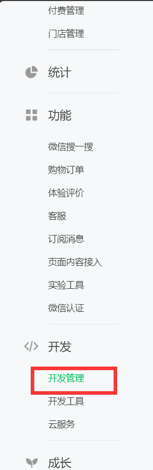

复制小程序AppID


### 开发⼯具
下载地址
https://developers.weixin.qq.com/miniprogram/dev/devtools/download.html

微信⼩程序⾃带开发者⼯具，集 开发 预览 调试 发布 于⼀⾝的 完整环境。
但是由于编码的体验不算好，因此 建议使⽤ vs code + 微信小程序编辑工具 来实现编码，vs code 负责敲代码， 微信编辑工具 负责预览

## 第⼀个微信⼩程序
### 打开微信开发者⼯具
注意 第⼀次登录的时候 需要扫码登录
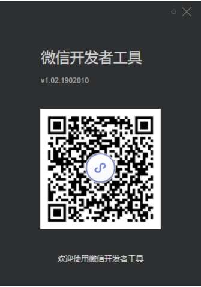
### 新建⼩程序项⽬
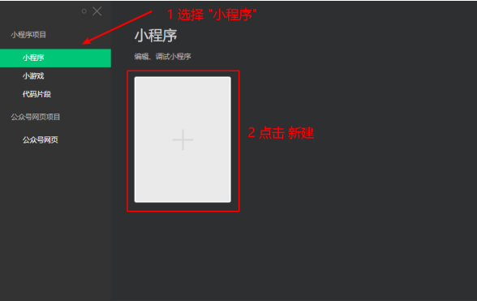

### 填写项⽬信息
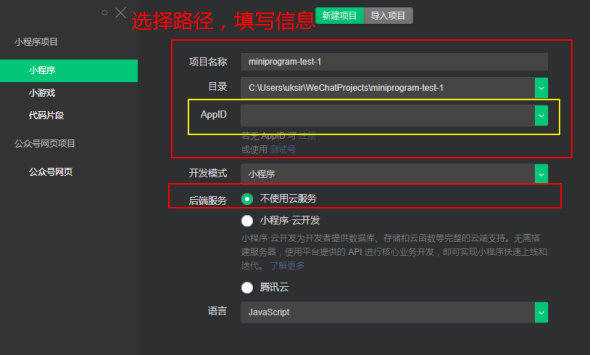

### 成功
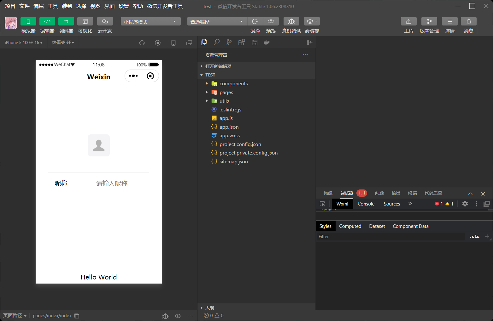

##  微信开发者⼯具介绍
详细的使⽤，可以查看官⽹ https://developers.weixin.qq.com/miniprogram/dev/devtools/devtools.html

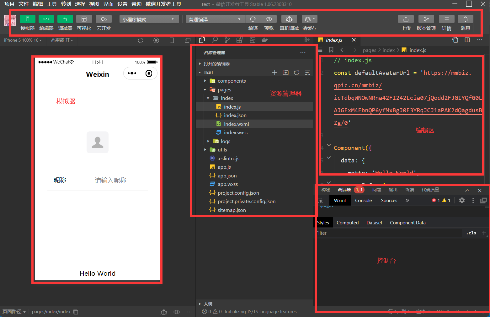

## ⼩程序结构⽬录
⼩程序框架的⽬标是通过尽可能简单、⾼效的⽅式让开发者可以在微信中开发具有原⽣APP体验的服务。
⼩程序框架提供了⾃⼰的视图层描述语⾔ WXML 和 WXSS ，以及 JavaScript ，并在视图层与逻辑层间提供了数据传输和事件系统，让开发者能够专注于数据与逻辑。
### ⼩程序⽂件结构和传统web对⽐


|结构| 传统web |微信⼩程序|
|------|------|--------|
|结构| HTML| WXML|
|样式| CSS| WXSS|
|逻辑 |Javascript |Javascript|
|配置| ⽆| JSON|

通过以上对⽐得出，传统web 是三层结构。⽽微信⼩程序 是四层结构，多了⼀层 配置.json

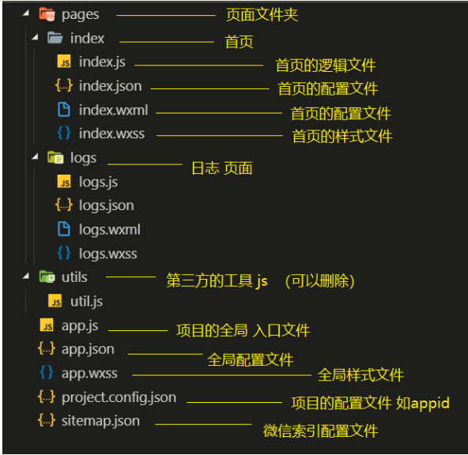

## ⼩程序配置⽂件
⼀个⼩程序应⽤程序会包括最基本的两种配置⽂件。⼀种是全局的 app.json 和 ⻚⾯⾃⼰的page.json
>注意：配置文件中不能出现注释
### 全局配置 app.json
app.json 是当前⼩程序的全局配置，包括了⼩程序的所有⻚⾯路径、界⾯表现、⽹络超时时间、底部 tab 等。普通快速启动项⽬⾥边的 app.json 配置
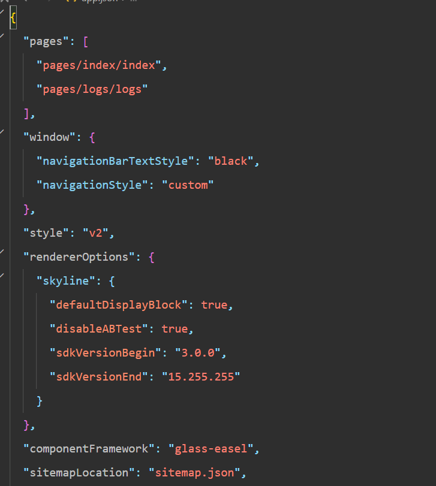

字段的含义
1. pages 字段⸺⽤于描述当前⼩程序所有⻚⾯路径，这是为了让微信客⼾端知道当前你的⼩程序⻚⾯定义在哪个⽬录。
2. window 字段⸺定义⼩程序所有⻚⾯的顶部背景颜⾊，⽂字颜⾊定义等。
3. style 	启用新版的组件样式
4. rendererOptions 小程序渲染后端的相关配置选项
5. 完整的配置信息请参考 app.json配置 https://developers.weixin.qq.com/miniprogram/dev/reference/configuration/app.html

### 页面配置
这⾥的 page.json 其实⽤来表⽰⻚⾯⽬录下的 page.json 这类和⼩程序⻚⾯相关的配置。开发者可以独⽴定义每个⻚⾯的⼀些属性，如顶部颜⾊、是否允许下拉刷新等等。
⻚⾯的配置只能设置 app.json 中部分 window 配置项的内容，⻚⾯中配置项会覆盖 app.json的 window 中相同的配置项。

|属性| 类型| 默认值 |描述|
|---------|---------|---------|---------|
|navigationBarBackgroundColor| HexColor| #000000| 导航栏背景颜⾊，如 #000000|
|navigationBarTextStyle| String| white| 导航栏标题颜⾊，仅⽀持 black / white|
|navigationBarTitleText |String| |导航栏标题⽂字内容|
|backgroundColor| HexColor| #ffffff| 窗⼝的背景⾊|
|backgroundTextStyle| String| dark| 下拉 loading 的样式，仅⽀持 dark / light|
|enablePullDownRefresh| Boolean| false| 是否全局开启下拉刷新。 详⻅ Page.onPullDownRefresh|
|onReachBottomDistance| Number| 50|⻚⾯上拉触底事件触发时距⻚⾯底部距离，单位为px。 详⻅Page.onReachBottom|
|disableScroll| Boolean| false|设置为 true 则⻚⾯整体不能上下滚动；只在⻚⾯配置中有效，⽆法在 app.json 中设置该项|

### sitemap 配置-了解即可
⼩程序根⽬录下的 sitemap.json ⽂件⽤于配置⼩程序及其⻚⾯是否允许被微信索引。

# 模板语法
WXML（WeiXin Markup Language）是框架设计的⼀套标签语⾔，结合基础组件、事件系统，可以构建出⻚⾯的结构。
## 数据绑定
###  普通写法
在index.wxml中去清空所有内容，添加以下内容。
```html
<view> {{ message }} </view>
```
在index.js中去清空所有内容，添加以下内容。
```json
Page({
  data: {
    message: 'Hello MINA!'
 }
})
```
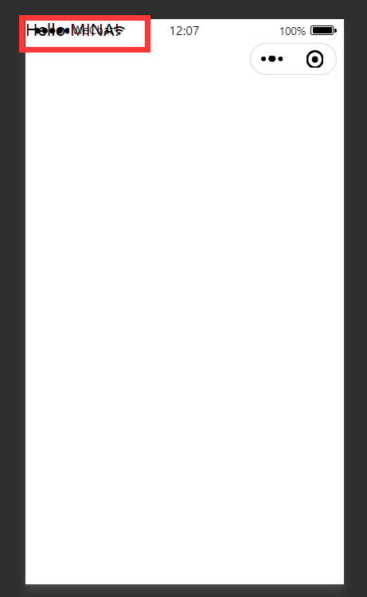

### 组件属性
在index.wxml中去清空所有内容，添加以下内容。
```html
<view id="item-{{id}}"> </view>
```
在index.js中去清空所有内容，添加以下内容。
```
Page({
  data: {
    id: 0
 }
})
```
编译后我们可以打开调试器，点击wxml选项查看我们的wxml是否 发生改变
**正确效果**
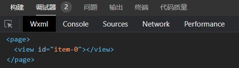
### bool类型
不要直接写 checked="false" ,因为其计算结果会被解析成一个字符串
```html
<checkbox checked="{{false}}"> </checkbox>
```

### 三元运算
flag为page的中的data数据。
```html
<view hidden="{{flag ? true : false}}"> Hidden </view>

```
### 算数运算
在index.wxml中去清空所有内容，添加以下内容。
```html
<view> {{a + b}} + {{c}} + d </view>
```
在index.js中去清空所有内容，添加以下内容。
```js
Page({
  data: {
    a: 1,
    b: 2,
    c: 3
 }
})
```
### 逻辑判断
```html
<view wx:if="{{length > 5}}"> </view>
```
### 字符串运算
```html
<view>{{"hello" + name}}</view>
```

```js
Page({
  data:{
    name: 'MINA'
 }
})
```
### 注意
花括号和引号之间如果有空格，将最终被解析成为字符串
## 列表渲染
### wx:for
项的变量名默认为 item wx:for--item 可以指定数组当前元素的变量名
下标变量名默认为 index wx:for--index 可以指定数组当前下标的变量名
wx:key ⽤来提⾼数组渲染的性能
wx:key 绑定的值 有如下选择
1. string 类型，表⽰ 循环项中的唯⼀属性 如
```js
list:[{id:0,name:"炒饭"},{id:1,name:"炒面"}]
wx:key="id"
```
2. 保留字 *this ，它的意思是 item 本⾝ ，*this 代表的必须是 唯⼀的字符串和数组。
```js
list:[1,2,3,4,5]
wx:key="*this"
```

**代码**
```html
<view wx:for="{{array}}" wx:key="id">
 {{index}}: {{item.message}}
</view>
```
```js
Page({
  data: {
    array: [{
      id:0,
      message: 'foo',
   }, {
      id:1,
      message: 'bar'
   }]
 }
})

```
**结果**
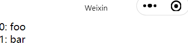

###  block
渲染⼀个包含多节点的结构块 block最终不会变成真正的dom元素

```html
<block wx:for="{{[1, 2, 3]}}" wx:key="*this" >
  <view> {{index}}: </view>
  <view> {{item}} </view>
</block>
```
**效果**
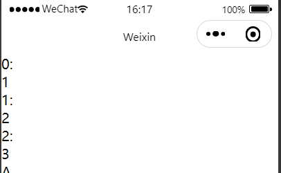

## 条件渲染
### wx:if

在框架中，使⽤ wx:if="{{condition}}" 来判断是否需要渲染该代码块：
```html
  <view wx:if="{{false}}">1</view>
  <view wx:elif="{{true}}">2</view>
  <view wx:else>3</view>

```
**结果**
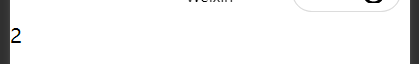
###  hidden
```html
<view hidden="{{condition}}"> True </view>
```
类似 wx:if
频繁切换 ⽤ hidden
不常使⽤ ⽤ wx:if

# ⼩程序事件的绑定
⼩程序中绑定事件，通过bind关键字来实现。如 bindtap bindinput bindchange 等不同的组件⽀持不同的事件，具体看组件的说明即可。
## 什么是事件
什么是事件
- 事件是视图层到逻辑层的通讯方式。
- 事件可以将用户的行为反馈到逻辑层进行处理。
- 事件可以绑定在组件上，当达到触发事件，就会执行逻辑层中对应的事件处理函数。
- 事件对象可以携带额外信息，如 id, dataset, touches
## wxml
```html
<input bindinput="handleInput" />
```
## page
```js
Page({
  // 绑定的事件
  handleInput: function(e) {
    console.log(e);
    console.log("值被改变了");
 }
})
```
**效果**
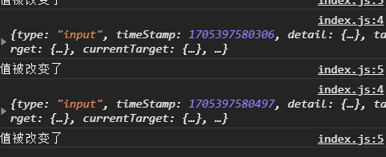
##  特别注意
1. 绑定事件时不能带参数 不能带括号 以下为错误写法
```html
<input bindinput="handleInput(100)" />
```
2. 事件传值 通过标签⾃定义属性的⽅式 和 value
```html
<input bindinput="handleInput" data-item="100" />
```
3. 事件触发时获取数据
```js
  handleInput: function(e) {
    // {item:100}
   console.log(e.currentTarget.dataset)
      
    // 输入框的值
   console.log(e.detail.value);
 }

```
#  样式 WXSS
WXSS( WeiXin Style Sheets )是⼀套样式语⾔，⽤于描述 WXML 的组件样式。
与 CSS 相⽐，WXSS 扩展的特性有：
- 响应式⻓度单位 rpx
- 样式导⼊

## 尺⼨单位
rpx （responsive pixel）: 可以根据屏幕宽度进⾏⾃适应。规定屏幕宽为 750rpx 。如在iPhone6 上，屏幕宽度为 375px ，共有750个物理像素，则 750rpx = 375px = 750物理像素 ， 1rpx = 0.5px = 1物理像素 。
|设备| rpx换算px (屏幕宽度/750)| px换算rpx (750/屏幕宽度)|
|--------|-------------|----------|
|iPhone5 |1rpx = 0.42px |1px = 2.34rpx|
|iPhone6 |1rpx = 0.5px| 1px = 2rpx|
|iPhone6 Plus |1rpx = 0.552px |1px = 1.81rpx|

建议： 开发微信⼩程序时设计师可以⽤ iPhone6 作为视觉稿的标准。
使⽤步骤：
1. 确定设计稿宽度 pageWidth
2. 计算⽐例 750rpx = pageWidth px ,因此 1px=750rpx/pageWidth 。
3. 在less⽂件中，只要把设计稿中的 px => 750/pageWidth rpx 即可。

## 样式导⼊
wxss中直接就⽀持，样式导⼊功能。
也可以和 less中的导⼊混⽤。
使⽤ @import 语句可以导⼊外联样式表，只⽀持相对路径。
⽰例代码：
```css
/** common.wxss **/
.small-p {
  padding:5px;
}

```

```css
/** app.wxss **/
@import "common.wxss";
.middle-p {
  padding:15px;
}

```
## 选择器
特别需要注意的是 ⼩程序 不⽀持通配符 * 因此以下代码⽆效！
```css
*{
    margin:0;
    padding:0;
    box-sizing:border-box;
}
```
⽬前⽀持的选择器有：
|选择器| 样例| 样例描述|
|---------|---------|-------------|
|.class| .intro| 选择所有拥有 class="intro"的组件|
|#id| #firstname| 选择拥有 id="firstname"的组件|
|element| view| 选择所有 view 组件|
|element,element|view,checkbox|选择所有⽂档的 view 组件和所有的 checkbox 组
件|
|nth-child(n)| view:nth-child(n)| 选择某个索引的标签|
|::after |view::after |在 view 组件后边插⼊内容|
|::before| view::before| 在 view 组件前边插⼊内容|

## ⼩程序中使⽤less
原⽣⼩程序不⽀持 less ，其他基于⼩程序的框架⼤体都⽀持，如 wepy ， mpvue ， taro 等。但是仅仅因为⼀个less功能，⽽去引⼊⼀个框架，肯定是不可取的。因此可以⽤以下⽅式来实现
1. 编辑器是 vscode
2. 安装插件 easy less
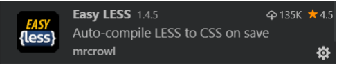
3. 在vs code的设置中加⼊如下，配置
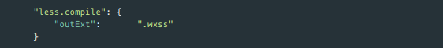
4. 在要编写样式的地⽅，新建 less ⽂件，如 index.less ,然后正常编辑即可。

# 常见组件
重点讲解⼩程序中常⽤的布局组件
view,text,rich--text,button,image,navigator,icon,swiper,radio,checkbox。 等

##  view
代替 原来的 div 标签
```html
  <view hover-class="h-class">
 点击我试试
  </view>
```
## text
1. ⽂本标签
2. 只能嵌套text
3. ⻓按⽂字可以复制（只有该标签有这个功能）
4. 可以对空格 回⻋ 进⾏编码

|属性名| 类型| 默认值| 说明|
|--------|---------|-------|---------|
|selectable| Boolean| false| ⽂本是否可选|
|decode |Boolean |false |是否解码|

```html
 <text selectable="{{false}}" decode="{{false}}">
   普&nbsp;通
  </text>
```
##  image
1. 图⽚标签，image组件默认宽度320px、⾼度240px
2. ⽀持懒加载

|属性名| 类型| 默认值| 说明|
|-----------|------------|-----------|---------|
|src |String ||图⽚资源地址|
|mode| String | 'scaleToFill'|图片剪裁，缩放的模式|
|lazy-load|Boolean|false|图片懒加载|

mode 有效值：
mode 有 13 种模式，其中 4 种是缩放模式，9种是裁剪模式。

|模式| 值| 说明|
|--------|-------|--------|
|缩放| scaleToFill| 不保持纵横⽐缩放图⽚，使图⽚的宽⾼完全拉伸⾄填满image 元素|
|缩放| aspectFit| 保持纵横⽐缩放图⽚，使图⽚的⻓边能完全显⽰出来。|
|缩放| aspectFill| 保持纵横⽐缩放图⽚，只保证图⽚的短边能完全显⽰出来。|
|缩放| widthFix| 宽度不变，⾼度⾃动变化，保持原图宽⾼⽐不变|
|裁剪| top| 不缩放图⽚，只显⽰图⽚的顶部区域|
|裁剪 |bottom| 不缩放图⽚，只显⽰图⽚的底部区域|
|裁剪| center| 不缩放图⽚，只显⽰图⽚的中间区域|
|裁剪 |left |不缩放图⽚，只显⽰图⽚的左边区域|
|裁剪| right| 不缩放图⽚，只显⽰图⽚的右边区域|
|裁剪 |top left |不缩放图⽚，只显⽰图⽚的左上边区域|
|裁剪| top right| 不缩放图⽚，只显⽰图⽚的右上边区域|
|裁剪 |bottom left |不缩放图⽚，只显⽰图⽚的左下边区域|
|裁剪| bottom right| 不缩放图⽚，只显⽰图⽚的右下边区域|

##   swiper
>微信内置轮播图组件
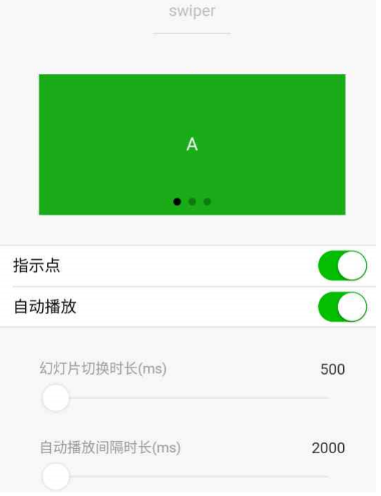

默认宽度 100% ⾼度 150px

|属性名| 类型| 默认值| 说明|
|--------|--------|-------|-------|
|indicator-dots| Boolean| false| 是否显⽰⾯板指⽰点|
|indicator-color |Color |rgba(0, 0, 0, .3)| 指⽰点颜⾊|
|indicator-active-color| Color| #000000| 当前选中的指⽰点颜⾊|
|autoplay| Boolean| false| 是否⾃动切换|
|interval| Number| 5000| ⾃动切换时间间隔|
|circular| Boolean| false| 是否循环轮播|

## navigator
>导航组件 类似超链接标签

|属性名| 类型| 默认| 说明|
|--------|-------|------|-------|
|target| String| self|在哪个⽬标上发⽣跳转，默认当前⼩程序，可选值self/miniProgram|
|url| String|| 当前⼩程序内的跳转链接|
|open-type|String| navigate| 跳转⽅式|

open-type 有效值：

|值| 说明|
|----------|---------|
|navigate| 保留当前⻚⾯，跳转到应⽤内的某个⻚⾯，但是不能跳到 tabbar ⻚⾯
|redirect |关闭当前⻚⾯，跳转到应⽤内的某个⻚⾯，但是不允许跳转到 tabbar ⻚⾯。
|switchTab| 跳转到 tabBar ⻚⾯，并关闭其他所有⾮ tabBar ⻚⾯
|reLaunch |关闭所有⻚⾯，打开到应⽤内的某个⻚⾯
|navigateBack|关闭当前⻚⾯，返回上⼀⻚⾯或多级⻚⾯。可通过 getCurrentPages() 获取当前的⻚⾯栈，决定需要返回⼏层
|exit| 退出⼩程序，target="miniProgram"时生效

## rich-text
>富文本标签

可以将字符串解析成 对应标签，类似 vue中 v--html 功能

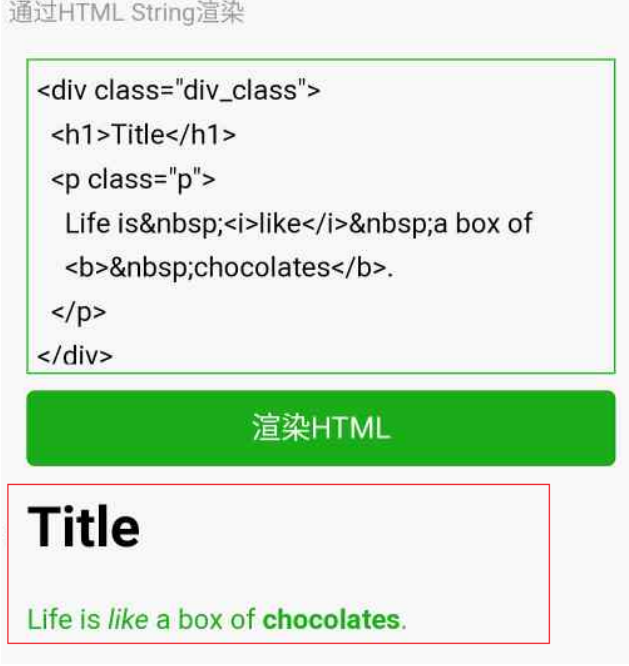

**代码**
```js
// 1   index.wxml 加载 节点数组
<rich-text nodes="{{nodes}}" bindtap="tap"></rich-text>
// 2 加载 字符串
<rich-text nodes=''></rich-text>
    
// index.js
    
Page({
  data: {
    nodes: [{
      name: 'div',
      attrs: {
        class: 'div_class',
        style: 'line-height: 60px; color: red;'
     },
      children: [{
        type: 'text',
        text: 'Hello&nbsp;World!'
     }]
   }]
 },
  tap() {
    console.log('tap')
 }
})
```
### nodes属性
>nodes 属性⽀持 字符串 和 标签节点数组

|属性| 说明| 类型| 必填| 备注|
|--------------|-----------|--------------|-----------|-------------|
|name |标签名| string |是| ⽀持部分受信任的 HTML 节点
|attrs |属性 |object |否| ⽀持部分受信任的属性，遵循 Pascal 命名法
|children| ⼦节点列表| array| 否| 结构和 nodes ⼀致

⽂本节点：type = text

|属性| 说明| 类型| 必填| 备注|
|--------------|-----------|--------------|-----------|-------------|
|text| ⽂本| string| 是| ⽀持entities

- nodes 不推荐使⽤ String 类型，性能会有所下降。
- rich--text 组件内屏蔽所有节点的事件。
- attrs 属性不⽀持 id ，⽀持 class 。
- name 属性⼤⼩写不敏感。
- 如果使⽤了不受信任的 HTML 节点，该节点及其所有⼦节点将会被移除。
- img 标签仅⽀持⽹络图⽚。

## button
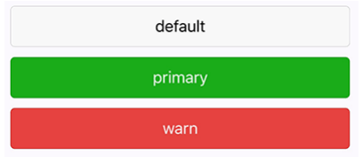

```html
<button
  type="default"
  size="{{defaultSize}}"
  loading="{{loading}}"
  plain="{{plain}}"
>
 default
</button>
```


|属性| 说明| 类型| 必填| 备注|
|--------------|-----------|--------------|-----------|-------------|
|size| string| default| 否| 按钮的⼤⼩
|type| string| default| 否| 按钮的样式类型
|plain| boolean| false| 否| 按钮是否镂空，背景⾊透明
|disabled| boolean| false| 否| 是否禁⽤
|loading| boolean| false| 否| 名称前是否带 loading 图标
|form-type|string| |否|⽤于 `` 组件，点击分别会触发 `` 组件的submit/reset 事件
|open-type|string|| 否| 微信开放能⼒|


**size 的合法值**
|值| 说明|
|------------|----------------|
|default| 默认⼤⼩|
|mini| ⼩尺⼨|

**type 的合法值**
|值| 说明|
|-------|--------|
|primary| 绿⾊|
|default |⽩⾊|
|warn| 红⾊|

**form-type 的合法值**

|值| 说明|
|-------|--------|
|submit |提交表单|
|reset| 重置表单|

**open-type 的合法值**

|值| 说明|
|-------|--------|
|contact|打开客服会话，如果⽤⼾在会话中点击消息卡⽚后返回⼩程序，可以从bindcontact 回调中获得具体信息，具体说明
|share |触发⽤⼾转发，使⽤前建议先阅读使⽤指引
|getPhoneNumber|获取⽤⼾⼿机号，可以从bindgetphonenumber回调中获取到⽤⼾信息，具体说明
|getUserInfo |获取⽤⼾信息，可以从bindgetuserinfo回调中获取到⽤⼾信息
|launchApp| 打开APP，可以通过app-parameter属性设定向APP传的参数具体说明
|openSetting| 打开授权设置⻚
|feedback|打开“意⻅反馈”⻚⾯，⽤⼾可提交反馈内容并上传⽇志，开发者可以登录⼩程序管理后台后进⼊左侧菜单“客服反馈”⻚⾯获取到反馈内容

## icon
|属性| 类型| 默认值|必填| 说明|
|--------------|-----------|--------------|-----------|-------------|
|type|| string |是|icon的类型，有效值：success, success_no_circle,info, warn, waiting, cancel, download, search,clear
|size| number/string| 23| 否| icon的⼤⼩
|color| string|| 否| icon的颜⾊，同css的color

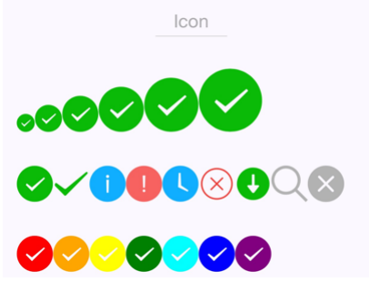


**代码**
js
```js
Page({
  data: {
    iconSize: [20, 30, 40, 50, 60, 70],
    iconType: [
      'success', 'success_no_circle', 'info', 'warn', 'waiting', 'cancel',
'download', 'search', 'clear'
   ],
    iconColor: [
      'red', 'orange', 'yellow', 'green', 'rgb(0,255,255)', 'blue', 'purple'
   ],
 }
})

```
wxml
```html
<view class="group">
  <block wx:for="{{iconSize}}">
    <icon type="success" size="{{item}}"/>
  </block>
</view>
<view class="group">
  <block wx:for="{{iconType}}">
    <icon type="{{item}}" size="40"/>
  </block>
</view>
<view class="group">
  <block wx:for="{{iconColor}}">
    <icon type="success" size="40" color="{{item}}"/>
  </block>
</view>
```
## from
**功能描述**
表单。将组件内的用户输入的switch input checkbox slider radio picker 提交。
当点击 form 表单中 form-type 为 submit 的 button 组件时，会将表单组件中的 value 值进行提交，需要在表单组件中加上 name 来作为 key

**属性说明**
|属性|	类型|	默认值|	必填|	说明|
|--------------|-----------|--------------|-----------|-------------|
|report-submit|	boolean|	false|	否	|是否返回 formId 用于发送模板消息
|report-submit-timeout|	number|	0	|否|	等待一段时间（毫秒数）以确认 formId 是否生效。如果未指定这个参数，formId 有很小的概率是无效的（如遇到网络失败的情况）。指定这个参数将可以检测 formId 是否有效，以这个参数的时间作为这项检测的超时时间。如果失败，将返回 requestFormId:fail 开头的 formId	
|bindsubmit|	eventhandle|		|否|	携带 form 中的数据触发 submit 事件，event.detail = {value : {'name': 'value'} , formId: ''}
|bindreset|	eventhandle||		否|	表单重置时会触发 reset 事件
**代码**
```html
<view class="container">
  <view class="page-body">
    <form catchsubmit="formSubmit" catchreset="formReset">
      <view class="page-section page-section-gap">
        <view class="page-section-title">switch</view>
        <switch name="switch"/>
      </view>

      <view class="page-section page-section-gap">
        <view class="page-section-title">radio</view>
        <radio-group name="radio">
          <label><radio value="radio1"/>选项一</label>
          <label><radio value="radio2"/>选项二</label>
        </radio-group>
      </view>

      <view class="page-section page-section-gap">
        <view class="page-section-title">checkbox</view>
        <checkbox-group name="checkbox">
          <label><checkbox value="checkbox1"/>选项一</label>
          <label><checkbox value="checkbox2"/>选项二</label>
        </checkbox-group>
      </view>

      <view class="page-section page-section-gap">
        <view class="page-section-title">slider</view>
        <slider value="50" name="slider" show-value ></slider>
      </view>

      <view class="page-section">
        <view class="page-section-title">input</view>
        <view class="weui-cells weui-cells_after-title">
          <view class="weui-cell weui-cell_input">
            <view class="weui-cell__bd" style="margin: 30rpx 0" >
              <input class="weui-input" name="input" placeholder="这是一个输入框" />
            </view>
          </view>
        </view>
      </view>

      <view class="btn-area">
        <button style="margin: 30rpx 0" type="primary" formType="submit">Submit</button>
        <button style="margin: 30rpx 0" formType="reset">Reset</button>
      </view>
    </form>
  </view>

</view>
```

```js
Page({
  onShareAppMessage() {
    return {
      title: 'form',
      path: 'page/component/pages/form/form'
    }
  },

  data: {
    pickerHidden: true,
    chosen: ''
  },

  pickerConfirm(e) {
    this.setData({
      pickerHidden: true
    })
    this.setData({
      chosen: e.detail.value
    })
  },

  pickerCancel() {
    this.setData({
      pickerHidden: true
    })
  },

  pickerShow() {
    this.setData({
      pickerHidden: false
    })
  },

  formSubmit(e) {
    console.log('form发生了submit事件，携带数据为：', e.detail.value)
  },

  formReset(e) {
    console.log('form发生了reset事件，携带数据为：', e.detail.value)
    this.setData({
      chosen: ''
    })
  }
})

```
**效果**
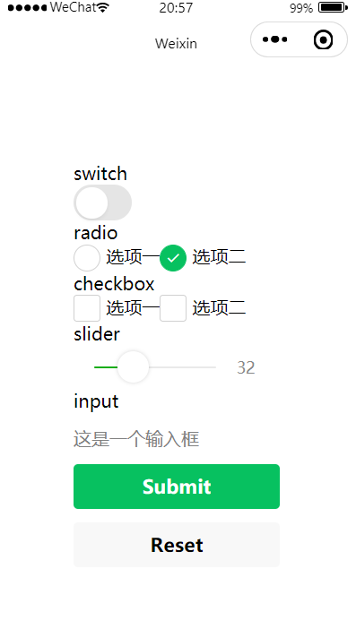
## radio
>可以通过 color属性来修改颜色

需要搭配 radio-group ⼀起使⽤

## checkbox
>可以通过 color属性来修改颜色

需要搭配 checkbox-group ⼀起使⽤


#  ⾃定义组件
>类似vue或者react中的自定义组件

⼩程序允许我们使⽤⾃定义组件的⽅式来构建⻚⾯。

## 创建⾃定义组件
>类似于页面，一个自定义组件由 json wxml wxss js 4个文件组成

可以在微信开发者⼯具中快速创建组件的⽂件结构
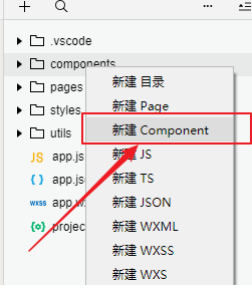

在⽂件夹内 components/myHeader ，创建组件 名为 myHeader

### 声明组件
首先需要在组件的json文件中进行自定义组件声明
myHeader.json

```json
"component" : true
```
### 编辑组件
同时，还要在组件的wxml文件中编写组件模板。在wxss文件中加入组件样式
slot表示插槽，类似vue中的slot
>myHeader.wxml

```html
<!-- 这是自定义组件的内部WXML结构 -->
<view class="inner">
 {{innerText}}
    <slot></slot>
</view>
```

在组件的 wxss ⽂件中编写样式
注意：在组件wxss中不应使用ID选择器、属性选择器和标签名选择器。
>myHeader.wxss
```css
/* 这里的样式只应用于这个自定义组件 */
.inner {
  color: red;
}
```
### 注册组件
在组件的 js ⽂件中，需要使⽤ Component() 来注册组件，并提供组件的属性定义、内部数据和⾃定义⽅法
>myHeader.js
```js
Component({
  properties: {
    // 这里定义了innerText属性，属性值可以在组件使用时指定
    innerText: {
      // 期望要的数据是 string类型
      type: String,
      value: 'default value',
   }
 },
  data: {
    // 这里是一些组件内部数据
    someData: {}
 },
  methods: {
    // 这里是一个自定义方法
    customMethod: function(){}
 }
})

```
## 声明引⼊⾃定义组件
⾸先要在⻚⾯的 json ⽂件中进⾏引⽤声明。还要提供对应的组件名和组件路径
index.wxml
```html
{
 // 引用声明
  "usingComponents": {
 // 要使用的组件的名称     // 组件的路径
    "my-header":"/components/myHeader/myHeader"
 }
}
```
## ⻚⾯中使⽤⾃定义组件
```html
<view>
  <!-- 以下是对一个自定义组件的引用 -->
  <my-header inner-text="Some text">
    <view>用来替代slot的</view>
    </my-header>
</view>
```
**效果**
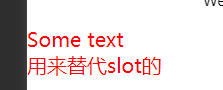
## 定义段与⽰例⽅法
Component 构造器可⽤于定义组件，调⽤ Component 构造器时可以指定组件的属性、数据、⽅法等。

|定义段| 类型|是否必填|描述|
|--------|--------|-------|--------|
|properties|Object  Map|否| 组件的对外属性，是属性名到属性设置的映射表，参⻅下⽂
|data| Object| 否|组件的内部数据，和 properties ⼀同⽤于组件的模板渲染
|observers| Object| 否|组件数据字段监听器，⽤于监听 properties 和 data 的变化，参⻅ 数据监听器
|methods| Object| 否|组件的⽅法，包括事件响应函数和任意的⾃定义⽅法，关于事件响应函数的使⽤，参⻅ 组件事件
|created| Function| 否|组件⽣命周期函数，在组件实例刚刚被创建时执⾏，注意此时不能调⽤ setData ，参⻅ 组件⽣命周期
|attached| Function| 否|组件⽣命周期函数，在组件实例进⼊⻚⾯节点树时执⾏，参⻅ 组件⽣命周期
|ready| Function| 否|组件⽣命周期函数，在组件布局完成后执⾏，参⻅ 组件⽣命周期
|moved| Function| 否|组件⽣命周期函数，在组件实例被移动到节点树另⼀个位置时执⾏，参⻅ 组件⽣命周期
|detached| Function| 否|组件⽣命周期函数，在组件实例被从⻚⾯节点树移除时执⾏，参⻅ 组件⽣命周期

## 组件-⾃定义组件传参
1. ⽗组件通过属性的⽅式给⼦组件传递参数
2. ⼦组件通过事件的⽅式向⽗组件传递参数

### 过程
1. ⽗组件 把数据 {{tabs}} 传递到 ⼦组件的 tabItems 属性中
2. ⽗组件 监听 onMyTab 事件
3. ⼦组件 触发 bindmytap 中的 mytap 事件
    - ⾃定义组件触发事件时，需要使⽤ triggerEvent ⽅法，指定 事件名 、 detail 对象
    -  ⽗ -> ⼦ 动态传值 this.selectComponent("#tabs");

**父组件代码**
```html
// page.wxml
<tabs tabItems="{{tabs}}" bindmytap="onMyTab" >
 内容-这里可以放插槽
</tabs>
// page.js
  data: {
    tabs:[
     {name:"体验问题"},
     {name:"商品、商家投诉"}
   ]
 },
  onMyTab(e){
    console.log(e.detail);
 },

```

**子组件代码**
```html
// com.wxml
<view class="tabs">
  <view class="tab_title"  >
    <block  wx:for="{{tabItems}}" wx:key="{{item}}">
      <view bindtap="handleItemActive" data-index="{{index}}">{{item.name}}</view>
    </block>
  </view>
  <view class="tab_content">
    <slot></slot>
  </view>
</view>
// com.js
Component({
  properties: {
    tabItems:{
      type:Array,
      value:[]
   }
 },
  /**
   * 组件的初始数据
   */
  data: {
 },
  /**
   * 组件的方法列表
   */
  methods: {
    handleItemActive(e){
      this.triggerEvent('mytap','haha');
   }
 }
})
```

# 小程序生命周期
分为应⽤⽣命周期和⻚⾯⽣命周期
## 应用生命周期
|属性| 类型| 默认值| 必填| 说明|
|------|-------|------|-------|-------|
|onLaunch| function| 否| 监听⼩程序初始化。|
|onShow| function| 否| 监听⼩程序启动或切前台。|
|onHide| function| 否| 监听⼩程序切后台。|
|onError| function| 否 |错误监听函数。|
|onPageNotFound| function| 否| ⻚⾯不存在监听函数。|

## 页面生命周期
|属性| 类型| 说明|
|---------|---------|---------|
|data| Object| ⻚⾯的初始数据|
|onLoad |function| ⽣命周期回调—监听⻚⾯加载
|onShow| function| ⽣命周期回调—监听⻚⾯显⽰
|onReady| function| ⽣命周期回调—监听⻚⾯初次渲染完成
|onHide| function| ⽣命周期回调—监听⻚⾯隐藏
|onUnload |function |⽣命周期回调—监听⻚⾯卸载
|onPullDownRefresh| function| 监听⽤⼾下拉动作
|onReachBottom| function| ⻚⾯上拉触底事件的处理函数
|onShareAppMessage| function| ⽤⼾点击右上⻆转发
|onPageScroll| function| ⻚⾯滚动触发事件的处理函数
|onResize| function| ⻚⾯尺⼨改变时触发，详⻅ 响应显⽰区域变化
|onTabItemTap| function| 当前是 tab ⻚时，点击 tab 时触发

## 页面生命周期


