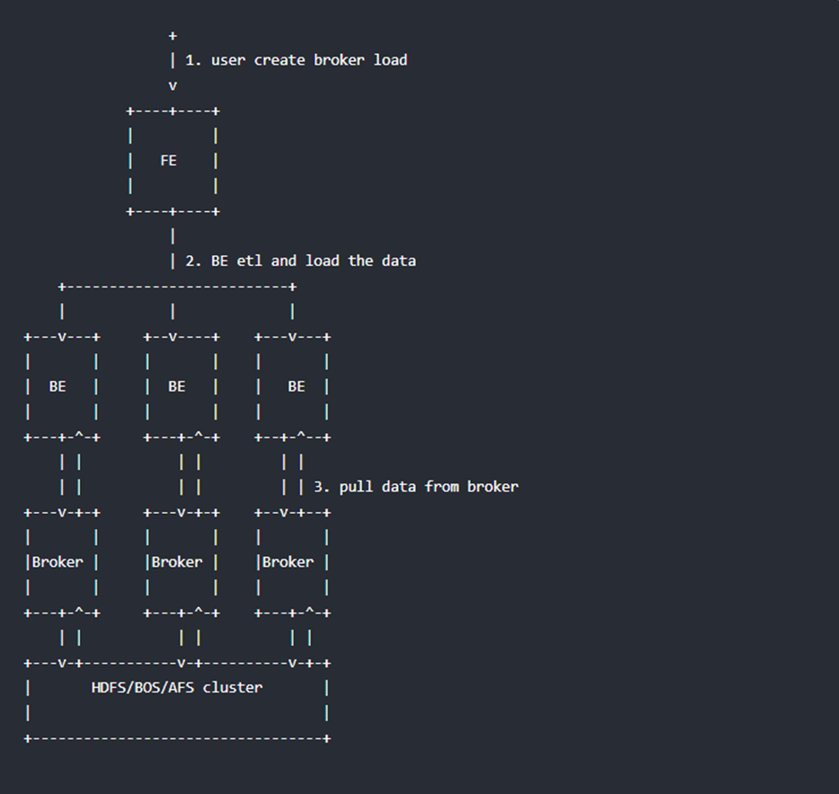

# 简介
## 概述
Apache Doris是一个现代化的基于MPP（大规模并行处理）技术的分析型数据库产品。简单来说，MPP是将任务并行的分散到多个服务器和节点上，在每个节点上计算完成后，将各自部分的结果汇总在一起得到最终的结果(与Hadoop相似)。仅需亚秒级响应时间即可获得查询结果，有效地支持实时数据分析。
## 特性
	基于MPP（大规模并行处理）架构的分析型数据库
	性能卓越，PB级别数据毫秒/秒级响应
	支持标准SQL语言，兼容MySQL协议
	向量化执行器
	高效的聚合表技术
	新型预聚合技术Rollup
	高性能、高可用、高可靠
	极简运维，弹性伸缩
## 特点
	性能卓越
TPC-H、TPC-DS性能领先，性价比高，高并发查询，100台集群可达10w QPS，流式导入单节点50MB/s，小批量导入毫秒延迟
	简单易用
高度兼容MySql协议；支持在线表结构变更高度集成，不依赖于外部存储系统
	扩展性强
架构优雅，单集群可以水平扩展至200台以上
	高可用性
多副本，元数据高可用
## docker 安装
```yaml
docker run -it \
-v /u01/.m2:/root/.m2 \
-v /u01/incubator-doris-DORIS-0.13-release/:/root/incubator-doris-DORIS-0.13-release/ \
apachedoris/doris-dev:build-env-1.2
```
#  Doris实践篇
##  创建用户
	Root 用户登录与密码修改
Doris 内置 root 和 admin 用户，密码默认都为空。启动完 Doris 程序之后，可以通过 root 或 admin 用户连接到 Doris 集群。 使用下面命令即可登录 Doris：
>mysql -h node1 -P9030 -uroot
登陆后，可以通过以下命令修改 root 密码
>SET PASSWORD FOR 'root' = PASSWORD('your_password');
	创建新用户
通过下面的命令创建一个普通用户
>CREATE USER 'test' IDENTIFIED BY 'test_passwd';
后续登录时就可以通过下列连接命令登录。
>mysql -h node1 -P9030 -utest -ptest_passwd
##  创建数据库并赋予权限
	创建数据库
初始可以通过 root 或 admin 用户创建数据库：
>CREATE DATABASE test_db;
	权限赋予
test_db 创建完成之后，可以通过 root/admin 账户将 test_db 读写权限授权给普通账户，如 test。授权之后采用 test 账户登录就可以操作 test_db 数据库了。
>GRANT ALL ON test_db TO test;
##  Doris 建表、数据导入与删除
可以通过在 mysql-client 中执行以下 help 命令获得更多帮助：
	help create table
	help load
	help mini load
	help delete
	help alter table
###  基本概念
在 Doris 中，数据都以表（Table）的形式进行逻辑上的描述。
####  Row & Column
一张表包括行（Row）和列（Column）。Row 即用户的一行数据。Column 用于描述一行数据中不同的字段。
Column 可以分为两大类：Key 和 Value。从业务角度看，Key 和 Value 可以分别对应维度列和指标列。从聚合模型的角度来说，Key 列相同的行，会聚合成一行。其中 Value 列的聚合方式由用户在建表时指定。关于更多聚合模型的介绍，可以参阅 Doris 数据模型
####  Tablet & Partition
在 Doris 的存储引擎中，用户数据被水平划分为若干个数据分片（Tablet，也称作数据分桶）。每个 Tablet 包含若干数据行。各个 Tablet 之间的数据没有交集，并且在物理上是独立存储的。
多个 Tablet 在逻辑上归属于不同的分区（Partition）。一个 Tablet 只属于一个 Partition。而一个 Partition 包含若干个 Tablet。因为 Tablet 在物理上是独立存储的，所以可以视为 Partition 在物理上也是独立。Tablet 是数据移动、复制等操作的最小物理存储单元。
若干个 Partition 组成一个 Table。Partition 可以视为是逻辑上最小的管理单元。数据的导入与删除，都可以或仅能针对一个 Partition 进行。
###  建表（Create Table）
使用 CREATE TABLE 命令建立一个表(Table)。更多详细参数可以查看:
>HELP CREATE TABLE;
首先切换数据库:
>USE test_db;
Doris 的建表是一个同步命令，命令返回成功，即表示建表成功。
可以通过 HELP CREATE TABLE; 查看更多帮助。
```sql
CREATE TABLE IF NOT EXISTS test_db.table0
(
    `user_id` LARGEINT NOT NULL COMMENT "用户id",
    `date` DATE NOT NULL COMMENT "数据灌入日期时间",
    `timestamp` DATETIME NOT NULL COMMENT "数据灌入的时间戳",
    `city` VARCHAR(20) COMMENT "用户所在城市",
    `age` SMALLINT COMMENT "用户年龄",
    `sex` TINYINT COMMENT "用户性别",
    `last_visit_date` DATETIME REPLACE DEFAULT "1970-01-01 00:00:00" COMMENT "用户最后一次访问时间",
    `cost` BIGINT SUM DEFAULT "0" COMMENT "用户总消费",
    `max_dwell_time` INT MAX DEFAULT "0" COMMENT "用户最大停留时间",
    `min_dwell_time` INT MIN DEFAULT "99999" COMMENT "用户最小停留时间"
)
ENGINE=olap
AGGREGATE KEY(`user_id`, `date`, `timestamp`, `city`, `age`, `sex`)
PARTITION BY RANGE(`date`)
(
    PARTITION `p202001` VALUES LESS THAN ("2020-02-01"),
    PARTITION `p202002` VALUES LESS THAN ("2020-03-01"),
    PARTITION `p202003` VALUES LESS THAN ("2020-04-01")
)
DISTRIBUTED BY HASH(`user_id`) BUCKETS 16
PROPERTIES
(
    "replication_num" = "3",
    "storage_medium" = "SSD",
    "storage_cooldown_time" = "2021-05-01 12:00:00"
);
```
####  字段类型

### 数据导入
为适配不同的数据导入需求，Doris系统提供了五种不同的数据导入方式，每种数据导入方式支持不同的数据源，存在不同的方式（异步，同步）
	Broker load
通过Broker进程访问并读取外部数据源（HDFS）导入Doris，用户通过Mysql提交导入作业，异步执行，通过show load命令查看导入结果
	Stream load
用户通过HTTP协议提交请求并携带原始数据创建导入，主要用于快速将本地文件或者数据流中的数据导入到Doris，导入命令同步返回结果
	Insert
类似Mysql中的insert语句，Doris提供insert into table select ...的方式从Doris的表中读取数据并导入到另一张表中，或者通过insert into table values(...)的方式插入单条数据
	Multi load
用户可以通过HTTP协议提交多个导入作业，Multi load可以保证多个导入作业的原子生效
	Routine load
用户通过Mysql协议提交例行导入作业，生成一个常驻线程，不间断的从数据源（如Kafka）中读取数据并导入到Doris中
#### Broker Load
Broker load是一个导入的异步方式，不同的数据源需要部署不同的 broker 进程。可以通过 show broker 命令查看已经部署的 broker。
#####	适用场景
	源数据在Broker可以访问的存储系统中，如HDFS
	数据量在几十到几百GB级别
##### 	基本原理
用户在递交导入任务后，FE（Doris系统的元数据和调度节点）会生成相应的PLAN（导入执行计划，BE会导入计划将输入导入Doris中）并根据BE（Doris系统的计算和存储节点）的个数和文件的大小，将PLAN分给多个BE执行，每个BE导入一部分数据。BE在执行过程中会从Broker拉取数据，在对数据转换之后导入系统，所有BE均完成导入，由FE最终决定导入是否成功

##### 语法
```sql
LOAD LABEL load_label
(
data_desc1[, data_desc2, ...]
),
WITH BROKER broker_name
[broker_properties]
[opt_properties];
```
#####  	查看导入

#### 	Stream Load
Broker load是一个同步的导入方式，用户通过发送HTTP协议将本地文件或者数据流导入到Doris中，Stream Load同步执行导入并返回结果，用户可以通过返回判断导入是否成功。
#####  	适用场景
Stream load 主要适用于导入本地文件，或通过程序导入数据流中的数据。

#### Routine Load
例行导入功能为用户提供了义中自动从指定数据源进行数据导入的功能

###  删除数据（Delete）
Doris 目前可以通过两种方式删除数据：DELETE FROM 语句和 ALTER TABLE DROP PARTITION 语句。
```sql
DELETE FROM table_name [PARTITION partition_name]
WHERE
column_name1 op { value | value_list } [ AND column_name2 op { value | value_list } ...];
```
#### 	DELETE FROM Statement（条件删除
#### 	DROP PARTITION Statement（删除分区）
## 高级功能
### 表结构变更
使用alter table 命令, 可进行
	增加列
	删除列
	修改列类型
	改变列顺序
### Rollup
Rollup 可以理解为 Table 的一个物化索引结构。物化是因为其数据在物理上独立存储，而 索引 的意思是，Rollup可以调整列顺序以增加前缀索引的命中率，也可以减少key列以增加数据的聚合度。
对于 table1 明细数据是 siteid, citycode, username 三者构成一组 key，从而对 pv 字段进行聚合；如果业务方经常有看城市 pv 总量的需求，可以建立一个只有 citycode, pv 的rollup。
## 	高级设置
### 增大内存
内存不够时, 查询可能会出现‘Memory limit exceeded’, 这是因为doris对每个用户默认设置内存限制为 2g
###  	修改超时时间
doris默认最长查询时间为300s, 如果仍然未完成, 会被cancel掉
### Broadcast/Shuffle Join
doris在join操作的时候时候, 默认使用broadcast的方式进行join, 即将小表通过广播的方式广播到大表所在的节点, 形成内存hash, 然后流式读出大表数据进行hashjoin
但如果小表的数据量也很大的时候, 就会造成内存溢出, 此时需要通过shuffle join的方式进行, 也被称为partition join. 即将大表小表都按照join的key进行hash, 然后进行分布式join
### doris的高可用方案
当部署多个 FE 节点时，用户可以在多个fe上部署负载均衡实现或者通过mysql connect 自动重连
### 索引和Rollup
ROLLUP 在多维分析中是“上卷”的意思，即将数据按某种指定的粒度进行进一步聚合。
Rollup可以理解为表的一个物化索引结构，Rollup可以调整列的顺序以增加前缀索引的命中率，也可以减少key列以增加数据的聚合度。
### 基本概念
在 Doris 中，我们将用户通过建表语句创建出来的表成为 Base 表（Base Table）。Base 表中保存着按用户建表语句指定的方式存储的基础数据。
在 Base 表之上，我们可以创建任意多个 ROLLUP 表。这些 ROLLUP 的数据是基于 Base 表产生的，并且在物理上是独立存储的。
ROLLUP 表的基本作用，在于在 Base 表的基础上，获得更粗粒度的聚合数据。
	在聚合表的基础上，按照其他维度再进一步聚合，提升查询效率。
	Doris索引是固定的前缀索引，用rollup改变索引顺序
### 案例
```sql
CREATE TABLE IF NOT EXISTS test_db.site_visit
(
    `user_id` LARGEINT NOT NULL COMMENT "用户id",
    `date` DATE NOT NULL COMMENT "数据灌入日期时间",
    `city` VARCHAR(20) COMMENT "用户所在城市",
    `age` SMALLINT COMMENT "用户年龄",
    `sex` TINYINT COMMENT "用户性别",
    `last_visit_date` DATETIME REPLACE DEFAULT "1970-01-01 00:00:00" COMMENT "用户最后一次访问时间",
    `cost` BIGINT SUM DEFAULT "0" COMMENT "用户总消费",
    `max_dwell_time` INT MAX DEFAULT "0" COMMENT "用户最大停留时间",
    `min_dwell_time` INT MIN DEFAULT "99999" COMMENT "用户最小停留时间"
)
AGGREGATE KEY(`user_id`, `date`, `city`, `age`, `sex`)
DISTRIBUTED BY HASH(`user_id`) BUCKETS 10;
CREATE TABLE IF NOT EXISTS test_db.site_visit
(
    `user_id` LARGEINT NOT NULL COMMENT "用户id",
    `date` DATE NOT NULL COMMENT "数据灌入日期时间",
    `city` VARCHAR(20) COMMENT "用户所在城市",
    `age` SMALLINT COMMENT "用户年龄",
    `sex` TINYINT COMMENT "用户性别",
    `last_visit_date` DATETIME REPLACE DEFAULT "1970-01-01 00:00:00" COMMENT "用户最后一次访问时间",
    `cost` BIGINT SUM DEFAULT "0" COMMENT "用户总消费",
    `max_dwell_time` INT MAX DEFAULT "0" COMMENT "用户最大停留时间",
    `min_dwell_time` INT MIN DEFAULT "99999" COMMENT "用户最小停留时间"
)
AGGREGATE KEY(`user_id`, `date`, `city`, `age`, `sex`)
DISTRIBUTED BY HASH(`user_id`) BUCKETS 10;
```
比如需要查看某个城市的user_id数，那么可以建立一个只有user_id和city的rollup
>alter table site_visit add rollup rollup_city_userid(city,user_id);
## 物化视图
物化视图是将预先计算（根据定义好的 SELECT 语句）好的数据集，存储在 Doris 中的一个特殊的表。
物化视图的出现主要是为了满足用户，既能对原始明细数据的任意维度分析，也能快速的对固定维度进行分析查询。

从定义上来说，就是包含了查询结果的数据库对象，可能是对远程数据的本地Copy；也可能是一个表或多表Join后结果的行或列的子集；也可能是聚合后的结果。说白了，就是预先存储查询结果的一种数据库对象。
### 适用场景
	分析需求覆盖明细数据查询以及固定维度查询两方面。
	查询仅涉及表中的很小一部分列或行。
	查询包含一些耗时处理操作，比如：时间很久的聚合操作等。
	查询需要匹配不同前缀索引。
### 优势
	对于那些经常重复的使用相同的子查询结果的查询性能大幅提升。
	Doris自动维护物化视图的数据，无论是新的导入，还是删除操作都能保证base 表和物化视图表的数据一致性。无需任何额外的人工维护成本。
	查询时，会自动匹配到最优物化视图，并直接从物化视图中读取数据。
### 物化视图 VS Rollup
在没有物化视图功能之前，用户一般都是使用 Rollup 功能通过预聚合方式提升查询效率的。但是 Rollup 具有一定的局限性，他不能基于明细模型做预聚合。
物化视图则在覆盖了 Rollup 的功能的同时，还能支持更丰富的聚合函数。所以物化视图其实是 Rollup 的一个超集。
也就是说，之前 ALTER TABLE ADD ROLLUP 语法支持的功能现在均可以通过 CREATE MATERIALIZED VIEW 实现。
### 使用物化视图
Doris 系统提供了一整套对物化视图的 DDL 语法，包括创建，查看，删除。DDL 的语法和 PostgreSQL, Oracle都是一致的。
#### 创建物化视图
这里首先你要根据你的查询语句的特点来决定创建一个什么样的物化视图。这里并不是说你的物化视图定义和你的某个查询语句一模一样就最好。这里有两个原则：
	从查询语句中抽象出，多个查询共有的分组和聚合方式作为物化视图的定义。
	不需要给所有维度组合都创建物化视图。
首先第一个点，一个物化视图如果抽象出来，并且多个查询都可以匹配到这张物化视图。这种物化视图效果最好。因为物化视图的维护本身也需要消耗资源。
如果物化视图只和某个特殊的查询很贴合，而其他查询均用不到这个物化视图。则会导致这张物化视图的性价比不高，既占用了集群的存储资源，还不能为更多的查询服务。
所以用户需要结合自己的查询语句，以及数据维度信息去抽象出一些物化视图的定义。
第二点就是，在实际的分析查询中，并不会覆盖到所有的维度分析。所以给常用的维度组合创建物化视图即可，从而到达一个空间和时间上的平衡。
通过下面命令就可以创建物化视图了。创建物化视图是一个异步的操作，也就是说用户成功提交创建任务后，Doris 会在后台对存量的数据进行计算，直到创建成功。
>CREATE MATERIALIZED VIEW
具体的语法可以通过下面命令查看：
>HELP CREATE MATERIALIZED VIEW
#### 更新策略
为保证物化视图表和 Base 表的数据一致性, Doris 会将导入，删除等对 base 表的操作都同步到物化视图表中。并且通过增量更新的方式来提升更新效率。通过事务方式来保证原子性。
比如如果用户通过 INSERT 命令插入数据到 base 表中，则这条数据会同步插入到物化视图中。当 base 表和物化视图表均写入成功后，INSERT 命令才会成功返回。
#### 	查询自动匹配
物化视图创建成功后，用户的查询不需要发生任何改变，也就是还是查询的 base 表。Doris 会根据当前查询的语句去自动选择一个最优的物化视图，从物化视图中读取数据并计算。
用户可以通过 EXPLAIN 命令来检查当前查询是否使用了物化视图。
物化视图中的聚合和查询中聚合的匹配关系：
## 动态分区
动态分区是在 Doris 0.12 版本中引入的新功能。旨在对表级别的分区实现生命周期管理(TTL)，减少用户的使用负担。
目前实现了动态添加分区及动态删除分区的功能。
