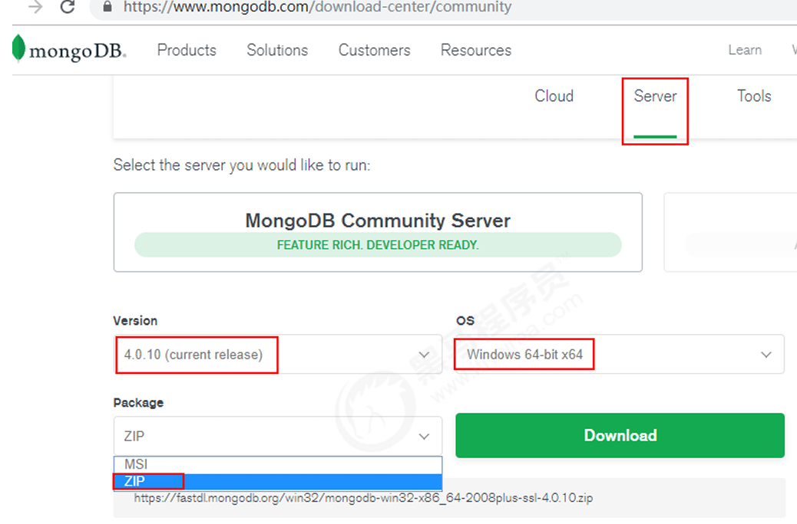
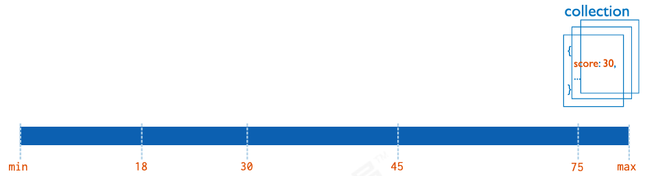
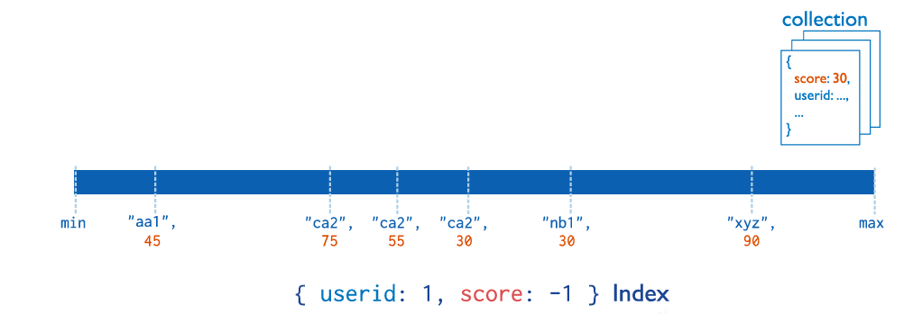
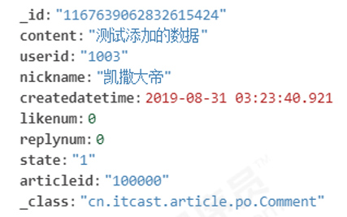

#  MongoDB
## MongoDB介绍
### 应用场景
传统的关系型数据库（如MySQL），在数据操作的“三高”需求以及应对Web2.0的网站需求面前，显得力不从心。
解释：“三高”需求：
• High performance - 对数据库高并发读写的需求。
• Huge Storage - 对海量数据的高效率存储和访问的需求。
• High Scalability && High Availability- 对数据库的高可扩展性和高可用性的需求。
而MongoDB可应对“三高”需求。
具体的应用场景如：
1）社交场景，使用 MongoDB 存储存储用户信息，以及用户发表的朋友圈信息，通过地理位置索引实现附近的人、地点等功能。
2）游戏场景，使用 MongoDB 存储游戏用户信息，用户的装备、积分等直接以内嵌文档的形式存储，方便查询、高效率存储和访问。
3）物流场景，使用 MongoDB 存储订单信息，订单状态在运送过程中会不断更新，以 MongoDB 内嵌数组的形式来存储，一次查询就能将订单所有的变更读取出来。
4）物联网场景，使用 MongoDB 存储所有接入的智能设备信息，以及设备汇报的日志信息，并对这些信息进行多维度的分析。
5）视频直播，使用 MongoDB 存储用户信息、点赞互动信息等。
这些应用场景中，数据操作方面的共同特点是：
（1）数据量大
（2）写入操作频繁（读写都很频繁）
（3）价值较低的数据，对事务性要求不高
对于这样的数据，我们更适合使用MongoDB来实现数据的存储。


###  MongoDB简介
MongoDB是一个开源、高性能、无模式的文档型数据库，当初的设计就是用于简化开发和方便扩展，是NoSQL数据库产品中的一种。是最像关系型数据库（MySQL）的非关系型数据库。
它支持的数据结构非常松散，是一种类似于 JSON 的 格式叫BSON，所以它既可以存储比较复杂的数据类型，又相当的灵活。

MongoDB中的记录是一个文档，它是一个由字段和值对（field:value）组成的数据结构。MongoDB文档类似于JSON对象，即一个文档认为就是一个对象。字段的数据类型是字符型，它的值除了使用基本的一些类型外，还可以包括其他文档、普通数组和文档数组。
### 体系结构 
MySQL和MongoDB对比
 
|SQL术语/概念|MongoDB术语/概念|解释/说明|
|-------------------------|-------------------------|---------------|
|database|database|数据库|
|table |collection|数据库表/集合|
|row|document|数据记录行/文档|
| column|field| MongoDB通过嵌入式文档来替代多表连接|
|index|index|索引
|table joins|  |索引
|  |嵌入文档|MongoDB通过嵌入式文档来替代多表连接|
|primary key|primary key|主键,MongoDB自动将_id字段设置为主键|
### 数据模型
MongoDB的最小存储单位就是文档(document)对象。文档(document)对象对应于关系型数据库的行。数据在MongoDB中以BSON（Binary-JSON）文档的格式存储在磁盘上。
BSON（Binary Serialized Document Format）是一种类json的一种二进制形式的存储格式，简称Binary JSON。BSON和JSON一样，支持内嵌的文档对象和数组对象，但是BSON有JSON没有的一些数据类型，如Date和BinData类型。
BSON数据类型参考列表：
|数据类型|描述|举例|
|------------------|--------------------------|---------------------------|
|字符串|UTF-8字符串都可表示为字符串类型的数据|{"x" : "foobar"}|
|对象id|对象id是文档的12字节的唯一| ID {"X" :ObjectId() }|
|布尔值|真或者假：true或者false {"x":true}|
|数组|值的集合或者列表可以表示成数组|{"x" ： ["a", "b", "c"]}|
|32位整数|类型不可用。JavaScript仅支持64位浮点数，所以32位整数会被自动转换。|
|64位整数|不支持这个类型。shell会使用一个特殊的内嵌文档来显示64位整数|shell是不支持该类型的，shell中默认会转换成64位浮点数|
|64位浮点数|shell中的数字就是这一种类型|{"x"：3.14159，"y"：3}|
|null|表示空值或者未定义的对象|{"x":null}|
|undefined|文档中也可以使用未定义类型|{"x":undefined}|
|符号|shell不支持，shell会将数据库中的符号类型的数据自动转换成字符串|| 
|正则表达式|文档中可以包含正则表达式，采用JavaScript的正则表达式语法|{"x" ： /foobar/i}|
|代码|文档中还可以包含JavaScript代码|{"x" ： function() { /* …… */ }}|
|二进制数据|二进制数据可以由任意字节的串组成，不过shell中无法使用|| 
|最大值/最小值|BSON包括一个特殊类型，表示可能的最大值。shell中没有这个类型。||

###  MongoDB的特点
MongoDB主要有如下特点：
（1）**高性能**：
MongoDB提供高性能的数据持久性。特别是,对嵌入式数据模型的支持减少了数据库系统上的I/O活动。
索引支持更快的查询，并且可以包含来自嵌入式文档和数组的键。（文本索引解决搜索的需求、TTL索引解决历史数据自动过期的需求、地理位置索引可用于构建各种 O2O 应用）mmapv1、wiredtiger、mongorocks（rocksdb）、in-memory 等多引擎支持满足各种场景需求。
Gridfs解决文件存储的需求。
（2）**高可用性**：
MongoDB的复制工具称为副本集（replica set），它可提供自动故障转移和数据冗余。
（3）**高扩展性**：
MongoDB提供了水平可扩展性作为其核心功能的一部分。
分片将数据分布在一组集群的机器上。（海量数据存储，服务能力水平扩展）
从3.4开始，MongoDB支持基于片键创建数据区域。在一个平衡的集群中，MongoDB将一个区域所覆盖的读写只定向到该区域内的那些片。
（4）**丰富的查询支持**：
MongoDB支持丰富的查询语言，支持读和写操作(CRUD)，比如数据聚合、文本搜索和地理空间查询等。
（5）其他特点：如无模式（动态模式）、灵活的文档模型
## 部署
### Windows系统中的安装启动 
第一步：下载安装包
MongoDB 提供了可用于 32 位和 64 位系统的预编译二进制包，你可以从MongoDB官网下载安装，MongoDB 预编译二进制包下载地址：
https://www.mongodb.com/download-center#community
根据上图所示下载

第二步：解压安装启动
将压缩包解压到一个目录中。在解压目录中，手动建立一个目录用于存放数据文件，如
方式1：命令行参数方式启动服务
在bin目录中打开命令行提示符，输入如下命令：
```rs
mongod --dbpath=..\data\db
```

我们在启动信息中可以看到，mongoDB的默认端口是27017，如果我们想改变默认的启动端口，可以通过--port来指定端口。为了方便我们每次启动，可以将安装目录的bin目录设置到环境变量的path中.
方式2：配置文件方式启动服务
在解压目录中新建config文件夹，该文件夹中新建配置文件mongod.conf目录下是一些常用命令，比如mongod，内如参考如下：
启动服务用的，
```conf
systemLog:
 destination: file
 #The path of the log file to which mongod or mongos should send all diagnostic logging information
 path: "D:/02_Server/DBServer/mongodb-win32-x86_64-2008plus-ssl-4.0.1/log/mongod.log"
 logAppend: true
 storage:
 journal:
 enabled: true
 #The directory where the mongod instance stores its data.Default Value is "/data/db".
 dbPath: "D:/02_Server/DBServer/mongodb-win32-x86_64-2008plus-ssl-4.0.1/data"
 net:
 #bindIp: 127.0.0.1
 port: 27017
 setParameter:
 enableLocalhostAuthBypass: false
```

详细配置项内容可以参考官方文档：
https://docs.mongodb.com/manual/reference/configuration-options/

**启动方式：**
>mongod -f ../config/mongod.conf

或

>mongod --config ../config/mongod.conf

**连接(mongo命令)**
在命令提示符输入以下shell命令即可完成登陆
mongo 或 mongo --host=127.0.0.1 --port=27017
查看已经有的数据库
>show databases

退出

>mongodb exit

更多参数可以通过帮助查看：
>mongo --help
### docker安装
**拉取mongo镜像**

>docker pull mongo:4.4

创建mongo数据持久化目录
>mkdir -p /docker_volume/mongodb/data

运行容器
>docker run -itd --name mongo -v /docker_volume/mongodb/data:/data/db -p 27017:27017 mongo:4.4 --auth

-v: 将宿主机的/docker_volume/mongodb/data映射到容器的/data/db目录，将数据持久化到宿主机，以防止删除容器后，容器内的数据丢失–auth：需要密码才能访问容器服务
**创建用户**
登录mongo容器，并进入到【admin】数据库
> docker exec -it mongo mongo admin

创建一个用户，mongo 默认没有用户
>db.createUser({ user:'root',pwd:'123456',roles:[ { role:'userAdminAnyDatabase', db: 'admin'},'readWriteAnyDatabase']});

【user:‘root’ 】：设置用户名为root
【pwd:‘123456’】：设置密码为123456
【role:‘userAdminAnyDatabase’】：只在admin数据库中可用，赋予用户所有数据库的userAdmin权限
【db: ‘admin’】：可操作的数据库
【‘readWriteAnyDatabase’】：赋予用户读写权限

dbAdmin：允许用户在指定数据库中执行管理函数，如索引创建、删除，查看统计或访问system.profile

## 基本常用命令
### 案案例需求
存放文章评论的数据存放到MongoDB中，数据结构参考如下：
数据库：articledb

|专栏文章评论|comment|||
|-----------------------|--------------------|------------------|-------------|
|字段名称|字段含义|字段类型|备注|
|_id|ID|ObjectId或String|Mongo的主键字段|
|articleid|文章ID|String ||
|content|评论内容|String|| 
|userid|评论人ID|String ||
|nickname|评论人昵称|String|| 
|createdatetime|评论的日期时间|Date ||
|likenum|点赞数|Int32 |||
|replynum|回复数|Int32 ||
|state|状态|String| 0：不可见；1：可见||
|parentid|上级ID| String|如果为0表示文章的顶级评论|

###  数据库操作
#### 选择和创建数据库 
**选择和创建数据库的语法格式，如果数据库不存在则自动创建：**
> use 数据库名称


**查看有权限查看的所有的数据库命令**
>show dbs
或
show databases


**查看当前正在使用的数据库命令**
>db


另外：中默认的数据库为 test，如果你没有选择数据库，集合将存放在 test 数据库中。

有一些数据库名是保留的，可以直接访问这些有特殊作用的数据库。
- admin： 从权限的角度来看，这是"root"数据库。要是将一个用户添加到这个数据库，这个用户自动继承所有数据库的权限。一些特定的服务器端命令也只能从这个数据库运行，比如列出所有的数据库或者关闭服务器。
- local:这个数据永远不会被复制，可以用来存储限于本地单台服务器的任意集合
- config: 当Mongo用于分片设置时，config数据库在内部使用，用于保存分片的相关信息。
#### 数据库的删除
MongoDB 删除数据库的语法格式如下：
>db.dropDatabase()

### 集合操作 
集合，类似关系型数据库中的表。可以显示的创建，也可以隐式的创建。
#### 集合的显式创建
基本语法格式：
>db.createCollection(name)

参数说明：
- name: 要创建的集合名称

#### 集合的隐式创建 
当向一个集合中插入一个文档的时候，如果集合不存在，则会自动创建集合。

#### 集合的删除 
集合删除语法格式如下：
>db.collection.drop()
或
db.集合.drop()

**返回值**如果成功删除选定集合，则 drop() 方法返回 true，否则返回 false。

### 文档基本CRUD
文档（document）的数据结构和 JSON 基本一样。所有存储在集合中的数据都是 BSON 格式。

#### 文档的插入
（1）单个文档插入
使用insert() 或 save() 方法向集合中插入文档，语法如下：
```shell
db.collection.insert(
 <document or array of documents>,
 {
 writeConcern: <document>,
 ordered: <boolean>
 }
 )
```
|Parameter| Type| Description|
|--------------|------------|---------------|
|document| document or array|要插入到集合中的文档或文档数组。（json格式）|
|writeConcern| document||
|ordered| boolean| 可选。如果为真，则按顺序插入数组中的文档，如果其中一个文档出现错误，MongoDB将返回而不处理数组中的其余文档。如果为假，则执行无序插入，如果其中一个文档出现错误，则继续处理数组中的主文档。在版本2.6+中默认为true|

```shell
db.comment.insertMany([
 {"_id":"1","articleid":"100001","content":"我们不应该把清晨浪费在手机上，健康很重要，一杯温水幸福你我
他。","userid":"1002","nickname":"相忘于江湖","createdatetime":new Date("2019-08
05T22:08:15.522Z"),"likenum":NumberInt(1000),"state":"1"},
 {"_id":"2","articleid":"100001","content":"我夏天空腹喝凉开水，冬天喝温开水","userid":"1005","nickname":"伊人憔
悴","createdatetime":new Date("2019-08-05T23:58:51.485Z"),"likenum":NumberInt(888),"state":"1"},
 {"_id":"3","articleid":"100001","content":"我一直喝凉开水，冬天夏天都喝。","userid":"1004","nickname":"杰克船
长","createdatetime":new Date("2019-08-06T01:05:06.321Z"),"likenum":NumberInt(666),"state":"1"},
 {"_id":"4","articleid":"100001","content":"专家说不能空腹吃饭，影响健康。","userid":"1003","nickname":"凯
撒","createdatetime":new Date("2019-08-06T08:18:35.288Z"),"likenum":NumberInt(2000),"state":"1"},
 {"_id":"5","articleid":"100001","content":"研究表明，刚烧开的水千万不能喝，因为烫
嘴。","userid":"1003","nickname":"凯撒","createdatetime":new Date("2019-08
06T11:01:02.521Z"),"likenum":NumberInt(3000),"state":"1"}
 ]);
```
#### 文档的基本查询
查询数据的语法格式如下：

>db.collection.find(<query>, [projection])

参数：
|Parameter| Type| Description|
|--------------|--------------|------------------|
| query| document|可选。使用查询运算符指定选择筛选器。若要返回集合中的所有文档，请省略此参数或传递空文档({})。|
|projection|document|可选。指定要在与查询筛选器匹配的文档中返回的字段（投影）。|
 

 

【示例】
（1）**查询所有**
如果我们要查询spit集合的所有文档，我们输入以下命令
>db.comment.find()
或
db.comment.find({})

每条文档会有一个叫_id的字段，这个相当于我们原来关系数据库中表的主键，当你在插入文档记录时没有指定该字段，MongoDB会自动创建，其类型是ObjectID类型。

如果我们在插入文档记录时指定该字段也可以，其类型可以是ObjectID类型，也可以是MongoDB支持的任意类型。

如果我想按一定条件来查询，比如我想查询userid为1003的记录，怎么办？很简单！只 要在find()中添加参数即可，参数也是json格式，如下：
>db.comment.find({userid:'1003'})

如果你只需要返回符合条件的第一条数据，我们可以使用findOne命令来实现.
（2）**投影查询（Projection Query）**：
如果要查询结果返回部分字段，则需要使用投影查询（不显示所有字段，只显示指定的字段）。
如：查询结果只显示_id、userid、nickname:
 >db.comment.find({userid:"1003"},{userid:1,nickname:1})
 { "_id" : "4", "userid" : "1003", "nickname" : "凯撒" }
 { "_id" : "5", "userid" : "1003", "nickname" : "凯撒" }

#### 文档的更新
更新文档的语法：

>db.collection.update(query, update, options)
 //或
db.collection.update(
 <query>,
 <update>,
 {
 upsert: <boolean>,
 multi: <boolean>,
 writeConcern: <document>,
 collation: <document>,
 arrayFilters: [ <filterdocument1>, ... ],
 hint:  <document|string>        
}
 )
 // Available starting in MongoDB 4.2


|Parameter| Type| Description|
|----------------|--------------------|-----------------|
|query| document|更新的选择条件。可以使用与find（）方法中相同的查询选择器，类似sql update查询内where后面的。。在3.0版中进行了更改：当使用upsert:true执行update（）时，如果查询使用点表示法在_id字段上指定条件，则MongoDB将拒绝插入新文档。|
|update| document or pipeline|要应用的修改。该值可以是：包含更新运算符表达式的文档，或仅包含：对的替换文档|
|upsert| boolean|可选。如果设置为true，则在没有与查询条件匹配的文档时创建新文档。默认值为false，如果找不到匹配项，则不会插入新文档。|
|multi| boolean可选。如果设置为true，则更新符合查询条件的多个文档。如果设置为false，则更新一个文档。默认值为false。|
|writeConcern| document|可选。表示写问题的文档。抛出异常的级别。|
|collation| document|可选。指定要用于操作的校对规则。 校对规则允许用户为字符串比较指定特定于语言的规则，例如字母大小写和重音标记的规则。 校对规则选项具有以下语法：校对规则：{区域设置：， caseLevel:，caseFirst:，强度：，numericordering:，替代：，最大变量：，向后：} 指定校对规则时，区域设置字段是必需的；所有其他校对规则字段都是可选的|
|arrayFilters| array|可选。一个筛选文档数组，用于确定要为数组字段上的更新操作修改哪些数组元素。在更新文档中|
|hint| Document or string|可选。指定用于支持查询谓词的索引的文档或字符串。该选项可以采用索引规范文档或索引名称字符串。如果指定的索引不存在，则说明操作错误。|

（1）**覆盖的修改**
如果我们想修改_id为1的记录，点赞量为1001，输入以下语句：
>db.comment.update({_id:"1"},{likenum:NumberInt(1001)})

执行后，我们会发现，这条文档除了likenum字段其它字段都不见了，
（2）**局部修改**
为了解决这个问题，我们需要使用修改器$set来实现，命令如下：
> db.comment.update({_id:"2"},{$set:{likenum:NumberInt(889)}})

（3）**批量的修改**
更新所有用户为1003的用户的昵称为凯撒大帝。
> //修改所有符合条件的数据
db.comment.update({userid:"1003"},{$set:{nickname:"凯撒大帝"}},{multi:true})
 
（3）**列值增长的修改**
如果我们想实现对某列值在原有值的基础上进行增加或减少，可以使用$inc运算符来实现。
需求：对3号数据的点赞数，每次递增1
>db.comment.update({_id:"3"},{$inc:{likenum:NumberInt(1)}})

#### 删除文档 


删除文档的语法结构：
>db.集合名称.remove(条件)

以下语句可以将数据全部删除，请慎用
>db.comment.remove({})

如果删除_id=1的记录，输入以下语句
>db.comment.remove({_id:"1"})

### 文档的分页查询 
#### 统计查询 
统计查询使用count()方法，语法如下：
>db.collection.count(query, options)

|Parameter| Type| Description|
|-------|--------|---------|
| query| document|查询选择条件。|
|options|document| 用于修改计数的额外选项|

（1）**统计所有记录数**：
统计comment集合的所有的记录数：
>db.comment.count()


2）**按条件统计记录数**：
>db.comment.count({userid:"1003"})

#### 分页列表查询
可以使用limit()方法来读取指定数量的数据，使用skip()方法来跳过指定数量的数据。
基本语法如下所示：
>db.COLLECTION_NAME.find().limit(NUMBER).skip(NUMBER)

#### 排序查询 
sort() 方法对数据进行排序，sort() 方法可以通过参数指定排序的字段，并使用 1 和 -1 来指定排序的方式，其中 1 为升序排列，而 -1 是用于降序排列。
语法如下所示：
>db.COLLECTION_NAME.find().sort({KEY:1})
或
db.集合名称.find().sort(排序方式)

###  文档的更多查询
####  正则的复杂条件查询
>db.collection.find({field:/正则表达式/})
或
db.集合.find({字段:/正则表达式/})

#### 比较查询 
<, <=, >, >= 这个操作符也是很常用的，格式如下:
```shell
db.集合名称.find({ "field" : { $gt: value }}) // 大于: field > value
db.集合名称.find({ "field" : { $lt: value }}) // 小于: field < value
db.集合名称.find({ "field" : { $gte: value }}) // 大于等于: field >= value
db.集合名称.find({ "field" : { $lte: value }}) // 小于等于: field <= value
db.集合名称.find({ "field" : { $ne: value }}) // 不等于: field != value
```
#### 包含查询
包含使用$in操作符。 示例：查询评论的集合中userid字段包含1003或1004的文档
>db.comment.find({userid:{$in:["1003","1004"]}})

不包含使用$nin操作符。 示例：查询评论集合中userid字段不包含1003和1004的文档
>db.comment.find({userid:{$nin:["1003","1004"]}})

#### 条件连接查询 
我们如果需要查询同时满足两个以上条件，需要使用$and操作符将条件进行关联。（相 当于SQL的and） 格式为：
>$and:[ {  },{  },{ } ]

示例：查询评论集合中
likenum大于等于700 并且小于2000的文档：
```shell
db.comment.find({$and:[{likenum:{$gte:NumberInt(700)}},{likenum:{$lt:NumberInt(2000)}}]})
```


### 常用命令小结 
```
选择切换数据库：use articledb
插入数据：db.comment.insert({bson数据})
查询所有数据：db.comment.find();
条件查询数据：db.comment.find({条件})
查询符合条件的第一条记录：db.comment.findOne({条件})
查询符合条件的前几条记录：db.comment.find({条件}).limit(条数)
查询符合条件的跳过的记录：db.comment.find({条件}).skip(条数)
修改数据：db.comment.update({条件},{修改后的数据}) 或db.comment.update({条件},{$set:{要修改部分的字段:数据})
修改数据并自增某字段值：db.comment.update({条件},{$inc:{自增的字段:步进值}})
删除数据：db.comment.remove({条件})
统计查询：db.comment.count({条件})
模糊查询：db.comment.find({字段名:/正则表达式/})
条件比较运算：db.comment.find({字段名:{$gt:值}})
包含查询：db.comment.find({字段名:{$in:[值1，值2]}})或db.comment.find({字段名:{$nin:[值1，值2]}})
条件连接查询：db.comment.find({$and:[{条件1},{条件2}]})或db.comment.find({$or:[{条件1},{条件2}]})
```
## 索引-Index
###  索引的类型
####  单字段索引
MongoDB支持在文档的单个字段上创建用户定义的升序/降序索引，称为单字段索引（Single Field Index）。
对于单个字段索引和排序操作，索引键的排序顺序（即升序或降序）并不重要，因为MongoDB可以在任何方向上遍历索引。


#### 复合索引

MongoDB还支持多个字段的用户定义索引，即复合索引（Compound Index）。

复合索引中列出的字段顺序具有重要意义。例如，如果复合索引由{ userid: 1, score: -1 }组成，则索引首先按userid正序排序，然后在每个userid的值内，再在按score倒序排序。


####  其他索引
地理空间索引（Geospatial Index）、文本索引（Text Indexes）、哈希索引（Hashed Indexes）。
**地理空间索引（Geospatial Index）**
为了支持对地理空间坐标数据的有效查询，MongoDB提供了两种特殊的索引：返回结果时使用平面几何的二维索引和返回结果时使用球面几何的二维球面索引。
**文本索引（Text Indexes）**
MongoDB提供了一种文本索引类型，支持在集合中搜索字符串内容。这些文本索引不存储特定于语言的停止词（例如“the”、“a”、“or”），而将集合中的词作为词干，只存储根词。
**哈希索引（Hashed Indexes）**
为了支持基于散列的分片，MongoDB提供了散列索引类型，它对字段值的散列进行索引。这些索引在其范围内的值分布更加随机，但只支持相等匹配，不支持基于范围的查询

### 索引的管理操作

#### 索引的查看 
说明：返回一个集合中的所有索引的数组。
语法：
>db.collection.getIndexes()


【示例】
查看comment集合中所有的索引情况
> db.comment.getIndexes()
 [
 {
 "v" : 2,
 "key" : {
 "_id" : 1
 },
 "name" : "_id_",
 "ns" : "articledb.comment"
 }
 ]
#### 索引的创建 
说明：在集合上创建索引。
语法：
>db.collection.createIndex(keys, options)

|Parameter |Type| Description|
|-------------|-------------------|----------------|
| keys| document|包含字段和值对的文档，其中字段是索引键，值描述该字段的索引类型。对于字段上的升序索引，请指定值1；对于降序索引，请指定值-1。比如：{字段:1或-1}，其中1 为指定按升序创建索引，如果你想按降序来创建索引指定为 -1 即可。|
|options |document|可选。包含一组控制索引创建的选项的文档。有关详细信息，请参见选项详情列表。|
|Parameter| Type| Description|
|----------------|-----------------|------------------|
| background| Boolean|建索引过程会阻塞其它数据库操作，background可指定以后台方式创建索引，即增加"background" 可选参数。 "background" 默认值为false。|
|unique |Boolean|建立的索引是否唯一。指定为true创建唯一索引。默认值为false.|
|name| string|索引的名称。如果未指定，MongoDB的通过连接索引的字段名和排序顺序生成一个索引名称。|
|sparse| Boolean|对文档中不存在的字段数据不启用索引；这个参数需要特别注意，如果设置为true的话，在索引字段中不会查询出不包含对应字段的文档.。默认值为 false.|
|expireAfterSeconds| integer|指定一个以秒为单位的数值，完成 TTL设定，设定集合的生存时间。|
|v| index version|索引的版本号。默认的索引版本取决于mongod创建索引时运行的版本。|
|weights| document|索引权重值，数值在 1 到 99,999 之间，表示该索引相对于其他索引字段的得分权重。|
|default_language| string|对于文本索引，该参数决定了停用词及词干和词器的规则的列表。 默认为英语|
|language_override| string|对于文本索引，该参数指定了包含在文档中的字段名，语言覆盖默认的language，默认值为language.|

（1）单字段索引示例：对userid字段建立索引：
参数1：按升序创建索引
可以查看一下：
> db.comment.createIndex({userid:1})
 {
        "createdCollectionAutomatically" : false,
        "numIndexesBefore" : 1,
        "numIndexesAfter" : 2,
        "ok" : 1
 }
 > db.comment.getIndexes()
 [
        {
                "v" : 2,
                "key" : {
                        "_id" : 1
                },
                "name" : "_id_",
                "ns" : "articledb.comment"
        },
        {
                "v" : 2,
                "key" : {
                        "userid" : 1
                },
                "name" : "userid_1",
                "ns" : "articledb.comment"
        }
 ]


（2）复合索引：对userid和nickname同时建立复合（Compound）索引：
查看一下索引：
compass中：
 > db.comment.createIndex({userid:1,nickname:-1})
 {
        "createdCollectionAutomatically" : false,
        "numIndexesBefore" : 2,
        "numIndexesAfter" : 3,
        "ok" : 1
 }

####  索引的移除 
说明：可以移除指定的索引，或移除所有索引
一、指定索引的移除 语法：
>db.collection.dropIndex(index)
参数：
|Parameter| Type| Description|
|index| string or document|指定要删除的索引。可以通过索引名称或索引规范文档指定索引。若要删除文本索引，请指定索引名称。|

###  索引的使用
####  执行计划 
分析查询性能（Analyze Query Performance）通常使用执行计划（解释计划、Explain Plan）来查看查询的情况，如查询耗费的时间、是否基于索引查询等。
那么，通常，我们想知道，建立的索引是否有效，效果如何，都需要通过执行计划查看。
语法：
>db.collection.find(query,options).explain(options)


## 实战
### 项目搭建
```xml
<?xml version="1.0" encoding="UTF-8"?>
 <project xmlns="http://maven.apache.org/POM/4.0.0"
         xmlns:xsi="http://www.w3.org/2001/XMLSchema-instance"
         xsi:schemaLocation="http://maven.apache.org/POM/4.0.0 http://maven.apache.org/xsd/maven-4.0.0.xsd">
    <modelVersion>4.0.0</modelVersion>
 
    <parent>
        <groupId>org.springframework.boot</groupId>
        <artifactId>spring-boot-starter-parent</artifactId>
        <version>2.1.6.RELEASE</version>
        <relativePath/> <!-- lookup parent from repository -->
    </parent>
    <groupId>itcast</groupId>
    <artifactId>article</artifactId>
    <version>1.0-SNAPSHOT</version>
 
    <dependencies>
        <dependency>
            <groupId>org.springframework.boot</groupId>
            <artifactId>spring-boot-starter-test</artifactId>
            <scope>test</scope>
        </dependency>
        <dependency>
            <groupId>org.springframework.boot</groupId>
            <artifactId>spring-boot-starter-data-mongodb</artifactId>
        </dependency>
 
    </dependencies>
 </project>
```
（2）创建application.yml
```yml
spring:
  #数据源配置
  data:
    mongodb:
      # 主机地址
      host: 192.168.218.131
      # 数据库
      database: articledb
      # 默认端口是27017
      port: 27017
      username: root
      password: "123456"
      authentication-database: admin #必须设置设置权限认证的数据库
```
（3）创建启动类
onenewcode.article.ArticleApplication
```java
package onenewcode.article;
 
import org.springframework.boot.SpringApplication;
import org.springframework.boot.autoconfigure.SpringBootApplication;
 
@SpringBootApplication
 public class ArticleApplication {
 
    public static void main(String[] args) {
        SpringApplication.run(ArticleApplication.class, args);
    }
 }
```
 
（4）启动项目，看是否能正常启动，控制台没有错误。
 
### 文章评论实体类的编写 
创建实体类 创建包onenewcode.article，包下建包po用于存放实体类，创建实体类
onenewcode.article.po.Comment
```java
package onenewcode.article.service;

import onenewcode.article.dao.CommentRepository;
import onenewcode.article.po.Comment;
import org.springframework.beans.factory.annotation.Autowired;
import org.springframework.data.domain.Page;
import org.springframework.data.domain.PageRequest;
import org.springframework.data.mongodb.core.MongoTemplate;
import org.springframework.data.mongodb.core.query.Criteria;
import org.springframework.data.mongodb.core.query.Query;
import org.springframework.data.mongodb.core.query.Update;
import org.springframework.stereotype.Service;

import java.util.List;

@Service
public class CommentService {

    @Autowired
    private CommentRepository commentRepository;
    @Autowired
    private MongoTemplate mongoTemplate;


    /**
     * 保存一个评论
     * @param comment
     */
    public void saveComment(Comment comment){
        //如果需要自定义主键，可以在这里指定主键；如果不指定主键，MongoDB会自动生成主键
        //设置一些默认初始值。。。
        //调用dao
        commentRepository.save(comment);
    }

    /**
     * 更新评论
     * @param comment
     */
    public void updateComment(Comment comment){
        //调用dao
        commentRepository.save(comment);
    }

    /**
     * 根据id删除评论
     * @param id
     */
    public void deleteCommentById(String id){
        //调用dao
        commentRepository.deleteById(id);
    }

    /**
     * 查询所有评论
     * @return
     */
    public List<Comment> findCommentList(){
        //调用dao
        return commentRepository.findAll();
    }

    /**
     * 根据id查询评论
     * @param id
     * @return
     */
    public Comment findCommentById(String id){
        //调用dao
        return commentRepository.findById(id).get();
    }


    public Page<Comment> findCommentListByParentid(String parentid,int page,int size) {
        return commentRepository.findByParentid(parentid,PageRequest.of(page-1,size));
    }

    public void updateCommentLikenum(String id){

        //  查询条件
        Query query = Query.query(Criteria.where("_id").is(id));
        //  更新条件
        Update update = new Update();
        update.inc("likenum");
        mongoTemplate.updateFirst(query,update,Comment.class);
    }
}

```
**说明：**索引可以大大提升查询效率，一般在查询字段上添加索引，索引的添加可以通过Mongo的命令来添加，也可以在Java的实体类中通过注解添加。

 
1）单字段索引注解@Indexed
 org.springframework.data.mongodb.core.index.Indexed.class
声明该字段需要索引，建索引可以大大的提高查询效率。
Mongo命令参考：
>db.comment.createIndex({"userid":1})

2）复合索引注解@CompoundIndex
org.springframework.data.mongodb.core.index.CompoundIndex.class
复合索引的声明，建复合索引可以有效地提高多字段的查询效率。
>db.comment.createIndex({"userid":1,"nickname":-1})


### 文章评论的基本增删改查 
1) 创建数据访问接口 onenewcode.article包下创建dao包，包下创建接口
onenewcode.article.dao.CommentRepository
```java
package onenewcode.article.dao;
 
import onenewcode.article.po.Comment;
import org.springframework.data.domain.Page;
import org.springframework.data.domain.Pageable;
import org.springframework.data.mongodb.repository.MongoRepository;
 //评论的持久层接口
public interface CommentRepository extends MongoRepository<Comment,String> {
  
}
```
2) 创建业务逻辑类 onenewcode.article包下创建service包，包下创建类
```java
import onenewcode.article.po.Comment;
import org.springframework.beans.factory.annotation.Autowired;
import org.springframework.stereotype.Service;
 
import java.util.List;
 
//评论的业务层
@Service
 public class CommentService {
 
    //注入dao
    @Autowired
    private CommentRepository commentRepository;
    
    /**
     * 保存一个评论
     * @param comment
     */
    public void saveComment(Comment comment){
        //如果需要自定义主键，可以在这里指定主键；如果不指定主键，MongoDB会自动生成主键
        //设置一些默认初始值。。。
        //调用dao
        commentRepository.save(comment);
    }
 
    /**
     * 更新评论
     * @param comment
     */
    public void updateComment(Comment comment){
        //调用dao
        commentRepository.save(comment);
    }
 
    /**
     * 根据id删除评论
     * @param id
     */
    public void deleteCommentById(String id){
        //调用dao
        commentRepository.deleteById(id);
    }
 
    /**
     * 查询所有评论
     * @return
     */
    public List<Comment> findCommentList(){
        //调用dao
        return commentRepository.findAll();
    }
 
    /**
     * 根据id查询评论
     * @param id
     * @return
     */
    public Comment findCommentById(String id){
        //调用dao
        return commentRepository.findById(id).get();
    }
 }
```

3) 新建Junit测试类，测试保存和查询所有：
```java
package onenewcode.article.service;
 
import onenewcode.article.ArticleApplication;
import onenewcode.article.po.Comment;
import org.junit.Test;
import org.junit.runner.RunWith;
import org.springframework.beans.factory.annotation.Autowired;
import org.springframework.boot.test.context.SpringBootTest;
import org.springframework.data.domain.Page;
import org.springframework.test.context.junit4.SpringRunner;
import java.time.LocalDateTime;
import java.util.List;
//测试评论的业务层
//SpringBoot的Junit集成测试
 //SpringBoot的测试环境初始化，参数：启动类
@SpringBootTest
public class CommentServiceTest {
 
    //注入Service
    @Autowired
    private CommentService commentService;
 
    /**
     * 保存一个评论
     */
    @Test
    public void testSaveComment(){
        Comment comment=new Comment();
        comment.setArticleid("100000");
        comment.setContent("测试添加的数据");
        comment.setCreatedatetime(LocalDateTime.now());
        comment.setUserid("1003");
        comment.setNickname("凯撒大帝");
        comment.setState("1");
        comment.setLikenum(0);
        comment.setReplynum(0);
        
        commentService.saveComment(comment);
 
    }
 
    /**
     * 查询所有数据
     */
    @Test
    public void testFindAll(){
        List<Comment> list = commentService.findCommentList();
        System.out.println(list);
    }
    
     /**
     * 测试根据id查询
     */
    @Test
    public void testFindCommentById(){
        Comment comment = commentService.findCommentById("5d6a27b81b8d374798cf0b41");
        System.out.println(comment);
    }
}
```
添加结果：


### 根据上级ID查询文章评论的分页列表
1) CommentRepository新增方法定义
>//根据父id，查询子评论的分页列表
Page<Comment> findByParentid(String parentid, Pageable pageable);


2) CommentService新增方法
```java
 /**
     * 根据父id查询分页列表
     * @param parentid
     * @param page
     * @param size
     * @return
     */
    public Page<Comment> findCommentListPageByParentid(String parentid,int page ,int size){
        return commentRepository.findByParentid(parentid, PageRequest.of(page-1,size));
    }
```
3) junit测试用例
```java
 /**
     * 测试根据父id查询子评论的分页列表
     */
    @Test
    public void testFindCommentListPageByParentid(){
        Page<Comment> pageResponse = commentService.findCommentListPageByParentid("3", 1, 2);
        System.out.println("----总记录数："+pageResponse.getTotalElements());
        System.out.println("----当前页数据："+pageResponse.getContent());
    }
```
###  MongoTemplate实现评论点赞
以下点赞的临时示例代码： CommentService 新增updateThumbup方法
```java
   /**
     * 点赞-效率低
     * @param id
     */
    public void updateCommentThumbupToIncrementingOld(String id){
        Comment comment = CommentRepository.findById(id).get();
        comment.setLikenum(comment.getLikenum()+1);
        CommentRepository.save(comment);
    }
```
以上方法虽然实现起来比较简单，但是执行效率并不高，因为我只需要将点赞数加1就可以了，没必要查询出所有字段修改后再更新所有字
段。(蝴蝶效应)
我们可以使用MongoTemplate类来实现对某列的操作。 （1）修改CommentService
```java
//注入MongoTemplate
    @Autowired
    private MongoTemplate mongoTemplate;
 
/**
 * 点赞数+1
 * @param id
 */
 public void updateCommentLikenum(String id){
 //查询对象
Query query=Query.query(Criteria.where("_id").is(id));
 //更新对象
Update update=new Update();
 //局部更新，相当于$set
 //        
update.set(key,value)
 //递增$inc
 //        
update.inc("likenum",1);
 update.inc("likenum");
 }
 //参数1：查询对象
//参数2：更新对象
//参数3：集合的名字或实体类的类型Comment.class
 mongoTemplate.updateFirst(query,update,"comment");
}
```
2) 测试用例：
```java
 /**
 * 点赞数+1
 */
 @Test
 public void testUpdateCommentLikenum(){
 //对3号文档的点赞数+1
 commentService.updateCommentLikenum("3");
 }
```


#  Spring Task

##  介绍

**Spring Task** 是Spring框架提供的任务调度工具，可以按照约定的时间自动执行某个代码逻辑。

**定位**定时任务框架

**作用**定时自动执行某段Java代码


为什么要在Java程序中使用Spring Task？

**应用场景：**

1). 信用卡每月还款提醒


2). 银行贷款每月还款提醒


3). 火车票售票系统处理未支付订单


**强调：**只要是需要定时处理的场景都可以使用Spring Task


## cron表达式

**cron表达式**其实就是一个字符串，通过cron表达式可以**定义任务触发的时间**

**构成规则：**分为6或7个域，由空格分隔开，每个域代表一个含义

每个域的含义分别为：秒、分钟、小时、日、月、周、年(可选)

**举例：**

2022年10月12日上午9点整 对应的cron表达式为：**0 0 9 12 10 ? 2022**


**说明：**一般**日**和**周**的值不同时设置，其中一个设置，另一个用？表示。


**比如：**描述2月份的最后一天，最后一天具体是几号呢？可能是28号，也有可能是29号，所以就不能写具体数字。

为了描述这些信息，提供一些特殊的字符。这些具体的细节，我们就不用自己去手写，因为这个cron表达式，它其实有在线生成器。

cron表达式在线生成器：https://cron.qqe2.com/


可以直接在这个网站上面，只要根据自己的要求去生成corn表达式即可。所以一般就不用自己去编写这个表达式。

**通配符：**

\* 表示所有值； 

? 表示未说明的值，即不关心它为何值； 

\- 表示一个指定的范围； 

, 表示附加一个可能值； 

/ 符号前表示开始时间，符号后表示每次递增的值；

**cron表达式案例：**

*/5 * * * * ? 每隔5秒执行一次

0 */1 * * * ? 每隔1分钟执行一次

0 0 5-15 * * ? 每天5-15点整点触发

0 0/3 * * * ? 每三分钟触发一次

0 0-5 14 * * ? 在每天下午2点到下午2:05期间的每1分钟触发 

0 0/5 14 * * ? 在每天下午2点到下午2:55期间的每5分钟触发

0 0/5 14,18 * * ? 在每天下午2点到2:55期间和下午6点到6:55期间的每5分钟触发

0 0/30 9-17 * * ? 朝九晚五工作时间内每半小时

0 0 10,14,16 * * ? 每天上午10点，下午2点，4点 


