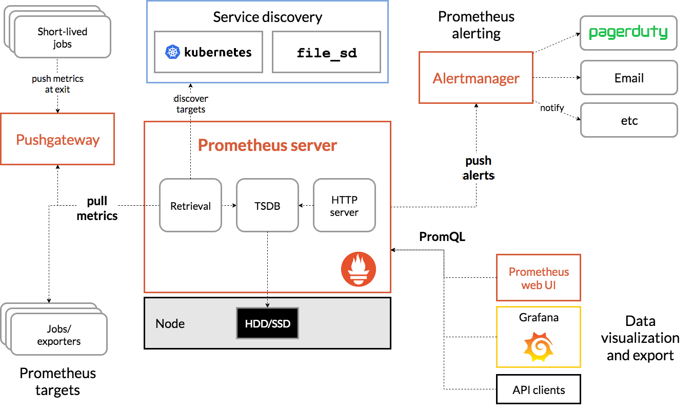
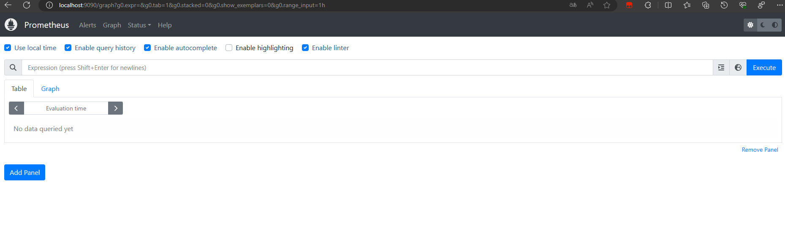
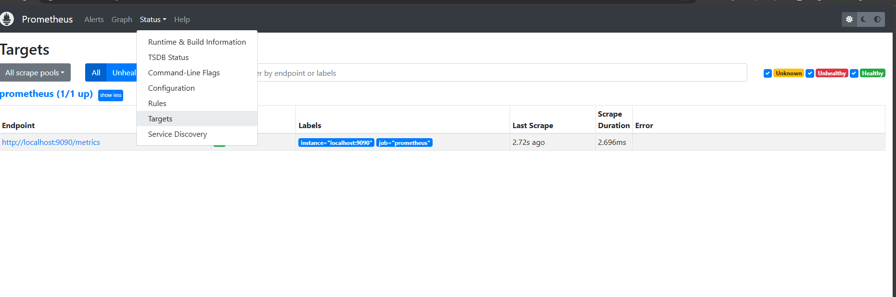

# Prometheuss实战
## Prometheus监控Kubernetes
### 搭建本地Kubernetes集群
为了能够更直观的了解和使用Kubernetes，我们将在本地通过工具Minikube(https://github.com/kubernetes/minikube)搭建一个本地的Kubernetes测试环境。Minikube会在本地通过虚拟机运行一个单节点的Kubernetes集群，可以方便用户或者开发人员在本地进行与Kubernetes相关的开发和测试工作。
安装过程就不再赘述

**启动**
```shell
$ minikube start
Starting local Kubernetes v1.7.5 cluster...
Starting VM...
SSH-ing files into VM...
Setting up certs...
Starting cluster components...
Connecting to cluster...
Setting up kubeconfig...
Kubectl is now configured to use the cluster.
```
MiniKube会自动配置本机的kubelet命令行工具，用于与对集群资源进行管理。同时Kubernetes也提供了一个Dashboard管理界面，在MiniKube下可以通过以下命令打开：
```shell
$ minikube dashboard
Opening kubernetes dashboard in default browser...
```
Kubernetes中的Dashboard本身也是通过Deployment进行部署的，因此可以通过MiniKube找到当前集群虚拟机的IP地址：
```shell
$ minikube ip
192.168.49.2
```
通过kubectl命令行工具，找到Dashboard对应的Service对外暴露的端口，如下所示，kubernetes-dashboard是一个NodePort类型的Service，并对外暴露了30000端口：
```shell
$ kubectl get service --namespace=kube-system
NAME       TYPE        CLUSTER-IP   EXTERNAL-IP   PORT(S)                  AGE
kube-dns   ClusterIP   10.96.0.10   <none>        53/UDP,53/TCP,9153/TCP   12d
```
在Dashbord中，用户可以可视化的管理当前集群中运行的所有资源，以及监视其资源运行状态。


Kubernetes环境准备完成后，就可以开始尝试在Kubernetes下尝试部署一个应用程序。Kubernetes中管理的所有资源都可以通过YAML文件进行描述。如下所示，创建了一个名为nginx-deploymeht.yml文件：
```yaml
apiVersion: apps/v1
kind: Deployment
metadata:
  name: nginx-deployment
  labels:
    app: nginx
spec:
  replicas: 2
  selector:
    matchLabels:
      app: nginx
  template:
    metadata:
      labels:
        app: nginx
    spec:
      containers:
      - name: nginx
        image: nginx:1.26.0
        ports:
        - containerPort: 80
```
在该YAML文件中，我们定义了需要创建的资源类型为Deployment，在metadata中声明了该Deployment的名称以及标签。spec中则定义了该Deployment的具体设置，通过replicas定义了该Deployment创建后将会自动创建3个Pod实例。运行的Pod以及进行则通过template进行定义。

在命令行中使用，如下命令：
```SHELL
$ kubectl create -f nginx-deploymeht.yml
deployment "nginx-deployment" created
```
在未指定命名空间的情况下，kubectl默认关联default命名空间。由于这里没有指定Namespace，该Deployment将会在默认的命令空间default中创建。 通过kubectl get命令查看当前Deployment的部署进度：


```SHELL
# 查看Deployment的运行状态
$ kubectl get deployments
NAME               READY   UP-TO-DATE   AVAILABLE   AGE
nginx-deployment   3/3     3            3           8m39s


# 查看运行的Pod实例
$ kubectl get pods
NAME                                READY     STATUS    RESTARTS   AGE
nginx-deployment-6d8f46cfb7-5f9qm   1/1       Running   0          1m
nginx-deployment-6d8f46cfb7-9ppb8   1/1       Running   0          1m
nginx-deployment-6d8f46cfb7-nfmsw   1/1       Running   0          1m
```
为了能够让用户或者其它服务能够访问到Nginx实例，这里通过一个名为nginx-service.yml的文件定义Service资源：
```SHELL
apiVersion: v1
kind: Service
metadata:
  labels:
    app: web
  name: nginx-service
spec:
  type: NodePort # 服务类型
  ports:
  - port: 80 # Service端口
    protocol: TCP # 协议
    targetPort: 80 # 容器端口
    nodePort: 30001  # 对外暴露的端口，可以指定
  selector:
    app: nginx # 指定关联Pod的标签

```
默认情况下，Service资源只能通过集群网络进行访问(type=ClusterIP)。这里为了能够直接访问该Service，需要将容器端口映射到主机上，因此定义该Service类型为NodePort。

创建并查看Service资源：
```shell
$ kubectl create -f nginx-service.yml
service "nginx-service" created

$ kubectl get svc
NAME            TYPE        CLUSTER-IP       EXTERNAL-IP   PORT(S)        AGE
kubernetes      ClusterIP   10.96.0.1        <none>        443/TCP        131d
nginx-service   NodePort    10.104.103.112   <none>        80:32022/TCP   10s
```
# 快速入门
## 介绍Prometheuss
Prometheus 是一款基于时序数据库的开源监控告警系统，非常适合Kubernetes集群的监控。Prometheus的基本原理是通过HTTP协议周期性抓取被监控组件的状态，任意组件只要提供对应的HTTP接口就可以接入监控。不需要任何SDK或者其他的集成过程。这样做非常适合做虚拟化环境监控系统，比如VM、Docker、Kubernetes等。输出被监控组件信息的HTTP接口被叫做exporter 。目前互联网公司常用的组件大部分都有exporter可以直接使用，比如Varnish、Haproxy、Nginx、MySQL、Linux系统信息(包括磁盘、内存、CPU、网络等等)。Promethus有以下特点：
- 支持多维数据模型：由度量名和键值对组成的时间序列数据
- 内置时间序列数据库TSDB
- 支持PromQL查询语言，可以完成非常复杂的查询和分析，对图表展示和告警非常有意义
- 支持HTTP的Pull方式采集时间序列数据
- 支持PushGateway采集瞬时任务的数据
- 支持服务发现和静态配置两种方式发现目标
- 支持接入Grafana
### 架构

## 安装
prometheus是一个下载即可使用的程序，我们只要在下面的官网，下载适合自己系统的压缩包解压，即可时使用。
>https://prometheus.io/download/

安装后，运行程序访问 localhost:9090 便会出现以下界面。


当然，由于我们没有监控任何信息，所以我们的面板是空白的。
## 实现hello word
首先我们要在解压的目录下找到prometheus.yml文件，并把内容替换为以下内容：
```yaml
global:
  scrape_interval:     15s # 默认情况下，每 15s 采集一次目标数据

  # 与外部系统(如 federation, remote storage, Alertmanager)通信时，可以将这些标签应用到到和时间序列或告警上
  external_labels:
    monitor: 'codelab-monitor'

# 仅包含一个采集端点的采集配置：这里是 Prometheus 本身
scrape_configs:
  # 作业名称作为标签 `job=<job_name>` 添加到从此配置中采集的时间序列上
  - job_name: 'prometheus'

    # 覆盖全局默认的参数，并将采样时间间隔设置为 5s
    scrape_interval: 5s

    static_configs:
      - targets: ['localhost:9090']
```
具体参数我们就不再进行解释。然后我们重新启动Prometheuss程序，点击左侧的status，然后点击targets，便可以看到我们的被监控程序


# 配置
## 配置
Prometheus 通过命令行参数和配置文件进行配置。命令行参数配置了不可变的系统参数(如存储位置，保留在磁盘和内存中的数据量等)。配置文件定义了与采集数据作业及实例相关的所有内容及加载哪些规则文件。

执行prometheus -h查看所有可用的命令行参数

Prometheus 可以在运行时重新加载其配置。如果新的配置格式不正确，则不会应用相关更改。通过向 Prometheus 进程发送SIGHUP信号或向/-/reload端点发送 HTTP POST 请求(当启动--web.enable-lifecycle标志时)来触发配置重载。同时，这也会重新加载所有已配置的规则文件。

### 配置文件
使用--config.file标志指定要加载的配置文件。

配置文件是 YAML 格式的，由以下描述的格式进行定义。方括号表示参数是可选的。对于非列表参数，该值设置为指定的默认值。

通用占位符定义如下：
- <boolean>: 值为 true 或 false 的布尔值
- <duration>: 可被正则表达式[0-9]+(ms|[smhdwy]匹配的一段时间
- <labelname>: 可被正则表达式[a-zA-Z_][a-zA-Z0-9_]*匹配的字符串
- <labelvalue>: unicode 字符串
- <filename>: 当前工作目录中的合法的路径
- <host>: 由主机名或 IP 后跟可选端口号组成的合法的字符串
- <path>: 合法的 URL 路径
- <scheme>: 字符串，可取值为 http 或 https
- <string>: 常规字符串
- <secret>: 加密后的常规字符串，例如密码
- <tmpl_string>: 使用模版扩展的字符串

个别其它占位符单独指出。

在这里可以找到合法的示例配置文件。

全局配置指定在所有其它配置上下文中有效的参数，它们还用作其它配置部分的默认配置。
```yaml
global:
  # 默认采集目标数据指标的频率
  [ scrape_interval: <duration> | default = 1m ]
  # 采集请求的超时时间
  [ scrape_timeout: <duration> | default = 10s ]
  # 评估规则的频率
  [ evaluation_interval: <duration> | default = 1m ]
  # 与外部扩展系统(federation, remote storage, Alertmanager)通信时添加到时间序列或告警的标签
  external_labels:
    [ <labelname>: <labelvalue> ... ]
  # 记录 PromQL 查询的文件。重新加载配置将重新打开文件
  [ query_log_file: <string> ]
# rule_files 指定了 globs 列表，从所有匹配的文件中读取规则和告警
rule_files:
  [ - <filepath_glob> ... ]
# 数据采集的配置列表
scrape_configs:
  [ - <scrape_config> ... ]
# Alerting 指定了与 Alertmanager 相关的配置
alerting:
  alert_relabel_configs:
    [ - <relabel_config> ... ]
  alertmanagers:
    [ - <alertmanager_config> ... ]
# 与远程写相关的配置
remote_write:
  [ - <remote_write> ... ]
# 与远程读相关的配置
remote_read:
  [ - <remote_read> ... ]
```
**<scrape_config>**
scrape_config 配置部分指定了一组目标和参数，这些目标和参数描述了如何对它们进行数据采集。一般情况下，一个采集配置指定一个作业。在高级配置中，这可能会改变。

可以通过static_configs参数配置静态目标，也可以使用支持的服务发现机制动态发现目标。

此外，relabel_configs允许在数据采集之前对任何目标及其标签进行进一步修改。
```yaml
# 数据采集的作业名称
job_name: <job_name>
# 本作业采集数据的频率
[ scrape_interval: <duration> | default = <global_config.scrape_interval> ]
# 本作业数据采集的超时时间
[ scrape_timeout: <duration> | default = <global_config.scrape_timeout> ]
# 从目标采集数据指标的 HTTP 资源路径
[ metrics_path: <path> | default = /metrics ]
# honor_labels 控制 Prometheus 如何处理已包含在采集数据中的标签与 Prometheus 将在服务器端附加的标签(包含 "job" 和 "instance" 标签，手动配置的目标标签以及由服务发现实现生成的标签)之间的冲突
#
# 如果 honor_labels 设置为 "true"，则通过保留采集数据中的标签值并忽略冲突的服务器端标签来解决标签冲突。
#
# 如果 honor_labels 设置为 "false"，则通过将已采集数据中的冲突标签重命名为 "exported_<original-label>"(例如 "exported_instance"、"exported_job")，并附加服务器端标签来解决标签冲突。
#
# 将 honor_labels 设置为 "true" 对于诸如联合和采集 Pushgateway 的用例很有用，在这种情况下应保留目标中指定的所有标签。
#
# 请注意，此设置不会影响任何全局配置的 "external_labels"。在与外部系统通信时，仅当时间序列尚没有给定标签时才始终应用它们，否则将忽略它们
[ honor_labels: <boolean> | default = false ]
# honor_timestamps 控制 Prometheus 是否保留采集数据中存在的时间戳。
#
# 如果 honor_timestamps 设置为 "true"，则将使用目标暴露的数据指标的时间戳。
#
# 如果honor_timestamps设置为 "false"，则目标暴露的数据指标的时间戳将被忽略。
[ honor_timestamps: <boolean> | default = true ]
# 配置用于请求的协议
[ scheme: <scheme> | default = http ]
# 可选的 HTTP URL参数
params:
  [ <string>: [<string>, ...] ]
# 使用配置的用户名和密码在每个数据擦剂请求上设置 `Authorization` 请求头
# password 和 password_file 是互斥的。
basic_auth:
  [ username: <string> ]
  [ password: <secret> ]
  [ password_file: <string> ]
# 使用 bearer_token 在每个数据采集请求上设置 `Authorization` 请求头。它与 `bearer_token_file` 参数互斥。
[ bearer_token: <secret> ]
# 使用从 bearer_token_file 文件中读取的 bearer_token 在每个采集请求上设置 `Authorization` 请求头。它与 `bearer_tokene` 参数互斥。
[ bearer_token_file: /path/to/bearer/token/file ]
# 数据采集请求的 TLS 设置
tls_config:
  [ <tls_config> ]
# 可选的代理 URL
[ proxy_url: <string> ]
# Azure 服务发现配置列表
azure_sd_configs:
  [ - <azure_sd_config> ... ]
# Consul 服务发现配置列表
consul_sd_configs:
  [ - <consul_sd_config> ... ]
# DNS 服务发现配置列表
dns_sd_configs:
  [ - <dns_sd_config> ... ]
# EC2 服务发现配置列表
ec2_sd_configs:
  [ - <ec2_sd_config> ... ]
# OpenStack服务发现配置列表
openstack_sd_configs:
  [ - <openstack_sd_config> ... ]
# 文件服务发现配置列表
file_sd_configs:
  [ - <file_sd_config> ... ]
# GCE 服务发现配置列表
gce_sd_configs:
  [ - <gce_sd_config> ... ]
# Kubernetes 服务发现配置列表
kubernetes_sd_configs:
  [ - <kubernetes_sd_config> ... ]
# Marathon 服务发现配置列表
marathon_sd_configs:
  [ - <marathon_sd_config> ... ]
# AirBnB Nerve 服务发现配置列表
nerve_sd_configs:
  [ - <nerve_sd_config> ... ]
# Zookeeper 服务发现配置列表
serverset_sd_configs:
  [ - <serverset_sd_config> ... ]
# Triton 服务发现配置列表
triton_sd_configs:
  [ - <triton_sd_config> ... ]
# 静态配置目标列表
static_configs:
  [ - <static_config> ... ]
# 目标重新标记配置列表
relabel_configs:
  [ - <relabel_config> ... ]
# 数据指标重新标记配置列表
metric_relabel_configs:
  [ - <relabel_config> ... ]
# 每次采集将接受的采集样本数限制。
# 如果在数据指标重新标记后存在的样本数量操作此数量，则本次数据采集将被视为不合格。0 表示没有限制
[ sample_limit: <int> | default = 0 ]
```
**<tls_config>**
tls_config 配置 TLS 连接相关内容。
```yaml
# 用于验证 API 服务器证书的 CA 证书
[ ca_file: <filename> ]
# 用于服务器的客户端证书认证的证书和密钥文件
[ cert_file: <filename> ]
[ key_file: <filename> ]
# ServerName 指定服务器的名称
# https://tools.ietf.org/html/rfc4366#section-3.1
[ server_name: <string> ]
# 禁用服务器证书的验证
[ insecure_skip_verify: <boolean> ]
```

**<azure_sd_config>**
azure 服务发现配置允许从 Azure VMs 发现数据收集的目标。

重新标记过程中，支持以下的 meta 标签：
- __meta_azure_machine_id: 设备 ID
- __meta_azure_machine_location: 设备运行位置
- __meta_azure_machine_name: 设备名称
- __meta_azure_machine_os_type: 设备操作系统
- __meta_azure_machine_private_ip: 设备的私有 IP 地址
- __meta_azure_machine_public_ip: 设备的公有 IP 地址(如果存在)
- __meta_azure_machine_resource_group: 设备的资源组
- __meta_azure_machine_tag_<tagname>: 设备的标签值
- __meta_azure_machine_scale_set: VM 所属的伸缩集的名称(当您使用此伸缩集时才设置此值)
- __meta_azure_subscription_id: 订阅 ID
- __meta_azure_tenant_id: 租户 ID

请参阅以下有关 Azure 服务发现的配置项：
```yaml
# 访问 Azure API 信息
# Azure 环境
[ environment: <string> | default = AzurePublicCloud ]
# 身份验证方式，OAuth 或 ManagedIdentity.
# 参见 https://docs.microsoft.com/en-us/azure/active-directory/managed-identities-azure-resources/overview
[ authentication_method: <string> | default = OAuth]
# subscription ID. 必需
subscription_id: <string>
# 可选的 tenant ID. 当认证方式为 OAuth 时必需
[ tenant_id: <string> ]
# 可选的 client ID. 当认证方式为 OAuth 时必需
[ client_id: <string> ]
# 可选的 client secret.当认证方式为 OAuth 时必需
[ client_secret: <secret> ]
# 重读实例列表的刷新间隔
[ refresh_interval: <duration> | default = 300s ]
# 采集数据的端口。如果使用公有 IP 地址，则必须在重新标记规则中指定该地址。
[ port: <int> | default = 80 ]
```

**<consul_sd_config>**
consul 服务发现配置允许从 consul 的 Catalog API 中自动发现采集数据的目标。

重新标记过程中，支持以下的 meta 标签：
- __meta_consul_address: 目标地址
- __meta_consul_dc: 目标数据中心名称
- __meta_consul_tagged_address_<key>: 节点标记的目标地址的键值
- __meta_consul_metadata_<key>: 节点标记的目标元数据的键值
- __meta_consul_node: 目标的节点名称
- __meta_consul_service_address: 目标的服务地址
- __meta_consul_service_id: 目标的服务 ID
- __meta_consul_service_metadata_<key>: 目标服务的元数据键值
- __meta_consul_service_port: 目标服务端口
- __meta_consul_service: 目标所属服务的名称
- __meta_consul_tags: 标签分割符连接的目标的标签列表
```yaml
# Consul API 的访问信息。根据 Consul 的需要进行定义
[ server: <host> | default = "localhost:8500" ]
[ token: <secret> ]
[ datacenter: <string> ]
[ scheme: <string> | default = "http" ]
[ username: <string> ]
[ password: <secret> ]
tls_config:
  [ <tls_config> ]
# 待发现数据采集的目标服务列表。如果省略，则采集所有服务。
services:
  [ - <string> ]
# 查看 [https://www.consul.io/api/catalog.html\#list-nodes-for-service](https://www.consul.io/api/catalog.html#list-nodes-for-service) 进一步了解可以使用的过滤器
# 可选的标签列表，用于过滤给定服务的节点。服务必须包含列表中的所有标签
tags:
  [ - <string> ]
# node_meta 用来过滤给定服务的节点
[ node_meta:
  [ <string>: <value> ... ] ]
# 将 Consul 标签连接到标签的字符串
[ tag_separator: <string> | default = , ]
# 允许过期的结果(参阅 [https://www.consul.io/api/features/consistency.html)将减少 Consul 的负载.
[ allow_stale: <bool> | default = true ]
# 服务发现名称刷新时间
# 在大型架构中，增加此值可能是个好主意，因为 catalog 不断更改
[ refresh_interval: <duration> | default = 30s ]
```
请注意，用于数据采集的目标的 IP 地址和端口被组合为<__meta_consul_address>:<__meta_consul_service_port>。 但是，在某些 Consul 设置中，相关地址在__meta_consul_service_address中。在这种情况下，您可以使用重新标记功能来替换特殊的__address__标签。

重新标记阶段是基于任意标签为服务筛选服务或节点的首选且功能更强大的方法。对于拥有数千项服务的用户而言，直接使用 Consul API 更为有效，该 API 具有基本的过滤节点支持(一般通过节点元数据和单个标签）。