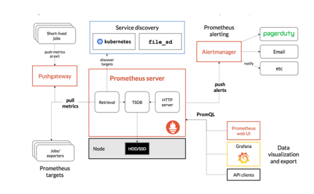
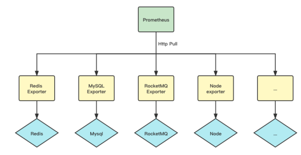
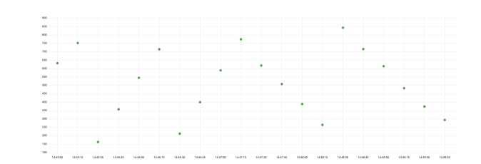
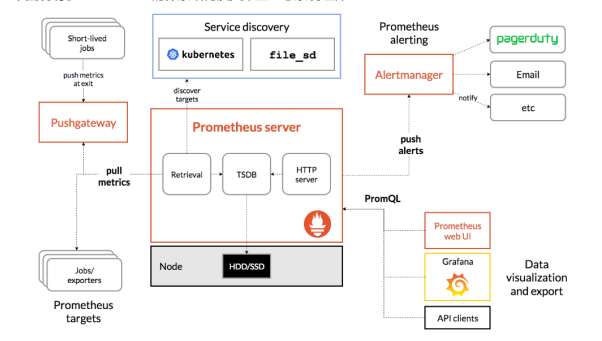

# 什么是prometheus
phometheus:当前一套非常流行的开源监控和报警系统。
## prometheus的运行原理
通过HTTP协议周期性抓取被监控组件的状态。输出被监控组件信息的HTTP接口称为exporter。
常用组件大部分都有exporter可以直接使用，比如haproxy,nginx，Mysql,Linux系统信息（包括磁盘、内存、CPU、网络等待）。
## prometheus主要特点
- 一个多维数据模型（时间序列由metrics指标名字和设置key/value键/值的labels构成）。
- 非常高效的存储，平均一个采样数据占~3.5字节左右，320万的时间序列，每30秒采样，保持60天，消耗磁盘大概228G。
- 一种灵活的查询语言（PromQL）。
- 无依赖存储，支持local和remote不同模型。
- 采用http协议，使用pull模式，拉取数据。
- 监控目标，可以采用服务器发现或静态配置的方式。
- 多种模式的图像和仪表板支持，图形化友好。
- 通过中间网关支持推送时间。
## Prometheus 生态体系
Prometheus 自带一个单机的 TSDB，他以 pull 模式抓取指标，被抓取的目标需要以 Http 的方式暴露指标数据。对于业务服务，服务需要将地址注册到注册中心，Prometheus 做服务发现，然后再做指标抓取。

Prometheus 拥有非常完善的 Exporter 生态，大部分我们使用的中间件都有成熟的 Exporter，利用这些 Exporter，我们可以快速的搭建起监控体系。


Prometheus 的黄金搭档 Grafana 在可视化方面表现也十分不错，Grafana 拥有非常丰富的面版、灵活易用。
# Prometheus 能力
Prometheus 从客户端角度区分出了几种指标类型：Counter、Gauge、Histogram、Summary。
## Counter
Counter 是一个只增不减的计数器，Prometheus 抓取的是 Counter 当前累计的总量。常见的如 GC 次数、Http 请求次数都是 Counter 类型的监控指标。
以下是 Counter 的样本数据特点，我们可以在查询时计算出任意一段时间的增量，也可以计算任意一段时间的增量/时间，即 QPS。
```go
Counter counter = Counter.build().name("upload_picture_total").help("上传图片数").register();
counter.inc();
```
如果服务器重启，Counter 累计计数归零，Prometheus 还能计算出准确的增量或 QPS 吗？
Prometheus 称这种情况为 Counter 重置，Counter 在重置后总是从 0 开始，那么根据这个假设，在给定的时间窗口计算增量时，只需将重置后的样本值叠加上重置前的值，以补偿重置，就像重置从未发生过一样。
## Gauge
Gauge 是个可增可减的仪表盘，Prometheus 抓取的是 Gauge 当前时刻设置的值。
常见的如内存使用量、活跃线程数等都是 Gauge 类型的监控指标。
```go
Gauge gauge = Gauge.build().name("active_thread_num").help("活跃线程数").register();
gauge.set(20);
```

以下是 Gauge 类型的样本数据特点，我们一般不做二次计算，直接展示 Prometheus 抓取的原始值。
##  Histogram
Histogram 通常用于数据分布统计，Histogram 需要定义桶区间分布，根据用户上报的数据，来决定具体落到哪个桶内。
```go
Histogram histogram = Histogram.build().name("http_request_cost").help("Http请求耗时").buckets(10, 20, 30, 40).register();
histogram.observe(20);
```
##  多维标签
Prometheus 的指标可以定义多个标签，比如对于以下指标：
```go
Counter counter =
Counter.build().name("http_request").labelNames("method","uri").help("Http请求数").register();
counter.labels("POST", "/addGoods").incr();
counter.labels("POST", "/updateGoods").incr(2);
counter.labels("GET", "/getGoods").incr();
```
# 什么是 Grafana
虽然 Prometheus 提供的 Web UI 也可以很好的查看不同指标的视图，但是这个功能非常简单，只适合用来调试。
要实现一个强大的监控系统，还需要一个能定制展示不同指标的面板，能支持不同类型的展现方式（曲线图、饼状图、热点图、TopN 等），这就是仪表盘（Dashboard）功能。
因此 Prometheus 开发了一套仪表盘系统 PromDash，不过很快这套系统就被废弃了，官方开始推荐使用 Grafana 来对 Prometheus 的指标数据进行可视化，这不仅是因为 Grafana 的功能非常强大，而
且它和 Prometheus 可以完美的无缝融合。
Grafana 是一个用于可视化大型测量数据的开源系统，它的功能非常强大，界面也非常漂亮，使用它可以创建自定义的控制面板，你可以在面板中配置要显示的数据和显示方式，
它 支持很多不同的数据源，比如：Graphite、InfluxDB、OpenTSDB、Elasticsearch、Prometheus等，而且它也 支持众多的插件。

# Prometheus的体系结构
下图说明了Prometheus的体系结构及其某些生态系统组件：


# 自定义注册表
```go
package main

import (
 "net/http"

 "github.com/prometheus/client_golang/prometheus"
 "github.com/prometheus/client_golang/prometheus/promhttp"
)

func main() {
 // 创建一个自定义的注册表
 registry := prometheus.NewRegistry()
 // 可选: 添加 process 和 Go 运行时指标到我们自定义的注册表中
 registry.MustRegister(prometheus.NewProcessCollector(prometheus.ProcessCollectorOpts{}))
 registry.MustRegister(prometheus.NewGoCollector())

 // 创建一个简单呃 gauge 指标。
 temp := prometheus.NewGauge(prometheus.GaugeOpts{
Name: "home_temperature_celsius",
Help: "The current temperature in degrees Celsius.",
 })

 // 使用我们自定义的注册表注册 gauge
 registry.MustRegister(temp)

 // 设置 gague 的值为 39
 temp.Set(39)

 // 暴露自定义指标
 http.Handle("/metrics", promhttp.HandlerFor(registry, promhttp.HandlerOpts{Registry: registry}))
 http.ListenAndServe(":8080", nil)
}
```