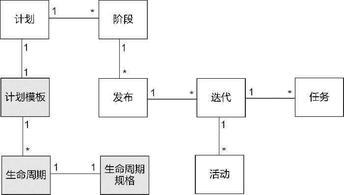

# D开篇
领域驱动设计(domain-driven design，DDD)需要应对软件复杂度的挑战！那么，软件复杂度的成因究竟是什么，又该如何应对？概括而言，即：
- 规模——通过分而治之控制规模；
- 结构——通过边界保证清晰有序；
- 变化——顺应变化方向。

领域驱动设计对软件复杂度的应对之道可进一步**阐述**为：
- 规模——以子领域、限界上下文对问题空间与解空间分而治之；
- 结构——以分层架构隔离业务复杂度与技术复杂度，形成清晰的架构；
- 变化——通过领域建模抽象为以聚合为核心的领域模型，响应需求之变化。

子领域、限界上下文、分层架构和聚合皆为领域驱动设计的核心元模型，分属战略设计和战术设计，贯穿了从问题空间到解空间的全过程。

领域驱动设计统一过程分为3个阶段：
- 全局分析阶段；
- 架构映射阶段；
- 领域建模阶段。
## 软件复杂程度
多数软件系统需要实现的整体功能往往是难以理解的，同时，随着需求的不断演进，它又在一定程度具有未来的不可预测性，这意味着软件系统的“复杂”同时覆盖了“复杂难解”(complicated)与“复杂难测”(complex)两个层面。既然如此，那么设计一个软件系统就像规划一座城市，既要考虑城市布局，以便居民的生活与工作，满足外来游客或商务人员的旅游或出差需求，又要考虑未来因素的变化，例如“当居民对城市的使用方式有所变化，或者受到外力的影响时，城市就会相应地演化”。参考城市的复杂度特征，我们要剖析软件系统的复杂度，就可以从理解能力与预测能力这两个维度探索软件复杂度的成因。
##  理解能力
### 规模
软件的需求决定了系统的规模。一个只有数十万行代码的软件系统自然不可与有数千万行代码的大规模系统相提并论。软件系统的规模取决于需求的数量，更何况需求还会像树木那样生长。一棵小树会随着时间增长渐渐长成一棵参天大树，只有到了某个时间节点，需求的数量才会慢慢稳定下来。
系统规模的扩张，不仅取决需求的数量，还取决于需求功能点之间的关系。需求的每个功能不可能做到完全独立，彼此之间相互影响相互依赖，修改一处就会牵一发而动全身，就好似城市中的某条道路因为施工需要临时关闭，车辆只得改道绕行，这又导致了其他原本已经饱和的道路因为涌入更多车辆而变得更加拥堵。这种拥堵现象又会顺势向其他分叉道路蔓延，形成辐射效应。

软件开发的拥堵现象或许更严重，这是因为：
- 函数存在副作用，调用时可能对函数的结果做了隐含的假设；
- 类的职责繁多，导致开发人员不敢轻易修改，因为不知会影响到哪些模块；
- 热点代码被频繁变更，职责被包裹了一层又一层，没有清晰的边界；
- 在系统某个角落，隐藏着伺机而动的bug，当诱发条件具备时，就会让整条调用链瘫痪；
- 不同的业务场景包含了不同的例外场景，每种例外场景的处理方式都各不相同；
- 同步处理代码与异步处理代码纠缠在一起，不可预知程序执行的顺序。

### 结构
结构之所以变得复杂，多数情况下还是由系统的质量属性(quality attribute)决定的。例如，我们需要满足高性能、高并发的需求，就需要考虑在系统中引入缓存、并行处理、CDN、异步消息以及支持分区的可伸缩结构；
软件系统的结构繁复还会增加软件组织的复杂度。系统架构的分解促成了软件构建工作的分工，这种分工虽然使得高效的并行开发成为可能，却也可能因为沟通成本的增加为管理带来挑战。

##  预测能力
## 过度设计
设计软件系统时，变化让我们患得患失，不知道如何把握系统设计的度。若拒绝对变化做出理智的预测，系统的设计会变得僵化，一旦有新的变化发生，修改的成本会非常大；若过于看重变化产生的影响，渴望涵盖一切变化的可能，若预期的变化没有发生，我们之前为变化付出的成本就再也补偿不回来了，这就是所谓的“过度设计”。
## 设计不足
要应对需求变化，终归需要一些设计技巧。很多时候，因为设计人员的技能不足，没有明确识别出未来确认会发生的变化，或者对需求变化发展的方向缺乏前瞻，所以导致整个设计变得过于僵化，修改的成本太高，从而走向了过度设计的另外一个极端，我将这一问题称为“设计不足”。
# 领域驱动设计概览
软件的核心是其为用户解决领域相关的问题的能力。所有其他特性，不管有多么重要，都要服务于这个基本目的。
——Eric Evans，《领域驱动设计》

## 领域驱动设计的基本概念
领域驱动设计作为一个针对大型复杂业务系统的领域建模方法体系，它改变了传统软件开发工程师针对数据库建模的方式，通过面向领域的思维方式，将要解决的业务概念和业务规则等内容提炼为领域知识，然后借由不同的建模范式将这些领域知识抽象为能够反映真实世界的领域模型。
### 领域驱动设计元模型
领域驱动设计元模型是以模式的形式呈现在大家眼前的，由诸多松散的模式构成，这些模式在领域驱动设计中的关系如图

领域驱动设计的核心是模型驱动设计，而模型驱动设计的核心又是领域模型，领域模型必须在统一语言的指导下获得。为整个业务系统建立的领域模型要么属于核心子领域，要么属于通用子领域。之所以区分子领域，一方面是为了将一个不易解决的庞大问题切割为团队可以掌控的若干小问题，达到各个击破的目的，另一方面也是为了更好地实现资产的合理分配。

为了保证定义的领域模型在不同上下文表达各自的知识语境，需要引入限界上下文来确定业务能力的自治边界，并考虑通过持续集成来维护模型的统一。上下文映射清晰地表达了多个限界上下文之间的协作关系。根据协作方式的不同，可以将上下文映射分为如下8种模式
- 客户方/供应方；
- 共享内核；
- 遵奉者；
- 分离方式；
- 开放主机服务；
- 发布语言；
- 防腐层；
- 大泥球。

模型驱动设计可以在限界上下文的边界内部进行，它通过分层架构(layered architecture)将领域独立出来，并在统一语言的指导下，通过与领域专家的协作获得领域模型。表示领域模型的设计要素包括实体(entity)、值对象(value object)、领域服务(domain service)和领域事件(domain event)。领域逻辑都应该封装在这些对象中。这一严格的设计原则可以避免领域逻辑泄露到领域层之外，导致技术实现与领域逻辑的混淆。

聚合(aggregate)是一种边界，它可以封装一到多个实体与值对象，并维持该边界范围之内的业务完整性。聚合至少包含一个实体，且只有实体才能作为聚合根(aggregate root)。工厂(factory)和资源库(repository)负责管理聚合的生命周期。前者负责聚合的创建，用于封装复杂或者可能变化的创建逻辑；后者负责从存放资源的位置（数据库、内存或者其他Web资源）获取、添加、删除或者修改聚合。
### 问题空间和解空间
软件系统的构建实则是对问题空间的求解，以获得构成解空间的设计方案

为什么要在软件构建过程中引入问题空间和解空间？

实际上，随着IT技术的发展，软件系统正是在这两个方向不断发展和变化的。在问题空间，我们要解决的问题越来越棘手，空间规模越来越大，因为随着软件技术的发展，许多原本由人来处理的线下流程慢慢被自动化操作所替代，人机交互的方式发生了翻天覆地的变化，IT化的范围变得更加宽广，涉及的领域也越来越多。问题空间的难度与规模直接决定了软件系统的复杂度。

**构成解空间的解决方案不仅要解决问题，还要控制软件系统的复杂度**。

问题空间需要解空间来应对，解空间自然也不可脱离问题空间而单独存在。对于客户提出的需求，要分清楚什么是问题，什么是解决方案，真正的需求才可能浮现出来。在看清了问题的真相之后，我们才能有据可依地寻找真正能解决问题的解决方案。软件构建过程中的需求分析，实际就是对问题空间的定位与探索。如果在问题空间还是一团迷雾的时候就贸然开始设计，带来的灾难性结果是可想而知的。

怎么区分方案级需求和问题级需求？方案级需求就好比一个病人到医院看病，不管病情就直接让医生开阿司匹林，而问题级需求则是向医生描述自己身体的症状。病情是医生要解决的问题，处方是医生提供的解决方案。

在针对问题空间求解时，必须映射于问题空间定义的问题，如此才能遵循恰如其分的设计原则，在问题空间的上下文约束下寻找合理的解决方案。

领域驱动设计为问题空间与解空间提供了不同的设计元模型。对于问题空间，强调运用统一语言来描述需求问题，利用核心子领域、通用子领域与支撑子领域来分解问题空间，如此就可以“揭示什么是重要的以及在何处付出努力”。除去统一语言与子领域，其余设计元模型都将运用于解空间，指导解决方案围绕着“领域”这一核心开展业务系统的战略设计与战术设计。
### 战略设计和战术设计
既然软件构建的过程就是对问题空间求解的过程，那么面对太多太大的问题，就无法奢求一步求解，需要根据问题的层次进行分解。不同层次的求解目标并不相同：为了把握系统的全景，就需要从宏观层次分析和探索问题空间，获得对等于软件架构的战略设计原则；为了深入业务的细节，则需要从微观层次开展建模活动，并在战略设计原则的指导下做出战术设计决策。这就是领域驱动设计的两个阶段：战略设计阶段和战术设计阶段。

战略设计阶段要从以下两个方面来考量。
- 问题空间：对问题空间进行合理分解，识别出核心子领域、通用子领域和支撑子领域，并确定各个子领域的目标、边界和建模策略。
- 解空间：对问题空间进行解决方案的架构映射，通过划分限界上下文，为统一语言提供知识语境，并在其边界内维护领域模型的统一。每个限界上下文的内部有着自己的架构，限界上下文之间的协作关系则通过上下文映射来体现和表达。

子领域的边界明确了问题空间中领域的优先级，限界上下文的边界则确保了领域建模的最大自由度。这也是战略设计在分治上起到的效用。当我们在战略层次从问题空间映射到解空间时，子领域也将映射到限界上下文，即可根据子领域的类型为限界上下文选择不同的建模方式。例如为处于核心子领域的限界上下文选择领域模型(domain model)模式，为处于支撑子领域(supporting subdomain)的限界上下文选择事务脚本(transaction script)模式，这样就可以灵活地平衡开发成本与开发质量。

战术设计阶段需要在限界上下文内部开展领域建模，前提是你为限界上下文选择了领域模型模式。在限界上下文内部，需要通过分层架构将领域独立出来，在排除技术实现的干扰下，通过与领域专家的协作在统一语言的指导下逐步获得领域模型。

战术设计阶段最重要的设计元模型是聚合模式。虽然聚合是实体和值对象的**概念边界**，然而在获得了清晰表达领域知识的领域模型后，我们可以将聚合视为表达领域逻辑的最小设计单元。如果领域行为是无状态的，或者需要多个聚合的协作，又或者需要访问**外部资源**，则应该将它分配给**领域服务**。至于领域事件，则主要用于表达领域对象状态的迁移，也可以通过事件来实现聚合乃至限界上下文之间的状态通知。

从战略设计到战术设计是一个自顶向下的设计过程，体现为设计原则对设计决策的指导；将战术设计方案反馈给战略设计，则是自底向上的演化过程，体现为对领域概念的重构引起对战略架构的重构。二者形成不断演化、螺旋上升的设计循环。

### 领域模型驱动设计
领域驱动设计是一种思维方式，而模型驱动设计则是领域驱动设计的一种设计元模型。因此，模型驱动设计必须在领域驱动设计思维方式的指导下进行，或者更加准确地将其描述为领域模型驱动设计。

领域模型驱动设计通过单一的领域模型同时满足分析建模、设计建模和实现建模的需要，从而将分析、设计和编码实现糅合在一个整体阶段中，避免彼此的分离造成知识传递带来的知识流失和偏差。

模型驱动设计主要在战术阶段进行，换言之，整个领域建模的工作是在限界上下文的边界约束下进行的，统一语言的知识语境会对领域模型产生影响，至少，建模人员不用考虑在整个系统范围下领域概念是否存在冲突，是否带来歧义。由于限界上下文拥有自己的内部架构，一旦领域模型牵涉到跨限界上下文之间的协作，就需要遵循限界上下文与上下文映射的架构约束了。

既然模型驱动设计是面向领域的，就必须明确以下两个关键原则。
- 以领域为建模驱动力：在建模过程中，针对领域知识提炼抽象的领域模型，并不断针对领域模型进行深化与突破，直到最终以代码来表达领域模型。
- 排除技术因素的干扰：领域建模与技术实现的关注点分离有助于保证领域模型的纯粹性，也能避免混淆领域概念和其他只与技术相关的概念。

模型驱动设计不能一蹴而就。毕竟，即使通过限界上下文降低了业务复杂度，对领域知识的理解是一个渐进的过程。在这个过程中，开发团队需要和领域专家紧密协作，共同研究领域知识。在获得领域模型之后，也要及时验证，确认领域模型有没有真实表达领域知识。一旦发现遗漏或失真的现象，就需要重构领域模型。首先建立领域模型，然后重构领域模型，进而精炼领域模型，保证领域概念被直观而真实地表达为简单清晰的领域模型。显然，在战术设计阶段，模型驱动设计也应该是一个演进的不断完善的螺旋上升的循环过程。
## 领域驱动设计过程
领域驱动设计过程是一条若隐若现的由许多点构成的设计轨迹，这些点就是领域驱动设计的设计元模型。如果我们从问题空间到解空间，从战略设计到战术设计寻找到对应的设计元模型，分别“点亮”它们，那么这条设计轨迹就会如图

通过对问题空间开展战略层次的求解，获得限界上下文形成解空间的主要支撑元素。识别限界上下文的基础来自问题空间的业务需求，遵循“高内聚松耦合”的原则划分领域知识的边界，再通过上下文映射管理它们之间的关系。每个限界上下文都是一个相对独立的“自治王国”，可以根据限界上下文是否属于核心子领域来选择内部的架构。通常，需要通过分层架构将限界上下文内部的领域隔离出来，进入战术设计阶段，进行面向领域的模型驱动设计。

选定一个限界上下文，在统一语言的指导下，针对该上下文内部的领域知识开展领域模型驱动设计。首先进行领域分析，提炼领域知识建立满足统一语言要求的领域分析模型，然后引入实体、值对象、领域服务、领域事件、聚合、资源库和工厂等设计要素开始程序设计，获得设计模型后在它的指导下进行编码实现，输出最终的领域模型。

在领域驱动设计过程中，战略设计控制和分解了战术设计的边界与粒度，战术设计则以实证角度验证领域模型的有效性、完整性和一致性，进而以迭代的方式分别完成对限界上下文与领域模型的更新与演化，各自形成设计过程的闭环。两个不同阶段的设计目标保持一致，形成一个连贯的过程，彼此之间相互指导与规范，最终保证战略架构与领域模型的同时演进。

##  控制软件复杂度
问题空间的复杂度决定了“求解”的难度，领域驱动设计对软件复杂度的控制之道就是竭力改变设计的质量，也就是在解空间中引入设计元模型，对问题空间的复杂度进行有效的控制。

###  控制规模
下面让我们通过一个案例认识到如何通过限界上下文控制系统的规模。

国际报税系统是为跨国公司的驻外雇员提供的、方便一体化的税收信息填报平台。税务专员通过该平台收集雇员提交的报税信息，然后对这些信息进行税务评审。如果税务专员评审出信息有问题，则将其返回给雇员重新修改和填报。一旦信息确认无误，则进行税收分析和计算，并生成最终的税务报告提交给当地政府以及雇员本人。

系统主要涉及的功能包括：

- 驻外雇员的薪酬与福利；
- 税收计划与合规评审；
- 对税收评审的分配管理；
- 税收策略设计与评审；
- 对驻外出差雇员的税收合规评审；
- 全球的签证服务。

主要涉及的用户角色包括：
- 驻外雇员(assignee)；
- 税务专员(admin)；

整个系统的解空间分解为多个限界上下文，每个限界上下文提供了自身领域独立的业务能力，系统架构。

每个限界上下文都是一个独立的自治单元。根据限界上下文的边界划分团队，建立单独的代码库。团队只为所属限界上下文负责：除了需要了解限界上下文之间的协作接口，以确定上下文映射的模式，团队只需要了解边界内的领域知识，为其建立各自的领域模型。系统复杂度通过限界上下文的分解得到了明显的控制。

### 清晰结构
保持系统结构的清晰是控制结构复杂度的不二法门。关键在于，要以正确的方式认清系统内部的边界。限界上下文从业务能力的角度形成了一条**清晰的边界**，它与业务模块不同，在内部也拥有独立的架构，通过分层架构将领域分离出来，在业务逻辑与技术实现之间划定一条清晰的边界。

问题空间由真实世界的客户需求组成，需求可以简单分为业务需求与质量需求。

我们可以将业务需求带来的复杂度称为“业务复杂度”(business complexity)。

软件系统的质量需求就是我们为系统定义的质量属性，包括安全、高性能、高并发、高可用性等，它们往往给软件的技术实现带来挑战。

我们可以将质量需求带来的复杂度称为“技术复杂度”(technology complexity)。

技术复杂度与业务复杂度并非完全独立的，二者的共同作用会让系统的复杂度变得不可预期。

要避免业务逻辑的复杂度与技术实现的复杂度混杂在一起，就需要确定业务逻辑与技术实现的边界，从而隔离各自的复杂度。这种隔离也符合关注点分离的设计原则。例如，在电商的领域逻辑中，订单业务关注的业务规则包括验证订单有效性，计算订单总额，提交和审批订单的流程等；技术关注点则从实现层面保障这些业务能够正确地完成，包括确保分布式系统之间的数据一致性，确保服务之间通信的正确性等。

领域驱动设计引入的分层架构规定了严格的分层定义，将业务逻辑封装到领域层(domain layer)，支撑业务逻辑的技术实现放到基础设施层(infrastructure layer)。在领域层之上的应用层(application layer)则扮演了双重角色：一方面，作为业务逻辑的外观(facade)，它暴露了能够体现业务用例的应用服务接口；另一方面，它又是业务逻辑与技术实现之间的黏合剂，实现了二者之间的协作。

下图图展示了一个典型的领域驱动设计分层架构。

领域层的内容与业务逻辑有关，基础设施层的内容与技术实现有关，二者泾渭分明，然后汇合在作为业务外观的应用层。应用层确定了业务逻辑与技术实现的边界，通过依赖注入(dependency injection)的方式将二者结合起来。

### 响应变化
未来的变化是无法控制的，我们只能以积极的态度拥抱变化。

领域驱动设计通过模型驱动设计针对限界上下文进行领域建模，形成了结合分析、设计和实现于一体的领域模型。通过提炼领域知识，并运用抽象的领域模型去表达，就可以达到对领域逻辑的化繁为简。模型是封装，实现了对业务细节的隐藏；模型是抽象，提取了领域知识的共同特征，保留了面对变化时能够良好扩展的可能性。

领域建模的一个难点是如何将看似分散的事物抽象成一个统一的领域模型。例如，我们要开发的项目管理系统需要支持多种软件项目管理流程，如瀑布、统一过程、极限编程或者Scrum，这些项目管理流程迥然不同，如果需要我们为各自提供不同的解决方案，就会使系统的模型变得非常复杂，也可能引入许多不必要的重复。通过领域建模，我们可以对项目管理领域的知识进行抽象，寻找具有共同特征的领域概念。这就需要分析各种项目管理流程的主要特征与表现，以从中提炼出领域模型。

瀑布式软件开发由需求、分析、设计、编码、测试、验收6个阶段构成，每个阶段都由不同的活动构成，这些活动可能是设计或开发任务，也可能是召开评审会。

统一过程(rational unified process，RUP)清晰地划分了4个阶段：先启阶段、细化阶段、构造阶段和交付阶段。每个阶段可以包含一到多个迭代，每个迭代有不同的工作，例如业务建模、分析设计、配置和变更管理等。

极限编程(eXtreme programming，XP)作为一种敏捷方法，采用了迭代的增量式开发，提倡为客户交付具有业务价值的可运行软件。在执行交付计划之前，极限编程要求团队对系统的架构做一次预研（architectural spike，又被译为架构穿刺）。当架构的初始方案确定后，就可以进入每次小版本的交付。每个小版本交付又被划分为多个周期相同的迭代。在迭代过程中，要求执行一些必需的活动，如编写用户故事、故事点估算、验收测试等。

Scrum同样是迭代的增量开发过程。项目在开始之初，需要在准备阶段确定系统愿景、梳理业务用例、确定产品待办项(product backlog)、制订发布计划以及组建团队。一旦确定了产品待办项以及发布计划，就进入冲刺(sprint)迭代阶段。sprint迭代过程是一个固定时长的项目过程，在这个过程中，整个团队需要召开计划会议、每日站会、评审会议和回顾会议。

领域建模就是要从这些纷繁复杂的领域逻辑中寻找到能够表示项目管理领域的概念，对概念进行抽象，确定它们之间的关系。经过分析这些项目管理流程，我们发现它们的业务概念和规则上虽有不同之处，但都归属于软件开发领域，因此必然具备一些共同特征。

从项目管理系统的角度看，无论针对何种项目管理流程，我们的主题需求是不变的，就是要为这些管理流程制订软件开发计划(plan)。不同之处在于，计划可以由多个阶段(phase)组成，也可以由多个发布(release)组成。一些项目管理流程没有发布的概念，我们也可以认为是一个发布。那么，到底是一个发布包含多个阶段，还是一个阶段包含多个发布呢？我们发现，在XP中明显地划分了两个阶段：架构预研阶段与发布计划阶段，而发布只属于发布计划阶段。因而从概念内涵上，可以认为是阶段(phase)包含了发布(release)，每个发布又包含了一到多个迭代(iteration)。至于Scrum的sprint概念，其实可以看作迭代的一种特例。每个迭代可以开展多种不同的活动(activity)，这些活动可以是整个团队参与的会议，也可以是部分成员或特定角色执行的实践。对计划而言，我们还需要跟踪任务(task)。与活动不同，任务具有明确的计划起止时间、实际起止时间、工作量、优先级和承担人。

为了让项目管理者更加方便地制订项目计划，产品经理提出了计划模板功能。当管理者选择对应的项目管理生命周期类型后，系统会自动创建满足其规则的初始计划。基于增加的这一新需求，我们更新了之前的领域模型，如图2-8所示。

在增加的领域模型中，生命周期规格(life cycle specification)是一个隐含的概念，遵循领域驱动设计提出的规格(specification)模式154，封装了项目开发生命周期的约束规则。

领域模型以可视化的方式清晰地表达了业务含义。我们可以利用这个模型指导后面的程序设计与编码实现：当需求发生变化时，能够敏锐地捕捉到现有模型的不匹配之处，并对其进行更新，使得我们的设计与实现能够以较小的成本响应需求的变化。

## 冷静认识
控制软件复杂度是构建软件过程中永恒的旋律，必须明确：软件复杂度可以控制，但不可消除。领域驱动设计控制软件复杂度的中心主要在于“领域”，Eric Evans就认为：“很多应用程序最主要的复杂度并不在技术上，而是来自领域本身、用户的活动或业务。”2这当然并不全面，随着软件的“触角”已经蔓延到人类生活的方方面面，在业务复杂度变得越来越高的同时，技术复杂度也在不断地向技术极限发起挑战，其制造的技术障碍完全不亚于业务层面带来的困难。领域驱动设计并非“银弹”，它的适用范围主要是大规模的、具有复杂业务的中大型软件系统，至于对技术复杂度的应对，它的选择是“隔离”，然后交给专门的技术团队设计合理的解决方案。

领域驱动设计控制软件复杂度的方法当然不仅限于本章给出的阐释和说明，它的设计元模型在软件构建的多个方面都在发挥着作用，其目的自然也是改进设计质量以应对软件复杂度——这是领域驱动设计的立身之本！如果你要构建的软件系统没有什么业务复杂度，领域驱动设计就发挥不了它的价值；如果构建软件的团队对于软件复杂度的控制漠不关心，只顾着追赶进度而采取“头痛医头，脚痛医脚”的态度，领域驱动设计这套方法可能也入不了他们的法眼。即便认识到了领域驱动设计的价值，怎么用好它也是一个天大的难题。我尝试破解落地难题的方法，就是重新梳理领域驱动设计的知识体系，尝试建立一个固化的、具有参考价值的领域驱动设计统一过程。

# 领域驱动设计统一过程
## 领域驱动设计现存的不足
领域驱动设计缺乏规范的统一过程，是其不足之一。
，领域驱动设计缺乏与之匹配的需求分析方法，是其不足之二。
，领域驱动设计缺乏规范化的、具有指导意义的架构体系，是其不足之三。
领域驱动设计的领域建模方法缺乏固化的指导方法，是其不足之四。

## 领域驱动设计统一过程
### 统一过程的二维模型
领域驱动设计统一过程参考了统一过程(rational unified process，RUP)的二维开发模型。整个过程的二维模型如图

横轴代表推动领域驱动设计在构建过程中的时间，体现了过程的动态结构，构成元素主要为3个阶段(phase)，每个阶段可以由多个迭代构成；纵轴表现了领域驱动设计在各个阶段中执行的活动，体现了过程的静态结构，构成元素包括工作流(work flow)和元模型(meta model)。

结合领域驱动设计对问题空间和解空间的阶段划分、对战略设计和战术设计的层次划分，整个统一过程分为3个连续的阶段：
- 全局分析阶段；
- 架构映射阶段；
- 领域建模阶段。

过程工作流构成了领域驱动设计统一过程的主要活动，它融合了领域驱动设计元模型，为工作流提供设计原则和模式的指导。这也使得整个统一过程保留了领域驱动设计的特征，遵循了“以领域为驱动力”的核心原则。支撑工作流严格说来不属于领域驱动设计的范围，但对它们的选择却会在整个统一过程中不断地影响着实施领域驱动设计的效果。领域驱动设计不能与它们强行绑定，毕竟不同企业、不同团队的文化基因和管理机制存在差异，但需要选择与领域驱动设计统一过程具有高匹配度的支撑工作流。

### 统一过程的动态结构
领域驱动设计统一过程的动态结构通过3个阶段，从问题空间到解空间完整而准确地展现了运用领域驱动设计构建目标系统的过程。目标系统的大小直接决定了问题空间的大小，自然也就决定了它所映射的解空间的大小。

#### 全局分析阶段
全局分析（big picture analysis）阶段的目标是探索与分析问题空间。该阶段主要通过对目标系统执行价值需求分析与业务需求分析这两个工作流，完全抛开对解决方案的思考与选择，仅仅从需求分析的角度以递进方式开展对问题空间的深入剖析。整个全局分析过程如图所示。

从价值需求开始，识别目标系统的利益相关者，明确系统愿景，识别系统范围。只有明确了利益相关者，才能就不同利益相关者的项目目标达成共识，以明确组织对目标系统树立的愿景，确保构建的目标系统能够对准组织的战略目标，避免软件投资方向的偏离。通过了解目标系统的当前状态和预期的未来状态，可以确定目标系统的范围，从而界定问题空间的边界，为进一步探索目标系统的解决方案提供战略指导。价值需求分析的成果看似虚无缥缈，似乎都是宏观层次言不及义的大话、套话，实则描绘了目标系统的蓝图，避免开发团队只见树木不见森林，缺乏对系统的整体把控。同时，它还指明了目标系统的方向，为我们确定和排列业务需求优先级提供了参考，为解空间进行技术选型和技术决策提供了依据，做出恰如其分的设计。

在价值需求的指导和约束下，根据用户发起的服务请求，逐一梳理出提供业务价值的动态业务流程，体现了多个角色在不同阶段进行协作的执行序列。每个业务流程都具有时间属性，通过划定里程碑时间节点，即可在业务目标的指导下将业务流程划分为不同时间阶段的多个业务场景。业务场景由多个角色共同参与，每个角色在该场景下与目标系统的一次功能交互，都是为了满足该角色希望获得的服务价值，由此即可获得业务服务。

在对业务需求进行深入分析后，可以结合价值需求分析的结果，将那些对准系统愿景的业务需求放到核心子领域，将提供支撑作用的业务需求放到支撑子领域，将提供公共功能的业务需求放到通用子领域，由此就可以从价值角度完成对问题空间的分解。

全局分析阶段的里程碑目标是探索和固定目标系统的问题空间，通过分析价值需求与业务需求，获得以业务服务为业务需求单元的全局分析规格说明书（参见附录D）。

参与全局分析阶段的角色包括客户或客户代表、业务分析师、产品经理、用户体验设计师、架构师或技术负责人、测试负责人。其中，客户、业务分析师、产品经理共同扮演领域专家的角色，并在本阶段作为关键的引导者和推动者。

#### 架构映射阶段
架构映射(architectural mapping)阶段根据全局分析阶段获得的产出物，即价值需求与业务需求，分别从组织级、业务级与系统级3个层次完成对问题空间的求解，映射为架构层面的解决方案。整个架构映射阶段与主要工作流的关系如图。

过全局分析阶段完成对问题空间的探索后，对解空间架构层面的解决方案映射，几乎可以做到顺势而为。通过执行组织级映射、业务级映射与系统级映射这3个过程工作流，分别获得组织级架构、业务级架构与系统级架构。

在执行组织级映射时，设计者站在整个组织的高度，在全局分析阶段输出的价值需求的指导下，通过系统上下文呈现利益相关者、目标系统与伴生系统之间的关系。系统上下文实际上确定了解空间的边界，除了系统边界与外部环境之间必要的集成，整个开发团队都工作在系统上下文的边界之内。

一旦确定了系统上下文，就可以根据全局分析阶段输出的业务需求执行业务级映射。根据语义相关性和功能相关性对业务服务表达出来的业务知识进行归类与归纳，即可识别出边界相对合理的限界上下文。限界上下文的内部架构遵循菱形对称架构模式，充分体现它作为自治的架构单元、领域模型的知识语境，提供独立完整的业务能力；限界上下文之间则通过不同的上下文映射模式表达上游和下游之间的协作方式，规范服务契约。

系统级映射建立在限界上下文之上，在全局分析阶段划分的子领域的指导下，在系统上下文的边界内部建立系统分层架构。该分层架构将属于核心子领域的限界上下文映射为业务价值层，将支撑子领域和通用子领域的限界上下文映射为基础层，并从前端用户体验的角度考虑引入边缘层，为前端提供一个统一的网关入口，并通过聚合服务的方式响应前端发来的客户端请求。

架构映射阶段的里程碑目标是完成从问题空间到解空间的架构映射，通过组织级映射、业务级映射和系统级映射获得遵循领域驱动架构风格的架构映射战略设计方案（参见附录D）。

架构映射阶段就是目标系统的架构战略设计。解决方案的获得建立在全局分析结果的基础之上，不同层次的映射方法引入了不同的领域驱动设计元模型，建立的领域驱动架构风格发挥了这些设计元模型的价值，保证了目标系统架构的一致性，以限界上下文为核心的业务级架构与系统级架构也成了响应业务变化的关键。

参与架构映射阶段的角色包括业务分析师、产品经理、用户体验设计师、项目经理、架构师、技术负责人、开发人员。其中，业务分析师和产品经理共同扮演领域专家的角色。由于架构映射阶段属于解空间的范畴，邀请客户参与本阶段的战略设计活动，可能会适得其反。若有必要，在执行组织级映射获得系统上下文的过程中，可以咨询和参考客户的意见。在本阶段，架构师（尤其是业务架构师与应用架构师）应成为关键的引导者和推动者。

#### 领域建模阶段
领域建模阶段是对问题空间战术层次的求解过程，它的目标是建立领域模型。领域建模必须在领域驱动架构风格的约束下，在限界上下文的边界内进行。这样一方面用分而治之的思想降低了领域建模的难度，另一方面也体现了领域建模依据的统一语言存在限定的语境，这也是模型驱动设计区别于其他建模过程的根本特征。根据领域模型表现特征的不同，领域建模可分为领域分析建模、领域设计建模和领域实现建模，对应于本阶段的3个主要过程工作流。整个领域建模阶段与主要工作流的关系如图3-4所示。

领域建模是一个统一而连续的过程。执行领域分析建模时，以领域专家为主导，整个领域特性团队共同针对限界上下文对应的领域开展分析建模，即在统一语言的指导下对业务服务进行提炼与抽象，获得的领域概念形成领域分析模型；执行领域设计建模时，以开发团队为主导，围绕每个完整的业务服务开展设计工作，获得领域设计模型；领域实现建模仍然由开发团队主导，在拆分业务服务为任务的基础上开展测试驱动开发，编写出领域相关的产品代码和单元测试代码，形成领域实现模型。

领域分析模型、领域设计模型和领域实现模型共同组成了领域模型。在执行主要的过程工作流时，还需要注意领域分析模型、领域设计模型和领域实现模型之间的同步，保证领域模型的统一。

推动领域建模完成从问题空间到解空间战术求解的核心驱动力是“领域”，在领域驱动设计统一过程中，就是通过业务服务表达领域知识，成为领域分析建模、领域设计建模和领域实现建模的驱动力。

领域建模阶段的里程碑目标是完成从问题空间到解空间的模型构建，通过领域分析建模、领域设计建模和领域实现建模逐步获得领域模型。领域模型包括如下内容。

- 领域分析模型：业务服务规约和领域模型概念图。
- 领域设计模型：以聚合为核心的静态设计类图和由角色构造型组成的动态序列图与序列图脚本。
- 领域实现模型：实现业务功能的产品代码和验证业务功能的测试代码。

参与领域建模阶段的角色主要为领域特性团队业务分析师、开发人员和测试人员，其中业务分析师负责细化业务服务，测试人员为业务服务编写验收标准，开发人员进行服务驱动设计和测试驱动开发，共同完成领域建模。

###  统一过程的静态结构
领域驱动设计统一过程通过纵轴展现了工作流(work flow)，包括过程工作流与支撑工作流。其中，在执行过程工作流时，还需要应用领域驱动设计元模型中的模式(pattern)或丰富到领域驱动设计体系中的方法(method)。

#### 过程工作流

在讲解领域驱动设计统一过程的各个阶段时，我已阐述了这些阶段与各个过程工作流之间的关系，图3-1也通过工作流图示的面积大小体现了这种关系。这一对应关系主要体现了各个阶段执行活动的主次之分，过程工作流的执行效果会直接影响阶段的里程碑与产出物。

统一过程的所有过程工作流都运用了领域驱动设计的设计元模型。正是通过这种方式将相对零散的设计元模型糅合到一个完整的设计过程中，为开发团队运用领域驱动设计提供过程指导。为了更好地使领域驱动设计落地，我在沿用设计元模型的基础上，丰富了领域驱动设计体系，增加了一些新的方法，这些方法也可以认为是设计元模型的一部分。过程工作流与其运用的设计元模型之间的关系如表3-1所示。

#### 支撑工作流

虽说领域驱动设计是以“领域”为核心关注点的软件构建过程，但它仍然属于软件构建的技术范畴；而我们在软件构建工作中面对的太多问题，实际属于管理学的范畴。《人件》认为：“开发的本质迥异于生产；然而，开发管理者的思想却通常被生产环境衍生而来的管理哲学所左右。”同理，当我们改变了软件构建的过程时，如果还在沿用过去那一套管理软件构建的方法，就会出现“水土不服”的现象。因此，领域驱动设计统一过程需要对项目管理流程、需求管理体系和团队管理制度做出相应的调整，这些共同组成了统一过程的支撑工作流。

关于项目管理，Eric Evans早在十余年前就提到了敏捷开发过程与领域驱动设计之间的关系，他提出了两个开发实践3：

- 迭代开发；
- 开发人员与领域专家具有密切的关系。

领域驱动设计统一过程并未对项目管理流程做出硬性的规定，然而迭代开发因为其增量开发、小步前行、快速反馈、响应变化等优势，能够非常好地与领域驱动设计相结合，可考虑将其引入领域建模阶段，形成分析、设计和实现的迭代建模与开发流程。全局分析阶段与架构映射阶段也可采用迭代模式，但它们在管理流程上更像RUP的先启阶段。短暂快速的先启阶段与迭代建模的增量开发相结合，形成一种“最小计划式设计”。它是软件开发过程的中庸之道，既避免了瀑布型的计划式设计因为庞大的问题空间形成分析瘫痪(analysis paralysis)，又不至于走向无设计的另一个极端。

领域驱动设计的成败很大程度上取决于需求的质量。全局分析阶段的主要目标就是对问题空间进行价值需求分析与业务需求分析；在领域建模阶段，也需要领域特性团队的业务分析师针对全局分析获得

的业务服务进行深入分析。这些都是领域驱动设计统一过程对需求管理流程的要求。

与需求管理流程不同，领域驱动设计统一过程并没有强制约定需求分析的方法，团队可以根据自身能力和方法的要求，选择用例需求分析方法，也可以选择协作性更强的用户故事地图或者事件风暴，甚至将多种需求分析方法与实践结合起来，只要能获得更有价值的业务需求。当然，为了让参与者能够在需求分析与管理过程中达成共识，也需要就需求术语定义“统一语言”。表3-2列出了统一过程使用的技术术语与主流需求分析方法使用的技术术语之间的对应关系。

领域驱动设计统一过程使用业务流程、业务场景、业务服务和业务任务4个层次的技术术语来体现不同层级的业务需求。

领域驱动设计对团队管理也提出了要求：“团队共同应用领域驱动设计方法，并且将领域模型作为项目沟通的核心。”6这一要求的目的是让团队成员更好地沟通与交流，并在团队内部形成一种公共语言，在开发节奏上保持与建模过程的步调一致。为了促进团队的充分交流，应为提供业务能力的限界上下文建立领域特性团队，为具有内聚功能的模块建立组件团队，针对客户端调用者尤其是前端UI建立前端组件团队，这种团队组建方式也符合康威定律的要求。

# 问题空间探索
## 全局分析的5W模型
要清晰地描述一件事情，可以遵循6W要素的情景叙述法：谁(Who)基于什么原因(Why)在什么地点(Where)什么时候(When)做了什么事情(What)，是怎么做到的(hoW)。

6W要素中的前5个要素皆与问题空间需要探索的内容存在对应关系。
- Who：利益相关者。
- Why：系统愿景。
- Where：系统范围。
- When：业务流程。
- What：业务服务。

由于全局分析是在宏观层次对问题空间的分析，因此无须考虑属于怎么做(hoW)的具体实现细节，由此就构成了图4-1所示的全局分析的5W模型。

全局分析的5W模型包含价值需求和业务需求，它们共同组成了目标系统的问题空间。

价值需求需要从系统价值的角度进行分析获得。没有价值，系统就没有开发的必要，而价值一定是为人提供的。不同角色的人对于该系统的期望并不相同，牵涉到的利益也不相同，这也是将系统的参与者称为“利益相关者”(stakeholder)的原因。利益相关者是团队进行需求调研的主要访谈对象。在综合利益相关者提出的各种价值之后，我们需要对这些价值进行提炼和概括，并将所有利益相关者关注的主要价值统一到一个方向上，如此就明确了系统的愿景。确定了系统的愿景，就可将其作为业务目标的衡量标准，并通过分析目标系统的当前状态与未来状态，确定目标系统的范围。利益相关者、系统愿景和系统范围共同组成了目标系统的价值需求，分属于5W模型中的Who模型、Why模型与Where模型。

业务需求由动态的业务流程与静态的业务场景、业务服务构成。每个业务流程都体现了一个业务价值，多个角色在不同阶段参与到这个业务流程中，所执行的所有业务行为都是为完成该业务价值服务的。整个流程由处于不同时间点的执行步骤构成，具有时间属性，属于5W模型中的When模型。根据流程环节中不同的业务目标，可以将一个完整的业务流程划分为多个阶段，每个阶段都完成自己的业务目标。因此，可以在业务目标的指导下将业务流程划分为多个业务场景。业务场景好像业务目标在业务流程中的投影，形成了对业务流程的纵向切割，组成了多个角色执行业务服务的时空背景。每个角色在该时空背景下与目标系统的一次完整功能交互，都是为了获得服务价值，这就是业务场景下的一个业务服务。业务服务是全局分析阶段获得的基本业务单元。业务服务描述了目标系统到底做什么，即目标系统提供的业务功能，属于5W模型中的What模型。

不同业务服务的重要性并不相同。如果某个业务服务提供了目标系统的核心价值，或者具有不可替代的作用，满足了最重要的利益相关者的价值需求，就应划入**核心子领域**；如果某个业务服务并没有鲜明的领域特征，虽然仍然属于业务需求的一部分，但在面向各个领域的业务系统中都能看到，又不可或缺，形成了不具有个性特征的通用功能，自然就应划入**通用子领域**；如果某个业务服务为另外一些提供了核心价值的业务服务提供支撑，具有辅助价值却又不具有通用意义，就应划入**支撑子领域**。核心子领域、通用子领域和支撑子领域共同构成了整个目标系统的问题空间。

## 高效沟通
### 达成共识
每个人获得的信息不同、知识背景不同，各自的角色不同又导致我们设想的上下文也不相同。

这幅漫画形象地展现了多个角色之间如何通过可视化的交流形式逐渐达成共识。在团队交流中，每个人都可能“盲人摸象”。怎么避免认知偏差？很简单，就是要用可视化的方式展现出来。一旦明确了这些差异，就可以利用各自掌握的知识互补不足去掉有余，最终得到大家都一致认可的需求，形成统一的认知模型。

### 统一语言
达成共识的目的是确定目标系统的统一语言(ubiquitous language)。获得统一语言就是在全局分析过程中不断达成共识的过程，即团队中各个角色就系统愿景、范围和业务需求达成一致，并通过一种直观的形式体现出来，以作为沟通与协作的基础。

#### 统一的领域术语

**形成统一的领域术语，尤其是基于模型的语言概念，是让沟通达成一致的前提**。
可以通过定义一个大家一致认可的术语表来建立统一语言。术语表包含整个团队精炼出来的术语概念，以及对该术语的清晰明了的解释。

#### 领域行为描述
领域行为描述可以视为领域术语甄别的一种延伸。领域行为是对业务过程的描述，相对于领域术语，它体现了更加完整的业务需求以及复杂的业务规则。在描述领域行为时，需要满足以下要求：
- 从领域的角度而非实现角度描述领域行为；
- 若涉及领域术语，必须遵循术语表的规范；
- 强调动词的精确性，符合业务动作在该领域的合理性；
- 要突出与领域行为有关的领域概念。

以项目管理系统为例，我们采用Scrum敏捷项目管理流程，要描述Sprint Backlog的任务安排，可以编写如下所示的用户故事：

- 作为一名Scrum Master，

- 我想要将Sprint Backlog分配给团队成员，

- 以便明确Backlog的负责人并跟踪进度。

验收标准：

* 被分配的Sprint Backlog没有被关闭；

* 分配成功后，系统会发送邮件给指定的团队成员；

* 一个Sprint Backlog只能分配给一个团队成员；

* 若已有负责人与新的负责人为同一个人，则取消本次分配；

* 每次对Sprint Backlog的分配都需要保存，以便查询。

#### 大声说出来
在需求沟通中，但凡有不明确的领域概念，就要大声说出来.

#### 价值
建立统一语言不限于全局分析阶段，实际上它贯穿了整个领域驱动设计统一过程。
毋庸讳言，若能在全局分析阶段准确地把握统一语言，就能在进入解空间后，给架构映射阶段和领域建模阶段带来更好的指导。

## 高效协作
### 商业模式画布

商业模式画布由9个板块构成。

- 客户细分(customer segments)：企业所服务的一个或多个客户分类群体，可以是企业组织、最终用户等。
- 价值主张(value propositions)：通过价值主张来解决客户难题和满足客户需求，为客户提供有价值的服务。
- 渠道通路(channels)：通过沟通、分销和销售渠道向客户传递价值主张，即企业将销售的商品或服务交付给客户的方式。
- 客户关系(customer relationships)：在每一个客户细分市场建立和维护企业与客户之间的关系。
- 收益来源(revenue streams)：通过成功提供给客户的价值主张获得营业收入，是企业的盈利模式。
- 核心资源(key resources)：企业最重要的资产，也是保证企业保持竞争力的关键，这些资源包括人力和物力。
- 关键业务(key activities)：通过执行一些关键业务活动，运转企业的商业模式。
- 重要合作(key partnership)：需要从企业外部获得资源，就需要寻求合作伙伴。
- 成本结构(cost structure)：该商业模式要获得成功所引发的成本构成。

###  业务流程图
业务流程图(transaction flow diagram，TFD)善于表现业务流程。它通过使用诸如任务流程图、泳道图等图形形象地描述真实世界中各种业务流程的执行步骤与处理过程。

泳道图(swimlane)是最为常用的业务流程图表现形式，它能够很好体现部门或者角色在流程中的职责以及上下游的协作关系。泳道图通过两个维度分别表现业务流程的划分阶段与参与部门（或岗位），分别称为阶段维度与部门/岗位维度，如图。

###  服务蓝图
服务蓝图通过3条分界线（即可见性分界线、交互分界线、内部交互分界线）将一个完整的业务流程分割为不同参与角色执行业务活动的不同区域。

这3条分界线清晰地展现了各个角色的职责边界，形成了以下4个活动区域。

- 客户活动(customer actions)：客户为了满足自己的服务要求执行的操作。
- 前台员工活动(onstage employee actions)：客户能够看到的前台员工操作的行为和步骤。
- 后台员工活动(backstage employee actions)：发生在客户看不到的后台，支持前台的后台员工活动。
- 支持过程(support process)：内部支持者为前台、后台员工履行服务提供支持。

在运用服务蓝图展现一个完整的业务流程之前，团队需要事先了解服务企业的组织结构和员工角色，这些角色与客户一起共同组成参与服务蓝图的角色。绘制服务蓝图需要团队与提供服务的组织成员共同协作，协作的过程就是将业务流程逐步呈现的过程，具体步骤如下：

(1)在空白的白板上画出交互分界线，在左侧对应位置分别贴上当前业务流程的客户角色；
(2)从客户角度描绘整个业务流程中为客户提供服务的过程，写在即时贴上，按照时间顺序依次贴在交互分界线的上方；

(3)识别出与客户活动存在互动关系的前台员工活动，写在即时贴上并标记出前台员工角色，贴在对应活动下方，用带箭头的实线表示活动之间的调用关系，箭头方向体现了流程方向；

(4)画出可见性分界线，在左侧对应位置贴上后台员工角色；

(5)识别出支持前台员工活动的后台员工活动，写在即时贴上并标记出后台员工角色，贴在对应活动下方，用带箭头的虚线表示支持关系，箭头指向被支持的活动；

(6)画出内部交互分界线；

(7)识别出支持各类活动的支持过程，并标记出内部支持者角色，用带箭头的虚线表示支持关系，箭头指向被支持的活动。

### 用例图
用例(use case)是对一系列活动（包括活动变体）的描述；主体(subject)执行并产生可观察的有价值的结果，并将结果返回给参与者(actor)226。如果将整个组织作为用例的主体，参与者就应该是组织外的角色，用例表现的就是该角色与组织之间的一次交互，此时的用例称为业务用例，代表了组织的本质价值75；如果将目标系统作为用例的主体，参与者就变成了目标系统外的角色（人或者外部系统），此时的用例称为系统用例，表现的是角色与目标系统之间的一次交互，通过这种交互，参与者获得了目标系统提供的业务价值。显然，用例的主体体现了边界的大小与层次，它决定了参与者的角色、价值的层次以及参与者和主体之间的交互形式。

可以通过用例图对主体行为进行可视化建模。一个用例图由火柴棍人表示的参与者、椭圆形表示的用例、矩形表示的主体边界和连线表示的关系共同构成。如果还需要表现一个用例内部的执行步骤，还可以有用例的包含用例、扩展用例，以及可能具有的泛化关系（参与者的泛化或用例的泛化），如图4-12所示。

，把握每一个动词和名词的精确表达。动词是领域行为的体现，名词是领域概念的象征，这些行为与概念就能再借助领域模型传递给设计模型，最终通过可读性强的代码来体现。

采用视觉形式的用例图可以更好地促进团队的交流，让所有团队成员与领域专家一起参与业务需求分析。抛开一本正经的UML建模工具，使用即时贴以头脑风暴的形式协作地绘制用例图，会取得意想不到的良好效果。

在进行可视化用例图协作时，分析者将整张白板当作用例图的主体，并就主体的边界（是组织还是目标系统）达成共识，然后分别找出所有参与者，在黄色即时贴上写上参与者的名称，贴在白板上。接下来，选择其中一个参与者，站在主体边界的角度思考该参与者与主体之间的交互，或者该主体能为参与者提供什么具有价值的服务，以动词短语描述出来，写在蓝色即时贴上，贴在白板相应位置，作为系统用例。若有必要，可继续针对用例识别出绿色的包含用例与扩展用例。识别出该参与者的所有用例后，依次调整顺序，并在确认用例没有错误或疏漏后，在白板上绘制连线将它们连起来。注意用例与统一语言之间的关系：用例的描述是统一语言的一部分，而在命名用例时，又要从已有的统一语言中提取描述精确的领域概念。
### 事件风暴
事件风暴是以一种工作坊形式对复杂业务领域进行探索的高效协作方法。它对业务探索的改进体现在两点：
- 以事件为核心驱动力对业务开展探索；
- 强调可视化的互动，更好地调动所有参与者共同对业务展开探索。

白色画卷纸、胶带纸条、各种颜色的即时贴以及马克笔成了开展事件风暴的利器。将白色画卷纸张贴在一面足够宽的墙上，它就成了所有参与者的“作战沙盘”，所有人都面对着这面墙开始互动：识别业务流程中的事件、讨论描述事件的统一语言、拿着即时贴进行张贴或者调整位置……一场轰轰烈烈的糊墙游戏面壁而展开，如图4-13所示。

用于领域驱动设计的事件风暴有以下两个层次。
- 探索业务全景：属于宏观层次，寻找业务流程产生的事件，形成一个全景的事件流。
- 领域分析建模：属于设计层次，通过探索业务全景获得的事件流，围绕着事件获得领域分析模型。

在全局分析阶段，可以引入宏观层次的事件风暴，探索目标系统的问题空间，获得与业务流程对应的事件流。由于事件流具有时间属性，通过标记时间轴上的关键时间点或者识别关键事件，可以划分出业务场景，而由角色触发的事件则体现了业务场景下的业务服务，由此即可获得问题空间的业务需求。

###  学习循环
商业模式画布、服务蓝图、事件风暴之类的协作方法都是视觉会议形式的协作方法。这种协作方法之所以能够促进团队高效协作，是因为它使得每个与会者都能充分参与，形成一种良性的群体思考过程，这一过程就是图示的学习循环。

学习循环“开始于对意图和任务焦点的想象，接着是探索与投入，然后是思考和发现模式，最后是决定行动与应用。这些步骤整合了我们认知的知觉、情绪、思考和感觉部分。”11探索问题空间本身就是从未知到已知的学习过程，视觉会议协作方式对传统协作方式最大的变革在于它将原本属于个人的学习过程转变为群体共同工作的学习过程。协作的难能可贵之处就是要向着一个共同目标以正确而高效的步伐迈进，不止如此，在这个过程中还需要创意与见解形成脑力的激荡。从想象开始，通过视觉化吸引团队投入，然后用视觉思维呈现每个人的想法，最后就可以收获探索的结果，以决定下一步的行动。

如上所述的各种视觉协作方式虽然并非领域驱动设计的内容，但是，它们都遵循了学习循环的过程，不仅通过可视化的互动协作方式提高每一位团队成员的主观能动性，让他们积极参与到每一次全局分析活动中，还促进了领域专家和开发团队的交流，促使其达成共识，定义统一语言，完成对问题空间的探索。

# 价值需求分析
软件系统的利，就是为客户解决问题、创造机会，也就是为客户带来价值。
## 识别利益相关者
### 什么是利益相关者

由于全局分析阶段的分析目标是我们的目标系统，且该系统为要处理的问题空间，因此可以将利益相关者定义为与目标系统存在利益关系的个人、团队或组织。当然，在识别利益相关者时，眼光不能局限在目标系统，而应放到整个企业乃至整个行业生态圈的大背景。

### 利益相关者的分类

在分辨利益相关者时，可以分析价值需求的影响方向。目标系统提供的业务需求会输出价值，使得利益相关者能够从目标系统的成功开发中获取利益，这类利益相关者又可称为受益的利益相关者(beneficial stakeholder)，或者简称为“受益者”(beneficiary)；另一种利益相关者会为目标系统的成功输入价值，因而团队可以“从他们那里获取解决问题所需的东西”，此类利益相关者可称为解决问题的利益相关者(problem stakeholder)，或者简称为“支持者”。这两类利益相关者与团队、目标系统的关系如图所示。

在价值需求分析阶段，我们需要识别所有的利益相关者，包括支持者与受益者。识别的方法就是根据价值交换理论对目标系统提出前面所述的两个问题。支持者通常包括组织、组织下的相关部门与员工、投资者、监管者以及参与目标系统的上游第三方（可能是合作伙伴，也可能是第三方系统所属的组织），受益者通常包括组织内用户、组织外用户和参与目标系统的下游第三方，如图所示。

## 明确系统愿景

系统愿景(system vision)是对目标系统价值需求的精炼提取，若能以精简的话语清晰描述出来，就能帮助团队就项目需要达成的目标达成共识。明确系统愿景的一种方式是将其描绘为一张蓝图，利用一种贴切的比喻向利益相关者对蓝图进行勾勒。
借鉴电梯演讲(elevator pitch)也可以帮我们快速确定系统愿景。可以认为电梯演讲是一种交流方法，在价值需求分析阶段，就可以通过它来组织语言，描述系统愿景。电梯演讲的参考模板如下：
- 产品名称；
- 产品所属类别；
- 描述目标客户的需求或机会；
- 阐释产品能够带来的关键价值（或者说购买的理由）；
- 与竞争产品的不同之处。

## 确定系统范围
系统范围保证了问题空间的开放性，同时又能确保问题空间内业务需求的收敛性。

系统范围确定的界线可以将无效的、不合理的需求拒之门外，确保了业务需求的收敛性；系统范围认定的方向又提供了指导依据，允许接纳吻合此方向的新的业务需求，保证了问题空间的开放性。

## 使用商业模式画布
商业模式画布的9大板块与价值需求之间的关系如图所示。

假设一家创业公司希望打造一款面向广大文学创作者和文学爱好者的文学平台，在对其进行价值需求分析时，可采用视觉会议的形式，让创业公司、领域专家（产品经理）与开发团队一起在商业模式画布的指导与规范下进行头脑风暴。遵循画布9大板块的顺序，引导者依次向与会人员提出问题，通过即时贴展示大家对当前版本的想法与意见。与会人员对这些想法和意见依次进行讨论，得到图5-7所示的商业模式画布。

## 业务需求分析
如果从需求层次来看，业务需求根据价值和目标可分为如下3个层次。
- 业务流程：体现了一个完整的业务价值。
- 业务场景：在一个阶段内共同满足多个角色的业务目标，也可认为是该阶段的里程碑目标。
- 业务服务：系统为一个角色提供的服务价值。

其中，业务服务属于业务场景的进一步细化，是全局分析阶段的基本业务单元。

## 业务流程
软件系统的核心价值在于响应用户的服务请求，系统内部以及系统之间通过一系列的协作各自履行不同的业务职责，共同满足该服务请求对应的各阶段业务目标，从而为用户提供业务价值。这一协作的过程可以称为“业务流程”。
### 业务流程的关键点
在识别目标系统的业务流程时，需要把握两个关键点：**完整**和**边界**。

一个有效的业务流程必须是完整的、端对端的服务过程，简言之，发起一个业务流程必有其起因，也有其结果（体现为业务价值），从因到果体现的就是端到端的完整性。原因只能有一个，但它带来的结果存在多种可能。例如，顾客购买商品是一个完整的端对端业务流程。购买商品的请求就是因，商品买到顾客手上就是果；商品缺货，顾客未能如意买到自己想要的商品也是果；顾客账户余额不足，导致购买交易失败同样还是果。构成该购买流程的诸多活动，如加入购物车、结算、支付等活动都不是购买请求的业务价值，不具备端对端的完整性，这些活动实则属于购买商品业务流程的执行步骤。

针对目标系统识别业务流程，就需要结合系统范围确定业务流程的边界。例如目标系统为挂号系统，则挂号系统满足了病人的挂号请求后，就履行了它的职责，为病人提供了业务价值，至于病人接受医生诊断与治疗的流程则不在要识别的业务流程范围之内。在界定业务流程边界时，还需要结合完整性进行综合判断。还是考虑挂号系统，病人挂号时需要支付挂号费用，虽然具体的支付活动发生在挂号系统之外，但由于支付活动属于挂号业务流程不可缺少的环节，因而需要纳入挂号流程中。

业务流程的起点往往由一个角色向目标系统发起服务请求，而要完成整个流程，则需要多个角色共同参与协作。在梳理业务流程时，必须采用全方位视角来观察目标系统和目标系统所在的组织，确定各个角色在该流程中应该履行的职责和它们的协作顺序。
### 业务流程的分类
从业务流程的特征看，可以分为主业务流、变体业务流和支撑业务流。主业务流代表从因到果的端到端主体流程；变体业务流是主业务流的变体，即从主业务流中脱离而形成的独立业务流；支撑业务流则是为主业务流与变体业务流提供支持的辅助流程。
从业务流程的发起者看，可以分为外部业务流、内部业务流和管理业务流。外部业务流往往由组织外用户（客户）主动发起服务请求；内部业务流则由组织内用户（员工）主动发起服务请求的流程；管理业务流由负责管理职能的业务部门人员主动发起的服务请求，且该服务请求主要在于实现控制、监督、审批等管理意图的流程。
### 业务流程的呈现
呈现业务流程最为直接的方式自然是运用业务流程图。业务流程图为动态的业务需求提供了简单清晰的可视化方案，可以帮助受众快速了解业务本身的运作形式，明确业务规则。

以文学平台为例，可使用业务流程图中的泳道图呈现用户、作者、读者和平台之间的关系，如图所示。

业务流程图更像对真实世界业务执行流程的真实反映，直观地体现了各个角色、部门之间的交流与协作。业务流程图的各个角色（或部门）是平等的，并无主次之分，都是参与流程的协作方。

根据业务流程的分类，一个完整的业务流程可能牵涉到组织内外各种用户角色，组成业务流程的执行活动虽然都是为了最后要满足的业务价值，但在执行环节中的操作目的与意图却不相同。组织内的一些执行步骤对主动发起服务请求的角色而言，甚至是不可见的。一些提供业务支撑或管理意图的执行步骤，可能出现在多个不同的业务流程中。因此，对于一个复杂的业务流程，既要从全景视角体现其完整性，又要准确地划分边界，可以使用服务蓝图来呈现。

以文学平台为例，阅读作品的业务流程涉及的参与角色只有阅读者，属于服务蓝图中的客户角色。在使用服务蓝图表示该业务流程时，不会牵涉到组织内的前台员工和后台员工，自然不会产生与他（她）们的交互。使用服务蓝图表达阅读作品的业务流程如图6-2所示。

服务蓝图从左到右体现了时间因素。倘若两个活动没有明显的时间先后顺序，可以纵向排列，表示二者不分先后，例如“撰写读书笔记”和“标记精彩内容”就没有先后顺序之分。纵向区域根据参与角色的业务目标进行划分，如“决定购买”“加入书架”等活动虽然看起来和阅读无关，但实际上它们为阅读作品这一业务目标提供了必要的执行步骤，离开了“阅读作品”这一业务目标，它们就没有存在的价值了；“评价作品”和“分享作品”具有独立的业务目标，因此它们被分为两个独立的纵向区域，虽然这两个活动与“撰写读书笔记”等活动并无时间先后顺序，但受限于二维图形的表达力，只能横向排列，这时可以辅以箭头来表示流程执行顺序。

阅读作品的服务蓝图中，只有阅读者参与到了流程中。除此之外，还引入了支持过程。不同于前台员工和后台员工，内部支持者可以是组织内的支持部门，也可以是业务流程提供支持的目标系统自身或外部的伴生系统（参见第8章），如图中的支付系统与微信就属于文学平台的伴生系统。实际上，服务蓝图中的支持行为往往组成了业务流程中的支撑业务流，如图6-2中的支付活动与分享活动其实都是阅读主流程的支撑业务流。

每个业务流程只有一个起点，该起点必然由服务蓝图的客户角色发起服务请求。这意味着，在一张服务蓝图中只能由一个客户参与，它所反映的业务流程其实是一个客户的旅程。以文学创作的业务流程为例，它的服务蓝图如图6-3所示。

交互分界线之外的客户活动都由一个客户执行。注意理解这里提到的一个客户，指的是一个实实在在的人，如果采用了用户画像，就是你从海量真实客户中提炼和刻画出来的有名有姓的虚拟人物，而不是这个人头上戴着的角色帽子。在文学创作的业务流程中，客户可以是托尔斯泰，但他在还没有申请成为驻站作者时，他的角色为注册用户。换言之，参与该业务流程的客户角色包含了注册用户与作者，甚至还可以细粒度地识别出申请人（针对提交申请活动）角色，但参与到业务流程中的客户只是托尔斯泰这个具体的人，就是写出《战争与和平》和《安娜·卡列尼娜》的那个人。

如果目标系统只面向组织用户，根本没有组织外的客户角色参与业务流程，又或者服务蓝图要描绘的业务流程完全属于组织的内部过程，那么，参与服务的员工亦可视为服务蓝图中的客户角色。

服务蓝图中的前台员工与后台员工都属于组织内员工，该如何区分二者的差异呢？关键在于可见性分界线，它恰好隔离了前台员工活动和后台员工活动，意味着前者在幕前发生，后者在幕后发生。这也解释了为何客户不会与后台员工产生行为交互，因为后台员工对客户而言，是完全不可见的。以文学创作流程的服务蓝图为例，审批人对申请的审批就属于后台员工活动，从流程图看，当审批人审批通过申请后，会向申请人发送通知，这也正是图6-3中由“审批申请”到“提交申请”的箭头的含义，但这两个角色并没有直接产生行为交互。与之相对，编辑角色作为前台员工，在咨询和建议时，直接与注册用户和作者发生了对话，形成了可见的协作关系。

## 业务场景
场景就是角色之间为了实现共同的业务目标进行互动的时空背景，通过角色在特定时间、空间内执行的活动来推动情景的发展，形成角色与目标系统之间的体验与互动。
### 业务场景的5W模型
在一个业务场景中，所有角色执行的活动都是为了满足一个共同的业务目标，这是确定业务场景的关键。业务服务之间的协作存在时间流逝的痕迹，即这些服务在某个时间阶段内通过协作形成了相对完整的执行序列。这些活动都发生在确定的空间范围内，也就是目标系统的系统范围。

划分业务场景时，活动是业务流程的各个执行步骤，不能直接映射为业务服务。
### 业务服务
在Cockburn的隐喻中，海平面是一条可见的分界线，Jeff Patton就说：“一个海平面级别的任务，是指我们会连续完成的、通常在完成之后才去做其他事情的任务。"

#### 服务价值

所谓“服务价值”，就是要站在目标系统的角度，思考它能为执行业务服务的角色提供什么样的服务。服务价值决定了业务服务是否满足角色的服务请求，回答了角色为何要参与该业务服务的原因。

#### 角色

一个业务服务必须有一个角色作为发起者，它会触发业务请求，通常包括用户(user)、策略(policy)或伴生系统(accompanying system)。

用户是关心业务服务的人或组织（部门），通过执行某个操作触发服务请求。作为角色的策略较为特殊，它属于规则的一种特殊情况，需要通过定时器按照条件定时主动触发，因此也可以认为策略是封装了业务规则的定时器。位于目标系统之外的伴生系统作为角色，也可以主动触发一个业务服务，前提是触发后的执行逻辑属于目标系统的范围。

#### 执行序列

业务服务的执行序列意味着执行的所有步骤都是连续且不可中断的，如此才能完成一次完整的功能交互。考虑顾客在超市购物的业务场景，顾客推着购物车在超市中寻找自己要买的商品，并将它们一一放到购物车，选好商品后推车到收银台结账；收银员扫完所有商品的条形码后，计算出总价；顾客付款，拿好已购商品走出超市，业务场景结束。如果将整个超市视为我们要设计的目标系统，那么目标系统中的角色就是顾客与收银员。

顾客参与的业务服务包括：
- 加入购物车；
- 付款。

收银员参与的业务服务包括：

- 扫描商品条形码；
- 收款。

这4个业务服务都是连续且不可中断的完整过程。“加入购物车”与“付款”是两个分开的业务服务，因为顾客有可能在将商品加入购物车后，突然接到一个电话，没有买东西就离开了超市。在收银员的“收款”业务服务中，还有“计算商品总价”“计算商品折扣”“增加会员积分”等操作，但是它们都是连续执行的。收银员计算了商品总价后，如果不执行收款工作，顾客就没法付款，这意味着“收款”才是完整的业务服务，“计算商品总价”只是它的一个执行步骤。

### 业务服务的识别
要获得业务服务，可以基于业务流程和业务场景，分别梳理执行环节的每个用户活动，然后根据业务服务的3个标准判断并梳理出问题空间的业务服务。表6-1列出了阅读作品和文学创作业务流程中的所有业务服务。

### 业务服务的呈现
业务流程可以通过业务流程图与服务蓝图以可视化协作的形式进行呈现，而业务场景和业务服务的可视化呈现，则借用了UML用例图形式的业务服务图。

#### 业务服务图

用例图的组成要素与业务场景的5W模型颇为相似，二者形成了如下对应关系。
- 参与者：代表了场景5W模型的Who。
- 用例：代表了场景5W模型的What。
- 用例关系：包括使用、包含、扩展、泛化、特化等关系，其中，使用(use)关系代表了场景5W模型的Why，即用例为参与者提供了价值。
- 边界：代表了场景5W模型的Where。

用例图是领域专家与开发团队之间进行沟通的一种可视化手段，它以目标系统为主体边界，例如，以整个文学平台作为主体边界形成的用例图如图所示。

引入业务场景，可为每个业务场景绘制一个用例图，主体边界就变成了业务场景，如图所示。

#### 业务服务规约
了可以使用业务服务图对业务服务进行可视化呈现，还可以为其编写文本形式的业务服务规约。为了更好地表现业务服务角色、服务价值和执行序列这3个特征，我糅合了用户故事和用例规约的形式，将业务服务规约分为表所示的组成元素。

##  子领域

问题空间太大，业务服务又太小，我们需要寻找一个粒度合理的业务单元，一方面降低问题空间规模过大带来的业务复杂度，另一方面帮助领域专家与开发团队更好地把握问题空间而不至于迷失在业务细节中。这个业务单元就是“子领域”。

**核心子领域**是目标系统最为核心的业务资产，体现了目标系统的核心价值。核心子领域体现了问题空间的核心问题，它的成败直接影响了系统愿景，而通用子领域和支撑子领域则体现了问题空间的次要问题，它们包含的内容并非利益相关者的主要关注点。
###  子领域的划分
划分问题空间的子领域仍然是“分而治之”思想的体现，是控制问题空间复杂度的一种手段。要划分子领域，关键在于确定核心子领域。

这些功能分类策略有以下几种。
- 业务职能：当目标系统运用于企业的生产和管理时，与目标系统业务有关的职能部门往往会影响目标系统的子领域划分，并形成一种简单的映射关系。
- 业务产品：当目标系统为客户提供诸多具有业务价值的产品时，可以按照产品的内容与方向进行子领域划分。
- 业务环节：对贯穿目标系统的核心业务流进行阶段划分，然后按照划分出来的每个环节确定子领域。
- 业务概念：捕捉目标系统中一目了然的业务概念，将其作为子领域。

如果按照业务职能划分子领域，只需要了解企业的组织结构，就可以轻而易举地获得对应的子领域。例如为一所学校开发一套管理系统，按照学校的业务职能划分，就可以获得教务、学生管理、科研、财务、人事等子领域，这些子领域实际上恰好对应学校的职能部门，如教务处、学生处、科研处、财务处、人事处等。在识别子领域时，需要就目标系统的范围确定组织结构的范围，例如管理系统的范围没有要求支持图书馆的管理，我们就不需要考虑图书馆这一机构，也不会识别出图书馆子领域。
### 子领域映射图
获得的子领域最好以子领域映射图的形式进行可视化。用整个椭圆形代表目标系统的问题空间，从椭圆中划分出来的每一个区域代表一个子领域。每个子领域标记了它究竟是核心子领域、通用子领域还是支撑子领域。文学平台的子领域映射图如图所示。

# 同构系统
同构系统的组成部分可以形成一一对应的映射关系，这正是架构映射的存在前提

整个架构映射阶段由如下3组同构系统构成。

- 架构定义的概念系统与架构设计的模式系统：对应架构映射阶段的概念层次。
- 问题空间的真实系统与解空间的软件系统：对应架构映射阶段的设计层次。
- 设计方案的架构系统与团队组织的管理系统：对应架构映射阶段的管理层次。

## 概念层次的同构系统
概念层次的同构系统围绕着架构的定义展开映射。在软件领域，架构(architecture)是最引人注目的概念，表达了高层次的设计指引、原则和具体的设计模型。正如Martin Fowler认为的：“无论架构是什么，它都与重要的事物有关。”然而，这一含混不清的定义显然不能让人满意。虽然至今仍然没有一个得到业界公认的架构定义，不过，若能比较一些获得大多数人认可的架构定义，或许能窥见架构定义的基本特征。
### 架构的定义
软件标准组织和架构大师对架构的定义虽然有着不同的表现形式，但它们蕴含的本质特征极为相似，概括而言，一个设计良好的架构应具有如下基本设计要素：
- 功能分解的软件元素；
- 软件元素之间的关系；
- 软件元素与外部环境之间的关系；
- 指导架构设计与演化的原则。

架构是解空间控制软件复杂度的核心力量。对解空间进行功能分解，并以一个封装良好的软件元素来表达系统的结构，可以有效地控制软件系统的规模；管理好软件元素之间的关系以及软件元素与外部环境之间的关系，可以保证系统结构的清晰度；无论是软件元素的分解，还是关系的梳理，都需要响应需求的变化并随之对架构进行演化。至于该如何设计、如何演化，不可能给出过于具体的“解题方法”，只能“直指本心”，给出符合软件架构思想的设计原则与演化原则。由是观之：

- 软件元素的分解能够有效地控制规模；
- 梳理软件元素及外部环境的关系可以清晰结构；
- 架构设计与演化原则保证了架构能够响应变化。

显然，架构定义的设计要素实际上是对软件复杂度的一种回答。

然而，这样的架构定义并没有回答以下问题：
- 该如何分解软件元素；
- 软件元素体现为什么形式；
- 该如何梳理关系；
- 设计与演化的原则是什么。

这些问题显然不该由一个统一的架构定义来回答。它们甚至没有一个确定的答案，而需要架构师在设计具体系统的架构时，一一做出符合具体系统现状的解答——这是架构师需要面临的挑战。

### 架构方案的推演
要取得架构设计方法的平衡，需要弄清楚各种架构之间的关系。**TOGAF**的架构开发方法(architecture development method，ADM)规划了组成企业架构的内容：业务架构、信息系统架构（分为应用架构和数据架构）和技术架构。它们分别对应架构模型的3个层次：业务层、应用层和技术层，如图所示。

在企业架构中，业务架构“从企业战略出发，按照企业战略设计业务及业务过程；业务过程是需要业务能力支撑的，从战略到业务再到对业务能力的需要，就形成了支持企业战略实现的能力布局”。信息系统架构中的数据架构梳理和治理企业数据资产，建立数据标准与数据模型，形成企业全域数据的全生命周期管理；应用架构则描述了各种用于支持业务架构并对数据架构所定义的各种数据进行处理的应用系统；应用系统的划分需要从功能布局的角度支撑业务架构需要提供的业务能力，并就业务能力需要使用的数据进行处理。到了技术架构阶段，就需要将应用架构定义的应用组件映射为对应的技术组件，并从物理层面和逻辑层面对架构进行分解，就技术实现做出设计决策与技术选型。
运用到体现企业战略规划的企业架构中，3个架构在架构开发方法中存在明显的前后延续关系：业务架构定义业务能力，指导信息系统架构的设计，确定与之对应的数据模型与应用系统；技术架构根据技术参考模型与所处行业的通用技术模型确定融合了业务逻辑与技术实现的解决方案。它们的观察视角自然有所不同，由此也分别形成了不同的架构师角色，各自撷取整体架构景观的一部分，在架构开发方法的指导下进行融合，形成企业架构的解决方案全景图。

如果将企业架构的关注层次从企业下沉到目标系统，要获得目标系统的架构解决方案，仍然需要从业务、数据、应用和技术这4个观察视角来思考系统的整体架构。不同的观察视角可以分离不同的关注点，也可以降低架构设计的复杂度，这是一种行之有效的办法。问题在于：当业务需求发生变化时，如果需要调整目标系统的业务架构，该怎么让数据架构、应用架构和技术架构随之发生的变化降到最少？

当变化不可避免时，一种行之有效的方法是共同顺应变化的方向，如此就能降低变化带来的影响。若能寻找到一种“软件元素”将业务架构与应用架构绑定起来，就能让它们共同顺应业务需求变化的方向。在领域驱动设计中，这样的软件元素就是限界上下文（参见第9章）。

限界上下文是根据领域知识语境对业务进行的功能分解，体现了独立的业务能力。作为一个表达业务能力的自治架构单元，它可以在业务架构中维护业务的边界。同时，它又通过对应用架构的纵向切分来支持业务能力，使得业务架构的业务边界与应用架构的应用边界保持一定的重叠，遵守相同的边界划分原则，完成对业务架构与应用架构之间的绑定。我们通过限界上下文获得组成业务架构的软件元素时，实际上已经同步地获得了应用架构的应用系统，保证了二者的同步演进。

限界上下文通过领域模型表达领域知识，它的边界实则是领域的知识语境。在知识语境的边界内，通过领域模型定义数据架构的数据模型，形成从领域模型到数据模型的映射关系，就能将数据模型的变化控制在限界上下文的业务边界中，保证数据架构与业务架构的同步演进，提高数据架构响应业务需求变化的能力。

业务、应用和数据都以限界上下文为边界构成其架构的软件元素，就能确保业务架构、应用架构和数据架构遵循一致的业务变化方向。

考虑到业务复杂度与技术复杂度的成因不同，我们无法将目标系统的技术架构也绑定到业务架构上。既然无法建立一致的绑定关系，就需要从解耦的角度分离二者，让业务需求谨慎地与具体的技术因素保持距离。领域驱动设计统一过程通过在限界上下文内部建立的菱形对称架构（参见第12章），清晰地划分了业务逻辑与技术实现的边界，确定了业务与技术在架构层次的正交关系，使得引起业务架构与技术架构变化的原因被分离开，形成了两种架构之间的松耦合。同时，从复用和变化的角度对技术关注点进行横向切分，形成由业务价值层(value-added layer)、基础层(foundation layer)、边缘层(edge layer)和客户端层(client layer)组成的系统分层架构(system layered architecture)。

### 领域驱动架构风格
构建在限界上下文之上的系统体现了一种相同的架构风格，我将其称为领域驱动架构风格(domain-driven architectural style)。该架构风格由领域驱动设计元模型中用于解空间战略设计的模式构成，规范了目标系统架构的设计，定义了指导架构演进的原则。由该架构风格形成的模式系统做到了对抽象的架构定义的具体化：

- 通过限界上下文划分软件元素；
- 通过限界上下文的菱形对称架构管理软件元素之间的关系；
- 通过系统上下文界定软件元素与外部环境中伴生系统的关系，通过菱形对称架构与系统分层架构管理软件元素与环境资源之间的关系；
- 确立以领域为核心驱动力、业务能力为核心关注点作为指导架构设计与演化的原则。

由此形成了图所示的架构定义的概念系统与架构设计的模式系统之间的映射关系。

**整个目标系统的解空间分为系统上下文与限界上下文两个层次**。系统上下文层次界定了目标系统与伴生系统之间的关系，通过系统分层架构模式进行约束；限界上下文体现了领域模型和业务能力的边界，通过菱形对称架构模式进行约束。它们同指导设计与演化的架构原则共同组成了领域驱动架构风格的模式系统。

从抽象的架构定义映射为具体的领域驱动架构风格，就在抽象和具体之间找到了架构设计方法的平衡，形成了一种固化的架构映射规范，作为在设计层次将问题空间映射到解空间形成架构解决方案的设计指导。
## 设计层次的同构系统
对问题空间的求解，就是从问题空间跨入解空间，形成能够满足价值需求与业务需求的架构方案。

首先，价值需求以组织为视角分析了目标系统的愿景与范围，形成以系统上下文为核心的组织级映射；其次，业务需求的业务服务以目标系统为视角体现了具体的业务功能，形成以限界上下文与菱形对称架构为核心的业务级映射；最后，业务需求对子领域的划分从业务价值的角度确定了各个业务功能所处的层次，形成以系统分层架构为核心的系统级映射。组织、业务和系统3个层次映射的结果共同构成了解空间的架构方案，形成了设计层次的同构系统，即问题空间的真实系统与解空间的软件系统。

两个同构系统的映射关系蕴含了不断细化与深入的动态映射过程，该过程如图所示。整个映射过程根据不同层次分为3个步骤。

- 组织级映射：站在整个组织的高度，通过全局分析阶段输出的价值需求确定组织级的系统上下文。
- 业务级映射：通过全局分析阶段输出的业务需求，根据业务相关性对业务服务进行归类与归纳，识别出边界合理的限界上下文，并为其建立菱形对称架构。
- 系统级映射：进入系统内部，在全局分析阶段划分的子领域指导下，建立系统分层架构，将属于核心子领域的限界上下文映射为业务价值层，将通用子领域和支撑子领域的限界上下文映射为基础层，并确定它们之间协作的上下文映射模式，定义服务契约。

### 康威定律的运用
遵循领域驱动架构风格，目标系统的系统分层架构自底向上分别由基础层、业务价值层、边缘层和客户端层构成。根据康威定律，基础层的限界上下文取决于上下文映射模式，可映射为管理系统的组件团队或领域特性团队；业务价值层由限界上下文体现纵向的业务能力，故而映射为管理系统的领域特性团队；边缘层与客户端层主要面向客户，是站在客户体验的角度思考功能的划分，需要的技能主要为前端开发的单一技能，故而映射为管理系统的前端组件团队。根据这样的映射关系，就可获得对应的团队组织结构，如图所示。

按照领域特性组建团队可以使同一个限界上下文的团队成员沟通更加顺畅，因为领域特性团队共享了该限界上下文的领域知识。倘若位于基础层的通用型限界上下文或支撑型限界上下文为目标系统提供了专有功能，需要具有专门知识去解决那些公共型的基础问题，也可以为其建立专门的组件团队。

# 系统上下文
## 系统上下文
**系统上下文**(system context)属于Simon Brown提出的C4模型，该模型“通过在不同的抽象层次上重新定义方块和虚线框的含义来将我们的表达限制在一个抽象层次上，从而避免在表达的时候产生抽象层次混乱的问题”。不同的抽象层次关注点不同，需要考虑的细节也有所不同。

系统上下文代表了目标系统的解空间。要注意，问题空间和解空间的边界并不一定完全重叠。在确定系统上下文时，可以从目标系统向外延伸，寻找那些虽然不是本系统的部件，却对系统的价值体现具有重要意义的对象：这些对象就是目标系统范围之外的伴生系统(accompanying system)。伴生系统位于系统上下文的边界之外，但它提供的功能可能属于问题空间的业务需求范畴。
### 伴生系统
伴生系统的类型直接影响了目标系统与伴生系统的协作。如果目标系统与伴生系统对应的团队处于同一组织下，就有了紧密协作的可能，目标系统所在的团队甚至可以与伴生系统共同协商接口的定义；如果伴生系统是对外采购的外部系统，我们作为采购方，就具有一定的控制权，可以决定选择哪一款系统，这一决定可以作为架构决策的一部分。

### 系统上下文图
可以通过系统上下文图表示系统上下文。在系统上下文图中，两种颜色的框图各自代表目标系统和伴生系统，整个系统上下文图如图所示，以目标系统为核心，勾勒出用户、目标系统和伴生系统之间的关系。

## 系统上下文的确定
全局分析阶段输出的价值需求有助于确定系统上下文。

### 参考价值需求
价值需求中的利益相关者可以充当系统上下文的用户，系统范围可以帮助界定系统解空间的边界，分辨哪些功能属于目标系统，哪些属于伴生系统，也就是区分“系统内”和“系统外”。

以一家经营网上书店的企业为例。企业的战略目标是拓展线上销售。为了满足这一战略目标，要求开发一个个性书店系统。该系统的愿景是为顾客提供个性化的购书体验，以达到提高在线销售量的目的；系统范围主要包括在线销售与售后服务；顾客、商家和配货员是该系统的利益相关者。

根据企业当前的业务生态与运行状况，结合目标系统的愿景和范围，明确推荐、支付和配送属于目标系统之外的伴生系统。推荐功能由推荐系统提供，作为企业内的系统由另一个团队负责开发和运营维护，在获取顾客的购买偏好与个性特征后，结合大数据建立推荐算法模型，提供高匹配度的图书推荐服务；支付功能与配送功能分别由企业外部的第三方支付系统和物流系统提供服务。由此确定了用户、目标系统和伴生系统之间的关系，绘制图所示的系统上下文图。

### 业务序列图
系统上下文图虽然直观体现了企业级的利益相关者、目标系统和伴生系统之间的关系，但它主要体现的是这些参与对象的静态视图。要展现目标系统与伴生系统之间的动态协作关系，可以引入业务序列图。

绘制业务序列图时，参与协作的系统是一个完整的整体，所以我们不需要也不应该考虑参与系统的内部实现细节。序列图上的消息代表的不是数据之间的流动，而是参与系统承担的职责。以顾客购买书籍为例，其业务序列图如图所示。

# 限界上下文

## 限界上下文的定义
上下文表现了业务流程的场景片段，整个业务流程由诸多具有时序的活动组成，随着流程的进行，不同的活动需要不同的角色参与，并导致上下文因为某个活动的执行发生切换，形成了场景的边界。因而，上下文其实是动态的业务流程被边界静态切分的产物。

假设有这样一个业务场景：我作为一名咨询师从成都出发前往深圳为客户做领域驱动设计的咨询。无论是从家乘坐地铁到达成都双流机场，还是乘坐飞机到达深圳宝安机场，抑或从宝安机场乘坐出租车到达酒店，我的身份都是一名乘客，虽然因为交通工具的不同，我参与的活动也不尽相同，但无论是上车下车，还是办理登机手续、安检、登机以及下机等活动，都与交通出行有关。

那么，我坐在交通工具上，是否就一定代表我属于这个上下文？未必！注意，其实交通出行上下文模糊了“我”而强调了“乘客”这个概念。这一概念代表了参与到该上下文的“角色”，或者说“身份”。我坐在飞机上，忽然想起给客户提供的咨询方案有待完善，于是拿出电脑，在万米高空完善我的领域驱动设计咨询方案。此时的我虽然还在飞机上，身份却切换成了一名咨询师，执行的业务活动也与咨询内容有关，当前的上下文也就从出行上下文切换为咨询上下文。

当我作为乘客乘坐出租车前往酒店，并至前台办理入住手续时，我又“撕下了乘客的面具”，摇身一变成为酒店上下文的宾客角色，当前的上下文随之切换为住宿上下文。次日清晨，我离开酒店前往客户公司。随着我走出酒店这一活动的发生，住宿上下文又切换回交通出行。我到达客户所在地开始以一名咨询师身份与客户团队交谈，了解他们的咨询目标与现有痛点，制订咨询计划与方案，并与客户一起评审咨询方案，于是，当前的上下文又切换为咨询上下文了。

无论是交通出行还是入住酒店，都需要支付费用。支付的费用虽然不同，支付的行为也有所差别，需要用到的领域知识却是相同的，因此支付活动又可以归为支付上下文。

上下文在流程中的切换犹如同一个演员在不同电影扮演了不同的角色，参与了不同的活动。由于活动的目标发生了改变，履行的职责亦有所不同。上述场景如图所示。

每个限界上下文提供了不同的业务能力，以满足当前上下文中各个角色的目标。这些角色只会执行满足当前限界上下文业务能力的活动，因为限界上下文划定了领域知识的边界，不同的限界上下文需要不同的领域知识，形成了各自的知识语境。业务能力与领域知识存在业务相关性，要提供该业务能力，需要具备对应的领域知识。领域知识由限界上下文的领域对象所拥有，或者说，这些领域对象共同提供了符合当前知识语境的业务能力，并被分散到对象扮演的各个角色之上，由角色履行的活动来体现。如果该角色执行该活动却不具备对应的领域知识，说明对活动的分配不合理；如果该活动的目标与该限界上下文保持一致，却缺乏相应知识，说明该活动需要与别的限界上下文协作。领域知识、领域对象、角色、活动、知识语境以及业务能力之间的关系可以通过图形象地展现。

限界上下文之间的复用体现为对业务能力的复用，而非对知识语境边界内领域模型的复用。

## 限界上下文的特征
根据限界上下文的定义，可以明确它的业务特征与设计特征。在识别限界上下文时，必须考虑它的业务特征：
- 它是领域模型的知识语境；
- 它是业务能力的纵向切分。

在设计限界上下文时，必须考虑它的设计特征：
**是自治的架构单元**

### 领域模型的知识语境
日常对话中，说话的语境就是帮助我们理解对话含义的上下文。理解业务需求时，同样需要借助这样的上下文，形成能够达成共识的知识语境

上图，销售人员和售后人员面对的客户(Customer)是同一个领域概念，机缘巧合下，甚至可能是同一个人，扮演的也是同一个角色，产品(Product)也如此。然而，因为销售人员与售后人员工作内容和工作性质的不同，他们需要了解客户和产品的领域知识存在较大差异：为了精准营销，销售人员需要掌握客户的信息越详细越好，包括客户的职业、收入、消费习惯等，而售后人员为了提供售后服务，掌握客户的联系方式与联系地址就足矣

统一语言在解空间的作用域针对每个限界上下文。

### 业务能力的纵向切分
要理解所谓“业务能力的纵向切分”，就要明确一个问题：为何领域驱动设计不使用模块(module)、服务(service)、库(library)或组件(component)这些耳熟能详的概念来表现业务能力？

上图所示的架构首先从技术维度进行关注点切分，形成一个分层架构；然后，业务模块又在此基础上针对业务层进行了领域维度的再度切分，封装了纯粹的领域逻辑。业务模块不具备独立的业务能力，只有把分散在各层中与对应领域维度有关的业务模块、数据访问模块以及数据库层的数据库或数据表整合起来，才能为展现层的页面模块提供完整的业务能力支撑——这正是业务模块的致命缺陷。

限界上下文边界的控制力不只限于业务，还包括实现业务能力的技术内容，如代码与数据库模式。它是对目标系统架构的纵向切分，切分的依据是从业务进行考虑的领域维度。为了提供完整的业务能力，在根据领域维度进行切分时，还需要考虑支撑业务能力的基础设施实现，如与该业务相关的数据访问逻辑，以及将领域知识持久化的数据库模型，形成纵向的逻辑边界，即限界上下文的边界。然后，在限界上下文的内部，再从技术维度根据关注点进行横向切分，分离业务逻辑与技术实现，形成内部的独立架构。切分后的架构如下图所示。

- **模块**：先从技术维度进行横向切分，再从领域维度针对领域层进行纵向切分。业务模块仅包含业务逻辑，需要其他层模块的支持才能提供完整的业务能力。这样的架构没有将业务架构、应用架构、数据架构绑定起来，一旦业务发生变化，就会影响到横向层次的各个模块。

- **限界上下文**：先从领域维度进行纵向切分，再从技术维度对限界上下文进行横向切分，因此限界上下文是一个对外暴露业务能力的架构整体。无论是业务架构、应用架构，还是数据架构，都在一个边界中，一旦业务发生变化，只会影响到与该业务相关的限界上下文。

**限界上下文是领域驱动设计战略层面最重要、最基本的架构设计单元**。

###  自治的架构单元
限界上下文作为基本的架构设计单元，既要体现领域模型的知识语境，又要能独立提供业务能力。这就要求它具有自治性，形成自治的架构单元。

自治的架构单元具备4个要素，即**最小完备**、**自我履行**、**稳定空间**和**独立进化**，如图所示。

**最小完备**是实现限界上下文自治的基本条件。所谓“完备”，是指限界上下文在履行属于自己的业务能力时，拥有的领域知识是完整的，无须针对自己的信息去求助别的限界上下文，这就避免了不必要的领域模型依赖。

**自我履行**意味着由限界上下文自己决定要做什么。限界上下文就好似拥有了智能，能够根据自我拥有的知识对外部请求做出符合自身利益的明智判断。

**稳定空间**要求限界上下文必须防止和减少外部变化带来的影响。在满足了“最小完备”与“自我履行”特征的前提下，一个限界上下文已经拥有了必备的领域知识。这些领域知识代表的逻辑即使发生了变化，也是可控的。

**独立进化**则与稳定空间相反，指减少限界上下文内部变化对外界产生的影响。这体现了边界的控制力，对外公开稳定的接口，而将内部领域模型的变化封装在限界上下文的内部。

### 案例：供应链的商品模型
让我们通过供应链的一个案例，深刻体会自治的限界上下文与模块的不同之处。供应链系统的一个核心资源是商品，无论是采购、订单、运输还是库存，都需要用到商品的信息，因而需要在供应链系统的领域模型中定义“商品”(Product)模型。在未引入限界上下文边界之前，领域模型如图所示。

上图对供应链的领域模型做了精简，仅仅展现了与商品概念相关的领域模型。代表商品概念的Product类在整个领域模型中唯一表达了真实世界的商品概念，但在采购、订单、运输、库存等不同视角中，商品却呈现了不同的面貌。例如，采购员在采购商品时，并不需要了解与运输相关的商品知识，如商品的高度、宽度和深度；运输商品时，配送人员并不关心商品的进价、最小起订量和供货周期。
在没有边界的领域模型中，Product类若要完整呈现这些差异性，就必须包含与之相关的领域知识，使得Product领域模型变得越发臃肿，最后可能被定义为如下图所示的类。

Product类涵盖了整个供应链系统范围的商品知识。没有边界限定这些知识，就可能因为定义的模棱两可引起领域概念的冲突。例如，管理库存时，仓储团队需要知道商品的高度，以便确定它在仓库的存放空间。于是，仓储团队在建模时为Product类定义了height属性来代表商品的高度。运输商品时，运输团队也需要知道商品的高度，目的是计算每个包裹的占用空间。同样都是高度，却在库存和运输这两个场景中，代表了不同的含义：前者是商品的实际高度，后者为商品的包装高度。如果将它们混为一谈，就会引起计算错误。在同一模型下为了避免这种冲突，只能为属性添加定语来修饰。

这样一个庞大的Product类必然违背了“单一职责原则”，包含了多个引起它变化的原因。当采购功能对商品的需求发生变化时，需要修改它；当运输功能对商品的需求发生变化时，也需要修改它……它成了一个极不稳定的热点。它为不同的业务场景公开了不同的信息，因此封装遭到了破坏，依赖变得更多，就像一块巨大的磁铁，产生了强大的吸力，将与之相关的模块或类吸附其上，造成了业务逻辑的强耦合。

业务模块是对业务逻辑的划分。可划分为采购模块、运输模块、库存模块、订单模块和商品模块，根据业务功能的相关性强弱，Product类应定义在商品模块中，形成如下图所示的模块结构。

由于业务模块的内部没有一个层次清晰的架构，不具备对模块边界的控制能力。当各个模块都需要Product类封装的领域知识时，根据模块（包）的共同复用原则(common reuse principle，CRP)，为了复用Product类，调用Product的业务模块都需要依赖整个商品模块，一个类的复用导致了多个业务模块紧紧地耦合在一起。随着需求不断变化，这些业务模块的边界会变得越来越模糊。模块之间存在若有若无的依赖，原本的内聚力缺乏了边界的有效隔离，就会慢慢吸附上诸多灰尘，渐渐填补模块之间的空隙，变成一个“大泥球”。

究其原因，业务模块没有按照领域模型的知识语境划分商品概念的边界，使得商品的领域知识被汇聚到了一处。在不同的业务场景下，不同的业务能力需要商品的不同知识，但这样一个集中的Product类显然无法做到业务能力的纵向切分。模块缺失了自治能力，使得它控制边界的能力太弱，无法满足大型项目响应业务变化的架构需求。

限界上下文首先需要满足“最小完备”的自治特征，根据不同的知识语境划分专属于自己的领域模型。不同业务场景对商品领域知识的需求是分散的，相同业务场景需要的商品领域知识却是内聚的，如果仍然定义为一个Product类，就会形成多个具有不同内聚性的领域知识，如 如下图所示。

如果不将商品的运输高度、宽度、是否装箱等领域知识赋给运输上下文，运输上下文就缺乏“完备性”，可要是将商品进价、最小起订量和供货周期也一股脑儿提供给它，就破坏了“最小性”对知识完备的约束。因此，“最小完备”要求限界上下文对领域模型各取所需，拥有自己专属的领域模型，根据知识语境定义独立的Product类，如图所示。

不同的限界上下文都定义了Product类。理解领域模型时，应基于当前上下文的知识语境，如ShoppingListItem关联的Product类表达了与采购相关的商品领域知识。倘若要确认多个限界上下文的商品是否属于同一件商品，可由商品上下文统一维护商品的唯一身份标识，将限界上下文之间对Product类的依赖更改为对productId的依赖，并以此维持商品的唯一性。

基于“自我履行”的要求，一个限界上下文应该根据自己拥有的信息判断该由谁来履行基于领域知识提供的业务能力。例如，运输上下文需要了解商品是否装箱，即获得inShoppingBox的领域知识，由于在它的知识语境中定义了包含该领域知识的Product类，它就可以自己履行这一业务能力；倘若它还需要了解商品的详情，这一领域知识交给了商品上下文，此时，它不应该越俎代庖绕开商品上下文，直接访问存储了商品详情的数据表，因为这破坏了“自我履行”原则。这进一步说明了限界上下文之间的复用是通过业务能力进行的。

为了确保“独立进化”的能力，菱形对称架构的北向网关保护了领域模型，不允许领域模型“穿透”限界上下文的边界。一个限界上下文不能直接访问另一个限界上下文的领域模型，而是需要调用北向网关的服务，该服务体现了限界上下文对外公开的业务能力，服务返回了满足该请求需要的消息契约模型。服务与消息的引入避免了二者的耦合，保留了领域模型独立进化的能力。例如，商品上下文定义了“获取商品基本信息”服务，库存上下文定义了“检查库存量”服务，分别返回ProductResponse与InventoryResponse消息对象。

要想维持限界上下文的“稳定空间”，可以通过菱形对称架构的南向网关建立抽象的客户端端口，将变化封装在适配器的实现中。例如，订单上下文需要调用库存上下文公开的“检查库存量”服务，为了抵御该服务可能的变化，就需要通过抽象的客户端端口InventoryClient，将变化封装在适配器InventoryClientAdapter中。库存上下文为了检查库存量，需要访问库存数据库。数据库属于外部的环境资源，为了不让它的变化影响领域模型，亦需要定义抽象的资源库端口InventoryRepository，隔离访问数据库的实现。

对比业务模块，限界上下文更加淋漓尽致地展现了“自治”的特征。它通过其边界维持了各自领域模型的一致性，避免出现一个庞大而臃肿的领域模型，并利用内部的菱形对称架构保证了限界上下文之间的松耦合，支撑它对业务能力的实现，建立了保证领域模型不受污染的边界屏障。

## 限界上下文的识别

### 业务维度
识别限界上下文的过程，就是将问题空间的业务需求映射到解空间限界上下文的过程。全局分析阶段的业务需求分析工作流采取自顶向下的分析方法：将问题空间中的业务流程根据时间维度切分为各个相对独立的业务场景，再根据角色维度将业务场景分解为业务服务。然后，架构映射阶段的业务级映射工作流又采取自底向上的求解方法：从业务服务逆行而上，通过逐步的归类与归纳获得体现业务能力的限界上下文。问题空间的分析过程与解空间的求解过程共同组成如图所示的识别限界上下文的V型映射过程。

整个映射过程从分解、归类和归纳，到边界梳理，形成了一套相对固化的映射过程，在一定程度上消解了我们对经验的依赖。全局分析阶段输出的业务服务，作为分析过程的终点，同时又是求解过程的起点，在V型映射过程中起了关键作用。

#### 业务知识的归类

业务服务是表达业务知识的最基本元素，按照业务相关性对其进行归类，就是按照“高内聚”原则划定业务知识的边界，就好像整理房间，相同类别的物品会整理放在一处，例如衣服类，鞋子类，图书类……每个类别其实就是所谓的“主体”。业务相关性主要体现为：

- **语义相关性**
- **功能相关性**

业务服务的定义遵循了统一语言，通过动词短语对其进行描述，动词代表领域行为，动词短语中的名词代表它要操作的对象。

语义相关性意味着存在相同或相似的领域概念，对应于业务服务描述的名词，如果不同的业务服务操作了相同或相似的对象，即可认为它们存在语义相关性。

功能相关性体现为领域行为的相关性，但它并非设计意义上领域行为之间的功能依赖，而是指业务服务是否服务于同一个业务目标。

以文学平台为例，诸如“查询作品”“预览作品”“发布作品”“阅读作品”“收藏作品”“评价作品”“购买作品”等业务服务皆体现了“作品”语义，可考虑将其归为同一类；“标记精彩内容”“撰写读书笔记”“评价作者”“加入书架”等业务服务与“作品”“作者”“书架”等语义有关，属于比较分散的业务服务，但从业务目标来看，实则都是为平台的读者提供服务，为此，可以认为它们具有功能相关性，可归为同一类。

语义相关性的归类方法属于一种表象的分析，只要业务服务的名称准确地体现了业务知识，归类就变得非常容易；分析功能相关性需要挖掘各个业务服务的业务目标，站在业务需求的角度进行深入分析，需要付出更多的心血才能获得正确的分类。

#### 业务知识的归纳