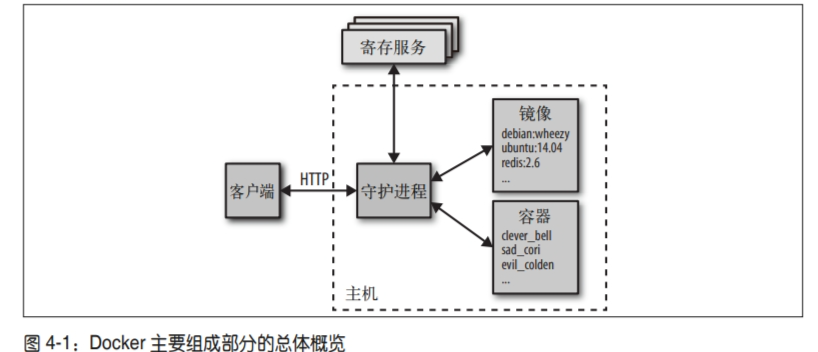

# Docker基本概念
Docker 的三大核心概念：
- 镜像 (Image)
- 容器 (Container)
- 仓库 (Repository)

**配置 Docker 服务**
为了避免每次使用 Docker 命令时都需要切换到特权身份，可以将当前用户加入安装中自动创建的 docker 用户组，代码如下：
> sudo usermod -aG docker $USER
## Docker系统架构
- 图的中央是 Docker 守护进程，它负责容器的创建、运行和监控，还负责镜像的构建和储存。Docker 守护进程通过 docker daemon 命令启动，一般会交由主机的操作系统负责执行。
-  Docker 客户端在图的左边，它通过 **HTTP** 与 Docker 守护进程通信。默认使用 Unix 域套接字（Unix domain socket）实现，但为了支持远程客户端也可以使用 TCP socket。如果该套接字由 systemd 管理的话，也可以使用文件描述符。
- Docker 寄存服务负责储存和发布镜像。默认的寄存服务为 Docker Hub

### 底层技术
Docker 守护进程通过一个“执行驱动程序”（execution driver）来创建容器。默认情况下，它是 Docker 项目自行开发的 runc 驱动程序。
- cgroups，负责管理容器使用的资源（例如 CPU 和内存的使用）。它还负责冻结和解冻容器这两个 docker pause 命令所需的功能。
- Namespaces（命名空间），负责容器之间的隔离；它确保系统的其他部分与容器的文件系统、主机名、用户、网络和进程都是分开的。

## 核心概念
1. Docker 镜像
Docker 镜像类似于虚拟机镜像，可以将它理解为一个只读的模板。
2. Docker 容器
Docker 容器类似千一个轻量级的沙箱， Docker利用容器来运行和隔离应用。
容器是从镜像创建的应用运行实例。它可以启动、开始、停止、删除，而这些容器都是彼此相互隔离、互不可见的。

**注意**:镜像自身是只读的。容器从镜像启动的时候，会在镜像的最上层创建一个可写层。
3. Docker 仓库
Docker仓库类似于代码仓库，是Docker 集中存放镜像文件的场所。

## 镜像是如何生成的
### 　构建环境的上下文
docker build 命令需要 Dockerfile 和构建环境的上下文。上下文是一组本地文件和目录，它可以被 Dockerfile 的 ADD 或 COPY 指令所引用，通常以目录路径的形式指定。使用 .dockerignore 文件可以忽略文件，用法类似.gitignore文件。

### 镜像层
Dockerfile 中的每个指令执行后都会产生一个新的镜像层，而这个镜像层其实可以用来启动容器。一个新的镜像层的建立，是用上一层的镜像启动容器，然后执行 Dockerfile 的指令后，把它保存为一个新的镜像。当 Dockerfile 指令成功执行后，中间使用过的那个容器会被删掉，除非提供了--rm=false 参数。由于每个指令的最终结果都只是个静态的镜像而已，本质上除了一个文件系统和一些元数据以外就没有其他东西，因此即使指令中有任何正在运行的进程，最后都会被停掉。这意味着，虽然你可以在 RUN 指令中执行一些持久的进程，譬如数据库或SSH 服务，但到了处理下一个指令或启动容器的时候，它们就已经不再运行了。如果你需要在启动容器的时候同时运行一个服务或进程，它必须从 ENTRYPOINT 或 CMD 指令中启动。

可以通过 docker history 命令来查看组成镜像的所有层，我们在构建容器失败后，可以通过运行最后一个容器的镜像获取详细的信息。
### 基础镜像
你真正需要的可能只是一个小而完整的 Linux 发行版。如果追求极简主义，我会使用 **alpine**镜像，它的大小仅仅 5MB 多一点，但仍提供了一个包管理器，可以轻松安装大量应用和工具。如果我需要一个更完整的镜像，我通常会从 debian 系列中选一个，虽然ubuntu 镜像也很常见，但 debian 镜像比它小，还可以使用相同的软件包。
# 使用 Dockerfile 创建镜像
## 基本结构
般而言， Dockerfile 主体内容分为四部分：基础镜像信息、维护者信息、镜像操作指令和容器启动时执行指令。
一个简单的示例:

```shell
# 该 image 文件继承我自己的 gwave image，冒号表示标签，这里标签是2.0.0，即2.0.0版本的 gwave。
FROM iphysreserch/gwave:2.0.0

# 将当前目录下的所有文件(除了.dockerignore排除的路径),都拷贝进入 image 文件里微系统的/waveform目录
COPY . /waveform

# 指定接下来的工作路径为/waveform
WORKDIR /waveform

# 定义一个windos系统里的环境变量
ENV VERSION=2.0.0	# optional

# 将容器 3000 端口暴露出来， 允许外部连接这个端口
EXPOSE 3000			# optional

# 在/waveform目录下，运行以下命令更新系统程序包。注意，安装后所有的依赖都将打包进入 image 文件
RUN apt-get update && apt-get upgrade	# optional

# 将我这个 image 做成一个 app 可执行程序，容器启动后自动执行下面指令
ENTRYPOINT ["bash", "setup.sh"]

```
可以在项目的根目录下创建一个 .dockerignore 文件夹，表示可排除的文件，类似 .gitignore。

也可将 ENTRYPOINT 换做 CMD ，都是容器启动后自动执行指令，简单区别就是 ENTRYPOINT 可以在本地启动容器时加额外的shell参数。另外，一个 Dockerfile 可以包含多个RUN命令，但是只能有一个CMD 或者 ENTRYPOINT 命令。
>CMD bash setup.sh


##  指令说明
|分类|指令|说明|
<table>
    <tr>
        <th>分类</th>
        <th >指令</th>
       <th >说明</th>
       <!-- <th colspan="2">Header 2 &amp; 3 Combined</th> -->
    </tr>
    <tr>
        <td rowspan="14">配置指令</td>
    </tr>
    <tr>
    <td>ARG</td>
    <td>定义创建镜像过程中使用的变橇</td>
    </tr>
    <tr>
    <td>FROM</td>
    <td>指定所创建镜像的基础镜像</td>
    </tr>
    <tr>
    <td>LABEL</td>
    <td>为生成的镜像添加元数据标签信息</td>
    </tr>
    <tr>
    <td>EXPOSE</td>
    <td>声明镜像内服务监听的端口</td>
    </tr>
    <tr>
    <td>ENV</td>
    <td>指定环境变最</td>
    </tr>
    <tr>
    <td>ENTRY POINT </td>
    <td>指定镜像的默认入口命令</td>
    </tr>
    <tr>
    <td>VOLUME</td>
    <td>创建一个数据卷挂载点</td>
    </tr>
    <tr>
    <td>USER</td>
    <td>指定运行容器时的用户名或 UID</td>
    </tr>
    <tr>
    <td>WORKDIR </td>
    <td>配置工作目录</td>
    </tr>
    <tr>
    <td>ONBUILD </td>
    <td>创建子镜像时指定自动执行的操作指令</td>
    </tr>
    <tr>
    <td>STOPSIGNAL </td>
    <td>指定退出的信号值</td>
    </tr>
    <tr>
    <td>HEALTHCHECK</td>
    <td>配置所启动容器如何进行健康检查</td>
    </tr>
    <td>SHELL</td>
    <td>指定默认 shell 类型</td>
    </tr>
       <tr>
        <td rowspan="4">操作指令</td>
        <td>RUN </td>
        <td>运行指定命令</td>
    </tr>
    </tr>
       <tr>
        <td>CMD</td>
        <td>启动容器时指定默认执行的命</td>
    </tr>
    </tr>
       <tr>
        <td>ADD</td>
        <td>添加内容到镜像</td>
    </tr>
    </tr>
       <tr>
        <td>COPY</td>
        <td>复制内容到镜像</td>
    </tr>
</table>

 ## 创建镜像
编写完成 Dockerfile 之后，可以通过 docker [image] build 命令来创建镜像。基本的格式为 docker build [OPT ONS] PATH | URL 

该命令将读取指定路径下（包括子目录）的 Dockerfile, 并将该路径下所有数据作为上下(Context) 发送给 Docker 服务端。 Docker 服务端在校验 Dockerfile 格式通过后，逐条执行其中定义的指令，碰到 ADD COPY RUN 指令会生成一层新的镜像。

# 镜像分发

## 镜像及镜像库的命名方式 
指定镜像的名称和标签有两种方法，一是在构建镜像的时候，二是通过 docker tag 命令
```shell
$ cd identidock
$ docker build -t "identidock:0.1" . 
$ docker tag "identidock:0.1" "amouat/identidock:0.1" 
``` 
## Docker Hub

## 缩减镜像大小
