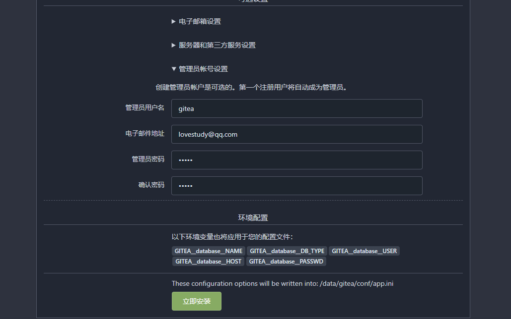
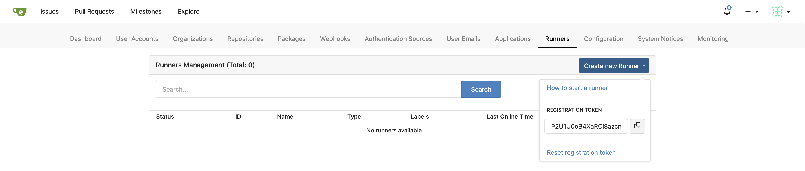
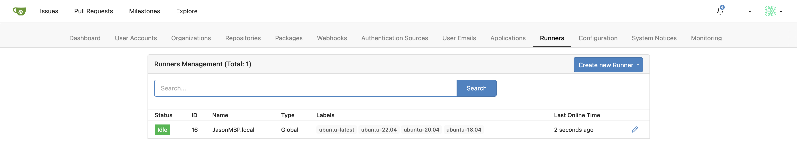
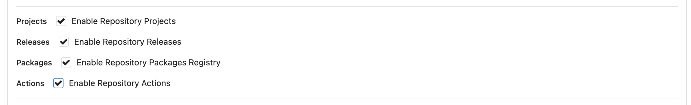
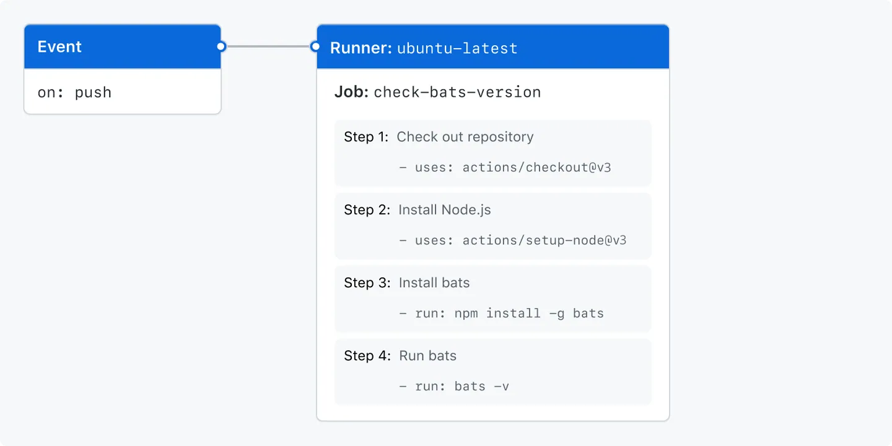

# 安装
## docker安装 （带mysql）
```yaml
version: "3"

networks:
  gitea:
    external: false

services:
  server:
    image: gitea/gitea:1.21.7
    container_name: gitea
    environment:
      - USER_UID=1000
      - USER_GID=1000
      - GITEA__database__DB_TYPE=mysql
      - GITEA__database__HOST=db:3306
      - GITEA__database__NAME=gitea
      - GITEA__database__USER=gitea
      - GITEA__database__PASSWD=gitea
    restart: always
    networks:
      - gitea
    # volumes:
    #   - ./gitea:/data
    #   - /etc/timezone:/etc/timezone:ro
    #   - /etc/localtime:/etc/localtime:ro
    ports:
      - "3000:3000"
      - "222:22"
    depends_on:
      - db

  db:
    image: mysql:8
    restart: always
    environment:
      - MYSQL_ROOT_PASSWORD=gitea
      - MYSQL_USER=gitea
      - MYSQL_PASSWORD=gitea
      - MYSQL_ROOT_PASSWORD=root 
      - MYSQL_DATABASE=gitea
    ports:
      - "3306:3306"
    networks:
      - gitea
    # volumes:
    #   - ./mysql:/var/lib/mysql
```
我们滑倒最下面

输入我们的管理员信息
点击立即安装

# 使用
## action
### Gitea Actions
#### 名称
Gitea Actions与GitHub Actions相似且兼容，它的名称也受到了它的启发。 为了避免混淆，在这里我们明确了拼写方式：
- "Gitea Actions"是Gitea功能的名称。
- "GitHub Actions"是GitHub功能的名称。
- "Actions"根据上下文的不同可以指代以上任意一个。在本文档中指代的是"Gitea Actions"。
- "action"或"actions"指代一些要使用的脚本/插件，比如"actions/checkout@v3"或"actions/cache@v3"
#### Runner
和其他CI/CD解决方案一样，Gitea不会自己运行Job，而是将Job委托给Runner。 Gitea Actions的Runner被称为act runner，它是一个独立的程序，也是用Go语言编写的。 它是基于nektos/act的一个分支 。

由于Runner是独立部署的，可能存在潜在的安全问题。 为了避免这些问题，请遵循两个简单的规则：
- 不要为你的仓库、组织或实例使用你不信任的Runner。
- 不要为你不信任的仓库、组织或实例提供Runner。

对于内部使用的Gitea实例，比如企业或个人使用的实例，这两个规则不是问题，它们自然而然就是如此。 然而，对于公共的Gitea实例，比如 gitea.com，在添加或使用Runner时应当牢记这两个规则。
#### 状态
Gitea Actions仍然在开发中，因此可能存在一些错误和缺失的功能。 并且在稳定版本（v1.20或更高版本）之前可能会进行一些重大的更改。
### 快速入门
#### 设置Gitea
从1.21.0开始，默认情况下，Actions是启用的。如果您正在使用1.21.0之前的版本，您需要将以下内容添加到配置文件中以启用它：
```yaml
[actions]
ENABLED=true
```
#### 设置Runner
Gitea Actions需要act runner 来运行Job。 为了避免消耗过多资源并影响Gitea实例，建议您在与Gitea实例分开的机器上启动Runner。


该Runner可以在隔离的Docker容器中运行Job，因此您需要确保已安装Docker并且Docker守护进程正在运行。 虽然这不是严格必需的，因为Runner也可以直接在主机上运行Job，这取决于您的配置方式。 然而，建议使用Docker运行Job，因为它更安全且更易于管理。

在运行Runner之前，您需要使用以下命令将其注册到Gitea实例中：
>./act_runner register --no-interactive --instance <instance> --token <token>

instance是您的Gitea实例的地址，如http://192.168.8.8:3000或https://gitea.com。 Runner和Job容器（由Runner启动以执行Job）将连接到此地址。 这意味着它可能与用于Web访问的ROOT_URL不同。 使用回环地址（例如 127.0.0.1 或 localhost）是一个不好的选择。

token 用于身份验证和标识，例如 P2U1U0oB4XaRCi8azcngmPCLbRpUGapalhmddh23。 它只能使用一次，并且不能用于注册多个Runner。 您可以从以下位置获取不同级别的token,从而创建出相应级别的runner

实例级别：管理员设置页面，例如 <your_gitea.com>/admin/actions/runners。
组织级别：组织设置页面，例如 <your_gitea.com>/<org>/settings/actions/runners。
存储库级别：存储库设置页面，例如 <your_gitea.com>/<owner>/<repo>/settings/actions/runners。

注册后，当前目录中将出现一个名为 .runner 的新文件，该文件存储了注册信息。 请不要手动编辑该文件。 如果该文件丢失或损坏，只需删除它然后重新注册即可。

最后，是时候启动Runner了：
>./act_runner daemon

您可以在管理页面上看到新的Runner：


#### 使用Actions
使对于启用了Gitea实例的Actions，存储库仍默认禁用Actions。

要启用它，请转到存储库的设置页面，例如your_gitea.com/<owner>/repo/settings，然后启用Enable Repository Actions。



# Actions 
## 了解 GitHub Actions
### 概述
GitHub Actions 是一种持续集成和持续交付 (CI/CD) 平台，可用于自动执行生成、测试和部署管道。 您可以创建工作流程来构建和测试存储库的每个拉取请求，或将合并的拉取请求部署到生产环境。
### GitHub Actions 的组件
可配置 GitHub Actions 工作流，使其在存储库中发生事件（例如打开拉取请求或创建问题）时触发 。 工作流包含一个或多个可按顺序或并行运行的作业。 每个作业都将在其自己的虚拟机运行器中或在容器中运行，并具有一个或多个步骤，用于运行定义的脚本或运行动作。动作是一个可重用的扩展，可简化工作流 。

### 工作流
工作流程是一个可配置的自动化过程，它将运行一个或多个作业。 工作流程由签入到存储库的 YAML 文件定义，并在存储库中的事件触发时运行，也可以手动触发，或按定义的时间表触发。

工作流程在存储库的 .github/workflows 目录中定义，存储库可以有多个工作流程，每个工作流程都可以执行不同的任务集。 
### 事件
事件是存储库中触发工作流程运行的特定活动。 例如，当有人创建拉取请求、打开议题或将提交推送到存储库时，活动可能源自 GitHub。 此外，还可以通过发布到 REST API 或者手动方式触发工作流按计划运行。
### 作业
作业是工作流中在同一运行器上执行的一组步骤。 每个步骤要么是一个将要执行的 shell 脚本，要么是一个将要运行的动作。 步骤按顺序执行，并且相互依赖。 由于每个步骤都在同一运行器上执行，因此您可以将数据从一个步骤共享到另一个步骤。 例如，可以有一个生成应用程序的步骤，后跟一个测试已生成应用程序的步骤。

您可以配置作业与其他作业的依赖关系；默认情况下，作业没有依赖关系，并且彼此并行运行。 当一个作业依赖于另一个作业时，它将等待从属作业完成，然后才能运行。 例如，对于没有依赖关系的不同体系结构，您可能有多个生成作业，以及一个依赖于这些作业的打包作业。 生成作业将并行运行，当它们全部成功完成后，打包作业将运行。

### 操作
操作是用于 GitHub Actions 平台的自定义应用程序，它执行复杂但经常重复的任务。 使用操作可帮助减少在工作流程文件中编写的重复代码量。 操作可以从 GitHub 拉取 git 存储库，为您的构建环境设置正确的工具链，或设置对云提供商的身份验证。
### 运行程序
运行程序是触发工作流时运行工作流的服务器。 每个运行器一次可以运行一个作业。 GitHub 提供 Ubuntu Linux、Microsoft Windows 和 macOS 运行器来运行您的工作流程；每个工作流程运行都在新预配的全新虚拟机中执行。 GitHub 还提供 大型运行器（适用于大型配置）。 

## 关于工作流
### 样例
```yaml
# Optional - 设置工作流的名称，因为它将显示在 GitHub 存储库的“action”选项卡中。如果省略此字段，则将改用工作流文件的名称作为工作流的名称。
name: learn-github-actions
# Optional - 从工作流生成的工作流运行名称，该名称将显示在存储库的“action”选项卡上的工作流运行列表中。此示例使用具有“github”上下文的表达式来显示触发工作流运行的执行组件的用户名。
run-name: ${{ github.actor }} is learning GitHub Actions

# 指定此工作流的触发器。此示例使用“push”事件，因此每次有人将更改推送到存储库或合并拉取请求时，都会触发工作流运行。
on: [push]

# 将“learn-github-actions”工作流中运行的所有作业组合在一起。
jobs:
# 定义一个名叫`check-bats-version`的job. 子键将定义作业的属性。
  check-bats-version:
# 将作业配置为在最新版本的 Ubuntu Linux 运行器上运行。这意味着作业将在 GitHub 托管的新虚拟机上执行。
    runs-on: ubuntu-latest
# 将“check-bats-version”作业中运行的所有步骤组合在一起. 嵌套在此部分下的每个项目都是一个单独的操作或 shell 脚本。.
    steps:
# “uses”关键字指定此步骤将运行“actions/checkout”操作的“v4”。 此操作可将您的存储库签出到 runner 上，使您能够针对您的代码运行脚本或其他操作。每当你的工作流将使用存储库的代码时，你应该使用 checkout 操作。
      - uses: actions/checkout@v4

# 这个的步骤使用`actions/setup-node@v4`操作来安装指定版本的Node.js。(这个例子使用版本14。)这会将`node`和`npm`命令都放在你的`PATH`中。
      - uses: actions/setup-node@v4
        with:
          node-version: '14'

# “run”关键字告诉作业在runner上执行命令。在这种情况下，您使用“npm”来安装“bats”软件测试包。
      - run: npm install -g bats

# 最后，您将运行带有输出软件版本的参数的“bats”命令。
      - run: bats -v
```
在下图中，您可以看到您刚刚创建的工作流文件以及 GitHub Actions 组件是如何在层次结构中组织的。每个步骤执行一个动作或 shell 脚本


### 创建依赖性作业
默认情况下，工作流中的作业同时并行运行。如果你有一个作业必须在另一个作业完成之后才能运行，你可以使用 needs 关键字来创建这种依赖关系。如果其中一个作业失败，所有依赖的作业都会被跳过；但是，如果你需要这些作业继续运行，你可以使用 if 条件语句来定义。
在此示例中，设置、构建和测试作业以串联方式运行，构建和测试依赖于前一个作业的成功完成：
```yaml
jobs:
  setup:
    runs-on: ubuntu-latest
    steps:
      - run: ./setup_server.sh
  build:
    needs: setup
    runs-on: ubuntu-latest
    steps:
      - run: ./build_server.sh
  test:
    needs: build
    runs-on: ubuntu-latest
    steps:
      - run: ./test_server.sh
```      
### 使用矩阵
矩阵策略允许您在单个作业定义中使用变量，以基于变量的组合自动创建多个作业运行。例如，您可以使用矩阵策略在多种语言版本或多种操作系统上测试您的代码。矩阵是使用strategy关键字创建的，该关键字接收构建选项作为数组。例如，此矩阵将使用不同版本的Node.js多次运行作业：
```yaml
jobs:
  build:
    runs-on: ubuntu-latest
    strategy:
      matrix:
        node: [14, 16]
    steps:
      - uses: actions/setup-node@v4
        with:
          node-version: ${{ matrix.node }}
```
### 缓存依赖项
如果您的作业经常重复使用依赖关系，可以考虑缓存这些文件以帮助提高性能。创建缓存后，同一存储库中的所有工作流都可以使用它。
这个例子演示了如何缓存 ~/.npm 目录：
```yaml
jobs:
  example-job:
    steps:
      - name: Cache node modules
        uses: actions/cache@v3
        env:
          cache-name: cache-node-modules
        with:
          path: ~/.npm
          key: ${{ runner.os }}-build-${{ env.cache-name }}-${{ hashFiles('**/package-lock.json') }}
          restore-keys: |
            ${{ runner.os }}-build-${{ env.cache-name }}-
```
### 使用数据库和服务容器
如果你的工作需要数据库或缓存服务，你可以使用services关键字创建一个临时容器来托管该服务；生成的容器随后可用于该作业中的所有步骤，并在作业完成时被删除。此示例演示了作业如何使用services创建postgresql容器，然后使用node连接到该服务。
```yaml
jobs:
  container-job:
    runs-on: ubuntu-latest
    container: node:10.18-jessie
    services:
      postgres:
        image: postgres
    steps:
      - name: Check out repository code
        uses: actions/checkout@v4
      - name: Install dependencies
        run: npm ci
      - name: Connect to PostgreSQL
        run: node client.js
        env:
          POSTGRES_HOST: postgres
          POSTGRES_PORT: 5432
```
### 使用标签来路由工作流
如果你想确保特定类型的运行器会处理你的作业，你可以使用标签来控制作业的执行位置。除了自托管默认标签外，你还可以为自托管运行器分配标签。然后，你可以在 YAML 工作流中引用这些标签，确保作业以可预测的方式路由。GitHub 托管的运行器具有预定义的标签分配。
此示例显示了工作流如何使用标签指定所需的运行器：
```yaml
jobs:
  example-job:
    runs-on: [self-hosted, linux, x64, gpu]
```
## 触发工作流程
工作流程触发器是导致工作流程运行的事件。 这些事件可以是：
- 工作流程存储库中发生的事件
- 在 GitHub 之外发生并在 GitHub 上触发 repository_dispatch 事件的事件
- 预定时间
- 手动

### 使用事件触发工作流程
**使用单个事件**
>on: push

**使用多个事件**
>on: [push, fork]

**将活动类型和筛选器用于多个事件**
例如，具有以下 on 值的工作流将在以下情况下运行：
- 创建标签
- 推送到存储库中的 main 分支
- 推送到启用了 GitHub Pages 的分支
```yaml
on:
  label:
    types:
      - created
  push:
    branches:
      - main
  page_build:
```
### 使用事件活动类型
某些事件具有活动类型，可让你更好地控制工作流的运行时间。 使用 on.<event_name>.types 定义将触发工作流运行的事件活动类型。
例如，issue_comment 事件具有 created、edited 和 deleted 活动类型。 如果工作流在 label 事件上触发，则每当创建、编辑或删除标签时，它都会运行。 如果为 created 事件指定 label 活动类型，则工作流将在创建标签时运行，但不会在编辑或删除标签时运行。
```yaml
on:
  label:
    types:
      - created
```

### 使用筛选器
某些事件具有筛选器，可让你更好地控制工作流的运行时间。

例如，push 事件具有 branches 筛选器，该筛选器仅在发生目标为与 branches 筛选器匹配的分支的推送时（而不是在发生任何推送时）运行工作流。
```yaml
on:
  push:
    branches:
      - main
      - 'releases/**'
```
#### 使用筛选器定位拉取请求事件的特定分支
使用 pull_request 和 pull_request_target 事件时，可以将工作流配置为仅针对面向特定分支的拉取请求运行。
如果要包含分支名称模式或同时包含和排除分支名称模式，请使用 branches 筛选器。 只希望排除分支名称时，请使用 branches-ignore 筛选器。 不能对工作流中的同一事件同时使用 branches 和 branches-ignore 筛选器。
```yaml
on:
  pull_request:
    # Sequence of patterns matched against refs/heads
    branches:
      - main
      - 'mona/octocat'
      - 'releases/**'
```
#### 使用筛选器定位推送事件的特定分支或标记
```yaml
on:
  push:
    # Sequence of patterns matched against refs/heads
    branches:    
      - main
      - 'mona/octocat'
      - 'releases/**'
    # Sequence of patterns matched against refs/tags
    tags:        
      - v2
      - v1.*
```
#### 使用筛选器定位拉取请求或推送事件的特定路径
使用 push 和 pull_request 事件时，可以配置工作流以根据更改的文件路径运行。 路径筛选器不会针对标记的推送进行评估。

如果至少一个路径与 paths 筛选器中的模式匹配，则工作流将运行。 例如，只要推送 JavaScript 文件 (.js)，就会运行以下工作流。
```yaml
on:
  push:
    paths:
      - '**.js'
```

#### 使用筛选器定位工作流程运行事件的特定分支
使用 workflow_run 事件时，可以指定触发工作流必须在哪些分支上运行才能触发工作流。

branches 和 branches-ignore 筛选器接受使用 *、**、+、? 和 ! 等字符匹配多个分支名称的 glob 模式。 如果名称包含其中任一字符，而你想要逐字匹配，则需要使用 \ 转义每个特殊字符。 

例如，仅当名为 Build 的工作流在名称以 releases/ 开头的分支上运行时，具有以下触发器的工作流才会运行：
```yaml
on:
  workflow_run:
    workflows: ["Build"]
    types: [requested]
    branches:
      - 'releases/**'
```
# 使用作业
## 在工作流程中使用作业
## 选择作业的运行器
- 目标计算机可以是 GitHub 托管的运行器、大型运行器 或 自托管运行器。
- 你可以根据分配给运行器的标签、其组成员身份或两者的组合来定位运行器。
- 可以提供以下形式的 runs-on：
    - 单个字符串
    - 包含字符串的单个变量
    - 字符串数组、包含字符串的变量或两者的组合
    - 使用 group 或 labels 键的 key: value 对

- 如果指定字符串数组，工作流将在与所有指定 runs-on 值匹配的运行器上执行。 例如，此处的作业将仅在具有标签 linux、x64 和 gpu 的自托管运行器上运行：
>runs-on: [self-hosted, linux, x64, gpu]

- 可以在数组中混合使用字符串和变量。 例如：
```yaml
on:
  workflow_dispatch:
    inputs:
      chosen-os:
        required: true
        type: choice
        options:
        - Ubuntu
        - macOS

jobs:
  test:
    runs-on: [self-hosted, "${{ inputs.chosen-os }}"]
    steps:
    - run: echo Hello world!
```
## 使用条件控制作业执行
>if: ${{ ! startsWith(github.ref, 'refs/tags/') }}

## 使用矩阵
可以指定多个变量来创建多维矩阵。 将针对变量的每个可能组合运行作业。
例如，以下工作流指定两个变量：
- os 变量中指定的两个操作系统
- version 变量中指定的三个 Node.js 版本

工作流将运行六个作业，其中针对每个 os 和 version 变量组合提供一个作业。 每个作业都会将 runs-on 值设置为当前的 os 值，并将当前的 version 值传递给 actions/setup-node 操作。
```yaml
jobs:
  example_matrix:
    strategy:
      matrix:
        os: [ubuntu-22.04, ubuntu-20.04]
        version: [10, 12, 14]
    runs-on: ${{ matrix.os }}
    steps:
      - uses: actions/setup-node@v4
        with:
          node-version: ${{ matrix.version }}
```
## 环境
### 将环境用于作业
**使用单一环境名称的示例**
>environment: staging_environment

## 在容器中运行作业
### 概述
使用 jobs.<job_id>.container 创建用于运行作业中尚未指定容器的任何步骤的容器。 如有步骤同时使用脚本和容器操作，则容器操作将运行为同一网络上使用相同卷挂载的同级容器。

若不设置 container，所有步骤将直接在 runs-on 指定的主机上运行，除非步骤引用已配置为在容器中运行的操作。

注意：用于容器中的 run 步骤的默认 shell 是 sh，而不是 bash。 这可以使用 jobs.<job_id>.defaults.run 或 jobs.<job_id>.steps[*].shell 进行替代。
```yaml
name: CI
on:
  push:
    branches: [ main ]
jobs:
  container-test-job:
    runs-on: ubuntu-latest
    container:
      image: node:18
      env:
        NODE_ENV: development
      ports:
        - 80
      volumes:
        - my_docker_volume:/volume_mount
      options: --cpus 1
    steps:
      - name: Check for dockerenv file
        run: (ls /.dockerenv && echo Found dockerenv) || (echo No dockerenv)
```
## 定义作业的输出
可以使用 jobs.<job_id>.outputs 为作业创建输出的 map。 作业输出可用于所有依赖此作业的下游作业。

注意：**** 作业的所有步骤共享 $GITHUB_OUTPUT。 如果在多个步骤中使用同一输出名称，则写入输出的最后一步将替代该值。 如果作业使用矩阵并写入 $GITHUB_OUTPUT，则各矩阵组合将覆盖内容。 可以使用 matrix 上下文为各项作业配置创建唯一的输出名称。 有关详细信息，请参阅“上下文”。

```yaml
jobs:
  job1:
    runs-on: ubuntu-latest
    # Map a step output to a job output
    outputs:
      output1: ${{ steps.step1.outputs.test }}
      output2: ${{ steps.step2.outputs.test }}
    steps:
      - id: step1
        run: echo "test=hello" >> "$GITHUB_OUTPUT"
      - id: step2
        run: echo "test=world" >> "$GITHUB_OUTPUT"
  job2:
    runs-on: ubuntu-latest
    needs: job1
    steps:
      - env:
          OUTPUT1: ${{needs.job1.outputs.output1}}
          OUTPUT2: ${{needs.job1.outputs.output2}}
        run: echo "$OUTPUT1 $OUTPUT2"
```
# 生成和测试
## 关于持续集成
持续集成 (CI) 是一种需要频繁提交代码到共享仓库的软件实践。 频繁提交代码能较早检测到错误，减少在查找错误来源时开发者需要调试的代码量。 频繁的代码更新也更便于从软件开发团队的不同成员合并更改。 这对开发者非常有益，他们可以将更多时间用于编写代码，而减少在调试错误或解决合并冲突上所花的时间。

提交代码到仓库时，可以持续创建并测试代码，以确保提交未引入错误。 您的测试可以包括代码语法检查（检查样式格式）、安全性检查、代码覆盖率、功能测试及其他自定义检查。

创建和测试代码需要服务器。 您可以在推送代码到仓库之前在本地创建并测试更新，也可以使用 CI 服务器检查仓库中的新代码提交。
## 构建和测试 Go

### 指定 Go 版本
指定 Go 版本的最简单方法是使用由 GitHub 提供的 setup-go 操作。
若要在 GitHub 托管的运行器上使用 Go 的预安装版本，请将相关版本传递给 setup-go 操作的 go-version 属性。 此操作从每个运行器上的工具缓存中查找特定版本的 Go，并将必要的二进制文件添加到 PATH。 这些更改将持续用于作业的其余部分。

setup-go 操作是 Go与 GitHub Actions 结合使用时的推荐方式，因为它帮助确保不同运行器和不同版本的 Go 行为一致。 如果使用自托管运行器，则必须安装 Go 并将其添加到 PATH。
```yaml
name: Go

on: [push]

jobs:
  build:

    runs-on: ubuntu-latest
    strategy:
      matrix:
        go-version: [ '1.19', '1.20', '1.21.x' ]

    steps:
      - uses: actions/checkout@v4
      - name: Setup Go ${{ matrix.go-version }}
        uses: actions/setup-go@v4
        with:
          go-version: ${{ matrix.go-version }}
      # You can test your matrix by printing the current Go version
      - name: Display Go version
        run: go version
```
### 安装依赖关系
```yaml
    steps:
      - uses: actions/checkout@v4
      - name: Setup Go
        uses: actions/setup-go@v4
        with:
          go-version: '1.21.x'
      - name: Install dependencies
        run: |
          go get .
          go get example.com/octo-examplemodule
          go get example.com/octo-examplemodule@v1.3.4
```
### 缓存依赖项
可以使用 setup-go 操作缓存和还原依赖项。 默认情况下，在使用 setup-go 操作时，已启用缓存。

setup-go 操作在存储库根路径中搜索依赖项文件 go.sum，并使用依赖项文件的哈希值作为缓存密钥的一部分。
```yaml
      - name: Setup Go
        uses: actions/setup-go@v4
        with:
          go-version: '1.17'
          cache-dependency-path: subdir/go.sum
```

### 将工作流数据打包为构件
工作流程完成后，您可以上传产生的项目进行分析。 例如，您可能需要保存日志文件、核心转储、测试结果或屏幕截图。 以下示例演示如何使用 upload-artifact 操作上传测试结果。
```yaml
name: Upload Go test results

on: [push]

jobs:
  build:

    runs-on: ubuntu-latest
    strategy:
      matrix:
        go-version: [ '1.19', '1.20', '1.21.x' ]

    steps:
      - uses: actions/checkout@v4
      - name: Setup Go
        uses: actions/setup-go@v4
        with:
          go-version: ${{ matrix.go-version }}
      - name: Install dependencies
        run: go get .
      - name: Test with Go
        run: go test -json > TestResults-${{ matrix.go-version }}.json
      - name: Upload Go test results
        uses: actions/upload-artifact@v4
        with:
          name: Go-results-${{ matrix.go-version }}
          path: TestResults-${{ matrix.go-version }}.json
```
# 部署
## 关于持续部署
### 关于持续部署
持续部署 (CD) 是使用自动化发布和部署软件更新的做法。 作为典型 CD 过程的一部分，代码在部署之前会自动构建并测试。