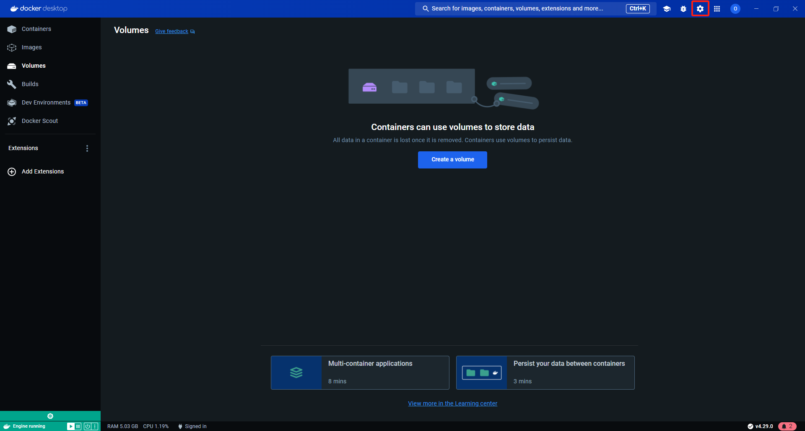
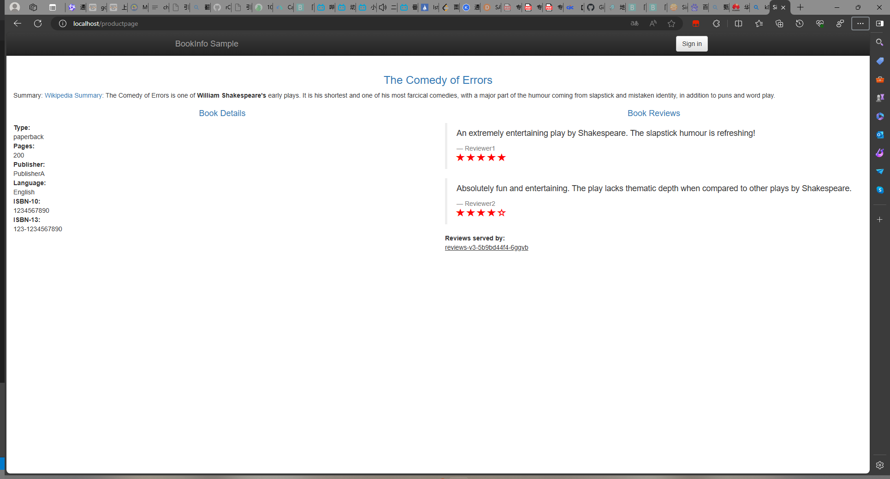
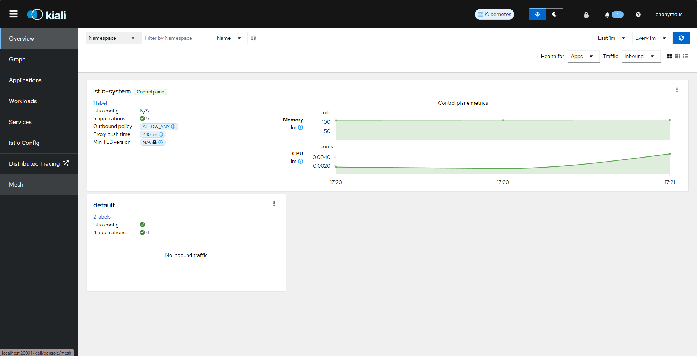
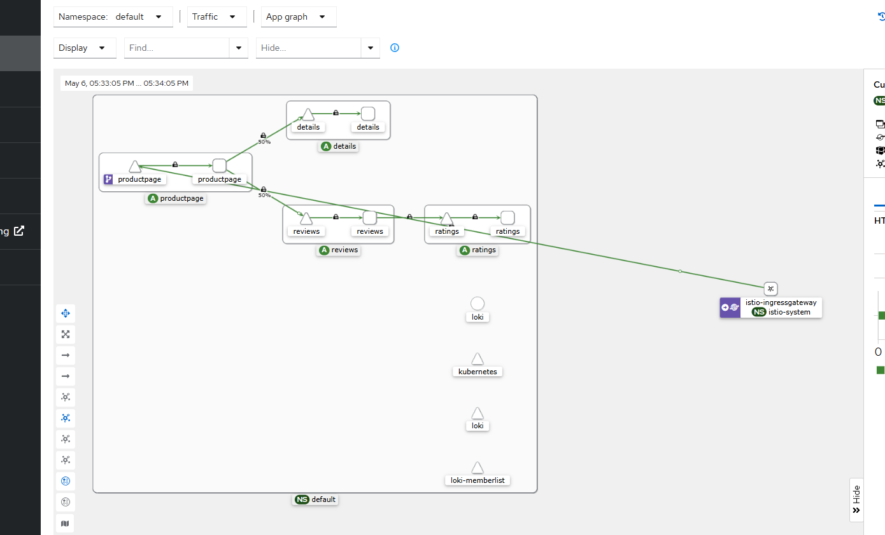

# 入门
## 安装
### linux
本人原本按照官网的入门教程基于minikube进行安装，但发现在虚拟机中转的minkube，无法通过nodeport通过暴露端口访问，经过几台你尝试，仍然无法解决。minikube版本为 1.33.0
### windos
#### 先决条件
windos安装的先决条件是安装docker desktop,安装地址如下https://www.docker.com/products/docker-desktop/,安装完成之后。我们需要开启k8s功能，步骤如下。
首先我们点击设置，接着我们找到kubernetes选项，开启kubernetes。



**测试**
我们在命令行输入以下命令
>kubectl version 

如果正常输出在则证明k8s安装成功

#### istio
首先我们要在官网选择适合自己的版本地址如下  https://github.com/istio/istio/releases/tag/1.21.2

下载完成后并解压，之后我们转到解压的目录，然后转到bin目录.
1. 对于本次安装，我们采用 demo 配置组合。 选择它是因为它包含了一组专为测试准备的功能集合，另外还有用于生产或性能测试的配置组合。
```shell
istioctl install --set profile=demo -y
✔ Istio core installed
✔ Istiod installed
✔ Egress gateways installed
✔ Ingress gateways installed
✔ Installation complete
```
2. 给命名空间添加标签，指示 Istio 在部署应用的时候，自动注入 Envoy 边车代理：
```shell
kubectl label namespace default istio-injection=enabled
namespace/default labeled
```
##### 部署示例应用
首先我们需要在转到istio解压后的文件夹。

1. 部署 Bookinfo 示例应用：
```shell
$ kubectl apply -f samples/bookinfo/platform/kube/bookinfo.yaml
service/details created
serviceaccount/bookinfo-details created
deployment.apps/details-v1 created
service/ratings created
serviceaccount/bookinfo-ratings created
deployment.apps/ratings-v1 created
service/reviews created
serviceaccount/bookinfo-reviews created
deployment.apps/reviews-v1 created
deployment.apps/reviews-v2 created
deployment.apps/reviews-v3 created
service/productpage created
serviceaccount/bookinfo-productpage created
deployment.apps/productpage-v1 created
```
**注意**：在部署这一步可能会出现镜像拉去问题，即使我通过更换国内源，仍然会一直出现ImagePullBackOff。所以我是通过科学上网，从官方镜像拉去的。这个过程可能有点慢，请耐心等待。
2. 应用很快会启动起来。当每个 Pod 准备就绪时，Istio 边车将伴随应用一起部署。
```shell
$ kubectl get services
NAME          TYPE        CLUSTER-IP       EXTERNAL-IP   PORT(S)    AGE
details       ClusterIP   10.109.147.164   <none>        9080/TCP   18h
kubernetes    ClusterIP   10.96.0.1        <none>        443/TCP    18h
productpage   ClusterIP   10.110.128.230   <none>        9080/TCP   18h
ratings       ClusterIP   10.110.153.255   <none>        9080/TCP   18h
reviews       ClusterIP   10.106.236.135   <none>        9080/TCP   18h
```
和
```shell
$ kubectl get pods
NAME                             READY   STATUS    RESTARTS        AGE
details-v1-698d88b-qwdp7         2/2     Running   2 (6h34m ago)   18h
productpage-v1-675fc69cf-t5tjb   2/2     Running   2 (6h34m ago)   18h
ratings-v1-6484c4d9bb-jsqhc      2/2     Running   2 (6h34m ago)   18h
reviews-v1-5b5d6494f4-m9dbk      2/2     Running   2 (6h34m ago)   18h
reviews-v2-5b667bcbf8-whvd7      2/2     Running   2 (6h34m ago)   18h
reviews-v3-5b9bd44f4-6ggvb       2/2     Running   2 (6h34m ago)   18h
```
##### 对外开放应用程序
此时，BookInfo 应用已经部署，但还不能被外界访问。 要开放访问，您需要创建 Istio 入站网关（Ingress Gateway）， 它会在网格边缘把一个路径映射到路由。

1. 把应用关联到 Istio 网关：
在解压的文件夹下执行以下命令
```shell
$ kubectl apply -f samples/bookinfo/networking/bookinfo-gateway.yaml
gateway.networking.istio.io/bookinfo-gateway created
virtualservice.networking.istio.io/bookinfo created
```
2. 确保配置文件没有问题：
在解压的文件夹下的bin目录执行以下命令
```shell
$ istioctl analyze
✔ No validation issues found when analyzing namespace: default.
```
**确定入站 IP 和端口**
```shell
$ kubectl get svc istio-ingressgateway -n istio-system
NAME                   TYPE           CLUSTER-IP       EXTERNAL-IP     PORT(S)                                      AGE
istio-ingressgateway   LoadBalancer   10.101.40.140   localhost     15021:32484/TCP,80:30445/TCP,443:31666/TCP,31400:30463/TCP,15443:32270/TCP   18h
```
这里docker desktop给我们做好了外部的负载均衡。我们可以看到我们的LoadBalancer已经是localhost，这代表我们已经能够通过本机访问。

在浏览器访问以下地址
>http://localhost/productpage



出现以上界面表示搭建成功。


#### 查看仪表板
Istio 和几个遥测应用做了集成。 遥测能帮您了解服务网格的结构、展示网络的拓扑结构、分析网格的健康状态。

使用下面说明部署 Kiali 仪表板、 以及 Prometheus、 Grafana、 还有 Jaeger。
1. 安装 Kiali 和其他插件，等待部署完成。
```shell
kubectl apply -f samples/addons
kubectl rollout status deployment/kiali -n istio-system
Waiting for deployment "kiali" rollout to finish: 0 of 1 updated replicas are available...
deployment "kiali" successfully rolled out
```

2. 访问 Kiali 仪表板。
>istioctl dashboard kiali

之后我们访问http://localhost:20001/kiali/console/overview?duration=60&refresh=60000
便可以访问控制版面了。

3. 在左侧的导航菜单，选择 Graph ，然后在 Namespace 下拉列表中，选择 default。

然后在刷新我们的bookinfo界面，便会出现我们的，服务传递模型。
 


# 概念
## 流量管理
Istio 的流量路由规则可以让您很容易的控制服务之间的流量和 API 调用。 Istio 简化了服务级别属性的配置，比如熔断器、超时和重试，并且能轻松的设置重要的任务， 如 A/B 测试、金丝雀发布、基于流量百分比切分的分阶段发布等。它还提供了开箱即用的故障恢复特性， 有助于增强应用的健壮性，从而更好地应对被依赖的服务或网络发生故障的情况。

Istio 的流量管理模型源于和服务一起部署的 Envoy 代理。 网格内服务发送和接收的所有 data plane 流量都经由 Envoy 代理， 这让控制网格内的流量变得异常简单，而且不需要对服务做任何的更改。


### Istio 流量管理介绍
为了在网格中导流，Istio 需要知道所有的 endpoint 在哪以及它们属于哪些服务。 为了定位到 service registry， Istio 会连接到一个服务发现系统。例如，如果您在 Kubernetes 集群上安装了 Istio， 那么它将自动检测该集群中的服务和 endpoint。
使用此服务注册中心，Envoy 代理可以将流量定向到相关服务。大多数基于微服务的应用程序， 每个服务的工作负载都有多个实例来处理流量，称为负载均衡池。默认情况下， Envoy 代理基于轮询调度模型在服务的负载均衡池内分发流量，按顺序将请求发送给池中每个成员， 一旦所有服务实例均接收过一次请求后，就重新回到第一个池成员。

Istio 基本的服务发现和负载均衡能力为您提供了一个可用的服务网格， 但它能做到的远比这多的多。在许多情况下，您可能希望对网格的流量情况进行更细粒度的控制。 作为 A/B 测试的一部分，您可能想将特定百分比的流量定向到新版本的服务， 或者为特定的服务实例子集应用不同的负载均衡策略。您可能还想对进出网格的流量应用特殊的规则， 或者将网格的外部依赖项添加到服务注册中心。通过使用 Istio 的流量管理 API 将流量配置添加到 Istio， 就可以完成所有这些甚至更多的工作。

### 虚拟服务
虚拟服务（Virtual Service） 和目标规则（Destination Rule） 是 Istio 流量路由功能的核心构建模块。 基于 Istio 和您的平台提供的基本连通性及服务发现能力，虚拟服务允许您配置请求如何路由到特定的服务。 每个虚拟服务包含一组按顺序评估的路由规则，通过这些规则，Istio 将每个到虚拟服务的给定请求匹配到特定的、真实的目标地址。 根据您的使用场景，您的服务网格可以有多个虚拟服务或者不需要虚拟服务。

### 为什么使用虚拟服务？
虚拟服务在增强 Istio 流量管理的灵活性和有效性方面，发挥着至关重要的作用， 实现方式是解耦客户端请求的目标地址与实际响应请求的目标工作负载。 虚拟服务同时提供了丰富的方式，为发送至这些工作负载的流量指定不同的路由规则。

为什么这如此有用？就像在介绍中所说，如果没有虚拟服务， Envoy 会在所有的服务实例中使用轮询的负载均衡策略分发请求。 您可以用您对工作负载的了解来改善这种行为。例如，有些可能代表不同的版本。 这在 A/B 测试中可能有用，您可能希望在其中配置基于不同服务版本的流量百分比路由， 或指引从内部用户到特定实例集的流量。

使用虚拟服务，您可以为一个或多个主机名指定流量行为。在虚拟服务中使用路由规则， 告诉 Envoy 如何发送虚拟服务的流量到适当的目标。路由目标地址可以是同一服务的不同版本， 也可以是完全不同的服务。

一个典型的用例是将流量发送到被指定为服务子集的服务的不同版本。 客户端将虚拟服务视为一个单一实体，将请求发送至虚拟服务主机， 然后 Envoy 根据虚拟服务规则把流量路由到不同的版本。例如， “20% 的调用转发到新版本”或“将这些用户的调用转发到版本 2”。 这允许您创建一个金丝雀发布，逐步增加发送到新版本服务的流量百分比。 流量路由完全独立于实例部署，这意味着实现新版本服务的实例可以根据流量的负载来伸缩， 完全不影响流量路由。相比之下，像 Kubernetes 这样的容器编排平台只支持基于实例缩放的流量分发， 这会让情况变得复杂。

虚拟服务可以让您：
- 通过单个虚拟服务处理多个应用程序服务。如果您的网格使用 Kubernetes， 可以配置一个虚拟服务处理特定命名空间中的所有服务。映射单一的虚拟服务到多个“真实”服务特别有用， 可以在不需要客户适应转换的情况下，将单体应用转换为微服务构建的复合应用系统。 您的路由规则可以指定为“对 monolith.com 的 URI 调用转发到 microservice A” 等等。 您可以在下面的一个示例看到它是如何工作的。
- 和网关整合并配置流量规则来控制出入流量。

在某些情况下，您还需要配置目标规则来使用这些特性，因为这是指定服务子集的地方。 在一个单独的对象中指定服务子集和其它特定目标策略，有利于在虚拟服务之间更简洁地重用这些规则。 

#### 虚拟服务示例
下面的虚拟服务根据请求是否来自特定的用户，把它们路由到服务的不同版本。
```yaml
apiVersion: networking.istio.io/v1alpha3
kind: VirtualService
metadata:
  name: reviews
spec:
  hosts:
  - reviews
  http:
  - match:
    - headers:
        end-user:  # 指定了要检查的HTTP请求头字段为end-user。
          exact: jason # 求请求头中的end-user字段必须精确匹配字符串jason。
    route:
    - destination:
        host: reviews # 指定路由的目标服务名为reviews
        subset: v2
  - route:
    - destination:
        host: reviews
        subset: v3
```
**hosts 字段**
使用 hosts 字段列举虚拟服务的主机——即用户指定的目标或是路由规则设定的目标。 这是客户端向服务发送请求时使用的一个或多个地址。
```yaml
hosts:
- reviews
```
虚拟服务主机名可以是 IP 地址、DNS 名称，或者依赖于平台的一个简称（例如 Kubernetes 服务的短名称），隐式或显式地指向一个完全限定域名（FQDN）。您也可以使用通配符（“*”）前缀， 创建一组匹配所有服务的路由规则。虚拟服务的 hosts 字段实际上不必是 Istio 服务注册的一部分，它只是虚拟的目标地址。这让您可以为没有路由到网格内部的虚拟主机建模。

**路由规则**
在 http 字段包含了虚拟服务的路由规则，用来描述匹配条件和路由行为， 它们把 HTTP/1.1、HTTP2 和 gRPC 等流量发送到 hosts 字段指定的目标（您也可以用 tcp 和 tls 片段为 TCP 和未终止的 TLS 流量设置路由规则。一个路由规则包含了指定的请求要流向哪个目标地址，具有 0 或多个匹配条件，取决于您的使用场景。

*匹配条件*
示例中的第一个路由规则有一个条件，因此以 match 字段开始。在本例中， 您希望此路由应用于来自 ”jason“ 用户的所有请求，所以使用 headers、 end-user 和 exact 字段选择适当的请求。
```yaml
- match:
   - headers:
       end-user:
         exact: jason
```
*Destination*
route 部分的 destination 字段指定了符合此条件的流量的实际目标地址。 与虚拟服务的 hosts 不同，destination 的 host 必须是存在于 Istio 服务注册中心的实际目标地址，否则 Envoy 不知道该将请求发送到哪里。 可以是一个有代理的服务网格，或者是一个通过服务入口（service entry）被添加进来的非网格服务。 本示例运行在 Kubernetes 环境中，host 名为一个 Kubernetes 服务名：
```yaml
route:
- destination:
    host: reviews
    subset: v2
```

**路由规则优先级**
路由规则按从上到下的顺序选择，虚拟服务中定义的第一条规则有最高优先级。本示例中， 不满足第一个路由规则的流量均流向一个默认的目标，该目标在第二条规则中指定。因此， 第二条规则没有 match 条件，直接将流量导向 v3 子集。
```yaml
- route:
  - destination:
      host: reviews
      subset: v3
```

#### 路由规则的更多内容
正如上面所看到的，路由规则是将特定流量子集路由到指定目标地址的强大工具。 您可以在流量端口、header 字段、URI 等内容上设置匹配条件。例如， 这个虚拟服务让用户发送请求到两个独立的服务：ratings 和 reviews， 就好像它们是 http://bookinfo.com/ 这个更大的虚拟服务的一部分。 虚拟服务规则根据请求的 URI 和指向适当服务的请求匹配流量。
```yaml
apiVersion: networking.istio.io/v1alpha3
kind: VirtualService
metadata:
  name: bookinfo
spec:
  hosts:
    - bookinfo.com
  http:
  - match:
    - uri:
        prefix: /reviews
    route:
    - destination:
        host: reviews
  - match:
    - uri:
        prefix: /ratings
    route:
    - destination:
        host: ratings
```
有些匹配条件可以使用精确的值，如前缀或正则。

您可以使用 AND 向同一个 match 块添加多个匹配条件，或者使用 OR 向同一个规则添加多个 match 块。 对于任何给定的虚拟服务也可以有多个路由规则。这可以在单个虚拟服务中使路由条件变得随您所愿的复杂或简单。 匹配条件字段和备选值的完整列表可以在 HTTPMatchRequest 参考中找到。

另外，使用匹配条件您可以按百分比”权重“分发请求。这在 A/B 测试和金丝雀发布中非常有用：
```yaml
spec:
  hosts:
  - reviews
  http:
  - route:
    - destination:
        host: reviews
        subset: v1
      weight: 75
    - destination:
        host: reviews
        subset: v2
      weight: 25
```
您也可以使用路由规则在流量上执行一些操作，例如：
- 添加或删除 header。
- 重写 URL。
- 为调用这一目标地址的请求设置重试策略。


### 目标规则
与虚拟服务一样， 目标规则也是 Istio 流量路由功能的关键部分。您可以将虚拟服务视为将流量如何路由到给定目标地址， 然后使用目标规则来配置该目标的流量。在评估虚拟服务路由规则之后， 目标规则将应用于流量的“真实”目标地址。

特别是，您可以使用目标规则来指定命名的服务子集，例如按版本为所有给定服务的实例分组。 然后可以在虚拟服务的路由规则中使用这些服务子集来控制到服务不同实例的流量。

目标规则还允许您在调用整个目的地服务或特定服务子集时定制 Envoy 的流量策略， 比如您喜欢的负载均衡模型、TLS 安全模式或熔断器设置。 在目标规则参考中可以看到目标规则选项的完整列表。
**负载均衡选项**
默认情况下，Istio 使用轮询的负载均衡策略，实例池中的每个实例依次获取请求。Istio 同时支持如下的负载均衡模型， 可以在 DestinationRule 中为流向某个特定服务或服务子集的流量指定这些模型。
- 随机：请求以随机的方式转发到池中的实例。
- 权重：请求根据指定的百分比转发到池中的实例。
- 最少请求：请求被转发到最少被访问的实例。


**目标规则示例**
在下面的示例中，目标规则为 my-svc 目标服务配置了 3 个具有不同负载均衡策略的子集：
```yaml
apiVersion: networking.istio.io/v1alpha3
kind: DestinationRule
metadata:
  name: my-destination-rule
spec:
  host: my-svc
  trafficPolicy:
    loadBalancer:
      simple: RANDOM
  subsets:
  - name: v1
    labels:
      version: v1
  - name: v2
    labels:
      version: v2
    trafficPolicy:
      loadBalancer:
        simple: ROUND_ROBIN
  - name: v3
    labels:
      version: v3
```
每个子集都是基于一个或多个 labels 定义的，在 Kubernetes 中它是附加到像 Pod 这种对象上的键/值对。这些标签应用于 Kubernetes 服务的 Deployment 并作为 metadata 来识别不同的版本。

除了定义子集之外，此目标规则对于所有子集都有默认的流量策略，而对于该子集， 则有特定于子集的策略覆盖它。定义在 subsets 上的默认策略，为 v1 和 v3 子集设置了一个简单的随机负载均衡器。在 v2 策略中，轮询负载均衡器被指定在相应的子集字段上。

### 网关
使用网关来管理网格的入站和出站流量， 可以让您指定要进入或离开网格的流量。网关配置被用于运行在网格边缘的独立 Envoy 代理， 而不是与服务工作负载一起运行的 Sidecar Envoy 代理。

与 Kubernetes Ingress API 这种控制进入系统流量的其他机制不同， Istio 网关让您充分利用流量路由的强大能力和灵活性。 您可以这么做的原因是 Istio 的网关资源可以配置 4-6 层的负载均衡属性， 如对外暴露的端口、TLS 设置等。然后，您无需将应用层流量路由 (L7) 添加到同一 API 资源， 而是将常规 Istio 虚拟服务绑定到网关。 这让您可以像管理网格中其他数据平面的流量一样去管理网关流量。

网关主要用于管理进入的流量，但您也可以配置出口网关。出口网关让您为离开网格的流量配置一个专用的出口节点， 这可以限制哪些服务可以或应该访问外部网络， 或者启用出口流量安全控制增强网格安全性。 您也可以使用网关配置一个纯粹的内部代理。

Istio 提供了一些预先配置好的网关代理部署（istio-ingressgateway 和 istio-egressgateway） 供您使用——如果使用 demo 配置文件安装它们都已经部署好了； 如果使用的是 default 配置文件则只部署了入口网关。 可以将您自己的网关配置应用到这些部署或配置您自己的网关代理。

#### Gateway 示例
下面的示例展示了一个外部 HTTPS 入口流量的网关配置：
```yaml
apiVersion: networking.istio.io/v1alpha3
kind: Gateway
metadata:
  name: ext-host-gwy
spec:
  selector:
    app: my-gateway-controller
  servers:
  - port:
      number: 443
      name: https
      protocol: HTTPS
    hosts:
    - ext-host.example.com
    tls:
      mode: SIMPLE
      credentialName: ext-host-cert
```
这个网关配置让 HTTPS 流量从 ext-host.example.com 通过 443 端口流入网格， 但没有为请求指定任何路由规则。要指定路由并让网关按预期工作，您必须把网关绑定到虚拟服务上。 正如下面的示例所示，使用虚拟服务的 gateways 字段进行设置：
```yaml
apiVersion: networking.istio.io/v1alpha3
kind: VirtualService
metadata:
  name: virtual-svc
spec:
  hosts:
  - ext-host.example.com
  gateways:
    - ext-host-gwy
```
然后就可以为出口流量配置带有路由规则的虚拟服务。

### 服务入口
使用服务入口（Service Entry） 来添加一个入口到 Istio 内部维护的服务注册中心。添加了服务入口后，Envoy 代理可以向服务发送流量， 就好像它是网格内部的服务一样。配置服务入口允许您管理运行在网格外的服务的流量，它包括以下几种能力：
- 为外部目标重定向和转发请求，例如来自 Web 端的 API 调用，或者流向遗留老系统的服务。
- 为外部目标定义重试、超时和故障注入策略。
- 添加一个运行在虚拟机的服务来扩展您的网格。

您不需要为网格服务要使用的每个外部服务都添加服务入口。 默认情况下，Istio 配置 Envoy 代理将请求传递给未知服务。 但是，您不能使用 Istio 的特性来控制没有在网格中注册的目标流量。

#### 服务入口示例
下面示例的 mesh-external 服务入口将 ext-svc.example.com 外部依赖项添加到 Istio 的服务注册中心：
```yaml
apiVersion: networking.istio.io/v1alpha3
kind: ServiceEntry
metadata:
  name: svc-entry
spec:
  hosts:
  - ext-svc.example.com
  ports:
  - number: 443
    name: https
    protocol: HTTPS
  location: MESH_EXTERNAL
  resolution: DNS
```

您指定的外部资源使用 hosts 字段。可以使用完全限定名或通配符作为前缀域名。

您可以配置虚拟服务和目标规则，以更细粒度的方式控制到服务入口的流量， 这与网格中的任何其他服务配置流量的方式相同。例如， 下面的目标规则调整了使用服务入口配置的 ext-svc.example.com 外部服务的连接超时：
```yaml
apiVersion: networking.istio.io/v1alpha3
kind: DestinationRule
metadata:
  name: ext-res-dr
spec:
  host: ext-svc.example.com
  trafficPolicy:
    connectionPool:
      tcp:
        connectTimeout: 1s
```
### Sidecar
默认情况下，Istio 让每个 Envoy 代理都可以访问来自和它关联的工作负载的所有端口的请求， 然后转发到对应的工作负载。您可以使用 Sidecar 配置去做下面的事情：
- 微调 Envoy 代理接受的端口和协议集。
- 限制 Envoy 代理可以访问的服务集合。
您可能希望在较庞大的应用程序中限制这样的 Sidecar 可达性， 配置每个代理能访问网格中的任意服务可能会因为高内存使用量而影响网格的性能。

您可以指定将 Sidecar 配置应用于特定命名空间中的所有工作负载，或者使用 workloadSelector 选择特定的工作负载。例如，下面的 Sidecar 配置将 bookinfo 命名空间中的所有服务配置为仅能访问运行在相同命名空间和 Istio 控制平面中的服务（Istio 的 Egress 和遥测功能需要使用）：
```yaml
apiVersion: networking.istio.io/v1alpha3
kind: Sidecar
metadata:
  name: default
  namespace: bookinfo
spec:
  egress:
  - hosts:
    - "./*"
    - "istio-system/*"
```

### 网络弹性和测试
除了为您的网格导流之外，Istio 还提供了可选的故障恢复和故障注入功能， 您可以在运行时动态配置这些功能。使用这些特性可以让您的应用程序运行稳定， 确保服务网格能够容忍故障节点，并防止局部故障级联影响到其他节点。

#### 超时
超时是 Envoy 代理等待来自给定服务的答复的时间量，以确保服务不会因为等待答复而无限期的挂起， 并在可预测的时间范围内调用成功或失败。HTTP 请求的默认超时时间是 15 秒， 这意味着如果服务在 15 秒内没有响应，调用将失败。

对于某些应用程序和服务，Istio 的缺省超时可能不合适。例如，超时太长可能会由于等待失败服务的回复而导致过度的延迟； 而超时过短则可能在等待涉及多个服务返回的操作时触发不必要的失败。为了找到并使用最佳超时设置， Istio 允许您使用虚拟服务按服务轻松地动态调整超时，而不必修改您的业务代码。 下面的示例是一个虚拟服务，它对 ratings 服务的 v1 子集的调用指定 10 秒超时：
```yaml
apiVersion: networking.istio.io/v1alpha3
kind: VirtualService
metadata:
  name: ratings
spec:
  hosts:
  - ratings
  http:
  - route:
    - destination:
        host: ratings
        subset: v1
    timeout: 10s
```
#### 重试
重试设置指定如果初始调用失败，Envoy 代理尝试连接服务的最大次数。 重试可以通过确保调用不会由于暂时性问题（例如临时过载的服务或网络）而永久失败， 从而提高服务可用性和应用程序性能。重试之间的间隔（25ms+）是可变的，由 Istio 自动确定， 防止被调用的服务被请求淹没。HTTP 请求的默认重试行为是在返回错误之前重试两次。

与超时一样，Istio 默认的重试行为在延迟方面可能不适合您的应用程序需求（对失败的服务进行过多的重试会降低速度）或可用性。 您可以在虚拟服务中按服务调整重试设置，而不必修改业务代码。 您还可以通过添加每次重试的超时来进一步细化重试行为，指定您希望等待每次重试成功连接到服务的时间量。 下面的示例配置了在初始调用失败后最多重试 3 次来连接到服务子集，每个重试都有 2 秒的超时。
```yaml
apiVersion: networking.istio.io/v1alpha3
kind: VirtualService
metadata:
  name: ratings
spec:
  hosts:
  - ratings
  http:
  - route:
    - destination:
        host: ratings
        subset: v1
    retries:
      attempts: 3
      perTryTimeout: 2s
```
#### 熔断器
熔断器是 Istio 为创建具有弹性的微服务应用提供的另一个有用的机制。在熔断器中， 设置一个对服务中的单个主机调用的限制，例如并发连接的数量或对该主机调用失败的次数。 一旦限制被触发，熔断器就会“跳闸”并停止连接到该主机。 使用熔断模式可以快速失败而不必让客户端尝试连接到过载或有故障的主机。

熔断适用于在负载均衡池中的“真实”网格目标地址，您可以在目标规则中配置熔断器阈值， 让配置应用于服务中的每个主机。下面的示例将 v1 子集的 reviews 服务工作负载的并发连接数限制为 100：
```yaml
apiVersion: networking.istio.io/v1alpha3
kind: DestinationRule
metadata:
  name: reviews
spec:
  host: reviews
  subsets:
  - name: v1
    labels:
      version: v1
    trafficPolicy:
      connectionPool:
        tcp:
          maxConnections: 100
```

#### 故障注入
在配置了网络，包括故障恢复策略之后，可以使用 Istio 的故障注入机制来为整个应用程序测试故障恢复能力。 故障注入是一种将错误引入系统以确保系统能够承受并从错误条件中恢复的测试方法。 使用故障注入特别有用，能确保故障恢复策略不至于不兼容或者太严格，这会导致关键服务不可用。

与其他错误注入机制（如延迟数据包或在网络层杀掉 Pod）不同，Istio 允许在应用层注入错误。 这使您可以注入更多相关的故障，例如 HTTP 错误码，以获得更多相关的结果。

您可以注入两种故障，它们都使用虚拟服务配置：

- 延迟：延迟是时间故障。它们模拟增加的网络延迟或一个超载的上游服务。

- 终止：终止是崩溃失败。他们模仿上游服务的失败。终止通常以 HTTP 错误码或 TCP 连接失败的形式出现。

例如，下面的虚拟服务为千分之一的访问 ratings 服务的请求配置了一个 5 秒的延迟：
```yaml
apiVersion: networking.istio.io/v1alpha3
kind: VirtualService
metadata:
  name: ratings
spec:
  hosts:
  - ratings
  http:
  - fault:
      delay:
        percentage:
          value: 0.1
        fixedDelay: 5s
    route:
    - destination:
        host: ratings
        subset: v1
```

#### 和您的应用程序一起运行
Istio 故障恢复功能对应用程序来说是完全透明的。在返回响应之前， 应用程序不知道 Envoy Sidecar 代理是否正在处理被调用服务的故障。这意味着， 如果在应用程序代码中设置了故障恢复策略，那么您需要记住这两个策略都是独立工作的， 否则会发生冲突。例如，假设您设置了两个超时，一个在虚拟服务中配置， 另一个在应用程序中配置。应用程序为服务的 API 调用设置了 2 秒超时。 而您在虚拟服务中配置了一个 3 秒超时和重试。在这种情况下，应用程序的超时会先生效， 因此 Envoy 的超时和重试尝试会失效。

虽然 Istio 故障恢复特性提高了网格中服务的可靠性和可用性， 但应用程序必须处理故障或错误并采取适当的回退操作。 例如，当负载均衡中的所有实例都失败时，Envoy 返回一个 HTTP 503 代码。 应用程序必须实现回退逻辑来处理 HTTP 503 错误代码。

```yaml
apiVersion: v1
items:
- apiVersion: v1
  kind: Pod
  metadata:
    annotations:
      istio.io/rev: default
      prometheus.io/path: /stats/prometheus
      prometheus.io/port: "15020"
      prometheus.io/scrape: "true"
      sidecar.istio.io/inject: "false"
    creationTimestamp: "2024-05-05T13:38:16Z"
    generateName: istio-ingressgateway-fdbd47d99-
    labels:
      app: istio-ingressgateway
      chart: gateways
      heritage: Tiller
      install.operator.istio.io/owning-resource: unknown
      istio: ingressgateway
      istio.io/rev: default
      operator.istio.io/component: IngressGateways
      pod-template-hash: fdbd47d99
      release: istio
      service.istio.io/canonical-name: istio-ingressgateway
      service.istio.io/canonical-revision: latest
      sidecar.istio.io/inject: "false"
    name: istio-ingressgateway-fdbd47d99-29zk8
    namespace: istio-system
    ownerReferences:
    - apiVersion: apps/v1
      blockOwnerDeletion: true
      controller: true
      kind: ReplicaSet
      name: istio-ingressgateway-fdbd47d99
      uid: c39c018e-7cb3-4d5a-8193-810c573e696d
    resourceVersion: "6614"
    uid: 1f02d98b-2baf-48b9-ae89-5996ee21631c
  spec:
    affinity:
      nodeAffinity: {}
    containers:
    - args:
      - proxy
      - router
      - --domain
      - $(POD_NAMESPACE).svc.cluster.local
      - --proxyLogLevel=warning
      - --proxyComponentLogLevel=misc:error
      - --log_output_level=default:info
      env:
      - name: JWT_POLICY
        value: third-party-jwt
      - name: PILOT_CERT_PROVIDER
        value: istiod
      - name: CA_ADDR
        value: istiod.istio-system.svc:15012
      - name: NODE_NAME
        valueFrom:
          fieldRef:
            apiVersion: v1
            fieldPath: spec.nodeName
      - name: POD_NAME
        valueFrom:
          fieldRef:
            apiVersion: v1
            fieldPath: metadata.name
      - name: POD_NAMESPACE
        valueFrom:
          fieldRef:
            apiVersion: v1
            fieldPath: metadata.namespace
      - name: INSTANCE_IP
        valueFrom:
          fieldRef:
            apiVersion: v1
            fieldPath: status.podIP
      - name: HOST_IP
        valueFrom:
          fieldRef:
            apiVersion: v1
            fieldPath: status.hostIP
      - name: ISTIO_CPU_LIMIT
        valueFrom:
          resourceFieldRef:
            divisor: "0"
            resource: limits.cpu
      - name: SERVICE_ACCOUNT
        valueFrom:
          fieldRef:
            apiVersion: v1
            fieldPath: spec.serviceAccountName
      - name: ISTIO_META_WORKLOAD_NAME
        value: istio-ingressgateway
      - name: ISTIO_META_OWNER
        value: kubernetes://apis/apps/v1/namespaces/istio-system/deployments/istio-ingressgateway
      - name: ISTIO_META_MESH_ID
        value: cluster.local
      - name: TRUST_DOMAIN
        value: cluster.local
      - name: ISTIO_META_UNPRIVILEGED_POD
        value: "true"
      - name: ISTIO_META_CLUSTER_ID
        value: Kubernetes
      - name: ISTIO_META_NODE_NAME
        valueFrom:
          fieldRef:
            apiVersion: v1
            fieldPath: spec.nodeName
      image: docker.io/istio/proxyv2:1.21.2
      imagePullPolicy: IfNotPresent
      name: istio-proxy
      ports:
      - containerPort: 15021
        protocol: TCP
      - containerPort: 8080
        protocol: TCP
      - containerPort: 8443
        protocol: TCP
      - containerPort: 31400
        protocol: TCP
      - containerPort: 15443
        protocol: TCP
      - containerPort: 15090
        name: http-envoy-prom
        protocol: TCP
      readinessProbe:
        failureThreshold: 30
        httpGet:
          path: /healthz/ready
          port: 15021
          scheme: HTTP
        initialDelaySeconds: 1
        periodSeconds: 2
        successThreshold: 1
        timeoutSeconds: 1
      resources:
        limits:
          cpu: "2"
          memory: 1Gi
        requests:
          cpu: 10m
          memory: 40Mi
      securityContext:
        allowPrivilegeEscalation: false
        capabilities:
          drop:
          - ALL
        privileged: false
        readOnlyRootFilesystem: true
      terminationMessagePath: /dev/termination-log
      terminationMessagePolicy: File
      volumeMounts:
      - mountPath: /var/run/secrets/workload-spiffe-uds
        name: workload-socket
      - mountPath: /var/run/secrets/credential-uds
        name: credential-socket
      - mountPath: /var/run/secrets/workload-spiffe-credentials
        name: workload-certs
      - mountPath: /etc/istio/proxy
        name: istio-envoy
      - mountPath: /etc/istio/config
        name: config-volume
      - mountPath: /var/run/secrets/istio
        name: istiod-ca-cert
      - mountPath: /var/run/secrets/tokens
        name: istio-token
        readOnly: true
      - mountPath: /var/lib/istio/data
        name: istio-data
      - mountPath: /etc/istio/pod
        name: podinfo
      - mountPath: /etc/istio/ingressgateway-certs
        name: ingressgateway-certs
        readOnly: true
      - mountPath: /etc/istio/ingressgateway-ca-certs
        name: ingressgateway-ca-certs
        readOnly: true
      - mountPath: /var/run/secrets/kubernetes.io/serviceaccount
        name: kube-api-access-cw48j
        readOnly: true
    dnsPolicy: ClusterFirst
    enableServiceLinks: true
    nodeName: docker-desktop
    preemptionPolicy: PreemptLowerPriority
    priority: 0
    restartPolicy: Always
    schedulerName: default-scheduler
    securityContext:
      runAsGroup: 1337
      runAsNonRoot: true
      runAsUser: 1337
    serviceAccount: istio-ingressgateway-service-account
    serviceAccountName: istio-ingressgateway-service-account
    terminationGracePeriodSeconds: 30
    tolerations:
    - effect: NoExecute
      key: node.kubernetes.io/not-ready
      operator: Exists
      tolerationSeconds: 300
    - effect: NoExecute
      key: node.kubernetes.io/unreachable
      operator: Exists
      tolerationSeconds: 300
    volumes:
    - emptyDir: {}
      name: workload-socket
    - emptyDir: {}
      name: credential-socket
    - emptyDir: {}
      name: workload-certs
    - configMap:
        defaultMode: 420
        name: istio-ca-root-cert
      name: istiod-ca-cert
    - downwardAPI:
        defaultMode: 420
        items:
        - fieldRef:
            apiVersion: v1
            fieldPath: metadata.labels
          path: labels
        - fieldRef:
            apiVersion: v1
            fieldPath: metadata.annotations
          path: annotations
      name: podinfo
    - emptyDir: {}
      name: istio-envoy
    - emptyDir: {}
      name: istio-data
    - name: istio-token
      projected:
        defaultMode: 420
        sources:
        - serviceAccountToken:
            audience: istio-ca
            expirationSeconds: 43200
            path: istio-token
    - configMap:
        defaultMode: 420
        name: istio
        optional: true
      name: config-volume
    - name: ingressgateway-certs
      secret:
        defaultMode: 420
        optional: true
        secretName: istio-ingressgateway-certs
    - name: ingressgateway-ca-certs
      secret:
        defaultMode: 420
        optional: true
        secretName: istio-ingressgateway-ca-certs
    - name: kube-api-access-cw48j
      projected:
        defaultMode: 420
        sources:
        - serviceAccountToken:
            expirationSeconds: 3607
            path: token
        - configMap:
            items:
            - key: ca.crt
              path: ca.crt
            name: kube-root-ca.crt
        - downwardAPI:
            items:
            - fieldRef:
                apiVersion: v1
                fieldPath: metadata.namespace
              path: namespace
  status:
    conditions:
    - lastProbeTime: null
      lastTransitionTime: "2024-05-06T01:50:29Z"
      status: "True"
      type: PodReadyToStartContainers
    - lastProbeTime: null
      lastTransitionTime: "2024-05-05T13:38:16Z"
      status: "True"
      type: Initialized
    - lastProbeTime: null
      lastTransitionTime: "2024-05-06T01:51:05Z"
      status: "True"
      type: Ready
    - lastProbeTime: null
      lastTransitionTime: "2024-05-06T01:51:05Z"
      status: "True"
      type: ContainersReady
    - lastProbeTime: null
      lastTransitionTime: "2024-05-05T13:38:16Z"
      status: "True"
      type: PodScheduled
    containerStatuses:
    - containerID: docker://6b564306848c21a0e9d4cec0789b48432587cf92210ba63948cdee35dcfcb0d6
      image: istio/proxyv2:1.21.2
      imageID: docker-pullable://istio/proxyv2@sha256:15f2457e7cf6a88d99f9de38ef714304699478d645b8aab9cdad906402938f54
      lastState:
        terminated:
          containerID: docker://5860796c11ddbb19f3e8511dfbeb118a68dbcce46a07b6543ba10c5e753be64d
          exitCode: 255
          finishedAt: "2024-05-06T01:50:16Z"
          reason: Error
          startedAt: "2024-05-05T13:38:16Z"
      name: istio-proxy
      ready: true
      restartCount: 1
      started: true
      state:
        running:
          startedAt: "2024-05-06T01:50:29Z"
    hostIP: 192.168.65.3
    hostIPs:
    - ip: 192.168.65.3
    phase: Running
    podIP: 10.1.0.135
    podIPs:
    - ip: 10.1.0.135
    qosClass: Burstable
    startTime: "2024-05-05T13:38:16Z"
```