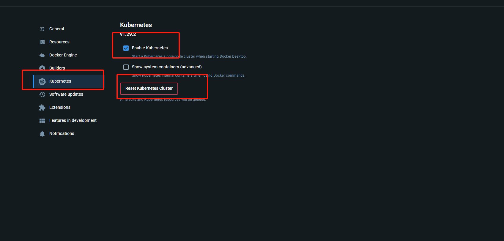

# 入门
## 安装
### linux
本人原本按照官网的入门教程基于minikube进行安装，但发现在虚拟机中转的minkube，无法通过nodeport通过暴露端口访问，经过几台你尝试，仍然无法解决。minikube版本为 1.33.0
### windos
#### 先决条件
windos安装的先决条件是安装docker desktop,安装地址如下https://www.docker.com/products/docker-desktop/,安装完成之后。我们需要开启k8s功能，步骤如下。
首先我们点击设置，接着我们找到kubernetes选项，开启kubernetes。



**测试**
我们在命令行输入以下命令
>kubectl version 

如果正常输出在则证明k8s安装成功

#### istio
首先我们要在官网选择适合自己的版本地址如下  https://github.com/istio/istio/releases/tag/1.21.2

下载完成后并解压，之后我们转到解压的目录，然后转到bin目录.
1. 对于本次安装，我们采用 demo 配置组合。 选择它是因为它包含了一组专为测试准备的功能集合，另外还有用于生产或性能测试的配置组合。
```shell
istioctl install --set profile=demo -y
✔ Istio core installed
✔ Istiod installed
✔ Egress gateways installed
✔ Ingress gateways installed
✔ Installation complete
```
2. 给命名空间添加标签，指示 Istio 在部署应用的时候，自动注入 Envoy 边车代理：
```shell
kubectl label namespace default istio-injection=enabled
namespace/default labeled
```
##### 部署示例应用
首先我们需要在转到istio解压后的文件夹。

1. 部署 Bookinfo 示例应用：
```shell
$ kubectl apply -f samples/bookinfo/platform/kube/bookinfo.yaml
service/details created
serviceaccount/bookinfo-details created
deployment.apps/details-v1 created
service/ratings created
serviceaccount/bookinfo-ratings created
deployment.apps/ratings-v1 created
service/reviews created
serviceaccount/bookinfo-reviews created
deployment.apps/reviews-v1 created
deployment.apps/reviews-v2 created
deployment.apps/reviews-v3 created
service/productpage created
serviceaccount/bookinfo-productpage created
deployment.apps/productpage-v1 created
```
**注意**：在部署这一步可能会出现镜像拉去问题，即使我通过更换国内源，仍然会一直出现ImagePullBackOff。所以我是通过科学上网，从官方镜像拉去的。这个过程可能有点慢，请耐心等待。
2. 应用很快会启动起来。当每个 Pod 准备就绪时，Istio 边车将伴随应用一起部署。
```shell
$ kubectl get services
NAME          TYPE        CLUSTER-IP       EXTERNAL-IP   PORT(S)    AGE
details       ClusterIP   10.109.147.164   <none>        9080/TCP   18h
kubernetes    ClusterIP   10.96.0.1        <none>        443/TCP    18h
productpage   ClusterIP   10.110.128.230   <none>        9080/TCP   18h
ratings       ClusterIP   10.110.153.255   <none>        9080/TCP   18h
reviews       ClusterIP   10.106.236.135   <none>        9080/TCP   18h
```
和
```shell
$ kubectl get pods
NAME                             READY   STATUS    RESTARTS        AGE
details-v1-698d88b-qwdp7         2/2     Running   2 (6h34m ago)   18h
productpage-v1-675fc69cf-t5tjb   2/2     Running   2 (6h34m ago)   18h
ratings-v1-6484c4d9bb-jsqhc      2/2     Running   2 (6h34m ago)   18h
reviews-v1-5b5d6494f4-m9dbk      2/2     Running   2 (6h34m ago)   18h
reviews-v2-5b667bcbf8-whvd7      2/2     Running   2 (6h34m ago)   18h
reviews-v3-5b9bd44f4-6ggvb       2/2     Running   2 (6h34m ago)   18h
```
##### 对外开放应用程序
此时，BookInfo 应用已经部署，但还不能被外界访问。 要开放访问，您需要创建 Istio 入站网关（Ingress Gateway）， 它会在网格边缘把一个路径映射到路由。

1. 把应用关联到 Istio 网关：
在解压的文件夹下执行以下命令
```shell
$ kubectl apply -f samples/bookinfo/networking/bookinfo-gateway.yaml
gateway.networking.istio.io/bookinfo-gateway created
virtualservice.networking.istio.io/bookinfo created
```
2. 确保配置文件没有问题：
在解压的文件夹下的bin目录执行以下命令
```shell
$ istioctl analyze
✔ No validation issues found when analyzing namespace: default.
```
**确定入站 IP 和端口**
```shell
$ kubectl get svc istio-ingressgateway -n istio-system
NAME                   TYPE           CLUSTER-IP       EXTERNAL-IP     PORT(S)                                      AGE
istio-ingressgateway   LoadBalancer   10.101.40.140   localhost     15021:32484/TCP,80:30445/TCP,443:31666/TCP,31400:30463/TCP,15443:32270/TCP   18h
```
这里docker desktop给我们做好了外部的负载均衡。我们可以看到我们的LoadBalancer已经是localhost，这代表我们已经能够通过本机访问。

在浏览器访问以下地址
>http://localhost/productpage


出现以上界面表示搭建成功。


#### 查看仪表板
Istio 和几个遥测应用做了集成。 遥测能帮您了解服务网格的结构、展示网络的拓扑结构、分析网格的健康状态。

使用下面说明部署 Kiali 仪表板、 以及 Prometheus、 Grafana、 还有 Jaeger。
1. 安装 Kiali 和其他插件，等待部署完成。
```shell
kubectl apply -f samples/addons
kubectl rollout status deployment/kiali -n istio-system
Waiting for deployment "kiali" rollout to finish: 0 of 1 updated replicas are available...
deployment "kiali" successfully rolled out
```

2. 访问 Kiali 仪表板。
>istioctl dashboard kiali

之后我们访问http://localhost:20001/kiali/console/overview?duration=60&refresh=60000
便可以访问控制版面了。

3. 在左侧的导航菜单，选择 Graph ，然后在 Namespace 下拉列表中，选择 default。

然后在刷新我们的bookinfo界面，便会出现我们的，服务传递模型。
 
