# minikube
## 安装
### 前置条件
已经安装docker
### 乌班图安装
#### Minikube
科学上网是我你们安装的前提。
```shell
curl -LO https://storage.googleapis.com/minikube/releases/latest/minikube-linux-amd64

sudo install minikube-linux-amd64 /usr/local/bin/minikube
```
**测试**
输入以下命令可以验证是否安装Minikube成功
>minikube version

出现以下内容则说明安装完成
```shell
minikube version: v1.32.0
commit: 8220a6eb95f0a4d75f7f2d7b14cef975f050512d
```
#### Kubernetes
为了管理集群资源、部署应用程序并检查Kubernetes集群的日志，我们可以使用其命令行工具，称为kubectl。在这里，我们将使用以下几个命令来安装它。
```shell
curl -LO "https://dl.k8s.io/release/$(curl -L -s https://dl.k8s.io/release/stable.txt)/bin/linux/amd64/kubectl"
chmod +x ./kubectl
sudo mv kubectl /usr/local/bin/
```
要检查kubectl版本，请运行：
>kubectl version --client --output=yaml

```shell
clientVersion:
  buildDate: "2024-03-15T00:08:19Z"
  compiler: gc
  gitCommit: 6813625b7cd706db5bc7388921be03071e1a492d
  gitTreeState: clean
  gitVersion: v1.29.3
  goVersion: go1.21.8
  major: "1"
  minor: "29"
  platform: linux/amd64
kustomizeVersion: v5.0.4-0.20230601165947-6ce0bf390ce3

```
#### 启动minikube
>minikube start --vm-driver docker

运行结果如下
```shell
* minikube v1.32.0 on Ubuntu 22.04
* Using the docker driver based on existing profile
* Starting control plane node minikube in cluster minikube
* Pulling base image ...
* Updating the running docker "minikube" container ...
! This container is having trouble accessing https://registry.k8s.io
* To pull new external images, you may need to configure a proxy: https://minikube.sigs.k8s.io/docs/reference/networking/proxy/
* Preparing Kubernetes v1.28.3 on Docker 24.0.7 ...
* Verifying Kubernetes components...
  - Using image gcr.io/k8s-minikube/storage-provisioner:v5
* Enabled addons: storage-provisioner, default-storageclass
* Done! kubectl is now configured to use "minikube" cluster and "default" namespace by default
```

#### 基础操作
1. 查看状态
> minikube status

2. 通过ssh访问Minikube命令行：
>minikube ssh

3. 查看当前激活的Minikube附加组件：
>minikube addons list

4. 检查集群信息
> kubectl cluster-info

5. 查看当前活动的节点：
> kubectl get nodes

6.  查看集群的默认配置视图：
> kubectl config view
7. 停止并删除Minikube集群：
>minikube stop

#### 外部或远程访问Kubernetes仪表板
Minikube附带了一个名为Dashboard的附加组件，通过运行本步骤中给定的命令可以自动启用它。因此，我们可以启动它以访问基于Web的Kubernetes用户界面，以部署容器应用程序、管理集群、获取资源概览等等...
>minikube dashboard

如果您在仅具有命令行界面的本地Ubuntu 22.04服务器上使用Minikube，并且希望在与服务器相同网络的其他计算机上远程访问MiniKube仪表板，则可以使用前面的步骤命令之一替代使用kubectl代理来打开本地的8001端口以访问Kubernetes的Web界面。
>kubectl proxy --port=8000 --address='0.0.0.0' --accept-hosts='^.*' &

接着我们只需要访问相应的端口进能够访问控制台,本人访问的地址如下
>http://192.168.218.134:8000/api/v1/namespaces/kubernetes-dashboard/services/http:kubernetes-dashboard:/proxy/#/workloads?namespace=default

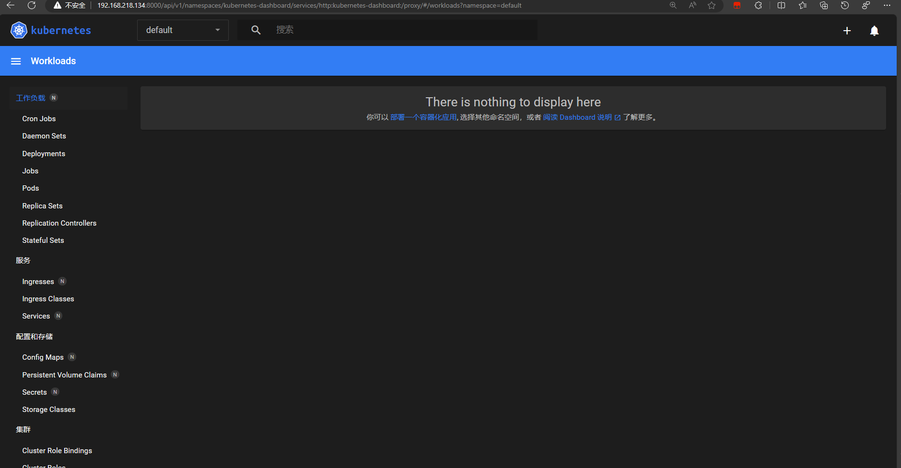

# Kubernetes介绍
##  Kubernetes介绍
Kubernetes是一个可以移植、可扩展的开源平台，使用 声明式的配置 并依据配置信息自动地执行容器化应用程序的管理。


容器化越来越流行，主要原因是它带来的诸多好处：
- **敏捷地创建和部署应用程序**：相较于创建虚拟机镜像，创建容器镜像更加容易和快速
- **持续构建集成**：可以更快更频繁地构建容器镜像、部署容器化的应用程序、并且轻松地回滚应用程序
- **分离开发和运维的关注点**：在开发构建阶段就完成容器镜像的构建，构建好的镜像可以部署到多种基础设施上。这种做法将开发阶段需要关注的内容包含在如何构建容器镜像的过程中，将部署阶段需要关注的内容聚焦在如何提供基础设施以及如何使用容器镜像的过程中。降低了开发和运维的耦合度
- **可监控性**：不仅可以查看操作系统级别的资源监控信息，还可以查看应用程序健康状态以及其他信号的监控信息
- **开发、测试、生产不同阶段的环境一致性**：开发阶段在笔记本上运行的容器与测试、生产环境中运行的容器一致
- **跨云服务商、跨操作系统发行版的可移植性**：容器可运行在 Ubuntu、RHEL、CoreOS、CentOS等不同的操作系统发行版上，可以运行在私有化部署、Google Kubernetes Engine、AWS、阿里云等不同的云供应商的环境中
- **以应用程序为中心的管理**：虚拟机时代的考虑的问题是在虚拟硬件上运行一个操作系统，而容器化时代，问题的焦点则是在操作系统的逻辑资源上运行一个应用程序
- **松耦合、分布式、弹性、无约束的微服务**：应用程序被切分成更小的、独立的微服务，并可以动态部署和管理，而不是一个部署在专属机器上的庞大的单片应用程序
- **资源隔离**：确保应用程序性能不受干扰
- **资源利用**：资源高效、高密度利用
##  Kubernetes的功能
- 服务发现和负载均衡
Kubernetes 可以通过 DNS 名称或 IP 地址暴露容器的访问方式。并且可以在同组容器内分发负载以实现负载均衡

- 存储编排
Kubernetes可以自动挂载指定的存储系统，例如 local stroage/nfs/云存储等
- 自动发布和回滚
您可以在 Kubernetes 中声明您期望应用程序容器应该达到的状态，Kubernetes将以合适的速率调整容器的实际状态，并逐步达到最终期望的结果。请参考 声明式的配置
- 自愈
Kubernetes提供如下自愈能力：
    - 重启已经停机的容器
    - 替换、kill 那些不满足自定义健康检查条件的容器
    - 在容器就绪之前，避免调用者发现该容器
- 密钥及配置管理
Kubernetes可以存储和管理敏感信息（例如，密码、OAuth token、ssh密钥等）。您可以更新容器应用程序的密钥、配置等信息，而无需：
    - 重新构建容器的镜像
    - 在不合适的地方暴露密码信息

# 基础知识
## 部署一个应用程序
**创建 YAML 文件**
创建文件 nginx-deployment.yaml，内容如下：
```yaml
apiVersion: apps/v1	#与k8s集群版本有关，使用 kubectl api-versions 即可查看当前集群支持的版本
kind: Deployment	#该配置的类型，我们使用的是 Deployment
metadata:	        #译名为元数据，即 Deployment 的一些基本属性和信息
  name: nginx-deployment	#Deployment 的名称
  labels:	    #标签，可以灵活定位一个或多个资源，其中key和value均可自定义，可以定义多组，目前不需要理解
    app: nginx	#为该Deployment设置key为app，value为nginx的标签
spec:	        #这是关于该Deployment的描述，可以理解为你期待该Deployment在k8s中如何使用
  replicas: 1	#使用该Deployment创建一个应用程序实例
  selector:	    #标签选择器，与上面的标签共同作用，目前不需要理解
    matchLabels: #选择包含标签app:nginx的资源
      app: nginx
  template:	    #这是选择或创建的Pod的模板
    metadata:	#Pod的元数据
      labels:	#Pod的标签，上面的selector即选择包含标签app:nginx的Pod
        app: nginx
    spec:	    #期望Pod实现的功能（即在pod中部署）
      containers:	#生成container，与docker中的container是同一种
      - name: nginx	#container的名称
        image: nginx:1.7.9	#使用镜像nginx:1.7.9创建container，该container默认80端口可访问
```
**应用 YAML 文件**
```shell
kubectl apply -f nginx-deployment.yaml
```
    
查看部署结果
```shell
# 查看 Deployment
kubectl get deployments

# 查看 Pod
kubectl get pods
```
## 查看Pods/Nodes
### Pods概述
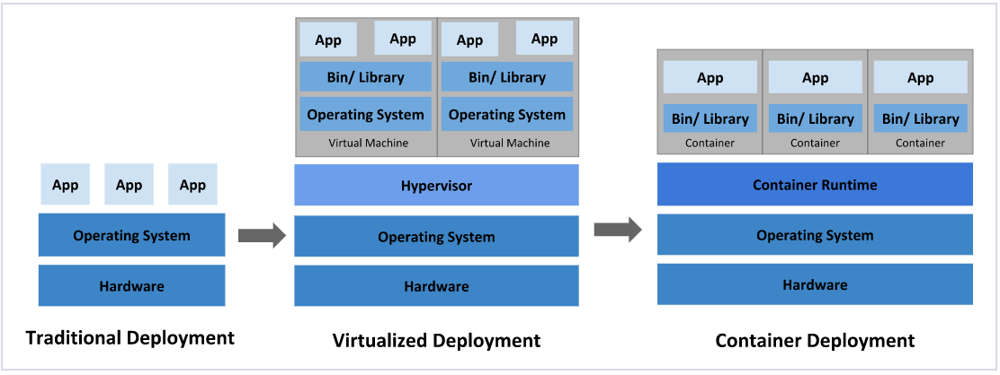
Pod 容器组 是一个k8s中一个抽象的概念，用于存放一组 container，以及这些 container （容器）的一些共享资源。这些资源包括：
- 共享存储，称为卷(Volumes)，即图上紫色圆柱网络，每个 Pod（容器组）在集群中有个唯一的 IP，pod（容器组）中的 container（容器）共享该IP地址
- container（容器）的基本信息，例如容器的镜像版本，对外暴露的端口等

Pod（容器组）是 k8s 集群上的最基本的单元。当我们在 k8s 上创建 Deployment 时，会在集群上创建包含容器的 Pod (而不是直接创建容器)。每个Pod都与运行它的 worker 节点（Node）绑定，并保持在那里直到终止或被删除。如果节点（Node）发生故障，则会在群集中的其他可用节点（Node）上运行相同的 Pod（从同样的镜像创建 Container，使用同样的配置，IP 地址不同，Pod 名字不同）。

### Node（节点）
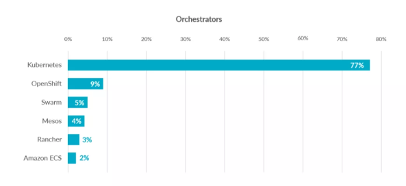
Pod总是在 Node上运行。Node（节点）是 kubernetes 集群中的计算机，可以是虚拟机或物理机。每个 Node（节点）都由 master 管理。一个 Node（节点）可以有多个Pod（容器组），kubernetes master 会根据每个 Node（节点）上可用资源的情况，自动调度 Pod（容器组）到最佳的 Node（节点）上。

每个 Kubernetes Node（节点）至少运行：
- Kubelet，负责 master 节点和 worker 节点之间通信的进程；管理 Pod和 Pod内运行的 Container（容器）。
- 容器运行环境负责下载镜像、创建和运行容器等。

### 实战：故障排除
在部署第一个应用程序 中，我们使用了 kubectl 命令行界面部署了 nginx 并且查看了 Deployment 和 Pod。kubectl 还有如下四个常用命令，在我们排查问题时可以提供帮助：
- kubectl get - 显示资源列表
```shell
# kubectl get 资源类型

#获取类型为Deployment的资源列表
kubectl get deployments

#获取类型为Pod的资源列表
kubectl get pods

#获取类型为Node的资源列表
kubectl get nodes
```
- 名称空间

在命令后增加 -A 或 --all-namespaces 可查看所有 名称空间中 的对象，使用参数 -n 可查看指定名称空间的对象，例如
```shell
# 查看所有名称空间的 Deployment
kubectl get deployments -A
kubectl get deployments --all-namespaces
# 查看 kube-system 名称空间的 Deployment
kubectl get deployments -n kube-system
```
- kubectl describe - 显示有关资源的详细信息
```shell
# kubectl describe 资源类型 资源名称

#查看名称为nginx-XXXXXX的Pod的信息
kubectl describe pod nginx-XXXXXX	

#查看名称为nginx的Deployment的信息
kubectl describe deployment nginx	
```
- kubectl logs - 查看pod中的容器的打印日志（和命令docker logs 类似）
```shell
# kubectl logs Pod名称

#查看名称为nginx-pod-XXXXXXX的Pod内的容器打印的日志
#本案例中的 nginx-pod 没有输出日志，所以您看到的结果是空的
kubectl logs -f nginx-pod-XXXXXXX
```
    
- kubectl exec - 在pod中的容器环境内执行命令(和命令docker exec 类似)
```shell
# kubectl exec Pod名称 操作命令

# 在名称为nginx-pod-xxxxxx的Pod中运行bash
kubectl exec -it nginx-pod-xxxxxx /bin/bash
```

## 公布应用程序
### Kubernetes Service（服务）概述
事实上，Pod（容器组）有自己的 生命周期。当 worker node（节点）故障时，节点上运行的 Pod（容器组）也会消失。然后，Deployment (opens new window)可以通过创建新的 Pod（容器组）来动态地将群集调整回原来的状态，以使应用程序保持运行。

举个例子，假设有一个图像处理后端程序，具有 3 个运行时副本。这 3 个副本是可以替换的（无状态应用），即使 Pod（容器组）消失并被重新创建，或者副本数由 3 增加到 5，前端系统也无需关注后端副本的变化。由于 Kubernetes 集群中每个 Pod（容器组）都有一个唯一的 IP 地址（即使是同一个 Node 上的不同 Pod），我们需要一种机制，为前端系统屏蔽后端系统的 Pod（容器组）在销毁、创建过程中所带来的 IP 地址的变化。

Kubernetes 中的 Service提供了这样的一个抽象层，它选择具备某些特征的 Pod并为它们定义一个访问方式。Service（服务）使 Pod（容器组）之间的相互依赖解耦。一个 Service选定哪些 Pod通常由 LabelSelector(标签选择器) 来决定。

在创建Service的时候，通过设置配置文件中的 spec.type 字段的值，可以以不同方式向外部暴露应用程序：

- ClusterIP（默认）
在群集中的内部IP上公布服务，这种方式的 Service（服务）只在集群内部可以访问到

- NodePort
使用 NAT 在集群中每个的同一端口上公布服务。这种方式下，可以通过访问集群中任意节点+端口号的方式访问服务 <NodeIP>:<NodePort>。此时 ClusterIP 的访问方式仍然可用。

- LoadBalancer
在云环境中（需要云供应商可以支持）创建一个集群外部的负载均衡器，并为使用该负载均衡器的 IP 地址作为服务的访问地址。此时 ClusterIP 和 NodePort 的访问方式仍然可用。

### 服务和标签
下图中有两个服务Service A(黄色虚线)和Service B(蓝色虚线) Service A 将请求转发到 IP 为 10.10.10.1 的Pod上， Service B 将请求转发到 IP 为 10.10.10.2、10.10.10.3、10.10.10.4 的Pod上。
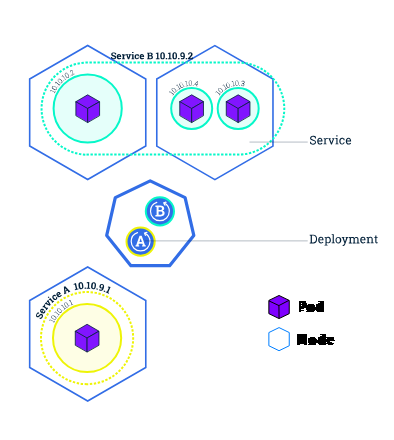

Service 将外部请求路由到一组 Pod 中，它提供了一个抽象层，使得 Kubernetes 可以在不影响服务调用者的情况下，动态调度容器组（在容器组失效后重新创建容器组，增加或者减少同一个 Deployment 对应容器组的数量等）。

Service使用 Labels、LabelSelector(标签和选择器) (opens new window)匹配一组 Pod。Labels（标签）是附加到 Kubernetes 对象的键/值对，其用途有多种：
- 将 Kubernetes 对象（Node、Deployment、Pod、Service等）指派用于开发环境、测试环境或生产环境
- 嵌入版本标签，使用标签区别不同应用软件版本
- 使用标签对 Kubernetes 对象进行分类

下图体现了 Labels（标签）和 LabelSelector（标签选择器）之间的关联关系
- Deployment B 含有 LabelSelector 为 app=B 通过此方式声明含有 app=B 标签的 Pod 与之关联
- 通过 Deployment B 创建的 Pod 包含标签为 app=B
- Service B 通过标签选择器 app=B 选择可以路由的 Pod
### 实战：为您的 nginx Deployment 创建一个 Service

创建nginx的Deployment中定义了Labels，如下：
```yaml
metadata:	#译名为元数据，即Deployment的一些基本属性和信息
  name: nginx-deployment	#Deployment的名称
  labels:	#标签，可以灵活定位一个或多个资源，其中key和value均可自定义，可以定义多组
    app: nginx	#为该Deployment设置key为app，value为nginx的标签
```
    
创建文件 nginx-service.yaml
>vim nginx-service.yaml
    
文件内容如下：
```yaml
apiVersion: v1
kind: Service
metadata:
  name: nginx-service	#Service 的名称
  labels:     	#Service 自己的标签
    app: nginx	#为该 Service 设置 key 为 app，value 为 nginx 的标签
spec:	    #这是关于该 Service 的定义，描述了 Service 如何选择 Pod，如何被访问
  selector:	    #标签选择器
    app: nginx	#选择包含标签 app:nginx 的 Pod
  ports:
  - name: nginx-port	#端口的名字
    protocol: TCP	    #协议类型 TCP/UDP
    port: 80	        #集群内的其他容器组可通过 80 端口访问 Service
    nodePort: 32600   #通过任意节点的 32600 端口访问 Service
    targetPort: 80	#将请求转发到匹配 Pod 的 80 端口
  type: NodePort	#Serive的类型，ClusterIP/NodePort/LoaderBalancer
```
    
执行命令
>kubectl apply -f nginx-service.yaml
 
    
检查执行结果
>kubectl get services -o wide

    
可查看到名称为 nginx-service 的服务。

访问服务
>curl <任意节点的 IP>:32600

## 伸缩应用程序
### Scaling（伸缩）应用程序
伸缩 的实现可以通过更改 nginx-deployment.yaml 文件中部署的 replicas（副本数）来完成
```yaml
spec:
  replicas: 2    #使用该Deployment创建两个应用程序实例

```
### Scaling（伸缩）
概述下图中，Service A 只将访问流量转发到 IP 为 10.0.0.5 的Pod上
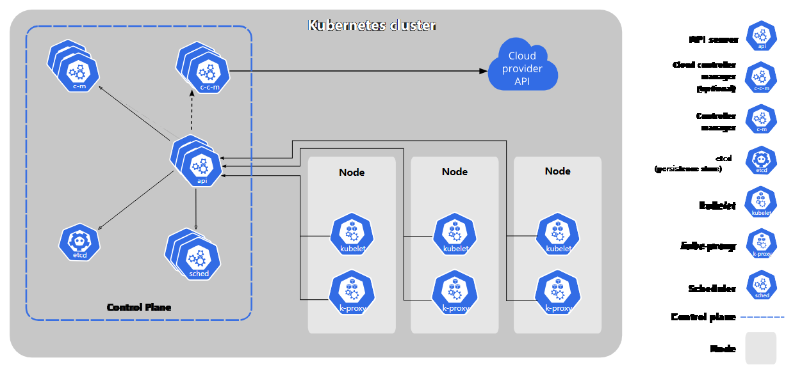
修改了 Deployment 的 replicas 为 4 后，Kubernetes 又为该 Deployment 创建了 3 新的 Pod，这 4 个 Pod 有相同的标签。因此Service A通过标签选择器与新的 Pod建立了对应关系，将访问流量通过负载均衡在 4 个 Pod 之间进行转发。
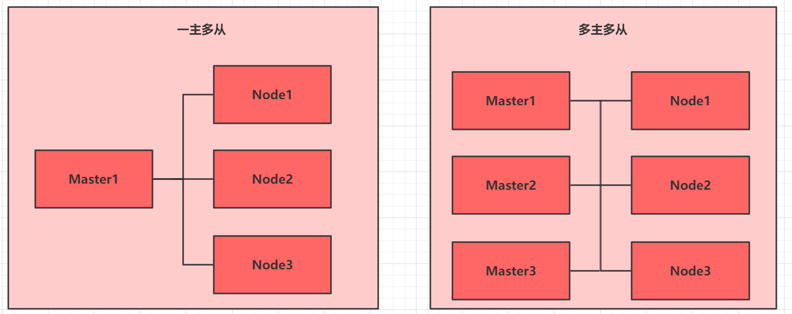
### 实战：将 nginx Deployment 扩容到 4 个副本

修改 nginx-deployment.yaml 文件

将 replicas 修改为 4
```yaml
apiVersion: apps/v1
kind: Deployment
metadata:
  name: nginx-deployment # 指定的唯一名称，在同一命名空间内必须唯一。
  labels:
    app: nginx
spec:
  replicas: 2  #使用该Deployment创建两个应用程序实例
  selector:
    matchLabels:
      app: nginx
  template:
    metadata:
      labels:
        app: nginx
    spec:
      containers:
      - name: nginx
        image: nginx:1.7.9
        ports:
        - containerPort: 80
```
    
执行命令
>kubectl apply -f nginx-deployment.yaml
    
查看结果
>watch kubectl get pods -o wide

## 执行滚动更新
用户期望应用程序始终可用，为此开发者/运维者在更新应用程序时要分多次完成。在 Kubernetes 中，这是通过 Rolling Update 滚动更新完成的。Rolling Update滚动更新 通过使用新版本的 Pod 逐步替代旧版本的 Pod 来实现 Deployment 的更新，从而实现零停机。新的 Pod 将在具有可用资源的 Node（节点）上进行调度。
### 滚动更新概述
1. 原本 Service A 将流量负载均衡到 4 个旧版本的 Pod 上

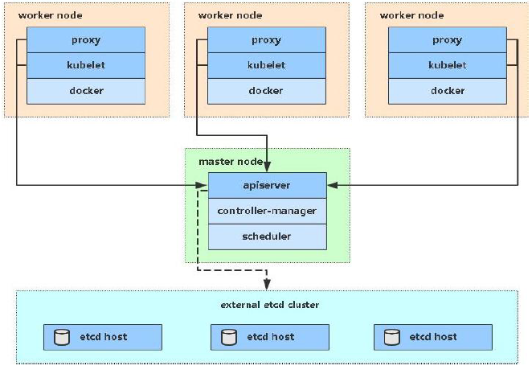
2. 更新完 Deployment 部署文件中的镜像版本后，master 节点选择了一个 worker 节点，并根据新的镜像版本创建 Pod（紫色容器）。新 Pod 拥有唯一的新的 IP。同时，master 节点选择一个旧版本的 Pod 将其移除。

此时，Service A 将新 Pod 纳入到负载均衡中，将旧Pod移除

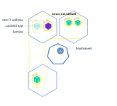

3. 同步骤2，再创建一个新的 Pod 替换一个原有的 Pod
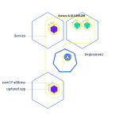

### 更新 nginx Deployment
修改 nginx-deployment.yaml 文件

修改文件中 image 镜像的标签，如下所示
```yaml
apiVersion: apps/v1
kind: Deployment
metadata:
  name: nginx-deployment
  labels:
    app: nginx
spec:
  replicas: 4
  selector:
    matchLabels:
      app: nginx
  template:
    metadata:
      labels:
        app: nginx
    spec:
      containers:
      - name: nginx
        image: nginx:1.8   #使用镜像nginx:1.8替换原来的nginx:1.7.9
        ports:
        - containerPort: 80
```
    
执行命令
>kubectl apply -f nginx-deployment.yaml

    
查看过程及结果

执行命令，可观察到 pod 逐个被替换的过程。
>watch kubectl get pods -l app=nginx

# 架构
## 节点
Kubernetes中节点（node）指的是一个工作机器。不同的集群中，节点可能是虚拟机也可能是物理机。每个节点都由 master 组件管理，并包含了运行 Pod（容器组）所需的服务。这些服务包括：
- 容器引擎
- kubelet
- kube-proxy 
### 节点状态
节点的状态包含如下信息：
- Addresses
- Conditions
- Capacity and Allocatable
- Info


执行以下命令可查看所有节点的列表：
>kubectl get nodes -o wide
    
执行以下命令可查看节点状态以及节点的其他详细信息：
>kubectl describe node <your-node-name>
####  Addresses

依据你集群部署的方式，Addesses 字段可能有所不同。
- HostName： 在节点命令行界面上执行 hostname 命令所获得的值。启动 kubelet 时，可以通过参数 --hostname-override 覆盖
- ExternalIP：通常是节点的外部IP（可以从集群外访问的内网IP地址；上面的例子中，此字段为空）
- InternalIP：通常是从节点内部可以访问的 IP 地址
#### Conditions
Conditions 描述了节点的状态。Condition的例子有：
|Node Condition|	描述|
|--------|--------|
|OutOfDisk|	如果节点上的空白磁盘空间不够，不能够再添加新的节点时，该字段为 True，其他情况为 False|
|Ready|	如果节点是健康的且已经就绪可以接受新的 Pod。则节点Ready字段为 True。False表明了该节点不健康，不能够接受新的 Pod。|
|MemoryPressure|	如果节点内存紧张，则该字段为 True，否则为False|
|PIDPressure|	如果节点上进程过多，则该字段为 True，否则为 False|
|DiskPressure|	如果节点磁盘空间紧张，则该字段为 True，否则为 False|
|NetworkUnvailable|	如果节点的网络配置有问题，则该字段为 True，否则为 False|

#### Capacity and Allocatable（容量和可分配量）
容量和可分配量（Capacity and Allocatable）描述了节点上的可用资源的情况：
- CPU
- 内存
- 该节点可调度的最大 pod 数量

Capacity 中的字段表示节点上的资源总数，Allocatable 中的字段表示该节点上可分配给普通 Pod 的资源总数。

#### Info
描述了节点的基本信息，例如：
- Linux 内核版本
- Kubernetes 版本（kubelet 和 kube-proxy 的版本）
- Docker 版本
- 操作系统名称

### 节点管理
与 Pod 和 Service 不一样，节点并不是由 Kubernetes 创建的，节点由云供应商创建，或者节点已经存在于您的物理机/虚拟机的资源池。向 Kubernetes 中创建节点时，仅仅是创建了一个描述该节点的 API 对象。节点 API 对象创建成功后，Kubernetes将检查该节点是否有效。例如，假设您创建如下节点信息：
```yaml
kind: Node
apiVersion: v1
metadata:
  name: "10.240.79.157"
  labels:
    name: "my-first-k8s-node"
```
#### 节点控制器（Node Controller）
节点控制器是一个负责管理节点的 Kubernetes master 组件。在节点的生命周期中，节点控制器起到了许多作用。
- 首先，节点控制器在注册节点时为节点分配 CIDR 地址块
- 第二，节点控制器通过云供应商（cloud-controller-manager）接口检查节点列表中每一个节点对象对应的虚拟机是否可用。在云环境中，只要节点状态异常，节点控制器检查其虚拟机在云供应商的状态，如果虚拟机不可用，自动将节点对象从 APIServer 中删除。
- 第三，节点控制器监控节点的健康状况。当节点变得不可触达时，节点控制器将节点API对象的 NodeStatus Condition 取值从 NodeReady 更新为 Unknown；然后在等待 pod-eviction-timeout 时间后，将节点上的所有 Pod 从节点驱逐。


#### 节点自注册（Self-Registration）
如果 kubelet 的启动参数 --register-node为 true（默认为 true），kubelet 会尝试将自己注册到 API Server。kubelet自行注册时，将使用如下选项：
- --kubeconfig：向 apiserver 进行认证时所用身份信息的路径
- --cloud-provider：向云供应商读取节点自身元数据
- --register-node：自动向 API Server 注册节点
- --register-with-taints：注册节点时，为节点添加污点（逗号分隔，格式为 <key>=<value>:<effect>
- --node-ip：节点的 IP 地址
- --node-labels：注册节点时，为节点添加标签
- --node-status-update-frequency：向 master 节点发送心跳信息的时间间隔

如果 Node authorization mode (opens new window)和 NodeRestriction admission plugin (opens new window)被启用，kubelet 只拥有创建/修改其自身所对应的节点 API 对象的权限。
#### 手动管理节点
管理员可以修改节点API对象（不管是否设置了 --register-node 参数）。可以修改的内容有：
- 增加/减少标签
- 标记节点为不可调度（unschedulable）

>kubectl cordon $NODENAME

#### 节点容量（Node Capacity）
节点API对象中描述了节点的容量（Capacity），例如，CPU数量、内存大小等信息。通常，节点在向 APIServer 注册的同时，在节点API对象里汇报了其容量（Capacity）。如果您 手动管理节点，您需要在添加节点时自己设置节点的容量。

## 集群内的通信
### Master-Node
Master-Node 之间的通信可以分为如下两类：
- Cluster to Master
- Master to Cluster
### Cluster to Master
所有从集群访问 Master 节点的通信，都是针对 apiserver 的（没有任何其他 master 组件发布远程调用接口）。通常安装 Kubernetes 时，apiserver 监听 HTTPS 端口（443），并且配置了一种或多种 客户端认证方式 authentication (opens new window)。至少需要配置一种形式的 授权方式 authorization (opens new window)，尤其是 匿名访问 anonymous requests (opens new window)或 Service Account Tokens (opens new window)被启用的情况下。

### Master to Cluster
从 master（apiserver）到Cluster存在着两条主要的通信路径：
- apiserver 访问集群中每个节点上的 kubelet 进程
- 使用 apiserver 的 proxy 功能，从 apiserver 访问集群中的任意节点、Pod、Service
#### apiserver to kubelet
apiserver 在如下情况下访问 kubelet：
- 抓取 Pod 的日志
- 通过 kubectl exec -it 指令（或 kuboard 的终端界面）获得容器的命令行终端
- 提供 kubectl port-forward 功能

这些连接的访问端点是 kubelet 的 HTTPS 端口。默认情况下，apiserver 不校验 kubelet 的 HTTPS 证书，这种情况下，连接可能会收到 man-in-the-middle 攻击，因此该连接如果在不受信网络或者公网上运行时，是 不安全 的。

如果要校验 kubelet 的 HTTPS 证书，可以通过 --kubelet-certificate-authority 参数为 apiserver 提供校验 kubelet 证书的根证书。

如果不能完成这个配置，又需要通过不受信网络或公网将节点加入集群，则需要使用 SSH隧道 连接 apiserver 和 kubelet。

同时，Kubelet authentication/authorization (opens new window)需要激活，以保护 kubelet API

#### apiserver to nodes, pods, services
从 apiserver 到 节点/Pod/Service 的连接使用的是 HTTP 连接，没有进行身份认证，也没有进行加密传输。您也可以通过增加 https 作为 节点/Pod/Service 请求 URL 的前缀，但是 HTTPS 证书并不会被校验，也无需客户端身份认证，因此该连接是无法保证一致性的。目前，此类连接如果运行在非受信网络或公网上时，是 不安全 的

#### SSH隧道
Kubernetes 支持 SSH隧道（tunnel）来保护 Master --> Cluster 访问路径。此时，apiserver 将向集群中的每一个节点建立一个 SSH隧道（连接到端口22的ssh服务）并通过隧道传递所有发向 kubelet、node、pod、service 的请求。
## 控制器
在 Kubernetes 中，控制器 就是上面所说的 控制循环，它不断监控着集群的状态，并对集群做出对应的变更调整。每一个控制器都不断地尝试着将 当前状态 调整到 目标状态。
### 控制器模式
在 Kubernetes 中，每个控制器至少追踪一种类型的资源。这些资源对象中有一个 spec 字段代表了目标状态。资源对象对应的控制器负责不断地将当前状态调整到目标状态。
#### 通过APIServer进行控制
以 Kubernetes 中自带的一个控制器 Job Controller 为例。Kubernetes 自带的控制器都是通过与集群中 API Server 交互来达到调整状态的目的。

Job 是一种 Kubernetes API 对象，一个 Job 将运行一个（或多个）Pod，执行一项任务，然后停止。当新的 Job 对象被创建时，Job Controller 将确保集群中有合适数量的节点上的 kubelet 启动了指定个数的 Pod，以完成 Job 的执行任务。Job Controller 自己并不执行任何 Pod 或容器，而是发消息给 API Server，由其他的控制组件配合 API Server，以执行创建或删除 Pod 的实际动作。

当新的 Job 对象被创建时，目标状态是指定的任务被执行完成。Job Controller 调整集群的当前状态以达到目标状态：创建 Pod 以执行 Job 中指定的任务
#### 直接控制
某些特殊的控制器需要对集群外部的东西做调整。
####  目标状态 vs 当前状态

# 操作Kubernetes
## Kubernetes对象
### 什么是Kubernetes对象
Kubernetes对象指的是Kubernetes系统的持久化实体，所有这些对象合起来，代表了你集群的实际情况。常规的应用里，我们把应用程序的数据存储在数据库中，Kubernetes将其数据以Kubernetes对象的形式通过 api server存储在 etcd 中。具体来说，这些数据（Kubernetes对象）描述了：
- 集群中运行了哪些容器化应用程序
- 集群中对应用程序可用的资源
- 应用程序相关的策略定义，例如，重启策略、升级策略、容错策略
- 其他Kubernetes管理应用程序时所需要的信息

### 对象的spec和status
每一个 Kubernetes 对象都包含了两个重要的字段：
- spec 必须由您来提供，描述了您对该对象所期望的 目标状态
- status 只能由 Kubernetes 系统来修改，描述了该对象在 Kubernetes 系统中的 实际状态

Kubernetes通过对应的控制器，不断地使实际状态趋向于您期望的目标状态。

### 描述Kubernetes对象
当您在 Kubernetes 中创建一个对象时，您必须提供
- 该对象的 spec 字段，通过该字段描述您期望的 目标状态
- 该对象的一些基本信息，例如名字

如果使用 kubectl 创建对象，您必须编写 .yaml 格式的文件，如果通过 Kuboard 图形化工具创建，则在Kuboard 对应的界面功能中完成表单填写即可。
```yaml
apiVersion: apps/v1
kind: Deployment
metadata:
  name: nginx-deployment
spec:
  selector:
    matchLabels:
      app: nginx
  replicas: 2 # 运行 2 个容器化应用程序副本
  template:
    metadata:
      labels:
        app: nginx
    spec:
      containers:
      - name: nginx
        image: nginx:1.7.9
        ports:
        - containerPort: 80
```
使用 kube apply 命令可以创建该 .yaml 文件中的 Deployment 对象：
>kubectl apply -f https://kuboard.cn/statics/learning/obj/deployment.yaml

输出结果如下所示：
>deployment.apps/nginx-deployment created

使用 kubectl delete 命令可以删除该 .yaml 文件中的 Deployment 对象：
>kubectl delete -f https://kuboard.cn/statics/learning/obj/deployment.yaml

### 必填字段
在上述的 .yaml 文件中，如下字段是必须填写的：
- apiVersion 用来创建对象时所使用的Kubernetes API版本
- kind 被创建对象的类型
- metadata 用于唯一确定该对象的元数据：包括 name 和 namespace，如果 namespace 为空，则默认值为 default
- spec 描述您对该对象的期望状态

### 管理Kubernetes对象
#### 管理方式
|管理方式|	操作对象|	推荐的环境|	参与编辑的人数|	学习曲线|
|--------|---------|---------|----------|----------|
|指令性的命令行|	Kubernetes对象|	开发环境|	1+|	最低|
|指令性的对象配置	|单个 yaml |文件	|生产环境	|1	|适中|
|声明式的对象配置|	包含多个 yaml 文件的多个目录	|生产环境|	1+|	最高|

#### 指令性的命令行
当使用指令性的命令行（imperative commands）时，用户通过向 kubectl 命令提供参数的方式，直接操作集群中的 Kubernetes 对象。此时，用户无需编写或修改 .yaml 文件。

创建一个 Deployment 对象，以运行一个 nginx 实例：
> kubectl run nginx --image nginx

>kubectl create deployment nginx --image nginx

#### 指令性的对象配置
使用指令性的对象配置时，需要向 kubectl 命令指定具体的操作（create,replace,apply,delete等），可选参数以及至少一个配置文件的名字。配置文件中必须包括一个完整的对象的定义，可以是 yaml 格式，也可以是 json 格式。

通过配置文件创建对象
>kubectl create -f nginx.yaml
    
删除两个配置文件中的对象
>kubectl delete -f nginx.yaml -f redis.yaml

直接使用配置文件中的对象定义，替换Kubernetes中对应的对象：
>kubectl replace -f nginx.yaml
 
#### 声明式的对象配置
当使用声明式的对象配置时，用户操作本地存储的Kubernetes对象配置文件，然而，在将文件传递给 kubectl 命令时，并不指定具体的操作，由 kubectl 自动检查每一个对象的状态并自行决定是创建、更新、还是删除该对象。使用这种方法时，可以直接针对一个或多个文件目录进行操作。

**例子**
处理 configs 目录中所有配置文件中的Kubernetes对象，根据情况创建对象、或更新Kubernetes中已经存在的对象。可以先执行 diff 指令查看具体的变更，然后执行 apply 指令执行变更：
```shell
kubectl diff -f configs/
kubectl apply -f configs/
```
    
递归处理目录中的内容：
```shell
kubectl diff -R -f configs/
kubectl apply -R -f configs/
```
## 名称
### Names
可以通过 namespace + name 唯一性地确定一个 RESTFUL 对象，例如：
>/api/v1/namespaces/{namespace}/pods/{name}

#### DNS Subdomain Names
- 最长不超过 253个字符
- 必须由小写字母、数字、减号 -、小数点 . 组成
- 由字母开始
- 由字母结束
#### DNS Label Names
部分类型的资源要求其名称符合 DNS Label 的命名规则 ，具体如下：
- 最长不超过 63个字符
- 必须由小写字母、数字、减号 -、小数点 . 组成
- 由字母开始
- 由字母结束
#### Path Segment Names
部分类型的资源要求其名称可以被编码到路径中。换句话说，名称中不能包含 .、..、/、%。
### UIDs
UID 是由 Kubernetes 系统生成的，唯一标识某个 Kubernetes 对象的字符串。

## 名称空间
### 何时使用名称空间 
名称空间的用途是，为不同团队的用户提供虚拟的集群空间，也可以用来区分开发环境/测试环境、准上线环境/生产环境。

名称空间为 名称 提供了作用域。名称空间内部的同类型对象不能重名，但是跨名称空间可以有同名同类型对象。名称空间不可以嵌套，任何一个Kubernetes对象只能在一个名称空间中。

名称空间可以用来在不同的团队（用户）之间划分集群的资源，参考 resource quota

在 Kubernetes 将来的版本中，同名称空间下的对象将默认使用相同的访问控制策略。

当KUbernetes对象之间的差异不大时，无需使用名称空间来区分，例如，同一个软件的不同版本，只需要使用 labels 来区分即可。

### 如何使用名称空间
#### 查看名称空间
执行命令 kubectl get namespaces 可以查看名称空间，输出结果如下所示：
```shell
NAME          STATUS    AGE
default       Active    1d
kube-system   Active    1d
kube-public   Active    1d
```

Kubernetes 安装成功后，默认有初始化了三个名称空间：
- default 默认名称空间，如果 Kubernetes 对象中不定义 metadata.- - - namespace 字段，该对象将放在此名称空间下
- kube-system Kubernetes系统创建的对象放在此名称空间下
- kube-public 此名称空间自动在安装集群是自动创建，并且所有用户都是可以读取的。

#### 在执行请求时设定namespace
执行 kubectl 命令时，可以使用 --namespace 参数指定名称空间，例如：
```shell
kubectl run nginx --image=nginx --namespace=<您的名称空间>
kubectl get pods --namespace=<您的名称空间>
```
#### 设置名称空间偏好
可以通过 set-context 命令改变当前 kubectl 上下文 的名称空间，后续所有命令都默认在此名称空间下执行。
```shell
kubectl config set-context --current --namespace=<您的名称空间>
# 验证结果
kubectl config view --minify | grep namespace:
```
#### 名称空间与DNS
当您创建一个 Service 时，Kubernetes 为其创建一个对应的 DNS 条目。该 DNS 记录的格式为 <service-name>.<namespace-name>.svc.cluster.local，也就是说，如果在容器中只使用 <service-name>，其DNS将解析到同名称空间下的 Service。这个特点在多环境的情况下非常有用，例如将开发环境、测试环境、生产环境部署在不同的名称空间下，应用程序只需要使用 <service-name> 即可进行服务发现，无需为不同的环境修改配置。如果您想跨名称空间访问服务，则必须使用完整的域名（fully qualified domain name，FQDN）。

#### 并非所有对象都在名称空间里
大部分的 Kubernetes 对象都必须在名称空间里。但是某些更低层级的对象，是不在任何名称空间中的，例如 nodes、persistentVolumes、storageClass 等
## 使用名称空间共享集群
### 查看名称空间
查看集群中的名称空间列表：
>kubectl get namespaces


Kubernetes 安装成功后，默认有初始化了三个名称空间：
- default 默认名称空间，如果 Kubernetes 对象中不定义 metadata.namespace 字段，该对象将放在此名称空间下
- kube-system Kubernetes系统创建的对象放在此名称空间下
- kube-public 此名称空间自动在安装集群是自动创建，并且所有用户都是可以读取的（即使是那些未登录的用户）。主要是为集群预留的，例如，某些情况下，某些Kubernetes对象应该被所有集群用户看到。

查看名称空间的概要信息：
>kubectl describe namespaces <name>

- Resource quota 汇总了名称空间中使用的资源总量，并指定了集群管理员定义该名称空间最多可以使用的资源量
- Limit range 定义了名称空间中某种具体的资源类型的最大、最小值

名称空间可能有两种状态（phase）：
- Active 名称空间正在使用中
- Termining 名称空间正在被删除，不能再向其中创建新的对象


### 创建名称空间
使用 kubectl 有两种方式可以创建名称空间

通过 yaml 文件，创建文件 my-namespace.yaml 内容如下：
```yaml
apiVersion: v1
kind: Namespace
metadata:
  name: <名称空间的名字>
```
执行命令
>kubectl create -f ./my-namespace.yaml

    
直接使用命令创建名称空间：
>kubectl create namespace <名称空间的名字>
 

### 删除名称空间
执行如下命令可删除名称空间：
>kubectl delete namespaces <名称空间的名字>

此删除操作是异步的，您可能会观察到名称空间停留会在 Terminating 状态停留一段时间。

### 使用名称空间切分集群
#### 理解 default 名称空间
默认情况下，安装Kubernetes集群时，会初始化一个 default 名称空间，用来将承载那些未指定名称空间的 Pod、Service、Deployment等对象

#### 创建新的名称空间
在此练习中，我们将创建两个 Kubernetes 名称空间。

假设企业使用同一个集群作为开发环境和生产环境（注意：通常开发环境和生产环境是物理隔绝的）：
- 开发团队期望有一个集群中的空间，以便他们可以查看查看和使用他们创建的 Pod、Service、Deployment等。在此空间中，Kubernetes对象被创建又被删除，为了适应敏捷开发的过程，团队中的许多人都可以在此空间内做他们想做的事情。
- 运维团队也期望有一个集群中的空间，在这里，将有严格的流程控制谁可以操作 Pod、Service、Deployment等对象，因为这些对象都直接服务于生产环境。

此时，该企业可以将一个Kubernetes集群切分成两个名称空间：development 和 production。创建名称空间的 yaml 文件如下所示：
```yaml
apiVersion: v1
kind: Namespace
metadata:
  name: development
  labels:
    name: development
```
    
执行命令以创建 development 名称空间：
>kubectl create -f https://kuboard.cn/statics/learning/namespace/dev.yaml
 
    
执行命令以创建 production 名称空间：
>kubectl create -f https://kuboard.cn/statics/learning/namespace/prod.yaml
 
    
执行命令查看已创建的名称空间
>kubectl get namespaces --show-labels

#### 在每个名称空间中创建 Pod
Kubernetes名称空间为集群中的 Pod、Service、Deployment 提供了一个作用域。可以限定使用某个名称空间的用户不能看到另外一个名称空间中的内容。我们可以在 development 名称空间中创建一个简单的 Deployment 和 Pod 来演示这个特性。

首先，执行命令以检查当前的 kubectl 上下文
>kubectl config view
 
执行命令
>kubectl config current-context
 
  
接下来，为 kubectl 定义一个上下文，以便在不同的名称空间中工作。cluster 和 user 字段的取值从前面的 current context 复制过来：
```shell
kubectl config set-context dev --namespace=development --cluster=lithe-cocoa-92103_kubernetes --user=lithe-cocoa-92103_kubernetes
kubectl config set-context prod --namespace=production --cluster=lithe-cocoa-92103_kubernetes --user=lithe-cocoa-92103_kubernetes
```
    


切换到 development 名称空间：
>kubectl config use-context dev
 
  
    

创建一个 nginx
>kubectl run snowflake --image=nginx:1.7.9 --replicas=2
 
    
刚刚创建的 Deployment 副本数为 2，运行了一个 nginx 容器。
>kubectl get deployment
 

执行命令
>kubectl get pods -l run=snowflake
 

此时，开发人员可以做任何他想要做的操作，所有操作都限定在名称空间 development 里，而无需担心影响到 production 名称空间中的内容。

切换到 production 名称空间：
>kubectl config use-context prod
 

    
production 名称空间应该是空的，下面两个命令将返回的结果都应该为空：
```shell
kubectl get deployment
kubectl get pods
```

    
此时，我们在 production 名称空间运行另一个 deployment：
```shell
kubectl run cattle --image=nginx:1.7.9 --replicas=5
kubectl get deployment
```
    
执行命令
>kubectl get pods -l run=cattle


#### 为什么需要名称空间
一个Kubernetes集群应该可以满足多组用户的不同需要。Kubernetes名称空间可以使不同的项目、团队或客户共享同一个 Kubernetes 集群。实现的方式是，提供：
- 名称 的作用域
- 为不同的名称空间定义不同的授权方式和资源分配策略 Resource Quota 和 resource limit range

每一个用户组都期望独立于其他用户组进行工作。通过名称空间，每个用户组拥有自己的：

- Kubernetes 对象（Pod、Service、Deployment等）
- 授权（谁可以在该名称空间中执行操作）
- 资源分配（该用户组或名称空间可以使用集群中的多少计算资源）

可能的使用情况有：
- 集群管理员通过一个Kubernetes集群支持多个用户组
- 集群管理员将集群中某个名称空间的权限分配给用户组中的受信任的成员
- 集群管理员可以限定某一个用户组可以消耗的资源数量，以避免其他用户组受到影响
- 集群用户可以使用自己的Kubernetes对象，而不会与集群中的其他用户组相互干扰
## 标签和选择器
标签（Label）是附加在Kubernetes对象上的一组名值对，其意图是按照对用户有意义的方式来标识Kubernetes对象，同时，又不对Kubernetes的核心逻辑产生影响。标签可以用来组织和选择一组Kubernetes对象。您可以在创建Kubernetes对象时为其添加标签，也可以在创建以后再为其添加标签。每个Kubernetes对象可以有多个标签，同一个对象的标签的 Key 必须唯一，例如：
```yaml
metadata:
  labels:
    key1: value1
    key2: value2
```
### 为什么要使用标签
使用标签，用户可以按照自己期望的形式组织 Kubernetes 对象之间的结构，而无需对 Kubernetes 有任何修改。

应用程序的部署或者批处理程序的部署通常都是多维度的（例如，多个高可用分区、多个程序版本、多个微服务分层）。管理这些对象时，很多时候要针对某一个维度的条件做整体操作，例如，将某个版本的程序整体删除，这种情况下，如果用户能够事先规划好标签的使用，再通过标签进行选择，就会非常地便捷。

标签的例子有：
- release: stable、release: canary
- environment: dev、environment: qa、environment: production
- tier: frontend、tier: backend、tier: cache
- partition: customerA、partition: customerB
- track: daily、track: weekly

### 句法和字符集
标签是一组名值对（key/value pair）。标签的 key 可以有两个部分：可选的前缀和标签名，通过 / 分隔。
- 标签名：
  - 标签名部分是必须的
  - 不能多于 63 个字符
  - 必须由字母、数字开始和结尾
  - 可以包含字母、数字、减号-、下划线_、小数点.
- 标签前缀：
  - 标签前缀部分是可选的
  - 如果指定，必须是一个DNS的子域名，例如：k8s.eip.work
  - 不能多于 253 个字符
  - 使用 / 和标签名分隔

如果省略标签前缀，则标签的 key 将被认为是专属于用户的。Kubernetes的系统组件（例如，kube-scheduler、kube-controller-manager、kube-apiserver、kubectl 或其他第三方组件）向用户的Kubernetes对象添加标签时，必须指定一个前缀。

kubernetes.io/ 和 k8s.io/ 这两个前缀是 Kubernetes 核心组件预留的。Kuboard 使用 k8s.eip.work 这个前缀。

标签的 value 必须：
- 不能多于 63 个字符
- 可以为空字符串
- 如果不为空，则
  - 必须由字母、数字开始和结尾
  - 可以包含字母、数字、减号-、下划线_、小数点.

例如，下面的例子中的Pod包含两个标签 environment: production 和 app:nginx
```yaml
apiVersion: v1
kind: Pod
metadata:
  name: label-demo
  labels:
    environment: production
    app: nginx
spec:
  containers:
  - name: nginx
    image: nginx:1.7.9
    ports:
    - containerPort: 80
```
### 标签选择器
通常来讲，会有多个Kubernetes对象包含相同的标签。通过使用标签选择器（label selector），用户/客户端可以选择一组对象。标签选择器（label selector）是 Kubernetes 中最主要的分类和筛选手段.

Kubernetes api server支持两种形式的标签选择器，equality-based 基于等式的 和 set-based 基于集合的。标签选择器可以包含多个条件，并使用逗号分隔，此时只有满足所有条件的 Kubernetes 对象才会被选中。
#### 基于等式的选择方式
Equality- 或者 inequality-based 选择器可以使用标签的名和值来执行过滤选择。只有匹配所有条件的对象才被选中。可以使用三种操作符 =、==、!=。前两个操作符含义是一样的，都代表相等，后一个操作符代表不相等。例如：
```shell
# 选择了标签名为 `environment` 且 标签值为 `production` 的Kubernetes对象
environment = production
# 选择了标签名为 `tier` 且标签值不等于 `frontend` 的对象，以及不包含标签 `tier` 的对象
tier != frontend
```
也可以使用逗号分隔的两个等式 environment=production,tier!=frontend，此时将选中所有 environment 为 production 且 tier 不为 frontend 的对象。

以 Pod 的节点选择器 为例，下面的 Pod 可以被调度到包含标签 accelerator=nvidia-tesla-p100 的节点上：
```yaml
apiVersion: v1
kind: Pod
metadata:
  name: cuda-test
spec:
  containers:
    - name: cuda-test
      image: "k8s.gcr.io/cuda-vector-add:v0.1"
      resources:
        limits:
          nvidia.com/gpu: 1
  nodeSelector:
    accelerator: nvidia-tesla-p100
```

#### 基于集合的选择方式
Set-based 标签选择器可以根据标签名的一组值进行筛选。支持的操作符有三种：in、notin、exists。例如：
```shell
# 选择所有的包含 `environment` 标签且值为 `production` 或 `qa` 的对象
environment in (production, qa)
# 选择所有的 `tier` 标签不为 `frontend` 和 `backend`的对象，或不含 `tier` 标签的对象
tier notin (frontend, backend)
# 选择所有包含 `partition` 标签的对象
partition
# 选择所有不包含 `partition` 标签的对象
!partition
```
可以组合多个选择器，用 , 分隔，, 相当于 AND 操作符。例如：
```shell
# 选择包含 `partition` 标签（不检查标签值）且 `environment` 不是 `qa` 的对象
partition,environment notin (qa)
```

### API
#### 查询条件
LIST 和 WATCH 操作时，可指定标签选择器作为查询条件，以筛选指定的对象集合。两种选择方式都可以使用，但是要符合 URL 编码，例如：

- 基于等式的选择方式： ?labelSelector=environment%3Dproduction,tier%3Dfrontend
- 基于集合的选择方式： ?labelSelector=environment+in+%28production%2Cqa%29%2Ctier+in+%28frontend%29

两种选择方式都可以在 kubectl 的 list 和 watch 命令中使用，例如：

- 使用基于等式的选择方式
>kubectl get pods -l environment=production,tier=frontend
 

    
- 使用基于集合的选择方式
>kubectl get pods -l 'environment in (production),tier in (frontend)'

#### Kubernetes对象引用
**Service**
Service 中通过 spec.selector 字段来选择一组 Pod，并将服务请求转发到选中的 Pod 上。

在 yaml 或 json 文件中，标签选择器用一个 map 来定义，且支持基于等式的选择方式，例如：
```json
"selector": {
  "component" : "redis",
}
```
```yaml
selector:
  component: redis
```

**有些对象支持基于集合的选择方式**
Job、Deployment、ReplicaSet 和 DaemonSet 同时支持基于等式的选择方式和基于集合的选择方式。例如：
```yaml
selector:
  matchLabels:
    component: redis
  matchExpressions:
    - {key: tier, operator: In, values: [cache]}
    - {key: environment, operator: NotIn, values: [dev]}
```
## 注解annotation
注解（annotation）可以用来向 Kubernetes 对象的 metadata.annotations 字段添加任意的信息。Kubernetes 的客户端或者自动化工具可以存取这些信息以实现其自定义的逻辑。
- 向Kubernetes对象添加注解
- 句法和字符集
### 向Kubernetes对象添加注解
Kubernetes 对象的 metadata 字段可以添加自定义的标签（label）或者注解（annotation）。标签用来选择对象或者用来查找符合指定条件的一组对象。与此相对，注解不是用来标记对象或者选择对象的。metadata 中的注解可以很大，也可以很小；可以是结构化的，也可以是非结构化的；还可以包括标签中不允许出现的字符。

与标签相似，注解也是 key/value map，例如：
```yaml
metadata:
  annotations:
    key1: value1
    key2: value2
``` 
类似于下面的信息可以记录在注解中：
- 声明式配置层用到的状态信息。
- Build、release、image信息，例如 timestamp、release ID、git branch、PR number、image hash、registry address
- 日志、监控、分析、审计系统的参数
- 第三方工具所需要的信息，例如 name、version、build information、URL
- 轻量级的发布工具用到的信息，例如，config、checkpoint
- 负责人的联系方式，例如，电话号码、网址、电子信箱
- 用户用来记录备忘信息的说明，例如，对标准镜像做了什么样的修改、维护过程中有什么特殊信息需要记住

下面是一个来自于实际 Deployment 的注解：
```yaml
metadata:
  annotations:
    deployment.kubernetes.io/revision: 7  # 由Deployment控制器添加，用于记录当前发布的修改次数
    k8s.eip.work/displayName: busybox   # Kuboard添加，Deployment显示在Kuboard界面上的名字
    k8s.eip.work/ingress: false     # Kuboard添加，根据此参数显示Deployment是否配置了Ingress
    k8s.eip.work/service: none      # Kuboard添加，根据此参数显示Deployment是否配置了Service
```
    
除了使用注解，您也可以将这类信息存放在一个外部的数据库，然而，在使用、分享这些信息的时候，可能会变得难以管理。
### 句法和字符集
注解是一组名值对。

注解的 key 有两个部分：可选的前缀和标签名，通过 / 分隔。
- 注解名：
  - 标签名部分是必须的
  - 不能多于 63 个字符
  - 必须由字母、数字开始和结尾
  - 可以包含字母、数字、减号-、下划线_、小数点.
- 注解前缀：
  - 注解前缀部分是可选的
  - 如果指定，必须是一个DNS的子域名，例如：k8s.eip.work
  - 不能多于 253 个字符
  - 使用 / 和标签名分隔

如果省略注解前缀，则注解的 key 将被认为是专属于用户的。Kubernetes的系统组件（例如，kube-scheduler、kube-controller-manager、kube-apiserver、kubectl 或其他第三方组件）向用户的Kubernetes对象添加注解时，必须指定一个前缀。

kubernetes.io/ 和 k8s.io/ 这两个前缀是 Kubernetes 核心组件预留的。Kuboard 使用 k8s.eip.work 这个前缀。

下面的例子中，Pod包含一个注解 imageregistry: https://hub.docker.com/
```yaml
apiVersion: v1
kind: Pod
metadata:
  name: annotations-demo
  annotations:
    imageregistry: "https://hub.docker.com/"
spec:
  containers:
  - name: nginx
    image: nginx:1.7.9
    ports:
    - containerPort: 80
```
## 字段选择器
### 概述

字段选择器（Field Selector）可以用来基于的一个或多个字段的取值来选取一组Kubernetes对象。下面有一些示例性的字段选择器：
- metadata.name=my-service
- metadata.namespace!=default
- status.phase=Pending

下面的 kubectl 命令选择了所有字段 status.phase 的取值为 Running 的 Pod：
>kubectl get pods --field-selector status.phase=Running
 
### 支持的字段
不同的 Kubernetes 对象类型，可以用来查询的字段不一样。所有的对象类型都支持的两个字段是 metadata.name 和 metadata.namespace。在字段选择器中使用不支持的字段，将报错。例如：
>kubectl get ingress --field-selector foo.bar=baz

### 支持的操作符
字段选择器中可以使用的操作符有 =、==、!= （= 和 == 含义相同）。例如，下面的 kubectl 命令，查询不在 default 名称空间中的 Service：
>kubectl get services  --all-namespaces --field-selector metadata.namespace!=default

### 多选择器
可以指定多个字段选择器，用逗号 , 分隔。下面的 kubectl 命令查询所有的 status.phase 不等于 Running 且 spec.restartPolicy 等于 Always 的 Pod：
>kubectl get pods --field-selector=status.phase!=Running,spec.restartPolicy=Always

### 多种对象类型
字段选择器可以跨资源类型使用。下面的 kubectl 命令查询所有的不在 default 名称空间的 StatefulSet 和 Service：
>kubectl get statefulsets,services --all-namespaces --field-selector metadata.namespace!=default

# 容器
## 容器镜像
在 Kubernetes 的 Pod 中使用容器镜像之前，您必须将其推送到一个镜像仓库（或者使用仓库中已经有的容器镜像）。在 Kubernetes 的 Pod 定义中定义容器时，必须指定容器所使用的镜像，容器中的 image 字段支持与 docker 命令一样的语法，包括私有镜像仓库和标签。

例如：my-registry.example.com:5000/example/web-example:v1.0.1 由如下几个部分组成：
## 更新镜像
Kubernetes中，默认的镜像抓取策略是 IfNotPresent，使用此策略，kubelet在发现本机有镜像的情况下，不会向镜像仓库抓取镜像。如果您期望每次启动 Pod 时，都强制从镜像仓库抓取镜像，可以尝试如下方式：
- 设置 container 中的 imagePullPolicy 为 Always
- 省略 imagePullPolicy 字段，并使用 :latest tag 的镜像
- 省略 imagePullPolicy 字段和镜像的 tag
- 激活 AlwaysPullImages (opens new window)管理控制器


imagePullPolicy 字段和 image tag的可能取值将影响到 kubelet 如何抓取镜像：
- imagePullPolicy: IfNotPresent 仅在节点上没有该镜像时，从镜像仓库抓取
- imagePullPolicy: Always 每次启动 Pod 时，从镜像仓库抓取
- imagePullPolicy 未填写，镜像 tag 为 :latest 或者未填写，则同 Always 每次启动 Pod 时，从镜像仓库抓取
- imagePullPolicy 未填写，镜像 tag 已填写但不是 :latest，则同 IfNotPresent 仅在节点上没有该镜像时，从镜像仓库抓取
- imagePullPolicy: Never，Kubernetes 假设本地存在该镜像，并且不会尝试从镜像仓库抓取镜像

## 容器的环境变量
### 容器的信息
在容器中执行 hostname 命令或者在libc 中执行 gethostname (opens new window)函调用，获得的是容器所在 Pod 的名字。

Pod 的名字，以及 Pod 所在名称空间可以通过 downward API (opens new window)注入到容器的环境变量里。

用户也可以为容器自定义环境变量，请参考 使用ConfigMap配置您的应用程序

### 集群的信息
在容器创建时，集群中所有的 Service 的连接信息将以环境变量的形式注入到容器中。例如，已创建了一个名为 Foo 的 Service，此时再创建任何容器时，该容器将包含如下环境变量：
```shell
FOO_SERVICE_HOST=<Service的ClusterIP>
FOO_SERVICE_PORT=<Service的端口>
```
## Runtime Class
### 设计目标


# 工作负载
## 容器组_概述
###  什么是 Pod 容器组
Pod（容器组）是 Kubernetes 中最小的可部署单元。一个 Pod（容器组）包含了一个应用程序容器（某些情况下是多个容器）、存储资源、一个唯一的网络 IP 地址、以及一些确定容器该如何运行的选项。Pod 容器组代表了 Kubernetes 中一个独立的应用程序运行实例，该实例可能由单个容器或者几个紧耦合在一起的容器组成。

Kubernetes 集群中的 Pod 存在如下两种使用途径：
- 一个 Pod 中只运行一个容器。"one-container-per-pod" 是 Kubernetes 中最常见的使用方式。此时，您可以认为 Pod 容器组是该容器的 wrapper，Kubernetes 通过 Pod 管理容器，而不是直接管理容器。
- 一个 Pod 中运行多个需要互相协作的容器。您可以将多个紧密耦合、共享资源且始终在一起运行的容器编排在同一个 Pod 中，可能的情况有：
  - Content management systems, file and data loaders, local cache managers 等
  - log and checkpoint backup, compression, rotation, snapshotting 等
  - data change watchers, log tailers, logging and monitoring adapters, event publishers 等
  - proxies, bridges, adapters 等
  - controllers, managers, configurators, and updaters


每一个 Pod 容器组都是用来运行某一特定应用程序的一个实例。如果您想要水平扩展您的应用程序（运行多个实例），您运行多个 Pod 容器组，每一个代表应用程序的一个实例。Kubernetes 中，称其为 replication（复制副本）。Kubernetes 中 Controller（控制器）负责为应用程序创建和管理这些复制的副本。

### Pod 如何管理多个容器
Pod 的设计目的是用来支持多个互相协同的容器，是的他们形成一个有意义的服务单元。一个 Pod 中的多个容器很自然就可以随 Pod 被一起调度到集群中的同一个物理机或虚拟机上。Pod 中的容器可以：
- 共享资源、依赖
- 互相通信
- 相互协商何时以何种方式结束运行


某些 Pod 除了使用 app container （工作容器）以外，还会使用 init container （初始化容器），初始化容器运行并结束后，工作容器才开始启动。

Pod 为其成员容器提供了两种类型的共享资源：网络和存储

- 网络 Networking
  - 同一个 Pod 中的所有容器 IP 地址都相同
  - 同一个 Pod 中的不同容器不能使用相同的端口，否则会导致端口冲突
  - 同一个 Pod 中的不同容器可以通过 localhost:port 进行通信
  - 同一个 Pod 中的不同容器可以通过使用常规的进程间通信手段，例如 SystemV semaphores 或者 POSIX 共享内存
- 存储 Storage
  - Pod 中可以定义一组共享的数据卷。Pod 中所有的容器都可以访问这些共享数据卷，以便共享数据。Pod 中数据卷的数据也可以存储持久化的数据，使得容器在重启后仍然可以访问到之前存入到数据卷中的数据。请参考 数据卷 Volume

### 使用 Pod 容器组
您应该尽量避免在 Kubernetes 中直接创建单个 Pod。因为在 Kubernetes 的设计中 Pod 是一个相对来说存活周期短暂，且随时会丢弃的实体。在 Pod 被创建后，将被调度到集群中的一个节点上运行。Pod 将一直保留在该节点上，直到 Pod 以下情况发生：
- Pod 中的容器全部结束运行
- Pod 被删除
- 由于节点资源不够，Pod 被驱逐
- 节点出现故障（例如死机）

Pod 本身并不能自愈（self-healing）。如果一个 Pod 所在的 Node （节点）出现故障，或者调度程序自身出现故障，Pod 将被删除；同理，当因为节点资源不够或节点维护而驱逐 Pod 时，Pod 也将被删除。Kubernetes 通过引入 Controller（控制器）的概念来管理 Pod 实例。在 Kubernetes 中，更为推荐的做法是使用 Controller 来管理 Pod，而不是直接创建 Pod。

### 容器组和控制器
用户应该始终使用控制器来创建 Pod，而不是直接创建 Pod，控制器可以提供如下特性：
- 水平扩展（运行 Pod 的多个副本）
- rollout（版本更新）
- self-healing（故障恢复）
例如：当一个节点出现故障，控制器可以自动地在另一个节点调度一个配置完全一样的 Pod，以替换故障节点上的 Pod。

在 Kubernetes 中，广泛使用的控制器有：
- Deployment
- StatefulSet
- DaemonSet

控制器通过其中配置的 Pod Template 信息来创建 Pod。

### Pod Template
Pod Template 是关于 Pod 的定义，但是被包含在其他的 Kubernetes 对象中。控制器通过 Pod Template 信息来创建 Pod。正是由于 Pod Template 的存在，Kuboard 可以使用一个工作负载编辑器来处理不同类型的控制器。


### Termination of Pods
Pod 代表了运行在集群节点上的进程，而进程的终止有两种方式：
- gracefully terminate （优雅地终止）
- 直接 kill，此时进程没有机会执行清理动作

当用户发起删除 Pod 的指令时，Kubernetes 需要：
- 让用户知道 Pod 何时被删除
- 确保删除 Pod 的指令最终能够完成

Kubernetes 收到用户删除 Pod 的指令后：
1. 记录强制终止前的等待时长（grace period）
2. 向 Pod 中所有容器的主进程发送 TERM 信号
3. 一旦等待超时，向超时的容器主进程发送 KILL 信号
4. 删除 Pod 在 API Server 中的记录

## 容器组_生命周期
### Pod phase
Pod phase 代表其所处生命周期的阶段。Pod phase 并不是用来代表其容器的状态，也不是一个严格的状态机。
phase 的可能取值有：

|Phase|	描述|
|--------|--------|
|Pending|	Kubernetes 已经创建并确认该 Pod。此时可能有两种情况：1.Pod 还未完成调度（例如没有合适的节|
|Running|	该 Pod 已经被绑定到一个节点，并且该 Pod 所有的容器都已经成功创建。其中至少有一个容器正在运行，或者正在启动/重启|
|Succeeded	|Pod 中的所有容器都已经成功终止，并且不会再被重启|
|Failed|	Pod 中的所有容器都已经终止，至少一个容器终止于失败状态：容器的进程退出码不是 0，或者被系统 kill|
|Unknown|	因为某些未知原因，不能确定 Pod 的状态，通常的原因是 master 与 Pod 所在节点之间的通信故障|
### Pod conditions
每一个 Pod 都有一个数组描述其是否达到某些指定的条件。Pod condition 数组在 Kuboard 中的显示如下图所示：
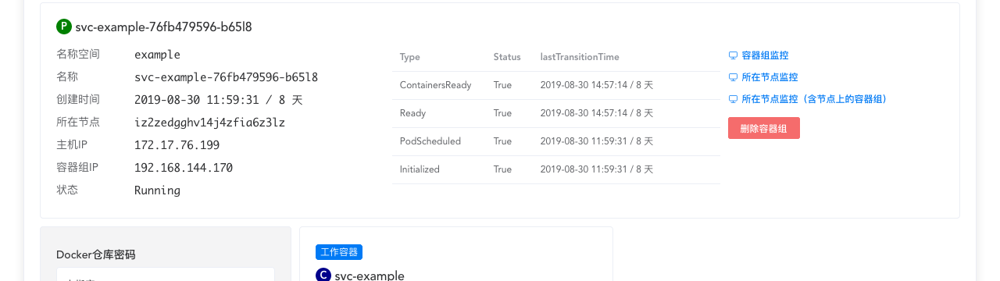

该数组的每一行可能有六个字段：

|字段名|	描述|
|--------|--------|
|type|	type 是最重要的字段，可能的取值有：<br> PodScheduled： Pod 已被调度到一个节点<br>Ready： Pod 已经可以接受服务请求，应该被添加到所匹配 Service 的负载均衡的资源池<br>Initialized：Pod 中所有初始化容器已成功执行<br>Unschedulable：不能调度该 Pod（缺少资源或者其他限制）<br>ContainersReady：Pod 中所有容器都已就绪
|status|	能的取值有：<br>True<br>False<br>Unknown|
|reason|	Condition 发生变化的原因，使用一个符合驼峰规则的英文单词描述|
|message|	Condition 发生变化的原因的详细描述，human-readable|
|lastTransitionTime|	Condition 发生变化的时间戳|
|lastProbeTime|	上一次针对 Pod 做健康检查/就绪检查的时间戳|
### 容器的检查
Probe 是指 kubelet 周期性地检查容器的状况。有三种类型的 Probe：
- ExecAction： 在容器内执行一个指定的命令。如果该命令的退出状态码为 0，则成功
- TCPSocketAction： 探测容器的指定 TCP 端口，如果该端口处于 open 状态，则成功
- HTTPGetAction： 探测容器指定端口/路径上的 HTTP Get 请求，如果 HTTP 响应状态码在 200 到 400（不包含400）之间，则成功

Probe 有三种可能的结果：
- Success： 容器通过检测
- Failure： 容器未通过检测
- Unknown： 检测执行失败，此时 kubelet 不做任何处理

Kubelet 可以在两种情况下对运行中的容器执行 Probe：
- 就绪检查 readinessProbe： 确定容器是否已经就绪并接收服务请求。如果就绪检查失败，kubernetes 将该 Pod 的 IP 地址从所有匹配的 Service 的资源池中移除掉。
- 健康检查 livenessProbe： 确定容器是否正在运行。如果健康检查失败，kubelete 将结束该容器，并根据 restart policy（重启策略）确定是否重启该容器。
### 何时使用 健康检查/就绪检查？
- 如果容器中的进程在碰到问题时可以自己 crash，您并不需要执行健康检查；kubelet 可以自动的根据 Pod 的 restart policy（重启策略）执行对应的动作
- 如果您希望在容器的进程无响应后，将容器 kill 掉并重启，则指定一个健康检查 liveness probe，并同时指定 restart policy（重启策略）为 Always 或者 OnFailure
- 如果您想在探测 Pod 确实就绪之后才向其分发服务请求，请指定一个就绪检查 readiness probe。此时，就绪检查的内容可能和健康检查相同。就绪检查适合如下几类容器：
  - 初始化时需要加载大量的数据、配置文件
  - 启动时需要执行迁移任务
  - 其他


Kuboard 中配置健康检查/就绪检查
Kuboard 可以在工作负载编辑器中配置健康检查/就绪检查，界面如下所示：

Kubernetes教程：在Kuboard中配置容器的健康检查/就绪检查

### 容器的状态
一旦 Pod 被调度到节点上，kubelet 便开始使用容器引擎（通常是 docker）创建容器。容器有三种可能的状态：Waiting / Running / Terminated：
- Waiting： 容器的初始状态。处于 Waiting 状态的容器，仍然有对应的操作在执行，例如：拉取镜像、应用 Secrets等。
- Running： 容器处于正常运行的状态。容器进入 Running 状态之后，如果指定了 postStart hook，该钩子将被执行。
- Terminated： 容器处于结束运行的状态。容器进入 Terminated 状态之前，如果指定了 preStop hook，该钩子将被执行。


### 重启策略
定义 Pod 或工作负载时，可以指定 restartPolicy，可选的值有：
- Always （默认值）
- OnFailure
- Never
restartPolicy 将作用于 Pod 中的所有容器。kubelete 将在五分钟内，按照递延的时间间隔（10s, 20s, 40s ......）尝试重启已退出的容器，并在十分钟后再次启动这个循环，直到容器成功启动，或者 Pod 被删除。

### 容器组的存活期
通常，如果没有人或者控制器删除 Pod，Pod 不会自己消失。只有一种例外，那就是 Pod 处于 Scucceeded 或 Failed 的 phase，并超过了垃圾回收的时长（在 kubernetes master 中通过 terminated-pod-gc-threshold 参数指定），kubelet 自动将其删除。

## 容器组_初始化容器
### 初始化容器介绍
Pod 可以包含多个工作容器，也可以包含一个或多个初始化容器，初始化容器在工作容器启动之前执行。

初始化容器与工作容器完全相同，除了如下几点：
- 初始化容器总是运行并自动结束
- kubelet 按顺序执行 Pod 中的初始化容器，前一个初始化容器成功结束后，下一个初始化容器才开始运行。所有的初始化容器成功执行后，才开始启动工作容器
- 如果 Pod 的任意一个初始化容器执行失败，kubernetes 将反复重启该 Pod，直到初始化容器全部成功（除非 Pod 的 restartPolicy 被设定为 Never）
- 初始化容器的 Resource request / limits 处理不同，
- 初始化容器不支持 就绪检查 readiness probe，因为初始化容器必须在 Pod ready 之前运行并结束
### 使用初始化容器
初始化容器可以指定不同于工作容器的镜像，这使得初始化容器相较于直接在工作容器中编写启动相关的代码更有优势：
- 初始化容器可以包含工作容器中没有的工具代码或者自定义代码。例如：您无需仅仅为了少量的 setup 工作（使用 sed, awk, python 或 dig 进行环境设定）而重新从一个基础镜像制作另外一个镜像
- 初始化容器可以更安全地执行某些使工作容器变得不安全的代码
- 应用程序的镜像构建者和部署者可以各自独立地工作，而无需一起构建一个镜像
- 初始化容器相较于工作容器，可以以另外一个视角处理文件系统。例如，他们可以拥有访问 Secrets 的权限，而工作容器却不一定被授予该权限
- 初始化容器在任何工作容器启动之前结束运行，这个特性使得我们可以阻止或者延迟工作容器的启动，直到某些前提条件得到满足。一旦前提条件满足，所有的工作容器将同时并行启动

### Examples
下面是一些使用初始化容器的例子：
- 使用一行 shell 命令，等待某一个 Service 启动后再启动工作容器
>for i in {1..100}; do sleep 1; if dig myservice; then exit 0; fi; done; exit 1
 
- 使用 Pod 的信息将其注册到某一个远程服务：
>curl -X POST http://$MANAGEMENT_SERVICE_HOST:$MANAGEMENT_SERVICE_PORT/register -d 'instance=$(<POD_NAME>)&ip=$(<POD_IP>)'
   
- 等候一定时间再启动工作容器
>sleep 60
   
- 将 Git repository 克隆到一个数据卷
- 根据某些参数，运行一个模板工具动态生成工作容器所需要的配置文件

### 初始化容器的行为
- Pod 的启动时，首先初始化网络和数据卷，然后按顺序执行每一个初始化容器。任何一个初始化容器都必须成功退出，才能开始下一个初始化容器。如果某一个容器启动失败或者执行失败，kubelet 将根据 Pod 的 restartPolicy 决定是否重新启动 Pod。
- 只有所有的初始化容器全都执行成功，Pod 才能进入 ready 状态。初始化容器的端口是不能够通过 kubernetes Service 访问的。Pod 在初始化过程中处于 Pending 状态，并且同时有一个 type 为 initializing status 为 True 的 Condition
- 如果 Pod 重启，所有的初始化容器也将被重新执行。
- 您可以重启、重试、重新执行初始化容器，因此初始化容器中的代码必须是 幂等 的。具体来说，向 emptyDir 写入文件内容的代码应该考虑到该文件已经存在的情况。请参考 幂等 获得更多信息
- 您可以组合使用就绪检查和 activeDeadlineSeconds Kuboard 暂不支持，以防止初始化容器始终失败。
- Pod 中不能包含两个同名的容器（初始化容器和工作容器也不能同名）。

#### Resources
在确定初始化容器的执行顺序以后，以下 resource 使用规则将适用：
- 所有初始化容器中最高的 resource request/limit 是最终生效的 request/limit
- 对于 Pod 来说，最终生效的 resource request/limit 是如下几个当中较高的一个：
  - 所有工作容器某一个 resource request/limit 的和
  - 最终生效的初始化容器的 request/limit 的和
- Kubelet 依据最终生效的 request/limit 执行调度，这意味着，在执行初始化容器时，就已经为 Pod 申请了其资源需求
### Pod 重启的原因
Pod 重启时，所有的初始化容器都会重新执行，Pod 重启的原因可能有：
- 用户更新了 Pod 的定义，并改变了初始化容器的镜像
  - 改变任何一个初始化容器的镜像，将导致整个 Pod 重启
  - 改变工作容器的镜像，将只重启该工作容器，而不重启 Pod
- Pod 容器基础设施被重启（例如 docker engine），这种情况不常见，通常只有 node 节点的 root 用户才可以执行此操作
- Pod 中所有容器都已经结束，restartPolicy 是 Always，且初始化容器执行的记录已经被垃圾回收，此时将重启整个 Pod
## 容器组_配置初始化容器

本例中，您将创建一个Pod，该Pod包含一个应用程序容器（工作容器）和一个初始化容器（Init Container）。初始化容器执行结束之后，应用程序容器（工作容器）才开始启动。

Pod 的配置文件如下：
```yaml
apiVersion: v1
kind: Pod
metadata:
  name: init-demo
spec:
  containers:
  - name: nginx
    image: nginx
    ports:
    - containerPort: 80
    volumeMounts:
    - name: workdir
      mountPath: /usr/share/nginx/html
  # These containers are run during pod initialization
  initContainers:
  - name: install
    image: busybox
    command:
    - wget
    - "-O"
    - "/work-dir/index.html"
    - https://kuboard.cn
    volumeMounts:
    - name: workdir
      mountPath: "/work-dir"
  dnsPolicy: Default
  volumes:
  - name: workdir
    emptyDir: {}
```
    
从配置文件可以看出，Pod 中初始化容器和应用程序共享了同一个数据卷。初始化容器将该共享数据卷挂载到 /work-dir 路径，应用程序容器将共享数据卷挂载到 /usr/share/nginx/html 路径。初始化容器执行如下命令后，就退出执行：
>wget -O /work-dir/index.html https://kuboard.cn
 
   
执行该命令时，初始化容器将结果写入了应用程序容器 nginx 服务器对应的 html 根路径下的 index.html。
- 执行命令以创建 Pod
>kubectl apply -f https://kuboard.cn/statics/learning/initcontainer/config.yaml
 
   
- 验证nginx容器已经运行
>kubectl get pod init-demo
 
    
- 获得 nginx 容器的命令行终端：
>kubectl exec -it init-demo -- /bin/bash

## 容器组_Debug初始化容器


本文描述了如何诊断初始化容器InitContainer在执行过程中的问题_本文中的命令行使用 <pod-name> 来指代Pod的名称_使用 <init-container-1> 和 <init-container-2> 来指代初始化容器的名称。

### 检查初始化容器的状态
执行命令，查看 Pod 的状态：
>kubectl get pod <pod-name>
    
   
### 查看初始化容器的详情
查看初始化容器的更多信息：
>kubectl describe pod <pod-name>
     
假设 Pod 包含两个初始化容器，显示结果可能如下所示：
```yaml
Init Containers:
  <init-container-1>:
    Container ID:    ...
    ...
    State:           Terminated
      Reason:        Completed
      Exit Code:     0
      Started:       ...
      Finished:      ...
    Ready:           True
    Restart Count:   0
    ...
  <init-container-2>:
    Container ID:    ...
    ...
    State:           Waiting
      Reason:        CrashLoopBackOff
    Last State:      Terminated
      Reason:        Error
      Exit Code:     1
      Started:       ...
      Finished:      ...
    Ready:           False
    Restart Count:   3
    ...
```

    
也可以直接读取 Pod 的 status.initContainerStatuses 字段，命令行如下所示：

kubectl get pod <pod-name> --template '{{.status.initContainerStatuses}}'
 
    
该命令将以 JSON 格式返回信息

### 查看初始化容器的日志
执行命令查看初始化容器的日志：
>kubectl logs <pod-name> -c <init-container-1>
 

    
### 理解 Pod 状态
如果 Pod 的状态以 Init: 开头，表示该 Pod 正在执行初始化容器。下表描述了 Debug 初始化容器的过程中，一些可能出现的 Pod 状态：

|状态|	描述|
|-------|--------|
|Init:N/M|	Pod 中包含 M 个初始化容器，其中 N 个初始化容器已经成功执行|
|Init:Error|	Pod 中有一个初始化容器执行失败|
|Init:CrashLoopBackOff	|Pod 中有一个初始化容器反复执行失败|
|Pending|	Pod 还未开始执行初始化容器|
|PodInitializing or Running|	Pod 已经完成初始化容器的执行|

## 容器组_毁坏Disruptions
参考文档： Disruptions(opens new window)

本文面向想要构建高可用的应用程序的应用程序管理员，为此，您需要理解有哪些毁坏（disruption）可能发生在Pod上。

本文也是为集群管理员准备的，如果集群管理员想要将集群的部分管理任务自动化的话，例如，升级、自动伸缩等。

TIP

Disruption ---> 毁坏。 暂时没想到合适的词，如果您有想法，请联系我。

自愿的和非自愿的毁坏
处理毁坏（Disruptions）
Disruption Budget如何工作
PDB Example
区分集群管理员和应用管理员的角色
如何执行毁坏性的操作（Disruptive Action）
自愿的和非自愿的毁坏
除非有人（人或者控制器）销毁Pod，或者出现不可避免的硬件/软件故障，Pod不会凭空消失。此类不可避免的情况，我们称之为非自愿的毁坏（involuntary disruption）。例如：

节点所在物理机的硬件故障
集群管理员误删了虚拟机
云供应商或管理程序故障导致虚拟机被删
Linux 内核故障
集群所在的网络发生分片，导致节点不可用
节点资源耗尽，导致 Pod 被驱逐
除了节点资源耗尽这种情况以外，大部分人对其他情况都十分熟悉，因为这并不是 Kubernetes 所特有的情况。

还有一类毁坏，我们称之为自愿的毁坏（voluntary disruptions）。主要包括由应用管理员或集群管理员主动执行的操作。应用管理员可能执行的操作有：

删除 Deployment 或其他用于管理 Pod 的控制器
修改 Deployment 中 Pod 模板的定义，导致 Pod 重启
直接删除一个 Pod
集群管理员可能执行的操作有：

排空节点 (opens new window)以便维修或升级
排空节点，以将集群缩容
从节点上删除某个 Pod，以使得其他的 Pod 能够调度到该节点上
这些操作可能直接由集群管理员执行，或者由执行管理员运行的自动化脚本执行，也可能由您的集群托管商执行。

向您的集群管理员、云供应商询问，您的集群是否激活了任何形式的自愿的毁坏。如果没有激活，您无需创建 Pod Disruption Budgets。

警告

并非所有自愿的毁坏都受 Pod Disruption Budgets 限制，例如，删除 Deployment 或 Pod。

处理毁坏（Disruptions）
弥补非自愿的毁坏可以采取的方法有：

确保您的 Pod 申请合适的计算资源
如果需要高可用，为您的程序运行多个副本，参考 Deployment、StatefulSet
如果需要更高的高可用性，将应用程序副本分布到多个机架上（参考 anti-affinity）或分不到多个地区（使用 multi-zone cluster (opens new window)）
自愿的毁坏，发生频率不定。在一个基础的 Kubernetes 集群中，可能不会发生自愿的毁坏。当你的集群管理员或者托管供应商运行某些额外的服务是可能导致自愿的毁坏发生。例如：

更新节点上的软件
自定义实现的自动伸缩程序
集群管理员或托管供应商应该为您提供这方面的文档。

Kubernetes 提供了 Disruption Budget 这一特性，以帮助我们在高频次自愿的毁坏会发生的情况下，仍然运行高可用的应用程序。

Disruption Budget如何工作
应用程序管理员可以为每一个应用程序创建 PodDisruptionBudget 对象（PDB）。PDB限制了多副本应用程序在自愿的毁坏情况发生时，最多有多少个副本可以同时停止。例如，一个 web 前端的程序需要确保可用的副本数不低于总副本数的一定比例。

集群管理员以及托管供应商在进行系统维护时，应该使用兼容 PodDisruptionBudget 的工具（例如 kubectl drain，此类工具调用 Eviction API (opens new window)）而不是直接删除 Pod 或者 Deployment。

kubectl drain 命令会尝试将节点上所有的 Pod 驱逐掉。驱逐请求可能会临时被拒绝，kubectl drain 将周期性地重试失败的请求，直到节点上所有的 Pod 都以终止，或者直到超过了预先配置的超时时间。

PDB 指定了应用程序最少期望的副本数（相对于总副本数）。例如，某个 Deployment 的 .spec.replicas 为 5，期望的副本数是 5个。如果他对应的 PDB 允许最低 4个副本数，则 Eviction API（kubectl drain）在同一时刻最多会允许1个自愿的毁坏，而不是2个或更多：

PDB 通过 Pod 的 .metadata.ownerReferences 查找到其对应的控制器（Deployment、StatefulSet）
PDB 通过 控制器（Deployment、StatefulSet）的 .spec.replicas 字段来确定期望的副本数
PDB 通过控制器（Deployment、StatefulSet）的 label selector 来确定哪些 Pod 属于同一个应用程序
PDB 不能阻止 非自愿的毁坏 发生，但是当这类毁坏发生时，将被计入到当前毁坏数里
通过 kubectl drain 驱逐 Pod 时，Pod 将被优雅地终止（gracefully terminated，参考 terminationGracePeriodSeconds）
在滚动更新过程中被删除的 Pod 也将计入到 PDB 的当前毁坏数，但是控制器（例如 Deployment、StatefulSet）在执行滚动更新时，并不受 PDB 的约束。滚动更新过程中，同时可以删除的 Pod 数量在控制器对象（Deployment、StatefulSet等）的定义中规定，参考滚动更新。

PDB Example
假设有一个集群共有三个工作节点，node-1、node-2、node-3，集群上运行了多个应用程序，其中一个 Deployment 有 3个 Pod 副本 pod-a、pod-b、pod-c，并且对应了 PDB 限定 3 个 Pod 中至少要有 2 个可用。另外有一个无关的 pod-x 没有对应的PDB。最开始时，Pod 在节点上的分布如下表所示：

node-1	node-2	node-3
pod-a available	pod-b available	pod-c available
pod-x available		
此时，假设集群管理员想要重启机器，以便更新 Linux 内核版本修复其中的一个漏洞。集群管理员首先尝试使用 kubectl drain 命令排空 node-1，此时 kubectl drain 将尝试驱逐 pod-a 和 pod-x。这个操作将立刻能够执行成功，两个 Pod 都将同时进入 terminating 状态，集群的状态将如下所示：

node-1 draining	node-2	node-3
pod-a terminating	pod-b available	pod-c available
pod-x terminating		
Deployment控制器发现其中的一个 Pod 正在终止，因此，将立刻创建一个新的 Pod 以替代该 Pod，假设其为 pod-d。由于 node-1 已经被标记不可用（cordoned 警戒线），pod-d 将调度到另外一个节点上。另外一个控制器同样也为 pod-x 创建了一个替代 Pod pod-y。

此时，集群状态如下所示：

node-1 draining	node-2	node-3
pod-a terminating	pod-b available	pod-c available
pod-x terminating	pod-d starting	pod-y
当 pod-a 和 pod-x 终止以后，集群状态如下所示：

node-1 drained	node-2	node-3
pod-b available	pod-c available
pod-d starting	pod-y
此时，如果集群管理员不够耐心，立刻尝试排空 node-2 或 node-3，则 kubectl drain 命令将被组织阻止，因为当前该 Deployment 只有 2个可用的 Pod，而其 PDB 要求至少有 2个可用的 Pod。

当 pod-d 完成启动后，集群的状态将如下所示：

node-1 drained	node-2	node-3
pod-b available	pod-c available
pod-d available	pod-y
此时，集群管理员尝试排空 node-2。kubectl drain 将按照某种顺序尝试驱逐 node-2 上的两个 Pod，假设先是 pod-b 然后是 pod-d。驱逐 pod-b 的操作将执行成功，但是，当 kubectl drain 尝试驱逐 pod-d 时，该请求将被拒绝，否则该 Deployment 将只剩下一个可用的 Pod。

Deployment 此时将创建一个 Pod pod-e 用于替换 Pod pod-b。由于集群中没有足够的资源来调度 pod-e，kubectl drain 将再次被阻止。集群状态如下所示：

node-1 drained	node-2	node-3	no node
pod-b available	pod-c available	pod-e pending
pod-d available	pod-y	
此时，集群管理员需要向集群中添加节点，才能继续集群的升级操作。

Kubernetes中，如下因素决定了毁坏发生的频率：

应用程序所需要的副本数
对一个 Pod 执行优雅终止（gracefully shutdown）所需要的时间
新的 Pod 实例启动所需要的时间
控制器的类型
集群资源的容量
区分集群管理员和应用管理员的角色
通常，我们认为集群管理员和应用管理员是不同的角色，且相互之间所共有的知识并不多。对这两个角色的职责进行区分，在如下场景中是非常有用的：

多个应用程序团队共享一个 Kubernetes 集群
第三方工具或服务将集群的管理自动化
Pod Disruption Budget 是区分两种角色时的必要的界面，双方要就此概念达成共识。如果你所在的组织中，并不严格区分集群管理员和应用程序管理员，则，您并不需要使用 Pod Disruption Budget。

如何执行毁坏性的操作（Disruptive Action）
如果您是集群管理员，且需要在所有节点上执行毁坏性的操作（disruptive action），例如节点或系统软件的升级，此时，可能的选择有：

接受升级过程中的停机时间
故障转移（Failover）到另外一个集群副本
无停机时间，但是将有额外的代价，因为需要由双份的节点以及更多的人力成本来管理集群之间的切换
编写容错的应用程序（disruption tolerant application）并使用 PDB
无停机时间
最少的资源冗余
支持更多的集群管理自动化
编写容错的应用程序（disruption-tolerant application）非常需要技巧，但是要容忍自愿的毁坏所做的工作与支持自动伸缩（autoscaling）与容忍非自愿的毁坏（tolerating involuntary disruption）所做的工作是大量重叠的

## 容器组_配置PodDisruptionBudget
参考文档： Specifying a Disruption Budget for your Application(opens new window)

本文讲述了如何限制应用程序同时受到的毁坏数量，以便在集群管理员维护集群节点的同时，仍然可以保证应用的高可用性

前提
使用PodDisruptionBudget保护应用程序
确定需要PDB保护的应用
思考应用程序如何应对毁坏
指定百分比时的舍入逻辑
定义PodDisruptionBudget
创建PDB对象
检查PDB的状态
任意控制器和选择器
前提
熟悉如何部署多副本的应用程序 伸缩应用程序
熟悉 Pod Disruption 的概念
确认与集群管理员或者供应商确定，您所使用的 Kubernetes 集群支持 PodDisruptionBudget
使用PodDisruptionBudget保护应用程序
确定哪个应用程序需要使用 PodDisruptionBudget（PDB）保护
思考应用程序如何处理毁坏（disruption）
创建 PDB yaml 文件
从 yaml 文件创建 PDB 对象
确定需要PDB保护的应用
通常如下几种 Kubernetes 控制器创建的应用程序可以使用 PDB：

Deployment
ReplicationController
ReplicaSet
StatefulSet
PDB 中 .spec.selector 字段的内容必须与控制器中 .spec.selector 字段的内容相同。

自 Kubernetes v 1.15 开始，PDB支持激活了 scale subresource (opens new window)的 custom controller.

也可以为那些不是通过上述控制器创建的 Pod（或者任意一组 Pod）设置 PDB，但是，这个时候存在一些限制条件，请参考 任意控制器和选择器

思考应用程序如何应对毁坏
当自愿毁坏发生时，在短时间内，您的应用程序最多可以容许多少个实例被终止。

无状态的前端：
关注点：不能让服务能力（serving capacity）降低超过 10%
解决方案：在 PDB 中配置 minAvailable 90%
单实例有状态应用：
关注点：未经同意不能关闭此应用程序
解决方案1： 不使用 PDB，并且容忍偶尔的停机
解决方案2： 在 PDB 中设置 maxUnavailable=0。与集群管理员达成一致（不是通过Kubernetes，而是邮件、电话或面对面），请集群管理员在终止应用之前与你沟通。当集群管理员联系你时，准备好停机时间，删除 PDB 以表示已准备好应对毁坏。并做后续处理
多实例有状态应用，例如 consul、zookeeper、etcd：
关注点：不能将实例数降低到某个数值，否则写入会失败
解决方案1： 在 PDB 中设置 maxUnavailable 为 1 （如果副本数会发生变化，可以使用此设置）
解决方案2： 在 PDB 中设置 minAvailable 为最低数量（例如，当总副本数为 5 时，设置为3）（可以同时容忍更多的毁坏数）
可以重新开始的批处理任务：
关注点：当发生自愿毁坏时，Job仍然需要完成其执行任务
解决方案： 不创建 PDB。Job 控制器将会创建一个 Pod 用于替换被毁坏的 Pod
指定百分比时的舍入逻辑
minAvailable 或 maxUnavailable 可以指定为整数或者百分比。

当指定一个整数时，代表 Pod 的数量。例如，设置 minAvailable 为 10，则至少 10 个 Pod 必须始终可用，即便是在毁坏发生时
当指定一个百分比时（例如，50%），代表总 Pod 数量的一个百分比。例如，设置 maxUnavailable 为 50%，则最多可以有 50% 的 Pod 可以被毁坏
如果指定这些值为一个百分数，其计算结果可能不会正好是一个整数。例如，假设有 7 个 Pod，minAvailable 设置为 50%，你将很难判断，到底是 3 个还是 4 个 Pod 必须始终保持可用。Kubernetes 将向上舍入（round up to the nearest integer），因此，此处必须有 4 个 Pod 始终可用。可参考具体的 Kubernetes 代码(opens new window)

定义PodDisruptionBudget
PodDisruptionBudget 包含三个字段：

标签选择器 .spec.selector 用于指定 PDB 适用的 Pod。此字段为必填
.spec.minAvailable：当完成驱逐时，最少仍然要保留多少个 Pod 可用。该字段可以是一个整数，也可以是一个百分比
.spec.maxUnavailable： 当完成驱逐时，最多可以有多少个 Pod 被终止。该字段可以是一个整数，也可以是一个百分比
在一个 PodDisruptionBudget 中，只能指定 maxUnavailable 和 minAvailable 中的一个。 maxUnavailable 只能应用到那些有控制器的 Pod 上。下面的例子中，“期望的副本数” 是 PodDisruptionBudget 对应 Pod 的控制器的 .spec.replicas 字段：

例子1： minAvailable 为 5 时，只要 PodDisruptionBudget 的 selector 匹配的 Pod 中有超过 5 个仍然可用，就可以继续驱逐 Pod 例子2： minAvailable 为 30% 时，至少保证期望副本数的 30% 可用 例子3： maxUnavailable 为 5 时，最多可以有 5 个副本不可用（unthealthy） 例子4： maxUnavailable 为 30% 时，最多可以有期望副本数的 30% 不可用

通常，一个 PDB 对应一个控制器创建的 Pod，例如，Deployment、ReplicaSet或StatefulSet。

注意

PodDisruptionBudget 并不能真正确保指定数量（或百分比）的Pod始终保持可用。例如，当 Pod 数量已经为 PDB 中指定的最小数时，某一个节点可能意外宕机，导致 Pod 数量低于 PDB 中指定的数量。 PodDisruptionBudget 只能保护应用避免受到 自愿毁坏 的影响，而不是所有原因的毁坏。

maxUnavailable 为 0%（或0）或者 minAvailable 为 100%（或与控制器的 .spec.replicas 相等）将阻止节点排空任务。按照 PodDisruptionBudget 的语义，这种做法是允许的。

下面是两个 PDB 的例子：

使用 minAvailable

apiVersion: policy/v1beta1
kind: PodDisruptionBudget
metadata:
  name: zk-pdb
spec:
  minAvailable: 2
  selector:
    matchLabels:
      app: zookeeper
 
        已复制到剪贴板！
    
使用 maxUnavailable

apiVersion: policy/v1beta1
kind: PodDisruptionBudget
metadata:
  name: zk-pdb
spec:
  maxUnavailable: 1
  selector:
    matchLabels:
      app: zookeeper
 
        已复制到剪贴板！
    
例如，如果 zk-pdb 对象选择的 Pod 对应的 StatefulSet 的 spec.replicas 为 3，则两个 PDB 含义相同。推荐使用 maxUnavailable 这种形式的定义，因为当控制器的 spec.replicas 发生变化时，应用受到的影响更小一些。例如，将其副本数伸缩到 10，如果使用 minAvailable=2 这种形式，则可能会有 8 个 Pod 被毁坏。而如果使用 maxUnavailable=1 这种形式，应用程序将可以保存 9 个可用实例。

创建PDB对象
使用 kubectl apply -f mypdb.yaml 命令可以创建或更新 PDB 对象

检查PDB的状态
假设名称空间中实际没有与 app: zookeeper 匹配的 Pod，执行命令

kubectl get poddisruptionbudgets
 
        已复制到剪贴板！
    
输出结果为：

NAME      MIN-AVAILABLE   ALLOWED-DISRUPTIONS   AGE
zk-pdb    2               0                     7s
 
        已复制到剪贴板！
    
如果存在 3 个匹配的 Pod，执行命令

kubectl get poddisruptionbudgets
 
        已复制到剪贴板！
    
输出结果为：

NAME      MIN-AVAILABLE   ALLOWED-DISRUPTIONS   AGE
zk-pdb    2               1                     7s
 
        已复制到剪贴板！
    
ALLOWED-DISRUPTIONS 为非零证书，意味着 disruption 控制器已经匹配到了 Pod，计算了匹配的 Pod 数，并更新了 PDB 的状态。

执行命令，可以获得 PDB 的更多信息：

kubectl get poddisruptionbudgets zk-pdb -o yaml
 
        已复制到剪贴板！
    
输出结果如下所示：

apiVersion: policy/v1beta1
kind: PodDisruptionBudget
metadata:
  creationTimestamp: 2019-11-19T021:38:26Z
  generation: 1
  name: zk-pdb
…
status:
  currentHealthy: 3
  desiredHealthy: 3
  disruptedPods: null
  disruptionsAllowed: 1
  expectedPods: 3
  observedGeneration: 1
 
        已复制到剪贴板！
    
任意控制器和选择器
如果您只配合 Kubernetes 内建控制器（Deployment、ReplicationController、ReplicaSet、StatefulSet）使用 PDB，您可以跳过此章节。

PDB 可以用于保护其他类型控制器（例如，“operator”）创建的 Pod，或者直接创建的 Pod（bare pod），但是有如下限定：

只能使用 .spec.minAvailable，不能使用 .spec.maxUnavailable
.spec.minAvailable 字段中只能使用整型数字，不能使用百分比
当配合内建控制器（Deployment、ReplicationController、ReplicaSet、StatefulSet）使用时，PDB 的标签选择器可以选择控制器创建 Pod 的一个子集或者超集。然而，当名称空间中有多个 PDB 时，必须十分小心，PDB 的标签选择器之间不能重叠。
# 控制器
## 概述
Pod（容器组）是 Kubernetes 中最小的调度单元，您可以通过 kubectl 直接创建一个 Pod。Pod 本身并不能自愈（self-healing）。如果一个 Pod 所在的 Node （节点）出现故障，或者调度程序自身出现故障，Pod 将被删除；同理，当因为节点资源不够或节点维护而驱逐 Pod 时，Pod 也将被删除。

Kubernetes 通过引入 Controller（控制器）的概念来管理 Pod 实例。在 Kubernetes 中，您应该始终通过创建 Controller 来创建 Pod，而不是直接创建 Pod。控制器可以提供如下特性：
- 水平扩展（运行 Pod 的多个副本）
- rollout（版本更新）
- self-healing（故障恢复） 例如：当一个节点出现故障，控制器可以自动地在另一个节点调度一个配置完全一样的 Pod，以替换故障节点上的 Pod。

在 Kubernetes 支持的控制器有如下几种：
- Deployment Kuboard 已支持
- StatefulSet Kuboard 已支持
- DaemonSet Kuboard 已支持
- CronJob Kuboard 正在计划中
- Jobs - Run to Completion Kuboard 正在计划中
- ReplicaSet (opens new window)使用 Deployment

- ReplicationController (opens new window)使用 Deployment

- Garbage Collection(opens new window)
- TTL Controller for Finished Resources(opens new window)

### 在 Kuboard 中的体现
在 Kuboard 工作负载编辑器中，控制器的概念如下图所示：
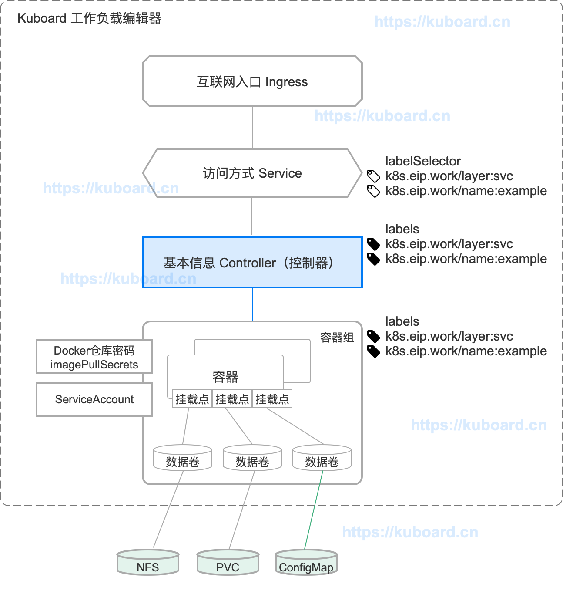

## Deployment
### 介绍 Deployment
#### Pod 容器组
Pod 容器组是 Kubernetes 中最小的调度单元，更多信息请参考 容器组 - 概述
#### ReplicaSet 副本集
ReplicaSet 副本集的用途是为指定的 Pod 维护一个副本（实例）数量稳定的集合。下面是一个定义 ReplicaSet 副本集的 yaml 文件：
```yaml
apiVersion: apps/v1
kind: ReplicaSet
metadata:
  name: frontend
  labels:
    tier: frontend
spec:
  replicas: 3
  selector:
    matchLabels:
      tier: frontend
  template:
    metadata:
      labels:
        tier: frontend
    spec:
      containers:
      - name: php-redis
        image: gcr.io/google_samples/gb-frontend:v3
```
    
ReplicaSet 副本集的主要几个字段有：
- selector 确定哪些 Pod 属于该副本集
- replicas 副本集应该维护几个 Pod 副本（实例）
- template Pod 的定义

副本集将通过创建、删除 Pod 容器组来确保符合 selector 选择器的 Pod 数量等于 replicas 指定的数量。当符合 selector 选择器的 Pod 数量不够时，副本集通过使用 template 中的定义来创建 Pod。

在 Kubernetes 中，并不建议您直接使用 ReplicaSet，推荐使用 Deployment，由 Deployment 创建和管理 ReplicaSet.

#### Deployment 概述
Deployment 是最常用的用于部署无状态服务的方式。Deployment 控制器使得您能够以声明的方式更新 Pod（容器组）和 ReplicaSet（副本集）。

以“声明”的方式管理 Pod 和 ReplicaSet，其本质是将一些特定场景的一系列运维步骤固化下来，以便快速准确无误的执行。Deployment 为我们确定了如下几种运维场景：
- 创建Deployment 创建 Deployment 后，Deployment 控制器将立刻创建一个 ReplicaSet 副本集，并由 ReplicaSet 创建所需要的 Pod。
- 更新Deployment 更新 Deployment 中 Pod 的定义（例如，发布新版本的容器镜像）。此时 Deployment 控制器将为该 Deployment 创建一个新的 ReplicaSet 副本集，并且逐步在新的副本集中创建 Pod，在旧的副本集中删除 Pod，以达到滚动更新的效果。
- 回滚Deployment 回滚到一个早期 Deployment 版本。
- 伸缩Deployment 水平扩展 Deployment，以便支持更大的负载，或者水平- 收缩 Deployment，以便节省服务器资源。
- 暂停和继续Deployment
- 查看Deployment状态
- 清理策略
- 金丝雀发布

### 创建 Deployment

下面的 yaml 文件定义了一个 Deployment，该 Deployment 将创建一个有 3 个 nginx Pod 副本的 ReplicaSet（副本集）：
```yaml
apiVersion: apps/v1
kind: Deployment
metadata:
  name: nginx-deployment
  labels:
    app: nginx
spec:
  replicas: 3
  selector:
    matchLabels:
      app: nginx
  template:
    metadata:
      labels:
        app: nginx
    spec:
      containers:
      - name: nginx
        image: nginx:1.7.9
        ports:
        - containerPort: 80
```
    
在这个例子中：
- 将创建一个名为 nginx-deployment 的 Deployment（部署），名称由 .metadata.name 字段指定
- 该 Deployment 将创建 3 个 Pod 副本，副本数量由 .spec.replicas 字段指定
- .spec.selector 字段指定了 Deployment 如何找到由它管理的 Pod。此案例中，我们使用了 Pod template 中定义的一个标签（app: nginx）。对于极少数的情况，这个字段也可以定义更加复杂的规则
- .template 字段包含了如下字段：
  - .template.metadata.labels 字段，指定了 Pod 的标签（app: nginx）
  - .template.spec.containers[].image 字段，表明该 Pod 运行一个容器 nginx:1.7.9
  - .template.spec.containers[].name 字段，表明该容器的名字是 nginx


执行命令以创建 Deployment
>kubectl apply -f https://k8s.io/examples/controllers/nginx-deployment.yaml
 

    
**字段含义**

|字段名称|	说明|
|-------|--------|
|NAME|	Deployment name|
|DESIRED|	Deployment 期望的 Pod 副本数，即 Deployment 中 .spec.replicas 字段指定的数值。该数值是“期望”值|
|CURRENT|	当前有多少个 Pod 副本数在运行|
|UP-TO-DATE|	Deployment 中，符合当前 Pod Template 定义的 Pod 数量|
|AVAILABLE|	当前对用户可用的 Pod 副本数|
|AGE|	Deployment 部署以来到现在的时长|

- 查看 Deployment 的发布状态（rollout status），执行命令 kubectl rollout status deployment.v1.apps/nginx-deployment。输出结果树下所示：
```shell
Waiting for rollout to finish: 2 out of 3 new replicas have been updated...
deployment.apps/nginx-deployment successfully rolled out
```

- 等待几秒后，再次执行命令 kubectl get deployments，输出结果如下所示：
```shell
NAME               DESIRED   CURRENT   UP-TO-DATE   AVAILABLE   AGE
nginx-deployment   3         3         3            3           18s
```
    
此时该 Deployment 已经完成了 3 个 Pod 副本的创建，并且所有的副本都是 UP-TO-DATE（符合最新的 Pod template 定义） 和 AVAILABEL

- 查看该 Deployment 创建的 ReplicaSet（rs），执行命令 kubectl get rs，输出结果如下所示：
```shell
NAME                          DESIRED   CURRENT   READY   AGE
nginx-deployment-75675f5897   3         3         3       18s
```
    
- 查看 Pod 的标签，执行命令 kubectl get pods --show-labels，输出结果如下所示：
```shell
NAME                                READY     STATUS    RESTARTS   AGE       LABELS
nginx-deployment-75675f5897-7ci7o   1/1       Running   0          18s       app=nginx,pod-template-hash=3123191453
nginx-deployment-75675f5897-kzszj   1/1       Running   0          18s       app=nginx,pod-template-hash=3123191453
nginx-deployment-75675f5897-qqcnn   1/1       Running   0          18s       app=nginx,pod-template-hash=3123191453
```
    
Deployment 创建的 ReplicaSet（副本集）确保集群中有 3 个 nginx Pod。
### 

# 服务发现，负载均衡，网络
## Service
### Service概述
**为何需要 Service**
Kubernetes 中 Pod 是随时可以消亡的。如果使用 Deployment 运行您的应用程序，Deployment 将会在 Pod 消亡后再创建一个新的 Pod 以维持所需要的副本数。每一个 Pod 有自己的 IP 地址，然而，对于 Deployment 而言，对应 Pod 集合是动态变化的。

**Kubernetes Service**
Kubernetes 中 Service 是一个 API 对象，通过 kubectl + YAML 或者 Kuboard，定义一个 Service，可以将符合 Service 指定条件的 Pod 作为可通过网络访问的服务提供给服务调用者。

Service 是 Kubernetes 中的一种服务发现机制：

- Pod 有自己的 IP 地址
- Service 被赋予一个唯一的 dns name
- Service 通过 label selector 选定一组 Pod
- Service 实现负载均衡，可将请求均衡分发到选定这一组 Pod 中


**在 Kuboard 中使用 Service**
从 Kuboard 工作负载编辑器的视角来看，Service 与其他重要的 Kubernetes 对象之间的关系如下图所示：
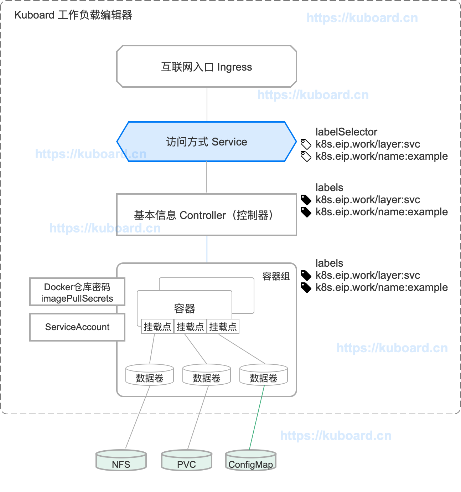

图中，Service 先连线到 Controller，Controller 在连线到容器组，这种表示方式只是概念上的，期望用户在使用 Kubernetes 的时候总是通过 Controller 创建 Pod，然后再通过 Service 暴露为网络服务，通过 Ingress 对集群外提供互联网访问。

事实上，Service 与 Controller 并没有直接联系，Service 通过 label selector 选择符合条件的 Pod，并将选中的 Pod 作为网络服务的提供者。从这个意义上来讲，您可以有很多种方式去定义 Service 的 label selector，然而，最佳的实践是，在 Service 中使用与 Controller 中相同的 label selector。

### Service详细描述
#### 创建 Service
Kubernetes Servies 是一个 RESTFul 接口对象，可通过 yaml 文件创建。

例如，假设您有一组 Pod：
- 每个 Pod 都监听 9376 TCP 端口
- 每个 Pod 都有标签 app=MyApp
```yaml
apiVersion: v1
kind: Service
metadata:
  name: my-service
spec:
  selector:
    app: MyApp
  ports:
    - protocol: TCP
      port: 80
      targetPort: 9376
```
上述 YAML 文件可用来创建一个 Service：
- 名字为 my-service
- 目标端口为 TCP 9376
- 选取所有包含标签 app=MyApp 的 Pod

关于 Service，您还需要了解：
- Kubernetes 将为该 Service 分配一个 IP 地址（ClusterIP 或 集群内 IP），供 Service Proxy 使用（参考虚拟 IP 和 Service proxy）
- Kubernetes 将不断扫描符合该 selector 的 Pod，并将最新的结果更新到与 Service 同名 my-service 的 Endpoint 对象中。
- Pod 的定义中，Port 可能被赋予了一个名字，您可以在 Service 的 targetPort 字段引用这些名字，而不是直接写端口号。这种做法可以使得您在将来修改后端程序监听的端口号，而无需影响到前端程序。
- Service 的默认传输协议是 TCP，您也可以使用其他 支持的传输协议。
- Kubernetes Service 中，可以定义多个端口，不同的端口可以使用相同或不同的传输协议。
#### 创建 Service（无 label selector） Kuboard 暂不支持
Service 通常用于提供对 Kubernetes Pod 的访问，但是您也可以将其用于任何其他形式的后端。例如：

- 您想要在生产环境中使用一个 Kubernetes 外部的数据库集群，在测试环境中使用 Kubernetes 内部的 数据库
- 您想要将 Service 指向另一个名称空间中的 Service，或者另一个 Kubernetes 集群中的 Service
- 您正在将您的程序迁移到 Kubernetes，但是根据您的迁移路径，您只将一部分后端程序运行在 Kubernetes 中

在上述这些情况下，您可以定义一个没有 Pod Selector 的 Service。例如：
```yaml
apiVersion: v1
kind: Service
metadata:
  name: my-service
spec:
  ports:
    - protocol: TCP
      port: 80
      targetPort: 9376
```
因为该 Service 没有 selector，相应的 Endpoint 对象就无法自动创建。您可以手动创建一个 Endpoint 对象，以便将该 Service 映射到后端服务真实的 IP 地址和端口：
```yaml
apiVersion: v1
kind: Endpoints
metadata:
  name: my-service
subsets:
  - addresses:
      - ip: 192.0.2.42
    ports:
      - port: 9376
```

#### 虚拟 IP 和服务代理
Kubernetes 集群中的每个节点都运行了一个 kube-proxy，负责为 Service（ExternalName 类型的除外）提供虚拟 IP 访问。

##### 为何不使用 round-robin DNS
许多用户都对 Kubernetes 为何使用服务代理将接收到的请求转发给后端服务，而不是使用其他途径，例如：是否可以为 Service 配置一个 DNS 记录，将其解析到多个 A value（如果是 IPv6 则是 AAAA value），并依赖 round-robin（循环）解析？

Kubernetes 使用在 Service 中使用 proxy 的原因大致有如下几个：

- 一直以来，DNS 软件都不确保严格检查 TTL（Time to live），并且在缓存的 dns 解析结果应该过期以后，仍然继续使用缓存中的记录
- 某些应用程序只做一次 DNS 解析，并一直使用缓存下来的解析结果
- 即使应用程序对 DNS 解析做了合适的处理，为 DNS 记录设置过短（或者 0）的 TTL 值，将给 DNS 服务器带来过大的负载
##### 版本兼容性
Kubernetes 支持三种 proxy mode（代理模式），他们的版本兼容性如下：

|代理模式|	Kubernetes 版本|	是否默认|
|User space proxy mode|	v1.0 +||	
|Iptables proxy mode|	v1.1 +|	默认|
|Ipvs proxy mode|	v1.8 +||	

##### User space 代理模式
在 user space proxy mode 下：
- kube-proxy 监听 kubernetes master 以获得添加和移除 Service / Endpoint 的事件
- kube-proxy 在其所在的节点（每个节点都有 kube-proxy）上为每一个 Service 打开一个随机端口
- kube-proxy 安装 iptables 规则，将发送到该 Service 的 ClusterIP（虚拟 IP）/ Port 的请求重定向到该随机端口
- 任何发送到该随机端口的请求将被代理转发到该 Service 的后端 Pod 上（kube-proxy 从 Endpoint 信息中获得可用 Pod）
- kube-proxy 在决定将请求转发到后端哪一个 Pod 时，默认使用 round-robin（轮询）算法，并会考虑到 Service 中的 SessionAffinity 的设定
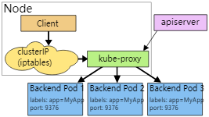

##### Iptables 代理模式 默认模式
在 iptables proxy mode 下：
- kube-proxy 监听 kubernetes master 以获得添加和移除 Service / Endpoint 的事件
- kube-proxy 在其所在的节点（每个节点都有 kube-proxy）上为每一个 Service 安装 iptable 规则
- tables 将发送到 Service 的 ClusterIP / Port 的请求重定向到 Service 的后端 Pod 上
  - 对于 Service 中的每一个 Endpoint，kube-proxy 安装一个 iptable 规则
  - 默认情况下，kube-proxy 随机选择一个 Service 的后端 Pod

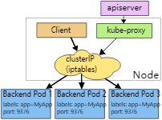


iptables proxy mode 的优点：
- 更低的系统开销：在 linux netfilter 处理请求，无需在 userspace 和 kernel space 之间切换
- 更稳定

与 user space mode 的差异：
- 使用 iptables mode 时，如果第一个 Pod 没有响应，则创建连接失败
- 使用 user space mode 时，如果第一个 Pod 没有响应，kube-proxy 会自动尝试连接另外一个后端 Pod

##### IPVS 代理模式
在 IPVS proxy mode 下：
- kube-proxy 监听 kubernetes master 以获得添加和移除 Service / Endpoint 的事件
- kube-proxy 根据监听到的事件，调用 netlink 接口，创建 IPVS 规则；并且将 Service/Endpoint 的变化同步到 IPVS 规则中
- 当访问一个 Service 时，IPVS 将请求重定向到后端 Pod
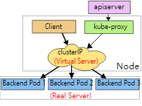

##### 代理模式总结
在所有的代理模式中，发送到 Service 的 IP:Port 的请求将被转发到一个合适的后端 Pod，而无需调用者知道任何关于 Kubernetes/Service/Pods 的细节。

Service 中额外字段的作用：
- service.spec.sessionAffinity
  - 默认值为 "None"
  - 如果设定为 "ClientIP"，则同一个客户端的连接将始终被转发到同一个 Pod
- service.spec.sessionAffinityConfig.clientIP.timeoutSeconds
  - 默认值为 10800 （3 小时）
  - 设定会话保持的持续时间

#### 多端口的Service
Kubernetes 中，您可以在一个 Service 对象中定义多个端口，此时，您必须为每个端口定义一个名字。如下所示：
```yaml
apiVersion: v1
kind: Service
metadata:
  name: my-service
spec:
  selector:
    app: MyApp
  ports:
    - name: http
      protocol: TCP
      port: 80
      targetPort: 9376
    - name: https
      protocol: TCP
      port: 443
      targetPort: 9377
```
#### 使用自定义的 IP 地址
创建 Service 时，如果指定 .spec.clusterIP 字段，可以使用自定义的 Cluster IP 地址。该 IP 地址必须是 APIServer 中配置字段 service-cluster-ip-range CIDR 范围内的合法 IPv4 或 IPv6 地址，否则不能创建成功。

可能用到自定义 IP 地址的场景：
- 想要重用某个已经存在的 DNS 条目
- 遗留系统是通过 IP 地址寻址，且很难改造


#### 服务发现
Kubernetes 支持两种主要的服务发现模式：
- 环境变量
- DNS
**环境变量**
kubelet 查找有效的 Service，并针对每一个 Service，向其所在节点上的 Pod 注入一组环境变量。支持的环境变量有：
- Docker links 兼容 (opens new window)的环境变量
- {SVCNAME}_SERVICE_HOST 和 {SVCNAME}_SERVICE_PORT
  - Service name 被转换为大写
  - 小数点 . 被转换为下划线 _

**DNS**
如果按照 www.kuboard.cn 上的文档安装 Kubernetes，默认已经安装了 DNS 服务，Core DNS (opens new window)。

CoreDNS 监听 Kubernetes API 上创建和删除 Service 的事件，并为每一个 Service 创建一条 DNS 记录。集群中所有的 Pod 都可以使用 DNS Name 解析到 Service 的 IP 地址。

例如，名称空间 my-ns 中的 Service my-service，将对应一条 DNS 记录 my-service.my-ns。 名称空间 my-ns 中的Pod可以直接 nslookup my-service （my-service.my-ns 也可以）。其他名称空间的 Pod 必须使用 my-service.my-ns。my-service 和 my-service.my-ns 都将被解析到 Service 的 Cluster IP。

Kubernetes 同样支持 DNS SRV（Service）记录，用于查找一个命名的端口。假设 my-service.my-ns Service 有一个 TCP 端口名为 http，则，您可以 nslookup _http._tcp.my-service.my-ns 以发现该Service 的 IP 地址及端口 http

对于 ExternalName 类型的 Service，只能通过 DNS 的方式进行服务发现。参考 Service/Pod 的 DNS

#### Headless Services
“Headless” Service 不提供负载均衡的特性，也没有自己的 IP 地址。创建 “headless” Service 时，只需要指定 .spec.clusterIP 为 "None"。

“Headless” Service 可以用于对接其他形式的服务发现机制，而无需与 Kubernetes 的实现绑定。

对于 “Headless” Service 而言：
- 没有 Cluster IP
- kube-proxy 不处理这类 Service
- Kubernetes不提供负载均衡或代理支持

DNS 的配置方式取决于该 Service 是否配置了 selector：
- 配置了 Selector

Endpoints Controller 创建 Endpoints 记录，并修改 DNS 配置，使其直接返回指向 - selector 选取的 Pod 的 IP 地址

- 没有配置 Selector

Endpoints Controller 不创建 Endpoints 记录。DNS服务返回如下结果中的一种：
  - 对 ExternalName 类型的 Service，返回 CNAME 记录
  - 对于其他类型的 Service，返回与 Service 同名的 Endpoints 的 A 记录
  
#### 虚拟 IP 的实现
如果只是想要正确使用 Service，不急于理解 Service 的实现细节，您无需阅读本章节。

#### 避免冲突
Kubernetes 的一个设计哲学是：尽量避免非人为错误产生的可能性。就设计 Service 而言，Kubernetes 应该将您选择的端口号与其他人选择的端口号隔离开。为此，Kubernetes 为每一个 Service 分配一个该 Service 专属的 IP 地址。

为了确保每个 Service 都有一个唯一的 IP 地址，kubernetes 在创建 Service 之前，先更新 etcd 中的一个全局分配表，如果更新失败（例如 IP 地址已被其他 Service 占用），则 Service 不能成功创建。

Kubernetes 使用一个后台控制器检查该全局分配表中的 IP 地址的分配是否仍然有效，并且自动清理不再被 Service 使用的 IP 地址。

#### Service 的 IP 地址
Pod 的 IP 地址路由到一个确定的目标，然而 Service 的 IP 地址则不同，通常背后并不对应一个唯一的目标。 kube-proxy 使用 iptables （Linux 中的报文处理逻辑）来定义虚拟 IP 地址。当客户端连接到该虚拟 IP 地址时，它们的网络请求将自动发送到一个合适的 Endpoint。Service 对应的环境变量和 DNS 实际上反应的是 Service 的虚拟 IP 地址（和端口）。

#### Userspace
以上面提到的图像处理程序为例。当后端 Service 被创建时，Kubernetes master 为其分配一个虚拟 IP 地址（假设是 10.0.0.1），并假设 Service 的端口是 1234。集群中所有的 kube-proxy 都实时监听者 Service 的创建和删除。Service 创建后，kube-proxy 将打开一个新的随机端口，并设定 iptables 的转发规则（以便将该 Service 虚拟 IP 的网络请求全都转发到这个新的随机端口上），并且 kube-proxy 将开始接受该端口上的连接。

当一个客户端连接到该 Service 的虚拟 IP 地址时，iptables 的规则被触发，并且将网络报文重定向到 kube-proxy 自己的随机端口上。kube-proxy 接收到请求后，选择一个后端 Pod，再将请求以代理的形式转发到该后端 Pod。

这意味着 Service 可以选择任意端口号，而无需担心端口冲突。客户端可以直接连接到一个 IP:port，无需关心最终在使用哪个 Pod 提供服务。

#### iptables

仍然以上面提到的图像处理程序为例。当后端 Service 被创建时，Kubernetes master 为其分配一个虚拟 IP 地址（假设是 10.0.0.1），并假设 Service 的端口是 1234。集群中所有的 kube-proxy 都实时监听者 Service 的创建和删除。Service 创建后，kube-proxy 设定了一系列的 iptables 规则（这些规则可将虚拟 IP 地址映射到 per-Service 的规则）。per-Service 规则进一步链接到 per-Endpoint 规则，并最终将网络请求重定向（使用 destination-NAT）到后端 Pod。

当一个客户端连接到该 Service 的虚拟 IP 地址时，iptables 的规则被触发。一个后端 Pod 将被选中（基于 session affinity 或者随机选择），且网络报文被重定向到该后端 Pod。与 userspace proxy 不同，网络报文不再被复制到 userspace，kube-proxy 也无需处理这些报文，且报文被直接转发到后端 Pod。

在使用 node-port 或 load-balancer 类型的 Service 时，以上的代理处理过程是相同的。

### 发布Service
#### Service 类型
Kubernetes 中可以通过不同方式发布 Service，通过 ServiceType 字段指定，该字段的默认值是 ClusterIP，可选值有：
- ClusterIP: Kuboard 已支持 默认值。通过集群内部的一个 IP 地址暴露 Service，只在集群内部可以访问
- NodePort: Kuboard 已支持 通过每一个节点上的的静态端口（NodePort）暴露 Service，同时自动创建 ClusterIP 类型的访问方式
  - 在集群内部通过 $(ClusterIP): $(Port) 访问
  - 在集群外部通过 $(NodeIP): $(NodePort) 访问

#### ClusterIP

#### NodePort
对于 NodePort 类型的 Service，Kubernetes 为其分配一个节点端口（对于同一 Service，在每个节点上的节点端口都相同），该端口的范围在初始化 apiserver 时可通过参数 --service-node-port-range 指定（默认是：30000-32767），参考 修改NodePort的范围。节点将该端口上的网络请求转发到对应的 Service 上。可通过 Service 的 .spec.ports[*].nodePort 字段查看该 Service 分配到的节点端口号。

在启动 kube-proxy 时使用参数 --nodeport-address 可指定阶段端口可以绑定的 IP 地址段。该参数接收以逗号分隔的 CIDR 作为参数值（例如：10.0.0.0/8,192.0.2.0/25），kube-proxy 将查找本机符合该 CIDR 的 IP 地址，并将节点端口绑定到符合的 IP 地址上。

例如，

如果启动 kube-proxy 时指定了参数 --nodeport-address=127.0.0.0/8，则 kube-proxy 只将阶段端口绑定到 loopback 地址上。
--nodeport-address 的默认值是一个空列表。则 kube-proxy 将节点端口绑定到该节点所有的网络 IP 地址上。
您可以通过 nodePort 字段指定节点端口号（必须在 --service-node-port-range 指定的范围内）。Kubernetes 在创建 Service 时将使用该节点端口，如果该端口已被占用，则创建 Service 将不能成功。在这种情况下，您必须自己规划好端口使用，以避免端口冲突。

使用 NodePort，您可以：

根据自己的需要配置负载均衡器
配置 Kubernetes / 非 Kubernetes 的混合环境
直接暴露一到多个节点的 IP 地址，以便客户端可访问 Kubernetes 中的 Service
NodePort 类型的 Service 可通过如下方式访问：

在集群内部通过 $(ClusterIP): $(Port) 访问
在集群外部通过 $(NodeIP): $(NodePort) 访问