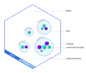

 Kubernetes介绍

## 应用部署方式演变

在部署应用程序的方式上，主要经历了三个时代：

- **传统部署**：互联网早期，会直接将应用程序部署在物理机上

  > 优点：简单，不需要其它技术的参与
  >
  > 缺点：不能为应用程序定义资源使用边界，很难合理地分配计算资源，而且程序之间容易产生影响

- **虚拟化部署**：可以在一台物理机上运行多个虚拟机，每个虚拟机都是独立的一个环境

  > 优点：程序环境不会相互产生影响，提供了一定程度的安全性
  >
  > 缺点：增加了操作系统，浪费了部分资源

- **容器化部署**：与虚拟化类似，但是共享了操作系统

  > 优点：
  >
  > 可以保证每个容器拥有自己的文件系统、CPU、内存、进程空间等
  >
  > 运行应用程序所需要的资源都被容器包装，并和底层基础架构解耦
  >
  > 容器化的应用程序可以跨云服务商、跨Linux操作系统发行版进行部署


容器化部署方式给带来很多的便利，但是也会出现一些问题，比如说：

- 一个容器故障停机了，怎么样让另外一个容器立刻启动去替补停机的容器
- 当并发访问量变大的时候，怎么样做到横向扩展容器数量

这些容器管理的问题统称为**容器编排**问题，为了解决这些容器编排问题，就产生了一些容器编排的软件：

- **Swarm**：Docker自己的容器编排工具
- **Mesos**：Apache的一个资源统一管控的工具，需要和Marathon结合使用
- **Kubernetes**：Google开源的的容器编排工具



##  kubernetes简介


 

kubernetes，是一个全新的基于容器技术的分布式架构领先方案，是谷歌严格保密十几年的秘密武器----Borg系统的一个开源版本，于2014年9月发布第一个版本，2015年7月发布第一个正式版本。

kubernetes的本质是**一组服务器集群**，它可以在集群的每个节点上运行特定的程序，来对节点中的容器进行管理。目的是实现资源管理的自动化，主要提供了如下的主要功能：

- **服务发现和负载均衡**

Kubernetes 可以使用 DNS 名称或自己的 IP 地址来暴露容器。 如果进入容器的流量很大， Kubernetes 可以负载均衡并分配网络流量，从而使部署稳定。

- **存储编排**

Kubernetes 允许你自动挂载你选择的存储系统，例如本地存储、公共云提供商等。

- **自动部署和回滚**

你可以使用 Kubernetes 描述已部署容器的所需状态， 它可以以受控的速率将实际状态更改为期望状态。 例如，你可以自动化 Kubernetes 来为你的部署创建新容器， 删除现有容器并将它们的所有资源用于新容器。

- **自动完成装箱计算**

你为 Kubernetes 提供许多节点组成的集群，在这个集群上运行容器化的任务。 你告诉 Kubernetes 每个容器需要多少 CPU 和内存 (RAM)。 Kubernetes 可以将这些容器按实际情况调度到你的节点上，以最佳方式利用你的资源。

- **自我修复**

Kubernetes 将重新启动失败的容器、替换容器、杀死不响应用户定义的运行状况检查的容器， 并且在准备好服务之前不将其通告给客户端。

- **密钥与配置管理**

Kubernetes 允许你存储和管理敏感信息，例如密码、OAuth 令牌和 SSH 密钥。 你可以在不重建容器镜像的情况下部署和更新密钥和应用程序配置，也无需在堆栈配置中暴露密钥。

- **批处理执行** 除了服务外，Kubernetes 还可以管理你的批处理和 CI（持续集成）工作负载，如有需要，可以替换失败的容器。
- **水平扩缩** 使用简单的命令、用户界面或根据 CPU 使用率自动对你的应用进行扩缩。
- **IPv4/IPv6 双栈** 为 Pod（容器组）和 Service（服务）分配 IPv4 和 IPv6 地址。
- **为可扩展性设计** 在不改变上游源代码的情况下为你的 Kubernetes 集群添加功能。


## kubernetes组件

一个kubernetes集群主要是由**控制平面组件(Control Plane Components)**、**工作节点(node)**，**插件(ADDons)**构成，每个节点上都会安装不同的组件。


**Control Plane Components：集群的控制平面，负责集群的决策 (管理)**

> **kube-apiserver** : API 服务器是 Kubernetes 控制平面的组件， 该组件负责公开了 Kubernetes API，负责处理接受请求的工作。 API 服务器是 Kubernetes 控制平面的前端
> **kube-scheduler** : kube-scheduler 是控制平面的组件， 负责监视新创建的、未指定运行节点（node）的 Pods， 并选择节点来让 Pod 在上面运行
> **kube-controller-manager** : 负责维护集群的状态，比如程序部署安排、故障检测、自动扩展、滚动更新等
>
> **Etcd** ：负责存储集群中各种资源对象的信息
>**cloud-controller-manager**: 一个 Kubernetes 控制平面组件， 嵌入了特定于云平台的控制逻辑。

**node：集群的数据平面，负责为容器提供运行环境 ( 干活 )**

> **Kubelet** : kubelet 会在集群中每个节点（node）上运行。 它保证容器（containers）都运行在 Pod 中
>
> **kube-proxy** : 负责提供集群内部的服务发现和负载均衡
>
> **Container Runtime** : 负责管理 Kubernetes 环境中容器的执行和生命周期

**插件（Addons）**
>参考https://kubernetes.io/zh-cn/docs/concepts/cluster-administration/addons/

下面，以部署一个nginx服务来说明kubernetes系统各个组件调用关系：

1. 首先要明确，一旦kubernetes环境启动之后，master和node都会将自身的信息存储到etcd数据库中

2. 一个nginx服务的安装请求会首先被发送到master节点的apiServer组件

3. apiServer组件会调用scheduler组件来决定到底应该把这个服务安装到哪个node节点上

   在此时，它会从etcd中读取各个node节点的信息，然后按照一定的算法进行选择，并将结果告知apiServer

4. apiServer调用controller-manager去调度Node节点安装nginx服务

5. kubelet接收到指令后，会通知docker，然后由docker来启动一个nginx的pod

   pod是kubernetes的最小操作单元，容器必须跑在pod中至此，

6. 一个nginx服务就运行了，如果需要访问nginx，就需要通过kube-proxy来对pod产生访问的代理

这样，外界用户就可以访问集群中的nginx服务了

## kubernetes概念

**Master**：集群控制节点，每个集群需要至少一个master节点负责集群的管控

**Node**：工作负载节点，由master分配容器到这些node工作节点上，然后node节点上的docker负责容器的运行

**Pod**：kubernetes的最小控制单元，容器都是运行在pod中的，一个pod中可以有1个或者多个容器

**Controller**：控制器，通过它来实现对pod的管理，比如启动pod、停止pod、伸缩pod的数量等等

**Service**：pod对外服务的统一入口，下面可以维护者同一类的多个pod

**Label**：标签，用于对pod进行分类，同一类pod会拥有相同的标签

**NameSpace**：命名空间，用来隔离pod的运行环境


## Kubernetes API

# 安装
为了方便我们学习，
本人在如果你使用的 Ubuntu 下安装，可以直接采取以下命令
```shell

```
## 验证 kubectl 配置
为了让 kubectl 能发现并访问 Kubernetes 集群，你需要一个 kubeconfig 文件， 该文件在 kube-up.sh 创建集群时，或成功部署一个 Minikube 集群时，均会自动生成。 通常，kubectl 的配置信息存放于文件 ~/.kube/config 中。

通过获取集群状态的方法，检查是否已恰当地配置了 kubectl：

kubectl cluster-info
如果返回一个 URL，则意味着 kubectl 成功地访问到了你的集群。

如果你看到如下所示的消息，则代表 kubectl 配置出了问题，或无法连接到 Kubernetes 集群。

The connection to the server <server-name:port> was refused - did you specify the right host or port?
（访问 <server-name:port> 被拒绝 - 你指定的主机和端口是否有误？）
例如，如果你想在自己的笔记本上（本地）运行 Kubernetes 集群，你需要先安装一个 Minikube 这样的工具，然后再重新运行上面的命令。

如果命令 kubectl cluster-info 返回了 URL，但你还不能访问集群，那可以用以下命令来检查配置是否妥当：

kubectl cluster-info dump
排查"找不到身份验证提供商"的错误信息
在 Kubernetes 1.26 中，kubectl 删除了以下云提供商托管的 Kubernetes 产品的内置身份验证。 这些提供商已经发布了 kubectl 插件来提供特定于云的身份验证。 有关说明，请参阅以下提供商文档：

Azure AKS：kubelogin 插件
CKE：gke-gcloud-auth-plugin