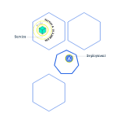
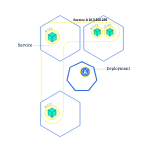

# minikube
## 安装
### 乌班图安装
科学上网是我你们安装的前提。
```shell
curl -LO https://storage.googleapis.com/minikube/releases/latest/minikube-linux-amd64

sudo install minikube-linux-amd64 /usr/local/bin/minikube
```
## 测试
首先我已将安装了docker，我们接下来以docker为虚拟化环境来运行minikube。

然后运行以下命令来测试运行。
```shell
minikube start --image-mirror-country='cn'
```
第一次运行会比较慢，因为我们第一次会下载一个比较大的镜像。

# Kubernetes介绍
##  Kubernetes介绍
Kubernetes是一个可以移植、可扩展的开源平台，使用 声明式的配置 并依据配置信息自动地执行容器化应用程序的管理。

容器化越来越流行，主要原因是它带来的诸多好处：
- **敏捷地创建和部署应用程序**：相较于创建虚拟机镜像，创建容器镜像更加容易和快速
- **持续构建集成**：可以更快更频繁地构建容器镜像、部署容器化的应用程序、并且轻松地回滚应用程序
- **分离开发和运维的关注点**：在开发构建阶段就完成容器镜像的构建，构建好的镜像可以部署到多种基础设施上。这种做法将开发阶段需要关注的内容包含在如何构建容器镜像的过程中，将部署阶段需要关注的内容聚焦在如何提供基础设施以及如何使用容器镜像的过程中。降低了开发和运维的耦合度
- **可监控性**：不仅可以查看操作系统级别的资源监控信息，还可以查看应用程序健康状态以及其他信号的监控信息
- **开发、测试、生产不同阶段的环境一致性**：开发阶段在笔记本上运行的容器与测试、生产环境中运行的容器一致
- **跨云服务商、跨操作系统发行版的可移植性**：容器可运行在 Ubuntu、RHEL、CoreOS、CentOS等不同的操作系统发行版上，可以运行在私有化部署、Google Kubernetes Engine、AWS、阿里云等不同的云供应商的环境中
- **以应用程序为中心的管理**：虚拟机时代的考虑的问题是在虚拟硬件上运行一个操作系统，而容器化时代，问题的焦点则是在操作系统的逻辑资源上运行一个应用程序
- **松耦合、分布式、弹性、无约束的微服务**：应用程序被切分成更小的、独立的微服务，并可以动态部署和管理，而不是一个部署在专属机器上的庞大的单片应用程序
- **资源隔离**：确保应用程序性能不受干扰
- **资源利用**：资源高效、高密度利用
##  Kubernetes的功能
- 服务发现和负载均衡
Kubernetes 可以通过 DNS 名称或 IP 地址暴露容器的访问方式。并且可以在同组容器内分发负载以实现负载均衡

- 存储编排
Kubernetes可以自动挂载指定的存储系统，例如 local stroage/nfs/云存储等
- 自动发布和回滚
您可以在 Kubernetes 中声明您期望应用程序容器应该达到的状态，Kubernetes将以合适的速率调整容器的实际状态，并逐步达到最终期望的结果。请参考 声明式的配置
- 自愈
Kubernetes提供如下自愈能力：
    - 重启已经停机的容器
    - 替换、kill 那些不满足自定义健康检查条件的容器
    - 在容器就绪之前，避免调用者发现该容器
- 密钥及配置管理
Kubernetes可以存储和管理敏感信息（例如，密码、OAuth token、ssh密钥等）。您可以更新容器应用程序的密钥、配置等信息，而无需：
    - 重新构建容器的镜像
    - 在不合适的地方暴露密码信息

# 基础知识
## 部署一个应用程序
**创建 YAML 文件**
创建文件 nginx-deployment.yaml，内容如下：
```yaml
apiVersion: apps/v1	#与k8s集群版本有关，使用 kubectl api-versions 即可查看当前集群支持的版本
kind: Deployment	#该配置的类型，我们使用的是 Deployment
metadata:	        #译名为元数据，即 Deployment 的一些基本属性和信息
  name: nginx-deployment	#Deployment 的名称
  labels:	    #标签，可以灵活定位一个或多个资源，其中key和value均可自定义，可以定义多组，目前不需要理解
    app: nginx	#为该Deployment设置key为app，value为nginx的标签
spec:	        #这是关于该Deployment的描述，可以理解为你期待该Deployment在k8s中如何使用
  replicas: 1	#使用该Deployment创建一个应用程序实例
  selector:	    #标签选择器，与上面的标签共同作用，目前不需要理解
    matchLabels: #选择包含标签app:nginx的资源
      app: nginx
  template:	    #这是选择或创建的Pod的模板
    metadata:	#Pod的元数据
      labels:	#Pod的标签，上面的selector即选择包含标签app:nginx的Pod
        app: nginx
    spec:	    #期望Pod实现的功能（即在pod中部署）
      containers:	#生成container，与docker中的container是同一种
      - name: nginx	#container的名称
        image: nginx:1.7.9	#使用镜像nginx:1.7.9创建container，该container默认80端口可访问
```
**应用 YAML 文件**
```shell
kubectl apply -f nginx-deployment.yaml
```
    
查看部署结果
```shell
# 查看 Deployment
kubectl get deployments

# 查看 Pod
kubectl get pods
```
## 查看Pods/Nodes
### Pods概述

Pod 容器组 是一个k8s中一个抽象的概念，用于存放一组 container(可包含一个或多个 container 容器，即图上正方体)，以及这些 container （容器）的一些共享资源。这些资源包括：
- 共享存储，称为卷(Volumes)，即图上紫色圆柱网络，每个 Pod（容器组）在集群中有个唯一的 IP，pod（容器组）中的 container（容器）共享该IP地址
- container（容器）的基本信息，例如容器的镜像版本，对外暴露的端口等

Pod（容器组）是 k8s 集群上的最基本的单元。当我们在 k8s 上创建 Deployment 时，会在集群上创建包含容器的 Pod (而不是直接创建容器)。每个Pod都与运行它的 worker 节点（Node）绑定，并保持在那里直到终止或被删除。如果节点（Node）发生故障，则会在群集中的其他可用节点（Node）上运行相同的 Pod（从同样的镜像创建 Container，使用同样的配置，IP 地址不同，Pod 名字不同）。

### Node（节点）

Pod总是在 Node上运行。Node（节点）是 kubernetes 集群中的计算机，可以是虚拟机或物理机。每个 Node（节点）都由 master 管理。一个 Node（节点）可以有多个Pod（容器组），kubernetes master 会根据每个 Node（节点）上可用资源的情况，自动调度 Pod（容器组）到最佳的 Node（节点）上。

每个 Kubernetes Node（节点）至少运行：
- Kubelet，负责 master 节点和 worker 节点之间通信的进程；管理 Pod和 Pod内运行的 Container（容器）。
- 容器运行环境负责下载镜像、创建和运行容器等。

### 实战：故障排除
在部署第一个应用程序 中，我们使用了 kubectl 命令行界面部署了 nginx 并且查看了 Deployment 和 Pod。kubectl 还有如下四个常用命令，在我们排查问题时可以提供帮助：
- kubectl get - 显示资源列表
```shell
# kubectl get 资源类型

#获取类型为Deployment的资源列表
kubectl get deployments

#获取类型为Pod的资源列表
kubectl get pods

#获取类型为Node的资源列表
kubectl get nodes
```
- 名称空间

在命令后增加 -A 或 --all-namespaces 可查看所有 名称空间中 的对象，使用参数 -n 可查看指定名称空间的对象，例如
```shell
# 查看所有名称空间的 Deployment
kubectl get deployments -A
kubectl get deployments --all-namespaces
# 查看 kube-system 名称空间的 Deployment
kubectl get deployments -n kube-system
```
- kubectl describe - 显示有关资源的详细信息
```shell
# kubectl describe 资源类型 资源名称

#查看名称为nginx-XXXXXX的Pod的信息
kubectl describe pod nginx-XXXXXX	

#查看名称为nginx的Deployment的信息
kubectl describe deployment nginx	
```
- kubectl logs - 查看pod中的容器的打印日志（和命令docker logs 类似）
```shell
# kubectl logs Pod名称

#查看名称为nginx-pod-XXXXXXX的Pod内的容器打印的日志
#本案例中的 nginx-pod 没有输出日志，所以您看到的结果是空的
kubectl logs -f nginx-pod-XXXXXXX
```
    
- kubectl exec - 在pod中的容器环境内执行命令(和命令docker exec 类似)
```shell
# kubectl exec Pod名称 操作命令

# 在名称为nginx-pod-xxxxxx的Pod中运行bash
kubectl exec -it nginx-pod-xxxxxx /bin/bash
```

## 公布应用程序
### Kubernetes Service（服务）概述
Kubernetes 中的 Service提供了这样的一个抽象层，它选择具备某些特征的 Pod并为它们定义一个访问方式。Service（服务）使 Pod（容器组）之间的相互依赖解耦（原本从一个 Pod 中访问另外一个 Pod，需要知道对方的 IP 地址）。一个 Service选定哪些 Pod通常由 LabelSelector(标签选择器) 来决定。

在创建Service的时候，通过设置配置文件中的 spec.type 字段的值，可以以不同方式向外部暴露应用程序：

- ClusterIP（默认）
在群集中的内部IP上公布服务，这种方式的 Service（服务）只在集群内部可以访问到

- NodePort
使用 NAT 在集群中每个的同一端口上公布服务。这种方式下，可以通过访问集群中任意节点+端口号的方式访问服务 <NodeIP>:<NodePort>。此时 ClusterIP 的访问方式仍然可用。

- LoadBalancer
在云环境中（需要云供应商可以支持）创建一个集群外部的负载均衡器，并为使用该负载均衡器的 IP 地址作为服务的访问地址。此时 ClusterIP 和 NodePort 的访问方式仍然可用。

### 服务和标签
下图中有两个服务Service A(黄色虚线)和Service B(蓝色虚线) Service A 将请求转发到 IP 为 10.10.10.1 的Pod上， Service B 将请求转发到 IP 为 10.10.10.2、10.10.10.3、10.10.10.4 的Pod上。


Service 将外部请求路由到一组 Pod 中，它提供了一个抽象层，使得 Kubernetes 可以在不影响服务调用者的情况下，动态调度容器组（在容器组失效后重新创建容器组，增加或者减少同一个 Deployment 对应容器组的数量等）。

Service使用 Labels、LabelSelector(标签和选择器) (opens new window)匹配一组 Pod。Labels（标签）是附加到 Kubernetes 对象的键/值对，其用途有多种：
- 将 Kubernetes 对象（Node、Deployment、Pod、Service等）指派用于开发环境、测试环境或生产环境
- 嵌入版本标签，使用标签区别不同应用软件版本
- 使用标签对 Kubernetes 对象进行分类

下图体现了 Labels（标签）和 LabelSelector（标签选择器）之间的关联关系
- Deployment B 含有 LabelSelector 为 app=B 通过此方式声明含有 app=B 标签的 Pod 与之关联
- 通过 Deployment B 创建的 Pod 包含标签为 app=B
- Service B 通过标签选择器 app=B 选择可以路由的 Pod
### 实战：为您的 nginx Deployment 创建一个 Service

创建nginx的Deployment中定义了Labels，如下：
```yaml
metadata:	#译名为元数据，即Deployment的一些基本属性和信息
  name: nginx-deployment	#Deployment的名称
  labels:	#标签，可以灵活定位一个或多个资源，其中key和value均可自定义，可以定义多组
    app: nginx	#为该Deployment设置key为app，value为nginx的标签
```
    
创建文件 nginx-service.yaml
>vim nginx-service.yaml
    
文件内容如下：
```yaml
apiVersion: v1
kind: Service
metadata:
  name: nginx-service	#Service 的名称
  labels:     	#Service 自己的标签
    app: nginx	#为该 Service 设置 key 为 app，value 为 nginx 的标签
spec:	    #这是关于该 Service 的定义，描述了 Service 如何选择 Pod，如何被访问
  selector:	    #标签选择器
    app: nginx	#选择包含标签 app:nginx 的 Pod
  ports:
  - name: nginx-port	#端口的名字
    protocol: TCP	    #协议类型 TCP/UDP
    port: 80	        #集群内的其他容器组可通过 80 端口访问 Service
    nodePort: 32600   #通过任意节点的 32600 端口访问 Service
    targetPort: 80	#将请求转发到匹配 Pod 的 80 端口
  type: NodePort	#Serive的类型，ClusterIP/NodePort/LoaderBalancer
```
    
执行命令
>kubectl apply -f nginx-service.yaml
 
    
检查执行结果
>kubectl get services -o wide

    
可查看到名称为 nginx-service 的服务。

访问服务
>curl <任意节点的 IP>:32600

## 伸缩应用程序
### Scaling（伸缩）应用程序
伸缩 的实现可以通过更改 nginx-deployment.yaml 文件中部署的 replicas（副本数）来完成
```yaml
spec:
  replicas: 2    #使用该Deployment创建两个应用程序实例

```
### Scaling（伸缩）
概述下图中，Service A 只将访问流量转发到 IP 为 10.0.0.5 的Pod上

修改了 Deployment 的 replicas 为 4 后，Kubernetes 又为该 Deployment 创建了 3 新的 Pod，这 4 个 Pod 有相同的标签。因此Service A通过标签选择器与新的 Pod建立了对应关系，将访问流量通过负载均衡在 4 个 Pod 之间进行转发。

### 实战：将 nginx Deployment 扩容到 4 个副本

修改 nginx-deployment.yaml 文件

将 replicas 修改为 4
```yaml
apiVersion: apps/v1
kind: Deployment
metadata:
  name: nginx-deployment
  labels:
    app: nginx
spec:
  replicas: 4
  selector:
    matchLabels:
      app: nginx
  template:
    metadata:
      labels:
        app: nginx
    spec:
      containers:
      - name: nginx
        image: nginx:1.7.9
        ports:
        - containerPort: 80
```
    
执行命令
>kubectl apply -f nginx-deployment.yaml
    
查看结果
>watch kubectl get pods -o wide

## 执行滚动更新
### 滚动更新概述
1. 原本 Service A 将流量负载均衡到 4 个旧版本的 Pod 上


2. 更新完 Deployment 部署文件中的镜像版本后，master 节点选择了一个 worker 节点，并根据新的镜像版本创建 Pod（紫色容器）。新 Pod 拥有唯一的新的 IP。同时，master 节点选择一个旧版本的 Pod 将其移除。

此时，Service A 将新 Pod 纳入到负载均衡中，将旧Pod移除


3. 同步骤2，再创建一个新的 Pod 替换一个原有的 Pod


### 更新 nginx Deployment
修改 nginx-deployment.yaml 文件

修改文件中 image 镜像的标签，如下所示
```yaml
apiVersion: apps/v1
kind: Deployment
metadata:
  name: nginx-deployment
  labels:
    app: nginx
spec:
  replicas: 4
  selector:
    matchLabels:
      app: nginx
  template:
    metadata:
      labels:
        app: nginx
    spec:
      containers:
      - name: nginx
        image: nginx:1.8   #使用镜像nginx:1.8替换原来的nginx:1.7.9
        ports:
        - containerPort: 80
```
    
执行命令
>kubectl apply -f nginx-deployment.yaml

    
查看过程及结果

执行命令，可观察到 pod 逐个被替换的过程。
>watch kubectl get pods -l app=nginx

# 架构
## 节点
### 节点状态
节点的状态包含如下信息：
- Addresses
- Conditions
- Capacity and Allocatable
- Info


执行以下命令可查看所有节点的列表：
>kubectl get nodes -o wide
    
执行以下命令可查看节点状态以及节点的其他详细信息：
>kubectl describe node <your-node-name>
####  Addresses

依据你集群部署的方式（在哪个云供应商部署，或是在物理机上部署），Addesses 字段可能有所不同。
- HostName： 在节点命令行界面上执行 hostname 命令所获得的值。启动 kubelet 时，可以通过参数 --hostname-override 覆盖
- ExternalIP：通常是节点的外部IP（可以从集群外访问的内网IP地址；上面的例子中，此字段为空）
- InternalIP：通常是从节点内部可以访问的 IP 地址
#### Conditions
Conditions 描述了节点的状态。Condition的例子有：
|Node Condition|	描述|
|--------|--------|
|OutOfDisk|	如果节点上的空白磁盘空间不够，不能够再添加新的节点时，该字段为 True，其他情况为 False|
|Ready|	如果节点是健康的且已经就绪可以接受新的 Pod。则节点Ready字段为 True。False表明了该节点不健康，不能够接受新的 Pod。|
|MemoryPressure|	如果节点内存紧张，则该字段为 True，否则为False|
|PIDPressure|	如果节点上进程过多，则该字段为 True，否则为 False|
|DiskPressure|	如果节点磁盘空间紧张，则该字段为 True，否则为 False|
|NetworkUnvailable|	如果节点的网络配置有问题，则该字段为 True，否则为 False|

#### Capacity and Allocatable（容量和可分配量）
容量和可分配量（Capacity and Allocatable）描述了节点上的可用资源的情况：
- CPU
- 内存
- 该节点可调度的最大 pod 数量

Capacity 中的字段表示节点上的资源总数，Allocatable 中的字段表示该节点上可分配给普通 Pod 的资源总数。

#### Info
描述了节点的基本信息，例如：
- Linux 内核版本
- Kubernetes 版本（kubelet 和 kube-proxy 的版本）
- Docker 版本
- 操作系统名称

### 节点管理
与 Pod 和 Service 不一样，节点并不是由 Kubernetes 创建的，节点由云供应商（例如，Google Compute Engine、阿里云等）创建，或者节点已经存在于您的物理机/虚拟机的资源池。向 Kubernetes 中创建节点时，仅仅是创建了一个描述该节点的 API 对象。节点 API 对象创建成功后，Kubernetes将检查该节点是否有效。例如，假设您创建如下节点信息：
```yaml
kind: Node
apiVersion: v1
metadata:
  name: "10.240.79.157"
  labels:
    name: "my-first-k8s-node"
```
#### 节点控制器（Node Controller）
节点控制器是一个负责管理节点的 Kubernetes master 组件。在节点的生命周期中，节点控制器起到了许多作用。
- 首先，节点控制器在注册节点时为节点分配 CIDR 地址块
- 第二，节点控制器通过云供应商（cloud-controller-manager）接口检查节点列表中每一个节点对象对应的虚拟机是否可用。在云环境中，只要节点状态异常，节点控制器检查其虚拟机在云供应商的状态，如果虚拟机不可用，自动将节点对象从 APIServer 中删除。
- 第三，节点控制器监控节点的健康状况。当节点变得不可触达时（例如，由于节点已停机，节点控制器不再收到来自节点的心跳信号），节点控制器将节点API对象的 NodeStatus Condition 取值从 NodeReady 更新为 Unknown；然后在等待 pod-eviction-timeout 时间后，将节点上的所有 Pod 从节点驱逐。
- 默认40秒未收到心跳，修改 NodeStatus Condition 为 Unknown；
- 默认 pod-eviction-timeout 为 5分钟
- 节点控制器每隔 --node-monitor-period 秒检查一次节点的状态

#### 节点自注册（Self-Registration）
如果 kubelet 的启动参数 --register-node为 true（默认为 true），kubelet 会尝试将自己注册到 API Server。kubelet自行注册时，将使用如下选项：
- --kubeconfig：向 apiserver 进行认证时所用身份信息的路径
- --cloud-provider：向云供应商读取节点自身元数据
- --register-node：自动向 API Server 注册节点
- --register-with-taints：注册节点时，为节点添加污点（逗号分隔，格式为 <key>=<value>:<effect>
- --node-ip：节点的 IP 地址
- --node-labels：注册节点时，为节点添加标签
- --node-status-update-frequency：向 master 节点发送心跳信息的时间间隔

如果 Node authorization mode (opens new window)和 NodeRestriction admission plugin (opens new window)被启用，kubelet 只拥有创建/修改其自身所对应的节点 API 对象的权限。
#### 手动管理节点
管理员可以修改节点API对象（不管是否设置了 --register-node 参数）。可以修改的内容有：
- 增加/减少标签
- 标记节点为不可调度（unschedulable）

>kubectl cordon $NODENAME

#### 节点容量（Node Capacity）
节点API对象中描述了节点的容量（Capacity），例如，CPU数量、内存大小等信息。通常，节点在向 APIServer 注册的同时，在节点API对象里汇报了其容量（Capacity）。如果您 手动管理节点，您需要在添加节点时自己设置节点的容量。

## 集群内的通信
Master-Node 之间的通信可以分为如下两类：
- Cluster to Master
- Master to Cluster
### Cluster to Master
所有从集群访问 Master 节点的通信，都是针对 apiserver 的。

### Master to Cluster
#### apiserver to kubelet
apiserver 在如下情况下访问 kubelet：
- 抓取 Pod 的日志
- 通过 kubectl exec -it 指令（或 kuboard 的终端界面）获得容器的命令行终端
- 提供 kubectl port-forward 功能

这些连接的访问端点是 kubelet 的 HTTPS 端口。默认情况下，apiserver 不校验 kubelet 的 HTTPS 证书，这种情况下，连接可能会收到 man-in-the-middle 攻击，因此该连接如果在不受信网络或者公网上运行时，是 不安全 的。

如果要校验 kubelet 的 HTTPS 证书，可以通过 --kubelet-certificate-authority 参数为 apiserver 提供校验 kubelet 证书的根证书。

如果不能完成这个配置，又需要通过不受信网络或公网将节点加入集群，则需要使用 SSH隧道 连接 apiserver 和 kubelet。

同时，Kubelet authentication/authorization (opens new window)需要激活，以保护 kubelet API

#### apiserver to nodes, pods, services
从 apiserver 到 节点/Pod/Service 的连接使用的是 HTTP 连接，没有进行身份认证，也没有进行加密传输。您也可以通过增加 https 作为 节点/Pod/Service 请求 URL 的前缀，但是 HTTPS 证书并不会被校验，也无需客户端身份认证，因此该连接是无法保证一致性的。目前，此类连接如果运行在非受信网络或公网上时，是 不安全 的

#### SSH隧道
Kubernetes 支持 SSH隧道（tunnel）来保护 Master --> Cluster 访问路径。此时，apiserver 将向集群中的每一个节点建立一个 SSH隧道（连接到端口22的ssh服务）并通过隧道传递所有发向 kubelet、node、pod、service 的请求。
## 控制器
在 Kubernetes 中，控制器 就是上面所说的 控制循环，它不断监控着集群的状态，并对集群做出对应的变更调整。每一个控制器都不断地尝试着将 当前状态 调整到 目标状态。
### 控制器模式
在 Kubernetes 中，每个控制器至少追踪一种类型的资源。这些资源对象中有一个 spec 字段代表了目标状态。资源对象对应的控制器负责不断地将当前状态调整到目标状态。
#### 通过APIServer进行控制
以 Kubernetes 中自带的一个控制器 Job Controller 为例。Kubernetes 自带的控制器都是通过与集群中 API Server 交互来达到调整状态的目的。

Job 是一种 Kubernetes API 对象，一个 Job 将运行一个（或多个）Pod，执行一项任务，然后停止。当新的 Job 对象被创建时，Job Controller 将确保集群中有合适数量的节点上的 kubelet 启动了指定个数的 Pod，以完成 Job 的执行任务。Job Controller 自己并不执行任何 Pod 或容器，而是发消息给 API Server，由其他的控制组件配合 API Server，以执行创建或删除 Pod 的实际动作。

当新的 Job 对象被创建时，目标状态是指定的任务被执行完成。Job Controller 调整集群的当前状态以达到目标状态：创建 Pod 以执行 Job 中指定的任务
#### 直接控制
某些特殊的控制器需要对集群外部的东西做调整。
####  目标状态 vs 当前状态

# 操作Kubernetes
## Kubernetes对象
### 什么是Kubernetes对象
Kubernetes对象指的是Kubernetes系统的持久化实体，所有这些对象合起来，代表了你集群的实际情况。常规的应用里，我们把应用程序的数据存储在数据库中，Kubernetes将其数据以Kubernetes对象的形式通过 api server存储在 etcd 中。具体来说，这些数据（Kubernetes对象）描述了：
- 集群中运行了哪些容器化应用程序（以及在哪个节点上运行）
- 集群中对应用程序可用的资源
- 应用程序相关的策略定义，例如，重启策略、升级策略、容错策略
- 其他Kubernetes管理应用程序时所需要的信息

### 对象的spec和status
每一个 Kubernetes 对象都包含了两个重要的字段：
- spec 必须由您来提供，描述了您对该对象所期望的 目标状态
- status 只能由 Kubernetes 系统来修改，描述了该对象在 Kubernetes 系统中的 实际状态

Kubernetes通过对应的控制器，不断地使实际状态趋向于您期望的目标状态。

### 描述Kubernetes对象
当您在 Kubernetes 中创建一个对象时，您必须提供
- 该对象的 spec 字段，通过该字段描述您期望的 目标状态
- 该对象的一些基本信息，例如名字

如果使用 kubectl 创建对象，您必须编写 .yaml 格式的文件，如果通过 Kuboard 图形化工具创建，则在Kuboard 对应的界面功能中完成表单填写即可。
```yaml
apiVersion: apps/v1
kind: Deployment
metadata:
  name: nginx-deployment
spec:
  selector:
    matchLabels:
      app: nginx
  replicas: 2 # 运行 2 个容器化应用程序副本
  template:
    metadata:
      labels:
        app: nginx
    spec:
      containers:
      - name: nginx
        image: nginx:1.7.9
        ports:
        - containerPort: 80
```
使用 kube apply 命令可以创建该 .yaml 文件中的 Deployment 对象：
>kubectl apply -f https://kuboard.cn/statics/learning/obj/deployment.yaml

输出结果如下所示：
>deployment.apps/nginx-deployment created

使用 kubectl delete 命令可以删除该 .yaml 文件中的 Deployment 对象：
>kubectl delete -f https://kuboard.cn/statics/learning/obj/deployment.yaml

### 必填字段
在上述的 .yaml 文件中，如下字段是必须填写的：
- apiVersion 用来创建对象时所使用的Kubernetes API版本
- kind 被创建对象的类型
- metadata 用于唯一确定该对象的元数据：包括 name 和 namespace，如果 namespace 为空，则默认值为 default
- spec 描述您对该对象的期望状态

## 管理Kubernetes对象
### 管理方式
|管理方式|	操作对象|	推荐的环境|	参与编辑的人数|	学习曲线|
|--------|---------|---------|----------|----------|
|指令性的命令行|	Kubernetes对象|	开发环境|	1+|	最低|
|指令性的对象配置	|单个 yaml |文件	|生产环境	|1	|适中|
|声明式的对象配置|	包含多个 yaml 文件的多个目录	|生产环境|	1+|	最高|

### 指令性的命令行
当使用指令性的命令行（imperative commands）时，用户通过向 kubectl 命令提供参数的方式，直接操作集群中的 Kubernetes 对象。此时，用户无需编写或修改 .yaml 文件。

创建一个 Deployment 对象，以运行一个 nginx 实例：
> kubectl run nginx --image nginx

>kubectl create deployment nginx --image nginx

### 指令性的对象配置
使用指令性的对象配置时，需要向 kubectl 命令指定具体的操作（create,replace,apply,delete等），可选参数以及至少一个配置文件的名字。配置文件中必须包括一个完整的对象的定义，可以是 yaml 格式，也可以是 json 格式。

通过配置文件创建对象
>kubectl create -f nginx.yaml
    
删除两个配置文件中的对象
>kubectl delete -f nginx.yaml -f redis.yaml

直接使用配置文件中的对象定义，替换Kubernetes中对应的对象：
>kubectl replace -f nginx.yaml
 
### 声明式的对象配置
当使用声明式的对象配置时，用户操作本地存储的Kubernetes对象配置文件，然而，在将文件传递给 kubectl 命令时，并不指定具体的操作，由 kubectl 自动检查每一个对象的状态并自行决定是创建、更新、还是删除该对象。使用这种方法时，可以直接针对一个或多个文件目录进行操作。

例子
处理 configs 目录中所有配置文件中的Kubernetes对象，根据情况创建对象、或更新Kubernetes中已经存在的对象。可以先执行 diff 指令查看具体的变更，然后执行 apply 指令执行变更：
```shell
kubectl diff -f configs/
kubectl apply -f configs/
```
    
递归处理目录中的内容：
```shell
kubectl diff -R -f configs/
kubectl apply -R -f configs/
```
## 名称
### Names
可以通过 namespace + name 唯一性地确定一个 RESTFUL 对象，例如：
>/api/v1/namespaces/{namespace}/pods/{name}

#### DNS Subdomain Names
- 最长不超过 253个字符
- 必须由小写字母、数字、减号 -、小数点 . 组成
- 由字母开始
- 由字母结束
#### DNS Label Names
部分类型的资源要求其名称符合 DNS Label 的命名规则 ，具体如下：
- 最长不超过 63个字符
- 必须由小写字母、数字、减号 -、小数点 . 组成
- 由字母开始
- 由字母结束
#### Path Segment Names
部分类型的资源要求其名称可以被编码到路径中。换句话说，名称中不能包含 .、..、/、%。
### UIDs
UID 是由 Kubernetes 系统生成的，唯一标识某个 Kubernetes 对象的字符串。

## 名称空间
### 何时使用名称空间 
名称空间的用途是，为不同团队的用户（或项目）提供虚拟的集群空间，也可以用来区分开发环境/测试环境、准上线环境/生产环境。

名称空间为 名称 提供了作用域。名称空间内部的同类型对象不能重名，但是跨名称空间可以有同名同类型对象。名称空间不可以嵌套，任何一个Kubernetes对象只能在一个名称空间中。

名称空间可以用来在不同的团队（用户）之间划分集群的资源，参考 resource quota

在 Kubernetes 将来的版本中，同名称空间下的对象将默认使用相同的访问控制策略。

当KUbernetes对象之间的差异不大时，无需使用名称空间来区分，例如，同一个软件的不同版本，只需要使用 labels 来区分即可。

### 如何使用名称空间
#### 查看名称空间
执行命令 kubectl get namespaces 可以查看名称空间，输出结果如下所示：
```shell
NAME          STATUS    AGE
default       Active    1d
kube-system   Active    1d
kube-public   Active    1d
```

Kubernetes 安装成功后，默认有初始化了三个名称空间：
- default 默认名称空间，如果 Kubernetes 对象中不定义 metadata.- - - namespace 字段，该对象将放在此名称空间下
- kube-system Kubernetes系统创建的对象放在此名称空间下
- kube-public 此名称空间自动在安装集群是自动创建，并且所有用户都是可以读取的。

#### 在执行请求时设定namespace
执行 kubectl 命令时，可以使用 --namespace 参数指定名称空间，例如：
```shell
kubectl run nginx --image=nginx --namespace=<您的名称空间>
kubectl get pods --namespace=<您的名称空间>
```
#### 设置名称空间偏好
可以通过 set-context 命令改变当前 kubectl 上下文 的名称空间，后续所有命令都默认在此名称空间下执行。
```shell
kubectl config set-context --current --namespace=<您的名称空间>
# 验证结果
kubectl config view --minify | grep namespace:
```
#### 名称空间与DNS
当您创建一个 Service 时，Kubernetes 为其创建一个对应的 DNS 条目。该 DNS 记录的格式为 <service-name>.<namespace-name>.svc.cluster.local，也就是说，如果在容器中只使用 <service-name>，其DNS将解析到同名称空间下的 Service。这个特点在多环境的情况下非常有用，例如将开发环境、测试环境、生产环境部署在不同的名称空间下，应用程序只需要使用 <service-name> 即可进行服务发现，无需为不同的环境修改配置。如果您想跨名称空间访问服务，则必须使用完整的域名（fully qualified domain name，FQDN）。

#### 并非所有对象都在名称空间里
大部分的 Kubernetes 对象（例如，Pod、Service、Deployment、StatefulSet等）都必须在名称空间里。但是某些更低层级的对象，是不在任何名称空间中的，例如 nodes、persistentVolumes、storageClass 等
## 使用名称空间共享集群
### 查看名称空间
查看集群中的名称空间列表：
>kubectl get namespaces


Kubernetes 安装成功后，默认有初始化了三个名称空间：
- default 默认名称空间，如果 Kubernetes 对象中不定义 metadata.namespace 字段，该对象将放在此名称空间下
- kube-system Kubernetes系统创建的对象放在此名称空间下
- kube-public 此名称空间自动在安装集群是自动创建，并且所有用户都是可以读取的（即使是那些未登录的用户）。主要是为集群预留的，例如，某些情况下，某些Kubernetes对象应该被所有集群用户看到。

查看名称空间的概要信息：
>kubectl describe namespaces <name>

- Resource quota 汇总了名称空间中使用的资源总量，并指定了集群管理员定义该名称空间最多可以使用的资源量
- Limit range 定义了名称空间中某种具体的资源类型的最大、最小值

名称空间可能有两种状态（phase）：
- Active 名称空间正在使用中
- Termining 名称空间正在被删除，不能再向其中创建新的对象


### 创建名称空间
使用 kubectl 有两种方式可以创建名称空间

通过 yaml 文件，创建文件 my-namespace.yaml 内容如下：
```yaml
apiVersion: v1
kind: Namespace
metadata:
  name: <名称空间的名字>
```
执行命令
>kubectl create -f ./my-namespace.yaml

    
直接使用命令创建名称空间：
>kubectl create namespace <名称空间的名字>
 

### 删除名称空间
执行如下命令可删除名称空间：
>kubectl delete namespaces <名称空间的名字>

此删除操作是异步的，您可能会观察到名称空间停留会在 Terminating 状态停留一段时间。

### 使用名称空间切分集群
#### 理解 default 名称空间
默认情况下，安装Kubernetes集群时，会初始化一个 default 名称空间，用来将承载那些未指定名称空间的 Pod、Service、Deployment等对象

#### 创建新的名称空间
在此练习中，我们将创建两个 Kubernetes 名称空间。

假设企业使用同一个集群作为开发环境和生产环境（注意：通常开发环境和生产环境是物理隔绝的）：
- 开发团队期望有一个集群中的空间，以便他们可以查看查看和使用他们创建的 Pod、Service、Deployment等。在此空间中，Kubernetes对象被创建又被删除，为了适应敏捷开发的过程，团队中的许多人都可以在此空间内做他们想做的事情。
- 运维团队也期望有一个集群中的空间，在这里，将有严格的流程控制谁可以操作 Pod、Service、Deployment等对象，因为这些对象都直接服务于生产环境。

此时，该企业可以将一个Kubernetes集群切分成两个名称空间：development 和 production。创建名称空间的 yaml 文件如下所示：
```yaml
apiVersion: v1
kind: Namespace
metadata:
  name: development
  labels:
    name: development
```
    
执行命令以创建 development 名称空间：
>kubectl create -f https://kuboard.cn/statics/learning/namespace/dev.yaml
 
    
执行命令以创建 production 名称空间：
>kubectl create -f https://kuboard.cn/statics/learning/namespace/prod.yaml
 
    
执行命令查看已创建的名称空间
>kubectl get namespaces --show-labels

#### 在每个名称空间中创建 Pod
Kubernetes名称空间为集群中的 Pod、Service、Deployment 提供了一个作用域。可以限定使用某个名称空间的用户不能看到另外一个名称空间中的内容。我们可以在 development 名称空间中创建一个简单的 Deployment 和 Pod 来演示这个特性。

首先，执行命令以检查当前的 kubectl 上下文
>kubectl config view
 
执行命令
>kubectl config current-context
 
  
接下来，为 kubectl 定义一个上下文，以便在不同的名称空间中工作。cluster 和 user 字段的取值从前面的 current context 复制过来：
```shell
kubectl config set-context dev --namespace=development --cluster=lithe-cocoa-92103_kubernetes --user=lithe-cocoa-92103_kubernetes
kubectl config set-context prod --namespace=production --cluster=lithe-cocoa-92103_kubernetes --user=lithe-cocoa-92103_kubernetes
```
    


切换到 development 名称空间：
>kubectl config use-context dev
 
  
    

创建一个 nginx
>kubectl run snowflake --image=nginx:1.7.9 --replicas=2
 
    
刚刚创建的 Deployment 副本数为 2，运行了一个 nginx 容器。
>kubectl get deployment
 

执行命令
>kubectl get pods -l run=snowflake
 

此时，开发人员可以做任何他想要做的操作，所有操作都限定在名称空间 development 里，而无需担心影响到 production 名称空间中的内容。

切换到 production 名称空间：
>kubectl config use-context prod
 

    
production 名称空间应该是空的，下面两个命令将返回的结果都应该为空：
```shell
kubectl get deployment
kubectl get pods
```

    
此时，我们在 production 名称空间运行另一个 deployment：
```shell
kubectl run cattle --image=nginx:1.7.9 --replicas=5
kubectl get deployment
```
    
执行命令
>kubectl get pods -l run=cattle


#### 为什么需要名称空间
一个Kubernetes集群应该可以满足多组用户的不同需要。Kubernetes名称空间可以使不同的项目、团队或客户共享同一个 Kubernetes 集群。实现的方式是，提供：

名称 的作用域
为不同的名称空间定义不同的授权方式和资源分配策略 Resource Quota 和 resource limit range
每一个用户组都期望独立于其他用户组进行工作。通过名称空间，每个用户组拥有自己的：

Kubernetes 对象（Pod、Service、Deployment等）
授权（谁可以在该名称空间中执行操作）
资源分配（该用户组或名称空间可以使用集群中的多少计算资源）
可能的使用情况有：

集群管理员通过一个Kubernetes集群支持多个用户组
集群管理员将集群中某个名称空间的权限分配给用户组中的受信任的成员
集群管理员可以限定某一个用户组可以消耗的资源数量，以避免其他用户组受到影响
集群用户可以使用自己的Kubernetes对象，而不会与集群中的其他用户组相互干扰
## 标签和选择器
标签（Label）是附加在Kubernetes对象上的一组名值对，其意图是按照对用户有意义的方式来标识Kubernetes对象，同时，又不对Kubernetes的核心逻辑产生影响。标签可以用来组织和选择一组Kubernetes对象。您可以在创建Kubernetes对象时为其添加标签，也可以在创建以后再为其添加标签。每个Kubernetes对象可以有多个标签，同一个对象的标签的 Key 必须唯一，例如：
```yaml
metadata:
  labels:
    key1: value1
    key2: value2
```
### 为什么要使用标签
使用标签，用户可以按照自己期望的形式组织 Kubernetes 对象之间的结构，而无需对 Kubernetes 有任何修改。

应用程序的部署或者批处理程序的部署通常都是多维度的（例如，多个高可用分区、多个程序版本、多个微服务分层）。管理这些对象时，很多时候要针对某一个维度的条件做整体操作，例如，将某个版本的程序整体删除，这种情况下，如果用户能够事先规划好标签的使用，再通过标签进行选择，就会非常地便捷。

标签的例子有：
- release: stable、release: canary
- environment: dev、environment: qa、environment: production
- tier: frontend、tier: backend、tier: cache
- partition: customerA、partition: customerB
- track: daily、track: weekly

### 句法和字符集
### 标签选择器
通常来讲，会有多个Kubernetes对象包含相同的标签。通过使用标签选择器（label selector），用户/客户端可以选择一组对象。标签选择器（label selector）是 Kubernetes 中最主要的分类和筛选手段.
#### 基于等式的选择方式
Equality- 或者 inequality-based 选择器可以使用标签的名和值来执行过滤选择。只有匹配所有条件的对象才被选中（被选中的对象可以包含未指定的标签）。可以使用三种操作符 =、==、!=。前两个操作符含义是一样的，都代表相等，后一个操作符代表不相等。例如：
```shell
# 选择了标签名为 `environment` 且 标签值为 `production` 的Kubernetes对象
environment = production
# 选择了标签名为 `tier` 且标签值不等于 `frontend` 的对象，以及不包含标签 `tier` 的对象
tier != frontend
```

#### 基于集合的选择方式
Set-based 标签选择器可以根据标签名的一组值进行筛选。支持的操作符有三种：in、notin、exists。例如：
```shell
# 选择所有的包含 `environment` 标签且值为 `production` 或 `qa` 的对象
environment in (production, qa)
# 选择所有的 `tier` 标签不为 `frontend` 和 `backend`的对象，或不含 `tier` 标签的对象
tier notin (frontend, backend)
# 选择所有包含 `partition` 标签的对象
partition
# 选择所有不包含 `partition` 标签的对象
!partition
```
可以组合多个选择器，用 , 分隔，, 相当于 AND 操作符。例如：
```shell
# 选择包含 `partition` 标签（不检查标签值）且 `environment` 不是 `qa` 的对象
partition,environment notin (qa)
```

### API
#### 查询条件
LIST 和 WATCH 操作时，可指定标签选择器作为查询条件，以筛选指定的对象集合。两种选择方式都可以使用，但是要符合 URL 编码，例如：

- 基于等式的选择方式： ?labelSelector=environment%3Dproduction,tier%3Dfrontend
- 基于集合的选择方式： ?labelSelector=environment+in+%28production%2Cqa%29%2Ctier+in+%28frontend%29

两种选择方式都可以在 kubectl 的 list 和 watch 命令中使用，例如：

- 使用基于等式的选择方式
>kubectl get pods -l environment=production,tier=frontend
 

    
- 使用基于集合的选择方式
>kubectl get pods -l 'environment in (production),tier in (frontend)'

#### Kubernetes对象引用
**Service**
Service 中通过 spec.selector 字段来选择一组 Pod，并将服务请求转发到选中的 Pod 上。

在 yaml 或 json 文件中，标签选择器用一个 map 来定义，且支持基于等式的选择方式，例如：
```json
"selector": {
  "component" : "redis",
}
```
```yaml
selector:
  component: redis
```

**有些对象支持基于集合的选择方式**
Job、Deployment、ReplicaSet 和 DaemonSet 同时支持基于等式的选择方式和基于集合的选择方式。例如：
```yaml
selector:
  matchLabels:
    component: redis
  matchExpressions:
    - {key: tier, operator: In, values: [cache]}
    - {key: environment, operator: NotIn, values: [dev]}
```
## 注解annotation
### 向Kubernetes对象添加注解

## 字段选择器
### 概述

字段选择器（Field Selector）可以用来基于的一个或多个字段的取值来选取一组Kubernetes对象。下面有一些示例性的字段选择器：
- metadata.name=my-service
- metadata.namespace!=default
- status.phase=Pending

下面的 kubectl 命令选择了所有字段 status.phase 的取值为 Running 的 Pod：
>kubectl get pods --field-selector status.phase=Running
 
### 支持的字段
不同的 Kubernetes 对象类型，可以用来查询的字段不一样。所有的对象类型都支持的两个字段是 metadata.name 和 metadata.namespace。在字段选择器中使用不支持的字段，将报错。例如：
>kubectl get ingress --field-selector foo.bar=baz

### 支持的操作符
字段选择器中可以使用的操作符有 =、==、!= （= 和 == 含义相同）。例如，下面的 kubectl 命令，查询不在 default 名称空间中的 Service：
>kubectl get services  --all-namespaces --field-selector metadata.namespace!=default

### 多选择器
可以指定多个字段选择器，用逗号 , 分隔。下面的 kubectl 命令查询所有的 status.phase 不等于 Running 且 spec.restartPolicy 等于 Always 的 Pod：
>kubectl get pods --field-selector=status.phase!=Running,spec.restartPolicy=Always

### 多种对象类型
字段选择器可以跨资源类型使用。下面的 kubectl 命令查询所有的不在 default 名称空间的 StatefulSet 和 Service：
>kubectl get statefulsets,services --all-namespaces --field-selector metadata.namespace!=default

# 容器
## 容器镜像
在 Kubernetes 的 Pod 中使用容器镜像之前，您必须将其推送到一个镜像仓库（或者使用仓库中已经有的容器镜像）。在 Kubernetes 的 Pod 定义中定义容器时，必须指定容器所使用的镜像，容器中的 image 字段支持与 docker 命令一样的语法，包括私有镜像仓库和标签。

例如：my-registry.example.com:5000/example/web-example:v1.0.1 由如下几个部分组成：
## 更新镜像
Kubernetes中，默认的镜像抓取策略是 IfNotPresent，使用此策略，kubelet在发现本机有镜像的情况下，不会向镜像仓库抓取镜像。如果您期望每次启动 Pod 时，都强制从镜像仓库抓取镜像，可以尝试如下方式：
- 设置 container 中的 imagePullPolicy 为 Always
- 省略 imagePullPolicy 字段，并使用 :latest tag 的镜像
- 省略 imagePullPolicy 字段和镜像的 tag
- 激活 AlwaysPullImages (opens new window)管理控制器


imagePullPolicy 字段和 image tag的可能取值将影响到 kubelet 如何抓取镜像：
- imagePullPolicy: IfNotPresent 仅在节点上没有该镜像时，从镜像仓库抓取
- imagePullPolicy: Always 每次启动 Pod 时，从镜像仓库抓取
- imagePullPolicy 未填写，镜像 tag 为 :latest 或者未填写，则同 Always 每次启动 Pod 时，从镜像仓库抓取
- imagePullPolicy 未填写，镜像 tag 已填写但不是 :latest，则同 IfNotPresent 仅在节点上没有该镜像时，从镜像仓库抓取
- imagePullPolicy: Never，Kubernetes 假设本地存在该镜像，并且不会尝试从镜像仓库抓取镜像

## 容器的环境变量
### 容器的信息
在容器中执行 hostname 命令或者在libc 中执行 gethostname (opens new window)函调用，获得的是容器所在 Pod 的名字。

Pod 的名字，以及 Pod 所在名称空间可以通过 downward API (opens new window)注入到容器的环境变量里。

用户也可以为容器自定义环境变量，请参考 使用ConfigMap配置您的应用程序

### 集群的信息
在容器创建时，集群中所有的 Service 的连接信息将以环境变量的形式注入到容器中。例如，已创建了一个名为 Foo 的 Service，此时再创建任何容器时，该容器将包含如下环境变量：
```shell
FOO_SERVICE_HOST=<Service的ClusterIP>
FOO_SERVICE_PORT=<Service的端口>
```
## Runtime Class
### 设计目标

# 服务发现，负载均衡，网络
## Service
### Service概述
**为何需要 Service**
Kubernetes 中 Pod 是随时可以消亡的。如果使用 Deployment 运行您的应用程序，Deployment 将会在 Pod 消亡后再创建一个新的 Pod 以维持所需要的副本数。每一个 Pod 有自己的 IP 地址，然而，对于 Deployment 而言，对应 Pod 集合是动态变化的。

**Kubernetes Service**
Kubernetes 中 Service 是一个 API 对象，通过 kubectl + YAML 或者 Kuboard，定义一个 Service，可以将符合 Service 指定条件的 Pod 作为可通过网络访问的服务提供给服务调用者。

Service 是 Kubernetes 中的一种服务发现机制：

- Pod 有自己的 IP 地址
- Service 被赋予一个唯一的 dns name
- Service 通过 label selector 选定一组 Pod
- Service 实现负载均衡，可将请求均衡分发到选定这一组 Pod 中


**在 Kuboard 中使用 Service**
从 Kuboard 工作负载编辑器的视角来看，Service 与其他重要的 Kubernetes 对象之间的关系如下图所示：


图中，Service 先连线到 Controller，Controller 在连线到容器组，这种表示方式只是概念上的，期望用户在使用 Kubernetes 的时候总是通过 Controller 创建 Pod，然后再通过 Service 暴露为网络服务，通过 Ingress 对集群外提供互联网访问。

事实上，Service 与 Controller 并没有直接联系，Service 通过 label selector 选择符合条件的 Pod，并将选中的 Pod 作为网络服务的提供者。从这个意义上来讲，您可以有很多种方式去定义 Service 的 label selector，然而，最佳的实践是，在 Service 中使用与 Controller 中相同的 label selector。

### Service详细描述
#### 创建 Service
Kubernetes Servies 是一个 RESTFul 接口对象，可通过 yaml 文件创建。

例如，假设您有一组 Pod：
- 每个 Pod 都监听 9376 TCP 端口
- 每个 Pod 都有标签 app=MyApp
```yaml
apiVersion: v1
kind: Service
metadata:
  name: my-service
spec:
  selector:
    app: MyApp
  ports:
    - protocol: TCP
      port: 80
      targetPort: 9376
```
上述 YAML 文件可用来创建一个 Service：
- 名字为 my-service
- 目标端口为 TCP 9376
- 选取所有包含标签 app=MyApp 的 Pod

关于 Service，您还需要了解：
- Kubernetes 将为该 Service 分配一个 IP 地址（ClusterIP 或 集群内 IP），供 Service Proxy 使用（参考虚拟 IP 和 Service proxy）
- Kubernetes 将不断扫描符合该 selector 的 Pod，并将最新的结果更新到与 Service 同名 my-service 的 Endpoint 对象中。
- Pod 的定义中，Port 可能被赋予了一个名字，您可以在 Service 的 targetPort 字段引用这些名字，而不是直接写端口号。这种做法可以使得您在将来修改后端程序监听的端口号，而无需影响到前端程序。
- Service 的默认传输协议是 TCP，您也可以使用其他 支持的传输协议。
- Kubernetes Service 中，可以定义多个端口，不同的端口可以使用相同或不同的传输协议。
#### 创建 Service（无 label selector） Kuboard 暂不支持
Service 通常用于提供对 Kubernetes Pod 的访问，但是您也可以将其用于任何其他形式的后端。例如：

- 您想要在生产环境中使用一个 Kubernetes 外部的数据库集群，在测试环境中使用 Kubernetes 内部的 数据库
- 您想要将 Service 指向另一个名称空间中的 Service，或者另一个 Kubernetes 集群中的 Service
- 您正在将您的程序迁移到 Kubernetes，但是根据您的迁移路径，您只将一部分后端程序运行在 Kubernetes 中

在上述这些情况下，您可以定义一个没有 Pod Selector 的 Service。例如：
```yaml
apiVersion: v1
kind: Service
metadata:
  name: my-service
spec:
  ports:
    - protocol: TCP
      port: 80
      targetPort: 9376
```
因为该 Service 没有 selector，相应的 Endpoint 对象就无法自动创建。您可以手动创建一个 Endpoint 对象，以便将该 Service 映射到后端服务真实的 IP 地址和端口：
```yaml
apiVersion: v1
kind: Endpoints
metadata:
  name: my-service
subsets:
  - addresses:
      - ip: 192.0.2.42
    ports:
      - port: 9376
```

#### 虚拟 IP 和服务代理
Kubernetes 集群中的每个节点都运行了一个 kube-proxy，负责为 Service（ExternalName 类型的除外）提供虚拟 IP 访问。

##### 为何不使用 round-robin DNS
许多用户都对 Kubernetes 为何使用服务代理将接收到的请求转发给后端服务，而不是使用其他途径，例如：是否可以为 Service 配置一个 DNS 记录，将其解析到多个 A value（如果是 IPv6 则是 AAAA value），并依赖 round-robin（循环）解析？

Kubernetes 使用在 Service 中使用 proxy 的原因大致有如下几个：

- 一直以来，DNS 软件都不确保严格检查 TTL（Time to live），并且在缓存的 dns 解析结果应该过期以后，仍然继续使用缓存中的记录
- 某些应用程序只做一次 DNS 解析，并一直使用缓存下来的解析结果
- 即使应用程序对 DNS 解析做了合适的处理，为 DNS 记录设置过短（或者 0）的 TTL 值，将给 DNS 服务器带来过大的负载
##### 版本兼容性
Kubernetes 支持三种 proxy mode（代理模式），他们的版本兼容性如下：

|代理模式|	Kubernetes 版本|	是否默认|
|User space proxy mode|	v1.0 +||	
|Iptables proxy mode|	v1.1 +|	默认|
|Ipvs proxy mode|	v1.8 +||	

##### User space 代理模式
在 user space proxy mode 下：
- kube-proxy 监听 kubernetes master 以获得添加和移除 Service / Endpoint 的事件
- kube-proxy 在其所在的节点（每个节点都有 kube-proxy）上为每一个 Service 打开一个随机端口
- kube-proxy 安装 iptables 规则，将发送到该 Service 的 ClusterIP（虚拟 IP）/ Port 的请求重定向到该随机端口
- 任何发送到该随机端口的请求将被代理转发到该 Service 的后端 Pod 上（kube-proxy 从 Endpoint 信息中获得可用 Pod）
- kube-proxy 在决定将请求转发到后端哪一个 Pod 时，默认使用 round-robin（轮询）算法，并会考虑到 Service 中的 SessionAffinity 的设定


##### Iptables 代理模式 默认模式
在 iptables proxy mode 下：
- kube-proxy 监听 kubernetes master 以获得添加和移除 Service / Endpoint 的事件
- kube-proxy 在其所在的节点（每个节点都有 kube-proxy）上为每一个 Service 安装 iptable 规则
- tables 将发送到 Service 的 ClusterIP / Port 的请求重定向到 Service 的后端 Pod 上
  - 对于 Service 中的每一个 Endpoint，kube-proxy 安装一个 iptable 规则
  - 默认情况下，kube-proxy 随机选择一个 Service 的后端 Pod


iptables proxy mode 的优点：
- 更低的系统开销：在 linux netfilter 处理请求，无需在 userspace 和 kernel space 之间切换
- 更稳定

与 user space mode 的差异：
- 使用 iptables mode 时，如果第一个 Pod 没有响应，则创建连接失败
- 使用 user space mode 时，如果第一个 Pod 没有响应，kube-proxy 会自动尝试连接另外一个后端 Pod

##### IPVS 代理模式
在 IPVS proxy mode 下：
- kube-proxy 监听 kubernetes master 以获得添加和移除 Service / Endpoint 的事件
- kube-proxy 根据监听到的事件，调用 netlink 接口，创建 IPVS 规则；并且将 Service/Endpoint 的变化同步到 IPVS 规则中
- 当访问一个 Service 时，IPVS 将请求重定向到后端 Pod


##### 代理模式总结
在所有的代理模式中，发送到 Service 的 IP:Port 的请求将被转发到一个合适的后端 Pod，而无需调用者知道任何关于 Kubernetes/Service/Pods 的细节。

Service 中额外字段的作用：
- service.spec.sessionAffinity
  - 默认值为 "None"
  - 如果设定为 "ClientIP"，则同一个客户端的连接将始终被转发到同一个 Pod
- service.spec.sessionAffinityConfig.clientIP.timeoutSeconds
  - 默认值为 10800 （3 小时）
  - 设定会话保持的持续时间

#### 多端口的Service
Kubernetes 中，您可以在一个 Service 对象中定义多个端口，此时，您必须为每个端口定义一个名字。如下所示：
```yaml
apiVersion: v1
kind: Service
metadata:
  name: my-service
spec:
  selector:
    app: MyApp
  ports:
    - name: http
      protocol: TCP
      port: 80
      targetPort: 9376
    - name: https
      protocol: TCP
      port: 443
      targetPort: 9377
```
#### 使用自定义的 IP 地址
创建 Service 时，如果指定 .spec.clusterIP 字段，可以使用自定义的 Cluster IP 地址。该 IP 地址必须是 APIServer 中配置字段 service-cluster-ip-range CIDR 范围内的合法 IPv4 或 IPv6 地址，否则不能创建成功。

可能用到自定义 IP 地址的场景：
- 想要重用某个已经存在的 DNS 条目
- 遗留系统是通过 IP 地址寻址，且很难改造


#### 服务发现
Kubernetes 支持两种主要的服务发现模式：
- 环境变量
- DNS
**环境变量**
kubelet 查找有效的 Service，并针对每一个 Service，向其所在节点上的 Pod 注入一组环境变量。支持的环境变量有：
- Docker links 兼容 (opens new window)的环境变量
- {SVCNAME}_SERVICE_HOST 和 {SVCNAME}_SERVICE_PORT
  - Service name 被转换为大写
  - 小数点 . 被转换为下划线 _

**DNS**
如果按照 www.kuboard.cn 上的文档安装 Kubernetes，默认已经安装了 DNS 服务，Core DNS (opens new window)。

CoreDNS 监听 Kubernetes API 上创建和删除 Service 的事件，并为每一个 Service 创建一条 DNS 记录。集群中所有的 Pod 都可以使用 DNS Name 解析到 Service 的 IP 地址。

例如，名称空间 my-ns 中的 Service my-service，将对应一条 DNS 记录 my-service.my-ns。 名称空间 my-ns 中的Pod可以直接 nslookup my-service （my-service.my-ns 也可以）。其他名称空间的 Pod 必须使用 my-service.my-ns。my-service 和 my-service.my-ns 都将被解析到 Service 的 Cluster IP。

Kubernetes 同样支持 DNS SRV（Service）记录，用于查找一个命名的端口。假设 my-service.my-ns Service 有一个 TCP 端口名为 http，则，您可以 nslookup _http._tcp.my-service.my-ns 以发现该Service 的 IP 地址及端口 http

对于 ExternalName 类型的 Service，只能通过 DNS 的方式进行服务发现。参考 Service/Pod 的 DNS

#### Headless Services
“Headless” Service 不提供负载均衡的特性，也没有自己的 IP 地址。创建 “headless” Service 时，只需要指定 .spec.clusterIP 为 "None"。

“Headless” Service 可以用于对接其他形式的服务发现机制，而无需与 Kubernetes 的实现绑定。

对于 “Headless” Service 而言：
- 没有 Cluster IP
- kube-proxy 不处理这类 Service
- Kubernetes不提供负载均衡或代理支持

DNS 的配置方式取决于该 Service 是否配置了 selector：
- 配置了 Selector

Endpoints Controller 创建 Endpoints 记录，并修改 DNS 配置，使其直接返回指向 - selector 选取的 Pod 的 IP 地址

- 没有配置 Selector

Endpoints Controller 不创建 Endpoints 记录。DNS服务返回如下结果中的一种：
  - 对 ExternalName 类型的 Service，返回 CNAME 记录
  - 对于其他类型的 Service，返回与 Service 同名的 Endpoints 的 A 记录
  
#### 虚拟 IP 的实现
如果只是想要正确使用 Service，不急于理解 Service 的实现细节，您无需阅读本章节。

#### 避免冲突
Kubernetes 的一个设计哲学是：尽量避免非人为错误产生的可能性。就设计 Service 而言，Kubernetes 应该将您选择的端口号与其他人选择的端口号隔离开。为此，Kubernetes 为每一个 Service 分配一个该 Service 专属的 IP 地址。

为了确保每个 Service 都有一个唯一的 IP 地址，kubernetes 在创建 Service 之前，先更新 etcd 中的一个全局分配表，如果更新失败（例如 IP 地址已被其他 Service 占用），则 Service 不能成功创建。

Kubernetes 使用一个后台控制器检查该全局分配表中的 IP 地址的分配是否仍然有效，并且自动清理不再被 Service 使用的 IP 地址。

#### Service 的 IP 地址
Pod 的 IP 地址路由到一个确定的目标，然而 Service 的 IP 地址则不同，通常背后并不对应一个唯一的目标。 kube-proxy 使用 iptables （Linux 中的报文处理逻辑）来定义虚拟 IP 地址。当客户端连接到该虚拟 IP 地址时，它们的网络请求将自动发送到一个合适的 Endpoint。Service 对应的环境变量和 DNS 实际上反应的是 Service 的虚拟 IP 地址（和端口）。

#### Userspace
以上面提到的图像处理程序为例。当后端 Service 被创建时，Kubernetes master 为其分配一个虚拟 IP 地址（假设是 10.0.0.1），并假设 Service 的端口是 1234。集群中所有的 kube-proxy 都实时监听者 Service 的创建和删除。Service 创建后，kube-proxy 将打开一个新的随机端口，并设定 iptables 的转发规则（以便将该 Service 虚拟 IP 的网络请求全都转发到这个新的随机端口上），并且 kube-proxy 将开始接受该端口上的连接。

当一个客户端连接到该 Service 的虚拟 IP 地址时，iptables 的规则被触发，并且将网络报文重定向到 kube-proxy 自己的随机端口上。kube-proxy 接收到请求后，选择一个后端 Pod，再将请求以代理的形式转发到该后端 Pod。

这意味着 Service 可以选择任意端口号，而无需担心端口冲突。客户端可以直接连接到一个 IP:port，无需关心最终在使用哪个 Pod 提供服务。

#### iptables

仍然以上面提到的图像处理程序为例。当后端 Service 被创建时，Kubernetes master 为其分配一个虚拟 IP 地址（假设是 10.0.0.1），并假设 Service 的端口是 1234。集群中所有的 kube-proxy 都实时监听者 Service 的创建和删除。Service 创建后，kube-proxy 设定了一系列的 iptables 规则（这些规则可将虚拟 IP 地址映射到 per-Service 的规则）。per-Service 规则进一步链接到 per-Endpoint 规则，并最终将网络请求重定向（使用 destination-NAT）到后端 Pod。

当一个客户端连接到该 Service 的虚拟 IP 地址时，iptables 的规则被触发。一个后端 Pod 将被选中（基于 session affinity 或者随机选择），且网络报文被重定向到该后端 Pod。与 userspace proxy 不同，网络报文不再被复制到 userspace，kube-proxy 也无需处理这些报文，且报文被直接转发到后端 Pod。

在使用 node-port 或 load-balancer 类型的 Service 时，以上的代理处理过程是相同的。

### 发布Service
#### Service 类型
Kubernetes 中可以通过不同方式发布 Service，通过 ServiceType 字段指定，该字段的默认值是 ClusterIP，可选值有：
- ClusterIP: Kuboard 已支持 默认值。通过集群内部的一个 IP 地址暴露 Service，只在集群内部可以访问
- NodePort: Kuboard 已支持 通过每一个节点上的的静态端口（NodePort）暴露 Service，同时自动创建 ClusterIP 类型的访问方式
  - 在集群内部通过 $(ClusterIP): $(Port) 访问
  - 在集群外部通过 $(NodeIP): $(NodePort) 访问

#### ClusterIP

#### NodePort
对于 NodePort 类型的 Service，Kubernetes 为其分配一个节点端口（对于同一 Service，在每个节点上的节点端口都相同），该端口的范围在初始化 apiserver 时可通过参数 --service-node-port-range 指定（默认是：30000-32767），参考 修改NodePort的范围。节点将该端口上的网络请求转发到对应的 Service 上。可通过 Service 的 .spec.ports[*].nodePort 字段查看该 Service 分配到的节点端口号。

在启动 kube-proxy 时使用参数 --nodeport-address 可指定阶段端口可以绑定的 IP 地址段。该参数接收以逗号分隔的 CIDR 作为参数值（例如：10.0.0.0/8,192.0.2.0/25），kube-proxy 将查找本机符合该 CIDR 的 IP 地址，并将节点端口绑定到符合的 IP 地址上。

例如，

如果启动 kube-proxy 时指定了参数 --nodeport-address=127.0.0.0/8，则 kube-proxy 只将阶段端口绑定到 loopback 地址上。
--nodeport-address 的默认值是一个空列表。则 kube-proxy 将节点端口绑定到该节点所有的网络 IP 地址上。
您可以通过 nodePort 字段指定节点端口号（必须在 --service-node-port-range 指定的范围内）。Kubernetes 在创建 Service 时将使用该节点端口，如果该端口已被占用，则创建 Service 将不能成功。在这种情况下，您必须自己规划好端口使用，以避免端口冲突。

使用 NodePort，您可以：

根据自己的需要配置负载均衡器
配置 Kubernetes / 非 Kubernetes 的混合环境
直接暴露一到多个节点的 IP 地址，以便客户端可访问 Kubernetes 中的 Service
NodePort 类型的 Service 可通过如下方式访问：

在集群内部通过 $(ClusterIP): $(Port) 访问
在集群外部通过 $(NodeIP): $(NodePort) 访问