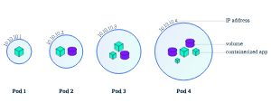

# minikube
## 安装
### 乌班图安装
科学上网是我你们安装的前提。
```shell
curl -LO https://storage.googleapis.com/minikube/releases/latest/minikube-linux-amd64

sudo install minikube-linux-amd64 /usr/local/bin/minikube
```
## 测试
首先我已将安装了docker，我们接下来以docker为虚拟化环境来运行minikube。

然后运行以下命令来测试运行。
```shell
minikube start --image-mirror-country='cn'
```
第一次运行会比较慢，因为我们第一次会下载一个比较大的镜像。

# Kubernetes介绍
##  Kubernetes介绍
Kubernetes是一个可以移植、可扩展的开源平台，使用 声明式的配置 并依据配置信息自动地执行容器化应用程序的管理。

容器化越来越流行，主要原因是它带来的诸多好处：
- **敏捷地创建和部署应用程序**：相较于创建虚拟机镜像，创建容器镜像更加容易和快速
- **持续构建集成**：可以更快更频繁地构建容器镜像、部署容器化的应用程序、并且轻松地回滚应用程序
- **分离开发和运维的关注点**：在开发构建阶段就完成容器镜像的构建，构建好的镜像可以部署到多种基础设施上。这种做法将开发阶段需要关注的内容包含在如何构建容器镜像的过程中，将部署阶段需要关注的内容聚焦在如何提供基础设施以及如何使用容器镜像的过程中。降低了开发和运维的耦合度
- **可监控性**：不仅可以查看操作系统级别的资源监控信息，还可以查看应用程序健康状态以及其他信号的监控信息
- **开发、测试、生产不同阶段的环境一致性**：开发阶段在笔记本上运行的容器与测试、生产环境中运行的容器一致
- **跨云服务商、跨操作系统发行版的可移植性**：容器可运行在 Ubuntu、RHEL、CoreOS、CentOS等不同的操作系统发行版上，可以运行在私有化部署、Google Kubernetes Engine、AWS、阿里云等不同的云供应商的环境中
- **以应用程序为中心的管理**：虚拟机时代的考虑的问题是在虚拟硬件上运行一个操作系统，而容器化时代，问题的焦点则是在操作系统的逻辑资源上运行一个应用程序
- **松耦合、分布式、弹性、无约束的微服务**：应用程序被切分成更小的、独立的微服务，并可以动态部署和管理，而不是一个部署在专属机器上的庞大的单片应用程序
- **资源隔离**：确保应用程序性能不受干扰
- **资源利用**：资源高效、高密度利用
##  Kubernetes的功能
- 服务发现和负载均衡
Kubernetes 可以通过 DNS 名称或 IP 地址暴露容器的访问方式。并且可以在同组容器内分发负载以实现负载均衡

- 存储编排
Kubernetes可以自动挂载指定的存储系统，例如 local stroage/nfs/云存储等
- 自动发布和回滚
您可以在 Kubernetes 中声明您期望应用程序容器应该达到的状态，Kubernetes将以合适的速率调整容器的实际状态，并逐步达到最终期望的结果。请参考 声明式的配置
- 自愈
Kubernetes提供如下自愈能力：
    - 重启已经停机的容器
    - 替换、kill 那些不满足自定义健康检查条件的容器
    - 在容器就绪之前，避免调用者发现该容器
- 密钥及配置管理
Kubernetes可以存储和管理敏感信息（例如，密码、OAuth token、ssh密钥等）。您可以更新容器应用程序的密钥、配置等信息，而无需：
    - 重新构建容器的镜像
    - 在不合适的地方暴露密码信息

# 基础知识
## 部署一个应用程序
**创建 YAML 文件**
创建文件 nginx-deployment.yaml，内容如下：
```yaml
apiVersion: apps/v1	#与k8s集群版本有关，使用 kubectl api-versions 即可查看当前集群支持的版本
kind: Deployment	#该配置的类型，我们使用的是 Deployment
metadata:	        #译名为元数据，即 Deployment 的一些基本属性和信息
  name: nginx-deployment	#Deployment 的名称
  labels:	    #标签，可以灵活定位一个或多个资源，其中key和value均可自定义，可以定义多组，目前不需要理解
    app: nginx	#为该Deployment设置key为app，value为nginx的标签
spec:	        #这是关于该Deployment的描述，可以理解为你期待该Deployment在k8s中如何使用
  replicas: 1	#使用该Deployment创建一个应用程序实例
  selector:	    #标签选择器，与上面的标签共同作用，目前不需要理解
    matchLabels: #选择包含标签app:nginx的资源
      app: nginx
  template:	    #这是选择或创建的Pod的模板
    metadata:	#Pod的元数据
      labels:	#Pod的标签，上面的selector即选择包含标签app:nginx的Pod
        app: nginx
    spec:	    #期望Pod实现的功能（即在pod中部署）
      containers:	#生成container，与docker中的container是同一种
      - name: nginx	#container的名称
        image: nginx:1.7.9	#使用镜像nginx:1.7.9创建container，该container默认80端口可访问
```
**应用 YAML 文件**
```shell
kubectl apply -f nginx-deployment.yaml
```
    
查看部署结果
```shell
# 查看 Deployment
kubectl get deployments

# 查看 Pod
kubectl get pods
```
## 查看Pods/Nodes
### Pods概述

Pod 容器组 是一个k8s中一个抽象的概念，用于存放一组 container(可包含一个或多个 container 容器，即图上正方体)，以及这些 container （容器）的一些共享资源。这些资源包括：
- 共享存储，称为卷(Volumes)，即图上紫色圆柱
网络，每个 Pod（容器组）在集群中有个唯一的 IP，pod（容器组）中的 container（容器）共享该IP地址
- container（容器）的基本信息，例如容器的镜像版本，对外暴露的端口等

Pod（容器组）是 k8s 集群上的最基本的单元。当我们在 k8s 上创建 Deployment 时，会在集群上创建包含容器的 Pod (而不是直接创建容器)。每个Pod都与运行它的 worker 节点（Node）绑定，并保持在那里直到终止或被删除。如果节点（Node）发生故障，则会在群集中的其他可用节点（Node）上运行相同的 Pod（从同样的镜像创建 Container，使用同样的配置，IP 地址不同，Pod 名字不同）。

### Node（节点）

Pod总是在 Node上运行。Node（节点）是 kubernetes 集群中的计算机，可以是虚拟机或物理机。每个 Node（节点）都由 master 管理。一个 Node（节点）可以有多个Pod（容器组），kubernetes master 会根据每个 Node（节点）上可用资源的情况，自动调度 Pod（容器组）到最佳的 Node（节点）上。

每个 Kubernetes Node（节点）至少运行：
- Kubelet，负责 master 节点和 worker 节点之间通信的进程；管理 Pod和 Pod内运行的 Container（容器）。
- 容器运行环境负责下载镜像、创建和运行容器等。

### 实战：故障排除
在部署第一个应用程序 中，我们使用了 kubectl 命令行界面部署了 nginx 并且查看了 Deployment 和 Pod。kubectl 还有如下四个常用命令，在我们排查问题时可以提供帮助：
- kubectl get - 显示资源列表
```shell
# kubectl get 资源类型

#获取类型为Deployment的资源列表
kubectl get deployments

#获取类型为Pod的资源列表
kubectl get pods

#获取类型为Node的资源列表
kubectl get nodes
```
- 名称空间

在命令后增加 -A 或 --all-namespaces 可查看所有 名称空间中 的对象，使用参数 -n 可查看指定名称空间的对象，例如
```shell
# 查看所有名称空间的 Deployment
kubectl get deployments -A
kubectl get deployments --all-namespaces
# 查看 kube-system 名称空间的 Deployment
kubectl get deployments -n kube-system
```
- kubectl describe - 显示有关资源的详细信息
```shell
# kubectl describe 资源类型 资源名称

#查看名称为nginx-XXXXXX的Pod的信息
kubectl describe pod nginx-XXXXXX	

#查看名称为nginx的Deployment的信息
kubectl describe deployment nginx	
```
- kubectl logs - 查看pod中的容器的打印日志（和命令docker logs 类似）
```shell
# kubectl logs Pod名称

#查看名称为nginx-pod-XXXXXXX的Pod内的容器打印的日志
#本案例中的 nginx-pod 没有输出日志，所以您看到的结果是空的
kubectl logs -f nginx-pod-XXXXXXX
```
    
- kubectl exec - 在pod中的容器环境内执行命令(和命令docker exec 类似)
```shell
# kubectl exec Pod名称 操作命令

# 在名称为nginx-pod-xxxxxx的Pod中运行bash
kubectl exec -it nginx-pod-xxxxxx /bin/bash
```

## 公布应用程序
### Kubernetes Service（服务）概述
Kubernetes 中的 Service提供了这样的一个抽象层，它选择具备某些特征的 Pod并为它们定义一个访问方式。Service（服务）使 Pod（容器组）之间的相互依赖解耦（原本从一个 Pod 中访问另外一个 Pod，需要知道对方的 IP 地址）。一个 Service选定哪些 Pod通常由 LabelSelector(标签选择器) 来决定。

在创建Service的时候，通过设置配置文件中的 spec.type 字段的值，可以以不同方式向外部暴露应用程序：

- ClusterIP（默认）
在群集中的内部IP上公布服务，这种方式的 Service（服务）只在集群内部可以访问到

- NodePort
使用 NAT 在集群中每个的同一端口上公布服务。这种方式下，可以通过访问集群中任意节点+端口号的方式访问服务 <NodeIP>:<NodePort>。此时 ClusterIP 的访问方式仍然可用。

- LoadBalancer
在云环境中（需要云供应商可以支持）创建一个集群外部的负载均衡器，并为使用该负载均衡器的 IP 地址作为服务的访问地址。此时 ClusterIP 和 NodePort 的访问方式仍然可用。

### 服务和标签
下图中有两个服务Service A(黄色虚线)和Service B(蓝色虚线) Service A 将请求转发到 IP 为 10.10.10.1 的Pod上， Service B 将请求转发到 IP 为 10.10.10.2、10.10.10.3、10.10.10.4 的Pod上。


Service 将外部请求路由到一组 Pod 中，它提供了一个抽象层，使得 Kubernetes 可以在不影响服务调用者的情况下，动态调度容器组（在容器组失效后重新创建容器组，增加或者减少同一个 Deployment 对应容器组的数量等）。

Service使用 Labels、LabelSelector(标签和选择器) (opens new window)匹配一组 Pod。Labels（标签）是附加到 Kubernetes 对象的键/值对，其用途有多种：
- 将 Kubernetes 对象（Node、Deployment、Pod、Service等）指派用于开发环境、测试环境或生产环境
- 嵌入版本标签，使用标签区别不同应用软件版本
- 使用标签对 Kubernetes 对象进行分类

下图体现了 Labels（标签）和 LabelSelector（标签选择器）之间的关联关系
- Deployment B 含有 LabelSelector 为 app=B 通过此方式声明含有 app=B 标签的 Pod 与之关联
- 通过 Deployment B 创建的 Pod 包含标签为 app=B
- Service B 通过标签选择器 app=B 选择可以路由的 Pod
### 实战：为您的 nginx Deployment 创建一个 Service

创建nginx的Deployment中定义了Labels，如下：
```yaml
metadata:	#译名为元数据，即Deployment的一些基本属性和信息
  name: nginx-deployment	#Deployment的名称
  labels:	#标签，可以灵活定位一个或多个资源，其中key和value均可自定义，可以定义多组
    app: nginx	#为该Deployment设置key为app，value为nginx的标签
```
    
创建文件 nginx-service.yaml
>vim nginx-service.yaml
    
文件内容如下：
```yaml
apiVersion: v1
kind: Service
metadata:
  name: nginx-service	#Service 的名称
  labels:     	#Service 自己的标签
    app: nginx	#为该 Service 设置 key 为 app，value 为 nginx 的标签
spec:	    #这是关于该 Service 的定义，描述了 Service 如何选择 Pod，如何被访问
  selector:	    #标签选择器
    app: nginx	#选择包含标签 app:nginx 的 Pod
  ports:
  - name: nginx-port	#端口的名字
    protocol: TCP	    #协议类型 TCP/UDP
    port: 80	        #集群内的其他容器组可通过 80 端口访问 Service
    nodePort: 32600   #通过任意节点的 32600 端口访问 Service
    targetPort: 80	#将请求转发到匹配 Pod 的 80 端口
  type: NodePort	#Serive的类型，ClusterIP/NodePort/LoaderBalancer
```
    
执行命令
>kubectl apply -f nginx-service.yaml
 
    
检查执行结果
>kubectl get services -o wide

    
可查看到名称为 nginx-service 的服务。

访问服务
>curl <任意节点的 IP>:32600

## 伸缩应用程序
### Scaling（伸缩）应用程序
伸缩 的实现可以通过更改 nginx-deployment.yaml 文件中部署的 replicas（副本数）来完成
```yaml
spec:
  replicas: 2    #使用该Deployment创建两个应用程序实例

```
### Scaling（伸缩）
概述下图中，Service A 只将访问流量转发到 IP 为 10.0.0.5 的Pod上

修改了 Deployment 的 replicas 为 4 后，Kubernetes 又为该 Deployment 创建了 3 新的 Pod，这 4 个 Pod 有相同的标签。因此Service A通过标签选择器与新的 Pod建立了对应关系，将访问流量通过负载均衡在 4 个 Pod 之间进行转发。

### 实战：将 nginx Deployment 扩容到 4 个副本

修改 nginx-deployment.yaml 文件

将 replicas 修改为 4
```yaml
apiVersion: apps/v1
kind: Deployment
metadata:
  name: nginx-deployment
  labels:
    app: nginx
spec:
  replicas: 4
  selector:
    matchLabels:
      app: nginx
  template:
    metadata:
      labels:
        app: nginx
    spec:
      containers:
      - name: nginx
        image: nginx:1.7.9
        ports:
        - containerPort: 80
```
    
执行命令
>kubectl apply -f nginx-deployment.yaml
    
查看结果
>watch kubectl get pods -o wide

## 执行滚动更新
### 滚动更新概述
1. 原本 Service A 将流量负载均衡到 4 个旧版本的 Pod 上


2. 更新完 Deployment 部署文件中的镜像版本后，master 节点选择了一个 worker 节点，并根据新的镜像版本创建 Pod（紫色容器）。新 Pod 拥有唯一的新的 IP。同时，master 节点选择一个旧版本的 Pod 将其移除。

此时，Service A 将新 Pod 纳入到负载均衡中，将旧Pod移除


3. 同步骤2，再创建一个新的 Pod 替换一个原有的 Pod


### 更新 nginx Deployment
修改 nginx-deployment.yaml 文件

修改文件中 image 镜像的标签，如下所示
```yaml
apiVersion: apps/v1
kind: Deployment
metadata:
  name: nginx-deployment
  labels:
    app: nginx
spec:
  replicas: 4
  selector:
    matchLabels:
      app: nginx
  template:
    metadata:
      labels:
        app: nginx
    spec:
      containers:
      - name: nginx
        image: nginx:1.8   #使用镜像nginx:1.8替换原来的nginx:1.7.9
        ports:
        - containerPort: 80
```
    
执行命令
>kubectl apply -f nginx-deployment.yaml

    
查看过程及结果

执行命令，可观察到 pod 逐个被替换的过程。
>watch kubectl get pods -l app=nginx

# 架构
## 节点
### 节点状态
节点的状态包含如下信息：
- Addresses
- Conditions
- Capacity and Allocatable
- Info


执行以下命令可查看所有节点的列表：
>kubectl get nodes -o wide
    
执行以下命令可查看节点状态以及节点的其他详细信息：
>kubectl describe node <your-node-name>
####  Addresses

依据你集群部署的方式（在哪个云供应商部署，或是在物理机上部署），Addesses 字段可能有所不同。
- HostName： 在节点命令行界面上执行 hostname 命令所获得的值。启动 kubelet 时，可以通过参数 --hostname-override 覆盖
- ExternalIP：通常是节点的外部IP（可以从集群外访问的内网IP地址；上面的例子中，此字段为空）
- InternalIP：通常是从节点内部可以访问的 IP 地址
#### Conditions
Conditions 描述了节点的状态。Condition的例子有：
|Node Condition|	描述|
|--------|--------|
|OutOfDisk|	如果节点上的空白磁盘空间不够，不能够再添加新的节点时，该字段为 True，其他情况为 False|
|Ready|	如果节点是健康的且已经就绪可以接受新的 Pod。则节点Ready字段为 True。False表明了该节点不健康，不能够接受新的 Pod。|
|MemoryPressure|	如果节点内存紧张，则该字段为 True，否则为False|
|PIDPressure|	如果节点上进程过多，则该字段为 True，否则为 False|
|DiskPressure|	如果节点磁盘空间紧张，则该字段为 True，否则为 False|
|NetworkUnvailable|	如果节点的网络配置有问题，则该字段为 True，否则为 False|

#### Capacity and Allocatable（容量和可分配量）
容量和可分配量（Capacity and Allocatable）描述了节点上的可用资源的情况：
- CPU
- 内存
- 该节点可调度的最大 pod 数量

Capacity 中的字段表示节点上的资源总数，Allocatable 中的字段表示该节点上可分配给普通 Pod 的资源总数。

#### Info
描述了节点的基本信息，例如：
- Linux 内核版本
- Kubernetes 版本（kubelet 和 kube-proxy 的版本）
- Docker 版本
- 操作系统名称

### 节点管理
与 Pod 和 Service 不一样，节点并不是由 Kubernetes 创建的，节点由云供应商（例如，Google Compute Engine、阿里云等）创建，或者节点已经存在于您的物理机/虚拟机的资源池。向 Kubernetes 中创建节点时，仅仅是创建了一个描述该节点的 API 对象。节点 API 对象创建成功后，Kubernetes将检查该节点是否有效。例如，假设您创建如下节点信息：
```yaml
kind: Node
apiVersion: v1
metadata:
  name: "10.240.79.157"
  labels:
    name: "my-first-k8s-node"
```
#### 节点控制器（Node Controller）
节点控制器是一个负责管理节点的 Kubernetes master 组件。在节点的生命周期中，节点控制器起到了许多作用。
- 首先，节点控制器在注册节点时为节点分配 CIDR 地址块
- 第二，节点控制器通过云供应商（cloud-controller-manager）接口检查节点列表中每一个节点对象对应的虚拟机是否可用。在云环境中，只要节点状态异常，节点控制器检查其虚拟机在云供应商的状态，如果虚拟机不可用，自动将节点对象从 APIServer 中删除。
- 第三，节点控制器监控节点的健康状况。当节点变得不可触达时（例如，由于节点已停机，节点控制器不再收到来自节点的心跳信号），节点控制器将节点API对象的 NodeStatus Condition 取值从 NodeReady 更新为 Unknown；然后在等待 pod-eviction-timeout 时间后，将节点上的所有 Pod 从节点驱逐。
- 默认40秒未收到心跳，修改 NodeStatus Condition 为 Unknown；
- 默认 pod-eviction-timeout 为 5分钟
- 节点控制器每隔 --node-monitor-period 秒检查一次节点的状态

#### 节点自注册（Self-Registration）
如果 kubelet 的启动参数 --register-node为 true（默认为 true），kubelet 会尝试将自己注册到 API Server。kubelet自行注册时，将使用如下选项：
- --kubeconfig：向 apiserver 进行认证时所用身份信息的路径
- --cloud-provider：向云供应商读取节点自身元数据
- --register-node：自动向 API Server 注册节点
- --register-with-taints：注册节点时，为节点添加污点（逗号分隔，格式为 <key>=<value>:<effect>
- --node-ip：节点的 IP 地址
- --node-labels：注册节点时，为节点添加标签
- --node-status-update-frequency：向 master 节点发送心跳信息的时间间隔

如果 Node authorization mode (opens new window)和 NodeRestriction admission plugin (opens new window)被启用，kubelet 只拥有创建/修改其自身所对应的节点 API 对象的权限。
#### 手动管理节点
管理员可以修改节点API对象（不管是否设置了 --register-node 参数）。可以修改的内容有：
- 增加/减少标签
- 标记节点为不可调度（unschedulable）

>kubectl cordon $NODENAME

#### 节点容量（Node Capacity）
节点API对象中描述了节点的容量（Capacity），例如，CPU数量、内存大小等信息。通常，节点在向 APIServer 注册的同时，在节点API对象里汇报了其容量（Capacity）。如果您 手动管理节点，您需要在添加节点时自己设置节点的容量。

## 集群内的通信
Master-Node 之间的通信可以分为如下两类：
- Cluster to Master
- Master to Cluster
### Cluster to Master
所有从集群访问 Master 节点的通信，都是针对 apiserver 的。

### Master to Cluster
#### apiserver to kubelet
apiserver 在如下情况下访问 kubelet：
- 抓取 Pod 的日志
- 通过 kubectl exec -it 指令（或 kuboard 的终端界面）获得容器的命令行终端
- 提供 kubectl port-forward 功能

这些连接的访问端点是 kubelet 的 HTTPS 端口。默认情况下，apiserver 不校验 kubelet 的 HTTPS 证书，这种情况下，连接可能会收到 man-in-the-middle 攻击，因此该连接如果在不受信网络或者公网上运行时，是 不安全 的。

如果要校验 kubelet 的 HTTPS 证书，可以通过 --kubelet-certificate-authority 参数为 apiserver 提供校验 kubelet 证书的根证书。

如果不能完成这个配置，又需要通过不受信网络或公网将节点加入集群，则需要使用 SSH隧道 连接 apiserver 和 kubelet。

同时，Kubelet authentication/authorization (opens new window)需要激活，以保护 kubelet API

#### apiserver to nodes, pods, services
从 apiserver 到 节点/Pod/Service 的连接使用的是 HTTP 连接，没有进行身份认证，也没有进行加密传输。您也可以通过增加 https 作为 节点/Pod/Service 请求 URL 的前缀，但是 HTTPS 证书并不会被校验，也无需客户端身份认证，因此该连接是无法保证一致性的。目前，此类连接如果运行在非受信网络或公网上时，是 不安全 的

#### SSH隧道
Kubernetes 支持 SSH隧道（tunnel）来保护 Master --> Cluster 访问路径。此时，apiserver 将向集群中的每一个节点建立一个 SSH隧道（连接到端口22的ssh服务）并通过隧道传递所有发向 kubelet、node、pod、service 的请求。
## 控制器
在 Kubernetes 中，控制器 就是上面所说的 控制循环，它不断监控着集群的状态，并对集群做出对应的变更调整。每一个控制器都不断地尝试着将 当前状态 调整到 目标状态。
### 控制器模式
在 Kubernetes 中，每个控制器至少追踪一种类型的资源。这些资源对象中有一个 spec 字段代表了目标状态。资源对象对应的控制器负责不断地将当前状态调整到目标状态。
#### 通过APIServer进行控制
以 Kubernetes 中自带的一个控制器 Job Controller 为例。Kubernetes 自带的控制器都是通过与集群中 API Server 交互来达到调整状态的目的。

Job 是一种 Kubernetes API 对象，一个 Job 将运行一个（或多个）Pod，执行一项任务，然后停止。当新的 Job 对象被创建时，Job Controller 将确保集群中有合适数量的节点上的 kubelet 启动了指定个数的 Pod，以完成 Job 的执行任务。Job Controller 自己并不执行任何 Pod 或容器，而是发消息给 API Server，由其他的控制组件配合 API Server，以执行创建或删除 Pod 的实际动作。

当新的 Job 对象被创建时，目标状态是指定的任务被执行完成。Job Controller 调整集群的当前状态以达到目标状态：创建 Pod 以执行 Job 中指定的任务
#### 直接控制
某些特殊的控制器需要对集群外部的东西做调整。
####  目标状态 vs 当前状态

# 操作Kubernetes
## Kubernetes对象
### 什么是Kubernetes对象
Kubernetes对象指的是Kubernetes系统的持久化实体，所有这些对象合起来，代表了你集群的实际情况。常规的应用里，我们把应用程序的数据存储在数据库中，Kubernetes将其数据以Kubernetes对象的形式通过 api server存储在 etcd 中。具体来说，这些数据（Kubernetes对象）描述了：
- 集群中运行了哪些容器化应用程序（以及在哪个节点上运行）
- 集群中对应用程序可用的资源
- 应用程序相关的策略定义，例如，重启策略、升级策略、容错策略
- 其他Kubernetes管理应用程序时所需要的信息

### 对象的spec和status
每一个 Kubernetes 对象都包含了两个重要的字段：
- spec 必须由您来提供，描述了您对该对象所期望的 目标状态
- status 只能由 Kubernetes 系统来修改，描述了该对象在 Kubernetes 系统中的 实际状态

Kubernetes通过对应的控制器，不断地使实际状态趋向于您期望的目标状态。

### 描述Kubernetes对象
当您在 Kubernetes 中创建一个对象时，您必须提供
- 该对象的 spec 字段，通过该字段描述您期望的 目标状态
- 该对象的一些基本信息，例如名字

如果使用 kubectl 创建对象，您必须编写 .yaml 格式的文件，如果通过 Kuboard 图形化工具创建，则在Kuboard 对应的界面功能中完成表单填写即可。
```yaml
apiVersion: apps/v1
kind: Deployment
metadata:
  name: nginx-deployment
spec:
  selector:
    matchLabels:
      app: nginx
  replicas: 2 # 运行 2 个容器化应用程序副本
  template:
    metadata:
      labels:
        app: nginx
    spec:
      containers:
      - name: nginx
        image: nginx:1.7.9
        ports:
        - containerPort: 80
```
使用 kube apply 命令可以创建该 .yaml 文件中的 Deployment 对象：
>kubectl apply -f https://kuboard.cn/statics/learning/obj/deployment.yaml

输出结果如下所示：
>deployment.apps/nginx-deployment created

使用 kubectl delete 命令可以删除该 .yaml 文件中的 Deployment 对象：
>kubectl delete -f https://kuboard.cn/statics/learning/obj/deployment.yaml

### 必填字段
在上述的 .yaml 文件中，如下字段是必须填写的：
- apiVersion 用来创建对象时所使用的Kubernetes API版本
- kind 被创建对象的类型
- metadata 用于唯一确定该对象的元数据：包括 name 和 namespace，如果 namespace 为空，则默认值为 default
- spec 描述您对该对象的期望状态

## 管理Kubernetes对象
### 管理方式
|管理方式|	操作对象|	推荐的环境|	参与编辑的人数|	学习曲线|
|--------|---------|---------|----------|----------|
|指令性的命令行|	Kubernetes对象|	开发环境|	1+|	最低|
|指令性的对象配置	|单个 yaml |文件	|生产环境	|1	|适中|
|声明式的对象配置|	包含多个 yaml 文件的多个目录	|生产环境|	1+|	最高|

### 指令性的命令行
当使用指令性的命令行（imperative commands）时，用户通过向 kubectl 命令提供参数的方式，直接操作集群中的 Kubernetes 对象。此时，用户无需编写或修改 .yaml 文件。

创建一个 Deployment 对象，以运行一个 nginx 实例：
> kubectl run nginx --image nginx

>kubectl create deployment nginx --image nginx

### 指令性的对象配置
使用指令性的对象配置时，需要向 kubectl 命令指定具体的操作（create,replace,apply,delete等），可选参数以及至少一个配置文件的名字。配置文件中必须包括一个完整的对象的定义，可以是 yaml 格式，也可以是 json 格式。

通过配置文件创建对象
>kubectl create -f nginx.yaml
    
删除两个配置文件中的对象
>kubectl delete -f nginx.yaml -f redis.yaml

直接使用配置文件中的对象定义，替换Kubernetes中对应的对象：
>kubectl replace -f nginx.yaml
 
### 声明式的对象配置
当使用声明式的对象配置时，用户操作本地存储的Kubernetes对象配置文件，然而，在将文件传递给 kubectl 命令时，并不指定具体的操作，由 kubectl 自动检查每一个对象的状态并自行决定是创建、更新、还是删除该对象。使用这种方法时，可以直接针对一个或多个文件目录进行操作。

例子
处理 configs 目录中所有配置文件中的Kubernetes对象，根据情况创建对象、或更新Kubernetes中已经存在的对象。可以先执行 diff 指令查看具体的变更，然后执行 apply 指令执行变更：
```shell
kubectl diff -f configs/
kubectl apply -f configs/
```
    
递归处理目录中的内容：
```shell
kubectl diff -R -f configs/
kubectl apply -R -f configs/
```
## 名称
### Names
可以通过 namespace + name 唯一性地确定一个 RESTFUL 对象，例如：
>/api/v1/namespaces/{namespace}/pods/{name}

#### DNS Subdomain Names
- 最长不超过 253个字符
- 必须由小写字母、数字、减号 -、小数点 . 组成
- 由字母开始
- 由字母结束
#### DNS Label Names
部分类型的资源要求其名称符合 DNS Label 的命名规则 ，具体如下：
- 最长不超过 63个字符
- 必须由小写字母、数字、减号 -、小数点 . 组成
- 由字母开始
- 由字母结束
#### Path Segment Names
部分类型的资源要求其名称可以被编码到路径中。换句话说，名称中不能包含 .、..、/、%。
### UIDs
UID 是由 Kubernetes 系统生成的，唯一标识某个 Kubernetes 对象的字符串。

## 名称空间
### 何时使用名称空间 
名称空间的用途是，为不同团队的用户（或项目）提供虚拟的集群空间，也可以用来区分开发环境/测试环境、准上线环境/生产环境。

名称空间为 名称 提供了作用域。名称空间内部的同类型对象不能重名，但是跨名称空间可以有同名同类型对象。名称空间不可以嵌套，任何一个Kubernetes对象只能在一个名称空间中。

名称空间可以用来在不同的团队（用户）之间划分集群的资源，参考 resource quota

在 Kubernetes 将来的版本中，同名称空间下的对象将默认使用相同的访问控制策略。

当KUbernetes对象之间的差异不大时，无需使用名称空间来区分，例如，同一个软件的不同版本，只需要使用 labels 来区分即可。