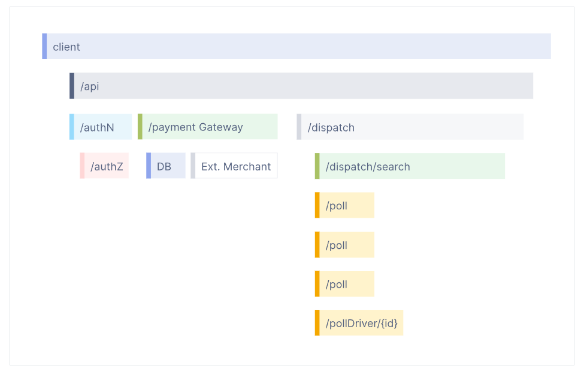

# 概念
## 可观测性指引
### 什么是可观测性？  
可观测性使我们能够从外部了解一个系统，通过提出关于该系统的问题而无需了解其内部工作方式。

为了能够对系统提出这些问题，应用程序必须被正确地仪表化。也就是说，应用程序代码必须发出诸如 信号 的东西，例如 跟踪、指标 和 日志。只有在开发人员无需添加更多仪表化来解决问题时，应用程序才被正确地仪表化，因为他们拥有所需的所有信息。

OpenTelemetry 是通过该机制对应用程序代码进行仪表化，以帮助使系统可观测。

### 可靠性和指标
遥测是指关于系统行为的数据。这些数据可以形成 跟踪、指标 和 日志 的形式。

可靠性回答了这个问题：“服务是否按照用户的期望进行工作？”如果一个系统在百分之百的时间内都处于运行状态，但是当用户点击“加入购物车”按钮来将一条黑色长裤添加到购物车时，系统并不总是添加黑色长裤，那么这个系统就被认为是不可靠的。

指标是关于基础设施或应用程序的数值数据在一段时间内的聚合。例如：系统错误率、CPU 利用率、给定服务的请求率等。有关指标及其与 OTel 的关系的更多信息，请参阅 指标。

SLI，或服务级别指标，表示对服务行为的度量。一个好的 SLI 从用户的角度来衡量你的服务。一个例子是网页加载的速度。

SLO，或服务级别目标，是通信可靠性的手段，可以将一个或多个 SLI 附加到业务价值上。

### 理解分布式跟踪
要理解分布式跟踪，让我们从一些基础知识开始。

### 日志
日志是由服务或其他组件发出的带时间戳的消息。然而，与跟踪不同的是，日志不一定与任何特定的用户请求或事务相关联。它们几乎存在于软件的各个地方，并且过去被开发人员和操作员广泛依赖，以帮助他们理解系统行为。

示例日志：
>I，[2021-02-23T13:26:23.505892 #22473]  INFO -- : [6459ffe1-ea53-4044-aaa3-bf902868f730] Started GET "/" for ::1 at 2021-02-23 13:26:23 -0800


### 跨度
跨度表示一项工作或操作的单位。它跟踪请求所进行的具体操作，描绘了该操作执行期间发生的情况。

跨度包含名称、与时间相关的数据、结构化日志消息和其他元数据（即属性），以提供有关所跟踪操作的信息。

### 跨度属性
以下表格给出了一些跨度属性的示例：
|Key|	Value|
|---------|----------|
|net.transport|	IP.TCP|
|net.peer.ip|	10.244.0.1|
|net.peer.port|	10243|
|net.host.name	|localhost|
|http.method|	GET|
|http.target|	/cart|
|http.server_name	|frontend|
|http.route|	/cart|
|http.scheme|	http|
|http.host|	localhost|
|http.flavor|	1.1|
|http.status_code|	200|
|http.user_agent|	Mozilla/5.0 (Macintosh; Intel Mac OS X 10_15_7) AppleWebKit/537.36 (KHTML, like Gecko) Chrome/106.0.0.0 Safari/537.36|

### 分布式跟踪
分布式跟踪，更常被称为跟踪，记录了请求（由应用程序或最终用户发起）在多服务架构中传播时所经过的路径，比如微服务和无服务器应用程序。

在没有跟踪的情况下，在分布式系统中很难确定性能问题的原因。

它提高了我们应用程序或系统的健康状况的可见性，并使我们能够调试在本地难以重现的行为。跟踪对于具有非确定性问题或在本地无法复制的过于复杂的分布式系统至关重要。

跟踪通过分解请求在分布式系统中的传递过程来使调试和理解分布式系统变得不那么令人望而却步。

一个跟踪由一个或多个跨度组成。第一个跨度表示根跨度。每个根跨度表示从开始到结束的请求。父母下面的跨度提供了有关请求期间发生的更详细的上下文（或组成请求的步骤）的信息。

许多可观测性后端将跟踪可视化为瀑布图，看起来可能像这样：


## 信号
### 追踪信息
追踪信息（Traces） 能够给我们展示当一个请求发送到应用程序时发生了什么。无论你的应用程序是一个拥有单个数据库的单体应用程序还是一个复杂的服务网格，追踪信息对于理解请求在应用程序中所经过的完整路径非常重要。
让我们通过三个工作单元来探索一下，它们表示为 Spans：
**hello span**：
```json
{
  "name": "hello",
  "context": {
    "trace_id": "0x5b8aa5a2d2c872e8321cf37308d69df2",
    "span_id": "0x051581bf3cb55c13"
  },
  "parent_id": null,
  "start_time": "2022-04-29T18:52:58.114201Z",
  "end_time": "2022-04-29T18:52:58.114687Z",
  "attributes": {
    "http.route": "some_route1"
  },
  "events": [
    {
      "name": "Guten Tag!",
      "timestamp": "2022-04-29T18:52:58.114561Z",
      "attributes": {
        "event_attributes": 1
      }
    }
  ]
}
```
这是根跨度（root span），表示整个操作的开始和结束。请注意，它具有一个 trace_id 字段表示追踪信息，但没有 parent_id。这是你知道它是根跨度的方式。

**hello-greetings span**：
```json
{
  "name": "hello-greetings",
  "context": {
    "trace_id": "0x5b8aa5a2d2c872e8321cf37308d69df2",
    "span_id": "0x5fb397be34d26b51"
  },
  "parent_id": "0x051581bf3cb55c13",
  "start_time": "2022-04-29T18:52:58.114304Z",
  "end_time": "2022-04-29T22:52:58.114561Z",
  "attributes": {
    "http.route": "some_route2"
  },
  "events": [
    {
      "name": "hey there!",
      "timestamp": "2022-04-29T18:52:58.114561Z",
      "attributes": {
        "event_attributes": 1
      }
    },
    {
      "name": "bye now!",
      "timestamp": "2022-04-29T18:52:58.114585Z",
      "attributes": {
        "event_attributes": 1
      }
    }
  ]
}
```
这个跨度（Span）封装了特定的任务，比如问候语，它的父级是 hello 跨度。请注意，它与根跨度共享相同的 trace_id，表示它是同一追踪的一部分。此外，它有一个 **parent_id** 字段，与 hello 跨度的 span_id 相匹配。

**hello-salutations span**：
```json
{
  "name": "hello-salutations",
  "context": {
    "trace_id": "0x5b8aa5a2d2c872e8321cf37308d69df2",
    "span_id": "0x93564f51e1abe1c2"
  },
  "parent_id": "0x051581bf3cb55c13",
  "start_time": "2022-04-29T18:52:58.114492Z",
  "end_time": "2022-04-29T18:52:58.114631Z",
  "attributes": {
    "http.route": "some_route3"
  },
  "events": [
    {
      "name": "hey there!",
      "timestamp": "2022-04-29T18:52:58.114561Z",
      "attributes": {
        "event_attributes": 1
      }
    }
  ]
}
```
这个跨度表示追踪中的第三个操作，与前一个跨度相同，是 ‘hello’ 跨度的子级。这也使它成为 hello-greetings 跨度的同级。

这三个 JSON 块都具有相同的 **trace_id**，而 parent_id 字段表示了一个层次结构。这就形成了一个追踪信息！

另外一个你会注意到的是，每个跨度看起来都像是一个结构化日志。这是因为它实际上就是！追踪信息的一种思考方式是它们是一组具有上下文、关联、层次结构等特性的结构化日志。然而，这些 “结构化日志” 可以来自不同的进程、服务、虚拟机、数据中心等。这就是追踪信息能够表示任何系统的端到端视图的原因。


#### Tracer 提供者
Tracer 提供者（有时称为 TracerProvider）是 Tracer 的工厂。在大多数应用程序中，Tracer 提供者只会初始化一次，并且其生命周期与应用程序的生命周期相匹配。Tracer 提供者的初始化还包括 Resource 和 Exporter 的初始化。这通常是在使用 OpenTelemetry 进行追踪的第一步。

#### Tracer
Tracer 创建包含有关给定操作（例如服务中的请求）正在发生的更多信息的 spans（跨度）。Tracer 是从 Tracer 提供者创建的。

#### Trace Exporters
Trace Exporters 将 traces 发送到 consumer（消费者）。这个 consumer 可以是调试和开发时的标准输出，OpenTelemetry Collector，或者您选择的任何开源或供应商后端。

#### 上下文传播
上下文传播是实现分布式追踪的核心概念。有了上下文传播，可以将 spans 相互关联并组装成一个追踪，而不管 spans 是在哪里生成的。我们通过两个子概念来定义上下文传播：Context 和 Propagation。

**Context（上下文）** 是一个对象，它包含了发送和接收服务之间关联一个 span 所需的信息，并将其与整个追踪关联起来。例如，如果服务 A 调用服务 B，则在上下文中具有标识为 ID 的服务 A 的 span 将用作服务 B 中下一个创建的 span 的父级 span。上下文中的追踪 ID 也将用于服务 B 中下一个创建的 span，表示该 span 是与服务 A 的 span 相同追踪的一部分。

**Propagation（传播）** 是在服务和进程之间传递上下文的机制。它将上下文对象序列化或反序列化，并提供相关的追踪信息，以将其从一个服务传播到另一个服务中。传播通常由仪表化库处理，对用户来说是透明的，但是如果您需要手动传播上下文，则可以使用传播 API。


#### Spans
**Span（跨度）** 表示一个工作单元或操作。Spans 是构成追踪信息的基本单元。在 OpenTelemetry 中，它们包括以下信息：
- Name（名称）
- Parent span ID（根跨度为空）
- Start 和 End Timestamps（开始和结束时间戳）
- Span Context（跨度上下文）
- Attributes（属性）
- Span Events（跨度事件）
- Span Links（跨度链接）
- Span Status（跨度状态）
- Sample span:
```json
{
  "trace_id": "7bba9f33312b3dbb8b2c2c62bb7abe2d",
  "parent_id": "",
  "span_id": "086e83747d0e381e",
  "name": "/v1/sys/health",
  "start_time": "2021-10-22 16:04:01.209458162 +0000 UTC",
  "end_time": "2021-10-22 16:04:01.209514132 +0000 UTC",
  "status_code": "STATUS_CODE_OK",
  "status_message": "",
  "attributes": {
    "net.transport": "IP.TCP",
    "net.peer.ip": "172.17.0.1",
    "net.peer.port": "51820",
    "net.host.ip": "10.177.2.152",
    "net.host.port": "26040",
    "http.method": "GET",
    "http.target": "/v1/sys/health",
    "http.server_name": "mortar-gateway",
    "http.route": "/v1/sys/health",
    "http.user_agent": "Consul Health Check",
    "http.scheme": "http",
    "http.host": "10.177.2.152:26040",
    "http.flavor": "1.1"
  },
  "events": [
    {
      "name": "",
      "message": "OK",
      "timestamp": "2021-10-22 16:04:01.209512872 +0000 UTC"
    }
  ]
}
```
Spans 可以嵌套，通过父级 span ID 暗示子操作。这使得 Spans 能够更准确地捕获应用程序中的工作。

##### Span 上下文
Span 上下文是每个 span 上的不可变对象，包含以下信息：
- 表示跨度所属的追踪的 Trace ID
- span 的 Span ID
- Trace Flags，一个包含有关跟踪的信息的二进制编码
- Trace State，一个可以携带供应商特定的跟踪信息的键值对列表

由于 Span 上下文包含 Trace ID，因此在创建 Span Links 时会使用它。

##### 属性
属性是包含元数据的键值对，您可以使用它们来注释 Span，以携带有关正在跟踪的操作的信息。
例如，如果一个 Span 跟踪的是在电子商务系统中向用户的购物车添加商品的操作，您可以记录用户的 ID、要添加到购物车的商品的 ID 和购物车的 ID。

属性具有每个语言 SDK 实现的以下规则：
- 必须是非空字符串值
- 值必须是非空字符串、布尔值、浮点值、整数或这些值的数组

此外，还有一些已知的 Semantic Attributes（语义属性），它们是在常见操作中通常存在的元数据的命名约定。尽可能使用语义属性命名非常有帮助，因为可以使常见的元数据在系统中标准化。

##### 跨度事件
跨度事件可以被看作是跨度上的结构化日志消息（或注释），通常用于表示跨度持续时间内有意义的、特定的时间点。

例如，在 Web 浏览器中考虑两种情况：
1. 跟踪页面加载
2. 注明页面变为可交互的时刻

跨度最适合用于第一种情况，因为它是一个具有开始和结束的操作。

跨度事件最适合用于跟踪第二种情况，因为它表示一个有意义的、特定的时间点。

##### 跨度链接
跨度链接存在的目的是将一个 span 与一个或多个 span 关联起来，暗示它们之间的因果关系。例如，假设我们有一个分布式系统，其中一些操作通过追踪信息进行跟踪。

作为对某些操作的响应，会异步地排队执行一个附加操作。我们也希望将这个后续操作的追踪与第一个追踪关联起来，但我们无法预测后续操作何时开始，所以我们需要关联这两个追踪，我们将使用一个跨度链接。

您可以将第一个追踪的最后一个 Span 与第二个追踪的第一个 Span 相关联。这样，它们之间就存在因果关系了。

链接是可选的，但它们是将追踪跨度相互关联的一种很好的方式。

##### 跨度状态
一个 span 将附加一个状态。通常，当应用程序代码中存在已知的错误（如异常）时，您将设置一个跨度状态。跨度状态将标记为以下值之一：
- Unset：未设置
- Ok：正常
- Error：错误

当处理一个异常时，跨度状态可以设置为错误。否则，跨度状态处于未设置状态。通过将跨度状态设置为未设置状态，处理跨度的后端现在可以分配最终状态。

##### 跨度类型
当创建一个跨度时，它可以是 Client、Server、Internal、Producer 或 Consumer 中的一种。跨度类型向跟踪后端提供了一个提示，说明追踪应该如何组装。根据 OpenTelemetry 规范，服务端跨度的父级通常是远程客户端跨度，客户端跨度的子级通常是服务端跨度。类似地，消费者跨度的父级总是制造者，而制造者跨度的子级总是消费者。如果未提供，将假定跨度类型为内部。

**Client（客户端）**
客户端跨度表示同步的出站远程调用，比如出站的 HTTP 请求或数据库调用。请注意，在这里 “同步” 不是指 async/await，而是指其不会被排队以供稍后处理。

**Server（服务端）**
服务端跨度表示同步的入站远程调用，比如入站的 HTTP 请求或远程过程调用。

**Internal（内部）**
内部跨度表示不会跨越进程边界的操作。例如，用于函数调用或 Express 中间件的仪表可能使用内部跨度。

**Producer（生产者）**
生产者跨度表示创建一个作业，该作业可能稍后在异步处理。它可以是一个插入作业队列的远程作业，也可以是由事件侦听器处理的本地作业。

**Consumer（消费者）**
消费者跨度表示处理由生产者创建的作业，并且可能在生产者跨度结束后很长时间才开始。

### 指标
指标是在运行时捕获的服务的度量。捕获度量的时刻被称为指标事件，它不仅包括度量本身，还包括捕获时的时间和关联的元数据。

应用程序和请求指标是可用性和性能的重要指标。自定义指标可以提供洞察力，了解可用性指标如何影响用户体验或业务。收集的数据可用于发出故障警报或在需求高峰时自动触发调度决策，以扩展部署规模。
#### Meter Provider
Meter Provider（有时称为MeterProvider）是Meter的工厂。在大多数应用程序中，Meter Provider只会初始化一次，其生命周期与应用程序的生命周期相匹配。Meter Provider的初始化还包括资源和导出器的初始化。这通常是使用OpenTelemetry进行度量的第一步。

#### Meter
Meter创建指标工具，在运行时捕获有关服务的度量。Meter是从Meter Provider创建的。

#### 指标导出器
指标导出器将度量数据发送给消费者。这个消费者可以是用于调试和开发时的标准输出，也可以是OpenTelemetry收集器或您选择的任何开源或供应商后端。

#### 指标工具
在OpenTelemetry中，度量是通过指标工具来捕获的。指标工具由以下信息定义：
- 名称
- 类别
- 单位（可选）
- 描述（可选）

名称、单位和描述由开发人员选择或通过语义约定来定义，例如请求和进程指标的常用语义约定。
指标工具的类别有以下几种：
- 计数器：随着时间累积的值——可以将其视为汽车上的里程表；它只会增加。
- 异步计数器：与计数器相同，但每次导出时只会收集一次。如果您无法访问连续的增量，而只能访问聚合值，则可以使用它。
- 增减计数器：随着时间累积的值，但也可以减少。一个示例可以是队列长度，随着队列中的工作项数量的增加和减少而增加和减少。
- 异步增减计数器：与增减计数器相同，但每次导出时只会收集一次。如果您无法访问连续的变化，而只能访问聚合值（例如当前队列大小），则可以使用它。
- 仪表盘：在读取时测量当前值。一个示例是汽车上的油量表。仪表盘是异步的。
- 直方图：对值进行客户端聚合，例如请求延迟。如果您对值统计信息感兴趣，直方图是一个不错的选择。例如：有多少请求少于1秒？
聚合

除了度量工具之外，聚合的概念也是一个重要的概念。聚合是一种技术，通过将大量的测量结果合并为在时间窗口内发生的指标事件的精确或估计的统计信息。OTLP协议会传输此类聚合指标。OpenTelemetry API为每个工具提供了默认聚合方式，可以使用视图来覆盖它。OpenTelemetry项目旨在提供默认聚合方式，这些方式受可视化工具和遥测后端支持。

与用于捕获请求生命周期并为请求的各个部分提供上下文的请求跟踪不同，度量旨在提供统计信息的汇总。指标的一些用例示例包括：
- 按协议类型报告服务读取的总字节数。
- 报告读取的总字节数和每个请求的字节数。
- 报告系统调用的持续时间。
- 报告请求大小，以确定趋势。
- 报告进程的CPU或内存使用情况。
- 报告账户中的平均余额值。
- 报告正在处理的当前活动请求。
#### 视图
视图为SDK用户提供了定制SDK的度量输出的灵活性。您可以定制要处理或忽略哪些指标工具。您还可以自定义聚合和要在指标上报的属性。

#### 日志
日志（Log）是一条带有时间戳的文本记录，可以是结构化（推荐）或非结构化的，带有元数据。在所有遥测信号中，日志具有最大的遗留程度。大多数编程语言都内置了日志功能或使用广泛的已知日志库。尽管日志是一个独立的数据源，但它们也可以附加到 spans 上。在 OpenTelemetry 中，任何不属于分布式追踪或度量的数据都被视为日志。例如，_事件（Events）_是一种特定类型的日志。日志通常包含详细的调试/诊断信息，例如操作的输入、操作的结果以及与该操作有关的任何支持性元数据。

对于追踪和度量，OpenTelemetry 采用了全新的设计方法，规定了新的 API，并在多种语言的 SDK 中提供了完整的实现。

OpenTelemetry 在日志方面的方法有所不同。由于现有的日志解决方案在语言和操作生态系统中得到广泛应用，OpenTelemetry 充当了将这些日志与跟踪和度量信号以及其他 OpenTelemetry 组件连接起来的"桥梁"。事实上，日志的 API 因此被称为"日志桥接 API"。

日志规范提供了关于这一理念的更多细节。

为了理解在 OpenTelemetry 中如何使用日志，让我们查看一个在代码中进行仪表化的组件列表。

日志附加器/桥接器
作为应用程序开发人员，你不应直接调用日志桥接 API，而是使用你首选的日志库并配置它使用能够将日志发送到 OpenTelemetry LogRecordExporter 的日志附加器（或日志桥接器）。

OpenTelemetry 的语言 SDK 提供了这些功能。

日志提供器
日志桥接 API的一部分，只有当你是日志库的作者时才会使用。

日志提供器（有时称为LoggerProvider）是Logger的工厂。在大多数情况下，日志提供器初始化一次，并与应用程序的生命周期相匹配。日志提供器的初始化还包括资源（Resource）和导出器（Exporter）的初始化。

日志记录器
日志桥接 API的一部分，只有当你是日志库的作者时才会使用。

日志记录器创建日志记录。日志记录器是从日志提供器创建的。

日志记录导出器
日志记录导出器将日志记录发送给消费者。该消费者可以是用于调试和开发时的标准输出，也可以是 OpenTelemetry 收集器或你选择的任何开源或供应商后端。

日志记录
日志记录表示事件的记录。在 OpenTelemetry 中，日志记录包含两种类型的字段：

具有特定类型和含义的命名顶层字段
任意值和类型的资源和属性字段
顶层字段包括：

|字段名|	描述|
|---------|--------|
|时间戳|	事件发生的时间。|
|观察到的时间戳|	观察到事件的时间。|
|追踪 ID|	请求追踪 ID。|
|span ID|	请求 span ID。|
|追踪标志|	W3C 追踪标志。|
|严重性文本|	严重性文本（也称为日志级别）。|
|严重性数字|	严重性的数值。|
|主体|	日志记录的主体。|
|资源|	描述日志的来源。|
|仪表化范围|	描述发出日志的范围。|
|属性|	有关事件的附加信息。|

## 仪表化

### 自动化
如果适用，OpenTelemetry的特定语言实现将提供一种在不修改源代码的情况下仪表化应用程序的方式。虽然底层机制取决于语言，但至少会向应用程序添加OpenTelemetry API和SDK功能。此外，它们还可以添加一组仪表化库和导出器依赖项。

配置可通过环境变量和可能的语言特定方式（例如Java中的系统属性）进行。至少，必须配置服务名称以标识要进行仪表化的服务。还提供了各种其他配置选项，这些选项可能包括：
- 数据源特定的配置
- 导出器配置
- 传播器配置
- 资源配置


# 快速入门
## go
### 示例应用程序
#### 设置
首先，在新目录中设置一个go.mod文件：
>go mod init dice
#### 创建并启动一个HTTP服务器
在同一个文件夹中，创建一个名为main.go的文件，并将以下代码添加到文件中：
```go
package main

import (
	"log"
	"net/http"
)

func main() {
	http.HandleFunc("/rolldice", rolldice)

	log.Fatal(http.ListenAndServe(":8080", nil))
}
```
### 创建另一个名为rolldice.go的文件，并将以下代码添加到文件中：
```go
package main

import (
	"io"
	"log"
	"math/rand"
	"net/http"
	"strconv"
)

func rolldice(w http.ResponseWriter, r *http.Request) {
	roll := 1 + rand.Intn(6)

	resp := strconv.Itoa(roll) + "\n"
	if _, err := io.WriteString(w, resp); err != nil {
		log.Printf("写入失败：%v\n", err)
	}
}
```
使用以下命令构建并运行应用程序：
>go run .
在您的Web浏览器中打开http://localhost:8080/rolldice，以确保它正常工作。

### 添加OpenTelemetry仪表支持
现在我们将介绍如何向示例应用程序添加OpenTelemetry的仪表支持。如果您使用自己的应用程序，您可以按照以下步骤进行操作，只需注意您的代码可能有所不同。

添加依赖项
安装以下包：
```go
go get "go.opentelemetry.io/otel" \
  "go.opentelemetry.io/otel/exporters/stdout/stdoutmetric" \
  "go.opentelemetry.io/otel/exporters/stdout/stdouttrace" \
  "go.opentelemetry.io/otel/propagation" \
  "go.opentelemetry.io/otel/sdk/metric" \
  "go.opentelemetry.io/otel/sdk/resource" \
  "go.opentelemetry.io/otel/sdk/trace" \
  "go.opentelemetry.io/otel/semconv/v1.21.0" \
  "go.opentelemetry.io/contrib/instrumentation/net/http/otelhttp"
```
这将安装OpenTelemetry SDK组件和net/http仪表。


#### 初始化OpenTelemetry SDK
首先，我们将初始化OpenTelemetry SDK。这对于任何导出遥测数据的应用程序都是_必须_的。

创建一个名为otel.go的文件，其中包含OpenTelemetry SDK启动代码：
```go
package main

import (
	"context"
	"errors"
	"time"

	"go.opentelemetry.io/otel"
	"go.opentelemetry.io/otel/exporters/stdout/stdoutmetric"
	"go.opentelemetry.io/otel/exporters/stdout/stdouttrace"
	"go.opentelemetry.io/otel/propagation"
	"go.opentelemetry.io/otel/sdk/metric"
	"go.opentelemetry.io/otel/sdk/resource"
	"go.opentelemetry.io/otel/sdk/trace"
	semconv "go.opentelemetry.io/otel/semconv/v1.21.0"
)

// setupOTelSDK 引导OpenTelemetry管道。
// 如果此函数不返回错误，请确保调用shutdown函数以进行适当的清理。
func setupOTelSDK(ctx context.Context, serviceName, serviceVersion string) (shutdown func(context.Context) error, err error) {
	var shutdownFuncs []func(context.Context) error

	// shutdown函数调用通过shutdownFuncs注册的清理函数，并将错误连接在一起。
	// 每个注册的清理函数将被调用一次。
	shutdown = func(ctx context.Context) error {
		var err error
		for _, fn := range shutdownFuncs {
			err = errors.Join(err, fn(ctx))
		}
		shutdownFuncs = nil
		return err
	}

	// handleErr函数调用shutdown函数以进行清理，并确保返回所有错误。
	handleErr := func(inErr error) {
		err = errors.Join(inErr, shutdown(ctx))
	}

	// 设置资源。
	res, err := newResource(serviceName, serviceVersion)
	if err != nil {
		handleErr(err)
		return
	}

	// 设置传播器。
	prop := newPropagator()
	otel.SetTextMapPropagator(prop)

	// 设置跟踪提供程序。
	tracerProvider, err := newTraceProvider(res)
	if err != nil {
		handleErr(err)
		return
	}
	shutdownFuncs = append(shutdownFuncs, tracerProvider.Shutdown)
	otel.SetTracerProvider(tracerProvider)

	// 设置度量仪提供程序。
	meterProvider, err := newMeterProvider(res)
	if err != nil {
		handleErr(err)
		return
	}
	shutdownFuncs = append(shutdownFuncs, meterProvider.Shutdown)
	otel.SetMeterProvider(meterProvider)

	return
}

func newResource(serviceName, serviceVersion string) (*resource.Resource, error) {
	return resource.Merge(resource.Default(),
		resource.NewWithAttributes(semconv.SchemaURL,
			semconv.ServiceName(serviceName),
			semconv.ServiceVersion(serviceVersion),
		))
}

func newPropagator() propagation.TextMapPropagator {
	return propagation.NewCompositeTextMapPropagator(
		propagation.TraceContext{},
		propagation.Baggage{},
	)
}

func newTraceProvider(res *resource.Resource) (*trace.TracerProvider, error) {
	traceExporter, err := stdouttrace.New(
		stdouttrace.WithPrettyPrint())
	if err != nil {
		return nil, err
	}

	traceProvider := trace.NewTracerProvider(
		trace.WithBatcher(traceExporter,
			// 默认是5秒，这里设置为1秒以演示目的。
			trace.WithBatchTimeout(time.Second)),
		trace.WithResource(res),
	)
	return traceProvider, nil
}

func newMeterProvider(res *resource.Resource) (*metric.MeterProvider, error) {
	metricExporter, err := stdoutmetric.New()
	if err != nil {
		return nil, err
	}

	meterProvider := metric.NewMeterProvider(
		metric.WithResource(res),
		metric.WithReader(metric.NewPeriodicReader(metricExporter,
			// 默认是1分钟，这里设置为3秒以演示目的。
			metric.WithInterval(3*time.Second))),
	)
	return meterProvider, nil
}
```
如果您只使用跟踪或度量仪表，您可以省略相应的TracerProvider或MeterProvider初始化代码。

#### 为HTTP服务器提供仪表支持
现在，我们已经初始化了OpenTelemetry SDK，可以为HTTP服务器提供仪表支持。

修改main.go，包括代码来设置OpenTelemetry SDK并使用otelhttp仪表库为HTTP服务器提供仪表支持：
```go
package main

import (
	"context"
	"errors"
	"log"
	"net"
	"net/http"
	"os"
	"os/signal"
	"time"

	"go.opentelemetry.io/contrib/instrumentation/net/http/otelhttp"
)

func main() {
	if err := run(); err != nil {
		log.Fatalln(err)
	}
}

func run() (err error) {
	// 优雅地处理SIGINT（CTRL+C）。
	ctx, stop := signal.NotifyContext(context.Background(), os.Interrupt)
	defer stop()

	// 设置OpenTelemetry。
	serviceName := "dice"
	serviceVersion := "0.1.0"
	otelShutdown, err := setupOTelSDK(ctx, serviceName, serviceVersion)
	if err != nil {
		return err
	}
	// 适当处理关闭，以避免泄漏。
	defer func() {
		err = errors.Join(err, otelShutdown(context.Background()))
	}()

	// 启动HTTP服务器。
	srv := &http.Server{
		Addr:         ":8080",
		BaseContext:  func(_ net.Listener) context.Context { return ctx },
		ReadTimeout:  time.Second,
		WriteTimeout: 10 * time.Second,
		Handler:      newHTTPHandler(),
	}
	srvErr := make(chan error, 1)
	go func() {
		srvErr <- srv.ListenAndServe()
	}()

	// 等待中断。
	select {
	case err = <-srvErr:
		// 启动HTTP服务器时发生错误。
		return err
	case <-ctx.Done():
		// 等待第一次CTRL+C。
		// 尽快停止接收信号通知。
		stop()
	}

	// 当调用Shutdown时，ListenAndServe会立即返回ErrServerClosed。
	err = srv.Shutdown(context.Background())
	return err
}

func newHTTPHandler() http.Handler {
	mux := http.NewServeMux()

	// handleFunc是mux.HandleFunc的替代品
	// 它将处理程序的HTTP仪表与模式作为http.route一起增强。
	handleFunc := func(pattern string, handlerFunc func(http.ResponseWriter, *http.Request)) {
		// 为HTTP仪表配置“http.route”。
		handler := otelhttp.WithRouteTag(pattern, http.HandlerFunc(handlerFunc))
		mux.Handle(pattern, handler)
	}

	// 注册处理程序。
	handleFunc("/rolldice", rolldice)

	// 为整个服务器添加HTTP仪表。
	handler := otelhttp.NewHandler(mux, "/")
	return handler
}
```
#### 添加自定义仪表支持
仪表库在系统的边缘捕获遥测数据，如传入和传出的HTTP请求，但不捕获应用程序内部的运行情况。为此，您需要编写一些自定义的手动仪表支持。

修改rolldice.go，使用OpenTelemetry API包括自定义仪表支持的代码：
```go
package main

import (
	"io"
	"log"
	"math/rand"
	"net/http"
	"strconv"

	"go.opentelemetry.io/otel"
	"go.opentelemetry.io/otel/attribute"
	"go.opentelemetry.io/otel/metric"
)

var (
	tracer  = otel.Tracer("rolldice")
	meter   = otel.Meter("rolldice")
	rollCnt metric.Int64Counter
)

func init() {
	var err error
	rollCnt, err = meter.Int64Counter("dice.rolls",
		metric.WithDescription("通过骰子点数计算投掷次数"),
		metric.WithUnit("{roll}"))
	if err != nil {
		panic(err)
	}
}

func rolldice(w http.ResponseWriter, r *http.Request) {
	ctx, span := tracer.Start(r.Context(), "roll")
	defer span.End()

	roll := 1 + rand.Intn(6)

	// 将自定义属性添加到span和counter。
	rollValueAttr := attribute.Int("roll.value", roll)
	span.SetAttributes(rollValueAttr)
	rollCnt.Add(ctx, 1, metric.WithAttributes(rollValueAttr))

	resp := strconv.Itoa(roll) + "\n"
	if _, err := io.WriteString(w, resp); err != nil {
		log.Printf("写入失败：%v\n", err)
	}
}
```
#### 运行应用程序
使用以下命令构建并运行应用程序：
```go
go mod tidy
go run .
```
在您的Web浏览器中打开http://localhost:8080/rolldice。当您向服务器发送请求时，您将在控制台上看到生成的跟踪中的两个跨度。由仪表库生成的跨度跟踪了对/rolldice路由的请求的生命周期。名为 roll 的跨度是手动创建的，并且是前面提到的跨度的子跨度。

查看示例输出
刷新http://localhost:8080/rolldice页面几次，然后等待一段时间或终止应用程序，你将会在控制台输出中看到指标信息。你会看到dice.rolls指标被输出到控制台，每种骰子点数的计数值都被单独显示，还会有由仪表化库生成的HTTP指标。
