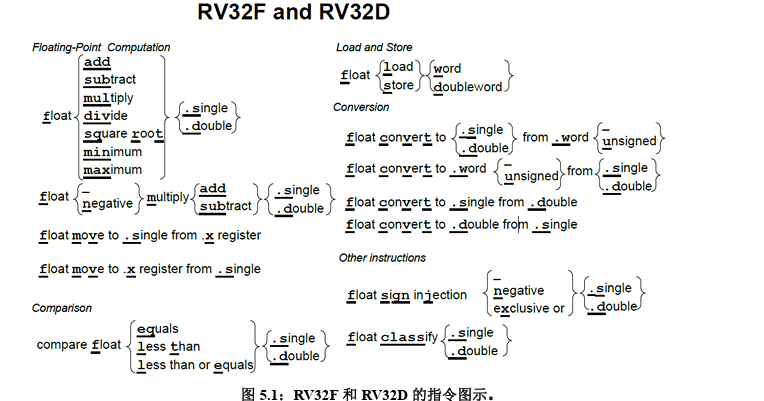
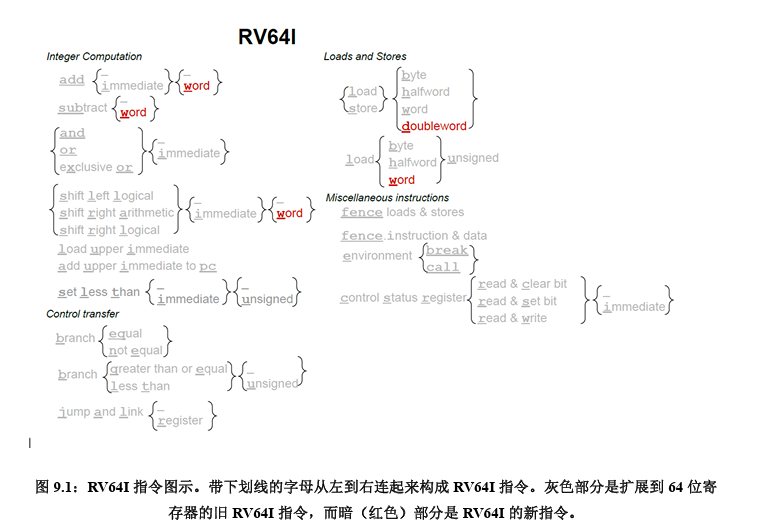
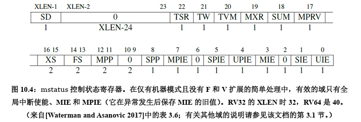

# 为什么要有RISC-V？ 
## 模块化与增量型ISA
计算机体系结构的传统方法是增量ISA，新处理器不仅必须实现新的ISA扩展，还必须实现过去的所有扩展。目的是为了保持向后的二进制**兼容性**，这样几十年前程序的二进制版本仍然可以在最新的处理器上正确运行。这一要求与来自于同时发布新指令和新处理器的营销上的诱惑共同导致了ISA的体量随时间大幅增长。
RISC-V的不同寻常之处，除了在于它是最近诞生的和开源的以外，还在于：和几乎所有以往的ISA不同，它是**模块化**的。它的核心是一个名为RV32I的基础ISA，运行一个完整的软件栈。RV32I是固定的，永远不会改变。这为编译器编写者，操作系统开发人员和汇编语言程序员提供了稳定的目标。模块化来源于可选的标准扩展，根据应用程序的需要，硬件可以包含或不包含这些扩展。这种模块化特性使得RISC-V具有了袖珍化、低能耗的特点，而这对于嵌入式应用可能至关重要。RISC-V编译器得知当前硬件包含哪些扩展后，便可以生成当前硬件条件下的最佳代码。惯例是把代表扩展的字母附加到指令集名称之后作为指示。例如，RV32IMFD将乘法（RV32M），单精度浮点（RV32F）和双精度浮点
（RV32D）的扩展添加到了基础指令集（RV32I）中。 

## ISA 设计 101
计算机架构师在设计ISA时的基本原则和必须做出的权衡是有用的。如下的列表列出了七种衡量标准。页边放置了对应的七个图标，以突出显示RISC-V在随后章节中应对它们的实例。
⚫ 成本（美元硬币） 
⚫ 简洁性（轮子） 
⚫ 性能（速度计） 
⚫ 架构和具体实现的分离（分开的两个半圆） 
⚫ 提升空间（手风琴） 
⚫ 程序大小（相对的压迫着一条线的两个箭头） 
⚫ 易于编程/编译/链接（儿童积木“像ABC一样简单”） 
# RV32I：RISC-V基础整数指令集 
对于每幅图，将有下划线的字母从左到右连接起来，即可组成完整的RV32I指令集。对于每一个图，集合标志{}内列举了指令的所有变体，变体用加下划线的字母或下划线字符_表示。特别的，下划线字符_表示对于此指令变体不需用字符表示。例如，下图表示了这四个RV32I指令：slt，slti，sltu，sltiu: 

我们使用这些图（下面几章的第一个图），旨在对本章的指令给出一个进行快速、深入的
概述。
##  RV32I 指令格式
下图显示了六种基本指令格式，分别是：用于寄存器-寄存器操作的R类型指令，用于短立即数和访存load操作的I型指令，用于访存store操作的S型指令，用于条件跳转操作的B类型指令，用于长立即数的U型指令和用于无条件跳转的J型指令。

即使是指令格式也能从一些方面说明RISC-V 更简洁的ISA设计能提高提高性能功耗比。首先，指令只有六种格式，并且所有的指令都是32位长，这简化了指令解码。第二，RISC-V指令提供三个寄存器操作数。。第三，在RISC-V中对于所有指令，要读写的寄存器的标识符总是在同一位置，意味着在解码指令之前，就可以先开始访问寄存器。第四，这些格式的立即数字段总是符号扩展，符号位总是在指令中最高位。

## RV32I 寄存器
下图列出了RV32I寄存器以及由RISC-V 应用程序二进制接口（ABI）所定义的寄存器名称。在我们的示例代码中，我们将使用ABI名称，使它们更容易阅读。为了满足汇编语言程序员和编译器编写者，RV32I有31寄存器加上一个值恒为0的x0寄存器。与之相比，ARM-32只有16个寄存器，x86-32甚至只有8 个寄存器。 

##  RV32I 整数计算 
简单的算术指令（add, sub）、逻辑指令（and, or, xor），以及移位指令（sll, srl, sra）和其他 ISA 差不多。他们从寄存器读取两个32位的值，并将32位结果写入目标寄存器。RV32I还提供了这些指令的立即数版本。和ARM-32不同，立即数总是进行符号扩展，这样子如果需要，我们可以用立即数表示负数，正因为如此，我们并不需要一个立即数版本的sub。 

程序可以根据比较结果生成布尔值。为应对这种使用场景下，RV32I提供一个当小于时置位的指令。如果第一个操作数小于第二个操作数，它将目标寄存器设置为1，否则为0。不出所料，对这个指令，有一个有符号版本（slt）和无符号版本（sltu），分别用于处理有符号和无符号整数比较。相应的，上述两条指令也有立即数版本的（slti，sltiu）。正如我们将要看到的，虽然RV32I分支指令可以检查两个寄存器之间的所有关系，但一些条件表达式涉及多对寄存器之间的关系。对于这些表达式，编译器或汇编语言程序员可以将slt 以及与或异或等逻辑指令组合使用来解决更复杂的条件表达式。 

剩下的两条整数计算指令主要用于构造大的常量数值和链接。加载立即数到高位（lui）将20位常量加载到寄存器的高20位。接着便可以使用标准的立即指令来创建32位常量。这样子，仅使用2条32位RV32I指令，便可构造一个32位常量。向PC高位加上立即数（auipc）让我们仅用两条指令，便可以基于当前PC以任意偏移量转移控制流或者访问数据。将auipc中的20位立即数与jal中12位立即数的组合，我们可以将执行流转移到任何32位PC相对地址。而auipc加上普通加载或存储指令中的12位立即数偏移量，使我们可以访问任何32位PC相对地址的数据。 
## RV32I 的 Load和Store 
提供32位字（lw，sw）的加载和存储外，RV32I 支持加载有符号和无符号字节和半字（lb，lbu，lh，lhu）和存储字节和半字（sb，sh）。有符号字节和半字符号扩展为32位再写入目的寄存器。即使是自然数据类型更窄，低位宽数据也是被扩展后再处理，这使得后续的整数计算指令能正确处理所有的32位。在文本和无符号整数中常用的无符号字节和半字，在写入目标寄存器之前都被无符号扩展到32位。 

##  RV32I 条件分支
RV32I 可以比较两个寄存器并根据比较结果上进行分支跳转。比较可以是：相等（beq），不相等 （bne），大于等于（bge），或小于（blt）。最后两种比较有符号比较，RV32I也提供相应的无符号版本比较的：bgeu和bltu。剩下的两个比较关系（大于和小于等于）可以通过简单地交换两个操作数，即可完成比较。因为x < y表示y > x且x ≥ y表示y ≤ x。 

## RV32I 无条件跳转
跳转并链接指令（jal）具有双重功能。若将下一条指令PC + 4的地址保存到目标寄存器中，通常是返回地址寄存器ra，便可以用它来实现过程调用。如果使用零寄存器（x0）替换ra作为目标寄存器，则可以实现无条件跳转，因为x0不能更改。像分支一样，jal将其20位分支地址乘以2，进行符号扩展后再添加到PC上，便得到了跳转地址。 
跳转和链接指令的寄存器版本（jalr）同样是多用途的。它可以调用地址是动态计算出来的函数，或者也可以实现调用返回（只需ra作为源寄存器，零寄存器（x0）作为目的寄存器）。Switch和case语句的地址跳转，也可以使用jalr指令，目的寄存器设为x0。  
##  RV32I 杂项
控制状态寄存器指令 (csrrc、csrrs、csrrw、csrrci、csrrsi、csrrwi)，使我们可以轻松地访问一些程序性能计数器。对于这些64位计数器, 我们一次可以读取32位。这些计数器包括了系统时间, 时钟周期以及执行的指令数目。 

在RISC-V指令集中，ecall指令用于向运行时环境发出请求，例如系统调用。调试器使用ebreak指令将控制转移到调试环境。 

fence 指令对外部可见的访存请求，如设备I / O和内存访问等进行串行化。外部可见指对处理器的其他核心、线程，外部设备或协处理器可见。fence.i指令同步指令和数据流。在执行fence.i指令之前，对于同一个硬件线程，RISC-V不保证用存储指令写到内存指令区的数据可以被取指令取到。 

# RISC-V汇编语言

## 函数调用规范（Calling convention） 
函数调用过程通常分为6个阶段。 
1. 将参数存储到函数能够访问到的位置； 
2. 跳转到函数开始位置（使用RV32I的jal指令）； 
3. 获取函数需要的局部存储资源，按需保存寄存器； 
4. 执行函数中的指令； 
6. 返回调用函数的位置（使用ret指令）。 

为了获得良好的性能，变量应该尽量存放在寄存器而不是内存中，但同时也要注意避免频繁地保存和恢复寄存器，因为它们同样会访问内存。 

RISC-V 有足够多的寄存器来达到两全其美的结果：既能将操作数存放在寄存器中，同时也能减少保存和恢复寄存器的次数。其中的关键在于，在函数调用的过程中不保留部分寄存器存储的值，称它们为临时寄存器；另一些寄存器则对应地称为保存寄存器。不再调用其它函数的函数称为叶函数。当一个叶函数只有少量的参数和局部变量时，它们可以都被存储在寄存器中，而不会“溢出（spilling）”到内存中。但如果函数参数和局部变量很多，程序还是需要把寄存器的值保存在内存中，不过这种情况并不多见。 

函数调用中其它的寄存器，要么被当做保存寄存器来使用，在函数调用前后值不变；要么被当做临时寄存器使用，在函数调用中不保留。函数会更改用来保存返回值的寄存器，因此它们和临时寄存器类似；用来给函数传递参数的寄存器也不需要保留，因此它们也类似于临时寄存器。对于其它一些寄存器，调用者需要保证它们在函数调用前后保持不变：比如用于存储返回地址的寄存器和存储栈指针的寄存器。图列出了寄存器的RISC-V应用程序二进制接口（ABI）名称和它们在函数调用中是否保留的规定。

## 汇编器 
在 Unix 系统中，这一步的输入是以.s 为后缀的文件，比如 foo.s；在 MS-DOS 中则是.ASM。 

汇编器的作用不仅仅是从处理器能够理解的指令产生目标代码，还能翻译一些扩展指令，这些指令对汇编程序员或者编译器的编写者来说通常很有用。这类指令在巧妙配置常规指令的基础上实现，称为伪指令。图3.3和3.4列出了RISC-V伪指令，前者中要求x0寄存器始终为0，后者中则没有这种要求。例如，之前提到的ret实际上是一个伪指令，汇编器会用jalr x0, x1, 0 来替换它（见图3.3）。大多数的RISC-V伪指令依赖于x0。因此，把一个寄存器硬编码为0便于将许多常用指令——如跳转（jump）、返回（return）、等于 0时转移（branch on equal to zero）——作为伪指令，进而简化RISC-V指令集。 

汇编程序的开头是一些汇编指示符（assemble directives）。它们是汇编器的命令，具有告诉汇编器代码和数据的位置、指定程序中使用的特定代码和数据常量等作用。图3.9是RISC-V 的汇编指示符。其中图3.6中用到的指示符有： 
⚫ .text：进入代码段。 
⚫ .align 2：后续代码按22字节对齐。 
⚫ .globl main：声明全局符号“main”。 
⚫ .section .rodata：进入只读数据段 
⚫ .balign 4：数据段按4字节对齐。 
⚫ .string “Hello, %s!\n”：创建空字符结尾的字符串。 
⚫ .string “world”：创建空字符结尾的字符串。

图3.3

图3.4

##  链接器 
链接器允许各个文件独立地进行编译和汇编，这样在改动部分文件时，不需要重新编译全部源代码。链接器把新的目标代码和已经存在的机器语言模块（如函数库）等“拼接”起来。
图3.10 展示了一个典型的 RISC-V 程序分配给代码和数据的内存区域，链接器需要调整对象文件的指令中程序和数据的地址，使之与图中地址相符。如果输入文件中的是与位置无关的代码（PIC），链接器的工作量会有所降低。PIC中所有的指令转移和文件内的数据访问都不受代码位置的影响。如第2章所言，RV32I的相对转移（PC-relative branch）特性使得程序更易于实现PIC。 

RISC-V 编译器支持多个ABI，具体取决于F和D扩展是否存在。RV32的ABI分别名为ilp32，ilp32f 和 ilp32d。ilp32 表示 C 语言的整型（int），长整型（long）和指针（pointer）都是32位，可选后缀表示如何传递浮点参数。在lip32中，浮点参数在整数寄存器中传递；在ilp32f 中，单精度浮点参数在浮点寄存器中传递；在ilp32d中，双精度浮点参数也在浮点寄存器中传递。 
自然，如果想在浮点寄存中传递浮点参数，需要相应的浮点ISA添加F或D扩展。因此要编译RV32I的代码（GCC选项-march=rv32i），必须使用ilp32 ABI（GCC选项-mabi=lib32）。反过来，调用约定并不要求浮点指令一定要使用浮点寄存器，因此RV32IFD 与ilp32，ilp32f 和 ilp32d 都兼容。 
链接器检查程序的ABI是否和库匹配。尽管编译器本身可能支持多种ABI和ISA扩展的组合，但机器上可能只安装了特定的几种库。因此，一种常见的错误是在缺少合适的库的情况下链接程序。在这种情况下，链接器不会直接产生有用的诊断信息，它会尝试进行链接，然后提示不兼容。这种错误常常在从一台计算机上编译另一台计算机上运行的程序（交叉编译）时发生。 

## 静态链接和动态链接
**静态链接**（static linking），在程序运行前所有的库都进行了链接和加载。如果这样的库很大，链接一个库到多个程序中会十分占用内存。另外，链接时库是绑定的，即使它们后来的更新修复了bug，强制的静态链接的代码仍然会使用旧的、有bug的版本。 
为了解决这两个问题，现在的许多系统使用动态链接（dynamic linking），外部的函数在第一次被调用时才会加载和链接。后续所有调用都使用快速链接（fast linking），因此只会产生一次动态开销。每次程序开始运行，它都会按照需要链接最新版本的库函数。另外，如果多个程序使用了同一个动态链接库，库代码在内存中只会加载一次。 

编译器产生的代码和静态链接的代码很相似。其不同之处在于，跳转的目标不是实际的函数，而是一个只有三条指令的存根函数（stub function）。存根函数会从内存中的一个表中加载实际的函数的地址并跳转。不过，在第一次调用时，表中还没有实际的函数的地址，只有一个动态链接的过程的地址。当这个动态链接过程被调用时，动态链接器通过符号表找到实际要调用的函数，复制到内存中，更新记录实际的函数地址的表。后续的每次调用的开销就是存根函数的三条指令的开销。

##  加载器 
运行时，加载器的作用是把这个程序加载到内存中，并跳转到它开始的地址。如今的“加载器”就是操作系统。换句话说，加载a.out是操作系统众多的任务之一。 动态链接程序的加载稍微有些复杂。操作系统不直接运行程序，而是运行一个动态链接器，再由动态链接器开始运行程序，并负责处理所有外部函数的第一次调用，把它们加载到内存中，并且修改程序，填入正确的调用地址。

# 乘法和除法指令 

RV32M向RV32I中添加了整数乘法和除法指令。图4.1是RV32M扩展指令集的图形表示，图4.2列出了它们的操作码。 除法是直截了当的。可以回想起如下的式子： 
**商=(被除数−余数)÷除数**
或者 
**被除数=除数×商+余数**
**余数=被除数−(商×除数)**
RV32M具有有符号和无符号整数的除法指令：divide(div)和divide unsigned(divu)，它们将
商放入目标寄存器。在少数情况下，程序员需要余数而不是商，因此RV32M提供
remainder(rem)和 remainder unsigned(remu)，它们在目标寄存器写入余数，而不是商。

图4.1

乘法的式子很简单： 
**积=被乘数×乘数**
它比除法要更为复杂，是因为积的长度是乘数和被乘数长度的和。将两个32位数相乘得到的是64位的乘积。为了正确地得到一个有符号或无符号的64位积，RISC-V中带有四个乘法指令。要得到整数32位乘积（64位中的低32位）就用mul指令。要得到高32位，如果操作数都是有符号数，就用mulh指令；如果操作数都是无符号数，就用mulhu指令；如果一个有符号一个无符号，可以用mulhsu指令。在一条指令中完成把64位积写入两个32位寄存器的操作会使硬件设计变得复杂，所以RV32M需要两条乘法指令才能得到一个完整的64位积。 
对许多微处理器来说，整数除法是相对较慢的操作。如前述，除数为2的幂次的无符号除法可以用右移来代替。事实证明，通过乘以近似倒数再修正积的高32位的方法，可以优化除数为其它数的除法。例如，图4.3显示了3为除数的无符号除法的代码。

# RV32F和RV32D：单精度和双精度浮点数
尽管RV32F和RV32D 是分开的，单独的可选指令集扩展，他们通常是包括在一起的。为简洁起见，我们在一章中介绍了几乎所有的单精度和双精度（32位和64位）浮点指令。图5.1 是一个 RV32F和RV32D扩展指令集的图形表示。图5.2列出 RV32F的操作码，图5.3 列出了RV32D的操作码。和几乎所有其他现代ISA一样，RISC-V服从IEEE 754-2008浮点标准。

##  浮点寄存器
RV32F 和 RV32D 使用 32 个独立的f寄存器而不是x寄存器。使用两组寄存器的主要原因是：处理器在不增加RISC-V指令格式中寄存器描述符所占空间的情况下使用两组寄存器来将寄存器容量和带宽是乘2，这可以提高处理器性能。使用两组寄存器对RISC-V指令集的主要影响是，必须要添加新的指令来加载和存储数据f寄存器，还需要添加新指令用于在x和f寄存器之间传递数据。图5.4列出了RV32D和RV32F寄存器及对应的由RISC-V ABI 确定的寄存器名称。

如果处理器同时支持RV32F和RV32D扩展，则单精度数据仅使用f寄存器中的低32位。与RV32I中的x0不同，寄存器f0不是硬连线到常量0，而是和所有其他31个 f寄存器一样，是一个可变寄存器。 

##  浮点加载，存储和算术指令
对于RV32F 和 RV32D，RISC-V 有两条加载指令（flw，fld）和两条存储指令（fsw，fsd）。他们和lw和sw拥有相同的寻址模式和指令格式。添加到标准算术运算中的指令有：
（fadd.s，fadd.d，fsub.s，fsub.d，fmul.s，fmul.d，fdiv.s，fdiv.d）， RV32F 和 RV32D
还包括平方根（fsqrt.s，fsqrt.d）指令。它们也有最小值和最大值指令（fmin.s，fmin.d，
fmax.s，fmax.d）， 这些指令在不使用分支指令进行比较的情况下，将一对源操作数中的较
小值或较大值写入目的寄存器。 

许多浮点算法（例如矩阵乘法）在执行完乘法运算后会立即执行一条加法或减法指令。因此，RISC-V提供了指令用于先将两个操作数相乘然后将乘积加上（fmadd.s，fmadd.d）或减去（fmsub.s，fmsub.d）第三个操作数，最后再将结果写入目的寄存器。它还有在加上或减去第三个操作数之前对乘积取反的版本：fnmadd.s，fnmadd.d，fnmsub.s，fnmsub.d。
这些融合的乘法 - 加法指令比单独的使用乘法及加法指令更准确，也更快，因为它们只（在加法之后）舍入过一次，而单独的乘法及加法指令则舍入了两次（先是在乘法之后，然后在加法之后）。这些指令需要一条新指令格式指定第4个寄存器，称为R4。图5.2和5.3显示了R4格式，它是R格式的一个变种。 
RV32F和RV32D没有提供浮点分支指令，而是提供了浮点比较指令，这些根据两个浮点的比较结果将一个整数寄存器设置为1或0：feq.s，feq.d，flt.s，flt.d，fle.s，fle.d。

##  其他浮点指令
RV32F 和 RV32D 提供了不寻常的指令，有助于编写数学库以及提供有用的伪指令。
第一个是符号注入指令，它从第一个源操作数复制了除符号位之外的所有内容。符号位
的取值取决于具体是什么指令： 
1. 浮点符号注入（fsgnj.s，fsgnj.d）：结果的符号位是rs2的符号位。 
2. 浮点符号取反注入（fsgnjn.s，fsgnjn.d）：结果的符号位与rs2的符号位相反。 
3. 浮点符号异或注入（fsgnjx.s，fsgnjx.d）： 结果符号位是rs1和rs2的符号位异或的结果。 

# 原子指令
RV32A 有两种类型的原子操作： 
⚫ 内存原子操作（AMO） 
⚫ 加载保留/条件存储（load reserved / store conditional） 

AMO指令对内存中的操作数执行一个原子操作，并将目标寄存器设置为操作前的内存值。原子表示内存读写之间的过程不会被打断，内存值也不会被其它处理器修改。 加载保留和条件存储保证了它们两条指令之间的操作的原子性。加载保留读取一个内存字，存入目标寄存器中，并留下这个字的保留记录。而如果条件存储的目标地址上存在保留记录，它就把字存入这个地址。如果存入成功，它向目标寄存器中写入0；否则写入一个非0 的错误代码。 
为什么RV32A要提供两种原子操作呢？因为实际中存在两种不同的使用场景。 
编程语言的开发者会假定体系结构提供了原子的比较-交换（compare-and-swap）操作：比较一个寄存器中的值和另一个寄存器中的内存地址指向的值，如果它们相等，将第三个寄存器中的值和内存中的值进行交换。这是一条通用的同步原语，其它的同步操作可以以它为基础来完成。 

尽管将这样一条指令加入ISA 看起来十分有必要，它在一条指令中却需要3个源寄存器和1个目标寄存器。源操作数从两个增加到三个，会使得整数数据通路、控制逻辑和指令格式都变得复杂许多。（RV32FD 的多路加法（multiply-add）指令有三个源操作数，但它影响的是浮点数据通路，而不是整数数据通路。）不过，加载保留和条件存储只需要两个源寄存器，用它们可以实现原子的比较交换（见图6.3的上半部分）。 

另外还提供 AMO 指令的原因是，它们在多处理器系统中拥有比加载保留/条件存储更好的可扩展性，例如可以用它们来实现高效的归约。AMO指令在于I/O设备通信时也很有用，可以实现总线事务的原子读写。这种原子性可以简化设备驱动，并提高I/O性能。图6.3的下半部分展示了如何使用原子交换实现临界区。

# 压缩指令
以前的ISA为了缩短代码长度而显著扩展了指令和指令格式的数量，比如添加了一些只有两个操作数的指令，减小立即数域，等等。ARM和MIPS为了能缩小代码，重新设计了两遍指令集，ARM设计出了ARM Thumb和Thumb 2，MIPS先后设计出了MIPS16和microMIPS。这些新的ISA为处理器和编译器增加了负担，同时也增加了汇编语言程序员的认知负担。 

RV32C 采用了一种新颖的方法：每条短指令必须和一条标准的32位RISC-V指令一一对应。此外，16位指令只对汇编器和链接器可见，并且是否以短指令取代对应的宽指令由它们决定。编译器编写者和汇编语言程序员可以幸福地忽略RV32C指令及其格式，他们能感知到的则是最后的程序大小小于大多数其它ISA的程序。图7.1是RV32C扩展指令集的图形化表示。 

为了能在一系列的程序上得到良好的代码压缩效果，RISC-V架构师精心挑选了RVC扩展中的指令。同时，基于以下的三点观察，架构师们成功地将指令压缩到了16位。第一，对十个常用寄存器（a0-a5，s0-s1，sp以及ra）访问的频率远超过其他寄存器；第二，许多指令的写入目标是它的源操作数之一；第三，立即数往往很小，而且有些指令比较喜欢某些特定的立即数。因此，许多RV32C指令只能访问那些常用寄存器；一些指令隐式写入源操作数的位置；几乎所有的立即数都被缩短了，load和store操作只使用操作数整数倍尺寸的无符号数偏移量。

# 向量
当存在大量数据可供应用程序同时计算时，我们称之为数据级并行性。数组是一个常见的例子。虽然它是科学应用的基础，但它也被多媒体程序使用。前者使用单精度和双精度浮点数据，后者通常使用8位和16位整数数据。 
最著名的数据级并行架构是单指令多数据(SIMD，Single Instruction Multiple Data)。SIMD 最初的流行是因为它将64位寄存器的数据分成许多个8位、16位或32位的部分，然后并行地计算它们。操作码提供了数据宽度和操作类型。数据传输只用单个（宽）SIMD寄存器的load和store进行。 

把现有的64位寄存器进行拆分的做法由于其简单性而显得十分诱人。为了使SIMD更快，架构师随后加宽寄存器以同时计算更多部分。由于SIMD ISA属于增量设计阵营的一员，并且操作码指定了数据宽度，因此扩展SIMD寄存器也就意味着要同时扩展SIMD指令集。将SIMD寄存器宽度和SIMD指令数量翻倍的后续演进步骤都让ISA走上了复杂度逐渐提升的道路，这一后果由处理器设计者、编译器编写者和汇编语言程序员共同承担。 

## 向量计算指令 

前面章节提到的每一个整数和浮点计算指令基本都有对应的向量版本：图8.1中的指令继承了来自RV32I、RV32M、RV32F、RV32D和RV32A的操作。每个向量指令都有几种类型，具体取决于源操作数是否都是向量（.vv后缀），或者源操作数包含一个向量和一个标量（.vs后缀）。一个标量后缀意味着有一个操作数来自x或f寄存器，另一个来自向量寄存器（v）。比方说，我们的DAXPY程序（见第55页第五章图5.7）计算𝑌=𝑎×𝑋+𝑌。其中𝑋和𝑌是向量，𝑎是标量。对于向量-标量操作，rs1域指定了要访问的标量寄存器。 

对诸如减法和除法之类的非对称运算，他们还会使用向量指令的第三种变体。其中第一个操作数是标量，第二个是向量（.sv后缀）。像𝑌=𝑎−𝑋这样的操作就会使用这种变体。这种变体对于加法和乘法等对称运算来说是多余的，因此这些指令没有.sv的版本。融合的（fused）乘法-加法指令有三个操作数，因此它们有着最多的向量和标量选项的组合：.vvv、.vvs，.vsv和.vss。 
 
## 向量寄存器和动态类型
RV32V 添加了32个向量寄存器，它们的名称以v开头，但每个向量寄存器的元素个数不同。该数量取决于操作的宽度和专用于向量寄存器的存储大小，而这取决于处理器的设计者。比方说，如果处理器为向量寄存器分配了4096个字节，则这足以让这些32个向量寄存器中有16个64位元素，或者32个32位元素，或者64个16位元素，或128个8位元素。 

为了在向量ISA中保持元素数量的灵活性，向量处理器会计算会最大向量长度（mvl），即在给定的容量限制下，向量程序使用这个向量寄存器可以运算的最大向量长度。向量长度寄存器（vl）为特定操作设定了向量中含有的元素数量，这有助于数组维度不是mvl的整数倍时的编程。我们将在下面的小节
为了避免上下文切换时间过慢，英特尔尽量避免在原始 MMX SIMD扩展中添加寄存器。它只是重用现有的浮点寄存器，这意味着没有额外的上下文切换，但程序无法同时出现浮点和多媒体指令。 每个load 和 store 指令都有一个7位的无符号立即数偏移量。它对于load 按照目标寄存器的元素类型进行缩放，而对于 store 则按源寄存器缩放。存器（vpi）的应用。 

RV32V 采用了一种新颖的方法，即将数据类型和长度与向量寄存器而不是与指令操作码相关联。程序在执行向量计算指令之前用它们的数据类型和宽度标记向量寄存器。使用动态寄存器类型会减少向量指令的数量。这一点很重要，因为每个向量指令通常有六个整数版本和三个浮点版本，如图8.1所示。我们将在第8.9节看到，当我们面对众多的SIMD指令时，使用动态寄存器类型的向量架构减少了汇编语言程序员的认知负担以及编译器生成代码的难度。 

动态类型的另一个优点是程序可以禁用未使用的向量寄存器。此功能可以将所有的向量存储器分配给已启用的向量寄存器。比如，假设只启用了两个64位浮点类型的向量寄存器，处理器有1024字节的向量寄存器空间。处理器将这些空间对半分，给每个向量寄存器512 字节（512/8=64个元素），因此将mvl设置位64。因此我们可以看到，mvl是动态的，但它的值由处理器设置，不能由软件直接改变。 
源寄存器和目标寄存器决定了操作的类型和大小以及结果，因此动态类型隐含了转换。例如，处理器可以将双精度浮点数的向量乘以单精度标量，而无需先将操作数转换为相同的精度。这个额外的好处减少了向量指令的总数和实际执行的指令的数量。 

可以用vsetdcfg指令来设置向量寄存器的类型。图8.2显示了RV32V可用的向量寄存器类型以及RV64V的更多类型。RV32V要求向量浮点运算也有标量版本。因此，要使用F32类型，你也必须用到RV32FV；要使用F64类型，你也必须用到RV32FDV。RV32V引入了16位浮点类型F16。如果一个实现同时支持RV32V和RV32F，则它必须支持F16和F32类型。

## 向量的Load和Store操作

向量Load和Store操作的最简单情况是处理按顺序存储在内存中的一维数组。向量Load 用以vld指令中地址为起始地址的顺序存储的数据来填充向量寄存器。向量寄存器的数据类型确定数据元素的大小，向量长度寄存器vl中设置了要取的元素数量。向量store执行vld的逆操作。 

例如，如果a0中存有1024，且v0的类型是X32，则vld v0, 0(a0)会生成地址1024，
1028，1032，1036，……直到达到由vl设置的限制。 对于多维数组，某些访问不是顺序的。如果二维数组以行优先序存储，且对列元素进行顺序访问，则相邻列元素之间的地址差正好是行大小。向量架构通过跨步数据传输来支持vlds和vsts数据访问。对于vlds与vsts，虽然可以通过将步长设置为元素大小来达到与vld和vst相同的效果，但vld和vst保证了所有的访问都是顺序的，这可以提供更高的内存带宽。另一个原因是，对于常见的按单位步长访问，使用vld和vst可以缩减代码长度，并减少执行的指令数。毕竟使用vlds和vsts指令来需要指定两个源寄存器，一个给出起始地址，另一个给出以字节为单位的步长，而对于单位步长的访问，多花指令来设置第二个寄存器，无遗是一种浪费。 

例如，假设a0中的起始地址是地址1024，且a1中行的长度是64字节。vlds v0, a0, a1 会将这个地址序列发送到内存：1024,1088(1024+1×64),1152(1024+2×64),1216(1024+3×64)，以此类推，直到向量长度寄存器vl告诉它停止。返回的数据被顺序写入目标向量寄存器的各个元素。

到目前为止，我们都假设该程序在对密集数组进行操作。为了支持稀疏数组，向量架构用vldx和vstx提供索引数据传输。这些指令的一个源寄存器是向量寄存器，另一个是标量寄存器。标量寄存器具有稀疏数组的起始地址，向量寄存器的每个元素包含稀疏数组的非零元素的字节索引。 

假设a0中的起始地址是地址1024，向量寄存器v1在前四个元素中有这些字节索引：16，48，80，160。vldx v0, a0, v1会将这个地址序列发送到内存：1040（1024+16）,1072(1024+48),1104(1024+80),1184(1024+160)。它将返回的数据顺序写入目标向量寄存器的元素中。 以上我们把稀疏数组访问作为索引Load和Store操作的主要支持目标，但是还有许多其他算法通过索引表来间接访问数据。

# RV64：64位地址指令

图9.1 至9.4 是RV32G 指令集的64位版本RV64G指令集的图示。由图可见，要切换到64 位 ISA，ISA 只添加了少数指令。指令集只添加了32 位指令对应的字(word)，双字(doubleword)和长整数(long)版本的指令，并将所有寄存器（包括PC）扩展为64位。因此，RV64I 中的sub操作的是两个64位数字而不是RV32I中的32位数字。RV64很接近RV32但实际上又有所不同;它添加了少量指令同时基础指令做的事情与RV32中稍有不同。 

尽管RV64I有64位地址且默认数据大小为64位，32位字仍然是程序中的有效数据类型。因此，RV64I需要支持字，就像RV32I需要支持字节和半字一样。更具体地说，由于寄存器现在是64位宽，RV64I添加字版本的加法和减法指令：addw，addiw，subw。这些指令将计算结果截断为32位，结果符号扩展后再写入目标寄存器。 RV64I也包括字版本的移位指令（sllw，slliw，srlw，srliw，sraw，sraiw），以获得32位移位结果而不是64位移位结果。要进行 64 位数据传输，RV64 提供了加载和存储双字指令：ld，sd。最后，就像RV32I 中有无符号版本的加载单字节和加载半字的指令，RV64I也有一个无符号版本的加载字：lwu。 
出于类似的原因，RV64需要添加字版本的乘法，除法和取余指令：mulw，divw，divuw，
remw，remuw。为了支持对单字及双字的同步操作，RV64A为其所有的11条指令都添加
了双字版本。 

RV64F和RV64D添加了整数双字转换指令，并称它们为长整数，以避免与双精度浮点数据混淆：fcvt.l.s，fcvt.l.d，fcvt.lu.s，fcvt.lu.d，fcvt.s.l，fcvt.s.lu，fcvt.d.l，fcvt.d.lu.
由于整数x寄存器现在是64位宽，它们现在可以保存双精度浮点数据，因此RV64D增加了两个浮点指令：fmv.x.w和fmv.w.x. 

RV64 和RV32之间基本是超集关系，但是有一个例外是压缩指令。 RV64C取代了一些RV32C 指令，因为其他一些指令对于64位地址可以取得更好的代码压缩效果。RV64C放弃了压缩跳转并链接（c.jal）和整数和浮点加载和存储字指令（c.lw，c.sw，c.lwsp，c.swsp， c.flw，c.fsw，c.flwsp 和 c.fswsp）。在他们的位置，RV64C添加了更受欢迎的字加减指令（c.addw，c.addiw，c.subw）以及加载和存储双字指令（c.ld，c.sd，c.ldsp，c.sdsp）。

# RV32/64特权架构
本章介绍两种新的权限模式：运行最可信的代码的机器模式（machine mode），以及为Linux，FreeBSD和Windows等操作系统提供支持的监管者模式（supervisor mode）。这两种新模式都比用和模式有着更高的权限，

嵌入式系统运行时（runtime）和操作系统用这些新模式的功能来响应外部事件，如网络数据包的到达；支持多任务处理和任务间保护；抽象和虚拟化硬件功能等。鉴于这些主题的广度，为此而编撰的全面的程序员指南会是另外一本完整的书。但我们的这一章节旨在强调RISC-V这部分功能的亮点。

## 简单嵌入式系统的机器模式 

机器模式（缩写为M模式，M-mode）是RISC-V中hart（hardware thread，硬件线程）可以执行的最高权限模式。在M模式下运行的hart对内存，I/O和一些对于启动和配置系统来说必要的底层功能有着完全的使用权。因此它是唯一所有标准RISC-V处理器都必须实现的权限模式。

机器模式最重要的特性是拦截和处理异常（不寻常的运行时事件）的能力。RISC-V将异常分为两类。一类是同步异常，这类异常在指令执行期间产生，如访问了无效的存储器地址或执行了具有无效操作码的指令时。另一类是中断，它是与指令流异步的外部事件，比如鼠标的单击。RISC-V中实现精确例外：保证异常之前的所有指令都完整地执行了，而后续的指令都没有开始执行（或等同于没有执行）。在M模式运行期间可能发生的同步例外有五种： 
⚫ 访问错误异常 当物理内存的地址不支持访问类型时发生（例如尝试写入ROM）。 
⚫ 断点异常 在执行ebreak指令，或者地址或数据与调试触发器匹配时发生。 
⚫ 环境调用异常 在执行ecall指令时发生。 
⚫ 非法指令异常 在译码阶段发现无效操作码时发生。 
⚫ 非对齐地址异常 在有效地址不能被访问大小整除时发生

## 机器模式下的异常处理
八个控制状态寄存器（CSR）是机器模式下异常处理的必要部分： 
⚫ mtvec（Machine Trap Vector）它保存发生异常时处理器需要跳转到的地址。 
⚫ mepc（Machine Exception PC）它指向发生异常的指令。 
⚫ mcause（Machine Exception Cause）它指示发生异常的种类。 
⚫ mie（Machine Interrupt Enable）它指出处理器目前能处理和必须忽略的中断。 
⚫ mip（Machine Interrupt Pending）它列出目前正准备处理的中断。 
⚫ mtval（Machine Trap Value）它保存了陷入（trap）的附加信息：地址例外中出错的地址、发生非法指令例外的指令本身，对于其他异常，它的值为0。 
⚫ mscratch（Machine Scratch）它暂时存放一个字大小的数据。 
⚫ mstatus（Machine Status）它保存全局中断使能，以及许多其他的状态，

处理器在M模式下运行时，只有在全局中断使能位mstatus.MIE置1时才会产生中断.此外，每个中断在控制状态寄存器mie中都有自己的使能位。这些位在mie中的位置对应于图10.3中的中断代码。例如，mie[7]对应于M模式中的时钟中断。控制状态寄存器mip 

图10.5：RISC-V的权限模式和它们的编码 
具有相同的布局，并且它指示当前待处理的中断。将所有三个控制状态寄存器合在一起考虑，如果mstatus.MIE = 1，mie[7] = 1，且mip[7] = 1，则可以处理机器的时钟中断。 
当一个hart发生异常时，硬件自动经历如下的状态转换：
⚫ 异常指令的PC被保存在mepc中，PC被设置为mtvec。（对于同步异常，mepc指向导致异常的指令；对于中断，它指向中断处理后应该恢复执行的位置。） 
⚫ 根据异常来源设置mcause（如图10.3所示），并将mtval设置为出错的地址或者其它适用于特定异常的信息字。 
⚫ 把控制状态寄存器mstatus中的MIE位置零以禁用中断，并把先前的MIE值保留到MPIE中。 
⚫ 发生异常之前的权限模式保留在mstatus的MPP域中，再把权限模式更改为M。图10.5显示了MPP域的编码（如果处理器仅实现M模式，则有效地跳过这个步骤）。 

## 嵌入式系统中的用户模式和进程隔离
必须禁止不可信的代码执行特权指令（如mret）和访问特权控制状态寄存器（如mstatus），因为这将允许程序控制系统。这样的限制很容易实现，只要加入一种额外的权限模式：用户模式（U模式）。这种模式拒绝使用这些功能，并在尝试执行M模式指令或访问CSR的时候产生非法指令异常。其它时候，U模式和M模式的表现十分相似。通过将mstatus.MPP 设置为U（如图10.5所示，编码为0），然后执行mret指令，软件可以从M模式进入U模式。如果在U模式下发生异常，则把控制移交给M模式。 这些不可信的代码还必须被限制只能访问自己那部分内存。实现了M和U模式的处理器具有一个叫做物理内存保护（PMP，Physical Memory Protection）的功能，允许M模式指定U模式可以访问的内存地址。PMP包括几个地址寄存器（通常为8到16个）和相应的配置寄存器。这些配置寄存器可以授予或拒绝读、写和执行权限。当处于U模式的处理器尝试取指或执行load或store操作时，将地址和所有的PMP地址寄存器比较。如果地址大于等于PMP地址i，但小于PMP地址i+1，则PMP i+1的配置寄存器决定该访问是否可以继续，如果不能将会引发访问异常。 图10.7 显示了PMP地址寄存器和配置寄存器的布局。两者都是CSR，地址寄存器名为pmpaddr0到pmpaddrN，其中N+1是实现的PMP个数。地址寄存器右移两位，因为PMP以四字节为单位。配置寄存器密集地填充在CSR中以加速上下文切换，如图10.8所示。PMP的配置由R、W和X位组成，他们分别对于load，store和fetch操作，还有另一个域A，当它为0时禁用此PMP，当它为1时启用。PMP配置还支持其他模式，还可以加锁，[Waterman and Asanovic 2017]中描述了这些功能。

## 现代操作系统的监管者模式
描述的**PMP**方案对嵌入式系统的实现很有吸引力，因为它以相对较低的成本提供了内存保护，但它的一些缺点限制了它在通用计算中的使用。由于PMP仅支持固定数量的内存区域，因此无法对它进行扩展从而适应复杂的应用程序。而且由于这些区域必须在物理存储中连续，因此系统可能产生存储碎片化的问题。另外，PMP不能有效地支持对辅存的分页。 

更复杂的RISC-V处理器用和几乎所有通用架构相同的方式处理这些问题：使用基于页面的**虚拟内存**。这个功能构成了监管者模式（S模式）的核心，这是一种可选的权限模式，旨在支持现代类Unix操作系统，如Linux，FreeBSD和Windows。S模式比U模式权限更高，但比M模式低。与U模式一样，S模式下运行的软件不能使用M模式的CSR和指令，并且受到PMP的限制。默认情况下，发生所有异常的时候，控制权都会被移交到M模式的异常处理程序。但是Unix系统中的大多数例外都应该进行S模式下的系统调用。M模式的异常处理程序可以将异常重新导向S模式，但这些额外的操作会减慢大多数异常的处理速度。因此，RISC-V提供了一种异常委托机制。通过该机制可以选择性地将中断和同步异常交给S模式处理，而完全绕过M模式。 

mideleg（Machine Interrupt Delegation，机器中断委托）CSR 控制将哪些中断委托给S模式。与mip和mie一样，mideleg中的每个位对应于图10.3中相同的异常。
例如，mideleg[5]对应于S模式的时钟中断，如果把它置位，S模式的时钟中断将会移交S模式的异常处理程序，而不是M模式的异常处理程序。 

委托给S模式的任何中断都可以被S模式的软件屏蔽。sie（Supervisor Interrupt  Enable，监管者中断使能）和sip（Supervisor Interrupt Pending，监管者中断待处理）CSR是S模式的控制状态寄存器，他们是mie和mip的子集。它们有着和M模式下相同的布局，但在sie和sip中只有与由mideleg委托的中断对应的位才能读写。那些没有被委派的中断对应的位始终为零。 

M模式还可以通过medeleg CSR将同步异常委托给S模式。该机制类似于刚才提到的中断委托，但medeleg中的位对应的不再是中断，而是图10.3中的同步异常编码。例如，置上medeleg[15]便会把store page fault（store 过程中出现的缺页）委托给S模式。 

请注意，无论委派设置是怎样的，发生异常时控制权都不会移交给权限更低的模式。在M模式下发生的异常总是在M模式下处理。在S模式下发生的异常，根据具体的委派设置，可能由M模式或S模式处理，但永远不会由U模式处理。 S 模式有几个异常处理CSR：sepc、stvec、scause、sscratch、stval和sstatus，它们执行与10.2中描述的M模式CSR相同的功能。图10.9显示了sstatus寄存器的布局。
监管者异常返回指令sret与mret的行为相同，但它作用于S模式的异常处理CSR，而不是M模式的CSR。 

S 模式处理例外的行为已和M模式非常相似。如果hart接受了异常并且把它委派给了S 模式，则硬件会原子地经历几个类似的状态转换，其中用到了S模式而不是M模式的
CSR： 
⚫ 发生例外的指令的PC被存入sepc，且PC被设置为stvec。 
⚫ scause按图10.3根据异常类型设置，stval被设置成出错的地址或者其它特定异常的信息字。 
⚫ 把sstatus CSR中的SIE置零，屏蔽中断，且SIE之前的值被保存在SPIE中。 
⚫ 发生例外时的权限模式被保存在sstatus的SPP域，然后设置当前模式为S模式。

## 基于页面的虚拟内存
S 模式提供了一种传统的虚拟内存系统，它将内存划分为固定大小的页来进行地址转换和对内存内容的保护。启用分页的时候，大多数地址（包括load和store的有效地址和PC中的地址）都是虚拟地址。要访问物理内存，它们必须被转换为真正的物理地址，这通过遍历一种称为页表的高基数树实现。页表中的叶节点指示虚地址是否已经被映射到了真正的物理页面，如果是，则指示了哪些权限模式和通过哪种类型的访问可以操作这个页。

访问未被映射的页或访问权限不足会导致页错误例外（page fault exception）。 

RISC-V 的分页方案以SvX的模式命名,其中X是以位为单位的虚拟地址的长度。RV32 的分页方案Sv32支持4GiB的虚址空间，这些空间被划分为210个4 MiB大小的巨页。每个巨页被进一步划分为210个4 KiB大小的基页（分页的基本单位）。因此，Sv32的页表是基数为210的两级树结构。页表中每个项的大小是四个字节，因此页表本身的大小是4 KiB。页表的大小和每个页的大小完全相同，这样的设计简化了操作系统的内存分配。 

图10.10 显示了Sv32页表项（page-table entry，PTE）的布局，从左到右分别包含如下所述的域： 
⚫ V位决定了该页表项的其余部分是否有效（V = 1时有效）。若V = 0，则任何遍历到此页表项的虚址转换操作都会导致页错误。 
⚫ R、W和X位分别表示此页是否可以读取、写入和执行。如果这三个位都是0，那么这个页表项是指向下一级页表的指针，否则它是页表树的一个叶节点。 
⚫ U位表示该页是否是用户页面。若U = 0，则U模式不能访问此页面，但S模式可以。若U = 1，则U模式下能访问这个页面，而S模式不能。 
⚫ G位表示这个映射是否对所有虚址空间有效，硬件可以用这个信息来提高地址转换的性能。这一位通常只用于属于操作系统的页面。 
⚫ A位表示自从上次A位被清除以来，该页面是否被访问过。 
⚫ D位表示自从上次清除D位以来页面是否被弄脏（例如被写入）。 
⚫ RSW域留给操作系统使用，它会被硬件忽略。 
⚫ PPN域包含物理页号，这是物理地址的一部分。若这个页表项是一个叶节点，那么PPN是转换后物理地址的一部分。否则PPN给出下一节页表的地址。

RV64 支持多种分页方案，但我们只介绍最受欢迎的一种，Sv39。Sv39使用和Sv32相同的4 KiB大的基页。页表项的大小变成8个字节，所以它们可以容纳更大的物理地址。为了保证页表大小和页面大小一致，树的基数相应地降到29，树也变为三层。Sv39的512 GiB 地址空间划分为29个1 GiB大小的吉页。每个吉页被进一步划分为29个巨页。在Sv39 中这些巨页大小为2 MiB，比Sv32中略小。每个巨页再进一步分为29个4 KiB大小的基页。 
图10.11 显示了Sv39页表项的布局。它和Sv32完全相同，只是PPN字段被扩展到了44 位，以支持56位的物理地址，或者说226 GiB大小的物理地址空间。

一个叫satp（Supervisor Address Translation and Protection，监管者地址转换和保护）
的S模式控制状态寄存器控制了分页系统。如图10.12所示，satp有三个域。MODE域可以开启分页并选择页表级数，图10.13展示了它的编码。ASID（Address Space Identifier，地址空间标识符）域是可选的，它可以用来降低上下文切换的开销。最后，PPN字段保存了根页表的物理地址，它以4 KiB的页面大小为单位。通常M模式的程序在第一次进入S模式之前会把零写入satp以禁用分页，然后S模式的程序在初始化页表以后会再次进行satp 寄存器的写操作。

