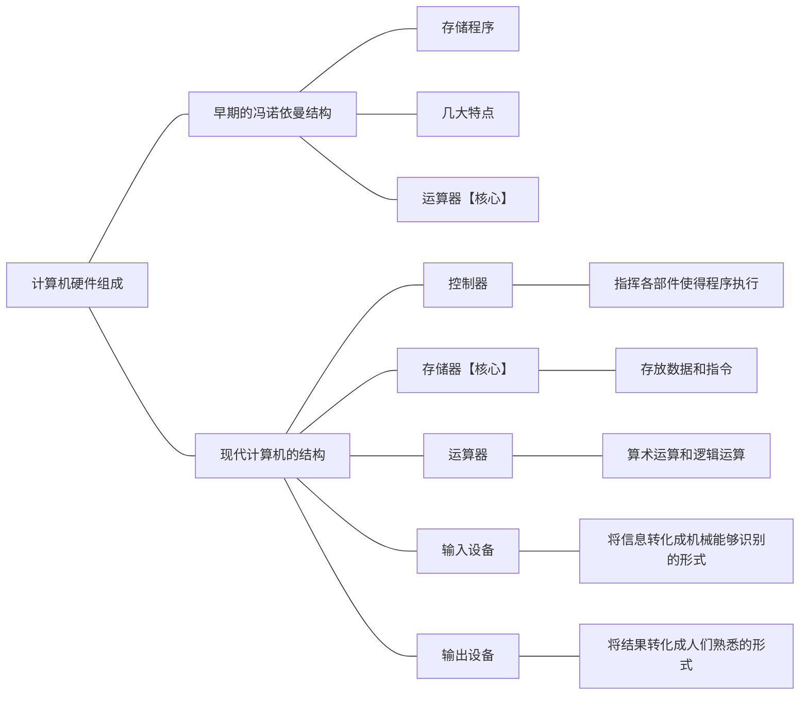
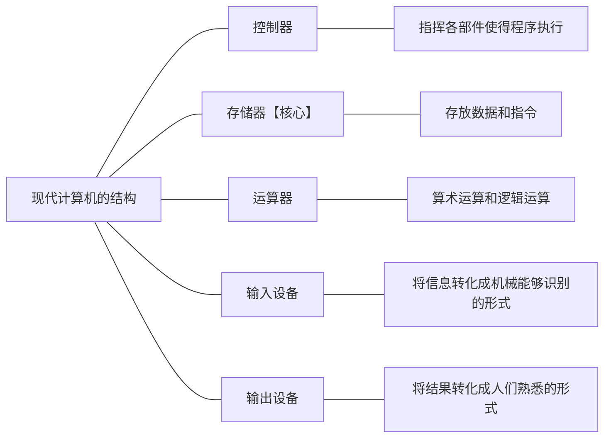
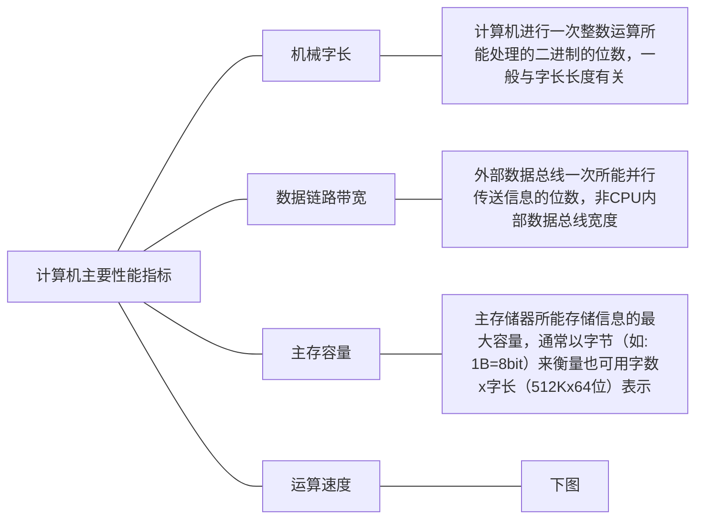
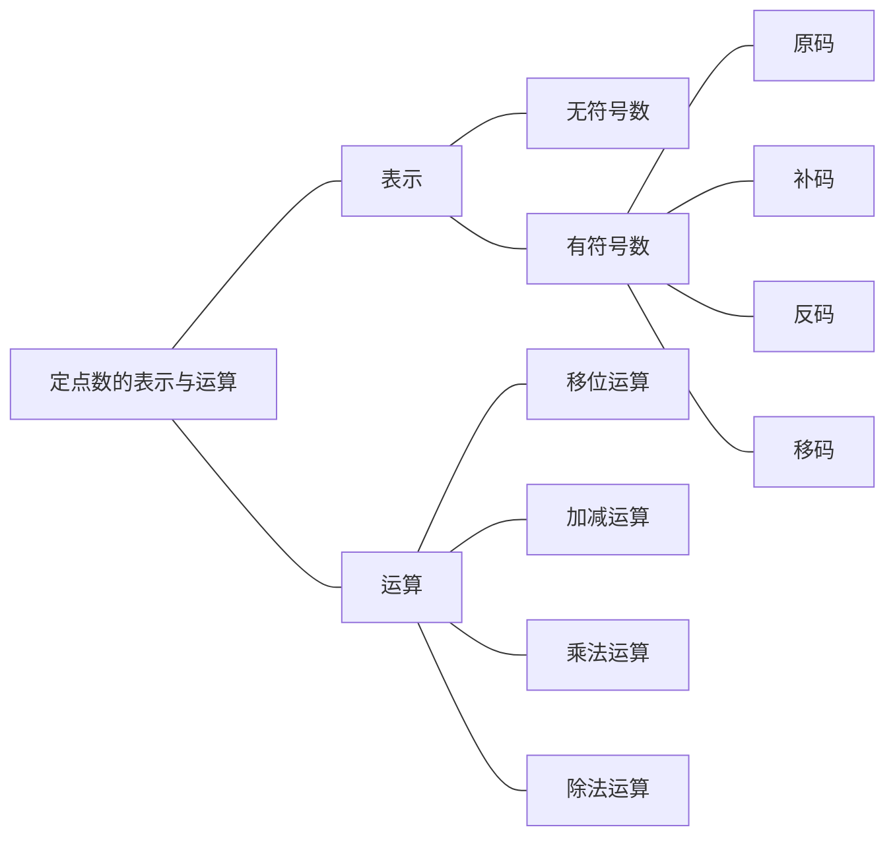

# 绪论

## 计算机硬件结构

### 早期冯诺依曼机
#### 概念
指令以二进制代码的形式事先输入计算机的主存储器，主存里面存贮的不仅有数据还有指令，而且他们的形式都是相同的

**组成部分**
- 存储器:计算机的存储部件，存放程序和数据
- 控制器: 计算机的控制器: 计算机的指挥中心指挥中心
- 运算器: 计算机的执行部件，算术运算 (+、-) 逻辑运算 (与，或，异或等)
- 输出设备: 将计算机处理结果以人类所能接受形式或其他系统所要求的信息形式输出
- 输入设备: 将程序和数据以机器所能识别和接受的信息形式输入计算机

#### 特点
(1)计算机由五大部件组成
(2) 指令和数据以同等地位存储在存储器中，并按地址寻问
(3) 指令和数据均以二进制代码表示
(4)指令由操作码和地址码组成，操作码用来表示操作的性质，地址码用来表示操作数在存储器中的位置
(5)指令在存储器内按顺序存放。通常，指令是顺序执行的，在特定条件下可根据运算结果或根据设定的条件改变执行顺序
(6) 早期的冯·诺依曼机以运算器为中心，输入/输出设备通过运算器与存储器传送数据

### 现代计算机
(1) 以存储器为核心
(2)CPU=运算器+控制器
(3) I/O设备=输入设备+输出设备

**现代计算机体系的抽象**

### 计算机功能部件

#### 存储器

- **存储元**: 即存储二进制的电子元件，每个存储元可存1bit
- **存储单元**: 每个存储单元存放一串二进制代码
- **存储字**: 存储单元中二进制代码的组合
- **存储字长**: 存储单元中二进制代码的位数
- **机器字长**: 计算机能一次处理的二进制代码长度
- **指令字长**: 指令的二进制长度

#### 运算器
- **ACC**:累加器，用于存放操作数，或运算结果
- **MO**:乘商寄存器，在乘、除计算时用于存放操作数或者运算结果
- **X**:通用的操作数寄存器，用于存放操作数
- **ALU**:算术逻辑单元，是运算器的核心

#### 控制器
**概念**
- PC: 程序计数器，存放下一条指令的地址
- IR: 指令寄存器，存放当前正在执行的指令
- CU: 控制单元，分析指令，给出控制信号

**[公式]**
- MAR位数=PC位数，PC所能寻址的范围，就是地址的范围
- MDR位数=IR位数，其实这里的指令也是一种数据。

### 指令的执行
- **CPU**: 中央处理器;PC: 程序计数器;MAR:存储器地址寄存器
- **ALU**: 算术逻辑部件;IR: 指令寄存器;MDR: 存储器数据寄存器
- **GPRs**: 通用寄存器组 (由若干通用寄存器组成，早期就是累加器)

#### 指令的执行
三个阶段: 取指令、分析指令、执行指令
(A) 开始时，将第一条指令地址->PC
(8) (PC) -> MAR，发“读”命令，M(MAR)->MDR，使(MDR)->IR
(C) (PC) +1->PC
(D) 翻译IR的操作性质
(E) 取操作数
(F) 将操作数送往运算器，进行运算
(G) 送结果
    (a) 寄存器
    (b)内存

## 计算机性能指标
### 计算机系统层次

# 数据的表示与运算
## 数据表示
**常见二进制数据**

**真值和机器数**

## 定点数的表示与运算

**概念**
- 点: 其实就是小数点
- 定点数: 小数点的位置固定
- 浮点数: 小数点的位置不固定
- 类似于我们生活中使用的常数
- 二进制浮点数: 类似于科学计数法
**例子** 
定点数: 150.408
浮点数: 1.50408*102
### 定点数的表示
####  无符号数
整个机器字长的全部二进制位均为数值位，没有符号位，相当于数的绝对值

**无符号数的表示范围**
假设我们的计算机是8位的，那么其实我们就可以表示8bit位以内的数据其实也就是:
0000 0000-1111 1111
0-255
如果我们不采用无符号数，那么其实我们能够表示的数据范围就会发生改变其实能够真正表示数据的是不是只有7位了，还有一位我们需要作为符号位。

#### 有符号数
