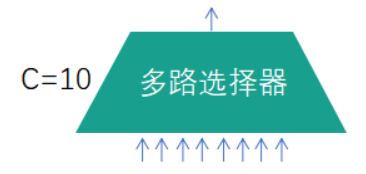
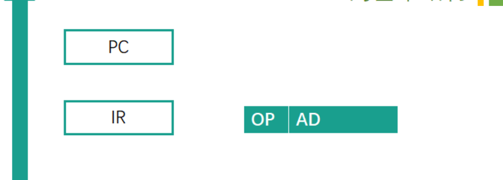

# 绪论

## 计算机硬件结构


### 早期冯诺依曼机
#### 概念
指令以二进制代码的形式事先输入计算机的主存储器，主存里面存贮的不仅有数据还有指令，而且他们的形式都是相同的

**组成部分**
- 存储器:计算机的存储部件，存放程序和数据
- 控制器: 计算机的控制器: 计算机的指挥中心指挥中心
- 运算器: 计算机的执行部件，算术运算 (+、-) 逻辑运算 (与，或，异或等)
- 输出设备: 将计算机处理结果以人类所能接受形式或其他系统所要求的信息形式输出
- 输入设备: 将程序和数据以机器所能识别和接受的信息形式输入计算机


#### 特点
(1)计算机由五大部件组成
(2) 指令和数据以同等地位存储在存储器中，并按地址寻问
(3) 指令和数据均以二进制代码表示
(4)指令由操作码和地址码组成，操作码用来表示操作的性质，地址码用来表示操作数在存储器中的位置
(5)指令在存储器内按顺序存放。通常，指令是顺序执行的，在特定条件下可根据运算结果或根据设定的条件改变执行顺序
(6) 早期的冯·诺依曼机以运算器为中心，输入/输出设备通过运算器与存储器传送数据

### 现代计算机
(1) 以存储器为核心
(2)CPU=运算器+控制器
(3) I/O设备=输入设备+输出设备


**现代计算机体系的抽象**


### 计算机功能部件


#### 存储器


- **存储元**: 即存储二进制的电子元件，每个存储元可存1bit
- **存储单元**: 每个存储单元存放一串二进制代码
- **存储字**: 存储单元中二进制代码的组合
- **存储字长**: 存储单元中二进制代码的位数
- **机器字长**: 计算机能一次处理的二进制代码长度
- **指令字长**: 指令的二进制长度


#### 运算器
- **ACC**:累加器，用于存放操作数，或运算结果
- **MO**:乘商寄存器，在乘、除计算时用于存放操作数或者运算结果
- **X**:通用的操作数寄存器，用于存放操作数
- **ALU**:算术逻辑单元，是运算器的核心


#### 控制器
**概念**
- PC: 程序计数器，存放下一条指令的地址
- IR: 指令寄存器，存放当前正在执行的指令
- CU: 控制单元，分析指令，给出控制信号


**[公式]**
- MAR位数=PC位数，PC所能寻址的范围，就是地址的范围
- MDR位数=IR位数，其实这里的指令也是一种数据。

### 指令的执行
- **CPU**: 中央处理器;PC: 程序计数器;MAR:存储器地址寄存器
- **ALU**: 算术逻辑部件;IR: 指令寄存器;MDR: 存储器数据寄存器
- **GPRs**: 通用寄存器组 (由若干通用寄存器组成，早期就是累加器)


#### 指令的执行
三个阶段: 取指令、分析指令、执行指令
(A) 开始时，将第一条指令地址->PC
(8) (PC) -> MAR，发“读”命令，M(MAR)->MDR，使(MDR)->IR
(C) (PC) +1->PC
(D) 翻译IR的操作性质
(E) 取操作数
(F) 将操作数送往运算器，进行运算
(G) 送结果
    (a) 寄存器
    (b)内存

## 计算机性能指标
### 计算机系统层次


# 数据的表示与运算
## 数据表示
**常见二进制数据**

**真值和机器数**

## 定点数的表示与运算


**概念**
- 点: 其实就是小数点
- 定点数: 小数点的位置固定
- 浮点数: 小数点的位置不固定
- 类似于我们生活中使用的常数
- 二进制浮点数: 类似于科学计数法
**例子** 
定点数: 150.408
浮点数: 1.50408*102
### 定点数的表示
####  无符号数
整个机器字长的全部二进制位均为数值位，没有符号位，相当于数的绝对值

**无符号数的表示范围**
假设我们的计算机是8位的，那么其实我们就可以表示8bit位以内的数据其实也就是:
0000 0000-1111 1111
0-255
如果我们不采用无符号数，那么其实我们能够表示的数据范围就会发生改变其实能够真正表示数据的是不是只有7位了，还有一位我们需要作为符号位。

#### 有符号数
**表示**

约定: 用X表示真值，用【[X]原表示原码，[X]补表示补码，[X]反表示反码，[X]移表示移码
约定: 用X表示真值，用【[X]原表示原码，[X]补表示补码，[X]反表示反码，[X]移表示移码
用尾数 (也就是数值部分) 表示真值的绝对值


#### 定点整数
若机器字长为n+1位，则尾数为n位 
原码整数表示范围:
$-(2^n-1)≤x≤(2^n-1)$


**定点整数的特点**
- 零：0.0000000
- 零：1.0000000

所以0的原码整数在计算机内部有两种表示形式，+0和-0
- 正数:有2n-1个
- 负数:有2n-1个
- 零:有一个
- 总共：2N+1-1个

但是n+1位应该对应有2n+1种状态，真值0其实占用了两种状态，合理

#### 定点小数
- 若机器字长为n+1位，则尾数为n位
原码小数表示范围
$-(1-2^{-n})≤x≤(1-2^{-n})$
- 同样，在这里真值0其实也占用了两种状态也就是有 + 0和-0两种形式
- 其实原码的定点整数和定点小数的分布是关于原点对称的

#### 四码
##### 反码
有符号数的定点表示 (反码)
- 正数: 反码和原码相同
- 负数: 数值位全部取反

**反码特征**:
- 反码整数的表示范围
$-(2^n-1)≤x≤(2^n-1)$
- 反码小数的表示范围
$-(1-2^{-n})≤x≤(1-2^{-n})$
- 同样，在这里无论是小数还是整数，真值0其实也占用了两种状态也就是有 +0和-0两种形式。
- +零 0.0000000 -零 1,1111111
所以0的反码整数在计算机内部也有两种表示形式
**列子**
若机器字长为n+1位，则尾数为n位我们假设机器字长为8位。
+9
[X]原=0,0001001 &emsp; [X]反=0,0001001
-9
[X]原=1,0001001 &emsp; [X]度=1,1110110
+0.75
[X]原=0.1100000 &emsp; [X]反=0.1100000
-0.75
[X]原=1.1100000  &emsp;[X]度=1.0011111

***反码的用途***
(1) 其中一个用途就是“原码”转换成“补码”的一个中间状态
(2) 还可以应用于系统环境设置,如linux平台的目录和文件的默认权限的设置，就是使用反码原理
##### 补码
有符号数的定点表示 (补码)
- 正数: 补码和原码相同
- 负数: 原码数值位全部取反(得到反码),未位+1

**补码特征:**
- [+0]原=0,0000000  &emsp;  [-0]原=1,0000000
[+0]反=0,0000000  &emsp;  [-0]反=1,1111111
[+0]补=0,0000000   &emsp;  [-0]补=0,0000000
- 这里不一样的是，真值0的补码只有一种表示形式，多出来了一个1,0000000
- 补码整数的表示范围
$-2^n-≤x≤(2^n-1)$
- 补码小数的表示范围
$-1≤x≤(1-2^{-n})$
- 规定，补码整数$1,0000000=-2^7$  &emsp;   规定，补码小数1.0000000=-1

**例子**
若机器字长为n+1位，则尾数为n位
我们假设机器字长为8位
+9
[X]原=0,0001001 &emsp; [X]补=0,0001001
-9
[X]原=1,0001001 &emsp; [X]反=1,1110110 &emsp; [X]补=1,1110111
+0.75
[X]原=0.1100000 &emsp; [X]补=0.1100000
-0.75
[X]原=1.1100000 &emsp; [X]反=1.0011111 &emsp; [X]补=1.0100000
##### 移码
有符号数的定点表示(移码) (只有整数)
方法1: 在补码的基础上将符号位取反
方法2: 在真值的基础上加上2n

**移码的特征**
- [+0]补=0,0000000 &emsp; [+0]移=1,0000000
[-0]补=0,0000000 &emsp; [-0]移=1,0000000
- 所以真值0的移码也只有一种表示形式，1,0000000其实就表示0
- 移码的表示范围
$-2^n≤x≤(2^n-1)$

**例子**
若机器字长为n+1位，则尾数为n位 我们假设机器字长为8位。
+9
[X]原=0,0001001 &emsp; [X]补=0,0001001 &emsp; [X]移=1,0001001
-9
[X]原=1,0001001 &emsp; [X]补=1,1110111 &emsp; [X]移=0,1110111

#### 总结


### 定点数的运算
[概念] **移位运算**
算术移位、逻辑移位、循环移位
#### 算术移位
##### 原码
**原码算术右移**:高位补0，低位移除
- 若丢弃位=0，相当于除2,;
- 若丢弃位不等0，会丢失精度;


**原码算术左移**: 符号位不动，数值位低位补0，高位移除
- 若丢弃位=0，相当于*2;
- 若丢弃位不等于0，会出现严重误差

##### 反码
(1) **正数反码算术移位**: (和原码完全相同)
- 符号位不动，对数值位操作。
- 右移:高位补0，低位舍弃;
- 左移: 低位补0，高位舍弃;
- 注意精度和误差

(2)**负数反码算术移位**
- 符号位不动，对数值位操作。
- 右移:高位补1，低位舍弃;
- 左移: 低位补1，高位舍弃;
- 注意精度和误差


##### 补码
(1) **正数补码算术移位**: (和原码完全相同)
- 符号位不动，对数值位操作。
- 右移:高位补0，低位舍弃
- 左移: 低位补0，高位舍弃;
- 注意精度和误差

(2) **负数补码算术移位**
- 符号位不动，对数值位操作
- 右移(同反码): 高位补1，低位舍弃;
- 左移(同原码): 低位补0，高位舍弃:
- 注意精度和误差


##### 总结


#### 逻辑位移
无论什么数:
- 右移:高位补0，低位舍弃;
- 左移: 低位补0，高位舍弃


#### 循环位移


#### 总结


### 加减运算
#### 原码加减法
**概念**
(1)加法器直接对原码进行计算可能会出错
(2) 加法规则:
- 先判断符号位，
    - 若相同，则绝对值相加，结果符号位不变;若不同，则做减法，绝对值大的数减去绝对值小的数，结果的符号与绝对值大的数相同

(3)减法规则:
两个原码表示的数相减，首先将减数符号取反，然后将被减数与符号取反后的减数按原码加法进行运算
(4)运算时注意机器字长，当左边出现溢出时，将溢出位丢掉

**原码的加法运算**
- 正+正一绝对值做加法，结果为正
- 负+负 一绝对值做加法，结果为负
- 正+负 一绝对值大的减绝对值小的，符号同绝对值大的数
- 负+正一绝对值大的减绝对值小的，符号同绝对值大的数

**原码的减法运算**
原码的减法运算，"减数"符号取反，转变为加法
- 正-负一正+正
- 负-正一负+负
- 正-正一正+负
- 负-负一负+正

#### 补码加减法
使用补码进行加法运算,当结果不超过机器的表示范围时,有以下结论:
- 用补码表示的两数进行加法运算,其结果仍为补码;
- [X+Y]补=[X]补土[Y]补(mod2);
- 符号位与数值位一样参与运算
- 符号位与数值位按同样规则一起参与运算，符号位运算产生的进位要丢掉，结果的符号位由运算得

**例子**
(1)X=+13,Y= -14,则[]补=01101,[Y]补=10010
[X+Y]补=01101+10010=11111,因此X+Y=-1
(2)X=+0.1001,Y=-0.0011,则[X]补=0.1001,[Y]补=1.1101
[X+Y]补=0.1001+1.1101=0.0110,因此X+Y=0.0110
(3)X=+11,Y= +4,则[X]补=01011,[Y]补=00100 ,[-Y]补=11100
[X-Y]补= [X]补+[-Y]补=01011+11100=00111,
因此X-Y=7


(1)X=+13,Y=+4,则[X]补=01101,[Y]补=00100
[X+Y]补=01101+00100=10001
从符号位来看是一个负数,显然错误。
(2)X=+0.1001,Y=+0.1001,则[X]补=0.1001,[Y]补=0.1001
X+Y补=0.1001+0.1001=1.0010
从符号位来看是一个负数,显然错误


上述现象称为溢出,即两个定点数经过加减法运算后,结果超出了机器所能表示的范围,此时的结果无效。
因此.在定点加减运算过程中,必须对结果是否溢出进判断。

### 溢出判断
正+正 一结果为负,称为正溢;
负+负 结果为正,称为负溢。
**注意:**
正-负->正+正
负-正->负+负


常用的判别溢出方法有以下3种。
1)符号比较法
2)双进位法
3)双符号位法

#### 采用一位符号位
由于减法运算在机器中是用加法器实现的，因此无论是加法还是减法，只要参加操作的两个数符号相同，结果又与原操作数符号不同，则表示结果溢出

## 浮点数的表示与运算


### 表示
**概念**
定点数: 就是小数点位置不变的数
浮点数: 浮点数是指小数点位置可以浮动的数据，通常表示如下
- N 为浮点数;
- M(Mantissa)为尾数(纯小数)
- E(Exponent)为阶码(整数)
- R(Radix)称为阶的基数(底),而且R为一常数(与尾数的基数相同)


- R: 一般为2、8或16。在一台计算机中,所有数据的R 都是相同的,因此不需要在每个数据中表
示出来。
- 阶码: 常用补码或移码表示的定点整数
- 尾数: 常用原码或补码表示的定点小数
- RE: 就是让小数点移动

**浮点数表示范围**
设浮点数阶码的数值位取n位,尾数的数值位取m位,两者均用补码表示,M.表示尾数的符号位,当浮点数为非规格化数时,它在数轴上的表示范围如下图所示(注意:“上溢”、“下溢”(机器零) )。


[概念] 浮点数的规格化:
规定浮点数的尾数部分必须为纯小数,且当尾数的值不为0时,其绝对值应大于等于十进制数的0.5,称为浮点数的规化表示 (0.1*\*\*和1.0\*\**的形式)
当浮点数的尾数不满足要求时,需要左移或右移尾数,同时对阶码进行修改,使之符合规格化的要求,这一过程称为规格化操作。
在规格化过程中,尾数每向左算术移位1次阶码减1.称为向左规格化.简称**左规**:尾数每向右移一位,则阶码加1,称为向右规格化,简称**右规**

什么情况下进行尾数的规格化?
**左规**: 当浮点数运算的结果为非规格化时要进行规格化处理,将尾数算数左移一位，阶码减1
**右规**: 当浮点数运算的结果尾数出现溢出 (双符号位为01或10),将尾数算数右移一位，阶码加1

### IEEE 754
现代计算机中,浮点数一般采用IEEE754国际标准。标准中规定常用的浮点数有单精度和双精度两种形式
格式如下:
||符号位| 阶码|尾数|总位数|
|-------|------|------|------|------|
|单精度|1|8|23|32|
|双精度|1|11|52|64|


阶码用移码表示，真值都被加上一个偏移量，单精度采用的是移127的移码方案，双精度采用的是移1023的
移码方案。(为什么是127? )

在移127的移码方案中，8位移码结果不再与8位补码存在仅符号位相反的对应关系，其值要通过对阶码实际
值加127得到，或将标准移码的值再减1得到。

尾数采用原码表示，对规格化的非0值尾数使用隐藏位技术，即非零值的规格化浮点数的尾数最高位始终为
1，这一位不予存储，而认为隐含在小数点的左边，这是通过左移原来的尾数实现的，故可以使结果的表示
精度多一个二进制位，此时它所表示的实际值在1-2之间，若尾数是 M，则此时所表示的值是1.M(天然的规
格化)。


最小绝对值:尾数全为0，阶码真值最小-126，对应移码机器数0000 0001 此时整体的真值为(1.0) 2-126
最大绝对值:尾数全为1，阶码真值最大 127，对应移码机器数1111110
此时整体的真值为(1.111...11)X2127


只有1≤E≤254时，(-126-127) 真值=$(-1)^s*1.M*2^{E-127}$
当阶码E全为0，(-127)尾数M不全为0时，表示非规格化小数 $(0.x..x)x2^{-126}$
当阶码E全为0，(-127)尾数M全为0时，表示真值 0
当阶码E全为1，(-128)尾数M全为0时，表示无穷大 
当阶码E全为1，(-128)尾数M不全为0时，表示非数值"NaN”(Not a Number)

### 浮点数加减法

浮点数的加减运算一般分为如下5个操作步骤
1. 对阶
2. 尾数加减
3. 规格化
4. 舍入
5. 判溢出

**例子**
$1.50408*10^6+4.08150*10^4$
1. 对阶 $1.50408*10^6+0.0408150*10^6$
2. 尾数求和 $1.50408+0.0408150=1.5448950$
3. 规格化 15.448950(右规) 0.015448950(左规)
4. 舍入
若规定只能有5位尾数，那么
    - 1.54489501.54489(直接舍弃低位)
    - 1.54489501.54490(舍弃部分大于0，低位 +1)
    - 1.54489501.54490(四舍五入)

5. 判断溢出
规定阶码不能超过10，那么如果出现$1.5448950*10^{10}$就表示溢出
(真正的溢出:在尾数为规格化数的时候，阶码确实大于最大值)
(虚假的溢出: 尾数出现溢出，可以采用规格化进行调整)

**例子**
设X= $2^6 x0.1010000$,Y= $2^7 x0.1101000$,求X+Y
解 设阶码、尾数均采用补码表示形式,双符号位。阶码数值位4位,尾数数值位7位:


||阶符| 阶码| 尾符| 尾数|
|------|------|------|------|------|
|x|00|0110|00|1010000|
|Y|00|0111|00|1101000|

(1)求阶差.对大阶。
阶差$\triangle E=[EX]_补+[-EY]_补=000110+111001=111111$
X 阶码小,MX 算术右移1位,保留阶码$[E]_补=[EY]_补=000111$。
$[Mx]_补=00.01010000$。
(2)尾数相加。
$[M]_补=[MX]_补+[MY]_补=01.00100000$。
(3)规格化操作。双符号位不一致,因此右规,尾数右移一位,阶码加1
$[M]_补=00.1001000 00$
$[E]_补=000111+000001=001000$。
(4)舍入。附加位的最高位为0,舍去,$[M]_补=00.1001000$
(5)判溢出。阶码的双符号位相同.故不溢出。
 
在浮点数加减运算的最后需要对阶码是否溢出进行判断,若未溢出,运算正常结束,若阶码下溢(比能表示的最小数还小时),则将结果置为机器零若阶码上溢,则置溢出标志。
# 存储器系统
## 存储器概述


### 基本概念
- **存储元**: 即存储二进制的电子元件，每个存储元可存1bit
- **存储单元**: 每个存储单元存放一串二进制代码
- **存储字**: 存储单元中二进制代码的组合
- **存储字长**: 存储单元中二进制代码的位数
- **机器字长**: 计算机能一次处理的二进制代码长度
- **指令字长**: 指令的二进制长度


MAR位数对应着存储单元的个数
MDR位数和存储字长相等
$2^{10}=1024=1K$MAR位数=PC位数
### 存储器层次结构
现代计算机要求存储系统满足**大容量**、**高速度**和**低成本**三项基本要求
由干制造工艺限制，很难在同一种存储器中都达到这些要求，三者不可兼得，为此采用分层(级)存储体系
并通过管理软件和辅助硬件将不同性能的存储器组合成有机的整体，称为计算机的存储层次或存储体系


[概念] **高速缓存 (Cache)**
又称快存，用速度较快的存储器构成，可在2ns内可完成一次数据存取，目前容量一般为几MB左右，用来临时
存放指令和数据。
[概念] **主存**
用来存放运行期间的大量程序和数据，目前容量在几GB左右，速度稍慢，可在10ns内完成一次存取
[概念] **辅存** (即辅助存储器，又称外存储器，简称外存)
一般由磁表面存储器、光存储器构成，用来存放系统程序、大型文件、数据库等，目前容量在数百GB左右
速度为ms级。
[概念] **虚拟存储器**
现代计算机通常采用cache一主存一辅存层次结构。
在CPU和主存之间增加一个高速缓冲存储器，由纯硬件实现，提高CPU访问程序和数据的速度
主存一辅存采用虚拟存储器技术，由软件和硬件实现，扩充主存的容量。
[补充] 三种存储器构成三级存储器管理，各级职能和要求不同
Cache追求速度，以和CPU速度匹配
辅存追求容量大，
主存介于两者之间，对容量，速度都有一定要求

### 存储器分类
[概念] **按构成存储器的器件和存储介质分类**
可分为磁介质存储器、电子介质存储器、纸介质存储器、光介质存储器等

[概念] **按存取方式分类**
可分为随机存储器
(Random Access Memory， RAM)
只读存储器 (Read Only Memory， ROM)
串行访问存储器 (Sequential Access Memory，SAM)

[概念] 按在计算机中的**作用**分类
可分为主存储器 (简称主存，又称内存)
辅助存储器(简称外存或辅存)
缓冲存储器(简称缓存) 等。
[概念] 按**信息的可保护性**分类
可分为易失性存储器和非易失性存储器
RAM都是易失性存储器
ROM都是非易失性存储器
### 性能指标
[概念] **存储器存取时间**
从存储器读出/写入一个存储单元信息，或从存储器读出/写入一次信息
(信息可能是一个字节或一个字) 所需要的平均时间，称为存储器的取数时间/存数时间
[概念] **存储器存取周期**
存储器进行一次完整的读写操作所需要的全部时间，称为存取周期。具体地说，存取周期是连续启
动两个独立的存储器操作(如两个连续的读操作)之间所需要的最小时间间隔。一般大于存取时间
[概念]**存储器存取带宽**
单位时间可写入存储器或从存储器取出的信息的最大数量，称为数据传输率或称为存储器传输带宽
单位为字节/秒 (B/s，Bps) 或位/秒 (b/s，bps).


## 主存系统模型和结构

### 存储元结构
|操作/状态|写1|读1|写0|读0|
|------|------|-------|------|------|
|地址线和MOS管|高电压接通MOS管|高电压接通MOS管|高电压接通MOS管|高电压接通MOS管|
|数据线|高电压(主动)|高电压(被动)|低电压(主动)|低电压(被动)|
|电容|充电|放电|稳态|稳态|


**利用存储元构成存储体**

**主存结构: 包括存储体，MAR，MDR，时序控制逻辑**


### 主存寻址
[概念] **寻址方式/编址方式**: 前提每个存储单元有一个地址
- 按字节寻址: 每个存储单元里面有一个字节，相当于为每个字节分配一个地址
- 按字寻址: 一个字包含多个存储单元，为每个字分配一个地址
- 按半字寻址: 一个字包含多个存储单元，为半个字分配一个地址
- 按双字寻址: 一个字包含多个存储单元，为两个字分配一个地址
[概念] **数据存储方式**
- 大端方式: 高位数据存放在低位地址上
- 小端方式: 低位数据存放在低位地址上

**例子**


**总容量为1KB**
- 按字节寻址: 1K个单元，每个单元1B
- 按字寻址: 256个单元，每个单元4B
- 按半字寻址: 512个单元，每个单元2B
- 按双字寻址: 128个单元，每个单元8B

**数据存储方式**
01234567H
## RAM和ROM

### RAM概念
**RAM (Random Access Memory)**
被称为随机存取存储器。可以向 RAM 写入数据，也可以从 RAM 读出数据
RAM 的一个明显的特点是: 它是易失性存储器
一般来说RAM有两种: SRAM、DRAM
**SRAM**
SRAM 存储1个位，需要 6 个晶体管，因此 SRAM 存储器的集成度低，但读写的速度快，所以价格贵。因为速度快SRAM 经常用作 Cache
**DRAM**
DRAM单个位的构成简单，集成度高，容量大，但需要刷新电路，读写速度比静态存储器慢，价格低廉。特别是价格低廉，使动态存储器成为计算机中使用最多的存储器

### RAM对比
Dynamid Random Access Memory

MOS管接通
- 写入1: 数据线高压，电容存储电荷
- 写入0:数据线OV，电容不会存储电荷
- 读出1:电容放电，数据线上有电
- 读出0: 电容不放电，所以数据线上没有电

Static Random Access Memory

- 读/写1: 左高右低
- 读/写0: 左低右高

**SRAM和DRAM的对比**
|类型|SRAM|DRAM|
|-------|-------|------|
|用途|Cache|内存|
|破坏性读出|否|是|
|数据是否再生|否|是|
|运行速度|快|慢|
|集成度|低|高|
|发热量|大|小|
|存储成本|高|低|
|是否易失|断电易失|断电易失|
|是否需要刷新送行列地址|不需要同时|需要异步|
### DRAM刷新
**DRAM的地址复用技术**

对n位行地址、m位列地址，仅需要2+2m根选择线，适合容量大的存储芯片
引入位片式结构之后如何刷新? 在什么时候刷新?

**刷新方式**
利用硬件重新写入电容，占用1个存取周期
刷新周期: 2ms(每2ms之内重新写入)
刷新方式: 按行刷新! 每次刷新一行存储单元

#### 集中刷新
假设DRAM内部结构排列成128x128的形式，存取周期0.5us，那么2ms内共 2ms/0.5us = 4000 个周期

是在信息保存允许的时间范围内，集中一段时间对所有基本存储单元一行一行地顺序进行刷新，这段时间称为刷新时间。刷新时间=存储矩阵行数x存取周期 (刷新一行所需要的时间)


#### 分散刷新
假设DRAM内部结构排列成128x128的形式，存取周期0.5us，，那么2ms内共 2ms/0.5us = 4000 个周期

分散刷新是每隔一段时间刷新一次，把刷新操作分散到每个存取周期内进行，此时系统的存取周期$t_C$。被分为两段，前半段时间$t_A$,进行读写操作或保持，后半段时间$t_R$,进行刷新操作，即$t_C=t_A+t_R$，刷新操作与CPU操作无关。在一个系统存取周期内刷新存储矩阵中的一行。


#### 异步刷新
假设DRAM内部结构排列成128x128的形式，存取周期0.5us，那么2ms内共 2ms/0.5us = 4000 个周期

异步刷新则是结合前两种刷新方式，在一个指令周期中，利用CPU不进行访问存储器操作时进行刷新。先根据
刷新的行数对刷新间隔(如2ms) 进行分割，分割后的每段时间中，再分成两部分，前一段时间用于读/写或保持，后一段时间用于刷新。

### ROM
**ROM (Read Olny Memory)**
ROM 是非易失型存储器，工作时需要电源，当电源消失，存储的信息不会丢失，所以 ROM 可以保存需要长久保存的信息，如程序代码。
1. **MROM**
狭义的ROM单指**掩膜型只读存储器 (MROM，Mask ROM)**在制造ROM存储知阵时，如果生产量较大，一般要根据对存储内容的要求设计掩膜版，用这种工艺制作出来的ROM就叫作掩膜POM。这是中生产一家按一定的信息模式生产的存有固定信息的ROM，用户只能选用而无法修改原有的信息。
2. **PROM**
**可编程式只读存储器(PROM，Programmable ROM)**是一种每个比特都由熔丝或反熔丝的状态决定数据内容的ROM这种存储器用作永久存放程序之用。常用于电子游戏机、电子词典等预存固定数据或程序的各式电子产品之上。

3. **EPROM**
**可擦除可编程式只读存储器(EPROM，Erasable Programmable ROM)** 由以色列工程师多夫·弗罗曼发明，允许用户写入信息，之后用某种方法擦除数据，可进行多次重写
**UVEPROM (ultraviolet rays)**--用紫外线照射8~20分钟，擦除所有信息
EEPROM(也常记为E2PROM，第一个E是Electricaly，第二个E是Erasable) --可用"电擦除"的方式，擦除特定的字

4. **FPROM**
**闪速存储器(FPROM，Flash PROM)**是冈富士雄在东艺公司工作时发明的，也称快闪存储器或闪存，是一种电可擦除的非易失性只读存储器，允许在操作中被多次擦或写。这种技术主要用于一般性数据存储，以及在电脑与其他数字产品间交换传输数据，如储存卡与闪存盘闪存是一种特殊的、以宏模块擦写的EPROM。比较起来，EPROM价格便宜、集成度高，E2PROM电可擦洗重写，FPROM较E2PROM快，且具备RAM的功能。

5. **SSD**
**固态硬盘 (Solid State Drives)**
由控制单元+存储单元(Flash芯片)构成，与闪速存储器的核心区别在于控制单元不一样，但存储介质都类似，可进行多次快速擦除重写。SSD速度快、功耗低、价格高。目前个人电脑上常用SSD取代传统的机械硬盘
## 主存与CPU的连接

### 译码器
#### 线选法
**译码器**


**线选法**
n条地址线线-> n个选片信号，电路简单，但是地址空间不连续
**低电平有效**:
输入电压为0，有效
输入电压为1，无效

####  译码片选法

**译码片选法**
n条地址线线->$2^n$个选片信号，电路复杂，但是地址空间连续

#### 总结
|线选法|译码片选法|
|---------|--------|
|n条地址线线->n个选片信号|n条地址线线->$2^n$个选片信号|
|电路简单|电路复杂|
|地址空间不连续|地址空间可连续，可以增加逻辑设计|

### 位拓展
**位扩展**:
假定手头只有若干 8Kx1位的SRAM芯片。首先需要使用2片该芯片，把这2片芯片连接为类似1片8Kx2位的芯片
可以看出，连接后存储单元数量不变，每个单元包含的位由1个变为2个，这种连接叫作存储器的位扩充。

**位扩展**
假定手头只有若干 8Kx1位的SRAM芯片首先需要使用8片该芯片，把这8片芯片连接为类似1片8Kx8位的芯片。

### 字拓展
**字扩展**:
假定手头只有若于 8Kx8位的SRAM芯片。首先需要使用2片该芯片，把这2片芯片连接为类似1片16Kx8位的芯片可以看出，连接后存储单元包含的位数不变，存储单元的数目增多。这种连接叫作地址(字)扩充。
**线选法**

**片选法**


### 字位同时拓展


## 主存提速方案

### 存储周期
**RAM读周期**

读操作时，必须保证片选信号为低电平，读写信号为高电平。
$t_{RC}$ （读周期时间）：指对芯片连续两次读操作之间的最小间隔时间。
$t_A$ (读出时间)：从给出有效地址后，经过译码电路、驱动电路的延迟，到读出所选单元内容，并经I/O电路延迟，直到数据在外部数据总线上稳定出现所需的时间。显然，读出时间小于读周期时间。
$t_{CO}$ (片选到数据输出稳定的时间)：数据能否送到外部数据总线上，不仅取决于地址，还取决于片选信号。因此，$t_{CO}$是从有效到数据稳定出现在外部数据总线上的时间。
$t_{CX}$（片选到数据输出有效时间）：从片选有效到数据开始出现在数据总线上的间隔时间。
$t_{OTD}$：片选无效后数据还需在数据总线上保持的时间。
$t_{OHA}$：地址失效后，数据线上的有效数据维持时间，以保证所读数据可靠。

**RAM写周期**

执行写操作时，为低电平，读写信号为低电平。
$t_W$（写入时间）：为保证数据可靠地写入，与同时有效的时间必须大于或等于$t_W$。
$t_{AW}$（滞后时间）：地址有效后，必须经过$t_{AW}$时间，WE/信号才能有效（低），否则可能产生写出错。
$t_{WR}$（写恢复时间）：WE/无效后，经tWR时间后地址才能改变，否则也可能错误地写入。
$t_{DW}$：写入数据必须在写无效之前tDW时间就送到数据总线上。
$t_{DH}$：WE/无效后，数据还要保持的时间。此刻地址线仍有效，$t_{WR}>t_{DH}$，以保证数据可靠写入。
$t_{WC}$（写周期时间）：表示连续两次写操作之间的最小时间间隔。$t_{WC} = t_{AW} + t_W + t_{WR}$。

**存取时间**
**存取周期**

### 双端口RAM
双口 RAM 是指一个特殊类型的RAM，它有两套完全独立的数据线、地址线和读 /写控制线。只要不同时访问同一个单元，两个独立的 CPU 可以同时对双口 RAM 进行随机访问。如果同时访问双端口RAM的同一个单元，由内部的控制电路决定哪个端口可以访问该单元。


**注意**
需要有两组完全独立的数据线、地址线、控制线。CPU、DRAM中也要有更复杂的控制电路


**两个端口对同一主存操作有以下4种情况**∶
1. 两个端口同时对不同的地址单元存取数据。
2. 两个端口同时对同一地址单元读出数据。
3. 两个端口同时对同一地址单元写入数据。
4. 两个端口同时对同一地址单元，一个写入数据，另一个读出数据。

**解决方法**∶ 置"忙"信号为0，由判断逻辑决定暂时关闭一个端口（即被延时），未被关闭的端口正常访问，被关闭的端口延长一个很短的时间段后再访问。

### 多模块存储器
**传统存储器**

**多模块存储器**
为提高访存速度，常采用多模块存储器，常用的有**单体多字存储器**和**多体并行存储器**。


#### 单体多字存储器
单体多字系统的特点是存储器中只有一个存储体，每个存储单元存储 m 个字，总线宽度也为 m 个字。一次并行读出 m 个字，地址必须顺序排列并处于同一存储单元。
eg.单体四字存储器：每字W位，给定一个地址，可以在一个存取周期内读出4×W位指令或数据，使主存带宽提高到4倍


假设存取时间为r，恢复时间为3r那么存取周期为T=4r


**特点**
1. 每个存储单元存储m个字，总线宽度也为m个字，一次并行读出m个字
2. 指令和数据在主存内必须是连续存放的

#### 多模块多体并行存储器存储器
多体并行存储器由多体模块组成。每个模块都有相同的容量和存取速度，各模块都有独立的读写控制电路、地址寄存器和数据寄存器。它们既能并行工作，又能交叉工作。
多体并行存储器分为高位交叉编址（顺序方式）和低位交叉编址（交叉方式）两种。


##### 高位交叉编址
高位地址表示体号，低位地址为体内地址。高位交叉编址方式下，总是把低位的体内地址送到由高位体号确定的模块内进行译码。访问一个连续主存块时，总是先在一个模块内访问，等到该模块访问完才转到下一个模块访问，CPU总是按顺序访问存储模块，存储模块不能被并行访问，因而不能提高存储器的吞叶率。

体号 体内地址
##### 低位交叉编址
低位地址为体号，高位地址为体内地址。低位交叉编址方式下，总是把高位的体内地址送到由低位体号确定的模块内进行译码。程序连续存放在相邻模块中。 因此称采用此编址方式的存储器为交叉存储器。采用低位交叉编址后，可在不改变每个模块存取周期的前提下，采用流水线的方式并行存取，提高存储器的带宽。

体内地址 体号


# 指令
## 指令格式和分类
### 指令格式


**相关概念**
>Ad(Address) 形式地址
 AC(Accumulation register)累加寄存器
ALU(Arithmetic logic unit)算术逻辑单元
MQ(Multiplier-Quotient Register)乘商寄存器
DR(Data Register) 数据寄存器
AR(Address Register) 地址寄存器(MAR)
IR(Instruction Register) 指令寄存器
BR(Buffer Register) 缓冲寄存器(MBR)
ID(Instruction Decoder) 指令译码器
PC(ProgramCounter) 程序计数器
OP（Operate Code）:  操作码 指令中用于指出操作性质的字段。
#### 了解指令
**指令系统**
每种计算机系统均有一组指令提供给用户使用
**指令**
般由操作码和地址码两部分构成，其中操作码在前，地址码在后，地址码的个数可变

|操作码OP| 地址码|

**操作码**是指明指令操作性质的命令码,它提供指令的操作控制信息，不可缺少
**操作数地址码**用来描述该指令的操作对象及其所在位置
|OP|4|A2|A3(结果)|A4(下地址)|
指令含义:$ (A_1) OP (A_2) ->A_3，A_4=$下一条将要执行指令的地址

**指令执行**

|00000000|000001|000010|000011|000100|
|-------|-------|-------|-------|---------|
|OP|$A_1$|$A_2$|$A_3$(结果)|$A_4$(下地址)|


一条指令的执行 (假设每个地址都是主存地址)
取指令访存1次 (假设指令字长=存储字长)
取两个操作数访存2次
存回结果访存1次
共访存4次


**取指**
PC（程序计数器）=0 &emsp; 指向第一条指令的位置，PC存放了当前欲执行指令的位置。
MAR（地址寄存器）=0  &emsp; PC把地址０交给了地址寄存器MAR
MDR（数据寄存器）=000001 0000001000 &emsp; MAR根据地址在0的存储单元中取出指令，交给了数据寄存器MDR
IR（指令寄存器）=000001 0000001000 &emsp; MDR将指令交给了指令寄存器IR
**分析**
OP(IR)=000001 &emsp; 获取指令操作码
PC=PC+1  &emsp; 地址为0的存储单元中的指令执行结束，程序计数器PC自动+1
**执行**
MAR=Ad(IR)=0000001000 &emsp; 获取数据地址
MDR=X  &emsp; 从MAR获取真实数据的值
ACC=MDR=x &emsp; MDR将数据放入累加器ACC中


**取指**
PC=1 
MAR=1
MDR=000100 0000001001
IR=000100 0000001001
**分析**
OP(IR)=000100
PC=PC+1
**执行**
MAR=Ad(IR)=0000001001
MDR=a
MO=MDR=a  从MDR读取数据放入乘商寄存器MO
X=ACC=x 把ACC中的值放入通用寄存器X
ACC=ax 


### 按地址码分类
**四地址指令**
|OP|$A_1$|$A_2$|$A_3$(结果)|$A_4$(下地址)|
指令含义: $(A_1)OP (A_2) ->A_3，A_4=$,下一条将要执行指令的地址，完成一条指令访存4次
**三地址指令**
|OP|$A_1$|$A_2$|$A_3$(结果)|
指令含义 : $(A_1)OP (A_2) ->A_3$完成一条指令访存4次。区别在于地址码位数不同
**二地址指令**
|OP|$A_1$|$A_2$|
指令含义: $(A_1)OP (A_2)->A_1$完成一条指令访存4次
**一地址指令**
指令含义 : $(A_1)OP (A_2)->A_1$,完成一条指令访存3次。
$(ACC) OP (A_1)->ACC$，约定目的地址为ACC，完成一条指令访存2次
**零地址指令**
1) 不需要操作数的指令，如空操作指令、停机指令、关中断指令等
2) 零地址的运算类指令仅用在堆栈计算机中。
通常参与运算的两个操作数隐含地从栈顶和次栈顶弹出，送到运算器进行运算，运算结果再隐含地压入堆栈

### 按操作码分类
**定长指令字结构**
指令字长固定的指令

**变长指令字结构**
指令字长不固定的指令


**列题**
假设指令字长为16位:前4位为基本操作码字段OP
4位基本操作码若全部用于三地址指令，则有16条
但至少须将1111留作扩展操作码之用，即三地址指令为15条
111111留作扩展操作码之用，二地址指令为15条
111111111111留作扩展操作码之用，一地址指令为15条
零地址指令为16条


**列题**
设指令字长固定为16位，试设计一套指令系统满足:
a有15条三地址指令
b有12条二地址指令
c有62条一地址指令
d有32条零地址指令
设地址长度为n，上一层留出m种状态，下一层可扩展出$m*2^n$种状态

||||||
|------|------|------|------|------|
|有15条三地址指令|0000-1110|$A_1$|$A_2$|$A_3$|
|有12条二地址指令|1111|0000-1011|$A_2$|$A_3$|
|有62条一地址指令|1111|1100-1111|0000-1101|$A_3|
|有32条零地址指令|1111|1100-1111|1110-1111|0000-1111|

### 按长度分类
**单字长指令**: 指令长度=机器字长
半字长指令、双字长指令

### 按操作类型分类
**数据传送类**
数据传送目的
- LOAD 作用:把存储器中的数据放到寄存器中
- STORE 作用: 把寄存器中的数据放到存储器中
**运算类**
算术逻辑操作
- 算术:加、减、乘、除、增1、减1、求补、浮点运算、十进制运算
- 逻辑: 与、或、非、异或、位操作、位测试、位清除、位求反

移位操作
算术移位、逻辑移位、循环移位 (带进位和不带进位)
**程序控制类**
转移操作
- 无条件转移 :JMP
- 条件转移:
    - JZ:结果为0
    - JO:结果溢出
    - JC:结果有进位
    - 调用和返回CALL和RETURN
    - 陷阱(Trap)
**输入输出操作**
CPU寄存器与IO端口之间的数据传送 (端口即IO接口中的寄存器)

## 寻址方式

### 指令寻址
**指令寻址**
找到下一条欲执行指令的指令地址
**顺序寻址**: (PC)+1
PC  &emsp; 当前地址 ---> 地址+1


||000010|000011|000100|
|-------|-------|-------|-------|
|OP|$A_1$|$A_2$|$A_3$(结果)|


**跳跃寻址**: (PC)+A
|00000000|000010|000011|000100|
|-------|-------|-------|-------|
|OP|$A_1$|$A_2$|$A_3$(结果)|

### 数据寻址


**数据寻址**
找到本条指令的操作数地址
**寻址特征**
表明某种数据寻址方式

||寻址方式|EA|
|-------|-------|-------|
|操作码(OP)|寻址特征|形式地址(A)|


||寻址方式|EA1|寻址方式|EA2|
|-------|-------|-------|-------|-------|
|操作码(OP)|寻址特征|形式地址(A1)|寻址特征|形式地址(A2)|


**隐含寻址**
不是显式的给出操作数的地址，而是在指令中隐含着操作数的地址
||寻址方式|EA1|
|--------|--------|------------|
|OP||A|


优点:指令执行阶段不访问主存，指令执行时间最短
缺点: A的位数限制了立即数的范围

**立即数寻址**
形式地址A就是操作数本身，又称为立即数，一般采用补码形式
||寻址方式|EA1|
|-------|--------|-------|
|OP|#|A|

CPU执行:
- 取指令访存1次
- 执行指令访存0次
- 不考虑存放结果
- 共访存1次

优点: 指令执行阶段不访问主存，指令执行时间最短
缺点: A的位数限制了立即数的范围

**直接寻址**
形式地址A就是操作数的真实地址，即EA1=A
||寻址方式|EA1|
|--------|--------|--------|
|OP|看情况|A|


CPU执行:
- 取指令访存1次
- 执行指令访存1次
- 不考虑存放结果
- 共访存2次

优点:简单，指令执行阶段仅仅访问一次主存，不需要设计专门计算操作数的地址
缺点: A的位数限制了寻址的范围，而且操作数的地址不容易更改

**间接寻址**
指令的地址字段给出的形式地址不是操作数的真正地址，而是操作数有效地址所在的存储单元的地址，也就是操作数地址的地址，即EA1=(A)

||寻址方式|EA1|
|--------|--------|--------|
|OP|看情况|A|


CPU执行:
- 取指令访存1次
- 执行指令访存2次
- 不考虑存放结果
- 共访存3次

优点: 可以扩大寻址范围，便于编制程序
缺点:指令在执行阶段要多次访存，多次访存的寻址需根据存储字的做高位确定

**寄存器寻址**
在指令字中直接给出操作数所在的寄存器编号，即EA =Ri其操作数在由Ri所指的寄存器内。
||寻址方式|EA1|
|--------|--------|--------|
|OP|看情况|A|


CPU执行:
- 取指令访存1次
- 执行指令访存o次
- 不考虑存放结果
- 共访存1次

优点:指令在执行阶段不访问主存，只访问寄存器，指令字短且执行速度快
缺点: 寄存器价格昂贵，计算机中寄存器个数有限

**寄存器间接寻址**
寄存器Ri中给出的不是一个操作数，而是操作数所在主存单元的地址，即EA=(Ri)。
||寻址方式|EA1|
|--------|--------|--------|
|OP|看情况|A|


CPU执行:
- 取指令访存1次
- 执行指令访存1次
- 不考虑存放结果
- 共访存2次

优点: 比一般的间接寻址快很多
缺点: 寄存器价格昂贵，而且在执行阶段需要访问主存

**变址寻址**
有效地址EA等于指令字中的形式地址A与变址寄存器IX的内容相加之和，
即EA=(IX)+A，其中IX为变址寄存器(专用)，也可用通用寄存器作为变址寄存器
||寻址方式|EA1|
|--------|--------|--------|
|OP|看情况|A|


CPU执行:
- 取指令访存1次
- 执行指令访存1次
- 不考虑存放结果
- 共访存2次

优点:可以扩大寻址范围;在数组处理方面，可以设A为数组的首地址，不断改变IX,所以十分适合编制循环程序

缺点:寄存器价格昂贵，逻辑比较复杂

**相对寻址**
把程序计数器PC的内容加上指令格式中的形式地址A而形成操作数的有效地址，即EA=(PC)+A，其中A是相对于当前指令地址的位移量，可正可负，补码表示。
||寻址方式|EA1|
|--------|--------|--------|
|OP|看情况|A|


CPU执行:
- 取指令访存1次
- 执行指令访存1次
- 不考虑存放结果
- 共访存2次

优点: 操作数的地址不是固定的，随着PC的变化而变化，并且与指令地址之间总是相差一个固定值，因此便于程序浮动，广泛用于转移指令
缺点: 寄存器价格昂贵，逻辑比较复杂

**堆栈寻址**
存储区中被读/写单元的地址是用一个特定的寄存器给出的，该寄存器称为堆栈指针 (SP)
||寻址方式|EA1|
|--------|--------|--------|
|OP|看情况|A|


完成一次加法: 记栈顶单元Msp
(Msp)-->ACC &emsp; 数据移入累加寄存器ACC
(SP)+1-->SP  &emsp; 栈指针加一
(Msp)-->X  &emsp; 数据移入通用寄存器
(SP)+1-->SP &emsp; 栈指针加一
(ACC)+(X)-->T
(SP)-1=>SP(Y)-->Msp &emsp;  回到栈顶

CPU执行:
- 取指令访存1次
- 软堆栈执行指令访存
- 不考虑存放结果

**偏移寻址**
变址寻址
基址寻址
相对寻址

### 总结
|寻址方式|有效地址|访存次数(不考虑存放结果)|
|-------|--------|--------|
|隐含寻址|程序指定|2|
|立即数寻址|A是操作数|1|
|直接寻址|EA=A|2|
|一次间接寻址|EA=(A)|3|
|寄存器寻址|EA=Ri|1|
|寄存器间接一次寻址|EA=(Ri)|2|
|相对寻址(爱情转移)|EA=(PC)+A|2|
|基址寻址(K歌之王)|EA=(BR)+A|2|
|变址寻址(十年)|EA=(IX)+A|2|
|堆栈寻址|根据情况决定|硬堆栈不访存/软堆栈访存|

## 指令集
<table>
<capital>RISC和CISC的特点</capital>
<tr>
<th>CISC</th>
<th>RISC</th>
</tr>
<tr>
<td>指令就是程序</td>
<td>指令是一个动作</td>
</tr>
<tr>
<td>X86架构</td>
<td >ARM架构</td>
<!-- <td rowspan=2 colspan=2>单元格也可以从两个方向合并</td>
<td rowspan=2 width="10%">百分比和像素是可以混用的具体服从哪个取决于哪个大</td> -->
</tr>
<tr>
<td>指令使用不均匀</td>
<td>只保留基本指令</td>
</tr>
<tr>
<td colspan=2  align="center">实例: 设计一副扑克牌</td>
</tr>
</tr>
<tr>
<td>52张扑克牌就要有52个电路设计，但是这种设计是比较通用的。</td>
<td>13张不同的数字(A~K)4和花色设计17种电路，然后多条指令组合</td>
</tr>
</table>


RISC和CISC的对比
|类别|CISC|RISC
|-------|-------|-------|
|指令系统|复杂，庞大|简单，精简
|指令数目|一般大于200条|一般小于100条
|指令字长|不固定|定长
|可访存指令|不加限制|只有Load/Store指令
|各种指令执行时间|相差较大|绝大多数在一个周期内完成
|各种指令使用频度|相差很大|都比较常用
|通用寄存器数量|较少|采用优化的编译程序，生的目标代码程序成的代码较为高效
|目标代码|难以用优化编译生成高效
|控制方式|绝大多数为微程序控制|绝大多数为组合逻辑控制
|指令流水线|可以通过一定方式实现|必须实现

# 中央处理器
## CPU的功能和基本结构

### CPU的功能


1. 指令控制: 完成取指令、分析指令和执行指令的操作，即程序的顺序控制。
2. 操作控制:一条指令的功能往往是由若干操作信号的组合来实现的。CPU管理并产生由内存取出的每条指令的操作信号，把各种操作信号送往相应的部件，从而控制这些部件按指令的要求进行动作。
3. 时间控制: 对各种操作加以时间上的控制。时间控制要为每条指令按时间顺序提供应有的控制信号。
4. 数据加工: 对数据进行算术和逻辑运算。


### CPU的基本结构

**透明性**
用户可见的寄存器 (对用户不透明，用户可编程) : PSW.ACC,Ri.PC
用户不可见的寄存器 (对用户透明，用户不可编程) : SR,T,MAR,MDR,IR

**控制信号**

使用多路选择器根据控制信号选择一路输出

使用三态门可以控制每一路是否输出


**运算器**


1) 算术逻辑单元ALU: 主要功能是进行算术/逻辑运算。
2) 通用寄存器组Ri: 用于存放操作数 (包括源操作数、目的操作数及中间结果) 和各种地址信息等。SP 是堆栈指针，用于指示栈顶的地址。
3) 暂存寄存器T。用于暂存从主存读来的数据，该数据不能存放在通用寄存器中，否则会破坏其原有内容。暂存寄存器对应用程序员是透明的
4) 累加寄存器ACC。它是一个通用寄存器，用于暂时存放 ALU运算的结果信息，可以作为加法运算的一个输入端
5) 程序状态字寄存器PSW。保留由算术逻辑运算指令或测试指令的结果而建立的各种状态信息，如溢出标志 (OF) 、符号标志 (SF) 、零标志 (ZF) 、进位标志 (CF) 等。PSW中的这些位参与并决定微操作的形成。
6) 移位器SR。对操作数或运算结果进行移位运算。
7) 计数器。控制乘除运算的操作步数



1) 程序计数器: 用于指出下一条指令在主存中的存放地址。CPU 根据 PC 的内容去主存中取指令。因程序中指令(通常)是顺序执行的，所以PC 有自增功能
2) 指令寄存器: 用于保存当前正在执行的那条指令


1) 程序计数器: 用于指出下一条指令在主存中的存放地址。CPU 根据 PC 的内容去主存中取指令。因程序中指令(通常)是顺序执行的，所以PC 有自增功能。
2) 指令寄存器: 用于保存当前正在执行的那条指令
3) 指令译码器:仅对操作码字段进行译码，向控制器提供特定的操作信号
4) 时序系统: 用于产生各种时序信号，它们都由统一时钟(CLOCK) 分频得到
5) 微操作信号发生器: 根据IR的内容 (指令) 、PSW的内容 (状态信息) 及时序信号，产生控制整个计算机系统所需的各种控制信号，其结构有组合逻辑型和存储逻辑型两种，
6) 存储器地址寄存器: 用于存放要访问的主存单元的地址
7) 存储器数据寄存器:用于存放向主存写入的信息或从主存读出的信息。


## 指令执行过程
```mermaid
graph LR
A[指令执行过程]---B[指令周期的概念]
A---C[指令执行方案]
A---D[数据流]
B---B1[指令周期]
B---B2[时钟周期]
B---B3[机器周期]
C---C1[]
```
### 指令周期概念
**关于周期**
时钟周期: (节拍，T周期，CPU时钟周期)
机器周期:(CPU周期)
指令周期: CPU 从主存中取出并执行一条指令的时间称为指令周期，不同指令的指令周期可能不同


**指令的不确定性**
时钟周期数不同，每个机器周期内的节拍数也可能不同
**常见类型的指令**


### 指令执行方案
**单指令周期**
每个指令时间可能不同，但是在单指令周期下，所有指令选用相同的执行时间，指令间串行


优点: 结构、设计简单
缺点:对于原本很短时间的指令，要在较长的时间来完成，显然会降低整个系统的运行速度

**多指令周期**
不同类型指令选用不同的执行步骤，指令间串行


优点: 不再要求所有的指令占用相同的执行时间
缺点: 执行指令的设计更加复杂

**流水线方案**
隔一段时间启动一条指令，多条指令位于不同阶段，同时运行


优点: 不再要求所有的指令占用相同的执行时间
缺点: 执行指令的设计更加复杂

### 指令数据流
#### 取周期数据流

1. PC 1 MAR 2 地址总线3主存
2. CU发出控制信号 4 控制总线 5 主存
3. 主存 6 固数据总线 7 MDR 8 IR (存放指令)
4. CU 发出读命令 9 PC 内容加1。

#### 析指周期数据流


1) Ad(IR)(或MDR) 1 MAR 2 地址总线 3 主存
2) CU 发出读命令 4 控制总线 5 主存
3) 主存 6 数据总线 7 MDR (存放有效地址)其中，Ad(IR)表示取出IR中存放的指令字的地址字段

#### 执行周期数据流
各条指令的执行周期不同

#### 中断周期数据流


1) CU控制将 SP减 1 ，SPDMAR 2 地址总线 3 主存
2) CU发出写命令 4 控制总线 5 主存
3) PC 6 MDR 7 数据总线 8 主存 (程序断点存入主存)
4) CU (中断服务程序的入口地址) 9 PC

## 数据通路的功能和基本结构

### 数据通路的功能
**数据通路**
数据在功能部件之间传送的路径称为数据通路
路径上的部件称为数据通路部件，如 ALU、通用寄存器、状态寄存器、异常和中断处理逻辑等
数据通路中专门进行数据运算的部件称为执行部件或功能部件。
**数据通路功能**
数据通路的功能是实现CPU内部的运算器与寄存器及寄存器之间的数据交换。

### 数据通路的结构
#### 单总线
**CPU内部单总线方式**
将所有寄存器的输入端和输出端都连接到一条公共通路上，这种结构比较简单，但数据传输存在较多的冲突现象性能较低。连接各部件的总线只有一条时，称为单总线结构:CPU中有两条或更多的总线时，构成双总线结构或多总线结构


**专用数据通路方式**
根据指令执行过程中的数据和地址的流动方向安排连接线路，避免使用共享的总线，性能较高，但硬件量大。


**内部总线**
同一部件，如 CPU 内部连接各寄存器及运算部件之间的总线
**系统总线**
系统总线是指同一台计算机系统的各部件，如CPU、内存、通道和各类 /O接口间互相连接的总线
**外部总线**
外部总线是指各台计算机之间相互通信的总线


**寄存器之间的数据传送**
把PC 内容送至 MAR，实现传送操作的流程及控制信号为
(PC)->Bus &emsp; PCout 有效，PC 内容送总线

Bus->MAR &emsp; MARin 看效，总线内容送 MAR
**主存与 CPU 之间的数据传送**
CPU从主存读取指令为例说明数据在数据通路中的传送过程

(PC)->Bus->MAR  &emsp; PCout 和 MARin 有效，现行指令地址->MAR
1->R &emsp; CU发读命令
MEM(MAR)->MDR &emsp;
(MDR)->Bus->IR &emsp; MDRout 和 IRin有效，现行指令->IR

**执行算术运算和逻辑运算**
Ad(IR)->Bus->MAR &emsp; MDRout 和 MARin 有效
1->R   &emsp; CU 发读命令
MEM(MAR)->数据线->MDR &emsp; 操作数从存储器->数据线->MDR
MDR->Bus->Y &emsp; MDRout 和 Yin 有效，操作数->Y
(ACC)+(Y)->Z &emsp; ACCout和ALUin有效，CU发出加命令结果->Z
Z->ACC &emsp; Zout和ACCin有效，结果ACC


## 控制器

### 控制器的功能
**运算器部件**通过数据总线与内存储器、输入设备和输出设备传送数据
**输入设备和输出设备**通过接口电路与总线相连接
**内存储器、输入设备和输出设备**从地址总线接收地址信息，从控制总线得到控制信号,通过数据总线与其他部件传送数据
**控制器部件**从数据总线接收指令信息从运算器部件接收指令转移地址，送出指令地址到地址总线，还要向系统中的部件提供它们运行所需要的控制信号控制信号图例

#### CU控制单元
CU的输入:
(1) **指令寄存器**
OP (IR)->CU控制信号的产生与操作码有关
(2) **时钟**:
一个时钟脉冲发一个操作命令或一组需要同时执行的操作命令
(3) **标志**:
如条件转移指令，根据相应的标志位决定下一步操作
(4) **外来信号**:
中断请求信号INTR
总线请求信号HRO

CU输出:
(1) **CPU 内部的控制信号**
寄存器之间的数据传输、PC的修改、控制ALU进行相应的运算
(2) ））
到存储器:访存控制信号MREO、读命令RD、写命令WR
到I/O设备:访问I/O设备的控制信号IO
中断响应信号INTA、总线响应信号HLDA

### 硬布线控制器
**硬布线控制器**
硬布线控制器就是采用逻辑电路设计控制器
**硬布线设计步骤**
1.分析每个阶段的微操作序列
2.选择CPU的控制方式
3.安排微操作时序
4.组合电路设计


**CPU控制方式**
|CPU控制方式|特点|
|--------|--------|
|同步控制方式|整个系统所有的控制信号均来自一个统一的时钟信号。同步控制方式的优点是控制电路简单，缺点是运行速度慢|
|异步控制方式|异步控制方式不存在基准时标信号。各部件按自身固有的速度工作，通过应答方式进行联络。异步控制方式的优点是运行速度快，缺点是控制电路比较复杂|
|联合控制方式|对各种不同的指令的微操作实行大部分采用同步控制、小部分采用异步控制的办法。|


设计骤
1.分析每个阶段的微操作序列
2.选择CPU的控制方式(同步控制方式，一个机器周期内安排3个节拍)
3.安排微操作时序
4.电路设计


**安排微操作时序**
原则一:微操作的先后顺序不得随意更改
原则二:被控对象不同的微操作尽量安排在个节拍内完成
原则三:占用时间较短的微操作尽量安排在节拍内完成并允许有先后顺序
[概念]
**取指阶段**
pnuuzz
T0 (1)PC->MAR
T0 (2)1->R
T1 (3) M(MAR)->MDR &emsp; (3)在(1)之后
T1  (4)(PC)+1->PC &emsp; (4)(1)后
T2 (5) MDR->IR &emsp; (5)在(3)之后
T2  (6) OP(IR)->ID &emsp; (6)在(5)之后

**安排微操作时序**
原则一:微操作的先后顺序不得随意更改
原则二:被控对象不同的微操作尽量安排在一
原则三:占用时间较短的微操作尽量安排在个节拍内完成一个节拍内完成并允许有先后顺序
**析指阶段**
T0 (1) Ad(IR)->MAR
T0 (2) 1->R
T1 (3) M(MAR)->MDR
T2 (4) MDR->ACC

**安排微操作时序**
原则一:微操作的先后顺序不得随意更改
原则二:被控对象不同的微操作尽量安排在个节拍内完成
原则三:占用时间较短的微操作尽量安排在节拍内完成并允许有先后顺序

**中断阶段**
T0 (1)a->MAR
T0 (2) 1->W
T1 (3) 0->EINT 硬件关中断
T2 (4)(PC)->MDR
T2 (5) MDR->M(MAR)
T2 (6) 中断向量地址->PC
#### 执行阶段常见指令
- 非访存指令
    - CLA
    clear
    ACC清零 &emsp; 0->AC
    - COM
    complement
    ACC取反
    - SHR
    shift
    算术右移 &emsp;  L(AC)->R(AC),AC0->AC0
    - CSL
    cyclic shift
    循环左移 &emsp;     R(AC)->L(AC),$AC_0->AC_n$
    - STP
    stop
    停机 &emsp;     0->G
- 访存指令
    - ADD X &emsp; Ad(IR)->MAR,1->R
    加法指令 &emsp; M(MAR)->MDR
    隐含ACC &emsp; (AC)+(MDR)->ACC
    - STA X &emsp; Ad(IR)->MAR,1->W
    存数指令 &emsp; (ACC)->MDR
    隐含ACC &emsp; MDR->M(MAR)
    - LDAX &emsp; Ad(IR)->MAR,1->R
    取数指令 &emsp; M(MAR)->MDR
    隐含ACC &emsp; MDR->AC
- 转移指令
    - JMP X 
    jump
    无条件转移 Ad(IR)->PC
    - BAN X
    Branch ACC
    Negative
    条件转移

**硬布线组合电路设计**
(1)列出操作时间表
(2)写出微操作命令的最简表达式
(3)画出逻辑图    


M(MAR)->MDR
$=FE·T_1,+IND·T_1(ADD+STA+LDA+JMP+BAN)+EX·T_1(ADD+LDA)$
$=T_1\{FE+IND(ADD+STA+LDA+JMP+BAN)+EX(ADD+LDA)\}$
### 微程序控制器
**微程序控制器**
微程序控制器采用存储逻辑实现，也就是把微操作信号代码化，使每条机器指令转化成为一段微程序并存入一个专门的存储器 (控制存储器) 中，微操作控制信号由微指令产生。


**概念**
微命令是微操作的控制信号
微操作是微命令的执行过程
微指令是若干微命令的集合
执行一条微指令的时间叫做微周期
一条指令对应一个微程序。

#### 微程序控制器
1. 控制存储器
它是微程序控制器的核心部件，用于存放各指令对应的微程序，控制存储器可用只读存储器 ROM构成
指令
2. 微指令寄存器
用于存放从 CM中取出的微指令，它的位数同微指令字长相等
3. 微地址形成部件
用于产生初始微地址和后继微地址，以保证微指令的连续执行
4. 微地址寄存器
接收微地址形成部件送来的微地址，为在CM中读取微指令作准备


#### 微指令格式
<table>
<tr>
<th style="background-color: #2E64FE; color: white">取值</th>
<th style="background-color: #2E64FE; color: white">析址</th>
<th style="background-color: #01DF01; color: white">析址</th>
<th style="background-color: #2E64FE; color: white">析址</th>
</tr>
<tr>
<td>微指令123...</td>
<td>微指令123...</td>
<td></td>
<td>微指令123...</td>
</tr>
</table>

取指阶段:
默认是公共的，故如果某指令系统中有n条机器指令，则CM中微程序的个数至少是n+1个
取指阶段，析指阶段，中断阶段不一定是公共的:
但是可以做成公共的，故如果这台计算机指令系统中有n条机器指令，则CM中微程序的个数至少是n+3个

**微指令格式**
1. 水平型微指令:一次能定义并执行多个并行操作
<table>
<tr>
<th style="background-color: #2E64FE; color: white">操作控制</th>
<th style="background-color: #2E64FE; color: white">顺序控制</th>
</tr>
</table>
优点: 微程序短，执行速度快，
缺点: 微指令长，编写微程序较麻烦

2. 垂直型微指令: 由微操作码字段规定微指令的功能
<table>
<tr>
<th style="background-color: #2E64FE; color: white">uOP(微操作码)</th>
<th style="background-color: #2E64FE; color: white">目的地址</th>
<th style="background-color: #2E64FE; color: white">源地址</th>
</tr>
</table>
优点 : 微指令短、简单、规整，便于编写微程序
缺点: 微程序长,执行速度慢，工作效率低。

3. 混合型微指令: 由微操作码字段规定微指令的功能
在垂直型的基础上增加些不太复杂的并行操作，微指令较短，仍便于编写，微程序也不长，执行速度加快

#### 水平型微指令的编码方式
1. **直接编码(直接控制)方式**
在微指令的操作控制字段中，每一位代表一个微操作命令
<table>
<tr>
<th style="background-color: #2E64FE; color: white">1</th>
<th style="background-color: #2E64FE; color: white">0</th>
<th style="background-color: #2E64FE; color: white">0</th>
<th style="background-color: #2E64FE; color: white">0</th>
<th style="background-color: #2E64FE; color: white">0</th>
<th style="background-color: #2E64FE; color: white">0</th>
<th style="background-color: #2E64FE; color: white">1</th>
<th style="background-color: #2E64FE; color: white">0</th>
<th style="background-color: #2E64FE; color: white">下地址</th>
</tr>
<tr>
<td colspan=8>
操作控制
</td>
</tr>
</table>
优点: 简单、直观，执行速度快，操作并行性好。
缺点: 微指令字长过长，n个微命令就要求微指令的操作字段有n位，造成控存容量极大

2. **字段直接编码方式**
将微指令的控制字段分成若千"段"，每段经译码后发出控制信号微命令字段分段的原则

- D互斥性微命令分在同一段内，相容性微命令分在不同段内。
- 每个小段中包含的信息位不能太多，否则将增加译码线路的复杂性和译码时间。
- 一般每个小段还要留出一个状态，表示本字段不发出任何微命令。

因此，当某字段的长度为3位时，最多只能表示7个互斥的微命令，通常用000表示不操作。


优点 : 可以缩短微指令字长
缺点: 要通过译码电路后再发出微命令，因此比直接编码方式慢

#### 微指令的地址形成方式
1. 微指令的下地址字段指出:
微指令格式中设置一个下地址字段，由微指令的下地址字直接指出后继微指令的地址，这种方式又称断定方式
2. 根据机器指令的操作码形成:
当机器指令取至指令寄存器后，微指令的地址由操作在微地址形成部件形成
3. 增量计数器法(CMAR)+1 CMAR
4. 分支转移
转移方式: 指明判别条件,
转移地址: 指明转移成功后的去向

<table>
<tr>
<th style="background-color: #2E64FE; color: white">操作控制字段</th>
<th style="background-color: #2E64FE; color: white">转移方式</th>
<th style="background-color: #2E64FE; color: white">转移地址</th>
</tr>
</table>

5. 通过测试网络
6. 由硬件产生微程序入口地址
第一条微指令地址 由专门 硬件 产生
中断周期会由硬件产生中断周期微程序首地址
#### 微程序设计
设计步骤:
1. 分析每个阶段的微操作序列
2. 写出对应机器指令的微操作命令及节拍安排
3. 确定微指令格式
4. 编写微指令码点


**取指周期设计**
|取指周期-硬布线控制器的节拍安排| 取指周期-微程序控制器的节拍安排|
|------|------|
|T0 PC->MAR| T0 PC->MAR|
|T0 1->R|T0 1->R|
|T1 M(MAR)->MDR|T1 M(MAR)->MDR|
|T1 (PC)+1->PC|T1 (PC)+1->PC|
|T2 MDR->IR| T2 MDR->IR|
|T2 OP(IR)->ID|T2 OP(IR)->微地址形成部件|


**取指周期设计**
取指周期-微程序控制器的节拍安排
T0 PC-> MAR
T0 1->R
T1 M(MAR)->MDR
T1 (PC)+1->PC
T2 MDR->IR
T2 OP(IR)->微地址形成部件

需考虑如何读出这3条微指令，以及如何转入下一周期
T0 PC->MAR
T0 1->R
T1 Ad (CMDR)-> CMAR
T2 M(MAR)->MDR
T2 (PC)+1->PC
T3 Ad (CMDR)-> CMAR
T4 MDR-> IR
T4 OP(IR)->微地址形成部件
T5 OP(IR)-> CMAR


1. 写出每个周期所需要的微操作 (参照硬布线)
2. 补充微程序控制器特有的微操作:
a.取指周期
Ad( CMDR)CMAR
OP(IR)CMAR
b.执行周期
Ad(CMDR)-CMAR

#### 微程序设计步骤
1. 分析每个阶段的微操作序列
2. 写出对应机器指令的微操作命令及节拍安排
(1) 写出每个周期所需要的微操作 (参照硬布线)
(2) 补充微程序控制器特有的微操作:

a.取指周期: Ad(CMDR)- >CMAR &emsp; OP(IR)->CMAR
b.执行周期: Ad(CMDR)->CMAR
3. 确定微指令格式
根据微操作个数决定采用何种编码方式，以确定微指令的操作控制字段的位数。由微指令数确定微指令的顺序控制字段的位数。
最后按操作控制字段位数和顺序控制字段位数就可确定微指令字长。
4. 编写微指令码点
根据操作控制字段每一位代表的微操作命令，编写每一条微指令的码点

### 总结
||微程序控制器|硬布线控制器
|------|-------|------|
|工作原理|微操作控制信号以微程序的形式存放在控制存储器中，执行指令时读出即可|微操作控制信号由组合逻辑电路根据当前的指令码状态和时序，即时产生
|执行速度|慢|快
|规整性|较规整|烦琐，不规整
|应用场合|CISC CPU|RISC CPU
|易扩充性|易扩充修改|困难


**注意区分以下寄存器** :
- 地址寄存器 (MAR) : 用于存放主存的读/写地址
- 微地址寄存器(CMAR) : 用于存放控制存储器的读/写微指令的地址
- 指令寄存器 (IR) : 用于存放从主存中读出的指令
- 微指令寄存器 (CMDR或uIR) : 用于存放从控制存储器中读出的微指令

## 指令流水线


### 指令流水线的概念
**指令流水线执行方式**
计算机的流水线把一个重复的过程分解为若干子过程，每个子过程与其他子过程并行执行。由于采用流水线技术只需增加少量硬件就能把计算机的运算速度提高几倍，因此成为计算机中普遍使用的一种并行处理技术。
**顺序执行方式**


<table>
<tr>
<th style="background-color: #2E64FE; color: white">取指1</th>
<th style="background-color: #2E64FE; color: white">析指1</th>
<th style="background-color: #2E64FE; color: white">执行1</th>
<th style="background-color: #2E64FE; color: white">中断1</th>
<th style="background-color: #2E64FE; color: white">取指2</th>
<th style="background-color: #2E64FE; color: white">析指2</th>
<th style="background-color: #2E64FE; color: white">执行2</th>
<th style="background-color: #2E64FE; color: white">中断2</th>
<th style="background-color: #2E64FE; color: white">...</th>
<th style="background-color: #2E64FE; color: white">...</th>
<th style="background-color: #2E64FE; color: white">...</th>
<th style="background-color: #2E64FE; color: white">...</th>
</tr>
</table>

假设机器周期为$\triangle t$,那么顺序执行n条指令的执行时间为$4n \triangle t$
**流水线执行方案**


执行5条指令的时间为: $5\triangle t+4\triangle t$
执行n条指令的时间为: $T+(n-1)\triangle t$
### 流水线性能分析
#### 流水线的吞吐率
在指令级流水线中，吞吐率是指在单位时间内流水线所完成的任务数量，或输出结果的数量。计算流水线吞吐率(TP) 的最基本的公式如下: n是任务数，Tk是处理完n个任务所用的时间。

$TP=\frac{n}{T_k}$
$TP=\frac{n}{(k+n-1)\triangle t}$


#### 流水线的加速比
完成同样一批任务，不使用流水线所用的时间与使用流水线所用的时间之比，称为流水线的加速比。设T,表示不使用流水线时的执行时间，即顺序执行所用的时间:K表示使用流水线时的执行时间，则计算流水线加速比(S)的基本公式为
$TP=\frac{T_0}{T_k}$
$TP=\frac{kn\triangle t}{(k+n-1)\triangle t}= \frac{kn}{k+n-1} $


#### 流水线的效率
流水线的设备利用率称为流水线的效率。在时空图上，流水线的效率定义为完成n个任务占用的时空区有效面积与n个任务所用的时间及k个流水段所围成的时空区总面积之比。因此，流水线的效率包含了时间和空间两个因素:
n个任务占用的时空区有效面积T。
n个任务所用的时间与k个流水段所围成的时空区总面积 
$TP=\frac{T_0}{kT_k}$


### 影响流水线的因素
**流水线的问题**
每个阶段的时间不一样，所以我们取得阶段周期都是最大的那个!
每个阶段都有缓冲区，这种缓冲区用于保存本阶段的结果，用于下一阶段使用


####  结构相关 (资源冲突)
由于多条指令在同一时刻争用同一资源而形成的冲突称为结构相关。


解决办法
1. 后一相关指令暂停若干周期
2. 资源重复配置: 数据存储器+指令存储器

#### 数据相关 (数据冲突)
数据相关指在一个程序中，存在必须等前一条指令执行完才能执行后一条指令的情况，则这两条指令即为数据相关


解决办法:
1. 把遇到数据相关的指令及其后续指令都暂停一至几个时钟周期，直到数据相关问题消失后再继续执行，可分为硬件阻塞 (stall) 和软件插入"NOP"指令两种方法。
2. 设置相关专用通路，即不等前一条指令把计算结果写回寄存器组，下一条指令也不再读寄存器组，而直接把前一条指令的 ALU的计算结果作为自己的输入数据开始计算过程，使本来需要暂停的操作变得可以继续执行，这称为数据旁路技术。
3. 通过编译器对数据相关的指令编译优化的方法，调整指令顺序来解决数据相关。

数据的基本操作: 读 (R) 、写(W)
冲突的基本类型 : RAW、WAR、WAW、
**RAW**:("按序发射，按序完成”时，只可能出现RAW相关)
I1: ADD R3，R2.R1: &emsp; (R1)+(R1)->R3
I2: ADD R5，R3.R4: &emsp; (R3)+(R4)->R5
**WAR**:
I1:STA M，R1: (R1)->M，M为主存单元 乱序发射，编写程序的时候希望1在2前完成但优化手段导致I2在I1前发射
I2:ADD R1,R2,R3; (R3)+(R2)->R1

**WAW**:(存在多个功能部件时，后一条指令可能比前一条指令先完成)
I1:ADD R3,R2, R1: &emsp; (R1)+(R2)->R3
I2:SUB R3,R4, R5: &emsp; (R4)-(R5)->R3

#### 控制相关 (控制冲突)
当流水线遇到转移指令和其他改变PC值的指令而造成断流时，会引起控制相关


解决办法
1. 尽早判别转移是否发生，尽早生成转移目标地址
2. 预取转移成功和不成功两个控制流方向上的目标指令
3. 加快和提前形成条件码
4. 提高转移方向的猜准率

### 流水线分类
- 部件功能级、处理机级和处理机间级流水线
根据流水线使用的级别的不同，流水线可分为部件功能级流水线、处理机级流水线和处理机间流水线。
**部件功能级流水**就是将复杂的算术逻辑运算组成流水线工作方式。例如，可将浮点加法操作分成求阶差、对阶，尾数相加以及结果规格化等4个子过程。
**处理机级流水**是把一条指令解释过程分成多个子过程，如前面提到的取指、译码、执行、访存及写回5个子过程
**处理机间流水**是一种宏流水，其中每一个处理机完成某一专门任务，各个处理机所得到的结果需存放在与下一个处理机所共享的存储器中。
- 单功能流水线和多功能流水线
按流水线可以完成的功能，流水线可分为单功能流水线和多功能流水线
**单功能流水线**指只能实现一种固定的专门功能的流水线:
**多功能流水线**指通过各段间的不同连接方式可以同时或不同时地实现多种功能的流水线
- 动态流水线和静态流水线
按同一时间内各段之间的连接方式，流水线可分为静态流水线和动态流水线。
**静态流水线**指在同一时间内，流水线的各段只能按同一种功能的连接方式工作。
**动态流水线**指在同一时间内，当某些段正在实现某种运算时，另一些段却正在进行另一种运算。这样对提高流水线的效率很有好处，但会使流水线控制变得很复杂。
- 线性流水线和非线性流水线
按流水线的各个功能段之间是否有反馈信号，流水线可分为线性流水线与非线性流水线。
**线性流水线**中，从输入到输出，每个功能段只允许经过一次，不存在反馈回路。
**非线性流水线**存在反馈回路，从输入到输出过程中，某些功能段将数次通过流水线，这种流水线适合进行线性递归的运算。
### 超量流水线
**超标量技术**
每个时钟周期内可 并发多条独立指令要配置多个功能部件不能调整 指令的执行顺序，通过编译优化技术，把可并行执行的指令搭配起来


**超流水线技术**
在一个时钟周期内再分段 (4段)
在一个时钟周期内一个功能部件使用多次 (4次)
但是不能调整指令的执行顺序靠编译程序解决优化问题


**超长指令字**
由编译程序挖掘出指令间潜在的并行性，将多条能并行操作的指令组合成一条具有多个操作码字段的超长指令字(可达几百位)


# 总线
## 总线定义
**总线**
总线是一组能为多个部件分时共享的公共信息传送线路
**总线的好处**
早期计算机外部设备少时大多采用分散连接方式，不易实现随时增减外部设备
为了更好地解决I/O设备和主机之间连接的灵活性问题，计算机的结构从分散连接发展为总线连接
**两大基本特性**
共享是指总线上可以挂接多个部件，各个部件之间互相交换的信息都可以通过这组线路分时共享。
分时是指同一时刻只允许有一个部件向总线发送信息，如果系统中有多个部件，则它们只能分时地向总线发送信息。

## 总线特性
1. 机械特性 : 尺寸、形状、管脚数、排列顺序
2. 电气特性:传输方向和有效的电亚范围
3. 功能特性:每根传输线的功能 (地址、数据、控制)
4. 时间特性: 信号的时序关系
## 总线分类

**串行总线**

优点:只需要一条传输线，成本低廉，广泛应用于长距离传输:应用于计算机内部时，可以节省布线空间。
缺点: 在数据发送和接收的时候要进行拆卸和装配，要考虑串行-并行转换的问题。

**并行总线**
优点: 总线的逻辑时序比较简单，电路实现起来比较容易
缺点: 信号线数量多，占用更多的布线空间;远距离传输成本高昂

but: 由于工作频率较高时，并行的信号线之间会产生严重干扰，对每条线等长的要求也越高，所、以无法持续提升工作频率。

**片内总线**
片内总线是芯片内部的总线。
它是CPU芯片内部寄存器与寄存器之间、寄存器与ALU之间的公共连接线

**系统总线**
系统总线是计算机系统内各功能部件 (CPU、主存、I/O接口)之间相互连接的总线。按系统总线传输信息内容的不同，又可分为3类 : 数据总线、地址总线和控制总线。
1) 数据总线用来传输各功能部件之间的数据信息，它是双向传输总线，其位数与机器字长、存储字长有关
2) 地址总线用来指出数据总线上的源数据或目的数据所在的主存单元或IO端口的地址，它是单向传输总线，地址总线的位数与主存地址空间的大小有关

**通信总线**
通信总线是用于计算机系统之间或计算机系统与其他系统(如远程通信设备、测试设备)之间信息传送的总线
通信总线也称为外部总线。


**按时序控制分类:(操作与定时具体说)**
同步总线: 总线控制方式由计算机内部的统一的时钟
异步总线: 通过各设备之间的请求与回答信号

## 系统总线的结构
**单总线结构**


优点: 结构简单，成本低，易于接入新的设备
缺点: 带宽低、负载重，多个部件只能争用唯一的总线，且不支持并发传送操作
**双总线结构**


优点 : 将较低速的I/O设备从单总线上分离出来，实现存储器总线和I/O总线分离
缺点 : 需要增加通道等硬件设备
注: (1) 支持突发(猝发) 传送: 送出一个地址，收到多个地址连续的数据
    (2) 通道是具有特殊功能的处理器。能对I/O设备进行统一一管理通道程序存放在主存中。

**三总线结构**


优点: 提高了VO设备的性能，使其更快地响应命令，提高系统吞吐量
缺点: 系统工作效率较低

## 系统性能指标

1. **总线的传输周期 (总线周期)**
一次总线操作所需的时间 (包括申请阶段、寻址阶段、传输阶段和结束阶段)，通常由若干个总线时钟周期构成。
2. **总线时钟周期**
即机器的时钟周期。计算机有一个统一的时钟，以控制整个计算机的各个部件，总线也要受此时钟的控制。
3. **总线的工作频率**
总线上各种操作的频率，为总线周期的倒数
若总线周期=N个时钟周期，则总线的工作频率=时钟频率/N。实际上指一秒内传送几次数据
4. **总线的时钟频率**
即机器的时钟频率，为时钟周期的倒数。若时钟周期为T，则时钟频率为1/T。实际上指一秒内有多少个时钟周期
5. **总线宽度**
又称为总线位宽，它是总线上同时能够传输的数据位数，通常是指数据总线的根数如32根称为32位 (bit) 总线。
6. **总线带宽**
可理解为总线的数据传输率，即单位时间内总线上可传输数据的位数，通常用每秒钟传送信息的字节数来衡量单位可用字节/秒 (B/s) 表示。
总线带宽=总线工作频率x总线宽度 (bit/s) =总线工作频率x (总线宽度/8) (B/s)
这里的频率和周期之间可以形成换算
注:总线带宽是指总线本身所能达到的最高传输速率，在计算实际的有效数据传输率时，要用实际传输的数据量除以耗时
7. **总线复用**
总线复用是指一种信号线在不同的时间传输不同的信息。可以使用较少的线传输更多的信息，从而节省了空间和成本。
8. **信号线数**
地址总线、数据总线和控制总线 3种总线数的总和称为信号线数

## 总线定时
**同步定时方式**
是指系统采用一个统一的时钟信号来协调发送和接收双方的传送定时关系。时钟产生相等的时间间隔，每个间隔构成一个总线周期。在一个总线周期中，发送方和接收方可进行一次数据传送。因为采用统一的时钟，每个部件或设备发送或接收信息都在固定的总线传送周期中，一个总线的传送周期结束，下一个总线传送周期开始。

优点 : 传送速度快，具有较高的传输速率:总线控制逻辑简单
缺点: 主从设备属于强制性同步:不能及时进行数据通信的有效性检验，可靠性较差
适用性: 同步通信适用于总线长度较短及总线所接部件的存取时间比较接近的系统

**异步定时方式**
没有统一的时钟，也没有固定的时间间隔，完全依靠传送双方相互制约的"握手"信号来实现定时控制。主设备提出交换信息的"请求"信号，经接口传送到从设备;从设备接到主设备的请求后，通过接口向主设备发出"回答信号。

根据"请求"和"回答"信号的撤销是否互锁，分为以下3种类型
1) 不互锁方式 2) 半互锁方式 3) 全互锁方式
优点:总线周期长度可变，能保证两个工作速度相差很大的部件或设备之间可靠地进行信息交换，自动适应时间的配合
缺点: 比同步控制方式稍复杂一些，速度比同步定时方式慢

<table>
<tr>
<th style="background-color: #2E64FE; color: white">起始位</th>
<th style="background-color: #2E64FE; color: white">校验位</th>
<th style="background-color: #01DF01; color: white">...</th>
<th style="background-color: #2E64FE; color: white">停止位</th>
</tr>
</table>


**半同步定时方式**

同时具备了同步定时方式和异步定时方式的优点。
它采用同步方式定时，即传输信号的发送时间和接受时间均由时钟信号确定。通常在时钟前沿发送信号，在时钟后沿接收信号，这样可以包容部分传输延迟。
为了支持速度不同的设备间的通信，半同步方式为速度慢的通信方增设了一条等待(WAIT(取反))信号线，或就绪 (Readv) 信号线，通过采用异步定时方式来协调体内通信双方的速度配合问题

## 总线标准
1. ISA。ISA (Industry StandardArchitecture，工业标准体系结构) 总线是最早出现的微型计算机的系统总线应用在IBM的 AT机上。
2. EISA。EISA (Extended ndustry Standard Architecture，扩展的ISA) 总线是为配合32位CPU 而设计的扩展总线，EISA 对ISA 完全兼容。
3. VESA。VESA (Video Electronics StandardsAssociation，视频电子标准协会) 总线是一个32 位标准的计算机局部总线，是针对多媒体 PC 要求高速传送活动图像的大量数据应运而生的。
4. PC。PCI(Peripheral Component lnterconnect，外部设备互连) 总线是高性能的32位或64 位总线，是专为高度集成的外围部件、扩充插板和处理器/存储器系统设计的互连机制。目前常用的PCI适配器有显卡、声卡、网卡等。PCI总线支持即插即用。PCI总线是一个与处理器时钟频率无关的高速外围总线，属于局部总线。PCI总线可通过桥连接实现多层 PCI 总线。
5. PCI-Express (PCI-E) 。PCI-Express 是最新的总线和接口标准，它将全面取代现行的 PCI和 AGP，最终统总线标准。
6. AGP。AGP (Accelerated Graphics Port，加速图形接口) 是一种视频接口标准，专用于连接主存和图形存储器，属于局部总线。AGP 技术为传输视频和三维图形数据提供了切实可行的
解决方案。
7. RS-232C。RS-232C (Recommended Standard，RS) 是由美国电子工业协会 (EIA) 推荐的一种串行通信总线，是应用于串行二进制交换的数据终端设备 (DTE) 和数据通信设备(DCE) 之间的标准接口
8. USB。USB (Universal Serial Bus，通用串行总线)是一种连接外部设备的/0总线，属于设备总线。具有即插即用、热插拔等优点，有很强的连接能力。
g. PCMCIA。PCMCIA (Personal Computer Memory Card International Assocation) 是广泛应用于笔记本电脑的一种接口标准，是一个用于扩展功能的小型插槽。PCMCIA 具有即插即用功能。
10. IDE。IDE (lntegrated Drive Electronics，集成设备电路)，更准确地称为ATA，是一种DE 接口磁盘驱动器接口类型，硬盘和光驱通过IDE 接口与主板连接。
11. SCSI。SCSI (Small Computer System lnterface，小型计算机系统接口)是一种用于计算机和智能设备之间(硬盘、软驱、光驱、打印机等) 系统级接口的独立处理器标准。SCSI是一种智能的通用接口标准。
12. SATA。SATA (SerialAdvancedTechnology Attachment，串行高级技术附件) 是一种基于行业标准的串行硬件驱动器接口，是由 Intel、IBM、Dell、APT、Maxtor 和 Seagate 公司共同提出的硬盘接口规范。

|--------|------------|---------------|
|系统总线标准|ISA、EISA、VESA、PCI、PCI-Express等
|设备总线标准|IDE、AGP、RS-232C、USB、SATA、SCSI、PCMCIA
|局部总线标准|在ISA总线和CPU总线之间增加的一级总线或管理层如PCI、PCI-E、VESA、AGP等，可以节省系统的总带宽。|


**即插即用 (Plug-and-Play)**
自动配置(低层)计算机中的板卡和其他设备，然后告诉对应的设备都做了什么。把物理设备和软件(设备驱动程序) 相配合，并操作设备，在每个设备和它的驱动程序之间建立通信信道。
**热插拔 (hot-plugging或Hot Swap)**
即带电插拔，热插拔功能就是允许用户在不关闭系统，不切断电源的情况下取出和更换损坏的硬盘、电源或板卡等部件，从而提高了系统对灾难的及时恢复能力、扩展性和灵活性等，例如一些面向高端应用的磁盘镜像系统都可以提供磁盘的热插拔功能。

# I/O系统
## I/O系统组成

**I/O系统**
一般来说，I/O系统由I/O软件和I/O硬件两部分构成
1. I/O软件: 包括驱动程序、用户程序、管理程序、升级补丁等
通常采用I/O指令和通道指令实现CPU和I/O设备的信息交换。
(1) I/O 指令
通道指令
(2)指出数据的首地址、传送字数、操作命令
通道指令放在主存中
由CPU执行启动I/O设备的指令，由通道代替CPU对I/O设备进行管理
2. I/O 硬件: 包括外部设备、设备控制器和接口、I/O总线等。

## I/O 方式
I/O方式分类:
1) 程序查询方式。由 CPU通过程序不断查询 /O 设备是否已做好准备，从而控制0 设备与主机交换信息
2) 程序中断方式。只在 I/0 设备准备就绪并向 CPU发出中断请求时才予以响应。
3) DMA方式。主存和 I/O 设备之间有一条直接数据通路，当主存和 /0 设备交换信息时 无须调用中断服务程序。
4) 通道方式。在系统中设有通道控制部件，每个通道都挂接若干外设，主机在执行0 命令时，只需启动有关
通道，通道将执行通道程序，从而完成 I/O 操作。
其中，方式 1)和方式 2)主要用于数据传输率较低的外部设备，方式 3)和方式 4)主要用于数据传输率较高的设备。
### 程序查询方式
1. CPU执行初始化程序，并预置传送参数。
2. 向I/O接口发出命令字，启动I/O设备。
3. 从外设接口读取其状态信息
4. CPU 不断查询I/O设备状态，直到外设准备就绪
5. 传送一次数据
6. 修改地址和计数器参数
7. 判断传送是否结束，若未结束转第3步，直到计数器为0


### 程序中断方式
**中断**
中断:由于系统中某些突发事件或异常情况的发生，而强迫CPU暂停(或中断)正在执行的程序转去执行相应的服务，当中断服务结束之后再回到原来被中断的地方继续执行原来的程序。
中断源:发出中断请求的来源。
中断源可以分为两大类:内部中断和外部中断。
**中断的原理**
在中断传送方式下，外部设备具有申请CPU服务的主动权。当输入设备将数据准备好或者输出设备准备好接收数据时,便可以向CPU发中断请求，使CPU暂时信下当前正在执行的程序而和外部设备完成一次数据传输。等输入/输出操作完成以后，CPU继续执行原来的程序。

**中断的功能**
1. 实现CPU 与IO设备的并行工作。
2. 处理硬件故障和软件错误
3. 实现人机交互,用户千预机器需要用到中断系统
4. 实现多道程序、分时操作，多道程序的切换需借助于中断系统
5. 实时处理需要借助中断系统来实现快速响应
6. 实现应用程序和操作系统 (管态程序) 的切换，称为“软中断”
7. 多处理器系统中各处理器之间的信息交流和任务切换

**程序中断方式**
CPU在程序中安排好于某个时刻启动某台外设，然后CPU继续执行原来的程序，不需要像查询方式那样一直等待外设准备就绪。一旦外设完成数据传送的准备工作，就主动向CPU 发出中断请求，请求CPU为自己服务。在可以响应中断的条件下，CPU暂时中止正在执行的程序，转去执行中断服务程序为外设服务，在中断服务程序中完成一次主机与外设之间的数据传送，传送完成后，CPU返回原来的程序。


### DMA方式
### 通道方式
## 外部设备
## I/O接口
