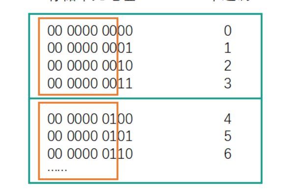
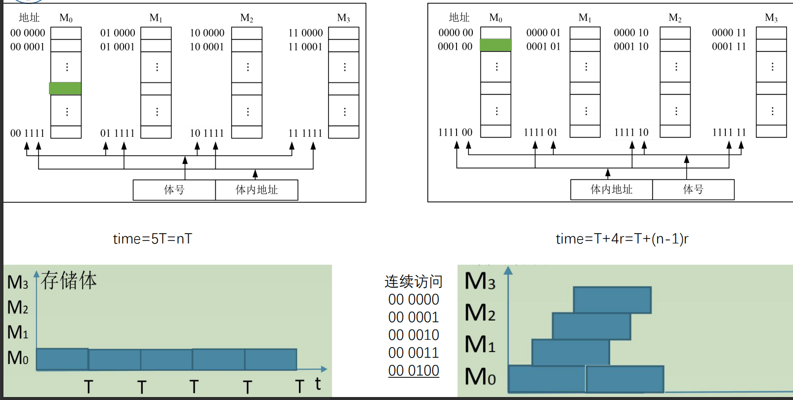

# 绪论

## 计算机硬件结构

### 早期冯诺依曼机
#### 概念
指令以二进制代码的形式事先输入计算机的主存储器，主存里面存贮的不仅有数据还有指令，而且他们的形式都是相同的

**组成部分**
- 存储器:计算机的存储部件，存放程序和数据
- 控制器: 计算机的控制器: 计算机的指挥中心指挥中心
- 运算器: 计算机的执行部件，算术运算 (+、-) 逻辑运算 (与，或，异或等)
- 输出设备: 将计算机处理结果以人类所能接受形式或其他系统所要求的信息形式输出
- 输入设备: 将程序和数据以机器所能识别和接受的信息形式输入计算机

#### 特点
(1)计算机由五大部件组成
(2) 指令和数据以同等地位存储在存储器中，并按地址寻问
(3) 指令和数据均以二进制代码表示
(4)指令由操作码和地址码组成，操作码用来表示操作的性质，地址码用来表示操作数在存储器中的位置
(5)指令在存储器内按顺序存放。通常，指令是顺序执行的，在特定条件下可根据运算结果或根据设定的条件改变执行顺序
(6) 早期的冯·诺依曼机以运算器为中心，输入/输出设备通过运算器与存储器传送数据

### 现代计算机
(1) 以存储器为核心
(2)CPU=运算器+控制器
(3) I/O设备=输入设备+输出设备

**现代计算机体系的抽象**

### 计算机功能部件

#### 存储器

- **存储元**: 即存储二进制的电子元件，每个存储元可存1bit
- **存储单元**: 每个存储单元存放一串二进制代码
- **存储字**: 存储单元中二进制代码的组合
- **存储字长**: 存储单元中二进制代码的位数
- **机器字长**: 计算机能一次处理的二进制代码长度
- **指令字长**: 指令的二进制长度

#### 运算器
- **ACC**:累加器，用于存放操作数，或运算结果
- **MO**:乘商寄存器，在乘、除计算时用于存放操作数或者运算结果
- **X**:通用的操作数寄存器，用于存放操作数
- **ALU**:算术逻辑单元，是运算器的核心

#### 控制器
**概念**
- PC: 程序计数器，存放下一条指令的地址
- IR: 指令寄存器，存放当前正在执行的指令
- CU: 控制单元，分析指令，给出控制信号

**[公式]**
- MAR位数=PC位数，PC所能寻址的范围，就是地址的范围
- MDR位数=IR位数，其实这里的指令也是一种数据。

### 指令的执行
- **CPU**: 中央处理器;PC: 程序计数器;MAR:存储器地址寄存器
- **ALU**: 算术逻辑部件;IR: 指令寄存器;MDR: 存储器数据寄存器
- **GPRs**: 通用寄存器组 (由若干通用寄存器组成，早期就是累加器)

#### 指令的执行
三个阶段: 取指令、分析指令、执行指令
(A) 开始时，将第一条指令地址->PC
(8) (PC) -> MAR，发“读”命令，M(MAR)->MDR，使(MDR)->IR
(C) (PC) +1->PC
(D) 翻译IR的操作性质
(E) 取操作数
(F) 将操作数送往运算器，进行运算
(G) 送结果
    (a) 寄存器
    (b)内存

## 计算机性能指标
### 计算机系统层次

# 数据的表示与运算
## 数据表示
**常见二进制数据**

**真值和机器数**

## 定点数的表示与运算

**概念**
- 点: 其实就是小数点
- 定点数: 小数点的位置固定
- 浮点数: 小数点的位置不固定
- 类似于我们生活中使用的常数
- 二进制浮点数: 类似于科学计数法
**例子** 
定点数: 150.408
浮点数: 1.50408*102
### 定点数的表示
####  无符号数
整个机器字长的全部二进制位均为数值位，没有符号位，相当于数的绝对值

**无符号数的表示范围**
假设我们的计算机是8位的，那么其实我们就可以表示8bit位以内的数据其实也就是:
0000 0000-1111 1111
0-255
如果我们不采用无符号数，那么其实我们能够表示的数据范围就会发生改变其实能够真正表示数据的是不是只有7位了，还有一位我们需要作为符号位。

#### 有符号数
**表示**

约定: 用X表示真值，用【[X]原表示原码，[X]补表示补码，[X]反表示反码，[X]移表示移码
约定: 用X表示真值，用【[X]原表示原码，[X]补表示补码，[X]反表示反码，[X]移表示移码
用尾数 (也就是数值部分) 表示真值的绝对值

#### 定点整数
若机器字长为n+1位，则尾数为n位 
原码整数表示范围:
$-(2^n-1)≤x≤(2^n-1)$

**定点整数的特点**
- 零：0.0000000
- 零：1.0000000

所以0的原码整数在计算机内部有两种表示形式，+0和-0
- 正数:有2n-1个
- 负数:有2n-1个
- 零:有一个
- 总共：2N+1-1个

但是n+1位应该对应有2n+1种状态，真值0其实占用了两种状态，合理

#### 定点小数
- 若机器字长为n+1位，则尾数为n位
原码小数表示范围
$-(1-2^{-n})≤x≤(1-2^{-n})$
- 同样，在这里真值0其实也占用了两种状态也就是有 + 0和-0两种形式
- 其实原码的定点整数和定点小数的分布是关于原点对称的

#### 四码
##### 反码
有符号数的定点表示 (反码)
- 正数: 反码和原码相同
- 负数: 数值位全部取反

**反码特征**:
- 反码整数的表示范围
$-(2^n-1)≤x≤(2^n-1)$
- 反码小数的表示范围
$-(1-2^{-n})≤x≤(1-2^{-n})$
- 同样，在这里无论是小数还是整数，真值0其实也占用了两种状态也就是有 +0和-0两种形式。
- +零 0.0000000 -零 1,1111111
所以0的反码整数在计算机内部也有两种表示形式
**列子**
若机器字长为n+1位，则尾数为n位我们假设机器字长为8位。
+9
[X]原=0,0001001 &emsp; [X]反=0,0001001
-9
[X]原=1,0001001 &emsp; [X]度=1,1110110
+0.75
[X]原=0.1100000 &emsp; [X]反=0.1100000
-0.75
[X]原=1.1100000  &emsp;[X]度=1.0011111

***反码的用途***
(1) 其中一个用途就是“原码”转换成“补码”的一个中间状态
(2) 还可以应用于系统环境设置,如linux平台的目录和文件的默认权限的设置，就是使用反码原理
##### 补码
有符号数的定点表示 (补码)
- 正数: 补码和原码相同
- 负数: 原码数值位全部取反(得到反码),未位+1

**补码特征:**
- [+0]原=0,0000000  &emsp;  [-0]原=1,0000000
[+0]反=0,0000000  &emsp;  [-0]反=1,1111111
[+0]补=0,0000000   &emsp;  [-0]补=0,0000000
- 这里不一样的是，真值0的补码只有一种表示形式，多出来了一个1,0000000
- 补码整数的表示范围
$-2^n-≤x≤(2^n-1)$
- 补码小数的表示范围
$-1≤x≤(1-2^{-n})$
- 规定，补码整数$1,0000000=-2^7$  &emsp;   规定，补码小数1.0000000=-1

**例子**
若机器字长为n+1位，则尾数为n位
我们假设机器字长为8位
+9
[X]原=0,0001001 &emsp; [X]补=0,0001001
-9
[X]原=1,0001001 &emsp; [X]反=1,1110110 &emsp; [X]补=1,1110111
+0.75
[X]原=0.1100000 &emsp; [X]补=0.1100000
-0.75
[X]原=1.1100000 &emsp; [X]反=1.0011111 &emsp; [X]补=1.0100000
##### 移码
有符号数的定点表示(移码) (只有整数)
方法1: 在补码的基础上将符号位取反
方法2: 在真值的基础上加上2n

**移码的特征**
- [+0]补=0,0000000 &emsp; [+0]移=1,0000000
[-0]补=0,0000000 &emsp; [-0]移=1,0000000
- 所以真值0的移码也只有一种表示形式，1,0000000其实就表示0
- 移码的表示范围
$-2^n≤x≤(2^n-1)$

**例子**
若机器字长为n+1位，则尾数为n位 我们假设机器字长为8位。
+9
[X]原=0,0001001 &emsp; [X]补=0,0001001 &emsp; [X]移=1,0001001
-9
[X]原=1,0001001 &emsp; [X]补=1,1110111 &emsp; [X]移=0,1110111

#### 总结

### 定点数的运算
[概念] **移位运算**
算术移位、逻辑移位、循环移位
#### 算术移位
##### 原码
**原码算术右移**:高位补0，低位移除
- 若丢弃位=0，相当于除2,;
- 若丢弃位不等0，会丢失精度;

**原码算术左移**: 符号位不动，数值位低位补0，高位移除
- 若丢弃位=0，相当于*2;
- 若丢弃位不等于0，会出现严重误差

##### 反码
(1) **正数反码算术移位**: (和原码完全相同)
- 符号位不动，对数值位操作。
- 右移:高位补0，低位舍弃;
- 左移: 低位补0，高位舍弃;
- 注意精度和误差

(2)**负数反码算术移位**
- 符号位不动，对数值位操作。
- 右移:高位补1，低位舍弃;
- 左移: 低位补1，高位舍弃;
- 注意精度和误差

##### 补码
(1) **正数补码算术移位**: (和原码完全相同)
- 符号位不动，对数值位操作。
- 右移:高位补0，低位舍弃
- 左移: 低位补0，高位舍弃;
- 注意精度和误差

(2) **负数补码算术移位**
- 符号位不动，对数值位操作
- 右移(同反码): 高位补1，低位舍弃;
- 左移(同原码): 低位补0，高位舍弃:
- 注意精度和误差

##### 总结

#### 逻辑位移
无论什么数:
- 右移:高位补0，低位舍弃;
- 左移: 低位补0，高位舍弃

#### 循环位移

#### 总结

### 加减运算
#### 原码加减法
**概念**
(1)加法器直接对原码进行计算可能会出错
(2) 加法规则:
- 先判断符号位，
    - 若相同，则绝对值相加，结果符号位不变;若不同，则做减法，绝对值大的数减去绝对值小的数，结果的符号与绝对值大的数相同

(3)减法规则:
两个原码表示的数相减，首先将减数符号取反，然后将被减数与符号取反后的减数按原码加法进行运算
(4)运算时注意机器字长，当左边出现溢出时，将溢出位丢掉

**原码的加法运算**
- 正+正一绝对值做加法，结果为正
- 负+负 一绝对值做加法，结果为负
- 正+负 一绝对值大的减绝对值小的，符号同绝对值大的数
- 负+正一绝对值大的减绝对值小的，符号同绝对值大的数

**原码的减法运算**
原码的减法运算，"减数"符号取反，转变为加法
- 正-负一正+正
- 负-正一负+负
- 正-正一正+负
- 负-负一负+正

#### 补码加减法
使用补码进行加法运算,当结果不超过机器的表示范围时,有以下结论:
- 用补码表示的两数进行加法运算,其结果仍为补码;
- [X+Y]补=[X]补土[Y]补(mod2);
- 符号位与数值位一样参与运算
- 符号位与数值位按同样规则一起参与运算，符号位运算产生的进位要丢掉，结果的符号位由运算得

**例子**
(1)X=+13,Y= -14,则[]补=01101,[Y]补=10010
[X+Y]补=01101+10010=11111,因此X+Y=-1
(2)X=+0.1001,Y=-0.0011,则[X]补=0.1001,[Y]补=1.1101
[X+Y]补=0.1001+1.1101=0.0110,因此X+Y=0.0110
(3)X=+11,Y= +4,则[X]补=01011,[Y]补=00100 ,[-Y]补=11100
[X-Y]补= [X]补+[-Y]补=01011+11100=00111,
因此X-Y=7

(1)X=+13,Y=+4,则[X]补=01101,[Y]补=00100
[X+Y]补=01101+00100=10001
从符号位来看是一个负数,显然错误。
(2)X=+0.1001,Y=+0.1001,则[X]补=0.1001,[Y]补=0.1001
X+Y补=0.1001+0.1001=1.0010
从符号位来看是一个负数,显然错误

上述现象称为溢出,即两个定点数经过加减法运算后,结果超出了机器所能表示的范围,此时的结果无效。
因此.在定点加减运算过程中,必须对结果是否溢出进判断。

### 溢出判断
正+正 一结果为负,称为正溢;
负+负 结果为正,称为负溢。
**注意:**
正-负->正+正
负-正->负+负

常用的判别溢出方法有以下3种。
1)符号比较法
2)双进位法
3)双符号位法

#### 采用一位符号位
由于减法运算在机器中是用加法器实现的，因此无论是加法还是减法，只要参加操作的两个数符号相同，结果又与原操作数符号不同，则表示结果溢出

## 浮点数的表示与运算

### 表示
**概念**
定点数: 就是小数点位置不变的数
浮点数: 浮点数是指小数点位置可以浮动的数据，通常表示如下
- N 为浮点数;
- M(Mantissa)为尾数(纯小数)
- E(Exponent)为阶码(整数)
- R(Radix)称为阶的基数(底),而且R为一常数(与尾数的基数相同)

- R: 一般为2、8或16。在一台计算机中,所有数据的R 都是相同的,因此不需要在每个数据中表
示出来。
- 阶码: 常用补码或移码表示的定点整数
- 尾数: 常用原码或补码表示的定点小数
- RE: 就是让小数点移动

**浮点数表示范围**
设浮点数阶码的数值位取n位,尾数的数值位取m位,两者均用补码表示,M.表示尾数的符号位,当浮点数为非规格化数时,它在数轴上的表示范围如下图所示(注意:“上溢”、“下溢”(机器零) )。

[概念] 浮点数的规格化:
规定浮点数的尾数部分必须为纯小数,且当尾数的值不为0时,其绝对值应大于等于十进制数的0.5,称为浮点数的规化表示 (0.1*\*\*和1.0\*\**的形式)
当浮点数的尾数不满足要求时,需要左移或右移尾数,同时对阶码进行修改,使之符合规格化的要求,这一过程称为规格化操作。
在规格化过程中,尾数每向左算术移位1次阶码减1.称为向左规格化.简称**左规**:尾数每向右移一位,则阶码加1,称为向右规格化,简称**右规**

什么情况下进行尾数的规格化?
**左规**: 当浮点数运算的结果为非规格化时要进行规格化处理,将尾数算数左移一位，阶码减1
**右规**: 当浮点数运算的结果尾数出现溢出 (双符号位为01或10),将尾数算数右移一位，阶码加1

### IEEE 754
现代计算机中,浮点数一般采用IEEE754国际标准。标准中规定常用的浮点数有单精度和双精度两种形式
格式如下:
||符号位| 阶码|尾数|总位数|
|-------|------|------|------|------|
|单精度|1|8|23|32|
|双精度|1|11|52|64|

阶码用移码表示，真值都被加上一个偏移量，单精度采用的是移127的移码方案，双精度采用的是移1023的
移码方案。(为什么是127? )

在移127的移码方案中，8位移码结果不再与8位补码存在仅符号位相反的对应关系，其值要通过对阶码实际
值加127得到，或将标准移码的值再减1得到。

尾数采用原码表示，对规格化的非0值尾数使用隐藏位技术，即非零值的规格化浮点数的尾数最高位始终为
1，这一位不予存储，而认为隐含在小数点的左边，这是通过左移原来的尾数实现的，故可以使结果的表示
精度多一个二进制位，此时它所表示的实际值在1-2之间，若尾数是 M，则此时所表示的值是1.M(天然的规
格化)。

最小绝对值:尾数全为0，阶码真值最小-126，对应移码机器数0000 0001 此时整体的真值为(1.0) 2-126
最大绝对值:尾数全为1，阶码真值最大 127，对应移码机器数1111110
此时整体的真值为(1.111...11)X2127

只有1≤E≤254时，(-126-127) 真值=$(-1)^s*1.M*2^{E-127}$
当阶码E全为0，(-127)尾数M不全为0时，表示非规格化小数 $(0.x..x)x2^{-126}$
当阶码E全为0，(-127)尾数M全为0时，表示真值 0
当阶码E全为1，(-128)尾数M全为0时，表示无穷大 
当阶码E全为1，(-128)尾数M不全为0时，表示非数值"NaN”(Not a Number)

### 浮点数加减法

浮点数的加减运算一般分为如下5个操作步骤
1. 对阶
2. 尾数加减
3. 规格化
4. 舍入
5. 判溢出

**例子**
$1.50408*10^6+4.08150*10^4$
1. 对阶 $1.50408*10^6+0.0408150*10^6$
2. 尾数求和 $1.50408+0.0408150=1.5448950$
3. 规格化 15.448950(右规) 0.015448950(左规)
4. 舍入
若规定只能有5位尾数，那么
    - 1.54489501.54489(直接舍弃低位)
    - 1.54489501.54490(舍弃部分大于0，低位 +1)
    - 1.54489501.54490(四舍五入)

5. 判断溢出
规定阶码不能超过10，那么如果出现$1.5448950*10^{10}$就表示溢出
(真正的溢出:在尾数为规格化数的时候，阶码确实大于最大值)
(虚假的溢出: 尾数出现溢出，可以采用规格化进行调整)

**例子**
设X= $2^6 x0.1010000$,Y= $2^7 x0.1101000$,求X+Y
解 设阶码、尾数均采用补码表示形式,双符号位。阶码数值位4位,尾数数值位7位:

||阶符| 阶码| 尾符| 尾数|
|------|------|------|------|------|
|x|00|0110|00|1010000|
|Y|00|0111|00|1101000|

(1)求阶差.对大阶。
阶差$\triangle E=[EX]_补+[-EY]_补=000110+111001=111111$
X 阶码小,MX 算术右移1位,保留阶码$[E]_补=[EY]_补=000111$。
$[Mx]_补=00.01010000$。
(2)尾数相加。
$[M]_补=[MX]_补+[MY]_补=01.00100000$。
(3)规格化操作。双符号位不一致,因此右规,尾数右移一位,阶码加1
$[M]_补=00.1001000 00$
$[E]_补=000111+000001=001000$。
(4)舍入。附加位的最高位为0,舍去,$[M]_补=00.1001000$
(5)判溢出。阶码的双符号位相同.故不溢出。
 
在浮点数加减运算的最后需要对阶码是否溢出进行判断,若未溢出,运算正常结束,若阶码下溢(比能表示的最小数还小时),则将结果置为机器零若阶码上溢,则置溢出标志。
# 存储器系统
## 存储器概述

### 基本概念
- **存储元**: 即存储二进制的电子元件，每个存储元可存1bit
- **存储单元**: 每个存储单元存放一串二进制代码
- **存储字**: 存储单元中二进制代码的组合
- **存储字长**: 存储单元中二进制代码的位数
- **机器字长**: 计算机能一次处理的二进制代码长度
- **指令字长**: 指令的二进制长度

MAR位数对应着存储单元的个数
MDR位数和存储字长相等
$2^{10}=1024=1K$MAR位数=PC位数
### 存储器层次结构
现代计算机要求存储系统满足**大容量**、**高速度**和**低成本**三项基本要求
由干制造工艺限制，很难在同一种存储器中都达到这些要求，三者不可兼得，为此采用分层(级)存储体系
并通过管理软件和辅助硬件将不同性能的存储器组合成有机的整体，称为计算机的存储层次或存储体系

[概念] **高速缓存 (Cache)**
又称快存，用速度较快的存储器构成，可在2ns内可完成一次数据存取，目前容量一般为几MB左右，用来临时
存放指令和数据。
[概念] **主存**
用来存放运行期间的大量程序和数据，目前容量在几GB左右，速度稍慢，可在10ns内完成一次存取
[概念] **辅存** (即辅助存储器，又称外存储器，简称外存)
一般由磁表面存储器、光存储器构成，用来存放系统程序、大型文件、数据库等，目前容量在数百GB左右
速度为ms级。
[概念] **虚拟存储器**
现代计算机通常采用cache一主存一辅存层次结构。
在CPU和主存之间增加一个高速缓冲存储器，由纯硬件实现，提高CPU访问程序和数据的速度
主存一辅存采用虚拟存储器技术，由软件和硬件实现，扩充主存的容量。
[补充] 三种存储器构成三级存储器管理，各级职能和要求不同
Cache追求速度，以和CPU速度匹配
辅存追求容量大，
主存介于两者之间，对容量，速度都有一定要求

### 存储器分类
[概念] **按构成存储器的器件和存储介质分类**
可分为磁介质存储器、电子介质存储器、纸介质存储器、光介质存储器等

[概念] **按存取方式分类**
可分为随机存储器
(Random Access Memory， RAM)
只读存储器 (Read Only Memory， ROM)
串行访问存储器 (Sequential Access Memory，SAM)

[概念] 按在计算机中的**作用**分类
可分为主存储器 (简称主存，又称内存)
辅助存储器(简称外存或辅存)
缓冲存储器(简称缓存) 等。
[概念] 按**信息的可保护性**分类
可分为易失性存储器和非易失性存储器
RAM都是易失性存储器
ROM都是非易失性存储器
### 性能指标
[概念] **存储器存取时间**
从存储器读出/写入一个存储单元信息，或从存储器读出/写入一次信息
(信息可能是一个字节或一个字) 所需要的平均时间，称为存储器的取数时间/存数时间
[概念] **存储器存取周期**
存储器进行一次完整的读写操作所需要的全部时间，称为存取周期。具体地说，存取周期是连续启
动两个独立的存储器操作(如两个连续的读操作)之间所需要的最小时间间隔。一般大于存取时间
[概念]**存储器存取带宽**
单位时间可写入存储器或从存储器取出的信息的最大数量，称为数据传输率或称为存储器传输带宽
单位为字节/秒 (B/s，Bps) 或位/秒 (b/s，bps).

## 主存系统模型和结构

### 存储元结构
|操作/状态|写1|读1|写0|读0|
|------|------|-------|------|------|
|地址线和MOS管|高电压接通MOS管|高电压接通MOS管|高电压接通MOS管|高电压接通MOS管|
|数据线|高电压(主动)|高电压(被动)|低电压(主动)|低电压(被动)|
|电容|充电|放电|稳态|稳态|

**利用存储元构成存储体**

**主存结构: 包括存储体，MAR，MDR，时序控制逻辑**

### 主存寻址
[概念] **寻址方式/编址方式**: 前提每个存储单元有一个地址
- 按字节寻址: 每个存储单元里面有一个字节，相当于为每个字节分配一个地址
- 按字寻址: 一个字包含多个存储单元，为每个字分配一个地址
- 按半字寻址: 一个字包含多个存储单元，为半个字分配一个地址
- 按双字寻址: 一个字包含多个存储单元，为两个字分配一个地址
[概念] **数据存储方式**
- 大端方式: 高位数据存放在低位地址上
- 小端方式: 低位数据存放在低位地址上

**例子**

**总容量为1KB**
- 按字节寻址: 1K个单元，每个单元1B
- 按字寻址: 256个单元，每个单元4B
- 按半字寻址: 512个单元，每个单元2B
- 按双字寻址: 128个单元，每个单元8B

**数据存储方式**
01234567H
## RAM和ROM

### RAM概念
**RAM (Random Access Memory)**
被称为随机存取存储器。可以向 RAM 写入数据，也可以从 RAM 读出数据
RAM 的一个明显的特点是: 它是易失性存储器
一般来说RAM有两种: SRAM、DRAM
**SRAM**
SRAM 存储1个位，需要 6 个晶体管，因此 SRAM 存储器的集成度低，但读写的速度快，所以价格贵。因为速度快SRAM 经常用作 Cache
**DRAM**
DRAM单个位的构成简单，集成度高，容量大，但需要刷新电路，读写速度比静态存储器慢，价格低廉。特别是价格低廉，使动态存储器成为计算机中使用最多的存储器

### RAM对比
Dynamid Random Access Memory

MOS管接通
- 写入1: 数据线高压，电容存储电荷
- 写入0:数据线OV，电容不会存储电荷
- 读出1:电容放电，数据线上有电
- 读出0: 电容不放电，所以数据线上没有电

Static Random Access Memory

- 读/写1: 左高右低
- 读/写0: 左低右高

**SRAM和DRAM的对比**
|类型|SRAM|DRAM|
|-------|-------|------|
|用途|Cache|内存|
|破坏性读出|否|是|
|数据是否再生|否|是|
|运行速度|快|慢|
|集成度|低|高|
|发热量|大|小|
|存储成本|高|低|
|是否易失|断电易失|断电易失|
|是否需要刷新送行列地址|不需要同时|需要异步|
### DRAM刷新
**DRAM的地址复用技术**

对n位行地址、m位列地址，仅需要2+2m根选择线，适合容量大的存储芯片
引入位片式结构之后如何刷新? 在什么时候刷新?

**刷新方式**
利用硬件重新写入电容，占用1个存取周期
刷新周期: 2ms(每2ms之内重新写入)
刷新方式: 按行刷新! 每次刷新一行存储单元

#### 集中刷新
假设DRAM内部结构排列成128x128的形式，存取周期0.5us，那么2ms内共 2ms/0.5us = 4000 个周期

是在信息保存允许的时间范围内，集中一段时间对所有基本存储单元一行一行地顺序进行刷新，这段时间称为刷新时间。刷新时间=存储矩阵行数x存取周期 (刷新一行所需要的时间)

#### 分散刷新
假设DRAM内部结构排列成128x128的形式，存取周期0.5us，，那么2ms内共 2ms/0.5us = 4000 个周期

分散刷新是每隔一段时间刷新一次，把刷新操作分散到每个存取周期内进行，此时系统的存取周期$t_C$。被分为两段，前半段时间$t_A$,进行读写操作或保持，后半段时间$t_R$,进行刷新操作，即$t_C=t_A+t_R$，刷新操作与CPU操作无关。在一个系统存取周期内刷新存储矩阵中的一行。

#### 异步刷新
假设DRAM内部结构排列成128x128的形式，存取周期0.5us，那么2ms内共 2ms/0.5us = 4000 个周期

异步刷新则是结合前两种刷新方式，在一个指令周期中，利用CPU不进行访问存储器操作时进行刷新。先根据
刷新的行数对刷新间隔(如2ms) 进行分割，分割后的每段时间中，再分成两部分，前一段时间用于读/写或保持，后一段时间用于刷新。

### ROM
**ROM (Read Olny Memory)**
ROM 是非易失型存储器，工作时需要电源，当电源消失，存储的信息不会丢失，所以 ROM 可以保存需要长久保存的信息，如程序代码。
1. **MROM**
狭义的ROM单指**掩膜型只读存储器 (MROM，Mask ROM)**在制造ROM存储知阵时，如果生产量较大，一般要根据对存储内容的要求设计掩膜版，用这种工艺制作出来的ROM就叫作掩膜POM。这是中生产一家按一定的信息模式生产的存有固定信息的ROM，用户只能选用而无法修改原有的信息。
2. **PROM**
**可编程式只读存储器(PROM，Programmable ROM)**是一种每个比特都由熔丝或反熔丝的状态决定数据内容的ROM这种存储器用作永久存放程序之用。常用于电子游戏机、电子词典等预存固定数据或程序的各式电子产品之上。

3. **EPROM**
**可擦除可编程式只读存储器(EPROM，Erasable Programmable ROM)** 由以色列工程师多夫·弗罗曼发明，允许用户写入信息，之后用某种方法擦除数据，可进行多次重写
**UVEPROM (ultraviolet rays)**--用紫外线照射8~20分钟，擦除所有信息
EEPROM(也常记为E2PROM，第一个E是Electricaly，第二个E是Erasable) --可用"电擦除"的方式，擦除特定的字

4. **FPROM**
**闪速存储器(FPROM，Flash PROM)**是冈富士雄在东艺公司工作时发明的，也称快闪存储器或闪存，是一种电可擦除的非易失性只读存储器，允许在操作中被多次擦或写。这种技术主要用于一般性数据存储，以及在电脑与其他数字产品间交换传输数据，如储存卡与闪存盘闪存是一种特殊的、以宏模块擦写的EPROM。比较起来，EPROM价格便宜、集成度高，E2PROM电可擦洗重写，FPROM较E2PROM快，且具备RAM的功能。

5. **SSD**
**固态硬盘 (Solid State Drives)**
由控制单元+存储单元(Flash芯片)构成，与闪速存储器的核心区别在于控制单元不一样，但存储介质都类似，可进行多次快速擦除重写。SSD速度快、功耗低、价格高。目前个人电脑上常用SSD取代传统的机械硬盘
## 主存与CPU的连接

### 译码器
#### 线选法
**译码器**

**线选法**
n条地址线线-> n个选片信号，电路简单，但是地址空间不连续
**低电平有效**:
输入电压为0，有效
输入电压为1，无效

####  译码片选法

**译码片选法**
n条地址线线->$2^n$个选片信号，电路复杂，但是地址空间连续

#### 总结
|线选法|译码片选法|
|---------|--------|
|n条地址线线->n个选片信号|n条地址线线->$2^n$个选片信号|
|电路简单|电路复杂|
|地址空间不连续|地址空间可连续，可以增加逻辑设计|

### 位拓展
**位扩展**:
假定手头只有若干 8Kx1位的SRAM芯片。首先需要使用2片该芯片，把这2片芯片连接为类似1片8Kx2位的芯片
可以看出，连接后存储单元数量不变，每个单元包含的位由1个变为2个，这种连接叫作存储器的位扩充。

**位扩展**
假定手头只有若干 8Kx1位的SRAM芯片首先需要使用8片该芯片，把这8片芯片连接为类似1片8Kx8位的芯片。

### 字拓展
**字扩展**:
假定手头只有若于 8Kx8位的SRAM芯片。首先需要使用2片该芯片，把这2片芯片连接为类似1片16Kx8位的芯片可以看出，连接后存储单元包含的位数不变，存储单元的数目增多。这种连接叫作地址(字)扩充。
**线选法**

**片选法**

### 字位同时拓展

## 主存提速方案

### 存储周期
**RAM读周期**

读操作时，必须保证片选信号为低电平，读写信号为高电平。
$t_{RC}$ （读周期时间）：指对芯片连续两次读操作之间的最小间隔时间。
$t_A$ (读出时间)：从给出有效地址后，经过译码电路、驱动电路的延迟，到读出所选单元内容，并经I/O电路延迟，直到数据在外部数据总线上稳定出现所需的时间。显然，读出时间小于读周期时间。
$t_{CO}$ (片选到数据输出稳定的时间)：数据能否送到外部数据总线上，不仅取决于地址，还取决于片选信号。因此，$t_{CO}$是从有效到数据稳定出现在外部数据总线上的时间。
$t_{CX}$（片选到数据输出有效时间）：从片选有效到数据开始出现在数据总线上的间隔时间。
$t_{OTD}$：片选无效后数据还需在数据总线上保持的时间。
$t_{OHA}$：地址失效后，数据线上的有效数据维持时间，以保证所读数据可靠。

**RAM写周期**

执行写操作时，为低电平，读写信号为低电平。
$t_W$（写入时间）：为保证数据可靠地写入，与同时有效的时间必须大于或等于$t_W$。
$t_{AW}$（滞后时间）：地址有效后，必须经过$t_{AW}$时间，WE/信号才能有效（低），否则可能产生写出错。
$t_{WR}$（写恢复时间）：WE/无效后，经tWR时间后地址才能改变，否则也可能错误地写入。
$t_{DW}$：写入数据必须在写无效之前tDW时间就送到数据总线上。
$t_{DH}$：WE/无效后，数据还要保持的时间。此刻地址线仍有效，$t_{WR}>t_{DH}$，以保证数据可靠写入。
$t_{WC}$（写周期时间）：表示连续两次写操作之间的最小时间间隔。$t_{WC} = t_{AW} + t_W + t_{WR}$。

**存取时间**
**存取周期**

### 双端口RAM
双口 RAM 是指一个特殊类型的RAM，它有两套完全独立的数据线、地址线和读 /写控制线。只要不同时访问同一个单元，两个独立的 CPU 可以同时对双口 RAM 进行随机访问。如果同时访问双端口RAM的同一个单元，由内部的控制电路决定哪个端口可以访问该单元。

**注意**
需要有两组完全独立的数据线、地址线、控制线。CPU、DRAM中也要有更复杂的控制电路

**两个端口对同一主存操作有以下4种情况**∶
1. 两个端口同时对不同的地址单元存取数据。
2. 两个端口同时对同一地址单元读出数据。
3. 两个端口同时对同一地址单元写入数据。
4. 两个端口同时对同一地址单元，一个写入数据，另一个读出数据。

**解决方法**∶ 置"忙"信号为0，由判断逻辑决定暂时关闭一个端口（即被延时），未被关闭的端口正常访问，被关闭的端口延长一个很短的时间段后再访问。

### 多模块存储器
**传统存储器**

**多模块存储器**
为提高访存速度，常采用多模块存储器，常用的有**单体多字存储器**和**多体并行存储器**。

#### 单体多字存储器
单体多字系统的特点是存储器中只有一个存储体，每个存储单元存储 m 个字，总线宽度也为 m 个字。一次并行读出 m 个字，地址必须顺序排列并处于同一存储单元。
eg.单体四字存储器：每字W位，给定一个地址，可以在一个存取周期内读出4×W位指令或数据，使主存带宽提高到4倍

假设存取时间为r，恢复时间为3r那么存取周期为T=4r

**特点**
1. 每个存储单元存储m个字，总线宽度也为m个字，一次并行读出m个字
2. 指令和数据在主存内必须是连续存放的

#### 多模块多体并行存储器存储器
多体并行存储器由多体模块组成。每个模块都有相同的容量和存取速度，各模块都有独立的读写控制电路、地址寄存器和数据寄存器。它们既能并行工作，又能交叉工作。
多体并行存储器分为高位交叉编址（顺序方式）和低位交叉编址（交叉方式）两种。

##### 高位交叉编址
高位地址表示体号，低位地址为体内地址。高位交叉编址方式下，总是把低位的体内地址送到由高位体号确定的模块内进行译码。访问一个连续主存块时，总是先在一个模块内访问，等到该模块访问完才转到下一个模块访问，CPU总是按顺序访问存储模块，存储模块不能被并行访问，因而不能提高存储器的吞叶率。

体号 体内地址
##### 低位交叉编址
低位地址为体号，高位地址为体内地址。低位交叉编址方式下，总是把高位的体内地址送到由低位体号确定的模块内进行译码。程序连续存放在相邻模块中。 因此称采用此编址方式的存储器为交叉存储器。采用低位交叉编址后，可在不改变每个模块存取周期的前提下，采用流水线的方式并行存取，提高存储器的带宽。

体内地址 体号

# 指令
## 指令格式和分类
### 指令格式

**相关概念**
>Ad(Address) 形式地址
 AC(Accumulation register)累加寄存器
ALU(Arithmetic logic unit)算术逻辑单元
MQ(Multiplier-Quotient Register)乘商寄存器
DR(Data Register) 数据寄存器
AR(Address Register) 地址寄存器(MAR)
IR(Instruction Register) 指令寄存器
BR(Buffer Register) 缓冲寄存器(MBR)
ID(Instruction Decoder) 指令译码器
PC(ProgramCounter) 程序计数器
OP（Operate Code）:  操作码 指令中用于指出操作性质的字段。
#### 了解指令
**指令系统**
每种计算机系统均有一组指令提供给用户使用
**指令**
般由操作码和地址码两部分构成，其中操作码在前，地址码在后，地址码的个数可变

|操作码OP| 地址码|

**操作码**是指明指令操作性质的命令码,它提供指令的操作控制信息，不可缺少
**操作数地址码**用来描述该指令的操作对象及其所在位置
|OP|4|A2|A3(结果)|A4(下地址)|
指令含义:$ (A_1) OP (A_2) ->A_3，A_4=$下一条将要执行指令的地址

**指令执行**

|00000000|000001|000010|000011|000100|
|-------|-------|-------|-------|---------|
|OP|$A_1$|$A_2$|$A_3$(结果)|$A_4$(下地址)|

一条指令的执行 (假设每个地址都是主存地址)
取指令访存1次 (假设指令字长=存储字长)
取两个操作数访存2次
存回结果访存1次
共访存4次

**取指**
PC（程序计数器）=0 &emsp; 指向第一条指令的位置，PC存放了当前欲执行指令的位置。
MAR（地址寄存器）=0  &emsp; PC把地址０交给了地址寄存器MAR
MDR（数据寄存器）=000001 0000001000 &emsp; MAR根据地址在0的存储单元中取出指令，交给了数据寄存器MDR
IR（指令寄存器）=000001 0000001000 &emsp; MDR将指令交给了指令寄存器IR
**分析**
OP(IR)=000001 &emsp; 获取指令操作码
PC=PC+1  &emsp; 地址为0的存储单元中的指令执行结束，程序计数器PC自动+1
**执行**
MAR=Ad(IR)=0000001000 &emsp; 获取数据地址
MDR=X  &emsp; 从MAR获取真实数据的值
ACC=MDR=x &emsp; MDR将数据放入累加器ACC中

**取指**
PC=1 
MAR=1
MDR=000100 0000001001
IR=000100 0000001001
**分析**
OP(IR)=000100
PC=PC+1
**执行**
MAR=Ad(IR)=0000001001
MDR=a
MO=MDR=a  从MDR读取数据放入乘商寄存器MO
X=ACC=x 把ACC中的值放入通用寄存器X
ACC=ax 

### 按地址码分类
**四地址指令**
|OP|$A_1$|$A_2$|$A_3$(结果)|$A_4$(下地址)|
指令含义: $(A_1)OP (A_2) ->A_3，A_4=$,下一条将要执行指令的地址，完成一条指令访存4次
**三地址指令**
|OP|$A_1$|$A_2$|$A_3$(结果)|
指令含义 : $(A_1)OP (A_2) ->A_3$完成一条指令访存4次。区别在于地址码位数不同
**二地址指令**
|OP|$A_1$|$A_2$|
指令含义: $(A_1)OP (A_2)->A_1$完成一条指令访存4次
**一地址指令**
指令含义 : $(A_1)OP (A_2)->A_1$,完成一条指令访存3次。
$(ACC) OP (A_1)->ACC$，约定目的地址为ACC，完成一条指令访存2次
**零地址指令**
1) 不需要操作数的指令，如空操作指令、停机指令、关中断指令等
2) 零地址的运算类指令仅用在堆栈计算机中。
通常参与运算的两个操作数隐含地从栈顶和次栈顶弹出，送到运算器进行运算，运算结果再隐含地压入堆栈

### 按操作码分类
**定长指令字结构**
指令字长固定的指令

**变长指令字结构**
指令字长不固定的指令

**列题**
假设指令字长为16位:前4位为基本操作码字段OP
4位基本操作码若全部用于三地址指令，则有16条
但至少须将1111留作扩展操作码之用，即三地址指令为15条
111111留作扩展操作码之用，二地址指令为15条
111111111111留作扩展操作码之用，一地址指令为15条
零地址指令为16条

**列题**
设指令字长固定为16位，试设计一套指令系统满足:
a有15条三地址指令
b有12条二地址指令
c有62条一地址指令
d有32条零地址指令
设地址长度为n，上一层留出m种状态，下一层可扩展出$m*2^n$种状态

||||||
|------|------|------|------|------|
|有15条三地址指令|0000-1110|$A_1$|$A_2$|$A_3$|
|有12条二地址指令|1111|0000-1011|$A_2$|$A_3$|
|有62条一地址指令|1111|1100-1111|0000-1101|$A_3|
|有32条零地址指令|1111|1100-1111|1110-1111|0000-1111|

### 按长度分类
**单字长指令**: 指令长度=机器字长
半字长指令、双字长指令

### 按操作类型分类
**数据传送类**
数据传送目的
- LOAD 作用:把存储器中的数据放到寄存器中
- STORE 作用: 把寄存器中的数据放到存储器中
**运算类**
算术逻辑操作
- 算术:加、减、乘、除、增1、减1、求补、浮点运算、十进制运算
- 逻辑: 与、或、非、异或、位操作、位测试、位清除、位求反

移位操作
算术移位、逻辑移位、循环移位 (带进位和不带进位)
**程序控制类**
转移操作
- 无条件转移 :JMP
- 条件转移:
    - JZ:结果为0
    - JO:结果溢出
    - JC:结果有进位
    - 调用和返回CALL和RETURN
    - 陷阱(Trap)
**输入输出操作**
CPU寄存器与IO端口之间的数据传送 (端口即IO接口中的寄存器)

## 寻址方式

### 指令寻址
**指令寻址**
找到下一条欲执行指令的指令地址
**顺序寻址**: (PC)+1
PC  &emsp; 当前地址 ---> 地址+1

||000010|000011|000100|
|-------|-------|-------|-------|
|OP|$A_1$|$A_2$|$A_3$(结果)|

**跳跃寻址**: (PC)+A
|00000000|000010|000011|000100|
|-------|-------|-------|-------|
|OP|$A_1$|$A_2$|$A_3$(结果)|

### 数据寻址

**数据寻址**
找到本条指令的操作数地址
**寻址特征**
表明某种数据寻址方式

||寻址方式|EA|
|-------|-------|-------|
|操作码(OP)|寻址特征|形式地址(A)|

||寻址方式|EA1|寻址方式|EA2|
|-------|-------|-------|-------|-------|
|操作码(OP)|寻址特征|形式地址(A1)|寻址特征|形式地址(A2)|

**隐含寻址**
不是显式的给出操作数的地址，而是在指令中隐含着操作数的地址
||寻址方式|EA1|
|--------|--------|------------|
|OP||A|

优点:指令执行阶段不访问主存，指令执行时间最短
缺点: A的位数限制了立即数的范围

**立即数寻址**
形式地址A就是操作数本身，又称为立即数，一般采用补码形式
||寻址方式|EA1|
|-------|--------|-------|
|OP|#|A|

CPU执行:
- 取指令访存1次
- 执行指令访存0次
- 不考虑存放结果
- 共访存1次

优点: 指令执行阶段不访问主存，指令执行时间最短
缺点: A的位数限制了立即数的范围

**直接寻址**
形式地址A就是操作数的真实地址，即EA1=A
||寻址方式|EA1|
|--------|--------|--------|
|OP|看情况|A|

CPU执行:
- 取指令访存1次
- 执行指令访存1次
- 不考虑存放结果
- 共访存2次

优点:简单，指令执行阶段仅仅访问一次主存，不需要设计专门计算操作数的地址
缺点: A的位数限制了寻址的范围，而且操作数的地址不容易更改

**间接寻址**
指令的地址字段给出的形式地址不是操作数的真正地址，而是操作数有效地址所在的存储单元的地址，也就是操作数地址的地址，即EA1=(A)

||寻址方式|EA1|
|--------|--------|--------|
|OP|看情况|A|

CPU执行:
- 取指令访存1次
- 执行指令访存2次
- 不考虑存放结果
- 共访存3次

优点: 可以扩大寻址范围，便于编制程序
缺点:指令在执行阶段要多次访存，多次访存的寻址需根据存储字的做高位确定

**寄存器寻址**
在指令字中直接给出操作数所在的寄存器编号，即EA =Ri其操作数在由Ri所指的寄存器内。
||寻址方式|EA1|
|--------|--------|--------|
|OP|看情况|A|

CPU执行:
- 取指令访存1次
- 执行指令访存o次
- 不考虑存放结果
- 共访存1次

优点:指令在执行阶段不访问主存，只访问寄存器，指令字短且执行速度快
缺点: 寄存器价格昂贵，计算机中寄存器个数有限

**寄存器间接寻址**
寄存器Ri中给出的不是一个操作数，而是操作数所在主存单元的地址，即EA=(Ri)。
||寻址方式|EA1|
|--------|--------|--------|
|OP|看情况|A|

CPU执行:
- 取指令访存1次
- 执行指令访存1次
- 不考虑存放结果
- 共访存2次

优点: 比一般的间接寻址快很多
缺点: 寄存器价格昂贵，而且在执行阶段需要访问主存

**变址寻址**
有效地址EA等于指令字中的形式地址A与变址寄存器IX的内容相加之和，
即EA=(IX)+A，其中IX为变址寄存器(专用)，也可用通用寄存器作为变址寄存器
||寻址方式|EA1|
|--------|--------|--------|
|OP|看情况|A|

CPU执行:
- 取指令访存1次
- 执行指令访存1次
- 不考虑存放结果
- 共访存2次

优点:可以扩大寻址范围;在数组处理方面，可以设A为数组的首地址，不断改变IX,所以十分适合编制循环程序

缺点:寄存器价格昂贵，逻辑比较复杂

**相对寻址**
把程序计数器PC的内容加上指令格式中的形式地址A而形成操作数的有效地址，即EA=(PC)+A，其中A是相对于当前指令地址的位移量，可正可负，补码表示。
||寻址方式|EA1|
|--------|--------|--------|
|OP|看情况|A|

CPU执行:
- 取指令访存1次
- 执行指令访存1次
- 不考虑存放结果
- 共访存2次

优点: 操作数的地址不是固定的，随着PC的变化而变化，并且与指令地址之间总是相差一个固定值，因此便于程序浮动，广泛用于转移指令
缺点: 寄存器价格昂贵，逻辑比较复杂

**堆栈寻址**
存储区中被读/写单元的地址是用一个特定的寄存器给出的，该寄存器称为堆栈指针 (SP)
||寻址方式|EA1|
|--------|--------|--------|
|OP|看情况|A|

完成一次加法: 记栈顶单元Msp
(Msp)-->ACC &emsp; 数据移入累加寄存器ACC
(SP)+1-->SP  &emsp; 栈指针加一
(Msp)-->X  &emsp; 数据移入通用寄存器
(SP)+1-->SP &emsp; 栈指针加一
(ACC)+(X)-->T
(SP)-1=>SP(Y)-->Msp &emsp;  回到栈顶

CPU执行:
- 取指令访存1次
- 软堆栈执行指令访存
- 不考虑存放结果

**偏移寻址**
变址寻址
基址寻址
相对寻址

### 总结
|寻址方式|有效地址|访存次数(不考虑存放结果)|
|-------|--------|--------|
|隐含寻址|程序指定|2|
|立即数寻址|A是操作数|1|
|直接寻址|EA=A|2|
|一次间接寻址|EA=(A)|3|
|寄存器寻址|EA=Ri|1|
|寄存器间接一次寻址|EA=(Ri)|2|
|相对寻址(爱情转移)|EA=(PC)+A|2|
|基址寻址(K歌之王)|EA=(BR)+A|2|
|变址寻址(十年)|EA=(IX)+A|2|
|堆栈寻址|根据情况决定|硬堆栈不访存/软堆栈访存|

