# 计算机抽象及相关和技术
## 计算机体系结构中的8个伟大思想
### 面向摩尔定律的设计
### 使用抽象简化设计
### 加速经常事件
### 通过并行提高性能
### 通过流水线提高性能
### 通过预测提高性能
### 存储层次
### 通过冗余提高可靠性

## 操作系统和编译器

**操作系统**和**编译器**，是现代操作系统必须的。**操作系统**是用户程序和硬件之间的接口。

**操作系统**最重要的作用是：
- 处理基本的输入和输出操作
- 分配外存和内存
- 为多个应用程序提供共享计算机资源的服务

**编译器**作用：把高级语言编写的程序翻译成硬件能执行的指令。

## 组成计算机的硬件
**计算机是由运算器、控制器、存储器、输入设备和输出设备组成**

## 性能计算公式
**CPI**平均时钟周期
**CPU** cpu时间=（指令数*CPI）/时钟频率

## 谬误陷阱

**在改进计算机的某个方面时期望总性能的提高与改进大小成正比**

正解：
**Amdahl**：
$$
改进后的执行时间= \frac{受改进影响的执行时间}{改进量}+不受影响的执行时间
$$

**低利用率的计算机具有更低功耗**
在谷歌的服务器中，最优情况也是10%的工作负载，使用33%的峰值功耗。

**面向性能的设计和面向能效的设计具有不相关的指标**
功耗是功率和时间的乘积，通常情况下，减少系统运行时间，也能降低功耗。

**用性能公式的一个子集去度量性能**

# 指令集
## 指令系统
**指令系统**：计算机中的单词称为指令，其词汇表称为指令系统。


## 计算机硬件操作数
### 存储器操作数
将数据从内存复制到寄存器的数据传输指令被称为**载入指令（load）**。载入指令的格式是操作名称后面紧跟数据待取的寄存器，然后是寄存器和用于访问内存的常量。指令的常量部分和第二个寄存器中的内存相加组合成内存地址。

f=(g+h)=(i+j)
变量f，g，h，i和j分别分配给寄存器x19，x20，x21，x22和x23。

编译后代码：
```asm
add x5，x20，x21 
add x6，x22，x23
sub x19，x5，x6 
```


g=h+A\[8\]
假设A是一个由100个双字组成的数组，并且编译器和之前一样将寄存器x20和x21分别分配给变量g和h。假设数组的起始基地址放在寄存器x22中。
```asm
ld x9,64(x22) //将A[8]的地址放入x9寄存器,常数8被称为偏移量
add x20,x21,x9
```


### 常数或立即数
程序经常会在一次操作中用到常数。
将常数4加到寄存器x22，可以使用以下代码：
```asm
ld x9 AddConstant4(x3) //x3寄存器值时常量4在内存中的地址
add x

```

另一种方法是提供另一个版本的算术指令，可以避免使用加载指令的，它的其中一个操作数是常数：立即数加或addi。要将4加到寄存器x22,只需写成:
```asm 
addi x22, x22, 4
```
#### 例子

假设A是一个由100个双字组成的数组，并且编译器将寄存器x20和x21分别分配给变量g和h。数组的起始地址和及地址存放在寄存器 
### 设计三原则
- 简单源于规整

- 更少则更快
    - 过多的寄存器，可能会在增加时钟周期
- 优秀的设计需要适当的折中

## 有符号数和无符号数

## 计算机中的指令指示
**I型**
|funct7 (12)|rs1 (5)|funct3 (3)|rd (5)|opcode (7)|
**R型**
|funct7 (7)|rs2 (5)|rs1 (5)|funct3 (3)|rd (5)|opcode (7)|

risc-v指令中每个字段的名称的含义
- opcode：指令的基本操作
- rd： 目的操作数寄存器，用来存放操作结果
- funct3：一个另外的操作码的字段
- rs1：第一个源操作数寄存器
- rs2：第二个源操作数寄存器
- funct7： 一个另外的操作码的字段
## 逻辑操作
| 逻辑操作| 操作符号| RISC-V指令|
|-------------|---------------------|------------------|---------------|
|左移|<<| sll,slli|
|右移|>>|srl.srli|
|算数右移|>>|sra.srai|
|按位与|&|and,andi|
|按位减| ||or,ori|
|按位异或|^|xor,xori|
|按位取反|-|xori|

## 用于决策的指令
### 条件分支
```asm
beq rs1,rs2,L1 //如果rs1等于rs2，执行标签为L1的语句，代表相等分支
bne rs1,rs2,L1 //如果rs1不等于rs2，执行标签为L1的语句，代表不等分支，一般来说，相反条件进行转跳更有效率
```
### 循环
```c
while (save[i]==k)
    i+=1;
```
假设i，k对应寄存器x22，x24数组基地址保存在x25 
```asm
Loop: slli x10,x22,3 //获取偏移量
add x10,x10,x25 //获取save[i]的地址
ld x9,0(x10) //加载save[i]中的数据
addi x22,x22 //i=i+1
beq x0,x0,Loop //回到Loop标注的语句
Exit:
```
## 计算机硬件对过程计算的支持

程序必须遵循以下六个步骤
1. 将参数放在过程可以访问到的位置
2. 将控制转交给过程
3. 获取过程所需的存储资源
4. 执行所需的任务
5. 将结果放在调用程序可以访问到的位置
6. 将控制返回到初始点，因为过程可以从程序中的多个点调用

RISC-V调用分配寄存器时遵循以下约定：
- x10-x17 ：八个参数寄存器，用于传递参数或返回值
- x1 ：一个反应会地址寄存器，用于返回到起始点

**程序计数器**：保存当前执行指令的地址。
### 更多寄存器
使用更多寄存器只能使用栈指针，位于寄存器x2

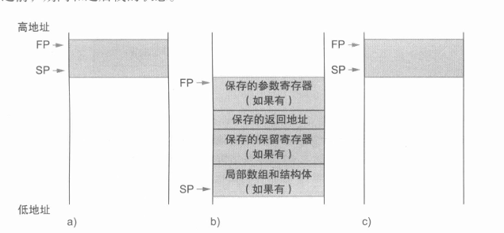


## 人机交互

## 对大立即数的RISC-V编址和寻址
### RISC-V寻址模式总结

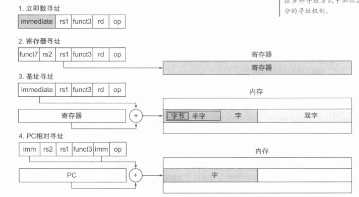

- 立即数寻址:操作数时指令本身
- 寄存器寻址：操作数在寄存器
- 基地址或偏移地址：操作数位于内存中，其地址是寄存器和指令中的常量和
- PC相对寻址：分支地址是PC和指令常量之和

### 机器码语言
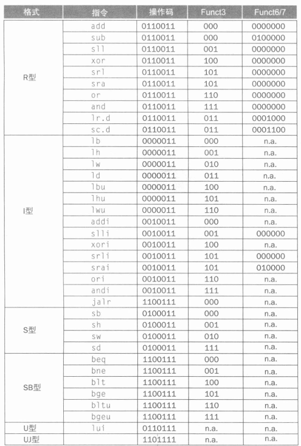


## 指令和并行性：同步
RISC-V有一个被称为保留加载的双字（lr.d）的特殊加载指令和一个被称为条件存储双字（sc.d）的特殊指令。这些指令按序使用：若果保留加载指令指定的内存位置的内容在条件存储指令执行到同一地址之前发生了变化，则条件存储指令会失败并且不会将值写入内存。条件存储指令定义为将寄存器的值存储在内存之中，如果成功则将另一个寄存器的值更改为0，如果失败则更改为非零值。因此sc，d指定三个寄存器，一个用于保存地址，一个用于指示原子操作的成功或失败，还有一个用于如果成功则将值存储在内存中。由于保留加载指令返回初始值，并且条件存储指令仅在成功的时候返回0，因此以下序列在寄存器x20的指定内存位置实现原子交换。
```asm
again:lr.d x10,(x20) //加载数据
    sc.d x11,x23,(x20) //
    bne x11,x0,again
    addi  x23,x10,0 
```
每当处理器干预并修改lr.d和sc.d之间的内存中的值，sc.d就会将非零值写入x11,从而导致代码序列重新执行，此序列结束时，x23和x20指向的内存位置发生了互换。

## 翻译并启动程序
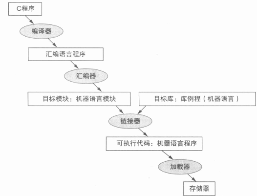

## 数组与指针

## 谬误与陷阱
**跟强大的指令意味着更高的性能**

**用汇编语言编程以获得最高的性能**

**商用计算机二进制兼容新的重要性意味着成功的指令系统无需改变**

# 计算机的运算组成


## 乘法
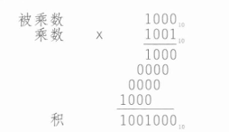
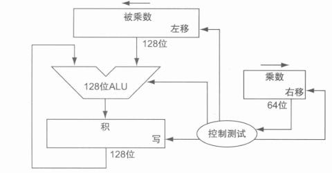

### **例题**
计算2*3或者0010*0011的乘积
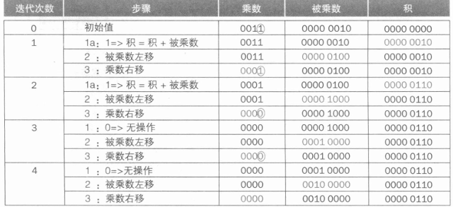

### 快速乘法
快速乘法通过为每一个乘数位提供一个乘法器
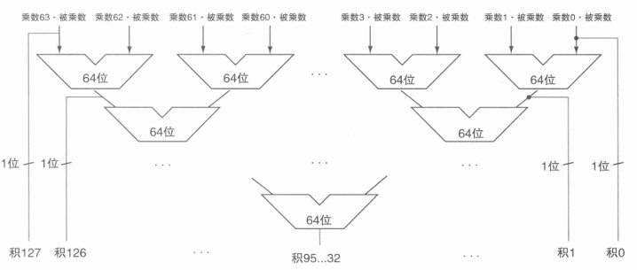

## 除法
除法是乘法的逆操作，除法的使用相对较少且很诡异，他甚至会出现无效的计算操作。

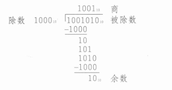

**硬件实现**
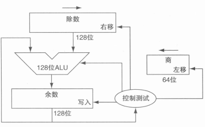

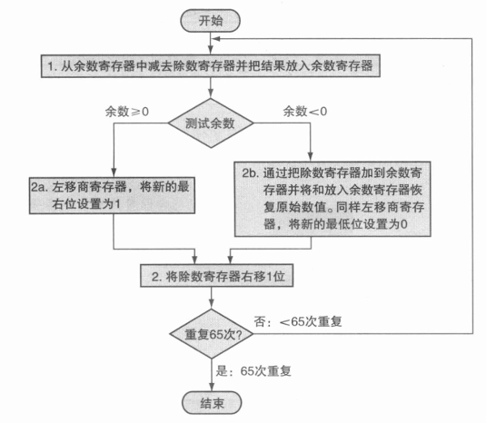

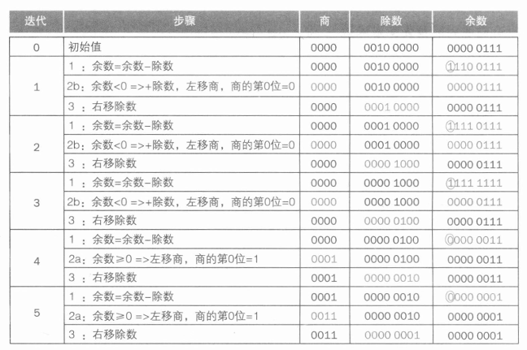

## 浮点运算
浮点运算必须找到在**尾数**的位数大小和**指数**位数大小的平衡，
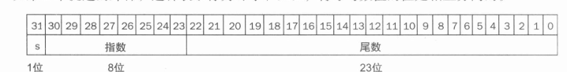

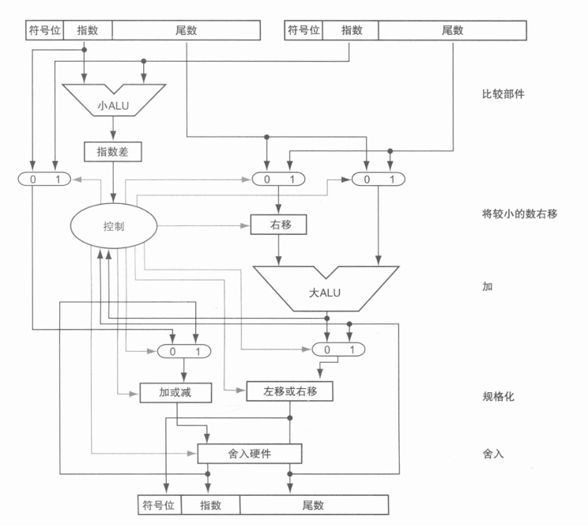

## 并行性与计算机技术：子字并行

## 谬误
**正如左移指令可以代替一个乘以2的幂正数，右移等同于除以一个2幂整数**


**适用于整数类型的并行执行的策略也适用于浮点类型的数据类型**

**只有理论数学家关心浮点精度**

## 处理器


