# 总结
## 创建型模式
这类模式提供创建对象的机制， 能够提升已有代码的灵活性和可复⽤性


## 结构型模式
这类模式介绍如何将对象和类组装成较⼤的结构， 并同时保持结构的灵活和⾼效。


## ⾏为模式
这类模式负责对象间的⾼效沟通和职责委派。


# 创建型模式

## 工厂模式
工厂模式（Factory Pattern）是最常用的设计模式之一。这种类型的设计模式属于创建型模式，它提供了一种创建对象的最佳方式。

工厂模式提供了一种将对象的实例化过程封装在工厂类中的方式。通过使用工厂模式，可以将对象的创建与使用代码分离，提供一种统一的接口来创建不同类型的对象。
### 特点介绍

**应用实例**： 1、您需要一辆汽车，可以直接从工厂里面提货，而不用去管这辆汽车是怎么做出来的，以及这个汽车里面的具体实现。 2、Hibernate 换数据库只需换方言和驱动就可以。

**优点**： 1、一个调用者想创建一个对象，只要知道其名称就可以了。 2、扩展性高，如果想增加一个产品，只要扩展一个工厂类就可以。 3、屏蔽产品的具体实现，调用者只关心产品的接口。

**缺点**：每次增加一个产品时，都需要增加一个具体类和对象实现工厂，使得系统中类的个数成倍增加，在一定程度上增加了系统的复杂度，同时也增加了系统具体类的依赖。这并不是什么好事。

**使用场景**： 1、日志记录器：记录可能记录到本地硬盘、系统事件、远程服务器等，用户可以选择记录日志到什么地方。 2、数据库访问，当用户不知道最后系统采用哪一类数据库，以及数据库可能有变化时。 3、设计一个连接服务器的框架，需要三个协议，"POP3"、"IMAP"、"HTTP"，可以把这三个作为产品类，共同实现一个接口。


### 工厂模式包含以下几个核心角色：

- **抽象产品（Abstract Product）**：定义了产品的共同接口或抽象类。它可以是具体产品类的父类或接口，规定了产品对象的共同方法。
**具体产品（Concrete Product）**：实现了抽象产品接口，定义了具体产品的特定行为和属性。
**抽象工厂（Abstract Factory）**：声明了创建产品的抽象方法，可以是接口或抽象类。它可以有多个方法用于创建不同类型的产品。
**具体工厂（Concrete Factory）**：实现了抽象工厂接口，负责实际创建具体产品的对象。

### 实现架构
我们将创建一个 Shape 接口和实现 Shape 接口的实体类。下一步是定义工厂类 ShapeFactory。

FactoryPatternDemo 类使用 ShapeFactory 来获取 Shape 对象。它将向 ShapeFactory 传递信息（CIRCLE / RECTANGLE / SQUARE），以便获取它所需对象的类型。
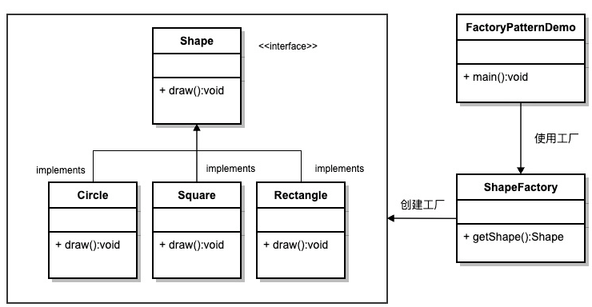
### java 实现
**步骤 1**
创建一个接口:
```rust
Shape.java
public interface Shape {
   void draw();
}
```

**步骤 2**
创建实现接口的实体类。
```java
Rectangle.java
public class Rectangle implements Shape {
 
   @Override
   public void draw() {
      System.out.println("Inside Rectangle::draw() method.");
   }
}
Square.java
public class Square implements Shape {
 
   @Override
   public void draw() {
      System.out.println("Inside Square::draw() method.");
   }
}
Circle.java
public class Circle implements Shape {
 
   @Override
   public void draw() {
      System.out.println("Inside Circle::draw() method.");
   }
}

```

**步骤 3**
创建一个工厂，生成基于给定信息的实体类的对象。
```rust
ShapeFactory.java
public class ShapeFactory {
    
   //使用 getShape 方法获取形状类型的对象
   public Shape getShape(String shapeType){
      if(shapeType == null){
         return null;
      }        
      if(shapeType.equalsIgnoreCase("CIRCLE")){
         return new Circle();
      } else if(shapeType.equalsIgnoreCase("RECTANGLE")){
         return new Rectangle();
      } else if(shapeType.equalsIgnoreCase("SQUARE")){
         return new Square();
      }
      return null;
   }
}

```

**步骤 4**
使用该工厂，通过传递类型信息来获取实体类的对象。
```java
FactoryPatternDemo.java
public class FactoryPatternDemo {
 
   public static void main(String[] args) {
      ShapeFactory shapeFactory = new ShapeFactory();
 
      //获取 Circle 的对象，并调用它的 draw 方法
      Shape shape1 = shapeFactory.getShape("CIRCLE");
 
      //调用 Circle 的 draw 方法
      shape1.draw();
 
      //获取 Rectangle 的对象，并调用它的 draw 方法
      Shape shape2 = shapeFactory.getShape("RECTANGLE");
 
      //调用 Rectangle 的 draw 方法
      shape2.draw();
 
      //获取 Square 的对象，并调用它的 draw 方法
      Shape shape3 = shapeFactory.getShape("SQUARE");
 
      //调用 Square 的 draw 方法
      shape3.draw();
   }
}
```

### rust实现
由于设计思想是一致的，关于rust的实现就不再赘述上述的步骤，直接贴上完整的代码。
```rust

// 定义接口
pub  trait Shape {
    fn draw(&self);  
}
// 创建实体类
struct Rectangle;
struct Square;
struct  Circle;
impl Shape for Rectangle {
    fn draw(&self) {
        println!("Inside Rectangle::draw() method.");
    }
}
impl Shape for Square {
    fn draw(&self) {
        println!("Inside Square::draw() method.");
    }
}
impl Shape for Circle {
    fn draw(&self) {
        println!("Inside Circle::draw() method.");
    }
}
struct ShapeFactory ;
impl ShapeFactory {
    fn get_shape(shape_type: &str)->Box<dyn Shape>{
        if shape_type=="CIRCLE" {
            Box::new(Circle{})
        }else if shape_type=="RECTANGLE" {
            Box::new(Rectangle{})
        }else if  shape_type=="SQUARE"{
            Box::new(Square{})
        }else {
            panic!("输入的类型不存在");
        }
  
    }

}

fn main() {

    let shape1=ShapeFactory::get_shape("CIRCLE");
    shape1.draw();
    let shape2=ShapeFactory::get_shape("RECTANGLE");
    shape2.draw();
    let shape3=ShapeFactory::get_shape("SQUARE");
    shape3.draw();
}

```
## 抽象工厂模式
抽象工厂模式（Abstract Factory Pattern）是围绕一个超级工厂创建其他工厂。该超级工厂又称为其他工厂的工厂。

在抽象工厂模式中，接口是负责创建一个相关对象的工厂，不需要显式指定它们的类。每个生成的工厂都能按照工厂模式提供对象。

抽象工厂模式提供了一种创建一系列相关或相互依赖对象的接口，而无需指定具体实现类。通过使用抽象工厂模式，可以将客户端与具体产品的创建过程解耦，使得客户端可以通过工厂接口来创建一族产品。
### 介绍
**意图**：提供一个创建一系列相关或相互依赖对象的接口，而无需指定它们具体的类。

**主要解决**：主要解决接口选择的问题。

**何时使用**：系统的产品有多于一个的产品族，而系统只消费其中某一族的产品。

如何解决：在一个产品族里面，定义多个产品。

关键代码：在一个工厂里聚合多个同类产品。

**应用实例**：工作了，为了参加一些聚会，肯定有两套或多套衣服吧，比如说有商务装（成套，一系列具体产品）、时尚装（成套，一系列具体产品），甚至对于一个家庭来说，可能有商务女装、商务男装、时尚女装、时尚男装，这些也都是成套的，即一系列具体产品。假设一种情况（现实中是不存在的，但有利于说明抽象工厂模式），在您的家中，某一个衣柜（具体工厂）只能存放某一种这样的衣服（成套，一系列具体产品），每次拿这种成套的衣服时也自然要从这个衣柜中取出了。用 OOP 的思想去理解，所有的衣柜（具体工厂）都是衣柜类的（抽象工厂）某一个，而每一件成套的衣服又包括具体的上衣（某一具体产品），裤子（某一具体产品），这些具体的上衣其实也都是上衣（抽象产品），具体的裤子也都是裤子（另一个抽象产品）。

**优点**：当一个产品族中的多个对象被设计成一起工作时，它能保证客户端始终只使用同一个产品族中的对象。

**缺点**：产品族扩展非常困难，要增加一个系列的某一产品，既要在抽象的 Creator 里加代码，又要在具体的里面加代码。

**使用场景**： 1、皮肤系统，一整套一起换。 


### 抽象工厂模式包含以下几个核心角色：
**抽象工厂（Abstract Factory）**：声明了一组用于创建产品对象的方法，每个方法对应一种产品类型。抽象工厂可以是接口或抽象类。
**具体工厂（Concrete Factory）**：实现了抽象工厂接口，负责创建具体产品对象的实例。
**抽象产品（Abstract Product）**：定义了一组产品对象的共同接口或抽象类，描述了产品对象的公共方法。
**具体产品（Concrete Product）**：实现了抽象产品接口，定义了具体产品的特定行为和属性。
抽象工厂模式通常涉及一族相关的产品，每个具体工厂类负责创建该族中的具体产品。客户端通过使用抽象工厂接口来创建产品对象，而不需要直接使用具体产品的实现类。

### 实现架构图
我们将创建 Shape 和 Color 接口和实现这些接口的实体类。下一步是创建抽象工厂类 AbstractFactory。接着定义工厂类 ShapeFactory 和 ColorFactory，这两个工厂类都是扩展了 AbstractFactory。然后创建一个工厂创造器/生成器类 FactoryProducer。

AbstractFactoryPatternDemo 类使用 FactoryProducer 来获取 AbstractFactory 对象。它将向 AbstractFactory 传递形状信息 Shape（CIRCLE / RECTANGLE / SQUARE），以便获取它所需对象的类型。同时它还向 AbstractFactory 传递颜色信息 Color（RED / GREEN / BLUE），以便获取它所需对象的类型。

抽象工厂模式的 UML 图
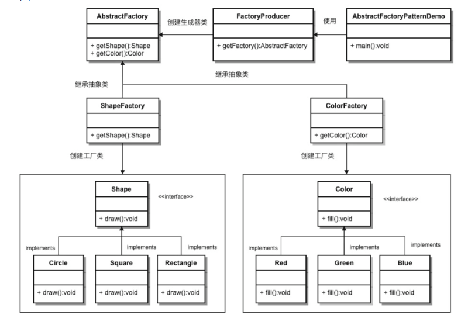
### java实现
**步骤 1**
为形状创建一个接口。
```java
Shape.java
public interface Shape {
   void draw();
}
```

**步骤 2**
创建实现接口的实体类。
```java
Rectangle.java

Rectangle.java
public class Rectangle implements Shape {
 
   @Override
   public void draw() {
      System.out.println("Inside Rectangle::draw() method.");
   }
}
Square.java
public class Square implements Shape {
 
   @Override
   public void draw() {
      System.out.println("Inside Square::draw() method.");
   }
}
Circle.java
public class Circle implements Shape {
 
   @Override
   public void draw() {
      System.out.println("Inside Circle::draw() method.");
   }
}
```

**步骤 3**
为颜色创建一个接口。
```java
Color.java
public interface Color {
   void fill();
}
```

**步骤4**
创建实现接口的实体类。
```java
Red.java
public class Red implements Color {
 
   @Override
   public void fill() {
      System.out.println("Inside Red::fill() method.");
   }
}
Green.java
public class Green implements Color {
 
   @Override
   public void fill() {
      System.out.println("Inside Green::fill() method.");
   }
}
Blue.java
public class Blue implements Color {
 
   @Override
   public void fill() {
      System.out.println("Inside Blue::fill() method.");
   }
}
```
**步骤 5**
为 Color 和 Shape 对象创建抽象类来获取工厂。
```java
AbstractFactory.java
public abstract class AbstractFactory {
   public abstract Color getColor(String color);
   public abstract Shape getShape(String shape);
}
```

**步骤 6**
创建扩展了 AbstractFactory 的工厂类，基于给定的信息生成实体类的对象。
```java

ShapeFactory.java
public class ShapeFactory extends AbstractFactory {
    
   @Override
   public Shape getShape(String shapeType){
      if(shapeType == null){
         return null;
      }        
      if(shapeType.equalsIgnoreCase("CIRCLE")){
         return new Circle();
      } else if(shapeType.equalsIgnoreCase("RECTANGLE")){
         return new Rectangle();
      } else if(shapeType.equalsIgnoreCase("SQUARE")){
         return new Square();
      }
      return null;
   }
   
   @Override
   public Color getColor(String color) {
      return null;
   }
}
ColorFactory.java
public class ColorFactory extends AbstractFactory {
    
   @Override
   public Shape getShape(String shapeType){
      return null;
   }
   
   @Override
   public Color getColor(String color) {
      if(color == null){
         return null;
      }        
      if(color.equalsIgnoreCase("RED")){
         return new Red();
      } else if(color.equalsIgnoreCase("GREEN")){
         return new Green();
      } else if(color.equalsIgnoreCase("BLUE")){
         return new Blue();
      }
      return null;
   }
}
```

**步骤 7**
创建一个工厂创造器/生成器类，通过传递形状或颜色信息来获取工厂。
```java
FactoryProducer.java
public class FactoryProducer {
   public static AbstractFactory getFactory(String choice){
      if(choice.equalsIgnoreCase("SHAPE")){
         return new ShapeFactory();
      } else if(choice.equalsIgnoreCase("COLOR")){
         return new ColorFactory();
      }
      return null;
   }
}
```

**步骤 8**
使用 FactoryProducer 来获取 AbstractFactory，通过传递类型信息来获取实体类的对象。
```java
AbstractFactoryPatternDemo.java
public class AbstractFactoryPatternDemo {
   public static void main(String[] args) {
 
      //获取形状工厂
      AbstractFactory shapeFactory = FactoryProducer.getFactory("SHAPE");
 
      //获取形状为 Circle 的对象
      Shape shape1 = shapeFactory.getShape("CIRCLE");
 
      //调用 Circle 的 draw 方法
      shape1.draw();
 
      //获取形状为 Rectangle 的对象
      Shape shape2 = shapeFactory.getShape("RECTANGLE");
 
      //调用 Rectangle 的 draw 方法
      shape2.draw();
      
      //获取形状为 Square 的对象
      Shape shape3 = shapeFactory.getShape("SQUARE");
 
      //调用 Square 的 draw 方法
      shape3.draw();
 
      //获取颜色工厂
      AbstractFactory colorFactory = FactoryProducer.getFactory("COLOR");
 
      //获取颜色为 Red 的对象
      Color color1 = colorFactory.getColor("RED");
 
      //调用 Red 的 fill 方法
      color1.fill();
 
      //获取颜色为 Green 的对象
      Color color2 = colorFactory.getColor("GREEN");
 
      //调用 Green 的 fill 方法
      color2.fill();
 
      //获取颜色为 Blue 的对象
      Color color3 = colorFactory.getColor("BLUE");
 
      //调用 Blue 的 fill 方法
      color3.fill();
   }
}
```


**步骤 9**
执行程序，输出结果：
```shell
Inside Circle::draw() method.
Inside Rectangle::draw() method.
Inside Square::draw() method.
Inside Red::fill() method.
Inside Green::fill() method.
Inside Blue::fill() method.

```
### rust实现
```rust
// 定义接口

// 创建实体类
struct Rectangle;
struct Square;
struct  Circle;
struct ShapeFactory ;
struct ColorFactory ;
struct  FactoryProducer ;
struct Red;
struct Blue;
struct  Green;
pub trait Color{
    fn fill(&self);  
}
impl Color for Red {
    fn fill(&self) {
        println!("Inside Red::fill() method.");
    }
}
impl Color for Blue {
    fn fill(&self) {
        println!("Inside Blue::fill() method.");
    }
}
impl Color for Green {
    fn fill(&self) {
        println!("Inside Green::fill() method.");
    }
}


pub  trait Shape {
    fn draw(&self);  
}
impl Shape for Rectangle {
    fn draw(&self) {
        println!("Inside Rectangle::draw() method.");
    }
}
impl Shape for Square {
    fn draw(&self) {
        println!("Inside Square::draw() method.");
    }
}
impl Shape for Circle {
    fn draw(&self) {
        println!("Inside Circle::draw() method.");
    }
}
pub trait AbstractFactory {
    fn get_color(&self,color: &str)->Result<Box<dyn Color>>;
    fn get_shape(&self,shape: &str)->Box<dyn Shape>;
 }

impl AbstractFactory for ShapeFactory {
    fn get_shape(&self,shape_type: &str)->Box<dyn Shape>{
        if shape_type=="CIRCLE" {
            Box::new(Circle{})
        }else if shape_type=="RECTANGLE" {
            Box::new(Rectangle{})
        }else if  shape_type=="SQUARE"{
            Box::new(Square{})
        }else {
            panic!("输入的类型不存在");
        }
  
    }
    fn get_color(&self,_shape_type: &str)->Box<dyn Color>{

        panic!("输入的类型不存在");
  
    }
}
impl AbstractFactory for ColorFactory {
    fn get_color(&self,shape_type: &str)->Box<dyn Color>{
        if shape_type=="RED" {
            Box::new(Red{})
        }else if shape_type=="BLUE" {
            Box::new(Blue{})
        }else if  shape_type=="GREEN"{
            Box::new(Green{})
        }else {
            panic!("输入的类型不存在");
        }
    }
    fn get_shape(&self,_shape_type: &str)->Box<dyn Shape>{

        panic!("输入的类型不存在");
    }

}

impl  FactoryProducer {
    fn get_factory(choice: &str)-> Box<dyn AbstractFactory>{
        if choice=="COLOR" {
            Box::new(ColorFactory{})
        }else if choice=="SHAPE" {
            Box::new(ShapeFactory{})
        }else {
            panic!("输入的类型不存在");
        }
    }
}

fn main() {
    let shape=FactoryProducer::get_factory("SHAPE");
    let shape1=shape.get_shape("CIRCLE");
    shape1.draw();
    let shape2=shape.get_shape("RECTANGLE");
    shape2.draw();
    let shape3=shape.get_shape("SQUARE");
    shape3.draw();
    let color=FactoryProducer::get_factory("COLOR");
    let color1=color.get_color("RED");
    color1.fill();
    let color2=color.get_color("BLUE");
    color2.fill();
    let color3=color.get_color("GREEN");
    color3.fill();
}
```
## 单例模式
**单例模式**（Singleton Pattern）是最简单的设计模式之一。这种类型的设计模式属于创建型模式，它提供了一种创建对象的最佳方式。

这种模式涉及到一个单一的类，该类负责创建自己的对象，同时确保只有单个对象被创建。这个类提供了一种访问其唯一的对象的方式，可以直接访问，不需要实例化该类的对象。

单例模式是一种创建型设计模式，它确保一个类只有一个实例，并提供了一个全局访问点来访问该实例。

**注意**：

1. 单例类只能有一个实例。
2. 单例类必须自己创建自己的唯一实例。
3. 单例类必须给所有其他对象提供这一实例。

### 介绍
**意图**：保证一个类仅有一个实例，并提供一个访问它的全局访问点。

**主要解决**：一个全局使用的类频繁地创建与销毁。

**何时使用**：当您想控制实例数目，节省系统资源的时候。

**如何解决**：判断系统是否已经有这个单例，如果有则返回，如果没有则创建。

**关键代码**：构造函数是私有的。

####  应用实例：
1. 一个班级只有一个班主任。
2. Windows 是多进程多线程的，在操作一个文件的时候，就不可避免地出现多个进程或线程同时操作一个文件的现象，所以所有文件的处理必须通过唯一的实例来进行。
3. 一些设备管理器常常设计为单例模式，比如一个电脑有两台打印机，在输出的时候就要处理不能两台打印机打印同一个文件。

#### 优点
1. 在内存里只有一个实例，减少了内存的开销，尤其是频繁的创建和销毁实例（比如管理学院首页页面缓存）。
2. 避免对资源的多重占用（比如写文件操作）。
缺点：没有接口，不能继承，与单一职责原则冲突，一个类应该只关心内部逻辑，而不关心外面怎么样来实例化。

#### 使用场景

1. 要求生产唯一序列号。
2. WEB 中的计数器，不用每次刷新都在数据库里加一次，用单例先缓存起来。
3. 创建的一个对象需要消耗的资源过多，比如 I/O 与数据库的连接等。


### 架构图
我们将创建一个 SingleObject 类。SingleObject 类有它的私有构造函数和本身的一个静态实例。

SingleObject 类提供了一个静态方法，供外界获取它的静态实例。SingletonPatternDemo 类使用 SingleObject 类来获取 SingleObject 对象。

**单例模式的 UML 图**
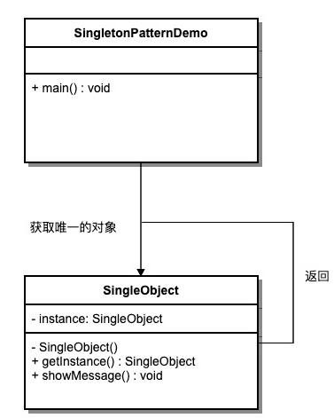
**步骤 1**
### JAVA 实现
创建一个 Singleton 类。
SingleObject.java
```java
public class SingleObject {
 
   //创建 SingleObject 的一个对象
   private static SingleObject instance = new SingleObject();
 
   //让构造函数为 private，这样该类就不会被实例化
   private SingleObject(){}
 
   //获取唯一可用的对象
   public static SingleObject getInstance(){
      return instance;
   }
 
   public void showMessage(){
      System.out.println("Hello World!");
   }
}
```


***步骤 2***
从 singleton 类获取唯一的对象。

SingletonPatternDemo.java
```java
public class SingletonPatternDemo {
   public static void main(String[] args) {
 
      //不合法的构造函数
      //编译时错误：构造函数 SingleObject() 是不可见的
      //SingleObject object = new SingleObject();
 
      //获取唯一可用的对象
      SingleObject object = SingleObject.getInstance();
 
      //显示消息
      object.showMessage();
   }
}
```

**步骤 3**
执行程序，输出结果：

Hello World!
#### 单例模式的几种实现方式
单例模式的实现有多种方式，如下所示：

1、**懒汉式**，线程不安全
- 是否 Lazy 初始化：是
- 是否多线程安全：否
- 实现难度：易
- 描述：这种方式是最基本的实现方式，这种实现最大的问题就是不支持多线程。因为没有加锁 synchronized，所以严格意义上它并不算单例模式。
这种方式 lazy loading 很明显，不要求线程安全，在多线程不能正常工作。

**实例**
```java
public class Singleton {  
    private static Singleton instance;  
    private Singleton (){}  
  
    public static Singleton getInstance() {  
        if (instance == null) {  
            instance = new Singleton();  
        }  
        return instance;  
    }  
}
```

接下来介绍的几种实现方式都支持多线程，但是在性能上有所差异。

2、**懒汉式**，线程安全
- 是否 Lazy 初始化：是
- 是否多线程安全：是
- 实现难度：易
- 描述：这种方式具备很好的 lazy loading，能够在多线程中很好的工作，但是，效率很低，99% 情况下不需要同步。
- 优点：第一次调用才初始化，避免内存浪费。
- 缺点：必须加锁 synchronized 才能保证单例，但加锁会影响效率。


**实例**
```java
public class Singleton {  
    private static Singleton instance;  
    private Singleton (){}  
    public static synchronized Singleton getInstance() {  
        if (instance == null) {  
            instance = new Singleton();  
        }  
        return instance;  
    }  
}
```

3、**饿汉式**
- 是否 Lazy 初始化：否
- 是否多线程安全：是
- 实现难度：易
- 描述：这种方式比较常用，但容易产生垃圾对象。
- 优点：没有加锁，执行效率会提高。
- 缺点：类加载时就初始化，浪费内存。

它基于 classloader 机制避免了多线程的同步问题，不过，instance 在类装载时就实例化，虽然导致类装载的原因有很多种，在单例模式中大多数都是调用 getInstance 方法， 但是也不能确定有其他的方式（或者其他的静态方法）导致类装载，这时候初始化 instance 显然没有达到 lazy loading 的效果。

**实例**
```java
public class Singleton {  
    private static Singleton instance = new Singleton();  
    private Singleton (){}  
    public static Singleton getInstance() {  
    return instance;  
    }  
}
```

4、**双检锁/双重校验锁（DCL，即 double-checked locking）**
- 是否 Lazy 初始化：是
- 是否多线程安全：是
- 实现难度：较复杂
- 描述：这种方式采用双锁机制，安全且在多线程情况下能保持高性能。

实例
```java
public class Singleton {  
    private volatile static Singleton singleton;  
    private Singleton (){}  
    public static Singleton getSingleton() {  
    if (singleton == null) {  
        synchronized (Singleton.class) {  
            if (singleton == null) {  
                singleton = new Singleton();  
            }  
        }  
    }  
    return singleton;  
    }  
}

```

5、**登记式/静态内部类**
- 是否 Lazy 初始化：是
- 是否多线程安全：是
- 实现难度：一般
- 描述：这种方式能达到双检锁方式一样的功效，但实现更简单。对静态域使用延迟初始化，应使用这种方式而不是双检锁方式。这种方式只适用于静态域的情况，双检锁方式可在实例域需要延迟初始化时使用。

这种方式同样利用了 classloader 机制来保证初始化 instance 时只有一个线程，它跟第 3 种方式不同的是：第 3 种方式只要 Singleton 类被装载了，那么 instance 就会被实例化（没有达到 lazy loading 效果），而这种方式是 Singleton 类被装载了，instance 不一定被初始化。因为 SingletonHolder 类没有被主动使用，只有通过显式调用 getInstance 方法时，才会显式装载 SingletonHolder 类，从而实例化 instance。想象一下，如果实例化 instance 很消耗资源，所以想让它延迟加载，另外一方面，又不希望在 Singleton 类加载时就实例化，因为不能确保 Singleton 类还可能在其他的地方被主动使用从而被加载，那么这个时候实例化 instance 显然是不合适的。这个时候，这种方式相比第 3 种方式就显得很合理。

**实例**
```java
public class Singleton {  
    private static class SingletonHolder {  
    private static final Singleton INSTANCE = new Singleton();  
    }  
    private Singleton (){}  
    public static final Singleton getInstance() {  
        return SingletonHolder.INSTANCE;  
    }  
}
```

6、**枚举**
- 是否 Lazy 初始化：否
- 是否多线程安全：是
- 实现难度：易
- 描述：这种实现方式还没有被广泛采用，但这是实现单例模式的最佳方法。它更简洁，自动支持序列化机制，绝对防止多次实例化。
这种方式是 Effective Java 作者 Josh Bloch 提倡的方式，它不仅能避免多线程同步问题，而且还自动支持序列化机制，防止反序列化重新创建新的对象，绝对防止多次实例化。不过，由于 JDK1.5 之后才加入 enum 特性，用这种方式写不免让人感觉生疏，在实际工作中，也很少用。
**实例**
```java
public enum Singleton {  
    INSTANCE;  
    public void whateverMethod() {  
    }  
}
```
### rust实现
在用rust进行懒加载时，最方便的还是用第三方库，本人运用的是`lazy_static`库，在用这社区库时，需要引入在Cargo.toml文件下的`[dependencies]`项目下引lazy_static = "1.4.0"。如图
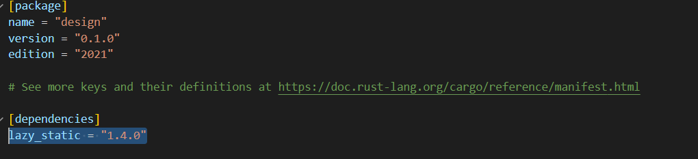

```rust
use std::sync::{Arc, Mutex};
use lazy_static::lazy_static;
 struct Singleton;
 impl Singleton {
    //关联方法， 获取单例实例的方法
    fn get_instance() -> Arc<Mutex<Singleton>> {
        // 使用懒加载创建单例实例
        // 这里使用了 Arc 和 Mutex 来实现线程安全的单例
        // 只有第一次调用 get_instance 时会创建实例，之后都会返回已创建的实例
        static mut INSTANCE: Option<Arc<Mutex<Singleton>>> = None;//静态初始化，只运行一次
         unsafe {
            // get_or_insert_with ,如果是 None ，则将从data计算的值插入选项中，然后返回对包含值的可变引用。
            INSTANCE.get_or_insert_with(|| {
                Arc::new(Mutex::new(Singleton {}))}).clone()
        }
    }
    fn show_message(&self){
        println!("Hello World!");
     }
}

// 使用lazy_static的懒加载
struct SingletonL;
impl SingletonL {
    fn show_message(&self){
        println!("Hello World!");
     }
}
lazy_static! {
    static ref INSTANCE: Mutex<SingletonL> = Mutex::new(SingletonL {   });
}

fn main() {
  // 获取单例实例,自定义
  let instance1 = Singleton::get_instance();
  
   // 修改单例数据
  {
      let instance = instance1.lock().unwrap();
      instance.show_message();
  }
  // 获取单例实例,社区lazy_static
  let instance = INSTANCE.lock().unwrap();
  instance.show_message();
}
```                                                         
## 建造者模式
建造者模式（Builder Pattern）使用多个简单的对象一步一步构建成一个复杂的对象。

一个 Builder 类会一步一步构造最终的对象。该 Builder 类是独立于其他对象的。

### 介绍
- **意图**：将一个复杂的构建与其表示相分离，使得同样的构建过程可以创建不同的表示。
- **主要解决**：主要解决在软件系统中，有时候面临着"一个复杂对象"的创建工作，其通常由各个部分的子对象用一定的算法构成；由于需求的变化，这个复杂对象的各个部分经常面临着剧烈的变化，但是将它们组合在一起的算法却相对稳定。
- **关键代码**：建造者：创建和提供实例，导演：管理建造出来的实例的依赖关系。
- **应用实例**： 1、去肯德基，汉堡、可乐、薯条、炸鸡翅等是不变的，而其组合是经常变化的，生成出所谓的"套餐"。
#### 优点
- 分离构建过程和表示，使得构建过程更加灵活，可以构建不同的表示。
- 可以更好地控制构建过程，隐藏具体构建细节。
- 代码复用性高，可以在不同的构建过程中重复使用相同的建造者。
#### 缺点
- 如果产品的属性较少，建造者模式可能会导致代码冗余。
- 建造者模式增加了系统的类和对象数量。

#### 使用场景
- 需要生成的对象具有复杂的内部结构。 
- 需要生成的对象内部属性本身相互依赖。

建造者模式在创建复杂对象时非常有用，特别是当对象的构建过程涉及多个步骤或参数时。它可以提供更好的灵活性和可维护性，同时使得代码更加清晰可读。


### 实现
我们假设一个快餐店的商业案例，其中，一个典型的套餐可以是一个汉堡（Burger）和一杯冷饮（Cold drink）。汉堡（Burger）可以是素食汉堡（Veg Burger）或鸡肉汉堡（Chicken Burger），它们是包在纸盒中。冷饮（Cold drink）可以是可口可乐（coke）或百事可乐（pepsi），它们是装在瓶子中。

我们将创建一个表示食物条目（比如汉堡和冷饮）的 Item 接口和实现 Item 接口的实体类，以及一个表示食物包装的 Packing 接口和实现 Packing 接口的实体类，汉堡是包在纸盒中，冷饮是装在瓶子中。

然后我们创建一个 Meal 类，带有 Item 的 ArrayList 和一个通过结合 Item 来创建不同类型的 Meal 对象的 MealBuilder。BuilderPatternDemo 类使用 MealBuilder 来创建一个 Meal。

建造者模式的 UML 图
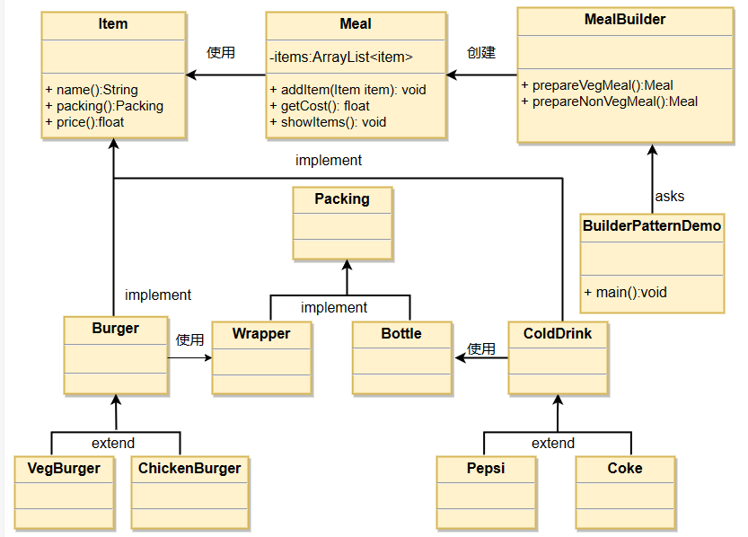
### java
**步骤 1**
创建一个表示食物条目和食物包装的接口。
Item.java
```java
public interface Item {
   public String name();
   public Packing packing();
   public float price();    
}
Packing.java
public interface Packing {
   public String pack();
}

```
**步骤 2**
创建实现 Packing 接口的实体类,方便进行不同的包装。
Wrapper.java
```java
public class Wrapper implements Packing {
 
   @Override
   public String pack() {
      return "Wrapper";
   }
}
```

Bottle.java
```java
public class Bottle implements Packing {
 
   @Override
   public String pack() {
      return "Bottle";
   }
}
```

**步骤 3**
创建实现 Item 接口的抽象类，该类提供了默认的功能,实现汉堡抽象和冷饮抽象的包装类。

Burger.java
```java
public abstract class Burger implements Item {
 
   @Override
   public Packing packing() {
      return new Wrapper();
   }
 
   @Override
   public abstract float price();
}
```

ColdDrink.java
```java
public abstract class ColdDrink implements Item {
 
    @Override
    public Packing packing() {
       return new Bottle();
    }
 
    @Override
    public abstract float price();
}
```

**步骤 4**
创建扩展了 Burger 和 ColdDrink 的实体类。

VegBurger.java
```java
public class VegBurger extends Burger {
 
   @Override
   public float price() {
      return 25.0f;
   }
 
   @Override
   public String name() {
      return "Veg Burger";
   }
}
```

ChickenBurger.java
```java
public class ChickenBurger extends Burger {
 
   @Override
   public float price() {
      return 50.5f;
   }
 
   @Override
   public String name() {
      return "Chicken Burger";
   }
}
```

Coke.java
```java

public class Coke extends ColdDrink {
 
   @Override
   public float price() {
      return 30.0f;
   }
 
   @Override
   public String name() {
      return "Coke";
   }
}
```
Pepsi.java
```java

public class Pepsi extends ColdDrink {
 
   @Override
   public float price() {
      return 35.0f;
   }
 
   @Override
   public String name() {
      return "Pepsi";
   }
}
```

**步骤 5**
创建一个 Meal 类，带有上面定义的 Item 对象。

Meal.java
```java
import java.util.ArrayList;
import java.util.List;
 
public class Meal {
   private List<Item> items = new ArrayList<Item>();    
 
   public void addItem(Item item){
      items.add(item);
   }
 
   public float getCost(){
      float cost = 0.0f;
      for (Item item : items) {
         cost += item.price();
      }        
      return cost;
   }
 
   public void showItems(){
      for (Item item : items) {
         System.out.print("Item : "+item.name());
         System.out.print(", Packing : "+item.packing().pack());
         System.out.println(", Price : "+item.price());
      }        
   }    
}

```

**步骤 6**
创建一个 MealBuilder 类，实际的 builder 类负责创建 Meal 对象。

MealBuilder.java
```java
public class MealBuilder {
 
   public Meal prepareVegMeal (){
      Meal meal = new Meal();
      meal.addItem(new VegBurger());
      meal.addItem(new Coke());
      return meal;
   }   
 
   public Meal prepareNonVegMeal (){
      Meal meal = new Meal();
      meal.addItem(new ChickenBurger());
      meal.addItem(new Pepsi());
      return meal;
   }
}
```

**步骤 7**
BuiderPatternDemo 使用 MealBuilder 来演示建造者模式（Builder Pattern）。

BuilderPatternDemo.java
```java
public class BuilderPatternDemo {
   public static void main(String[] args) {
      MealBuilder mealBuilder = new MealBuilder();
 
      Meal vegMeal = mealBuilder.prepareVegMeal();
      System.out.println("Veg Meal");
      vegMeal.showItems();
      System.out.println("Total Cost: " +vegMeal.getCost());
 
      Meal nonVegMeal = mealBuilder.prepareNonVegMeal();
      System.out.println("\n\nNon-Veg Meal");
      nonVegMeal.showItems();
      System.out.println("Total Cost: " +nonVegMeal.getCost());
   }
}
```

**步骤 8**
执行程序，输出结果：
```shell

Veg Meal
Item : Veg Burger, Packing : Wrapper, Price : 25.0
Item : Coke, Packing : Bottle, Price : 30.0
Total Cost: 55.0


Non-Veg Meal
Item : Chicken Burger, Packing : Wrapper, Price : 50.5
Item : Pepsi, Packing : Bottle, Price : 35.0
Total Cost: 85.5
```
### rust
因为rust的类支持组合式而不支持继承，在进行建造者构件时比java更加容易，rust的trait是支持继承的。
```rust
// rsut trait不支持重名
pub trait Item {
    fn name(&self)->String;   
    fn price(&self)->f32;   
    fn packing(&self)->String;
}

// 汉堡实体类
struct ChickenBurger;
impl Item for ChickenBurger {
    fn name(&self)->String {
        String::from("ChickenBurger")
    }
    fn price(&self)->f32 {
        35.0
    }
    fn packing(&self)->String {
        String::from("Wrappper")
    }
   
}  
struct VegBurger;
impl Item for VegBurger {
    fn name(&self)->String {
        String::from("Pepsi")
    }
    fn price(&self)->f32 {
        35.0
    }
    fn packing(&self)->String {
        String::from("Wrappper")
    }
}  

// 饮料实体类
struct Pepsi;

impl Item for Pepsi {
    fn name(&self)->String {
        String::from("Pesi")
    }
    fn price(&self)->f32 {
        35.0
    }
    fn packing(&self)->String {
        String::from("Bottle")
    }
}  
struct Coke;

impl Item for Coke {
    fn name(&self)->String {
        String::from("Coke")
    }
    fn price(&self)->f32 {
        35.0
    }
    fn packing(&self)->String {
        String::from("Bottle")
    }
}  

struct Meal {
    items:Vec<Box<dyn Item>>,
}
impl Meal {
    fn add_item<T>(&mut self,item:Box<dyn Item>) 
    {
        self.items.push(item)
    }
    fn get_cost(&self)->f32{
        // 普通函数实现
        // let mut sum:f32=0.0; 
        // for i in self.items.iter()  {
        //     let price = i.price();
        //     sum+=price;
        // }
        // sum

        // 函数sji
        self.items.iter().fold(0.0, |acc, x| acc + x.price())
    }
    fn  show_items(&self){
        for  i in self.items.iter() {
            println!("{}",i.name());
            println!("{}",i.packing());
            println!("{}",i.price());
        }
    }
}
// 添加建造者
struct MealBuilder {}
impl  MealBuilder {
    fn prepareVegMeal()->Meal{
        let mut meal=Meal{items:Vec::new()};
        meal.add_item::<Box<dyn Item>>(Box::new(VegBurger{}));
        meal.add_item::<Box<dyn Item>>(Box::new(Coke{}));
        meal
    }
    fn prepareNonVegMeal()->Meal{
        let mut meal=Meal{items:Vec::new()};
        meal.add_item::<Box<dyn Item>>(Box::new(ChickenBurger{}));
        meal.add_item::<Box<dyn Item>>(Box::new(Pepsi{}));
        meal
    }
}
fn main() {
    let m=MealBuilder::prepareVegMeal();
    println!(" Veg Meal");
    m.show_items();
    println!("Total Cost : {}",m.get_cost());
    let m=MealBuilder::prepareNonVegMeal();
    println!(" \n\nNon-Veg Meal");
    m.show_items();
    println!("Total Cost : {}",m.get_cost());
}
```


## 原型模式
原型模式（Prototype Pattern）是用于创建重复的对象，同时又能保证性能。

这种模式是实现了一个原型接口，该接口用于创建当前对象的克隆。当直接创建对象的代价比较大时或者相同的对象需要被重复创建时，则采用这种模式。例如，一个对象需要在一个高代价的数据库操作之后被创建。我们可以缓存该对象，在下一个请求时返回它的克隆，在需要的时候更新数据库，以此来减少数据库调用。另一个例子，在考试中，每个人做的试卷是相同的，但是试卷却又成千上万份，我们不可能每次都手打一份试卷，因此第一份编排好的试卷就是原型，其他的都是她的复制。

### 介绍
- **意图**：用原型实例指定创建对象的种类，并且通过拷贝这些原型创建新的对象。
- **主要解决**：创建相同却又互相独立的对象，就像试卷每个人的试卷相同，但是每个人的答案却又不同。
- **何时使用**： 1、当一个系统应该独立于它的产品创建，构成和表示时。 2、当要实例化的类是在运行时刻指定时，例如，通过动态装载。 3、为了避免创建一个与产品类层次平行的工厂类层次时。 4、当一个类的实例只能有几个不同状态组合中的一种时。建立相应数目的原型并克隆它们可能比每次用合适的状态手工实例化该类更方便一些。
- **如何解决**：利用已有的一个原型对象，快速地生成和原型对象一样的实例。
- **关键代码**： 1、实现克隆操作，在 JAVA 实现 Cloneable 接口，重写 clone()，在 rust中可以使用clone（） 方法来实现对象的深拷贝。
- **应用实例**： 1、细胞分裂。 2、考试中为每个考生分发相同的试卷。
####  优点
1、性能提高。 
2、逃避构造函数的约束。
##### 缺点
1、配备克隆方法需要对类的功能进行通盘考虑，这对于全新的类不是很难，但对于已有的类不一定很容易，特别当一个类引用不支持串行化的间接对象，或者引用含有循环结构的时候。 

#####  使用场景
1、资源优化场景。
2、类初始化需要消化非常多的资源，这个资源包括数据、硬件资源等。 3、性能和安全要求的场景。 
4、通过 new 产生一个对象需要非常繁琐的数据准备或访问权限，则可以使用原型模式。 5、一个对象多个修改者的场景。 
6、一个对象需要提供给其他对象访问，而且各个调用者可能都需要修改其值时，可以考虑使用原型模式拷贝多个对象供调用者使用。 
7、在实际项目中，原型模式很少单独出现，一般是和工厂方法模式一起出现，通过 clone 的方法创建一个对象，然后由工厂方法提供给调用者。


### 实现
我们将创建一个抽象类 Shape 和扩展了 Shape 类的实体类。下一步是定义类 ShapeCache，该类把 shape 对象存储在一个 Hashtable 中，并在请求的时候返回它们的克隆。

PrototypePatternDemo 类使用 ShapeCache 类来获取 Shape 对象。

原型模式的 UML 图
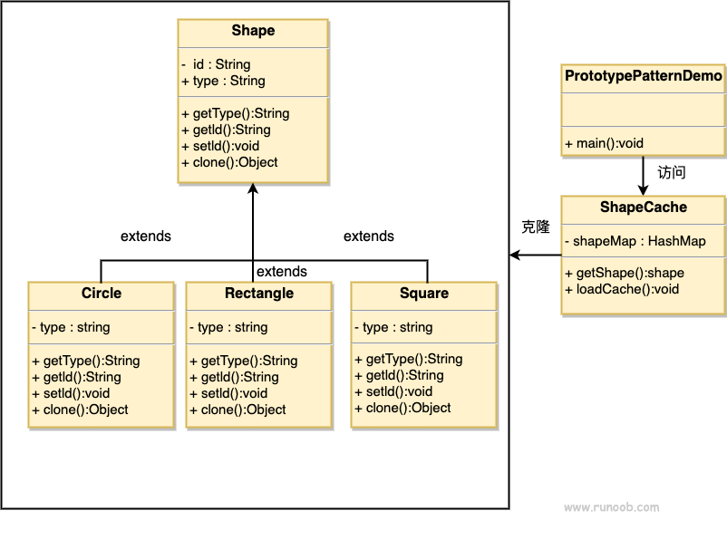
### java 实现
**步骤 1**
创建一个实现了 Cloneable 接口的抽象类。
Shape.java
```java
public abstract class Shape implements Cloneable {
   
   private String id;
   protected String type;
   
   abstract void draw();
   
   public String getType(){
      return type;
   }
   
   public String getId() {
      return id;
   }
   
   public void setId(String id) {
      this.id = id;
   }
   
   public Object clone() {
      Object clone = null;
      try {
         clone = super.clone();
      } catch (CloneNotSupportedException e) {
         e.printStackTrace();
      }
      return clone;
   }
}
```

**步骤 2**
创建扩展了上面抽象类的实体类。
Rectangle.java
```java
public class Rectangle extends Shape {
 
   public Rectangle(){
     type = "Rectangle";
   }
 
   @Override
   public void draw() {
      System.out.println("Inside Rectangle::draw() method.");
   }
}
```


Square.java
```java
public class Square extends Shape {
 
   public Square(){
     type = "Square";
   }
 
   @Override
   public void draw() {
      System.out.println("Inside Square::draw() method.");
   }
}
```

Circle.java
```java
public class Circle extends Shape {
 
   public Circle(){
     type = "Circle";
   }
 
   @Override
   public void draw() {
      System.out.println("Inside Circle::draw() method.");
   }
}
```
**步骤 3**
创建一个类，从数据库获取实体类，并把它们存储在一个 Hashtable 中。
ShapeCache.java
```java
import java.util.Hashtable;
 
public class ShapeCache {
    
   private static Hashtable<String, Shape> shapeMap 
      = new Hashtable<String, Shape>();
 
   public static Shape getShape(String shapeId) {
      Shape cachedShape = shapeMap.get(shapeId);
      return (Shape) cachedShape.clone();
   }
 
   // 对每种形状都运行数据库查询，并创建该形状
   // shapeMap.put(shapeKey, shape);
   // 例如，我们要添加三种形状
   public static void loadCache() {
      Circle circle = new Circle();
      circle.setId("1");
      shapeMap.put(circle.getId(),circle);
 
      Square square = new Square();
      square.setId("2");
      shapeMap.put(square.getId(),square);
 
      Rectangle rectangle = new Rectangle();
      rectangle.setId("3");
      shapeMap.put(rectangle.getId(),rectangle);
   }
}
```

**步骤 4**
PrototypePatternDemo 使用 ShapeCache 类来获取存储在 Hashtable 中的形状的克隆。

PrototypePatternDemo.java
```java
public class PrototypePatternDemo {
   public static void main(String[] args) {
      ShapeCache.loadCache();
 
      Shape clonedShape = (Shape) ShapeCache.getShape("1");
      System.out.println("Shape : " + clonedShape.getType());        
 
      Shape clonedShape2 = (Shape) ShapeCache.getShape("2");
      System.out.println("Shape : " + clonedShape2.getType());        
 
      Shape clonedShape3 = (Shape) ShapeCache.getShape("3");
      System.out.println("Shape : " + clonedShape3.getType());        
   }
}
```
**步骤 5**
执行程序，输出结果：
```shell
Shape : Circle
Shape : Square
Shape : Rectangle
```
### rust 实现
```rs
#[derive(Clone)]
struct Shape{
    id:String,
    mtype:String
}
impl Shape{
    fn set_id(&mut self,id:String){
        self.id=id;
    }
    fn get_id(&self)->&str{
        &self.id
    }
}
#[derive(Clone)]
struct  Rectangle{
    shape:Shape
}
impl Rectangle {
    fn new()->Rectangle {
        Rectangle{shape:Shape{
            id:String::from("value"),
            mtype:String::from("Rectangle")
        }}
    }
    fn draw() {
        println!("Inside Rectangle::draw() method.");
    }
}
#[derive(Clone)]
struct  Square {
    shape:Shape
}
impl Square  {
    fn new()->Square  {
        Square {shape:Shape{
            id:String::from("value"),
            mtype:String::from("Square ")
        }}
    }
    fn draw() {
        println!("Inside Square ::draw() method.");
    }
}
#[derive(Clone)]
struct  Circle {
    shape:Shape
}
impl Circle  {
    fn new()->Circle {
        Circle {shape:Shape{
            id:String::from("value"),
            mtype:String::from("Square ")
        }}
    }
    fn draw() {
        println!("Inside Circle ::draw() method.");
    }
}

fn main(){
    let s=Circle::new();
    let mut s1=s.clone();
    s1.shape.set_id(String::from("dsf"));
    println!("{}",s.shape.id);
    println!("{}",s1.shape.id);

}
```
# 结构型模式
## 适配器模式
适配器模式（Adapter Pattern）是作为两个不兼容的接口之间的桥梁。这种类型的设计模式属于结构型模式，它结合了两个独立接口的功能。

这种模式涉及到一个单一的类，该类负责加入独立的或不兼容的接口功能。举个真实的例子，读卡器是作为内存卡和笔记本之间的适配器。您将内存卡插入读卡器，再将读卡器插入笔记本，这样就可以通过笔记本来读取内存卡。


### 介绍
- **意图**：将一个类的接口转换成客户希望的另外一个接口。适配器模式使得原本由于接口不兼容而不能一起工作的那些类可以一起工作。
- **主要解决**：主要解决在软件系统中，常常要将一些"现存的对象"放到新的环境中，而新环境要求的接口是现对象不能满足的。
- **关键代码**：适配器继承或依赖已有的对象，实现想要的目标接口。

#### 何时使用
1、系统需要使用现有的类，而此类的接口不符合系统的需要。
2、想要建立一个可以重复使用的类，用于与一些彼此之间没有太大关联的一些类，包括一些可能在将来引进的类一起工作，这些源类不一定有一致的接口。 
3、通过接口转换，将一个类插入另一个类系中。（比如老虎和飞禽，现在多了一个飞虎，在不增加实体的需求下，增加一个适配器，在里面包容一个虎对象，实现飞的接口。）


#### 应用实例
1、美国电器 110V，中国 220V，就要有一个适配器将 110V 转化为 220V。 
2、在 LINUX 上运行 WINDOWS 程序。 
3、JAVA 中的 jdbc。

####  优点
1、可以让任何两个没有关联的类一起运行。 
2、提高了类的复用。 
3、增加了类的透明度。 
4、灵活性好。

#### 缺点
1、过多地使用适配器，会让系统非常零乱，不易整体进行把握。比如，明明看到调用的是 A 接口，其实内部被适配成了 B 接口的实现，一个系统如果太多出现这种情况，无异于一场灾难。因此如果不是很有必要，可以不使用适配器，而是直接对系统进行重构。 
2.由于 JAVA 至多继承一个类，所以至多只能适配一个适配者类，而且目标类必须是抽象类。

#### 使用场景
有动机地修改一个正常运行的系统的接口，这时应该考虑使用适配器模式。


### 实现
我们有一个 MediaPlayer 接口和一个实现了 MediaPlayer 接口的实体类 AudioPlayer。默认情况下，AudioPlayer 可以播放 mp3 格式的音频文件。

我们还有另一个接口 AdvancedMediaPlayer 和实现了 AdvancedMediaPlayer 接口的实体类。该类可以播放 vlc 和 mp4 格式的文件。

我们想要让 AudioPlayer 播放其他格式的音频文件。为了实现这个功能，我们需要创建一个实现了 MediaPlayer 接口的适配器类 MediaAdapter，并使用 AdvancedMediaPlayer 对象来播放所需的格式。

AudioPlayer 使用适配器类 MediaAdapter 传递所需的音频类型，不需要知道能播放所需格式音频的实际类。AdapterPatternDemo 类使用 AudioPlayer 类来播放各种格式。

适配器模式的 UML 图
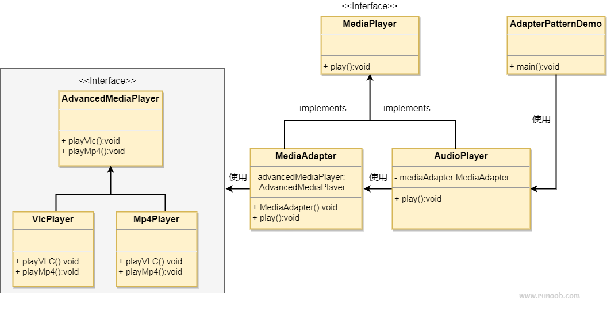
### java实现
**步骤 1**
为媒体播放器和更高级的媒体播放器创建接口。

MediaPlayer.java
```java
public interface MediaPlayer {
   public void play(String audioType, String fileName);
}
AdvancedMediaPlayer.java
public interface AdvancedMediaPlayer { 
   public void playVlc(String fileName);
   public void playMp4(String fileName);
}
```

**步骤 2**
创建实现了 AdvancedMediaPlayer 接口的实体类。

VlcPlayer.java
```java
public class VlcPlayer implements AdvancedMediaPlayer{
   @Override
   public void playVlc(String fileName) {
      System.out.println("Playing vlc file. Name: "+ fileName);      
   }
 
   @Override
   public void playMp4(String fileName) {
      //什么也不做
   }
}
```

Mp4Player.java
```java
public class Mp4Player implements AdvancedMediaPlayer{
 
   @Override
   public void playVlc(String fileName) {
      //什么也不做
   }
 
   @Override
   public void playMp4(String fileName) {
      System.out.println("Playing mp4 file. Name: "+ fileName);      
   }
}
```

**步骤 3**
创建实现了 MediaPlayer 接口的适配器类。

MediaAdapter.java
```java
public class MediaAdapter implements MediaPlayer {
 
   AdvancedMediaPlayer advancedMusicPlayer;
 
   public MediaAdapter(String audioType){
      if(audioType.equalsIgnoreCase("vlc") ){
         advancedMusicPlayer = new VlcPlayer();       
      } else if (audioType.equalsIgnoreCase("mp4")){
         advancedMusicPlayer = new Mp4Player();
      }  
   }
 
   @Override
   public void play(String audioType, String fileName) {
      if(audioType.equalsIgnoreCase("vlc")){
         advancedMusicPlayer.playVlc(fileName);
      }else if(audioType.equalsIgnoreCase("mp4")){
         advancedMusicPlayer.playMp4(fileName);
      }
   }
}
```

**步骤 4**
创建实现了 MediaPlayer 接口的实体类。

AudioPlayer.java
```java
public class AudioPlayer implements MediaPlayer {
   MediaAdapter mediaAdapter; 
 
   @Override
   public void play(String audioType, String fileName) {    
 
      //播放 mp3 音乐文件的内置支持
      if(audioType.equalsIgnoreCase("mp3")){
         System.out.println("Playing mp3 file. Name: "+ fileName);         
      } 
      //mediaAdapter 提供了播放其他文件格式的支持
      else if(audioType.equalsIgnoreCase("vlc") 
         || audioType.equalsIgnoreCase("mp4")){
         mediaAdapter = new MediaAdapter(audioType);
         mediaAdapter.play(audioType, fileName);
      }
      else{
         System.out.println("Invalid media. "+
            audioType + " format not supported");
      }
   }   
}
```

**步骤 5**
使用 AudioPlayer 来播放不同类型的音频格式。

AdapterPatternDemo.java
```java
public class AdapterPatternDemo {
   public static void main(String[] args) {
      AudioPlayer audioPlayer = new AudioPlayer();
 
      audioPlayer.play("mp3", "beyond the horizon.mp3");
      audioPlayer.play("mp4", "alone.mp4");
      audioPlayer.play("vlc", "far far away.vlc");
      audioPlayer.play("avi", "mind me.avi");
   }
}
```

**步骤 6**
执行程序，输出结果：
```shell
Playing mp3 file. Name: beyond the horizon.mp3
Playing mp4 file. Name: alone.mp4
Playing vlc file. Name: far far away.vlc
Invalid media. avi format not supported
```

### rust 实现
```rust

use std::error::Error;
// 播放器接口
trait  MediaPlayer{
    fn paly(&mut self,audio_type:String, file_name:String);
}
// 适配器接口
trait AdvancedMediaPlayer {
    fn play_vlc(&self ,file_name:String);
    fn play_mp4(&self,file_name:String );
}
// vlc播器放实体类
struct  VlcPlayer {}
impl AdvancedMediaPlayer for VlcPlayer {
    fn play_vlc(&self ,file_name:String) {
        println!("Playing vlc file. Name: {}",file_name)
    }

    fn play_mp4(&self,file_name:String ) {
        todo!()
    }
}
// MP4播放器实体类
struct  Mp4Player {}
impl AdvancedMediaPlayer for Mp4Player {
    fn play_mp4(&self ,file_name:String) {
        println!("Playing mp4 file. Name: {}",file_name)
    }

    fn play_vlc(&self,file_name:String ) {
        todo!()
    }
}
// 播放器适配器实体类
struct MediaAdapter{
    advanced_music_player:Box<dyn AdvancedMediaPlayer>
}
impl MediaPlayer for MediaAdapter {
    fn paly(&mut self,audio_type:String, file_name:String) {
        match &audio_type as &str{
            "vlc"=> self.advanced_music_player.play_vlc(file_name),
            "mp4"=>self.advanced_music_player.play_mp4(file_name),
            _ =>println!("不支持此格式文件")
        }
    }
}
impl MediaAdapter {
    fn new (audio_type:String )->Result<MediaAdapter,Box<dyn Error>>{
        //进行字符产匹配
        match &audio_type as &str{
            "vlc"=> Ok(MediaAdapter{advanced_music_player:Box::new(VlcPlayer{})}),
            "mp4"=>Ok(MediaAdapter{advanced_music_player:Box::new(Mp4Player{})}),
            _ =>Err(panic!("输入运行格式错误"))
        }
    }
}
struct AudioPlayer{
    media_adapter:MediaAdapter 
}
impl AudioPlayer {
    fn new()->AudioPlayer{
        AudioPlayer{media_adapter:MediaAdapter { advanced_music_player:Box::new(Mp4Player{})}}
    }
}
impl  MediaPlayer for AudioPlayer {
    fn paly(&mut self,audio_type:String, file_name:String) {
        match &audio_type as &str{
            "vlc"|"mp4"=>{
                self.media_adapter=MediaAdapter::new(audio_type.clone()).unwrap();
                self.media_adapter.paly(audio_type, file_name);
            },
            _ =>println!("不支持此格式文件")
        }
    }
}
    
fn main() {
    let mut audioPlayer =AudioPlayer::new();
    // 进行不同文件的播放测试
    audioPlayer.paly(String::from("mp3"), String::from("beyond the horizon.mp3"));
    audioPlayer.paly(String::from("mp4"), String::from("alone.mp4"));
    audioPlayer.paly(String::from("mp4"), String::from("far far away.vlc"));
}
```
## 桥接模式
桥接（Bridge）是用于把抽象化与实现化解耦，使得二者可以独立变化。这种类型的设计模式属于结构型模式，它通过提供抽象化和实现化之间的桥接结构，来实现二者的解耦。

这种模式涉及到一个作为桥接的接口，使得实体类的功能独立于接口实现类，这两种类型的类可被结构化改变而互不影响。

桥接模式的目的是将抽象与实现分离，使它们可以独立地变化，该模式通过将一个对象的抽象部分与它的实现部分分离，使它们可以独立地改变。它通过组合的方式，而不是继承的方式，将抽象和实现的部分连接起来。

### 介绍
- **意图**：将抽象部分与实现部分分离，使它们都可以独立的变化。
- **主要解决**：在有多种可能会变化的情况下，用继承会造成类爆炸问题，扩展起来不灵活。
- **何时使用**：实现系统可能有多个角度分类，每一种角度都可能变化。
- **如何解决**：把这种多角度分类分离出来，让它们独立变化，减少它们之间耦合。


#### 应用实例
1、猪八戒从天蓬元帅转世投胎到猪，转世投胎的机制将尘世划分为两个等级，即：灵魂和肉体，前者相当于抽象化，后者相当于实现化。生灵通过功能的委派，调用肉体对象的功能，使得生灵可以动态地选择。
2、墙上的开关，可以看到的开关是抽象的，不用管里面具体怎么实现的。

#### 优点
1、抽象和实现的分离。 
2、优秀的扩展能力。 
3、实现细节对客户透明。

#### 缺点
桥接模式的引入会增加系统的理解与设计难度，由于聚合关联关系建立在抽象层，要求开发者针对抽象进行设计与编程。

#### 使用场景
1、如果一个系统需要在构件的抽象化角色和具体化角色之间增加更多的灵活性，避免在两个层次之间建立静态的继承联系，通过桥接模式可以使它们在抽象层建立一个关联关系。 
2、对于那些不希望使用继承或因为多层次继承导致系统类的个数急剧增加的系统，桥接模式尤为适用。 
3、一个类存在两个独立变化的维度，且这两个维度都需要进行扩展。


#### 关键角色
- **抽象（Abstraction）**：定义抽象接口，通常包含对实现接口的引用。
-  **扩展抽象（Refined Abstraction）**：对抽象的扩展，可以是抽象类的子类或具体实现类。
- **实现（Implementor）**：定义实现接口，提供基本操作的接口。
- **具体实现（Concrete Implementor）**：实现实现接口的具体类。
### 实现
我们有一个作为桥接实现的 DrawAPI 接口和实现了 DrawAPI 接口的实体类 RedCircle、GreenCircle。Shape 是一个抽象类，将使用 DrawAPI 的对象。BridgePatternDemo 类使用 Shape 类来画出不同颜色的圆。
桥接模式的 UML 图
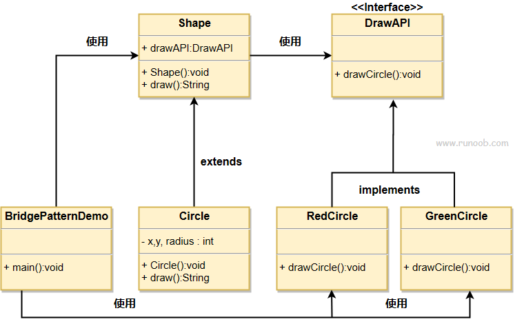
###  java
**步骤 1**
创建桥接实现接口。

DrawAPI.java
```java
public interface DrawAPI {
   public void drawCircle(int radius, int x, int y);
}
```

**步骤 2**
创建实现了 DrawAPI 接口的实体桥接实现类。

RedCircle.java
```java
public class RedCircle implements DrawAPI {
   @Override
   public void drawCircle(int radius, int x, int y) {
      System.out.println("Drawing Circle[ color: red, radius: "
         + radius +", x: " +x+", "+ y +"]");
   }
}
```

GreenCircle.java
```java
public class GreenCircle implements DrawAPI {
   @Override
   public void drawCircle(int radius, int x, int y) {
      System.out.println("Drawing Circle[ color: green, radius: "
         + radius +", x: " +x+", "+ y +"]");
   }
}
```

**步骤 3**
使用 DrawAPI 接口创建抽象类 Shape。

Shape.java
```java
public abstract class Shape {
   protected DrawAPI drawAPI;
   protected Shape(DrawAPI drawAPI){
      this.drawAPI = drawAPI;
   }
   public abstract void draw();  
}
```

**步骤 4**
创建实现了 Shape 抽象类的实体类。

Circle.java
```java
public class Circle extends Shape {
   private int x, y, radius;
 
   public Circle(int x, int y, int radius, DrawAPI drawAPI) {
      super(drawAPI);
      this.x = x;  
      this.y = y;  
      this.radius = radius;
   }
 
   public void draw() {
      drawAPI.drawCircle(radius,x,y);
   }
}
```

**步骤 5**
使用 Shape 和 DrawAPI 类画出不同颜色的圆。

BridgePatternDemo.java
```java
public class BridgePatternDemo {
   public static void main(String[] args) {
      Shape redCircle = new Circle(100,100, 10, new RedCircle());
      Shape greenCircle = new Circle(100,100, 10, new GreenCircle());
 
      redCircle.draw();
      greenCircle.draw();
   }
}
```

**步骤 6**
执行程序，输出结果：
```shell
Drawing Circle[ color: red, radius: 10, x: 100, 100]
Drawing Circle[  color: green, radius: 10, x: 100, 100]
```
### rsut
```rs
// 画图的接口
trait DrawAPI {
    fn draw_circle(&self,radius:i32,x:i32, y:i32);      
}
// 画h
struct RedCircle {}
impl DrawAPI for RedCircle {
    fn draw_circle(&self,radius:i32,x:i32, y:i32) {
        println!("Drawing Circle[ color: red, radius: {}, x: {}, {}]",radius,x,y);
    }
}
struct GreenCircle {}
impl DrawAPI for GreenCircle  {
    fn draw_circle(&self,radius:i32,x:i32, y:i32) {
        println!("Drawing Circle[ color: green, radius: {}, x: {}, {}]",radius,x,y);
    }
}
trait Shape{
    fn draw(&self);
}
struct Circle{
    // // pub(crate) 使得函数只在当前 crate 中可见
    // 抽象方法的实现
    draw_api:Box<dyn DrawAPI>,
    x:i32,
    y:i32,
    radius:i32
}
impl Circle {
    fn new(draw_api:Box<dyn DrawAPI>,x:i32, y:i32, radius:i32)->Circle {
        Circle{
            draw_api,
            x,
            y,
            radius
        }
    }
}
impl Shape for Circle  {
    fn draw(&self) {
        self.draw_api.draw_circle(self.radius, self.x, self.y)
    }
}
fn main(){
    let r=Circle::new(Box::new(RedCircle{}),100,100, 10);
    let g=Circle::new(Box::new(GreenCircle{}),100,100, 10);
    r.draw();
    g.draw();

}
```
## 过滤器模式
过滤器模式（Filter Pattern）或标准模式（Criteria Pattern）是一种设计模式，这种模式允许开发人员使用不同的标准来过滤一组对象，通过逻辑运算以解耦的方式把它们连接起来。这种类型的设计模式属于结构型模式，它结合多个标准来获得单一标准。

### 实现
我们将创建一个 Person 对象、Criteria 接口和实现了该接口的实体类，来过滤 Person 对象的列表。CriteriaPatternDemo 类使用 Criteria 对象，基于各种标准和它们的结合来过滤 Person 对象的列表。
我们制作一个Person实体类，Criteria为标准条件，CriteriaMale等为实现的具体判断器，是需要为person类使用meetCriteria方法便可以进行不同条件的判断。
过滤器模式的 UML 图
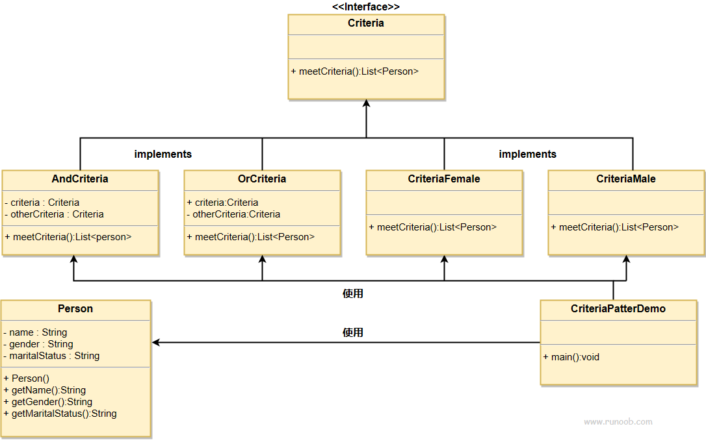
### java
**步骤 1**
创建一个类，在该类上应用标准。

Person.java
```java
public class Person {
   
   private String name;
   private String gender;
   private String maritalStatus;
 
   public Person(String name,String gender,String maritalStatus){
      this.name = name;
      this.gender = gender;
      this.maritalStatus = maritalStatus;    
   }
 
   public String getName() {
      return name;
   }
   public String getGender() {
      return gender;
   }
   public String getMaritalStatus() {
      return maritalStatus;
   }  
}
```
**步骤 2**
为标准（Criteria）创建一个接口。

Criteria.java
```java
import java.util.List;
 
public interface Criteria {
   public List<Person> meetCriteria(List<Person> persons);
}
```
**步骤 3**
创建实现了 Criteria 接口的实体类。

CriteriaMale.java
```java
import java.util.ArrayList;
import java.util.List;
 
public class CriteriaMale implements Criteria {
 
   @Override
   public List<Person> meetCriteria(List<Person> persons) {
      List<Person> malePersons = new ArrayList<Person>(); 
      for (Person person : persons) {
         if(person.getGender().equalsIgnoreCase("MALE")){
            malePersons.add(person);
         }
      }
      return malePersons;
   }
}
```
CriteriaFemale.java
```java
import java.util.ArrayList;
import java.util.List;
 
public class CriteriaFemale implements Criteria {
 
   @Override
   public List<Person> meetCriteria(List<Person> persons) {
      List<Person> femalePersons = new ArrayList<Person>(); 
      for (Person person : persons) {
         if(person.getGender().equalsIgnoreCase("FEMALE")){
            femalePersons.add(person);
         }
      }
      return femalePersons;
   }
}
```

CriteriaSingle.java
```java
import java.util.ArrayList;
import java.util.List;
 
public class CriteriaSingle implements Criteria {
 
   @Override
   public List<Person> meetCriteria(List<Person> persons) {
      List<Person> singlePersons = new ArrayList<Person>(); 
      for (Person person : persons) {
         if(person.getMaritalStatus().equalsIgnoreCase("SINGLE")){
            singlePersons.add(person);
         }
      }
      return singlePersons;
   }
}
```
AndCriteria.java
```java
import java.util.List;
 
public class AndCriteria implements Criteria {
 
   private Criteria criteria;
   private Criteria otherCriteria;
 
   public AndCriteria(Criteria criteria, Criteria otherCriteria) {
      this.criteria = criteria;
      this.otherCriteria = otherCriteria; 
   }
 
   @Override
   public List<Person> meetCriteria(List<Person> persons) {
      List<Person> firstCriteriaPersons = criteria.meetCriteria(persons);     
      return otherCriteria.meetCriteria(firstCriteriaPersons);
   }
}
```
OrCriteria.java
```java
import java.util.List;
 
public class OrCriteria implements Criteria {
 
   private Criteria criteria;
   private Criteria otherCriteria;
 
   public OrCriteria(Criteria criteria, Criteria otherCriteria) {
      this.criteria = criteria;
      this.otherCriteria = otherCriteria; 
   }
 
   @Override
   public List<Person> meetCriteria(List<Person> persons) {
      List<Person> firstCriteriaItems = criteria.meetCriteria(persons);
      List<Person> otherCriteriaItems = otherCriteria.meetCriteria(persons);
 
      for (Person person : otherCriteriaItems) {
         if(!firstCriteriaItems.contains(person)){
           firstCriteriaItems.add(person);
         }
      }  
      return firstCriteriaItems;
   }
}
```
**步骤4**
使用不同的标准（Criteria）和它们的结合来过滤 Person 对象的列表。
CriteriaPatternDemo.java
```java
import java.util.ArrayList; 
import java.util.List;
 
public class CriteriaPatternDemo {
   public static void main(String[] args) {
      List<Person> persons = new ArrayList<Person>();
 
      persons.add(new Person("Robert","Male", "Single"));
      persons.add(new Person("John","Male", "Married"));
      persons.add(new Person("Laura","Female", "Married"));
      persons.add(new Person("Diana","Female", "Single"));
      persons.add(new Person("Mike","Male", "Single"));
      persons.add(new Person("Bobby","Male", "Single"));
 
      Criteria male = new CriteriaMale();
      Criteria female = new CriteriaFemale();
      Criteria single = new CriteriaSingle();
      Criteria singleMale = new AndCriteria(single, male);
      Criteria singleOrFemale = new OrCriteria(single, female);
 
      System.out.println("Males: ");
      printPersons(male.meetCriteria(persons));
 
      System.out.println("\nFemales: ");
      printPersons(female.meetCriteria(persons));
 
      System.out.println("\nSingle Males: ");
      printPersons(singleMale.meetCriteria(persons));
 
      System.out.println("\nSingle Or Females: ");
      printPersons(singleOrFemale.meetCriteria(persons));
   }
 
   public static void printPersons(List<Person> persons){
      for (Person person : persons) {
         System.out.println("Person : [ Name : " + person.getName() 
            +", Gender : " + person.getGender() 
            +", Marital Status : " + person.getMaritalStatus()
            +" ]");
      }
   }      
}
```

**步骤 5**
执行程序，输出结果：
```shell
Males: 
Person : [ Name : Robert, Gender : Male, Marital Status : Single ]
Person : [ Name : John, Gender : Male, Marital Status : Married ]
Person : [ Name : Mike, Gender : Male, Marital Status : Single ]
Person : [ Name : Bobby, Gender : Male, Marital Status : Single ]

Females: 
Person : [ Name : Laura, Gender : Female, Marital Status : Married ]
Person : [ Name : Diana, Gender : Female, Marital Status : Single ]

Single Males: 
Person : [ Name : Robert, Gender : Male, Marital Status : Single ]
Person : [ Name : Mike, Gender : Male, Marital Status : Single ]
Person : [ Name : Bobby, Gender : Male, Marital Status : Single ]

Single Or Females: 
Person : [ Name : Robert, Gender : Male, Marital Status : Single ]
Person : [ Name : Diana, Gender : Female, Marital Status : Single ]
Person : [ Name : Mike, Gender : Male, Marital Status : Single ]
Person : [ Name : Bobby, Gender : Male, Marital Status : Single ]
Person : [ Name : Laura, Gender : Female, Marital Status : Married ]
```

### rust
由于时间关系，并没有实现or条件，大家有兴趣可以自行补充
```rust
// 设置人类实体类
#[derive(Clone)]
struct Person{
    name:String,
    gender:String,
    marital_status:String
}
impl Person {
 
    fn get_gender(&self)->&str {
        self.gender.as_ref()
    }
    fn get_marital_status(&self)->&str {
        self.marital_status.as_ref()
    }
}
// 设置过滤标准特征
trait Criteria {
  fn meet_criteria(&self,persons:Vec<Person>)->Vec<Person>; 
}
// 设置男性
struct CriteriaMale{}
// 重写男性评判标准
impl   Criteria for CriteriaMale {
    fn meet_criteria(&self,persons:Vec<Person>)->Vec<Person>{
        persons.into_iter().filter(|x| x.get_gender().eq_ignore_ascii_case("MALE")).collect()
    }
}
// 设置女性
struct CriteriaFemale{}
// 设置女性标准
impl   Criteria for CriteriaFemale{
    fn meet_criteria(&self,persons:Vec<Person>)->Vec<Person>{
        persons.into_iter().filter(|x| x.get_gender().eq_ignore_ascii_case("FEMALE")).collect()
    }
}
// 设置单身标准
struct CriteriaSingle{}

impl   Criteria for CriteriaSingle{
    fn meet_criteria(&self,persons:Vec<Person>)->Vec<Person>{
        persons.into_iter().filter(|x| x.get_marital_status().eq_ignore_ascii_case("SINGLE")).collect()
    }
}
// 设置and标准，求交集
struct AndCriteria  {
    criteria:Box<dyn Criteria>,
    other_criteria:Box<dyn Criteria>
}

impl Criteria for AndCriteria {
    fn meet_criteria(&self,persons:Vec<Person>)->Vec<Person> {
        self.other_criteria.meet_criteria(self.criteria.meet_criteria(persons))
    }
}
// struct OrCriteria {
//     criteria:Box<dyn Criteria>,
//     other_criteria:Box<dyn Criteria>
// }

// impl Criteria for OrCriteria{
//     fn meet_criteria(&self,persons:Vec<Person>)->Vec<Person> {
//         let mut first_criteria_items = self.criteria.meet_criteria(persons);
//         let other_criteria_items = self.other_criteria.meet_criteria(persons);
//         for o in other_criteria_items  {
//             if !other_criteria_items.contains(&o) {
//                 first_criteria_items.push(o);
//             }
//         }
//         first_criteria_items

//     }
// }
fn print_persons(persons:Vec<Person>) {
    persons.into_iter().for_each(|x| println!("Person : [NAME: {},Gender : {} ,Maeital Status : {} ]",x.name,x.gender,x.marital_status));
}
fn main() {
    let mut persons=Vec::new();
    persons.push(Person{name:String::from("Robert"),gender:String::from("Male"),marital_status:String::from("Single")});
    persons.push(Person{name:String::from("John"),gender:String::from("Male"),marital_status:String::from("Married")});
    persons.push(Person{name:String::from("Laura"),gender:String::from("Female"),marital_status:String::from("Married")});
    persons.push(Person{name:String::from("Diana"),gender:String::from("Female"),marital_status:String::from("Single")});

    let male=Box::new(CriteriaMale{});
    let female=Box::new(CriteriaFemale{});
    let single_male=AndCriteria{criteria:Box::new(CriteriaSingle{}),other_criteria:Box::new(CriteriaMale{})};
    // let single_or_female=OrCriteria{criteria:Box::new(CriteriaMale{}),other_criteria:Box::new(CriteriaFemale{})};
    println!("男士");
    print_persons(male.meet_criteria(persons.clone()));
    println!("女士");
    print_persons(female.meet_criteria(persons.clone()));
    println!("单身男士");
    print_persons(single_male.meet_criteria(persons))


}
```
## 组合模式
组合模式（Composite Pattern），又叫部分整体模式，是用于把一组相似的对象当作一个单一的对象。组合模式依据树形结构来组合对象，用来表示部分以及整体层次。这种类型的设计模式属于结构型模式，它创建了对象组的树形结构。

这种模式创建了一个包含自己对象组的类。该类提供了修改相同对象组的方式。

### 介绍
- **意图**：将对象组合成树形结构以表示"部分-整体"的层次结构。组合模式使得用户对单个对象和组合对象的使用具有一致性。

- **主要解决**：它在我们树型结构的问题中，模糊了简单元素和复杂元素的概念，客户程序可以像处理简单元素一样来处理复杂元素，从而使得客户程序与复杂元素的内部结构解耦。

- **何时使用**：、
1、您想表示对象的部分-整体层次结构（树形结构）。 2、您希望用户忽略组合对象与单个对象的不同，用户将统一地使用组合结构中的所有对象。

**如何解决**：树枝和叶子实现统一接口，树枝内部组合该接口。


**应用实例**： 
1. 算术表达式包括操作数、操作符和另一个操作数，其中，另一个操作数也可以是操作数、操作符和另一个操作数。 


**优点**： 1、高层模块调用简单。 2、节点自由增加。

**缺点**：在使用组合模式时，其叶子和树枝的声明都是实现类，而不是接口，违反了依赖倒置原则。

**使用场景**：部分、整体场景，如树形菜单，文件、文件夹的管理。


### 实现
我们有一个类 Employee，该类被当作组合模型类。CompositePatternDemo 类使用 Employee 类来添加部门层次结构，并打印所有员工,这样我们就可以实现不同的的部门进行自由组合，实现不同部门之间的即插即用。

组合模式的 UML 图
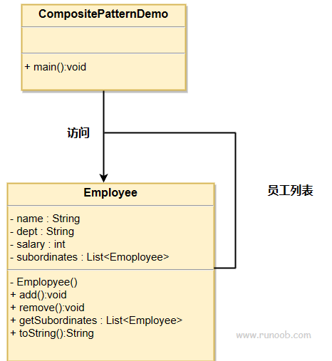

###  java
**步骤 1**
创建 Employee 类，该类带有 Employee 对象的列表。

Employee.java
```java
import java.util.ArrayList;
import java.util.List;
 
public class Employee {
   private String name;
   private String dept;
   private int salary;
   private List<Employee> subordinates;
 
   //构造函数
   public Employee(String name,String dept, int sal) {
      this.name = name;
      this.dept = dept;
      this.salary = sal;
      subordinates = new ArrayList<Employee>();
   }
 
   public void add(Employee e) {
      subordinates.add(e);
   }
 
   public void remove(Employee e) {
      subordinates.remove(e);
   }
 
   public List<Employee> getSubordinates(){
     return subordinates;
   }
 
   public String toString(){
      return ("Employee :[ Name : "+ name 
      +", dept : "+ dept + ", salary :"
      + salary+" ]");
   }   
}
```

**步骤 2**
使用 Employee 类来创建和打印员工的层次结构。

CompositePatternDemo.java
```java
public class CompositePatternDemo {
   public static void main(String[] args) {
      Employee CEO = new Employee("John","CEO", 30000);
 
      Employee headSales = new Employee("Robert","Head Sales", 20000);
 
      Employee headMarketing = new Employee("Michel","Head Marketing", 20000);
 
      Employee clerk1 = new Employee("Laura","Marketing", 10000);
      Employee clerk2 = new Employee("Bob","Marketing", 10000);
 
      Employee salesExecutive1 = new Employee("Richard","Sales", 10000);
      Employee salesExecutive2 = new Employee("Rob","Sales", 10000);
 
      CEO.add(headSales);
      CEO.add(headMarketing);
 
      headSales.add(salesExecutive1);
      headSales.add(salesExecutive2);
 
      headMarketing.add(clerk1);
      headMarketing.add(clerk2);
 
      //打印该组织的所有员工
      System.out.println(CEO); 
      for (Employee headEmployee : CEO.getSubordinates()) {
         System.out.println(headEmployee);
         for (Employee employee : headEmployee.getSubordinates()) {
            System.out.println(employee);
         }
      }        
   }
}
```

**步骤 3**
执行程序，输出结果为：
```shell
Employee :[ Name : John, dept : CEO, salary :30000 ]
Employee :[ Name : Robert, dept : Head Sales, salary :20000 ]
Employee :[ Name : Richard, dept : Sales, salary :10000 ]
Employee :[ Name : Rob, dept : Sales, salary :10000 ]
Employee :[ Name : Michel, dept : Head Marketing, salary :20000 ]
Employee :[ Name : Laura, dept : Marketing, salary :10000 ]
Employee :[ Name : Bob, dept : Marketing, salary :10000 ]
```
### rsut
在rust中由于所有权机制，组合模式中如果不使用引用的方法在组合顺序上便有所限制，只能从低级的开始组合，否则进行组合时便会出现所有权报错问题，由于本人代码水平有限没能实现用引用实现的组合模式，只能用转移所有权的方法实现。
```rs
use std::fmt;

// 定义雇员
struct  Employee{
    name:String,
    dept:String,
    sal:i32,
    subordinates:Vec<Employee>
}
// 自定义格式化
impl fmt::Display for Employee {
    fn fmt(&self, f: &mut fmt::Formatter) -> std::fmt::Result {
        write!(f,"Employee : Name{}, dept : {} ,salary : {}", self.name,self.dept,self.sal)
    }
}
impl Employee {
    fn add(&mut self,e:Employee) {
        self.subordinates.push(e);
    }
    fn remove(&mut self,e:Employee) {
        self.subordinates.retain(|x| {
            if x.name!=e.name||x.dept==e.dept||x.sal==e.sal{
                return true;
            }
            return false;
        });
    }
    fn get_subordinates(&self) {
        self.subordinates.as_ptr();
    }
    fn new(name:String,dept:String, sal:i32)->Employee{
        Employee { name, dept,sal,subordinates:Vec::new() }
    }
    
}
fn pe(e:&Employee) {
    println!("{}",e);
    if !e.subordinates.is_empty(){
       e.subordinates.iter().for_each(|x| pe(x));
    }
    
}
fn main(){
    let mut ceo=Employee::new(String::from("John"), String::from("CEO"),30000);
    let mut head_sales=Employee::new(String::from("Robert"), String::from("Head Sales"),20000);
    let mut head_market=Employee::new(String::from("Michel"), String::from("Head Marketing"),10000);
    let mut clerk1=Employee::new(String::from("Laura"), String::from("Marketing"),10000);
    head_sales.add(head_market);
    head_sales.add(clerk1);
    ceo.add(head_sales);
    
    pe(&ceo)

}
```
## 装饰器模式
装饰器模式（Decorator Pattern）允许向一个现有的对象添加新的功能，同时又不改变其结构。

装饰器模式通过将对象包装在装饰器类中，以便动态地修改其行为。

这种模式创建了一个装饰类，用来包装原有的类，并在保持类方法签名完整性的前提下，提供了额外的功能。

### 介绍
- **意图**：动态地给一个对象添加一些额外的职责。就增加功能来说，装饰器模式相比生成子类更为灵活。

- **主要解决**：一般的，我们为了扩展一个类经常使用继承方式实现，由于继承为类引入静态特征，并且随着扩展功能的增多，子类会很膨胀。

- **何时使用**：在不想增加很多子类的情况下扩展类。


**应用实例**： 
1. 孙悟空有 72 变，当他变成"庙宇"后，他的根本还是一只猴子，但是他又有了庙宇的功能。 
2. 不论一幅画有没有画框都可以挂在墙上，但是通常都是有画框的，并且实际上是画框被挂在墙上。在挂在墙上之前，画可以被蒙上玻璃，装到框子里；这时画、玻璃和画框形成了一个物体。

**优点**：装饰类和被装饰类可以独立发展，不会相互耦合，装饰模式是继承的一个替代模式，装饰模式可以动态扩展一个实现类的功能。


#### 装饰器模式包含以下几个核心角色
- **抽象组件（Component）**：定义了原始对象和装饰器对象的公共接口或抽象类，可以是具体组件类的父类或接口。
- **具体组件（Concrete Component）**：是被装饰的原始对象，它定义了需要添加新功能的对象。
- **抽象装饰器（Decorator）**：继承自抽象组件，它包含了一个抽象组件对象，并定义了与抽象组件相同的接口，同时可以通过组合方式持有其他装饰器对象。
**- 具体装饰器（Concrete Decorator）**：实现了抽象装饰器的接口，负责向抽象组件添加新的功能。具体装饰器通常会在调用原始对象的方法之前或之后执行自己的操作。

装饰器模式通过**嵌套包装**多个装饰器对象，可以实现多层次的功能增强。每个具体装饰器类都可以选择性地增加新的功能，同时保持对象接口的一致性。

### 实现
我们将创建一个 Shape 接口和实现了 Shape 接口的实体类。然后我们创建一个实现了 Shape 接口的抽象装饰类 ShapeDecorator，并把 Shape 对象作为它的实例变量。

RedShapeDecorator 是实现了 ShapeDecorator 的实体类。

DecoratorPatternDemo 类使用 RedShapeDecorator 来装饰 Shape 对象。


装饰器模式的 UML 图
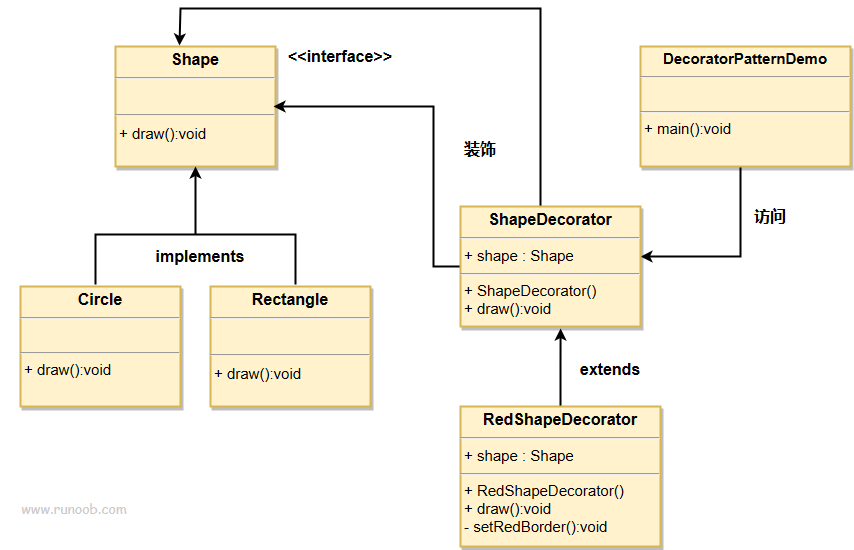

#### 大致流程
首先我们会实现一个抽象接口Shape，是一个泛化的，目的是为了让装饰能够在继承这个接口的方法都能够被装饰类装饰，是装饰类能够泛化。装饰接口ShapeDecorator是为了相同的目的，它可以使不同的装饰实现类和实体类之间进行自由搭配，使更换装饰，就像换衣服一样容易，使之更符合现实中的方法。

### java
**步骤 1**
创建一个接口，抽象一个可以包装包装的接口。
Shape.java
```java
public interface Shape {
   void draw();
}
```

**步骤 2**
创建实现接口的实体类。

Rectangle.java
```java
public class Rectangle implements Shape {
 
   @Override
   public void draw() {
      System.out.println("Shape: Rectangle");
   }
}
```

Circle.java
```java
public class Circle implements Shape {
 
   @Override
   public void draw() {
      System.out.println("Shape: Circle");
   }
}
```

**步骤 3**
创建实现了 Shape 接口的抽象装饰类，此举是方便实现不同的装饰实体类，使我们能够随时能够使用实现此接口的实体类，对我们的实体类进行不同形式的包装。

ShapeDecorator.java
```java
public abstract class ShapeDecorator implements Shape {
   protected Shape decoratedShape;
 
   public ShapeDecorator(Shape decoratedShape){
      this.decoratedShape = decoratedShape;
   }
 
   public void draw(){
      decoratedShape.draw();
   }  
}
```

**步骤 4**
创建扩展了 ShapeDecorator 类的实体装饰类。

RedShapeDecorator.java
```java
public class RedShapeDecorator extends ShapeDecorator {
 
   public RedShapeDecorator(Shape decoratedShape) {
      super(decoratedShape);     
   }
 
   @Override
   public void draw() {
      decoratedShape.draw();         
      setRedBorder(decoratedShape);
   }
 
   private void setRedBorder(Shape decoratedShape){
      System.out.println("Border Color: Red");
   }
}
```

**步骤 5**
使用 RedShapeDecorator 来装饰 Shape 对象,让他包装我们实现Shape接口的的原始内容。

DecoratorPatternDemo.java
```java
public class DecoratorPatternDemo {
   public static void main(String[] args) {
 
      Shape circle = new Circle();
      ShapeDecorator redCircle = new RedShapeDecorator(new Circle());
      ShapeDecorator redRectangle = new RedShapeDecorator(new Rectangle());
      //Shape redCircle = new RedShapeDecorator(new Circle());
      //Shape redRectangle = new RedShapeDecorator(new Rectangle());
      System.out.println("Circle with normal border");
      circle.draw();
 
      System.out.println("\nCircle of red border");
      redCircle.draw();
 
      System.out.println("\nRectangle of red border");
      redRectangle.draw();
   }
}
```

**步骤 6**
执行程序，输出结果：
```shell
Circle with normal border
Shape: Circle

Circle of red border
Shape: Circle
Border Color: Red

Rectangle of red border
Shape: Rectangle
Border Color: Red
```

### rsut
```rs
// 创建形状接口
trait Shape {
    fn draw(&self);
}
struct  Rectangle {}
struct Circle{}
impl Shape for Rectangle {
    fn draw(&self) {
        println!("Shape: Rectangle");
    }
}
impl Shape for Circle {
    fn draw(&self) {
        println!("Shape: Circle");
    }
}
// 创建装抽象接口
trait ShapeDecorator {
    // 装饰方式
    fn draw(&self);
}
// 创建装饰实现类
struct RedShapeDecorator{
    decorated_shape:Box<dyn Shape>
}
impl RedShapeDecorator {
    //设置修饰方法
    fn set_red_border(&self) {
        println!("Border Color: Red");
    }
}
// 实现装饰特征
impl  ShapeDecorator for RedShapeDecorator{
    fn draw(&self) {
        self.decorated_shape.draw();
        self.set_red_border();
    }
}
fn main() {
    let circle=Circle{};
    let red_circle=RedShapeDecorator{decorated_shape:Box::new(Circle{})};
    let red_rectangle=RedShapeDecorator{decorated_shape:Box::new(Rectangle{})};
    circle.draw();
    red_circle.draw();
    red_rectangle.draw();
}
```
## 外观模式
外观模式（Facade Pattern）隐藏系统的复杂性，并向客户端提供了一个客户端可以访问系统的接口。它向现有的系统添加一个接口，来隐藏系统的复杂性。
**举个例子** ：就像电脑的usb接口，自己内部实现了复杂的usb协议，自己却只提供了接口，让我们能够即插即用向我们屏蔽了，底层协议的细节。
### 介绍
**意图**：为子系统中的一组接口提供一个一致的界面，外观模式定义了一个高层接口，这个接口使得这一子系统更加容易使用。

**主要解决**：降低访问复杂系统的内部子系统时的复杂度，简化客户端之间的接口。


**应用实例**： 
去医院看病，可能要去挂号、门诊、划价、取药，让患者或患者家属觉得很复杂，如果有提供接待人员，只让接待人员来处理，就很方便。

**优点**： 1、减少系统相互依赖。 2、提高灵活性。 3、提高了安全性。

**缺点**：不符合开闭原则，如果要改东西很麻烦，继承重写都不合适。


### 实现
我们将创建一个 Shape 接口和实现了 Shape 接口的实体类。下一步是定义一个外观类 ShapeMaker。 我们采用把所有的实现类封装在shapemaker，由shapemaker提供统一的接口，使我们能够方便调用。

ShapeMaker 类使用实体类来代表用户对这些类的调用。FacadePatternDemo 类使用 ShapeMaker 类来显示结果。

外观模式的 UML 图
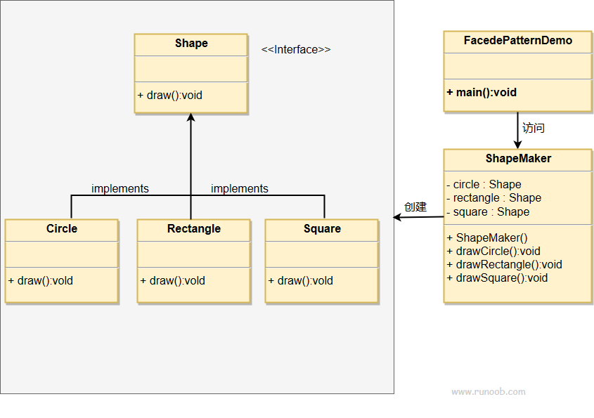
### java
**步骤 1**
创建一个接口。
Shape.java
```java
public interface Shape {
   void draw();
}
```

**步骤 2**
创建实现接口的实体类。

Rectangle.java
```java
public class Rectangle implements Shape {
 
   @Override
   public void draw() {
      System.out.println("Rectangle::draw()");
   }
}
```

Square.java
```java
public class Square implements Shape {
 
   @Override
   public void draw() {
      System.out.println("Square::draw()");
   }
}
```

Circle.java
```java
public class Circle implements Shape {
 
   @Override
   public void draw() {
      System.out.println("Circle::draw()");
   }
}
```

**步骤 3**
创建一个外观类,这个外观类中，封装装了上述实现类的方法，这样我们就可以通过外观类中提供的方法，间接调用底层继承shape抽象类的实体类实现的方法。

ShapeMaker.java
```java
public class ShapeMaker {
   private Shape circle;
   private Shape rectangle;
   private Shape square;
 
   public ShapeMaker() {
      circle = new Circle();
      rectangle = new Rectangle();
      square = new Square();
   }
 
   public void drawCircle(){
      circle.draw();
   }
   public void drawRectangle(){
      rectangle.draw();
   }
   public void drawSquare(){
      square.draw();
   }
}
```

**步骤 4**
使用该外观类画出各种类型的形状,由下面的代码我们可以看到，我们可以调用shapemaker的方法间接调用底层实现类的方法。
```java
FacadePatternDemo.java
public class FacadePatternDemo {
   public static void main(String[] args) {
      ShapeMaker shapeMaker = new ShapeMaker();
 
      shapeMaker.drawCircle();
      shapeMaker.drawRectangle();
      shapeMaker.drawSquare();      
   }
}
```

**步骤 5**
执行程序，输出结果：
```shell
Circle::draw()
Rectangle::draw()
Square::draw()
```
### rust
rsut实现的大致思路和java相同，就不再赘述过程。
```rs
// 创建形状接口
trait Shape {
    fn draw(&self);
}
struct  Rectangle {}
struct Circle{}
struct Square{}
impl Shape for Rectangle {
    fn draw(&self) {
        println!("Shape: Rectangle");
    }
}
impl Shape for Circle {
    fn draw(&self) {
        println!("Shape: Circle");
    }
}
impl Shape for Square {
    fn draw(&self) {
        println!("Shape: Square");
    }
}
// 创建外观
struct ShapeMaker{
    rectangle:Rectangle,
    circle:Circle,
    square:Square
}
impl ShapeMaker {
    fn draw_rectangle(&self) {
        self.rectangle.draw();
    }
    fn draw_circle(&self) {
        self.circle.draw();
    }
    fn draw_square(&self) {
        self.square.draw();
    }
}
fn main() {
    //创建接口实体
    let shape_maker=ShapeMaker{rectangle:Rectangle {  },circle:Circle {  },square:Square {  }};
    // 体现接口抽象实现的各种方法
    shape_maker.draw_circle();
    shape_maker.draw_rectangle();
    shape_maker.draw_square();
}
```
## 享元模式
享元模式（Flyweight Pattern）主要用于减少创建对象的数量，以减少内存占用和提高性能。这种类型的设计模式属于结构型模式，它提供了减少对象数量从而改善应用所需的对象结构的方式，可使我们能够重复利用对象，使我们减少重复创建和销毁对象造成的开销，从而提升程序的运行效率。


享元模式尝试重用现有的同类对象，如果未找到匹配的对象，则创建新对象。我们将通过创建 5 个对象来画出 20 个分布于不同位置的圆来演示这种模式。由于只有 5 种可用的颜色，所以 color 属性被用来检查现有的 Circle 对象。

### 介绍
- **意图**：运用共享技术有效地支持大量细粒度的对象。

- **主要解决**：在有大量对象时，有可能会造成内存溢出，我们把其中共同的部分抽象出来，如果有相同的业务请求，直接返回在内存中已有的对象，避免重新创建。

- **何时使用**： 
1. 系统中有大量重可复利用的对象。 
2. 这些对象消耗大量内。 
3. 对象的创建和销毁较为浪费系统资源。
3. 这些对象的状态大部分可以外部化。
4. 这些对象可以按照内蕴状态分为很多组，当把外蕴对象从对象中剔除出来时，每一组对象都可以用一个对象来代替。
5. 系统不依赖于这些对象身份，这些对象是不可分辨的。

- **应用实例**： 1、JAVA 中的 String，如果有则返回，如果没有则创建一个字符串保存在字符串缓存池里面。 2、数据库的连接池。

- **优点**：大大减少对象的创建，降低系统的内存，使效率提高。
- **缺点**：提高了系统的复杂度，需要分离出外部状态和内部状态，而且外部状态具有固有化的性质，不应该随着内部状态的变化而变化，否则会造成系统的混乱。


### 实现
我们将创建一个 Shape 接口和实现了 Shape 接口的实体类 Circle。下一步是定义工厂类 ShapeFactory。

ShapeFactory 有一个 Circle 的 HashMap，其中键名为 Circle 对象的颜色。无论何时接收到请求，都会创建一个特定颜色的圆。ShapeFactory 检查它的 HashMap 中的 circle 对象，如果找到 Circle 对象，则返回该对象，否则将创建一个存储在 hashmap 中以备后续使用的新对象，并把该对象返回到客户端。

FlyWeightPatternDemo 类使用 ShapeFactory 来获取 Shape 对象。它将向 ShapeFactory 传递信息（red / green / blue/ black / white），以便获取它所需对象的颜色。

享元模式的 UML 图
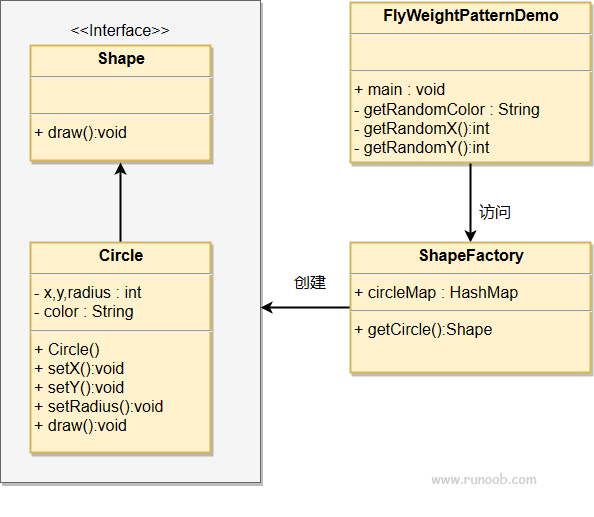

### java
**步骤 1**
创建一个接口。

Shape.java
```java
public interface Shape {
   void draw();
}
```

**步骤 2**
创建实现接口的实体类。

Circle.java
```java
public class Circle implements Shape {
   private String color;
   private int x;
   private int y;
   private int radius;
 
   public Circle(String color){
      this.color = color;     
   }
 
   public void setX(int x) {
      this.x = x;
   }
 
   public void setY(int y) {
      this.y = y;
   }
 
   public void setRadius(int radius) {
      this.radius = radius;
   }
 
   @Override
   public void draw() {
      System.out.println("Circle: Draw() [Color : " + color 
         +", x : " + x +", y :" + y +", radius :" + radius);
   }
}
```

**步骤 3**
创建一个工厂，生成基于给定信息的实体类的对象，我梦采用hashmap结构存储我们的数据。

ShapeFactory.java
```java
import java.util.HashMap;
 
public class ShapeFactory {
   private static final HashMap<String, Shape> circleMap = new HashMap<>();
 
   public static Shape getCircle(String color) {
      Circle circle = (Circle)circleMap.get(color);
 
      if(circle == null) {
         circle = new Circle(color);
         circleMap.put(color, circle);
         System.out.println("Creating circle of color : " + color);
      }
      return circle;
   }
}
```

**步骤 4**
使用该工厂，通过传递颜色信息来获取实体类的对象，并且我们是通过颜色判断，是否是需要同一个对象。

FlyweightPatternDemo.java
```java
public class FlyweightPatternDemo {
   private static final String colors[] = 
      { "Red", "Green", "Blue", "White", "Black" };
   public static void main(String[] args) {
 
      for(int i=0; i < 20; ++i) {
         Circle circle = 
            (Circle)ShapeFactory.getCircle(getRandomColor());
         circle.setX(getRandomX());
         circle.setY(getRandomY());
         circle.setRadius(100);
         circle.draw();
      }
   }
   private static String getRandomColor() {
      return colors[(int)(Math.random()*colors.length)];
   }
   private static int getRandomX() {
      return (int)(Math.random()*100 );
   }
   private static int getRandomY() {
      return (int)(Math.random()*100);
   }
}
```

**步骤 5**
执行程序，输出结果：
```shell
Creating circle of color : Black
Circle: Draw() [Color : Black, x : 36, y :71, radius :100
Creating circle of color : Green
Circle: Draw() [Color : Green, x : 27, y :27, radius :100
Creating circle of color : White
Circle: Draw() [Color : White, x : 64, y :10, radius :100
Creating circle of color : Red
Circle: Draw() [Color : Red, x : 15, y :44, radius :100
Circle: Draw() [Color : Green, x : 19, y :10, radius :100
Circle: Draw() [Color : Green, x : 94, y :32, radius :100
Circle: Draw() [Color : White, x : 69, y :98, radius :100
Creating circle of color : Blue
```
### rust
rust和java的实现相似，就不再赘述过程，不过需要**注意**的是，在rust中官方没有提供rand包我们需要引入第三方包，所以我们需要在Cargo.toml文件引入以下依赖
```toml
[dependencies]
rand = "0.8.5"
```
#### 实现代码
```rs
use std::{collections::HashMap};
use rand::{Rng};
// 创建形状接口
trait Shape {
    fn draw(&self);
}
struct Circle{
    color:String,
    x:i32,
    y:i32,
    radius:i32,
}
impl Shape for Circle {
    fn draw(&self) {
        println!("Circle: Draw() [Color: {},x: {},y: {},radius: {}]",self.color,self.x,self.y,self.radius);
    }
}
impl Circle {
    fn new(color:String)->Circle {
        Circle{
            color:color,
            x:0,
            y:0,
            radius:0
        }
    }
}
// 设置形状工场，进行管理
struct ShapeFactory{
    circle_map:HashMap<String,Circle>
} 
impl ShapeFactory {
    fn get_circle(&mut self,color:&str)->&mut Circle{

        match self.circle_map.get(color) {
            None=>{
                self.circle_map.insert(color.to_owned(),Circle::new(color.to_owned()));  
                println!("Creating circle of color : {}" ,color);
            }
            Some(_)=>{
                println!("已有触发享元")
            }
        };
        self.circle_map.get_mut(color).unwrap()
    }
}
fn get_rand_color()->& 'static str {
    COLORS[rand::thread_rng().gen_range(0..COLORS.len())]
}
fn get_randx()->i32 {
    rand::thread_rng().gen_range(0..100)
}
fn get_randy()->i32 {
    rand::thread_rng().gen_range(0..100)
}
const  COLORS: [&str; 5]=["Red", "Green", "Blue", "White", "Black" ];

fn main() {
  
    let  mut shape_factory=ShapeFactory{circle_map:HashMap::new()};
    for _x in 1..=5 {
        let  color=shape_factory.get_circle(get_rand_color());
        color.x=get_randx();
        color.y=get_randy();
        color.radius=100;
        color.draw();
    }
    // println!("{}",get_rand_color());
        
    

}
```
## 代理模式
在代理模式（Proxy Pattern）中，一个类代表另一个类的功能。在代理模式中，我们创建具有现有对象的对象，以便向外界提供功能接口。

### 介绍
- **意图**：为其他对象提供一种代理以控制对这个对象的访问。

- 代理模式的主要**优点**有：
   - 代理模式在客户端与目标对象之间起到一个中介作用和保护目标对象的作用；
   - 代理对象可以扩展目标对象的功能；
   - 代理模式能将客户端与目标对象分离，在一定程度上降低了系统的耦合度；
- 其主要**缺点**是：
   - 在客户端和目标对象之间增加一个代理对象，会造成请求处理速度变慢；
   - 增加了系统的复杂度；

- **应用实例**：  1、买火车票不一定在火车站买，也可以去代售点。 2、一张支票或银行存单是账户中资金的代理。支票在市场交易中用来代替现金，并提供对签发人账号上资金的控制。 3、spring aop。


- **使用场景**：按职责来划分，通常有以下使用场景： 1、远程代理。 2、虚拟代理。 3、Copy-on-Write 代理。 4、保护（Protect or Access）代理。 5、Cache代理。 6、防火墙（Firewall）代理。 7、同步化（Synchronization）代理。 8、智能引用（Smart Reference）代理。


### 实现
我们将创建一个 Image 接口和实现了 Image 接口的实体类。ProxyImage 是一个代理类，减少 RealImage 对象加载的内存占用。

ProxyPatternDemo 类使用 ProxyImage 来获取要加载的 Image 对象，并按照需求进行显示。

代理模式的 UML 图
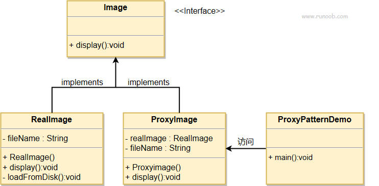
### java
**步骤 1**
创建一个接口。

Image.java
```java
public interface Image {
   void display();
}
```

**步骤 2**
创建实现接口的实体类。

RealImage.java
```java
public class RealImage implements Image {
 
   private String fileName;
 
   public RealImage(String fileName){
      this.fileName = fileName;
      loadFromDisk(fileName);
   }
 
   @Override
   public void display() {
      System.out.println("Displaying " + fileName);
   }
 
   private void loadFromDisk(String fileName){
      System.out.println("Loading " + fileName);
   }
}
```

ProxyImage.java
```java
public class ProxyImage implements Image{
 
   private RealImage realImage;
   private String fileName;
 
   public ProxyImage(String fileName){
      this.fileName = fileName;
   }
 
   @Override
   public void display() {
      if(realImage == null){
         realImage = new RealImage(fileName);
      }
      realImage.display();
   }
}
```

**步骤 3**
当被请求时，使用 ProxyImage 来获取 RealImage 类的对象。

ProxyPatternDemo.java
```java
public class ProxyPatternDemo {
   
   public static void main(String[] args) {
      Image image = new ProxyImage("test_10mb.jpg");
 
      // 图像将从磁盘加载
      image.display(); 
      System.out.println("");
      // 图像不需要从磁盘加载
      image.display();  
   }
}
```

**步骤 4**
执行程序，输出结果：
```shell
Loading test_10mb.jpg
Displaying test_10mb.jpg

Displaying test_10mb.jpg
```
### rust
rust和java的搭建过程类似，如就不再赘述rust搭建过程。
```rs
trait Image {
    fn dispaly(&self);
}
struct RealImage{
    file_name:String,
}
impl RealImage {
    fn load_from_disk(&self) {
        println!("Loading {}",self.file_name)
    }
    fn new(file_name:String)->RealImage {
        
        let i=RealImage { file_name:file_name.clone() };
        i.load_from_disk();
        i

    }
}

impl Image for RealImage {
    fn dispaly(&self) {
        println!("Displaying  {}",self.file_name.as_str())
    }
}
struct  ProxyImage{
    real_image: RealImage,
    file_name:String
    
}
impl ProxyImage {
    fn new(file_name:String)->ProxyImage {
        ProxyImage{
            real_image:RealImage::new(file_name.clone()),
            file_name:file_name
        }
            
    }
}
impl Image for ProxyImage {
    fn dispaly(&self) {
        self.real_image.dispaly();
    }
}
fn main() {
    let pi=ProxyImage::new("test_10mb.jpg".to_string());
    pi.dispaly();
    pi.dispaly();
}
```
# 行为模式

## 责任链模式
责任链模式（Chain of Responsibility Pattern）为请求创建了一个接收者对象的链。这种模式给予请求的类型，对请求的发送者和接收者进行解耦。

在这种模式中，通常每个接收者都包含对另一个接收者的引用。如果一个对象不能处理该请求，那么它会把相同的请求传给下一个接收者，依此类推。

### 介绍
- **意图**：避免请求发送者与接收者耦合在一起，让多个对象都有可能接收请求，将这些对象连接成一条链，并且沿着这条链传递请求，直到有对象处理它为止。

- **主要解决**：职责链上的处理者负责处理请求，客户只需要将请求发送到职责链上即可，无须关心请求的处理细节和请求的传递，所以职责链将请求的发送者和请求的处理者解耦了。
- **应用实例**： 1、JS 中的事件冒泡。 2、rust中的错误传播符号?。

- **优点**： 1、降低耦合度。它将请求的发送者和接收者解耦。 2、简化了对象。使得对象不需要知道链的结构。 3、增强给对象指派职责的灵活性。通过改变链内的成员或者调动它们的次序，允许动态地新增或者删除责任。 4、增加新的请求处理类很方便。

- **缺点**： 1、不能保证请求一定被接收。 2、系统性能将受到一定影响，而且在进行代码调试时不太方便，可能会造成循环调用


### 实现
我们创建抽象类 AbstractLogger，带有详细的日志记录级别。然后我们创建三种类型的记录器，都扩展了 AbstractLogger。每个记录器消息的级别是否属于自己的级别，如果是则相应地打印出来，否则将不打印并把消息传给下一个记录器。

责任链模式的 UML 图
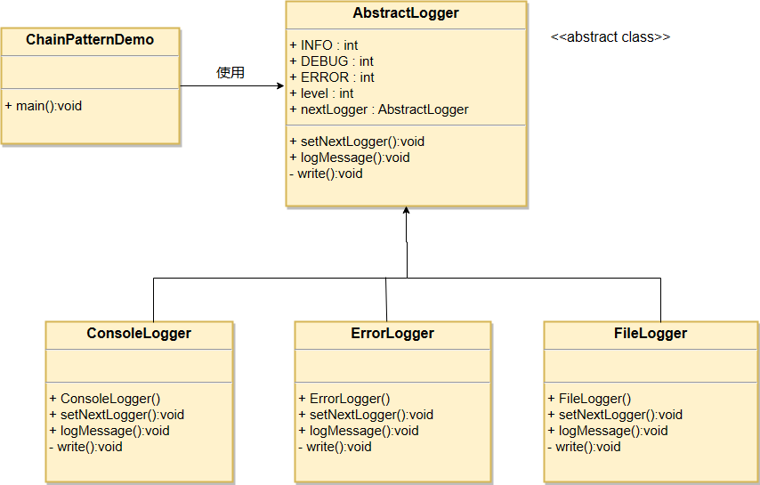
步骤 1
创建抽象的记录器类。

AbstractLogger.java
public abstract class AbstractLogger {
   public static int INFO = 1;
   public static int DEBUG = 2;
   public static int ERROR = 3;
 
   protected int level;
 
   //责任链中的下一个元素
   protected AbstractLogger nextLogger;
 
   public void setNextLogger(AbstractLogger nextLogger){
      this.nextLogger = nextLogger;
   }
 
   public void logMessage(int level, String message){
      if(this.level <= level){
         write(message);
      }
      if(nextLogger !=null){
         nextLogger.logMessage(level, message);
      }
   }
 
   abstract protected void write(String message);
   
}
步骤 2
创建扩展了该记录器类的实体类。

ConsoleLogger.java
public class ConsoleLogger extends AbstractLogger {
 
   public ConsoleLogger(int level){
      this.level = level;
   }
 
   @Override
   protected void write(String message) {    
      System.out.println("Standard Console::Logger: " + message);
   }
}
ErrorLogger.java
public class ErrorLogger extends AbstractLogger {
 
   public ErrorLogger(int level){
      this.level = level;
   }
 
   @Override
   protected void write(String message) {    
      System.out.println("Error Console::Logger: " + message);
   }
}
FileLogger.java
public class FileLogger extends AbstractLogger {
 
   public FileLogger(int level){
      this.level = level;
   }
 
   @Override
   protected void write(String message) {    
      System.out.println("File::Logger: " + message);
   }
}
步骤 3
创建不同类型的记录器。赋予它们不同的错误级别，并在每个记录器中设置下一个记录器。每个记录器中的下一个记录器代表的是链的一部分。

ChainPatternDemo.java
public class ChainPatternDemo {
   
   private static AbstractLogger getChainOfLoggers(){
 
      AbstractLogger errorLogger = new ErrorLogger(AbstractLogger.ERROR);
      AbstractLogger fileLogger = new FileLogger(AbstractLogger.DEBUG);
      AbstractLogger consoleLogger = new ConsoleLogger(AbstractLogger.INFO);
 
      errorLogger.setNextLogger(fileLogger);
      fileLogger.setNextLogger(consoleLogger);
 
      return errorLogger;  
   }
 
   public static void main(String[] args) {
      AbstractLogger loggerChain = getChainOfLoggers();
 
      loggerChain.logMessage(AbstractLogger.INFO, "This is an information.");
 
      loggerChain.logMessage(AbstractLogger.DEBUG, 
         "This is a debug level information.");
 
      loggerChain.logMessage(AbstractLogger.ERROR, 
         "This is an error information.");
   }
}
步骤 4
执行程序，输出结果：

Standard Console::Logger: This is an information.
File::Logger: This is a debug level information.
Standard Console::Logger: This is a debug level information.
Error Console::Logger: This is an error information.
File::Logger: This is an error information.
Standard Console::Logger: This is an error information.
## 命令模式
命令模式（Command Pattern）是一种数据驱动的设计模式。请求以命令的形式包裹在对象中，并传给调用对象。调用对象寻找可以处理该命令的合适的对象，并把该命令传给相应的对象，该对象执行命令。

### 介绍
- **意图**：将一个请求封装成一个对象，从而使您可以用不同的请求对客户进行参数化。

- **主要解决**：在软件系统中，行为请求者与行为实现者通常是一种紧耦合的关系，但某些场合，比如需要对行为进行记录、撤销或重做、事务等处理时，这种无法抵御变化的紧耦合的设计就不太合适。

- **何时使用**：当需要先将一个函数登记上，然后再以后调用此函数时，就需要使用命令模式，其实这就是回调函数。

- **优点**：1.类间解耦：调用者角色与接收者角色之间没有任何依赖关系，调用者实现功能时只需调用Command 抽象类的execute方法就可以，不需要了解到底是哪个接收者执行。2.可扩展性：Command的子类可以非常容易地扩展，而调用者Invoker和高层次的模块Client不产生严 重的代码耦合。3.命令模式结合其他模式会更优秀：命令模式可以结合责任链模式，实现命令族解析任务；结合模板方法模式，则可以减少 Command子类的膨胀问题。
- **缺点**：命令模式也是有缺点的，请看Command的子类：如果有N个命令，问题就出来 了，Command的子类就可不是几个，而是N个，这个类膨胀得非常大，这个就需要读者在项 目中慎重考虑使用。


命令模式结构示意图:
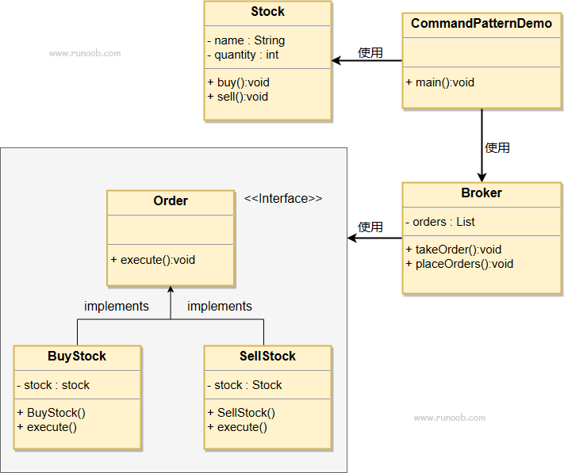


### java
我们首先创建作为命令的接口 Order，然后创建作为请求的 Stock 类。实体命令类 BuyStock 和 SellStock，实现了 Order 接口，将执行实际的命令处理。创建作为调用对象的类 Broker，它接受订单并能下订单。

Broker 对象使用命令模式，基于命令的类型确定哪个对象执行哪个命令。CommandPatternDemo 类使用 Broker 类来演示命令模式。


**步骤 1**
创建一个命令接口。

Order.java
```java
public interface Order {
   void execute();
}
```

**步骤 2**
创建一个请求类。
Stock.java
```java
public class Stock {
   
   private String name = "ABC";
   private int quantity = 10;
 
   public void buy(){
      System.out.println("Stock [ Name: "+name+", 
         Quantity: " + quantity +" ] bought");
   }
   public void sell(){
      System.out.println("Stock [ Name: "+name+", 
         Quantity: " + quantity +" ] sold");
   }
}
```

**步骤 3**
创建实现了 Order 接口的实体类。

BuyStock.java
```java
public class BuyStock implements Order {
   private Stock abcStock;
 
   public BuyStock(Stock abcStock){
      this.abcStock = abcStock;
   }
 
   public void execute() {
      abcStock.buy();
   }
}

```

SellStock.java
```java
public class SellStock implements Order {
   private Stock abcStock;
 
   public SellStock(Stock abcStock){
      this.abcStock = abcStock;
   }
 
   public void execute() {
      abcStock.sell();
   }
}
```

**步骤 4**
创建命令调用类。

Broker.java
import java.util.ArrayList;
import java.util.List;
```java
 public class Broker {
   private List<Order> orderList = new ArrayList<Order>(); 
 
   public void takeOrder(Order order){
      orderList.add(order);      
   }
 
   public void placeOrders(){
      for (Order order : orderList) {
         order.execute();
      }
      orderList.clear();
   }
}
```

**步骤 5**
使用 Broker 类来接受并执行命令。

CommandPatternDemo.java
```java
public class CommandPatternDemo {
   public static void main(String[] args) {
      Stock abcStock = new Stock();
 
      BuyStock buyStockOrder = new BuyStock(abcStock);
      SellStock sellStockOrder = new SellStock(abcStock);
 
      Broker broker = new Broker();
      broker.takeOrder(buyStockOrder);
      broker.takeOrder(sellStockOrder);
 
      broker.placeOrders();
   }
}
```

**步骤 6**
执行程序，输出结果：
```shell
Stock [ Name: ABC, Quantity: 10 ] bought
Stock [ Name: ABC, Quantity: 10 ] sold
```

### rust
```rs
trait Order {
    fn execute(&self);
}
#[derive(Clone)]
struct Stock{
    name:String,
    quantity:i32,
}
impl Stock {
    fn buy(&self) {
        println!("Stock [ Name : {}  Quantity: {}] bought",self.name,self.quantity);
    }
    fn sell(&self) {
        println!("Stock [ Name : {}  Quantity: {}] sold",self.name,self.quantity);
    }
    fn new()->Stock{
        Stock{
            name:"ABC".to_owned(),
            quantity:10
        }
    }
}
// 创建命令实体
struct  BuyStock {
    abc_stock:Stock
}
impl Order for BuyStock {
    fn execute(&self) {
        self.abc_stock.buy();
    }
}
struct  SellStock {
    abc_stock:Stock
}
impl Order for SellStock {
    fn execute(&self) {
        self.abc_stock.sell();
    }
}
// 创建命令调用类。
struct Broker{
    order_list:Vec<Box<dyn Order>>
}
impl Broker {
    fn take_order(&mut self,order:impl Order+ 'static){
        
        self.order_list.push(Box::new(order));
    }
    fn place_orders(&self){
        self.order_list.iter().for_each(|f|f.execute());
    }
    fn  new()->Broker {
        Broker{
            order_list:vec![]
        }
    }
}
fn main(){
    let stock=Stock::new();
   
    let buy=BuyStock{abc_stock:stock.clone()};
    let sell=SellStock{abc_stock:stock.clone()};
    let mut broker=Broker::new();
    broker.take_order(buy);
    broker.take_order(sell);
    broker.place_orders();

}
```

## 解释器模式
解释器模式（Interpreter Pattern）提供了评估语言的语法或表达式的方式，它属于行为型模式。这种模式实现了一个表达式接口，该接口解释一个特定的上下文。这种模式被用在 SQL 解析、符号处理引擎等。

### 介绍
- **意图**：给定一个语言，定义它的文法表示，并定义一个解释器，这个解释器使用该标识来解释语言中的句子。

- **主要解决**：对于一些固定文法构建一个解释句子的解释器。

- **何时使用**：如果一种特定类型的问题发生的频率足够高，那么可能就值得将该问题的各个实例表述为一个简单语言中的句子。这样就可以构建一个解释器，该解释器通过解释这些句子来解决该问题。

- **应用实例**：编译器、运算表达式计算。

- **优点**： 1、可扩展性比较好，灵活。 2、增加了新的解释表达式的方式。 3、易于实现简单文法。

- **缺点**： 1、可利用场景比较少。 2、对于复杂的文法比较难维护。 3、解释器模式会引起类膨胀。 4、解释器模式采用递归调用方法。


### 实现
我们将创建一个接口 Expression 和实现了 Expression 接口的实体类。定义作为上下文中主要解释器的 TerminalExpression 类。其他的类 OrExpression、AndExpression 用于创建组合式表达式。

InterpreterPatternDemo，我们的演示类使用 Expression 类创建规则和演示表达式的解析。

解释器模式的 UML 图
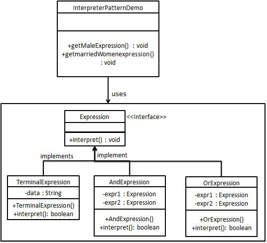
### java
**步骤 1**
创建一个表达式接口。

Expression.java
```java
public interface Expression {
   public boolean interpret(String context);
}

```

步骤 2
创建实现了上述接口的实体类。

TerminalExpression.java
```java
public class TerminalExpression implements Expression {
   
   private String data;
 
   public TerminalExpression(String data){
      this.data = data; 
   }
 
   @Override
   public boolean interpret(String context) {
      if(context.contains(data)){
         return true;
      }
      return false;
   }
}
```

OrExpression.java
```java
public class OrExpression implements Expression {
    
   private Expression expr1 = null;
   private Expression expr2 = null;
 
   public OrExpression(Expression expr1, Expression expr2) { 
      this.expr1 = expr1;
      this.expr2 = expr2;
   }
 
   @Override
   public boolean interpret(String context) {      
      return expr1.interpret(context) || expr2.interpret(context);
   }
}
```

AndExpression.java
```java
public class AndExpression implements Expression {
    
   private Expression expr1 = null;
   private Expression expr2 = null;
 
   public AndExpression(Expression expr1, Expression expr2) { 
      this.expr1 = expr1;
      this.expr2 = expr2;
   }
 
   @Override
   public boolean interpret(String context) {      
      return expr1.interpret(context) && expr2.interpret(context);
   }
}
```

步骤 3
InterpreterPatternDemo 使用 Expression 类来创建规则，并解析它们。

InterpreterPatternDemo.java
```java
public class InterpreterPatternDemo {
 
   //规则：Robert 和 John 是男性
   public static Expression getMaleExpression(){
      Expression robert = new TerminalExpression("Robert");
      Expression john = new TerminalExpression("John");
      return new OrExpression(robert, john);    
   }
 
   //规则：Julie 是一个已婚的女性
   public static Expression getMarriedWomanExpression(){
      Expression julie = new TerminalExpression("Julie");
      Expression married = new TerminalExpression("Married");
      return new AndExpression(julie, married);    
   }
 
   public static void main(String[] args) {
      Expression isMale = getMaleExpression();
      Expression isMarriedWoman = getMarriedWomanExpression();
 
      System.out.println("John is male? " + isMale.interpret("John"));
      System.out.println("Julie is a married women? " 
      + isMarriedWoman.interpret("Married Julie"));
   }
}
```

**步骤 4**
执行程序，输出结果：
```shell
John is male? true
Julie is a married women? true
```
### rust
```rs
// 声明表达式特征
trait  Expression{
    fn interpret(&self,context:&str)->bool ;
}
struct TerminalExpression{
    data:String,
}
impl Expression for TerminalExpression {
    fn interpret(&self,context:&str)->bool  {
        if context==self.data {
           return true; 
        }
        false
    }
}
// 创建或规则
struct OrExpression{
    expr1:Box<dyn Expression>,
    expr2:Box<dyn Expression>,
}
impl Expression for OrExpression {
    fn interpret(&self,context:&str)->bool  {
        self.expr1.interpret(context)||self.expr2.interpret(context)
    }
}
// 创建和规则
struct AndExpression{
    expr1:Box<dyn Expression>,
    expr2:Box<dyn Expression>,
}
impl Expression for AndExpression {
    fn interpret(&self,context:&str)->bool  {
        self.expr1.interpret(context)&&self.expr2.interpret(context)
    }
}
//规则：Robert 和 John 是男性
fn get_male_expression()->OrExpression{
    OrExpression { 
    expr1: Box::new(TerminalExpression{
        data:"Robert".to_owned()
    }), 
    expr2: Box::new(TerminalExpression{
        data:"John".to_owned()
    }),
 }
}
  //规则：Julie 是一个已婚的女性
fn get_married_woman_expression()->AndExpression{
    AndExpression { 
    expr1: Box::new(TerminalExpression{
        data:"Julie".to_owned()
    }), 
    expr2: Box::new(TerminalExpression{
        data:"Married".to_owned()
    }),
 }
}
fn main() {
    let is_male=get_male_expression();
    let is_married_woman=get_married_woman_expression();
    println!("John is male? {}",is_male.interpret("John"));
    println!("Julie is a married women? {}",is_married_woman.interpret("Married Julie"))
}
```
## 迭代器模式
迭代器模式（Iterator Pattern）这种模式用于顺序访问集合对象的元素，不需要知道集合对象的底层表示。

### 介绍
- **意图**：提供一种方法顺序访问一个聚合对象中各个元素, 而又无须暴露该对象的内部表示。

- **主要解决**：不同的方式来遍历整个整合对象。
- **优点**： 1、它支持以不同的方式遍历一个聚合对象。 2、迭代器简化了聚合类。 3、在同一个聚合上可以有多个遍历。 4、在迭代器模式中，增加新的聚合类和迭代器类都很方便，无须修改原有代码。

- **缺点**：由于迭代器模式将存储数据和遍历数据的职责分离，增加新的聚合类需要对应增加新的迭代器类，类的个数成对增加，这在一定程度上增加了系统的复杂性。


### 实现
我们将创建一个叙述导航方法的 Iterator 接口和一个返回迭代器的 Container 接口。实现了 Container 接口的实体类将负责实现 Iterator 接口。

IteratorPatternDemo，我们的演示类使用实体类 NamesRepository 来打印 NamesRepository 中存储为集合的 Names。

迭代器模式的 UML 图
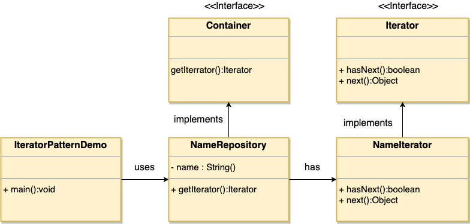
步骤 1
创建接口:

Iterator.java
public interface Iterator {
   public boolean hasNext();
   public Object next();
}
Container.java
public interface Container {
   public Iterator getIterator();
}
步骤 2
创建实现了 Container 接口的实体类。该类有实现了 Iterator 接口的内部类 NameIterator。

NameRepository.java
public class NameRepository implements Container {
   public String[] names = {"Robert" , "John" ,"Julie" , "Lora"};
 
   @Override
   public Iterator getIterator() {
      return new NameIterator();
   }
 
   private class NameIterator implements Iterator {
 
      int index;
 
      @Override
      public boolean hasNext() {
         if(index < names.length){
            return true;
         }
         return false;
      }
 
      @Override
      public Object next() {
         if(this.hasNext()){
            return names[index++];
         }
         return null;
      }     
   }
}
步骤 3
使用 NameRepository 来获取迭代器，并打印名字。

IteratorPatternDemo.java
public class IteratorPatternDemo {
   
   public static void main(String[] args) {
      NameRepository namesRepository = new NameRepository();
 
      for(Iterator iter = namesRepository.getIterator(); iter.hasNext();){
         String name = (String)iter.next();
         System.out.println("Name : " + name);
      }  
   }
}
步骤 4
执行程序，输出结果：

Name : Robert
Name : John
Name : Julie
Name : Lora

# 模板方法
**模板方法**定义一个操作中的算法的骨架，而将这一些步骤延迟到子类中。模板方式使得子类可以不改变一个算法的结构可重新定义该算法的某些特定步骤。
# 迪米特法则
**迪米特法则**如果两个类不必彼此直接通信，那么这两个类就不应当发生直接的相互作用。如果其中一个类需要调用另一个类的某一个方法的话，可以通过第三者转发这个调用。

# 外观
**外观模式**：为子系统中的一组接口提供一个一致的界面，此模式定义了一个高层接口，这个接口使得这一子系统更加容易使用。

## 何时使用外观模式

首先，在设计初期阶段，应该要有意识的将不同的两个层分离，其次，开发阶段，子系统往往因为不断地重构演化而变得越来越复杂，增加外观Facade可以提供一个及暗淡的接口，减少它们之间的依赖，第三，在维护一个遗留的大型系统时，可能这个系统已经非常难以维护和拓展了，可以为新系统开发一个外观Facade类，来提供设计粗糙或者高度复杂的遗留代码的比较清晰简单的接口，让新系统与Facade对象交互，Facade与遗留代码交互所有复杂的工作。


# 建造者模式
 
**建造者模式**将一个复杂对象的构建与它的表示分离，使得同样的构建过程可以创建不同的的表示。

# 观察者模式
**观察者模式**又叫发布-订阅模式： 定义了一种一对多的依赖关系，让多个观察对象同时监听某一个主题对象，这个主题对象在状态发生变化时，会通知所有观察者对象，使他们能够自动更新自己，

## 事件委托
委托就是一种引用方法的类型。一旦为委托分配了方法，委托将于该方法具有完全相同的行为，委托方法的使用，可以像其他任何方法一样，具有参数和返回值。委托可以看作是对函数的抽象，是函数的“类”，委托的实例将代表一个具体的函数。  


# 状态模式
**状态模式**，当一个对象的内在状态改变时允许改变其行为，这个对象看起来是改变了其类。
"状态模式主要解决的是当时控制一个对象的状态转换的条件表达式过于复杂的情况。把状态的判断逻辑转移到表示不同的一系列类中，可以把复杂的判断逻辑简化。

# 设配器模式
**适配器模式**： 将一个类的接口转换成客户希望的另外一个接口，Adaper模式使得原本不兼容而不能一起工作的那些类可以一起工作。
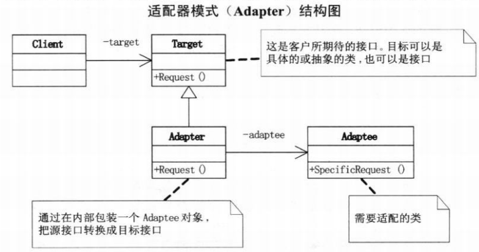

# 备忘录
**备忘录**：在不破坏封装性的前提下，捕获一个对家的内部状态，并在该对象之外保存这个状态。这样以后就可将该对象恢复到原先保存的状态。
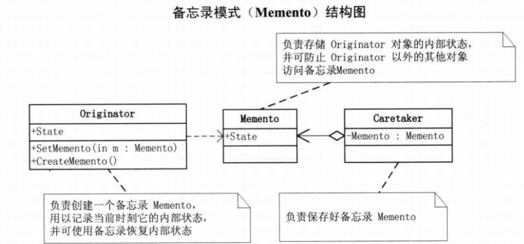

# 组合模式
**组合模式**：将对象组合成树形结构以表示‘部分-整体’的层次结构，组合模式使得用户对单个对象和组合对象的使用具有一致性。
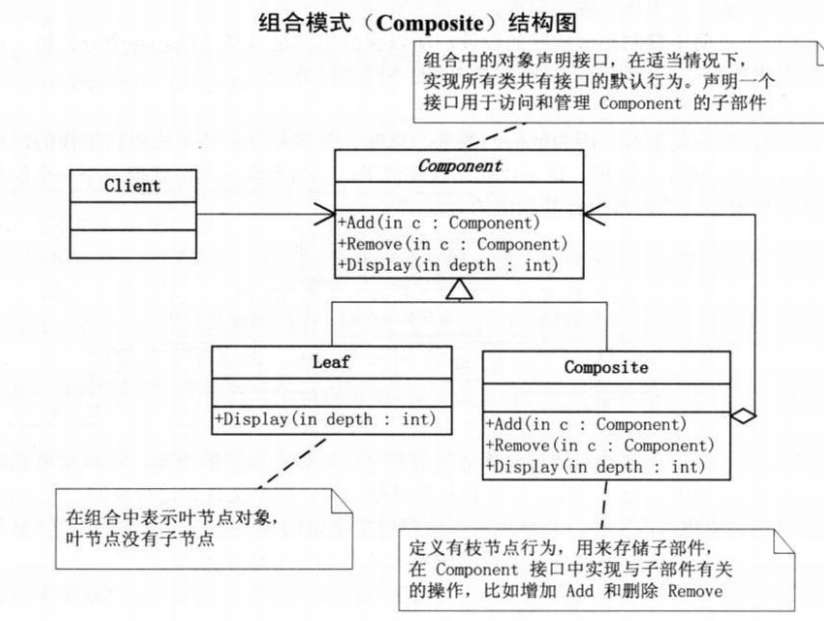

# 迭代器模式
**迭代器模式**：提供一种方法顺序访问一个聚合对象中各个元素，而又不暴露该对象的内部表示。

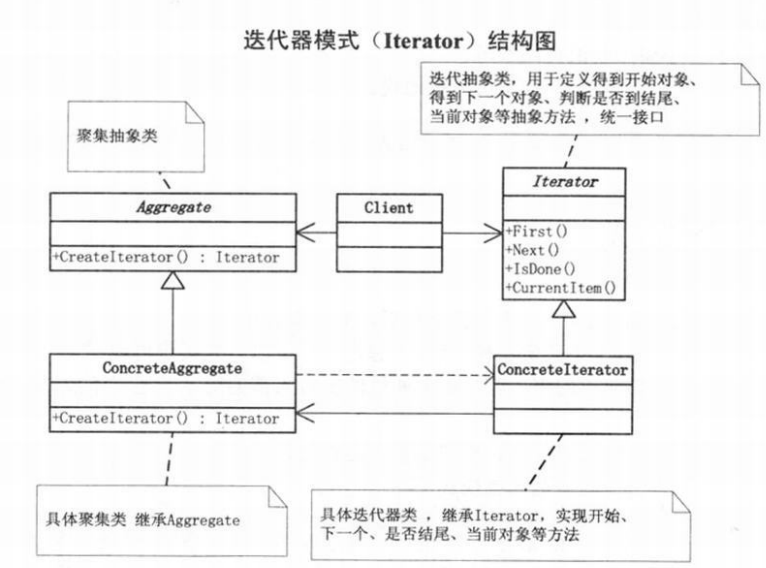

# 单例模式
保证一个类只有一个实例，并提供一个访问它的全局访问点。


# 桥接模式
**合成/聚合复用原则** 尽量使用合成/聚合，尽量不要使用类继承。


**桥接模式**；将抽象部分与他的实现部分分离，使他们都可以独立的变化。
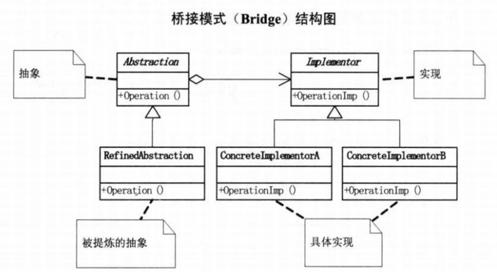

# 命令模式、
**命令行模式**：将一个请求对象封装成一个对象，从而使你可用不同的请求对客户进行参数化，对请求排队或记录请求日志，以及支持可撤销的操作。


# 职责链模式

**职责链模式**：使多个对象都有机会处理请求，从而避免发送者和接收者之间的耦合关系。将这个对象连成一条链，并沿着这条链传递该请求，直到有一个对象处理它为止。
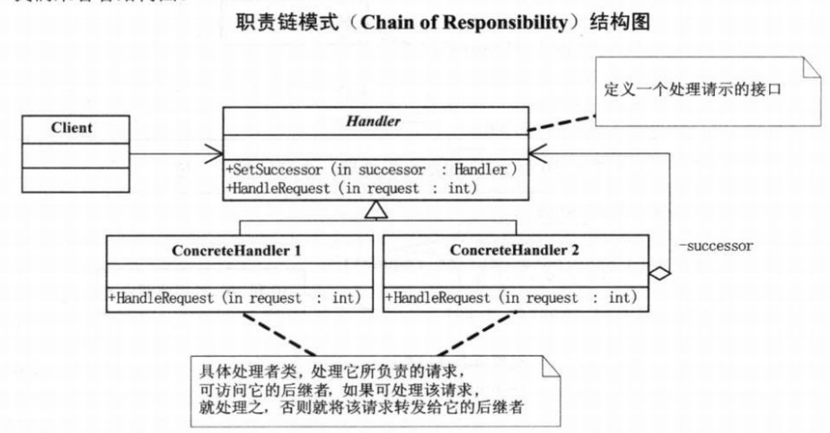

# 中介者模式
**中介者模式**：用中介对象封装一系列对象交互。中介者使各对象不需要显式的互相引用，从而使其耦合松散，而且可以独立的改变他们之间的交互。
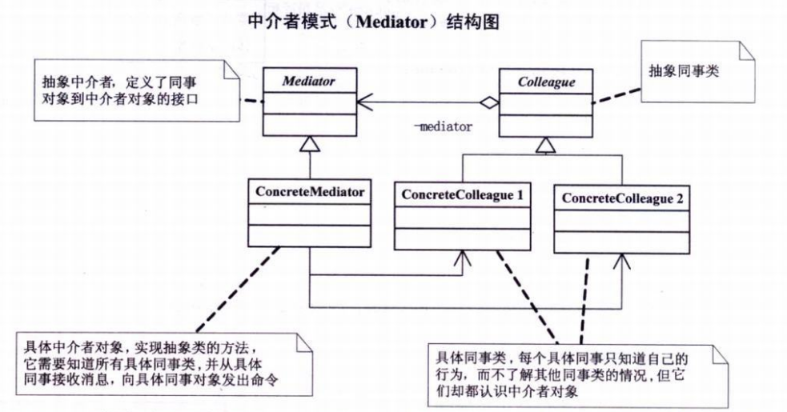

# 享元模式
**享元模式**：运用共享技术有效的支持大量细粒度的对象。
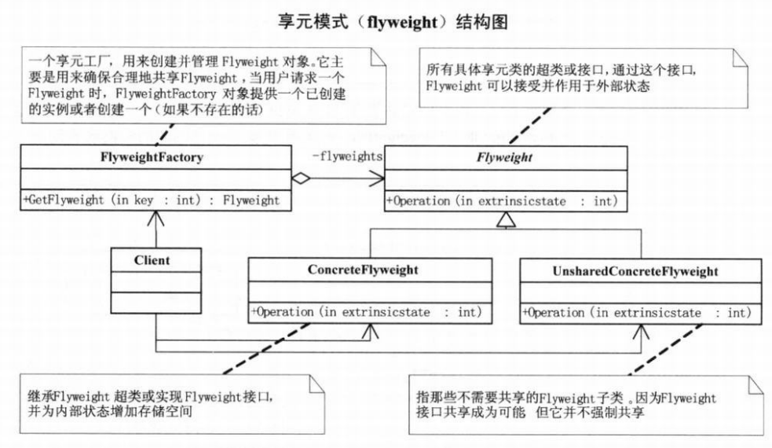

享元模式可以避免大量非常相似类的开销。在程序设计中，有时需要生成大量细粒度的类实例来表示数据。如果能发现这些实例除了几个参数外基本上都是相同的，有时就能够受大幅度的减少需要实例化的类的数量。如果能把能发现这些实例除了几个参数外基本都是相同的，有时就能够受大幅度的减少需要实例化类的数量。如果能把那些参数移到类实例外面，在方法调用时将他们传递进来吗，就可以通过共享大幅度地减少单个实例的数目。

# 解释器模式

**解释器模式**：给定一个语言，定义它的文法的一种表示，并定义一个解释器，这个解释器使用该表示来解释语言中的句子。

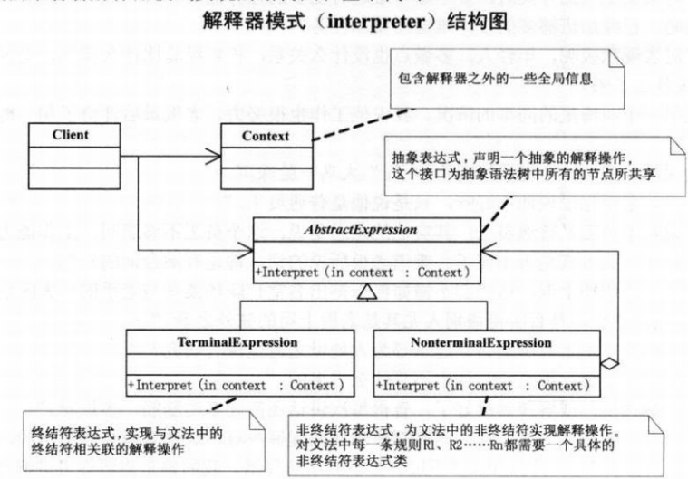

如果一种特定的的问题发生的频率足够高，那么可能就值得将该的=问题的各个实例表述未一个简单语言中的句子。

# 访问者模式

**访问者模式**:表示一个作用于某对象结构中的各元素的操作。它使你可以在不改变各元素的类的前提下定义作用于这些元素的新操作。

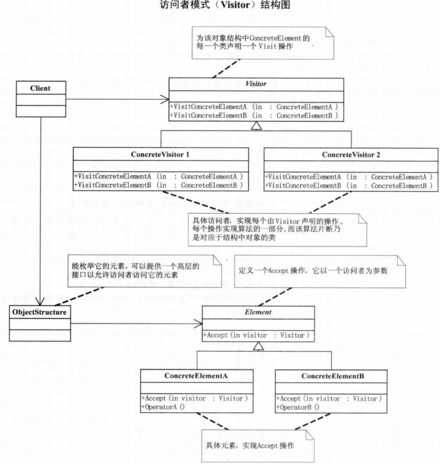