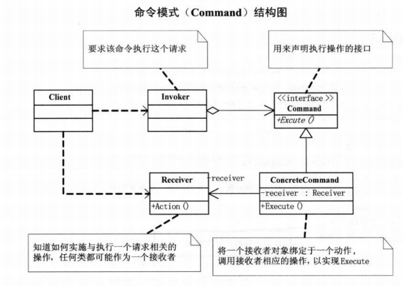

# 总结
## 创建型模式
这类模式提供创建对象的机制， 能够提升已有代码的灵活性和可复⽤性


## 结构型模式
这类模式介绍如何将对象和类组装成较⼤的结构， 并同时保持结构的灵活和⾼效。


## ⾏为模式
这类模式负责对象间的⾼效沟通和职责委派。


# 简单工厂模式
工厂模式有一种非常形象的描述，建立对象的类就如一个工厂，而需要被建立的对象就是一个个产品；在工厂中加工产品，使用产品的人，不用在乎产品是如何生产出来的。从软件开发的角度来说，这样就有效的降低了模块之间的耦合。

就如同写一个计算器，我们只需要为每个运算符添加指定的处理逻辑,然后再需要时实例化指定的操作符，进行解耦处理，防止在一个运算类中添加过多的代码，造成过耦合
```java
class OperationAdd:Operation
{
....
}
class OperationSub:Operation
{
....
}
....
public class OperationFactorty 
{
    public static Operation createOperate(string operate)
    {
        Opertaion oper = null ;
        switch(operate){
            case "+":
                oper=new OperationAddd();
            case "-":
                oper=new OperationSub();
            ......       
        }
    }
}
```

# 策略模式

**策略模式**：它定义了算法家族，分别封装起来，让他们之间可以互相转换，减少了各种算法类与使用算法类之间的耦合,此模式让算法发生变化，不会影响到使用算法的用户.
此外,策略模式简化了单元测试,因为每个算法都有自己的类,可以通过自己的接口进行单独测试.


```java
//抽象类算法
abstract class Strategy
{
    //算法方法
    public override void  AlgorithmInterface();
}
// 具体算法B
class ConcreteStrategyA:Strategy
{
    //算法B实现方法
    public override void  AlgorithmInterface();

}
class ConcreteStrategyC:Strategy
{
    //算法B实现方法
    public override void  AlgorithmInterface();

}

// Context,用一个ConcreteStrategy来配置，维护对一个Strategy对象的引用
class Context
{
    Strategy strategy;
    // 初始化，传入具体的策略对象
    public Context(Strategy strategy){
        this.strategy=strategy;
    }
    // 上下文接口，根据具体的策略对象，调用相应的算法
    public void ContextInterface()
    {
        strategy. AlgorithmInterface();
    }
}
```
# 单一职责原则

单一职责原则：就一个类而言，应该仅有一个引起它变化的原因。

如果一个类承担的责任过多，就等于把这些职责耦合在一起，一个职责的变化可能削弱或者抑制这个类完成其他职责的能力。这种耦合会导致脆弱的设计，发生变化时，设计会遭受意想不到的破坏。

# 开放-封闭原则
开放-封闭原则：软件实体（类，模块，函数等等）是可以扩展的，但是不可修改。

无论模块是多么 的封闭，都会存在一些无法对之封闭的目录，既然不可能完全封闭，设计人员必须对于他设计的模块应该对哪种变化封闭做出选择。他必须先猜测出最有可能发生变化的种类，然后用抽象隔离那些变化。

在我们编写程序时，假设变化不会发生，当变化发生时，我们就创建抽象来隔离以后发生的同类变化。

# 依赖倒转原则
**依赖倒转**：可以说是面向对象设计的标志，用那种语言来编写程序并不重要，如果编写时考虑的如何针对抽象编程而不是针对细节编程，即程序中所有依赖关系都是终止抽象类或接口，那就是面向对象的设计，反之就是过程化的设计。
**里氏代换原则**：子类必须能够替换掉它们的符类型。


# 装饰模式
**装饰模式**：动态的给一个对象添加一些额外的职责，就增加功能来说，装饰模式比生成子类更为灵活。

装饰类的核心就是把类的核心职责和装饰功能区分开，而且可以去除相关的类中的重复的装饰逻辑。

# 代理模式
**代理模式**为其他对象提供一种代理控制对这个对象访问。


**远程代理**:也就是为一个对象在不同的地址空间提供局部代表。这样可以隐藏对象在于不同地址空间的事实。

**虚拟代理**:根据需要创建开销很大的对象，通过他来存放实例化需要很长时间的真实对象。

**安全代理**:用来控制真实对象访问时的权限。

**智能指引** ：指当调用真实的对象，代理处理另外一些事。

# 工厂模式
简单工厂模式的最大优点在于工厂类中包含了必要的判断逻辑，根据客户端的选择条件动态实列相关的类，对于客户端来说，去除了与具体产品的太依赖。

工厂方法模式，定义一个用于创建对象的接口，让子类决定实例化哪一个类。工厂方法使一个类实例化延迟到子类。

# 原型模式

**原型模式**:用原型实例指定创建对象的种类，并且通过拷贝这些原型创建新的对象。

# 模板方法
**模板方法**定义一个操作中的算法的骨架，而将这一些步骤延迟到子类中。模板方式使得子类可以不改变一个算法的结构可重新定义该算法的某些特定步骤。
# 迪米特法则
**迪米特法则**如果两个类不必彼此直接通信，那么这两个类就不应当发生直接的相互作用。如果其中一个类需要调用另一个类的某一个方法的话，可以通过第三者转发这个调用。

# 外观
**外观模式**：为子系统中的一组接口提供一个一致的界面，此模式定义了一个高层接口，这个接口使得这一子系统更加容易使用。

## 何时使用外观模式

首先，在设计初期阶段，应该要有意识的将不同的两个层分离，其次，开发阶段，子系统往往因为不断地重构演化而变得越来越复杂，增加外观Facade可以提供一个及暗淡的接口，减少它们之间的依赖，第三，在维护一个遗留的大型系统时，可能这个系统已经非常难以维护和拓展了，可以为新系统开发一个外观Facade类，来提供设计粗糙或者高度复杂的遗留代码的比较清晰简单的接口，让新系统与Facade对象交互，Facade与遗留代码交互所有复杂的工作。


# 建造者模式
 
**建造者模式**将一个复杂对象的构建与它的表示分离，使得同样的构建过程可以创建不同的的表示。

# 观察者模式
**观察者模式**又叫发布-订阅模式： 定义了一种一对多的依赖关系，让多个观察对象同时监听某一个主题对象，这个主题对象在状态发生变化时，会通知所有观察者对象，使他们能够自动更新自己，

## 事件委托
委托就是一种引用方法的类型。一旦为委托分配了方法，委托将于该方法具有完全相同的行为，委托方法的使用，可以像其他任何方法一样，具有参数和返回值。委托可以看作是对函数的抽象，是函数的“类”，委托的实例将代表一个具体的函数。  

# 抽象工厂模式
**抽象工厂模式**，提供一个创建一系列相关或相互依赖的对象接口，而无需指定他们具体的类。

## 好处
1. 易于交换产品系列，由于具体工厂类，在一个应用中只需要初始化一次，这就使得改变一个应用的具体工厂变得十分容易。
2. 它让具体的创建实例过程与客户端分离，客户端是通过它们的抽象接口操作实例，产品的具体名称，也被具体工厂的实现分离，不会出现在客户端的代码中。


# 状态模式
**状态模式**，当一个对象的内在状态改变时允许改变其行为，这个对象看起来是改变了其类。
"状态模式主要解决的是当时控制一个对象的状态转换的条件表达式过于复杂的情况。把状态的判断逻辑转移到表示不同的一系列类中，可以把复杂的判断逻辑简化。

# 设配器模式
**适配器模式**： 将一个类的接口转换成客户希望的另外一个接口，Adaper模式使得原本不兼容而不能一起工作的那些类可以一起工作。


# 备忘录
**备忘录**：在不破坏封装性的前提下，捕获一个对家的内部状态，并在该对象之外保存这个状态。这样以后就可将该对象恢复到原先保存的状态。


# 组合模式
**组合模式**：将对象组合成树形结构以表示‘部分-整体’的层次结构，组合模式使得用户对单个对象和组合对象的使用具有一致性。


# 迭代器模式
**迭代器模式**：提供一种方法顺序访问一个聚合对象中各个元素，而又不暴露该对象的内部表示。


# 单例模式
保证一个类只有一个实例，并提供一个访问它的全局访问点。


# 桥接模式
**合成/聚合复用原则** 尽量使用合成/聚合，尽量不要使用类继承。


**桥接模式**；将抽象部分与他的实现部分分离，使他们都可以独立的变化。


# 命令模式、
**命令行模式**：将一个请求对象封装成一个对象，从而使你可用不同的请求对客户进行参数化，对请求排队或记录请求日志，以及支持可撤销的操作。


# 职责链模式

**职责链模式**：使多个对象都有机会处理请求，从而避免发送者和接收者之间的耦合关系。将这个对象连成一条链，并沿着这条链传递该请求，直到有一个对象处理它为止。


# 中介者模式
**中介者模式**：用中介对象封装一系列对象交互。中介者使各对象不需要显式的互相引用，从而使其耦合松散，而且可以独立的改变他们之间的交互。


# 享元模式
**享元模式**：运用共享技术有效的支持大量细粒度的对象。


享元模式可以避免大量非常相似类的开销。在程序设计中，有时需要生成大量细粒度的类实例来表示数据。如果能发现这些实例除了几个参数外基本上都是相同的，有时就能够受大幅度的减少需要实例化的类的数量。如果能把能发现这些实例除了几个参数外基本都是相同的，有时就能够受大幅度的减少需要实例化类的数量。如果能把那些参数移到类实例外面，在方法调用时将他们传递进来吗，就可以通过共享大幅度地减少单个实例的数目。

# 解释器模式

**解释器模式**：给定一个语言，定义它的文法的一种表示，并定义一个解释器，这个解释器使用该表示来解释语言中的句子。


如果一种特定的的问题发生的频率足够高，那么可能就值得将该的=问题的各个实例表述未一个简单语言中的句子。

# 访问者模式

**访问者模式**:表示一个作用于某对象结构中的各元素的操作。它使你可以在不改变各元素的类的前提下定义作用于这些元素的新操作。

